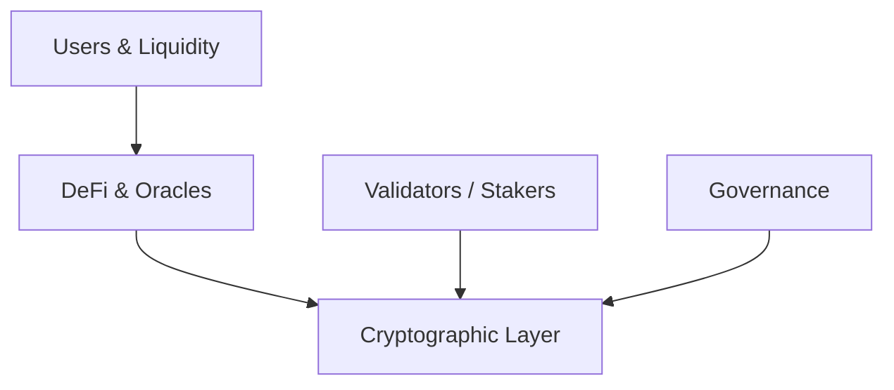
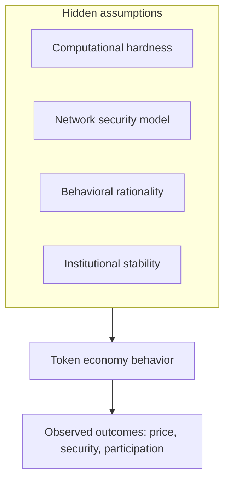
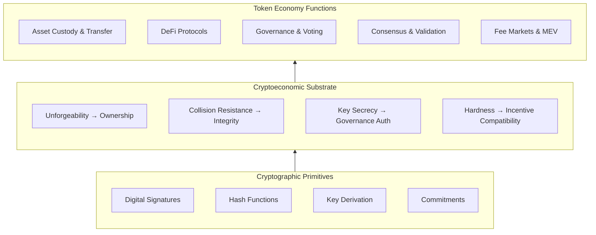
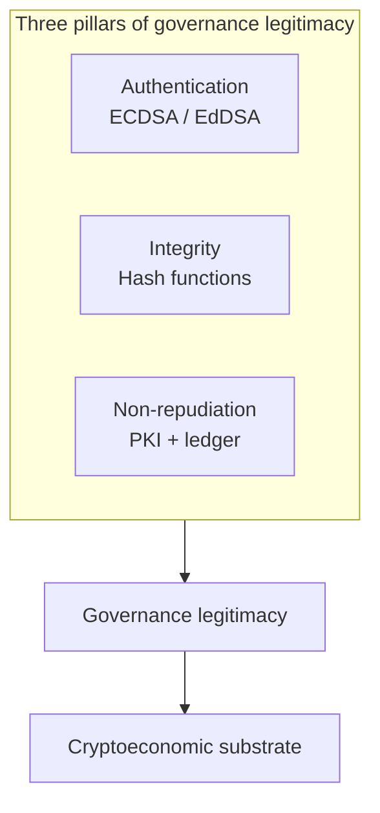
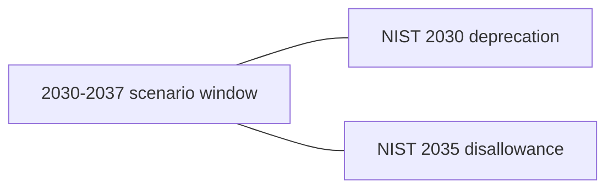

# Tokenomics in the Quantum Age
## Designing Resilient Digital Economies Against Quantum Threats

**By Nagnath Savant**

---

*A comprehensive analysis of how quantum computing will reshape the economic foundations of blockchain systems, and what token economy designers, investors, and policymakers must do to prepare.*

---

© 2026 Nagnath Savant. All rights reserved.

---

# Executive Summary

*Two-page overview for boards, regulators, and fund risk committees. Full analysis in the body and appendices.*

## The problem

Token economies treat cryptography as infrastructure, not packaging. A cryptographically relevant quantum computer (CRQC) breaks ECDLP-class signatures that underpin ownership, staking slashing evidence, governance votes, oracle attestations, and bridge thresholds. Engineering migration to post-quantum algorithms (PQC) is necessary but **insufficient**: larger signatures and uncertain timelines change fees, participation, legitimacy, and market confidence.

## What is at stake

- **Value exposure:** Coins and positions in addresses with exposed public keys; bridge and oracle TVL.  
- **Functional exposure:** Consensus, DeFi, governance, and interoperability.  
- **Policy exposure:** NIST-style **2030 deprecation** and **2035 disallowance** timelines overlap expert CRQC estimate windows (**2030–2037**, scenario).

## Core frameworks (book)

| Framework | Use |
|-----------|-----|
| **Cryptoeconomic substrate** | Map primitives → economic properties |
| **SCR** | Signature cost ratio for capacity and fees |
| **QEE / QRI** | Exposure inventory and readiness index |
| **Migration coordination game** | Align users, validators, issuers, regulators |

## Recommended 12-month program

| Quarter | Deliverable |
|---------|-------------|
| Q1 | Complete Appendix B QEE; assign RACI (Appendix F); baseline SCR |
| Q2 | Algorithm shortlist vs NIST FIPS 203–205; testnet PQC fork |
| Q3 | Governance tabletop (Ch. 10); publish migration triggers |
| Q4 | Public dashboard: % value migrated; regulatory mapping (App. D) |

## Decision principles

1. **Do not wait for certainty**, policy clocks are already moving.  
2. **Design for confidence**, not only correct math, markets fail before keys are exploited.  
3. **Coordinate vertically**, L1, L2, bridges, oracles, issuers, custodians.  
4. **Label uncertainty**, separate (Data), (Estimate), and (Scenario) in all external materials.

## Verdict for leadership

Organizations that treat PQC as a patch will face governance and economic failure modes that patches cannot fix. Organizations that run QEE-driven programs with explicit EMC budgets (Appendix G) and RACI ownership (Appendix F) can preserve incentive compatibility and institutional trust through cryptographic regime change.

---

---

## About This Book

Professional readers: protocol engineers, token economists, risk officers, investors, policymakers. Each chapter has **Chapter at a Glance**, **Chapter Exercises**, and **Appendix E** (solutions).

| Label | Meaning |
|-------|---------|
| **(Data, year)** | Verify before print |
| **(Estimate)** | Modeled illustration |
| **(Scenario)** | Stress-test assumption |

**Companion files:** `ART_BRIEF.md`, `FACT_CHECK_MANIFEST.md`, `tools/qri_stress_model.csv`.

## Legal and Professional Disclaimer

This book is for educational and professional analysis only. It does not constitute investment, legal, tax, or compliance advice. Protocol parameters, market data, and regulatory deadlines change frequently. Readers responsible for migration, treasury, or policy decisions must verify all figures against primary sources and qualified advisors in their jurisdiction.

---
# Table of Contents

*Detailed outline (H1–H3).*

- [Preface](#preface)
  - [Why This Book Became Necessary](#why-this-book-became-necessary)
  - [What This Book Is and What It Is Not](#what-this-book-is-and-what-it-is-not)
    - [How This Book Differs from Related Works](#how-this-book-differs-from-related-works)
  - [Living With Uncertainty](#living-with-uncertainty)
  - [Who This Book Is For](#who-this-book-is-for)
  - [A Note on Terminology](#a-note-on-terminology)
  - [Acknowledgments](#acknowledgments)
- [Introduction](#introduction)
  - [The Day the Signatures Break](#the-day-the-signatures-break)
  - [The Core Thesis](#the-core-thesis)
  - [Preview: The Cryptoeconomic Substrate](#preview-the-cryptoeconomic-substrate)
  - [Why Not Just Swap the Algorithms?](#why-not-just-swap-the-algorithms)
  - [The Structure of the Argument](#the-structure-of-the-argument)
  - [What This Book Contributes](#what-this-book-contributes)
  - [A Note on Uncertainty](#a-note-on-uncertainty)
- [PART I: FOUNDATIONS](#part-i-foundations)
- [Chapter 1: The Architecture of Token Economies](#chapter-1-the-architecture-of-token-economies)
  - [Token Economies as Coordination Mechanisms](#token-economies-as-coordination-mechanisms)
  - [The Anatomy of a Token Economy](#the-anatomy-of-a-token-economy)
    - [Supply Architecture](#supply-architecture)
    - [Distribution Mechanics](#distribution-mechanics)
    - [Incentive Structures](#incentive-structures)
    - [Value Accrual Mechanisms](#value-accrual-mechanisms)
    - [Governance Integration](#governance-integration)
  - [The Token Velocity Problem](#the-token-velocity-problem)
  - [Dual-Token and Multi-Token Models](#dual-token-and-multi-token-models)
  - [The Hidden Assumptions](#the-hidden-assumptions)
    - [Computational Hardness Assumptions](#computational-hardness-assumptions)
    - [Network Security Assumptions](#network-security-assumptions)
    - [Behavioral Assumptions](#behavioral-assumptions)
    - [Institutional Assumptions](#institutional-assumptions)
    - [The Interdependence of Assumptions](#the-interdependence-of-assumptions)
  - [Designing Without Certainty](#designing-without-certainty)
- [Chapter 2: Cryptographic Foundations of Economic Trust](#chapter-2-cryptographic-foundations-of-economic-trust)
  - [Digital Signatures as Economic Primitives](#digital-signatures-as-economic-primitives)
    - [How ECDSA Works: A Conceptual Treatment](#how-ecdsa-works-a-conceptual-treatment)
    - [Ownership, Authorization, Non-Repudiation, and Cost](#ownership-authorization-non-repudiation-and-cost)
  - [Hash Functions as Economic Infrastructure](#hash-functions-as-economic-infrastructure)
    - [SHA-256 and the Mining Economy](#sha-256-and-the-mining-economy)
    - [Address Derivation and Privacy Economics](#address-derivation-and-privacy-economics)
    - [Merkle Trees and Verification Economics](#merkle-trees-and-verification-economics)
    - [Commitment Schemes and Strategic Interaction](#commitment-schemes-and-strategic-interaction)
  - [Key Management as Governance Architecture](#key-management-as-governance-architecture)
    - [Single-Key Accounts](#single-key-accounts)
    - [Multisignature and Threshold Schemes](#multisignature-and-threshold-schemes)
    - [Hierarchical Deterministic Wallets](#hierarchical-deterministic-wallets)
    - [Key Complexity and the Adoption Frontier](#key-complexity-and-the-adoption-frontier)
  - [The Cryptoeconomic Substrate](#the-cryptoeconomic-substrate)
    - [Defining the Substrate](#defining-the-substrate)
    - [The Substrate as Analytical Tool](#the-substrate-as-analytical-tool)
  - [The Fragility Insight](#the-fragility-insight)
  - [Trust in Hardness: The Hidden Social Contract](#trust-in-hardness-the-hidden-social-contract)
  - [From Substrate to Strategy](#from-substrate-to-strategy)
- [Chapter 3: The Economics of Consensus and Validation](#chapter-3-the-economics-of-consensus-and-validation)
  - [Proof-of-Work as Economic System](#proof-of-work-as-economic-system)
    - [Mining as Economic Competition](#mining-as-economic-competition)
    - [Fee Markets in Proof-of-Work](#fee-markets-in-proof-of-work)
    - [The Security Budget Problem](#the-security-budget-problem)
    - [SHA-256: More Than a Security Tool](#sha-256-more-than-a-security-tool)
  - [Proof-of-Stake as Economic System](#proof-of-stake-as-economic-system)
    - [Staking Economics](#staking-economics)
    - [Validator Economics](#validator-economics)
    - [Slashing as Enforcement](#slashing-as-enforcement)
    - [The Nothing-at-Stake Problem](#the-nothing-at-stake-problem)
    - [Ethereum's Implementation](#ethereums-implementation)
  - [Fee Markets and Block Space Economics](#fee-markets-and-block-space-economics)
    - [EIP-1559 and the Base Fee](#eip-1559-and-the-base-fee)
    - [Fee Burning as Monetary Policy](#fee-burning-as-monetary-policy)
    - [The Computational Cost of Signature Verification](#the-computational-cost-of-signature-verification)
  - [Maximal Extractable Value](#maximal-extractable-value)
    - [What MEV Is and Why It Matters](#what-mev-is-and-why-it-matters)
    - [MEV as Economic Signal](#mev-as-economic-signal)
    - [Signature Verification and MEV Dynamics](#signature-verification-and-mev-dynamics)
    - [Proposer-Builder Separation](#proposer-builder-separation)
  - [Cross-Chain and Bridge Economics](#cross-chain-and-bridge-economics)
    - [Bridges as Economic Infrastructure](#bridges-as-economic-infrastructure)
    - [Cryptographic Dependencies of Bridges](#cryptographic-dependencies-of-bridges)
    - [Bridge Exploits as Evidence](#bridge-exploits-as-evidence)
  - [The Consensus-Cryptography Nexus](#the-consensus-cryptography-nexus)
    - [Interdependence and Systemic Risk](#interdependence-and-systemic-risk)
    - [Quantifying the Nexus: Toward a Framework](#quantifying-the-nexus-toward-a-framework)
  - [The Inseparability of Consensus and Cryptography](#the-inseparability-of-consensus-and-cryptography)
- [Chapter 4: Governance as Economic Infrastructure](#chapter-4-governance-as-economic-infrastructure)
  - [The Price of a Vote](#the-price-of-a-vote)
  - [Governance as Mechanism Design](#governance-as-mechanism-design)
    - [Beyond Voting](#beyond-voting)
    - [Token-Weighted Voting and Its Discontents](#token-weighted-voting-and-its-discontents)
    - [Alternative Mechanisms and Their Economic Properties](#alternative-mechanisms-and-their-economic-properties)
    - [Delegation and the Economics of Attention](#delegation-and-the-economics-of-attention)
    - [Constitutional Constraints](#constitutional-constraints)
  - [The Economics of Governance Participation](#the-economics-of-governance-participation)
    - [Rational Apathy](#rational-apathy)
    - [The Cost Structure of On-Chain Governance](#the-cost-structure-of-on-chain-governance)
    - [Governance Mining and Participation Incentives](#governance-mining-and-participation-incentives)
    - [Governance Extractable Value](#governance-extractable-value)
  - [DAO Treasury Management](#dao-treasury-management)
    - [Scale and Stakes](#scale-and-stakes)
    - [The Principal-Agent Problem in Treasury Management](#the-principal-agent-problem-in-treasury-management)
    - [Multisignature Security and Its Cryptographic Dependencies](#multisignature-security-and-its-cryptographic-dependencies)
  - [Governance Attacks and Economic Consequences](#governance-attacks-and-economic-consequences)
    - [Flash Loan Governance Attacks](#flash-loan-governance-attacks)
    - [Vote Markets and Bribery](#vote-markets-and-bribery)
    - [Governance Capture](#governance-capture)
  - [The Cryptographic Foundations of Governance Legitimacy](#the-cryptographic-foundations-of-governance-legitimacy)
    - [Three Pillars](#three-pillars)
    - [The Interdependence of the Three Pillars](#the-interdependence-of-the-three-pillars)
  - [Governance and the Cryptoeconomic Substrate](#governance-and-the-cryptoeconomic-substrate)
    - [Governance as the Human-Facing Layer](#governance-as-the-human-facing-layer)
    - [Mapping Governance Functions to Cryptographic Dependencies](#mapping-governance-functions-to-cryptographic-dependencies)
    - [Retroactive Uncertainty](#retroactive-uncertainty)
  - [The Institutional Economics of Protocol Governance](#the-institutional-economics-of-protocol-governance)
    - [Governance as Institutional Infrastructure](#governance-as-institutional-infrastructure)
    - [The Governance Premium](#the-governance-premium)
  - [The Weight of Governance](#the-weight-of-governance)
- [PART II: QUANTUM DISRUPTION](#part-ii-quantum-disruption)
- [Chapter 5: Quantum Computing, Capabilities, Timelines, and Uncertainties](#chapter-5-quantum-computing-capabilities-timelines-and-uncertainties)
  - [The Quantum Computing Paradigm](#the-quantum-computing-paradigm)
    - [Shor's Algorithm: The Existential Threat](#shors-algorithm-the-existential-threat)
    - [Grover's Algorithm: The Manageable Concern](#grovers-algorithm-the-manageable-concern)
  - [The Hardware Landscape](#the-hardware-landscape)
    - [Superconducting Qubits](#superconducting-qubits)
    - [Trapped Ion Systems](#trapped-ion-systems)
    - [Neutral Atom Arrays](#neutral-atom-arrays)
    - [Photonic Quantum Computing](#photonic-quantum-computing)
    - [Topological Quantum Computing](#topological-quantum-computing)
    - [The Error Correction Bottleneck](#the-error-correction-bottleneck)
  - [Timeline Estimates: A Framework for Uncertainty](#timeline-estimates-a-framework-for-uncertainty)
    - [The Mosca Inequality](#the-mosca-inequality)
    - [Current State (2026)](#current-state-2026)
    - [Near-Term: 2027–2031](#near-term-20272031)
    - [Medium-Term: 2031–2036](#medium-term-20312036)
    - [Long-Term: 2036 and Beyond](#long-term-2036-and-beyond)
    - [The Credibility Spectrum](#the-credibility-spectrum)
  - [What Quantum Computing Is Not](#what-quantum-computing-is-not)
    - [Not a Universal Speedup](#not-a-universal-speedup)
    - [Not Guaranteed to Succeed on Current Trajectories](#not-guaranteed-to-succeed-on-current-trajectories)
    - [Not Necessarily a Sudden Event](#not-necessarily-a-sudden-event)
    - [Not Only a Threat](#not-only-a-threat)
    - [Not Evenly Distributed](#not-evenly-distributed)
  - [The Planning Paradox](#the-planning-paradox)
  - [The NIST Transition as a Planning Anchor](#the-nist-transition-as-a-planning-anchor)
  - [The Honest Assessment](#the-honest-assessment)
- [Chapter 6: The Quantum Threat Surface of Token Economies](#chapter-6-the-quantum-threat-surface-of-token-economies)
  - [Shor's Algorithm and the Ownership Crisis](#shors-algorithm-and-the-ownership-crisis)
    - [Bitcoin's Stratified Vulnerability](#bitcoins-stratified-vulnerability)
    - [Ethereum's Uniform Exposure](#ethereums-uniform-exposure)
    - [Economic Implications of Ownership Exposure](#economic-implications-of-ownership-exposure)
  - [Grover's Algorithm and Mining Economics](#grovers-algorithm-and-mining-economics)
    - [Theoretical Advantage](#theoretical-advantage)
    - [Practical Constraints](#practical-constraints)
    - [Economic Significance](#economic-significance)
  - [The Harvest-Now-Decrypt-Later Threat](#the-harvest-now-decrypt-later-threat)
  - [Staking and Validator Key Vulnerability](#staking-and-validator-key-vulnerability)
    - [Ethereum's BLS Signature Exposure](#ethereums-bls-signature-exposure)
    - [Economic Consequences of Validator Key Compromise](#economic-consequences-of-validator-key-compromise)
  - [Governance Key Vulnerability](#governance-key-vulnerability)
  - [Smart Contracts and DeFi Exposure](#smart-contracts-and-defi-exposure)
  - [Introducing Quantum Economic Exposure](#introducing-quantum-economic-exposure)
    - [Value Exposure](#value-exposure)
    - [Functional Exposure](#functional-exposure)
    - [Governance Exposure](#governance-exposure)
  - [Other Token Economies: Extending the QEE Analysis](#other-token-economies-extending-the-qee-analysis)
  - [Beyond Individual Vulnerabilities: The Interconnected Surface](#beyond-individual-vulnerabilities-the-interconnected-surface)
- [Chapter 7: Cascading Economic Consequences](#chapter-7-cascading-economic-consequences)
  - [The Confidence Crisis Precedes the Cryptographic Break](#the-confidence-crisis-precedes-the-cryptographic-break)
    - [The Quantum Confidence Premium](#the-quantum-confidence-premium)
    - [Historical Analogy: The Y2K Premium](#historical-analogy-the-y2k-premium)
  - [The Ownership Uncertainty Cascade](#the-ownership-uncertainty-cascade)
    - [Market Pricing Failure](#market-pricing-failure)
    - [Collateral Impairment](#collateral-impairment)
    - [Insurance Impossibility](#insurance-impossibility)
    - [Liquidity Death Spiral](#liquidity-death-spiral)
  - [Staking and Consensus Destabilization](#staking-and-consensus-destabilization)
    - [The Validator Exit Problem](#the-validator-exit-problem)
    - [The Slashing Inversion](#the-slashing-inversion)
    - [Consensus Finality Erosion](#consensus-finality-erosion)
  - [Governance Paralysis](#governance-paralysis)
    - [The Authorization Paradox](#the-authorization-paradox)
    - [The Legitimacy Retroactivity Problem](#the-legitimacy-retroactivity-problem)
    - [Governance Fragmentation](#governance-fragmentation)
  - [DeFi Contagion Dynamics](#defi-contagion-dynamics)
    - [Protocol Dependency Chains](#protocol-dependency-chains)
    - [The Stablecoin Nexus](#the-stablecoin-nexus)
    - [Bridge Failures as Systemic Risk Events](#bridge-failures-as-systemic-risk-events)
  - [Gradual Degradation Versus Acute Crisis](#gradual-degradation-versus-acute-crisis)
    - [The Gradual Degradation Scenario](#the-gradual-degradation-scenario)
    - [The Acute Crisis Scenario](#the-acute-crisis-scenario)
  - [Economic Migration Cost](#economic-migration-cost)
  - [The Systemic Perspective](#the-systemic-perspective)
- [Chapter 8: The post-quantum Cryptographic Landscape](#chapter-8-the-post-quantum-cryptographic-landscape)
  - [The NIST post-quantum Standards](#the-nist-post-quantum-standards)
    - [FIPS 203: ML-KEM (Module-Lattice-Based Key Encapsulation Mechanism)](#fips-203-ml-kem-module-lattice-based-key-encapsulation-mechanism)
    - [FIPS 204: ML-DSA (Module-Lattice-Based Digital Signature Algorithm)](#fips-204-ml-dsa-module-lattice-based-digital-signature-algorithm)
    - [FIPS 205: SLH-DSA (Stateless Hash-Based Digital Signature Algorithm)](#fips-205-slh-dsa-stateless-hash-based-digital-signature-algorithm)
  - [The Signature Cost Ratio](#the-signature-cost-ratio)
  - [Upcoming Standards and the Evolving Landscape](#upcoming-standards-and-the-evolving-landscape)
    - [FIPS 206: FN-DSA (FFT over NTRU-Lattice-Based Digital Signature Algorithm)](#fips-206-fn-dsa-fft-over-ntru-lattice-based-digital-signature-algorithm)
    - [HQC (Hamming Quasi-Cyclic)](#hqc-hamming-quasi-cyclic)
    - [Additional Signature Candidates](#additional-signature-candidates)
  - [Hash-Based Signatures for Blockchain](#hash-based-signatures-for-blockchain)
  - [Hybrid Cryptographic Approaches](#hybrid-cryptographic-approaches)
  - [Blockchain-Specific Implementation Challenges](#blockchain-specific-implementation-challenges)
    - [Block Size and Throughput](#block-size-and-throughput)
    - [State Growth](#state-growth)
    - [Account Abstraction as Migration Enabler](#account-abstraction-as-migration-enabler)
  - [Blockchain Projects Implementing post-quantum Cryptography](#blockchain-projects-implementing-post-quantum-cryptography)
  - [Cryptographic Agility as an Economic Imperative](#cryptographic-agility-as-an-economic-imperative)
  - [The Economic Arithmetic of Migration](#the-economic-arithmetic-of-migration)
- [PART III: REBUILDING TOKENOMICS](#part-iii-rebuilding-tokenomics)
- [Chapter 9: Redesigning Incentive Structures for Quantum Resilience](#chapter-9-redesigning-incentive-structures-for-quantum-resilience)
  - [The Incentive Preservation Constraint](#the-incentive-preservation-constraint)
  - [Staking Economics Under post-quantum Cryptography](#staking-economics-under-post-quantum-cryptography)
    - [The Changed Cost Structure](#the-changed-cost-structure)
    - [Staking Yield Recalibration](#staking-yield-recalibration)
    - [Slashing Under Quantum Conditions](#slashing-under-quantum-conditions)
  - [Fee Market Redesign](#fee-market-redesign)
    - [The EIP-1559 Mechanism Under PQC](#the-eip-1559-mechanism-under-pqc)
    - [Multi-Dimensional Fee Markets](#multi-dimensional-fee-markets)
    - [Layer 2 as PQC Cost Absorber](#layer-2-as-pqc-cost-absorber)
  - [Quantum-Aware Mechanism Design](#quantum-aware-mechanism-design)
    - [A Framework for Quantum-Aware Incentive Design](#a-framework-for-quantum-aware-incentive-design)
    - [Migration Incentive Mechanisms](#migration-incentive-mechanisms)
  - [Redesigning Value Accrual Under PQC](#redesigning-value-accrual-under-pqc)
    - [Fee Burn Mechanisms](#fee-burn-mechanisms)
    - [Staking Yield and Real Yield](#staking-yield-and-real-yield)
  - [The Quantum Readiness Index](#the-quantum-readiness-index)
    - [Dimension 1: Cryptographic Migration Status](#dimension-1-cryptographic-migration-status)
    - [Dimension 2: Economic Resilience](#dimension-2-economic-resilience)
    - [Dimension 3: Governance Adaptability](#dimension-3-governance-adaptability)
    - [Dimension 4: Stakeholder Coordination](#dimension-4-stakeholder-coordination)
  - [The Constructive Challenge](#the-constructive-challenge)
- [Chapter 10: Governance Transition Under Cryptographic Regime Change](#chapter-10-governance-transition-under-cryptographic-regime-change)
  - [The Governance Continuity Problem](#the-governance-continuity-problem)
  - [Historical Precedents for Governance Under Stress](#historical-precedents-for-governance-under-stress)
    - [The Bitcoin Block Size War (2015–2017)](#the-bitcoin-block-size-war-20152017)
    - [Ethereum's Merge (September 2022)](#ethereums-merge-september-2022)
    - [MakerDAO's Governance Crises](#makerdaos-governance-crises)
    - [Polkadot's OpenGov Migration (2023)](#polkadots-opengov-migration-2023)
    - [The Compound Governance Attack (2024)](#the-compound-governance-attack-2024)
  - [Designing for Governance Continuity](#designing-for-governance-continuity)
    - [Principle 1: Pre-Authorize Migration Authority](#principle-1-pre-authorize-migration-authority)
    - [Principle 2: Multi-Channel Governance](#principle-2-multi-channel-governance)
    - [Principle 3: Phased Migration with Governance Checkpoints](#principle-3-phased-migration-with-governance-checkpoints)
    - [Principle 4: Emergency Governance Provisions](#principle-4-emergency-governance-provisions)
  - [The Immovable Asset Problem](#the-immovable-asset-problem)
    - [Legal Analogies and Precedents](#legal-analogies-and-precedents)
  - [Governance Key Migration](#governance-key-migration)
    - [Token-Weighted Voting with PQC Keys](#token-weighted-voting-with-pqc-keys)
    - [Delegation Chain Complexity](#delegation-chain-complexity)
    - [Multisig Treasury Migration](#multisig-treasury-migration)
    - [Governance During the Transition Window](#governance-during-the-transition-window)
  - [Constitutional Provisions for Cryptographic Upgrades](#constitutional-provisions-for-cryptographic-upgrades)
    - [Existing DAO Constitutions as Models](#existing-dao-constitutions-as-models)
  - [Cross-Protocol Governance Coordination](#cross-protocol-governance-coordination)
  - [Governance Simulation and War-Gaming](#governance-simulation-and-war-gaming)
  - [Governance as Competitive Advantage](#governance-as-competitive-advantage)
- [Chapter 11: Economic Stress Testing and Simulation](#chapter-11-economic-stress-testing-and-simulation)
  - [Why Existing Risk Models Are Insufficient](#why-existing-risk-models-are-insufficient)
    - [Lessons from Historical Risk Model Failures](#lessons-from-historical-risk-model-failures)
    - [The Four Distinguishing Properties of Quantum Risk](#the-four-distinguishing-properties-of-quantum-risk)
  - [A Quantum Stress-Testing Framework](#a-quantum-stress-testing-framework)
    - [Stage 1: Scenario Definition](#stage-1-scenario-definition)
    - [Stage 2: Parameter Mapping](#stage-2-parameter-mapping)
    - [Stage 3: Impact Modeling](#stage-3-impact-modeling)
    - [Stage 4: Resilience Assessment](#stage-4-resilience-assessment)
  - [Worked Example: Signature Cost Ratio (SCR) for a Simple Transfer](#worked-example-signature-cost-ratio-scr-for-a-simple-transfer)
  - [Applying the Framework: Case Analyses](#applying-the-framework-case-analyses)
    - [Case 1: Ethereum Under Scenario B (Accelerated Advance)](#case-1-ethereum-under-scenario-b-accelerated-advance)
    - [Case 2: Bitcoin Under Scenario A (Gradual Advance)](#case-2-bitcoin-under-scenario-a-gradual-advance)
    - [Case 3: Aave Under Scenario D (Stealth Breakthrough)](#case-3-aave-under-scenario-d-stealth-breakthrough)
    - [Case 4: Lido, Concentration and Liquid-Staking Risk *(Estimate)*](#case-4-lido-concentration-and-liquid-staking-risk-estimate)
    - [Case 5: Wormhole-Style Bridge, Multisig and Guardian Set *(Illustrative)*](#case-5-wormhole-style-bridge-multisig-and-guardian-set-illustrative)
    - [Case 6: MakerDAO / DAI, Oracle and Governance Coupling *(Illustrative)*](#case-6-makerdao-dai-oracle-and-governance-coupling-illustrative)
  - [Monte Carlo Methods for Quantum Timeline Uncertainty](#monte-carlo-methods-for-quantum-timeline-uncertainty)
  - [Benchmarking Against Traditional Financial Stress Tests](#benchmarking-against-traditional-financial-stress-tests)
  - [Red Team Exercises](#red-team-exercises)
  - [Simulation Infrastructure Requirements](#simulation-infrastructure-requirements)
    - [Tooling Landscape](#tooling-landscape)
  - [Stress Testing as Continuous Practice](#stress-testing-as-continuous-practice)
  - [From Stress Testing to Migration Design](#from-stress-testing-to-migration-design)
- [Chapter 12: Migration as Economic Coordination](#chapter-12-migration-as-economic-coordination)
  - [The Migration Coordination Game](#the-migration-coordination-game)
    - [Players](#players)
    - [Payoff Structure and Formal Analysis](#payoff-structure-and-formal-analysis)
    - [Nash Equilibria](#nash-equilibria)
  - [Network Effects and the Adoption Curve](#network-effects-and-the-adoption-curve)
    - [The S-Curve and Critical Mass](#the-s-curve-and-critical-mass)
    - [Metcalfe's Law Analog](#metcalfes-law-analog)
    - [Tipping Point Dynamics](#tipping-point-dynamics)
  - [Coordination Mechanisms](#coordination-mechanisms)
    - [Focal Points and Signaling](#focal-points-and-signaling)
    - [Standardization as Coordination Device](#standardization-as-coordination-device)
    - [Coalition Formation](#coalition-formation)
    - [Mechanism Design for Migration](#mechanism-design-for-migration)
    - [Novel Coordination Mechanisms](#novel-coordination-mechanisms)
  - [Lessons from Historical Protocol Migrations](#lessons-from-historical-protocol-migrations)
    - [SegWit Activation (Bitcoin, 2017)](#segwit-activation-bitcoin-2017)
    - [The Merge (Ethereum, 2022)](#the-merge-ethereum-2022)
    - [EIP-4844 and the Blob Market (Ethereum, 2024)](#eip-4844-and-the-blob-market-ethereum-2024)
    - [IPv4 to IPv6 Transition (1998–present)](#ipv4-to-ipv6-transition-1998present)
    - [Y2K Remediation (1995–2000)](#y2k-remediation-19952000)
    - [LIBOR to SOFR Transition (2017–2023)](#libor-to-sofr-transition-20172023)
    - [EMV Chip Card Migration (2004–2020)](#emv-chip-card-migration-20042020)
  - [Cross-Chain Migration Coordination](#cross-chain-migration-coordination)
    - [The Interoperability Problem](#the-interoperability-problem)
    - [Mixed-Cryptography Bridge Design](#mixed-cryptography-bridge-design)
    - [Cross-Chain Migration Sequencing](#cross-chain-migration-sequencing)
  - [The Role of Centralized Actors in Decentralized Migration](#the-role-of-centralized-actors-in-decentralized-migration)
    - [Exchanges as Migration Gatekeepers](#exchanges-as-migration-gatekeepers)
    - [Stablecoin Issuers as Migration Anchors](#stablecoin-issuers-as-migration-anchors)
    - [Infrastructure Providers as Migration Enablers](#infrastructure-providers-as-migration-enablers)
  - [Migration Failure Modes](#migration-failure-modes)
    - [Incomplete Adoption](#incomplete-adoption)
    - [Consensus Split](#consensus-split)
    - [Key Management Failures](#key-management-failures)
  - [A Migration Coordination Roadmap](#a-migration-coordination-roadmap)
    - [Phase 0: Foundation (Years –3 to –2)](#phase-0-foundation-years-3-to-2)
    - [Phase 1: Voluntary Adoption (Years –2 to –1)](#phase-1-voluntary-adoption-years-2-to-1)
    - [Phase 2: Accelerated Migration (Years –1 to 0)](#phase-2-accelerated-migration-years-1-to-0)
    - [Phase 3: Completion (Year 0 to +1)](#phase-3-completion-year-0-to-1)
  - [The Coordination Imperative](#the-coordination-imperative)
- [PART IV: GOVERNANCE, POLICY, AND THE FUTURE](#part-iv-governance-policy-and-the-future)
- [Chapter 13: Regulatory Frameworks and Quantum Preparedness](#chapter-13-regulatory-frameworks-and-quantum-preparedness)
  - [The Digital Asset Regulatory Landscape](#the-digital-asset-regulatory-landscape)
    - [European Union: MiCA and Its Quantum Gaps](#european-union-mica-and-its-quantum-gaps)
    - [United States: SEC, CFTC, and the Federal Quantum Mandate](#united-states-sec-cftc-and-the-federal-quantum-mandate)
    - [United Kingdom: FCA and the Crypto Resilience Framework](#united-kingdom-fca-and-the-crypto-resilience-framework)
    - [Singapore: MAS and Proactive Quantum Engagement](#singapore-mas-and-proactive-quantum-engagement)
    - [Japan and South Korea](#japan-and-south-korea)
    - [International Coordination Bodies](#international-coordination-bodies)
  - [The Government Quantum Mandate and Token Economies](#the-government-quantum-mandate-and-token-economies)
    - [The Regulatory Clock as Coordination Device](#the-regulatory-clock-as-coordination-device)
  - [Standards Bodies and Blockchain](#standards-bodies-and-blockchain)
  - [The DeFi Regulatory Challenge](#the-defi-regulatory-challenge)
    - [The Regulatory Perimeter Problem](#the-regulatory-perimeter-problem)
    - [Potential Regulatory Approaches to DeFi Quantum Readiness](#potential-regulatory-approaches-to-defi-quantum-readiness)
  - [Policy Recommendations](#policy-recommendations)
    - [For Regulators](#for-regulators)
    - [For Protocol Teams](#for-protocol-teams)
    - [For Institutional Participants](#for-institutional-participants)
  - [The Insurance Gap](#the-insurance-gap)
    - [The Current State of Crypto Insurance](#the-current-state-of-crypto-insurance)
    - [Why Quantum Risk Is Largely Uninsurable Under Current Frameworks](#why-quantum-risk-is-largely-uninsurable-under-current-frameworks)
    - [How Insurance Markets Could Evolve to Price Quantum Risk](#how-insurance-markets-could-evolve-to-price-quantum-risk)
    - [The Moral Hazard Problem](#the-moral-hazard-problem)
    - [Parallels with Cyber Insurance Evolution](#parallels-with-cyber-insurance-evolution)
  - [Cross-Jurisdictional Coordination Challenges](#cross-jurisdictional-coordination-challenges)
    - [Regulatory Arbitrage Risks](#regulatory-arbitrage-risks)
    - [Extraterritorial Application](#extraterritorial-application)
    - [Regulatory Competition as Coordination Mechanism](#regulatory-competition-as-coordination-mechanism)
  - [Quantum Risk Disclosure Frameworks](#quantum-risk-disclosure-frameworks)
    - [Integrating Quantum Risk into Existing Disclosure Frameworks](#integrating-quantum-risk-into-existing-disclosure-frameworks)
    - [A Proposed Quantum Risk Disclosure Template](#a-proposed-quantum-risk-disclosure-template)
    - [From Voluntary to Mandatory: Lessons from Climate Disclosure](#from-voluntary-to-mandatory-lessons-from-climate-disclosure)
    - [Industry-Led Standards versus Regulatory Mandates](#industry-led-standards-versus-regulatory-mandates)
    - [How Disclosure Drives Market Discipline](#how-disclosure-drives-market-discipline)
  - [The Regulatory Paradox](#the-regulatory-paradox)
- [Chapter 14: CBDCs, Stablecoins, and the Quantum-Classical Divide](#chapter-14-cbdcs-stablecoins-and-the-quantum-classical-divide)
  - [CBDCs and Quantum Vulnerability](#cbdcs-and-quantum-vulnerability)
    - [The CBDC Landscape](#the-cbdc-landscape)
    - [Quantum Threats Specific to CBDCs](#quantum-threats-specific-to-cbdcs)
    - [CBDC Privacy Architecture and Quantum Implications](#cbdc-privacy-architecture-and-quantum-implications)
    - [Project Leap: What We Learned](#project-leap-what-we-learned)
  - [Stablecoins and Quantum Risk](#stablecoins-and-quantum-risk)
    - [Custodial Stablecoins (USDC, USDT)](#custodial-stablecoins-usdc-usdt)
    - [Decentralized Stablecoins (DAI, FRAX, LUSD)](#decentralized-stablecoins-dai-frax-lusd)
    - [Algorithmic and Hybrid Stablecoins](#algorithmic-and-hybrid-stablecoins)
  - [The Stablecoin Migration Coordination Problem](#the-stablecoin-migration-coordination-problem)
    - [The Foundation Layer Problem](#the-foundation-layer-problem)
    - [Multi-Chain Coordination](#multi-chain-coordination)
    - [The Competitive Dynamic: Circle vs. Tether](#the-competitive-dynamic-circle-vs-tether)
    - [Migration Costs](#migration-costs)
  - [The Quantum-Classical Divide](#the-quantum-classical-divide)
    - [Competitive Dynamics](#competitive-dynamics)
    - [The Two-Speed Transition](#the-two-speed-transition)
    - [CBDC-Stablecoin Competition Under Quantum Conditions](#cbdc-stablecoin-competition-under-quantum-conditions)
    - [The Digital Money Hierarchy Under Quantum Conditions](#the-digital-money-hierarchy-under-quantum-conditions)
    - [Programmable Money and Quantum Vulnerability](#programmable-money-and-quantum-vulnerability)
  - [Design Implications for Token Economies](#design-implications-for-token-economies)
  - [Toward Quantum-Safe Digital Money](#toward-quantum-safe-digital-money)
- [Chapter 15: Toward Quantum-Native Digital Economies](#chapter-15-toward-quantum-native-digital-economies)
  - [Quantum Random Number Generation](#quantum-random-number-generation)
  - [Quantum-Secured Multiparty Computation](#quantum-secured-multiparty-computation)
  - [Quantum-Enhanced Optimization for Mechanism Design](#quantum-enhanced-optimization-for-mechanism-design)
  - [Quantum Key Distribution and Secure Communication](#quantum-key-distribution-and-secure-communication)
  - [Quantum Computing for Cryptographic Verification](#quantum-computing-for-cryptographic-verification)
  - [Quantum Error Correction and Its Economic Implications](#quantum-error-correction-and-its-economic-implications)
  - [Quantum-Native Token Economy Architecture](#quantum-native-token-economy-architecture)
  - [Quantum Computing as Economic Infrastructure](#quantum-computing-as-economic-infrastructure)
  - [Quantum Advantage Timeline for Token Economy Applications](#quantum-advantage-timeline-for-token-economy-applications)
  - [The Constructive Imperative](#the-constructive-imperative)
- [Chapter 16: The Economic Future of Cryptographic Trust](#chapter-16-the-economic-future-of-cryptographic-trust)
  - [What the Quantum Challenge Reveals](#what-the-quantum-challenge-reveals)
    - [The Historical Pattern](#the-historical-pattern)
    - [The Exceptional Case of Token Economies](#the-exceptional-case-of-token-economies)
    - [Three Revelations](#three-revelations)
  - [The Thesis Restated](#the-thesis-restated)
  - [Five Propositions for the Quantum Transition](#five-propositions-for-the-quantum-transition)
    - [Proposition 1: The Quantum Transition Will Stratify the Token Economy Ecosystem](#proposition-1-the-quantum-transition-will-stratify-the-token-economy-ecosystem)
    - [Proposition 2: Quantum Readiness Will Become a First-Order Valuation Factor](#proposition-2-quantum-readiness-will-become-a-first-order-valuation-factor)
    - [The Quantum Premium in Practice: A Market Model](#the-quantum-premium-in-practice-a-market-model)
    - [Proposition 3: The Quantum Transition Will Reshape the Relationship Between Token Economies and Traditional Finance](#proposition-3-the-quantum-transition-will-reshape-the-relationship-between-token-economies-and-traditional-finance)
    - [Institutional Convergence Case Studies](#institutional-convergence-case-studies)
    - [Proposition 4: Governance Maturity Is the Binding Constraint](#proposition-4-governance-maturity-is-the-binding-constraint)
    - [Proposition 5: The Quantum Transition Is a Rehearsal for Future Cryptographic Regime Changes](#proposition-5-the-quantum-transition-is-a-rehearsal-for-future-cryptographic-regime-changes)
  - [The Competitive Landscape in 2035: Three Scenarios](#the-competitive-landscape-in-2035-three-scenarios)
    - [Scenario A: Orderly Transition](#scenario-a-orderly-transition)
    - [Scenario B: Quantum Shock](#scenario-b-quantum-shock)
    - [Scenario C: Permanent Bifurcation](#scenario-c-permanent-bifurcation)
    - [Which Scenario Is Most Likely?](#which-scenario-is-most-likely)
  - [The Nature of Trust in Digital Economies](#the-nature-of-trust-in-digital-economies)
  - [Conclusion: The Will to Prepare](#conclusion-the-will-to-prepare)
    - [A Call to Action](#a-call-to-action)
- [BACK MATTER](#back-matter)
- [Appendix A: Technical Primer on post-quantum Cryptographic Algorithms](#appendix-a-technical-primer-on-post-quantum-cryptographic-algorithms)
  - [Lattice-Based Cryptography](#lattice-based-cryptography)
    - [Mathematical Foundation](#mathematical-foundation)
    - [ML-KEM (FIPS 203)](#ml-kem-fips-203)
    - [ML-DSA (FIPS 204)](#ml-dsa-fips-204)
  - [Hash-Based Signatures](#hash-based-signatures)
    - [Mathematical Foundation](#mathematical-foundation)
    - [SLH-DSA (FIPS 205)](#slh-dsa-fips-205)
    - [XMSS (RFC 8391)](#xmss-rfc-8391)
  - [Code-Based Cryptography](#code-based-cryptography)
    - [HQC (Hamming Quasi-Cyclic)](#hqc-hamming-quasi-cyclic)
  - [Performance Comparison Summary](#performance-comparison-summary)
- [Appendix B: Quantum Economic Exposure Assessment Template](#appendix-b-quantum-economic-exposure-assessment-template)
  - [Instructions](#instructions)
  - [Section 1: System Identification](#section-1-system-identification)
  - [Section 2: Value Exposure](#section-2-value-exposure)
  - [Section 3: Functional Exposure](#section-3-functional-exposure)
  - [Section 4: Governance Exposure](#section-4-governance-exposure)
  - [Section 5: QRI Assessment](#section-5-qri-assessment)
  - [Section 6: Overall QEE Profile](#section-6-overall-qee-profile)
- [Appendix C: Migration Planning Checklist](#appendix-c-migration-planning-checklist)
  - [Pre-Migration (Phase 0), Discovery & Mandate](#pre-migration-phase-0-discovery-mandate)
  - [Infrastructure Deployment (Phase 1), Dual-Stack Readiness](#infrastructure-deployment-phase-1-dual-stack-readiness)
  - [Voluntary Migration (Phase 2), Incentivized Adoption](#voluntary-migration-phase-2-incentivized-adoption)
  - [Mandatory Migration (Phase 3), Cutover & Enforcement](#mandatory-migration-phase-3-cutover-enforcement)
  - [Ongoing (Phase 4), Operate & Improve](#ongoing-phase-4-operate-improve)
- [Appendix D: Regulatory Compliance Matrix](#appendix-d-regulatory-compliance-matrix)
- [Appendix E: Chapter Exercises and Selected Solutions](#appendix-e-chapter-exercises-and-selected-solutions)
  - [Part I, Foundations](#part-i-foundations)
    - [Chapter 1](#chapter-1)
    - [Chapter 2](#chapter-2)
    - [Chapter 3](#chapter-3)
    - [Chapter 4](#chapter-4)
  - [Part II, Quantum Disruption](#part-ii-quantum-disruption)
    - [Chapter 5](#chapter-5)
    - [Chapter 6](#chapter-6)
    - [Chapter 7](#chapter-7)
    - [Chapter 8](#chapter-8)
  - [Part III, Rebuilding](#part-iii-rebuilding)
    - [Chapter 9](#chapter-9)
    - [Chapter 10](#chapter-10)
    - [Chapter 11](#chapter-11)
    - [Chapter 12](#chapter-12)
  - [Part IV, Policy & Future](#part-iv-policy-future)
    - [Chapter 13](#chapter-13)
    - [Chapter 14](#chapter-14)
    - [Chapter 15](#chapter-15)
    - [Chapter 16](#chapter-16)
  - [Workshop Module (multi-chapter)](#workshop-module-multi-chapter)
- [Glossary](#glossary)
- [Acronym List](#acronym-list)
- [Bibliography](#bibliography)
  - [Academic Publications](#academic-publications)
  - [Books](#books)
  - [Standards and Government Publications](#standards-and-government-publications)
  - [Institutional Reports and Industry Sources](#institutional-reports-and-industry-sources)
- [Index Terms](#index-terms)
- [Further Reading](#further-reading)
  - [Tokenomics and Blockchain Economics](#tokenomics-and-blockchain-economics)
  - [Quantum Computing](#quantum-computing)
  - [Quantum Risk for Finance](#quantum-risk-for-finance)
  - [Blockchain Security](#blockchain-security)
  - [Regulation and Policy](#regulation-and-policy)
  - [Simulation and Modeling](#simulation-and-modeling)

---

# Print Table of Contents

- [Preface](#preface)
- [Introduction](#introduction)
- [PART I: FOUNDATIONS](#part-i-foundations)
- [Chapter 1: The Architecture of Token Economies](#chapter-1-the-architecture-of-token-economies)
- [Chapter 2: Cryptographic Foundations of Economic Trust](#chapter-2-cryptographic-foundations-of-economic-trust)
- [Chapter 3: The Economics of Consensus and Validation](#chapter-3-the-economics-of-consensus-and-validation)
- [Chapter 4: Governance as Economic Infrastructure](#chapter-4-governance-as-economic-infrastructure)
- [PART II: QUANTUM DISRUPTION](#part-ii-quantum-disruption)
- [Chapter 5: Quantum Computing, Capabilities, Timelines, and Uncertainties](#chapter-5-quantum-computing-capabilities-timelines-and-uncertainties)
- [Chapter 6: The Quantum Threat Surface of Token Economies](#chapter-6-the-quantum-threat-surface-of-token-economies)
- [Chapter 7: Cascading Economic Consequences](#chapter-7-cascading-economic-consequences)
- [Chapter 8: The post-quantum Cryptographic Landscape](#chapter-8-the-post-quantum-cryptographic-landscape)
- [PART III: REBUILDING TOKENOMICS](#part-iii-rebuilding-tokenomics)
- [Chapter 9: Redesigning Incentive Structures for Quantum Resilience](#chapter-9-redesigning-incentive-structures-for-quantum-resilience)
- [Chapter 10: Governance Transition Under Cryptographic Regime Change](#chapter-10-governance-transition-under-cryptographic-regime-change)
- [Chapter 11: Economic Stress Testing and Simulation](#chapter-11-economic-stress-testing-and-simulation)
- [Chapter 12: Migration as Economic Coordination](#chapter-12-migration-as-economic-coordination)
- [PART IV: GOVERNANCE, POLICY, AND THE FUTURE](#part-iv-governance-policy-and-the-future)
- [Chapter 13: Regulatory Frameworks and Quantum Preparedness](#chapter-13-regulatory-frameworks-and-quantum-preparedness)
- [Chapter 14: CBDCs, Stablecoins, and the Quantum-Classical Divide](#chapter-14-cbdcs-stablecoins-and-the-quantum-classical-divide)
- [Chapter 15: Toward Quantum-Native Digital Economies](#chapter-15-toward-quantum-native-digital-economies)
- [Chapter 16: The Economic Future of Cryptographic Trust](#chapter-16-the-economic-future-of-cryptographic-trust)
- [Appendix A: Technical Primer on post-quantum Cryptographic Algorithms](#appendix-a-technical-primer-on-post-quantum-cryptographic-algorithms)
- [Appendix B: Quantum Economic Exposure Assessment Template](#appendix-b-quantum-economic-exposure-assessment-template)
- [Appendix C: Migration Planning Checklist](#appendix-c-migration-planning-checklist)
- [Appendix D: Regulatory Compliance Matrix](#appendix-d-regulatory-compliance-matrix)
- [Appendix E: Chapter Exercises and Selected Solutions](#appendix-e-chapter-exercises-and-selected-solutions)

---

# List of Figures

- Figure 1.1, 1.2, 2.1, 4.1, 5.1, 6.1 (Mermaid in body; print specs in ART_BRIEF.md)

---
# List of Tables

- See chapter tables (1.1, 3.1, 5.2, etc.)

---

# Preface

The realization arrived not as a thunderclap but as an uncomfortable silence. It was late 2022, during a closed workshop on post-quantum migration strategies hosted alongside one of the major blockchain conferences. A panel of cryptographers had just finished presenting a technically impressive roadmap for transitioning a prominent proof-of-stake network from ECDSA to a lattice-based signature scheme. The slides were meticulous, key generation benchmarks, signature size comparisons, backward compatibility shims, timeline estimates for a coordinated hard fork. The audience, mostly protocol engineers and core developers, nodded along with the familiarity of people who understood the problem and broadly agreed on the shape of the solution.

Then someone from the protocol's economic research team raised a question that stopped the room cold. She asked: what happens to the staking economics when signature sizes increase by a factor of thirty? Not the bandwidth costs, those had been addressed, but the staking incentive structure itself. The protocol's reward function was calibrated against current transaction throughput assumptions. Larger signatures meant fewer transactions per block at the same gas limits. Fewer transactions meant lower fee revenue. Lower fee revenue changed the calculus for validators, particularly smaller operators running on thinner margins. The protocol's carefully tuned staking yield, designed to maintain a target percentage of tokens staked, would no longer hold. The economic equilibrium that kept the network secure would drift. Nobody on the panel had an answer. They had not thought about it. The problem they were solving was cryptographic. The problem she was describing was economic.

That silence lingered with me for months. The more I examined the intersection, the more I found it populated by similar gaps, places where the conversation about quantum preparedness in blockchain systems was thorough on the cryptographic side and almost entirely absent on the economic side. Protocol teams I spoke with were focused, with good reason, on selecting post-quantum algorithms, planning key migration procedures, and estimating computational overhead. These are essential engineering tasks. But token economies are not merely software systems that happen to use cryptography. They are economic coordination mechanisms in which cryptographic primitives serve as structural members. Digital signatures do not just authenticate transactions; they underpin staking deposits, governance votes, oracle attestations, cross-chain bridges, and the economic finality that gives settlement its meaning. When those primitives change, when they become larger, slower, or differently structured — the economic architecture built on top of them shifts in ways that cannot be predicted by benchmarking alone.

This book grew from that recognition. It is an attempt to map systematically what happens to token economies when their cryptographic foundations undergo a forced migration, and to develop the design principles needed to build digital economies that can survive that migration with their incentive structures, governance legitimacy, and market confidence intact.

---

## Why This Book Became Necessary

The dominant framing of the quantum threat to blockchain systems runs approximately as follows: quantum computers of sufficient scale will eventually break the elliptic curve cryptography that secures most existing blockchains; therefore, these systems must migrate to post-quantum cryptographic algorithms before that day arrives; the primary challenge is engineering, selecting appropriate algorithms from the NIST post-quantum standardization process, integrating them into protocol codebases, managing the transition of existing keys and addresses, and ensuring backward compatibility during the migration window. This framing is correct as far as it goes. The problem is that it does not go nearly far enough.

Token economies are dense webs of interdependent mechanisms. A staking protocol is not just a smart contract that locks tokens and distributes rewards; it is an incentive system calibrated to produce a specific security budget, denominated in specific cryptographic work, under specific assumptions about participation costs and rational behavior. A governance system is not just a voting contract; it is a legitimacy structure where the binding force of decisions depends on the cryptographic verifiability of the process that produced them. A decentralized exchange is not just a matching engine; it is a market microstructure where price discovery depends on transaction ordering, which depends on block construction, which depends on the computational economics of signature verification. Pull on the cryptographic thread, and the entire economic fabric moves.

Consider a concrete example. When a proof-of-stake protocol migrates from ECDSA to ML-DSA (the NIST-standardized module-lattice digital signature algorithm, formerly known as CRYSTALS-Dilithium), signature sizes increase from roughly 64 bytes to approximately 2,420 bytes at the ML-DSA-44 security level, and to 4,627 bytes at ML-DSA-87 [NIST, 2024]. Verification times also change, though in complex and parameter-dependent ways. These are not cosmetic differences. A block that previously held a certain number of transactions now holds fewer. Attestation aggregation in consensus becomes more bandwidth-intensive. Multi-signature governance schemes that were practical under ECDSA may become impractical under lattice-based signatures without architectural redesign. The computational cost profile of running a validator node changes, which changes the minimum viable stake, which changes the distribution of staking power, which changes the decentralization properties of the network. Each of these consequences is economic, not cryptographic.

Yet the literature on this intersection barely exists. Excellent work has been done on post-quantum cryptography itself, the mathematical foundations, the algorithm design, the standardization process. Equally excellent work has been done on tokenomics as a discipline, mechanism design for digital economies, incentive alignment, governance structures. But the two fields have developed in near-total isolation from each other. Cryptographers assume that economic mechanisms will adapt to whatever new primitives are chosen. Tokenomics researchers assume that the cryptographic layer is a stable foundation that can be treated as a black box. Neither assumption will survive the quantum transition.

This gap is not merely academic. Real capital is at stake. As of early 2025, the total value locked in decentralized finance protocols exceeds $80 billion [DefiLlama, 2025][^1]. The combined market capitalization of proof-of-stake networks runs into hundreds of billions of dollars. These systems will all need to migrate their cryptographic foundations within the next decade or two, and the economic consequences of that migration will determine whether the value stored in them is preserved or destroyed. A poorly executed migration, one that focuses on cryptographic correctness while ignoring economic continuity, could trigger validator exits, governance crises, liquidity collapses, and cascading failures across interconnected protocols. The history of complex system failures teaches us that catastrophe rarely originates in the component that engineers were watching most carefully. It originates in the interactions they neglected.

## What This Book Is and What It Is Not

### How This Book Differs from Related Works

| Dimension | *Token Economy* (Voshmgir) | *post-quantum Cryptography* (Bernstein et al.) | *DeFi and the Future of Finance* (Harvey et al.) | **This book** |
|-----------|---------------------------|-----------------------------------------------|--------------------------------------------------|---------------|
| Primary focus | Web3 token design patterns | Mathematical PQC foundations | Traditional finance ↔ DeFi | **Economic impact of quantum on token systems** |
| Quantum depth | Minimal | Deep (crypto only) | None | **Deep (threat + migration economics)** |
| Tokenomics depth | Deep | None | Moderate | **Deep (incentives, governance, DeFi)** |
| Migration economics | Not central | Implementation-focused | Not covered | **Core: SCR, QEE, QRI, coordination games** |
| Policy/regulation | Light | Standards-focused | Moderate | **MiCA, CNSA, NSM-10, stress-test parallels** |
| Practitioner tools | Conceptual frameworks | Algorithm specs | Market analysis | **Checklists, templates, stress scenarios, exercises** |
| Intended reader | Web3 builders | Cryptographers | Finance professionals | **Protocol economists, risk leads, policy, advanced builders** |

---

Clarity about scope prevents misplaced expectations. This book is not a cryptography textbook. Readers seeking mathematical depth on lattice-based cryptography, hash-based signatures, or the Learning With Errors problem should consult the authoritative treatments, Bernstein, Buchmann, and Dahmen's *post-quantum Cryptography* remains an essential reference, alongside the growing body of work surrounding the NIST standardization effort. I introduce the relevant cryptographic concepts at the level of detail needed to reason about their economic consequences, but I do not pretend to contribute to cryptographic theory.

Nor is this a tokenomics survey. Shermin Voshmgir's *Token Economy* provides a comprehensive introduction to the field. Werbach's *The Blockchain and the New Architecture of Trust* offers a thoughtful institutional analysis. For readers new to mechanism design in digital economies, those works and others like them provide necessary foundations. This book assumes that foundation and builds on top of it.

This is also not a quantum computing primer. Readers unfamiliar with the basic principles of quantum computation, superposition, entanglement, quantum gates, the significance of Shor's and Grover's algorithms, should consult any of the excellent introductions now available, from Nielsen and Chuang's classic textbook to more recent accessible treatments. I explain the quantum threat model as it pertains to cryptographic systems, but I do not attempt a tutorial on quantum mechanics or quantum information theory.

What this book does occupy is an intersection that, to the best of my knowledge, no existing work has systematically addressed: the economic consequences of quantum computing for token-based systems, and the design principles for building token economies that can maintain their functional integrity through a cryptographic regime change. I introduce several original analytical frameworks, including the concept of *quantum economic exposure*, which measures how deeply a token economy's value mechanisms depend on quantum-vulnerable cryptography; the *incentive preservation constraint*, which formalizes the conditions under which a migration can proceed without breaking a protocol's security budget; and the *governance continuity problem*, which examines how decision-making legitimacy persists (or collapses) when the cryptographic basis of voting changes. These frameworks are offered not as finished theory but as working tools, scaffolding for a discipline that needs to develop quickly.

The book proceeds in four parts. Part I establishes the foundations, examining how cryptographic primitives are embedded in tokenomic architectures and why they cannot be treated as modular, swappable components. Part II analyzes the quantum disruption itself, not just the cryptographic break, but the economic shock waves that propagate through staking systems, governance mechanisms, DeFi protocols, and cross-chain infrastructure. Part III turns constructive, developing the principles and patterns for quantum-resilient tokenomic design, including migration strategies that preserve economic continuity and mechanism design approaches that build in cryptographic agility from the outset. Part IV addresses the broader context, governance, regulation, policy, and the long-term implications for digital economic architecture.

## Living With Uncertainty

Any honest treatment of quantum threats must confront the timeline problem directly. No one can say with confidence when cryptographically relevant quantum computers (CRQCs), machines capable of running Shor's algorithm at scale sufficient to break elliptic curve cryptography, will become operational. Estimates from credible researchers and institutions range from the late 2020s to the 2040s, with significant variance driven by disagreements about error correction overhead, qubit quality trajectories, and engineering feasibility. The 2024 report from the Global Risk Institute placed the probability of a CRQC emerging within fifteen years at roughly one in three, rising to over fifty percent within twenty years [Mosca and Piani, 2024]. These are not the kind of odds that justify complacency.

But the uncertainty itself creates a distinct economic problem. If the quantum threat were arriving on a known schedule, say, definitively in 2035, then token economies could plan migrations with the precision of a scheduled software upgrade. The actual situation is worse. The threat exists as a probability distribution with fat tails and deep uncertainty, meaning that rational actors cannot optimize their preparation timing. Prepare too early, and you bear costs — larger transactions, slower verification, more complex code, potential competitive disadvantage — for years before the threat materializes. Prepare too late, and the consequences range from severe (emergency migrations with economic disruption) to existential (loss of funds, governance capture, protocol collapse). This asymmetry between the costs of early and late preparation is a central theme of the book.

The asymmetry is sharpened by the harvest-now-decrypt-later threat. Adversaries, including state actors with long time horizons, can record encrypted communications and signed transactions today, storing them until quantum computers capable of breaking their protections become available. For blockchain systems, where transaction data is public and permanent by design, this means that the economic clock is already running. Every transaction signed with a quantum-vulnerable key, every governance vote authenticated with ECDSA, every oracle attestation committed to a public ledger is a piece of data that a future quantum adversary could exploit. The relevant question is not "when will quantum computers break our cryptography?" but rather "when does the data we are generating today become exploitable, and what are the economic consequences of that exploitation?" These questions have answers that differ from protocol to protocol, asset to asset, and use case to use case. One of this book's contributions is a framework for reasoning about those differences systematically.

I want to be transparent about one further dimension of uncertainty: the field itself is young, and some of the analysis in these pages necessarily involves informed projection rather than settled fact. Where I am stating established results, I cite them. Where I am offering interpretation or hypothesis, I label it as such. Where I am forecasting, I try to bound my forecasts with explicit assumptions so that readers can assess whether those assumptions hold. Intellectual honesty about the limits of current knowledge is not a weakness in a book like this; it is a prerequisite for the kind of rigorous thinking the subject demands.

## Who This Book Is For

This book is written for people who design, build, analyze, invest in, regulate, or make policy about token-based economic systems, and who recognize that the quantum transition will eventually demand their attention, whether or not they have engaged with it yet.

Tokenomics designers and blockchain protocol architects will find the most immediately actionable material here, particularly in Part III, where the discussion turns to concrete design principles for quantum-resilient economic mechanisms. If you are designing a staking protocol, a governance system, or a DeFi primitive today, the choices you make about cryptographic assumptions will determine whether your system can migrate gracefully or will face a traumatic retrofit in the future.

Digital asset researchers and blockchain economists will, I hope, find the analytical frameworks useful as starting points for more formal work. The concepts introduced here, quantum economic exposure, the incentive preservation constraint, the signature cost ratio, and others, are intended to be operationalizable. They need empirical testing, formal modeling, and critique. I offer them as a research agenda as much as a set of conclusions.

Crypto investors and financial analysts evaluating blockchain projects may find that quantum readiness is a dimension of due diligence they have been overlooking. A protocol that has no credible path to post-quantum migration carries a form of latent risk that current valuation models do not capture. This book provides a vocabulary and a set of analytical tools for assessing that risk.

Policymakers and regulators face the challenge of crafting rules for an ecosystem that is itself undergoing a fundamental technological transition. Understanding how quantum computing intersects with digital asset economics is essential for regulatory frameworks that remain coherent over a multi-decade horizon.

Technology strategists in traditional financial institutions increasingly need to understand both blockchain economics and quantum risk, as their organizations explore tokenization of real-world assets, central bank digital currencies, and other initiatives that sit at the intersection of these domains.

I assume throughout the book that readers have at least intermediate familiarity with blockchain technology, tokenomics concepts, and the basics of economic mechanism design. This is not a beginner's guide. The discussion operates at a level where terms like "Byzantine fault tolerance," "automated market maker," "staking yield curve," and "signature verification" are used without extended definition. Where quantum computing concepts are essential to the argument, I explain them, but again, at a level appropriate for an audience that is technically literate rather than mathematically specialized.

## A Note on Terminology

Naming things well is harder than it sounds, particularly in a field where established vocabulary comes from multiple disciplines that do not always agree on usage. Throughout this book, I use the term *cryptoeconomic substrate* to refer to the layer of cryptographic primitives on which a token economy's economic mechanisms depend. I prefer *post-quantum tokenomics* (PQT) as a label for the discipline this book aims to establish, the systematic study of how token economic systems must be designed, analyzed, and migrated in anticipation of quantum computing capabilities. I introduce the term *cryptographic regime change* to describe the transition from one family of cryptographic primitives to another, emphasizing that it is not merely a software upgrade but a structural shift that propagates through every economic mechanism built on the prior regime. These terms are defined precisely where they first appear, and a glossary is provided in the back matter for reference.

## Acknowledgments

### Pre-publication review (assign before print)

| Role | Reviewer | Affiliation | Date |
|------|----------|-------------|------|
| PQC | [Name] | [Institution] | [Date] |
| Economics | [Name] | [Institution] | [Date] |
| Policy | [Name] | [Institution] | [Date] |

A book that sits at the intersection of three active research communities, cryptography, blockchain economics, and quantum computing, accumulates intellectual debts faster than its author can track them. My understanding of post-quantum cryptography has been shaped by the extraordinary body of work produced by the researchers involved in the NIST post-quantum Cryptography Standardization process, whose rigor and openness have set a standard for collaborative science. The blockchain economics community — mechanism designers, protocol researchers, DeFi theorists — has built a remarkable corpus of knowledge in barely a decade, and this book draws on that work at every turn. The quantum computing research community has been admirably forthright about both the promise and the limitations of current technology, providing the kind of honest uncertainty estimates that make responsible analysis possible.

I am grateful to the protocol teams, economists, and engineers who shared their thinking during conversations, workshops, and working group sessions over the past several years. Many of the ideas in this book were sharpened by disagreement, and I owe particular thanks to those who told me I was wrong, they were sometimes right. The reviewers who read drafts of individual chapters provided invaluable corrections and challenges; the remaining errors are, of course, entirely my own.

Finally, this book exists because of a conviction that became impossible to set aside: that the intersection of quantum computing and token economics is too consequential to leave unexamined, and that the cost of systematic thinking now is far less than the cost of improvisation later. Whether that conviction proves justified is a question that only time, and perhaps a sufficiently large quantum computer, will answer.

---

# Introduction

## The Day the Signatures Break

Consider a thought experiment. It is an ordinary Tuesday in a financial system that now spans trillions of dollars in on-chain value. Ethereum processes its blocks every twelve seconds. Bitcoin miners compete for the next reward. Decentralized exchanges settle billions in daily volume. Lending protocols hold collateral worth more than the GDP of several nation-states. Governance proposals are debated, voted on, and executed by code. Bridges shuttle assets between chains with mechanical regularity. Then, at 9:14 a.m. Eastern Time, a consortium of researchers at a national laboratory publishes a preprint. They have demonstrated a cryptographically relevant quantum computer, a machine capable of breaking the elliptic curve discrete logarithm problem at scale. ECDSA, the signature scheme securing the vast majority of blockchain transactions, is no longer safe.

The headlines focus on cryptography. The crisis that follows is economic.

Within minutes, sophisticated actors begin calculating which on-chain addresses have exposed public keys, accounts that have previously broadcast transactions and whose keys are now, in principle, derivable. Exchanges halt withdrawals, not because their own systems are compromised, but because they cannot verify that incoming transactions were authorized by legitimate key holders. Staking contracts, which lock value for weeks or months, become traps: participants who staked tokens under the assumption of cryptographic security now face the possibility that an adversary could forge withdrawal signatures. Governance votes cast in the previous forty-eight hours become suspect. Were they authentic? A decentralized autonomous organization controlling a treasury worth $2 billion freezes all execution while its community debates whether any recent vote can be trusted.

The contagion spreads through the interconnections that define modern token ecosystems. Oracle networks, which feed external data to smart contracts, rely on cryptographic signatures to authenticate their price feeds. If oracle signatures can be forged, every DeFi protocol consuming that data, lending markets, synthetic asset platforms, derivatives exchanges, inherits the vulnerability. Cross-chain bridges, which hold billions in locked assets secured by multisig schemes or validator sets, face an acute version of the problem: a quantum-capable adversary could, in theory, forge enough signatures to drain a bridge entirely. The bridges do not need to be attacked for the damage to occur. The mere possibility of attack causes liquidity to flee. Assets locked in bridges represent not just value but trust in the cryptographic mechanisms securing them, and that trust evaporates faster than any engineering team can respond.

The most revealing aspect of this scenario is not the cryptographic failure itself, that was always a matter of time, but the speed at which economic confidence unravels. Engineers begin drafting proposals for post-quantum signature migration. These proposals are serious, technically competent, and entirely irrelevant to the immediate crisis. A hard fork to adopt lattice-based signatures will take months of development, testing, and coordination. The economic damage takes hours. By the end of the first trading day, staking withdrawal queues have grown to unprecedented lengths. DeFi protocols face cascading liquidations as collateral values plunge. Bridge operators shut down cross-chain transfers, fragmenting liquidity across ecosystems. The token that underpins the largest proof-of-stake network loses forty percent of its value — not because anyone has actually exploited a quantum computer against it, but because the market has lost confidence in the cryptographic foundation on which every economic guarantee rests.

This is not a cryptography problem. It is an economic design problem. And it is the problem this book exists to address.

## The Core Thesis

The argument of this book can be stated directly:

*The long-term viability of blockchain-based economies depends not only on post-quantum cryptographic protection but also on redesigning tokenomic architectures capable of preserving incentives, governance legitimacy, economic coordination, and market confidence under conditions of quantum uncertainty.*

Each element of this thesis deserves careful attention, because each identifies a distinct category of vulnerability that pure cryptographic migration cannot resolve.

**Incentives.** Blockchain networks function because participants, miners, validators, stakers, liquidity providers, developers, face incentive structures that reward honest behavior and penalize defection. These incentive structures are not abstract game-theoretic constructions floating independent of their implementation. They are realized through cryptographic mechanisms. A proof-of-stake validator is incentivized to attest honestly because dishonest attestation is cryptographically detectable and subject to slashing — the automated confiscation of staked capital. If the cryptographic detection mechanism becomes unreliable, the incentive calculus changes. A rational validator facing a world where misbehavior might be forged — where someone could fabricate evidence of their dishonesty, or where genuine dishonesty might become undetectable — will recalculate whether staking is worth the risk. The incentive structure has not been altered by changing the protocol rules. It has been altered by destabilizing the cryptographic substrate on which those rules operate.

**Governance legitimacy.** On-chain governance systems derive their authority from a simple premise: votes are cast by verified token holders, each vote is cryptographically authenticated, and the tallying process is transparent and tamper-evident. Governance legitimacy in traditional institutions rests on constitutions, legal frameworks, and institutional trust. In token systems, it rests on cryptographic proof. When that proof becomes questionable, the legitimacy of governance outcomes becomes questionable with it. A proposal that passes by a narrow margin during a period of cryptographic uncertainty will face challenges that no smart contract can adjudicate. The problem is not technical, the code executed correctly. The problem is political and economic: can the community trust that the votes were real?

**Economic coordination.** Token economies are coordination mechanisms. They enable strangers to collaborate on shared infrastructure, pool capital in liquidity protocols, and participate in markets without relying on centralized intermediaries. This coordination depends on shared assumptions: that ownership records are reliable, that contract execution is deterministic, that the rules apply equally to all participants. A quantum threat does not merely risk individual account compromise. It risks the shared assumptions that make coordination possible. When participants can no longer trust that others face the same constraints, when some actors might possess quantum capabilities that others lack, the coordination equilibrium destabilizes. The asymmetry is poison. Even the suspicion of asymmetric quantum capability can fracture cooperative behavior.

**Market confidence.** Financial markets are driven by expectations about the future. The price of a token reflects not only its current utility but also the market's collective assessment of its future viability. A credible quantum threat introduces a new category of systemic risk, one that is difficult to price, impossible to hedge with conventional instruments, and correlated across the entire cryptocurrency ecosystem. Traditional financial markets have faced analogous moments: the discovery that a widely used benchmark was being manipulated (LIBOR), the realization that mortgage-backed securities contained correlated default risk (2008), the sudden awareness that counterparty exposure was far greater than anyone had modeled (Long-Term Capital Management). In each case, the technical problem was containable; the confidence crisis was not. Token economies face a version of this dynamic with a crucial difference: the underlying security model is not merely flawed but potentially obsolete.

These four vulnerabilities, incentives, governance, coordination, and confidence, interact with and amplify each other. A loss of confidence triggers coordination failures. Coordination failures undermine governance legitimacy. Governance paralysis prevents the adaptive responses that might restore incentives. The result is not a single point of failure but a cascading systemic crisis, one that cryptographic migration alone cannot arrest because the damage operates in economic and political registers that pure algorithm replacement does not reach.

## Preview: The Cryptoeconomic Substrate

To reason precisely about these vulnerabilities, this book introduces the concept of the **cryptoeconomic substrate**, the layer of a token system where cryptographic guarantees translate into economic properties.

Every token economy depends on a set of economic properties that its participants take for granted: ownership, scarcity, accountability, and legitimacy. These properties feel inherent to the system, as natural as gravity. They are not. Each one is constructed, assembled from cryptographic primitives that, under normal conditions, operate so reliably that their constructedness becomes invisible.

**Ownership.** You control your tokens because only you possess the private key that can produce a valid signature authorizing their transfer. This is not a legal assertion of ownership backed by courts and registries. It is a mathematical assertion: the computational infeasibility of deriving a private key from its corresponding public key. The economic property of ownership is, at its foundation, a cryptographic property. When the computational assumption fails, ownership becomes a question that cryptography can no longer answer.

**Scarcity.** The supply rules of a token, its emission schedule, its maximum supply, its burning mechanisms, are enforced by consensus on valid blocks. Consensus, in turn, depends on the ability to verify that block producers have followed the rules, which depends on cryptographic validation of signatures, proofs, and commitments. Scarcity is not merely a parameter written into a smart contract. It is an emergent property of a verification system. Undermine the verification system, and the enforcement of scarcity becomes uncertain.

**Accountability.** Slashing mechanisms in proof-of-stake systems, fraud proofs in optimistic rollups, and penalty functions in various protocol designs all depend on the same principle: misbehavior is cryptographically provable. A validator who signs contradictory attestations can be punished because the two conflicting signatures serve as irrefutable evidence. Accountability works because the cryptographic evidence is deterministic, it cannot be fabricated, cannot be repudiated, and cannot be explained away. A quantum adversary capable of forging signatures breaks this determinism. If conflicting signatures can be manufactured by a third party, the entire concept of cryptographic accountability collapses. You cannot punish a validator for double-signing if double-signing can be framed.

**Legitimacy.** Governance votes, multisig authorizations, and protocol upgrades all derive their legitimacy from cryptographic authentication. A vote is legitimate because it was signed by a key that controls tokens. A multisig transaction is authorized because the required threshold of key holders produced valid signatures. A protocol upgrade is legitimate because it was approved through the governance process, which is itself authenticated cryptographically. Legitimacy, in this context, is not a social construct negotiated through deliberation and tradition. It is a cryptographic construct verified through mathematics. When the mathematics become unreliable, legitimacy must find a new foundation, and the transition between foundations is where political crises emerge.

The cryptoeconomic substrate is not a metaphor. It is a structural feature of every token economy, and it is the point at which quantum computing exerts its most consequential effects. The chapters that follow return to this concept repeatedly, using it as an analytical lens to examine how specific protocol designs translate cryptographic assumptions into economic outcomes, and what happens when those assumptions no longer hold.

Historical analogies, while imperfect, are instructive. The gold standard era offers a distant parallel: economic systems were built on the physical properties of a commodity, its scarcity, its divisibility, its resistance to counterfeiting. When those properties were called into question (through debasement, through the discovery of new gold deposits, through the practical impossibility of maintaining convertibility during wartime), the economic systems built on them experienced crises that were economic and political, not metallurgical. No one solved the crisis of 1931 by finding better gold. The crisis required redesigning the monetary architecture. Token economies face a structurally similar challenge. The cryptographic primitives on which they are built are the computational equivalent of gold's physical properties, they provide the guarantees from which economic value is constructed. When those guarantees weaken, the required response is architectural, not merely material.

## Why Not Just Swap the Algorithms?

The most common response to the quantum threat among blockchain engineers is reassuringly practical: adopt post-quantum cryptographic algorithms, update the client software, coordinate a hard fork, and move on. The National Institute of Standards and Technology (NIST) has already standardized post-quantum signature schemes, ML-DSA (formerly CRYSTALS-Dilithium), SLH-DSA (formerly SPHINCS+), and FN-DSA (formerly FALCON) [NIST, 2024]. The mathematics is sound. The implementations are maturing. The migration path appears, at first glance, to be an engineering problem with engineering solutions.

This framing is not wrong. It is incomplete. And the incompleteness is where the danger lies.

Consider the most immediate practical consequence of post-quantum signatures: size. An ECDSA signature, the standard used by Bitcoin and Ethereum, occupies approximately 64 bytes. An ML-DSA-65 signature, the NIST-recommended general-purpose post-quantum signature, requires approximately 3,309 bytes [NIST FIPS 204, 2024]. Public keys grow from 33 bytes to 1,952 bytes. This is not a marginal increase. It is an order-of-magnitude expansion that ripples through the entire economic architecture of a blockchain.

Block space is a scarce resource. Transaction fees exist because block space is finite, and users must compete for inclusion. When signature sizes increase by a factor of fifty, the effective capacity of each block decreases, fewer transactions fit, and the cost per transaction rises. This is not merely an inconvenience. In systems where transaction fees constitute a significant portion of validator revenue, a sudden change in the fee structure alters the economic viability of validation. In systems where low transaction costs are a competitive feature, the basis of their adoption — a dramatic cost increase threatens the network's value proposition. The economics of block space, gas pricing, and fee markets must be redesigned, not merely updated.

Verification costs change as well. Post-quantum signature verification is computationally more expensive than elliptic curve verification, though the difference varies by scheme and implementation. For validators processing thousands of transactions per block, increased verification costs translate into higher hardware requirements, greater energy consumption, and altered profitability calculations. In proof-of-stake systems where validator economics are already tight, where the spread between staking rewards and operational costs determines participation rates, even modest increases in verification cost can shift the equilibrium number of validators, with downstream effects on decentralization and security.

Key management becomes more complex. Larger keys are harder to store, harder to back up, and harder to use in resource-constrained environments. Hardware wallets must be redesigned. Multisig schemes, which require multiple keys and signatures, face multiplicative size increases. Governance participation, which requires signing votes, becomes more expensive in terms of bandwidth, storage, and computation. If governance participation costs rise, voter turnout may decline, a political problem caused by a cryptographic change.

Migration itself is a coordination problem with game-theoretic properties that the "just swap the algorithms" framing tends to ignore. A blockchain cannot migrate all accounts simultaneously. Some users will migrate early, others late, and some, holders of lost keys, dormant accounts, forgotten wallets, will never migrate at all. This creates a multi-speed ecosystem in which pre-quantum and post-quantum accounts coexist, each with different security properties. Rational actors face strategic questions: Should I migrate early and pay the cost of larger transactions, or wait and hope the threat remains distant? If I migrate but my counterparties do not, are my interactions with them still secure? The migration is not a single decision made by a protocol team. It is a coordination game played by millions of independent actors with heterogeneous information, risk preferences, and technical capabilities.

Finally, and most critically, market confidence operates on a different timescale than engineering solutions. A credible quantum announcement affects token prices, staking behavior, and liquidity provision within hours. A competent cryptographic migration takes months at minimum, more realistically, years when accounting for testing, auditing, ecosystem-wide adoption, and edge-case resolution. The gap between the speed of economic reaction and the speed of engineering response is where value destruction occurs. No algorithm swap can close this gap, because the gap is not algorithmic. It is structural, rooted in the different temporal dynamics of markets and engineering.

The purpose of this book is not to argue against cryptographic migration. Migration to post-quantum algorithms is necessary, and the ongoing work by cryptographers and protocol engineers is essential. The purpose is to argue that migration is insufficient, that the economic architecture of token systems must be redesigned to survive the transition, not merely to adopt new primitives.

## The Structure of the Argument

This book is organized into four parts, each addressing a different dimension of the problem.

The first part, **Foundations**, establishes the groundwork by examining what token economies actually are, not as technologies but as economic systems. Too much of the existing literature treats tokenomics as a subfield of computer science, concerned primarily with protocol mechanics and implementation details. This book treats tokenomics as a subfield of institutional economics, where the central questions are about incentive design, governance structure, coordination mechanisms, and value creation. The opening chapters examine how blockchain systems derive their economic properties from cryptographic primitives, map the cryptoeconomic substrate in detail, and provide the conceptual vocabulary needed for the analysis that follows. Readers already fluent in tokenomics may find some of this familiar, but the framing, the insistence on treating cryptographic assumptions as economic assumptions — is distinct from most existing treatments.

The second part, **Quantum Disruption**, turns to the threat itself. Rather than rehearsing the physics of quantum computing, a subject well covered elsewhere, this section focuses on the economic consequences of quantum capability. It analyzes how different token economies are exposed to quantum risk, introduces the concept of quantum economic exposure (QEE) as a quantitative framework for measuring vulnerability, and examines the specific mechanisms through which quantum capability translates into economic damage. The analysis distinguishes between direct threats (signature forgery, key derivation) and indirect threats (confidence effects, coordination failures, governance paralysis). It also addresses the harvest-now-decrypt-later problem, in which adversaries record encrypted communications and transactions today with the intention of decrypting them once quantum capability is available — a threat that introduces economic damage on a timeline that precedes the arrival of working quantum machines. Crucially, this part develops a taxonomy of quantum economic risk that separates threats by mechanism, timescale, and affected protocol layer — distinguishing, for example, between the immediate liquidity crisis triggered by a CRQC announcement and the slow erosion of staking participation caused by growing uncertainty about signature security.

The third part, **Rebuilding Tokenomics**, is the constructive core of the book. It offers frameworks, models, and design principles for building token economies that can survive the quantum transition. This section introduces the signature cost ratio (SCR) as a tool for analyzing how post-quantum signatures alter the economics of block space and transaction pricing. It develops the incentive preservation constraint, the conditions under which a token system's incentive structure remains functional during and after cryptographic migration. It examines the governance continuity problem, how governance systems can maintain legitimacy through a transition that changes the authentication mechanisms on which legitimacy depends. It models migration as a coordination game, analyzing the strategic dynamics that determine whether a migration succeeds, stalls, or fragments the network. And it introduces the quantum readiness index (QRI), a composite measure for assessing a protocol's preparedness across multiple dimensions: cryptographic, economic, governance-related, and operational.

The fourth part, **Governance, Policy, and the Future**, situates the technical and economic analysis within broader institutional and regulatory contexts. Quantum migration is not a purely technical undertaking. It intersects with regulatory requirements for financial infrastructure, with geopolitical competition in quantum technology, with the fiduciary obligations of institutions holding digital assets, and with the governance challenges facing decentralized communities that must make collective decisions under uncertainty. This section examines how regulators are beginning to address quantum risk in financial systems, how institutional investors should evaluate the quantum readiness of digital asset portfolios, and how the governance of open-source protocols can adapt to the demands of a transition that requires coordinated, time-sensitive action from decentralized communities.

The four parts are designed to be read sequentially, as the argument builds cumulatively. But readers with specific interests may find individual sections useful independently. A protocol engineer primarily concerned with migration mechanics may focus on Parts II and III. A policymaker interested in regulatory implications may begin with Part IV and refer back as needed. An economist studying institutional design under technological uncertainty will find the entire arc relevant.

## What This Book Contributes

The existing literature on quantum computing and blockchain security is substantial and growing. Excellent work by cryptographers has produced the post-quantum algorithms now being standardized. Significant engineering effort across multiple protocol teams is exploring migration strategies. Academic research has examined the theoretical implications of quantum computing for distributed ledger security [Chen et al., 2016; Fernandez-Carames and Fraga-Lamas, 2020; Allende et al., 2023].

What remains largely unaddressed is the economic dimension. How do quantum threats affect the incentive structures that keep blockchain networks functioning? How does cryptographic migration alter the economics of participation? What happens to governance legitimacy during a transition? How do markets price quantum risk, and how does that pricing feed back into the stability of token systems?

This book fills that gap by introducing several original concepts and analytical frameworks:

**Quantum economic exposure (QEE)** measures the total economic value at risk from quantum-capable adversaries, accounting for both direct cryptographic vulnerabilities and indirect economic effects. Unlike purely technical vulnerability assessments, QEE captures the full economic surface area, including locked value in smart contracts, governance authority tied to compromised keys, and the confidence effects that propagate through interconnected protocols.

**The signature cost ratio (SCR)** quantifies the economic impact of transitioning from pre-quantum to post-quantum signature schemes. It measures the ratio of post-quantum transaction costs to current transaction costs, accounting for signature size, verification computation, and block space effects. SCR provides a concrete metric for evaluating how migration affects the economics of participation.

**The incentive preservation constraint** defines the conditions under which a token system's incentive structure remains coherent during cryptographic transition. It specifies the requirements that migration must satisfy to avoid creating perverse incentives, situations where rational actors are incentivized to delay migration, free-ride on others' migration efforts, or exploit the security asymmetry between pre-quantum and post-quantum accounts.

**The governance continuity problem** names the challenge of maintaining governance legitimacy through a transition that changes the authentication mechanisms on which governance authority depends. It analyzes how governance systems can establish continuity of authority when the cryptographic basis of that authority is replaced.

**The migration coordination game** models the strategic dynamics of protocol-wide cryptographic migration. It identifies the equilibrium conditions under which migration succeeds, the coordination failures that can cause it to stall, and the mechanism design interventions that can shift the equilibrium toward timely adoption.

**The quantum confidence premium** describes the additional yield or discount that markets will demand from digital assets as a function of their perceived quantum vulnerability. It provides a framework for understanding how quantum risk is priced and how that pricing affects the capital costs and economic viability of token systems.

**The quantum readiness index (QRI)** offers a composite measure for evaluating a protocol's preparedness for the quantum transition across multiple dimensions: cryptographic agility, economic resilience, governance adaptability, and operational readiness.

These are not buzzwords assembled for rhetorical effect. Each is defined with precision, grounded in existing economic and game-theoretic frameworks, and deployed in specific analytical contexts throughout the book. Together, they constitute a toolkit for reasoning about a problem that has, until now, been discussed primarily in cryptographic terms.

## A Note on Uncertainty

Any honest treatment of quantum computing's implications for token economies must confront an uncomfortable fact: no one knows when cryptographically relevant quantum computers will arrive.

Estimates vary widely. Some researchers and industry forecasters have suggested timelines as short as five to ten years [Mosca, 2018]. Others argue that the engineering challenges, error correction, qubit connectivity, decoherence management, are so formidable that meaningful cryptographic threats remain decades away [Preskill, 2018]. A 2024 survey of quantum computing researchers found significant disagreement on timelines, with estimates for a machine capable of breaking RSA-2048 ranging from 2029 to beyond 2060 [Global Risk Institute, 2024]. The National Academies of Sciences reported that while progress is real, "significant technical advances" are required before large-scale fault-tolerant quantum computing becomes practical [National Academies, 2019].

This book does not predict when CRQCs will arrive, and it views confident predictions with skepticism. Forecasting the development timeline of a technology that depends on solving multiple simultaneous engineering problems at the frontier of physics is not a task that rewards precision.

A useful framing comes from Michele Mosca's risk assessment theorem, which states that if the time needed to deploy quantum-safe infrastructure exceeds the time remaining before quantum computers arrive, then the risk window has already opened [Mosca, 2018]. Let *d* represent the shelf life of the data or system being protected, *m* the time required to migrate to quantum-safe alternatives, and *q* the time until a CRQC becomes available. If *d + m > q*, the system is already in danger. For blockchain networks, *d* is effectively infinite, transaction histories and exposed public keys persist on-chain permanently. And *m*, the time required for a full ecosystem migration, is measured in years given the coordination challenges outlined above. This means the risk window is open for any value of *q* that falls within the foreseeable future. The question is not whether to prepare, but whether preparation is proceeding fast enough.

But the book argues, and this is a point of considerable importance, that economic design for resilience should not depend on accurate predictions. The frameworks offered here are designed to be useful across a range of timelines. If cryptographically relevant quantum computers arrive in ten years, the economic and governance challenges described in these pages will be acute, and the design principles offered here will be urgently needed. If they arrive in thirty years, the same principles apply, but protocol teams have more time to implement them — time that should be used for deliberate redesign rather than deferred anxiety. If they never arrive — a possibility that cannot be excluded, though most physicists consider it unlikely given current progress — then the analysis still has value, because the frameworks developed here illuminate structural features of token economies that matter independent of the quantum threat: the dependence of economic properties on cryptographic assumptions, the game-theoretic dynamics of protocol migration, and the tension between governance legitimacy and technical change.

There is, moreover, a category of quantum threat that does not wait for the arrival of a working CRQC. The harvest-now-decrypt-later (HNDL) attack, in which an adversary records encrypted data and signed transactions today with the expectation of decrypting or forging them in the future, is operational now [NSA, 2021]. Every transaction broadcast to a public blockchain today is recorded permanently and immutably. If those transactions contain information whose secrecy has long-term value, or if the associated public keys will eventually be vulnerable to quantum derivation, then the economic damage from quantum computing is being accumulated in the present, even though the capability to exploit it lies in the future. For blockchain systems in particular, where transaction histories are public by design and public keys are often exposed, the HNDL threat is not speculative. It is a current condition with deferred consequences.

The cost of preparedness, of designing token economies with cryptographic agility, of building governance mechanisms that can survive authentication transitions, of modeling the economic effects of migration before they occur, is low relative to the costs these systems already bear for security, auditing, and protocol development. The cost of surprise — of facing a quantum-capable adversary with economic architectures that were never designed to withstand the implications — is potentially existential for individual protocols and severely damaging for the broader ecosystem.

This asymmetry between the cost of preparation and the cost of unpreparedness is, in the end, the practical justification for the analysis this book undertakes. The intellectual justification is different: these are genuinely interesting problems at the intersection of economics, computer science, cryptography, and institutional design. The quantum threat, real or distant, forces us to think more carefully about what token economies actually are, what assumptions they rest on, what properties they require, and how those properties can be preserved through fundamental technological change. That exercise in careful thinking has value regardless of when, or whether, the quantum threat fully materializes.

The chapters that follow begin that exercise. They start with foundations, with the economic logic of token systems and the cryptographic assumptions that logic depends on, and build toward frameworks for redesign, policies for governance, and strategies for survival. The argument is cumulative, each chapter adding a layer of analysis that depends on what came before. By the end, the reader should possess not a prediction about quantum computing's timeline, but something more useful: a way of thinking about how digital economies can be designed to endure uncertainty, adapt to disruption, and preserve the properties that make them worth building in the first place.

---

---

# PART I: FOUNDATIONS

---

# Chapter 1: The Architecture of Token Economies

### Chapter at a Glance

| | |
|---|---|
| **Core idea** | Token economies are mechanism-design systems; cryptography is an economic primitive, not a wrapper. |
| **Do this quarter** | Map your protocol's hidden assumptions stack (signatures, hashes, keys, commitments). |
| **Watch these metrics** | SCR exposure, staking participation, fee throughput, bridge TVL concentration. |
| **Read next** | Chapter 2 links primitives to the cryptoeconomic substrate. |

On January 3, 2009, a pseudonymous programmer mined the genesis block of a new payment network and embedded a newspaper headline in its coinbase transaction: "The Times 03/Jan/2009 Chancellor on brink of second bailout for banks." The message was a timestamp and a statement of intent. But what Satoshi Nakamoto actually built was something far more intricate than a protest against central banking. Bitcoin was, at its core, an exercise in mechanism design, a system that turned electricity into economic commitment, mathematical puzzles into trust, and digital scarcity into monetary policy. Every parameter in Bitcoin's architecture, the 21 million coin supply cap, the ten-minute block interval, the difficulty adjustment algorithm, the halving schedule that cuts miner rewards every 210,000 blocks — encodes an economic argument about how self-interested actors can be coordinated without a central authority [Nakamoto, 2008].

Consider a single design decision: the fixed supply cap. Bitcoin's protocol ensures that no more than 21 million coins will ever exist. This is not a trivial implementation detail. It is a monetary policy hardcoded into software, a commitment device that no central bank has ever matched in credibility, because altering it would require convincing a supermajority of a globally distributed network to accept a change that would dilute the value of their own holdings. The supply cap creates deflationary pressure, incentivizes long-term holding over spending, and transforms Bitcoin from a medium of exchange into something closer to a digital commodity. These are not accidental outcomes. They are architectural consequences of a tokenomic design choice made before the network processed its first transaction.

Ethereum made different choices and produced different economic consequences. Its native token, Ether, initially had no supply cap. Validator rewards created perpetual mild inflation, funding network security at the cost of gradual dilution. Then, in August 2021, Ethereum Improvement Proposal 1559 introduced a base fee burn mechanism that destroyed a portion of transaction fees, creating deflationary pressure during periods of high network usage. After the September 2022 merge to proof-of-stake reduced issuance by approximately 90%, Ether became net deflationary for stretches of time, a tokenomic transformation executed through governance on a live network with hundreds of billions of dollars in value at stake [Ethereum Foundation, 2022]. The shift from proof-of-work to proof-of-stake was not merely a consensus change; it rewired Ethereum's incentive architecture, replacing energy expenditure with capital lockup as the primary security mechanism and converting staking yield into a form of protocol-native interest rate.

These are not isolated examples. They illustrate a general principle: the design of a token economy determines the behavior of every participant within it. Supply schedules shape monetary expectations. Distribution mechanisms determine wealth concentration. Incentive structures channel effort toward protocol-desired outcomes. Governance rules decide who can alter the system and under what conditions. Together, these elements form an architecture, not in the metaphorical sense, but in the structural engineering sense. Load-bearing assumptions hold the system together. Remove one, and consequences propagate through the entire structure.

This chapter develops a systematic framework for understanding that architecture. The framework is not an end in itself; it is a necessary prerequisite for the central argument of this book, which concerns what happens to token economies when one of their most fundamental load-bearing assumptions, the computational hardness of certain mathematical problems, ceases to hold.

## Token Economies as Coordination Mechanisms

The term "tokenomics" has been used loosely enough to cover everything from whitepaper supply charts to speculative price predictions. For the purposes of this book, a token economy is a system of programmable economic incentives, embedded in a distributed protocol, designed to coordinate the behavior of self-interested actors toward collectively beneficial outcomes without relying on a centralized enforcer.

This definition owes a substantial intellectual debt to mechanism design theory, the branch of economics sometimes called "reverse game theory," which studies how to design rules of a game to achieve desired outcomes given that participants will act strategically. The Nobel laureate Leonid Hurwicz formalized this field in the 1960s and 1970s, asking a question that blockchain designers would later confront independently: how can you structure interactions so that individually rational behavior leads to socially desirable results, even when participants have private information and divergent interests?

Blockchain-based token economies are, in this framing, mechanism design implemented in code. Cong, Li, and Wang formalized this connection, developing a dynamic asset-pricing model for tokens in which the token serves simultaneously as a medium of exchange within a platform and as a claim on the platform's future transaction capacity. Their analysis demonstrates that a token's value depends on the interaction between user adoption dynamics, platform productivity, and the token supply policy, a tripartite dependency that makes tokenomic design substantially more complex than simply choosing a supply cap and an emission schedule [Cong, Li, & Wang, 2021]. Catalini and Gans extended this perspective to initial coin offerings, showing that token sales function as a mechanism for reducing information asymmetry between platform developers and early users, with the token price acting as a coordination signal about platform quality [Catalini & Gans, 2018].

The practical significance of this theoretical framing is that token design is not an afterthought bolted onto a blockchain application. It is the primary instrument through which protocol designers shape participant behavior. When Ethereum implemented EIP-1559, it did not merely change a fee calculation formula; it redesigned the mechanism through which users and validators interact, creating a new equilibrium in which validators capture priority fees but not base fees, users face more predictable costs, and the protocol captures value through burning. Every tokenomic parameter is a lever in a mechanism, and pulling it alters the equilibrium of the entire system.

Yet mechanism design theory, as traditionally formulated, assumes a designer who can commit to rules and an environment in which those rules will be enforced. In centralized mechanisms, auctions, matching markets, voting systems, enforcement comes from legal authority or institutional reputation. In decentralized token economies, enforcement comes from cryptography and consensus. The rules of Bitcoin are not enforced by a court; they are enforced by the computational infeasibility of forging digital signatures, the economic irrationality of attacking a network you have invested in securing, and the social coordination costs of altering a protocol that millions of participants rely upon. This distinction is foundational. It means that the "mechanism" in a token economy is only as reliable as the assumptions underlying its enforcement infrastructure — a point that will become urgent when those assumptions come under threat.

## The Anatomy of a Token Economy

Understanding token economies requires a systematic vocabulary. The literature has produced several taxonomies, Oliveira et al. proposed a classification based on token purpose, utility, and legal status [Oliveira et al., 2018]; Freni, Ferro, and Moncada developed a more comprehensive framework encompassing technological, economic, and governance dimensions [Freni et al., 2022]; Voshmgir's work on token economy design provides an extensive mapping of token types and their functional roles within blockchain ecosystems [Voshmgir, 2025]. Drawing on these classifications while extending them toward the specific concerns of this book, the following framework identifies five structural components of any token economy: supply architecture, distribution mechanics, incentive structures, value accrual mechanisms, and governance integration. These components are not independent; they interact in ways that produce emergent economic properties.

**Figure 1.1: Anatomy of a Token Economy**

*Figure 1.1, Anatomy of a token economy (simplified).*

### Supply Architecture

The supply architecture of a token defines how many tokens exist, how many will ever exist, and the rules governing issuance and destruction over time. It is the monetary policy of the token economy, and it shapes expectations about future purchasing power, inflation, and scarcity.

Four principal models dominate the design space:

**Fixed supply** constrains total issuance to a predetermined maximum. Bitcoin's 21 million coin cap is the canonical example. The economic logic is straightforward: if demand grows while supply is bounded, the price per unit must rise. This creates strong incentives for early adoption and long-term holding, but it also raises concerns about hoarding, reduced velocity, and the sustainability of network security once block rewards diminish toward zero and the system must rely entirely on transaction fees to compensate miners. Litecoin (84 million coins) and Binance Coin in its original ERC-20 form adopted similar fixed-supply models, each embedding a bet that scarcity would drive value appreciation.

**Inflationary supply** issues new tokens continuously, typically to compensate network participants for security services. Ethereum before EIP-1559, Polkadot, and Cosmos all employ inflationary issuance to fund validator rewards. The economic trade-off is explicit: inflation dilutes existing holders but funds ongoing security expenditure. The design question is the rate, too high, and the token loses value faster than adoption can generate demand; too low, and security subsidies become insufficient. Polkadot targets a 10% annual inflation rate, with staking rewards calibrated to incentivize a target staking ratio of approximately 50% of the total supply. If fewer tokens are staked, rewards per staker increase, drawing more capital into staking; if more tokens are staked than the target, rewards decrease, pushing some capital toward other uses. This is a feedback mechanism embedded directly in the supply schedule.

**Deflationary supply** removes tokens from circulation through programmatic destruction. Ethereum's base fee burn under EIP-1559 destroys a portion of every transaction fee, making the token supply responsive to network activity, higher usage means more burning, which can make net issuance negative during periods of intense demand. Binance Coin's quarterly burn program, which destroys tokens based on trading volume, represents a more centralized variant. The economic implication is that deflationary mechanisms transfer value from transactors to holders, creating a form of implicit yield for those who do not sell. The risk is that excessive deflation discourages spending and can destabilize protocol economics if the burn rate outpaces the utility value of the remaining supply.

**Elastic supply** algorithmically adjusts the number of tokens in circulation to target a specific price or purchasing power. Ampleforth rebases its supply daily, proportionally increasing or decreasing every wallet's balance to push the token price toward a target of one 2019 U.S. dollar. The economic theory draws on the quantity theory of money: if the price is above target, expanding supply should reduce it; if below, contracting supply should raise it. In practice, elastic supply models have proven fragile. The collapse of TerraUSD in May 2022, which used an elastic mint-and-burn relationship with the Luna token to maintain its dollar peg, demonstrated that algorithmic stabilization can enter a death spiral when confidence breaks, with the token losing over $40 billion in market value within a week [Liu, Makarov, & Schoar, 2023]. The failure was not merely technical; it was a mechanism design failure in which the stabilization incentives proved insufficient to overcome a large enough shock.

> **Table 1.1: Token Supply Models Compared**
>
>
> | Model | Mechanism | Examples | Economic Implication | Key Risk |
> |---|---|---|---|---|
> | **Fixed Supply** | Hard cap on total issuance; new tokens issued on declining schedule or not at all | Bitcoin (21M), Litecoin (84M) | Scarcity-driven value appreciation; deflationary monetary policy | Long-term security funding uncertainty as block rewards approach zero; hoarding incentives reduce velocity |
> | **Inflationary** | Continuous issuance to fund validator/miner rewards; rate may be fixed or variable | Polkadot (~10% annual), Cosmos, pre-EIP-1559 Ethereum | Ongoing security subsidies; dilution of non-staking holders creates implicit tax | Excessive inflation erodes value faster than adoption grows; coordination failure if staking participation deviates from target |
> | **Deflationary** | Programmatic token destruction (fee burns, buyback-and-burn) | Ethereum (post-EIP-1559), BNB (quarterly burns) | Value transfer from transactors to holders; supply decreases with usage | Over-deflation discourages economic activity; reliance on sustained transaction volume |
> | **Elastic** | Algorithmic supply adjustment (rebasing, mint-and-burn) targeting price stability | Ampleforth (rebase), TerraUSD (mint-burn with Luna) | Price stability through quantity adjustment; unit of account function | Death spiral risk under confidence shocks; reflexivity between supply adjustment and market psychology |
>
> *Caption: "Each supply model encodes distinct monetary policy assumptions and creates different incentive structures for holders, users, and validators. The choice of supply architecture is the most consequential tokenomic design decision, as it shapes expectations for every participant in the system."*
>
> *Source: Author's compilation from protocol documentation and academic literature.*

### Distribution Mechanics

How tokens reach participants matters as much as how many tokens exist. Distribution mechanics determine the initial allocation of wealth, power, and influence within a token economy, and their effects persist long after the distribution event itself.

**Initial allocation** sets the starting conditions. Bitcoin's distribution was arguably the fairest in cryptocurrency history, tokens were available only through mining from the first block, with no premine, no venture allocation, and no insider reserve. The cost was time: early miners received disproportionate rewards, but this was a function of participation, not privilege. Ethereum conducted a public token sale in 2014, raising approximately $18 million and distributing 60 million Ether to buyers, with an additional 12 million allocated to the Ethereum Foundation and early contributors, a structure that concentrated significant holdings among insiders while funding protocol development [Ethereum Foundation, 2014]. Many subsequent projects allocated 15–30% of token supply to founding teams and investors, with the remainder distributed through various public mechanisms. The design choice is not merely financial; it determines the distribution of governance power in systems where voting is token-weighted.

**Vesting schedules** time-lock tokens allocated to insiders, imposing a minimum holding period before tokens can be sold. The standard rationale is alignment: if founders and investors must hold tokens for two to four years, their interests align with the protocol's long-term success rather than short-term price extraction. Vesting introduces a temporal dimension to distribution, the same allocation has different market effects depending on whether tokens unlock linearly over four years, in quarterly cliff releases, or in a single event. Large unlock events can create significant selling pressure, a pattern observed repeatedly in the token markets where "cliff unlocks" have preceded sharp price declines.

**Mining and staking rewards** distribute tokens continuously to participants who provide security services. In proof-of-work systems, rewards flow to those who expend computational resources; in proof-of-stake, to those who lock capital. The economic effect is redistributive: active participants gain tokens at the expense of passive holders, who experience dilution. This creates an incentive gradient that channels resources toward network security, a mechanism that works precisely because non-participation has a cost.

**Airdrops and liquidity mining** emerged as distribution mechanisms in the decentralized finance era. Uniswap's September 2020 airdrop distributed 400 UNI tokens to every address that had used the protocol, retroactively rewarding early adoption and instantly creating a broad base of token holders with governance rights. Liquidity mining programs, pioneered by Compound in the summer of 2020, distributed governance tokens to users who deposited assets into lending pools, bootstrapping liquidity through targeted incentive subsidies. These mechanisms demonstrated that distribution design could serve as a growth strategy, but they also revealed pathologies, including "mercenary capital" that farmed rewards and withdrew immediately, and Sybil attacks by users creating multiple wallets to multiply airdrop allocations.

### Incentive Structures

The incentive layer of a token economy is where mechanism design becomes most concrete. Tokens motivate specific behaviors by making those behaviors profitable and their absence costly.

**Validation incentives** are the most fundamental. Proof-of-work miners invest in hardware and electricity to earn block rewards and transaction fees; their capital expenditure creates a sunk cost that aligns their interests with the network's continued operation. Proof-of-stake validators lock tokens as collateral that can be "slashed", partially or fully confiscated, if they behave dishonestly, creating a direct financial penalty for misbehavior. The slashing mechanism is particularly elegant from a mechanism design perspective: it makes the expected value of honest behavior positive and the expected value of dishonest behavior negative, provided the slashing penalty exceeds the potential gain from cheating. Ethereum's proof-of-stake implementation slashes validators for double-signing and for surround-voting, with penalties that scale with the number of simultaneous violations — a design that makes coordinated attacks progressively more expensive [Buterin et al., 2020].

**Liquidity provision incentives** compensate participants for making markets on decentralized exchanges. Automated market makers like Uniswap require liquidity providers to deposit token pairs into pools, accepting impermanent loss risk in exchange for trading fee revenue and, in some cases, additional token rewards. The incentive structure must balance two objectives: attracting enough liquidity to enable efficient trading, and not overpaying for liquidity to the point where token inflation destroys value. Curve Finance solved this tension partially through its vote-escrow model, in which users lock CRV tokens for up to four years to receive boosted rewards and governance power, a mechanism that simultaneously reduces token velocity, concentrates governance among committed participants, and creates a market for governance influence through "bribe" platforms like Convex.

**Governance participation incentives** address a persistent problem in token economies: voter apathy. If governance participation requires effort but the marginal influence of a single vote is negligible, rational token holders will free-ride on others' participation. Several protocols have experimented with direct financial incentives for voting, Compound's governance token includes a delegation mechanism that allows passive holders to delegate voting power without surrendering their tokens, reducing the cost of participation without requiring direct compensation. Other systems, like Curve's vote-escrow model mentioned above, tie financial rewards to governance lockup, creating an incentive to participate that is inseparable from the economic incentive to earn higher yields.

**Usage incentives** reward participants for performing actions that generate value for the network. Filecoin compensates storage providers for hosting data, with rewards calibrated to the quality and reliability of their storage service. Helium (before its migration to Solana) rewarded participants for deploying wireless hotspots, with token rewards proportional to the coverage they provided. These usage-based incentive structures must solve a measurement problem: how to verify that the incentivized behavior actually occurred. Filecoin uses proof-of-replication and proof-of-spacetime to cryptographically verify that storage providers are actually storing the data they claim to store, a mechanism that depends, once again, on the integrity of underlying cryptographic primitives.

### Value Accrual Mechanisms

A token's long-term viability depends on its capacity to capture a portion of the economic value generated within its ecosystem. Without value accrual, tokens are certificates of speculation, their prices reflect expectations of future demand rather than claims on actual economic output.

**Fee capture** is the most direct value accrual mechanism. When a protocol charges fees for its services and those fees are denominated in or converted to the native token, demand for the token scales with protocol usage. Ethereum's gas fee system creates persistent demand for Ether: every computation, storage operation, and token transfer on the network requires gas, which must be purchased in Ether. This creates a structural connection between network activity and token demand that is absent from tokens with no utility function.

**Burn-and-mint equilibria** create value accrual by destroying tokens when the protocol is used and minting new tokens to compensate service providers. Helium's original model followed this pattern: users burned HNT to create Data Credits for network usage, while validators earned newly minted HNT. The economic effect is a transfer of value from users (who destroy tokens) to service providers (who receive new tokens), with the net effect on supply depending on the relative rates of burning and minting. If burning exceeds minting, the token becomes deflationary and existing holders benefit; if minting exceeds burning, inflation occurs.

**Staking yields** provide value accrual through protocol-native interest rates. Ethereum stakers currently earn approximately 3–4% annual yield on their staked Ether, funded by a combination of new issuance and priority fees. This yield creates an opportunity cost for not staking, effectively taxing passive holders and rewarding active participants. The staking yield also establishes a benchmark return for the ecosystem, a risk-free rate against which other investment opportunities within the protocol are measured. Protocols offering yields above the staking rate must be compensating for additional risk, creating an implicit risk-pricing mechanism within the token economy.

**Protocol revenue** models treat the token as an equity-like claim on the economic output of a decentralized application. Sushi's xSUSHI staking mechanism directed a portion of trading fees to token stakers, functioning like a dividend. MakerDAO's MKR token captures value through surplus auctions and stability fee revenue, with excess revenue used to buy and burn MKR, reducing supply and increasing the value of remaining tokens. These models make tokens resemble securities in economic function, a resemblance that has significant regulatory implications but also demonstrates the flexibility of tokenomic design in creating novel value capture structures.

### Governance Integration

Governance is where token economics intersects with political economy. In most token-governed protocols, decision-making authority is proportional to token holdings: one token, one vote. This creates a plutocratic governance structure in which economic power maps directly to political power, a design choice with significant implications for legitimacy, inclusivity, and susceptibility to capture.

The standard on-chain governance process follows a pattern established by Compound and adopted widely: a token holder submits a proposal, which must meet a minimum threshold of supporting tokens to proceed to a vote; if the vote passes by a required margin during a defined voting period, the proposal executes automatically through a timelock contract that imposes a delay before implementation. This process encodes specific assumptions about collective decision-making: that token holders are informed enough to evaluate proposals, that voting power should correlate with economic stake, and that automatic execution reduces the risk of implementation failure.

These assumptions are questionable. Voter participation in most DAOs hovers between 1% and 10% of eligible tokens, meaning that a small number of large holders, often founding teams, venture funds, and protocol treasuries, control the outcome of governance decisions. Abadi and Brunnermeier's analysis of blockchain governance highlights the fundamental tension between decentralization and efficiency: decentralized decision-making reduces the risk of rent extraction by a single authority but increases coordination costs and vulnerability to deadlock [Abadi & Brunnermeier, 2018]. The governance trilemma — that a system cannot simultaneously be fully decentralized, efficient, and secure in its decision-making — constrains every token economy's governance design.

Some protocols have experimented with alternatives. Quadratic voting, in which the cost of votes scales quadratically (one vote costs one token, two votes cost four tokens, three cost nine, and so on), attempts to reduce the dominance of large holders by making influence concentration progressively more expensive. Optimism's bicameral governance model separates token-weighted voting (the Token House) from citizenship-based voting (the Citizens' House), with different chambers responsible for different types of decisions. These experiments reflect a broader recognition that one-token-one-vote governance has structural deficiencies, but no alternative has yet demonstrated clear superiority at scale.

The connection between governance design and tokenomics is bilateral. Governance determines tokenomic parameters, supply schedules, fee structures, reward rates, through voting. But tokenomics also shapes governance outcomes — wealth concentration, staking lockups, and vesting schedules all influence the distribution of voting power. A protocol in which 40% of tokens are held by a founding team and early investors is governed differently from one in which tokens are broadly distributed, regardless of the formal governance mechanism. The political economy of token distribution is inextricable from the economic policy it produces.

## The Token Velocity Problem

In 2017, a concept from traditional monetary economics migrated into cryptocurrency analysis and became one of the most discussed frameworks for token valuation: the equation of exchange, MV = PQ. In its classical formulation, M represents the money supply, V the velocity of money (how many times each unit changes hands per period), P the price level, and Q the quantity of goods and services transacted. Applied to a token economy, M becomes the token supply, V the token velocity, P the price per token-denominated unit of service, and Q the quantity of services consumed. Rearranging to solve for the token price (P = MV/Q in classical form, or token price = PQ/MV in the inverted application), this framework implies that, holding other factors constant, higher velocity reduces the token price.

Kyle Samani articulated the implications sharply: if users acquire a token only to immediately spend it on a service and the service provider immediately sells it for fiat, the token never rests in anyone's wallet. Each token facilitates many transactions per period. The high velocity means a small monetary base can support a large transaction volume, which in turn means the token does not need to be valuable for the system to function [Samani, 2017]. Chris Burniske extended this analysis into a comprehensive valuation methodology based on the equation of exchange, treating tokens as the monetary base of their respective economies [Burniske, 2017].

The token velocity problem, as it came to be known, represented a direct challenge to the assumption that protocol usage would translate into token value appreciation. A "pure utility token", one with no reason to hold beyond the moment of use, could support a billion-dollar transaction economy while the tokens themselves were worth very little. This was a fundamental insight: usage and value are not the same thing, and tokenomic design must create reasons for holding, not just reasons for spending.

The response to the velocity problem shaped an entire generation of tokenomic design. Several categories of velocity-reduction mechanisms emerged:

**Staking lockups** remove tokens from liquid circulation by requiring participants to lock their holdings for a defined period in exchange for rewards. Ethereum's proof-of-stake mechanism locks approximately 27% of all Ether (as of early 2025), reducing the effective circulating supply and creating structural demand. Curve's vote-escrow model locks CRV for up to four years, with governance power and reward multipliers proportional to lock duration. These mechanisms reduce velocity mechanically, locked tokens cannot change hands, and economically — the opportunity cost of unlocking creates inertia.

**Utility loops** create reasons for tokens to circulate within the ecosystem rather than exiting to fiat. If a token earned through staking can be used for governance, which can be used to direct rewards, which generates more tokens for staking, then the token circulates within a self-reinforcing loop. Each step in the loop creates holding demand, and the more complex the loop, the longer tokens remain within the system. DeFi composability, the ability of protocols to interact and build on each other, extends these loops across protocol boundaries, creating cross-protocol velocity sinks.

**Work token models** require service providers to stake tokens proportional to the amount of work they perform, creating a direct relationship between network usage and staking demand. The more demand for the network's service, the more tokens must be locked by providers, reducing circulating supply precisely when transaction volume (and thus velocity pressure) is highest. Livepeer, a decentralized video transcoding network, uses this model: transcoders must stake LPT proportional to the work they perform, linking token demand to service demand.

**Dual-token models** address the velocity problem architecturally, by separating the token that circulates in transactions from the token that captures value. This approach warrants its own discussion.

## Dual-Token and Multi-Token Models

The most sophisticated token economies separate distinct economic functions into distinct tokens, each with its own supply dynamics, distribution mechanics, and incentive properties. This separation is not merely an organizational convenience; it is a mechanism design choice that allows each token to be optimized for its specific function without compromising on others.

Ethereum's post-merge architecture illustrates the principle, although it achieves it through a single token with multiple functions. Ether serves simultaneously as gas (the unit of account for computational costs), as a staking asset (collateral for validator participation), and as the base currency for the ecosystem's financial infrastructure. EIP-1559 added a fourth function: Ether as a deflationary value-capture mechanism through fee burning. The tension between these functions is real. Using Ether for gas means spending it, which increases velocity. Using Ether for staking means locking it, which decreases velocity. The net effect on token economics depends on the relative magnitudes of these opposing forces, a tension that a single-token model cannot fully resolve.

MakerDAO's dual-token model offers a cleaner separation. MKR serves as the governance and recapitalization token: MKR holders vote on risk parameters, and in the event of a system deficit, new MKR is minted and sold to cover losses, diluting existing holders as a form of equity-like risk absorption. DAI is the system's output, a stablecoin that users borrow by depositing collateral into Maker vaults. The two tokens serve entirely different economic functions and face entirely different value dynamics. DAI's value proposition depends on its stability (peg maintenance), while MKR's value depends on the system's profitability (stability fees collected minus losses from undercollateralized liquidations). The governance token captures residual value; the utility token provides predictable utility. Neither could effectively perform the other's function.

Axie Infinity's dual-token model, AXS for governance and staking, SLP for in-game rewards and breeding, demonstrated both the potential and the fragility of this approach. By separating the speculative/governance token from the high-velocity utility token, the design attempted to insulate governance value from the inflationary pressures of gameplay rewards. The model worked while the game attracted new players whose entry fees funded existing players' rewards — a structure that critics correctly identified as economically unsustainable. When player growth slowed in 2022, SLP inflation overwhelmed demand, the token lost over 99% of its value, and the collapse in reward value destroyed the gameplay incentive that had driven adoption. The failure was not in the dual-token architecture per se, but in the underlying economic model, which depended on perpetual growth to fund current returns.

More complex multi-token architectures have emerged. Curve Finance's ecosystem involves CRV (the governance and reward token), veCRV (vote-escrowed CRV, representing locked governance power), and numerous pool-specific LP tokens. The interaction between these tokens creates a governance market in which protocols compete for veCRV voting power to direct CRV rewards toward their own liquidity pools, a phenomenon that spawned the "Curve wars" and the Convex protocol, which aggregates veCRV to offer boosted rewards. This multi-layered token architecture creates deep liquidity incentives but also introduces systemic complexity: a vulnerability in any one token's mechanism can propagate through the entire structure.

The choice between single-token, dual-token, and multi-token architectures encodes specific economic assumptions about separability. A single-token model assumes that one instrument can serve multiple economic functions without irreconcilable conflicts. A dual-token model assumes that different functions are better served by different instruments, but that the interactions between them can be managed. A multi-token model assumes that the benefits of functional specialization outweigh the costs of systemic complexity. None of these assumptions is universally valid, and the history of token economy design is largely a history of discovering, through expensive failures, which assumptions hold under which conditions.

## The Hidden Assumptions

Every engineered system rests on assumptions, and every failure of an engineered system can be traced to an assumption that proved incorrect. Bridge collapses happen when soil bearing capacity is overestimated. Financial crises happen when correlations between asset classes, assumed to be stable, spike toward one during stress events. Token economies are no different, but their assumptions span multiple domains, from cryptography to behavioral economics, and their interactions create failure modes that are difficult to anticipate.

### Computational Hardness Assumptions

The deepest assumption in every token economy is cryptographic. Bitcoin addresses are derived from public keys through SHA-256 and RIPEMD-160 hashing. Ownership is proven through ECDSA digital signatures that demonstrate knowledge of a private key corresponding to a public key, without revealing the private key itself. The security of this scheme rests on the elliptic curve discrete logarithm problem: given a point on an elliptic curve (the public key) and the generator point, it is computationally infeasible, with current technology, to determine the scalar multiplier (the private key) that relates them.

"Computationally infeasible" means that the best known classical algorithm would require approximately 2^128 operations for the 256-bit curves used in Bitcoin and Ethereum, a calculation that would take longer than the age of the universe on any existing computer. This is not a proof of impossibility; it is an empirical assessment of difficulty given current mathematical knowledge and computational technology. The assumption is that this assessment will remain valid.

Every transaction in every token economy depends on this assumption. If an adversary could derive private keys from public keys, they could forge signatures, transfer tokens from any wallet, and systematically drain the entire network. The economic implications would extend beyond direct theft: the very concept of token ownership would become meaningless, governance votes could be forged, and smart contracts with access controls based on address identity would become vulnerable. The cryptographic hardness assumption is not one assumption among many; it is the foundation on which the entire token economy is constructed.

Ethereum's smart contracts add an additional layer of cryptographic dependence. Contract execution relies on the Keccak-256 hash function for state integrity, address computation, and event logging. The deterministic execution model assumes that identical inputs will always produce identical outputs, an assumption that holds only if the cryptographic primitives used within contracts maintain their integrity. A compromise of Keccak-256's collision resistance would not merely enable theft; it would undermine the deterministic state machine that is the foundation of smart contract programmability.

### Network Security Assumptions

Consensus mechanisms assume that no single actor or coordinated coalition controls a sufficient share of the network's resources to manipulate the ledger. In proof-of-work, this is the 51% assumption: an attacker would need more computational power than the rest of the network combined to reliably rewrite transaction history. In proof-of-stake, the equivalent assumption is that no coalition controls more than one-third (for BFT-based systems) or one-half (for longest-chain-based systems) of the staked capital.

The economic argument for network security is that mounting a 51% attack requires acquiring resources (mining hardware and electricity, or staked tokens) at a cost that exceeds the potential profit from the attack. For Bitcoin, this calculation has been quantified: as of early 2025, a sustained 51% attack would require approximately $20 billion in mining hardware and ongoing electricity costs measured in millions of dollars per hour, while the potential revenue from double-spending would be limited by the ability to convert stolen Bitcoin to other assets before the market reacted [Budish, 2022].

But this economic security argument depends on the assumption that the attacker is motivated by profit. A nation-state adversary motivated by geopolitical objectives, disrupting a rival's financial infrastructure, for example, might consider costs acceptable that a profit-motivated attacker would not. The network security assumption is, at its core, a behavioral assumption about attacker motivation, dressed in the language of economic rationality.

### Behavioral Assumptions

Token economies implicitly assume models of human behavior that are rarely stated explicitly. The most fundamental is rational self-interest: participants are assumed to maximize their expected utility, responding predictably to incentive structures. Block rewards motivate mining because miners prefer more wealth to less. Slashing penalties deter misbehavior because validators prefer not to lose their stakes. Governance participation occurs when the benefit of influencing outcomes exceeds the cost of participating.

These assumptions import a specific model of rationality, homo economicus, into a domain where actual behavior often diverges from model predictions. Behavioral economics has documented systematic deviations from rational self-interest: loss aversion causes participants to weight potential losses more heavily than equivalent gains, leading to risk-averse behavior that rational models do not predict. Herding behavior causes participants to follow observed trends rather than independent analysis, amplifying market movements beyond what fundamentals justify. Present bias causes participants to heavily discount future rewards relative to immediate ones, undermining the effectiveness of long-term staking incentives.

These behavioral realities have concrete tokenomic consequences. The collapse of algorithmic stablecoins like TerraUSD was accelerated by panic selling that exceeded what a rational-agent model would predict, the "bank run" dynamic in which individually rational behavior (withdrawing before the system fails) produces collectively catastrophic outcomes. Governance participation rates far below theoretical predictions suggest that the cost of informed voting exceeds the expected benefit for most token holders, creating a rational apathy that concentrates power among a small number of active participants.

The behavioral assumptions underlying token economies are not wrong in the sense that they produce no predictive value. They are wrong in the sense that they are incomplete, they capture central tendencies but miss the tail events and collective dynamics that determine whether a system survives under stress.

### Institutional Assumptions

Token economies operate within legal and regulatory frameworks that they did not create and cannot control. The enforceability of smart contracts, the tax treatment of token transactions, the classification of tokens as securities or commodities, the legality of decentralized governance structures, all of these institutional factors shape the economic environment in which token economies function, yet few tokenomic designs explicitly account for regulatory risk.

The consequences of institutional assumption failures have been dramatic. The U.S. Securities and Exchange Commission's classification of many tokens as unregistered securities forced multiple projects to restructure their tokenomics, restrict access for U.S. users, or cease operations entirely. China's 2021 ban on cryptocurrency mining displaced approximately 50% of Bitcoin's global hash rate within months, demonstrating that a single regulatory action could reshape network security geography almost overnight. The European Union's Markets in Crypto-Assets (MiCA) regulation, which took full effect in 2024, imposed reserve requirements and disclosure obligations on stablecoin issuers that altered the economic viability of several token models.

Institutional assumptions are particularly fragile because they are subject to political dynamics that token economies cannot influence through their internal mechanisms. A governance vote on a blockchain cannot override a court order, and a slashing penalty cannot deter a regulator. The disconnect between the self-contained logic of token economies and the external reality of legal systems creates a category of risk that tokenomic design alone cannot address.

> **Figure 1.2: The Hidden Assumptions Stack**

*Figure 1.2, Hidden assumptions stack (digital edition).*
>
>
> A vertical stack diagram showing four layers of assumptions, presented as an inverted pyramid or foundation structure. Each layer is wider than the one above it, suggesting that higher layers rest on broader and more fundamental assumptions below.
>
> From top to bottom:
>
> 1. **Behavioral Assumptions** (top, narrowest), Rational self-interest, bounded rationality, predictable responses to incentives, absence of coordination failures among large groups.
> 2. **Institutional Assumptions**, Legal enforceability of smart contracts, regulatory stability, jurisdictional clarity, absence of prohibitive government action.
> 3. **Economic & Network Security Assumptions**, 51% attack is economically irrational, staking penalties deter misbehavior, transaction fee revenue sustains security, token demand scales with usage.
> 4. **Cryptographic Assumptions** (bottom, widest), Discrete logarithm problem is computationally hard, hash functions are collision-resistant, digital signatures are unforgeable, key derivation is one-way.
>
> A highlighted annotation at the base reads: "If the cryptographic layer fails, no assumption above it remains valid."
>
> *Caption: "The assumptions underlying token economies form a dependency hierarchy. Higher-order behavioral and institutional assumptions matter only insofar as the lower-level cryptographic and economic assumptions hold. The cryptographic layer is foundational: its failure would invalidate every assumption built upon it."*
>
> *Source: Author's original framework.*

### The Interdependence of Assumptions

These four categories of assumptions are not independent. They interact in ways that create compounding vulnerability. Consider the chain of dependencies: cryptographic assumptions guarantee that tokens cannot be forged, which undergirds the network security assumption that controlling the ledger requires costly resource acquisition, which supports the economic assumption that rational actors will not attack, which enables the behavioral assumption that participants will trust the system enough to invest real resources in it. Break one link, and the entire chain unravels.

This interdependence is what makes the cryptographic assumptions so consequential. Behavioral assumptions can be wrong at the margins, some irrational behavior, some herding, some panic, without destroying the system, because the underlying mechanism (secure ownership, valid transactions, reliable consensus) still functions. Institutional assumptions can fail in specific jurisdictions without system-wide collapse, because the protocol continues to operate in other legal environments. But if the cryptographic assumptions fail — if private keys can be derived from public keys, if hash collisions can be found efficiently, if digital signatures can be forged — then the mechanism itself breaks. Token ownership becomes a social convention with no technical enforcement. Consensus becomes a coordination problem with no cryptographic backstop. Governance votes become forgeable. Smart contracts become manipulable.

The concept this book introduces as the *cryptoeconomic substrate*, the integrated foundation of cryptographic primitives and economic incentives on which token economies are constructed, captures this interdependence. The substrate is not merely the cryptographic layer; it is the coupling of cryptographic guarantees with economic incentives that together produce the trustless coordination properties that make token economies distinctive. A threat to the cryptographic component of the substrate is not an isolated technical risk; it is a systemic risk to the economic, governance, and social structures built upon it.

## Designing Without Certainty

The architecture of a token economy is, at its best, a precise encoding of economic logic into programmable rules. Supply schedules express monetary policy. Distribution mechanics express theories of fairness and alignment. Incentive structures express behavioral models. Governance mechanisms express theories of collective decision-making. Value accrual mechanisms express theories of sustainable economics. Each component is a bet, a bet that a particular set of assumptions will hold for the duration of the system's intended operation.

Some of these bets are more visible than others. Founders debate supply caps and vesting schedules extensively, because these are parameters with obvious and immediate market consequences. Governance mechanisms receive attention because they determine who controls the system. But the deepest bets, the ones on which all others depend, receive almost no attention in tokenomic design. No whitepaper in the history of the cryptocurrency industry has included a section titled "What happens to our tokenomics if ECDSA is broken." The omission is understandable: when a system is being built, its designers focus on the parameters they can control, not on the foundational assumptions they share with every other system in their class. But understandable is not the same as prudent.

The most ambitious experiments in economic mechanism design in human history, and that is what token economies are, with hundreds of billions of dollars in aggregate value and tens of millions of participants, rest on a cryptographic foundation that their designers have treated as permanent. The elliptic curve discrete logarithm problem has been computationally hard for every year of Bitcoin's existence. SHA-256 has been collision-resistant for every year of Ethereum's existence. These are not contested claims; they are established facts about the current state of mathematical knowledge and computational capability.

But "current state" carries a temporal qualification that matters. Mathematical knowledge advances. Computational capability increases. And a specific category of computational advance, the development of large-scale, fault-tolerant quantum computers, threatens to invalidate the computational hardness assumptions on which every existing token economy is constructed. Shor's algorithm, published in 1994, demonstrated that a sufficiently powerful quantum computer could factor large integers and compute discrete logarithms in polynomial time — transforming problems that are currently infeasible into problems that are merely routine [Shor, 1994].

The distance between the current state of quantum computing and the capability required to threaten production cryptographic systems is substantial. The timeline is uncertain; credible estimates range from a decade to several decades, with significant disagreement among experts. But the trajectory is consistent: quantum hardware improves, error correction advances, and the theoretical capability to break elliptic curve cryptography moves closer to practical realization with each generation of quantum processors.

For token economies, this trajectory creates a novel category of design challenge. It is not a crisis, the threat is not imminent. It is not a hypothetical, the underlying physics and mathematics are well established. It is a predictable structural risk that will, at some point, require a fundamental redesign of the cryptoeconomic substrate on which every token economy operates. How that redesign is executed — technically, economically, and politically — will determine whether token economies survive the transition or fragment under the pressure of incompatible migration strategies, broken incentives, and lost confidence.

The chapters that follow examine this challenge from every relevant angle. Chapter 2 turns to the cryptographic foundations themselves, what exactly they guarantee, how exactly quantum computing threatens those guarantees, and what the timeline looks like for practical quantum attacks on production blockchain systems. From there, the analysis builds toward a comprehensive framework for designing token economies that can survive a cryptographic regime change: the transition from classical to post-quantum cryptography.

The architecture described in this chapter, supply, distribution, incentives, value accrual, governance, and the hidden assumptions that connect them, is not merely a descriptive framework. It is the map that subsequent chapters will use to identify every point where quantum vulnerability intersects with economic design. Understanding the architecture is the prerequisite for understanding what is at stake.

---

---

## Chapter Exercises

1. **(B)** Sketch the five layers of a token economy for a protocol you know. Which layer fails first if ECDSA breaks?
2. **(I)** If transactions per block fall 30% with fixed demand, what happens to fee revenue per block?
3. **(A)** Argue whether a dual-token model helps or hinders post-quantum migration.

*Solutions: Appendix E, Part I, Chapter 1.*

---

# Chapter 2: Cryptographic Foundations of Economic Trust

### Chapter at a Glance

| | |
|---|---|
| **Core idea** | The cryptoeconomic substrate translates primitive guarantees into ownership, integrity, and legitimacy. |
| **Do this quarter** | Inventory which economic functions depend on ECDLP vs hash assumptions. |
| **Watch these metrics** | Signature verification cost, key-exposure rate, light-client verification load. |
| **Read next** | Chapter 3 connects consensus economics to those dependencies. |

When Satoshi Nakamoto published the Bitcoin whitepaper in October 2008, the document's nine pages made no mention of the Elliptic Curve Digital Signature Algorithm by name [Nakamoto, 2008]. Yet ECDSA, specifically the secp256k1 curve, became arguably the most consequential design choice in Bitcoin's architecture, not because of what it accomplished cryptographically, but because of the economic system it made viable. The choice of secp256k1 gave Bitcoin signatures that were 64 bytes long and could be verified in microseconds on commodity hardware. Those two properties, compactness and speed — defined the boundary conditions for an entire economy. A 64-byte signature meant that a simple transfer transaction occupied roughly 225 bytes, and that signatures consumed approximately 30 percent of each transaction's weight. Bitcoin's 1 MB block size limit, combined with this signature footprint, meant approximately 2,700 transactions per block — a throughput ceiling that spawned the block size wars of 2015–2017, drove the development of the Lightning Network, and shaped billions of dollars of infrastructure investment.

Had Nakamoto selected RSA-2048 instead of ECDSA, signatures would have swelled to 256 bytes each. Transactions would have roughly doubled in size. The same 1 MB block would have accommodated barely 1,500 transactions, and the fee market, the mechanism by which Bitcoin allocates scarce block space, would have developed under entirely different pressures. The Segregated Witness upgrade, which restructured how signature data is accounted for, might never have been proposed in its actual form. The economic topology of the network — who can afford to transact, when, and at what cost — would have been fundamentally different.

This is not a hypothetical exercise in alternative history. It is a demonstration of a principle that governs every token economy in existence: cryptographic primitives are economic primitives. The choice of a signature scheme is a choice about transaction costs. The choice of a hash function is a choice about mining economics, state verification costs, and the viability of light clients. The choice of a key management architecture is a choice about who can participate in governance and how much friction they face in doing so. Cryptography does not merely secure token economies; it constitutes them.

This chapter builds the analytical framework necessary to understand why quantum computing represents an economic threat, not merely a technical one. To understand what quantum computers might break, one must first understand what classical cryptography builds.

## Digital Signatures as Economic Primitives

The digital signature is the most economically consequential cryptographic primitive in token economies. It is the mechanism through which ownership is established, transfers are authorized, identity is asserted, and accountability is enforced. Every token that has ever changed hands on a public blockchain did so because a digital signature authorized the transfer. Every smart contract that has ever executed on Ethereum was invoked by a transaction bearing a valid signature. Every governance vote, every staking delegation, every liquidity provision, all of these actions begin with a private key producing a signature that the network can verify.

### How ECDSA Works: A Conceptual Treatment

Understanding why quantum computing threatens digital signatures requires understanding what makes those signatures secure in the first place. The explanation that follows is conceptual, not mathematical, but it captures the structural logic that matters.

ECDSA rests on elliptic curve mathematics, specifically, on the difficulty of a problem called the Elliptic Curve Discrete Logarithm Problem (ECDLP). An elliptic curve, for present purposes, is a mathematical structure defined by a specific equation over a finite field. Points on this curve can be "added" together using a well-defined geometric operation: given two points, there is a deterministic procedure to find a third point. Adding a point to itself repeatedly, scalar multiplication — is the core operation.

Here is the critical asymmetry. Given a starting point *G* (the generator point, which is public and standardized) and a scalar *k* (which will serve as the private key), computing the product *K = k × G* is straightforward. Scalar multiplication on an elliptic curve can be performed efficiently even for very large values of *k*. But going in the reverse direction, given *G* and *K*, finding *k*, is believed to be computationally intractable for classical computers when the curve parameters are sufficiently large. On Bitcoin's secp256k1 curve, *k* is a 256-bit integer, meaning the search space contains roughly 10⁷⁷ possibilities. The best known classical algorithms for solving ECDLP on a 256-bit curve require on the order of 2¹²⁸ operations — a number that exceeds the computational capacity of all existing hardware combined by many orders of magnitude [Boneh and Shoup, 2023].

This one-way function, easy to compute forward, infeasible to reverse, is the foundation of the entire system. The private key *k* is kept secret by the owner. The public key *K* is derived from *k* and can be shared freely. When the owner wishes to sign a transaction, they use their private key along with the transaction data to produce a signature — a pair of numbers *(r, s)* — through a process that involves generating a random nonce, performing curve arithmetic, and applying modular arithmetic. Anyone with the public key *K*, the original message, and the signature *(r, s)* can verify that the signature was produced by someone who knows *k*, without learning anything about *k* itself.

EdDSA, the other major signature scheme used in token economies (notably by Solana, Cardano, and other newer protocols), operates on a similar principle but uses twisted Edwards curves and a deterministic nonce generation process, which eliminates an entire class of implementation vulnerabilities. Ed25519, the most common instantiation, produces 64-byte signatures and offers slightly faster verification than ECDSA, though both schemes are fast enough that signature verification rarely constitutes a practical bottleneck in transaction processing [Bernstein et al., 2012].

### Ownership, Authorization, Non-Repudiation, and Cost

The economic properties that flow from digital signature schemes can be decomposed into four categories, each of which underpins a distinct aspect of token economy functioning.

**Ownership.** In a token economy, ownership is not recorded in a ledger maintained by a trusted custodian, it is defined by the ability to produce a valid signature. If you hold the private key corresponding to an address that controls 50 ETH, you own those 50 ETH in the only sense that matters on the Ethereum network. No court order, no bank officer, no corporate resolution can transfer those tokens without a valid signature from your key. This is a radically different ownership model from traditional finance, where ownership is a legal claim enforced by institutions. In a token economy, ownership is a cryptographic fact enforced by mathematics. The security of this ownership model depends entirely on the unforgeability of the signature scheme: the assumption that no one can produce a valid signature without knowing the private key.

**Authorization.** Every action in a token economy requires a signature. Transferring tokens, interacting with a smart contract, voting in a DAO governance proposal, staking tokens to a validator, providing liquidity to an automated market maker, each of these operations is a signed transaction. The signature serves as both authentication (proving who is acting) and authorization (proving they consent to the specific action). In Ethereum, even the deployment of a new smart contract is a signed transaction. The entire application layer of decentralized finance (DeFi), from Uniswap's $1.5 trillion cumulative trading volume to MakerDAO's multi-billion-dollar collateralized debt positions, consists of signed transactions interacting with on-chain code [DeFi Llama, 2024]. Remove signature-based authorization, and these systems have no mechanism to distinguish a legitimate user action from a fabricated one.

**Non-repudiation.** Once a signature is produced and a transaction is included in a block, the signer cannot plausibly deny having authorized it. This property is essential for accountability mechanisms. Proof-of-stake protocols rely on non-repudiation for slashing: if a validator signs two conflicting blocks (equivocation), the protocol can provably attribute the violation to a specific key and destroy that validator's staked collateral. Without non-repudiation, slashing would be unenforceable, a validator could claim their key was compromised, and there would be no way to distinguish honest key compromise from deliberate equivocation. Non-repudiation also underpins the enforceability of on-chain commitments: when a borrower collateralizes a loan on Aave or Compound, their signature on the deposit transaction is the irrevocable authorization that allows the protocol to liquidate their collateral if the loan becomes undercollateralized.

**Cost.** The size and verification cost of signatures directly affect transaction economics. Every byte of signature data must be transmitted across the peer-to-peer network, validated by every full node, and stored on disk for the life of the blockchain. Ethereum's EIP-4844 and its broader rollup-centric scaling roadmap treat data availability costs as the critical bottleneck, and signature overhead is a significant component of that data. On Layer 2 rollups, where transaction data is compressed and posted to Ethereum's data availability layer, the ratio of signature data to payload data can exceed 50 percent for simple transfers. BLS signature aggregation, which allows multiple signatures to be compressed into a single aggregate signature, reduces this overhead and is a key component of Ethereum's consensus layer, where thousands of validator attestations per slot would otherwise create prohibitive bandwidth costs [Ethereum Foundation, 2023].

The economic implications of signature cost are not trivial. A system where each transaction requires 10 KB of signature data is economically different from one where each transaction requires 64 bytes. The former limits throughput, increases storage costs, raises the hardware requirements for running a full node (thereby affecting decentralization), and elevates the minimum viable transaction value (below which fees exceed the transfer amount). The latter enables a broader range of economic activity, from micropayments to high-frequency DeFi interactions. This distinction will become directly relevant when we examine post-quantum signature schemes, many of which produce signatures measured in kilobytes rather than bytes.

## Hash Functions as Economic Infrastructure

If digital signatures are the mechanism of agency in token economies, the means by which actors assert ownership and authorize actions, then hash functions are the mechanism of integrity. Hash functions secure the state of the ledger, structure the mining economy, enable efficient verification, and underpin commitment schemes that coordinate economic behavior under conditions of strategic uncertainty.

### SHA-256 and the Mining Economy

Bitcoin's proof-of-work consensus converts hash computation into economic value through a process of deliberate inefficiency. Miners expend energy to compute SHA-256 hashes of block headers, searching for a hash output that falls below a target value determined by the difficulty adjustment algorithm. The probability of any single hash attempt producing a valid block is vanishingly small, approximately 1 in 10²² at current difficulty levels, but the miner who succeeds claims the block reward (currently 3.125 BTC as of the April 2024 halving) plus transaction fees.

This mechanism is elegant in its simplicity and profound in its economic implications. SHA-256's properties, deterministic output, uniform distribution, preimage resistance, and collision resistance, are not just cryptographic specifications. They are the rules of an economic game. Deterministic output means that a given input always produces the same hash, ensuring that miners cannot manipulate results after the fact. Uniform distribution means that each hash attempt has an equal probability of success, making mining a memoryless process where past computation confers no advantage. Preimage resistance means the only strategy for finding a valid hash is brute-force search, ensuring that mining rewards flow to those who invest in computation. Collision resistance — the infeasibility of finding two different inputs that produce the same hash — guarantees the uniqueness of block identifiers and the structural integrity of the chain.

The global Bitcoin mining industry, consuming an estimated 150 TWh of electricity annually [Cambridge Centre for Alternative Finance, 2024], exists because of these hash function properties. If SHA-256 lacked uniform distribution, certain miners could exploit statistical biases. If it lacked preimage resistance, mining would reduce to a simple computation rather than a probabilistic search, and the economic model would collapse. The mining economy is, in a precise sense, a hash function economy.

### Address Derivation and Privacy Economics

In Bitcoin and Ethereum, the address used to receive funds is not the public key itself but a hash of the public key. Bitcoin addresses are derived through a two-stage hashing process: SHA-256 followed by RIPEMD-160, producing a 160-bit address from a 256-bit public key [Nakamoto, 2008]. Ethereum addresses are derived by taking the Keccak-256 hash of the public key and extracting the last 20 bytes.

This design choice has an important and often underappreciated economic consequence. Because the address is a hash of the public key, the actual public key is not revealed until the address's owner broadcasts a transaction and includes the public key for signature verification. An address that has received funds but never spent them, a "cold" address, has its public key protected by both the discrete logarithm problem (which protects the private key given the public key) and the hash function's preimage resistance (which protects the public key given the address). This double layer of protection is particularly significant in the context of quantum threats. As will be explored in subsequent chapters, Shor's algorithm can efficiently solve the discrete logarithm problem but does not efficiently invert cryptographic hash functions. Addresses that have never spent — and therefore never revealed their public key — retain a layer of quantum resistance that spending addresses do not.

The economic implications are substantial. Bitcoin's UTXO (Unspent Transaction Output) model naturally accommodates address reuse avoidance, since each output can be spent to a fresh address. Ethereum's account model, where a single address accumulates a balance and interacts with contracts repeatedly, inherently reveals the public key upon the first outbound transaction. This architectural difference will create divergent quantum migration dynamics between the two ecosystems, a topic explored in detail in Part III.

### Merkle Trees and Verification Economics

Ralph Merkle's 1979 hash tree construction solved a problem that would later prove essential to blockchain scalability: how to efficiently verify that a specific piece of data belongs to a larger dataset without examining the entire dataset [Merkle, 1979]. A Merkle tree hashes each data element individually, then hashes pairs of hashes, and repeats this process upward until a single hash, the Merkle root, represents the entire dataset. Verifying that a particular element belongs to the tree requires only a logarithmic number of hash computations relative to the dataset's size.

In Bitcoin, each block's transactions are organized into a Merkle tree, and the Merkle root is included in the block header. This allows Simplified Payment Verification (SPV) clients, software that stores only block headers rather than the full blockchain, to verify that a transaction was included in a block by checking a Merkle proof of logarithmic size. The full Bitcoin blockchain exceeds 600 GB; a set of block headers occupies roughly 60 MB. The 10,000:1 ratio between full node and SPV client storage requirements is a direct consequence of Merkle tree efficiency, and it determines the economics of participation: who can afford to verify the chain independently, and who must rely on trusted infrastructure.

Ethereum extends this model with the Merkle Patricia Trie, a more complex variant that provides authenticated access to the entire state, every account balance, every contract storage slot, every piece of on-chain data. The state trie's root hash, included in each block header, allows any party with the root hash to verify any claim about the state by requesting a proof from a full node. This capability underlies the architecture of light clients, bridges, and Layer 2 scaling solutions that depend on state proofs for security.

The economic insight is that Merkle trees reduce the cost of trust. Without authenticated data structures, every participant would need to independently compute and verify the entire state, an expense that would dramatically limit participation and centralize the network among well-resourced operators. Merkle trees distribute the cost of verification, enabling a broader set of participants to engage with the system under lower hardware requirements.

### Commitment Schemes and Strategic Interaction

Hash functions also enable commitment schemes, protocols in which a party commits to a value by publishing its hash, then reveals the value later. The binding property of the hash (the committer cannot find a different value that produces the same hash) and the hiding property (the hash reveals nothing about the committed value) make this a powerful tool for coordinating strategic interaction.

In blockchain contexts, commitment schemes appear in several economically important applications. Submarine sends, where a user commits to a transaction before revealing it, protect against front-running in decentralized exchanges. Commit-reveal voting schemes prevent vote-buying and strategic voting in DAO governance by concealing votes until the reveal phase. Auction mechanisms that rely on sealed bids use hash commitments to ensure bid integrity. Flashbots' MEV (Maximal Extractable Value) protection mechanisms use commitments to prevent block proposers from reordering or censoring transactions after observing their content.

Each of these applications depends on the hash function's collision resistance and preimage resistance. If either property fails, the commitment scheme fails, and with it, the economic mechanism it supports. A commitment scheme with a broken hash function is a sealed-bid auction where the auctioneer can open the envelopes early.

## Key Management as Governance Architecture

The way a token economy manages cryptographic keys determines who holds power, how that power is exercised, and what failures can occur. Key management is governance architecture, and different key management designs produce different governance properties.

### Single-Key Accounts

The simplest and most common model: one private key controls one account. This is the standard for individual users in both Bitcoin and Ethereum. The governance properties are stark, absolute sovereignty and absolute fragility. The key holder has unconstrained control over the account's assets. There is no appeal, no override, and no recovery mechanism. If the key is lost, the assets are permanently inaccessible. If the key is stolen, the assets are irrevocably gone.

The economic consequence of single-key governance is a particular distribution of risk. Users bear the full cost of security, hardware wallets, seed phrase management, physical storage, and face the full consequences of failure. Chainalysis estimates that approximately 3.7 million BTC (roughly 17.6 percent of the total supply as of 2023) reside in addresses that have not transacted in over a decade and are likely lost due to key loss [Chainalysis, 2023]. This represents over $100 billion in permanently inaccessible value at recent prices — a macroeconomic-scale cost of single-key governance.

### Multisignature and Threshold Schemes

Multisignature (multisig) arrangements require *m* out of *n* keyholders to authorize a transaction. A 2-of-3 multisig, for instance, requires any two of three designated keys to sign. This structure distributes governance authority and introduces fault tolerance: one key can be lost without losing access, and one key can be compromised without losing control.

The economic implications of multisig governance extend beyond security. In organizational contexts, DAOs, treasury management, protocol upgrades, multisig arrangements define the minimum coalition required to act. Gnosis Safe (now Safe), the dominant multisig platform on Ethereum, secured over $100 billion in assets across more than 8 million safes as of 2024 [Safe Global, 2024]. The choice of *m* and *n* in a multisig directly determines the governance dynamics: a 3-of-5 arrangement requires a majority coalition, while a 5-of-5 arrangement grants each member veto power.

Threshold signature schemes (TSS) achieve similar *m-of-n* governance but produce signatures that are indistinguishable from single-key signatures on chain. This offers privacy benefits, external observers cannot determine that a multisig arrangement exists, and cost benefits, since a threshold signature consumes the same block space as a regular signature. Threshold ECDSA and threshold EdDSA implementations have been deployed by institutional custodians, wallet providers like ZenGo and Fireblocks, and increasingly by protocol treasuries that require both security and operational flexibility.

### Hierarchical Deterministic Wallets

BIP-32, BIP-39, and BIP-44 define the standard for Hierarchical Deterministic (HD) wallets, systems in which an entire tree of key pairs is derived from a single seed phrase, typically 12 or 24 words [Wuille, 2012]. This hierarchy allows a single backup (the seed phrase) to recover an arbitrary number of accounts organized in a structured tree: different branches for different cryptocurrencies, different accounts within each currency, and different addresses within each account.

The economic significance of HD wallets lies in their reduction of key management costs. Without HD derivation, a user who wished to maintain 100 separate addresses for privacy purposes would need to securely back up 100 independent private keys, a prohibitive burden for most individuals. HD wallets reduce this to a single seed phrase, dramatically lowering the cost of good privacy practices and enabling wallet software to generate new addresses automatically.

The governance dimension emerges when HD structures are used in organizational contexts. An organization can derive separate key branches for different departments or roles, maintaining unified backup and recovery procedures while distributing operational authority. Extended public keys (xpubs) allow a branch of the derivation tree to generate receiving addresses without the ability to spend, enabling monitoring and audit functions without granting spending authority.

### Key Complexity and the Adoption Frontier

There is an inverse relationship between key management sophistication and user adoption. Single-key accounts with simple seed phrase backup have achieved the widest adoption because they minimize cognitive overhead, despite their governance limitations. Multisig arrangements, while superior in security and governance properties, impose coordination costs, multiple parties must be available to sign, signing ceremonies must be conducted, and key management responsibilities must be distributed and maintained over time.

This tradeoff is not merely a user experience concern; it is a constraint on the governance design space. A protocol that requires multisig participation for governance votes will have lower participation rates than one that allows single-key voting, simply because the cost of each vote is higher. The practical governance of many DAOs, where voter turnout routinely falls below 10 percent of token supply, reflects, among other factors, the friction of key management in the voting process [DeepDAO, 2024].

The implication for quantum-era tokenomics is significant: post-quantum key management schemes that increase complexity, key size, or signing ceremony duration will shift this tradeoff further, potentially contracting the set of participants willing and able to engage in governance. The cost of cryptographic security is, in part, a cost of governance participation.

## The Cryptoeconomic Substrate

The preceding sections have demonstrated, through specific examples, that cryptographic primitives produce economic properties. Digital signatures create ownership. Hash functions create integrity. Key management creates governance structure. These are not metaphors. They are functional relationships: if the cryptographic property holds, the economic property holds; if the cryptographic property fails, the economic property fails with it.

This relationship demands a formal conceptual framework. We introduce the term **cryptoeconomic substrate** to denote the analytical layer at which cryptographic guarantees translate into economic properties. The substrate is not a software component or a protocol layer, it is an analytical abstraction that makes explicit the dependencies that are usually left implicit in both cryptographic research and economic analysis.

### Defining the Substrate

The cryptoeconomic substrate consists of four primary translations:

**Signature unforgeability → Ownership security.** The computational infeasibility of producing a valid signature without knowledge of the private key guarantees that token ownership is secure against unauthorized transfer. If signature unforgeability degrades, if an adversary gains the ability to forge signatures for a meaningful fraction of keys, then ownership security degrades proportionally. Every token balance, every smart contract authorization, every governance credential secured by the compromised signature scheme becomes vulnerable.

**Hash collision resistance → State integrity.** The computational infeasibility of finding two distinct inputs that produce the same hash output guarantees the integrity of blockchain state representations. Merkle roots, block hashes, transaction identifiers, and state commitments all depend on collision resistance. If collision resistance degrades, an adversary could create conflicting versions of state, two different transaction sets with the same Merkle root, for instance, undermining the deterministic finality that token economies require.

**Key secrecy → Governance authenticity.** The computational infeasibility of deriving a private key from its corresponding public key (or address) guarantees that governance actions, votes, delegations, parameter changes, are authentic expressions of the key holder's intent. If key secrecy degrades, an adversary could impersonate governance participants, casting forged votes, submitting unauthorized proposals, or manipulating protocol parameters.

**Computational hardness → Incentive compatibility.** The computational hardness assumptions underlying cryptographic primitives ensure that the costs and rewards of various strategies in the token economy remain aligned with protocol designers' intentions. In proof-of-work, the hardness of hash preimage search ensures that mining rewards flow to those who invest in computation. In proof-of-stake, the hardness of signature forgery ensures that slashing penalties are enforceable. If computational hardness assumptions weaken, the incentive structures built on them deform, potentially enabling strategies that extract value without contributing to network security.

### The Substrate as Analytical Tool

The cryptoeconomic substrate concept is useful precisely because it forces explicit reasoning about dependencies that are typically assumed away. When a DeFi protocol's security audit concludes that the protocol is "secure assuming standard cryptographic assumptions," the substrate framework asks: which specific assumptions? What economic properties do they support? What happens if they weaken gradually rather than catastrophically?

Consider an automated market maker (AMM) like Uniswap. A standard security analysis might verify that the smart contract correctly implements the constant product formula, that access controls are properly enforced, and that no reentrancy vulnerabilities exist. The cryptoeconomic substrate analysis goes deeper: Uniswap's functioning depends on ECDSA unforgeability (so that only the legitimate liquidity provider can withdraw their position), hash integrity (so that the state of each liquidity pool is faithfully represented in the Ethereum state trie), key secrecy (so that no one can impersonate a liquidity provider or trader), and computational hardness (so that the gas costs of transaction processing reflect genuine computational work rather than manipulable overhead).

If any of these substrate-level assumptions weakens, the economic properties of the AMM change. Not just its security, its economics. A signature forgery attack on Uniswap would not merely steal funds from individual users; it would destroy the market's credibility, collapse liquidity provision incentives, and trigger a withdrawal cascade affecting every token pair in the protocol.

---

**Figure 2.1: The Cryptoeconomic Substrate**

*Figure 2.1, Cryptoeconomic substrate (rendered diagram for digital editions).*

*Purpose: To visualize the layered dependency relationship between cryptographic primitives, the substrate translations, and the token economy functions they support.*

*Description: A three-layer diagram. The bottom layer, labeled "Cryptographic Primitives," contains four elements: Digital Signatures (ECDSA/EdDSA), Hash Functions (SHA-256/Keccak-256), Key Derivation (ECDLP/HD Trees), and Commitment Schemes (Hash-Based). The middle layer, labeled "Cryptoeconomic Substrate," shows the translation functions: Unforgeability → Ownership, Collision Resistance → State Integrity, Key Secrecy → Governance Authenticity, and Computational Hardness → Incentive Compatibility. The top layer, labeled "Token Economy Functions," contains: Asset Custody and Transfer, DeFi Protocols, Governance and Voting, Consensus and Validation, and Fee Markets and MEV. Arrows flow upward from each primitive through its substrate translation to the economy functions it supports, with some functions supported by multiple primitives.*

*Caption: "Figure 2.1, The cryptoeconomic substrate maps the dependency chain from cryptographic primitives through their economic translations to the token economy functions they enable. Disruption at the base layer propagates upward through the substrate, potentially affecting every function that depends on the compromised primitive."*

*Source: Original framework developed for this book.*

---

## The Fragility Insight

The cryptoeconomic substrate, as described, might appear to be a stable and permanent structure, as durable as the mathematical relationships it rests on. In a narrow sense, the mathematical relationships *are* permanent: elliptic curve equations do not change, and the properties of SHA-256 are fixed by its specification. What is not permanent is the *computational hardness* of the problems these primitives rely on.

This distinction is crucial and frequently misunderstood. The security of ECDSA does not rest on a mathematical proof that the Elliptic Curve Discrete Logarithm Problem is hard. No such proof exists. The security rests on an empirical observation: decades of effort by the world's best mathematicians and computer scientists have failed to find an efficient classical algorithm for ECDLP on well-chosen curves. This observation is strongly suggestive, but it is not a theorem. It is a conjecture supported by evidence, not a fact established by proof [Boneh and Shoup, 2023].

The same is true for hash functions. No one has proven that finding SHA-256 collisions is computationally infeasible. The belief in SHA-256's collision resistance rests on the observation that no one has found a collision, combined with theoretical arguments about the structure of the algorithm. Previous hash functions once considered secure, MD5, SHA-1, were eventually broken, their collision resistance undermined by algorithmic advances rather than brute-force computation [Wang et al., 2005; Stevens et al., 2017]. The progression from MD5's dominance to its deprecation took roughly fifteen years; SHA-1's took roughly twenty. SHA-256 may prove more durable, but durability is different from invulnerability.

The computational hardness assumptions underlying the cryptoeconomic substrate are, therefore, contingent. They depend on the state of algorithmic knowledge and the available computational resources. For the past several decades, both of these factors have evolved gradually enough that the substrate has remained stable. Classical computers have grown faster according to roughly predictable trajectories, and algorithmic improvements for ECDLP and hash inversion have been incremental.

Quantum computing changes this trajectory. Peter Shor's 1994 algorithm demonstrated that a sufficiently powerful quantum computer could solve the discrete logarithm problem, including ECDLP, in polynomial time, an exponential speedup over the best known classical algorithms [Shor, 1994]. For a 256-bit elliptic curve, where the best classical attack requires approximately 2¹²⁸ operations, Shor's algorithm would require on the order of a few thousand logical qubits and polynomial-time quantum operations. The precise resource requirements depend on implementation details — error correction overhead, gate fidelity, qubit connectivity — but the theoretical speedup is well established and has been confirmed by subsequent research [Roetteler et al., 2017].

Grover's algorithm, also from 1994, provides a quadratic speedup for unstructured search problems, which affects hash function security by effectively halving the bit security. SHA-256, with 128 bits of collision resistance classically, would retain approximately 85 bits of collision resistance against quantum attack using Grover's algorithm, reduced but not catastrophically so [Grover, 1996]. The quantum threat to hash functions is therefore qualitatively different from the threat to discrete logarithm-based schemes: hash functions degrade but survive, while signature schemes face existential compromise.

This asymmetry has profound implications for the cryptoeconomic substrate. The substrate translations that depend on hash function properties, state integrity, commitment binding, Merkle tree verification, are bruised but not broken by quantum computing. The translations that depend on discrete logarithm hardness — ownership security, governance authenticity, incentive compatibility of signature-based mechanisms — face potential collapse.

The fragility insight, then, is this: the cryptoeconomic substrate is not uniformly vulnerable. It will fracture along specific fault lines determined by the mathematical structure of the underlying hardness assumptions. Understanding these fault lines is essential for designing migration strategies that prioritize the most vulnerable economic properties while preserving the functions that remain secure.

---

**[TABLE 2.1: Cryptographic-Economic Translation Table]**

*Purpose: To provide a structured reference mapping each major cryptographic primitive to its economic function and quantum vulnerability level.*

*Caption: "Table 2.1, Mapping cryptographic primitives to the economic properties they support and their vulnerability to quantum attack. Primitives based on the discrete logarithm problem (ECDSA, EdDSA, key derivation from public keys) face existential threats from Shor's algorithm, while hash-based primitives face reduced but manageable threats from Grover's algorithm."*

| Cryptographic Primitive | Economic Property | Quantum Vulnerability |
|---|---|---|
| ECDSA / EdDSA (signature generation) | Ownership security: tokens are owned by those who can sign | **Critical** — Shor's algorithm solves ECDLP in polynomial time, enabling signature forgery from public keys |
| ECDLP (public key → private key hardness) | Authorization authenticity: only the key holder can authorize transactions | **Critical** — Shor's algorithm derives private keys from public keys, enabling unauthorized transactions |
| SHA-256 / Keccak-256 (hash preimage resistance) | Mining economy: proof-of-work converts hash computation to economic value | **Moderate** — Grover's algorithm provides quadratic speedup; mitigated by doubling hash output length |
| SHA-256 / Keccak-256 (collision resistance) | State integrity: Merkle roots, block hashes, and transaction IDs are unique and tamper-evident | **Low to Moderate** — Grover's reduces collision resistance from 128-bit to ~85-bit; still computationally infeasible |
| Hash-based address derivation (hash of public key) | Privacy layer: public keys are not revealed until spending | **Protective** — Unspent addresses retain hash-based protection against quantum key recovery, as Shor's algorithm requires the public key |
| Merkle trees (hash tree construction) | Verification efficiency: light clients and state proofs reduce participation costs | **Low** — Security depends on collision resistance, which degrades gracefully under quantum attack |
| Hash-based commitment schemes | Fair ordering and MEV protection: sealed commitments prevent front-running | **Low to Moderate** — Binding property depends on collision resistance; hiding property depends on preimage resistance; both degrade but survive |
| HD key derivation (BIP-32 chain code + ECDLP) | Key management economics: single seed phrase recovers entire key hierarchy | **Critical for derived keys** — If parent public key is exposed, Shor's algorithm can derive child private keys; the chain code provides no quantum protection |
| Threshold / multisig schemes (based on ECDSA/EdDSA) | Governance distribution: *m-of-n* authorization distributes control | **Critical** — Underlying signature scheme vulnerability propagates to all participants; compromising one key may be sufficient depending on *m* and *n* |

*Source: Original analysis synthesizing quantum algorithmic results [Shor, 1994; Grover, 1996] with cryptoeconomic function mapping developed in this chapter.*

---

## Trust in Hardness: The Hidden Social Contract

The phrase "trustless system" appears frequently in blockchain discourse, but it is misleading in a way that the cryptoeconomic substrate framework makes precise. Token economies do not eliminate trust. They relocate it. Instead of trusting a bank to maintain accurate records, a Bitcoin user trusts that ECDLP is computationally hard. Instead of trusting a clearinghouse to settle trades, an Ethereum DeFi user trusts that SHA-256 collisions are infeasible and that ECDSA signatures are unforgeable. Instead of trusting a board of directors to manage corporate governance responsibly, a DAO participant trusts that private keys cannot be derived from public keys.

These trust relocations are, in aggregate, a social contract, an implicit agreement among all participants in a token economy that the underlying computational hardness assumptions will hold. This social contract is never formally articulated. No Bitcoin user signs an agreement acknowledging that their ownership depends on the conjectured hardness of ECDLP. No Ethereum validator explicitly accepts the risk that advances in quantum computing might render their staked ETH vulnerable. The contract is embedded in the act of participation itself: by holding tokens, executing transactions, and staking capital, participants implicitly endorse the cryptographic assumptions that make these activities meaningful.

This implicit social contract has held for over fifteen years because the assumptions have held. Classical computational progress has been gradual and predictable. No one has broken ECDSA on a standardized curve. No one has found a SHA-256 collision. The cost of attacking these primitives has, if anything, increased over time as key sizes have remained constant while the relative power of attackers has grown slowly.

But the stability of a social contract does not imply its permanence. Social contracts fail when the conditions that sustain them change faster than the institutions built on them can adapt. The computational hardness assumptions underlying the cryptoeconomic substrate are not immutable physical constants; they are features of a particular technological regime, the regime of classical computation. Quantum computing represents a potential regime change: a discontinuous shift in the computational landscape that could invalidate assumptions that have held for decades.

The economic question is not merely whether quantum computers will eventually break ECDSA, the theoretical answer, given Shor's algorithm, is yes, assuming sufficiently powerful quantum hardware is built. The relevant economic question is what happens to the token economies built on ECDSA *before, during, and after* that break occurs. The answer depends on whether the cryptoeconomic substrate can be reinforced, reconstructed, or replaced, and at what cost.

Consider the scale of what is at stake. As of early 2025, the total value secured by ECDSA and EdDSA signatures across major public blockchains exceeds $2 trillion. Every token balance, every smart contract position, every staked asset, every governance credential in these systems is protected by a signature scheme that Shor's algorithm can theoretically break. The economic properties built on the cryptoeconomic substrate, ownership, authorization, non-repudiation, governance authenticity, are not independent values that can be lost piecemeal. They are interconnected. The loss of signature unforgeability does not merely enable token theft; it destroys the non-repudiation that makes slashing enforceable, undermines the governance authenticity that legitimizes protocol upgrades, and collapses the incentive compatibility that aligns validator behavior with network security.

This interconnectedness means that the quantum threat to the cryptoeconomic substrate is systemic, not marginal. It cannot be addressed by patching individual components in isolation. It requires a comprehensive reassessment of how cryptographic guarantees translate into economic properties, and how those translations can be preserved under a new computational regime.

## From Substrate to Strategy

The cryptoeconomic substrate framework accomplishes two things. First, it makes explicit what is usually implicit: that token economies rest on specific, identifiable, and potentially fragile cryptographic assumptions. Second, it provides a structured way to reason about the economic consequences of cryptographic change. By mapping each cryptographic property to its economic function, the framework enables targeted analysis of which economic functions are most at risk, which can be reinforced, and which require fundamental redesign.

This structured reasoning is essential because the transition to post-quantum cryptography is not a simple algorithm swap. Post-quantum signature schemes, lattice-based schemes like CRYSTALS-Dilithium (ML-DSA), hash-based schemes like SPHINCS+ (SLH-DSA), and others selected by NIST's post-quantum Cryptography Standardization process [NIST, 2024], have different performance characteristics than ECDSA and EdDSA. Their signatures are larger, often by an order of magnitude or more. Their key generation may be slower. Their verification costs may be higher. Each of these differences has economic consequences that flow through the cryptoeconomic substrate into the token economy's cost structure, governance dynamics, and scaling trajectory.

A post-quantum signature scheme with 2.5 KB signatures (as is typical for Dilithium at the NIST Security Level 2) would increase the signature footprint in a simple Ethereum transaction from 65 bytes to 2,500 bytes, a 38x increase. If block space allocation is not restructured, this single change could reduce effective throughput by a factor of three or more, increase Layer 2 data availability costs proportionally, and raise the minimum economically viable transaction value. These are not speculative concerns; they are arithmetic consequences of the cryptoeconomic substrate's translation function.

The chapters that follow examine these consequences in detail. Chapter 3 analyzes how cryptographic assumptions interact with consensus mechanisms and validator economics, the layer where individual signatures aggregate into collective security guarantees. The progression from cryptographic primitive to economic system runs through consensus, and that is where the substrate's fragility has its most immediate operational impact.

What should remain after this chapter is a single, uncomfortable recognition: the systems we call "trustless" are not trustless at all. They are systems that have relocated trust from human institutions to mathematical conjectures about computational difficulty. Those conjectures have served well, remarkably well, for a generation. Whether they will serve for another generation depends on questions that are no longer purely theoretical. The machines that could test those conjectures are being built, and the economic systems that depend on them are not yet prepared for the answers.

---

---

## Chapter Exercises

1. **(B)** Map ECDSA to one economic property: ownership, scarcity, accountability, or legitimacy.
2. **(I)** Why are hash-based primitives less threatened by Shor but still affected by Grover?
3. **(A)** Draw a three-layer cryptoeconomic substrate for an L2 you use.

*Solutions: Appendix E, Part I, Chapter 2.*

---

# Chapter 3: The Economics of Consensus and Validation

### Chapter at a Glance

| | |
|---|---|
| **Core idea** | Consensus and MEV economics are downstream of cryptographic verification costs and ordering rules. |
| **Do this quarter** | Model block-space loss if per-tx signature size increases 10–40×. |
| **Watch these metrics** | Validator margin, attestation bandwidth, MEV extraction under congestion. |
| **Read next** | Chapter 4 treats governance as economic infrastructure. |

At 7:42 AM UTC on September 15, 2022, Ethereum validator number 525,600 proposed block 15537394, the first block under proof-of-stake consensus on what had been, for seven years, a proof-of-work chain. The event, known as "The Merge," attracted enormous technical commentary. Far less discussed was what was happening economically in that single block proposal. The validator who proposed it had deposited 32 ETH, roughly $48,000 at the time — into a smart contract from which those funds could not be withdrawn for months. That capital commitment earned a yield determined by a formula sensitive to total network participation: too many validators and returns fall; too few and they rise. The block itself contained transactions whose ordering reflected a competitive auction among MEV searchers, each paying for the privilege of positioning their transactions to capture arbitrage profits measured in milliseconds. The base fee for inclusion had been set by EIP-1559's algorithmic pricing mechanism, burning a portion of each fee to manage ETH's monetary supply. Every transaction in the block carried a digital signature — an ECDSA proof of authorization — whose verification consumed computational resources and whose byte size contributed to the block's capacity constraints.

That single block, in other words, was an intersection of capital markets (staking yields), auction theory (MEV extraction), monetary policy (fee burning), labor economics (validator operations), and cryptographic verification (signature checking). None of these economic functions operated independently. Each depended on the others, and all of them depended on a set of cryptographic guarantees so deeply embedded that participants rarely noticed them. This chapter examines the economics of consensus, not the algorithms, but the economic systems those algorithms create, and maps precisely where cryptographic assumptions hold the entire structure together.

## Proof-of-Work as Economic System

### Mining as Economic Competition

Bitcoin's proof-of-work consensus is often described in computational terms: miners search for a nonce that produces a hash below a target threshold. But the computational description obscures the economic reality. Mining is an industrial competition governed by the same logic as commodity extraction, capital investment, marginal cost analysis, market structure dynamics, and exhaustible resource economics.

The global Bitcoin hash rate reached approximately 650 exahashes per second by early 2024 [Blockchain.com, 2024], representing billions of dollars in specialized hardware (ASICs), enormous electricity consumption (estimated at 120-150 TWh annually [Cambridge Centre for Alternative Finance, 2024]), and a supply chain stretching from semiconductor fabrication plants in Taiwan to hydroelectric dams in Sichuan. Miners operate in a competitive market where the product, valid blocks, pays a fixed reward (currently 3.125 BTC after the April 2024 halving) plus variable transaction fees. Entry and exit follow economic logic: when Bitcoin's price rises, mining becomes more profitable, new capacity enters, hash rate increases, and difficulty adjusts upward until marginal miners again earn roughly their cost of capital. When price falls, marginal miners shut down, hash rate drops, difficulty adjusts downward, and the cycle continues.

The difficulty adjustment mechanism, which recalibrates every 2,016 blocks (approximately two weeks), functions as an automatic stabilizer, a concept familiar from macroeconomics. Just as progressive tax systems and unemployment insurance automatically dampen business cycles in national economies, difficulty adjustment dampens the mining business cycle. Without it, a price spike would attract miners whose increased hash rate would produce blocks faster than the ten-minute target, inflating supply and undermining the monetary policy embedded in the protocol. With it, the system maintains a roughly constant rate of block production regardless of the total computational investment. The elegance of this mechanism deserves attention: it converts an open-entry competitive market into a system with a regulated output rate, using only a mathematical formula and no central authority.

Nick Szabo's concept of "unforgeable costliness" [Szabo, 2005] provides the economic foundation for why this works. A proof-of-work block carries an implicit economic claim: "Someone expended real resources to produce this." The hash output is trivially cheap to verify, any node can check it in microseconds, but prohibitively expensive to produce. This asymmetry between production cost and verification cost is the economic engine of PoW security. An attacker seeking to rewrite history must re-expend the energy that produced the original chain, and must do so faster than honest miners extend it. The security guarantee is thermodynamic: it is backed by the laws of physics, specifically the irreversibility of energy expenditure. No amount of cleverness, no algorithmic shortcut, can fake the expenditure of electricity. Or so the assumption goes — an assumption that quantum computing will partially challenge.

### Fee Markets in Proof-of-Work

Beyond block rewards, miners earn transaction fees, and these fees constitute a price mechanism for a scarce resource: block space. Bitcoin blocks are limited to roughly 4 megabytes of data (under the SegWit weight system). When demand for transaction inclusion exceeds this capacity, users bid up fees to prioritize their transactions. The resulting fee market reveals information about the economic value of transaction settlement, how much users are willing to pay for the assurance that their transaction will be included in the next block versus waiting an hour, or a day.

Bitcoin's fee market is a first-price sealed-bid auction, a mechanism well-studied in auction theory and known to produce suboptimal outcomes. Users overpay because they cannot observe others' bids and must guess the clearing price. Fee estimation algorithms attempt to mitigate this, but fee volatility remains high. During the December 2017 price surge, average Bitcoin transaction fees exceeded $50; during quieter periods, they fall below $1 [BitInfoCharts, 2024]. This volatility reflects the inelastic supply of block space meeting variable demand, a classic condition for price instability.

What matters for our analysis is a detail often treated as merely technical: each transaction's size, in bytes, partially determines how many transactions fit in a block. And a significant portion of each transaction's size consists of its digital signature. A standard Bitcoin transaction includes one or more inputs, each carrying a signature proving the spender's authorization. Under SegWit, the witness data (primarily signatures) is segregated and discounted, but still occupies space. A typical single-input, two-output Bitcoin transaction is roughly 140 bytes of non-witness data and 107 bytes of witness data. The signature, the cryptographic proof of authorization, accounts for approximately 40% of a transaction's total weight.

This is not a trivial implementation detail. It means that the cost function of the fee market is partially determined by the size of the cryptographic proofs that authorize transactions. Change the signature scheme, and you change how many transactions fit in a block, which changes the supply curve of the block space market, which changes the equilibrium price of transaction settlement. This observation will prove critical when we consider post-quantum signature schemes whose outputs are substantially larger than ECDSA's.

### The Security Budget Problem

Bitcoin's block reward halves approximately every four years. After the 2024 halving, the reward stands at 3.125 BTC per block. By 2140, block rewards will effectively reach zero. Long before that date, the reward will become economically insignificant relative to the cost of mining. The security of the network will then depend entirely on transaction fees.

This creates what researchers have termed the "security budget problem" [Carlsten et al., 2016]. If fee revenue is insufficient to incentivize enough hash rate to prevent attacks, the network's security degrades. The required fee revenue depends on the attack cost an adversary would need to bear, which depends on the hash rate, which depends on the fee revenue, a circular dependency that could either stabilize at a high-security equilibrium or collapse to an insecure one.

The security budget problem links mining economics to transaction economics in a direct way. Fee revenue equals the number of transactions per block multiplied by the average fee per transaction. The number of transactions per block depends on block size limits and average transaction size. Average transaction size depends, in part, on signature size. And the average fee depends on demand, which depends on the utility of the network for settlement, which depends on transaction costs, which depend partly on the computational cost of signature verification.

This chain of dependencies, security → fees → transaction count → transaction size → signature size, is not hypothetical. It is the economic structure of every proof-of-work system. Any change in signature schemes propagates through this entire chain.

### SHA-256: More Than a Security Tool

SHA-256, the hash function at the heart of Bitcoin's proof-of-work, is typically discussed as a security primitive, collision-resistant, preimage-resistant, irreversible. These properties matter. But SHA-256 also defines the cost function of the entire PoW economic system. The difficulty of finding a valid hash determines how much energy miners must expend, which determines the marginal cost of block production, which sets the floor for how much revenue miners need to remain solvent.

If a faster method of computing SHA-256 were discovered, or if a fundamentally different approach to finding valid hashes became possible, the cost function would shift. Grover's algorithm, a quantum search algorithm, offers precisely such a shift: it can search an unstructured space of size N in approximately √N steps rather than N steps [Grover, 1996]. Applied to SHA-256 mining, this would roughly halve the effective security parameter — reducing 256-bit security to something closer to 128-bit security against a quantum-equipped miner. Whether this constitutes a catastrophic threat or a manageable adjustment depends on the economics of quantum computing hardware and the speed of difficulty adjustment, questions we address in Chapter 6. For now, the key observation is structural: the hash function is not merely a technical choice. It is the foundation of the cost function that sustains the entire economic system of proof-of-work mining.

## Proof-of-Stake as Economic System

### Staking Economics

Proof-of-stake replaces energy expenditure with capital commitment. Validators lock tokens, staking them, as collateral that can be destroyed (slashed) if they misbehave. This substitution changes the economic calculus fundamentally. Instead of evaluating electricity prices and hardware depreciation, validators evaluate opportunity costs: what returns could the staked capital earn elsewhere?

The staking yield curve, the relationship between total staked tokens and the reward rate per validator, functions as an interest rate mechanism. Ethereum's issuance formula sets rewards proportional to the square root of total ETH staked, meaning that as more ETH is staked, the marginal reward per validator decreases. This creates an equilibrium where staking competes with alternative uses of ETH (lending in DeFi protocols, providing liquidity, holding for price appreciation) and the risk-adjusted staking yield approximates the opportunity cost of capital.

By mid-2024, approximately 33 million ETH (about 27% of total supply) was staked [Beaconcha.in, 2024], earning validators roughly 3.5-4% annualized yield. This yield reflects a market clearing rate, the return at which the marginal validator is approximately indifferent between staking and alternative uses of capital. The economics are sophisticated: validators must account for lockup periods (which create liquidity risk), hardware and bandwidth costs (which create operational overhead), and slashing risk (which functions as a capital charge against catastrophic loss).

Liquid staking derivatives have added a further layer of financial engineering. Protocols like Lido issue stETH tokens representing staked ETH, which can be traded, used as collateral in DeFi, or further leveraged. By mid-2024, Lido held approximately 28% of all staked ETH [DefiLlama, 2024], creating concentration risks that are themselves economic phenomena, the result of rational actors seeking to maximize capital efficiency. The staking ecosystem has become a financial market in its own right, with yield curves, derivative instruments, and concentration dynamics that mirror traditional finance.

### Validator Economics

Operating a validator node involves costs that shape the geographic and institutional distribution of validators. Hardware requirements for Ethereum validators are modest compared to PoW mining, a consumer-grade computer with sufficient storage and a reliable internet connection suffices. But "modest" is relative. The 32 ETH minimum stake (roughly $90,000-$120,000 at 2024 prices) creates a significant capital barrier. This barrier shapes who validates: institutional operators with large capital pools, staking-as-a-service providers who pool smaller holders' deposits, and relatively affluent individual participants.

The minimum viable stake is an economic design parameter with distributional consequences. Set it too high, and validation concentrates among wealthy actors, undermining the decentralization that proof-of-stake claims to provide. Set it too low, and the number of validators grows to a point where the consensus protocol's communication overhead becomes prohibitive, every attestation must be aggregated across potentially hundreds of thousands of validators. Ethereum's choice of 32 ETH represents an engineering judgment about this tradeoff, but it is fundamentally an economic decision about the desired degree of participation in the consensus process.

Geographic distribution of validators reflects economic determinants: electricity costs (modest but nonzero for staking), internet infrastructure quality, regulatory environments, and tax treatment of staking rewards. A 2023 analysis found that approximately 45% of Ethereum validators ran on Amazon Web Services, Google Cloud, or other major cloud providers [Rated Network, 2023], concentrated in the United States and Europe. This infrastructure centralization creates correlated failure risks, a single cloud provider outage could take a significant fraction of validators offline simultaneously, with economic consequences for attestation rewards and network finality.

### Slashing as Enforcement

The economic innovation of proof-of-stake is the slashing mechanism, the protocol's ability to destroy a validator's staked capital in response to provably malicious behavior. Slashing addresses the fundamental incentive problem that plagues naive staking designs: without it, validators face no downside risk from equivocating (signing conflicting blocks) or other attacks on consensus integrity.

Slashing depends on a specific cryptographic capability: the ability to produce cryptographic proof that a validator signed two conflicting messages. In Ethereum's implementation, this means demonstrating that the same validator key produced two attestations for conflicting blocks in the same slot, or that it produced a "surround vote", an attestation whose source-target range encloses another attestation's range. The proof is a pair of signed messages with the same public key but incompatible contents. Anyone can submit such proof, and the protocol automatically destroys a portion of the offending validator's stake, at minimum 1/32 of their balance, with additional penalties scaling with the number of validators slashed simultaneously (the "correlation penalty" that disincentivizes coordinated attacks).

The entire mechanism rests on a specific assumption: that a digital signature is unforgeable. If validator Alice produces two conflicting attestations, the existence of two valid signatures under her public key constitutes irrefutable proof of her misbehavior. She cannot claim someone else produced one of them, because only the holder of the private key can produce valid signatures. The cryptographic binding between private key and signature, guaranteed by the discrete logarithm hardness assumption underlying ECDSA and BLS signatures, is what makes slashing proofs reliable.

If this binding breaks, if an adversary can forge signatures under another validator's key, the slashing mechanism does not merely fail to detect real misbehavior. It creates a far worse problem: the ability to fabricate evidence of misbehavior against innocent validators. An attacker who can forge validator Alice's signature can produce conflicting attestations that trigger her slashing, destroying her capital without her having done anything wrong. The slashing mechanism, designed as a security enforcement tool, becomes an attack vector. We will examine this threat in detail in Chapter 7; here, it suffices to note that the economic mechanism of slashing is inseparable from the cryptographic mechanism of unforgeable signatures.

### The Nothing-at-Stake Problem

The nothing-at-stake problem, first articulated in early proof-of-stake discussions [Buterin, 2014], identifies a fundamental economic asymmetry between PoW and PoS. In proof-of-work, mining on a fork requires real energy expenditure, a miner cannot mine on two competing chains without doubling their electricity bill. The cost is physically enforced. In naive proof-of-stake, a validator can sign blocks on multiple competing forks at no additional cost, their stake exists on all forks simultaneously. Rational validators would therefore sign every fork, since doing so costs nothing and maximizes their expected returns across possible outcomes. But if every validator signs every fork, the consensus mechanism fails to converge on a single chain.

Economic design addresses this through two mechanisms. First, slashing, as described above, makes equivocating costly by destroying the stake of validators caught signing conflicting blocks. Second, finality mechanisms (like Ethereum's Casper FFG) create economic checkpoints: once a supermajority of validators has attested to a block, reversing it would require slashing at least one-third of all staked ETH — a cost so enormous that the attack becomes economically irrational for any plausible adversary.

The solution is elegant but relies on an unstated premise: that "catching" equivocation is possible, which requires that signatures cannot be forged. The economic argument against nothing-at-stake assumes that if conflicting signatures exist under the same key, the key's owner must have produced both. Remove that assumption, and the economic equilibrium unravels. The connection between cryptographic soundness and economic stability is not metaphorical here, it is structural, embedded in the protocol's game-theoretic foundations.

### Ethereum's Implementation

Ethereum's proof-of-stake implementation illustrates how these economic principles manifest in specific design choices. Validators earn rewards through several channels: attestation rewards (for correctly voting on the chain head and justified/finalized checkpoints), proposer rewards (for building and proposing blocks when selected), and sync committee participation rewards (for signing off on the chain head to support light clients). Each reward type creates its own incentive dynamic.

Attestation rewards are proportional to the validator's effective balance (capped at 32 ETH) and inversely proportional to the square root of total active validators. Proposer rewards include a portion of the attestation rewards gathered in the proposed block and any priority fees from transactions. The proposer role rotates pseudo-randomly, creating a lottery-like payoff structure overlaid on the steady attestation income. Sync committee membership, assigned randomly for periods of approximately 27 hours, pays a premium because it requires validators to be online consistently and sign every slot, roughly 150 times per committee period.

These reward structures create a complex optimization problem for validators. Uptime matters, a validator offline for 50% of the time earns substantially less than 50% of the maximum reward, because inactivity penalties compound during periods when the network is not finalizing. Hardware reliability, internet connectivity, and client software stability all translate directly into economic returns. The system converts technical performance into financial outcomes through a carefully calibrated incentive schedule.

The BLS signature scheme used by Ethereum's consensus layer (BLS12-381) enables a crucial economic optimization: signature aggregation. Hundreds of thousands of attestations per epoch can be compressed into a small number of aggregate signatures, dramatically reducing the bandwidth and computation required for consensus. Without aggregation, the communication overhead of coordinating 900,000+ validators (as of mid-2024) would be prohibitive. BLS aggregation is not merely a performance optimization, it is the cryptographic mechanism that makes Ethereum's economic model of broad participation viable at scale.

## Fee Markets and Block Space Economics

### EIP-1559 and the Base Fee

Ethereum's EIP-1559, activated in August 2021, replaced the first-price auction fee model with a mechanism that separates block fees into a base fee (algorithmically determined and burned) and a priority fee (paid to the validator as a tip). The base fee adjusts dynamically: when blocks are more than 50% full, the base fee increases; when they are less than 50% full, it decreases. The maximum rate of change is 12.5% per block, creating a responsive but not excessively volatile pricing mechanism.

EIP-1559 is a piece of mechanism design, a field of economics concerned with designing rules to achieve desired outcomes when participants act strategically. The desired outcome here is efficient pricing of block space. Under the old first-price auction, users had to guess the market-clearing price, leading to overpayment and fee spikes. Under EIP-1559, the base fee reveals the current clearing price directly, and users only need to decide their maximum willingness to pay and a priority fee for faster inclusion. The mechanism reduces strategic complexity for users while maintaining a functional price signal.

The base fee's algorithmic adjustment resembles a tâtonnement process, the Walrasian auctioneer's iterative price-setting procedure from general equilibrium theory. When demand exceeds supply (blocks are more than half full), the price rises; when supply exceeds demand, the price falls. The mechanism converges on a price that keeps blocks approximately half full, creating a buffer of spare capacity for demand surges. This is a designed equilibrium, constructed by protocol engineers, and its stability depends on the responsiveness of the adjustment function and the characteristics of demand.

### Fee Burning as Monetary Policy

The base fee is not paid to validators, it is burned, permanently removed from ETH's circulating supply. This creates a deflationary pressure that partially or fully offsets the inflationary pressure of new ETH issuance to validators. When network usage is high enough, ETH becomes net deflationary: more ETH is burned in fees than is issued in staking rewards. Between The Merge and mid-2024, Ethereum's supply decreased by approximately 300,000 ETH, a modest deflation in absolute terms, but a striking demonstration that protocol-level monetary policy can be implemented without central authority.

The economic implications are significant. Fee burning aligns the interests of ETH holders with network usage, more transactions mean more burning, which means reduced supply, which (all else equal) supports the token's value. This creates a positive feedback loop: a more valuable token increases the economic security of proof-of-stake (because 32 ETH represents more dollar-denominated value at risk), which increases network security, which supports adoption, which increases transaction volume, which increases burning. Whether this feedback loop is stabilizing or destabilizing is debated [Drake, 2022], but its existence illustrates how deeply intertwined monetary policy, consensus economics, and network usage have become in modern blockchain design.

### The Computational Cost of Signature Verification

Each transaction included in an Ethereum block must have its signature verified. This verification is not free, it requires computation (roughly 0.5 milliseconds per ECDSA verification on modern hardware) and contributes to the block's gas consumption. Ethereum charges 3,000 gas for the ecRecover precompile, which recovers a signer's address from an ECDSA signature. For context, Ethereum's block gas limit is 30 million, meaning a block could theoretically contain approximately 10,000 simple signature verifications, but in practice, transactions consume additional gas for data storage, computation, and contract execution.

The economic point is that signature verification consumes a measurable fraction of block capacity. In a block dominated by simple transfers (each consuming approximately 21,000 gas), signature verification accounts for roughly 14% of gas consumption. In blocks with complex smart contract interactions, the proportion is lower but still non-trivial. This means the signature scheme's computational cost directly influences the throughput and pricing of the network.

Now consider the implications of changing signature schemes. Post-quantum signature algorithms, lattice-based schemes like CRYSTALS-Dilithium, hash-based schemes like SPHINCS+, have significantly different performance characteristics. Dilithium signatures are approximately 2,420 bytes versus ECDSA's 65 bytes — roughly 37 times larger [NIST, 2022]. Verification times vary: Dilithium verification is comparable to or slightly faster than ECDSA, but the data overhead is substantial. SPHINCS+ signatures are even larger, reaching 17,000-49,000 bytes depending on the security level, though the scheme offers the advantage of relying only on hash function security.

These are not abstract numbers. A 37-fold increase in signature size means that, under current block size constraints, far fewer transactions can fit in a single block. The supply of block space, already the binding constraint on network throughput, would contract dramatically. The fee market equilibrium would shift: with fewer transactions per block, each transaction must pay a higher fee to generate the same total fee revenue. Users with low-value transactions would be priced out. The economic accessibility of the network would narrow.

This observation, that signature size directly determines block space economics, connects cryptographic algorithm choices to the distributional outcomes of the token economy. It is one of the most concrete examples of what we have termed the cryptoeconomic substrate: a change at the cryptographic layer propagates upward through the economic stack, altering prices, participation, and ultimately the utility of the network.

## Maximal Extractable Value

### What MEV Is and Why It Matters

Maximal Extractable Value (MEV), originally "Miner Extractable Value" before the transition to proof-of-stake, refers to the profit that block producers can extract by strategically ordering, including, or excluding transactions within a block. The concept was formalized by Daian et al. [2020] in the "Flash Boys 2.0" paper, which documented how arbitrage bots on Ethereum competed to exploit ordering-dependent profit opportunities.

MEV arises because blockchain transactions are not executed in isolation, their outcomes depend on the order in which they are processed. A decentralized exchange trade that swaps ETH for a token will receive a different price depending on what other trades execute before it. A liquidation on a lending protocol is profitable only if it executes before competing liquidators' transactions. These ordering dependencies create profit opportunities for whoever controls transaction sequencing, the block producer.

The scale of MEV is substantial. Flashbots, the primary MEV research organization, estimated cumulative extracted MEV on Ethereum at over $600 million by early 2024 [Flashbots, 2024], though this figure captures only a subset of total MEV activity. The true figure, including cross-domain MEV (arbitrage across chains and between on-chain and off-chain venues), is almost certainly several times larger.

MEV matters economically, not just technically, because it represents a form of value extraction from ordinary users. When a searcher front-runs a large swap, the user receives a worse price. When a sandwich attack brackets a user's trade, buying before and selling after, the attacker profits at the user's expense. These dynamics function as an invisible tax on network users, reducing the economic efficiency of the system.

### MEV as Economic Signal

Yet MEV is not purely parasitic. It also serves as an efficiency mechanism. Arbitrage MEV, profiting by equalizing prices across decentralized exchanges, improves market efficiency by ensuring that prices converge quickly. Liquidation MEV — profiting by liquidating undercollateralized positions on lending protocols — maintains the solvency of the DeFi system. Without these MEV-motivated actors, price dislocations would persist longer and lending protocols would accumulate bad debt.

The dual nature of MEV, simultaneously a tax on users and an efficiency mechanism, reflects a fundamental tension in market microstructure economics. Traditional financial markets face the same tension: high-frequency traders improve price discovery but extract rents from slower participants. The difference in blockchain systems is that the extraction is more transparent (all transactions are public) but harder to regulate (there is no SEC to enforce fair-dealing rules).

The magnitude of MEV in a system functions as a rough indicator of the system's economic maturity and the scale of economic activity it supports. A system with zero MEV has either no economic activity worth arbitraging or has solved the ordering problem so completely that no rent-seeking opportunities remain. A system with enormous MEV either hosts vigorous economic activity or has significant structural inefficiencies, typically both.

### Signature Verification and MEV Dynamics

The temporal dynamics of MEV extraction depend on how quickly transactions can be validated and included in blocks. Signature verification is one component of this timing. In Ethereum's current block production pipeline, the block builder receives transactions from the mempool, verifies their signatures, simulates their execution to estimate MEV opportunities, constructs an optimal block, and submits it to the proposer, all within a 12-second slot window.

The speed of signature verification affects how many transactions a builder can evaluate within that window. Faster verification means more transactions can be considered, more MEV opportunities can be identified, and blocks can be packed more efficiently. If post-quantum signature verification is slower (or if the larger signature sizes increase data processing time), the builder's optimization problem becomes more constrained. Fewer transactions can be evaluated per unit time, potentially leaving MEV opportunities on the table or shifting the competitive dynamics among builders.

This is a second-order effect, unlikely to dominate the economics of MEV, but it illustrates the pervasive way in which cryptographic performance characteristics propagate through economic outcomes. Every millisecond of verification time is a millisecond less for MEV optimization. In a system where MEV extraction is already a microsecond-level competition, these margins are not negligible.

### Proposer-Builder Separation

The proposer-builder separation (PBS) represents an economic coordination mechanism designed to manage MEV's distributional consequences. Under PBS, the role of block production is divided: builders construct blocks to maximize MEV extraction, and proposers (validators) select the block that offers them the highest payment. Builders compete in an auction, bidding to have their block included, and the winning bid is paid to the proposer.

PBS restructures MEV's economic flows. Instead of validators needing sophisticated MEV extraction capabilities themselves, which would favor large, technically sophisticated operators and centralize validation, the value flows through a competitive market. Validators receive MEV revenue passively, through the builder's bid, without needing to extract it themselves. This separation preserves the economic accessibility of validation while allowing MEV extraction to specialize.

The auction mechanism between builders and proposers depends on the ability to commit to block contents, typically through a cryptographic commitment scheme where the builder publishes a block header (a hash commitment) and the proposer selects based on the bid without seeing the full contents. This prevents the proposer from stealing the builder's MEV strategy. The commitment scheme relies on the collision resistance of the hash function and, in some implementations, on the integrity of signature schemes used for builder identity and bid authentication. These cryptographic dependencies are another strand in the web connecting consensus economics to cryptographic assumptions.

## Cross-Chain and Bridge Economics

### Bridges as Economic Infrastructure

The blockchain ecosystem is not a single economy but a federation of partially connected economies, linked by bridges, protocols that transfer value and information across chains. Bridges enable a user to move assets from Ethereum to Solana, from Bitcoin to an Ethereum DeFi protocol, or from a Layer 1 chain to a Layer 2 rollup. By mid-2024, the total value locked in cross-chain bridges exceeded $12 billion [DefiLlama, 2024], representing the capital actively in transit or held in bridge contracts.

Bridges are economic infrastructure in the same sense that correspondent banking relationships are economic infrastructure in traditional finance: they enable cross-border (cross-chain) value transfer, they require trust or trust-substitutes, and they create systemic risk when they fail. The analogy is imperfect, bridges operate programmatically rather than through institutional relationships, but the economic function is comparable.

The economic logic of bridges rests on arbitrage and specialization. Different chains offer different characteristics: lower fees, faster finality, specific DeFi protocols, particular NFT ecosystems. Users and capital naturally seek the most efficient venue for their activities, and bridges enable this mobility. The fee revenue that bridges earn, typically 0.05-0.3% of transferred value, compensates for the risk and operational cost of maintaining cross-chain infrastructure.

### Cryptographic Dependencies of Bridges

Bridges depend on cryptographic proofs at every level of their operation. The specific dependencies vary by bridge design, but common patterns include:

**Lock-and-mint bridges** hold assets on the source chain in a contract controlled by a multisig (requiring multiple ECDSA or EdDSA signatures to release funds) and mint synthetic representations on the destination chain. Security depends on the integrity of the multisig keys, if enough keys are compromised to meet the signing threshold, all locked assets can be stolen.

**Light client bridges** verify source chain block headers on the destination chain, using the source chain's consensus proofs (validator signatures in PoS, or PoW headers). The destination chain's bridge contract checks these proofs to confirm that a transaction actually occurred on the source chain. Security depends on the ability to verify consensus signatures on-chain.

**Hash time-locked contracts (HTLCs)** enable atomic cross-chain swaps using hash preimage reveals, a user locks funds on one chain with a hash lock, and the counterparty can claim them by revealing the preimage (which also reveals the preimage on the other chain, enabling the first user to claim their funds). Security depends on the preimage resistance of the hash function.

**Optimistic bridges** assume cross-chain messages are valid unless challenged during a dispute window, with challengers posting bonds and providing fraud proofs. These proofs typically involve signature verification and hash validation.

Each of these designs embeds specific cryptographic assumptions. The $624 million Ronin Bridge hack in March 2022 exploited compromised validator keys, five of nine multisig signers' private keys were obtained by attackers, giving them the ability to produce valid signatures authorizing fund withdrawals [Chainalysis, 2022]. The $320 million Wormhole Bridge exploit in February 2022 exploited a signature verification vulnerability, the attacker was able to forge a valid guardian signature, convincing the bridge contract to release funds against a fabricated transfer message [Wormhole, 2022].

### Bridge Exploits as Evidence

The cumulative losses from bridge exploits, exceeding $2.5 billion by 2024, constitute empirical evidence for the fragility of systems that depend on cryptographic assumptions. Each exploit followed the same general pattern: a cryptographic guarantee (key security, signature unforgability, hash preimage resistance) was violated, and the economic system built atop that guarantee collapsed immediately. There was no gradual degradation, no partial failure, no opportunity for intervention. The economic loss was instantaneous and total.

These bridge failures are, in miniature, previews of what quantum-enabled cryptographic breaks could look like at the consensus layer. The difference is one of scale: a bridge exploit affects the assets locked in that bridge, while a consensus-layer cryptographic failure would affect the entire chain's economic system. The mechanism is identical, a cryptographic assumption fails, and the economic system built on that assumption fails with it, but the blast radius is orders of magnitude larger. Cross-chain infrastructure compounds this risk. A quantum-capable adversary who breaks ECDSA does not merely threaten individual chains; they threaten every bridge, every cross-chain message, every light client proof that depends on ECDSA signatures. The interconnectedness of the multi-chain ecosystem amplifies the single vulnerability into a systemic one.

## The Consensus-Cryptography Nexus

The preceding sections have traced multiple connections between consensus economics and cryptographic assumptions. It is worth mapping these connections systematically, because their density and interconnection are greater than individual examples suggest.

**Block validity depends on signature verification.** Every transaction in a block carries a signature that must be verified before the transaction is executed. If signature verification becomes unreliable, if forged signatures pass verification, then invalid transactions (unauthorized transfers, fraudulent contract calls) can be included in blocks. Block validity, the most fundamental property of any blockchain, depends directly on the soundness of the signature scheme.

**Staking security depends on key integrity.** The economic security of proof-of-stake derives from the fact that validators have capital at risk. But "at risk" means "subject to slashing," and slashing requires attributing misbehavior to specific validators via their public keys. If keys can be impersonated, if an attacker can produce valid signatures under another validator's key, then the attribution system fails, and with it the economic security model.

**Slashing depends on cryptographic proof of misbehavior.** As discussed above, slashing proofs are pairs of signed messages demonstrating that a validator equivocated. These proofs are only reliable if signatures are unforgeable. Forgeable signatures transform slashing from a security mechanism into an attack vector.

**Fee markets depend on transaction size.** The supply of block space, the denominator in the fee market equation, is determined by block size limits and transaction sizes. Signature size is a significant component of transaction size. Larger post-quantum signatures contract the supply of block space, shifting fee market equilibria.

**MEV dynamics depend on verification timing.** The speed of transaction verification affects the block builder's optimization window, influencing how much MEV can be extracted and how competitive dynamics among builders operate.

**Bridge security depends on cross-chain cryptographic proofs.** Bridges verify consensus proofs, validate signatures, and rely on hash function security. Every bridge design embeds specific cryptographic dependencies, and each of these dependencies is a potential failure point.

The following table maps these dependencies systematically:

**Table 3.1: Consensus-Cryptography Dependencies**

| Consensus Economic Function | Cryptographic Dependency | Specific Primitive | Quantum Threat |
|---|---|---|---|
| Block validity | Transaction signature verification | ECDSA (secp256k1) | Shor's algorithm enables signature forgery; invalid transactions could be included |
| Staking security | Validator key integrity | BLS12-381 / ECDSA | Key extraction via Shor's enables validator impersonation |
| Slashing enforcement | Unforgeable misbehavior proofs | BLS signatures | Forged signatures enable fabrication of slashing evidence against innocent validators |
| Fee market equilibrium | Transaction size (signature size) | ECDSA (65 bytes) | PQC signatures (2,420+ bytes) contract block space supply, raising fees |
| MEV extraction efficiency | Verification computation time | ECDSA verification | Changed verification profile alters builder optimization constraints |
| Proposer-builder separation | Block commitment schemes | Hash functions (Keccak-256) | Grover's reduces hash security; commitment schemes may need parameter updates |
| Cross-chain bridges (multisig) | Key security of signers | ECDSA / EdDSA | Shor's enables key extraction, compromising bridge funds |
| Cross-chain bridges (light client) | Consensus proof verification | BLS / ECDSA signatures | Forged consensus proofs enable fraudulent cross-chain messages |
| Cross-chain bridges (HTLC) | Hash preimage resistance | SHA-256 / Keccak-256 | Grover's weakens preimage security; longer hashes may be required |
| Finality guarantees | Supermajority attestation verification | BLS aggregate signatures | Forged attestations could create false finality signals |

*Source: Original analysis; quantum threat assessments based on known capabilities of Shor's and Grover's algorithms applied to standard cryptographic primitives.*

The density of this table is its message. There is no consensus economic function that operates independently of cryptographic assumptions. The cryptoeconomic substrate, the concept introduced in Chapter 2, is not an abstraction. It is a concrete set of dependencies that can be enumerated, analyzed, and, crucially, disrupted.

### Interdependence and Systemic Risk

These dependencies do not operate in isolation. They interact, creating the potential for cascade failures. Consider a scenario (hypothetical, but structurally plausible) in which a quantum-capable adversary forges a validator's BLS signature:

1. The adversary produces conflicting attestations under the victim's key, triggering slashing.
2. The victim's stake is destroyed, reducing total staked ETH.
3. Reduced total stake changes the issuance formula, increasing yield for remaining validators, but also reducing the economic security of the network (less capital at risk).
4. Observers, recognizing that slashing can be triggered fraudulently, lose confidence in the staking system. Some validators exit, further reducing total stake.
5. Reduced security and confidence affect token price, which further reduces the dollar-denominated security budget.
6. Lower security makes MEV extraction riskier (if the chain can be reorganized cheaply, MEV profits on the canonical chain are uncertain), potentially driving MEV actors to other chains.
7. Reduced MEV reduces proposer rewards, making validation less profitable, accelerating validator exit.

This cascade, from a single cryptographic break to systemic economic failure, is not guaranteed. Circuit breakers, social coordination, and emergency protocol changes could intervene at various points. But the structural potential for cascade exists because the dependencies identified in Table 3.1 are interconnected. A failure in one does not remain contained; it propagates through the economic channels that connect them.

The analogy to financial systemic risk is apt. In the 2008 financial crisis, the failure of mortgage-backed securities did not remain contained in the mortgage market, it propagated through counterparty relationships, collateral chains, and confidence channels to affect the entire financial system. The cryptographic dependencies of blockchain consensus create similar channels of contagion. A cryptographic failure is not merely a technical event; it is a financial event, an event that propagates through staking markets, fee markets, MEV dynamics, and cross-chain infrastructure simultaneously.

### Quantifying the Nexus: Toward a Framework

The connections mapped above are qualitative. A rigorous assessment of quantum risk to consensus economics requires quantification. What is the dollar-denominated cost of a 37x increase in signature size? How much does block throughput decline, and what does that mean for fee revenue and network utility? How many validators would exit if slashing became unreliable, and what would the resulting security budget look like?

These questions require modeling that integrates cryptographic parameters (key sizes, signature sizes, verification times) with economic parameters (staking yields, fee elasticity, MEV margins, validator cost structures). We introduce the concept of the *signature cost ratio* (SCR), the ratio of a post-quantum signature's resource consumption (in bytes, gas, or verification time) to that of the current signature scheme. For ECDSA-to-Dilithium migration, the SCR in terms of signature size is approximately 37:1. In terms of verification gas cost, the ratio is lower (perhaps 2-3:1) because Dilithium verification, while requiring more data, is computationally efficient. In terms of on-chain storage cost, the ratio could be even higher than 37:1 if calldata pricing penalizes large payloads.

The SCR is a simple metric, but it provides a bridge between cryptographic parameter changes and economic impact assessment. A protocol designer can take the SCR and feed it into models of block capacity, fee markets, and network throughput to estimate the economic consequences of migration. We develop this framework more fully in Chapter 9, where we analyze the *economic migration cost* (EMC) of transitioning consensus systems to post-quantum cryptography. Here, the SCR serves to illustrate that the consensus-cryptography nexus is not merely observable, it is measurable.

## The Inseparability of Consensus and Cryptography

The argument of this chapter can be stated concisely: consensus mechanisms are economic systems, and these economic systems cannot function without specific cryptographic guarantees. This is not a claim about implementation convenience, that cryptography happens to be useful for building consensus systems. It is a claim about structural necessity: the economic equilibria of staking, mining, fee markets, MEV, and cross-chain settlement are defined by cryptographic properties. Remove those properties, and the equilibria do not degrade gracefully. They cease to exist.

Proof-of-work's security derives from the cost of computing SHA-256 hashes. Proof-of-stake's security derives from the unforgability of validator signatures. Fee markets price a resource (block space) whose supply is partially determined by signature sizes. MEV extraction operates within timing constraints set by verification speeds. Bridges verify cryptographic proofs to settle cross-chain transactions. At every level, the economic logic depends on a cryptographic assumption.

The conventional framing of quantum threats to blockchain focuses on the question: "Can quantum computers break ECDSA?" This is a necessary question but an insufficient one. The more consequential question is: "What happens to the economic equilibria of consensus when ECDSA, or BLS, or SHA-256, no longer provides the guarantees that these equilibria depend on?" Answering that question requires understanding not just the cryptographic vulnerability, but the economic system built atop it.

This chapter has mapped the terrain. The consensus-cryptography nexus is dense, interconnected, and, under quantum threat, fragile. But consensus is only one dimension of blockchain economic systems. Governance, the process by which these systems adapt, upgrade, and respond to crises, is another. And governance, too, depends on cryptographic guarantees: voting rights tied to token ownership, proposal authentication, delegation mechanisms. If the economic equilibria of consensus are at risk, the governance mechanisms that might respond to that risk are equally threatened. Chapter 4 turns to this problem.

---

---

## Chapter Exercises

1. **(B)** Define MEV in one sentence tied to block ordering rules.
2. **(I)** If signature verification gas doubles, who exits first—solo validators or pools?
3. **(A)** Model attestation bandwidth as a bottleneck under ML-DSA-sized signatures.

*Solutions: Appendix E, Part I, Chapter 3.*

---

# Chapter 4: Governance as Economic Infrastructure

### Chapter at a Glance

| | |
|---|---|
| **Core idea** | Governance legitimacy is a cryptoeconomic property; human-facing votes are the most quantum-exposed layer. |
| **Do this quarter** | Audit governance keys, delegate credentials, and multisig thresholds for exposure. |
| **Watch these metrics** | Participation rate, bribery/market pressure, timelock effectiveness. |
| **Read next** | Part II quantifies the quantum threat surface. |

## The Price of a Vote

On October 26, 2020, a pseudonymous actor executed a series of transactions on the Ethereum blockchain that briefly concentrated enough voting power to manipulate a decentralized governance process. The target was Harvest Finance, but the underlying pattern had been theorized months earlier in the context of MakerDAO, the protocol governing DAI, a stablecoin that at the time collateralized over $2 billion in assets. Security researchers at Micah Zoltu's blog had warned in December 2019 that a sufficiently capitalized attacker could borrow approximately $20 million worth of MKR tokens, use them to pass a malicious governance proposal, and drain the entire collateral pool, roughly 100x the cost of the attack [Zoltu, 2019]. The economic return would be extraordinary. The attack was technically feasible because MakerDAO's governance system relied on token-weighted voting with no time-lock on executive proposals, meaning a flash concentration of voting power could override the collective judgment of thousands of token holders.

MakerDAO moved quickly, implementing a governance security module with a 24-hour delay on execution. But the episode revealed something that most participants in decentralized finance had not fully appreciated: governance was not an administrative afterthought bolted onto a financial protocol. It was the protocol's most critical economic infrastructure. The parameters that governance controlled, stability fees, collateral ratios, liquidation penalties, debt ceilings, determined whether DAI maintained its peg, whether collateral providers faced margin calls, whether liquidators earned profits, and whether the entire $2 billion system remained solvent. A compromised governance process did not merely produce bad decisions. It rendered the entire economic system untrustworthy.

This chapter argues that governance in token economies constitutes economic infrastructure in a precise and non-metaphorical sense. Governance mechanisms allocate resources, define property rights, set the rules of economic exchange, and determine the distribution of value among participants. These functions mirror what constitutional and regulatory frameworks provide in traditional economies, but in token economies, they depend entirely on cryptographic primitives for their legitimacy and enforceability. That dependency creates a structural vulnerability that most current governance designs leave unexamined.

## Governance as Mechanism Design

### Beyond Voting

The popular conception of decentralized governance reduces it to voting: token holders express preferences, votes are tallied, outcomes are implemented. This framing obscures what governance actually does. Governance in token economies is a mechanism for collective decision-making under conditions of incomplete information, conflicting interests, and asymmetric expertise. It determines how a protocol allocates its shared resources, adjusts its economic parameters, and resolves disputes among participants whose incentives frequently diverge.

Mechanism design theory, formalized by Leonid Hurwicz, Roger Myerson, and Eric Maskin, work that earned the 2007 Nobel Prize in Economics, provides the appropriate analytical framework. A mechanism is a game form: a set of rules that maps participants' actions into outcomes. A well-designed mechanism elicits truthful information from self-interested agents and produces socially efficient results. A poorly designed mechanism produces the opposite — strategic manipulation, information withholding, and outcomes that benefit insiders at the expense of the broader community [Hurwicz, 1973; Myerson, 1981].

Token governance systems are mechanisms in exactly this technical sense. They define who may participate (token holders, delegates, multisig signers), what actions are available (propose, vote, delegate, veto), and how actions aggregate into outcomes (simple majority, supermajority, quorum thresholds). The design of these rules determines whether governance produces decisions that reflect genuine community preferences or whether it produces decisions that reflect the preferences of whichever participant is best positioned to exploit the mechanism's weaknesses.

### Token-Weighted Voting and Its Discontents

The most common governance mechanism in token economies is token-weighted voting: one token, one vote. Compound, Uniswap, Aave, and hundreds of other protocols have adopted this model, typically through governance token standards like OpenZeppelin's Governor contracts. The mechanism's appeal is its simplicity and its alignment with economic stake, those who hold more tokens have more to lose from bad governance, and therefore, the argument runs, should have more say.

The economic implications of this design are significant and well-documented. Token-weighted voting creates a plutocratic structure where governance power concentrates with wealth. Empirical analysis of on-chain governance data reveals extreme concentration. In Compound's governance as of 2023, the top 10 delegates controlled more than 57% of delegated voting power [Messari, 2023]. Uniswap's governance showed similar patterns, with a small number of venture capital firms and protocol insiders holding decisive influence over a treasury that peaked above $3 billion.

This concentration is not a bug in the implementation, it is a structural feature of the mechanism. Token-weighted voting satisfies a property that economists call *non-dictatorship* only in a formal sense: any token holder can technically propose and vote. But it violates the spirit of distributed governance because the cost of acquiring decisive influence is finite and often modest relative to the value controlled. When a governance system manages a $3 billion treasury, and decisive voting power can be purchased for $50 million, the system creates a direct economic incentive for governance capture.

### Alternative Mechanisms and Their Economic Properties

The limitations of token-weighted voting have motivated experimentation with alternative governance mechanisms, each carrying distinct economic properties and trade-offs.

**Quadratic voting**, proposed by Glen Weyl and Eric Posner, requires voters to pay a quadratic cost for additional votes: one vote costs one token, two votes cost four tokens, three votes cost nine, and so on [Weyl & Posner, 2018]. The mechanism reduces the influence of large holders and amplifies the preferences of participants who feel strongly about specific issues. Gitcoin Grants has deployed quadratic funding, a related mechanism, to allocate over $50 million in public goods funding as of 2024. The economic property is elegant: quadratic mechanisms approximate the socially optimal provision of public goods under certain assumptions about voter preferences. But they are vulnerable to sybil attacks, where a single actor creates multiple identities to circumvent the quadratic cost curve. The defense against sybil attacks requires identity verification, which introduces its own set of trust assumptions and centralization risks.

**Conviction voting**, implemented by protocols like 1Hive and Gardens, replaces discrete voting rounds with a continuous signal. Token holders stake tokens toward proposals, and the longer tokens remain staked, the more "conviction" accumulates. Proposals execute when conviction crosses a threshold that varies with the proportion of available funds requested. The mechanism rewards sustained commitment over flash concentrations of power and naturally resists governance attacks that depend on temporarily borrowing voting power. Its economic limitation is latency: conviction voting is slow by design, making it poorly suited for decisions requiring rapid response.

**Futarchy**, proposed by Robin Hanson, replaces voting with prediction markets. Participants bet on which proposed policy will produce better outcomes according to a predefined metric, and the policy favored by the market is implemented [Hanson, 2013]. MetaDAO on Solana has implemented a version of futarchy for its governance decisions since 2023. The mechanism harnesses the information-aggregation properties of markets, participants who are better informed earn higher returns, but it requires a well-defined, measurable objective function, which is difficult to specify for many governance decisions.

Each of these mechanisms embodies a different theory of collective intelligence and a different set of assumptions about participant behavior. None eliminates the fundamental challenge: governance is an economic game, and participants will optimize for their own returns unless the mechanism makes truth-telling and genuine participation individually rational.

### Delegation and the Economics of Attention

Most governance token holders do not vote. This is not irrational, it is economically optimal for most participants, a point examined in detail in the next section. Delegation systems, sometimes called liquid democracy, attempt to address low participation by allowing token holders to transfer their voting power to delegates who specialize in governance.

Delegation creates an implicit market for expertise and attention. Delegates who attract large amounts of delegated voting power become influential figures in protocol governance, and some protocols, Optimism and Arbitrum among them, have experimented with compensating active delegates. The economics of delegation resemble the economics of representative democracy, with familiar pathologies: agency costs arise because delegates' interests may diverge from those of their delegators; information asymmetries mean delegators cannot fully monitor delegates' decisions; and the concentration of delegated power can reproduce the same plutocratic dynamics that delegation was intended to mitigate.

Compound's delegation data illustrates the pattern. As of mid-2023, fewer than 30 delegates held sufficient voting power to single-handedly meet the proposal threshold. Several of these delegates were institutional actors, venture capital firms, protocol teams, and professional governance organizations, whose economic interests did not necessarily align with those of retail token holders. The delegation market, intended to democratize governance, had instead created a professionalized governance class with its own incentive structure.

### Constitutional Constraints

Sophisticated governance systems implement constitutional constraints, hard limits on what governance can do, regardless of voting outcomes. These take several forms:

**Parameter bounds** restrict the range of values that governance can set. MakerDAO's stability fee, for example, cannot be set to negative values. Aave's governance cannot adjust liquidation thresholds beyond predefined ranges. These bounds function as economic circuit breakers, preventing governance from making decisions that would destabilize the protocol.

**Timelocks** impose mandatory delays between a governance decision and its execution. Compound's timelock is 48 hours; MakerDAO's governance security module imposes 24 hours for most actions. Timelocks serve two economic functions: they give participants time to exit the protocol if they disagree with a governance decision (the "exit right"), and they provide a window during which malicious proposals can be detected and countered.

**Veto mechanisms** grant specific actors, often a security council or multisig, the power to block governance decisions. Arbitrum DAO's Security Council can override governance votes in emergency situations. Optimism's two-house governance structure requires alignment between token holders and citizen badge holders. Veto mechanisms introduce centralization, but they also reduce the expected value of governance attacks by increasing the probability that malicious proposals will be blocked.

Each of these constitutional constraints is enforced through smart contracts whose integrity depends on the underlying cryptographic infrastructure. A timelock is only effective if the blockchain's state machine cannot be manipulated to skip the delay period. A parameter bound is only binding if the smart contract enforcing it cannot be altered by unauthorized parties. Veto mechanisms require that the veto authority's cryptographic credentials, their private keys and multisig configurations, remain secure and unforged.

## The Economics of Governance Participation

### Rational Apathy

Voter turnout in token governance is remarkably low. Compound governance proposals typically attract participation from fewer than 5% of token holders by count, though a larger share by token weight due to delegation. Uniswap governance shows similar patterns. Snapshot data across hundreds of DAOs reveals median voter participation rates below 10% of token supply [DeepDAO, 2023].

This low participation is not a failure of civic virtue. It is a rational economic response to the incentive structure of governance. For a typical token holder, the expected benefit of voting, the marginal probability that their vote changes the outcome, multiplied by the value difference between the winning and losing proposals, is vanishingly small. The cost of voting, however, is real: time spent understanding proposals, gas fees for on-chain transactions, and the opportunity cost of attention that could be directed elsewhere.

The formal economics are straightforward. Let $p$ represent the probability that a single vote is pivotal, that is, the probability that the election would be tied without this voter's participation. Let $B$ represent the benefit differential between the preferred and non-preferred outcomes. The expected benefit of voting is $p \times B$. For a governance vote with thousands of participating tokens and a typical margin of victory, $p$ approaches zero. Even if $B$ is large, a multi-million-dollar treasury allocation, for instance — the product $p \times B$ rarely exceeds the cost of participation.

This analysis, adapted from Anthony Downs' rational voter model [Downs, 1957], explains why governance participation concentrates among actors for whom either $p$ or $B$ is unusually large: whales whose token holdings make their votes potentially pivotal, delegates who have been entrusted with large voting blocs, and protocol insiders whose economic interests are directly affected by governance outcomes.

### The Cost Structure of On-Chain Governance

On-chain voting imposes direct costs that vary with network conditions and governance design. During periods of high Ethereum gas prices in 2021 and early 2022, casting a single governance vote on Compound or Uniswap could cost $50 to $200 in gas fees. For a token holder with $1,000 worth of governance tokens, the gas cost alone could exceed 5-20% of their holding's value, an economically prohibitive participation tax.

This cost structure creates a regressive barrier to governance participation. Large holders face a negligible cost relative to their stake; small holders face a cost that can exceed any plausible benefit from voting. The result is a governance system that is formally open but economically exclusive, reinforcing the concentration of governance power among wealthy participants.

Snapshot, an off-chain voting platform, emerged partly in response to these cost barriers. By moving vote tallying off-chain and using cryptographic signatures to verify voter identity without requiring on-chain transactions, Snapshot reduced the direct cost of voting to near zero. By 2024, Snapshot hosted governance for over 20,000 DAOs and had processed millions of votes [Snapshot Labs, 2024]. The trade-off is clear: off-chain voting reduces economic barriers but introduces trust assumptions. Snapshot votes are not self-executing; they require a trusted party (typically a multisig) to implement the outcome on-chain. The gap between off-chain decision and on-chain execution creates opportunities for implementation failure, delay, or subversion.

### Governance Mining and Participation Incentives

Some protocols have experimented with paying token holders to participate in governance, a practice sometimes called governance mining. Compound's COMP distribution mechanism, while primarily designed as a liquidity incentive, had the secondary effect of distributing governance tokens to active protocol users. Gitcoin's governance framework has explored compensating delegates for their time and expertise. Optimism allocates retroactive public goods funding partly through governance participation.

These incentive mechanisms create their own economic dynamics. When governance participation is compensated, participants who are primarily motivated by the compensation, rather than by the quality of governance outcomes, enter the system. The mechanism designer faces a classic screening problem: how to reward genuine participation without creating a market for mechanical, uninformed voting. The challenge mirrors the difficulties of incentivizing corporate shareholder voting, a problem that traditional finance has grappled with for decades without finding a satisfactory solution [Bebchuk & Hirst, 2019].

### Governance Extractable Value

Governance extractable value (GEV) describes the economic value that can be extracted through control of governance processes. The concept parallels miner extractable value (MEV) in transaction ordering but operates at a different layer of the protocol stack. GEV arises whenever governance decisions create differential economic outcomes for participants, which is to say, nearly always.

Consider a governance proposal to adjust Aave's interest rate parameters. Borrowers prefer lower rates; lenders prefer higher rates. The governance outcome redistributes value between these groups. A participant who can predict or influence the governance outcome can position their portfolio to profit from the resulting parameter change. This is GEV in its simplest form.

More sophisticated forms of GEV involve proposals that direct treasury funds to specific projects, adjust fee structures to favor certain participant classes, or whitelist assets whose inclusion benefits their holders. The economic stakes are substantial: a single Uniswap governance proposal in 2022 allocated $74 million in UNI tokens to a "DeFi Education Fund," a decision that transferred significant value from the general token holder population to a specific organization [Uniswap Governance, 2022].

GEV creates a self-reinforcing cycle. The more value that governance can extract, the more valuable governance power becomes, the more resources rational actors will spend acquiring governance power, and the more the system tilts toward capture by well-resourced participants. This dynamic is particularly acute in systems where governance power can be temporarily acquired through borrowing or flash loans, a vulnerability examined in the next section.

## DAO Treasury Management

### Scale and Stakes

Decentralized autonomous organizations collectively manage treasuries of extraordinary scale. At the peak of the 2021 bull market, the combined value of DAO treasuries exceeded $16 billion [DeepDAO, 2022]. Even after the market corrections of 2022 and 2023, major DAO treasuries remained substantial: Uniswap's treasury held approximately $1.6 billion in UNI tokens as of early 2024; Arbitrum DAO held over $3.5 billion following its ARB token airdrop; Optimism's governance fund exceeded $4 billion in OP tokens at peak valuations; and Lido DAO managed a treasury of several hundred million dollars [Token Terminal, 2024].

These sums represent real economic resources under collective management. Treasury governance determines how these resources are invested, distributed, and protected. The analogy to sovereign wealth funds is not exact, DAO treasuries typically hold concentrated positions in their own governance tokens, creating a reflexivity problem where treasury value depends on governance quality, which depends on treasury value, but the scale of assets under governance control makes the comparison instructive.

### The Principal-Agent Problem in Treasury Management

DAO treasury governance exhibits a classic principal-agent problem. Token holders (principals) delegate treasury management decisions to governance processes, multisig signers, and treasury committees (agents). The agents possess superior information about treasury operations, investment opportunities, and operational needs. The principals cannot fully monitor agents' actions or verify that agents are acting in the principals' interests.

The severity of this principal-agent problem varies with governance design. In protocols where treasury disbursements require on-chain governance votes, the agency cost is partially mitigated by transparency, all proposals and votes are publicly visible. But transparency does not eliminate the information asymmetry. Evaluating a complex treasury management proposal, a diversification strategy, a grant allocation, a strategic investment — requires expertise that most token holders lack. The result is that informed insiders and professional delegates exercise disproportionate influence over treasury decisions, even in formally democratic governance systems.

### Multisignature Security and Its Cryptographic Dependencies

Most DAO treasuries are secured by multisignature (multisig) wallets, typically implemented through contracts like Gnosis Safe (now Safe). A multisig requires $m$ out of $n$ authorized signers to approve a transaction, a 4-of-7 multisig, for example, requires four of seven keyholders to co-sign before funds can be moved.

Multisig security rests on two cryptographic assumptions. First, each signer's private key is secure, it cannot be stolen, guessed, or derived from public information. Second, digital signatures are unforgeable, a valid signature can only be produced by the holder of the corresponding private key. If either assumption fails, the multisig's security degrades. If private keys can be derived from public keys — a capability that quantum computing may provide — then a multisig offers no more security than a single-signature wallet, regardless of how many signers are required.

The economic implications are severe. A 4-of-7 multisig protecting a $1 billion treasury creates a security perimeter that scales with the difficulty of compromising four independent private keys. Under current cryptographic assumptions, this requires four independent security breaches, a high bar. Under conditions where public keys can be reverse-engineered to derive private keys, the multisig collapses to a system where any observer with sufficient computational resources can sign as any or all keyholders. The $1 billion treasury becomes effectively unprotected.

## Governance Attacks and Economic Consequences

### Flash Loan Governance Attacks

The integration of decentralized lending with governance tokens creates a novel attack surface: the flash loan governance attack. In a flash loan, a borrower takes an uncollateralized loan, uses the borrowed funds within a single transaction, and repays the loan before the transaction completes. If the borrowed funds are governance tokens, the borrower can temporarily acquire voting power without any economic stake in the protocol's long-term health.

Beanstalk, an algorithmic stablecoin protocol, suffered a flash loan governance attack in April 2022 that resulted in approximately $182 million in losses [Rekt News, 2022]. The attacker borrowed governance tokens through Aave's flash loan facility, used them to pass a malicious governance proposal that drained protocol funds, and repaid the flash loan, all within a single Ethereum transaction. The attack exploited Beanstalk's governance design, which lacked a timelock on proposal execution, allowing borrowed voting power to immediately control protocol assets.

The economic structure of flash loan governance attacks is worth formalizing. The attacker's profit is the value extracted from the protocol minus the cost of the flash loan (a small fee, typically 0.09% on Aave) and the gas cost of the transaction. When governance controls assets worth hundreds of millions of dollars and flash loan fees are negligible, the expected return on a successful attack is enormous. The attack's feasibility depends on three conditions: governance tokens must be available for flash borrowing, the governance mechanism must allow rapid proposal execution, and the governance process must be authenticated solely by token ownership at the time of voting.

The third condition is the critical one for this book's argument. Flash loan governance attacks are possible because governance systems authenticate voters through token balances verified by cryptographic state proofs. The attack does not forge any signature or manipulate any cryptographic primitive, it exploits the mechanism design within the existing cryptographic framework. But the attack's feasibility is bounded by the integrity of that framework. If an attacker could forge signatures directly, flash loans would be unnecessary; the attacker could fabricate voting power without borrowing anything.

### Vote Markets and Bribery

Governance bribery, paying token holders to vote in a specific way, represents a subtler but potentially more corrosive attack on governance legitimacy. Explicit vote markets have emerged as functional infrastructure. Votium, launched in 2021, operates as a transparent bribery market for Curve Finance governance, where protocols pay CRV token holders to direct liquidity gauge rewards toward their pools. By 2023, Votium had processed hundreds of millions of dollars in governance bribes [Votium, 2023]. While Votium's operators and users might object to the term "bribery," the economic function is precisely that: third parties pay governance participants to exercise their voting power in a specific direction.

The "dark DAO" concept, described by Philip Daian and colleagues at Cornell, envisions a smart contract that accepts governance token deposits and votes with them according to instructions from an anonymous coordinator, paying depositors a premium for their compliance [Daian et al., 2018]. The dark DAO is cryptographically feasible today: a trusted execution environment (TEE) could hold deposited tokens and vote with them while hiding the coordinator's identity and the depositors' participation. The economic effect is to separate governance power from governance responsibility, token holders receive payment for their votes but bear no reputational cost because their participation in the bribery scheme is hidden.

Vote bribery degrades governance quality because it breaks the alignment between voting power and genuine preference. When a token holder sells their vote, the buyer's preferences, not the seller's, are expressed in the governance outcome. If vote bribery is widespread, governance outcomes reflect the preferences of whichever party is willing to spend the most on bribes, not the preferences of the protocol's stakeholder community. The Coase theorem might suggest that this leads to efficient outcomes regardless — the party who values the outcome most will pay the most for votes — but this result only holds under strong assumptions about information symmetry and the absence of externalities, assumptions that are routinely violated in practice.

### Governance Capture

Governance capture occurs when a concentrated minority acquires sufficient voting power to control governance outcomes against the interests of the broader community. Capture can be achieved through direct token accumulation, delegation aggregation, or strategic coalition formation.

The Steemit/Hive governance crisis of 2020 provides a vivid example. When Justin Sun's Tron Foundation acquired Steemit Inc., Sun used the company's token holdings, combined with support from several large exchanges that voted with customer deposits, to replace the existing witness (validator) set with Sun-aligned witnesses, effectively seizing control of the blockchain's governance. The community responded by forking the chain to create Hive, but the economic cost was substantial: token holders who remained on Steem saw their governance rights diluted, and the ecosystem fractured into competing communities [Gerard, 2020].

The economic cost of governance capture extends beyond direct losses. Capture risk is priced into governance tokens through a "governance risk discount." Rational investors will pay less for governance tokens in protocols where capture is feasible than for equivalent tokens in protocols with stronger governance protections. This discount reduces the protocol's market capitalization, its ability to attract capital, and the economic resources available for development and growth. Governance security is not merely a procedural concern, it is a direct determinant of economic value.

## The Cryptographic Foundations of Governance Legitimacy

### Three Pillars

Governance legitimacy in token economies, the property that makes governance decisions binding and accepted by participants, rests on three cryptographic pillars. Each pillar depends on specific cryptographic primitives, and the failure of any one pillar undermines the entire governance structure.

---

**[FIGURE 4.1: The Three Pillars of Governance Legitimacy]**

*Figure 4.1, Governance legitimacy pillars (digital edition).*

*Description: A classical architectural diagram showing three pillars supporting an entablature labeled "Governance Legitimacy." The left pillar is labeled "Authentication" and rests on a base reading "Digital Signatures (ECDSA, EdDSA)." The center pillar is labeled "Integrity" and rests on a base reading "Hash Functions (SHA-256, Keccak-256)." The right pillar is labeled "Non-Repudiation" and rests on a base reading "Public Key Infrastructure + Immutable Ledger." The foundation beneath all three bases is labeled "Cryptoeconomic Substrate." Cracks in any single pillar propagate upward to destabilize the entablature.*

*Caption: Governance legitimacy in token economies depends on three cryptographic properties, each grounded in specific primitives. The compromise of any single pillar, through quantum computing or other means, destabilizes the entire governance structure.*

*Source: Original framework developed for this volume.*

---

**Authentication** is the property that each governance action, a vote, a delegation, a proposal submission, can be reliably attributed to a specific token holder. In token economies, authentication is provided by digital signatures. When a token holder votes on a Compound governance proposal, they sign a transaction with their private key. The protocol verifies the signature against the voter's public key and confirms the voter's token balance at the relevant block height. This two-step process — signature verification followed by balance verification — ensures that governance participation is limited to legitimate token holders acting with their own tokens.

If digital signatures can be forged, if an adversary can produce a valid signature for an arbitrary public key without possessing the corresponding private key, authentication collapses. An attacker could fabricate votes from any address, voting with tokens they do not own. The governance outcome would reflect the attacker's preferences, not the community's. And because the fabricated votes would be indistinguishable from genuine votes (both would pass signature verification), no participant could reliably determine whether a governance outcome was legitimate.

**Integrity** is the property that governance data, vote records, token balances, proposal states, execution results, accurately reflects the actions that participants actually took. Integrity in token economies is maintained by the blockchain's consensus mechanism, which relies on hash functions to construct an immutable chain of state transitions. Each block's hash depends on the previous block's hash and the transactions within the block, creating a structure where altering any historical record requires recomputing all subsequent hashes — a computational task that is infeasible under current assumptions about hash function security.

Governance integrity means that when a protocol reports that a proposal received 52% support, those votes were actually cast by the indicated addresses holding the indicated token balances. If the blockchain's integrity can be compromised, if historical state can be rewritten without detection, then governance tallies become unreliable. A proposal that was genuinely defeated could appear to have passed, or vice versa. The integrity of every governance decision becomes conditional on the continued security of the hash functions underpinning the blockchain.

**Non-repudiation** is the property that governance actions, once taken, cannot be denied by the actor who took them. In traditional legal systems, non-repudiation is provided by witnessed signatures, notarization, and institutional record-keeping. In token economies, non-repudiation is provided by the combination of digital signatures (proving who authorized an action) and blockchain immutability (proving that the action occurred). Together, these ensure that a governance participant cannot claim they did not vote, did not delegate, or did not sign a multisig transaction.

Non-repudiation is what makes governance decisions binding. When a DAO governance vote authorizes a $10 million treasury disbursement, the signers of the multisig transaction that executes the disbursement cannot later deny their participation. This accountability is enforced cryptographically rather than legally, there is no court order, no subpoena, no enforcement agency. The cryptographic record is the enforcement mechanism. If that record can be fabricated or if signatures can be forged, the accountability structure dissolves. Governance participants could plausibly deny any action, and governance decisions would lose their binding character.

### The Interdependence of the Three Pillars

These three pillars are not independent. Authentication depends on signature schemes that depend on the computational hardness of specific mathematical problems (the elliptic curve discrete logarithm problem for ECDSA, the discrete logarithm problem for EdDSA). Integrity depends on hash functions whose collision resistance depends on computational hardness assumptions. Non-repudiation depends on both signatures and hash-based immutability. A cryptographic advance that undermines the hardness assumptions underlying any of these primitives, such as a sufficiently powerful quantum computer running Shor's algorithm against elliptic curve cryptography, does not merely weaken one pillar. It weakens all three simultaneously, because the pillars share common cryptographic foundations.

This interdependence means that governance systems cannot be partially secured against cryptographic threats. There is no viable configuration in which authentication is protected but integrity is not, or in which integrity is maintained but non-repudiation is lost. The cryptographic regime is holistic: either the entire foundation holds, or it does not. This property will prove critical when we examine the governance continuity problem in Chapter 10, the challenge of maintaining governance legitimacy during a transition between cryptographic regimes.

## Governance and the Cryptoeconomic Substrate

### Governance as the Human-Facing Layer

Chapter 2 introduced the concept of the cryptoeconomic substrate, the layer of cryptographic guarantees that enables economic properties like asset ownership, contract enforcement, and transaction finality. Governance is the most human-facing component of this substrate. Unlike automated processes like consensus validation or liquidation execution, governance involves human judgment, deliberation, and collective decision-making. Token holders read proposals, assess trade-offs, form opinions, and express preferences. Delegates build reputations, cultivate constituencies, and exercise discretion.

Yet this most human layer is entirely dependent on the non-human substrate beneath it. Every governance action, from submitting a proposal to casting a vote to executing a treasury transaction, is mediated by cryptographic operations. The human deliberation that produces a governance decision is valuable only because cryptographic authentication ensures that the decision reflects genuine preferences, cryptographic integrity ensures that the recorded outcome matches the actual votes, and cryptographic non-repudiation ensures that the decision is binding on all participants.

This dependency creates a paradox. Governance is the mechanism through which a token economy adapts to changing circumstances, including, potentially, changes to its cryptographic infrastructure. But governance's own legitimacy depends on the very cryptographic infrastructure it might need to change. If the cryptographic substrate is compromised, governance loses the legitimacy it needs to authorize a transition to a new substrate. The governance system cannot repair its own foundation while standing on it. This is the governance continuity problem, and its analysis requires the quantum threat model developed in Part II.

### Mapping Governance Functions to Cryptographic Dependencies

The dependency of governance on cryptographic primitives is not abstract. Each governance function relies on specific cryptographic operations, and each operation depends on specific hardness assumptions.

---

**[TABLE 4.1: Governance Functions and Their Cryptographic Dependencies]**

*Caption: Each governance function in a typical token economy depends on specific cryptographic primitives. The "Quantum Vulnerability" column indicates whether the underlying primitive is theoretically vulnerable to attack by a sufficiently powerful quantum computer. ECDSA and EdDSA are vulnerable to Shor's algorithm; SHA-256 and Keccak-256 face reduced security under Grover's algorithm but are not considered critically vulnerable at current security parameter sizes.*

*Source: Author's analysis of major DeFi governance implementations, 2024.*

| Governance Function | Cryptographic Operation | Primitive | Hardness Assumption | Quantum Vulnerability |
|---|---|---|---|---|
| Vote casting | Transaction signing | ECDSA / EdDSA | Elliptic curve discrete log | High (Shor's algorithm) |
| Vote verification | Signature verification | ECDSA / EdDSA | Elliptic curve discrete log | High (Shor's algorithm) |
| Token balance proof | Merkle state proof | Keccak-256 (Ethereum) | Collision resistance | Low (Grover's provides only quadratic speedup) |
| Delegation | Signed delegation tx | ECDSA / EdDSA | Elliptic curve discrete log | High (Shor's algorithm) |
| Proposal submission | Transaction signing | ECDSA / EdDSA | Elliptic curve discrete log | High (Shor's algorithm) |
| Multisig treasury tx | Multiple signature verification | ECDSA / EdDSA | Elliptic curve discrete log | High (Shor's algorithm) |
| Timelock enforcement | Block hash chain | SHA-256 / Keccak-256 | Preimage resistance | Low-Medium (Grover's) |
| Parameter bounds | Smart contract state | EVM execution + hash chain | Collision resistance | Low (Grover's) |
| Snapshot voting | Off-chain signature | ECDSA / EdDSA (EIP-712) | Elliptic curve discrete log | High (Shor's algorithm) |
| Veto mechanism | Authorized signer tx | ECDSA / EdDSA | Elliptic curve discrete log | High (Shor's algorithm) |

---

The table reveals a stark asymmetry. The governance functions most vulnerable to quantum attack are precisely those that involve human agency: vote casting, delegation, proposal submission, multisig authorization, and veto exercise. These are the functions that make governance a mechanism for collective decision-making rather than an automated process. The functions that are more resistant to quantum attack, state proof verification, timelock enforcement, parameter bound checking, are the automated enforcement mechanisms that constrain governance but do not constitute governance itself.

This asymmetry has a troubling implication. A quantum-capable adversary could selectively compromise the human-agency components of governance while leaving the automated enforcement components intact. The result would be a governance system where the formal mechanisms still function, proposals can be submitted, votes can be tallied, timelocks can be enforced, but the human inputs to those mechanisms are unreliable. Votes might be forged. Delegations might be fabricated. Multisig authorizations might be counterfeited. The governance system would process these fabricated inputs according to its programmed rules, producing formally valid but substantively illegitimate outcomes.

### Retroactive Uncertainty

Perhaps the most unsettling consequence of a cryptographic compromise in governance is retroactive uncertainty. If the cryptographic primitives underlying governance authentication are broken, the legitimacy of every past governance decision becomes questionable. Did a historical vote truly reflect the preferences of legitimate token holders, or could the votes have been fabricated? Was a treasury disbursement authorized by genuine multisig signers, or could the signatures have been forged?

Under current cryptographic assumptions, these questions have clear answers: signatures were unforgeable at the time they were produced, so historical governance actions are legitimate. But a cryptographic break changes the epistemic status of historical records. Even if historical signatures were in fact genuine, produced by real key holders acting with real intent, the ability to forge signatures retroactively means that historical records can no longer serve as proof of legitimacy. A forger could produce alternative signature sets that appear equally valid, creating an undecidable situation where historical governance records and fabricated alternatives are cryptographically indistinguishable.

This retroactive uncertainty is unique to cryptographic governance systems. In traditional governance, corporate boards, legislative bodies, regulatory agencies, legitimacy is maintained by institutional memory, witness testimony, and legal record-keeping. These mechanisms are imperfect, but they do not face the binary failure mode of cryptographic systems, where a mathematical breakthrough can simultaneously invalidate an entire class of authentication records. Token economies, having chosen to ground their governance legitimacy in mathematical proof rather than institutional authority, inherit the mathematical proof's fragility alongside its strength.

## The Institutional Economics of Protocol Governance

### Governance as Institutional Infrastructure

The analysis presented in this chapter aligns with a broader insight from institutional economics: governance is not separate from economic activity, it is the institutional infrastructure that makes economic activity possible. Douglass North's framework distinguishes between institutions (the rules of the game) and organizations (the players of the game) [North, 1990]. In token economies, governance is the process through which institutions are created, modified, and enforced. The parameters set by governance, interest rates, collateral requirements, fee structures, upgrade paths — constitute the institutional framework within which economic agents operate.

When governance is understood as institutional infrastructure, its compromise is not merely a procedural failure but an economic crisis. An economy whose institutions are unreliable, where property rights are insecure, contracts are unenforceable, and rules change unpredictably, cannot sustain productive economic activity. Capital flees, participation declines, and the system's value collapses. This is why governance attacks produce economic consequences far larger than the direct value extracted. The Beanstalk flash loan attack cost $182 million in immediate losses, but the protocol's total value locked dropped from over $100 million to effectively zero — the institutional infrastructure had been revealed as insecure, and participants rationally exited.

### The Governance Premium

If governance quality is a determinant of economic value, then differences in governance design should be reflected in asset prices. Some empirical evidence supports this proposition. Protocols with stronger governance protections, timelocks, multisig execution, established delegate systems, transparent proposal processes, tend to maintain higher market capitalizations relative to their total value locked than protocols with weaker governance protections [Barbereau et al., 2023]. The causal direction is difficult to establish — more valuable protocols may invest more in governance, rather than better governance causing higher value — but the correlation is consistent with the hypothesis that markets price governance quality.

This governance premium creates an interesting dynamic for quantum preparedness. If markets begin to price quantum risk into governance tokens, discounting protocols whose governance depends on quantum-vulnerable cryptographic primitives, protocols that proactively migrate to post-quantum governance mechanisms may capture a "quantum readiness premium" in their token valuations. The quantum readiness index (QRI), a framework introduced later in this book, provides a method for quantifying this preparedness and its expected impact on protocol valuation.

## The Weight of Governance

Token economy governance has undergone a transformation that few of its early architects anticipated. What began as informal coordination among developers, Satoshi Nakamoto posting on bitcointalk.org, Vitalik Buterin proposing Ethereum improvement proposals, has become a sophisticated institutional apparatus managing billions of dollars in collective resources. The formalization of governance through on-chain voting, delegation systems, treasury management frameworks, and constitutional constraints represents one of the most ambitious experiments in collective economic decision-making since the design of central banking institutions in the early twentieth century.

The sophistication of these governance systems is real, but so is their fragility. Every governance mechanism analyzed in this chapter, from token-weighted voting to quadratic funding, from multisig treasury security to timelock enforcement, depends on cryptographic primitives whose security is guaranteed by the computational hardness of specific mathematical problems. These guarantees have held for decades, through advances in classical computing that have increased computational power by many orders of magnitude. The mathematical structure of elliptic curve cryptography, hash functions, and digital signature schemes has proven remarkably resilient against classical attacks.

The quantum threat does not follow the pattern of classical computational advances. It does not incrementally reduce the cost of breaking cryptographic primitives. It categorically eliminates certain hardness assumptions through algorithms, principally Shor's algorithm for factoring and discrete logarithms, that exploit quantum mechanical properties to solve problems that are intractable for classical computers. Table 4.1 documents the scope of this vulnerability: the governance functions most essential to collective decision-making are precisely those most exposed to quantum attack.

The chapters in Part II examine the quantum threat in technical detail, assessing timelines, capabilities, and the specific mechanisms through which quantum computing could compromise the cryptoeconomic substrate. But the analysis of this chapter establishes why that threat matters beyond the technical domain. Governance is not a peripheral feature of token economies that can be patched or replaced. It is the economic infrastructure through which these systems adapt, allocate resources, and maintain legitimacy. If governance fails, the economic system it governs fails with it, not gradually, but categorically, as participants lose confidence in the reliability of the institutional framework and rationally withdraw their capital and participation.

The challenge ahead is not merely to replace vulnerable cryptographic primitives with quantum-resistant alternatives, though that is necessary. The deeper challenge is to manage the transition without destroying the governance legitimacy that the transition itself requires. That challenge is the governance continuity problem, and it stands at the center of this book's analysis.

---

---

# PART II: QUANTUM DISRUPTION

---

---

## Chapter Exercises

1. **(B)** List three governance functions that depend on human-controlled signing keys.
2. **(I)** How do vote markets (e.g., gauge bribery) interact with quantum uncertainty?
3. **(A)** Design emergency governance that limits reliance on potentially compromised keys.

*Solutions: Appendix E, Part I, Chapter 4.*

---

# Chapter 5: Quantum Computing — Capabilities, Timelines, and Uncertainties

### Chapter at a Glance

| | |
|---|---|
| **Core idea** | CRQC timing is uncertain; institutional *policy* clocks are not—plan for both. |
| **Do this quarter** | Adopt the Master Timeline Reference; assign owners for 2030/2035 compliance paths. |
| **Watch these metrics** | Logical vs physical qubit milestones, error-correction breakthroughs. |
| **Read next** | Chapter 6 maps exposure across the token stack. |

> **Master Timeline Reference (use throughout the book)**  
> *(Policy dates are fixed by regulation; CRQC arrival is uncertain.)*
>
> | Milestone | Target | Notes |
> |-----------|--------|-------|
> | NIST PQC standards finalized | 2024 | ML-KEM, ML-DSA, SLH-DSA (FIPS 203–205) |
> | CNSA 2.0 acquisition preference | 2027 | US national-security systems |
> | NIST deprecation (vulnerable algorithms) | **2030** | Spillover to regulated finance |
> | CNSA 2.0 mandatory | **2031** | |
> | NIST disallowance / EU full migration (high-risk) | **2035** | |
> | CRQC arrival (expert range) | **2030–2037** *(Scenario)* | Not policy-fixed; see Ch. 5 |
>
> Chapters 8, 12, and 13 refer to this table rather than restating full deadline lists.

---

In December 2024, a team at Google announced Willow, a 105-qubit superconducting quantum processor that achieved a milestone in quantum error correction: for the first time, increasing the size of a quantum error-correcting code actually reduced the logical error rate, rather than increasing it. The scientific community recognized the result as significant. The financial press, predictably, ran headlines about quantum computers threatening Bitcoin. Within forty-eight hours, Bitcoin's price had dipped and recovered, a now-familiar pattern whenever quantum computing makes the news.

The episode captured something essential about the state of quantum computing in relation to blockchain economies. The science is real. The threat is real. But the distance between a 105-qubit error correction demonstration and a machine capable of breaking the elliptic curve cryptography protecting hundreds of billions of dollars in digital assets remains enormous, and the timeline for crossing that distance is genuinely uncertain. For anyone designing, investing in, or regulating token economies, this uncertainty is not an excuse for complacency. It is a design parameter that must be incorporated into economic planning.

The reaction to Willow also demonstrated a pattern that recurs with each quantum computing milestone: a brief convulsion of anxiety, followed by rapid dismissal once the "no immediate threat" assessment circulates. Both reactions miss the point. The anxiety is misplaced because no current quantum computer threatens any deployed cryptographic system. The dismissal is dangerous because the cumulative trajectory of quantum hardware development, viewed across years rather than individual announcements, shows a field that is advancing faster than many practitioners recognize, with the technical foundations for cryptographic relevance being laid systematically.

This chapter provides a calibrated assessment of quantum computing's current capabilities and plausible trajectories, oriented specifically toward what matters for the economic analysis that follows. The goal is not to predict when quantum computers will break blockchain cryptography, no honest assessment can do that with precision, but to establish a framework for reasoning about quantum risk across multiple time horizons.

## The Quantum Computing Paradigm

Classical computers encode information in bits, each of which holds a definite value of zero or one. Quantum computers use qubits, which exploit two properties of quantum mechanics, superposition and entanglement, to process information in fundamentally different ways.

A qubit in superposition exists in a combination of zero and one simultaneously, described by a mathematical object called a state vector with complex amplitudes. Upon measurement, the superposition collapses to a definite value, zero or one, with probabilities determined by the amplitudes. The power of quantum computing arises not from examining all possibilities simultaneously (a common misconception) but from the ability to construct interference patterns among computational paths, amplifying the amplitudes of correct answers and canceling the amplitudes of incorrect ones. Designing a quantum algorithm is the art of orchestrating this interference.

Entanglement links qubits so that the quantum state of the system cannot be described as a product of individual qubit states. Measuring one entangled qubit instantaneously constrains the possible outcomes of measuring its partner, regardless of physical distance. Entanglement enables quantum computers to maintain correlations across many qubits that have no classical analog, correlations that are essential for the speedups achieved by quantum algorithms.

These properties allow quantum computers to explore certain computational spaces exponentially more efficiently than classical machines, but only for specific classes of problems. Quantum computing is not a universal speedup. It does not make computers "faster" in any general sense. For most everyday computations, word processing, web browsing, database queries, even most forms of machine learning — a quantum computer offers no advantage whatsoever. Its power is concentrated in problems with particular mathematical structures: problems involving periodicity (Shor's algorithm), unstructured search (Grover's algorithm), quantum system simulation, and certain optimization landscapes.

This specificity is important for token economy analysis because it means quantum computing threatens blockchain systems in targeted ways, through specific cryptographic primitives, rather than undermining the general computational infrastructure on which blockchains operate. Transaction processing, state management, networking protocols, and smart contract execution are not accelerated by quantum computers and will continue to function normally on classical hardware regardless of quantum progress. The threat is surgical, not systemic, in its technical mechanism — though, as subsequent chapters demonstrate, the economic consequences of that surgical strike are indeed systemic.

### Shor's Algorithm: The Existential Threat

Peter Shor's 1994 algorithm efficiently solves two mathematical problems that underpin virtually all public-key cryptography deployed today: integer factorization (which secures RSA) and the discrete logarithm problem (which secures DSA, ECDSA, and the Diffie-Hellman key exchange) [Shor, 1994]. "Efficiently" here means in polynomial time, a quantum computer running Shor's algorithm can break these schemes in time that scales manageably with key size, whereas the best known classical algorithms require time that grows exponentially or sub-exponentially.

To appreciate the magnitude of this advantage, consider the specific case of ECDSA with the secp256k1 curve, as used by Bitcoin and Ethereum. The classical security of secp256k1 is approximately 128 bits, meaning a classical attacker would need to perform on the order of 2¹²⁸ (approximately 3.4 × 10³⁸) operations to derive a private key from a public key. At a rate of one trillion operations per second, this would take approximately 10¹⁹ years, roughly a billion times the current age of the universe. This is why ECDSA is considered secure against classical attack: the problem is computationally intractable not in practice but in principle, given any conceivable classical computing resource.

Shor's algorithm reduces this computational requirement to a polynomial function of the key size. For a 256-bit elliptic curve key, the quantum computation requires on the order of thousands of logical operations, each involving qubit manipulations, a task measured in hours or days on a sufficiently powerful quantum computer, rather than in billions of years. The transition from "computationally impossible" to "computationally routine" is the core of the quantum threat.

For blockchain systems, the relevant target is the Elliptic Curve Digital Signature Algorithm (ECDSA) using the secp256k1 curve, which secures Bitcoin, Ethereum, and most other major networks. ECDSA's security rests on the assumption that the elliptic curve discrete logarithm problem (ECDLP) is computationally intractable. Shor's algorithm renders it tractable. Given a public key, a sufficiently powerful quantum computer could derive the corresponding private key, enabling complete account takeover, forged signatures, stolen funds, impersonated governance votes.

The qualifier "sufficiently powerful" carries immense weight. Running Shor's algorithm against secp256k1 requires a quantum computer with a specific number of high-quality logical qubits, each of which must be constructed from many error-prone physical qubits through error correction. The resource estimates have been refined over two decades, and the most recent figures from Google's quantum research team, published in March 2026, are instructive.

According to this analysis, breaking a 256-bit elliptic curve key requires approximately 1,200 to 2,330 logical qubits [Google Quantum AI, 2026]. With the standard surface code error correction architecture used in superconducting quantum computers, each logical qubit requires roughly 1,000 to 3,000 physical qubits, depending on error rates and desired reliability. This translates to approximately 500,000 physical qubits for a machine that could complete the computation in minutes to hours.

More advanced error correction architectures, quantum low-density parity-check (qLDPC) codes and neutral-atom implementations, could reduce the physical qubit requirement substantially. Google's analysis suggests that with optimistic qLDPC implementations, as few as 10,000 physical qubits might suffice, though the computation could take years. At 26,000 physical qubits with improved architecture, the computation might take approximately ten days [Google Quantum AI, 2026].

These figures illuminate the enormous gap between current hardware and cryptographic relevance, and the sensitivity of that gap to architectural choices that remain in active research. They also illustrate a point that is often lost in popular coverage: the required quantum resources depend not just on qubit count but on qubit quality, error correction overhead, connectivity topology, and gate operation speed. "How many qubits to break Bitcoin?" is the wrong question. The right question is "How many physical qubits of what quality, using what error correction scheme, connected in what topology?", and the answer varies by orders of magnitude depending on how those parameters are specified.

The temporal dimension adds another layer of complexity. Early resource estimates (circa 2019–2021) assumed millions of physical qubits would be needed. The 2026 Google estimates, incorporating algorithmic and architectural improvements discovered in the intervening years, reduced this to approximately 500,000 (conservative) or potentially as few as 10,000–26,000 (optimistic). The trend is clear: resource estimates have been *falling* as researchers discover more efficient quantum circuits and error correction schemes. This trend suggests that future improvements, both anticipated and unforeseen, could further reduce the threshold for cryptographic relevance, potentially in non-linear ways.

### Grover's Algorithm: The Manageable Concern

Lov Grover's 1996 algorithm provides a quadratic speedup for unstructured search problems [Grover, 1996]. In the context of cryptography, this means a quantum computer using Grover's algorithm could search a key space of size N in approximately √N operations, rather than the N operations required classically.

For hash functions like SHA-256, Grover's algorithm effectively halves the security level: 256-bit security becomes 128-bit equivalent security. This sounds alarming until one recognizes that 128-bit security remains extraordinarily strong. Brute-forcing a 128-bit key space is estimated to require approximately 3.4 × 10³⁸ operations, well beyond any foreseeable computational capability, quantum or classical. Even with a quantum computer performing a billion Grover iterations per second, the computation would take approximately 10²⁰ years.

For Bitcoin's proof-of-work mining, Grover's algorithm would provide a quadratic speedup in finding valid block hashes. In principle, a miner with a quantum computer could find valid hashes more quickly than classical miners. In practice, the advantage is limited by several factors: the sequential nature of Grover's iterations (which prevents straightforward parallelization, a fundamental result known as the BBBV lower bound), the overhead of quantum error correction, the decoherence-induced need to restart computations frequently, and Bitcoin's difficulty adjustment mechanism (which would increase the mining difficulty in response to faster block discovery, neutralizing the advantage for the network as a whole).

Furthermore, quantum computing hardware is enormously expensive compared to the ASIC mining hardware used for Bitcoin's SHA-256 proof-of-work. A quantum miner would need to achieve a cost-per-hash advantage over classical ASICs, not just a speed advantage, to be economically competitive. Given the current cost differential between quantum hardware (millions of dollars for a system with hundreds of qubits) and ASIC miners (thousands of dollars for a machine performing trillions of hash operations per second), the economic threshold for quantum mining advantage is far higher than the mere existence of a quantum speedup.

The critical distinction: Shor's algorithm breaks public-key cryptography *categorically*. Grover's algorithm *weakens* symmetric cryptography and hash functions *quantitatively*, to a degree that existing security margins can absorb. The economic implications track this asymmetry directly. Shor's algorithm threatens ownership, governance, and trust. Grover's algorithm introduces manageable engineering adjustments. The remainder of this chapter, and the subsequent chapters in Part II, focus primarily on Shor's algorithm because the economic consequences of discrete logarithm compromise dwarf those of hash function weakening.

## The Hardware Landscape

Understanding the gap between theoretical quantum algorithms and practical quantum computers requires a clear picture of current hardware capabilities and the trajectory of development across multiple technology platforms. Five principal platforms are in active development, each with distinct advantages, limitations, and scalability trajectories.

### Superconducting Qubits

The dominant platform, pursued by Google, IBM, Rigetti, and several others, uses superconducting circuits, tiny loops of superconducting metal that carry persistent currents when cooled to temperatures colder than deep space (approximately 15 millikelvins, maintained inside dilution refrigerators). These systems offer fast gate operations (typically nanosecond timescale), leverage decades of semiconductor fabrication expertise, and have demonstrated the most advanced error correction results to date.

**Google's trajectory.** Google's quantum computing program has been among the most visible in the field. Their 2019 "quantum supremacy" demonstration with the 53-qubit Sycamore processor showed a quantum computer performing a specific (non-cryptographic) task faster than any classical computer. Willow (December 2024) represented a qualitatively different kind of milestone: it demonstrated below-threshold error correction, where adding more qubits to an error-correcting code actually reduces the error rate. This crossed a theoretical threshold, the "below-breakeven" error correction condition, that had eluded experimentalists for nearly three decades. The result was published in *Nature* and confirmed by independent analysis.

Yet Willow's 105 qubits are roughly 5,000 times fewer than the most optimistic estimates for ECDSA attacks and roughly 100,000 times fewer than the conservative estimates. Google has not published a detailed roadmap beyond Willow comparable to IBM's, but their internal decision to target 2029 for completing their own post-quantum cryptography migration across Google's infrastructure suggests their quantum hardware teams consider a near-term threat credible enough to warrant immediate defensive action.

**IBM's roadmap.** IBM has published the most detailed public quantum computing roadmap of any major company, updated annually. Their current trajectory envisions several key milestones:

- **Heron (2024):** 133 qubits with improved error rates, representing IBM's current generation.
- **Flamingo (2025–2026):** Multi-chip modular architecture enabling quantum processors to be connected, breaking through single-chip qubit limitations.
- **Starling (~2029):** A system with approximately 200 logical qubits, the first IBM system designed primarily for fault-tolerant, error-corrected computation rather than noisy intermediate-scale quantum (NISQ) experiments.
- **Blue Jay (~2033+):** Approximately 2,000 logical qubits, which IBM positions as the threshold for commercially useful fault-tolerant quantum computing.

If these targets are met, and hardware roadmaps in nascent technologies are frequently revised, as the semiconductor industry's experience with Moore's Law projections demonstrates, the 2033 timeframe would bring quantum computing into the range where smaller elliptic curve parameters could be threatened. Full secp256k1 attacks would likely require further scaling or efficiency improvements beyond Blue Jay's specifications, but the gap would have narrowed considerably.

IBM's roadmap is notable for its transparency but should be treated as aspirational rather than guaranteed. Previous IBM quantum roadmaps have been revised, though generally in the direction of acceleration rather than delay. The company's willingness to publish specific targets creates accountability but also marketing pressure that may introduce optimistic bias.

### Trapped Ion Systems

Companies including IonQ, Quantinuum (a Honeywell spin-off), and AQT use individual atoms trapped by electromagnetic fields as qubits. The atoms are suspended in a vacuum, manipulated by precisely targeted laser beams, and read out through fluorescence detection. Trapped ion systems offer several inherent advantages:

- **Higher qubit quality.** Individual atomic qubits have longer coherence times (the duration a qubit maintains its quantum state before decoherence) and higher gate fidelities (the probability that a quantum gate operation produces the correct result) than current superconducting qubits. Quantinuum's H-series processors have demonstrated two-qubit gate fidelities exceeding 99.8%, among the highest achieved in any platform.
- **All-to-all connectivity.** Ions in a linear trap can interact with any other ion in the trap, enabling quantum gates between arbitrary qubit pairs without the routing overhead required in superconducting systems (where qubits can typically interact only with physical neighbors).
- **Natural reproducibility.** Every ion of a given element is identical, manufactured by nature rather than by lithographic processes, eliminating the variability in qubit properties that affects superconducting systems.

The primary limitations of trapped ion systems are gate speed (ion-based gates operate on microsecond timescales, roughly 1,000 times slower than superconducting gates) and scalability. Maintaining trap stability, laser precision, and control complexity becomes increasingly challenging as the number of ions grows. Current trapped ion systems operate with dozens to approximately 50 qubits; scaling to thousands or millions of ions requires modular architectures, multiple interconnected traps communicating through photonic links, that remain in development.

Quantinuum has pursued an aggressive error correction program and, as of 2025, has demonstrated logical qubits with error rates improved by multiple orders of magnitude relative to their physical constituents. Their approach, leveraging high native gate fidelities, requires fewer physical qubits per logical qubit than surface-code implementations on superconducting hardware, potentially offering a path to fault-tolerant computation with fewer total qubits.

For the quantum threat timeline, trapped ion systems are unlikely to be the first platform to threaten ECDSA, their gate speed limitations constrain the throughput needed for Shor's algorithm at cryptographic scale. However, they may play a role in hybrid architectures and could contribute to demonstrations against reduced-parameter cryptographic problems that shift market confidence.

### Neutral Atom Arrays

A newer platform, pursued by companies such as Atom Computing, QuEra, and Pasqal, uses arrays of neutral atoms manipulated with optical tweezers, highly focused laser beams that trap individual atoms in precise spatial configurations. This platform has generated intense scientific and commercial interest for several reasons:

- **Rapid scaling.** Neutral atom arrays have demonstrated rapid progress in qubit count. Arrays of over 1,000 atoms have been demonstrated, and the optical tweezer technology enables relatively straightforward expansion to larger arrays. The scaling trajectory is among the steepest in quantum computing.
- **Flexible connectivity.** By physically moving atoms within the array using dynamic tweezer configurations, neutral atom systems can implement arbitrary qubit connectivity patterns, a significant advantage for implementing error correction codes that require non-local qubit interactions.
- **Compatibility with advanced error correction.** The Google Quantum AI analysis of ECDSA attacks specifically considered neutral atom architectures as a pathway to reduced physical qubit requirements using qLDPC codes [Google Quantum AI, 2026]. The flexible connectivity of neutral atom systems makes them well-suited for implementing these advanced codes, which require qubit interaction patterns that are difficult to achieve on the fixed grid topologies of superconducting processors.

Neutral atom systems are less mature than superconducting or trapped ion approaches, gate fidelities are generally lower, and the technology for performing high-fidelity entangling gates at scale is still developing. But the combination of rapid qubit scaling and compatibility with efficient error correction codes has led some analysts to identify neutral atoms as a potential "wild card" platform that could accelerate the timeline to cryptographic relevance.

QuEra has been particularly active in the blockchain-relevant quantum research space, publishing analyses of how their architecture could be applied to Shor's algorithm with reduced overhead. These analyses are preliminary and should be treated as projections rather than demonstrated capabilities, but they illustrate how platform diversity creates multiple paths to cryptographic relevance, each with its own timeline.

### Photonic Quantum Computing

Companies like PsiQuantum, Xanadu, and ORCA Computing pursue photonic approaches, using photons (particles of light) as qubits. Photonic systems offer distinctive advantages:

- **Room temperature operation.** Unlike superconducting and trapped ion systems, photonic quantum computers can operate at room temperature for their core quantum operations (though detection may require cryogenic components). This eliminates the dilution refrigerator infrastructure and potentially reduces operational costs.
- **Natural networking.** Photons travel through fiber optic cables, enabling natural interconnection of photonic quantum processors over long distances, a property relevant to distributed quantum computing and quantum networking.
- **Potential for rapid manufacturing.** PsiQuantum has argued that photonic quantum computing can leverage existing silicon photonics manufacturing capabilities, potentially enabling rapid scale-up once the engineering challenges are solved.

The limitations are substantial. Generating individual photons on demand with high reliability is difficult. Photon loss (the probability that a photon is absorbed or scattered during computation) accumulates rapidly with circuit depth. And the probabilistic nature of photon-photon interactions makes implementing deterministic quantum gates challenging, most photonic approaches rely on measurement-based quantum computing, a paradigm that introduces its own complexity and overhead.

PsiQuantum has claimed that its approach will enable the construction of million-qubit systems, positioning the company for the fault-tolerant quantum computing era. These claims are ambitious and should be evaluated against the company's limited public demonstration of quantum computing capabilities. Independent validation of photonic quantum computing claims remains limited relative to the superconducting and trapped ion platforms, where peer-reviewed demonstrations are more extensive.

### Topological Quantum Computing

Microsoft's quantum computing strategy has been centered on topological qubits, a fundamentally different approach that aims to encode quantum information in the topological properties of exotic quantum states (specifically, non-Abelian anyons), making the qubits inherently resistant to local noise. If successfully realized, topological qubits would dramatically reduce error correction overhead, potentially enabling fault-tolerant quantum computation with far fewer physical qubits.

In February 2025, Microsoft announced the creation of a Majorana-based topological qubit, their first demonstration of the underlying physics on which this approach depends. The result was significant but preliminary: demonstrating a single topological qubit is fundamentally different from building a system of many entangled topological qubits performing computation.

Topological quantum computing remains the highest-risk, highest-reward approach. If Microsoft's program succeeds, it could disrupt the quantum computing landscape, potentially enabling compact, low-overhead fault-tolerant systems that reach cryptographic relevance faster than other platforms. If the approach encounters fundamental obstacles (as previous attempts to create topological qubits did, with controversial results that were later retracted), it would redirect quantum computing development toward the more established platforms.

For token economy planning, topological quantum computing adds another dimension of timeline uncertainty. Its potential to reduce error correction overhead makes aggressive CRQC timelines more plausible; its technological immaturity makes conservative timelines more likely. The prudent approach is to plan for a range of outcomes rather than betting on any single platform's trajectory.

### The Error Correction Bottleneck

Across all platforms, the central challenge, the bottleneck that currently separates experimental quantum computing from cryptographic relevance, is error correction. Physical qubits are noisy. They lose their quantum state (decohere) on timescales ranging from microseconds (superconducting) to seconds (trapped ions and neutral atoms). Gate operations introduce errors — each operation has some probability of producing the wrong result. Without error correction, quantum computations accumulate errors exponentially, rendering long computations meaningless.

Fault-tolerant quantum computation requires logical qubits constructed from many physical qubits through error correcting codes, where redundancy allows errors to be detected and corrected without destroying the computation. The principle is analogous to classical error correction in telecommunications, but with the additional constraint that quantum information cannot be copied (the no-cloning theorem), making quantum error correction fundamentally more difficult.

The ratio of physical qubits to logical qubits, the error correction overhead, is the single most important parameter determining how many physical qubits are needed for a given computational task. With current surface code techniques (the most mature quantum error correction approach), this ratio ranges from roughly 1,000:1 to 3,000:1, depending on physical qubit quality. A computation requiring 2,000 logical qubits at a 1,000:1 overhead ratio would need 2 million physical qubits — a system far beyond current capabilities.

Reducing this ratio is a primary research objective across the quantum computing community. Two approaches are under active development:

**Improved physical qubit quality.** If physical qubits have lower error rates, fewer redundant qubits are needed for error correction. Google's Willow result demonstrated physical qubit improvements that could eventually reduce the overhead ratio.

**Advanced error correction codes.** Quantum low-density parity-check (qLDPC) codes, discovered in the early 2020s and rapidly refined since, promise dramatically lower overhead ratios than surface codes, potentially as low as 10:1 or 100:1. These codes require non-local qubit connectivity (qubits far apart on the physical layout must interact), which is difficult on superconducting processors but natural on neutral atom and trapped ion platforms. If qLDPC codes prove practically deployable, they could reduce the physical qubit threshold for ECDSA attacks from hundreds of thousands to tens of thousands, a qualitative change in the timeline.

Google's Willow result was significant precisely because it demonstrated that increasing code size can reduce logical error rates, a necessary condition for scalable error correction. But demonstrating the principle at 105 qubits with a surface code is vastly different from implementing it at the hundreds of thousands of qubits needed for cryptographic applications using advanced codes. The path from principle demonstration to practical deployment involves engineering challenges at every scale: wiring, control electronics, calibration, thermal management, and manufacturing yield.

## Timeline Estimates: A Framework for Uncertainty

The question "when will quantum computers break blockchain cryptography?" admits no precise answer. Expert estimates span a range wide enough to encompass dramatically different planning implications. Rather than pretending to predict, this section organizes the uncertainty into a structured framework that enables scenario-based economic planning.

### The Mosca Inequality

Michele Mosca, a quantum computing researcher at the University of Waterloo and co-founder of the Global Risk Institute's quantum risk assessment program, formalized a simple but powerful framework for quantum risk planning. The Mosca inequality states:

> If X + Y > Z, then an organization faces quantum risk,

where:
- **X** = the time needed to migrate the organization's systems to quantum-safe cryptography
- **Y** = the "shelf life", how long the data or systems need to remain secure
- **Z** = the time until a CRQC becomes available

For blockchain systems, Y is effectively infinite (blockchain data is permanent), which means the inequality reduces to: migration must begin before a CRQC arrives, regardless of how long migration takes. The practical implication is starker than for most IT systems: because blockchain data cannot be retroactively protected, any delay in beginning migration extends the window of vulnerability permanently.

The Mosca inequality does not predict Z, but it clarifies the relationship between preparation time and risk. An organization that needs five years to migrate (X = 5) and whose data must be secure for twenty years (Y = 20) is already at risk if Z < 25, that is, if a CRQC could exist within twenty-five years. For blockchain systems where Y → ∞, the condition simplifies to: risk exists whenever Z is finite, which, given current scientific understanding, it is.

### Current State (2026)

No quantum computer in existence can threaten any deployed cryptographic system. The most advanced machines have on the order of 100 to 1,000 physical qubits with error rates that preclude running Shor's algorithm at any cryptographically meaningful scale. The state of the art is extraordinary science, demonstrating fundamental principles of quantum error correction, achieving quantum advantage for specific non-cryptographic problems, and advancing our understanding of quantum mechanics, but it poses zero immediate cryptographic threat.

To calibrate: running Shor's algorithm against a 256-bit elliptic curve key requires at minimum approximately 1,200 logical qubits operating with extremely low error rates. Current systems achieve at most a handful of logical qubits with error rates that, while improved over previous generations, remain orders of magnitude higher than what would be needed for such a computation. The gap is real, and it is large.

However, the gap is narrowing. Each year brings improvements in qubit count, qubit quality, error correction capability, and architectural efficiency. The trajectory is not linear, progress comes in steps, with breakthroughs interspersed with periods of incremental improvement, but the overall direction is unmistakable.

### Near-Term: 2027–2031

This period will likely see continued progress in qubit counts, error rates, and error correction, with several key milestones anticipated:

- **IBM's Starling target of ~200 logical qubits by 2029** would represent a major step toward computational utility but remains far from the ~1,200–2,330 logical qubits needed for ECDSA attacks. Starling's significance would be in demonstrating that large-scale fault-tolerant quantum computing is practical, not in directly threatening cryptographic systems.
- **Error correction overhead ratios may improve substantially** with new code families (qLDPC and beyond), potentially changing the physical qubit requirements for Shor's algorithm. If qLDPC codes reduce the overhead from 1,000:1 to 100:1, a system with 130,000 physical qubits could operate 1,300 logical qubits, within range of ECDSA attacks. No system with 130,000 qubits exists, but the scaling trajectories of neutral atom and photonic platforms make it conceivable within this timeframe.
- **NIST's deprecation deadline of 2030** [NIST IR 8547] will force government and regulated entities to move away from quantum-vulnerable algorithms, regardless of whether a CRQC exists. This deadline creates practical migration pressure that token economies interacting with regulated systems will face.
- **Google's internal target of 2029** for completing its own post-quantum cryptography migration across Google's infrastructure suggests the company's quantum hardware teams consider the near-term threat credible enough to warrant immediate action [Google, 2025]. Google has access to classified information about quantum computing programs globally and operates one of the world's leading quantum hardware programs; their internal migration deadline is a meaningful signal.
- **Demonstrations against reduced-parameter elliptic curves** may occur. Running Shor's algorithm against progressively larger elliptic curve parameters, starting with toy-sized curves and advancing toward parameters of cryptographic interest, would constitute scientifically important milestones with significant market confidence effects, even if full secp256k1 attacks remain infeasible.

The near-term period is unlikely to produce a CRQC in the consensus view, but it is the period during which preparations must be substantially complete if the median timeline estimates prove correct. The NIST deprecation deadline alone ensures that the near-term period will involve significant migration activity in the regulated financial sector, with spillover effects on token economies.

### Medium-Term: 2031–2036

This is the window of maximum uncertainty, the period where the probability of a CRQC transitions from "possible but unlikely" to "likely but uncertain." Several trajectories converge:

- **IBM's Blue Jay target of ~2,000 logical qubits by 2033+** could bring quantum computing within range of threatening smaller elliptic curve parameters (160-bit and 192-bit curves), with secp256k1 (256-bit) potentially reachable through further scaling or architectural improvements.
- **NIST's full disallowance deadline of 2035** [NIST IR 8547] represents the US government's assessment, informed by classified intelligence and expert consultation, that quantum-vulnerable algorithms should be entirely eliminated from regulated systems by this date. The EU's coordinated PQC roadmap targets the same date for full migration. These are not arbitrary deadlines; they represent institutional judgments that the risk of a CRQC existing by 2035 is high enough to warrant completing preparations before that date.
- **Breakthroughs in error correction, qubit architecture, or algorithmic efficiency** could accelerate the timeline unpredictably. The history of quantum computing includes several such breakthroughs: the discovery of surface codes, the development of qLDPC codes, and the optimization of circuits for Shor's algorithm have each reduced resource estimates substantially. Future breakthroughs of comparable magnitude cannot be predicted but should not be dismissed.
- **Potential for classified capabilities.** Major nation-states, the United States, China, Russia, the United Kingdom, and others, are investing billions of dollars in quantum computing research, much of it classified. The possibility that a state-level actor achieves cryptographic quantum capability before it is publicly known is not negligible. Intelligence assessments that inform government migration timelines may incorporate information about classified programs that is not available to civilian analysts.

The Global Risk Institute's annual quantum threat timeline surveys have tracked expert assessments over multiple years, providing the most rigorous publicly available longitudinal data on quantum risk perception. Their findings reveal a notable trend: expert estimates of the probability of a CRQC existing within a given timeframe have been *increasing* year over year. The 2024 survey found that approximately 23% of respondents assessed the probability of a CRQC within ten years (by 2034) as greater than 50%. The 2025 survey showed further increase. The trend line suggests growing expert consensus that the medium-term represents a period of genuine risk, not merely theoretical possibility [Mosca and Piani, Global Risk Institute, 2024, 2025].

### Long-Term: 2036 and Beyond

Given sufficient time, decades, the engineering challenges of building a CRQC are widely expected to be surmountable, barring the discovery of fundamental physical obstacles. The question is not whether fault-tolerant quantum computers will eventually exist but when they will be powerful enough to threaten deployed cryptography and whether they will be accessible to adversaries motivated to attack blockchain systems.

Several factors argue for extended timelines beyond the medium-term window: manufacturing challenges in producing quantum processors with millions of qubits; supply chain constraints for the specialized materials and equipment required; the engineering complexity of maintaining quantum coherence at scale; and the possibility that error correction improvements plateau before reaching the efficiency needed for compact CRQCs. These are genuine uncertainties, not mere techno-optimism.

Equally, several factors argue against complacency: the massive scale of government and private investment in quantum computing; the dual-use motivation for CRQCs (code-breaking has obvious intelligence applications); the competitive dynamics among nation-states that incentivize aggressive development; and the structural tendency for technology predictions to underestimate the pace of development once fundamental principles are demonstrated (as they were with Willow's error correction result).

### The Credibility Spectrum

The following table synthesizes the range of credible estimates, drawing on public sources and institutional assessments:

---

*Table 5.1: Quantum Threat Timeline, Credible Estimate Ranges*

| Scenario | CRQC Arrival | Basis | Implications for Token Economies |
|----------|-------------|-------|----------------------------------|
| **Aggressive** | 2028–2030 | Reduced qubit requirements (qLDPC/neutral atom architectures); Google internal migration target of 2029; potential for classified programs exceeding public knowledge; topological qubit breakthrough | Emergency migration required; high economic disruption likely; harvested keys exploited immediately |
| **Median** | 2030–2035 | NIST deprecation/disallowance timeline; IBM Starling (2029) → Blue Jay (2033+); GRI expert surveys trending toward earlier estimates; systematic error correction progress | Orderly migration feasible if started now; moderate economic friction; quantum confidence premium begins affecting valuations |
| **Conservative** | 2035–2040 | Full fault-tolerant CRQC requires solutions to multiple unsolved engineering problems; manufacturing scale-up adds years; error correction overhead remains high | Extended preparation window; risk of complacency; HNDL exposure continues accumulating |
| **Extended** | 2040+ | Fundamental obstacles in scaling emerge; error correction progress stalls; investment cycles reduce funding | Very long preparation window; risk that preparation efforts lose momentum and must restart |

*Sources: Google Quantum AI [2026], IBM Quantum Roadmap [2025], NIST IR 8547 [2024], Global Risk Institute [2024, 2025], NSA CNSA 2.0 [2022]*

---

## What Quantum Computing Is Not

Any serious assessment of quantum risk must also delineate what quantum computing will not do, because inflated expectations distort risk planning as badly as complacency. Several persistent misconceptions deserve explicit correction.

### Not a Universal Speedup

Quantum computers accelerate only specific classes of problems with suitable mathematical structure. For the vast majority of computational tasks, including most of the computation performed by blockchain nodes (transaction validation, state management, networking, data storage), quantum computers offer no advantage. A quantum computer cannot process Ethereum transactions faster than a classical server. It cannot store blockchain state more efficiently. It cannot propagate blocks through a peer-to-peer network any faster.

The threat is targeted: it applies to the cryptographic primitives (specifically, public-key signatures and key encapsulation), not to the general operation of blockchain systems. This targeting is actually worse in some respects than a general speedup, because it means defenses must focus on the specific vulnerable components rather than on system-wide hardening.

### Not Guaranteed to Succeed on Current Trajectories

Every quantum computing platform faces unsolved engineering challenges. Superconducting systems must contend with wiring density, thermal management at millikelvin temperatures, crosstalk between adjacent qubits, and control electronics scalability. Trapped ion systems must solve interconnect limitations (connecting multiple traps) and gate speed constraints. Neutral atom systems are still maturing fundamental entangling gate operations. Photonic systems face photon loss, non-deterministic gates, and detection inefficiency. Topological systems have yet to demonstrate basic quantum computational operations.

None of these obstacles are known to be fundamental, they are engineering problems, not physics problems, but the history of technology is replete with engineering challenges that took decades longer than expected to resolve. Nuclear fusion, for example, has been "twenty years away" for sixty years. Autonomous driving has been "almost here" for a decade. Quantum computing could follow a similar pattern of slower-than-expected progress.

The responsible approach is to plan for a range of outcomes, not to assume that current trajectories will continue uninterrupted. Token economies should design for scenarios where CRQCs arrive in the early 2030s *and* for scenarios where they arrive in the 2040s or later.

### Not Necessarily a Sudden Event

The popular imagination envisions a "Q-Day", a single moment when quantum computers suddenly become capable of breaking cryptography. The reality is more likely to involve a gradual progression. Quantum computers will first threaten the weakest cryptographic parameters (small RSA keys, reduced-parameter elliptic curves), then progressively stronger ones as hardware improves. The transition from "not cryptographically relevant" to "threatening secp256k1" may unfold over years rather than appearing overnight.

Within this gradual progression, specific milestones will attract attention: the first demonstration of Shor's algorithm against a 100-bit elliptic curve, the first 1,000-logical-qubit system, the first commercial availability of a fault-tolerant quantum computer. Each milestone will trigger market reactions, governance discussions, and migration urgency.

However, and this qualification is critical, the announcement effect may not be gradual. A research paper demonstrating Shor's algorithm against a reduced but non-trivial elliptic curve parameter, with a credible extrapolation to full secp256k1, could trigger an immediate market confidence crisis even if the actual capability to attack deployed systems remains years away. The economic impact of quantum computing on token economies may arrive well before the cryptographic impact, through the mechanism of market expectations. Chapter 7 examines this dynamic in detail.

### Not Only a Threat

Quantum computing also offers potential benefits for token economies, including quantum random number generation (for verifiable, unmanipulable randomness in consensus and gaming protocols), quantum-enhanced optimization (potentially useful for mechanism design parameter tuning and market making), and quantum key distribution (for information-theoretically secure communication channels). These possibilities are explored in Chapter 15. The point here is that a complete assessment of quantum computing's impact on token economies must account for both threats and opportunities, even though the immediate planning imperative is defensive.

### Not Evenly Distributed

Quantum computing capability will not be evenly distributed. The first CRQCs will be operated by nation-states and well-funded technology companies, not by individual hackers. The cost of quantum computing hardware, cryogenic infrastructure, and specialized personnel ensures that early quantum capability is concentrated among a small number of actors with substantial resources.

This concentration has implications for threat modeling. The most likely first attackers are state-level actors with strategic motivations (intelligence collection, financial disruption, geopolitical leverage) rather than financially motivated criminals. State-level attackers may prefer covert exploitation (selectively compromising high-value keys without revealing their capability) over overt mass theft (which would reveal the capability and trigger defensive responses). The stealth exploitation scenario, Scenario D in Chapter 11's stress-testing framework, may be more likely than the dramatic "Q-Day mass theft" that dominates popular discourse.

Over time, quantum computing capability will diffuse to a broader set of actors, following the pattern of every previous computing technology. But the early concentration means that the initial quantum threat is more likely to manifest as state-level intelligence operations than as widespread criminal activity.

## The Planning Paradox

Token economy designers face a paradox that no previous generation of financial system architects has confronted. The systems they are building are designed to operate for decades, Bitcoin's block reward schedule extends to approximately 2140, Ethereum's protocol assumes indefinite operation, and the immutability guarantees that give blockchain data its value are predicated on very long time horizons. Yet the cryptographic foundations of these systems face a threat whose timing is uncertain within a window of roughly five to fifteen years.

Planning for a threat with uncertain timing is not, in itself, unusual, the entire insurance industry operates on this basis. What makes the quantum threat distinctive is the combination of three properties:

First, the threat is **discontinuous**. Classical computing improvements erode cryptographic security gradually and predictably; Moore's Law allowed security parameters to be adjusted incrementally over decades. Shor's algorithm, by contrast, categorically defeats entire classes of cryptographic schemes. There is no "slightly broken", ECDSA either resists quantum attack or it does not. The economic planning must account for a step function, not a gradient.

Second, the threat is **retroactive**. The harvest-now-decrypt-later attack vector means that data exposed today, including the public keys of every blockchain address that has ever transacted, can be exploited by future quantum computers. The vulnerability window for blockchain data is permanent, because blockchain data is permanent. This retroactivity means that every day of delay in beginning migration extends the volume of permanently vulnerable data. Unlike a conventional security vulnerability that can be patched without regard to historical exposure, the HNDL vector creates a debt of accumulated vulnerability that can never be fully repaid.

Third, the threat is **systemic**. Unlike a vulnerability in a single application, quantum threats affect every system that depends on the same cryptographic primitives simultaneously. Every token economy using ECDSA faces the same fundamental vulnerability. The systemic nature means that preparation cannot be left to individual projects in isolation, the ecosystem's quantum readiness is determined by its weakest links, particularly bridges, shared infrastructure, and composable protocols.

The rational response to this paradox is not to predict the timeline but to design systems that degrade gracefully across the full range of plausible timelines. This means beginning preparation now, even under uncertainty, because the economic costs of early preparation (higher transaction costs from hybrid cryptographic schemes, engineering investment in crypto-agility, governance attention consumed by migration planning) are known and manageable, while the economic costs of late preparation (emergency migration under market panic, potential loss of immovable assets in quantum-vulnerable addresses, governance paralysis, systemic confidence collapse) are potentially catastrophic.

The asymmetry between the costs of early action and the costs of late action is the core economic argument for beginning quantum preparation now. The cost of being two years early is measured in engineering budgets and slightly higher transaction costs. The cost of being two years late could be measured in hundreds of billions of dollars of economic damage. No rational risk calculus justifies waiting.

## The NIST Transition as a Planning Anchor

Whatever uncertainties surround quantum hardware timelines, one planning anchor is firm: the regulatory transition timeline established by NIST and codified in US law and executive orders. These timelines represent institutional judgments, informed by classified information and expert analysis, about when preparations should be complete.

**By 2030:** NIST will deprecate quantum-vulnerable algorithms, including RSA-2048 and ECC at 112-bit security level, for all federal and regulated systems [NIST IR 8547]. "Deprecation" means the algorithms should no longer be used in new deployments and should be actively replaced in existing systems.

**By 2035:** Quantum-vulnerable public-key algorithms will be fully disallowed in federal systems [NIST IR 8547]. "Disallowed" means the algorithms may not be used at all, even in legacy systems.

NSA's Commercial National Security Algorithm Suite 2.0 (CNSA 2.0) sets even more aggressive deadlines for national security systems:
- January 1, 2027: All new acquisitions must be CNSA 2.0 compliant (PQC algorithms only).
- December 31, 2030: Phase-out of non-CNSA 2.0 equipment.
- December 31, 2031: Mandatory CNSA 2.0 compliance across all national security systems.

The European Union published a coordinated PQC transition roadmap in June 2025, targeting:
- December 2026: Complete inventories of quantum-vulnerable systems.
- 2030: Migration of high-risk use cases to PQC.
- 2035: Full migration from quantum-vulnerable cryptography.

Executive Order 14306 (June 2025) updated the US implementation framework, directing CISA to publish product categories where PQC-supporting products are widely available, mandating TLS 1.3 support by January 2030, and requiring quarterly reporting from agencies on migration progress.

These deadlines do not predict when quantum computers will arrive. They represent institutional judgments about when preparations should be complete, judgments informed by classified intelligence assessments, expert consultation, and the precautionary principle. For token economies operating in regulated environments or seeking institutional adoption, these deadlines function as hard constraints regardless of one's personal estimate of quantum hardware timelines.

The NIST timeline has a secondary significance: it creates a coordination focal point (a concept explored in Chapter 12) around which diverse actors can align their migration efforts. When exchanges, custodians, wallet providers, and institutional investors need a common reference date for quantum readiness, the NIST timeline provides one that is authoritative, specific, and externally validated.

## The Honest Assessment

The honest assessment is this: cryptographically relevant quantum computers are neither imminent nor remote. They occupy a planning horizon of approximately five to fifteen years, a range that is uncomfortably close for systems designed to endure for generations. The probability that a CRQC exists by 2035 is high enough that major governments, the world's largest technology companies, and international standards bodies have all committed to completing cryptographic transitions within that window. The probability that a CRQC exists by 2030 is non-trivial and rising.

For token economies managing hundreds of billions of dollars in aggregate value and governing critical financial infrastructure, this timeline demands action. Not panic, the sky is not falling today. But purposeful, sustained, economically informed preparation that accounts for the full range of plausible outcomes.

The scientific details of qubit architectures and error correction codes, while fascinating, are not the primary concern for token economy designers. The primary concern is what quantum capabilities mean for the economic structures analyzed in Part I, for ownership, staking, governance, fees, and market confidence. The next chapter maps that terrain: identifying exactly where quantum capabilities intersect with the cryptoeconomic substrate, and quantifying the economic exposure that results.

---

*Figure 5.1: Quantum Threat Probability Distribution (Conceptual)*

*Figure 5.1, CRQC timeline bands (Scenario).*

*Table 5.2: Quantum Computing Platform Comparison for Cryptographic Relevance*

| Platform | Key Players | Current Scale | Gate Speed | Primary Advantage | Primary Limitation | Path to CRQC |
|----------|------------|--------------|-----------|-------------------|-------------------|-------------|
| **Superconducting** | Google, IBM, Rigetti | ~100–1,000 physical qubits | ~ns | Mature fabrication; fast gates | Error rates; wiring density; cryogenic requirements | Scale to millions of qubits; improve error correction overhead |
| **Trapped Ion** | Quantinuum, IonQ | ~30–50 qubits | ~μs | High fidelity; all-to-all connectivity | Slow gates; scaling challenges | Modular interconnects; photonic links between traps |
| **Neutral Atom** | QuEra, Atom Computing, Pasqal | ~100–1,000+ atoms | ~μs | Rapid scaling; flexible connectivity; qLDPC compatibility | Gate fidelity still improving | Scale atom arrays; improve entangling gates |
| **Photonic** | PsiQuantum, Xanadu | Limited demonstrations | ~ps (optical) | Room temperature; natural networking | Photon loss; probabilistic gates | Deterministic photon sources; loss reduction |
| **Topological** | Microsoft | Single qubit demonstrated (2025) | ~μs (projected) | Inherently low error rates (theoretical) | Not yet demonstrated computationally | Demonstrate multi-qubit operations; build systems |

---

---

## Chapter Exercises

1. **(B)** State the difference between the policy clock and the quantum clock.
2. **(I)** Place your organization on the Master Timeline Reference (2030 / 2035 milestones).
3. **(A)** Build a two-component mixture model for CRQC arrival years.

*Solutions: Appendix E, Part II, Chapter 5.*

---

# Chapter 6: The Quantum Threat Surface of Token Economies

### Chapter at a Glance

| | |
|---|---|
| **Core idea** | Exposure is stratified (P2PK, reused keys, EOAs, bridges, oracles)—not a single "patch crypto" problem. |
| **Do this quarter** | Run a QEE-style inventory: value and function exposure by primitive. |
| **Watch these metrics** | % supply in exposed keys, oracle signer set, bridge multisig composition. |
| **Read next** | Chapter 7 models cascading failures. |

Approximately 6.04 million bitcoin *(Data, 2026, verify via Glassnode or equivalent before print)*, roughly 30 percent of the circulating supply — currently sit in addresses whose public keys have been exposed on the blockchain [Glassnode, 2026]. Some of these are structurally vulnerable: around 9.6 percent of all bitcoin reside in early pay-to-public-key (P2PK) format addresses, including an estimated 1.1 million BTC across approximately 22,000 addresses attributed to Satoshi Nakamoto. The remainder — roughly 20.6 percent — are operationally vulnerable, held in addresses where public keys have been revealed through address reuse or partial spending. At recent valuations, the structurally and operationally vulnerable bitcoin alone represent hundreds of billions of dollars.

Ethereum's exposure is structurally broader. Every externally owned account (EOA) that has ever sent a transaction has its public key permanently recorded on-chain, because Ethereum's transaction format includes the sender's public key as part of the signature recovery process. This means the overwhelming majority of active Ethereum addresses, every account that has ever transacted, staked, voted, or interacted with a smart contract, has an exposed public key that a sufficiently powerful quantum computer could exploit.

These are not speculative projections or theoretical constructs. They are on-chain facts, verifiable by anyone with access to the data. And they represent only the most obvious dimension of quantum vulnerability. The quantum threat surface of token economies extends far beyond individual account security into the structural integrity of staking, governance, decentralized finance, and cross-chain infrastructure.

This chapter maps that surface systematically. It proceeds through each layer of the token economy stack, from individual ownership through consensus, governance, DeFi, and cross-chain systems, identifying quantum-vulnerable components and analyzing their economic significance. The chapter concludes by introducing a framework — quantum economic exposure (QEE) — for measuring how deeply a token economy's value and function depend on quantum-vulnerable cryptographic primitives.

## Shor's Algorithm and the Ownership Crisis

The most immediate quantum threat to token economies operates through Shor's algorithm against the digital signature schemes securing ownership. The mechanism is straightforward: given a public key, a quantum computer running Shor's algorithm can compute the corresponding private key, granting the attacker complete control over the associated account.

Understanding the mechanics of this threat requires attention to how different blockchain address formats expose, or protect, public keys.

### Bitcoin's Stratified Vulnerability

Bitcoin's vulnerability profile is stratified across multiple address formats, each with a different quantum exposure level:

**Pay-to-Public-Key (P2PK) addresses.** The earliest Bitcoin address format, used extensively during the network's first years (2009–2012), stores the full public key directly in the transaction output script. The public key is literally inscribed on the blockchain, visible to anyone who reads the ledger. These addresses are immediately vulnerable the moment a CRQC exists; no transaction is required to expose the key. The attacker need only download the blockchain, extract the public keys from P2PK outputs, run Shor's algorithm to derive the corresponding private keys, and spend the funds.

The economic concentration of P2PK exposure is remarkable. Satoshi Nakamoto's estimated 1.1 million BTC across approximately 22,000 P2PK addresses represent the single largest known concentration of quantum-vulnerable value in any token economy. At recent valuations, this sum exceeds $70 billion. Beyond Satoshi's coins, other early miners used P2PK formats, contributing additional billions in exposed value. The aggregate structural exposure in P2PK format is estimated at approximately 1.85 million BTC, nearly 9.6 percent of the circulating supply.

**Pay-to-Public-Key-Hash (P2PKH) addresses.** The successor format, recognizable by their "1" prefix (e.g., 1A1zP1eP5QGefi2DMPTfTL5SLmv7DivfNa), stores a hash of the public key rather than the key itself. The public key is revealed only when the address's funds are spent, because the spending transaction must include the public key to satisfy the script's hash verification. P2PKH addresses that have *never* spent funds have unexposed public keys and are protected, a quantum attacker who possesses only the address (the hash) cannot derive the public key from the hash, because hash functions are not vulnerable to Shor's algorithm.

However, the instant a transaction is sent *from* a P2PKH address, the public key is included in the transaction's scriptSig, exposed permanently on the blockchain. Any P2PKH address that has ever spent funds has its public key exposed. The protection is one-time: it holds only until the first spending transaction.

**Pay-to-Script-Hash (P2SH) and Pay-to-Witness-Public-Key-Hash (P2WPKH) addresses.** These more recent formats (P2SH uses a "3" prefix; P2WPKH uses "bc1q") provide similar hash-based protection as P2PKH. The public key is hidden until funds are spent, at which point it is revealed. The quantum exposure profile mirrors P2PKH: unexposed until first spend, exposed thereafter.

**Taproot (P2TR) addresses.** Bitcoin's latest address format, activated in November 2021, uses Schnorr signatures and Taproot constructions (recognizable by their "bc1p" prefix). P2TR addresses use a tweaked public key construction that makes the internal public key derivation somewhat more complex but does not fundamentally change the quantum exposure, the tweaked public key is still an elliptic curve point vulnerable to Shor's algorithm.

**Address reuse compounds the problem.** Despite longstanding best practice advice to use each Bitcoin address only once, generating a fresh address for each transaction, operational convenience and user interface design have led to widespread reuse. Blockchain analysis firms estimate that a significant percentage of Bitcoin addresses that have received multiple transactions have also spent from the address, exposing their public keys. Each reuse after the first spending transaction creates no additional cryptographic exposure — the key is already exposed — but the pattern of reuse means that many high-value addresses with ongoing activity have publicly known keys.

The aggregate Bitcoin exposure can be summarized: approximately 6.04 million BTC, roughly 30 percent of the circulating supply, reside in addresses with exposed public keys. Of these, approximately 1.85 million BTC are in P2PK format (structurally exposed, immediately vulnerable), and approximately 3.97 million BTC are in addresses where keys have been exposed through spending transactions or address reuse (operationally exposed, vulnerable once a CRQC exists).

### Ethereum's Uniform Exposure

Ethereum's architecture creates more uniform exposure than Bitcoin's stratified model. The ECDSA signature recovery mechanism used in Ethereum transactions requires the public key to be derivable from the transaction signature through a mathematical operation called ecrecover. While the public key is not explicitly stored on-chain in all client implementations, it is mathematically recoverable from any signed transaction, anyone with access to a signed transaction can compute the sender's public key.

Practically speaking, every Ethereum EOA that has ever originated a transaction has an exposed public key. This encompasses:

- Every user who has ever sent ETH
- Every user who has ever interacted with a smart contract (DEX trade, NFT purchase, governance vote, staking deposit)
- Every validator who has ever submitted an attestation or proposed a block (using their execution layer keys)
- Every address that has ever approved a token spending allowance

The only Ethereum EOAs with unexposed public keys are those that have *received* tokens but never *sent* a transaction, a relatively uncommon pattern, since using tokens typically requires at least one outgoing transaction.

The scale of Ethereum's exposure is therefore defined by its total transacting user base. With hundreds of millions of unique addresses having transacted on Ethereum and its Layer 2 networks, the exposed key surface is vast.

Contract accounts (smart contracts) do not have private keys and are not directly vulnerable to Shor's algorithm. However, the *externally owned accounts that control smart contracts*, admin keys, upgrade authorities, multisig signers, are vulnerable, and compromising these keys grants control over the contracts they manage. This distinction — that contracts are safe but their controllers are not — is crucial for understanding DeFi's quantum exposure, discussed later in this chapter.

### Economic Implications of Ownership Exposure

The economic implications of this exposure extend well beyond the straightforward theft scenario. Consider the following cascade of consequences:

**Direct theft risk.** A quantum-capable adversary could derive private keys from exposed public keys and transfer funds. The scale of the potential theft, hundreds of billions of dollars across Bitcoin and Ethereum alone, would constitute the largest financial crime in history by orders of magnitude. The Ronin bridge exploit ($625 million) and the Mt. Gox hack (~$450 million at the time) are precedents in kind but not in scale; a quantum-enabled mass key compromise could dwarf them by a factor of 1,000.

**Ownership uncertainty.** Even before any actual theft occurs, the *credible possibility* of quantum key derivation introduces uncertainty about ownership. Can a buyer purchasing bitcoin from an address with an exposed public key be confident that the seller's private key has not already been compromised by a quantum-capable adversary? Can an exchange credit a deposit from such an address without concern that the deposit will be clawed back by a quantum thief? This uncertainty undermines the fundamental property right that token economies rely upon, the certainty that holding a private key constitutes exclusive control over the associated assets.

**Immovable assets.** Some quantum-vulnerable assets may be effectively immovable. Satoshi's bitcoins, held in P2PK addresses, cannot be moved to quantum-safe addresses because the private keys are presumably lost. The same applies to coins held by early participants who have died, lost their keys, or abandoned their wallets. Any protocol-level attempt to protect these assets, for example, by freezing P2PK addresses or requiring migration by a deadline, raises profound governance and property rights questions. These are not merely technical problems; they are economic and political ones that will test the governance maturity of every affected community. Chapter 10 examines these questions in detail.

**Price discovery failure.** If a significant fraction of a token's supply is quantum-vulnerable, the market's ability to price the token accurately is impaired. The effective circulating supply becomes ambiguous, should quantum-vulnerable tokens be discounted? If so, by how much? The discount would depend on the perceived probability and timing of a CRQC, which is itself uncertain. The uncertainty itself suppresses liquidity and amplifies volatility, as market makers widen spreads to account for the additional risk.

**The "sitting duck" problem.** Unlike other security vulnerabilities, quantum-vulnerable keys cannot be "patched" without moving the funds. A traditional software vulnerability can be fixed by updating the software; the vulnerability ceases to exist after the patch. But a quantum-vulnerable public key remains exposed on an immutable blockchain forever. The only mitigation is to move the funds to a new address with an unexposed key. This creates a massive coordination challenge: every holder of quantum-vulnerable tokens must actively migrate their funds, a task that requires awareness, technical capability, and the willingness to pay transaction fees. Funds that are not migrated, due to lost keys, user inaction, or institutional inertia, remain permanently vulnerable.

## Grover's Algorithm and Mining Economics

The quantum threat from Grover's algorithm is qualitatively different and quantitatively less severe than the threat from Shor's algorithm. Grover's algorithm provides a quadratic speedup for brute-force search, which affects hash functions and symmetric cryptography. For SHA-256, which secures Bitcoin's proof-of-work consensus, Grover's algorithm would reduce the effective security from 256 bits to 128 bits, a level that remains computationally infeasible to attack.

The more relevant concern for proof-of-work economics is whether quantum computers could gain an unfair advantage in mining. The analysis requires separating the theoretical speedup from practical constraints.

### Theoretical Advantage

In principle, Grover's algorithm would allow a quantum miner to find valid block hashes in approximately the square root of the time required by a classical miner. If a classical miner requires N hash evaluations on average to find a valid block, a quantum miner using Grover's algorithm would require approximately √N evaluations.

For Bitcoin's current difficulty level, the average number of hash evaluations needed to find a valid block is approximately 2⁷⁶ (this varies with difficulty adjustments). Grover's algorithm would reduce this to approximately 2³⁸ evaluations, still an enormous number, but vastly fewer than the classical requirement.

### Practical Constraints

Several factors severely limit the practical advantage of quantum mining:

**Sequential nature of Grover's algorithm.** Grover's algorithm requires iterative applications of its oracle and diffusion operators. These iterations are inherently sequential, they cannot be parallelized in the way that classical hash evaluations can. A classical mining farm with 10,000 ASICs performs 10,000 simultaneous hash evaluations; there is no quantum analog that multiplies the Grover advantage by 10,000. This means the "square root" advantage competes against the massive parallelism of classical mining.

**Quantum overhead.** Each Grover iteration involves implementing the SHA-256 hash function as a quantum circuit, a far more complex operation than computing SHA-256 on a classical ASIC. The quantum circuit for SHA-256 requires thousands of quantum gates per hash evaluation, each introducing errors that must be managed through error correction. The per-iteration cost in time and resources is orders of magnitude higher than a classical hash evaluation.

**Clock speed disparity.** Current quantum gate operations take microseconds to nanoseconds, while classical ASICs perform hash evaluations at frequencies measured in terahashes per second (10¹² hashes per second). The classical hardware's raw speed advantage partially or fully compensates for Grover's quadratic speedup.

**Difficulty adjustment.** Bitcoin's difficulty adjusts every 2,016 blocks to maintain an average block time of approximately ten minutes. If quantum miners accelerate block production, the difficulty increases to compensate, restoring the target block time. The network as a whole is unaffected; only the relative competitive position of quantum versus classical miners changes.

### Economic Significance

The economically significant scenario is not that quantum mining breaks proof-of-work but that it introduces a competitive asymmetry between quantum-equipped and classical miners. If quantum miners achieve a meaningful cost advantage, that is, if the cost per valid hash is lower for quantum miners than for classical miners, the hash rate could concentrate among quantum-capable operators, potentially reducing the decentralization properties that proof-of-work is designed to provide.

This concentration would follow the pattern already observed in classical mining: ASIC manufacturers, large mining pools, and operators with access to cheap energy have progressively concentrated hash rate, reducing the decentralization that Bitcoin's original design envisioned. Quantum mining would add another dimension to this concentration dynamic, favoring operators with access to quantum hardware, a resource even more concentrated than cheap energy.

For proof-of-stake networks, Grover's algorithm is largely irrelevant, since consensus depends on signature verification rather than hash computation. The hash function's role in address derivation and Merkle tree construction provides a secondary attack surface, but the security margins remain adequate, 128-bit equivalent security is more than sufficient for these applications.

The honest assessment: Grover's algorithm is a manageable concern for proof-of-work systems and a negligible one for proof-of-stake systems. Shor's algorithm is the primary economic threat across both consensus paradigms, and the remainder of this chapter focuses on the economic exposure it creates.

## The Harvest-Now-Decrypt-Later Threat

Among quantum threats to token economies, the harvest-now-decrypt-later (HNDL) attack occupies a unique position: it is not a future risk but a present one. The economic vulnerability it creates is already accumulating, even though no CRQC exists.

The HNDL paradigm is simple. An adversary with access to encrypted data (or, in the blockchain context, exposed public keys) collects and stores that data today, waiting until quantum computing capability matures sufficiently to extract private keys from public keys. The decryption or key derivation happens in the future; the harvesting happens now.

For conventional IT systems, HNDL is a concern primarily for encrypted communications, diplomatic cables, classified documents, corporate trade secrets, medical records. Intelligence agencies are believed to routinely intercept and archive encrypted communications from adversary nations, anticipating that future quantum computers will enable decryption. The NSA's classified data collection programs, as revealed by the Snowden disclosures in 2013, likely include HNDL-motivated collection.

For blockchain systems, HNDL possesses three properties that make it uniquely threatening compared to its application against conventional encrypted communications:

**The data is public.** Unlike encrypted communications, which an adversary must intercept through network surveillance, compromised endpoints, or supply chain attacks, blockchain data is freely available to anyone. No covert operation is required to harvest blockchain public keys, an adversary simply downloads the blockchain. Every public key ever exposed on Bitcoin, Ethereum, or any other public blockchain is available in a permanent, immutable, globally accessible archive. The cost of harvesting is the cost of downloading and storing the blockchain, a few hundred dollars for consumer-grade hardware.

**The data is permanent.** Blockchain immutability, the very property that gives blockchain data its value, also ensures that exposed public keys can never be "un-exposed." A public key revealed in a Bitcoin transaction from January 3, 2009, Satoshi Nakamoto's genesis block, remains exposed in 2026 and will remain exposed indefinitely. Unlike a stolen encrypted file, which might be re-encrypted with a stronger algorithm, or a compromised password, which can be changed, on-chain data cannot be retroactively protected. The blockchain is an unalterable record of every cryptographic exposure that has ever occurred on the network.

**There is no expiration.** With conventional HNDL attacks against encrypted communications, the value of the harvested data typically diminishes over time, a diplomatic cable from a decade ago may have little intelligence value; a corporate trade secret from ten years ago may be outdated. Blockchain private keys do not depreciate. The private key controlling an address with 1,000 bitcoin is as valuable today as when the bitcoin was deposited, regardless of when the key is eventually derived. In fact, the value may *increase* over time if the token appreciates, bitcoin held since 2010 has appreciated by a factor of over 100,000.

**The incentive structure is uniquely favorable to attackers.** Combining these properties: the harvesting cost is near zero (download publicly available data). The storage cost is trivial (blockchain data is relatively compact, Bitcoin's entire blockchain is approximately 600 GB as of 2026). The potential payoff is enormous (hundreds of billions of dollars in quantum-vulnerable assets). The timeline is open-ended (the adversary can wait as long as needed for quantum computers to mature). And the activity is undetectable (there is no way to know that an adversary has downloaded the blockchain with HNDL intent, because downloading the blockchain is a normal, legitimate activity performed by every full node).

Security researchers and government assessments have noted that state-level actors are likely already conducting HNDL operations against high-value encrypted data and communications [Palo Alto Networks, 2025; Federal Reserve analysis, 2025]. The GFMA (Global Financial Markets Association) 2025 report on quantum migration explicitly identified HNDL as a current threat to financial data. While public attribution of specific HNDL campaigns against blockchain data is not available, the incentive structure is unambiguous: the data is free, storage is cheap, and the potential return is massive. It would be strategically irrational for a well-resourced adversary *not* to harvest blockchain public keys.

The economic implication is that quantum risk to token economies is not entirely a future problem. The exposure is being created now, with every transaction that reveals a public key. Mitigation strategies, avoiding address reuse, moving funds to fresh addresses with unexposed keys, and planning protocol-level migration to post-quantum cryptography, are economically rational today, under present conditions, regardless of when a CRQC is expected. The cost of these mitigations is modest; the cost of ignoring HNDL is potentially catastrophic.

## Staking and Validator Key Vulnerability

Proof-of-stake consensus depends on validators staking tokens as collateral and performing consensus duties, proposing blocks, attesting to chain state, participating in sync committees, and executing finality checkpoints, authenticated by digital signatures. The security of the entire staking ecosystem rests on the assumption that validator keys cannot be compromised.

### Ethereum's BLS Signature Exposure

In Ethereum's proof-of-stake implementation, validators use BLS (Boneh-Lynn-Shacham) signatures for consensus operations. BLS signatures are based on elliptic curve pairings, a mathematical operation on elliptic curves that, like the ECDLP underlying ECDSA, is vulnerable to Shor's algorithm. Every validator's public key is exposed through their attestations, and validators attest in every epoch (approximately every 6.4 minutes), continuously exposing their keys through ongoing consensus participation.

The exposure is comprehensive: Ethereum's beacon chain publishes the full list of validator public keys as part of the consensus state. This is not a design flaw but a feature, transparency of the validator set is essential for anyone to verify consensus independently. However, it means that every one of Ethereum's approximately 1 million validators has a publicly known quantum-vulnerable key.

BLS signatures have a property that makes them particularly valuable for blockchain consensus: aggregation. Multiple BLS signatures can be combined into a single aggregate signature that is verified in one operation, dramatically reducing the verification overhead for consensus messages. A single aggregate signature can attest that hundreds or thousands of validators agreed on a particular chain state. This aggregation property is fundamental to Ethereum's scalability, without it, verifying attestations from 1 million validators per epoch would be computationally prohibitive.

The quantum vulnerability of BLS therefore threatens not just individual validator security but the aggregation mechanism that makes large-scale proof-of-stake feasible. Post-quantum replacements for BLS must either support efficient aggregation (a property that current PQC candidates generally lack) or work within alternative consensus architectures that do not require it, a significant design challenge explored in Chapter 9.

### Economic Consequences of Validator Key Compromise

Consider the economic consequences if validator keys could be compromised:

**Fake attestations.** An attacker who derives a validator's BLS private key can produce attestations indistinguishable from legitimate ones. This enables the attacker to manipulate the consensus process, potentially creating conflicting attestations that appear to show the validator voting for incompatible chain forks. Honest validators observing these conflicting attestations would correctly identify a slashable offense, but the "offense" was committed by the attacker, not the validator.

**Fabricated slashing evidence.** The slashing mechanism depends on detecting two conflicting attestations from the same validator, proven by signatures. If an attacker can produce signatures under a validator's key, they can fabricate evidence of double-voting or surround voting, causing the innocent validator to be penalized. The slashing penalty, currently a minimum of 1/32 of the validator's staked ETH, with potential escalation to the full 32 ETH in correlated slashing events, is imposed automatically by the protocol. The slashing mechanism, designed as the enforcement tool that makes staking incentive-compatible, becomes a weapon against honest participants.

**Validator impersonation.** Complete key compromise enables an attacker to operate as if they were the validator, proposing blocks, participating in sync committees, and eventually withdrawing the validator's staked ETH. At scale, this enables a quantum adversary to seize control of a significant portion of the validator set, potentially accumulating enough attestation power to influence finality decisions.

**Correlated slashing attacks.** If a quantum adversary can derive many validator keys simultaneously, they can trigger correlated slashing, submitting fabricated double-voting evidence for many validators in the same epoch. Ethereum's slashing penalty increases with the number of validators slashed in the same period (the "correlation penalty"), designed to impose larger punishment on coordinated attacks. A quantum adversary could weaponize this correlation penalty against innocent validators by fabricating evidence of mass coordinated misbehavior, triggering enhanced penalties for victims who did nothing wrong.

**Withdrawal credential exploitation.** Ethereum validators have two types of keys: the validator key (BLS, used for consensus operations) and the withdrawal credential (typically an Ethereum address controlled by an ECDSA key). Both are quantum-vulnerable. Even if a validator's consensus key is migrated to PQC, the withdrawal credential, the key that ultimately controls the staked ETH, may remain quantum-vulnerable if it has not been separately migrated.

The aggregate exposure is substantial. Ethereum's beacon chain secures approximately $60 billion or more in staked ETH (at recent valuations), distributed across approximately 1 million validators. Each validator's consensus key is exposed through attestation data available on-chain. The quantum economic exposure of Ethereum's staking system is, by most measures, the largest single concentration of quantum-vulnerable economic value in any token economy.

The deeper concern is systemic. Staking economics depend on a carefully calibrated balance of rewards and penalties designed to incentivize honest behavior. If signatures can be forged, the penalty mechanism that deters misbehavior becomes a source of risk for honest validators. The incentive structure inverts: rather than being rewarded for honesty and penalized for dishonesty, validators face the risk of being penalized for *someone else's* dishonesty conducted under their stolen key. This inversion does not merely degrade the staking system, it destroys the game-theoretic foundation on which the system rests. Chapter 9 examines how to redesign staking incentives to survive this inversion.

## Governance Key Vulnerability

Chapter 4 established governance as economic infrastructure in token economies. The quantum threat surface of governance is particularly concerning because governance compromise enables attackers to redirect the protocol itself, rather than merely stealing individual funds. A quantum adversary who compromises governance can potentially change the rules of the system, an order of magnitude more powerful than merely operating within those rules.

Decentralized autonomous organizations (DAOs) exercise governance authority through on-chain voting, where each vote is authenticated by the voter's digital signature. The governance keys of DAO participants, token holders who vote or delegate voting power, are subject to the same quantum vulnerabilities as any other ECDSA or EdDSA key.

Several categories of governance exposure deserve specific attention:

**Direct voting compromise.** If an attacker derives the private keys of large token holders (whales), they can cast or alter governance votes, potentially passing malicious proposals, treasury drains, parameter changes, upgrade authorizations, without the token holders' knowledge or consent. The concentration of governance power in most DAOs (where a small number of large holders control a disproportionate share of voting power) means that compromising a relatively small number of keys could control governance outcomes. In Uniswap governance, for example, reaching quorum typically requires less than 4% of total UNI supply, and many proposals pass with votes from fewer than 20 distinct addresses.

**Multisig treasury compromise.** Many DAOs secure treasury assets in multisig wallets requiring signatures from multiple keyholders (typically 3-of-5, 4-of-7, or similar configurations). The public keys of multisig signers are often known, they may be published for transparency purposes (many DAOs publicly list their multisig signers) or derivable from past signing transactions. If a quantum adversary can derive enough private keys to meet the threshold, the entire treasury is compromised. Given that major DAO treasuries hold billions of dollars, Uniswap's treasury has exceeded $3 billion at peak valuations; Arbitrum's DAO treasury exceeds $5 billion; Optimism's collective treasury exceeds $4 billion — this represents an acute concentration of quantum-vulnerable economic value.

**Delegate key compromise.** Many governance systems use delegation, token holders delegate their voting power to trusted delegates who vote on their behalf. Delegates' keys are frequently exposed through their active voting transactions. Compromising delegate keys provides the attacker with voting power without needing to compromise the underlying token holders' keys, a leverage effect that amplifies the attacker's influence.

**Governance legitimacy collapse.** Even partial governance key compromise undermines the legitimacy of governance outcomes. If some percentage of governance votes may have been cast by adversaries using stolen keys, the entire governance history of the DAO becomes suspect. Was that treasury allocation approved by legitimate stakeholders or by an adversary? Was the protocol upgrade authorized by the community or imposed through key theft? These questions have no answers once signature integrity is compromised, because the system has no mechanism for distinguishing legitimate signatures from quantum-derived forgeries. The signatures are mathematically identical.

**The governance recursion problem.** Perhaps the most vexing challenge: the governance system is typically the mechanism by which quantum migration would be authorized and executed. If the governance system itself is quantum-vulnerable, the migration authorization process is compromised. The system that most needs to act (governance) is the system that is least able to act authentically (because governance authentication is quantum-vulnerable). This recursion is not a theoretical curiosity, it is a practical barrier to orderly quantum migration in DAO-governed protocols. Chapter 10 develops solutions to this recursion.

## Smart Contracts and DeFi Exposure

Smart contract logic is not directly vulnerable to quantum computing. Bytecode executing on the Ethereum Virtual Machine or equivalent execution environments does not rely on public-key cryptography for its internal operations. The arithmetic operations, state transitions, and conditional logic encoded in smart contracts run identically regardless of whether quantum computers exist. A Uniswap swap, an Aave liquidation, or a Compound interest accrual are not accelerated, disrupted, or altered by quantum computing.

The vulnerability enters through the *keys that control smart contracts*, not the contracts themselves. This distinction is critical because it means DeFi's quantum exposure is concentrated in the *governance and administration layer*, not the *execution layer*. The specific points of vulnerability include:

**Upgradeable proxy contracts.** Many high-value DeFi protocols use proxy patterns (Transparent Proxy, UUPS Proxy, Diamond Pattern) that allow contract logic to be upgraded by an authorized admin key. The admin key, typically an EOA or a multisig, is quantum-vulnerable. Compromising the admin key grants the attacker the ability to replace the contract's entire logic, enabling arbitrary manipulation of the protocol's funds and behavior. The attacker could, for example, replace a lending protocol's liquidation logic with a function that transfers all collateral to the attacker's address, or replace a DEX's swap function with one that routes all trades through a malicious contract.

The prevalence of upgradeable contracts in DeFi is notable. DeFi Llama data shows that a substantial majority of top-20 DeFi protocols by TVL use some form of upgradeability. The economic value behind quantum-vulnerable admin keys is measured in tens of billions of dollars.

**Oracle signing keys.** DeFi protocols depend on price oracles to determine asset valuations for lending, liquidation, and derivative settlement. Oracle networks (Chainlink, Pyth, API3, and others) use signature-based attestation to vouch for price data, oracle nodes sign price updates, and the consuming protocol verifies the signatures before accepting the data. If oracle signing keys can be compromised, price feeds become unreliable, enabling attackers to manipulate prices to trigger false liquidations, drain lending pools, or profit from derivative manipulation.

Chainlink, the dominant oracle network, uses a network of independent node operators, each with their own signing keys. Compromising a supermajority of Chainlink node keys would enable fabrication of price feeds that every dependent protocol would accept as legitimate. Given that Chainlink secures over $20 billion in DeFi TVL across multiple chains, oracle key compromise is among the highest-impact quantum attack vectors.

**Bridge validator keys.** Cross-chain bridges typically secure assets through multisig or threshold signature schemes with a relatively small set of validators, often between 5 and 20. The public keys of these validators are frequently exposed through their signing activities.

Bridge exploits have already cost the industry billions of dollars through classical attack vectors, the Ronin bridge ($625 million, March 2022), Wormhole ($320 million, February 2022), Nomad ($190 million, August 2022), and Harmony Horizon ($100 million, June 2022) among others. These exploits compromised validator keys through social engineering, private key leaks, software vulnerabilities, or operational failures. In each case, the attacker obtained enough validator keys to meet the signing threshold, and the bridge's funds were drained.

A quantum-capable adversary could compromise bridge validator keys mathematically, without requiring any operational failure. The attack would be cleaner, faster, and more reliable than the classical exploits that have already proven devastating. The bridge's threshold signature scheme becomes security theater when an adversary can derive any private key from its public key.

**Timelock controllers.** Many protocols implement timelocks, delays between governance approval and execution, as a safety mechanism. Timelocks give the community time to review and react to approved changes before they take effect. Timelock controllers are typically secured by keys — the keys that can queue, execute, or cancel timelocked transactions. If these keys are compromised, the timelock can be bypassed (by queuing and immediately executing a malicious transaction) or the queued transaction can be replaced with a different one.

**Token approval exploits.** ERC-20 token approvals grant smart contracts permission to spend tokens on behalf of a user. Users routinely grant unlimited approvals to DeFi protocols for convenience. If a user's private key is quantum-compromised, the attacker can revoke existing approvals and grant new ones, or, more profitably, simply transfer all approved tokens directly. The aggregate value of outstanding token approvals across the DeFi ecosystem is difficult to quantify but almost certainly exceeds the TVL figures, because many users have outstanding approvals for tokens they no longer hold in the approved address.

The composability of DeFi amplifies these individual vulnerabilities into systemic risk. DeFi protocols depend on each other, lending protocols rely on price oracles, liquidity pools interact with lending protocols, derivatives reference underlying assets across multiple protocols, yield aggregators route funds through multiple protocols simultaneously. A quantum attack on one critical component (say, a major oracle network's signing keys) cascades through every protocol that depends on it. The DeFi ecosystem's greatest strength, composability — becomes its greatest vulnerability under quantum threat. An attack on one node in the dependency graph propagates to every downstream node.

## Introducing Quantum Economic Exposure

The foregoing analysis makes clear that quantum vulnerability in token economies is not a single, simple risk. It is a multidimensional surface spanning ownership, consensus, governance, DeFi infrastructure, and cross-chain systems. To reason systematically about this surface, to compare the quantum readiness of different token economies, to prioritize migration efforts, and to communicate risk to investors and regulators, a more structured analytical framework is needed.

*Quantum Economic Exposure (QEE)* is a framework for measuring how much of a token economy's economic value, functionality, and governance integrity depends on cryptographic primitives vulnerable to quantum attack. QEE is not a single number but a composite assessment across three dimensions:

### Value Exposure

Value exposure measures the dollar-denominated (or token-denominated) quantity of assets secured by quantum-vulnerable cryptographic keys. This includes:

- Tokens held in addresses with exposed public keys (the ownership layer)
- Tokens staked by validators with exposed consensus keys (the consensus layer)
- Assets locked in smart contracts controlled by quantum-vulnerable admin keys (the DeFi layer)
- Assets secured in bridge multisigs with exposed signer keys (the cross-chain layer)
- Treasury holdings governed by quantum-vulnerable multisig or DAO voting keys (the governance layer)

For Bitcoin, value exposure is quantifiable with reasonable precision using on-chain analysis. The approximately 6.04 million BTC in addresses with exposed public keys, plus any additional BTC secured by quantum-vulnerable multisigs (such as those used by exchanges and custodians), constitutes the value exposure.

For Ethereum, the broader key exposure pattern means value exposure encompasses essentially all ETH and ERC-20 tokens held by EOAs that have transacted, plus the staked ETH secured by BLS keys, plus the DeFi TVL controlled by quantum-vulnerable admin keys. A conservative estimate of Ethereum's value exposure exceeds $200 billion, larger than the GDP of many nation-states.

### Functional Exposure

Functional exposure measures what proportion of the token economy's operational capabilities depend on quantum-vulnerable primitives. A system where quantum compromise would disable only fund transfers has lower functional exposure than a system where quantum compromise would also disable governance, consensus, oracles, and cross-chain communication.

Functional exposure can be assessed by mapping each of the system's core functions, transaction processing, consensus participation, governance voting, oracle attestation, bridge operation, smart contract administration, and evaluating whether each function depends on quantum-vulnerable cryptographic primitives. The mapping produces a coverage ratio: the percentage of core functions that are quantum-vulnerable.

For Bitcoin, functional exposure is moderate. Transaction signing is the primary vulnerability. Mining (SHA-256 proof-of-work) faces only Grover's quadratic speedup, which is manageable. Bitcoin has no on-chain governance, no oracle system, and limited smart contract functionality. The functional exposure is concentrated in the ownership layer.

For Ethereum, functional exposure is high across nearly every system layer. Transaction signing, validator attestation, BLS aggregation, governance voting, DeFi admin functions, oracle attestation, bridge operations, and Layer 2 sequencer commitments all depend on quantum-vulnerable primitives. Quantum compromise of Ethereum would not merely enable theft, it would disable governance, undermine consensus, destabilize DeFi, and fragment cross-chain connectivity.

### Governance Exposure

Governance exposure measures the degree to which the token economy's decision-making authority is controlled by quantum-vulnerable keys. This is a distinct dimension because governance compromise has compounding effects: an attacker who controls governance can authorize changes to the protocol itself, potentially disabling security mechanisms, redirecting treasury funds, or blocking migration efforts.

Governance exposure is highest in systems where:
- Governance voting uses quantum-vulnerable signatures
- Treasury multisigs use quantum-vulnerable key schemes
- Upgrade authorization depends on quantum-vulnerable keys
- No emergency governance mechanism exists that is independent of the vulnerable key infrastructure
- Governance participation is concentrated among a small number of large holders (increasing the impact of targeted key compromise)

---

*Table 6.1: Quantum Economic Exposure Assessment, Bitcoin vs. Ethereum*

| QEE Dimension | Bitcoin | Ethereum |
|---------------|---------|----------|
| **Value Exposure** | ~30% of circulating supply in addresses with exposed public keys (~6.04M BTC). Structurally immovable assets (Satoshi's ~1.1M BTC) present unique challenges. Exchange and custodial holdings add further exposure. | Essentially all transacted EOA balances exposed. ~$60B+ staked ETH with exposed BLS keys. ~$100B+ DeFi TVL behind quantum-vulnerable admin keys. Major L2 bridge assets at risk. |
| **Functional Exposure** | Moderate. Transaction signing is primary vulnerability. Mining (SHA-256) faces only Grover's quadratic speedup — manageable. No on-chain governance or oracle dependency. | High. Transaction signing, validator attestation, BLS aggregation, governance voting, DeFi admin functions, oracle attestation, bridge operations, and L2 sequencer commitments all depend on quantum-vulnerable primitives. |
| **Governance Exposure** | Low-moderate. Bitcoin governance operates primarily through off-chain social consensus and miner/node operator coordination. No on-chain governance token. BIP process is human-mediated. | High. DAO governance of major protocols (Uniswap, Aave, Lido, Arbitrum, Optimism) uses on-chain voting with quantum-vulnerable signatures. Billions in treasury assets governed by quantum-vulnerable multisigs. |
| **Overall QEE** | **Moderate-High** (concentrated in value exposure) | **Very High** (elevated across all three dimensions) |

---

*Figure 6.1: Quantum Threat Surface Map (Conceptual)*

## Other Token Economies: Extending the QEE Analysis

While Bitcoin and Ethereum dominate the quantum vulnerability discussion due to their size, the QEE framework applies equally to other major token economies:

**Solana.** Uses Ed25519 signatures (EdDSA on Curve25519), which are vulnerable to Shor's algorithm in the same manner as ECDSA. Solana's high-throughput architecture means validators sign more messages per unit of time than Ethereum validators, increasing key exposure frequency. Solana's centralized validator set (a relatively small number of validators compared to Ethereum) means that fewer keys need to be compromised to affect consensus. QEE: High across all dimensions.

**BNB Chain (Binance Smart Chain).** Uses ECDSA on secp256k1, inheriting Bitcoin and Ethereum's vulnerability. Its relatively centralized validator set (21 active validators) and Binance's influence over governance create both higher governance exposure (fewer keys to compromise) and a potential advantage in migration coordination (centralized authority can mandate faster migration). QEE: High value and functional exposure, moderate governance exposure (centralized governance is easier to protect).

**Avalanche, Polygon, Cosmos ecosystem.** Each uses variations of ECDSA or EdDSA signatures with similar quantum vulnerability profiles. The IBC (Inter-Blockchain Communication) protocol connecting Cosmos chains introduces additional cross-chain exposure, IBC relayers and light client verifiers use quantum-vulnerable signatures.

**Privacy-focused chains (Monero, Zcash).** These face additional quantum exposure through their privacy mechanisms. Ring signatures (Monero) and zk-SNARKs (Zcash) both depend on computational hardness assumptions that interact with quantum capabilities in complex ways. The privacy guarantees themselves may be degraded by quantum computing, in addition to the ownership and consensus vulnerabilities shared with other chains.

## Beyond Individual Vulnerabilities: The Interconnected Surface

The quantum threat surface described in this chapter is not a collection of independent vulnerabilities. It is an interconnected system where compromise in one area enables or amplifies compromise in others.

Consider the following cascade, a plausible sequence of events following a quantum adversary's acquisition of CRQC capability:

1. The adversary derives private keys from exposed public keys of major oracle node operators (Chainlink, Pyth).
2. Using compromised oracle keys, the adversary submits manipulated price feeds to DeFi lending protocols.
3. Manipulated prices trigger mass liquidations across Aave, Compound, and similar protocols. Borrowers lose collateral; liquidators (potentially including the adversary) profit.
4. Simultaneously, the adversary compromises bridge validator keys, draining cross-chain bridge pools.
5. The cascade of liquidations and bridge failures causes stablecoin depegs as DAI's collateral ratio falls below maintenance levels.
6. Market panic triggers a rush to exit staking positions. The validator exit queue grows to weeks or months.
7. DAO governance attempts to authorize emergency measures, but governance key compromise means votes may be cast by the adversary.
8. The protocol's emergency governance provisions, if they exist, are the only viable response path.

This interconnection means that the total quantum economic exposure of a token economy is greater than the sum of its parts. The systemic risk, the risk that quantum compromise cascades through interconnected systems, is the dimension that individual vulnerability assessments miss and that the QEE framework is designed to capture through its multi-dimensional structure.

The magnitude of this exposure, hundreds of billions of dollars in quantum-vulnerable value, critical functional dependencies on quantum-vulnerable primitives, and governance authority secured by quantum-vulnerable keys, establishes the economic stakes of the quantum transition. The next chapter examines what happens when these exposures translate into realized economic consequences, modeling the cascading dynamics that a quantum disruption event would trigger across token economies.

---

---

## Chapter Exercises

1. **(B)** Classify an address: never-spent P2WPKH vs spent-once P2PKH—what is the quantum exposure?
2. **(I)** If 30% of circulating supply sits in exposed keys, how should markets price that risk?
3. **(A)** Extend the QEE framework with oracle and bridge sub-scores.

*Solutions: Appendix E, Part II, Chapter 6.*

---

# Chapter 7: Cascading Economic Consequences

### Chapter at a Glance

| | |
|---|---|
| **Core idea** | Confidence collapses faster than engineering can migrate; cascades are economic, not purely technical. |
| **Do this quarter** | Draft a "first 72 hours" market-confidence playbook (communications + circuit breakers). |
| **Watch these metrics** | Bridge outflows, staking exit queue depth, stablecoin redemptions. |
| **Read next** | Chapter 8 surveys PQC options and tradeoffs. |

*The following scenario is hypothetical. It is constructed to illustrate the economic dynamics of a quantum disruption event, not to predict specific outcomes. All organizations, dates, and figures in this scenario are illustrative.*

On a Tuesday morning in some not-distant year, a joint team from a national quantum computing laboratory and a major technology company publishes a preprint demonstrating Shor's algorithm against an elliptic curve with 160-bit parameters, not the 256-bit secp256k1 curve used by Bitcoin and Ethereum, but a smaller curve of the same mathematical family. The paper includes a detailed resource analysis extrapolating that secp256k1 could be attacked within eighteen to thirty-six months, given the hardware development trajectory the team's own laboratory was pursuing. No cryptocurrency private key has been derived. No funds have been stolen. The published result is a scientific achievement, not a criminal act.

Within the first hour, crypto-focused media publishes breathless coverage. Social media amplifies the news through accounts with large followings, some of which interpret the result accurately, many of which do not. "Bitcoin is broken" trends on multiple platforms. Within three hours, Bitcoin's price drops 15 percent. Ethereum falls 22 percent, the larger drop reflecting the market's intuition (correct, as Chapter 6 established) that Ethereum's quantum economic exposure is more comprehensive than Bitcoin's. By end of day, the combined crypto market capitalization has fallen by over $400 billion. The engineering teams of major blockchain protocols hold emergency calls. Exchange customer service lines are overwhelmed with withdrawal requests.

Within the first three days, derivatives markets amplify the spot price decline. Liquidations cascade through DeFi lending protocols as collateral values fall. Leveraged positions unwind. The funding rate on perpetual futures goes deeply negative, reflecting the bearish consensus. Options markets show extreme skew toward puts. The fear-and-greed index, a widely tracked sentiment indicator, registers its lowest reading since the Terra/LUNA collapse of May 2022.

Within the first week, Ethereum's validator exit queue, normally processing a handful of exits per epoch, reaches its maximum processing capacity. Validators who understand the implications of exposed BLS keys attempt to withdraw staked ETH and rotate to fresh addresses. But the exit queue processes only a fixed number of withdrawals per epoch (governed by the churn limit, currently about 8–14 exits per epoch depending on the total validator count), creating a bottleneck. At full capacity, clearing the entire queue could take months. Validators who cannot exit face a forced choice: remain staked with exposed keys, accepting quantum risk, or cease attestation duties, accepting inactivity penalties. Neither option is economically rational, yet the protocol requires one or the other.

Within the first month, DeFi total value locked falls by 60 percent as users withdraw funds from protocols whose admin keys are quantum-vulnerable. Governance proposals flood DAO forums, some urging emergency PQC migration, others proposing hard forks, others demanding treasury diversification into quantum-safe assets, and still others calling for complete protocol shutdown and fund distribution. But the governance systems processing these proposals are themselves authenticated by quantum-vulnerable keys, raising the question of whether the votes are legitimate. Community factions emerge: some demand immediate action, others counsel patience, and a third group, the nihilists — argue that the damage is already done and migration is futile.

The major centralized exchanges, Coinbase, Binance, Kraken, issue statements reassuring customers that their assets are held in cold storage with unexposed keys. But the market's confidence is only partially restored: even if exchange custody is quantum-safe today, the tokens being custodied are quantum-vulnerable in the sense that the underlying protocol's security guarantees are questioned. A bitcoin held in a secure vault is still denominated in a system whose fundamental property right — cryptographic ownership — faces an expiration date.

No key has been broken. No funds have been stolen. The crisis is entirely a crisis of confidence, and it is devastating.

*End of hypothetical scenario.*

This scenario is not a prediction. It is an analytical tool — a structured thought experiment that illuminates the economic mechanisms through which quantum threats translate into economic consequences. The specific numbers and timeline are illustrative; the mechanisms are grounded in well-established financial economics. The remainder of this chapter examines each mechanism in detail.

## The Confidence Crisis Precedes the Cryptographic Break

The scenario above illustrates a principle that is central to understanding the economic consequences of quantum threats: the economic damage begins before the cryptographic damage. Markets do not wait for the actual arrival of a CRQC to price in quantum risk. Markets respond to expectations, and expectations can shift abruptly in response to credible new information about quantum capabilities.

This is not speculative behavioral economics. It is the standard mechanism by which financial markets process information about future threats. Credit default swap spreads widen when a company's creditworthiness is *perceived* to be at risk, not when it actually defaults. Insurance premiums rise when hurricane models are updated, not when the hurricane makes landfall. Currency values adjust when central bank policy *signals* change, not when rates actually move. The efficient market hypothesis, in its semi-strong form, implies that prices adjust to all publicly available information — including information about future threats.

Token economies are financial systems and will behave as financial systems do when confronted with credible threat information. The quantum confidence crisis is an economic event that can occur years before the quantum cryptographic event — and it requires economic, not merely cryptographic, preparation.

The timing gap between confidence crisis and cryptographic capability may be substantial. Consider: a credible demonstration of Shor's algorithm against a 160-bit elliptic curve might occur two to four years before the same laboratory can attack secp256k1's 256-bit parameters. During those intervening years, the market would price quantum risk with increasing severity, creating economic conditions that resemble a crisis even though no actual exploitation has occurred. Protocols that have already migrated to PQC would be sheltered from this confidence erosion; protocols that have not would bear its full force.

### The Quantum Confidence Premium

This dynamic motivates the introduction of a concept this book terms the *quantum confidence premium*: the market-assigned premium or discount applied to a token's valuation based on the market's assessment of the associated token economy's quantum readiness.

The quantum confidence premium is not a single variable but a multifaceted market phenomenon operating through several channels:

**Readiness signaling.** Token economies that demonstrate credible quantum preparedness — published migration plans, implemented crypto-agility, hybrid signature support, active PQC research teams, completed testnet demonstrations — signal to markets that their economic systems will survive the quantum transition. This readiness functions analogously to a high credit rating: it reduces the risk premium demanded by holders and investors. The signal must be credible to be effective; vague commitments to "address quantum risk eventually" carry little premium value.

**Vulnerability penalty.** Conversely, token economies that ignore quantum risk or fail to communicate migration plans face a growing valuation penalty as the perceived probability of CRQC arrival increases. The penalty may start small — negligible while quantum computers seem distant — and accelerate nonlinearly as credible milestones are achieved. The penalty function is likely convex: each increment of quantum progress imposes a larger marginal penalty than the last, as the threat transitions from theoretical to tangible.

**Relative positioning.** The quantum confidence premium is inherently relative. Markets will compare the quantum readiness of competing token economies, creating competitive pressure for preparedness. A protocol that migrates early gains an advantage over competitors that have not, attracting capital and users seeking quantum safety. This relative dynamic creates a first-mover advantage in quantum readiness — not in the traditional sense of gaining market share through early innovation, but in the sense of capturing a safety premium that late movers cannot access.

The competitive dynamics are particularly relevant for functionally similar protocols. If two Layer 1 blockchains offer comparable features but one has migrated to PQC while the other has not, rational capital allocation favors the quantum-safe alternative. The value migration from quantum-vulnerable to quantum-ready systems could be rapid once the market begins pricing quantum readiness as a primary factor.

**Institutional thresholds.** For institutional investors, pension funds, endowments, and regulated entities, quantum vulnerability may trigger hard investment constraints rather than graduated premiums. An institution with a fiduciary obligation to manage foreseeable risks may be unable to hold quantum-vulnerable tokens once CRQC development reaches a certain credibility threshold, regardless of the token's other merits. These threshold effects can produce discontinuous capital flows — not gradual rebalancing but sudden institutional exits.

The growth of institutional participation in crypto markets amplifies this dynamic. As of 2026, institutional holdings in digital assets have grown substantially, with spot Bitcoin ETFs alone holding significant quantities. Fiduciary obligations, compliance requirements, and risk management frameworks impose structured decision-making on these holders. When quantum risk crosses a regulatory or compliance threshold, institutional exits will follow regardless of individual investment conviction.

**Self-fulfilling dynamics.** The quantum confidence premium can exhibit self-fulfilling properties. If markets discount a token due to quantum vulnerability, the token economy's resources for migration shrink (lower token price reduces treasury value, developer compensation, and community resources). Reduced migration resources make the token economy less likely to achieve quantum readiness, validating the market's negative assessment and deepening the discount. Conversely, token economies that attract capital through quantum readiness can invest that capital in further preparedness, reinforcing the premium.

### Historical Analogy: The Y2K Premium

The Y2K problem provides the most directly relevant historical analogy. In the late 1990s, the Year 2000 calendar processing issue in legacy software generated significant economic activity and market effects well before the actual date. Companies that demonstrated Y2K readiness were rewarded with stable stock prices and access to capital; those that did not faced scrutiny from investors, counterparties, and regulators. Banks, utilities, and infrastructure operators were required to certify Y2K compliance, creating a de facto readiness standard.

The total global cost of Y2K preparation was estimated at $300–600 billion — spent almost entirely on a risk that, in the event, produced minimal actual disruption, in part *because* of the expenditure. Whether the preparation was excessive or proportionate remains debated among economists, but the market dynamics — rewarding readiness, penalizing complacency — operated exactly as economic theory predicts and are directly relevant to the quantum confidence premium.

The quantum transition differs from Y2K in several important respects. Y2K had a known date (January 1, 2000); the quantum threat has an uncertain timeline. Y2K primarily affected internal IT systems; the quantum threat affects the fundamental trust architecture of economic systems. Y2K remediation could be verified through testing; quantum readiness involves cryptographic judgments that are less accessible to non-expert evaluation. These differences suggest that the quantum confidence premium may be more volatile and harder to price than the Y2K readiness premium — markets will struggle to evaluate quantum readiness claims, creating opportunities for both genuine signaling and deceptive claims.

## The Ownership Uncertainty Cascade

The most fundamental economic consequence of quantum threats to token economies is the introduction of uncertainty into ownership itself.

In classical economics, clearly defined property rights are a prerequisite for functioning markets. Without secure ownership, prices become unreliable signals, exchange becomes risky, and capital formation collapses. This insight, associated with economists from Adam Smith through Ronald Coase to Douglass North, applies with particular force to token economies because token ownership is *entirely* dependent on cryptographic proof. There is no deed, no title office, no court of equity that can adjudicate disputed ownership of a token beyond the cryptographic evidence on the blockchain. The private key *is* the ownership claim; there is no layer beneath it.

When quantum computing introduces the possibility — even the *theoretical* possibility — that private keys can be derived from public keys, it introduces uncertainty into every ownership claim secured by a quantum-vulnerable key. This uncertainty operates through a cascade of economic effects:

### Market Pricing Failure

If a buyer cannot be certain that the seller's tokens will not be stolen before the settlement is confirmed (or that the seller's key has not already been compromised by a quantum-capable adversary), the buyer demands a discount — or refuses to transact entirely. This is a standard adverse selection problem, formally equivalent to the "market for lemons" described by George Akerlof in 1970: when buyers cannot distinguish between secure and compromised tokens, the market price converges toward the value of the compromised ones, and holders of secure tokens withdraw from the market [Akerlof, 1970].

The lemons analogy applies precisely. Consider a market with two types of bitcoin: bitcoin held in quantum-safe addresses (public key never exposed) and bitcoin held in quantum-vulnerable addresses (public key exposed). Both types are fungible on-chain — the protocol does not distinguish between them. But a rational buyer in a world of proximate quantum threat values the quantum-safe bitcoin higher than the quantum-vulnerable bitcoin, because the latter faces the risk of theft. If the buyer cannot verify which type they are receiving, they price all bitcoin at the quantum-vulnerable level. Holders of quantum-safe bitcoin, unwilling to sell at a discount, withdraw from the market. The market degrades, and only quantum-vulnerable bitcoin remains for sale.

This dynamic would impair the fungibility of bitcoin — a fundamental property that has been assumed since Bitcoin's inception. If quantum-vulnerable coins are discounted relative to quantum-safe coins, bitcoin is no longer perfectly fungible: where and how a coin has been stored matters to its market value. Some exchanges may begin distinguishing between quantum-safe and quantum-vulnerable deposits, further fracturing the market.

### Collateral Impairment

DeFi lending protocols rely on tokens as collateral. The value of collateral depends on the ability to liquidate it — to sell it in the market to recover the loan amount. If the collateral's ownership is quantum-uncertain, the lender faces the risk that the collateral will be stolen by a quantum adversary before the loan is repaid or before liquidation can be executed. This risk makes quantum-vulnerable tokens unacceptable as collateral at their full market value, reducing the available collateral base and contracting the DeFi credit market.

The contraction operates through multiple mechanisms. First, lending protocols may increase collateralization ratios for quantum-vulnerable tokens, requiring borrowers to post more collateral per dollar borrowed. Second, protocols may delist quantum-vulnerable tokens as eligible collateral entirely. Third, the market value of quantum-vulnerable collateral may decline (through the pricing failure described above), triggering automated liquidations of existing positions even without any explicit quantum attack.

MakerDAO (now Sky) provides a concrete illustration. DAI is backed primarily by ETH and ETH-related tokens as collateral, held in Maker vaults. If ETH's ownership security is questioned due to quantum vulnerability, the collateral backing DAI loses credibility. If DAI loses its peg — even temporarily — every protocol that uses DAI as a settlement asset or collateral is affected. The contagion path runs from quantum-vulnerable ETH → Maker collateral impairment → DAI peg instability → DeFi-wide settlement disruption.

### Insurance Impossibility

Actuarial pricing of quantum risk is effectively impossible during the uncertainty period. The probability of loss depends on the arrival time of CRQCs, which is unknown within a range of years. The magnitude of loss is binary (complete for compromised keys) and potentially correlated (an adversary with a CRQC could target many keys simultaneously). Correlated binary risks with unknown probabilities are essentially uninsurable at reasonable premiums, meaning token holders cannot offload quantum risk to insurance markets.

The DeFi insurance protocols that have emerged — Nexus Mutual, InsurAce, Unslashed — price risk based on historical exploit frequency and smart contract auditing quality. Quantum risk is categorically different: it has no historical frequency data, and the correlation structure (all ECDSA keys are simultaneously vulnerable) makes portfolio diversification impossible. An insurer covering quantum risk would face potential simultaneous claims across every insured position, a ruin scenario that no actuarially sound premium can cover.

### Liquidity Death Spiral

The combination of pricing failure, collateral impairment, and insurance impossibility creates a self-reinforcing liquidity contraction. Reduced liquidity leads to wider bid-ask spreads on both centralized and decentralized exchanges. Wider spreads increase the effective cost of trading. Higher trading costs reduce volume. Reduced volume further impairs liquidity. The spiral continues until either the quantum threat is resolved (through migration) or the token economy's market collapses to a level reflecting only the residual value of quantum-safe assets.

The speed of this spiral depends on the token economy's market microstructure. Deeply liquid markets (BTC, ETH) would experience the spiral more slowly, as market makers and institutional liquidity providers absorb initial selling pressure. Thinly traded tokens with concentrated holdings could experience near-instantaneous liquidity failure.

Historical precedents for liquidity spirals in crypto markets include: the 2022 Terra/LUNA collapse (TVL fell from ~$40 billion to near zero in days); the November 2022 FTX collapse (contagion spread to lending firms, hedge funds, and exchanges within weeks); and various DeFi exploits that drained protocol liquidity in hours. The quantum confidence scenario would be qualitatively similar but potentially much larger in scale, affecting not a single protocol or exchange but the fundamental security assumption underlying all ECDSA-based systems.

## Staking and Consensus Destabilization

The quantum threat to staking systems operates through a different mechanism than the ownership threat, with distinct economic dynamics that compound the general confidence crisis.

### The Validator Exit Problem

When validators perceive that their consensus keys are quantum-vulnerable, rational behavior dictates withdrawing their stake and rotating to fresh, unexposed keys — or, if PQC migration is available, rotating to PQC keys. But proof-of-stake protocols deliberately limit the rate of validator exits to maintain network security. Ethereum, for example, processes exits through a churn mechanism that limits the number of validators entering or exiting the active set per epoch.

Under normal conditions, this rate limit is sufficient — typical exit demand is well below the churn capacity. Under quantum threat conditions, it creates a queuing problem of severe economic consequence. If a significant fraction of the approximately 1 million Ethereum validators simultaneously seeks to exit, the queue extends to weeks or months. During this period, queued validators face a three-way dilemma:

- **Continue attesting:** Maintain the protocol's security and earn staking rewards but accept quantum risk to their staked ETH. Each attestation further exposes the validator's key, potentially increasing their vulnerability.
- **Cease attesting:** Reduce personal quantum risk (no new key exposure) but incur inactivity penalties, which accumulate linearly and accelerate if enough validators go offline simultaneously (through the inactivity leak mechanism, designed to maintain finality under mass validator failure).
- **Exit immediately regardless of queue position:** Attempt to initiate withdrawal, accepting that the staked ETH will remain locked and exposed during the queue waiting period.

None of these options is economically satisfactory. The validator's expected utility under each option depends on their assessment of the quantum threat's proximity and their risk tolerance — assessments that vary widely across the validator set, creating heterogeneous behavior that is difficult for the protocol to manage.

The economic game theory shifts adversely. In normal operation, honest attestation is the dominant strategy because it earns rewards and avoids penalties. Under quantum threat, honest attestation exposes the validator's key with each new attestation, potentially *increasing* their quantum risk. The incentive to go offline may dominate the incentive to attest, especially for large stakers whose potential loss from key compromise exceeds the cost of inactivity penalties. If enough validators make this calculation, the network's attestation participation drops, potentially triggering the inactivity leak — a mechanism that progressively penalizes non-attesting validators at an escalating rate to force finality.

The inactivity leak, under normal conditions, is a security mechanism that prevents prolonged finality failure. Under quantum threat conditions, it becomes an additional source of economic damage: validators who rationally choose to stop attesting to protect their keys are penalized for protecting their keys. The mechanism designed to maintain security imposes costs on actors who are trying to maintain security.

### The Slashing Inversion

The slashing mechanism — the primary enforcement tool in proof-of-stake — depends on the ability to prove misbehavior through conflicting signatures. An honest validator should never produce two conflicting attestations for the same slot; if conflicting attestations bearing a validator's signature are presented, the protocol can confidently conclude that the validator either misbehaved or suffered a catastrophic operational failure.

This logic fails under quantum conditions. A quantum adversary who derives a validator's private key can produce any number of valid-looking attestations, including pairs of conflicting attestations that would trigger slashing. The adversary can therefore fabricate evidence of misbehavior against *any* validator whose key has been compromised.

The economic consequence is profound: the slashing mechanism, designed to protect the network by punishing dishonest validators, becomes a tool for attacking honest validators. The penalty mechanism that makes staking incentive-compatible becomes a source of risk for exactly those participants who are behaving correctly. This inversion does not merely degrade the staking system — it reverses its economic logic.

Consider the perverse incentive structure: an honest validator who stakes $1 million in ETH faces the risk that a quantum adversary will derive their key and produce fabricated slashing evidence, resulting in the loss of a substantial portion of their stake. The validator's "crime" is being honest and attesting diligently — the very behavior the system is designed to reward. Meanwhile, a validator who ceases attesting (going offline to avoid key exposure) faces inactivity penalties that, while significant, are smaller than slashing losses. The rational strategy shifts from "attest honestly" to "go offline and accept the smaller penalty" — a shift that, if widespread, collapses the network's attestation participation and finality guarantees.

The correlation penalty amplifies this problem. Ethereum's slashing penalty increases with the number of validators slashed in a similar time window. If a quantum adversary fabricates slashing evidence for many validators simultaneously, the correlation penalty formula imposes elevated penalties on each individual slashing — penalties that can reach the validator's full stake (32 ETH) in extreme cases. The adversary can thus inflict maximum economic damage per compromised key by coordinating fabricated slashing events.

### Consensus Finality Erosion

Proof-of-stake protocols achieve finality — the guarantee that confirmed transactions cannot be reversed — through supermajority attestation. Ethereum requires attestation from validators controlling at least two-thirds of the total staked ETH to finalize a checkpoint. If validator keys can be compromised, an adversary can produce attestations that appear legitimate, potentially creating competing finalized states or preventing finalization altogether.

The economic consequences of finality erosion are severe and far-reaching. Without reliable finality:

- **Exchanges cannot safely credit deposits.** Exchange operators must choose between waiting indefinitely for confirmations (impeding customer service) and crediting deposits that may be reversed (incurring financial risk).
- **DeFi protocols cannot rely on state guarantees.** Lending protocols that rely on finalized state to confirm collateral deposits face the risk that collateral may be reversed after a loan is issued.
- **Cross-chain bridges cannot trustlessly verify source chain state.** Bridges that rely on source chain finality to release destination chain assets face the risk of double-spending across chains.
- **Layer 2 rollups face settlement uncertainty.** Optimistic and zk-rollups that settle state on Ethereum rely on L1 finality for security. If L1 finality is compromised, L2 security guarantees unravel.

Every economic interaction that depends on knowing, with confidence, that a blockchain state is permanent becomes unreliable. The cascading effects extend beyond the immediately affected chain to every system that depends on it.

## Governance Paralysis

The governance dimension of quantum disruption creates a distinctive form of institutional failure. Token economy governance faces a paradox under quantum conditions: the system most needs governance (to authorize emergency migration to quantum-safe cryptography) at precisely the moment when governance is least trustworthy (because governance authentication keys are quantum-vulnerable).

### The Authorization Paradox

Consider a DAO that needs to authorize a hard fork migrating from ECDSA to ML-DSA. The authorization requires a governance vote. The governance vote requires digital signatures from token holders. The digital signatures use ECDSA — the very scheme being replaced because of quantum vulnerability.

If the quantum threat is sufficiently proximate that migration is urgent, it is also sufficiently proximate that governance signatures might be forged. Can the community trust that the governance vote authorizing migration was conducted by legitimate token holders rather than by a quantum adversary who has already compromised governance keys?

This is not a contrived logic puzzle. It is a practical problem that every DAO-governed protocol will face during quantum migration. The authorization paradox has no purely technical solution within the existing governance framework — the system cannot authenticate governance actions using the very mechanism whose authenticity is in question.

The solutions — governance authority vested in keys already migrated to PQC, multi-channel governance requiring both on-chain and off-chain authorization, constitutional provisions for emergency upgrade authority, social-layer validation through identity verification — must be designed and implemented before the quantum threat becomes acute. Chapter 10 develops these solutions in detail.

### The Legitimacy Retroactivity Problem

Quantum compromise of governance keys raises an additional, uniquely difficult question: does quantum vulnerability retroactively undermine the legitimacy of past governance decisions?

If governance keys used to vote on proposals in 2024 are subsequently compromised by a quantum adversary in 2033, the adversary could, in principle, demonstrate the ability to produce the same signatures that authenticated those 2024 votes. The adversary cannot *alter* the votes already recorded on-chain (blockchain immutability prevents retroactive state changes), but they can demonstrate that anyone with a CRQC could have cast the same votes, undermining the assumption that the votes reflected the preferences of their ostensible casters.

In practice, the economic consequences of this retroactivity problem are more limited than they might initially appear — governance decisions are typically enforced through their on-chain effects (parameter changes, treasury transfers), which are irrevocable regardless of subsequent key compromise. A treasury allocation executed in 2024 remains executed even if the authorizing keys are compromised in 2033. But the *perceived* legitimacy of governance institutions depends partly on historical credibility, and quantum vulnerability introduces a permanent asterisk beside every governance decision made with quantum-vulnerable keys. For communities where governance legitimacy is already contested — as it is in many DAOs — this additional source of uncertainty could be politically destabilizing even if its direct economic impact is limited.

### Governance Fragmentation

Under quantum threat conditions, governance communities may fragment along multiple axes:

**Risk perception.** Some stakeholders will view the quantum threat as imminent and urgent; others will view it as distant and overhyped. This disagreement — inevitable given genuine uncertainty about CRQC timelines — creates competing governance factions with incompatible priorities.

**Migration strategy.** Even among those who agree migration is necessary, disagreements over approach (hard fork vs. soft fork, which PQC algorithm to adopt, how to handle immovable assets, whether to implement hybrid signatures) create additional factional divisions.

**Distributional consequences.** Every migration strategy has distributional consequences — some stakeholders bear higher costs than others. Validators face higher attestation costs under PQC. Small holders face higher transaction costs. Holders of immovable assets face potential loss. These distributional effects create political opposition to migration even when the aggregate economic case is clear.

The combination of risk perception disagreements, strategy disagreements, and distributional conflicts can produce governance deadlock — an inability to reach consensus on any migration plan, even as the quantum threat approaches. Historical precedents for governance deadlock in blockchain communities include the Bitcoin block size debate (2015–2017), which consumed years of community attention and ultimately resulted in a contentious hard fork, and the Ethereum DAO hack response (2016), which split the community into Ethereum and Ethereum Classic.

## DeFi Contagion Dynamics

The composability of DeFi means that quantum compromise of any significant protocol creates cascading effects through the broader ecosystem. The dynamics resemble financial contagion more than isolated security incidents.

### Protocol Dependency Chains

Modern DeFi operates through deep dependency chains. A lending protocol like Aave depends on price oracles (Chainlink), whose signing keys are quantum-vulnerable. Aave accepts collateral in the form of tokens from liquidity pools (Uniswap, Curve), whose smart contract admin keys are quantum-vulnerable. The lending position may be hedged through derivative protocols (dYdX, GMX), which also depend on oracle prices and quantum-vulnerable keys. Yield aggregators (Yearn, Convex) route funds through multiple protocols simultaneously, creating exposure to every protocol in the routing path.

A quantum attack on Chainlink's oracle signing keys would affect not just Chainlink but every protocol that relies on Chainlink price feeds — which includes the majority of DeFi lending and derivative markets across multiple chains. The resulting price feed manipulation could trigger cascading liquidations across multiple protocols simultaneously, in a scenario far more devastating than any single protocol exploit.

The dependency chain structure means that the DeFi ecosystem has "critical nodes" — protocols whose compromise affects a disproportionate share of the ecosystem. Chainlink, Uniswap (as a price source), and major stablecoin contracts (USDC, DAI) are critical nodes. Their quantum vulnerability represents systemic risk to the entire DeFi ecosystem, not merely risk to their own TVL.

### The Stablecoin Nexus

Stablecoins occupy a special position in DeFi because they serve as settlement and collateral assets across the ecosystem. Their stability is not merely a property of the stablecoin protocol but a prerequisite for the functioning of hundreds of dependent protocols.

Stablecoins face quantum exposure through multiple channels:

**Fiat-backed stablecoins (USDC, USDT).** The tokens themselves are issued and managed through smart contracts with admin keys. Circle (USDC issuer) and Tether (USDT issuer) use multisig and governance key arrangements that are quantum-vulnerable. Compromise of these keys could enable unauthorized minting, burning, or freezing of stablecoins.

**Crypto-collateralized stablecoins (DAI/USDS).** The collateral backing DAI is held in smart contracts (Maker vaults) controlled by the MakerDAO governance system. Both the vault contracts and the governance system are quantum-vulnerable. A quantum adversary who compromises MakerDAO governance could alter the protocol's parameters — reducing collateralization ratios, disabling liquidations, or redirecting collateral — to destabilize DAI.

**Algorithmic mechanisms.** Algorithmic stablecoin designs rely on market incentives and arbitrage to maintain peg stability. These incentive mechanisms depend on the integrity of the smart contracts implementing them — contracts controlled by quantum-vulnerable keys.

The destabilization of a major stablecoin due to quantum-related governance compromise would cascade through every protocol that uses the stablecoin as a trading pair, collateral asset, or settlement medium. The Terra/LUNA collapse of May 2022 — triggered by a confidence crisis in an algorithmic stablecoin — erased approximately $40 billion in market value within days and contributed to contagion that brought down lending platforms (Celsius, Voyager), hedge funds (Three Arrows Capital), and exchanges (FTX, indirectly). A quantum-induced stablecoin crisis could follow similar dynamics but at larger scale, amplified by the simultaneous vulnerability of multiple stablecoins to the same fundamental threat.

### Bridge Failures as Systemic Risk Events

Cross-chain bridges are among the highest-concentration quantum risk nodes in the token economy ecosystem. Bridges typically secure user assets through multisig or threshold signature schemes with a small number of validators — often between 5 and 20. The public keys of these validators are frequently exposed through their signing activities.

The bridge exploit history — Ronin ($625 million, March 2022), Wormhole ($320 million, February 2022), Nomad ($190 million, August 2022), Harmony Horizon ($100 million, June 2022) — demonstrates that bridge security failure cascades rapidly into the broader ecosystem. These exploits were achieved through classical means (phishing, social engineering, software bugs). A quantum-capable adversary could compromise bridge validator keys mathematically, without requiring any operational failure, and at a pace that bridge operators could not detect or respond to.

The multi-chain nature of bridge risk amplifies the contagion. A bridge connecting Ethereum to Arbitrum, for example, secures assets on both chains. Its compromise affects both ecosystems — draining the bridge's Ethereum-side reserves while potentially minting unbacked assets on Arbitrum. The resulting supply inflation on the destination chain and asset loss on the source chain affect every protocol and user on both networks.

## Gradual Degradation Versus Acute Crisis

The economic consequences described above can manifest through two fundamentally different temporal patterns, and the distinction matters enormously for economic planning and design.

### The Gradual Degradation Scenario

In this scenario, quantum computing capability advances incrementally and publicly. Each milestone — larger qubit counts, improved error correction, demonstrations against progressively larger elliptic curve parameters — is visible to markets and protocol teams. The quantum confidence premium adjusts gradually. Protocols have time to implement migration plans. Users have time to move assets to quantum-safe addresses. Governance decisions can be made deliberately, with community input and iterative refinement.

Under gradual degradation, the economic costs are real but manageable. Transaction costs increase as hybrid or PQC signatures are adopted. Governance processes slow as migration requires careful coordination. Market volatility increases as the quantum threat is repriced. But the system has time to adapt, and the adaptation can be orderly. The migration coordination game (Chapter 12) can proceed through its phases — preparation, voluntary adoption, incentivized migration, mandatory transition — without the compression and chaos of emergency action.

The gradual degradation scenario is the planning target: it is what well-prepared token economies can achieve through early investment in quantum readiness. The purpose of preparation is to keep the transition in the gradual regime and avoid tipping into the acute regime.

### The Acute Crisis Scenario

In this scenario, a sudden announcement — a breakthrough paper, a leaked classified capability, or an unexplained on-chain anomaly suggesting key compromise — triggers rapid confidence collapse. Markets do not wait for confirmation; they react to the possibility. The cascading dynamics described in this chapter unfold in compressed time.

Under acute crisis, the economic costs may exceed the value of the systems being protected. Emergency migration requires sacrificing backward compatibility, splitting user bases, and making irrevocable governance decisions under extreme time pressure. Market panic may prevent rational economic behavior, as liquidity evaporates and price discovery fails. Coordination among decentralized stakeholders becomes nearly impossible when each participant faces urgent individual incentives that conflict with collective welfare.

The acute crisis scenario is not hypothetical in its dynamics, only in its quantum trigger. The crypto industry has experienced multiple acute crises with similar dynamics: the March 2020 "Black Thursday" DeFi liquidation cascade, the May 2022 Terra/LUNA collapse, and the November 2022 FTX-Alameda contagion. Each demonstrated how quickly confidence crises cascade through interconnected crypto markets. The quantum version would be qualitatively similar but potentially orders of magnitude larger in scope, because it would affect the fundamental trust assumption of the entire ecosystem rather than a single protocol or company.

---

*Table 7.1: Gradual Degradation vs. Acute Crisis — Economic Impact Comparison*

| Dimension | Gradual Degradation | Acute Crisis |
|-----------|-------------------|--------------|
| **Market impact** | Sustained moderate volatility; quantum confidence premium adjusts incrementally; token differentiation by readiness | Rapid price collapse (30–60%+); liquidity evaporation; potential trading halts; indiscriminate selling |
| **Governance response** | Deliberate; multiple proposal cycles; community discussion; iterative refinement | Emergency authority invocation; contested legitimacy; potential governance failure or fragmentation |
| **Migration timeline** | 2–5 years; phased rollout; hybrid approaches; extensive testing | Weeks to months; forced hard forks; backward compatibility sacrificed; limited testing |
| **DeFi impact** | Gradual TVL migration to quantum-safe protocols; some protocol attrition | Cascading liquidations; protocol failures; stablecoin stress; bridge drains |
| **Staking impact** | Orderly key rotation; queue manageable | Mass exit attempts; inactivity leak activation; consensus disruption |
| **Economic recovery** | Continuous; adaptation during operation | Extended; potential permanent loss of systems that fail to migrate |
| **Total EMC** | Moderate (engineering + friction costs) | Very high (engineering + market loss + coordination failure + opportunity cost + permanent asset loss) |

---

## Economic Migration Cost

The preceding analysis allows a more precise formulation of a concept introduced earlier: the *economic migration cost (EMC)* of transitioning a token economy from classical to post-quantum cryptography.

EMC is defined as the total economic cost associated with migrating a token economy from quantum-vulnerable to quantum-resistant cryptographic foundations. It encompasses all economic costs, not merely the engineering expenses that are most commonly discussed:

**Engineering costs.** Protocol development, testing, auditing, and deployment of PQC implementations. These include the salaries and contractor costs for development teams, the fees for multiple independent security audits (PQC implementations have less battle-testing than classical cryptography), the cost of running extended testnets and shadow forks, and the deployment coordination costs. Engineering costs are the most visible component of EMC and the easiest to estimate — typically in the range of millions to tens of millions of dollars for a major protocol.

**Transaction cost changes.** The increase in per-transaction costs resulting from larger PQC signatures. This is a persistent cost that continues after migration is complete, representing a permanent shift in the token economy's cost structure. An ML-DSA signature is approximately 50 times larger than an ECDSA signature (3,309 bytes vs. 64 bytes), increasing block space consumption, bandwidth requirements, and storage costs. The signature cost ratio (SCR) introduced in Chapter 8 quantifies this parameter, and Chapter 9 analyzes its implications for fee market design.

**Governance disruption.** The cost of coordinating migration through decentralized governance, including the opportunity cost of governance attention diverted from other priorities (feature development, partnerships, ecosystem growth) and the risk of governance failure during the transition. Governance disruption also includes the political cost of decisions about immovable assets, backward compatibility, and migration timelines — decisions that inevitably produce winners and losers among stakeholders.

**Market confidence impact.** The cost of market uncertainty during the migration period — reduced liquidity, wider spreads, potential permanent loss of market participants who exit rather than endure the transition. Even a well-executed migration creates temporary uncertainty about the protocol's stability, technical integrity, and future direction. Market confidence costs are difficult to quantify but may exceed engineering costs by an order of magnitude.

**Coordination overhead.** The cost of coordinating migration across a decentralized ecosystem of validators, node operators, wallet providers, exchanges, DeFi protocols, and users. Coordination requires communication, standard-setting, compatibility testing, and joint deployment scheduling — activities that are inherently more expensive in decentralized settings than in centralized ones.

**Opportunity costs.** The development resources, governance attention, and community coordination capacity consumed by quantum migration that could have been deployed toward feature development, user growth, competitive positioning, or other priorities. For protocol teams with limited engineering bandwidth, quantum migration may crowd out years of productive development.

**Transition risk costs.** The risk of bugs, vulnerabilities, or unintended economic consequences introduced during migration. Every major protocol change carries implementation risk; PQC migration involves especially unfamiliar cryptographic primitives with limited deployment history. The cost of a critical bug in a PQC implementation — if it leads to funds loss, consensus failure, or an emergency rollback — could dwarf all other EMC components.

EMC under gradual degradation is manageable — it is a significant but bounded cost that can be planned for and budgeted, spread over years of orderly preparation. EMC under acute crisis may be catastrophic, potentially exceeding the value of the migrating system. The central economic argument for early preparation is precisely the reduction of EMC: by preparing during the gradual phase, token economies avoid the far higher costs of crisis-mode migration. The EMC framework makes this argument quantitative.

## The Systemic Perspective

Individual token economies do not face quantum risk in isolation. The global ecosystem of token economies — including major Layer 1 protocols, Layer 2 networks, DeFi protocols, stablecoins, bridges, oracles, and the centralized infrastructure (exchanges, custodians, wallets) that connects them to the traditional financial system — constitutes an interconnected financial system. Quantum disruption of any major component cascades through the others.

This systemic dimension means that individual protocol readiness is necessary but not sufficient. A protocol that migrates to PQC while its users' wallets, its bridge partners, its oracle providers, and its governance participants remain quantum-vulnerable has reduced but not eliminated its quantum economic exposure. Complete risk mitigation requires ecosystem-wide coordination — a challenge that Chapter 12 will analyze as a game-theoretic problem with features of both coordination games and prisoner's dilemmas.

The ecosystem's quantum readiness is determined not by its strongest link but by its weakest. A fully quantum-safe Layer 1 connected to quantum-vulnerable bridges, oracles, and DeFi protocols is only marginally more secure than a quantum-vulnerable system, because the economic damage from bridge failures, oracle manipulation, and DeFi contagion affects all users of the Layer 1 regardless of the Layer 1's own cryptographic status.

The cascading economic consequences described in this chapter — confidence crisis, ownership uncertainty, staking destabilization, governance paralysis, DeFi contagion, and cross-chain systemic risk — are not inevitable outcomes. They are the consequences of *unpreparedness*. The remainder of this book is devoted to the question of how to prevent them: first by understanding the cryptographic tools available for defense (Chapter 8), then by designing token economies that can survive the quantum transition with their economic properties intact (Part III), and finally by situating this effort within the broader regulatory and institutional landscape (Part IV).

The economic case for preparation is not that the quantum threat is certain to materialize on a specific date. It is that the cost of preparation is bounded and manageable, while the cost of unpreparedness is potentially unbounded and catastrophic. For any system managing significant economic value over long time horizons, this asymmetry resolves decisively in favor of action.

---

---

## Chapter Exercises

1. **(B)** Name three cascade channels in the Introduction crisis scenario.
2. **(I)** Draft a 72-hour communications plan for an unconfirmed CRQC rumor.
3. **(A)** Model a bridge “run vs pause” game with two stakeholder types.

*Solutions: Appendix E, Part II — Chapter 7.*

---

# Chapter 8: The Post-Quantum Cryptographic Landscape

> **Cross-reference:** See **Master Timeline Reference** (Chapter 5) for policy dates.

### Chapter at a Glance

| | |
|---|---|
| **Core idea** | Algorithm choice is an economic choice—size, latency, and agility matter as much as security level. |
| **Do this quarter** | Shortlist NIST algorithms against your SCR and governance constraints. |
| **Watch these metrics** | Bytes per tx, verify ms, aggregation feasibility, HNDL exposure window. |
| **Read next** | Part III rebuilds incentives and governance under PQC. |

On August 13, 2024, the National Institute of Standards and Technology published three Federal Information Processing Standards that will reshape the cryptographic foundations of digital systems over the coming decade: FIPS 203, FIPS 204, and FIPS 205, defining respectively a key encapsulation mechanism and two digital signature algorithms designed to resist quantum attack [NIST, 2024]. The announcement arrived after eight years of public evaluation — one of the most rigorous and transparent standardization processes in the history of cryptography. The process began in 2016 with 82 submissions from research teams worldwide, progressed through three rounds of analysis, cryptanalysis, and performance benchmarking, and culminated in the selection of algorithms representing what the global cryptographic community considers the best available balance of security, performance, and implementation practicality.

The blockchain industry's response was muted. Major protocol forums discussed the standards briefly. A few research posts appeared. Most activity continued as if nothing had changed, which, in the immediate technical sense, was true — no protocol needed to change anything on August 13, 2024. ECDSA was as secure that day as it had been the day before.

But the economic significance of the NIST announcement extended beyond its immediate technical implications. For the first time, production-ready replacements for the quantum-vulnerable signature schemes underpinning virtually every token economy were available as formal standards — vetted by hundreds of cryptographers, subject to years of adversarial analysis, and backed by the institutional authority of the US government's standards body. The question was no longer whether post-quantum alternatives existed but whether the blockchain ecosystem could adopt them without destroying the economic properties — transaction costs, block space efficiency, governance participation, market performance — that make token economies functional.

That question has no purely technical answer. The post-quantum cryptographic schemes standardized by NIST are mathematically sound, but they operate with radically different performance characteristics than the schemes they replace. A digital signature that was 64 bytes under ECDSA becomes 2,420 bytes under ML-DSA at comparable security levels — a factor of nearly 38. A public key that was 33 bytes (compressed) becomes 1,312 bytes — a factor of 40. These are not engineering details that can be abstracted away. They are economic parameters that reshape transaction costs, block space markets, validator economics, and governance participation costs. The choice of post-quantum algorithm is, at its core, an economic decision — and it must be analyzed as such.

This chapter surveys the post-quantum cryptographic landscape through the lens of those economic parameters, introducing the *signature cost ratio* as the bridging metric between cryptographic choices and economic consequences.

## The NIST Post-Quantum Standards

### FIPS 203: ML-KEM (Module-Lattice-Based Key Encapsulation Mechanism)

ML-KEM, derived from the CRYSTALS-Kyber submission, provides quantum-resistant key encapsulation — the cryptographic operation used to establish shared secrets for encrypted communication. Where digital signatures prove identity and authorize actions, key encapsulation protects the confidentiality of communication channels. Both are essential for the security of token economies, but they address different threat surfaces.

ML-KEM's mathematical foundation rests on the Module Learning With Errors (Module-LWE) problem — a variant of the Learning With Errors problem introduced by Oded Regev in 2005 that operates over polynomial rings for improved efficiency. The security of ML-KEM is believed to hold against both classical and quantum attack, based on reductions to worst-case lattice problems.

Its performance characteristics at the three standardized parameter sets:

| Parameter Set | Public Key | Ciphertext | Shared Secret | Security Level |
|--------------|-----------|-----------|---------------|----------------|
| ML-KEM-512 | 800 bytes | 768 bytes | 32 bytes | NIST Level 1 (~AES-128) |
| ML-KEM-768 | 1,184 bytes | 1,088 bytes | 32 bytes | NIST Level 3 (~AES-192) |
| ML-KEM-1024 | 1,568 bytes | 1,568 bytes | 32 bytes | NIST Level 5 (~AES-256) |

For comparison, classical ECDH (Elliptic Curve Diffie-Hellman) key exchange produces a 32-byte shared secret from two 33-byte compressed public keys. ML-KEM-768 requires a 1,184-byte public key and produces a 1,088-byte ciphertext — roughly 36 times more data for the key exchange operation. The shared secret itself remains 32 bytes in both cases.

For token economies, ML-KEM's primary relevance is in securing communications between nodes. Peer-to-peer network communication between blockchain nodes — which currently uses TLS with classical key exchange — will need to transition to ML-KEM or equivalent to prevent harvest-now-decrypt-later attacks against network traffic. If an adversary records the TLS handshake between two nodes today, a future CRQC could derive the session keys and decrypt the recorded traffic, potentially revealing transaction relay patterns, mempool contents, and other sensitive operational data.

The IETF has drafted specifications for integrating ML-KEM into TLS 1.3 handshakes (draft-ietf-tls-ml-kem), and major browsers and cloud providers have begun deployment. Google Chrome has shipped hybrid ML-KEM-768/X25519 key exchange since late 2024. AWS has offered post-quantum TLS options since 2023.

The blockchain-specific economic impact of ML-KEM is modest compared to signature schemes, because key encapsulation occurs at the network layer rather than the consensus layer. The larger key and ciphertext sizes increase bandwidth requirements for node communication — a concern for resource-constrained nodes on low-bandwidth connections — but do not directly affect on-chain transaction sizes or block space economics. For this reason, the remainder of this chapter focuses primarily on digital signature schemes, which have far greater economic implications for token economies.

### FIPS 204: ML-DSA (Module-Lattice-Based Digital Signature Algorithm)

ML-DSA, derived from the CRYSTALS-Dilithium submission, is the primary post-quantum replacement for ECDSA and EdDSA in digital signature applications. This is the standard with the most direct and consequential impact on token economies, because digital signatures are embedded in every transaction, attestation, governance vote, and oracle price feed — they are the atomic unit of authenticated action in blockchain systems.

ML-DSA's mathematical foundation, like ML-KEM's, rests on the Module-LWE problem. The signature scheme uses a construction called "Fiat-Shamir with Aborts," where the signer generates a random masking vector, computes a hash-based challenge, and produces a response that proves knowledge of the secret key without revealing it. The "Aborts" mechanism — where the signing process restarts if the response would leak information about the secret key — is essential for security and results in signing times that vary stochastically (averaging 4–7 attempts per signature in practice, each individually fast).

| Parameter | ECDSA (secp256k1) | ML-DSA-44 | ML-DSA-65 | ML-DSA-87 |
|-----------|-------------------|-----------|-----------|-----------| 
| Security Level | ~128-bit classical | NIST Level 2 | NIST Level 3 | NIST Level 5 |
| Public Key | 33 bytes (compressed) | 1,312 bytes | 1,952 bytes | 2,592 bytes |
| Signature | 64–65 bytes | 2,420 bytes | 3,309 bytes | 4,627 bytes |
| Key Generation | Very fast (~μs) | Fast (~μs) | Fast (~μs) | Fast (~μs) |
| Signing | Very fast (~μs) | Fast (~ms, variable due to Aborts) | Fast (~ms) | Fast (~ms) |
| Verification | Fast (~μs) | Fast (~μs) | Fast (~μs) | Fast (~μs) |
| **Public Key Ratio vs. ECDSA** | 1x | **40x** | **59x** | **79x** |
| **Signature Ratio vs. ECDSA** | 1x | **37x** | **51x** | **71x** |

*Table 8.1: ML-DSA vs. ECDSA Performance Comparison*

The verification speed comparison deserves particular emphasis, because it is the one consistently positive finding in the PQC performance analysis. ML-DSA verification is approximately as fast as ECDSA verification, and in some benchmarks (particularly ML-DSA-44) marginally faster. This is economically significant because it means the computational cost of validating transactions — a cost borne by every full node in the network — does not increase materially under ML-DSA. Nodes do not need faster hardware to verify post-quantum transactions. The economic impact operates primarily through *size* (larger signatures consume more block space, bandwidth, and storage) rather than *computation* (verification remains efficient).

This asymmetry — size explosion but computation stability — shapes the entire economic analysis of PQC migration. It means that the cost increase is concentrated in bandwidth and storage, not in CPU cycles. For Layer 1 chains where block space is scarce and expensive, the size increase is the binding constraint. For Layer 2 solutions and off-chain systems where bandwidth and storage are cheaper, the impact is more manageable.

For a blockchain choosing its ML-DSA security level, the trade-offs are direct and consequential. ML-DSA-44 (NIST Level 2, roughly equivalent to AES-128 security against quantum attack) offers the smallest signatures at 2,420 bytes — already 37 times larger than ECDSA but the most economically feasible option. ML-DSA-65 (NIST Level 3, approximately AES-192 equivalent) provides a higher security margin at 3,309 bytes. ML-DSA-87 (NIST Level 5, approximately AES-256 equivalent) provides the highest security at 4,627 bytes per signature — 71 times ECDSA.

The choice of security level is an economic decision with compounding consequences for every transaction processed over the lifetime of the network. A protocol that selects Level 5 over Level 2 pays approximately 1.9x more per signature in block space — compounded across billions of transactions over decades of operation, this adds up to an enormous cumulative cost difference. The security benefit of Level 5 over Level 2 is real (a larger margin against potential future improvements in lattice cryptanalysis) but must be weighed against these compounding costs.

Most analyses conclude that NIST Level 2 or Level 3 provides adequate security margins for blockchain applications. NIST Level 5 is recommended primarily for applications requiring very long-term security (decades of confidence) or for scenarios where the consequence of cryptographic failure is especially severe. For routine blockchain transactions with a typical economic lifetime of days to months, Level 2 is likely sufficient. For protocol-critical keys (validator keys, governance keys, bridge keys) with longer security horizons, Level 3 may be more appropriate. A protocol could even support different levels for different purposes — routine user transactions at Level 2, validator keys at Level 3, cold storage at Level 5 — though this adds implementation complexity.

### FIPS 205: SLH-DSA (Stateless Hash-Based Digital Signature Algorithm)

SLH-DSA, derived from the SPHINCS+ submission, takes a fundamentally different approach to post-quantum signatures. Rather than relying on lattice mathematics (whose quantum resistance, while strongly believed, has not been proven in the same rigorous sense as hash function security), SLH-DSA bases its security solely on the properties of cryptographic hash functions — specifically, preimage resistance, second-preimage resistance, and collision resistance. These properties are among the most extensively studied and well-understood in all of cryptography, with decades of sustained cryptanalytic effort failing to find fundamental weaknesses in well-designed hash functions.

This conservative security foundation comes at a substantial performance cost:

| Parameter Set | Public Key | Signature | Signing Speed | Verification Speed |
|--------------|-----------|-----------|---------------|-------------------|
| SLH-DSA-128s | 32 bytes | 7,856 bytes | Slow (~sec) | Moderate (~ms) |
| SLH-DSA-128f | 32 bytes | 17,088 bytes | Moderate (~ms) | Moderate (~ms) |
| SLH-DSA-192s | 48 bytes | 16,224 bytes | Slow | Moderate |
| SLH-DSA-192f | 48 bytes | 35,664 bytes | Moderate | Moderate |
| SLH-DSA-256s | 64 bytes | 29,792 bytes | Very slow (~sec) | Slow (~ms) |
| SLH-DSA-256f | 64 bytes | 49,856 bytes | Slow | Slow |

The "s" (small) variants produce smaller signatures but take longer to sign. The "f" (fast) variants sign faster but produce larger signatures. This trade-off is inherent to the hypertree construction that SLH-DSA uses.

SLH-DSA's public keys are notably compact — 32 to 64 bytes, comparable to or smaller than ECDSA's compressed public keys. This is a unique advantage among PQC schemes: where ML-DSA public keys are 40–79 times larger than ECDSA's, SLH-DSA public keys are roughly the same size. For applications where public key storage is a concern (e.g., blockchain address state), SLH-DSA's compact keys are attractive.

However, SLH-DSA's signature sizes — ranging from approximately 8 KB to 50 KB — make it impractical for routine on-chain blockchain transactions. A single SLH-DSA-256f signature is larger than many entire Bitcoin blocks were in the network's early years. At 49,856 bytes, it exceeds the byte SCR of even ML-DSA-87 by an order of magnitude. For on-chain use in routine transactions, the economics are prohibitive at current block space prices.

SLH-DSA serves an important role as a conservative backup — the cryptographic equivalent of a fire extinguisher: you hope never to need it, but its presence is essential. Its security assumptions are minimal — it requires only that the underlying hash function be secure, a property that is well-established and that Grover's algorithm weakens only quadratically (compensable by using larger hash outputs). If lattice-based cryptography is eventually found to have unforeseen weaknesses — through novel classical cryptanalysis, unexpected mathematical connections, or advances in quantum algorithms beyond Shor's — SLH-DSA provides a fallback that does not share those weaknesses.

For offline operations — cold storage signatures, root key management, software update signing, certificate authority operations, and genesis block signing — where signature size and speed are less critical than absolute security confidence, SLH-DSA's conservative security margins are appropriate. Several blockchain projects have considered SLH-DSA for "root of trust" operations where a single signature secures an entire chain of subsequent operations, amortizing the large signature size across many downstream transactions.

## The Signature Cost Ratio

The performance data above motivates a formal metric for connecting cryptographic choices to economic outcomes. The *signature cost ratio (SCR)* is defined as:

> SCR = (Post-quantum signature cost) / (Classical ECDSA signature cost)

where "cost" can be measured along multiple axes, each capturing a different dimension of economic impact:

**Byte SCR.** The ratio of signature sizes in bytes. This is the most straightforward measure: for ML-DSA-65, SCR_bytes = 3,309 / 65 ≈ 51. For ML-DSA-44, SCR_bytes = 2,420 / 65 ≈ 37. Byte SCR is a constant determined entirely by the algorithm specifications and serves as the foundation for all other SCR measures.

**Bandwidth SCR.** The ratio of total data transmitted per transaction, including signature, public key, and transaction payload. For a typical Ethereum transaction with a 200-byte payload, the total under ECDSA is approximately 265 bytes (200 + 65 signature) and under ML-DSA-44 approximately 3,932 bytes (200 + 1,312 public key + 2,420 signature). The bandwidth SCR is approximately 14.8x — lower than the byte SCR because the non-signature portion of the transaction (the payload) dilutes the ratio. For signature-dominated transactions (like simple transfers with small payloads), the bandwidth SCR approaches the byte SCR. For complex transactions with large payloads (smart contract interactions with significant calldata), the bandwidth SCR is lower because the signature is a smaller proportion of the total.

**Block space SCR.** The ratio of block space consumed per transaction. This may differ from the bandwidth SCR because block space pricing mechanisms are not strictly linear with data size. Ethereum's EIP-1559 base fee mechanism prices block space through a dynamic auction where the base fee adjusts based on block utilization relative to target. Calldata pricing (currently 4 gas per zero byte, 16 gas per non-zero byte) creates a direct cost per byte, but the relationship between data size and total gas cost is non-linear when accounting for execution gas, storage gas, and access costs. The block space SCR captures these pricing dynamics and may be higher or lower than the bandwidth SCR depending on network conditions.

**Economic SCR.** The ratio of the fee paid per transaction in native token units (or dollar terms) after accounting for all pricing dynamics. This is the metric that end users actually experience — the increase in their transaction fee when the network migrates to PQC. The economic SCR is the most relevant metric for adoption analysis and the most difficult to predict, because it depends on market equilibrium conditions: congestion levels, gas price dynamics, validator behavior, and Layer 2 availability. During periods of high network congestion, the economic SCR could substantially exceed the byte SCR (as larger transactions consume a larger share of the scarce block space). During periods of low congestion, the economic SCR might approach zero if block space is abundant enough to absorb the larger signatures without meaningful fee increase.

For the analysis in subsequent chapters, the byte SCR provides a useful lower bound on the cost impact. When this book states that PQC migration increases transaction costs by "approximately 37x" (referencing ML-DSA-44), this refers to the byte SCR — the ratio of signature sizes. The actual economic impact may be higher (under congestion) or lower (with Layer 2 amortization) depending on network conditions, but the byte SCR establishes the order of magnitude and provides a stable reference point for comparative analysis.

The SCR framework also enables quantitative comparison across PQC algorithm candidates:

| Algorithm | Byte SCR (vs. ECDSA) | Public Key SCR | Combined SCR (key + sig) |
|-----------|---------------------|----------------|--------------------------|
| ML-DSA-44 | 37x | 40x | 38x |
| ML-DSA-65 | 51x | 59x | 54x |
| ML-DSA-87 | 71x | 79x | 74x |
| FN-DSA-512 | 10x | 27x | 16x |
| SLH-DSA-128s | 121x | 1x | 81x |
| SLH-DSA-128f | 263x | 1x | 175x |

FN-DSA-512's combined SCR of approximately 16x — compared to ML-DSA-44's 38x — illustrates the economic significance of algorithm selection. For a network processing millions of transactions daily, the difference between 16x and 38x cost increase is measured in billions of dollars over the network's lifetime.

## Upcoming Standards and the Evolving Landscape

The NIST standardization process is not complete. Several additional standards and candidates are in development, and the evolving landscape reinforces the importance of designing for flexibility rather than locking into the currently available options.

### FIPS 206: FN-DSA (FFT over NTRU-Lattice-Based Digital Signature Algorithm)

FN-DSA, based on the Falcon submission, is a lattice-based signature scheme that uses a different mathematical structure (NTRU lattices) than ML-DSA (module lattices). NTRU lattices were introduced by Hoffstein, Pipher, and Silverman in 1996 — predating the Learning With Errors framework that underlies ML-DSA — and their security has been studied for three decades. The different mathematical foundation provides diversification: if a weakness is found in the Module-LWE problem underlying ML-DSA, FN-DSA would not necessarily be affected.

FN-DSA's primary advantage is compact signatures:

| Parameter | FN-DSA-512 | FN-DSA-1024 |
|-----------|-----------|------------|
| Public Key | ~897 bytes | ~1,793 bytes |
| Signature | ~666 bytes | ~1,280 bytes |
| Security Level | NIST Level 1 | NIST Level 5 |
| Key Generation | Slow (complex Gaussian sampling) | Slow |
| Signing | Fast (once key is generated) | Fast |
| Verification | Fast | Fast |

FN-DSA's signatures are roughly one-quarter the size of ML-DSA's at comparable security levels — a significant advantage for blockchain applications where signature size directly affects transaction costs. At 666 bytes, FN-DSA-512 signatures are roughly ten times larger than ECDSA (byte SCR ≈ 10), compared to 37 times for ML-DSA-44. This difference has substantial economic implications: a network using FN-DSA instead of ML-DSA would experience approximately one-third the block space cost increase, translating to proportionally lower transaction fees, reduced bandwidth requirements, and slower state growth.

However, FN-DSA's standardization has been delayed due to implementation complexity: the scheme requires floating-point arithmetic for the key generation and signing operations (specifically, for sampling from a discrete Gaussian distribution over lattice vectors). Floating-point arithmetic creates challenges for constant-time implementation — a security requirement that ensures cryptographic operations take the same amount of time regardless of the secret key's value, preventing timing-based side-channel attacks. Implementing FN-DSA securely requires either careful floating-point handling or alternative integer-based Gaussian sampling methods, both of which add complexity and have been the subject of ongoing research.

The draft standard was submitted in late 2025, with the final standard expected in late 2026 or 2027 [NIST, 2025]. For blockchain protocols making migration decisions in 2026, FN-DSA's smaller signature size is highly attractive but its availability timeline introduces planning uncertainty. A protocol that waits for FN-DSA before beginning migration benefits from lower SCR but risks being unprepared if the quantum timeline proves aggressive. A protocol that begins migration with ML-DSA and later transitions to FN-DSA when available pays the migration cost twice — unless it has built in cryptographic agility.

This potential underscores the importance of cryptographic agility: protocols that design for algorithm substitution can adopt FN-DSA when it becomes available, rather than locking into ML-DSA and paying the higher SCR permanently. The economic value of cryptographic agility is directly proportional to the probability that better algorithms emerge after migration begins — a probability that current evidence suggests is significant.

### HQC (Hamming Quasi-Cyclic)

Selected by NIST in March 2025 as a backup key encapsulation mechanism to ML-KEM, HQC is based on the difficulty of decoding random linear codes — a problem studied in coding theory since the 1960s and believed to be resistant to both classical and quantum attack. HQC provides mathematical diversity: its security rests on a different hard problem than lattice-based schemes. If lattice problems are found to be easier than believed (through novel mathematical techniques or quantum algorithms beyond Shor's), HQC offers an alternative foundation that does not share the vulnerability.

HQC's key and ciphertext sizes are larger than ML-KEM's (public keys approximately 2,249–7,245 bytes, ciphertexts approximately 4,481–14,469 bytes depending on security level), making it less efficient for routine use. The standard is expected in 2027. For blockchain applications, HQC's primary relevance would be as a backup for ML-KEM in network-layer encryption — used if lattice-based key encapsulation is compromised, not as a primary choice.

### Additional Signature Candidates

NIST's ongoing evaluation of additional digital signature schemes — announced in a call for proposals in 2022 and progressing through initial evaluation rounds — aims to provide further diversity and potentially more efficient options. The 7th NIST PQC Conference, planned for the first half of 2027, will advance these candidates. Several offer intriguing properties for blockchain use:

- **SQIsign** uses isogeny-based mathematics (based on the difficulty of computing isogenies between supersingular elliptic curves) and achieves remarkably compact signatures — approximately 204 bytes for 128-bit security. This is *smaller* than ECDSA signatures, with a byte SCR below 1.0. The catch: signing is extremely slow (seconds to minutes), and the mathematical foundations, while studied intensively since SIDH was broken in 2022, are less mature than lattice or hash-based alternatives. If SQIsign's security holds and signing speed can be improved, it could represent the ideal post-quantum signature scheme for blockchain — offering quantum security with minimal economic impact. But its maturity level places it firmly in the speculative category for current planning.

- **HAWK** is a lattice-based scheme using the same NTRU lattice structure as FN-DSA but with a different signing approach that avoids the floating-point complexity. Signatures are approximately 555 bytes at NIST Level 1 — smaller than FN-DSA and substantially smaller than ML-DSA. HAWK is in early evaluation and years from standardization, but its compact signatures and simplified implementation make it a promising future option.

- **MAYO** uses multivariate polynomial equations and produces signatures of approximately 321 bytes at NIST Level 1 — very compact. Public keys, however, are large (~1,168 bytes), and the multivariate approach has historically faced cryptanalytic challenges.

- **UOV (Unbalanced Oil and Vinegar)** is another multivariate scheme with similar trade-offs to MAYO — compact signatures but large keys.

None of these candidates should be relied upon in current migration plans, but their existence reinforces the argument for cryptographic agility. The optimal post-quantum signature scheme for blockchain may not yet be standardized. Protocols that design for algorithm substitution preserve the option to adopt better schemes as they emerge — a valuable real option in the economic sense.

## Hash-Based Signatures for Blockchain

Beyond the NIST standards, a class of signature schemes that has received particular attention from blockchain projects is hash-based signatures — specifically XMSS (eXtended Merkle Signature Scheme, standardized as RFC 8391) and its close relative LMS (Leighton-Micali Signatures, standardized as RFC 8554).

Hash-based signatures derive their security entirely from the properties of hash functions, making their security assumptions even more conservative than SLH-DSA (which is also hash-based but uses a more complex construction). XMSS is a *stateful* hash-based scheme: each key pair can produce only a limited number of signatures (typically 2²⁰ or 2¹⁰ = 1,048,576 or 1,024, determined at key generation time), and the signer must maintain state to track which one-time keys have been used. Using the same one-time key twice catastrophically breaks the security of the scheme — it allows an attacker to derive the secret key.

The Quantum Resistant Ledger (QRL) project adopted XMSS as its native signature scheme at launch in 2018, making it the first blockchain built from the ground up with quantum resistance. QRL's experience provides valuable empirical data on the operational challenges of hash-based signatures in a blockchain context: state management across wallet backups, key exhaustion planning, and user education about the finite signature limit.

QRL's successor effort, Zond, aims to create an EVM-compatible proof-of-stake network with native quantum resistance — combining QRL's PQC expertise with Ethereum's smart contract ecosystem. This approach addresses a limitation of QRL's original design: its custom virtual machine lacked the developer ecosystem and composability of the EVM.

Ethereum's post-quantum security research team, formed in January 2026, has explored a lightweight variant called leanXMSS for validator consensus signatures. The rationale is that validator keys have a well-defined lifecycle (validators are activated, attest for a period, and eventually exit) that may be compatible with XMSS's finite signature limit — a validator who will produce at most a few hundred thousand attestations during their active period can use an XMSS key sized accordingly.

For blockchain applications, hash-based signatures have distinct trade-offs:

**Advantages:**
- Security rests on the most conservative assumptions in cryptography (hash function security)
- Well-understood, extensively analyzed mathematical foundations spanning decades
- Standardized independently of NIST PQC process (RFC 8391 for XMSS, RFC 8554 for LMS)
- Compact public keys relative to lattice-based schemes
- Security guarantees are information-theoretic under certain models, not merely computational

**Disadvantages:**
- Statefulness creates a critical failure mode: key reuse causes catastrophic security failure
- State management is particularly challenging in distributed systems where key material may be backed up, replicated, or accessed from multiple devices — any scenario where state could diverge between copies of the key
- Limited number of signatures per key pair requires periodic key rotation, adding operational complexity
- Signature sizes are large (comparable to SLH-DSA), limiting on-chain economic feasibility
- Key generation is slower than for lattice-based schemes, as it requires computing the entire Merkle tree

The statefulness constraint is the primary barrier to broad blockchain adoption. A user whose wallet software incorrectly tracks state — due to a crash, a restore from backup, or concurrent use on multiple devices — could reuse a one-time key and expose their private key. This failure mode is so severe that NIST specifically chose to standardize the *stateless* SLH-DSA over stateful alternatives, despite the larger signature sizes, to avoid the risk of state management failures in general-purpose deployments.

For specialized blockchain applications — validator keys with controlled lifecycles, cold storage with structured signing procedures, certificate authority operations — the statefulness constraint may be manageable. For general-purpose user wallets, where users routinely restore from backups, switch devices, and use non-custodial software with varying quality, stateful signatures introduce an unacceptable risk of catastrophic key exposure.

## Hybrid Cryptographic Approaches

Several blockchain projects and standards bodies have adopted or recommended hybrid approaches — using both classical and post-quantum cryptographic algorithms simultaneously during the transition period. The hybrid approach is endorsed by ETSI, recommended by multiple government agencies, and implemented in several production systems.

The rationale for hybrid schemes is hedging against uncertainty. Post-quantum algorithms have been studied for a relatively short period compared to classical algorithms — ML-DSA's underlying Dilithium construction dates to 2017, compared to ECDSA's deployment since the 2000s and its mathematical foundations dating to the 1980s. If post-quantum algorithms are adopted *exclusively* and those algorithms are subsequently found to have classical weaknesses (through novel mathematical cryptanalysis) or quantum weaknesses (through algorithms beyond Shor's), systems using only PQC would be vulnerable. By combining classical and post-quantum signatures, a hybrid scheme ensures that security is maintained as long as *either* the classical or the post-quantum scheme remains unbroken.

IOTA's Identity v1.7 Beta (2025) implements hybrid signatures combining ECC with ML-DSA or SLH-DSA, allowing identity credentials to be validated under both classical and post-quantum assumptions. ETSI published a specification for quantum-safe hybrid key exchanges (ETSI TS 103 744, March 2025) formalizing the hybrid approach for TLS connections. Cloudflare has deployed hybrid TLS connections (X25519 + ML-KEM-768) across its network, providing real-world performance data on hybrid overhead.

The economic cost of hybrid approaches is approximately doubled signature overhead — each transaction carries two signatures rather than one. For a system using ECDSA + ML-DSA-44, the combined signature size would be approximately 2,485 bytes (65 + 2,420), compared to 65 bytes for ECDSA alone or 2,420 bytes for ML-DSA alone. Critically, the additional classical signature adds only about 2.7% overhead relative to ML-DSA alone, making the marginal cost of hybrid security remarkably modest once the decision to adopt PQC has been made.

This asymmetry in marginal costs has an important implication for migration strategy: if a protocol is going to adopt PQC signatures anyway (incurring the ~37x cost increase from ECDSA to ML-DSA), adding a classical signature for backward compatibility and hedge value costs almost nothing extra. The hybrid approach is therefore economically rational during the transition period — a finding that contrasts with the common assumption that "doing both" doubles the cost. The cost is dominated by the PQC component; the classical component is noise.

The transition from hybrid to PQC-only can occur later, once confidence in the PQC algorithms is sufficiently established — NIST suggests a transition period of at least five to ten years before considering removal of classical algorithms from hybrid deployments.

## Blockchain-Specific Implementation Challenges

Adopting post-quantum cryptography in blockchain systems raises implementation challenges that differ from those in conventional IT infrastructure, driven by blockchain's unique architectural properties: decentralization, immutability, and determinism.

### Block Size and Throughput

The most immediate impact of larger PQC signatures is reduced transaction throughput at the Layer 1 level. If signatures grow by a factor of 37 (ML-DSA-44) and block size remains constant, fewer transactions fit per block. The effect varies by blockchain architecture:

**Bitcoin.** With its 4 MB block weight limit (implemented through SegWit), a complete migration to ML-DSA-44 would reduce the number of transactions per block substantially. Under current conditions, a typical Bitcoin block contains approximately 2,500–4,000 transactions. With ML-DSA-44 signatures, this would fall to roughly 800–1,200 transactions, depending on transaction structure — a reduction of approximately two-thirds. At the current average block time of 10 minutes, this would reduce Bitcoin's throughput from approximately 5–7 transactions per second to approximately 1.5–2 transactions per second, unless the block size limit is increased.

**Ethereum.** Ethereum's gas-based pricing creates a different dynamic. The block gas limit (currently approximately 30 million gas) determines throughput, and calldata pricing (4 gas per zero byte, 16 gas per non-zero byte) creates a direct cost relationship between signature size and transaction cost. An ML-DSA-44 signature consuming approximately 2,420 bytes would cost roughly 38,720 gas in calldata alone (assuming mostly non-zero bytes) — compared to approximately 1,040 gas for a 65-byte ECDSA signature. This increase in per-transaction gas consumption reduces the number of transactions that fit within the gas limit, though the exact impact depends on the proportion of gas consumed by signature verification versus other operations (execution, storage).

**Layer 2 mitigation.** Layer 2 solutions partially mitigate the throughput concern. Rollups that batch many transactions into a single on-chain proof can amortize the PQC signature cost across many users. A rollup proving a batch of 1,000 transactions needs only one or a small number of PQC signatures on-chain, rather than 1,000 individual signatures. Individual user signatures are verified off-chain by the rollup operator, and the on-chain footprint is dominated by the batch proof and state delta rather than individual signatures.

This creates an important economic dynamic: PQC migration accelerates the economic argument for Layer 2 scaling. In a post-quantum regime, the cost differential between L1 and L2 transactions widens substantially — L1 transactions bear the full PQC signature cost, while L2 transactions amortize it. Users and applications will face stronger economic incentives to migrate to Layer 2, reinforcing the existing scalability-driven migration trend. The security imperative (PQC migration) and the scalability imperative (L2 adoption) thus converge, creating a natural synergy.

### State Growth

Larger public keys contribute to state growth — the total size of the active account state that full nodes must store and serve. If every account's public key grows from 33 bytes (compressed ECDSA) to 1,312 bytes (ML-DSA-44), the aggregate state growth from public keys alone increases by a factor of approximately 40. For Ethereum, with over 200 million unique addresses (though many are inactive), the total state growth from public key expansion could exceed hundreds of gigabytes — a significant increase in storage and bandwidth requirements for full nodes.

This state growth has direct economic consequences. Larger state increases the hardware requirements for running a full node, raising the economic barrier to entry and potentially reducing the number of independent operators willing to bear the cost. Fewer full nodes implies reduced decentralization — a fundamental property of blockchain systems that PQC migration is intended to protect. The irony is not lost: quantum security measures that reduce decentralization may undermine the very property they are trying to preserve.

Mitigations include stateless client designs (where nodes verify proofs against a state root rather than storing the full state), state expiry (where inactive state is pruned), and optimized public key storage (where compressed or derived representations reduce the on-chain footprint). Ethereum's roadmap includes proposals for Verkle trees and stateless clients that would address state growth from PQC public keys alongside general state management improvements.

### Account Abstraction as Migration Enabler

Ethereum's account abstraction initiative — EIP-7702 (deployed in the Pectra upgrade, May 2025) and the proposed EIP-8141 (native account abstraction for Ethereum's execution layer) — represents the most architecturally promising approach to PQC migration in any major blockchain. Account abstraction allows individual accounts to define their own validation logic, meaning different accounts can use different signature schemes without requiring protocol-level coordination.

This enables several migration advantages:

- **Per-account migration:** Users can migrate to PQC at their own pace, without waiting for a network-wide hard fork.
- **Algorithm diversity:** Different users can choose different PQC schemes based on their security/cost preferences — ML-DSA-44 for cost-sensitive users, ML-DSA-65 for security-conscious ones, FN-DSA for users who wait for later standardization.
- **Forward compatibility:** New PQC algorithms (FN-DSA, SQIsign, future candidates) can be adopted by individual accounts without protocol-level changes.
- **Hybrid support:** Individual accounts can implement hybrid classical/PQC validation natively.

The economic advantage of account abstraction is that it converts a protocol-wide hard fork (a coordination event affecting every participant simultaneously, with high political and economic costs) into a series of individual account upgrades (each participant migrates independently, at their own pace, bearing their own costs). This dramatically reduces the coordination overhead of migration — one of the largest components of the EMC framework introduced in Chapter 7 — and is analyzed in detail in Chapter 12.

## Blockchain Projects Implementing Post-Quantum Cryptography

Several blockchain projects have moved beyond discussion to active PQC implementation, providing early empirical evidence of the challenges and opportunities:

---

*Table 8.2: Blockchain PQC Implementation Status (2026)*

| Project | PQC Approach | Status | Economic Considerations |
|---------|-------------|--------|------------------------|
| **QRL** | XMSS (hash-based, native since 2018) | Zond (EVM-compatible PoS upgrade) in testnet | First-mover advantage; but XMSS statefulness limits broad adoption; small network effect; valuable operational experience |
| **IOTA** | Hybrid (ECC + ML-DSA/SLH-DSA) | Identity v1.7 Beta (2025) | Hybrid minimizes risk; identity layer migration precedes value layer; demonstrates gradual adoption path |
| **Ethereum** | Account abstraction (EIP-7702, EIP-8141); leanXMSS for validators | PQ Security team formed Jan 2026; roadmap targeting 2029 core infra | Largest ecosystem impact; account abstraction enables gradual migration; significant coordination challenge |
| **Algorand** | Falcon-1024 (lattice-based) for state proofs | Implemented for securing network history | Targeted application (state proofs) rather than full transaction PQC; demonstrates selective adoption |
| **QANplatform** | Lattice-based (Dilithium integration) | Active development | Smaller project; limited adoption data; enterprise focus |
| **Hedera** | Planning NIST-standardized algorithm support | In progress | Enterprise-focused; regulatory compliance driver; centralized governance enables faster adoption |
| **NIST-compliant chains** | Multiple projects evaluating FIPS 204/205 | Planning phase | Growing number of projects responding to regulatory pressure |

---

## Cryptographic Agility as an Economic Imperative

The evolving PQC landscape — with standards still being finalized, new candidates under evaluation, and significant uncertainty about which algorithms will prove optimal for blockchain use — makes one design principle paramount: cryptographic agility.

Cryptographic agility is the capacity of a system to substitute cryptographic algorithms without requiring wholesale infrastructure replacement. The concept is not new — it has been a best practice in security engineering for decades and is explicit in the design of protocols like TLS, which negotiates cipher suites dynamically — but its importance for token economies is acute because blockchain systems are unusually difficult to upgrade.

Traditional software systems can be patched by their operators: a company pushes an update, users install it, and the system runs new code. Blockchain protocols must coordinate upgrades across decentralized networks of independent participants — validators, node operators, wallet developers, exchange integrators, DeFi protocol teams, Layer 2 operators — any of whom may resist, delay, or implement the upgrade incorrectly. A protocol that hardcodes a specific signature algorithm into its consensus rules requires a hard fork — a network-wide coordination event with significant economic and political costs — to change it.

NSM-10, the US presidential memorandum on quantum computing readiness (2022), specifically mandates cryptographic agility for government systems. NIST's transition guidance emphasizes the same principle. The European Cyber Resilience Act implicitly requires it through its "state-of-the-art" security mandate. BIS Project Leap, which tested PQC in central bank payment systems, identified cryptographic agility as essential for the financial sector's quantum transition [BIS, 2025]. ETSI's repeatable framework for quantum-safe migrations (ETSI TR 104 016, October 2024) places cryptographic agility at the center of its methodology.

For token economies, cryptographic agility means designing protocols where:

1. **Signature schemes are parameters, not assumptions.** The consensus rules specify how to verify a signature of a given type, not which algorithm must be used. Account abstraction achieves this at the account level; protocol-level agility (supporting multiple signature verification algorithms in the consensus specification) achieves it at the consensus level.

2. **Key formats are extensible.** Address formats, key storage systems, and wallet specifications must accommodate keys of varying sizes without breaking backward compatibility. This includes supporting mixed-signature blocks (where different transactions use different signature schemes) and variable-length encoding for signatures and public keys.

3. **Upgrade paths are pre-planned.** The governance mechanisms and technical infrastructure for algorithm substitution are implemented *before* the substitution is needed, not designed under crisis conditions. This includes governance pre-authorizations for PQC migration, tested client implementations supporting multiple algorithms, and documented migration procedures.

4. **Performance parameters are adjustable.** Block size limits, gas costs, fee structures, and economic parameters that interact with signature size must be adjustable without hard forks, allowing the protocol to recalibrate economics when signature sizes change.

The economic cost of building cryptographic agility into a protocol is non-trivial — it requires additional engineering effort, more complex consensus rules, and ongoing maintenance of multiple algorithm implementations. But this cost is bounded and knowable. The economic cost of *not* building it — being locked into a specific algorithm and forced to execute a disruptive hard fork when circumstances change — is potentially unbounded, especially under acute crisis conditions. The option value of agility — the ability to switch algorithms when better options emerge or when circumstances demand — is substantial and increases with uncertainty about the optimal algorithm and the timeline of quantum threats.

## The Economic Arithmetic of Migration

Bringing together the performance data and the SCR framework, the economic arithmetic of PQC migration can be sketched in quantitative terms that illustrate the scale of the challenge.

Consider an Ethereum-like network processing 1 million transactions per day. Under ECDSA, each transaction includes a 65-byte signature. Under ML-DSA-44, each transaction includes a 2,420-byte signature — an additional 2,355 bytes per transaction.

At 1 million transactions per day:
- **Additional daily data:** approximately 2.36 GB per day
- **Additional annual data:** approximately 860 GB per year
- **Additional bandwidth per node:** approximately 274 Kbps continuous upload/download (assuming uniform distribution over 24 hours)

This additional data flows through every full node's bandwidth and storage systems. The network's total data burden increases substantially. For a home-based full node on a consumer internet connection, the 274 Kbps additional bandwidth is manageable. But the 860 GB annual storage increase is significant — after five years of operation, PQC signature data alone would add approximately 4.3 TB of storage, materially increasing the hardware requirements for full node operation.

Now consider the fee market impact. If signature data constitutes the majority of per-transaction gas cost (as it would under PQC), the aggregate gas consumption for signature data would increase by 37x. Under current Ethereum fee market conditions, this would translate to substantially higher per-transaction fees at equivalent congestion levels. The exact fee impact depends on block gas limit adjustments, network demand, and Layer 2 availability, but the direction is unambiguous: PQC migration increases Layer 1 transaction costs significantly.

On Layer 2, the calculus shifts dramatically. A rollup that posts compressed transaction data on-chain might batch 1,000 transactions into a single proof, requiring only one or a few PQC signatures rather than 1,000. The per-transaction PQC overhead on Layer 2 approaches near zero, making L2 the natural venue for high-frequency, low-value transactions in a post-quantum regime.

This creates an economically significant bifurcation: PQC migration accelerates the stratification of blockchain activity between Layer 1 (where PQC signature costs make transactions expensive, favoring high-value settlements, protocol operations, and batch settlements) and Layer 2 (where PQC overhead is amortized, maintaining economic feasibility for routine transactions). The migration does not merely add cost — it reshapes the economic architecture of the network, pushing everyday activity to Layer 2 and reserving Layer 1 for high-value operations.

Under FN-DSA (if adopted), the same analysis yields approximately 3.8x more favorable numbers: 601 bytes additional per transaction, 601 MB additional per day, 219 GB per year. The difference between ML-DSA-44 (37x SCR) and FN-DSA-512 (10x SCR) translates directly into infrastructure cost savings of hundreds of gigabytes per year and proportionally lower transaction fees. This quantitative comparison illustrates why algorithm selection is an economic decision of substantial consequence — and why cryptographic agility (the ability to upgrade from ML-DSA to FN-DSA when the latter is standardized) has concrete economic value.

These economic consequences — the reshaping of transaction cost structures, the acceleration of L2 migration, the increased cost of decentralization, the competitive dynamics of algorithm selection, and the option value of cryptographic agility — are not side effects of a cryptographic upgrade. They are the primary terrain on which the quantum transition will be won or lost. Part III of this book examines how token economies can be redesigned to navigate this terrain: preserving incentive compatibility under changed cost structures (Chapter 9), maintaining governance legitimacy through cryptographic regime change (Chapter 10), stress-testing economic models against quantum scenarios (Chapter 11), and coordinating migration across decentralized ecosystems (Chapter 12).

---

---

# PART III: REBUILDING TOKENOMICS

---

---

## Chapter Exercises

1. **(B)** Compare ML-DSA vs SLH-DSA for high-frequency on-chain governance votes.
2. **(I)** Choose a PQC algorithm for a high-throughput L2; justify SCR vs agility tradeoffs.
3. **(A)** Draft a cryptographic agility roadmap for a DAO with immutable contracts.

*Solutions: Appendix E, Part II — Chapter 8.*

---

# Chapter 9: Redesigning Incentive Structures for Quantum Resilience

### Chapter at a Glance

| | |
|---|---|
| **Core idea** | Incentive compatibility must be re-proven after migration—not assumed to carry over. |
| **Do this quarter** | Stress-test staking yield vs higher validator opex under ML-DSA-class parameters. |
| **Watch these metrics** | Security budget, solo vs pooled validator share, slashing evidence integrity. |
| **Read next** | Chapter 10 covers governance continuity. |

The economics of Ethereum's proof-of-stake system rest on a finely calibrated balance. A validator stakes 32 ETH, attestation rewards accrue at rates that make honest participation more profitable than alternatives, slashing penalties make dishonest behavior costly, and the gas fee market prices block space through a mechanism that adjusts dynamically to demand. Each element of this system was designed under a specific set of assumptions — among them, that ECDSA signatures cost 64 bytes, that BLS signature verification takes a known number of computation cycles, that aggregate verification can compress thousands of attestations into a single check, and that private keys cannot be derived from public keys in polynomial time.

When post-quantum cryptography changes these parameters — when signatures grow by a factor of 37 or more, when key sizes expand by orders of magnitude, when the aggregation properties that make large validator sets feasible are lost, and when the computational hardness assumptions underlying slashing must be reconsidered — the entire incentive architecture must be re-evaluated. Not because it was badly designed, but because it was designed for a different cryptographic regime. The analogy is precise: a bridge designed for passenger vehicles is not flawed when a freight train appears, but it must be reinforced or replaced.

This chapter develops a framework for that re-evaluation. The core analytical tool is the *incentive preservation constraint*: the requirement that any post-quantum migration must maintain the incentive compatibility properties of the original token economy. Migration is not merely a technical operation — it is an intervention in an economic system, and if that intervention disrupts the alignment between individual incentives and system-level objectives, the economic system will malfunction regardless of how mathematically secure the new cryptography is. A cryptographically perfect but economically broken protocol serves no one.

## The Incentive Preservation Constraint

In mechanism design theory, a mechanism is *incentive compatible* if each participant's optimal strategy, given their private information and expectations about other participants, produces an outcome that the mechanism designer intended. The concept, formalized by Leonid Hurwicz (who received the 2007 Nobel Prize in Economics for this work) and extended by Roger Myerson and Eric Maskin, provides the mathematical foundation for analyzing whether a system's rules produce desired behavior [Hurwicz, 1972; Myerson, 1981].

Blockchain consensus mechanisms achieve incentive compatibility through a combination of rewards (block rewards, attestation rewards, fee revenue), penalties (slashing, inactivity leaks), and computational costs (mining difficulty, gas costs) — all calibrated to ensure that honest participation dominates deviation [Cong, Li, and Wang, 2021]. The calibration is not arbitrary; it reflects specific numerical relationships between these components. If the cost of dishonest behavior exceeds the potential gain, rational actors choose honesty. If the reward for participation exceeds the cost of participation, rational actors choose to participate. These inequalities must hold simultaneously for every participant class.

The incentive preservation constraint formalizes a requirement that is often implicit in discussions of PQC migration but rarely stated explicitly:

> For a cryptographic migration to be economically viable, the post-migration mechanism must satisfy the same incentive compatibility conditions as the pre-migration mechanism — that is, honest participation must remain the dominant strategy for each class of participant, under the new cost structure imposed by PQC.

This constraint operates across multiple participant classes, each with distinct cost structures and incentive sensitivities:

**Validators/Miners** must find honest consensus participation more profitable than any available deviation, including withholding attestations, double-voting, MEV extraction beyond protocol norms, selectively censoring transactions, or exiting the validator set entirely. The participation constraint for validators can be expressed as:

> E[R_validation] - C_validation - C_PQC_overhead > E[R_alternative]

where E[R_validation] is the expected reward from honest validation, C_validation is the pre-existing cost of validation, C_PQC_overhead is the additional cost imposed by PQC, and E[R_alternative] is the expected return from the best alternative use of the staked capital. If PQC overhead pushes the left side below the right, validators exit.

**Token holders** must find holding (and, in PoS systems, staking or delegating) more attractive than selling, and must find transacting on-chain more attractive than alternative settlement methods, given the new transaction cost structure. For holders, the binding constraint is typically the transaction cost: if sending tokens costs significantly more under PQC, the utility of on-chain transactions decreases, potentially pushing activity to centralized alternatives or competing chains.

**Governance participants** must find governance participation worth its cost in time, attention, and gas fees, despite any increases in the cost of submitting on-chain governance transactions. Governance is already a low-participation activity in most DAOs — typically 5–15% of eligible voting power is exercised. If PQC increases the cost of casting a vote, participation drops further, concentrating governance power among the most economically motivated (typically the largest) holders.

**DeFi users** must find on-chain financial operations (lending, trading, providing liquidity) economically viable despite higher transaction costs, or must have viable Layer 2 alternatives. DeFi operations are particularly sensitive to transaction costs because many involve multiple transactions (approve + swap, deposit + borrow, stake + compound), and each transaction bears the PQC signature overhead.

**Node operators** must find running full nodes economically sustainable despite increased storage, bandwidth, and computational requirements. Full nodes are the backbone of decentralized verification — if operating costs rise beyond what volunteer or incentivized operators will bear, the node count declines, reducing the network's decentralization and censorship resistance.

If PQC migration violates the incentive preservation constraint for any participant class, the post-migration system will exhibit different economic behavior than the pre-migration system — potentially including reduced participation, centralization of validation, governance apathy, DeFi activity migration to competing chains, or a general flight from the network. The constraint is not optional; it is a necessary condition for the economic viability of migration.

## Staking Economics Under Post-Quantum Cryptography

Staking economics are among the most directly affected by PQC migration, because validator operations involve continuous signature generation and verification — the cryptographic operations whose cost profiles change most dramatically under PQC.

### The Changed Cost Structure

An Ethereum validator currently performs the following signature-dependent operations in each epoch (~6.4 minutes):

- **Attestation signing:** One BLS signature per epoch, attesting to the validator's view of the chain head and finality checkpoint. This is the validator's primary duty and the source of most attestation rewards.
- **Block proposal signing:** Occasionally (proportional to stake share, approximately once every ~5 months for a single 32 ETH validator), signing a proposed block. Block proposals generate higher rewards but occur infrequently.
- **Sync committee participation:** Approximately once every ~27 hours (for validators selected for sync committee duty), signing sync committee messages that support light client verification.
- **Voluntary exit and withdrawal operations:** Occasional signatures for operational lifecycle events.

Each of these operations produces a signature that must be verified by other validators and by the broader network. Under BLS, signatures are compact (48 bytes for a single signature, 96 bytes for a signature + public key pair) and support efficient aggregation — many validators' signatures can be combined into a single aggregate signature that is verified in one operation. This aggregation property is fundamental to Ethereum's scalability: instead of verifying approximately 1 million individual attestation signatures per epoch, the network aggregates them into a few hundred aggregate signatures, each combining thousands of individual contributions.

The mathematics of BLS aggregation are elegant. Given n individual BLS signatures σ₁, σ₂, ..., σₙ, the aggregate signature is simply σ_agg = σ₁ + σ₂ + ... + σₙ (point addition on the BLS curve). Verification of the aggregate requires a single pairing operation against the sum of the corresponding public keys. The verification cost is constant regardless of how many individual signatures are aggregated — O(1) rather than O(n). For a network with 1 million validators, this reduces verification overhead by six orders of magnitude.

Post-quantum alternatives differ fundamentally in their aggregation properties. ML-DSA does not support native aggregation — there is no mathematical operation that combines ML-DSA signatures the way BLS signatures can be combined. Hash-based schemes like XMSS also lack aggregation. EdDSA-based post-quantum schemes (like those built on lattice problems) have been explored but none achieve the efficiency of BLS aggregation.

This means that a post-quantum Ethereum would face one of several costly choices:

**Option 1: Abandon aggregation entirely.** Verify each validator's signature individually. With approximately 1 million validators each producing an attestation per epoch, this means verifying approximately 1 million individual ML-DSA signatures every 6.4 minutes. At approximately 1 millisecond per ML-DSA verification, this requires approximately 1,000 seconds (16+ minutes) of sequential computation — longer than the epoch itself. Parallelization across multiple CPU cores reduces wall-clock time but increases hardware requirements proportionally. This option is technically feasible but economically expensive, requiring validators to invest in substantially more powerful hardware.

**Option 2: Implement SNARK-based aggregation.** Use zero-knowledge succinct proofs (SNARKs or STARKs) to compress the verification of many PQC signatures into a single succinct proof. The proof attests that "these n signatures are all valid" without requiring the verifier to check each one individually. This approach is actively researched — teams at Ethereum Foundation, a]QRL, and several academic groups are working on efficient SNARK circuits for ML-DSA and other PQC signature verification.

The SNARK aggregation approach is promising but introduces its own costs. Generating the SNARK proof requires significant computation by the aggregator (potentially seconds to minutes of GPU computation per aggregation). The proof itself is compact (a few hundred bytes for a Groth16 proof), maintaining bandwidth efficiency. But the aggregation computation must be performed by designated aggregator nodes, introducing a new infrastructure role and associated centralization concerns. The economics of SNARK aggregation — who performs it, who pays for it, how the cost is distributed — become a new mechanism design challenge.

**Option 3: Reduce the validator set.** If verification cost per validator is fixed and the total verification budget is constrained, the protocol could reduce the active validator set — for example, from 1 million to 100,000 validators. Fewer validators mean fewer signatures to verify, fitting within the computational budget. The trade-off is reduced decentralization: fewer validators means higher concentration of staking power, reduced geographic diversity, and increased susceptibility to coordinated attacks or regulatory pressure on large staking operators.

**Option 4: Implement validator committees with rotation.** Rather than having all validators attest in every epoch, assign random committees of validators to attest in each slot, with committee size small enough to verify individually under PQC. This approach already exists in Ethereum's architecture (slot committees) but would need to be redesigned for PQC verification costs. The trade-off is reduced per-epoch security: smaller committees provide weaker finality guarantees per slot, requiring more slots to achieve equivalent economic finality.

The economic consequences for validator operations are significant under all options. Increased verification computation raises the hardware requirements for running a validator. Higher hardware requirements increase the cost of validation. Higher validation costs change the break-even staking yield — validators require higher returns to justify the increased expenses. If the protocol's reward schedule is not adjusted accordingly, rational validators will exit, reducing the security of the network and potentially triggering a negative feedback loop: fewer validators → lower security → lower confidence → lower token price → lower staking reward value → more validators exit.

### Staking Yield Recalibration

The staking yield — the annualized return earned by validators — is determined by the interaction of protocol issuance (inflationary block rewards), transaction fees (base fees and priority fees), and MEV (maximal extractable value). Under PQC, each of these components shifts:

**Protocol issuance** is a policy variable that can be adjusted through governance. Ethereum's current issuance formula ties the total annual issuance to the square root of the total staked ETH, producing approximately 3.5–4.5% nominal yield at current staking levels. If validator costs increase due to PQC, the protocol can increase issuance by adjusting the issuance curve parameters (either the coefficient or the exponent). However, increased issuance is dilutive to non-staking token holders, creating a tension between validator incentives and holder interests.

The dilution effect is quantifiable. If issuance increases by 0.5 percentage points (from, say, 0.5% to 1.0% annual inflation rate), non-staking holders bear a 0.5% annual dilution cost. For a market capitalization of $300 billion, this represents approximately $1.5 billion per year in value transfer from non-stakers to validators. Whether this redistribution is acceptable is a governance question — one that will test the balance of power between the staking community and the broader holder community.

**Transaction fees** may increase as larger PQC signatures consume more block space, but the revenue per transaction depends on demand elasticity. The price elasticity of demand for Ethereum block space is not precisely known but has been empirically estimated at approximately -0.5 to -1.5 across different market conditions [Roughgarden, 2021]. At unit elasticity (-1.0), a fee increase produces proportionally equal decrease in volume, leaving total revenue unchanged. At inelastic demand (> -1.0), fee increases raise total revenue. At elastic demand (< -1.0), fee increases reduce total revenue.

Under PQC, the demand elasticity determines whether higher per-transaction fees translate into higher or lower total fee revenue. If demand is inelastic (users need on-chain transactions regardless of cost — institutional settlements, governance votes, protocol operations), total fee revenue increases, partially compensating for higher validator costs. If demand is elastic (users migrate to Layer 2, competing chains, or off-chain alternatives), fee revenue declines, exacerbating the validator economics challenge.

Empirical evidence suggests that Ethereum block space demand is relatively elastic at high fee levels (the dramatic decline in L1 activity during high-gas-price periods of 2021–2022 supports this) and relatively inelastic at low fee levels (basic protocol operations and governance continue regardless of fees). Under PQC, the equilibrium fee level would shift upward, and the elastic portion of demand would migrate to Layer 2 — a dynamic consistent with Ethereum's rollup-centric roadmap but one that accelerates the transition faster than originally planned.

**MEV** dynamics change under PQC because the timing of signature verification affects the profitability of MEV strategies. Block builders who need to verify transaction signatures as part of block construction face increased latency under PQC. If ML-DSA verification takes 2–3x longer than ECDSA verification (a rough estimate based on benchmarks), the time available for MEV extraction strategies that depend on rapid transaction processing is compressed. This may reduce total MEV — which benefits users (less value extracted from their transactions) but reduces validator revenue (MEV constitutes a significant portion of total validator income).

The net effect on validator economics is the sum of these shifts: issuance adjustment (governance-determined), fee revenue change (market-determined), and MEV change (structurally determined by PQC verification costs). The incentive preservation constraint requires that the post-PQC combination provides sufficient yield to maintain the target validator participation rate. If the constraint is violated — if PQC-induced cost increases outpace yield increases — the validator set contracts, reducing network security.

A quantitative scenario illustrates the challenge. Assume:
- Current validator operating cost: ~$1,500/year per validator (electricity, hardware amortization, bandwidth)
- PQC cost increase: +40% → ~$2,100/year per validator
- Additional cost: $600/year per validator
- Total additional cost across 1 million validators: ~$600 million/year
- Current total annual validator revenue: ~$4-5 billion (issuance + fees + MEV)
- Required revenue increase: ~12–15%

A 12–15% increase in total validator revenue requires either a proportional increase in issuance (increasing inflation), a proportional increase in fee revenue (requiring higher fees or higher transaction volume), or a proportional increase in MEV revenue (unlikely under PQC, as argued above). The most likely resolution is a combination of modest issuance increase and fee structure adjustment, with the remainder absorbed by validators accepting lower margins.

### Slashing Under Quantum Conditions

Chapter 7 analyzed the slashing inversion problem: the possibility that quantum-derived key compromise enables fabrication of slashing evidence against honest validators. The incentive design challenge is to maintain the deterrent effect of slashing while protecting honest validators from fabricated accusations.

The current slashing mechanism rests on a simple logical premise: an honest validator should never produce two conflicting attestations for the same target. If conflicting attestations bearing the same validator's signature are presented, the validator must have either (a) intentionally created them (a slashable offense), or (b) suffered a catastrophic operational failure (running multiple instances of the same validator key, which is also treated as slashable because it creates the same security risk as intentional double-voting). Under classical cryptographic assumptions, there is no third possibility — the validator's private key is the only means of producing valid signatures.

Under quantum conditions, a third possibility emerges: (c) a quantum adversary derived the validator's private key and produced the conflicting attestations. This possibility breaks the logical foundation of slashing, because the protocol cannot distinguish between cases (a) and (c). Both produce cryptographically valid conflicting attestations. Both look identical on-chain.

Several design approaches merit consideration, each involving trade-offs that the community must evaluate:

**Temporal bounded slashing.** Limit the window during which slashing evidence is accepted. If a conflicting attestation is presented more than N epochs after the original attestation, reject it as potential quantum fabrication. This bounds the HNDL attack vector against slashing — an adversary who derives a validator's key in the future cannot present "evidence" of historical misbehavior beyond the acceptance window. The trade-off: genuine misbehavior discovered late goes unpunished. The optimal N depends on the perceived CRQC timeline — shorter windows provide better quantum protection but weaker deterrence; longer windows provide stronger deterrence but less quantum protection.

A concrete calibration: if the community assesses that a CRQC could not plausibly exist within 6 months of any given attestation (based on the current state of quantum hardware and the observation that CRQCs will be detectable through published milestones before deployment), a 6-month slashing window would protect against quantum fabrication while maintaining deterrence for genuine misbehavior, which is typically detected within hours or days. As the CRQC timeline shortens, the window can be compressed.

**Multi-factor slashing evidence.** Require slashing evidence to include not only conflicting signatures but also contextual evidence — for example, IP address logs, peer-to-peer network attestation relay timing, or behavioral fingerprints that a quantum adversary could not easily fabricate. This raises the evidential bar for slashing, reducing false positives at the cost of potentially increasing false negatives. The approach is analogous to multi-factor authentication: requiring multiple independent forms of evidence rather than relying on a single cryptographic proof.

The limitation: some contextual evidence (IP addresses, timing data) can be spoofed by sophisticated adversaries, and requiring it introduces privacy concerns. A quantum adversary who can derive private keys may also be capable of spoofing network-layer evidence, depending on their position in the network.

**Quantum-conditional slashing parameters.** Implement a governance-adjustable parameter — a "quantum threat level" — that modulates the severity of slashing penalties. As the perceived probability of quantum key compromise increases, slashing penalties decrease to account for the increasing likelihood that slashing evidence is fabricated rather than genuine. At quantum threat level 0 (no credible CRQC threat), full slashing penalties apply. At quantum threat level 5 (CRQC existence confirmed), slashing penalties are suspended entirely, replaced by alternative security mechanisms.

The intermediate levels between 0 and 5 implement graduated deterrence: partial penalties that acknowledge the ambiguity of slashing evidence in a mixed-quantum environment. The calibration of these levels — mapping perceived quantum capability to penalty reduction — is a governance decision informed by the stress-testing framework of Chapter 11.

**Proof-of-honest-behavior.** An alternative approach inverts the evidentiary burden: rather than proving misbehavior (which quantum compromise makes ambiguous), require validators to regularly prove *honest behavior* through mechanisms that are quantum-resistant. For example, validators could submit periodic zero-knowledge proofs that their attestation history is consistent (no conflicting attestations exist), constructed using PQC-based proof systems. The cost of these proofs becomes part of validator operating expenses, but it provides positive evidence of honesty that cannot be fabricated by a quantum adversary.

None of these approaches perfectly preserves the pre-quantum incentive structure. Each involves trade-offs that the community must evaluate through governance — itself a process that faces quantum complications, as Chapter 10 addresses. The optimal approach may combine elements: temporal bounds for the slashing window, multi-factor evidence for contested cases, and graduated penalty parameters that adjust as the quantum threat evolves.

## Fee Market Redesign

Block space fee markets are among the most directly affected economic mechanisms in a post-quantum token economy. The signature cost ratio (SCR) translates directly into higher per-transaction costs, which in turn affect demand, supply, and equilibrium in the block space market.

### The EIP-1559 Mechanism Under PQC

Ethereum's EIP-1559 fee mechanism, activated in August 2021, sets a base fee that adjusts dynamically based on block utilization. When blocks exceed the target gas usage (50% of the gas limit), the base fee increases by up to 12.5% per block. When blocks are below target, the base fee decreases by up to 12.5%. The mechanism aims to maintain blocks at approximately 50% utilization on average, with the target serving as a gravitational attractor.

Under PQC with ML-DSA-44, each transaction consumes approximately 37 times more block space for the signature component. The total gas per simple transfer increases from approximately 21,000 gas (under ECDSA) to approximately 90,000–120,000 gas (under ML-DSA, accounting for larger calldata and signature verification). This increase means fewer transactions fit within the gas limit.

If the gas limit remains unchanged, the immediate effect is a reduction in transactions per block. Fewer transactions mean lower block utilization, which triggers the EIP-1559 base fee adjustment: the base fee decreases. This lower base fee partially compensates users for the larger per-transaction gas consumption, reaching a new equilibrium where per-transaction costs are higher than pre-PQC (because each transaction consumes more gas) but lower than the naive SCR multiplier would suggest (because the base fee has decreased in response to lower utilization).

However, the lower base fee creates a secondary problem: less ETH is burned. Under EIP-1559, the base fee is burned (destroyed), removing ETH from circulation. This burn mechanism is a core component of Ethereum's "ultrasound money" value accrual narrative — at high usage levels, more ETH is burned than issued, making ETH deflationary. If PQC reduces the base fee by reducing effective throughput, the burn rate decreases, potentially shifting ETH from deflationary to inflationary dynamics. The token's economic model — which has attracted significant investment based on the deflationary thesis — could be undermined.

The alternative — increasing the gas limit to accommodate larger transactions — maintains transaction throughput but increases the resource requirements for full nodes. A 37x increase in per-transaction data means a proportional increase in bandwidth, processing, and storage per block. Full nodes must handle larger blocks, store more data, and process more bytes per second. This raises the hardware threshold for running a full node, potentially centralizing the network by pricing out operators with limited resources.

### Multi-Dimensional Fee Markets

A more sophisticated approach involves redesigning the fee mechanism to account for PQC's different cost structure. The key insight is that PQC transactions impose costs that are primarily data-related (larger signatures) rather than computation-related (verification speed is comparable to ECDSA). A fee mechanism that prices data and computation separately could more accurately reflect the actual resource costs.

Ethereum has already moved in this direction. EIP-4844 (Proto-Danksharding, deployed in the Dencun upgrade of March 2024) introduced a separate pricing mechanism for blob data — large data attached to transactions for use by Layer 2 rollups. Blob space has its own base fee, its own target utilization, and its own pricing dynamics, independent of the main execution gas market. The result is a multi-dimensional fee market where different resources (computation, calldata, blob data) are priced according to their own supply-demand dynamics.

Extending this approach to include a "signature space" dimension — priced differently from execution gas, calldata, and blob data — would allow PQC signatures to be priced according to their actual resource cost (primarily bandwidth and storage) rather than through the general-purpose gas mechanism that conflates computation and data costs.

A three-dimensional fee market might include:
- **Execution gas:** Prices EVM computation (opcodes, storage access). Unaffected by PQC.
- **Data gas (calldata + signature data):** Prices the data footprint of transactions, including PQC signatures. Adjusts to reflect the bandwidth and storage costs of larger signatures.
- **Blob gas:** Prices Layer 2 data availability. Largely unaffected by PQC (blobs contain rollup batch data, not individual signatures).

Each dimension would have its own base fee, its own target utilization, and its own adjustment mechanism. The separation ensures that PQC signature costs do not artificially inflate the cost of EVM computation, and that the pricing of each resource type reflects its actual scarcity.

The implementation complexity is non-trivial but builds on existing precedent (EIP-4844). The economic benefit is significant: by pricing PQC signature costs accurately, the mechanism avoids the distortions created by a single gas price applied to fundamentally different resource types. Users who perform computation-intensive operations (smart contract interactions) would not face inflated costs due to PQC signature size. Users who perform signature-heavy operations (simple transfers, governance votes) would face costs that accurately reflect the PQC signature overhead.

### Layer 2 as PQC Cost Absorber

The economics of Layer 2 scaling solutions improve dramatically under PQC conditions, creating a natural economic migration path that absorbs much of the signature cost impact.

A rollup posting a batch of 1,000 transactions requires only one or a small number of validity proofs or signatures on Layer 1. Whether the L1 signature is 65 bytes (ECDSA) or 2,420 bytes (ML-DSA-44), the per-transaction cost increase is negligible when amortized over 1,000 transactions. The per-transaction overhead of PQC on L2 is approximately 2,420 / 1,000 ≈ 2.4 bytes — less than a single ECDSA signature. For larger batches (10,000+ transactions), the per-transaction PQC overhead approaches zero.

This dynamic creates a structural shift in the economic geography of a post-quantum token economy:

- **Layer 1** becomes more expensive per transaction, favoring high-value settlements, protocol governance operations, cross-chain messaging, and batch settlement from L2s.
- **Layer 2** absorbs routine transaction volume, maintaining economic feasibility for smaller transfers, DeFi interactions, gaming, social applications, and micropayments.

The shift was already underway before PQC considerations — Ethereum's rollup-centric roadmap explicitly envisions L2 as the primary venue for user activity, with L1 serving as a settlement and data availability layer. PQC accelerates this trajectory, making it not merely a scalability strategy but an economic necessity. The PQC transition and the L2 transition converge: both push routine activity off L1, both concentrate L1 activity on high-value operations, and both benefit from efficient L1 data pricing.

For token economy design, this has implications for fee revenue distribution. If L1 transaction volume decreases as activity migrates to L2, the L1 protocol's fee revenue from individual transactions declines. Whether this is offset by fee revenue from L2 batch settlements depends on the pricing mechanism: if L2 batch fees adequately compensate for individual transaction fee loss, the net effect on L1 economics may be neutral. But if L2 batch fees are insufficient (as blob pricing dynamics currently suggest — blob fees have been near zero since EIP-4844's deployment), the L1 fee revenue model may need restructuring.

Token economies planning PQC migration should model these second-order effects and consider whether fee capture mechanisms need to be redesigned to maintain economic viability. Possible adjustments include: minimum L2 settlement fees, L1 issuance subsidies funded by L2 sequencer revenue sharing, or modified burn mechanisms that account for the changed transaction mix.

## Quantum-Aware Mechanism Design

The preceding analysis motivates a formal extension of mechanism design theory that this book terms *quantum-aware mechanism design*: the design of economic mechanisms whose incentive compatibility properties explicitly account for the computational capabilities of quantum computers.

Classical mechanism design, as developed by Hurwicz, Myerson, and Maskin, assumes a computational environment where certain problems are hard — factoring large integers, solving discrete logarithms, finding hash preimages. These hardness assumptions are not merely implementation details; they are embedded in the mechanisms themselves. Slashing works because forgery is hard. Staking is secure because key compromise is hard. Governance is legitimate because vote fabrication is hard. Remove these hardness assumptions, and the mechanisms designed upon them fail — not cryptographically but economically.

Quantum-aware mechanism design replaces these implicit hardness assumptions with explicit, parameterized ones:

**Quantum-conditional incentive compatibility.** A mechanism is quantum-conditionally incentive compatible if honest participation remains the dominant strategy under the assumption that adversaries have access to quantum computation up to a specified capability level. The capability level can be parameterized — for example, "incentive compatible assuming adversaries can run Shor's algorithm on curves up to 192-bit parameters but not 256-bit." This parameterization allows the same mechanism to be evaluated across different quantum scenarios, connecting mechanism design to the stress-testing framework of Chapter 11.

**Graduated security levels.** Rather than designing for a single threat level (either "no quantum threat" or "full quantum threat"), quantum-aware mechanisms incorporate graduated responses that adjust as quantum capabilities advance. For example, a staking mechanism might increase collateral requirements as the perceived quantum threat level rises, maintaining the economic cost of misbehavior relative to the decreasing cost of key compromise. The graduated approach mirrors the "defense in depth" principle in security engineering, adapted to an economic context.

**Cryptographic agility as mechanism parameter.** The ability to substitute cryptographic algorithms becomes a mechanism design parameter rather than an implementation detail. A mechanism designed with cryptographic agility can adapt to new threat information without requiring a complete redesign, preserving incentive compatibility across multiple cryptographic regimes. The agility parameter captures the option value of flexibility — the economic benefit of being able to switch algorithms when superior options emerge or when circumstances demand.

### A Framework for Quantum-Aware Incentive Design

The framework proceeds in three stages, mapping the analysis tools developed throughout this book:

**Stage 1: Identify cryptographic dependencies.** For each incentive mechanism in the token economy, enumerate the cryptographic hardness assumptions on which it depends. The cryptoeconomic substrate analysis from Chapter 2 provides the template. For each mechanism (attestation rewards, slashing, fee burn, governance voting, oracle verification), identify which cryptographic primitives it relies upon and how the mechanism's incentive properties depend on those primitives' security.

**Stage 2: Assess quantum sensitivity.** For each cryptographic dependency, evaluate how quantum computing changes the relevant hardness assumption. Some dependencies are highly sensitive (ECDSA-based ownership — completely broken by Shor's algorithm) while others are minimally sensitive (SHA-256-based hash commitments — weakened only quadratically by Grover's algorithm, to a still-adequate 128-bit security level). The quantum economic exposure (QEE) framework from Chapter 6 provides quantitative inputs for this assessment.

**Stage 3: Redesign for preservation.** For each mechanism where quantum sensitivity violates the incentive preservation constraint, redesign the mechanism to restore incentive compatibility under post-quantum conditions. The redesign toolbox includes:

- Replacing the cryptographic primitive (swap ECDSA for ML-DSA in signature verification)
- Adjusting economic parameters (increase attestation rewards to compensate for higher validator costs)
- Modifying mechanism structure (add temporal bounds and multi-factor requirements for slashing evidence)
- Adding new mechanisms (quantum readiness insurance pools, migration incentive programs, SNARK-based aggregation services)
- Introducing new pricing dimensions (multi-dimensional fee markets with signature-specific pricing)

### Migration Incentive Mechanisms

One application of quantum-aware mechanism design is the design of incentive mechanisms that encourage timely migration to post-quantum cryptography. Left to individual choice, token holders face a collective action problem: each individual holder benefits from others migrating (which increases the system's overall quantum readiness and supports the quantum confidence premium) but bears the full cost of their own migration (higher transaction fees for the migration transaction, key management complexity, potential compatibility issues). This is a classic positive externality problem — individual migration creates social benefit that the individual does not fully capture.

The economic theory of externalities, developed by Arthur Pigou in 1920, prescribes subsidizing activities with positive externalities and taxing activities with negative externalities to align individual incentives with social welfare. Applied to quantum migration:

**Migration rewards (Pigouvian subsidies).** Protocols could offer temporary fee subsidies or reward multipliers for transactions that use PQC signatures, reducing the individual cost of migration during the transition period. The subsidy could be funded from protocol treasury, from temporary inflation, or from surcharges on classical-signature transactions (effectively cross-subsidizing migration from non-migration). The optimal subsidy equals the marginal external benefit of migration — the value created for all other participants by one additional participant migrating. Estimating this marginal external benefit requires the simulation tools of Chapter 11 but is conceptually straightforward: it is the increase in the quantum confidence premium attributable to a marginal increase in migration adoption.

**Non-migration penalties (Pigouvian taxes).** Conversely, the negative externality of non-migration — decreased network-wide quantum resilience, maintained vulnerability surface, depressed quantum confidence premium — justifies taxing non-migrated transactions. A gradually increasing fee surcharge on classical-signature transactions creates a rising cost of inaction, eventually making migration the individually rational choice regardless of others' behavior. The surcharge schedule should be announced well in advance (providing a focal point for coordination, as Chapter 12 discusses) and should increase gradually rather than abruptly (avoiding a sudden cost shock that could disrupt users and DeFi protocols).

A concrete surcharge schedule might be: 0% surcharge in Year 1 of voluntary migration, 10% in Year 2, 25% in Year 3, 50% in Year 4, 100% (double fees) in Year 5, and classical signatures deprecated in Year 6. This schedule creates predictable, escalating pressure to migrate while providing ample time for adaptation.

**Staking bonuses for PQC validators.** Validators who migrate their consensus keys to PQC could receive temporarily increased attestation rewards — for example, a 10–20% reward multiplier for the first year of PQC validation. This compensates for any additional infrastructure costs and signals quantum readiness, attracting delegators who seek quantum-safe staking providers. The bonus should sunset after a defined period to avoid permanent distortion of staking economics.

**Quantum readiness certification.** DeFi protocols could require counterparties (oracles, bridges, governance participants) to demonstrate PQC compliance as a condition for participation, creating a market-driven migration incentive. An oracle network that accepts only PQC-authenticated price feeds creates downstream migration pressure on every oracle node operator. A lending protocol that accepts only PQC-authenticated collateral deposits creates migration pressure on borrowers. These market-driven mechanisms can be more effective than protocol-level incentives because they align migration with immediate economic self-interest rather than diffuse social benefit.

Each of these mechanisms must be evaluated against the incentive preservation constraint: does the mechanism encourage migration without creating new profitable deviations or perverse incentives? For example, migration rewards must be calibrated to avoid a situation where participants repeatedly migrate between classical and PQC keys to farm rewards without genuinely improving quantum readiness. A simple countermeasure: rewards accrue only to the first PQC migration for each account, not to subsequent key rotations.

## Redesigning Value Accrual Under PQC

Token value accrual mechanisms — the processes by which protocol activity translates into token value — are affected by PQC in ways that vary by mechanism type. The design of value accrual mechanisms determines how the economic surplus generated by the protocol is distributed among participants, and PQC-induced changes to the cost structure alter this distribution.

### Fee Burn Mechanisms

Ethereum's EIP-1559 base fee burn creates deflationary pressure proportional to network usage. Under PQC, if larger signatures increase per-transaction fees but reduce transaction volume, the net burn rate depends on the elasticity of demand. If demand is relatively inelastic, the burn rate may increase, strengthening the deflationary mechanism. If demand is elastic, the L1 burn rate decreases.

For ETH's value accrual narrative — the "ultrasound money" thesis popularized by Justin Drake and widely adopted by the Ethereum community — PQC introduces a structural question: does the economic model that depends on high L1 fee burn survive a regime where L1 transactions become more expensive and L2 becomes the dominant activity venue?

The answer depends on whether L2 settlement fees generate sufficient burn to replace individual transaction burns. Under current blob pricing (EIP-4844), L2 settlement fees are very low — often near zero — because blob space is abundant relative to demand. If L1 fee revenue shifts from individual user transactions (high per-transaction fees, many transactions) to L2 batch settlements (lower per-batch fees, fewer but larger batches), the total burn may decrease substantially.

Possible adjustments to maintain the deflationary mechanism:
- **Minimum L2 settlement fees:** A protocol-enforced minimum fee for L2 batch submissions, ensuring that L2 activity contributes meaningfully to ETH burn. This reduces L2 cost advantage but maintains L1 value accrual.
- **L2 sequencer revenue sharing:** Requiring L2 sequencers to share a portion of their revenue with L1 (through protocol-level mechanisms), ensuring that L1 captures value from L2 economic activity.
- **Modified burn formula:** Adjusting the EIP-1559 burn mechanism to account for the changed transaction mix, potentially burning a higher percentage of L2 settlement fees to compensate for lower individual transaction burn.

### Staking Yield and Real Yield

The distinction between nominal staking yield (ETH earned per ETH staked) and real staking yield (nominal yield minus inflation) becomes more important under PQC. If the protocol increases issuance to maintain validator profitability under higher PQC costs, the nominal yield may remain stable or increase while the real yield declines due to higher inflation. Token holders who are not staking would bear the dilution cost, potentially shifting economic power from passive holders to active validators.

This redistributive effect is a policy choice embedded in the PQC migration parameters. Different calibrations of issuance, fee structure, and staking requirements produce different distributions of quantum migration costs across participant classes. The distributional analysis reveals a clear pattern: validators bear direct costs (higher infrastructure expenses) but can be compensated through issuance; non-staking holders bear indirect costs (dilution from increased issuance) with no direct compensation; DeFi users bear transaction cost increases with partial mitigation through L2 migration; and governance participants bear increased voting costs with no obvious compensation mechanism.

Transparent analysis and governance deliberation about these distributional consequences is essential for maintaining community support during migration. A migration that disproportionately burdens one participant class without acknowledgment or compensation will face governance opposition, potentially delaying the migration and increasing total EMC.

## The Quantum Readiness Index

Drawing together the analytical threads of this chapter and the preceding ones, this section introduces the *Quantum Readiness Index (QRI)* — a composite metric for evaluating a token economy's preparedness for quantum threats.

The QRI is not a single number but a structured assessment across four dimensions, each scored on a standardized scale:

### Dimension 1: Cryptographic Migration Status

- Has the protocol implemented support for PQC signature schemes?
- Are PQC options available to users (even if not yet mandatory)?
- Is cryptographic agility built into the protocol architecture?
- What percentage of active accounts/validators have migrated to PQC keys?
- Does the protocol support hybrid (classical + PQC) signatures during transition?

### Dimension 2: Economic Resilience

- Has the incentive preservation constraint been evaluated for the protocol's core mechanisms?
- Have fee market implications of PQC signature sizes been modeled using the SCR framework?
- Are staking economics sustainable under PQC cost structures?
- Is the value accrual mechanism robust across the range of plausible PQC-induced parameter changes?
- Has the protocol modeled L2 migration dynamics under PQC?

### Dimension 3: Governance Adaptability

- Does the governance system include provisions for emergency cryptographic upgrades?
- Can governance authority survive cryptographic regime change (the governance continuity problem of Chapter 10)?
- Has the community discussed and authorized migration parameters?
- Are constitutional provisions for cryptographic upgrades in place?
- Has the immovable asset policy been debated and resolved?

### Dimension 4: Stakeholder Coordination

- Have exchanges, wallet providers, and DeFi protocols in the ecosystem been engaged in migration planning?
- Is there a published migration timeline with clear milestones?
- Are incentive mechanisms in place to encourage timely participant migration?
- Has the protocol participated in cross-ecosystem migration coordination efforts?
- Is the migration plan tested through shadow forks or simulated exercises?

---

*Table 9.1: Quantum Readiness Index — Assessment Framework*

| QRI Dimension | High Readiness (Score 4-5) | Moderate Readiness (Score 2-3) | Low Readiness (Score 0-1) |
|--------------|----------------|-------------------|---------------|
| **Cryptographic Migration** | PQC implemented, available to users, >50% adoption; crypto-agility deployed; hybrid support active | PQC in testnet or partial deployment; crypto-agility planned | No PQC implementation; no crypto-agility; hardcoded classical cryptography |
| **Economic Resilience** | Incentive preservation analyzed and addressed; fee market redesigned; staking economics recalibrated; L2 dynamics modeled | Analysis underway; partial adjustments; some modeling | No analysis; economic impact unmodeled; no parameter adjustments planned |
| **Governance Adaptability** | Emergency upgrade provisions enacted; governance continuity solved; constitutional provisions in place; immovable asset policy resolved | Governance discussions begun; no formal provisions; immovable asset question deferred | No governance preparation; no constitutional provisions; no emergency framework |
| **Stakeholder Coordination** | Published timeline; ecosystem-wide engagement; migration incentives active; shadow fork testing completed | Internal roadmap; limited external coordination; no incentive mechanisms | No coordination; no timeline; no ecosystem engagement |

---

*Table 9.2: Estimated QRI Scores for Major Token Economies (Mid-2026)*

| Token Economy | Crypto Migration | Economic Resilience | Governance Adaptability | Stakeholder Coordination | Overall QRI |
|---------------|-----------------|--------------------|-----------------------|-------------------------|-------------|
| **Ethereum** | 2 (PQ Security team formed; EIP-7702 deployed; EIP-8141 in development) | 2 (L2 roadmap absorbs some cost; fee market not redesigned for PQC) | 1 (no emergency provisions; no constitutional framework) | 2 (active research community; no published migration timeline) | **Moderate-Low** |
| **Bitcoin** | 0 (no PQC implementation; no crypto-agility) | 1 (no fee market analysis for PQC; limited L2 ecosystem) | 0 (no formal governance; no emergency framework) | 0 (no coordination; no timeline) | **Very Low** |
| **Solana** | 1 (research stage) | 1 (no analysis) | 0 (centralized governance unaddressed) | 1 (limited engagement) | **Low** |
| **QRL** | 5 (native PQC since inception) | 3 (designed for PQC costs) | 3 (PQC governance native) | 2 (small ecosystem; limited external coordination) | **High** |

---

The QRI is designed as a practical tool, not a theoretical exercise. Protocol teams can use it to identify gaps in their quantum preparedness. Investors can use it to evaluate the quantum risk profile of their holdings — the QRI provides a structured alternative to binary "quantum-safe/quantum-vulnerable" assessments. Regulators can use it to assess whether regulated entities are meeting quantum readiness obligations. Chapter 11 extends the QRI into a formal stress-testing methodology, and Chapter 13 discusses its potential role in regulatory frameworks.

## The Constructive Challenge

Redesigning incentive structures for quantum resilience is the most technically demanding and intellectually original challenge in this book's argument. It requires simultaneously maintaining the economic properties that make token economies functional (incentive compatibility, governance legitimacy, value accrual, user accessibility) while accommodating cryptographic parameter changes that alter the cost structure of every on-chain operation. The challenge is not merely to replace one signature scheme with another but to ensure that the entire economic system — built on assumptions about signature costs, verification efficiency, and aggregation properties — remains coherent under the new regime.

The good news is that the design space is large. Fee markets can be restructured along multiple dimensions. Staking economics can be recalibrated through governance-adjustable parameters. Slashing mechanisms can be adapted with temporal bounds, multi-factor evidence, and graduated penalties. Value accrual can be rebalanced through modified burn formulas and L2 revenue sharing. Layer 2 scaling naturally absorbs much of the transaction cost impact. Cryptographic agility enables progressive adaptation as PQC standards mature and more efficient algorithms become available.

The bad news is that these redesigns interact. Changes to fee markets affect staking economics (validator fee revenue changes). Changes to staking economics affect governance participation (staking yield changes alter the opportunity cost of governance activity). Changes to governance participation affect the protocol's ability to authorize further changes (lower participation may prevent reaching quorum for migration votes). The system is tightly coupled, and interventions in one component propagate through others in ways that are difficult to predict analytically — hence the need for the simulation and stress-testing tools developed in Chapter 11.

The intellectual challenge, and the practical task for token economy designers, is to manage these interactions — to redesign not just individual mechanisms but the system of mechanisms that constitutes a functioning token economy. Chapter 10 examines the governance dimension of this challenge; Chapter 11 develops the simulation and stress-testing tools to evaluate proposed designs; and Chapter 12 addresses the coordination problem of implementing them across a decentralized ecosystem.

---

---

## Chapter Exercises

1. **(B)** State the incentive preservation constraint without jargon.
2. **(I)** If validator opex rises 40%, what issuance change preserves validator count?
3. **(A)** Redesign slashing rules when evidence forgery is theoretically possible.

*Solutions: Appendix E, Part III — Chapter 9.*

---

# Chapter 10: Governance Transition Under Cryptographic Regime Change

### Chapter at a Glance

| | |
|---|---|
| **Core idea** | Governance transition is a legitimacy problem; run simulations before crises. |
| **Do this quarter** | Schedule a tabletop migration exercise with delegates and client teams. |
| **Watch these metrics** | Quorum under higher vote costs, emergency proposal latency. |
| **Read next** | Chapter 11 formalizes stress testing. |

In September 2016, the Ethereum community executed one of the most consequential governance decisions in blockchain history: a hard fork to reverse the theft of approximately $60 million in ETH from The DAO, a decentralized investment fund. The decision was contentious — it contradicted the principle of immutability that many participants considered foundational — and it permanently split the community, producing Ethereum and Ethereum Classic as separate networks with separate economic trajectories.

The DAO hard fork illustrates several dynamics that bear directly on the quantum migration challenge. First, the governance decision was made under time pressure — the attacker's funds were locked in a time-delayed smart contract, creating a window for intervention that concentrated governance urgency. Second, the community was divided not on technical grounds but on philosophical ones — the technical solution was straightforward; the governance legitimacy of implementing it was not. Third, the outcome was a fork — a splitting of the network and its economic value — because consensus could not be reached.

Quantum migration will test governance systems more severely than The DAO fork. The time pressure may be greater (if a CRQC announcement triggers panic). The technical complexity is far higher (migrating cryptographic primitives across an entire protocol, not just reversing a single transaction). The philosophical stakes are arguably lower (most participants will agree that quantum resistance is desirable), but the distributional consequences — who bears the costs, which tokens are protected, what happens to immovable assets — will generate intense disagreement.

And unlike The DAO fork, quantum migration cannot be resolved by splitting the network. A quantum-vulnerable chain has no long-term economic viability once CRQCs exist. There is no "Ethereum Quantum-Vulnerable Classic" with a sustainable future. Migration must succeed, which means governance must function — and it must function under the very conditions that threaten governance's own integrity.

This chapter examines the *governance continuity problem*: how token economies can maintain legitimate, effective governance through a cryptographic regime change in which the mechanisms of governance are themselves subject to the threat being governed.

## The Governance Continuity Problem

The governance continuity problem is a specific instance of a more general challenge in institutional design: how does an institution authorize its own transformation when the transformation affects the institution's authority to authorize anything?

Constitutional democracies face a version of this problem when amending their constitutions. The amendment process is defined by the existing constitution, creating a recursive loop: the rules for changing the rules are themselves rules that might need changing. Constitutional theory has extensive literature on this recursion, and several of its insights apply to token economy governance under quantum conditions.

H.L.A. Hart's concept of the *rule of recognition* — the foundational social rule that identifies which other rules count as valid law — exposes the depth of this recursion for token economies. In Hart's framework, a legal system rests on a secondary rule that participants accept as the standard for recognizing primary rules. For Bitcoin, the rule of recognition is roughly "valid blocks are those accepted by the longest proof-of-work chain conforming to the consensus rules encoded in the reference implementation." For Ethereum, it encompasses the fork-choice rule, the Beacon Chain finality conditions, and the social layer's acceptance of specific client implementations. These rules of recognition *presuppose* the cryptographic primitives that authenticate participation. When those primitives become unreliable, the rule of recognition itself becomes unstable — the community loses its shared standard for determining what counts as a legitimate governance action.

This instability is more than theoretical. Consider the constitutional bootstrap problem that confronted the framers of the United States Constitution in 1787. The existing Articles of Confederation required unanimous consent of all thirteen states for amendment. The framers, recognizing that unanimity was unachievable, simply declared that the new Constitution would take effect upon ratification by nine of thirteen states — a procedure that violated the very legal framework under which the Constitutional Convention operated. The new system bootstrapped its own legitimacy through a combination of procedural innovation and post-hoc acceptance by the governed. Token economies facing quantum migration confront an analogous bootstrap: the existing governance system (authenticated by ECDSA) must authorize a new governance system (authenticated by ML-DSA or another PQC scheme) through a process whose legitimacy depends on the very cryptographic assumptions being replaced.

The four-step recursive loop described above can be formalized as a dependency cycle:

1. **Authentication → Participation.** Governance participation requires valid digital signatures. The set of legitimate participants is defined by who holds valid signing keys recognized by the protocol.

2. **Participation → Authorization.** Governance decisions (proposals, votes, execution) require a quorum of legitimate participants to act within the protocol's governance rules.

3. **Authorization → Migration.** Migrating from classical to post-quantum cryptography requires a governance authorization — a decision that clears the protocol's approval threshold.

4. **Migration → Authentication.** The migration changes the authentication mechanism, redefining what constitutes a valid digital signature and therefore who qualifies as a legitimate participant.

The cycle closes: step 4 feeds back into step 1. A rigorous analysis reveals that this cycle contains a potential *fixed-point problem*. For the migration to be self-consistent, the set of participants who authorize the migration under classical authentication must map onto a sufficiently overlapping set of participants under post-quantum authentication. If the mapping is disrupted — if participants who voted under ECDSA cannot establish their identity under ML-DSA, or if new participants who were not part of the classical governance gain disproportionate influence under the new scheme — the migration's legitimacy is compromised.

The fixed-point condition can be stated informally: a governance migration is legitimate if and only if a supermajority of the pre-migration governance participants can verify their continued participation rights under the post-migration authentication system. Protocols that satisfy this condition achieve governance continuity; those that fail it face a legitimacy crisis that no technical mechanism can resolve, because legitimacy is ultimately a social fact, not a cryptographic one.

This is not a theoretical paradox. It is a practical design challenge that every DAO-governed protocol will face, and it must be solved in advance — before the quantum threat materializes — because solving it under threat conditions is vastly more difficult and less trustworthy.

## Historical Precedents for Governance Under Stress

Token economy governance has faced stress conditions before, and the patterns of response are instructive.

### The Bitcoin Block Size War (2015–2017)

Bitcoin's multi-year dispute over block size limits demonstrated several governance dynamics relevant to quantum migration:

- **Ideological polarization can prevent technically straightforward changes.** The block size increase was technically simple; the governance battle was about the philosophy of Bitcoin's scaling approach and, implicitly, about who had the authority to make protocol decisions.
- **Off-chain governance is slow and contentious.** Bitcoin's lack of formal on-chain governance meant that the block size debate dragged on for years, paralyzing development on other fronts.
- **Forks are the ultimate governance mechanism.** When consensus could not be reached, the network forked (Bitcoin Cash in August 2017), splitting the community and economic value.

For quantum migration, the Bitcoin precedent suggests that informal governance may be too slow for a time-sensitive threat, and that fork risk is real even when most participants agree on the desirable outcome.

### Ethereum's Merge (September 2022)

The Merge — Ethereum's transition from proof-of-work to proof-of-stake — is the closest historical analogy to quantum migration because it involved a fundamental change to the protocol's consensus mechanism while maintaining economic continuity:

- **Multi-year preparation was essential.** The Merge was planned for approximately five years before execution, with multiple testnet deployments, client implementations, and community coordination efforts.
- **The coordination scale was unprecedented.** Execution required synchronization across five consensus layer client teams (Prysm, Lighthouse, Teku, Nimbus, Lodestar) and four execution layer client teams (Geth, Nethermind, Besu, Erigon), each maintaining independent implementations that had to agree on identical state transitions at a specific Total Terminal Difficulty value (58,750,000,000,000,000,000,000). The Kiln testnet merge in March 2022, the Ropsten merge in June 2022, the Sepolia merge in July 2022, and the Goerli merge in August 2022 each provided critical coordination data — validating client interoperability, measuring propagation delays, and identifying edge cases — before the mainnet transition on September 15, 2022.
- **Execution was remarkably smooth** despite the technical complexity, in part because of extensive preparation and in part because the community was broadly aligned on the desirability of the transition.
- **Economic continuity was maintained.** ETH's value, DeFi functionality, and market operations continued through the transition with minimal disruption.

The Merge demonstrates that token economies *can* execute fundamental protocol changes without economic catastrophe, provided the governance process is well-managed, the technical preparation is thorough, and the community is aligned. The Merge's five-year preparation timeline is relevant: quantum migration will require comparable lead times, reinforcing the argument for beginning governance preparation now.

### MakerDAO's Governance Crises

MakerDAO has experienced multiple governance stress events, including the "Black Thursday" liquidation crisis of March 2020 (when ETH price collapse caused $8.3 million in undercollateralized liquidations) and ongoing governance disputes about protocol direction. These events illustrate:

- **Governance under economic pressure tends toward reactive, short-term decision-making.** During Black Thursday, emergency governance proposals were passed with minimal deliberation.
- **Concentrated governance power accelerates decision-making but reduces legitimacy.** Large MKR holders can unilaterally pass proposals in low-participation governance environments.
- **Governance legitimacy depends on perceived fairness of process, not just outcomes.** Even technically correct governance decisions can undermine community trust if the process appears rushed or captured.

### Polkadot's OpenGov Migration (2023)

Polkadot's transition from its original Governance v1 system to OpenGov (Governance v2) in June 2023 provides a precedent directly relevant to quantum governance transitions. Under Governance v1, Polkadot used a council-based system where a 13-member elected council had privileged governance powers, including the ability to fast-track referenda and cancel malicious proposals. OpenGov dissolved the council entirely, replacing it with a system of multiple parallel referendum tracks — each with different approval thresholds, decision periods, and enactment delays calibrated to the magnitude of the proposed change.

The migration is instructive for several reasons. First, Polkadot used the old governance system to authorize the new one — the council and a public referendum under Governance v1 approved the runtime upgrade that replaced the governance model with OpenGov. This is precisely the bootstrap problem: the old system votes itself out of existence. Second, the transition was not atomic. For a brief period, both governance systems coexisted, and the community had to navigate ambiguity about which system's decisions carried legitimacy. Third, OpenGov introduced *delegation by track*, allowing token holders to delegate their voting power to different experts on different topics (treasury spending, technical upgrades, staking parameters). This fine-grained delegation model is relevant to quantum migration, where technical expertise about cryptographic transitions differs from expertise about economic parameter adjustment.

The Polkadot precedent suggests that governance system migration is feasible but requires careful management of the transition period — precisely the kind of management that quantum conditions, with their threat to authentication integrity, make more difficult.

### The Compound Governance Attack (2024)

In July 2024, a group coordinated by an entity known as the "Golden Boys" passed Compound Proposal 289, which allocated 499,000 COMP tokens (approximately $24 million at the time) from the protocol's treasury to a new multisig-controlled investment product (goldCOMP) controlled by entities affiliated with the proposal's backers. The proposal passed with a narrow margin, aided by concentrated voting power and delegate apathy — the proposal secured approximately 682,000 votes in favor against 633,000 against, and many large delegates did not vote at all.

The incident exposed several governance failure modes relevant to quantum scenarios:

- **Governance capture is possible through vote accumulation.** The attacking group accumulated voting power through a combination of token purchases and delegation solicitation, achieving sufficient weight to pass a proposal that many community members viewed as extractive.
- **Low participation rates amplify capture risk.** With typical Compound governance participation below 15% of circulating supply, the threshold for governance capture was far lower than it would appear from total token supply.
- **Post-hoc remediation is difficult.** The community mobilized to pass Proposal 290, which attempted to claw back the allocated funds, but the episode demonstrated how quickly treasury assets can be redirected through governance mechanisms that lack adequate safeguards.

For quantum migration, the Compound precedent is a warning: if a quantum-capable adversary can compromise governance keys, they need not attack the cryptographic infrastructure directly. They can instead use compromised voting power to pass proposals that redirect treasury funds, delay migration, or insert backdoors into upgrade contracts. The governance attack surface is the protocol's soft underbelly during a cryptographic transition.

## Designing for Governance Continuity

Given the governance continuity problem and the lessons from historical precedents, what design principles should guide governance preparation for quantum migration?

### Principle 1: Pre-Authorize Migration Authority

The most direct solution to the governance continuity problem is to authorize quantum migration *before* the threat materializes, when governance integrity is unquestioned.

This means establishing, through a governance vote conducted under current (non-threatened) conditions:

- **Migration mandate:** An explicit governance resolution authorizing the protocol's core development team (or designated migration authority) to execute a cryptographic migration when specified conditions are met.
- **Trigger conditions:** Clearly defined criteria that authorize migration execution — for example, NIST deprecation of the current signature scheme, demonstrated Shor's algorithm attack against a specified elliptic curve parameter, or a supermajority governance vote under PQC-authenticated credentials.
- **Scope boundaries:** Limits on the migration authority's power — what they can change (cryptographic primitives, signature verification logic) and what they cannot (token supply, treasury allocation, governance structure beyond cryptographic authentication).
- **Sunset provisions:** The migration authority expires or must be renewed periodically, preventing indefinite concentration of power.

Pre-authorization separates the governance decision (should we migrate?) from the governance execution (migrate now). The decision is made under conditions of governance integrity; the execution occurs when conditions warrant, without requiring a potentially compromised governance vote.

A model governance resolution for pre-authorization would contain the following structural elements:

---

*Model Pre-Authorization Resolution (Illustrative)*

**WHEREAS** the [Protocol Name] community recognizes that advances in quantum computing may render the ECDSA/EdDSA signature schemes used by this protocol insecure within the foreseeable future;

**WHEREAS** migration from classical to post-quantum cryptographic signature schemes will require coordinated protocol upgrades affecting consensus, account authentication, and governance mechanisms;

**WHEREAS** executing such migration under conditions of active quantum threat may compromise the integrity of the governance process itself;

**BE IT RESOLVED** that the [Protocol Name] community pre-authorizes the Quantum Migration Authority (QMA), defined as [specific multisig composition or committee structure], to execute a Cryptographic Migration Plan upon the satisfaction of one or more of the following trigger conditions:

*Trigger A (Standards-Based):* The National Institute of Standards and Technology (NIST) issues a formal deprecation notice for the ECDSA signature scheme as implemented by this protocol, or the relevant elliptic curve parameters (secp256k1) are removed from NIST's recommended curve list.

*Trigger B (Demonstrated Attack):* A peer-reviewed publication or credible public demonstration shows Shor's algorithm successfully factoring an integer of 829 bits or greater, or solving the discrete logarithm problem on an elliptic curve of 160 bits or greater, using a general-purpose quantum computer.

*Trigger C (Governance Activation):* A supermajority vote (≥67% of participating voting power) conducted under post-quantum-authenticated credentials explicitly activates the QMA's migration authority.

*Trigger D (Emergency):* Two or more on-chain transactions are detected that provably exploit quantum-derived private key computation against addresses on this protocol, as verified by [specified verification process].

**SCOPE LIMITATIONS.** The QMA's authority is limited to: (a) modifying the protocol's signature verification logic to accept post-quantum signature schemes approved by NIST; (b) implementing account migration mechanisms; (c) adjusting gas/fee parameters directly necessitated by signature size changes. The QMA may NOT: modify token supply schedules, reallocate treasury funds, alter governance voting weights beyond authentication method changes, or modify slashing parameters beyond quantum-specific adjustments.

**SUNSET.** This resolution expires 36 months from passage and must be renewed by governance vote. The QMA must report to governance quarterly on quantum threat assessment and migration readiness.

---

The specific thresholds in this model resolution are calibrated to observable, verifiable events — not subjective assessments. Trigger B's reference to 160-bit elliptic curves is deliberate: secp256k1 uses 256-bit keys, but a demonstrated attack on 160-bit EC would represent an unambiguous signal that the 256-bit barrier is within reach, given Shor's algorithm scales polynomially with key size. The 829-bit integer factoring threshold corresponds to approximately half the bit length of RSA-2048, similarly indicating that full-scale cryptographic attacks are imminent rather than speculative.

### Principle 2: Multi-Channel Governance

Quantum migration governance should not depend on a single authentication channel. Multi-channel governance requires agreement across multiple independent verification methods, reducing the risk that compromise of any single channel subverts the governance process.

Channels might include:

- **On-chain voting with PQC signatures.** If the protocol has already deployed PQC-compatible account abstraction, governance votes authenticated by PQC signatures are quantum-resistant.
- **Off-chain signaling with identity verification.** Snapshot-style voting or forum-based polling, verified through mechanisms independent of blockchain signatures (government ID, biometric verification, institutional attestation).
- **Validator set approval.** Requiring the supermajority of validators to signal support for migration through consensus messages, providing a technical verification channel distinct from token-weighted governance voting.
- **Social consensus verification.** Formal or informal surveys of key stakeholders — core developers, major protocol teams, institutional holders — conducted through authenticated channels independent of blockchain signatures.

Multi-channel governance is more complex and slower than single-channel governance, but it is more resistant to the specific failure mode that quantum threats introduce: compromise of a single authentication mechanism.

The critical design question for multi-channel governance is how the system handles *disagreement between channels*. If on-chain PQC-authenticated votes approve migration but off-chain identity-verified signaling rejects it, which channel prevails? Three architectures address this question:

**Unanimous consent.** All channels must agree for a governance action to proceed. This maximizes security but creates a veto point in every channel, potentially enabling a single compromised or captured channel to block migration indefinitely. Under acute quantum threat, this architecture may produce paralysis.

**Weighted aggregation.** Each channel contributes a weighted score, and the governance action proceeds if the aggregate score exceeds a threshold. Weights can reflect the channel's resistance to quantum compromise — PQC-authenticated on-chain votes might carry 40% weight, validator signaling 30%, off-chain identity-verified polling 20%, and social consensus 10%. This architecture permits action even if one channel is compromised, but the weight calibration embeds contestable value judgments about whose voice matters most.

**Sequential escalation.** Channels are consulted in sequence, with each channel having authority to escalate to the next if it cannot reach consensus. Routine governance decisions require only on-chain PQC-authenticated votes. If PQC voting fails to reach quorum or is contested, the decision escalates to validator signaling. If validator signaling is inconclusive, the decision escalates to off-chain identity-verified polling, and ultimately to a social consensus process. This architecture is procedurally clear but slow, and the escalation criteria must be defined in advance to avoid disputes about whether escalation is warranted.

Sybil resistance in off-chain channels presents a distinct challenge. On-chain governance achieves Sybil resistance through token-weighted voting — creating multiple identities does not increase voting power because voting power is tied to token holdings, not identities. Off-chain channels that rely on identity verification must solve Sybil resistance through different mechanisms: government-issued identity documents (which centralize trust in state institutions and exclude participants in jurisdictions without reliable ID systems), institutional attestation (which privileges institutional actors over individual participants), or proof-of-humanity protocols like Gitcoin Passport or Worldcoin's iris-scanning World ID (which introduce their own trust assumptions and privacy concerns). The choice of Sybil resistance mechanism for off-chain governance channels is itself a governance decision with distributional consequences.

Validator signaling mechanisms deserve particular attention as a governance channel because validators have a natural alignment with protocol security — their staked capital is directly at risk from quantum compromise. Ethereum's fork choice rule already embeds a form of validator signaling: validators attest to their view of the chain head, and the fork-choice algorithm (LMD-GHOST combined with Casper FFG) selects the canonical chain based on accumulated attestation weight. This mechanism could be extended to signal quantum migration support. A migration-signal attestation — a special-purpose attestation included in the Beacon Chain's attestation aggregation — would allow the protocol to measure, in real time, what fraction of the validator set supports migration activation. If, for example, 80% of active validators include migration-support signals in their attestations over a sustained period (say, 4 consecutive epochs), the protocol could treat this as sufficient validator-channel approval, analogous to how Bitcoin's BIP 9 version-bits mechanism used miner signaling to activate soft forks.

### Principle 3: Phased Migration with Governance Checkpoints

Rather than authorizing a single atomic migration event, governance should establish a phased migration process with checkpoints at which the community can evaluate progress, adjust parameters, and confirm continued support.

A phased approach might proceed as:

**Phase 1: Preparation.** Deploy PQC signature verification support. Enable account abstraction for voluntary PQC adoption. Begin validator key rotation program. Governance checkpoint: confirm readiness for Phase 2.

**Phase 2: Voluntary migration.** Users and validators migrate to PQC keys at their own pace. Migration incentive mechanisms activated (rewards for PQC transactions, potential penalties for continued classical key use). Governance checkpoint: evaluate migration progress, adjust incentives.

**Phase 3: Mandatory migration.** Set a deadline after which classical signatures are no longer accepted. Execute final protocol changes to remove classical signature support. Handle edge cases (lost keys, immovable assets, small balances). Governance checkpoint: confirm completion.

**Phase 4: Post-migration stabilization.** Monitor for economic disruption. Adjust parameters (staking yields, fee structures) based on observed behavior. Evaluate governance system performance under PQC authentication.

Each checkpoint provides an opportunity for governance correction — adjusting timelines, modifying incentives, or pausing migration if unforeseen problems emerge. The phased approach trades speed for safety, which is appropriate under the gradual degradation scenario but may be too slow under acute crisis conditions.

### Principle 4: Emergency Governance Provisions

Despite the advantages of phased migration, governance systems must also be prepared for acute crisis conditions — a sudden quantum breakthrough or credible demonstration that compresses the available migration timeline from years to weeks.

Emergency governance provisions might include:

**Emergency upgrade authority.** A pre-authorized capability for a designated set of key holders (for example, a multisig of core protocol researchers) to execute critical security updates without requiring a full governance vote. This authority would be narrowly scoped (limited to cryptographic parameter changes), time-bounded (expires automatically after the crisis period), and transparent (all actions are published on-chain and subject to post-hoc governance review).

**Automatic trigger mechanisms.** Protocol-level rules that activate emergency measures in response to defined on-chain events — for example, if a transaction is detected that provably used a quantum-derived signature to move funds from a known quantum-vulnerable address.

**Circuit breakers.** Mechanisms that automatically pause specific protocol functions (validator exits, governance voting, bridge operations) in response to quantum threat indicators, providing time for coordinated response without requiring governance authorization for each pause.

Emergency provisions concentrate power temporarily, creating governance risks of their own. The design challenge is balancing speed of response against accountability and legitimacy. The provisions should be established, debated, and authorized through normal governance *before* they are needed, with clear constraints on scope and duration.

## The Immovable Asset Problem

Among the most politically charged governance questions arising from quantum migration is the treatment of quantum-vulnerable assets that cannot be moved to quantum-safe addresses — the *immovable asset problem*.

The paradigmatic case is Satoshi Nakamoto's approximately 1.1 million bitcoin, held in early P2PK addresses whose public keys are exposed on-chain. These addresses are controlled by private keys that are presumably lost or inaccessible. If a CRQC enables derivation of those private keys, whoever operates the CRQC could claim these bitcoin — potentially worth tens of billions of dollars.

The governance dilemma is stark:

**Option A: Do nothing.** Allow quantum-derived key holders to claim quantum-vulnerable assets. This is consistent with the principle that private key control equals ownership and avoids the governance precedent of invalidating private keys. The economic consequences are severe. Approximately 1.8 million BTC are estimated to reside in addresses with exposed public keys (P2PK format, used predominantly before 2012). At a price of $60,000 per BTC, that represents $108 billion in vulnerable assets. If a CRQC operator claims even a fraction of these holdings and liquidates them, the market impact would dwarf any previous sell-off. A sudden, non-economic injection of 500,000 BTC into the liquid supply — roughly 2.4% of the total supply appearing overnight from addresses that had been dormant for over a decade — would trigger cascading liquidations, exchange circuit breakers, and a likely confidence crisis across the broader cryptocurrency market. Option A effectively rewards quantum capability with the largest wealth transfer in cryptocurrency history.

**Option B: Freeze quantum-vulnerable addresses.** The protocol could implement a cutoff date after which transactions from known quantum-vulnerable address formats (P2PK) are rejected, effectively freezing these assets permanently. This approach protects the market from the destabilizing liquidation scenario of Option A, but its costs are substantial. Freezing creates a precedent that protocol governance can invalidate private keys — a precedent that, once established, can be invoked for other purposes (sanctioned addresses, disputed funds, regulatory compliance). The precedent transforms Bitcoin from a bearer instrument into something closer to a permissioned ledger, where protocol governance gatekeeps who can transact. Proponents of property rights absolutism — a significant constituency in Bitcoin's community — would likely oppose this option with the same intensity that animated the block size war. A contentious freeze proposal could itself trigger a network split, fragmenting the community at precisely the moment when unity is essential for quantum migration.

**Option C: Migration deadline with forfeiture.** Require all holders to migrate funds from quantum-vulnerable addresses to quantum-safe addresses by a specified deadline. Assets not migrated by the deadline are frozen or burned. The economic analysis of this option hinges on the deadline's length and the accessibility of migration tools. A generous deadline (24 months with well-publicized migration tooling) would enable most active holders to migrate while recognizing that truly lost keys — estimated to account for 3–4 million BTC in total, across all address types — cannot respond. The forfeiture of these assets is economically equivalent to a permanent supply reduction, which is deflationary and arguably beneficial to remaining holders. The distributional impact, however, falls most heavily on holders who lack technical sophistication, have lost access to their keys, or reside in jurisdictions where information about the migration deadline may not penetrate. The ethical dimension cannot be escaped: a deadline with forfeiture punishes misfortune (losing a key) with economic confiscation, even though the original social contract (key control equals ownership) contained no such temporal contingency.

**Option D: Graduated migration incentives.** Offer increasing rewards for migration (fee subsidies, bonus issuance) and increasing penalties for non-migration (reduced transaction priority, fee surcharges), without a hard freeze. Assets in quantum-vulnerable addresses remain accessible but become progressively more expensive to use. Economically, this option is the most market-compatible — it uses price signals rather than binary restrictions — but it suffers from a fundamental game-theoretic weakness. A CRQC operator who has already derived the private keys of vulnerable addresses is a low-cost actor in this framework: they can execute migration transactions using the derived keys, claiming the assets as "migrated." The graduated incentive structure does not distinguish between a legitimate original owner migrating their own funds and a quantum adversary migrating stolen funds. The mechanism merely creates a race condition between owners (who may be unaware of the urgency) and adversaries (who are highly motivated and technically capable).

**Option E: Quantum Escrow.** A fifth option, not previously analyzed in the literature, combines elements of the preceding approaches with a novel identity-verification mechanism. Under quantum escrow, assets in quantum-vulnerable addresses are transferred by the protocol into escrow contracts upon activation of a quantum migration trigger. The escrowed assets are not frozen, forfeited, or made freely claimable. Instead, they can be released to a claimant who proves prior ownership through a quantum-safe identity mechanism — for example, a zero-knowledge proof that the claimant possessed knowledge of the private key at a point before the CRQC announcement (proved via a commitment scheme registered during the pre-authorization phase), or through a multi-factor identity verification process that combines cryptographic evidence with off-chain identity attestation.

Quantum escrow has several attractive properties. It protects assets from quantum adversaries (who cannot prove prior ownership through time-locked commitments). It preserves the possibility of legitimate recovery (owners who can demonstrate pre-quantum possession retain their claim). It avoids the precedent of unilateral forfeiture or freezing (assets are held in escrow, not destroyed or permanently locked). And it creates an economic incentive for pre-registration: token holders who register ownership commitments during the pre-authorization phase can claim their escrowed assets easily; those who did not register face a more burdensome verification process but are not categorically excluded.

The practical challenges of quantum escrow are significant. The commitment registration phase must occur before the quantum threat materializes, which means holders must act during a period when the threat feels abstract. The identity verification process for unregistered claimants must be robust enough to exclude quantum adversaries while remaining accessible to legitimate holders who failed to pre-register — a difficult calibration. And the escrow mechanism adds protocol complexity, including questions about the escrow period's duration (how long should unclaimed assets remain in escrow before being treated as abandoned?).

### Legal Analogies and Precedents

The immovable asset problem has precedents in traditional property law that, while not directly binding on token economies, provide useful analytical frameworks. Three doctrines are relevant:

**Escheat.** Under the common law doctrine of escheat, property without a recognized owner reverts to the sovereign. In the United States, unclaimed property statutes (a modern descendant of escheat) require financial institutions to transfer dormant assets to the state after a specified period of inactivity — typically 3 to 5 years. The state holds the assets as custodian, and the original owner retains the right to reclaim them indefinitely in most jurisdictions. Quantum escrow resembles escheat more than forfeiture: the protocol (functioning as a quasi-sovereign entity) takes custody of unclaimed assets while preserving the original owner's claim.

**Adverse possession.** The common law doctrine of adverse possession allows a party who openly, continuously, and exclusively possesses another's property for a statutory period (typically 5 to 20 years) to claim ownership. The doctrine balances the original owner's property rights against society's interest in productive use of land. Applied to quantum-vulnerable assets, adverse possession logic would suggest that a CRQC operator who "possesses" a quantum-derived private key and uses it openly has a weaker claim than the doctrine would allow for physical property — the "possession" was achieved through a technological capability that did not exist when the original owner acquired the asset, and the "exclusivity" is artificial (the technology could in principle be applied to any exposed public key simultaneously).

**Abandoned property.** The doctrine of abandoned property — requiring both the owner's intent to abandon and an affirmative act of relinquishment — is the most protective of original ownership. Under this standard, a holder who lost their private key did not intend to abandon their bitcoin; loss is not abandonment. A holder who stopped transacting did not relinquish their claim; inactivity is not abandonment. This doctrinal framework argues against forfeiture (Option C) and in favor of preserving the original holder's claim through escrow (Option E) or indefinite freezing (Option B).

---

*Table 10.1: Immovable Asset Policy Options — Comparative Analysis*

| Option | Market Stability | Property Rights | Precedent Risk | Quantum Adversary Protection | Implementation Complexity |
|--------|-----------------|-----------------|----------------|------------------------------|--------------------------|
| A: Do Nothing | Very Low — destabilizing sell-off | High — key control = ownership | Low | None | None |
| B: Freeze | High — no supply shock | Low — keys invalidated | High — censorship precedent | Full | Low |
| C: Deadline + Forfeiture | Moderate — known supply reduction | Low — loss penalized | Moderate — time-bounded | Partial — race condition | Moderate |
| D: Graduated Incentives | Moderate — gradual adjustment | Moderate — economic pressure | Low — market mechanism | Low — adversary can migrate | Moderate |
| E: Quantum Escrow | High — assets secured | Moderate — escrow preserves claim | Low — custodial precedent | High — identity verification | High |

*[Purpose: provides a structured comparison of the five immovable asset policy options across the dimensions most relevant to governance deliberation. No option dominates across all criteria; the choice reflects community values and risk tolerance.]*

---

No option is unambiguously correct. Each reflects different values — property rights absolutism, communitarian pragmatism, security maximalism, economic stability — and different assessments of the quantum threat's severity and timeline. The governance process for deciding among these options will test the political maturity and institutional resilience of every affected token economy.

For Bitcoin specifically, the absence of formal on-chain governance makes this decision particularly fraught. Any protocol change must achieve rough consensus among miners, node operators, and major stakeholders — a process that, as the block size war demonstrated, can be contentious and prolonged. The quantum migration governance challenge may force Bitcoin's community to develop more formal governance mechanisms than it has historically employed.

## Governance Key Migration

The practical process of migrating governance from quantum-vulnerable to quantum-safe authentication requires attention to several technical and economic details.

### Token-Weighted Voting with PQC Keys

For protocols using token-weighted on-chain voting (Uniswap, Aave, Compound, Arbitrum, and others), governance migration requires each governance participant to:

1. Generate a new PQC key pair
2. Register the PQC public key on-chain (linking it to their token holdings)
3. Begin voting with the PQC key

The cost of this migration is non-trivial. On-chain key registration requires a transaction, consuming gas. Under PQC, the registration transaction itself may be expensive (the PQC public key, at 1,312+ bytes, significantly increases the transaction's data footprint). For protocols with thousands of governance participants, the aggregate migration cost could be substantial.

Moreover, governance participation in most DAOs is already low — typical proposal turnout is 5–15% of eligible voting power. Adding migration friction risks further reducing participation, potentially concentrating governance power among a smaller set of technically sophisticated and economically motivated participants. This concentration effect must be weighed against the security benefits of migration.

### Delegation Chain Complexity

Most DAO governance systems support delegation — token holders can delegate their voting power to another address (a delegate) who votes on their behalf. In mature governance ecosystems, delegation chains can be multi-layered: holder A delegates to delegate B, who may in turn re-delegate (in systems that permit it) or whose voting power is a composite of hundreds of individual delegations. Compound, Uniswap, and Arbitrum each have delegation ecosystems where the top 20 delegates collectively control 40–60% of active voting power.

Quantum migration introduces a combinatorial complexity to delegation that simple key rotation does not capture. Consider the possible states during a migration transition:

**State 1: Delegator migrated, delegate migrated.** Both parties have PQC keys. Delegation continues under the new authentication scheme. This is the clean case.

**State 2: Delegator migrated, delegate has NOT migrated.** The delegator holds PQC-authenticated tokens, but their delegate still uses a classical key. Does the delegation remain valid? If so, the delegator's quantum-safe tokens are governed by a quantum-vulnerable delegate — the security of the delegation chain is limited by its weakest link. If not, the delegator's voting power is effectively orphaned: they migrated their key but their governance voice is silenced because their delegate has not kept pace.

**State 3: Delegator has NOT migrated, delegate migrated.** The delegate has a PQC key, but the delegation was established under the classical key system. Is the delegation recognized under the new system? The delegate may have migrated their own key but cannot force their delegators to migrate. Their reported voting power — potentially representing thousands of token holders — may evaporate if the protocol invalidates classical delegations.

**State 4: Neither party migrated.** Both delegator and delegate remain on classical keys. Under a phased migration that progressively discounts classical-key governance power, this pair's effective influence diminishes over time. Under a hard cutoff, they lose governance participation entirely.

The delegation migration problem can be modeled as a state machine with four states per delegation pair, but the practical challenge is systemic: in a protocol with 5,000 active delegators and 150 delegates, the number of delegation relationships is in the thousands, and the aggregate voting power distribution shifts discontinuously as individual participants migrate at different rates. A delegate with 2 million tokens of delegated voting power might find their effective power dropping to 800,000 tokens overnight — not because anyone revoked their delegation, but because 60% of their delegators migrated to PQC keys while the delegate's classical key cannot accept PQC-authenticated delegations under the new system.

Protocols must specify delegation migration rules in advance. Three approaches:

**Automatic re-delegation.** When a delegator migrates to a PQC key, their delegation to the existing delegate is automatically renewed under the new key, provided the delegate has also migrated. If the delegate has not migrated, the delegation lapses and the delegator's tokens become self-voted (or undelegated) until the delegate migrates or the delegator chooses a new delegate. This approach is clean but may cause sudden, large shifts in delegate voting power.

**Delegation bridge.** The protocol maintains a mapping between classical and PQC delegations during the transition period, treating a delegation established under a classical key as valid for a PQC-migrated delegate (and vice versa) for a specified grace period. This smooths the transition but requires a trusted mapping mechanism and introduces an attack surface: if the mapping can be manipulated, delegations can be redirected.

**Explicit re-delegation requirement.** All delegations expire upon the delegator's migration to a PQC key, and the delegator must explicitly re-delegate under the new system. This is the most conservative approach — it forces active governance participation during migration — but it imposes the highest friction and will result in significant temporary drops in delegate voting power, potentially creating governance power vacuums during the transition.

### Multisig Treasury Migration

DAO treasuries secured by multisig wallets face a specific migration challenge: all signers must migrate simultaneously (or at least a threshold of signers must migrate) to maintain treasury security during the transition. If the multisig requires 3-of-5 signatures and only 2 of 5 signers have migrated to PQC keys, the treasury remains secured by the weakest link — the 3 quantum-vulnerable keys that could still form a signing quorum.

Migration of multisig treasuries therefore requires coordinated action among all signers, with a clear policy for handling signers who are unable or unwilling to migrate. For high-value treasuries (Uniswap's treasury has exceeded $3 billion at peak valuations), the stakes of this coordination are enormous, and the governance process for selecting new signers (replacing those who cannot migrate) must be transparent and legitimate.

### Governance During the Transition Window

Between the start and completion of governance migration, a mixed-authentication environment exists: some participants have PQC keys, others still use classical keys. How should governance weight votes from these two groups?

Several approaches:

**Equal weight.** Treat PQC-authenticated and classically-authenticated votes identically during the transition. Simple but provides no incentive for migration and no protection against quantum-compromised classical votes.

**PQC bonus.** Weight PQC-authenticated votes more heavily (for example, 1.1x or 1.2x classical vote weight) during the transition period. Creates migration incentive but introduces complexity and potential manipulation.

**Classical cap.** Maintain equal weight but cap the total voting power of classically-authenticated votes at a decreasing percentage over time. For example: in month 1 of transition, classical votes count at 100%; in month 6, 80%; in month 12, 50%; at the end of the transition period, 0%.

**Dual-quorum.** Require proposals to achieve quorum among both PQC-authenticated and classically-authenticated voters separately, ensuring that governance decisions reflect both communities during transition.

Each approach involves trade-offs between migration incentives, governance legitimacy, and practical complexity. The choice should be made through governance deliberation *before* migration begins, not improvised during the transition.

## Constitutional Provisions for Cryptographic Upgrades

The governance challenges of quantum migration suggest that token economies would benefit from establishing *constitutional provisions* — fundamental governance rules that constrain and enable cryptographic upgrades — before the need for such upgrades becomes acute.

Constitutional provisions for cryptographic upgrades might include:

**Cryptographic upgrade clause.** An explicit statement in the protocol's governance documentation that the community recognizes the possibility of cryptographic regime change and pre-authorizes governance mechanisms for managing it. This is the digital equivalent of a constitutional amendment clause.

**Migration authority designation.** Specification of who has the authority to propose, approve, and execute cryptographic migrations, under what conditions, and with what constraints.

**Asset protection principles.** A statement of the protocol's principles regarding quantum-vulnerable assets — whether they will be protected, migrated, frozen, or left to their holders — establishing expectations before the emotional pressure of an actual quantum threat distorts deliberation.

**Emergency powers framework.** Definition of emergency governance mechanisms, their triggers, scope, duration, and accountability requirements.

**Sunset and review provisions.** Requirements that governance authorities and emergency powers be periodically reviewed and reauthorized, preventing the indefinite concentration of power under the rubric of quantum preparedness.

### Existing DAO Constitutions as Models

Several DAO constitutions adopted in 2022–2024 provide partial models for quantum-era constitutional provisions, though none yet address cryptographic regime change directly.

The **Arbitrum DAO Constitution**, ratified in March 2023, establishes a Security Council with emergency upgrade authority — a 12-member multisig (9-of-12 threshold) authorized to execute emergency protocol upgrades without a full governance vote, subject to a transparency report within 7 days. This structure closely parallels the emergency upgrade authority needed for quantum migration. The Arbitrum Constitution also includes a non-emergency upgrade path requiring a governance proposal, a 3-day voting period, a 5% quorum threshold, and a simple majority — parameters that could serve as a template for non-emergency quantum migration governance, with the quorum threshold perhaps increased to reflect the magnitude of a cryptographic regime change.

The **Optimism Law of Chains**, published in 2023, takes a different approach. Rather than defining internal governance procedures, the Law of Chains establishes principles for the relationship between the Optimism Collective and the Superchain ecosystem — a set of L2 chains that share security properties. The Law of Chains includes a "blockspace charter" that defines the rights and responsibilities of chain operators, sequencers, and governance participants. For quantum migration, the Law of Chains model suggests a framework for governing cryptographic transitions across an ecosystem of interdependent chains — an L1's quantum migration necessarily affects every L2 that settles on it, and the governance relationships between layers must be addressed (see the cross-protocol coordination section below).

The **ENS DAO Constitution**, adopted in November 2022, includes an explicit statement of foundational values, among them that "ENS governance should avoid centralization" and that "the ENS treasury should be managed conservatively." These value statements, while not directly addressing cryptographic transitions, demonstrate the constitutional function of establishing shared principles that constrain future governance decisions. A quantum-aware DAO constitution would extend this approach with a foundational commitment to cryptographic agility and a stated principle that protocol security takes precedence over backward compatibility when the two conflict.

These provisions are not legally binding in the way that a corporate charter is — token economy governance lacks the institutional infrastructure for legal enforcement. But they serve as coordination mechanisms: they establish shared expectations, reduce ambiguity during crises, and provide a reference point for legitimacy assessments. The governance continuity problem is, at its core, a problem of legitimacy — and legitimacy in decentralized systems depends on shared understanding of the rules.

## Cross-Protocol Governance Coordination

No protocol migrates in isolation. The interconnected architecture of modern token economies — where Ethereum's security underpins dozens of L2 rollups, where DeFi protocols compose across multiple chains, where bridge contracts connect independent networks, and where oracle services feed data into hundreds of downstream consumers — means that governance of quantum migration at any single protocol reverberates through its dependency graph.

Consider the dependency structure radiating outward from Ethereum:

Ethereum's consensus mechanism secures the base layer. Arbitrum, Optimism, Base, zkSync, StarkNet, and other L2 rollups post proofs or state commitments to Ethereum L1, inheriting its security guarantees. If Ethereum migrates to PQC signatures, the L2 proof-submission mechanism must be updated: rollup contracts on L1 that currently verify ECDSA or BLS signatures in fraud proofs or validity proofs must be upgraded to verify PQC signatures. This is not merely a technical update — it requires governance coordination between Ethereum's governance (which controls the L1 protocol) and each L2's governance (which controls the rollup contract logic).

The coordination problem deepens further down the stack. Aave, deployed on Ethereum and multiple L2s, holds over $10 billion in TVL across deployments. Aave's governance (AAVE token holders) controls protocol parameters on each chain. If Ethereum L1 migrates to PQC but Arbitrum has not yet updated its rollup contracts, Aave's Arbitrum deployment operates in a security limbo — the L1 data availability is PQC-protected, but the rollup's own governance keys remain classically authenticated. Which governance should decide the migration sequence? Aave's governance (which bears the financial risk), Arbitrum's governance (which controls the rollup infrastructure), or Ethereum's governance (which sets the L1 security parameters)?

This question has no clean answer within existing governance structures. What is needed is a *cross-protocol governance coordination framework* — a set of agreements, standards, and communication channels that allow interdependent protocols to synchronize their quantum migration governance.

The framework would address several coordination challenges:

**Sequencing.** Which protocols migrate first? The natural ordering follows the dependency graph: L1 before L2, infrastructure protocols (oracles, bridges) before application protocols (lending, DEXs), settlement layers before execution layers. But this ordering can be disrupted by differing governance speeds — a nimble L2 with streamlined governance may be ready to migrate before a slower L1 with more complex stakeholder dynamics.

**Interface compatibility.** During a mixed-migration period, some protocols will have PQC-authenticated governance and some will not. Cross-protocol interactions — governance proposals that affect multiple protocols, bridge operations that require signatures from both sides, oracle feeds that must be authenticated by both classical and PQC consumers — require interface compatibility during the transition. Standards for dual-authentication (accepting both classical and PQC signatures during a transition period) at protocol boundaries would reduce friction.

**Information sharing.** Each protocol's governance benefits from knowing the migration status of its dependencies and dependents. A shared, publicly accessible migration status dashboard — tracking which protocols have pre-authorized migration, which are in active migration, and which have completed — would enable informed governance decision-making across the ecosystem. The Ethereum Foundation's existing coordination mechanisms (All Core Devs calls, EIP process, client team coordination) provide a template, but the scope would need to expand to include L2 governance bodies, major DeFi protocols, and cross-chain infrastructure providers.

**Conflict resolution.** When governance decisions at one protocol layer conflict with governance preferences at another — when, say, an L1's emergency quantum migration breaks backward compatibility with an L2's rollup contracts — there is currently no mechanism for resolution beyond the crude instrument of forking. A cross-protocol governance coordination framework would establish principles for resolving such conflicts: perhaps L1 decisions take precedence on security matters (since L2s inherit L1 security), while application-layer protocols retain autonomy on economic parameters.

## Governance Simulation and War-Gaming

Military organizations do not wait for combat to test their command structures. They conduct tabletop exercises, war games, and field simulations that subject decision-making processes to stress conditions — compressed timelines, incomplete information, conflicting objectives, communication failures — to identify weaknesses before they become fatal in actual operations. The U.S. Department of Defense's RAND Corporation has conducted thousands of such exercises since the 1950s, and the methodology has been adopted by emergency management agencies, public health organizations, and critical infrastructure operators.

Token economy governance should adopt analogous practices for quantum migration. A *governance simulation* — a structured exercise in which protocol governance participants walk through a quantum migration scenario in real time, making decisions under simulated stress conditions — would reveal procedural gaps, communication bottlenecks, and legitimacy disputes that cannot be identified through theoretical analysis alone.

A governance simulation for quantum migration would proceed through several stages:

**Scenario injection.** The simulation facilitator presents a scenario — for example, Scenario C from Chapter 11 (announcement shock: a credible demonstration of Shor's algorithm against a reduced-parameter curve, triggering market panic). Participants receive simulated market data (token price decline, exchange withdrawals, TVL reduction) and simulated media coverage.

**Governance activation.** Participants must determine whether the scenario satisfies the pre-authorized trigger conditions. If the trigger language is ambiguous — does a demonstration against a 128-bit curve satisfy a trigger that specifies "160-bit EC"? — the ambiguity surfaces during the simulation rather than during the actual crisis.

**Decision-making under pressure.** Participants must execute the governance procedures specified in the pre-authorization resolution: convening the migration authority, initiating multi-channel governance consultation, communicating with the validator set, publishing migration timeline announcements. The simulation reveals whether these procedures are operationally feasible under compressed timelines.

**Coordination testing.** For protocols with cross-protocol dependencies, the simulation should include participants from dependent protocols (L2 teams, DeFi protocol governance, bridge operators) to test inter-protocol communication channels and decision sequencing.

**Post-exercise analysis.** After the simulation, participants debrief: which procedures worked? Which were too slow, too ambiguous, or too reliant on specific individuals? What trigger language needs revision? What communication channels failed?

The value of governance simulation is not in the specific outcomes produced but in the institutional knowledge generated. Participants who have walked through a quantum migration scenario — even a simulated one — will respond more effectively when the real scenario unfolds. They will have identified the governance failure modes, built communication channels, and developed shared mental models of the decision-making process.

Simulation frequency should match the quantum threat timeline. In the current period (quantum risk distant but non-trivial), annual tabletop exercises are sufficient. As quantum milestones accelerate (major qubit count announcements, error correction breakthroughs), simulation frequency should increase to semi-annual or quarterly, with each exercise incorporating the latest threat intelligence. After a protocol has completed pre-authorization and established its migration framework, a full-scale simulation — including on-chain test transactions on a testnet, simulated governance votes, and coordinated communication across the ecosystem — should be conducted at least once before the governance framework is considered operationally ready.

Several organizations are positioned to facilitate such exercises. The Ethereum Foundation's Protocol Security team has experience coordinating cross-client testing for protocol upgrades. Trail of Bits and OpenZeppelin, as security audit firms with deep protocol knowledge, could design adversarial scenarios. BlockScience, with its cadCAD simulation framework, could provide quantitative modeling support. Academic institutions with cryptography and governance research programs — particularly those involved in NIST's PQC standardization process — could provide threat assessment expertise. The key requirement is that simulation facilitators be independent from the protocol's core team, preventing the exercise from becoming a validation exercise rather than a genuine stress test.

## Governance as Competitive Advantage

The governance challenges described in this chapter are formidable, but they also represent a competitive opportunity. Token economies that demonstrate mature, well-designed governance systems for quantum migration will attract institutional participation, regulatory approval, and user confidence that less-prepared competitors cannot match.

The quantum confidence premium, introduced in Chapter 7, operates partly through governance signaling. A protocol that has:

- Published a governance framework for quantum migration
- Pre-authorized migration authority through community vote
- Established emergency governance provisions
- Addressed the immovable asset question
- Begun governance key migration
- Conducted governance simulation exercises
- Established cross-protocol coordination channels

sends a credible signal of institutional maturity. This signal has economic value — it supports token valuation, attracts institutional investment, and positions the protocol favorably relative to competitors.

Conversely, a protocol that has not addressed governance continuity faces not only the technical risk of quantum compromise but also the reputational risk of being perceived as unprepared. As institutional investors, regulators, and policymakers increasingly incorporate quantum readiness into their assessments (a trend already visible in the financial sector through initiatives like the Quantum Safe Financial Forum established by Europol), governance preparedness becomes a differentiating factor with real economic consequences.

The transition from classical to post-quantum cryptography is, in governance terms, the most significant test that token economy governance systems will face. How each community navigates that test — whether it devolves into paralysis and fragmentation or demonstrates the adaptive capacity that proponents of decentralized governance have long claimed — will shape the institutional credibility of token economies for decades.

---

---

## Chapter Exercises

1. **(B)** Outline a 90-minute governance tabletop exercise for quantum migration.
2. **(I)** Define three measurable trigger conditions for a mandatory migration vote.
3. **(A)** How should a DAO resolve a legitimacy dispute over suspect votes?

*Solutions: Appendix E, Part III — Chapter 10.*

---

# Chapter 11: Economic Stress Testing and Simulation

### Chapter at a Glance

| | |
|---|---|
| **Core idea** | Use scenarios, Monte Carlo spreads, and QVaR-style metrics—not binary "quantum safe" labels. |
| **Do this quarter** | Run the worked SCR example (this chapter) against your chain parameters. |
| **Watch these metrics** | QRI dimensions, TVL-at-risk bands, governance participation under stress. |
| **Read next** | Chapter 12 frames migration as coordination. |

In 2008, the global financial system discovered that its risk models were catastrophically inadequate. The models had been calibrated on historical data from a period of relative stability and had assumed that asset price movements were normally distributed, that correlations between asset classes were stable, and that liquidity would remain available in stressed conditions. Each of these assumptions failed simultaneously. The resulting crisis destroyed trillions of dollars in wealth and permanently reshaped financial regulation.

The postmortem produced one institutional innovation of lasting significance: stress testing. Central banks and financial regulators now require systemically important financial institutions to demonstrate their resilience under adverse scenarios — not just their expected performance under normal conditions. The scenarios are designed to be severe but plausible: deep recessions, market crashes, geopolitical shocks. The point is not to predict specific events but to identify structural vulnerabilities before they produce catastrophic failures.

Token economies face an analogous stress-testing challenge with respect to quantum risk — and they face it with fewer tools, less institutional infrastructure, and less historical data than traditional financial institutions. This chapter develops a framework for quantum economic stress testing of token economies, extending the analytical tools introduced in preceding chapters (QEE, SCR, incentive preservation constraint, QRI) into a systematic methodology for evaluating resilience.

## Why Existing Risk Models Are Insufficient

Token economy risk analysis, to the extent it exists in systematic form, has focused on several categories of risk:

**Market risk.** Price volatility, liquidity risk, correlation risk. Well-served by adaptations of traditional financial risk models (VaR, CVaR, stress testing).

**Smart contract risk.** Code vulnerabilities, logic errors, reentrancy attacks. Addressed through formal verification, auditing, and bug bounty programs.

**Protocol risk.** Consensus failures, network partitions, governance attacks. Addressed through mechanism design analysis and game-theoretic modeling.

**Regulatory risk.** Legal uncertainty, compliance obligations, enforcement actions. Assessed through legal analysis and policy monitoring.

None of these categories adequately captures quantum risk. The inadequacy runs deeper than a missing line item on a risk register — it reflects structural limitations in how these frameworks model catastrophic change.

### Lessons from Historical Risk Model Failures

The history of financial risk management is punctuated by episodes where models failed precisely when they were needed most. Three cases are instructive for understanding why quantum risk demands a different framework.

**Long-Term Capital Management (1998).** LTCM's quantitative models, designed by Nobel laureates Myron Scholes and Robert Merton, relied on mean-reversion assumptions derived from historical spread data. The fund's core strategy — convergence trades on sovereign bonds, interest rate swaps, and equity volatility — assumed that deviations from fair value would narrow over time. When the Russian government defaulted on its ruble-denominated debt in August 1998, the resulting flight to quality caused spreads to widen far beyond historical precedent. LTCM's models assigned negligible probability to the magnitude of moves that occurred. The fund lost $4.6 billion in four months. The failure was not in the mathematics per se but in the assumption that the statistical distribution of future events would resemble the distribution of past events. LTCM's models had no mechanism for incorporating regime change — the possibility that the very structure of the market could shift.

**The 2008 Global Financial Crisis.** The crisis exposed a more systemic modeling failure. Risk models at major financial institutions — Lehman Brothers, Bear Stearns, AIG — relied on Gaussian copula functions to model correlations between mortgage-backed securities. David Li's copula model, published in 2000, enabled the pricing and risk assessment of collateralized debt obligations (CDOs) by reducing the problem of correlated defaults to a single correlation parameter. The model's fatal flaw was its assumption that default correlations were stable. Under stress, correlations converged toward 1.0, meaning that supposedly diversified portfolios of mortgage-backed securities experienced simultaneous losses. AIG's Financial Products division wrote $441 billion in credit default swaps priced on models that dramatically underestimated correlation risk. When the housing market declined nationally — an event the models treated as essentially impossible — the entire edifice collapsed. VaR models at major banks had estimated maximum daily losses in the low hundreds of millions; actual losses exceeded those estimates by orders of magnitude.

**Terra/LUNA (2022).** The crypto-native analog is the collapse of the Terra/LUNA ecosystem. Terra's algorithmic stablecoin UST maintained its peg through a mint-and-burn mechanism with its sister token LUNA: when UST traded below $1, arbitrageurs could burn UST to mint LUNA, reducing UST supply and restoring the peg. The system's risk models — to the extent they existed — assumed that the mechanism would function under stress because arbitrageurs would remain rational and LUNA would retain sufficient market capitalization to absorb redemptions. In May 2022, a large UST sell-off triggered a "death spiral" in which LUNA's price collapsed as it was minted to absorb UST redemptions, which in turn destroyed confidence in UST, which triggered further redemptions. Over five days, approximately $40 billion in combined market capitalization was destroyed. The failure pattern was recursive: the defense mechanism itself became the vector of collapse. No linear risk model could capture this feedback loop.

Each of these failures shares a common structure: the risk model worked adequately under normal conditions but failed catastrophically when the underlying regime shifted. Quantum risk exhibits this same structure, amplified by four additional properties.

### The Four Distinguishing Properties of Quantum Risk

**Discontinuity.** Quantum risk does not increase gradually. The transition from "ECDSA is secure" to "ECDSA is broken" is a step function, not a slope. More precisely, if we define S(t) as the security level of a cryptographic scheme at time t, traditional risk models assume S(t) is a continuous, slowly varying function. Quantum risk implies that S(t) contains at least one discontinuity — a time t* at which S(t* - ε) ≈ 128 bits (fully secure) and S(t* + ε) ≈ 0 bits (fully broken), for arbitrarily small ε. Standard risk models that assume continuous distributions of adverse events and rely on delta-normal or historical simulation methods cannot represent this structure. The closest analog in traditional finance is jump-diffusion models (Merton, 1976), which augment Brownian motion with Poisson-distributed jumps. Quantum risk requires a jump model in which the jump size is not drawn from a distribution but is a fixed, total collapse of a security parameter.

**Timing uncertainty.** Unlike market risk, which can be estimated from historical volatility, or regulatory risk, which can be monitored through legislative calendars, quantum risk timing cannot be estimated with useful precision. The Global Risk Institute's 2023 survey of quantum computing experts produced a median estimate of approximately 17% probability of a cryptographically relevant quantum computer (CRQC) by 2033, and 33% by 2038 — but the interquartile range was enormous. The range of credible estimates effectively spans 5 to 25 years. Formally, if T denotes the random variable representing CRQC arrival time, the entropy H(T) of the probability distribution over T is far higher than for typical financial risks. This high entropy means that expected-value calculations — the workhorse of traditional risk assessment — are unreliable. A risk whose expected timing is 2035 might arrive in 2028 or 2042; the decision calculus differs dramatically between these endpoints, yet the expected value blurs them into a single uninformative number.

**Systemic correlation.** Quantum risk affects all systems using the same cryptographic primitives simultaneously. In traditional portfolio theory, diversification reduces risk because asset returns are imperfectly correlated. In quantum risk, the correlation between the vulnerability of any two ECDSA-based systems, conditional on a CRQC existing, is ρ = 1.0. There is no diversification benefit: holding tokens across multiple ECDSA-based blockchains provides no protection against a CRQC that breaks ECDSA. This is analogous to the correlation convergence observed in 2008, but with a crucial difference: in 2008, correlations converged toward 1.0 under stress but were genuinely lower under normal conditions. Under quantum risk, the latent correlation is always 1.0 — it is simply unobservable until the triggering event occurs. The systemic nature extends beyond blockchain protocols. TLS certificates securing web infrastructure, SSH keys authenticating server access, PKI systems governing digital identity — all rely on the same vulnerable primitives. A CRQC does not attack a single protocol; it attacks a layer of the computational stack upon which all protocols depend.

**Retroactivity.** Through the Harvest Now, Decrypt Later (HNDL) mechanism, quantum risk operates retroactively. Data encrypted or signed today creates vulnerability that may be exploited in the future. If an adversary captures blockchain traffic — which is publicly available on every major network — and later obtains a CRQC, they can derive private keys from observed public keys and signatures. This means that risk exposure accumulates over time even before a CRQC exists. Formally, if we define E(t₀, t₁) as the exposure created by data transmitted at time t₀ and exploitable at time t₁ > t₀, then the total risk at CRQC arrival time T is the integral of exposures: R(T) = ∫₀ᵀ E(t, T) dt. Risk models that consider only the current-period exposure E(T, T) miss the accumulated exposure from all prior periods. For blockchain systems where every transaction is permanently recorded on a public ledger, this integral grows monotonically and cannot be reduced after the fact — unlike encrypted communications, which can at least be re-encrypted under new keys.

A quantum stress-testing framework must account for each of these four properties. The framework developed below does so by defining scenarios that span the discontinuity space, using probability distributions rather than point estimates for timing, modeling systemic correlations explicitly, and incorporating retroactive exposure in the risk calculus.

## A Quantum Stress-Testing Framework

The framework proposed here adapts financial stress-testing methodology for the specific characteristics of quantum risk in token economies. It proceeds through four stages: scenario definition, parameter mapping, impact modeling, and resilience assessment.

### Stage 1: Scenario Definition

Quantum stress testing requires a set of scenarios that span the range of plausible quantum futures. Drawing on the timeline analysis from Chapter 5, the framework defines six canonical scenarios:

**Scenario A: Gradual Advance.** Quantum computing capability improves incrementally over 10–15 years. Each milestone — 1,000 logical qubits, then 4,000, then the threshold needed for Shor's algorithm against 256-bit elliptic curves — is publicly documented, debated, and absorbed by markets. CRQC capability arrives in the mid-2030s, around 2035–2037.

In this scenario, the first visible stress signal is not the CRQC itself but the market's anticipation of it. As logical qubit counts pass the 1,000 mark — projected by IBM's roadmap for approximately 2029–2030 — institutional investors begin discounting the future value of quantum-vulnerable assets. A "quantum discount" emerges gradually, comparable to how markets priced the Y2K remediation costs of technology firms during 1997–1998, but operating over a longer time horizon. Token prices of quantum-unprepared protocols decline relative to quantum-ready alternatives.

The economic damage accrues through a slow repricing of capital. Validators reassess their long-term infrastructure investments. DeFi protocols face declining TVL as sophisticated capital migrates to quantum-resistant chains or to tokenized real-world assets on post-quantum infrastructure. The primary mechanism of damage is capital flight driven by rational anticipation, not cryptographic compromise.

*Parameter assumptions:* SCR escalation follows NIST standardization timeline; base SCR of 37x for ML-DSA-44 or 12–15x for ML-DSA-65 with optimized implementations. Market confidence declines 5–10% per year as milestones are reached. Migration window: 5–8 years from first market signal to CRQC capability. *Expected timeline:* 2030–2037. *Primary damage mechanism:* Gradual capital reallocation away from unprepared protocols; widening quantum discount.

**Scenario B: Accelerated Advance.** A breakthrough in error correction — perhaps a superior surface code, a topological qubit achieving fault tolerance, or an algorithmic improvement reducing the qubit requirements for Shor's algorithm — compresses the timeline dramatically. CRQC capability arrives in the late 2020s, around 2028–2030. The available migration window shrinks from years to months.

The announcement of such a breakthrough triggers immediate market dislocation. Unlike the gradual scenario, there is no time for orderly capital reallocation. Token prices across the ecosystem decline sharply — 30% to 50% within days — as market participants reprice quantum vulnerability. The parallel is not 2008 (which unfolded over months) but March 2020, when COVID-19 caused a 35% decline in equity markets within three weeks. In token markets, with their thinner liquidity and higher retail participation, the decline could be more severe.

Protocol governance systems face an impossible temporal compression. Emergency proposals for PQC migration must be drafted, debated, voted on, and implemented — a process that normally takes months — within weeks. Protocols without pre-approved emergency procedures face a coordination crisis: by the time governance can authorize migration, the window for orderly migration may have closed.

*Parameter assumptions:* SCR immediately relevant; validator cost increase of +40–60%; market confidence drops 30–50% acutely, partial recovery over 6–12 months. Migration window: 18–30 months. Emergency governance activation required. *Expected timeline:* 2028–2030. *Primary damage mechanism:* Acute market panic; governance paralysis; compressed migration timeline creating coordination failures.

**Scenario C: Announcement Shock.** No CRQC exists, but a credible demonstration — Shor's algorithm factoring a 100-bit number on a quantum computer, or a paper demonstrating a polynomial-time quantum attack against a specific curve — triggers market panic and governance urgency. The economic crisis is confidence-driven rather than capability-driven.

This scenario has a historical precedent in the "quantum supremacy" announcements of 2019 (Google) and 2023 (IBM). Neither had any cryptographic implications, but both generated media coverage that conflated quantum computing milestones with quantum cryptographic threats. In Scenario C, the demonstration is genuinely closer to cryptographic relevance, but the market overreaction far exceeds the actual near-term risk. Token prices decline 20–40% on fear rather than on capability.

The danger in this scenario is not the initial price decline but the governance response. Under panic conditions, protocols may rush to adopt inadequately vetted PQC implementations, introducing new vulnerabilities. Alternatively, governance may fragment between "migrate now" and "wait for clarity" factions, producing neither a coherent migration nor a credible commitment to security.

*Parameter assumptions:* SCR not yet operationally relevant (no actual CRQC); market confidence drops 20–40% acutely; governance is activated under confusion and information asymmetry. Migration window: technically unconstrained (no CRQC yet), but politically constrained by panic. *Expected timeline:* Could occur at any time. *Primary damage mechanism:* Confidence crisis; governance fragmentation; premature or botched migration attempts.

**Scenario D: Stealth Breakthrough.** A state-level actor — one of perhaps five nations with the resources for a crash CRQC program — achieves CRQC capability and uses it covertly. Rather than announcing the capability, the actor selectively compromises high-value keys: institutional wallets holding hundreds of millions in assets, bridge operator keys controlling cross-chain liquidity, oracle keys feeding price data to DeFi protocols. Detection is delayed because the attacks are disguised as insider thefts, private key management failures, or social engineering compromises.

This scenario draws on the historical parallel of signals intelligence capabilities that remained secret for decades. The United States and United Kingdom maintained the secrecy of their Enigma decryption capabilities throughout World War II and well into the Cold War. The NSA's capabilities against various encryption standards were only partially revealed by the Snowden disclosures in 2013. A rational state actor with a CRQC would have strong incentives to exploit it quietly rather than announce it, particularly if announcing it would trigger rapid migration that would eliminate the advantage.

The economic effects manifest as an unexplained increase in high-value thefts and protocol exploits. The blockchain forensics community detects anomalous patterns — private keys compromised without phishing, malware, or known smart contract vulnerabilities — but cannot determine the cause. Market confidence erodes gradually as the unexplained exploits accumulate. When the capability is finally discovered or disclosed, the revelation that the adversary has been operating for months or years triggers a retroactive crisis of trust.

*Parameter assumptions:* SCR not immediately relevant (CRQC used offensively, not defensively); direct asset losses of $500M–$5B over exploitation period; market confidence collapse of 40–60% upon discovery; HNDL exploitation of previously captured data. *Expected timeline:* Detection lag of 6–18 months after CRQC deployment. *Primary damage mechanism:* Direct asset theft; retroactive trust destruction; oracle and bridge compromise enabling secondary exploits.

**Scenario E: Failed Migration.** A major protocol attempts quantum migration but encounters technical failures, governance disputes, or coordination breakdown. The migration disrupts the token economy's operation without achieving quantum resistance. This scenario is the quantum analog of Ethereum's DAO fork in 2016, which successfully resolved the immediate crisis but at the cost of a permanent chain split and community fracture.

The migration failure could take several forms: a hard fork that fails to achieve supermajority adoption, leaving the ecosystem split between classical and PQC chains; a PQC implementation that introduces performance regressions so severe that validators drop off the network; or a migration that breaks backward compatibility with deployed smart contracts, rendering DeFi protocols non-functional. In each case, the cure is worse than the disease — at least in the near term.

*Parameter assumptions:* SCR applied but with implementation-specific overhead (possibly 50–100x rather than 37x due to unoptimized emergency implementation); chain split probability of 20–40%; smart contract compatibility breaks affecting 30–60% of TVL; governance legitimacy crisis. *Expected timeline:* Triggered by any of Scenarios A–D. *Primary damage mechanism:* Ecosystem fragmentation; TVL destruction through smart contract incompatibility; governance legitimacy collapse.

**Scenario F: Regulatory Forcing Function.** Governments mandate post-quantum cryptographic migration for regulated digital asset infrastructure before a CRQC exists. The United States, through NIST and OMB directives, has already set a 2035 deadline for federal systems to migrate to post-quantum cryptography. In Scenario F, this mandate extends to cryptocurrency exchanges, custodians, and possibly to the blockchain protocols themselves through securities regulation, banking regulation, or national security authorities.

The regulatory mandate creates compliance-driven rather than threat-driven migration pressure. Protocols face a concrete deadline — say, January 2030 — by which all regulated interaction points (exchanges, custodians, fiat on/off ramps) must use PQC. The economic mechanism differs from threat-driven scenarios: there is no confidence crisis, but there is a compliance cost imposed on the entire ecosystem. Protocols that fail to migrate by the deadline lose access to regulated infrastructure — effectively becoming "dark pools" cut off from fiat liquidity.

This scenario is plausible based on existing regulatory trajectory. The White House's National Security Memorandum NSM-10 (2022) directed agencies to begin PQC migration planning. The European Union's NIS2 Directive includes provisions for cryptographic resilience. If regulators determine that quantum-vulnerable cryptocurrency infrastructure poses systemic risk to the broader financial system — particularly as tokenized real-world assets grow in importance — a mandate becomes likely.

*Parameter assumptions:* SCR imposed by compliance deadline rather than threat urgency; migration timeline fixed by regulation (e.g., 36–60 months); compliance costs include implementation, auditing, and certification; non-compliant protocols lose regulated market access. *Expected timeline:* Regulatory announcement 2027–2029; compliance deadline 2030–2033. *Primary damage mechanism:* Compliance costs; exclusion from regulated markets; competitive disadvantage for late movers.

Each scenario produces different economic stress patterns, and a well-designed token economy should demonstrate resilience across all six — not just the most convenient one.

### Stage 2: Parameter Mapping

For each scenario, the framework identifies the specific parameters of the token economy that are affected and quantifies the expected parameter changes. The signature cost ratio (SCR) is the primary bridging parameter, but the full mapping includes economic variables across every layer of the protocol stack.

---

*Table 11.1: Quantum Stress Test Parameter Mapping*

| Parameter | Current Value (ECDSA) | Post-PQC Value (ML-DSA-44) | Stress Multiplier (Scenario B) |
|-----------|----------------------|---------------------------|-------------------------------|
| Signature size | 64–65 bytes | 2,420 bytes | 37x |
| Public key size | 33 bytes (compressed) | 1,312 bytes | 40x |
| Block space per transaction | ~250 bytes (typical) | ~2,600 bytes | ~10x |
| Transactions per block | ~150 (Ethereum avg) | ~15–30 (estimated) | 0.1–0.2x |
| Base fee impact | Baseline | Variable (demand-dependent) | 2–5x (estimated) |
| Staking infrastructure cost | Baseline | +20–50% (bandwidth, storage) | +40–100% (crisis scenario) |
| Governance participation cost | Baseline | +30–40% (larger vote transactions) | +50–100% (crisis governance) |
| Validator exit queue | ~days (normal) | weeks–months (crisis) | 5–20x delay |
| Market confidence | Baseline | Moderate decline (gradual) | Severe decline (acute) |
| MEV extraction dynamics | ~$500K–$2M/day (Ethereum) | Reduced opportunity set; larger tx size slows backrunning | 0.3–0.5x MEV revenue |
| L2 settlement costs | ~$0.50–$2.00 per batch (calldata) | ~$5–$20 per batch (PQC proof data) | 10–15x |
| Oracle gas costs (per update) | ~50,000 gas (Chainlink) | ~200,000–400,000 gas (PQC signatures) | 4–8x |
| Bridge operational costs | ~$1–$5 per transfer (relayer gas) | ~$10–$50 per transfer (multi-sig PQC) | 10x |
| Stablecoin collateral ratios | 150–200% (over-collateralized) | 200–300% (quantum risk premium) | 1.3–1.5x |

---

The parameter mapping reveals that quantum stress does not uniformly affect the protocol stack. Some parameters (signature and key size) change by fixed, known multipliers determined by PQC algorithm specifications. Others (market confidence, governance participation) are behavioral responses that depend on how participants perceive and react to quantum risk. The framework must treat these two categories differently: the former can be modeled deterministically, while the latter require behavioral assumptions.

To prioritize analysis and resource allocation, the framework ranks parameters by their sensitivity — defined as the marginal impact on overall system health of a unit change in the parameter.

---

*Table 11.2: Parameter Sensitivity Rankings*

| Rank | Parameter | Sensitivity Score (1–10) | Primary Impact Channel | Modeling Approach |
|------|-----------|--------------------------|------------------------|-------------------|
| 1 | Market confidence | 10 | TVL, token price, validator willingness | Behavioral / scenario |
| 2 | Transactions per block (throughput) | 9 | Fee market, user experience, L2 migration | Deterministic + simulation |
| 3 | Staking infrastructure cost | 8 | Validator count, network security, yield | Analytical |
| 4 | Oracle gas costs | 8 | DeFi functionality, liquidation accuracy | Deterministic |
| 5 | L2 settlement costs | 7 | L2 viability, ecosystem migration patterns | Deterministic |
| 6 | Bridge operational costs | 7 | Cross-chain liquidity, ecosystem fragmentation | Deterministic + behavioral |
| 7 | MEV dynamics | 6 | Validator revenue, transaction ordering fairness | Simulation (agent-based) |
| 8 | Governance participation cost | 6 | Governance legitimacy, decision quality | Behavioral / empirical |
| 9 | Stablecoin collateral ratios | 5 | DeFi capital efficiency, lending rates | Analytical |
| 10 | Validator exit queue | 4 | Short-term security risk, staking liquidity | Deterministic |

---

The sensitivity ranking reveals a perhaps counterintuitive result: the most impactful parameter is not the deterministic SCR but the behavioral variable of market confidence. This is because market confidence operates as an amplifier — a 10x increase in transaction costs produces modest effects if market participants remain confident in the protocol's migration plan, but triggers cascading failure if confidence collapses. The implication for stress testing is that scenarios must model confidence dynamics explicitly, not treat them as exogenous shocks.

### Stage 3: Impact Modeling

With parameters mapped and ranked, the framework models economic impacts across the token economy's key systems. The modeling approach combines analytical methods (closed-form economic models where available) with simulation methods (agent-based models for complex interactions).

#### Analytical Models

For certain economic impacts, closed-form models provide first-order approximations that are useful for calibrating simulations and establishing analytical baselines.

**Fee market equilibrium under PQC.** Ethereum's EIP-1559 fee mechanism adjusts the base fee b(n) for block n according to:

b(n+1) = b(n) × (1 + d × (g(n) - g*) / g*)

where g(n) is the gas used in block n, g* is the target gas (half the gas limit G), and d = 0.125 is the adjustment factor. Under PQC, each transaction consumes gas g_tx^PQC ≈ SCR × g_tx^ECDSA for the signature verification component, plus unchanged gas for computation. If we denote the signature verification share of total gas as α (empirically α ≈ 0.15–0.25 for simple transfers, less for complex DeFi transactions), the effective gas per transaction becomes:

g_tx^PQC = g_tx^ECDSA × (1 + α × (SCR - 1))

For a simple transfer with g_tx^ECDSA = 21,000 and α = 0.20, this yields g_tx^PQC = 21,000 × (1 + 0.20 × 36) = 21,000 × 8.2 = 172,200 gas. With a block gas limit of 30 million, maximum transactions per block drops from ~1,428 to ~174. In practice, blocks are not fully filled with simple transfers, so the impact is more nuanced — but the directional effect is clear: throughput declines by roughly 80% for signature-heavy workloads.

The new fee market equilibrium depends on the elasticity of demand for block space. If demand is perfectly inelastic (users submit the same number of transactions regardless of price), the base fee rises until it reaches a level where only the highest-value transactions are included. If demand is elastic, some transactions migrate to L2, are batched, or are foregone entirely. Empirical analysis of Ethereum's fee market suggests short-run price elasticity of demand for gas is approximately -0.3 to -0.5 (Roughgarden, 2021), meaning a 100% increase in gas prices reduces transaction demand by 30–50%. Under PQC, with effective gas prices increasing 5–10x for signature-heavy transactions, the model predicts a 60–80% decline in L1 transaction volume over the medium term, with displaced demand migrating to L2 solutions.

**Staking participation model.** Validator entry and exit can be modeled as a participation function where the marginal validator is indifferent between staking and alternative uses of capital. Define:

y = staking yield (annualized)
c = operating cost as a fraction of staked capital
r = risk-free alternative return
π = quantum risk premium (probability-weighted expected loss from quantum vulnerability)

The equilibrium condition is: y - c - π = r, implying that validators participate when the net yield exceeds the opportunity cost adjusted for quantum risk. Under PQC, c increases by Δc (the infrastructure cost of running PQC-capable validator software). If the protocol does not adjust issuance, the validator set contracts until y rises to satisfy the equation — but this contraction reduces network security. The new equilibrium validator count V* satisfies:

V* = V₀ × (y₀ - c₀ - π) / (y₀ - c₀ - Δc - π')

where π' may increase (if the protocol has not migrated) or decrease (if migration reduces perceived risk). For Ethereum, with V₀ ≈ 900,000 validators, c₀ ≈ 1.5% of staked capital, Δc ≈ 0.6–0.8%, and y₀ ≈ 4%, the model estimates V* ≈ 680,000–760,000 — a reduction of 15–25% in the validator set.

**Governance participation model.** Drawing on rational voter theory (Downs, 1957; Riker and Ordeshook, 1968), governance participation can be modeled as:

P(vote) = 1 if p × B + D > C, else 0

where p is the probability that a single vote is pivotal, B is the benefit of the preferred outcome, D is the "civic duty" or governance-engagement benefit, and C is the cost of voting. Under PQC, C increases by a factor proportional to SCR (larger transactions, higher gas costs for on-chain voting). For on-chain governance systems where C is already non-trivial ($5–$50 per vote transaction), a 5–10x increase in C pushes marginal voters — typically smaller holders for whom p × B is already negligible — below the participation threshold. The model predicts that PQC costs increase the Gini coefficient of active voting power by 0.03–0.08, concentrating governance authority among larger holders who are cost-insensitive.

#### Simulation Approaches

For complex interactions — cascading DeFi effects, governance behavior under stress, market dynamics with heterogeneous participants — analytical models are insufficient, and simulation becomes necessary.

The cadCAD framework (complex adaptive dynamics computer-aided design), developed by BlockScience, provides an open-source platform for simulating token economies using system dynamics and agent-based modeling. A production-grade quantum stress test simulation requires a specific model architecture:

**State variables:**
- `token_supply`: Total circulating supply of the native token
- `staked_amount`: Total tokens staked across all validators
- `validator_count`: Number of active validators
- `base_fee`: Current EIP-1559 base fee (in gwei)
- `block_utilization`: Gas used / gas limit ratio
- `tvl_by_protocol`: Dictionary mapping DeFi protocol IDs to their TVL
- `governance_participation_rate`: Fraction of eligible voting power exercised in the last epoch
- `pqc_adoption_rate`: Fraction of accounts that have migrated to PQC key pairs
- `market_confidence_index`: Normalized [0,1] index reflecting market perception of quantum security
- `hndl_exposure`: Cumulative exposure from unprotected transactions (in token-weighted units)

**System parameters (configurable per scenario):**
- `scr`: Signature cost ratio (1.0 for classical, 37.0 for ML-DSA-44)
- `crqc_arrival_block`: Block number at which CRQC is assumed to arrive
- `gas_limit`: Block gas limit
- `issuance_rate`: Token issuance per epoch
- `slashing_penalty`: Penalty for validator misbehavior (in tokens)
- `governance_quorum`: Minimum participation for valid governance votes
- `migration_incentive`: Subsidy (if any) for PQC key migration

**Policy functions (behavioral rules):**
- `validator_entry_exit_policy`: Determines validator joins/leaves based on yield vs. cost comparison
- `user_transaction_policy`: Determines transaction submission rate based on gas price and urgency
- `defi_rebalancing_policy`: Models how DeFi users adjust positions in response to cost and risk changes
- `governance_voting_policy`: Models voter turnout as a function of cost, stake, and proposal importance
- `migration_adoption_policy`: Models individual account PQC migration decisions based on cost, risk perception, and network effects
- `mev_searcher_policy`: Models MEV extraction behavior under changed transaction economics

**Mechanisms (state update functions):**
- `fee_market_mechanism`: Updates base_fee using EIP-1559 dynamics given current block utilization
- `staking_yield_mechanism`: Computes and distributes staking rewards; updates staked_amount
- `confidence_mechanism`: Updates market_confidence_index based on quantum milestones and migration progress
- `hndl_accumulation_mechanism`: Increments hndl_exposure based on non-migrated transaction volume

This architecture enables the five key simulation experiments described below:

**Key simulation experiments:**

1. **Fee market stress test.** Set SCR to 37x, simulate fee market dynamics over 100,000 blocks, observe: average fee per transaction, total fee revenue, block utilization, user transaction behavior (migration to L2, transaction postponement, network exit).

2. **Validator economics stress test.** Increase validator costs by the estimated PQC infrastructure overhead, observe: validator entry/exit dynamics, staking yield equilibrium, validator set size, geographic concentration.

3. **Governance participation stress test.** Increase governance transaction costs by SCR, observe: voter turnout, proposal passage rates, effective governance concentration (Gini coefficient of voting power among active voters).

4. **DeFi cascade stress test.** Simulate oracle key compromise, observe: price feed manipulation, liquidation cascades, TVL decline, stablecoin depeg risk, cross-protocol contagion.

5. **Migration coordination stress test.** Simulate a mixed-migration environment where some participants have migrated to PQC and others have not, observe: economic friction between classical and PQC participants, migration adoption curves under different incentive mechanisms.

### Stage 4: Resilience Assessment

The final stage evaluates the token economy's resilience — its capacity to maintain economic functionality through quantum stress — based on the modeling results.

Resilience is assessed along the four dimensions of the Quantum Readiness Index:

**Cryptographic resilience.** Does the system have a deployable PQC migration path? Can it be executed within the scenario's available timeframe?

**Economic resilience.** Does the system's incentive structure remain incentive-compatible under post-PQC cost parameters? Do fee markets, staking yields, and value accrual mechanisms function within acceptable ranges?

**Governance resilience.** Can the governance system authorize and oversee migration? Are emergency provisions in place? Is governance participation sustainable under increased costs?

**Coordination resilience.** Can the ecosystem (validators, users, DeFi protocols, exchanges) coordinate migration within the available timeframe? Are there bottlenecks (exit queues, bridge migration, key rotation capacity) that could delay coordination?

A token economy that demonstrates resilience across all four dimensions under all six canonical scenarios is well-prepared for the quantum transition. One that shows weakness in any dimension under any scenario has identifiable areas for improvement.

## Worked Example: Signature Cost Ratio (SCR) for a Simple Transfer

*This section demonstrates the SCR framework step by step. Values are illustrative; substitute your chain's parameters before making decisions.*

**Definitions**

- \(S_{\text{legacy}}\) = bytes of signature + public key material per transaction (ECDSA secp256k1: ~64 + 33 ≈ 97 bytes signature/key payload; round to **100 B** for planning).
- \(S_{\text{pqc}}\) = ML-DSA-44 signature + public key (order of magnitude **~2,500–3,000 B**; use **2,420 B** signature + key overhead as in Chapter 8).
- \(\text{SCR} = S_{\text{pqc}} / S_{\text{legacy}}\)

**Step 1 — Compute SCR**

\[
\text{SCR} \approx 2420 / 100 = 24.2 \quad \text{(conservative planning: use 25× or 37× if including additional calldata/witness overhead)}
\]

The book often uses **37×** when full transaction weight (witness, verification gas, aggregation loss) is included—not signature bytes alone.

**Step 2 — Block capacity impact (Bitcoin-style weight limit)**

Assume block weight budget \(W = 4{,}000{,}000\) weight units and average legacy tx weight \(w_{\ell} = 400\) WU/tx.

- Legacy txs per block: \(N_{\ell} = W / w_{\ell} = 10{,}000\) *(theoretical upper bound; real average far lower)*.
- Post-PQC tx weight \(w_{p} \approx w_{\ell} \times \text{SCR} = 400 \times 37 = 14{,}800\) WU/tx.
- Post-PQC txs per block: \(N_{p} = W / w_{p} \approx 270\) txs.

**Throughput ratio:** \(N_{p} / N_{\ell} \approx 2.7\%\) — a **~37× reduction** in simple-transfer capacity unless block limits or aggregation change.

**Step 3 — Fee pressure (illustrative)**

If daily demand is 300,000 simple transfers and capacity drops by 37×, either:

1. **Fees rise** until demand matches supply (users pay more per inclusion), or  
2. **Demand migrates** to L2 / batching / alternative chains.

If median legacy fee was **$2** and supply shrinks 10× (partial mitigation via batching), a first-order stress fee might reach **$20+** for the same inclusion priority—*(Estimate)*, not a forecast.

**Step 4 — Staking revenue linkage (PoS)**

Validators earn \(R = \text{issuance} + \text{fees}\). If fee throughput falls 50% while validator opex rises 40% (hardware, bandwidth):

- Required yield uplift \(\Delta y\) to keep the same validator set depends on stake \(S\) and cost \(\Delta c\): rough breakeven \(\Delta y \approx \Delta c / S\) as a fraction of staked capital.
- Example: \(\Delta c = 0.7\%\) of stake per year → need **+0.7 pp** on nominal yield to hold validator count constant *(Estimate)*.

**Step 5 — Decision outputs**

| Output | Action |
|--------|--------|
| SCR > 20× | Trigger fee-market and L2 strategy review |
| Throughput ↓ > 50% | Model governance participation and oracle update costs |
| Validator opex ↑ > 25% | Revisit issuance, MEV redistribution, or minimum stake |

*Tag all forward projections as (Scenario) or (Estimate) in governance materials.*

---

## Applying the Framework: Case Analyses

*The following case analyses use publicly available information about protocol architectures and parameters. The specific numerical results are illustrative estimates based on simplified models, not precise predictions. They are intended to demonstrate the framework's application, not to forecast any protocol's quantum future.*

### Case 1: Ethereum Under Scenario B (Accelerated Advance)

**Parameter changes:**
- SCR = 37x (ML-DSA-44)
- Validator infrastructure cost increase: +40%
- CRQC arrival in 28–30 months from announcement
- Market confidence: severe initial decline (-30 to -40%), gradual partial recovery

**Fee market impact (analytical estimate):**
- Current average gas per transaction: ~21,000 (simple transfer)
- Post-PQC gas per transaction: ~90,000–172,000 (accounting for larger signature verification and calldata, depending on gas repricing decisions by core developers)
- At current gas prices, transaction costs increase from ~$1–3 to ~$5–15 for simple transfers
- DeFi interaction costs (which involve multiple signatures): potentially 3–5x current levels
- Expected response: significant migration to Layer 2; L1 transaction volume declines by 40–60%
- EIP-1559 dynamics: base fee initially spikes as demand exceeds reduced capacity, then declines as users migrate to L2; the transition period (estimated 4–8 weeks) is characterized by extremely high L1 fees and poor user experience

**Staking economics impact (analytical estimate):**
- Current staking yield: ~3.5–4.5% annually
- Post-PQC validator cost increase: +40% (hardware, bandwidth, storage — estimated Δc of 0.6–0.8% of staked capital)
- Required yield increase to maintain current validator count: +1.5–2.0 percentage points
- If issuance is not adjusted: validator set contracts by an estimated 15–25%, reducing network security proportionally
- If issuance increases to compensate: inflation increases by ~0.5–1.0 percentage points, diluting non-staking holders
- Secondary effect: professional staking operations (Lido, Coinbase, Rocket Pool) can absorb cost increases more easily than solo validators, accelerating centralization of the validator set

**Governance participation impact (simulation estimate):**
- Current average governance participation: ~5–10% of eligible voting power
- Post-PQC governance transaction cost increase: ~37x (signature component)
- Estimated governance participation decline: 20–40% (already-low participation further reduced)
- Effective governance concentration: Gini coefficient increases from ~0.85 to ~0.90+
- Risk: governance decisions made by an even smaller group of large holders
- Emergency governance for PQC migration may lack legitimacy if participation falls below informal quorum expectations

**DeFi cascade impact (simulation estimate):**
- If major oracle signing keys are perceived as quantum-vulnerable: TVL decline of 40–60% within weeks
- Lending protocols face increased liquidation risk as collateral values decline
- Stablecoin stability depends on governance response speed (DAI) and issuer preparedness (USDC, USDT)
- Cross-chain bridge operations likely suspended preemptively, fragmenting liquidity

**Resilience assessment:**
- Cryptographic resilience: Moderate-High (account abstraction enables migration; PQ Security team active; EIP-8141 in development)
- Economic resilience: Moderate (fee market and staking economics need adjustment but have viable paths)
- Governance resilience: Moderate-Low (no emergency provisions; governance participation already precarious)
- Coordination resilience: Low-Moderate (large ecosystem; many dependencies; no published coordination plan)

This analysis reveals that Ethereum's primary quantum vulnerability is not cryptographic (the migration path exists) but coordinative and governance-related. The challenge is executing migration across a massive, interdependent ecosystem with adequate governance legitimacy and stakeholder coordination.

### Case 2: Bitcoin Under Scenario A (Gradual Advance)

Bitcoin's architecture presents a different risk profile from Ethereum's. Bitcoin's UTXO model, fixed monetary policy, and simpler transaction structure create distinct quantum vulnerabilities and resilience characteristics.

**Parameter changes:**
- SCR = 37x (assuming ML-DSA-44 adoption)
- CRQC arrival in 10–15 years (gradual advance)
- Market confidence: slow erosion among institutional holders; Bitcoin's "digital gold" narrative tested
- Key exposure: approximately 5–6 million BTC in addresses with exposed public keys (pay-to-public-key or addresses that have been spent from, revealing the public key)

**Fee market impact:**
Bitcoin's fee market operates differently from Ethereum's. Bitcoin blocks have a fixed weight limit of 4 million weight units (approximately 1–1.5 MB of transaction data). Current transaction sizes average approximately 250–400 bytes for standard P2PKH/P2WPKH transactions. Under PQC, transaction sizes would increase to approximately 3,000–4,000 bytes, reducing the number of transactions per block from ~2,500 to ~250–400. This 6–10x reduction in throughput would increase fee pressure substantially, particularly during periods of high demand. Bitcoin's lack of a dynamic fee adjustment mechanism (no EIP-1559 equivalent) means that fee spikes under constrained capacity are sharper and less predictable.

During Bitcoin's high-demand periods (e.g., the Ordinals/BRC-20 inscription activity of early 2023, when average fees exceeded $30), the system already demonstrates fee sensitivity to block space constraints. Under PQC-reduced capacity, even moderate demand could produce fees of $50–$200 per transaction, undermining Bitcoin's use case for smaller transfers.

**UTXO exposure analysis:**
Bitcoin's UTXO model creates a specific quantum vulnerability absent from account-based systems. Satoshi Nakamoto's approximately 1 million BTC (if it exists as a single entity) sits in P2PK outputs where the public key is directly exposed. These coins have never been moved and cannot be migrated without the private key — which may be lost. If a CRQC were used to derive the private key from these exposed public keys, the resulting market impact would be devastating: 1 million BTC represents approximately $60–$70 billion at current prices, and its sudden sale (or even the threat of its sale) would crash the market.

Beyond Satoshi's coins, an estimated 3–5 million additional BTC sit in addresses with exposed public keys (early pay-to-public-key outputs, or addresses from which a transaction has already been sent, revealing the public key in the spending script). The gradual advance scenario provides time for owners to move coins to new PQC-safe addresses — but only if they are aware of the risk, still possess their private keys, and are willing to pay the migration transaction fees.

**Monetary policy interaction:**
Bitcoin's fixed supply cap (21 million BTC) and declining block subsidy create a long-term dependence on transaction fees for miner revenue. If PQC reduces throughput by 6–10x and increases per-transaction fees, the fee revenue per block may remain stable or increase — but at the cost of excluding lower-value transactions. This effectively transforms Bitcoin from a general-purpose payment network (already a contested characterization) into an exclusively high-value settlement layer. The monetary implications are second-order: reduced transaction velocity may affect demand for BTC as a medium of exchange, but this may strengthen (or leave unchanged) its use case as a store of value — provided the quantum migration itself is executed successfully.

**Resilience assessment:**
- Cryptographic resilience: Low-Moderate (no account abstraction; hard fork required for new signature scheme; Bitcoin's conservative governance culture makes rapid protocol changes difficult)
- Economic resilience: Moderate (fee market adjusts, but at cost of accessibility; monetary policy is immutable and thus resilient by construction)
- Governance resilience: Low (Bitcoin's governance operates by rough consensus among developers, miners, and node operators; contentious hard forks — as demonstrated by the Blocksize War of 2015–2017 — can paralyze decision-making for years)
- Coordination resilience: Low (no formal coordination mechanism; upgrade history suggests 2–4 year timelines for even non-contentious changes like Taproot)

### Case 3: Aave Under Scenario D (Stealth Breakthrough)

Aave, as one of the largest decentralized lending protocols with approximately $10–$15 billion in TVL (as of early 2025), exemplifies the quantum risk profile of DeFi applications that depend on multiple layers of cryptographic infrastructure they do not control.

**Attack vector analysis:**
Under Scenario D, a state actor with a covert CRQC targets Aave not by attacking Aave's governance directly but by compromising the infrastructure Aave depends on. The most impactful attack vectors are:

1. *Oracle key compromise.* Aave relies on Chainlink price feeds to determine collateral values and trigger liquidations. If the attacker derives Chainlink oracle operator keys, they can submit manipulated price data. A carefully constructed price manipulation — increasing the reported price of a low-liquidity collateral asset, borrowing the maximum amount against it, then reverting the price feed — could drain Aave's lending pools. At current TVL, the maximum single-exploit loss is bounded by available liquidity in the targeted lending pool, potentially $500M–$2B.

2. *Governance key compromise.* Aave's governance is controlled by AAVE token holders, but key protocol parameter changes (interest rate models, collateral factors, reserve factors) require execution through governance contracts. If the attacker compromises the governance multisig keys or derives keys of the largest AAVE holders, they can unilaterally modify protocol parameters — reducing collateral factors to zero, draining the safety module, or upgrading the protocol to a malicious implementation.

3. *Liquidator key compromise.* Aave's liquidation mechanism depends on external liquidators monitoring positions and submitting liquidation transactions when positions become undercollateralized. If the attacker selectively compromises liquidator keys, they can prevent liquidations from occurring, allowing underwater positions to accumulate and eventually produce bad debt.

**Economic impact modeling:**
Under stealth exploitation, the economic damage unfolds in three phases. Phase 1 (weeks 1–8): isolated exploits attributed to "security incidents" cause $100–$500M in losses. TVL declines 10–20% as risk-sensitive capital exits. Phase 2 (weeks 8–24): pattern recognition triggers suspicion of systemic compromise. TVL declines 40–60% as institutional capital exits preemptively. Phase 3 (upon discovery): revelation of quantum capability triggers panic withdrawal. Remaining TVL declines 70–90% within days. Total estimated losses: $5–$12B across the protocol's lifetime in this scenario.

**Resilience assessment:**
- Cryptographic resilience: Very Low (Aave does not control its own cryptographic primitives; depends on the underlying chain and oracle infrastructure)
- Economic resilience: Low (lending protocol economics are fragile under confidence shocks; bank-run dynamics apply directly)
- Governance resilience: Low (governance keys are quantum-vulnerable; no emergency pause mechanism that operates independently of compromised keys)
- Coordination resilience: Very Low (Aave cannot independently migrate to PQC; must wait for Ethereum and Chainlink to migrate first)

Aave's case illustrates a critical insight: application-layer protocols inherit the quantum vulnerability of every layer in their dependency stack. Aave is only as quantum-resistant as the weakest link among Ethereum, Chainlink, and its own governance infrastructure.

### Case 4: Lido — Concentration and Liquid-Staking Risk *(Estimate)*

**Context:** Liquid staking concentrates delegated stake behind a small set of operators and governance interfaces. As of mid-2024, Lido held a large fraction of staked ETH *(Data, 2024 — verify before print)*.

**Quantum-relevant mechanisms:**

1. *Operator key exposure* — Compromised operator or withdrawal credentials threaten pooled stake, not only solo validators.  
2. *Governance choke points* — Token-weighted votes on upgrades and fee switches depend on ECDSA/EdDSA today.  
3. *Secondary market leverage* — stETH used as DeFi collateral propagates confidence shocks faster than native stake exits.

**Scenario B sketch:** SCR-driven fee stress + 30% market drawdown → exit queue lengthens → stETH discount widens → DeFi liquidations on stETH collateral → **governance emergency** to pause deposits or adjust fees.

**Resilience assessment:**

| Dimension | Rating | Note |
|-----------|--------|------|
| Cryptographic | Inherited from Ethereum | Cannot self-migrate first |
| Economic | Moderate-Low | Concentration amplifies tail risk |
| Governance | Moderate | High stake weight, low participation risk |
| Coordination | Low | Depends on Ethereum + node operator set |

**Action:** Model stETH discount vs exit-queue length under PQC fee shock; pre-authorize communication templates for discount/depeg events.

---

### Case 5: Wormhole-Style Bridge — Multisig and Guardian Set *(Illustrative)*

**Context:** Cross-chain bridges secure billions via validator/guardian attestations—often threshold signatures on ECDSA or EdDSA.

**Attack / stress logic:**

1. Forged attestations if threshold keys are quantum-compromised → **instant TVL loss**.  
2. *Pre-attack* phase: liquidity flees when guardian set is perceived vulnerable—even without exploit.  
3. Migration requires **coordinated key rotation** across chains with incompatible upgrade cadences.

**Scenario D (stealth CRQC):** Slow attribution of losses → delayed pause → maximum TVL at risk when revelation hits.

| Dimension | Rating |
|-----------|--------|
| Cryptographic | Low (threshold ECDSA) |
| Economic | Very Low under confidence shock |
| Governance | Low (multi-jurisdiction operators) |
| Coordination | Very Low |

**Action:** Pre-negotiate guardian rotation playbook; cap per-epoch transfer limits; insured reserve or circuit breaker tied to attestation algorithm version.

---

### Case 6: MakerDAO / DAI — Oracle and Governance Coupling *(Illustrative)*

**Context:** Stablecoin systems couple **price oracles**, **governance parameters** (collateral factors, rates), and **market confidence**.

**Quantum pathways:**

1. Oracle signer compromise → wrongful liquidations or under-collateralization.  
2. Governance key compromise → parameter changes draining reserves.  
3. HNDL on encrypted governance comms (off-chain) is secondary to **on-chain vote keys**.

**Stress linkage:** Ethereum SCR ↑ → governance participation ↓ → slower parameter response during oracle anomaly.

| Dimension | Rating |
|-----------|--------|
| Cryptographic | Inherited + oracle layer |
| Economic | Low during oracle/governance stress |
| Governance | Moderate if emergency spells exist |
| Coordination | Moderate within Ethereum ecosystem |

**Action:** Maintain oracle diversity; define PQC-era emergency spell triggers; stress-test liquidation engines with ±30% collateral shock under delayed governance.

---

### Case 7: Solana — High-Frequency Signing and Validator Set Scale *(Estimate)*

**Context:** Solana optimizes for throughput using Ed25519 signatures across validators, RPC infrastructure, and user wallets. High message volume increases **operational exposure** (more signatures per day) even when per-signature cryptography is unchanged.

**Quantum-relevant mechanisms:**

1. *Ed25519 / Shor* — Same ECDLP-class vulnerability as ECDSA for ownership and vote keys.  
2. *Validator set size* — Fewer active validators than Ethereum may lower the count of keys an adversary must target for consensus influence—but concentrates stake.  
3. *Dependent stacks* — SPL tokens, Marinade/Jito, Pyth, Wormhole endpoints inherit host-chain migration timing.

**Scenario B (accelerated CRQC):** Fee and compute pressure from PQC-sized signatures conflicts with Solana’s throughput brand; DeFi TVL *(Estimate)* contracts 35–50% in 60 days if migration path unclear.

| Dimension | Rating | Note |
|-----------|--------|------|
| Cryptographic | Inherited (Ed25519) | Must coordinate with ecosystem |
| Economic | Moderate-Low | Throughput identity at risk |
| Governance | Low–Moderate | Faster upgrades possible but less formal than Ethereum |
| Coordination | Low | Bridge + oracle dependencies |

**Actions:** Benchmark ML-DSA verify latency on Solana hardware profile; pre-publish guardian/oracle upgrade order with Wormhole partners.

---

### Case 8: Cosmos / IBC — Interchain Security and Relayer Keys *(Illustrative)*

**Context:** The Cosmos Hub and IBC-connected zones rely on Tendermint/CometBFT consensus, IBC light clients, and relayer-operated packets. Security is **multi-chain**: a quantum break on Zone A can poison trust assumptions on Zone B.

**Quantum pathways:**

1. *Validator keys* on each zone — standard ECDSA/secp256k1 exposure.  
2. *IBC client updates* — forged headers if signing keys compromised.  
3. *Relayer keys* — often overlooked; forged acknowledgements stall or drain cross-zone liquidity routes.

**Stress linkage:** Staggered zone migration → **wrapped ATOM / OSMO** on non-migrated zones trade at a quantum-discount until IBC proofs use PQC.

| Dimension | Rating |
|-----------|--------|
| Cryptographic | Low (multi-key surface) |
| Economic | Low under IBC halt |
| Governance | Moderate (zone sovereignty slows alignment) |
| Coordination | Very Low |

**Actions:** Inventory all IBC paths; require PQC client upgrade before accepting new connections; shared testnet for cross-zone migration.

---

### Case 9: USDC — Multi-Chain Issuer Mediation *(Illustrative)*

**Context:** Circle issues USDC on Ethereum, Solana, Base, Arbitrum, and other hosts *(Data, 2025 — verify deployments)*. Users experience “one USDC” but security is **bounded by each host chain’s** transaction and state proofs.

**Quantum pathways:**

1. *Issuer keys* — Contract upgrade and freeze functions; centralized rotation possible **faster** than UTXO migration.  
2. *Host-chain exposure* — PQC on Ethereum does not secure USDC on a non-migrated chain.  
3. *Attestation / proof-of-reserve* — Off-chain reports still need PQC for long-term archival signatures.

**Scenario:** Ethereum migrated, Solana lagging 18 months → **basis between “same” USDC** on different chains; arbitrageurs price quantum-basis risk.

| Dimension | Rating |
|-----------|--------|
| Cryptographic | Moderate (issuer agility) / Low (weakest host) |
| Economic | Moderate |
| Governance | High at issuer; Low on-chain per chain |
| Coordination | Low across 15+ deployments |

**Actions:** Publish per-chain quantum status page; cap minting on non-compliant hosts; align with GENIUS/MiCA operational resilience expectations.

---

## Monte Carlo Methods for Quantum Timeline Uncertainty

The six canonical scenarios provide structural insight, but they treat CRQC arrival time as a deterministic parameter within each scenario. In reality, CRQC arrival is a random variable with substantial uncertainty. Monte Carlo methods allow this uncertainty to be propagated through the economic models, generating probability distributions over outcomes rather than point estimates.

**Constructing the CRQC arrival distribution.** The probability distribution over CRQC arrival time T can be estimated from expert surveys, hardware development trajectories, and algorithmic progress indicators. A reasonable parametric form is a log-normal distribution, reflecting the empirical observation that technology development timelines tend to be right-skewed (delays are more common than accelerations). Using the Global Risk Institute's 2023 survey data as calibration points:

- P(T ≤ 2033) ≈ 0.17
- P(T ≤ 2038) ≈ 0.33

Fitting a log-normal distribution to these constraints yields approximately μ ≈ 3.15 (corresponding to a median arrival year of approximately 2049) and σ ≈ 0.45. The distribution has a long right tail reflecting the possibility that a CRQC may not arrive for several decades.

However, the log-normal may underweight the possibility of sudden breakthroughs. A mixture model — combining a log-normal "gradual progress" component with a Poisson-driven "breakthrough" component — may better capture the bimodal structure of expert beliefs. For stress-testing purposes, the choice of distribution matters less than ensuring it spans the plausible range and allows for fat-tailed outcomes.

**Propagation through economic models.** The Monte Carlo procedure is straightforward: (1) draw N samples from the CRQC arrival distribution (N = 10,000–100,000); (2) for each sample, parameterize the economic model with the corresponding arrival time, adjusting SCR, migration window, and market confidence accordingly; (3) run the economic model (analytical or simulation) for each sample; (4) aggregate results across samples to produce probability distributions over economic outcomes.

The output is a set of probability distributions over key economic variables: expected fee levels, validator count, TVL, governance participation — each conditional on the uncertain CRQC arrival time. These distributions can be summarized as confidence intervals: "With 95% probability, Ethereum's post-PQC validator count will be between 620,000 and 870,000, conditional on migration completing before CRQC arrival."

**Value-at-Risk (VaR) analogs.** The Monte Carlo output directly supports VaR-style risk metrics adapted for quantum risk. Define Quantum Value-at-Risk (QVaR) at confidence level α as the α-quantile of the distribution of economic losses attributable to quantum disruption. For example, QVaR₉₅ for a DeFi protocol's TVL might be: "There is a 5% probability that quantum disruption causes TVL losses exceeding $8 billion, conditional on the protocol not completing PQC migration before CRQC arrival." This metric provides a concrete, communicable risk measure suitable for governance deliberations and investor disclosures.

## Benchmarking Against Traditional Financial Stress Tests

The quantum stress-testing framework does not operate in a vacuum. Traditional financial regulation has produced decades of experience with stress-testing methodologies. Token economies should learn from — and benchmark against — these established frameworks.

**Basel III/IV stress tests.** The Basel Committee on Banking Supervision requires internationally active banks to conduct stress tests covering credit risk, market risk, operational risk, and liquidity risk under adverse macroeconomic scenarios. The Basel framework's key innovation is the concept of a "stressed capital buffer" — the additional capital banks must hold to absorb losses under stressed conditions. The quantum analog would be a "stressed migration reserve" — computational and financial resources set aside specifically for quantum migration under adverse conditions. The Basel framework also mandates that stress scenarios be "severe but plausible," a standard that maps directly to the canonical scenarios defined above.

**Federal Reserve CCAR/DFAST.** The Federal Reserve's Comprehensive Capital Analysis and Review (CCAR) and Dodd-Frank Act Stress Testing (DFAST) frameworks require the largest U.S. bank holding companies to demonstrate capital adequacy under three scenarios: baseline, adverse, and severely adverse. The scenarios are specified by the Federal Reserve and include specific macroeconomic variables (GDP growth, unemployment rate, housing prices, interest rates, equity indices). The quantum stress-testing framework's six canonical scenarios serve an analogous function, but with a key structural difference: the Federal Reserve's scenarios are calibrated on historical data (how bad could a recession plausibly be?), while quantum scenarios must be calibrated on forward-looking technological projections for which no historical analog exists. The CCAR framework's emphasis on governance — requiring board-level engagement with stress test results — is directly transferable to token economy governance.

**EIOPA insurance stress tests.** The European Insurance and Occupational Pensions Authority (EIOPA) conducts stress tests that are particularly relevant because they model long-duration risks — longevity risk, natural catastrophe risk — that share quantum risk's characteristic of low frequency and high severity. EIOPA's approach to scenario design, which includes both "instantaneous shock" scenarios and "prolonged low yield" scenarios, maps well to the quantum stress-testing framework's distinction between acute scenarios (B, C, D) and chronic scenarios (A, F).

---

*Table 11.3: Comparison of Stress Testing Frameworks*

| Dimension | Basel III/IV | CCAR/DFAST | EIOPA | Quantum Stress Test (This Framework) |
|-----------|-------------|------------|-------|--------------------------------------|
| Scenario source | Regulator-defined | Regulator-defined + bank-defined | Regulator-defined | Protocol-defined, industry-calibrated |
| Scenario horizon | 1–3 years | 9 quarters | 1 year shock + runoff | 2–15 years |
| Key risk metrics | CET1 ratio, leverage ratio | Capital adequacy | Solvency ratio | QRI dimensions, QVaR |
| Frequency | Annual | Annual | Biennial | Annual + event-triggered |
| Governance requirement | Board approval | Board attestation | Board review | Governance vote on preparedness |
| Historical calibration | Yes (based on recession data) | Yes (based on 2007–2009 crisis) | Partial (natural catastrophe models) | No (forward-looking projections only) |
| Retroactive risk component | No | No | No | Yes (HNDL exposure) |
| Systemic correlation modeled | Partial (counterparty risk) | Partial (macroeconomic correlation) | Yes (natural catastrophe) | Yes (cryptographic correlation = 1.0) |

---

**Key lessons for token economies from traditional stress testing:**

1. *Governance integration is essential.* Stress test results that remain in technical reports and never reach decision-makers are worthless. Traditional frameworks mandate board-level engagement; token economy frameworks should require governance-level review and response.

2. *Scenario design must be independent of the entity being tested.* The Federal Reserve designs scenarios independently of the banks being tested, preventing motivated reasoning. Token economy stress testing would benefit from independent scenario design — perhaps by industry bodies like the Ethereum Foundation's research team, academic partners, or dedicated risk assessment firms.

3. *Remediation plans must accompany findings.* Traditional stress tests require banks to submit capital plans demonstrating how they would maintain adequacy under stressed conditions. Token economies should pair stress test results with concrete migration plans, including timelines, resource requirements, and governance triggers.

## Red Team Exercises

Quantitative stress testing, however rigorous, has a structural limitation: it models risks that the modeler has already imagined. Red team exercises — adversarial simulations in which a dedicated team attempts to exploit quantum vulnerabilities — complement quantitative stress testing by discovering attack vectors that the modeler may have overlooked.

**Red team / blue team structure.** In a quantum red team exercise, the red team assumes the capabilities of a CRQC-equipped adversary and attempts to inflict maximum economic damage on the target protocol. The blue team, representing the protocol's defenders, attempts to detect the attack, mitigate the damage, and execute emergency response procedures. The exercise is bounded by rules of engagement: the red team operates against a testnet or simulation environment, not production systems.

**Adversarial objectives.** The red team's objective function should not be limited to "steal the most money." More sophisticated objectives include: maximizing undetected exploitation duration (testing the blue team's monitoring capabilities); causing maximum market confidence damage with minimum direct asset loss (testing psychological and governance resilience); and exploiting the interaction between multiple protocol layers (testing composability resilience).

**Example: Red team exercise targeting an Aave-like DeFi lending protocol.**

*Setup.* The exercise targets a forked instance of Aave v3 deployed on a private testnet, with simulated TVL of $10 billion across major lending pools. The red team is given the assumed capability to derive any ECDSA private key from its corresponding public key (simulating CRQC capability). The blue team operates the protocol's monitoring infrastructure and has access to emergency governance functions.

*Red team strategy.* Phase 1: The red team identifies all on-chain public keys associated with Chainlink oracle operators for the USDC/ETH and WBTC/ETH price feeds. They derive the corresponding private keys and prepare manipulated price feed updates. Phase 2: The red team submits a manipulated oracle update reporting ETH at $50,000 (approximately 10x actual price). This does not directly steal funds — but it causes all ETH-collateralized positions to appear massively overcollateralized, enabling the attacker to borrow the maximum available USDC and WBTC against minimal ETH collateral. Phase 3: The red team simultaneously submits a second manipulated oracle update reverting ETH to $1,000 (approximately 0.2x actual price), triggering mass liquidations of legitimate borrowers. The red team's own positions, now underwater, are abandoned — the attacker has already extracted the borrowed assets. Phase 4: The red team uses derived governance keys to submit a proposal upgrading the protocol to a malicious implementation that drains the safety module.

*Blue team response evaluation.* The exercise evaluates: How quickly did monitoring detect the anomalous oracle update? (Target: within 1 block, approximately 12 seconds.) Could emergency governance pause the protocol before Phase 2 execution? (Typical answer: no, because emergency pause mechanisms require multisig signatures from governance key holders whose keys are themselves compromised.) Did the blue team have a pre-planned response for oracle compromise? The exercise invariably reveals that DeFi protocols' emergency response procedures assume that governance keys and oracle keys are secure — an assumption that quantum computing invalidates.

*Findings and remediation.* The red team exercise typically produces three categories of findings: (1) detection gaps — attacks that proceed without triggering any monitoring alerts; (2) response gaps — attacks that are detected but cannot be mitigated within the available response window; and (3) governance gaps — attacks that exploit the same cryptographic infrastructure used by the defense mechanism. Category (3) is uniquely quantum: the defender's tools are made of the same material the attacker can break.

Red team exercises should be conducted at least annually and after any significant protocol upgrade. Results should be published (in appropriately redacted form) to the protocol's governance community, contributing to the transparency that stress testing is designed to produce.

## Simulation Infrastructure Requirements

Implementing the quantum stress-testing framework at production quality requires simulation infrastructure that most token economy teams do not currently possess. The technical requirements include:

**Agent-based modeling capability.** The framework requires modeling heterogeneous agents (validators, token holders, DeFi users, governance participants, MEV searchers, L2 operators) with different economic objectives, risk tolerances, information sets, and behavioral policies.

**Parameter sensitivity analysis.** Quantum parameters (SCR, CRQC timeline, market confidence) are uncertain. The framework must evaluate sensitivity to parameter values across their plausible ranges, not just point estimates.

**Composability modeling.** DeFi cascade effects require models that capture cross-protocol dependencies — how state changes in one protocol propagate through lending, liquidity, oracle, and derivative protocols.

**Temporal dynamics.** Migration unfolds over months to years, with adoption curves, learning effects, and feedback loops. Static equilibrium models are insufficient; the framework requires dynamic simulation.

**Validation methodology.** Stress test results are only useful if the models are validated against observable behavior. This requires calibrating model parameters against historical data (fee market dynamics, validator entry/exit patterns, governance participation rates) and validating model predictions against holdout data or natural experiments.

### Tooling Landscape

**cadCAD.** BlockScience's cadCAD framework remains the most mature open-source platform for token economy simulation. Its differential specification syntax enables modelers to define state update functions, policy functions, and behavioral mechanisms in Python. For quantum stress testing, cadCAD's primary strength is its native support for Monte Carlo simulation — running multiple parameter sweeps across scenario configurations. Its limitation is performance: agent-based models with thousands of heterogeneous agents run slowly in pure Python. For large-scale simulations (100,000+ blocks, 10,000+ agents), cadCAD models typically require Cython or Numba acceleration.

**Gauntlet's simulation platform.** Gauntlet, a DeFi-focused risk management firm, operates a proprietary simulation platform that has been used to parameterize risk settings for protocols including Aave, Compound, and MakerDAO. Gauntlet's platform models agent-based interactions at scale, including liquidation dynamics, oracle behavior, and market impact. While proprietary, Gauntlet's methodology — calibrating agent-based models against historical on-chain data, then stress-testing under counterfactual scenarios — is directly applicable to quantum stress testing. Protocols with existing Gauntlet relationships could extend their engagement to include quantum scenarios.

**Mesa (Python agent-based modeling).** For teams building custom simulation infrastructure, Mesa provides a lightweight Python framework for agent-based modeling. Mesa's grid-based architecture is less natural for financial simulation than cadCAD's differential specification, but its visualization tools (browser-based dashboards, real-time charting) are superior for communicating results to non-technical governance participants. A quantum stress test built on Mesa would define agent classes (Validator, DeFiUser, GovernanceParticipant, MEVSearcher) with state machines governing their behavior under different quantum scenarios.

**Formal verification tools.** Quantitative simulation reveals likely outcomes; formal verification proves that mechanism properties hold under all possible inputs. For quantum stress testing, formal verification is relevant for establishing that incentive compatibility is preserved post-PQC — that the modified fee structure, staking mechanism, and governance rules satisfy their design constraints regardless of specific parameter values. Tools applicable to this task include: TLA+ (Leslie Lamport's specification language, used by Amazon Web Services for distributed systems verification), Lean 4 (a proof assistant suitable for formalizing mechanism design properties), and the K Framework (used for formal verification of smart contract semantics). Formal verification is computationally expensive and requires specialized expertise, but for high-value mechanism properties ("the staking mechanism is individually rational for all validators under any SCR ≤ 100"), it provides guarantees that simulation cannot.

For the blockchain industry, investing in quantum stress-testing infrastructure is analogous to the financial industry's investment in stress-testing capabilities after 2008. The infrastructure is expensive to build but essential for identifying vulnerabilities before they produce crises. Protocols that invest in systematic stress testing will be better prepared for quantum migration — and their preparedness will be visible to markets, contributing to the quantum confidence premium.

## Stress Testing as Continuous Practice

Quantum stress testing should not be a one-time exercise. The quantum threat landscape is evolving — hardware milestones, algorithmic improvements, standardization updates, and regulatory changes all alter the relevant parameters. Effective stress testing requires periodic repetition with updated scenarios and parameters.

A recommended cadence:

**Annual comprehensive review.** Full scenario refresh incorporating the latest quantum hardware milestones, NIST standardization updates, and regulatory changes. Rerun all canonical scenarios with updated parameters. Publish results to the governance community.

**Quarterly parameter update.** Adjust key parameters (estimated CRQC timeline, SCR based on latest PQC benchmarks, market conditions) and rerun critical simulations. Compare results to previous quarter to identify trend changes.

**Event-triggered assessment.** When significant quantum milestones occur (major qubit count increase, error correction breakthrough, new NIST standard), conduct immediate stress testing with updated parameters to evaluate whether the protocol's migration plan requires adjustment.

This continuous practice transforms quantum risk management from a reactive, crisis-driven activity into a proactive, information-driven discipline. The Quantum Readiness Index, populated through regular stress testing, becomes a living metric that tracks preparedness over time and across evolving conditions.

---

*Table 11.4: Recommended Stress Testing Cadence and Scope*

| Trigger | Scope | Scenarios Tested | Output | Governance Action |
|---------|-------|-----------------|--------|-------------------|
| Annual review | Full framework | All 6 scenarios | Comprehensive report + QRI update | Governance review vote |
| Quarterly update | Parameter refresh | Scenarios A, B, F | Updated risk metrics | Technical committee review |
| Event-triggered (minor milestone) | Targeted assessment | Most affected scenario | Impact brief | Advisory publication |
| Event-triggered (major milestone) | Emergency assessment | All 6 scenarios, re-calibrated | Emergency report | Governance emergency session |
| Post-migration | Validation | All scenarios under new parameters | Migration effectiveness report | Governance confirmation vote |

---

## From Stress Testing to Migration Design

The stress-testing framework described in this chapter serves a dual purpose. Diagnostically, it identifies vulnerabilities and quantifies their potential economic impact. Prescriptively, it informs the design of migration strategies by revealing which economic parameters are most sensitive to quantum stress and which intervention points are most effective.

The case analyses demonstrate that the most severe vulnerabilities are often not cryptographic but institutional: governance mechanisms too slow to respond, coordination structures too fragile to execute complex migrations, and dependency chains that propagate risk from infrastructure layers to application layers. These insights do not emerge from purely technical analysis of post-quantum cryptography; they require the kind of systematic economic stress testing developed here.

Chapter 12 draws on these insights to analyze migration as an economic coordination problem — not merely a technical upgrade but a complex game among decentralized participants with diverse and potentially conflicting incentives. The stress-testing framework provides the analytical foundation for evaluating migration strategies against their likely economic consequences.

---

---

## Chapter Exercises

1. **(B)** Recompute SCR using your chain’s bytes per signature (not the book’s defaults).
2. **(I)** Map Scenario B parameters to four QRI dimensions for your protocol.
3. **(A)** Run a Monte Carlo sketch: vary CRQC year; report TVL 5th/95th percentiles.

*Tools: `tools/qri_stress_model.csv` and `tools/README.md` in the book repository.*

*Solutions: Appendix E, Part III — Chapter 11.*

---

# Chapter 12: Migration as Economic Coordination

### Chapter at a Glance

| | |
|---|---|
| **Core idea** | Migration is a multi-player coordination game with regulatory and market clocks. |
| **Do this quarter** | Publish a phased migration roadmap with trigger conditions and rollback criteria. |
| **Watch these metrics** | Adoption %, EMC burn rate, bridge migration completion. |
| **Read next** | Part IV addresses policy and long-horizon design. |

The history of technology standards is, at its core, a history of coordination problems. The typewriter keyboard layout known as QWERTY persists not because it is optimal but because the cost of coordinated switching exceeds the benefit for any individual actor. The metric system's adoption in the United States has been perpetually "forthcoming" for over two centuries because the coordination costs of transition are borne immediately while the benefits accumulate gradually. The European Union's multi-year struggle to adopt a common phone charger standard — ultimately resolved through regulation in 2024 — illustrates how coordination failures persist even when all parties agree on the desirable outcome.

Post-quantum migration in token economies presents a coordination problem of unusual severity. The outcome is agreed upon — virtually no one argues that quantum-vulnerable cryptography should be preserved indefinitely. The technical solution exists — NIST has standardized viable post-quantum alternatives. Yet the migration requires coordinated action across an ecosystem of independent actors — validators, node operators, wallet developers, exchanges, DeFi protocols, oracle networks, bridge operators, and end users — none of whom is subject to centralized authority, each of whom bears migration costs immediately, and each of whom benefits fully only when the migration is substantially complete.

This chapter analyzes quantum migration as an economic coordination game, identifies the game-theoretic equilibria, and proposes mechanisms for achieving efficient coordination outcomes.

## The Migration Coordination Game

The migration coordination game is a multi-player game in which participants must independently decide whether and when to migrate from classical to post-quantum cryptography. The game has the structure of a coordination game with network effects: the benefit of migration to any individual participant increases with the number of other participants who have already migrated.

### Players

The game involves five principal player types, each with distinct cost structures and incentive profiles:

**Validators/Node operators.** Must upgrade software, potentially upgrade hardware, manage key rotation, and bear temporary operational disruption. Migration cost is relatively fixed per validator. Benefit: continued participation in a quantum-resilient network; risk of being slashed with fabricated evidence if they do not migrate.

For a solo Ethereum validator running commodity hardware (a $2,000–$3,000 machine with 16 GB RAM, 2 TB SSD, and 25 Mbps bandwidth), the estimated direct costs of PQC migration include: hardware upgrades for increased bandwidth and storage requirements ($300–$800, depending on current headroom), software migration labor (8–20 hours of operator time for key rotation, client updates, and validation testing), and temporary performance degradation during the transition window (estimated 0.5–2% reduction in attestation rewards over a 2–4 week migration period). For institutional staking operations running hundreds of validators, these costs multiply linearly but benefit from economies of scale in engineering labor — a single DevOps engineer can migrate hundreds of validator instances using automation scripts, bringing per-validator labor costs down from $200–$500 (solo operator, at imputed labor rates) to $10–$30 per instance.

The bandwidth cost increase deserves particular attention. ML-DSA-44 signatures at 2,420 bytes, multiplied by the approximately 1 million active validators each producing at least one attestation per epoch, generate roughly 2.4 GB of additional signature data per epoch (6.4 minutes). For validators on bandwidth-constrained connections — common in residential setups across much of Asia, South America, and Eastern Europe — this increase may push monthly bandwidth consumption above ISP plan limits, adding $20–$80/month in recurring costs. Over a year, this exceeds the one-time hardware upgrade cost.

**Token holders.** Must generate new PQC keys, execute on-chain migration transactions (paying gas fees), and manage the complexity of new key formats. Migration cost scales with the number of accounts and the complexity of DeFi positions. Benefit: protection of asset ownership.

The distribution of migration costs across token holder types is highly uneven. Whale accounts (holding >1,000 ETH, representing approximately 0.01% of addresses but 30–40% of total supply) face substantial migration complexity: multiple cold storage keys, multisignature arrangements, DeFi positions across dozens of protocols, and governance token delegations. The direct gas cost of migration may exceed $500–$2,000 per whale entity — trivial relative to holdings but requiring significant operational coordination. Retail holders with a single EOA (externally owned account) and no DeFi positions face costs of perhaps $5–$30 in gas fees for a single migration transaction, but face cognitive costs that may be more significant: understanding the need for migration, selecting a compliant wallet, and managing the key transition process. The most vulnerable category is dormant accounts — addresses that have not transacted in years, whose holders may have lost access to private keys or may be unaware of the migration requirement entirely. An estimated 25–35% of ETH supply sits in addresses that have not transacted in over two years. For these accounts, no incentive mechanism will trigger voluntary migration; the policy question of immovable assets (addressed in Chapter 10) applies directly.

**DeFi protocols.** Must audit and upgrade smart contract systems, migrate admin keys, coordinate with oracle and bridge providers, and manage user communication. Migration cost is high and variable. Benefit: continued user trust and TVL.

Migration requirements differ significantly across DeFi protocol types. Lending protocols (Aave, Compound, MakerDAO) face the most complex migration surface: oracle dependencies, liquidation bot key infrastructure, governance multisigs, rate model parameters that may need recalibration under higher gas costs, and collateral factor adjustments for PQC-migrated versus non-migrated assets. A conservative estimate for a top-10 lending protocol's full PQC migration: $500,000–$2 million in audit costs, 6–12 months of engineering effort, and governance coordination across multiple token-holder constituencies. Decentralized exchanges (Uniswap, Curve, Balancer) have simpler migration surfaces — primarily AMM contracts, governance keys, and fee collection mechanisms — but face the challenge that LP positions are tied to pool contracts that may need redeployment. Derivatives protocols (dYdX, GMX, Synthetix) face unique challenges because their margin and liquidation systems are latency-sensitive, and PQC signature verification time, while comparable to ECDSA for ML-DSA, introduces new considerations for on-chain oracle price feeds that underpin liquidation logic. Yield aggregators (Yearn, Convex) sit atop multiple protocol layers, meaning their migration depends on the migration status of every underlying protocol — they cannot fully migrate until their dependencies do.

**Exchanges and custodians.** Must upgrade custody infrastructure, support PQC address formats, manage customer migrations, and coordinate with blockchain client software. Migration cost is high and concentrated. Benefit: continued regulatory compliance and customer trust.

**Wallet providers.** Must implement PQC key generation, signature creation, and address management. Migration cost is moderate. Benefit: continued relevance in a post-quantum ecosystem.

### Payoff Structure and Formal Analysis

The payoff structure creates a coordination dynamic with three key properties:

**Positive network effects.** The security value of migration increases with the proportion of the ecosystem that has migrated. A validator who migrates while 90% of the ecosystem remains on classical keys gains limited benefit — the network's overall quantum vulnerability remains high, the quantum confidence premium remains unfavorable, and the validator may face compatibility issues with non-migrated counterparts. The same validator migrating when 90% of the ecosystem has already migrated captures the full benefit of network-wide quantum resilience.

**First-mover costs.** Early migrants bear costs that late migrants avoid. Early migrants face compatibility friction (interacting with non-migrated counterparts, using PQC signatures on a network optimized for classical ones), higher per-transaction costs (PQC signatures are more expensive, and early adoption may not trigger fee mechanism adjustments), and technology risk (early PQC implementations may have bugs or be superseded by more efficient standards). These first-mover costs create an incentive to wait.

**Last-mover risks.** Very late migrants face catastrophic risk. If a CRQC arrives before migration is complete, the last migrants suffer the full consequences — asset theft, governance compromise, loss of staking collateral. The expected cost of being the last to migrate is unbounded, dominated by the tail risk of quantum disruption.

To formalize the coordination problem, consider a simplified two-player game between representative participants (e.g., two major protocols or two ecosystem segments). Each player chooses either Migrate (M) or Don't Migrate (D). Payoffs are expressed in utility units calibrated to reflect the cost-benefit structure described above.

---

*Table 12.1: Two-Player Migration Coordination Game — Payoff Matrix*

|  | **Player B: Migrate** | **Player B: Don't Migrate** |
|---|---|---|
| **Player A: Migrate** | (8, 8) | (2, 6) |
| **Player A: Don't Migrate** | (6, 2) | (5, 5) |

---

The payoff of (8, 8) in the mutual-migration cell reflects the full network effect: both players enjoy quantum resilience, interoperability, and the quantum confidence premium. The (5, 5) in the mutual-inaction cell represents the status quo — no migration costs, but ongoing quantum risk exposure. This payoff exceeds 2 because, in the short term, the risk has not yet materialized. The asymmetric cells reveal the coordination problem: a unilateral migrator bears high costs (compatibility friction, technology risk) for limited benefit (payoff of 2), while the holdout free-rides on partial ecosystem improvement without incurring costs (payoff of 6).

Both (M, M) and (D, D) are Nash equilibria: given that the other player migrates, migrating yields 8 versus 6 for not migrating; given that the other player doesn't migrate, not migrating yields 5 versus 2 for migrating. The (M, M) equilibrium Pareto-dominates (D, D), but achieving it requires mutual confidence in the other's intention to migrate.

**How perceived CRQC probability shifts the game.** The payoff matrix is not static — it changes as the perceived probability of a cryptographically relevant quantum computer (CRQC) increases. As p(CRQC) rises:

- The (D, D) payoff decreases because the expected loss from quantum disruption grows. At p(CRQC) = 0.01, the expected loss is small and (D, D) remains attractive. At p(CRQC) = 0.3, the expected loss materially reduces the (D, D) payoff — perhaps from 5 to 2 or lower.
- The unilateral migration payoff (2) increases modestly because even partial migration provides some individual protection.
- The (M, M) payoff remains stable or increases slightly as the avoided expected loss grows.

At some critical threshold of p(CRQC) — roughly estimated between 0.15 and 0.25 based on reasonable parameterizations of asset-at-risk and migration cost — the game transforms: (D, D) ceases to be a Nash equilibrium, and migration becomes the dominant strategy regardless of the other player's choice. The coordination challenge is to act before this threshold is crossed, because waiting until the game resolves itself means waiting until the threat is proximate — potentially too late for orderly migration.

**Bayesian game formulation.** The analysis above assumes common knowledge of p(CRQC). In practice, players hold private beliefs about quantum timelines. A Bayesian game formulation captures this: each player is characterized by a type θᵢ ∈ [0, 1] representing their privately assessed probability that CRQC arrives within the planning horizon. Types are drawn from a common prior distribution F(θ), but each player knows only their own type.

A Bayesian Nash equilibrium in this game is a strategy function σ(θ) mapping each type to a probability of migrating. Under reasonable assumptions (migration cost c, network effect benefit b increasing in the proportion of migrants, CRQC loss L), the equilibrium strategy takes a threshold form: players with θ > θ* migrate, players with θ < θ* do not, where θ* satisfies an indifference condition balancing the expected cost of migration against the expected loss from quantum disruption weighted by the probability that the other player also migrates.

The practical implication is that disagreement about quantum timelines directly undermines coordination. If the distribution of beliefs F(θ) is spread widely — some experts believe CRQC is 5 years away, others 25 — the threshold θ* may be set such that only a minority of players migrate voluntarily, yielding an outcome close to the inefficient (D, D) equilibrium. Mechanisms that reduce belief dispersion — credible information sharing about quantum progress, standardized quantum risk assessment frameworks like the QRI introduced in Chapter 9 — improve coordination by compressing the type distribution and lowering the effective threshold.

### Nash Equilibria

The migration coordination game has multiple Nash equilibria:

**Universal migration (efficient equilibrium).** All participants migrate to PQC within a coordinated timeframe. Each participant's migration is individually rational because the network effects of universal migration outweigh the individual costs. This is the socially optimal outcome.

**No migration (inefficient equilibrium).** No participant migrates because each expects others not to migrate, making individual migration costly and ineffective. This equilibrium is self-reinforcing: as long as the quantum threat is perceived as distant, the cost of early migration exceeds the expected benefit, and inaction is individually rational.

**Partial migration (unstable equilibrium).** Some participants migrate while others do not. This state is unstable because the migrated participants face compatibility costs while the non-migrated participants free-ride on the partial quantum readiness improvement. The partial migration equilibrium tends to collapse back toward no migration (if migration costs outweigh benefits at the partial adoption level) or tip toward universal migration (if network effects at the partial level are sufficient to pull in additional participants).

The coordination challenge is moving the ecosystem from the no-migration equilibrium (which is individually rational in the absence of imminent threat) to the universal migration equilibrium (which is socially optimal and individually rational only once sufficient coordination has been achieved).

## Network Effects and the Adoption Curve

The migration coordination game's positive network effects imply that adoption will not be linear. Instead, quantum migration is likely to follow the S-curve pattern characteristic of technologies with strong network externalities — slow initial adoption, rapid acceleration through a critical mass threshold, and asymptotic convergence toward saturation.

### The S-Curve and Critical Mass

The classic Bass diffusion model, adapted for migration contexts, distinguishes between two drivers of adoption: autonomous adoption (driven by each participant's independent assessment of the quantum threat, analogous to the Bass "innovation" coefficient p) and imitative adoption (driven by observing others' migration decisions, analogous to the "imitation" coefficient q). In technology markets with strong network effects — telephones, email, social media — the imitation coefficient dominates, producing the characteristic S-curve where adoption accelerates once a critical mass is reached.

For quantum migration, the critical mass threshold — the adoption level beyond which migration becomes self-sustaining — depends on several factors: the strength of network effects (how much benefit does each additional migrant create for existing migrants?), the magnitude of first-mover costs (how much does early adoption cost relative to late adoption?), and the distribution of migration costs across participant types (are there participants for whom migration is nearly costless who can form the initial adoption nucleus?).

Drawing on historical technology adoption data and the specific economics of PQC migration, a reasonable estimate for the critical mass threshold is 15–25% of ecosystem economic weight (measured by transaction volume or staked value, not by raw address count). Below this threshold, the network effects of migration are insufficient to overcome first-mover costs for marginal adopters. Above it, the benefits of joining the migrated network — reduced compatibility friction, access to PQC-only DeFi protocols, lower quantum insurance costs — begin to exceed the costs, and adoption accelerates.

### Metcalfe's Law Analog

Metcalfe's law, which states that the value of a network is proportional to the square of the number of its users, has an analog in migration economics. The value of the PQC-migrated subnetwork to each of its members is proportional to the number of counterparties with whom the member can interact using PQC — which grows quadratically with adoption. This creates a powerful feedback loop: each new migrant increases the value of the migrated network for all existing migrants, which in turn makes migration more attractive for the next marginal participant.

However, Metcalfe's law applies symmetrically — the value of the *non-migrated* network also depends on its size. During the transition period, participants interact across two overlapping networks (PQC and classical), and the value of each depends on its share of total economic activity. The tipping point occurs when the PQC network's value, augmented by the quantum resilience premium, exceeds the classical network's value for the marginal participant. Given that quantum resilience has positive but hard-to-quantify value while the quantum threat remains unrealized, the tipping point may arrive later than the pure network effects model predicts — unless coordination mechanisms artificially accelerate it.

### Tipping Point Dynamics

Three specific mechanisms can trigger tipping points in migration adoption:

**Regulatory mandates.** If a major financial regulator (the SEC, ESMA, or MAS) requires quantum-safe key management for licensed digital asset custodians by a specific date, the exchange and custodian segment — which controls the majority of user-facing on-ramps — migrates rapidly, pulling wallet providers and users along.

**Major incident.** A publicized quantum-related security incident — even one limited in actual damage — could shift beliefs about CRQC timing rapidly enough to collapse the Bayesian game's type distribution, pushing the equilibrium from no-migration to universal migration. The 2014 Heartbleed vulnerability, which did not involve quantum computing, triggered a rapid industry-wide migration to patched TLS implementations; a quantum analog could have similar catalytic effects.

**Protocol-level economic pressure.** If a major protocol implements escalating surcharges on classical-signature transactions (as proposed in Chapter 9), the cost of non-migration increases over time until it exceeds the cost of migration, creating an artificial tipping point by policy rather than by organic network effects.

## Coordination Mechanisms

Game theory identifies several mechanisms for resolving coordination problems, each of which has application to quantum migration.

### Focal Points and Signaling

Thomas Schelling's concept of focal points — prominent solutions that participants converge on in the absence of communication — suggests that clear, salient coordination targets can facilitate migration. NIST's 2030 deprecation deadline and 2035 disallowance deadline function as focal points: they provide common-knowledge reference dates that all participants can coordinate around.

For token economies, analogous focal points could include:

- **Protocol-announced migration dates.** If Ethereum's core development team announces that EIP-8141 (PQC-enabling account abstraction) will be deployed in a specific hard fork, that fork date becomes a focal point for ecosystem-wide migration preparation.
- **Exchange adoption deadlines.** Major exchanges announcing that they will support PQC address deposits by a specific date creates a focal point for wallet providers and users.
- **Regulatory compliance dates.** If regulators mandate quantum-safe digital asset custody by a specific date, that date becomes a focal point for exchanges and custodians.

The effectiveness of focal points depends on their visibility, credibility, and salience. Vague announcements ("we plan to support PQC eventually") provide weak focal points. Specific, time-bound, publicly committed deadlines provide strong ones.

### Standardization as Coordination Device

Standards — NIST's FIPS standards, IETF's TLS specifications, Ethereum's EIPs — function as coordination devices by reducing the decision space. A validator deciding which PQC algorithm to adopt faces a vast choice space. NIST standardization reduces this to a manageable set of certified options. Ethereum's EIP process further narrows the choice to specific implementations suitable for the protocol.

For quantum migration, standardization coordination proceeds through layers:

1. **Algorithm standard** (NIST FIPS 204/ML-DSA) — already in place
2. **Protocol standard** (Ethereum EIP for PQC account validation) — in development
3. **Application standard** (wallet key generation, address format) — not yet standardized
4. **Ecosystem standard** (DeFi protocol PQC requirements, bridge PQC compatibility) — not yet standardized

Migration is delayed until standards exist at each layer, because participants at each layer need certainty about the standards below them. Accelerating standardization at all layers simultaneously — rather than waiting for each layer to complete before beginning the next — would compress the overall migration timeline.

### Coalition Formation

In multi-player coordination games, coalition formation — agreements among subsets of players to migrate together — can overcome coordination barriers. If a sufficiently large coalition commits to simultaneous migration, the network effects within the coalition make migration individually rational for each coalition member.

In the token economy context, coalition formation might involve:

- **Major protocol alliances.** If Ethereum, Arbitrum, Optimism, and Polygon jointly commit to a PQC migration timeline, their combined ecosystem represents a majority of DeFi activity, creating sufficient network effects to make migration rational for each member.
- **Exchange consortia.** If the major exchanges (Binance, Coinbase, Kraken, and others) jointly commit to supporting PQC addresses by a common date, the coordination problem for end users is substantially reduced.
- **DeFi protocol agreements.** If major lending, DEX, and oracle protocols agree on minimum PQC requirements for participation in their ecosystems, they create a coordinated migration incentive for all counterparties.

Coalition formation in decentralized ecosystems lacks the institutional mechanisms (binding contracts, enforcement agencies) that facilitate coalitions in traditional industries. But blockchain's transparency — the ability to verify on-chain whether a participant has actually migrated — enables a form of credible commitment. A protocol that deploys PQC support in a hard fork has committed irreversibly; the commitment is verified by the code, not by a promise.

### Mechanism Design for Migration

Chapter 9 introduced several incentive mechanisms for encouraging migration — rewards, penalties, bonuses, and certification requirements. These can be analyzed more formally as mechanism design solutions to the coordination game.

**Migration subsidies (Pigouvian subsidies).** The positive externality of individual migration — increased network-wide quantum resilience — justifies subsidizing migration costs. A protocol could fund migration subsidies from treasury, from temporary inflation, or from fees levied on non-migrated transactions. The optimal subsidy equals the marginal external benefit of migration — the value created for all other participants by one additional participant migrating.

**Non-migration taxes (Pigouvian taxes).** Conversely, the negative externality of non-migration — decreased network-wide quantum resilience — justifies taxing non-migrated transactions. A gradually increasing fee surcharge on classical-signature transactions creates a rising cost of inaction, eventually making migration the individually rational choice regardless of others' behavior.

**Commitment devices.** Mechanisms that allow participants to credibly commit to future migration — for example, depositing a migration bond that is returned upon completion of migration and forfeited if migration is not completed by a deadline — can overcome the first-mover cost barrier by converting a coordination game into a commitment game.

### Novel Coordination Mechanisms

Beyond the classical game-theoretic tools, the programmable nature of blockchain economies enables coordination mechanisms that have no precedent in traditional technology migration:

**Migration insurance pools.** Participants pool resources into a smart contract that subsidizes migration costs for contributors. The pool operates as mutual insurance: each contributor reduces their individual migration cost while collectively funding ecosystem-wide migration. Pool mechanics could include proportional contribution based on stake size, priority access for early contributors, and pro-rata reimbursement of verified migration costs. The pool's NAV increases as contributions accumulate, creating a visible measure of collective migration commitment. The Nexus Mutual model of decentralized insurance provides a template, though migration insurance pools would cover deterministic costs (migration expenses) rather than stochastic losses (hacks).

**Quantum readiness bonds.** Protocols post bonds — locked capital in a smart contract — that are returned upon verified completion of PQC migration by a stated deadline and forfeited (redistributed to the migration insurance pool or burned) if the deadline passes without migration. The bond functions as a credible commitment device: it converts cheap talk ("we plan to migrate") into costly signaling ("we have $2 million at stake on completing migration by Q4 2029"). For DeFi protocols, quantum readiness bonds could be required for inclusion in major aggregators or lending protocol whitelists, creating a market-driven enforcement mechanism.

**Compatibility bridges.** During the transition period, PQC-migrated and classical systems must continue to interoperate. Compatibility bridges — specialized relayers that translate between PQC and classical signature schemes — enable this interoperation. A bridge contract could accept a PQC-signed transaction, verify it, and emit a classical-compatible attestation for consumption by non-migrated protocols, and vice versa. The bridge absorbs the compatibility cost, which can be funded through transaction fees or migration pool subsidies. This mechanism reduces first-mover costs by ensuring that early migrants do not lose access to the non-migrated ecosystem.

**Migration DAOs.** Purpose-built governance structures for coordinating cross-protocol migration. A Migration DAO would aggregate stakeholder representatives (protocol teams, exchanges, wallet providers, institutional holders, user advocates), manage migration pool funds, publish and enforce migration timelines, commission audits of PQC implementations, and adjudicate disputes about migration compliance. Unlike protocol-specific governance, a Migration DAO operates at the ecosystem level, addressing the cross-protocol coordination gaps that no single protocol's governance can cover. The DAO's legitimacy derives from the breadth of its membership and the credibility of its commitments — backed by quantum readiness bonds and pool capital under its management.

The design of these mechanisms must account for the distributional consequences analyzed in Chapter 9: migration costs and subsidies affect different participant classes differently, and mechanisms that efficiently solve the coordination problem may produce distributional outcomes that undermine governance support. Mechanism design and governance design must proceed in tandem.

## Lessons from Historical Protocol Migrations

The blockchain ecosystem has executed several major protocol migrations, and the coordination dynamics of these episodes provide empirical evidence for the theoretical framework above. Broadening the evidence base beyond blockchain to include other large-scale technology and financial migrations yields additional insights about coordination success and failure.

### SegWit Activation (Bitcoin, 2017)

The Segregated Witness upgrade — which restructured Bitcoin's transaction format to improve scalability and fix transaction malleability — is the most instructive precedent for quantum migration coordination.

SegWit was proposed in 2015 and activated in August 2017, a two-year coordination process complicated by the simultaneous block size debate. The coordination dynamics included:

- **Signaling mechanisms.** Miners signaled readiness for SegWit through version bits in block headers. Activation required 95% of blocks to signal readiness within a defined window — a supermajority threshold that proved difficult to reach amid the block size controversy.
- **BIP 148 (User Activated Soft Fork).** When miner signaling stalled, a subset of users committed to enforcing SegWit activation through a user-activated soft fork (UASF) — effectively threatening to split the network if miners did not comply. This commitment device broke the coordination deadlock.
- **Network effects and adoption curve.** Even after activation, SegWit adoption was gradual. Years later, a significant minority of Bitcoin transactions still use pre-SegWit formats, demonstrating that protocol activation does not guarantee universal adoption.

**Lessons for quantum migration:**
1. Supermajority signaling thresholds can create coordination gridlock. Lower thresholds or graduated activation mechanisms may be more appropriate for time-sensitive migrations.
2. Commitment devices (like UASF) can break coordination deadlocks but carry fork risk.
3. Even after protocol-level support, user and application adoption requires sustained incentives.

### The Merge (Ethereum, 2022)

Ethereum's transition from proof-of-work to proof-of-stake — the Merge — was a more complex coordination event than SegWit, involving a change to the consensus mechanism itself.

- **Multi-year preparation.** The Beacon Chain launched in December 2020, two years before the Merge. This provided a testbed for proof-of-stake while the main chain continued on proof-of-work, reducing migration risk.
- **Client diversity coordination.** The Merge required coordination across multiple client implementations (Geth, Nethermind, Besu, Erigon for execution; Prysm, Lighthouse, Teku, Nimbus, Lodestar for consensus). Each client team implemented the transition independently, and extensive cross-client testing was required.
- **Shadow fork testing.** The Ethereum team conducted multiple "shadow forks" — tests on copies of the live network state — to validate the transition under realistic conditions before executing it on mainnet.
- **Minimal economic disruption.** Despite the magnitude of the change, the Merge executed smoothly. ETH's price, DeFi operations, and network availability continued through the transition with minimal disruption.

**Lessons for quantum migration:**
1. Extended parallel operation (Beacon Chain alongside mainnet) reduces migration risk.
2. Client diversity is both a coordination challenge and a resilience asset.
3. Shadow fork testing — testing on copies of live state — is essential for migrations that affect every account.
4. Economic continuity is achievable even for fundamental protocol changes, if preparation is thorough.

### EIP-4844 and the Blob Market (Ethereum, 2024)

The Dencun upgrade introduced a new data availability market (blob space) alongside existing block space. This migration introduced a new economic mechanism without disrupting existing ones — a model potentially applicable to introducing PQC signature support alongside classical support.

**Lessons for quantum migration:**
1. New mechanisms can coexist with existing ones during transition periods.
2. Multi-dimensional fee markets (separate pricing for different resource types) can accommodate PQC's different cost profile.
3. Gradual adoption is feasible when the new mechanism offers clear advantages to early adopters.

### IPv4 to IPv6 Transition (1998–present)

The IPv4-to-IPv6 transition is the archetypal case of an incomplete migration — now in its third decade and still far from finished. IPv4's 32-bit address space, limited to approximately 4.3 billion addresses, was known to be insufficient by the mid-1990s. IPv6, with 128-bit addresses, was standardized in 1998. As of 2025, IPv6 adoption stands at roughly 40–45% of global internet traffic (per Google's IPv6 adoption statistics), varying wildly by country — above 60% in India and Germany, below 20% in much of China and Russia.

The IPv6 transition stalled because it lacked several properties that successful migrations require. First, there was no hard deadline: NAT (Network Address Translation) provided a workaround that extended IPv4's useful life indefinitely, removing urgency. Second, IPv6 offered no direct benefit to individual adopters — it solved a collective problem (address exhaustion) but provided no performance improvement or feature advantage to early movers. Third, backward compatibility was poor: IPv6 is not natively compatible with IPv4, requiring dual-stack operation or translation mechanisms, imposing ongoing costs on early adopters. The quantum migration analogy is sobering: PQC migration shares the "no immediate individual benefit" problem and could similarly stall if workarounds (hybrid signature schemes, quantum-monitoring services) remove urgency without resolving the underlying vulnerability.

### Y2K Remediation (1995–2000)

The Y2K remediation — the global effort to update computer systems that stored years as two-digit numbers before January 1, 2000 — is the most successful example of a coordinated technology migration under deadline pressure. Global Y2K remediation costs are estimated at $300–$600 billion (Gartner Group estimates, adjusted for inflation). The effort succeeded because: (a) the deadline was immovable, (b) the failure mode was catastrophic and visible, (c) governments mandated compliance through regulation and litigation risk, and (d) the remediation effort created an industry of specialized service providers who reduced per-organization migration costs through standardized tooling.

For quantum migration, Y2K provides a critical insight: the presence of a credible, immovable deadline transforms the coordination game. When delay is not an option — when the (D, D) payoff drops to catastrophic levels at a known date — universal migration becomes the only viable equilibrium. The difficulty for quantum migration is that CRQC arrival, unlike the calendar rollover, is not a date-certain event. Creating the equivalent deadline pressure requires either a genuine quantum breakthrough (which eliminates the option of proactive migration) or an artificial deadline imposed by regulatory or protocol-level mandate.

### LIBOR to SOFR Transition (2017–2023)

The transition from the London Interbank Offered Rate (LIBOR) to the Secured Overnight Financing Rate (SOFR) as the benchmark interest rate for approximately $400 trillion in financial contracts provides a case study in coordinated benchmark migration within a regulated financial system. The transition was announced by the UK Financial Conduct Authority in 2017, with a hard cessation date for most USD LIBOR settings on June 30, 2023.

The LIBOR-SOFR migration succeeded — after considerable friction — because regulatory authorities exercised direct enforcement power: the Alternative Reference Rates Committee (ARRC), backed by the Federal Reserve, published a detailed transition roadmap; the FCA set a legally binding cessation date; and bank regulators incorporated LIBOR transition progress into supervisory examinations. Contracts with fallback language were modified by legislative action (the LIBOR Act of 2022), addressing the problem of "tough legacy" contracts that lacked adequate fallback provisions — the financial analog of immovable smart contracts in blockchain.

For quantum migration in token economies, the LIBOR precedent highlights both the power and the limits of centralized coordination. The power: clear regulatory mandates with enforcement teeth compress the coordination timeline dramatically. The limits: decentralized blockchain ecosystems lack the regulatory infrastructure that made the LIBOR transition enforceable. A quantum migration "ARRC equivalent" in crypto would need to derive legitimacy from industry consensus rather than regulatory authority — exactly the kind of coordination that Migration DAOs are designed to provide.

### EMV Chip Card Migration (2004–2020)

The migration from magnetic-stripe payment cards to EMV chip cards across the global payment infrastructure illustrates coordinated migration in a multi-stakeholder ecosystem with fragmented incentives. EMV deployment began in Europe in the mid-2000s and reached the United States through the October 2015 liability shift, in which card networks (Visa, Mastercard) shifted fraud liability from issuers to merchants who had not adopted chip-reading terminals.

The liability shift was the critical coordination mechanism: it did not mandate migration, but it made non-migration economically irrational for any merchant with non-trivial fraud exposure. Within three years of the liability shift, chip-capable terminal deployment in the US exceeded 70% (per Visa data, 2018). The mechanism worked because it was simple, self-enforcing, and created a clear economic incentive for each individual actor without requiring collective agreement on timing.

For quantum migration, the liability shift model suggests a template: a protocol or governance decision that shifts the economic liability for quantum-related losses to non-migrated participants after a specified date. Validators who have not migrated to PQC keys could bear increased slashing risk; protocols that have not migrated could be excluded from bridge whitelists; token holders who have not migrated could face restrictions on certain DeFi operations. The mechanism converts a coordination game into an individual optimization problem — each participant migrates when their personal cost-benefit analysis favors migration, which the liability shift ensures happens well before the threat materializes.

---

*Table 12.2: Historical Migration Outcomes — Comparative Analysis*

| Migration | Duration | Completion Rate | Deadline Type | Key Coordination Mechanism | Outcome |
|---|---|---|---|---|---|
| SegWit (Bitcoin) | 2015–2017 (activation); adoption ongoing | ~85% of transactions (2025) | Soft — miner signaling threshold | UASF commitment device | Slow but ultimately successful |
| The Merge (Ethereum) | 2020–2022 | 100% (protocol-level) | Hard — TTD (Terminal Total Difficulty) | Core dev coordination; shadow fork testing | Complete; minimal disruption |
| EIP-4844 (Ethereum) | 2023–2024 | 100% (protocol); adoption growing | Hard fork activation | Core dev coordination; L2 demand | Complete; rapid L2 adoption |
| IPv4 to IPv6 | 1998–present | ~40–45% of traffic | None | Dual-stack operation; market forces | Incomplete after 27 years |
| Y2K | 1995–2000 | ~99% of critical systems | Hard — calendar | Regulation; litigation risk; service industry | Complete; successful under deadline |
| LIBOR to SOFR | 2017–2023 | ~95% of new contracts; legacy ongoing | Hard — regulatory cessation date | Regulatory mandate; ARRC roadmap; legislation | Largely complete; tough legacy remains |
| EMV chip cards | 2004–2020 (US: 2015–2020) | ~80% US terminal adoption | Soft — liability shift date | Liability shift; network rules | Largely complete; long tail remains |

---

The pattern across these cases is clear: migrations succeed when three conditions are met simultaneously — a credible deadline (hard or soft), a clear individual incentive for each participant (not just collective benefit), and institutional infrastructure to coordinate timing and resolve disputes. Quantum PQC migration currently satisfies only the second condition (individual protection against asset theft), and that condition activates only when quantum threat beliefs are sufficiently high. Building the other two conditions — deadline and institutional infrastructure — is the central task of quantum migration coordination.

## Cross-Chain Migration Coordination

The preceding analysis treats migration within a single blockchain ecosystem. In practice, blockchain ecosystems are interconnected through cross-chain bridges, shared oracle networks, wrapped asset protocols, and interoperability layers. The migration coordination problem across chains introduces additional complexity that intra-chain analysis misses.

### The Interoperability Problem

Consider a scenario in which Ethereum completes PQC migration but Solana does not. Cross-chain bridges connecting the two networks face an immediate problem: transactions originating on Ethereum use PQC signatures, which Solana's bridge verification contracts cannot validate (lacking PQC support). Transactions originating on Solana use classical signatures, which Ethereum's migrated validators may deprioritize or surcharge. The bridge becomes a bottleneck, and the cost of cross-chain interoperation increases sharply.

Wrapped assets compound the problem. WETH on Solana, wSOL on Ethereum, and other wrapped tokens depend on custodial or decentralized bridge mechanisms whose security relies on the cryptographic assumptions of both chains. If one chain migrates and the other does not, the wrapped asset's security degrades to the security level of the weaker chain — the non-migrated one. Users holding wrapped assets on the migrated chain receive a false sense of quantum security: their Ethereum account may be PQC-secured, but the WBTC they hold depends on a bridge whose Bitcoin-side custody still uses ECDSA.

### Mixed-Cryptography Bridge Design

Bridges operating in a mixed-cryptography environment must implement one of three strategies:

**Dual verification.** The bridge verifies both PQC and classical signatures, routing each transaction type through the appropriate verification path. This is operationally complex and doubles the verification cost during the transition period, but preserves full interoperability.

**Minimum-security-level enforcement.** The bridge refuses transactions from non-migrated chains, enforcing a PQC-only policy for all connected chains. This is security-maximizing but economically costly — it fragments liquidity across migrated and non-migrated ecosystems, potentially stranding billions in cross-chain value.

**Risk-tiered bridging.** The bridge operates at different security and fee tiers depending on the migration status of the source and destination chains. PQC-to-PQC transfers receive the lowest fees and fastest confirmation; classical-to-PQC transfers incur surcharges reflecting the additional risk; classical-to-classical transfers are deprecated on a published timeline. This approach preserves interoperability while creating economic incentives for non-migrated chains to accelerate their migration.

The coordination challenge is that no single bridge operator can impose these policies unilaterally. Bridge governance, like protocol governance, involves multiple stakeholders with diverse incentives. The emergence of bridge aggregators (such as LI.FI or Socket) that route transactions across multiple bridges creates a potential coordination point: if major aggregators preferentially route through PQC-compatible bridges, the economic pressure on non-PQC bridges intensifies.

### Cross-Chain Migration Sequencing

The optimal sequencing of cross-chain migration depends on the topology of the multi-chain ecosystem. Chains that serve as anchor layers for many bridges and wrapped assets (Ethereum, Bitcoin) should migrate first, because their migration provides the security foundation for dependent chains. Chains that primarily consume bridged assets (many L2s, app-specific chains) can migrate later, because their security depends more on their anchor chain's cryptographic assumptions than on their own.

This sequencing logic creates a natural coordination hierarchy: Ethereum's migration becomes the focal point for the broader multi-chain ecosystem, with L2s (Arbitrum, Optimism, Base, zkSync) migrating in Ethereum's wake and alternative L1s (Solana, Avalanche, Cosmos chains) coordinating independently but with reference to Ethereum's timeline. Oracle networks (Chainlink, Pyth) and bridge protocols (Wormhole, LayerZero) occupy a critical middle layer: they must migrate early because their signatures are consumed across multiple chains, and a compromised oracle or bridge undermines every chain it serves.

## The Role of Centralized Actors in Decentralized Migration

A paradox of decentralized blockchain migration is that centralized entities — exchanges, stablecoin issuers, infrastructure providers — may be the most effective coordination catalysts. This paradox arises from the structural position these entities occupy in the ecosystem's economic topology.

### Exchanges as Migration Gatekeepers

Centralized exchanges (Coinbase, Binance, Kraken, OKX) collectively intermediate the majority of fiat-to-crypto conversion and a large share of crypto-to-crypto trading. When an exchange announces support for PQC address formats, it signals to wallet providers, custodians, and users that PQC infrastructure has reached production readiness. More importantly, exchange withdrawal policies can directly compel migration: if Coinbase announces that withdrawals to non-PQC addresses will be deprecated after a certain date, every user with assets on Coinbase faces a concrete migration deadline.

Coinbase's position is particularly influential. As the largest US-based exchange, subject to direct SEC and CFTC oversight, and serving as custodian for multiple institutional ETFs, Coinbase's PQC migration decisions propagate through regulatory expectations, institutional investor requirements, and retail user behavior. If Coinbase implements PQC-only custody for institutional accounts by 2028 — a plausible timeline given NIST's 2030 deprecation target — the ripple effects would accelerate migration across the entire US-regulated crypto ecosystem.

### Stablecoin Issuers as Migration Anchors

Circle (USDC) and Tether (USDT) together issue stablecoins that underpin approximately 70–80% of DeFi liquidity across all chains. The decision by a major stablecoin issuer to require PQC signatures for minting, redemption, or treasury operations would immediately propagate through every DeFi protocol that uses the stablecoin as collateral, unit of account, or settlement medium. If Circle announces that USDC smart contracts on Ethereum will transition to PQC-verified admin keys by a specified date, every lending protocol, DEX, and yield aggregator that depends on USDC must plan its own migration accordingly — or risk loss of access to its primary liquidity source.

### Infrastructure Providers as Migration Enablers

Chainlink's oracle network, which secures price feeds for over $75 billion in DeFi TVL (as of early 2025), occupies a uniquely leveraged position. A Chainlink migration to PQC-signed price feeds would simultaneously upgrade the security of every protocol that consumes those feeds — and would force consuming protocols to implement PQC verification capability, even if they had not planned to migrate yet. Similarly, infrastructure providers like Infura, Alchemy, and QuickNode, which operate the RPC endpoints through which the majority of DeFi frontend applications interact with blockchains, could accelerate migration by requiring PQC-compatible client connections or by prioritizing PQC-signed transaction submission.

The uncomfortable truth is that decentralized ecosystems, despite their ideological commitment to permissionlessness and distributed authority, depend on a small number of centralized entities for critical infrastructure. Leveraging these entities as migration catalysts is pragmatic but raises governance legitimacy questions: should a network's security migration depend on the decisions of centralized corporations? The answer is not that it *should*, but that it *will* — and that planning for this reality is more productive than pretending it away. The Migration DAO structure proposed earlier in this chapter provides a mechanism for channeling centralized entity influence through a governance process that includes broader stakeholder representation.

## Migration Failure Modes

No analysis of migration coordination is complete without a systematic catalog of what can go wrong. The following failure modes, drawn from the theoretical framework and historical precedents, represent the principal risks of PQC migration in token economies.

---

*Table 12.3: Migration Failure Modes — Taxonomy and Mitigation*

| Failure Mode | Description | Probability | Severity | Primary Mitigation |
|---|---|---|---|---|
| Incomplete adoption | Migration stalls below critical mass; ecosystem remains bifurcated between PQC and classical | High | High | Escalating surcharges; liability shift; regulatory mandates |
| Consensus split | Disagreement about migration parameters causes a hard fork, splitting the network | Medium | Critical | Extended governance deliberation; graduated activation; rollback provisions |
| Economic disruption | Migration costs cause validator exits, TVL decline, or fee market dysfunction | Medium | High | Phased rollout; migration subsidies; fee market redesign per Chapter 9 |
| Key management failures | Users lose access during key rotation; PQC key generation errors; backup procedures fail | High | Medium | Standardized migration tooling; wallet-guided migration UX; extended recovery windows |
| Interoperability breakdown | PQC-migrated and classical systems cannot interoperate during transition | Medium | High | Compatibility bridges; dual-verification periods; standardized translation layers |
| Algorithm compromise | Chosen PQC algorithm (ML-DSA) is found to have a vulnerability post-deployment | Low | Critical | Crypto-agility architecture; multi-algorithm support; rapid algorithm substitution capability |
| Governance capture | Migration governance is captured by a minority with specific economic interests | Medium | High | Broad stakeholder representation; transparent decision-making; Migration DAO structure |
| Timeline misjudgment | Migration planned for 5 years is needed in 2 years (or vice versa) | Medium | High | Scenario-based planning; continuous QRI monitoring; compression-capable roadmap |

---

### Incomplete Adoption

The IPv4/IPv6 precedent demonstrates that incomplete adoption is the default outcome for migrations that lack hard deadlines and clear individual incentives. In a partially migrated blockchain ecosystem, the consequences are more severe than in the IP case: a bifurcated network means that quantum-vulnerable accounts coexist with quantum-resistant ones, and a CRQC attack can exploit the vulnerable accounts to drain funds, manipulate governance, and destabilize DeFi protocols — harming even the migrated participants through systemic contagion. Mitigation requires making non-migration progressively more costly through the surcharge mechanisms described in Chapter 9, supplemented by ecosystem-level coordination through Migration DAOs and exchange withdrawal policies.

### Consensus Split

If the community cannot agree on migration parameters — which PQC algorithm to adopt, how to handle immovable assets, what surcharge schedule to impose — the result may be a contentious hard fork that splits the network into a PQC chain and a classical chain. This outcome, analogous to the Ethereum/Ethereum Classic split of 2016 or the Bitcoin/Bitcoin Cash split of 2017, would fragment liquidity, divide the developer community, and undermine confidence in both chains. Mitigation requires extensive governance preparation (Chapter 10), including supermajority approval thresholds for migration parameters and pre-committed rollback provisions that allow the community to reverse a migration decision if critical issues emerge post-deployment.

### Key Management Failures

Migration requires every active user to execute a key rotation — generating a new PQC key pair, transferring control of their assets from the old key to the new one, and securely storing the new key. At scale, some fraction of these rotations will fail: users will misunderstand instructions, wallets will contain bugs, backup procedures will prove inadequate, and some users will lose access to their assets permanently. The magnitude of this risk is proportional to the number of users who must migrate and inversely proportional to the quality of migration tooling. Investment in standardized, audited migration tools — wallet plugins that automate the key rotation process, with clear error handling and recovery procedures — is the most cost-effective mitigation. Extending the migration window to allow multiple recovery attempts, and maintaining a fallback mechanism for reverting to classical keys during a grace period, reduces the severity of individual failures.

## A Migration Coordination Roadmap

Synthesizing the theoretical framework and historical lessons, the following roadmap outlines a coordination strategy for quantum migration of a major token economy.

### Phase 0: Foundation (Years –3 to –2)

**Protocol level:**
- Deploy crypto-agility infrastructure (account abstraction, modular signature verification)
- Implement PQC signature verification in client software (but do not require PQC signatures)
- Conduct shadow fork testing of PQC migration scenarios

**Ecosystem level:**
- Publish migration timeline and coordination framework
- Engage major exchanges, wallet providers, and DeFi protocols in migration planning
- Establish migration working group with cross-ecosystem representation
- Launch Migration DAO with founding members from major protocol teams and infrastructure providers
- Commission independent audit of PQC client implementations

**Governance level:**
- Pre-authorize migration mandate through governance vote
- Establish emergency governance provisions
- Address the immovable asset policy question
- Publish governance framework for migration parameter adjustments

**Deliverables:** Crypto-agile client software deployed on testnet; migration timeline document published; Migration DAO operational; shadow fork results published. **Success criteria:** At least 3 major client implementations pass PQC signature verification tests; Migration DAO has >20 member organizations; shadow fork testing identifies no critical issues. **Risk factors:** Client implementation delays; insufficient governance participation in mandate vote; disagreement on immovable asset policy. **Rollback provisions:** No irreversible changes in Phase 0; all PQC support is optional and can be disabled via client configuration. **Estimated cost:** $5–$15 million across the ecosystem (primarily engineering and audit costs borne by client teams, protocol foundations, and Migration DAO treasury).

### Phase 1: Voluntary Adoption (Years –2 to –1)

**Protocol level:**
- Activate PQC signature support in mainnet hard fork
- Enable per-account PQC migration via account abstraction
- Implement migration incentive mechanisms (PQC transaction subsidies, classical surcharges at initial low levels — e.g., 5% gas premium on classical signatures)

**Ecosystem level:**
- Major exchanges begin supporting PQC address formats
- Wallet providers offer PQC key generation and management
- DeFi protocols begin PQC admin key rotation
- Deploy compatibility bridges for cross-ecosystem interoperation
- Migration insurance pools accept initial contributions

**Monitoring:**
- Track migration adoption rate (percentage of transactions using PQC signatures)
- Monitor economic indicators (fee market behavior, staking dynamics, governance participation)
- Publish regular QRI updates
- Measure critical mass progress (target: 10–15% of economic activity on PQC by end of Phase 1)

**Deliverables:** Mainnet PQC support live; at least 2 major exchanges supporting PQC deposits; at least 3 major wallets offering PQC key generation; migration adoption dashboard public. **Success criteria:** PQC transaction share reaches 10%; no consensus-layer issues from PQC transactions; compatibility bridges operational. **Risk factors:** Low voluntary adoption rate; exchange implementation delays; wallet UX issues deterring migration. **Rollback provisions:** PQC support can be soft-deprecated if critical vulnerability discovered; classical surcharges can be reduced to zero via governance vote; migration subsidies can be paused. **Estimated cost:** $15–$40 million across the ecosystem (exchange integration, wallet development, migration subsidies, bridge deployment, audit costs).

### Phase 2: Accelerated Migration (Years –1 to 0)

**Protocol level:**
- Increase classical signature surcharges according to published schedule (escalating from 5% to 25–50% over the phase)
- Activate staking incentives for PQC validators (5–10% attestation reward bonus)
- Deploy PQC-only testnet for advanced testing
- Implement quantum readiness bond requirements for protocol whitelist inclusion

**Ecosystem level:**
- Exchanges set deadline for PQC-only deposit support
- DeFi protocols require PQC signatures for governance and admin operations
- Bridge operators migrate to PQC validator keys
- Cross-chain coordination with major L2s and alternative L1s
- Migration insurance pools fund migration for small holders (gas subsidies for accounts below $10,000)

**Governance:**
- Governance checkpoint: evaluate migration progress against targets
- Decide on Phase 3 parameters (deadline date, handling of non-migrated accounts)
- Publish Phase 3 implementation plan with 90-day public comment period

**Deliverables:** Migration adoption exceeds critical mass threshold; all major exchanges PQC-compatible; all top-20 DeFi protocols have PQC admin keys; cross-chain bridges operational in PQC mode. **Success criteria:** PQC transaction share reaches 60–70%; validator PQC key migration exceeds 80%; no material economic disruption from surcharges. **Risk factors:** Surcharge schedule causes validator exits; DeFi protocol migration lags; cross-chain coordination failures. **Rollback provisions:** Surcharge escalation can be paused via emergency governance vote; staking bonuses can be extended; Phase 3 timeline can be delayed by up to 6 months based on governance checkpoint results. **Estimated cost:** $20–$60 million across the ecosystem (escalated subsidies, bridge upgrades, protocol migrations, migration pool distributions).

### Phase 3: Completion (Year 0 to +1)

**Protocol level:**
- Set hard deadline for classical signature acceptance
- Execute final protocol changes to require PQC signatures
- Handle edge cases (locked contracts, immovable assets)
- Implement post-migration monitoring for anomalous on-chain behavior

**Ecosystem level:**
- Full ecosystem operating on PQC signatures
- Legacy classical-only systems no longer supported
- Compatibility bridges deprecated and decommissioned
- Migration DAO transitions to ongoing quantum security monitoring role

**Post-migration:**
- Monitor for economic disruption (validator exits, fee market anomalies, TVL changes)
- Adjust parameters based on observed behavior
- Publish post-migration QRI and economic impact assessment
- Release migration insurance pool residual funds to contributors
- Conduct lessons-learned review for future cryptographic transitions

**Deliverables:** Classical signature deprecation executed; post-migration economic assessment published; all compatibility bridges decommissioned. **Success criteria:** PQC transaction share exceeds 99%; no consensus splits; economic indicators (validator count, TVL, transaction volume) within 20% of pre-migration baseline. **Risk factors:** Late-stage holdouts triggering forced migration with economic friction; immovable asset policy creating governance controversy; algorithm concern emerging post-migration. **Rollback provisions:** Limited — classical signature deprecation is a one-way protocol change. Post-deprecation, the only rollback is a hard fork restoring classical support, which would require supermajority governance approval and would be triggered only by discovery of a critical vulnerability in the chosen PQC algorithm. **Estimated cost:** $10–$30 million (edge case handling, monitoring infrastructure, governance operations, lessons-learned publication).

**Total estimated ecosystem migration cost across all phases: $50–$145 million.** For context, Ethereum's annual protocol development spending (across the Ethereum Foundation, client teams, and major grant programs) is approximately $100–$200 million. PQC migration represents a significant but not unprecedented investment, comparable in scale to a major protocol upgrade like the Merge.

---

*Table 12.4: Migration Coordination Roadmap — Key Milestones*

| Phase | Timeframe | Protocol | Ecosystem | Governance | Est. Cost |
|-------|-----------|----------|-----------|------------|-----------|
| **0: Foundation** | Y-3 to Y-2 | Crypto-agility deployment; shadow fork testing | Migration timeline published; Migration DAO launched; cross-ecosystem engagement | Migration mandate vote; emergency provisions; immovable asset policy | $5–15M |
| **1: Voluntary** | Y-2 to Y-1 | PQC support activated; migration incentives live (5% surcharge) | Exchanges support PQC addresses; wallets offer PQC keys; compatibility bridges deployed | Monitor adoption; adjust incentives; publish QRI | $15–40M |
| **2: Accelerated** | Y-1 to Y0 | Classical surcharges escalate (25–50%); PQC staking bonuses; quantum readiness bonds | DeFi requires PQC for admin/governance; bridges migrate; migration pool subsidizes small holders | Governance checkpoint; Phase 3 parameters; 90-day comment period | $20–60M |
| **3: Completion** | Y0 to Y+1 | Classical signatures deprecated; PQC required; post-migration monitoring | Full ecosystem on PQC; legacy support ends; Migration DAO transitions to monitoring | Post-migration review; parameter adjustment; lessons learned | $10–30M |

---

## The Coordination Imperative

The migration coordination game has a clear efficient equilibrium (universal migration) and a clear inefficient equilibrium (indefinite delay). The difference between these outcomes is not technology — the technology exists — but coordination. Whether the blockchain ecosystem can coordinate a quantum migration without a forcing crisis will be a test of decentralized governance's institutional capacity.

The mechanisms for achieving coordination exist: focal points, standards, coalitions, subsidies, taxes, commitment devices, migration insurance pools, quantum readiness bonds, compatibility bridges, and Migration DAOs. The historical precedents demonstrate that major protocol migrations are feasible, even in decentralized systems — but they also demonstrate that migrations without hard deadlines and clear individual incentives tend to stall indefinitely. The IPv4/IPv6 case is the cautionary tale; the Y2K remediation and the Merge are the aspirational models.

The cross-chain dimension adds a layer of complexity that intra-chain analysis overlooks. A migration that succeeds on Ethereum but fails on its bridge-connected counterparts provides quantum security in name only — the system's actual security degrades to the weakest link. And the role of centralized actors — exchanges, stablecoin issuers, oracle networks — in catalyzing decentralized migration is an uncomfortable but inescapable reality that migration planning must accommodate rather than deny.

The failure modes are real and varied: incomplete adoption, consensus splits, economic disruption, key management failures, interoperability breakdown. Each can be mitigated, but mitigation requires forethought, investment, and institutional infrastructure that does not yet exist. Building that infrastructure — the Migration DAOs, the migration insurance pools, the compatibility bridges, the governance frameworks — is work that should begin now, not when the quantum threat becomes acute.

The answer to whether the ecosystem will coordinate proactively depends significantly on the institutional environment in which token economies operate. Part IV examines that environment: the regulatory frameworks that shape migration incentives, the competitive dynamics between quantum-ready and quantum-vulnerable systems, and the longer-term vision of digital economies designed not merely to survive the quantum transition but to build on it.

---

---

# PART IV: GOVERNANCE, POLICY, AND THE FUTURE

---

---

## Chapter Exercises

1. **(B)** List the four migration coordination phases from this chapter.
2. **(I)** Identify the free-rider problem between early and late migrators.
3. **(A)** Build an EMC budget table for a $1B TVL protocol.

*Solutions: Appendix E, Part III — Chapter 12.*

---

# Chapter 13: Regulatory Frameworks and Quantum Preparedness

### Chapter at a Glance

| | |
|---|---|
| **Core idea** | Regulation supplies a *deterministic* migration clock overlapping the uncertain quantum clock. |
| **Do this quarter** | Map obligations in Appendix D to your entity type (issuer, CASP, bridge, DAO). |
| **Watch these metrics** | Jurisdiction exposure, audit evidence for PQC inventories. |
| **Read next** | Chapter 14 compares CBDCs, stablecoins, and hybrid architectures. |

> **Timeline cross-reference:** For CRQC probability ranges and hardware milestones, see **Chapter 5** and the **Master Timeline Reference** above. This chapter focuses on *regulatory* obligations and compliance mapping—not a second copy of the quantum hardware timeline.

When the European Union's Markets in Crypto-Assets Regulation reached full enforcement in mid-2026, it represented the most comprehensive attempt by any jurisdiction to bring token economies under systematic regulatory oversight. MiCA imposes licensing requirements on crypto-asset service providers, prudential standards on stablecoin issuers, and market conduct rules across the digital asset ecosystem. The framework was years in development, carefully negotiated across twenty-seven member states, and designed to address the most pressing regulatory concerns of the 2020s: consumer protection, market integrity, and financial stability.

MiCA does not mention quantum computing. Not once, across its hundreds of pages of regulatory text. Neither does the SEC/CFTC joint interpretive guidance on digital asset taxonomy issued in March 2026. Nor the UK's Financial Services and Markets Act cryptoasset regulations enacted in February 2026. Nor Singapore's Digital Token Service Provider framework launched in June 2025.

This omission is not an oversight in the conventional sense — these frameworks were drafted to address the problems most visible at the time of drafting, and quantum threats to digital assets were not among them. But the omission creates a structural gap that grows more consequential with each year that quantum computing capabilities advance. Regulatory frameworks designed to ensure the safety and soundness of digital asset markets do not address the most foreseeable systemic risk those markets face. The gap is analogous to a building code that specifies fire resistance ratings, wind load requirements, and flood zone restrictions but ignores seismic risk in a region where geologists have identified a major fault line. The omission is understandable — earthquakes have not struck yet — but it is dangerous, and it grows more dangerous with each structure built to the incomplete standard.

This chapter maps the intersection of digital asset regulation and quantum preparedness, identifying where existing frameworks provide useful foundations, where they leave dangerous gaps, and what regulatory adaptations would be needed to ensure that the quantum transition in token economies proceeds without systemic disruption.

## The Digital Asset Regulatory Landscape

### European Union: MiCA and Its Quantum Gaps

MiCA's regulatory architecture rests on several pillars: authorization requirements for CASPs (Crypto-Asset Service Providers), reserve and capital requirements for stablecoin issuers, disclosure requirements for crypto-asset white papers, and market abuse prohibitions. The MiCA 2.0 consultation, launched by the European Commission in May 2026, is evaluating the framework's performance and considering extensions — including, for the first time, potential DeFi licensing requirements.

MiCA's relevance to quantum readiness operates through several mechanisms, some explicit in the regulatory text and others implicit in the broader EU regulatory architecture:

**Operational resilience requirements (Article 68).** MiCA requires CASPs to maintain "sound internal control and risk assessment mechanisms" and to establish "effective procedures for risk assessment, including for operational risks." The European Banking Authority's implementing technical standards for MiCA (EBA/RTS/2025/03) specify that operational risk management must include cybersecurity risk assessment, business continuity planning, and ICT risk management. As quantum computing capabilities advance, regulators could interpret "adequate cybersecurity" to include quantum-resistant cryptographic infrastructure. This interpretation would not require new legislation — only updated EBA guidance or ESMA Q&A documents — but its application to token economies would be novel and potentially contentious.

The precedent for such reinterpretation exists. The EU's General Data Protection Regulation (GDPR), enacted in 2016, did not mention specific encryption standards. Yet the European Data Protection Board's subsequent guidance interpreted GDPR's "appropriate technical measures" requirement (Article 32) to include encryption standards that have evolved over time. A similar interpretive evolution for MiCA's cybersecurity requirements, incorporating PQC, is the most likely mechanism through which EU quantum mandates reach digital asset service providers — without requiring the multi-year legislative process that produced MiCA itself.

**The "state-of-the-art" security obligation.** The EU Cyber Resilience Act (CRA), which reaches full enforcement in December 2027, requires that products with digital elements incorporate security measures reflecting the "state of the art." The CRA's scope explicitly includes software and connected devices, encompassing hardware wallets, exchange platform software, and potentially node client software. As NIST PQC standards mature and adoption widens, post-quantum cryptography will increasingly represent the "state of the art," creating an implicit obligation for digital asset infrastructure to adopt PQC. The CRA does not specifically address blockchain, but its broad scope encompasses the entire digital asset technology stack.

The timing creates a ratchet effect. Once PQC implementations are commercially available and adopted by major technology vendors (projected by 2028–2029 for TLS 1.3 with PQC, based on Cloudflare and Google's deployment timelines), the "state of the art" standard shifts. At that point, offering a digital asset service without PQC support becomes a potential CRA compliance violation — not because the CRA says "use PQC," but because the market standard has evolved and the CRA requires adherence to the standard.

**The EU PQC transition roadmap.** The coordinated PQC transition roadmap published by the European Commission in June 2025 targets completion of high-risk use case migration by 2030 and full migration from quantum-vulnerable cryptography by 2035. While this roadmap was developed primarily for government and critical infrastructure, its timelines establish regulatory expectations that will inevitably extend to regulated financial services — including MiCA-regulated digital asset services. ENISA's quantum readiness recommendations, published alongside the roadmap, explicitly identify financial services as a "high-priority" sector for PQC transition.

**NIS2 Directive implications.** The Network and Information Security Directive 2 (NIS2), in force since October 2024, imposes cybersecurity obligations on entities in "essential" and "important" sectors, including financial market infrastructure. While NIS2 does not currently classify cryptocurrency exchanges or DeFi protocols as essential entities, several member states' national transpositions have interpreted "digital infrastructure" broadly enough to encompass major digital asset platforms. If this interpretation solidifies, large CASPs would face NIS2's mandatory incident reporting, supply chain security, and cryptographic controls requirements — a regulatory pathway to PQC obligations independent of MiCA.

The convergence of these frameworks — MiCA, CRA, NIS2, the PQC roadmap, and ENISA guidance — suggests that EU-regulated digital asset entities will face implicit, then explicit, quantum readiness obligations by the late 2020s. The question is whether the token economy ecosystem will be prepared, or whether regulatory quantum requirements will arrive as an unfunded mandate, creating compliance costs and operational disruption that could have been avoided with earlier planning.

### United States: SEC, CFTC, and the Federal Quantum Mandate

The US digital asset regulatory landscape underwent significant clarification in 2025–2026, with the joint SEC/CFTC interpretive guidance establishing a five-category taxonomy for digital assets (Digital Commodities, Digital Collectibles, Digital Tools, Stablecoins, and Digital Securities) and the GENIUS Act providing a federal framework for payment stablecoins.

The quantum preparedness dimension of US regulation is more advanced than the EU's, because the US has explicit federal mandates for quantum-safe cryptographic transition:

**NSM-10 (2022)** mandates government-wide transition to quantum-resistant cryptography, with NIST deprecation of quantum-vulnerable algorithms by 2030 and disallowance by 2035. The memorandum directs the Office of Management and Budget (OMB) to establish requirements for agency cryptographic inventories and transition plans.

**The Quantum Computing Cybersecurity Preparedness Act (2022)** codifies these requirements into law, requiring federal agencies to inventory vulnerable systems, assess transition risks, and develop migration strategies in coordination with NIST and CISA.

**Executive Order 14306 (June 2025)** updated the implementation framework, directing CISA to publish product categories where PQC-supporting products are widely available and mandating TLS 1.3 support for federal systems by January 2030. The executive order also directed the National Security Council to assess quantum risks to critical financial infrastructure — a category that increasingly intersects with digital asset markets.

**NSA CNSA 2.0** mandates PQC compliance for national security systems by 2031, with specific algorithm requirements (ML-KEM for key encapsulation, ML-DSA for digital signatures) that constrain the algorithm choices available to entities seeking interoperability with government systems.

**NIST IR 8547 (November 2024)** provides the technical transition guidance, specifying timelines for deprecation and disallowance of specific algorithm sizes and recommending hybrid approaches during the transition period. The document explicitly addresses backward compatibility challenges — a concern directly relevant to blockchain systems where changing cryptographic parameters affects every historical transaction.

These mandates apply directly to government agencies and their contractors, not to private-sector digital asset platforms. However, several transmission mechanisms extend quantum requirements to token economies with increasing force:

1. **Banking and custody regulation.** Banks and qualified custodians holding digital assets on behalf of institutional clients will face quantum readiness requirements as part of their broader cybersecurity obligations under OCC and Federal Reserve supervision. The Office of the Comptroller of the Currency's Interpretive Letter 1174 (2021), which authorized national banks to provide cryptocurrency custody services, imposed a condition that custodians maintain "adequate risk management" — a condition whose interpretation will evolve to include PQC as the NIST timeline progresses. If regulated custodians must use PQC, the digital assets they custody must be compatible with PQC infrastructure — creating a market-driven migration incentive.

2. **SEC registrant obligations.** The SEC's cybersecurity disclosure rules (adopted July 2023) require public companies to describe material cybersecurity risks, risk management strategies, and governance processes. For public companies with significant digital asset exposure — whether as holders, operators of digital asset platforms, or issuers of tokenized securities — quantum risk to digital asset holdings is a material cybersecurity risk that should be disclosed. Failure to disclose could create securities fraud liability. As quantum milestones accelerate, the materiality threshold will be crossed for an expanding set of registrants.

3. **CFTC-regulated derivatives.** Digital commodity derivatives traded on CFTC-regulated platforms (CME Bitcoin futures, options, and the expanding set of altcoin derivatives) must meet exchange cybersecurity standards under CFTC Regulation 1.11. As PQC becomes the standard for financial market infrastructure, these platforms will need to support PQC-compatible digital assets — or face the prospect that the underlying digital commodities are deemed non-deliverable.

4. **GENIUS Act implications.** The GENIUS Act (Global Economic Nexus for Innovation and U.S. Stablecoin Act), signed into law in July 2025 and reaching full enforcement in November 2026, establishes federal prudential standards for payment stablecoin issuers, including reserve requirements, redemption guarantees, and operational resilience standards. The Act's operational resilience provisions, while not mentioning PQC explicitly, create a regulatory hook: the Federal Reserve and OCC, as primary supervisors, can incorporate PQC requirements through supervisory guidance. Given the systemic importance of stablecoins to DeFi liquidity (USDC and USDT together underpin $100+ billion in DeFi TVL), the GENIUS Act's eventual PQC requirements would cascade through the entire token economy ecosystem.

5. **post-quantum Financial Infrastructure Framework (PQFIF).** The SEC's Crypto Assets Task Force published a technical roadmap in September 2025 for the US digital asset ecosystem's quantum transition. While advisory rather than mandatory, the PQFIF establishes expectations and benchmarks that regulated entities are likely to adopt preemptively. The PQFIF's key recommendations include: a quantum risk disclosure template for digital asset issuers; a PQC readiness certification program for exchanges and custodians; performance benchmarks for PQC implementation in digital asset trading systems; and a recommended timeline aligned with NIST's 2030/2035 milestones.

### United Kingdom: FCA and the Crypto Resilience Framework

The UK's cryptoasset regulations, entering full force in October 2027 under the Financial Services and Markets Act 2000 (Cryptoasset) framework, focus on authorization gateways, consumer protection, and market conduct. Like MiCA, they do not address quantum risk directly but impose operational resilience obligations through the FCA's existing operational resilience framework (PS21/3), which requires important business services to be resilient to severe but plausible disruption scenarios.

The UK's National Cyber Security Centre (NCSC) has been more forward-leaning on PQC than the FCA. The NCSC's 2024 white paper on preparing for post-quantum cryptography recommended that organizations begin planning PQC migration and identified financial services as a priority sector. The NCSC's guidance, while not legally binding, informs the FCA's supervisory expectations — creating a pathway from NCSC recommendation to FCA supervisory action similar to the EBA/ESMA pathway in the EU.

The Bank of England's approach to quantum risk in its Financial Stability Reports has evolved from no mention (pre-2024) to passing acknowledgment (2025) to active monitoring (2026). The Bank's Prudential Regulation Authority (PRA) is expected to issue a supervisory statement on quantum readiness for regulated financial institutions by late 2027, which would affect banks and insurers providing digital asset services.

### Singapore: MAS and Proactive Quantum Engagement

Singapore's Monetary Authority of Singapore (MAS) has been more proactive on quantum readiness for financial infrastructure broadly. The MAS's participation in cross-border CBDC projects (Project Guardian, Project Ubin+) and its close relationship with national quantum research initiatives (the Centre for Quantum Technologies at the National University of Singapore) position Singapore as a potential early mover on quantum-safe financial regulation.

The MAS's Technology Risk Management Guidelines (TRM), last updated in January 2021, require financial institutions to "stay abreast of emerging technology risks" and to incorporate "appropriate" cryptographic controls. A 2025 MAS industry consultation on digital payment token service provider requirements included a question on "cryptographic resilience," signaling that quantum readiness may enter Singapore's regulatory framework through the TRM update expected in 2027.

### Japan and South Korea

Japan's Financial Services Agency (FSA) has incorporated digital asset regulation through amendments to the Payment Services Act and the Financial Instruments and Exchange Act. Japan's approach to quantum readiness is shaped by its National Strategy on Quantum Science and Technology (2022), which includes a PQC migration component for critical infrastructure. The FSA has not issued specific quantum guidance for crypto-asset exchange service providers (CAESPs), but the Bank of Japan's CBDC research (the digital yen pilots launched in 2024) includes PQC testing — suggesting that when regulatory quantum requirements arrive, they will extend from CBDC infrastructure to the broader digital asset ecosystem.

South Korea's Digital Asset Basic Act (enacted March 2025) includes provisions for "technology risk management" that could encompass PQC requirements. Korea's active quantum computing research program (including the KIST quantum computing initiative and Samsung's quantum processor development) creates domestic expertise that may accelerate regulatory awareness.

### International Coordination Bodies

The jurisdictional analyses above describe national and regional regulatory approaches, but quantum risk to token economies is inherently borderless. A cryptographically relevant quantum computer built in any country can attack digital assets held in every country. This asymmetry — national regulation confronting a global threat — elevates the role of international coordination bodies from desirable supplement to structural necessity.

**The Financial Stability Board (FSB)** published its high-level recommendations for the regulation, supervision, and oversight of crypto-asset activities and markets in July 2023, establishing a nine-recommendation framework covering governance, risk management, disclosure, and cross-border cooperation. The FSB's Global Stablecoin Recommendations, updated in the same period, add ten additional recommendations specific to stablecoin arrangements. Neither document addresses quantum risk, but both establish mechanisms that accommodate it. Recommendation 4 (requiring comprehensive governance frameworks) and Recommendation 5 (requiring effective risk management) provide natural insertion points for quantum readiness expectations. The FSB's planned 2027 review of implementation progress across its member jurisdictions presents an opportunity to integrate quantum preparedness metrics into the review's assessment criteria. Given the FSB's influence — its recommendations shape regulatory action across G20 economies, which collectively represent over 80% of global GDP — incorporating quantum readiness into the FSB framework would establish a de facto global baseline for digital asset quantum preparedness.

**The Basel Committee on Banking Supervision** finalized its prudential treatment of banks' crypto-asset exposures in December 2022 (the Basel III.1 crypto standard), effective January 2025. The standard divides crypto-assets into two groups: Group 1 (tokenized traditional assets and stablecoins meeting strict conditions) receives treatment aligned with the underlying risk, while Group 2 (unbacked crypto-assets and stablecoins failing Group 1 criteria) faces conservative 1,250% risk weights. The framework's infrastructure add-on — an additional capital charge for operational risks in crypto-asset infrastructure — already creates a mechanism for pricing quantum vulnerability. A bank holding Bitcoin through a custodian using ECDSA-based key management carries measurable cryptographic risk that the infrastructure add-on could capture. The Basel Committee's ongoing monitoring of the standard's implementation offers a pathway: technical guidance specifying that PQC readiness (or its absence) should factor into the infrastructure risk assessment would embed quantum considerations into bank capital calculations globally. If custodying quantum-vulnerable crypto-assets attracts higher capital charges, banks face direct financial incentive to demand PQC compliance from the protocols they custody — another transmission mechanism from international standards to protocol-level migration.

**The International Organization of Securities Commissions (IOSCO)** published its Policy Recommendations for Crypto and Digital Asset Markets in November 2023, spanning eighteen recommendations across six areas: conflicts of interest, market manipulation, cross-border risks, custody, operational risk, and retail access. IOSCO Recommendation 15 addresses operational and technological risk, requiring that crypto-asset service providers "have effective operational and technological risk management systems, policies and procedures." The recommendation's supporting analysis references cybersecurity but not quantum-specific threats. IOSCO's parallel Policy Recommendations for Decentralized Finance (published simultaneously) acknowledge the difficulty of applying entity-based regulation to protocol-level systems but recommend functional equivalence — regulating DeFi activities comparably to their centralized counterparts. Quantum readiness intersects both sets of recommendations: the operational risk frameworks should incorporate cryptographic obsolescence risk, and the functional equivalence principle suggests that if centralized exchanges must demonstrate PQC readiness, DeFi protocols performing equivalent functions should face comparable expectations. IOSCO's Fintech Task Force, which coordinates emerging technology analysis across its 130+ member jurisdictions, could serve as the primary vehicle for developing quantum-specific guidance that supplements the November 2023 framework.

**The Bank for International Settlements (BIS) Innovation Hub** has emerged as the most active international body on quantum-safe financial infrastructure. Project Leap, conducted by the BIS Innovation Hub's Eurosystem Centre in collaboration with the Banque de France and the Deutsche Bundesbank, specifically tested quantum-safe communication channels for central bank payment systems. Completed in June 2023, Project Leap demonstrated the feasibility of PQC-secured payment messaging between central banks, using hybrid classical/PQC encryption to protect RTGS (Real-Time Gross Settlement) transactions. The project's findings — that PQC integration was technically feasible but introduced latency increases of 2–8× depending on algorithm choice and message size — are directly relevant to blockchain settlement layer design. The BIS Innovation Hub's subsequent work on CBDC architectures (Project mBridge for cross-border payments, Project Tourbillon for privacy-preserving retail CBDC) has incorporated quantum readiness as a design consideration, establishing technical precedents that will inform CBDC deployments worldwide. For token economies, the BIS's CBDC quantum readiness work matters because CBDCs will interact with private-sector digital assets through interoperability bridges, payment channels, and atomic swap mechanisms. A quantum-safe CBDC that connects to quantum-vulnerable token economies inherits the vulnerability at the interface — creating regulatory pressure to ensure that private digital assets meeting CBDC interoperability standards also meet CBDC-level quantum resilience.

**G7 and G20 coordination on quantum cybersecurity** has accelerated since the 2024 Italian G7 presidency, which included quantum security in its Digital and Technology Ministers' communiqué. The G7 Cyber Expert Group, which coordinates cybersecurity policy across G7 central banks and finance ministries, added quantum transition planning to its 2025 work program. The G20's Financial Stability Board pathway means that G20 commitments on quantum cybersecurity translate into FSB work streams, which translate into national regulatory expectations. The 2025 South African G20 presidency's digital economy agenda included a call for coordinated approaches to "emerging technology risks in digital financial services," language broad enough to encompass quantum threats to digital assets. If the 2026 US G20 presidency — with its domestic quantum mandate infrastructure already in place via NSM-10 — prioritizes quantum-safe financial infrastructure, the resulting communiqué language could catalyze synchronized regulatory action across the world's largest economies, compressing the timeline gap between early movers (US, EU) and later adopters (emerging market jurisdictions where significant crypto-asset activity occurs).

The cumulative effect of these international coordination mechanisms is a convergence trajectory: by the late 2020s, the FSB, Basel Committee, IOSCO, and BIS will have incorporated quantum readiness into their respective frameworks, creating a multilateral architecture that national regulators translate into domestic requirements. For token economies, this convergence means that quantum migration is not merely a technical decision or a national compliance obligation — it is an emerging condition of participation in the global financial system.

---

*Table 13.1: Jurisdictional Quantum Readiness for Digital Asset Regulation*

| Jurisdiction | Primary Regulatory Framework | Quantum Mandate Status | Key Transmission Mechanism | Estimated Timeline for PQC Requirements |
|---|---|---|---|---|
| **EU** | MiCA + CRA + NIS2 | Implicit (PQC roadmap 2030/2035) | CRA "state of the art" standard; EBA guidance | 2028–2030 (guidance); 2030–2033 (enforcement) |
| **US** | SEC/CFTC + GENIUS Act | Explicit (NSM-10, NIST IR 8547) | Banking regulation; PQFIF; GENIUS Act | 2028–2030 (custody); 2030–2035 (broad) |
| **UK** | FCA crypto regulations | Implicit (NCSC guidance) | FCA operational resilience; PRA supervisory statement | 2029–2031 |
| **Singapore** | MAS TRM + DPTSP framework | Early stage (industry consultation) | TRM update; MAS supervisory expectations | 2029–2032 |
| **Japan** | FSA crypto-asset regulations | Early stage (BOJ CBDC PQC testing) | National quantum strategy extension | 2030–2033 |
| **South Korea** | Digital Asset Basic Act | Early stage | Technology risk management provisions | 2031–2034 |

*[Purpose: compares the quantum readiness trajectory across major regulatory jurisdictions. Caption: The US leads in explicit quantum mandates due to NSM-10 and NIST's transition framework, but the EU's broader regulatory architecture (CRA + NIS2 + MiCA) may produce more comprehensive coverage. Asian jurisdictions are in earlier stages but have strong national quantum research programs that may accelerate regulatory development.]*

---

## The Government Quantum Mandate and Token Economies

The most significant regulatory development for token economies is not crypto-specific regulation but the broader government quantum transition mandate. The convergence of NSM-10, CNSA 2.0, the EU PQC roadmap, and NIST IR 8547 creates a regulatory environment in which:

1. **Quantum-vulnerable cryptography will be deprecated in government and critical infrastructure by 2030.** Any token economy seeking to interact with government systems, regulated financial institutions, or critical infrastructure must be PQC-compatible by this date. This includes government agencies that may hold digital assets as part of seized-asset programs, central banks experimenting with blockchain for settlement, and public-sector entities exploring tokenized government bonds.

2. **Quantum-vulnerable cryptography will be disallowed in regulated contexts by 2035.** Token economies that remain on classical cryptography past this date will be excluded from regulated financial markets — unable to interact with compliant banks, exchanges, custodians, or payment systems. The practical consequence: a token economy that has not migrated to PQC by 2035 will be cut off from institutional capital, fiat on-ramps, and regulated derivatives markets. For major protocols like Ethereum, this exclusion would be economically devastating — institutional participation constitutes a growing share of transaction volume and TVL.

3. **Compliance will be verified through procurement and audit.** Government agencies and regulated entities will be required to demonstrate that their systems — including any blockchain or digital asset components — use only approved PQC algorithms. The Federal Risk and Authorization Management Program (FedRAMP), which certifies cloud service providers for government use, will incorporate PQC requirements — affecting cloud infrastructure providers (AWS, Google Cloud, Azure) that host blockchain nodes and DeFi infrastructure. The cascade is clear: government mandates → cloud provider compliance → infrastructure provider compliance → protocol compatibility requirements.

The regulatory timeline thus functions as an external coordination mechanism for the migration coordination game analyzed in Chapter 12. Even participants who believe CRQCs are decades away will face migration pressure from the regulatory environment well before quantum computers pose a direct technical threat. The regulatory clock, unlike the quantum clock, is deterministic — the 2030 and 2035 deadlines are fixed by policy, not by the uncertain pace of quantum hardware development.

### The Regulatory Clock as Coordination Device

The game-theoretic analysis of Chapter 12 identified the absence of a hard deadline as the single largest coordination risk for quantum migration. The regulatory mandate provides that deadline — at least for the regulated periphery of the token economy ecosystem. Exchanges, custodians, and stablecoin issuers subject to regulatory oversight face a concrete compliance timeline. Their migration, in turn, creates market pressure on the unregulated core (protocols, DAOs, DeFi applications) to maintain compatibility.

The regulatory clock operates through a mechanism that economists call "regulatory cascading": a mandate on one entity creates compliance requirements that propagate to its counterparties. When Coinbase must use PQC for custody by 2030, every blockchain whose tokens Coinbase custodies must support PQC address formats. When Circle must use PQC for USDC operations, every DeFi protocol that integrates USDC must support PQC-signed transactions. The mandate does not directly regulate Ethereum or Aave — but it creates market conditions that make PQC migration economically necessary for these protocols.

The effectiveness of regulatory cascading depends on the regulated entities' market power. If the regulated periphery controls a majority of user-facing on-ramps, custodial assets, and settlement liquidity, its migration creates irresistible market pressure on the unregulated core. Current data suggests this condition is met: centralized exchanges handle approximately 85–90% of cryptocurrency trading volume; regulated custodians hold a growing share of institutional digital assets (particularly with the advent of Bitcoin and Ethereum spot ETFs); and regulated stablecoin issuers (USDC under the GENIUS Act) are the primary settlement medium for DeFi.

## Standards Bodies and Blockchain

The intersection of PQC standards bodies and blockchain-specific requirements is currently underdeveloped — a gap that creates both risk and opportunity.

**NIST** has focused on algorithm standardization (FIPS 203, 204, 205 for ML-KEM, ML-DSA, and SLH-DSA respectively) but has not issued blockchain-specific PQC guidance. The performance characteristics of NIST standards — particularly ML-DSA's 2,420-byte signatures (ML-DSA-44) versus ECDSA's 64 bytes — create blockchain-specific challenges that NIST's standardization process did not specifically address. NIST's hash-based signature standard (SLH-DSA/SPHINCS+), which offers smaller public keys but even larger signatures (up to 49,856 bytes for SLH-DSA-256f), illustrates the tension between security properties and blockchain performance constraints. NIST's ongoing standardization of additional algorithms (HQC for key encapsulation, additional signature schemes under evaluation) may yield better-performing alternatives, but the timeline for these standards extends to 2028 or beyond.

**ETSI** has been more active in the application-specific domain. The TC CYBER QSC (Quantum Safe Cryptography) working group published a repeatable framework for quantum-safe migrations (ETSI TR 104 016, October 2024) that, while not blockchain-specific, provides a methodology applicable to blockchain migration planning. The framework's seven-phase approach (awareness, inventory, risk assessment, roadmap, implementation, verification, continuous monitoring) maps directly to the migration coordination roadmap of Chapter 12. ETSI's quantum-safe hybrid key exchange specification (ETSI TS 103 744, March 2025) has direct relevance to blockchain node communication security, specifying how classical and PQC key exchanges can operate in parallel during a transition period.

ETSI's work on quantum-safe tokenization (within the ISG QKD and TC ESI working groups) is potentially the most relevant to token economies, though it remains in early stages. The emerging specifications address how tokenized assets can maintain integrity assurance through cryptographic regime changes — a problem identical to the governance continuity challenge analyzed in Chapter 10.

**ISO/IEC** standards for cryptographic modules (ISO/IEC 23837 and the broader 19790 family) are evolving to include PQC requirements. ISO/IEC 23837-1 and 23837-2, which define testing requirements for cryptographic modules, are being updated to incorporate NIST PQC algorithms. Blockchain projects seeking ISO certification for their cryptographic implementations will need to align with these evolving standards. The ISO/TC 307 committee on blockchain and distributed ledger technology has not yet published quantum-specific standards but has identified quantum resilience as a future work item.

**IETF** is actively standardizing PQC integration for internet protocols. RFC drafts for PQC-enabled TLS 1.3 (which secures node-to-node communication in most blockchain networks), PQC certificates for X.509 PKI, and hybrid key exchange mechanisms are in advanced stages. The IETF's PQUIP (post-quantum Use in Protocols) working group is developing guidance for protocol designers incorporating PQC — guidance directly relevant to blockchain protocol developers designing PQC-compatible consensus and transaction formats.

**IEEE** and **ITU-T** have not yet published blockchain-specific quantum standards, though ITU-T Study Group 17 is defining PQC security standards for telecommunications and cloud infrastructure that will affect blockchain node hosting. IEEE's P3400 series on blockchain standards could eventually incorporate quantum resilience requirements, but this work has not been prioritized.

The standards gap is an opportunity for the blockchain industry to contribute to shaping standards rather than merely complying with them. Blockchain-specific PQC performance requirements — addressing signature size constraints, state growth implications, aggregation alternatives, and account abstraction interfaces — should be communicated to standards bodies before those bodies finalize implementation guidance. The Ethereum Foundation's participation in NIST and IETF processes, while limited, provides a model. A more organized industry effort — perhaps through the Enterprise Ethereum Alliance, the Blockchain Standards Alliance, or a purpose-built quantum readiness consortium — would ensure that standards reflect the unique technical requirements of distributed ledger systems.

## The DeFi Regulatory Challenge

The regulatory analysis above focuses primarily on centralized entities — exchanges, custodians, stablecoin issuers — that fall within existing regulatory perimeters. The DeFi ecosystem, which operates through smart contracts without centralized operators, presents a distinct regulatory challenge for quantum preparedness.

### The Regulatory Perimeter Problem

Most regulatory frameworks define their scope by reference to identifiable entities performing specified activities. MiCA regulates "crypto-asset service providers" — entities that provide custody, exchange, or advisory services. The GENIUS Act regulates "payment stablecoin issuers" — entities that issue stablecoins. The SEC regulates "securities" and those who issue or trade them.

DeFi protocols challenge this entity-centric model. Uniswap's smart contracts execute token swaps without a centralized operator. Aave's lending contracts match borrowers and lenders algorithmically. MakerDAO's stability mechanism operates through governance by dispersed MKR holders. These systems perform financial functions (exchange, lending, collateral management) but may lack the identifiable entity that regulators traditionally target.

For quantum preparedness, the regulatory perimeter problem creates a gap: the most vulnerable DeFi systems (those with the highest TVL, the most complex smart contract dependencies, and the most critical oracle and governance infrastructure) may be outside the direct reach of regulatory quantum mandates. The regulatory cascade mechanism — where mandates on regulated entities create market pressure on unregulated ones — operates with diminishing force as the distance from the regulated periphery increases. A small DeFi protocol with no exchange listings, no stablecoin integration, and no institutional users feels no regulatory pressure to migrate, regardless of how urgent the quantum threat becomes.

### Potential Regulatory Approaches to DeFi Quantum Readiness

Several regulatory approaches could extend quantum preparedness incentives to DeFi:

**Interface regulation.** Rather than regulating the protocol itself, regulators could require that interfaces to DeFi protocols (frontend websites, API endpoints, wallet integrations) display quantum readiness information — similar to how food labeling regulations require nutritional information without regulating the recipe. A "quantum risk label" for DeFi protocols, disclosing the protocol's PQC status, would enable users to make informed decisions without requiring direct protocol regulation.

**Conditional market access.** Regulators could condition the listing of DeFi tokens on regulated exchanges on the underlying protocol's demonstrated quantum readiness. A DeFi protocol whose governance keys are quantum-vulnerable would see its token delisted or restricted on regulated platforms, creating market pressure for migration. This approach uses the exchange regulatory perimeter as a leverage point for protocol-level compliance.

**Smart contract audit requirements.** As the EU's MiCA 2.0 consultation considers DeFi-specific provisions, one approach would require that smart contracts deployed on regulated infrastructure (e.g., L2 chains hosted by regulated entities) undergo audit for quantum vulnerability. This creates a quality gate that incentivizes PQC migration at the smart contract level.

**Safe harbor with conditions.** A regulatory safe harbor for DeFi protocols that meet specified quantum readiness criteria — exempting them from certain regulatory requirements in exchange for demonstrated PQC compliance — would create a positive incentive structure, rewarding quantum preparedness rather than punishing its absence.

## Policy Recommendations

Based on the regulatory analysis above, this section offers recommendations for three audiences: regulators, token economy protocol teams, and institutional participants.

### For Regulators

**Incorporate quantum readiness into existing digital asset regulation through guidance rather than legislation.** The regulatory tools already exist. MiCA's operational resilience requirements, the SEC's cybersecurity disclosure rules, the GENIUS Act's operational resilience provisions, and the FCA's operational resilience framework all provide hooks for quantum readiness requirements. Implementing these through regulatory guidance, supervisory expectations, or FAQ documents is faster and more adaptable than legislative amendment. The target: published guidance by 2028, supervisory expectations in force by 2030, enforcement actions for non-compliance by 2032.

**Align digital asset quantum timelines with government timelines.** The 2030 deprecation and 2035 disallowance deadlines established by NIST should apply to digital asset service providers at parity with other financial institutions. Creating a special exemption for crypto would be inconsistent with the principles motivating the government mandate and would leave regulated participants exposed to systemic risk. Alignment also simplifies compliance for entities operating across both traditional and digital asset markets.

**Require quantum readiness disclosure.** Regulated digital asset platforms and issuers should be required to disclose their quantum risk assessment and migration plans. This transparency enables market-based quantum risk pricing (the quantum confidence premium) and supports informed investor decision-making. The disclosure should follow a standardized format — the QRI framework of Chapter 9 provides a template — enabling cross-protocol comparison.

**Establish a quantum readiness certification program.** A voluntary certification program — analogous to SOC 2 certification for cloud service providers — would allow digital asset platforms to demonstrate quantum readiness to institutional counterparties. The certification would cover: PQC algorithm implementation, key management procedures, migration plan documentation, governance provisions for cryptographic transitions, and stress testing results. Certified platforms would gain a competitive advantage in attracting institutional business.

**Support industry standardization through dedicated resources.** Regulators should fund or participate in blockchain-specific PQC standardization efforts, ensuring that standards reflect the unique performance requirements of distributed ledger technology. The cost is modest — participation in NIST, ETSI, and IETF working groups requires primarily staff time — and the benefit is substantial: standards that work for blockchain rather than against it.

**Coordinate internationally.** Quantum risk is inherently global — a CRQC does not respect jurisdictional boundaries. Regulatory fragmentation (different PQC requirements in different jurisdictions) would increase compliance costs without improving security. International coordination through the Financial Stability Board (FSB), the Basel Committee, and the International Organization of Securities Commissions (IOSCO) should ensure that quantum readiness requirements are harmonized across jurisdictions. The FSB's existing work on crypto-asset regulation (its July 2023 high-level recommendations) provides a framework for incorporating quantum readiness into international standards.

### For Protocol Teams

**Begin quantum readiness planning now.** The regulatory timeline — 2030 deprecation, 2035 disallowance — creates a hard constraint on migration. Protocols that have not begun planning will find themselves scrambling as compliance deadlines approach. The preparation cost is front-loaded but manageable: cryptographic agility research, preliminary EIP or equivalent proposals, community education, and governance pre-authorization can begin immediately at modest cost.

**Engage regulators proactively.** Rather than waiting for regulators to impose quantum requirements, protocol teams should engage with regulatory bodies to shape requirements that are technically feasible and economically reasonable for decentralized systems. The PQFIF process in the US provides a model for this engagement. Protocol teams that contribute technical expertise to regulatory deliberation earn credibility and influence that pays dividends when compliance requirements are finalized.

**Publish QRI assessments.** Transparent publication of Quantum Readiness Index assessments demonstrates preparedness to regulators, institutional investors, and users, supporting the quantum confidence premium. QRI publication should become as routine as smart contract audit publication — a standard component of protocol transparency.

**Plan for regulatory divergence.** Different jurisdictions will impose quantum requirements at different times, with different specifications. Protocols should design for the strictest plausible standard (NIST FIPS-compliant algorithms, 2030 timeline), enabling compliance across jurisdictions without per-jurisdiction customization.

### For Institutional Participants

**Assess quantum risk in digital asset portfolios.** Institutional investors should evaluate the quantum economic exposure of their digital asset holdings using the QEE framework, and factor quantum readiness into investment decisions. The QRI provides a comparative tool: a portfolio weighted toward high-QRI protocols carries lower quantum risk than one weighted toward low-QRI protocols, independent of other investment considerations.

**Demand quantum readiness from counterparties.** Exchanges, custodians, and DeFi protocols serving institutional clients should be required to demonstrate quantum migration plans as a condition for engagement. Institutional due diligence questionnaires should include quantum readiness questions, normalizing the expectation of PQC preparedness across the industry.

**Incorporate quantum scenarios into risk management.** Institutional risk management frameworks should incorporate the quantum stress-testing methodology of Chapter 11. Portfolio-level quantum VaR (QVaR) estimates, stress-tested across the six canonical scenarios, provide a quantitative basis for risk management decisions.

**Monitor regulatory developments.** The regulatory landscape for quantum-safe digital assets is evolving rapidly. Institutional participants should monitor NIST, ETSI, and domestic regulatory developments and adjust strategies accordingly. The cost of monitoring is minimal; the cost of being caught unprepared by regulatory action is potentially severe.

## The Insurance Gap

The risk management infrastructure surrounding digital assets has grown substantially since the early days of exchange hacks and smart contract exploits, but it remains shallow relative to the systemic risks that quantum computing introduces. Insurance — the mechanism that traditional finance relies on to distribute and absorb tail risk — has gained a foothold in the crypto ecosystem, yet its capacity to address quantum-specific threats is functionally nonexistent. This gap exposes institutional participants to a category of risk that cannot currently be hedged, transferred, or pooled.

### The Current State of Crypto Insurance

The crypto insurance market, as of mid-2026, remains a niche within the broader specialty insurance landscape. Lloyd's of London syndicates — principally Atrium (Syndicate 609), Arch (Syndicate 2012), and Brit (Syndicate 2987) — underwrite the majority of institutional crypto insurance policies, covering exchange cold-storage losses, custodial failures, and certain categories of theft. Aggregate crypto insurance capacity across the Lloyd's market is estimated at $2–3 billion, a fraction of the approximately $2.5 trillion total crypto market capitalization. Aon and Marsh, the dominant brokers in the space, report that demand consistently exceeds available capacity, with premium rates for crypto custody insurance running 2–5% of insured value annually — roughly ten times the rate for comparable traditional financial custody coverage.

On the decentralized side, Nexus Mutual pioneered on-chain insurance through discretionary cover pools, paying out claims for smart contract exploits (the bZx attack in 2020, the Yearn Finance exploit in 2021) and exchange failures (the FTX insolvency in 2022, with contested claims). Nexus Mutual's active cover peaked at approximately $250 million in 2024, with similar protocols (InsurAce, Unslashed Finance) adding incremental capacity. These decentralized insurance mechanisms are significant as proof-of-concept but trivial relative to the systemic losses a quantum attack would produce.

The existing insurance market covers named perils: theft by external attackers, insider fraud, operational failures in key management, and smart contract bugs. Quantum-induced losses — where an attacker uses a CRQC to derive private keys from public keys and drain wallets — would technically fall under "theft by external means" in most policy wordings. But the scale and correlation of quantum losses would overwhelm every existing coverage mechanism.

### Why Quantum Risk Is Largely Uninsurable Under Current Frameworks

Insurance functions through risk pooling: collecting premiums from many policyholders to pay claims of the few who suffer losses. The mathematics work when losses are uncorrelated — a warehouse fire in Chicago does not increase the probability of a warehouse fire in London. Quantum risk inverts this assumption. A CRQC capable of breaking ECDSA does not threaten a single wallet or a single exchange; it simultaneously threatens every asset secured by ECDSA across every blockchain that has not migrated. The loss correlation is near-total.

This correlation problem places quantum risk in the same actuarial category as pandemic, nuclear war, and large-scale cyberattack — perils that insurers typically exclude or cap through aggregate limits. The Lloyd's Market Association's Model Cyber War and Cyber Operation Exclusions (LMA5567B, updated March 2023) already exclude losses arising from state-backed cyberattacks, a categorization that could encompass a government-sponsored quantum attack on digital asset infrastructure. Even where policy language does not explicitly exclude quantum-derived losses, the systemic nature of the event would trigger aggregate limit exhaustion across the entire Lloyd's market well before a meaningful fraction of losses could be paid.

The pricing problem is equally formidable. Insurance actuaries price risk using historical loss data and probabilistic models. Quantum computing has produced zero historical losses to date, and the probability distribution of CRQC arrival is characterized by deep uncertainty — disagreements not merely about the probability of loss but about the appropriate model for estimating that probability. An insurer asked to quote quantum risk coverage confronts a problem with no loss history, no validated probabilistic model, and a potential severity that dwarfs available capital. Under these conditions, the rational actuarial response is either to decline coverage or to price it at levels no policyholder would pay.

### How Insurance Markets Could Evolve to Price Quantum Risk

The uninsurability argument, while currently sound, is not permanent. Insurance markets have repeatedly adapted to initially uninsurable risks, and several mechanisms could extend coverage to quantum threats over time.

**Conditional policies tied to migration milestones.** The most promising near-term innovation is insurance coverage conditioned on the policyholder's quantum migration progress. An exchange that has completed PQC key management for 80% of its cold-storage assets, maintains a documented migration timeline for the remainder, and passes annual cryptographic audits represents a fundamentally different risk profile than one that has taken no migration steps. Conditional policies could offer coverage for residual quantum risk — the exposure that remains during migration — at rates that reflect the reduced probability and severity of loss. The insurance contract becomes a migration incentive: lower premiums reward faster migration, and coverage withdrawal punishes delays. Several Lloyd's brokers have reported exploratory discussions with syndicates on conditional quantum risk products, though none have reached binding terms as of early 2026.

**Parametric triggers.** Rather than indemnifying actual losses (which may be difficult to quantify in a quantum event), parametric insurance pays a fixed amount when a predefined trigger event occurs — for example, a verified demonstration of ECDSA key derivation on a quantum computer, or a public announcement by NIST revising its CRQC timeline estimate below a specified threshold. Parametric structures avoid the loss-adjustment challenges of traditional indemnity insurance and could be structured as tradeable instruments (catastrophe bonds or insurance-linked securities), accessing capital market capacity beyond the insurance industry's balance sheet.

**Government backstop mechanisms.** For truly catastrophic and correlated risks, sovereign or multilateral backstops provide capacity that private markets cannot. The Terrorism Risk Insurance Act (TRIA) in the US, Pool Re in the UK, and the European pandemic insurance discussions all demonstrate the model: private insurers cover losses up to a threshold, with government absorbing excess losses. A quantum risk backstop — potentially structured through the Federal Reserve or the BIS — would provide the capacity foundation that enables private market participation. The political feasibility of such a backstop depends on the perceived systemic importance of digital assets, a perception that grows with each year of institutional adoption.

### The Moral Hazard Problem

Any insurance framework for quantum risk must confront moral hazard: the tendency for insured parties to reduce their own risk mitigation efforts because losses are transferred to the insurer. If a protocol or exchange can purchase insurance against quantum losses, the economic incentive to invest in expensive PQC migration diminishes. The insurer absorbs the consequence of delayed migration, and the policyholder captures the savings from postponed infrastructure investment.

This moral hazard is particularly acute for quantum risk because the mitigation action (PQC migration) is expensive, technically complex, and delivers no visible benefit until a CRQC actually materializes. An exchange that spends $15 million on PQC infrastructure in 2027 and faces no quantum attack by 2030 has spent $15 million with nothing to show for it — at least from the perspective of quarterly earnings. An exchange that instead purchases $15 million in quantum risk insurance has transferred the risk at comparable cost but without the operational disruption of migration.

The conditional policy structure described above partially addresses moral hazard by tying coverage to migration progress. But enforcement requires robust verification — auditors must be able to confirm that the policyholder's cryptographic inventory is accurate, that migration milestones are genuine rather than cosmetic, and that residual exposures are honestly reported. The nascent state of PQC auditing standards (discussed in the standards bodies section above) means that this verification infrastructure does not yet exist at the rigor insurance underwriting demands.

### Parallels with Cyber Insurance Evolution

The trajectory of cyber insurance offers a roadmap — and cautionary tale — for quantum risk insurance development. Cyber insurance emerged in the late 1990s as a niche product, with AIG issuing the first standalone cyber policy in 1999. For its first decade, the market grew slowly: premiums were high, coverage terms were narrow, and actuarial data was thin. The landscape shifted between 2015 and 2020 as high-profile breaches (Equifax, Marriott, SolarWinds) demonstrated the financial magnitude of cyber risk, and regulatory mandates (GDPR fines, SEC disclosure requirements, state breach notification laws) created compliance-driven demand for coverage.

By 2025, the global cyber insurance market exceeded $14 billion in annual premiums (Munich Re estimate), with projected growth to $22 billion by 2027. The market's maturation followed a recognizable pattern: initial exclusion → niche specialty coverage → conditional coverage requiring security controls → mainstream product with standardized terms → regulatory expectation of coverage. At each stage, the insurance market simultaneously responded to and shaped the underlying risk landscape. Insurers' requirements for multi-factor authentication, endpoint detection, and backup procedures became de facto cybersecurity standards, as organizations adopted security controls not because regulators mandated them but because insurers required them as conditions of coverage.

Quantum risk insurance could follow a compressed version of this trajectory, with insurance requirements driving PQC adoption just as cyber insurance requirements drove cybersecurity controls. The compression is possible because quantum risk does not require the same decade of loss accumulation to demonstrate severity — the theoretical vulnerability is well-understood, and the regulatory mandates (NIST 2030/2035) provide an external timeline that insurance markets can reference. If Lloyd's syndicates begin offering conditional quantum risk coverage by 2028, with migration-milestone requirements, those requirements would function as a private-sector complement to regulatory mandates — achieving through underwriting conditions what regulators achieve through supervisory expectations. The combination of regulatory push and insurance pull could prove more effective than either mechanism alone, particularly for the unregulated DeFi protocols that fall outside regulatory perimeters but need access to insurance capacity.

## Cross-Jurisdictional Coordination Challenges

The quantum transition for token economies does not respect national boundaries, but regulation does. This creates coordination challenges that mirror the migration coordination game of Chapter 12 but at the geopolitical level.

### Regulatory Arbitrage Risks

If the EU mandates PQC for digital asset services by 2030 while other jurisdictions delay, token economy activity may migrate to less-regulated jurisdictions — the familiar regulatory arbitrage dynamic that has characterized crypto regulation since Bitcoin's earliest days. However, quantum regulatory arbitrage carries a distinctive risk: the entities fleeing to lenient jurisdictions are also the most quantum-vulnerable, concentrating systemic risk in the least-regulated corners of the ecosystem.

### Extraterritorial Application

Major regulatory frameworks increasingly assert extraterritorial jurisdiction. MiCA applies to CASPs serving EU customers regardless of where the CASP is established. The SEC asserts jurisdiction over securities transactions involving US persons. If these frameworks incorporate quantum requirements, their extraterritorial reach extends those requirements to global service providers — creating a de facto global standard driven by the most stringent jurisdictions.

### Regulatory Competition as Coordination Mechanism

Regulatory competition — jurisdictions competing to attract digital asset businesses through favorable regulation — can paradoxically serve as a coordination mechanism for quantum readiness. If quantum-ready jurisdictions attract more institutional capital, higher-quality projects, and greater regulatory credibility, other jurisdictions face competitive pressure to match their quantum standards. Singapore's proactive stance on quantum readiness for financial services may be motivated partly by competitive positioning relative to Hong Kong and Dubai.

## Quantum Risk Disclosure Frameworks

Regulation creates compliance requirements; disclosure creates market discipline. The two mechanisms are complementary, and for quantum risk in token economies, disclosure may prove the more effective driver of preparedness — particularly for decentralized systems that resist direct regulatory mandates.

### Integrating Quantum Risk into Existing Disclosure Frameworks

The infrastructure for technology risk disclosure already exists in traditional securities regulation. The SEC's cybersecurity disclosure rules (adopted July 2023 under Item 106 of Regulation S-K) require public company registrants to describe their cybersecurity risk management processes, board oversight mechanisms, and material cybersecurity incidents. For publicly traded crypto companies — Coinbase (COIN), MicroStrategy (MSTR), Marathon Digital (MARA), and the growing cohort of publicly listed miners, exchanges, and infrastructure providers — quantum risk to their digital asset holdings or platform operations falls squarely within the scope of "material cybersecurity risk."

The International Sustainability Standards Board (ISSB), which absorbed the Task Force on Climate-related Financial Disclosures (TCFD) framework in 2023, provides a structural template. IFRS S2 (Climate-related Disclosures) requires companies to disclose climate risks across four pillars: governance, strategy, risk management, and metrics/targets. This four-pillar structure maps directly to quantum risk disclosure: governance provisions for cryptographic transition decisions, strategic assessment of quantum timeline exposure, risk management processes for cryptographic inventory and migration planning, and quantitative metrics such as the Quantum Readiness Index (QRI) and Quantum Economic Exposure (QEE) developed in earlier chapters.

The EU's Corporate Sustainability Reporting Directive (CSRD), which mandates disclosure under the European Sustainability Reporting Standards (ESRS), does not currently include quantum risk within its double-materiality assessment. But the ESRS framework's technology risk provisions and its emphasis on transition planning (developed for climate but structurally applicable) could accommodate quantum risk disclosure through delegated acts or EFRAG guidance updates — without requiring legislative amendment to the CSRD itself.

### A Proposed Quantum Risk Disclosure Template

Standardization of disclosure format is essential for comparability and market utility. A quantum risk disclosure template should require the following elements:

**1. Cryptographic Inventory.** A comprehensive listing of cryptographic algorithms in use across the entity's digital asset operations: signature schemes for wallet management, key encapsulation for inter-system communication, hash functions for data integrity, and any cryptographic dependencies embedded in smart contracts or protocol interactions. The inventory should distinguish between algorithms under the entity's direct control (custody infrastructure, internal systems) and those inherited from external dependencies (underlying blockchain protocols, third-party oracle networks, bridge contracts).

**2. CRQC Risk Assessment.** A structured evaluation of the entity's exposure to cryptographically relevant quantum computers, incorporating: estimated timeline for CRQC capability against each algorithm in the cryptographic inventory; value-at-risk under quantum attack scenarios (drawing on the QEE framework); and identification of "harvest now, decrypt later" exposure for confidential transaction data or proprietary trading algorithms transmitted over quantum-vulnerable channels.

**3. Migration Timeline.** A phased plan for transitioning to post-quantum cryptographic standards, including: target algorithms (aligned with NIST FIPS 203/204/205 or equivalent), milestone dates for key management migration, protocol-level dependency timelines (when the underlying blockchain is expected to support PQC), and contingency provisions for accelerated migration if CRQC timelines compress.

**4. Governance Provisions.** Description of board-level or governance-body oversight of quantum risk, including: designated responsibility for cryptographic transition decisions, escalation procedures if quantum milestones trigger accelerated action, and (for DAOs and decentralized entities) governance mechanisms for authorizing cryptographic parameter changes.

**5. Cost Estimates.** Projected costs of quantum migration, broken down by category: infrastructure (hardware security modules, key management systems), software (protocol upgrades, smart contract redeployment), testing and audit (PQC implementation verification, penetration testing), and operational (staff training, process redesign, temporary dual-infrastructure costs during migration).

### From Voluntary to Mandatory: Lessons from Climate Disclosure

The evolution of climate risk disclosure from voluntary corporate social responsibility reporting to mandatory financial disclosure took approximately fifteen years. The CDP (formerly Carbon Disclosure Project, founded 2000) established voluntary reporting norms; the TCFD (established 2015) provided a standardized framework; jurisdictional mandates followed — the UK's FCA requiring TCFD-aligned disclosure from premium-listed companies in 2021, the EU's CSRD from 2024, and the SEC's climate disclosure rule (adopted March 2024, currently in litigation). Each phase built on the preceding one: voluntary adoption demonstrated feasibility, standardization enabled comparability, and regulatory mandates closed the gap between leaders and laggards.

Quantum risk disclosure could follow a compressed version of this trajectory. The standardized framework already exists in embryonic form (the QRI and QEE metrics, the PQFIF disclosure template). Voluntary adoption by leading firms — a Coinbase or Circle publishing quantum risk assessments in their 10-K filings — would demonstrate feasibility and create competitive pressure. Regulatory endorsement of a specific disclosure format (through SEC staff guidance, ESMA Q&A, or FCA Dear CEO letters) would accelerate standardization without requiring formal rulemaking. Mandatory requirements would follow, likely by 2029–2030, aligned with the broader PQC transition timeline.

The compression is possible because quantum risk disclosure does not face the political opposition that delayed climate disclosure. Climate disclosure was contested because it implied regulatory action on emissions — a politically divisive topic. Quantum risk disclosure implies action on cryptographic standards — a technically complex but politically neutral topic that neither political party has reason to oppose. The shorter political runway suggests that quantum risk disclosure mandates could move from proposal to enforcement in three to five years rather than the fifteen years climate disclosure required.

### Industry-Led Standards versus Regulatory Mandates

The optimal pathway combines industry-led standardization with regulatory backstop. Industry-led standards (developed through bodies such as the Global Digital Finance association, the Crypto Council for Innovation, or a purpose-built consortium) offer advantages in technical accuracy and implementation feasibility — practitioners understand their own systems' quantum dependencies better than regulators do. Industry standards also evolve faster than regulatory requirements, adapting to new algorithms, revised CRQC timeline estimates, and emerging best practices without the multi-year amendment cycles of formal regulation.

The limitation of industry-led standards is participation — they bind only those who voluntarily adopt them, leaving the least-prepared entities (those most in need of disclosure discipline) outside the framework. Regulatory mandates close this gap by making disclosure universal within the regulated perimeter. The sequence matters: premature regulatory mandates, imposed before industry has developed workable disclosure formats, produce box-ticking compliance rather than meaningful information. Industry standards that mature before regulatory adoption enable regulators to mandate formats that have already been tested, refined, and proven useful.

### How Disclosure Drives Market Discipline

The ultimate purpose of quantum risk disclosure is not compliance for its own sake but the creation of a market mechanism — the quantum confidence premium — that rewards preparedness and penalizes exposure. When investors can compare the quantum readiness of two competing exchanges, two rival L1 protocols, or two stablecoin issuers using standardized metrics, capital allocation becomes a quantum migration incentive. The exchange with higher QRI scores, more advanced migration timelines, and lower residual quantum exposure attracts institutional capital at lower cost. The exchange with opaque quantum risk posture — or transparently poor quantum readiness — faces higher cost of capital, reduced institutional participation, and declining market share.

This market discipline mechanism operates independently of regulatory enforcement, extending quantum migration incentives to entities beyond the regulatory perimeter. A DeFi protocol may be outside the SEC's disclosure jurisdiction, but if its institutional liquidity providers demand QRI scores as a condition of deployment, disclosure becomes a market access requirement rather than a regulatory one. The mechanism converts the information asymmetry problem — where protocol insiders know their quantum vulnerability but users do not — into a market-priced signal, enabling efficient allocation of capital across the quantum risk spectrum.

Empirical evidence from climate disclosure supports this hypothesis. Research by Krueger, Sautner, and Starks (2020) found that institutional investors price climate risk into portfolio decisions when disclosure is available and standardized. Bolton and Kacperczyk (2021) documented a "carbon premium" — higher returns demanded by investors for carbon-intensive firms — that emerged in parallel with mandatory climate disclosure regimes. The quantum confidence premium, analyzed in Chapter 9, functions identically: standardized quantum risk disclosure enables market pricing of quantum preparedness, creating a self-reinforcing cycle where disclosure drives preparedness which drives further disclosure.

## The Regulatory Paradox

The regulatory analysis reveals a paradox that runs deeper than jurisdictional coordination challenges. The institutions best positioned to mandate quantum migration — centralized regulators with enforcement power — have limited authority over the decentralized systems most in need of migration. MiCA can require exchanges to be quantum-safe, but it cannot require the Ethereum protocol to change its signature scheme. The SEC can mandate cybersecurity disclosures, but it cannot force a DAO to rotate its governance keys. NIST can publish algorithm standards, but it cannot compel a smart contract to adopt them.

This paradox reflects the fundamental tension between decentralized governance and centralized regulation. For quantum migration, the tension is more acute than for most regulatory issues because the risk is systemic (affecting all participants simultaneously), the coordination problem is severe (requiring ecosystem-wide action within a bounded timeframe), and the consequences of failure are catastrophic (potential loss of hundreds of billions in asset value).

The resolution, to the extent one exists, lies in regulatory frameworks that use market mechanisms rather than direct mandates. Requirements that regulated entities (exchanges, custodians, banks) use PQC-compatible digital assets create market demand for quantum readiness, which flows through to protocols and DAOs through competitive pressure. The regulated periphery of the token economy ecosystem drives quantum adoption in the unregulated core — not through authority, but through economic incentives. The mechanism is indirect, operating through the same market forces that drive adoption of other quality standards: entities that meet the standard gain access to markets, capital, and users; those that do not are progressively excluded.

The effectiveness of this indirect approach depends on three conditions:

1. **The regulated periphery must be economically significant.** If regulated entities control a majority of capital flows, user on-ramps, and settlement liquidity, their quantum requirements propagate effectively to the unregulated core. Current market structure suggests this condition is met but could change if decentralized alternatives to exchanges and custodians gain market share.

2. **The regulatory requirements must be clearly specified and consistently enforced.** Vague or unenforced requirements generate no market pressure. Requirements must specify algorithms, timelines, and verification mechanisms with sufficient precision to enable compliance assessment.

3. **The transition timeline must allow for orderly migration.** Regulatory requirements that take effect faster than protocols can technically migrate create compliance failures, market disruption, and political backlash. The NIST 2030/2035 timeline, with its decade-long preparation period, satisfies this condition — but only if protocol teams begin preparation now rather than waiting for formal enforcement.

Whether this market-mediated approach produces migration fast enough to prevent quantum economic damage depends on the timelines analyzed throughout this book. If the gradual degradation scenario prevails, market-mediated migration may prove sufficient — the regulatory clock provides the coordination deadline, the market provides the individual incentive, and the technical community provides the implementation. If the acute crisis scenario materializes — a CRQC arriving before the regulatory timeline completes — the limitations of indirect regulatory influence could prove costly. In that case, the ecosystem's quantum readiness will depend not on regulation but on the voluntary coordination mechanisms analyzed in Chapter 12: focal points, coalitions, migration DAOs, and the governance maturity of individual protocols.

The regulatory landscape does not solve the quantum migration challenge. It provides one coordination mechanism among several — a mechanism that is particularly effective for centralized entities and decreasingly effective as it extends into the decentralized core. The complete solution requires regulation working in concert with technical standards, market incentives, governance frameworks, and community coordination. No single mechanism is sufficient; together, they may be adequate.

---

---

## Chapter Exercises

1. **(B)** Which frameworks apply to you: NSM-10, MiCA, CNSA 2.0, or none?
2. **(I)** Complete one row of Appendix D for your entity type.
3. **(A)** Resolve a conflict: EU 2035 migration vs a 4-year DAO governance cycle.

*Solutions: Appendix E, Part IV — Chapter 13.*

---

# Chapter 14: CBDCs, Stablecoins, and the Quantum-Classical Divide

### Chapter at a Glance

| | |
|---|---|
| **Core idea** | Issuer-controlled rotation can outperform on-chain UTXO exposure—but introduces trust and policy risk. |
| **Do this quarter** | Compare your model to issuer-mediated vs user-mediated key rotation. |
| **Watch these metrics** | Redemption latency, reserve attestations, cross-border compliance. |
| **Read next** | Chapter 15 explores quantum-native opportunities. |

In December 2025, the Bank for International Settlements' Innovation Hub completed Phase 2 of Project Leap — a test of post-quantum cryptography integrated into the TARGET2 operational payment system connecting central banks across the Eurozone. The results were instructive in their ambivalence. The PQC integration worked: messages were encrypted and signed using lattice-based algorithms, and the system processed transactions successfully. But the performance data revealed challenges that central bank engineers had anticipated in theory but could now quantify in practice: key and signature sizes approximately ten times larger than classical equivalents, measurable latency increases in the real-time gross settlement (RTGS) system, and significant compatibility challenges with legacy infrastructure [BIS, 2025].

Project Leap demonstrated that quantum-safe payment infrastructure is technically feasible. It also demonstrated that the transition is economically non-trivial — the performance overhead affects transaction throughput, system capacity, and operational costs. For central bank digital currencies (CBDCs) and the stablecoins that compete or coexist with them, the quantum transition creates a specific competitive dynamic: a *quantum-classical divide* in which the quantum readiness of different forms of digital money shapes their relative attractiveness to users, institutions, and regulators.

This chapter examines how the quantum transition affects the competitive landscape of digital money — the relationship between CBDCs, stablecoins, and private token economies under conditions of quantum uncertainty.

## CBDCs and Quantum Vulnerability

### The CBDC Landscape

Central bank digital currency development has matured from experimental concept to operational reality across multiple jurisdictions. China's digital yuan (e-CNY) operates at scale with over 2.25 billion wallets, has processed over 7.3 trillion yuan in cumulative transactions as of early 2026, and has introduced interest-bearing features since January 2026 — marking the digital yuan's evolution from a payment instrument into a monetary policy tool. The European Central Bank's digital euro preparation phase targets issuance readiness by 2029, with pilots expected in mid-2027; the ECB's October 2023 decision to enter the "preparation phase" committed an estimated €1.2 billion in development resources. India's digital rupee (e₹) runs retail and wholesale pilots across multiple use cases, with the Reserve Bank of India reporting 4.3 million retail e₹ wallets by March 2026. The BIS's 2024 survey of 93 central banks found that 91 percent were actively exploring retail or wholesale CBDCs [BIS, 2025], with 36 central banks in advanced pilot or live deployment stages.

CBDCs, like all digital payment systems, depend on cryptographic infrastructure for transaction security, identity authentication, and data integrity. The specific cryptographic implementations vary — some CBDC architectures use centralized databases with conventional access controls, while others incorporate distributed ledger elements — but all rely on public-key cryptography for at least some security functions. This reliance creates quantum vulnerability that central banks are beginning to address, with Project Leap representing the most advanced public effort.

The CBDC landscape is not monolithic. Three architectural categories have distinct quantum risk profiles:

**Account-based CBDCs** (digital euro, FedNow-adjacent concepts) maintain a centralized ledger at the central bank, with accounts identified by verified identity credentials. Quantum risk concentrates on the authentication layer (digital certificates, identity verification) and the communication layer (TLS-secured API calls). The centralized ledger itself does not depend on public-key cryptography for integrity — the central bank's database authority provides integrity by institutional trust, not cryptographic proof. Account-based CBDCs are quantum-vulnerable at the perimeter (authentication, communication) but quantum-resilient at the core (ledger integrity).

**Token-based CBDCs** (digital yuan's offline tokens, some Caribbean CBDC designs) issue digital tokens that circulate without continuous connection to the central bank's ledger. Token integrity depends on cryptographic signatures embedded in the token itself. These tokens are more quantum-vulnerable than account-based designs because the token's security travels with it — a compromised signature scheme allows token forgery without access to the central bank's systems. The analogy to physical cash counterfeiting is precise: a counterfeiter who can produce indistinguishable banknotes does not need to compromise the central bank's databases.

**Hybrid CBDCs** (most designs under active development) combine account-based infrastructure at the wholesale level with token-like features at the retail level. These designs inherit quantum vulnerabilities from both architectures: centralized authentication risk from the account layer, and token integrity risk from the retail layer.

### Quantum Threats Specific to CBDCs

CBDCs face quantum threats along several vectors, each with distinct severity and distinct mitigation paths:

**Transaction authentication.** CBDC transactions authenticated by RSA or ECDSA signatures face the same Shor's algorithm vulnerability as blockchain transactions. A quantum-capable adversary could forge transaction signatures, enabling unauthorized transfers of central bank money. The severity is amplified by the fact that CBDC transactions are sovereign money — their compromise is an attack on the monetary system itself, not merely on a private asset. Central banks have stronger motivation to prevent this compromise than any private token issuer, but they also face greater consequences if it occurs: loss of confidence in the national currency is an existential threat to monetary authority.

**Identity infrastructure.** CBDCs typically link accounts to verified identities, with the identity verification infrastructure relying on digital certificates and public-key signatures issued by national identity systems or delegated identity providers. Compromise of the identity layer would enable impersonation — a more severe threat than anonymous theft because it undermines the anti-money-laundering and know-your-customer (AML/KYC) functions that justify CBDC design choices. A quantum adversary who can derive the private keys of identity certificates could create synthetic identities indistinguishable from real ones, enabling money laundering at scale without the detection risks that current schemes face.

The identity infrastructure threat extends beyond the CBDC itself. National identity systems (eIDAS in the EU, login.gov in the US, Aadhaar in India) use the same quantum-vulnerable public-key cryptography. A CRQC that compromises CBDC identity authentication likely compromises the national identity infrastructure simultaneously — a systemic crisis that dwarfs any cryptocurrency-specific threat.

**Offline transactions.** Several CBDC designs (including the digital euro and e₹) envision offline transaction capabilities for situations where connectivity is unavailable. Offline transactions require cryptographic verification without real-time connection to the central bank's systems, making them particularly dependent on the integrity of on-device cryptographic keys. A demonstration in India used specialized secure elements from Giesecke+Devrient (G+D) to enable quantum-safe offline transactions, and Idemia and Thales have prototyped PQC-capable SIM cards for offline CBDC wallets. But widespread deployment of PQC-capable secure elements in billions of consumer devices (phones, smartcards, wearables) remains years away and requires hardware refresh cycles of 3–5 years across the installed base.

The offline transaction challenge is particularly acute because secure elements have limited computational resources. ML-DSA signature generation requires substantially more computation than ECDSA — roughly 10–20x more CPU cycles on constrained hardware — and the key and signature sizes challenge the limited storage capacity of current-generation secure elements (typically 128–512 KB of secure storage). Next-generation secure elements designed for PQC (Java Card 4.0 with PQC API extensions, expected 2028–2029) will alleviate these constraints, but the hardware refresh cycle means that PQC-capable offline CBDC transactions will not be universally available until 2031–2033.

**Monetary policy infrastructure.** Central banks use cryptographic systems to implement monetary policy operations — managing reserves, setting interest rates, conducting open market operations, and communicating policy decisions. The cryptographic infrastructure underlying the RTGS systems (TARGET2 in Europe, Fedwire in the US, BOJ-NET in Japan) processes trillions of dollars daily. Compromise of these systems would enable manipulation of monetary policy itself — an attack of strategic, not merely financial, significance. A state-level adversary with a CRQC could potentially alter interbank settlement records, manipulate overnight lending rates, or forge central bank communications — any of which would constitute an act of economic warfare.

**Cross-border CBDC interoperability.** Projects like mBridge (connecting the digital yuan, digital dirham, digital baht, and digital Hong Kong dollar) and Project Icebreaker (testing cross-border retail CBDC transactions among the central banks of Israel, Norway, and Sweden) create multi-party cryptographic dependencies. The PQC migration of one participating central bank is insufficient if the cross-border bridge infrastructure remains quantum-vulnerable. Cross-border CBDC projects must coordinate PQC migration across multiple sovereign institutions, each with its own technology stack, procurement cycles, and regulatory frameworks — a coordination challenge analogous to, but institutionally distinct from, the cross-chain migration coordination analyzed in Chapter 12.

### CBDC Privacy Architecture and Quantum Implications

Privacy is the most politically contested dimension of CBDC design, and quantum computing reshapes the privacy calculus in ways that most public debate has yet to recognize. The interaction between CBDC privacy models and quantum risk creates a matrix of vulnerabilities and design constraints that central banks must navigate alongside the already-fraught politics of surveillance and civil liberties.

Three privacy models dominate current CBDC design proposals, each with a distinct quantum risk profile:

**Full-privacy models** (cash-equivalent anonymity for transactions below defined thresholds) rely heavily on cryptographic privacy primitives — zero-knowledge proofs (ZKPs), blind signatures, or homomorphic encryption — to prevent the issuing central bank from observing individual transaction details. The ECB's early digital euro privacy prototypes explored blind signature schemes based on the work of David Chaum, where the central bank signs tokens without seeing the content it signs. Under quantum conditions, these blind signature schemes — typically instantiated using RSA or elliptic-curve variants — become forgeable, collapsing the privacy guarantee and the integrity guarantee simultaneously. A quantum adversary who breaks a blind signature scheme does not merely violate privacy; it gains the ability to mint arbitrary tokens that the central bank cannot distinguish from legitimately issued ones.

**Tiered-privacy models** (the ECB's favored approach for the digital euro, where low-value transactions enjoy stronger privacy protections while high-value transactions are subject to identity verification) create a two-layer cryptographic architecture. The privacy layer uses ZKPs or ring signatures to shield low-value transactions from surveillance, while the compliance layer uses conventional PKI to authenticate high-value transactions. Quantum risk affects both layers but differently: the compliance layer's PKI is vulnerable to identity forgery (as analyzed above), while the privacy layer's ZKP infrastructure faces a subtler threat. Many ZKP constructions — particularly zk-SNARKs based on elliptic-curve pairings (Groth16, the most widely deployed proving system) — derive their soundness from the discrete logarithm assumption. Shor's algorithm breaks this assumption, rendering these ZKPs unsound: a quantum adversary can generate valid-seeming proofs for false statements, fabricating transaction histories, forging compliance attestations, or creating phantom balances within the privacy-shielded tier.

**No-privacy models** (full transaction visibility to the central bank, as in some interpretations of e-CNY's architecture) have the simplest quantum risk profile: the central bank sees all transactions and can detect anomalies through surveillance rather than cryptographic proof. These models trade privacy for observability, and their quantum risk concentrates entirely on the authentication and communication layers — they have no privacy-layer cryptography to break. Paradoxically, no-privacy CBDCs are the most quantum-resilient designs precisely because they rely the least on the cryptographic primitives that quantum computing threatens. This creates an uncomfortable policy implication: the CBDC designs that best protect civil liberties (full-privacy, tiered-privacy) are the ones most vulnerable to quantum attack.

The ECB's digital euro privacy architecture illustrates these tensions concretely. The October 2023 legislative proposal envisions an "offline modality" with privacy protections analogous to cash for small transactions (proposed threshold: €300 per transaction, €3,000 accumulated offline balance). The offline privacy mechanism requires on-device cryptographic enforcement — the secure element in the user's device must verify transaction validity, enforce spending limits, and generate privacy-preserving proofs without connectivity to the ECB's backend. This privacy architecture depends on two quantum-vulnerable primitives: first, the ZKP system that proves a transaction is within the privacy-shielded threshold without revealing the exact amount; second, the digital signature scheme that authenticates the secure element itself. Under PQC, both must be replaced — but PQC replacements for ZKPs remain an active research area with no standardized, deployment-ready solution as of mid-2026.

The privacy trilemma under quantum conditions can be stated precisely: a CBDC system can achieve at most two of the following three properties simultaneously — (1) strong user privacy, (2) quantum-secure cryptography, and (3) computational efficiency suitable for mass-market deployment on consumer hardware. Classical ZKPs achieve privacy and efficiency but sacrifice quantum security. Lattice-based ZKP constructions (such as those based on the Module Short Integer Solution problem) achieve privacy and quantum security but generate proofs that are 10–50x larger than their elliptic-curve equivalents, with commensurately slower verification times — challenging for the secure elements in consumer smartphones, which must verify proofs in under 200 milliseconds to maintain user-acceptable transaction speeds. Removing the privacy requirement (the no-privacy model) achieves quantum security and efficiency trivially, because the privacy-layer cryptography is eliminated entirely.

This trilemma is not permanent — lattice-based ZKP research is advancing rapidly, and the hardware constraints will relax with each generation of secure elements — but it will dominate CBDC design decisions for the 2027–2033 window when major CBDCs are moving from pilot to production. The ECB's digital euro team faces a concrete design choice: deploy with classical ZKPs that provide strong privacy but quantum-vulnerable proofs, or deploy with lattice-based ZKPs that provide quantum-secure privacy but with degraded performance on current-generation devices. The third option — deploy without privacy-shielded transactions and add them later — carries political risk, as the European Parliament has made user privacy a legislative precondition for digital euro approval.

Emerging PQC-compatible ZKP systems offer partial relief. STARKs (Scalable Transparent Arguments of Knowledge) are quantum-resistant by construction, deriving security from hash functions rather than algebraic assumptions. StarkWare's STARK-based proving system, deployed in production on Ethereum's StarkNet layer-2 since 2022, demonstrates that quantum-resistant ZKPs are operationally viable — but STARK proofs are substantially larger (tens of kilobytes versus hundreds of bytes for Groth16 zk-SNARKs) and verification is computationally heavier. For a CBDC processing tens of millions of transactions daily, the infrastructure cost of STARK verification is material. The ECB's engineers must weigh this cost against the privacy and quantum-security benefits, and the answer may differ between the online modality (where server-side verification can absorb larger proofs) and the offline modality (where constrained devices cannot).

The geopolitical dimension adds strategic urgency. Privacy-preserving CBDCs function as instruments of monetary sovereignty: a digital euro that offers genuine transaction privacy competes with cash (which is declining) and with US-dollar stablecoins (which offer pseudonymity but not privacy). If the digital euro launches without meaningful privacy — because PQC-compatible privacy primitives are not ready — while a future digital yuan or digital dollar offers privacy features (even limited ones), the competitive position of the euro in cross-border digital payments weakens. China's approach to e-CNY privacy is opaque, but the PBoC's digital currency research institute has published work on "controllable anonymity" mechanisms that use homomorphic encryption for transaction shielding [PBoC DCRI, 2024]. If the PBoC deploys quantum-resistant privacy features before the ECB, the geopolitical implications extend beyond monetary policy into the domain of digital infrastructure competition — a continuation of the dynamics explored in Chapter 13.

Conversely, a jurisdiction that solves the privacy-quantum trilemma first — deploying a CBDC that offers genuine privacy with quantum-secure cryptography at acceptable performance — gains a substantial first-mover advantage in attracting international digital currency usage. The stakes are not merely technical; they shape which currencies anchor the next generation of global trade settlement.

### Project Leap: What We Learned

BIS Project Leap provides the most detailed public data on PQC performance in payment system infrastructure. Conducted in partnership with the Banque de France, Deutsche Bundesbank, and Banca d'Italia, the project tested PQC encryption and signing in the TARGET2 RTGS system that processes euro-denominated interbank payments.

Key findings:

**Performance overhead is significant but manageable.** PQC key and signature sizes approximately 10x larger than classical equivalents. In an RTGS system processing thousands of messages per second, this overhead created measurable latency increases — approximately 3–8 milliseconds per message for ML-KEM key encapsulation and ML-DSA signature verification, compared to sub-millisecond for classical operations. For time-critical settlement (where finality windows are measured in seconds), the latency impact is operationally significant but not disqualifying. The project demonstrated that PQC can meet the performance requirements of payment systems, albeit with reduced throughput margins.

**Infrastructure compatibility requires systematic remediation.** Legacy payment system components — hardware security modules (HSMs), network equipment, message formatting standards (ISO 20022 and SWIFT MT formats), database schemas, and monitoring tools — were designed for classical cryptographic parameters. Accommodating PQC's larger data structures required modifications throughout the technology stack. The project found that approximately 30% of infrastructure components required replacement rather than upgrade — a finding with substantial cost implications for central banks planning PQC migration.

**Cryptographic agility is achievable but not automatic.** The project validated that cryptographic agility — the ability to switch between classical and PQC algorithms — could be implemented without wholesale infrastructure replacement. This finding supports a phased migration approach where PQC and classical systems operate in parallel during transition. However, achieving agility required design changes to message formats, key management systems, and certificate handling that would have been easier to implement in a greenfield system than retrofitted into existing infrastructure.

**Cost implications are substantial.** While specific cost figures were not published, the project report indicated that PQC migration would require "significant investment" in infrastructure upgrades across participating central banks. Moody's analysis of Project Leap noted the credit implications of quantum risk for financial stability, estimating that central bank PQC migration costs across the G20 could range from $5–$15 billion collectively — a significant but not unprecedented investment relative to central bank operational budgets [Moody's, 2025].

**Hybrid approaches provide transition safety.** The project tested hybrid key exchange (classical + PQC combined) and found it operationally viable. Hybrid approaches provide defense in depth: even if the PQC algorithm is later found to have a vulnerability, the classical algorithm provides residual security, and vice versa. NIST IR 8547 recommends hybrid approaches during the transition period, and Project Leap validated this recommendation in an operational payment system context.

## Stablecoins and Quantum Risk

Stablecoins — digital tokens designed to maintain a stable value relative to a reference asset, typically the US dollar — occupy a unique position in the quantum risk landscape. They function as the primary settlement medium and collateral asset across the DeFi ecosystem, making their quantum vulnerability systemically consequential. The combined market capitalization of stablecoins exceeded $225 billion by early 2026, with USDT and USDC accounting for approximately 80% of the total. Daily stablecoin transaction volume routinely exceeds the daily settlement volume of PayPal and approaches that of Fedwire — stablecoins are no longer a niche instrument but a significant component of the global payment infrastructure.

### Custodial Stablecoins (USDC, USDT)

Centralized stablecoins like Circle's USDC and Tether's USDT are issued and managed by corporate entities that maintain reserve assets (bank deposits, Treasury bills, commercial paper) backing the token's value. Their quantum vulnerability operates through several channels:

**Issuer infrastructure.** The issuer's systems for managing reserves, processing redemptions, and minting new tokens rely on conventional IT security including public-key cryptography. Circle's custody arrangements involve multiple banks and custodians (BNY Mellon, BlackRock's BUIDL fund for reserve management), each with their own cryptographic infrastructure. Quantum compromise of issuer infrastructure could enable unauthorized minting (creating unbacked USDC tokens) or reserve manipulation (redirecting reserves to adversary-controlled accounts). The potential scale of damage is bounded by the reserve size — approximately $32 billion for USDC and $115 billion for USDT as of early 2026.

**Smart contract admin keys.** On-chain stablecoin contracts (the ERC-20 contracts that implement USDC and USDT on Ethereum and other chains) have admin functions — including the ability to freeze addresses, blacklist accounts, upgrade contract logic, and pause all transfers — controlled by cryptographic keys. These admin keys are quantum-vulnerable. Compromise of USDC's admin key would allow an adversary to freeze any address, blacklist legitimate users, or upgrade the contract to a malicious implementation. Compromise of USDT's admin key would enable similar attacks, with the additional complication that USDT's contract lacks some of the governance controls that USDC's architecture provides.

The admin key vulnerability is arguably the most acute quantum risk for centralized stablecoins, because a single key compromise can affect all holders simultaneously. A quantum adversary who derives Circle's proxy admin key (the key that can upgrade the USDC implementation contract) could replace the contract with a malicious version that drains all balances — a potential $32 billion loss executed through a single transaction.

**User holdings.** Stablecoin balances held by users in quantum-vulnerable wallets can be stolen through quantum key compromise, just like any other token. But stablecoin theft has a distinctive cascading characteristic: stolen stablecoins are immediately liquid and can be exchanged for other assets or moved across chains through bridges before the theft is detected. Unlike stolen ETH (whose value fluctuates and whose theft affects market price through selling pressure), stolen USDC maintains its dollar value throughout the theft — the adversary captures full value with minimal market impact risk.

The custodial nature of centralized stablecoins provides a partial mitigation that decentralized tokens lack: Circle and Tether can, in principle, freeze stolen tokens, blacklist quantum-compromised addresses, and reissue tokens to legitimate holders. This centralized recovery mechanism functions as an insurance policy against quantum theft — but it depends on the issuer detecting the compromise quickly (before stolen tokens are converted to other assets or moved across chains), on the issuer's admin keys not being compromised simultaneously (a condition that fails if the same quantum adversary targets both), and on the legal and governance framework permitting such intervention.

Under the GENIUS Act framework (signed into law July 2025), regulated stablecoin issuers in the US face operational resilience requirements that will eventually include quantum readiness obligations. The Act's implementing regulations, being developed jointly by the Federal Reserve and OCC, include a cybersecurity resilience standard modeled on the FFIEC's Cybersecurity Assessment Tool. As this standard evolves to incorporate PQC requirements (likely by 2029–2030, tracking the NIST timeline), regulated stablecoin issuers will be required to demonstrate PQC readiness for custody, key management, and smart contract administration.

### Decentralized Stablecoins (DAI, FRAX, LUSD)

Decentralized stablecoins present a more complex quantum risk profile because they lack a centralized issuer with the authority to freeze or reissue tokens. MakerDAO's DAI, for example, is backed by crypto-collateral locked in smart contracts governed by MKR token holders. Quantum vulnerability affects DAI through multiple channels simultaneously:

**Governance compromise.** MKR governance keys, if quantum-compromised, could be used to pass malicious governance proposals — changing stability fee parameters to zero (destroying the protocol's revenue), draining the Surplus Buffer (MakerDAO's insurance fund, approximately $100 million), modifying the liquidation system to prevent liquidations (allowing bad debt to accumulate), or adding a malicious collateral type whose oracle reports inflated prices. The attack surface is comprehensive because MakerDAO's governance has broad authority over protocol parameters.

The governance attack is particularly insidious because it is indistinguishable, on-chain, from legitimate governance action. A quantum adversary who derives the keys of the largest MKR holders can submit and pass proposals that appear to have legitimate community support. The only defense is the governance security infrastructure analyzed in Chapter 10 — time-locks, multi-channel governance, and pre-authorized migration frameworks — none of which MakerDAO currently has in place for quantum scenarios.

**Oracle compromise.** DAI's stability mechanism depends on price oracles that report the value of collateral assets (ETH, WBTC, stETH, and others). Oracle signing keys are quantum-vulnerable. A quantum adversary who derives Chainlink oracle node operator keys can submit manipulated price data, triggering incorrect liquidations (if reported prices are artificially lowered) or enabling undercollateralized borrowing (if reported prices are artificially elevated). The November 2022 Mango Markets exploit demonstrated the devastating effects of oracle manipulation — $116 million drained through price oracle manipulation — but used social engineering rather than key compromise. A quantum-equipped adversary would achieve similar results through more direct means.

**Vault owner key compromise.** Users who have deposited collateral in Maker vaults hold keys that could be quantum-compromised, enabling unauthorized collateral withdrawal. Unlike governance or oracle compromise, vault key compromise affects individual users rather than the protocol as a whole. But at scale, simultaneous compromise of many vault keys could produce a cascade: collateral withdrawn → vaults undercollateralized → liquidations triggered → DAI backing impaired → DAI de-pegs.

**Liquidation mechanism disruption.** DAI depends on external liquidators — automated bots that purchase discounted collateral when vaults become undercollateralized. These bots hold signing keys that are quantum-vulnerable. If a quantum adversary compromises liquidator keys, they can front-run liquidations (extracting value), prevent liquidations (allowing bad debt), or selectively liquidate specific vaults (targeting particular users). The liquidation mechanism is DAI's immune system against collateral price declines; quantum compromise of that immune system leaves the protocol defenseless.

The compounding effect is severe: quantum compromise of DAI's oracle keys could trigger incorrect liquidations, while simultaneous governance key compromise could prevent the system from responding, and vault key compromise could drain collateral simultaneously. The Terra/LUNA collapse demonstrated how quickly confidence in a stablecoin can evaporate — and Terra's collapse was caused by a far simpler mechanism than coordinated quantum attack.

### Algorithmic and Hybrid Stablecoins

The broader stablecoin category includes algorithmic designs (FRAX, now partially collateralized following its 2023 pivot to "FRAX v3"), liquidity-staking-backed stablecoins (Lido's wstETH as collateral for GHO), and real-world-asset-backed stablecoins (Ondo's USDY, backed by US Treasuries). Each has a distinct quantum risk profile:

- **FRAX** depends on a combination of USDC collateral (inheriting USDC's quantum vulnerability), AMO (Algorithmic Market Operations) strategies that interact with DeFi protocols (inheriting those protocols' quantum vulnerabilities), and FRAX governance (quantum-vulnerable FXS holder keys). Its risk is multiplicative across dependencies.
- **GHO** (Aave's stablecoin) is collateralized by Aave's lending pool assets and governed by AAVE holders. Its quantum vulnerability mirrors Aave's protocol-level vulnerability analyzed in Chapter 11's red team exercise.
- **RWA-backed stablecoins** face a dual vulnerability: the on-chain token infrastructure is quantum-vulnerable (like all ERC-20 tokens), and the off-chain custody of real-world assets depends on traditional financial infrastructure that is also quantum-vulnerable (but on a separate migration timeline governed by traditional financial regulators).

---

*Table 14.1: Stablecoin Quantum Vulnerability by Architecture*

| Stablecoin Type | Primary Quantum Attack Vector | Recovery Mechanism | Systemic Risk Level | Migration Dependency |
|---|---|---|---|---|
| Custodial (USDC, USDT) | Admin key compromise; issuer infrastructure | Centralized freeze/reissue | Critical (settlement layer) | Issuer infrastructure + host chain |
| Decentralized (DAI, LUSD) | Governance + oracle + vault key compound attack | None (no centralized authority) | High (DeFi collateral base) | Host chain + oracle + governance |
| Algorithmic/Hybrid (FRAX, GHO) | Governance + DeFi dependency chain | Partial (depends on component design) | Moderate-High | Multiple protocol dependencies |
| RWA-backed (USDY, BUIDL) | On-chain token + off-chain custody | Issuer freeze + legal recovery | Moderate | Host chain + TradFi infrastructure |

*[Purpose: classifies stablecoin quantum vulnerability by architecture type. Caption: Decentralized stablecoins face the highest compound risk because they lack centralized recovery mechanisms and depend on multiple quantum-vulnerable infrastructure layers simultaneously.]*

---

## The Stablecoin Migration Coordination Problem

Stablecoin PQC migration differs fundamentally from general protocol migration because stablecoins are *dependency infrastructure*, not standalone systems. When a Layer-1 blockchain migrates to PQC, it upgrades its own security. When a stablecoin migrates, it must coordinate that upgrade across every system that depends on it — and in 2026, stablecoins are embedded as collateral, settlement medium, and unit of account across hundreds of protocols, dozens of chains, and thousands of trading pairs. The migration coordination problem for stablecoins is not a security engineering challenge; it is a supply-chain coordination challenge with systemic financial stability implications.

### The Foundation Layer Problem

Stablecoins sit atop host blockchains. USDC exists as an ERC-20 token on Ethereum, as an SPL token on Solana, as a native token on Base, and as bridged tokens on Arbitrum, Optimism, Polygon, Avalanche, and at least ten other chains — fifteen or more distinct deployments as of early 2026 [Circle, 2025]. Each deployment inherits the quantum security properties of its host chain. A PQC-migrated USDC contract deployed on a non-PQC Ethereum is a contradiction: the stablecoin's smart contract may use quantum-safe admin keys, but the underlying transaction authentication (user signatures, block validation, state root computation) remains quantum-vulnerable. The "foundation layer" problem is that stablecoin security is bounded above by host chain security.

This creates a sequencing dilemma: should stablecoin issuers wait for host chains to complete PQC migration, or should they migrate their own infrastructure independently? Waiting ensures consistency but cedes timeline control to the slowest host chain. Independent migration provides partial protection — PQC-secured admin keys prevent contract takeover even on a non-PQC chain — but does not protect user transactions or token transfers, which still use the host chain's classical signature scheme.

The practical answer is layered migration: stablecoin issuers migrate their own infrastructure (custody, reserve management, admin keys) first, then coordinate with host chains on the transaction-layer migration. Circle's infrastructure migration — upgrading HSMs, rotating custody keys to PQC, deploying PQC-secured admin contracts — can proceed independently of Ethereum's EIP process. But the user-facing security benefit (quantum-safe USDC transfers) requires Ethereum itself to support PQC transaction signatures, which depends on the account abstraction and signature scheme changes analyzed in Chapter 7. The gap between issuer-layer PQC and chain-layer PQC creates a window of partial protection: admin keys are safe, but user funds remain exposed through host-chain vulnerabilities.

### Multi-Chain Coordination

USDC's presence on fifteen-plus chains transforms a single issuer's migration into a multi-chain coordination exercise. Each chain has its own PQC migration timeline, its own governance process, and its own technical constraints. Ethereum's PQC migration may arrive in 2030–2035; Solana's may follow a different schedule; newer chains like Base (built on the OP Stack) inherit Optimism's migration timeline. A stablecoin issuer cannot achieve uniform quantum security across all deployments simultaneously — some chains will migrate before others, creating a period where the same stablecoin has different quantum security properties depending on which chain it resides on.

This heterogeneity creates arbitrage incentives. If USDC on Ethereum achieves PQC security while USDC on Avalanche does not, rational users will bridge their holdings to the quantum-safe chain, creating sudden liquidity migration that destabilizes DeFi protocols on the less-secure chain. The stablecoin issuer faces an unpleasant choice: maintain equal support across all chains (accepting that some deployments remain quantum-vulnerable) or signal differential security across chains (triggering liquidity flight). Circle's Cross-Chain Transfer Protocol (CCTP), which enables native USDC transfers between chains, would become the conduit for this quantum-motivated liquidity migration — a use case CCTP was not designed to handle at scale.

Coordination mechanisms for multi-chain stablecoin migration include: synchronized migration announcements (the issuer publishes a chain-by-chain PQC timeline, giving DeFi protocols on each chain advance notice to prepare); conditional deployment (new USDC deployments on additional chains require PQC readiness as a precondition, preventing the expansion of quantum-vulnerable surface area); and deprecation schedules (the issuer announces that USDC on non-PQC chains will lose official support after a defined date, incentivizing chain teams to prioritize their own PQC migration). Each mechanism carries tradeoffs — synchronized announcements reduce surprise but constrain flexibility; conditional deployment limits growth; deprecation schedules risk alienating ecosystem partners.

### The Competitive Dynamic: Circle vs. Tether

Quantum migration introduces a new axis of competition between the two dominant stablecoin issuers. Circle, as a US-regulated entity operating under GENIUS Act requirements, faces regulatory pressure to demonstrate PQC readiness — but also has the organizational structure, compliance culture, and institutional relationships (BNY Mellon, BlackRock) to execute a coordinated migration. Tether, domiciled in the British Virgin Islands and operating with less regulatory oversight, faces weaker compliance pressure but also has fewer institutional resources for a complex infrastructure migration.

The first stablecoin issuer to credibly demonstrate PQC-secured infrastructure captures a first-mover advantage among institutional users — the corporate treasuries, exchanges, and financial institutions that require demonstrable security standards. Circle's institutional positioning makes it the natural first mover; PQC readiness extends its existing strategy of regulatory compliance as competitive differentiation. Tether's advantage lies in market dominance (roughly 3.5x USDC's market capitalization) and network effects — but network effects erode if institutional users migrate to the quantum-safe alternative. The dynamic parallels the 2022–2023 period when USDC briefly gained institutional market share over USDT through superior transparency and regulatory standing, before USDT's market dominance reasserted itself on the strength of retail and emerging-market demand.

A plausible scenario: Circle announces PQC migration of its custody and admin key infrastructure by 2029, triggering an institutional migration from USDT to USDC for settlement and treasury purposes. Tether responds with its own PQC migration plan, but the timeline extends to 2031–2032 due to less mature infrastructure. During the gap, USDC captures a disproportionate share of institutional stablecoin demand — not because USDT is actively compromised, but because institutional risk committees refuse to hold a settlement asset that lacks demonstrated quantum readiness. The quantum migration race becomes a proxy for the broader stablecoin legitimacy competition.

### Migration Costs

Stablecoin issuer PQC migration costs break down into several categories:

- **Infrastructure upgrade** (HSMs, key management systems, custody architecture): $15–$40 million per issuer, based on analogous enterprise PQC migration estimates from Accenture and McKinsey. This includes replacing or upgrading hardware security modules across multiple custody providers, which for Circle involves coordination with BNY Mellon, BlackRock, and other institutional custodians.
- **Smart contract redeployment and audit** (new PQC-compatible admin contracts on each chain, security audits by multiple firms): $5–$15 million per issuer, multiplied across 15+ chain deployments. Audit costs alone — at $200K–$500K per chain deployment for Tier-1 audit firms like Trail of Bits, OpenZeppelin, or Halborn — represent $3–$8 million.
- **Key rotation** (rotating admin keys, oracle keys, and custody keys to PQC equivalents): $2–$5 million per issuer in operational costs, including the ceremony costs for secure key generation and the coordination costs for multi-party key rotation across custodians.
- **Compliance and attestation** (updated SOC 2 Type II audits, GENIUS Act compliance documentation, regulatory filings): $3–$8 million per issuer for the initial compliance cycle, with ongoing annual costs of $1–$2 million.
- **Integration testing** (ensuring PQC-migrated infrastructure interoperates with exchange APIs, DeFi protocol integrations, CCTP, and banking partners): $5–$10 million per issuer, representing the most uncertain cost category due to the breadth of integration surface area.

Total estimated cost: $30–$80 million per major stablecoin issuer for comprehensive PQC migration. For Circle (2024 revenue: approximately $1.7 billion from USDC reserve yield), this represents 2–5% of annual revenue — significant but absorbable. For Tether (estimated 2024 net income: $6.2 billion), the absolute cost is even more manageable, but the organizational capacity to execute may be the binding constraint.

## The Quantum-Classical Divide

The differential quantum readiness of different forms of digital money creates what this chapter terms the *quantum-classical divide*: a competitive asymmetry between quantum-ready and quantum-vulnerable monetary systems that will increasingly shape user behavior, institutional adoption, and regulatory treatment. The divide is not a theoretical construct — it is an emergent market dynamic that will become visible as soon as any significant form of digital money achieves quantum readiness while others do not.

### Competitive Dynamics

As quantum computing capabilities advance and awareness of quantum risk grows, a competitive dynamic emerges across three dimensions:

**CBDCs as quantum-safe haven.** Central banks, motivated by sovereign security concerns and backed by substantial resources (both financial and institutional), are likely to achieve quantum readiness faster than decentralized token economies. Central banks have clear institutional authority to mandate infrastructure changes, dedicated cybersecurity budgets, and sovereign motivation to protect their monetary systems. A quantum-ready CBDC offers users and institutions a risk-free settlement medium in a quantum-uncertain world. This creates competitive pressure on stablecoins and private tokens: why hold quantum-vulnerable private tokens when quantum-safe central bank money is available?

The competitive pressure is strongest in the institutional segment. Corporate treasuries subject to fiduciary obligations, pension funds with regulatory compliance requirements, and sovereign wealth funds with geopolitical risk awareness will preferentially allocate to quantum-safe settlement instruments. If a digital euro with PQC is available while USDC remains on classical cryptography, the institutional calculus overwhelmingly favors the digital euro for settlement — regardless of the relative convenience or yield characteristics.

**Quantum readiness as competitive advantage among private tokens.** Among private token economies, those that achieve quantum readiness earlier will attract users, capital, and institutional participation from less-prepared competitors. The quantum confidence premium operates between token economies, not just within them. A quantum-ready stablecoin (one whose issuer has migrated to PQC infrastructure) has a competitive advantage over a quantum-vulnerable one, even if the underlying reserve composition is identical.

QRL (Quantum Resistant Ledger), despite its small market capitalization, illustrates the potential: a protocol designed from inception with PQC offers a quantum-readiness value proposition that retrofitted protocols cannot match without significant investment. As quantum awareness grows, the market premium for native quantum resistance may expand from a niche feature to a mainstream valuation factor.

**Regulatory arbitrage and market access.** Jurisdictions that implement quantum readiness requirements for digital assets create tiered market access. Token economies that comply with the strictest quantum standards gain access to the most regulated (and often largest) markets, while those that do not are excluded. The EU's CRA "state of the art" standard, combined with MiCA's operational resilience requirements, will create a quantum compliance threshold that effectively determines which digital assets can be offered to EU customers. Similar dynamics will emerge in the US (through GENIUS Act compliance), the UK (through FCA supervisory expectations), and Singapore (through MAS TRM requirements).

### The Two-Speed Transition

The quantum-classical divide is likely to manifest as a two-speed transition in which different segments of the digital money ecosystem migrate to PQC at dramatically different rates:

**Fast lane:** Central banks, regulated financial institutions, major exchanges (Coinbase, Binance), Tier-1 custodians (BNY Mellon, Fidelity), well-resourced protocol teams (Ethereum Foundation), and large stablecoin issuers (Circle) migrate to PQC within the 2027–2032 timeframe, driven by government mandates, regulatory requirements, institutional risk management, and competitive positioning.

**Slow lane:** Smaller DeFi protocols, consumer wallets, legacy smart contracts, the "long tail" of ERC-20 tokens, privacy-focused protocols, and the broader decentralized ecosystem migrate later, slower, or not at all — creating a persistent quantum vulnerability in the ecosystem's periphery. An estimated 50,000+ ERC-20 tokens exist on Ethereum alone; the vast majority have no active development team, no governance mechanism, and no ability to execute a cryptographic migration. These tokens will remain quantum-vulnerable indefinitely, their holders relying on the underlying chain's PQC migration (if it occurs) for whatever protection it provides.

The economic consequences of a two-speed transition include:

- **Fragmentation.** Quantum-ready systems may refuse to interoperate with quantum-vulnerable ones. Bridges that connect PQC-migrated chains to non-migrated chains inherit the weaker chain's security properties, creating a disincentive for quantum-ready systems to maintain bridge connections. Liquidity fragments between quantum-ready and quantum-vulnerable pools.

- **Value concentration.** Capital flows toward quantum-ready systems, concentrating value in a smaller number of protocols and creating winner-take-most dynamics. The DeFi liquidity network effects that currently distribute value across hundreds of protocols reverse: protocols with quantum readiness attract disproportionate liquidity, while those without it face liquidity drain.

- **Exclusion.** Users and protocols unable to bear migration costs are excluded from the quantum-ready portion of the ecosystem, creating a new form of financial exclusion. Small holders in developing countries — where hardware wallet adoption is low, awareness of quantum risk is minimal, and migration tooling may not be available in local languages — are disproportionately at risk.

- **Systemic risk contagion.** Even in a partially migrated ecosystem, quantum-vulnerable components can transmit risk to quantum-ready ones through composability. A quantum-ready lending protocol that accepts quantum-vulnerable collateral tokens inherits the collateral's quantum risk. The DeFi "money lego" architecture, which relies on composability across protocols, becomes a risk contagion vector during a mixed-migration period.

### CBDC-Stablecoin Competition Under Quantum Conditions

The quantum transition adds a new dimension to the already-complex competitive relationship between CBDCs and stablecoins. Several scenarios deserve consideration:

**Scenario 1: CBDCs achieve quantum readiness first.** If major CBDCs (digital euro, digital dollar, digital yuan) deploy with PQC while stablecoins remain quantum-vulnerable, central bank money gains a security advantage that may attract deposits and transaction volume away from stablecoins. Institutional users with fiduciary obligations may be required to use quantum-safe settlement, making CBDCs the default for regulated transactions.

The competitive impact would be most severe for stablecoins' institutional use case — settlement of tokenized real-world assets, collateral for regulated derivatives, and treasury management. Retail DeFi users, who operate outside fiduciary frameworks, may continue to use quantum-vulnerable stablecoins for convenience — but the institutional segment represents the highest-value, fastest-growing portion of stablecoin demand.

**Scenario 2: Stablecoins achieve quantum readiness first.** If major stablecoin issuers (Circle, Tether) migrate their infrastructure to PQC before CBDCs are deployed, they maintain their competitive position by offering quantum-safe settlement in the private sector. Given that no major Western CBDC is yet operational (the digital euro's earliest possible launch is 2029), this scenario is plausible — stablecoins have the advantage of existing distribution, market acceptance, and faster decision-making processes. Circle, as a US-regulated entity subject to the GENIUS Act, has institutional incentives to achieve PQC compliance ahead of regulatory mandates.

In this scenario, stablecoins become the first quantum-safe digital money available to the global market, potentially attracting deposits from users and institutions seeking quantum safety before CBDCs are available. This first-mover advantage could entrench stablecoins' position in global commerce even as CBDCs eventually launch.

**Scenario 3: Both transition simultaneously.** If CBDCs and stablecoins achieve quantum readiness at approximately the same time, the competitive dynamics revert to non-quantum factors: programmability (stablecoins are composable with DeFi; CBDCs may not be), privacy (CBDCs typically incorporate identity tracking; stablecoins may offer more privacy), yield (CBDCs may pay interest directly; stablecoins offer yield through DeFi lending), and interoperability (stablecoins operate across multiple chains; CBDCs are typically single-platform).

**Scenario 4: Neither transitions in time.** If a CRQC arrives before either CBDCs or stablecoins have completed PQC migration, the resulting crisis affects all forms of digital money, potentially triggering a return to physical cash and classical payment systems for settlement — a systemic regression in financial infrastructure. This scenario is the worst case for the entire digital money ecosystem, and its probability, while low in the near term, provides the strongest motivation for urgent PQC migration across all digital money forms.

### The Digital Money Hierarchy Under Quantum Conditions

The quantum-classical divide creates a hierarchy of digital money forms ranked by quantum resilience:

1. **Quantum-native tokens** (QRL, future PQC-native protocols): highest quantum resilience, but limited ecosystem and liquidity
2. **Quantum-migrated CBDCs** (post-Leap, PQC-upgraded central bank money): high resilience, sovereign backing, institutional preference
3. **Quantum-migrated regulated stablecoins** (USDC, USDT post-PQC): high resilience, existing distribution, DeFi composability
4. **Quantum-migrated major protocols** (Ethereum post-PQC): resilience dependent on migration completeness; ecosystem size provides value
5. **Partially migrated ecosystems** (protocols in transition): mixed resilience; weakest-link vulnerability through non-migrated components
6. **Quantum-vulnerable legacy tokens** (unmaintained ERC-20 tokens, abandoned protocols): no resilience; value converges toward zero as quantum threat materializes

This hierarchy will increasingly inform investment decisions, regulatory treatment, and market structure. The quantum-classical divide is not a binary — it is a spectrum, and a protocol's position on that spectrum becomes a first-order determinant of its competitive viability.

### Programmable Money and Quantum Vulnerability

The digital money hierarchy maps quantum resilience to institutional form — sovereign versus private, centralized versus decentralized. But a separate axis of vulnerability cuts across these categories: programmability. Programmable money — digital money whose behavior is governed by executable code — introduces quantum attack surfaces that non-programmable money simply does not have. This distinction matters because the trend in digital money is toward greater programmability: CBDCs are increasingly designed with smart contract capabilities, stablecoins are embedded in programmable DeFi protocols, and even traditional payment systems are exploring conditional payments. The quantum vulnerability of programmable money deserves analysis distinct from the vulnerability of the programmable infrastructure.

**Time-locks as quantum attack surface.** Time-locked transactions — where funds become spendable only after a specified block height or timestamp — are common in DeFi (vesting contracts, governance time-locks, HTLC-based atomic swaps) and are under consideration for CBDC designs (conditional government payments, scheduled disbursements). A time-lock's security depends on the assumption that the cryptographic key protecting the locked funds remains secret throughout the lock period. Under classical conditions, this assumption is robust: a 256-bit ECDSA key cannot be brute-forced during a 30-day time-lock. Under quantum conditions, the assumption weakens dramatically. A time-lock exposes the public key (or, in the case of Ethereum, the address derived from it) for a known duration, giving a quantum adversary a defined window in which to derive the private key. Longer time-locks — 6-month token vesting schedules, 2-year governance lock-ups — provide more computation time for quantum key derivation. The paradox: time-locks designed to enhance security (by preventing hasty governance actions) become quantum liabilities because they extend the exposure window.

The vulnerability is quantifiable. A CRQC running Shor's algorithm against a 256-bit elliptic curve key requires an estimated 2,500–4,000 logical qubits and hours to days of computation time, depending on error-correction overhead [Gidney and Ekerå, 2021]. A 48-hour governance time-lock is short enough that a CRQC might not complete derivation during the lock period — but a 6-month vesting lock provides ample time. Token economies that use long time-locks for vesting (standard in DeFi: 12–48 month linear vesting for team and investor tokens) face a specific quantum risk: an adversary who knows the vesting contract's public key has months or years to derive the private key before the funds unlock, then drains them at the moment they become transferable.

**Multisig and threshold signatures.** Multisignature wallets (requiring m-of-n signers to authorize a transaction) and threshold signature schemes (TSS) are the dominant security model for high-value DeFi treasuries, stablecoin admin keys, and DAO funds. Under classical conditions, compromising a 3-of-5 multisig requires compromising three independent keys — a substantially harder attack than compromising a single key. Under quantum conditions, this multiplicative security advantage diminishes. Shor's algorithm operates independently on each key; if an adversary can derive one key from its public key, it can derive all five with proportionally more computation but no additional algorithmic breakthrough. A CRQC with sufficient qubit capacity can compromise all five keys of a 3-of-5 multisig in parallel, reducing the multisig from a security multiplier to a mere latency multiplier (the adversary must run five instances of Shor's algorithm rather than one, but each runs independently). The security gain of multisig under quantum conditions reduces from exponential (classically, the probability of compromising m independent keys is the product of individual probabilities) to linear (the time to compromise m keys is approximately m times the time for one key, given sufficient parallel quantum computation).

This degradation affects the entire multisig ecosystem: Gnosis Safe (now Safe) wallets holding an estimated $100 billion in assets, stablecoin admin keys secured by multisig, and DAO treasuries governed by multisig — all see their security model materially weakened. The practical implication: multisig alone is insufficient as a quantum defense; it must be combined with PQC key material to maintain its security multiplier.

**DAO governance approvals.** Decentralized autonomous organizations (DAOs) that govern token parameters, treasury disbursements, and protocol upgrades through on-chain voting face a distinctive quantum vulnerability: the voting keys of governance token holders are quantum-exposed every time they vote. Each on-chain vote reveals the voter's public key (through the transaction signature), providing quantum adversaries with the raw material for key derivation. Frequent governance participants — delegates who vote on dozens of proposals per month — expose their keys repeatedly, creating multiple derivation opportunities. A quantum adversary who derives a major delegate's key gains not just the delegate's token holdings but their voting power, which in protocols like Uniswap, Compound, or Aave can be worth tens of millions of dollars in governance influence.

The programmability of DAO governance also creates a constructive defense opportunity. DAOs can encode PQC compliance requirements directly into governance contracts: refusing to accept votes from non-PQC-signed transactions, requiring PQC key registration as a precondition for delegation, or implementing automatic vote invalidation if a key is detected as quantum-compromised (through on-chain fraud proofs). This programmatic enforcement capability — impossible for non-programmable money — makes programmable governance systems both more quantum-vulnerable (larger attack surface) and more quantum-adaptable (faster enforcement of countermeasures) than their non-programmable counterparts.

**CBDCs with smart contract capability.** Several CBDC designs incorporate programmability — the digital euro's "conditional payments" feature, the digital yuan's smart contract functionality for government subsidies, and the Bank of England's proposed "platform model" that allows private-sector programmability on top of central bank infrastructure. Programmable CBDCs inherit smart contract quantum vulnerabilities that non-programmable CBDCs avoid. A digital euro conditional payment that releases funds upon verified delivery (an escrow-like smart contract) exposes the payment to smart contract bugs, oracle manipulation, and quantum key compromise of the condition-verification mechanism — risks that a simple account-to-account transfer does not carry. Central banks designing programmable CBDCs must account for this expanded attack surface: the quantum risk of a programmable CBDC is the union of the monetary system's quantum risk and the smart contract ecosystem's quantum risk. The Bank of England's platform model, which envisions private-sector "Payment Interface Providers" building programmable services on the central bank's core ledger, explicitly distributes this risk: the central bank secures the core ledger (a manageable PQC migration), while PIPs secure the programmable layer (a heterogeneous, harder-to-coordinate migration).

The net assessment: programmability is simultaneously the greatest quantum vulnerability and the greatest quantum defense asset of digital money. Programmable systems have more attack surface, but they also have the ability to enforce migration — to reject non-PQC transactions, to automatically quarantine quantum-vulnerable assets, and to encode quantum security policy directly into monetary infrastructure. Non-programmable money lacks this enforcement capability and must rely entirely on institutional mandates and manual processes for quantum migration. The optimal design — emerging from the analysis of both CBDCs and DeFi — is money that is programmable enough to enforce its own quantum security but constrained enough to limit the attack surface that programmability creates.

---

*Table 14.2: Digital Money Quantum Readiness Comparison*

| Digital Money Form | Quantum Readiness (2026) | Migration Authority | Migration Timeline (Estimated) | Key Competitive Factor |
|---|---|---|---|---|
| Digital yuan (e-CNY) | Moderate (PQC testing underway) | Centralized (PBoC) | 2028–2030 | State mandate; fastest decision-making |
| Digital euro | Low-Moderate (Project Leap data) | Centralized (ECB) | 2029–2032 | Regulatory mandate; broad reach |
| USDC | Low (no PQC deployment) | Corporate (Circle) | 2028–2030 (GENIUS Act pressure) | Regulatory compliance; institutional trust |
| USDT | Very Low (minimal PQC discussion) | Corporate (Tether) | 2030–2033 | Market dominance; slower regulatory pressure |
| DAI | Very Low (no PQC governance) | Decentralized (MKR holders) | 2031–2035+ | Governance challenge; multi-dependency |
| Ethereum (ETH) | Low (research stage) | Decentralized (EIP process) | 2030–2035 | Ecosystem size; governance complexity |
| QRL | High (PQC-native) | Decentralized (community) | N/A (already PQC) | Limited ecosystem; niche market |

*[Purpose: compares quantum readiness across major digital money forms. Caption: Centralized digital money forms (CBDCs, custodial stablecoins) have structural advantages in migration speed due to unitary decision-making authority. Decentralized forms face governance coordination challenges that extend migration timelines. QRL's PQC-native design illustrates the architectural advantage of designing for quantum resilience from inception.]*

---

## Design Implications for Token Economies

The competitive dynamics of the quantum-classical divide have specific implications for token economy design that extend beyond the migration mechanics addressed in Part III:

**Priority of quantum readiness.** The analysis suggests that quantum readiness should be treated as a competitive imperative, not merely a security precaution. Token economies that achieve quantum readiness gain market advantages — institutional access, regulatory compliance, user confidence — that persist beyond the immediate security benefit. The quantum confidence premium, once established, compounds over time as institutional allocation processes embed quantum readiness into their screening criteria.

**Interoperability with quantum-safe infrastructure.** Token economies that cannot interoperate with quantum-safe CBDCs, banking systems, and exchanges will be excluded from regulated financial markets. PQC compatibility should be designed with interoperability in mind — using standardized algorithms (NIST FIPS 203, 204, 205) rather than proprietary or non-standard PQC implementations. The temptation to use novel or optimized PQC algorithms must be balanced against the interoperability cost: a protocol that uses a non-NIST algorithm cannot interoperate with NIST-compliant banking infrastructure.

**Stablecoin as migration catalyst.** Stablecoins' role as the settlement medium of DeFi gives their quantum readiness outsized systemic importance. A quantum-ready stablecoin anchors the DeFi ecosystem's quantum resilience; a quantum-vulnerable stablecoin is a systemic risk node. Protocol teams should prioritize stablecoin quantum readiness — whether through their own stablecoin designs or through requirements that integrated stablecoins demonstrate PQC compliance. DeFi governance proposals that condition stablecoin integration on quantum readiness (e.g., "Accept USDC as collateral only if Circle demonstrates PQC-secured admin keys") would create market pressure for stablecoin issuer migration.

**CBDC integration planning.** Token economies should design for a future in which CBDCs are significant components of on-chain liquidity and settlement. The digital euro, if launched by 2029, could become a major source of DeFi liquidity — but only if DeFi protocols can integrate with the digital euro's PQC infrastructure. Designing for CBDC interoperability requires advance planning: PQC algorithm compatibility, identity verification integration, and regulatory compliance interfaces must be architected before CBDC launch, not retrofitted afterward.

**Tokenized real-world assets as bridge.** The growing market for tokenized real-world assets (RWAs) — tokenized Treasuries, corporate bonds, real estate, and commodities — creates a bridge between traditional and token-based finance. This bridge is quantum-sensitive: tokenized RWAs require PQC on both the on-chain infrastructure (where the token lives) and the off-chain custodial infrastructure (where the underlying asset is held). BlackRock's BUIDL fund, Ondo's USDY, and Franklin Templeton's FOBXX represent over $5 billion in tokenized assets as of early 2026. As this market grows (projected to reach $16 trillion by 2030 by Boston Consulting Group estimates), the quantum readiness of tokenization infrastructure becomes a first-order concern for institutional asset managers.

## Toward Quantum-Safe Digital Money

The quantum transition in digital money — encompassing CBDCs, stablecoins, and the broader token economy — is not primarily a technical challenge. The cryptographic tools exist. The standards are published. The implementation paths are understood. Project Leap has demonstrated operational feasibility in payment systems. NIST has published the algorithm standards. The Ethereum research community has proposed account abstraction mechanisms for PQC integration.

The challenge is economic and institutional: managing the competitive dynamics of a two-speed transition, coordinating migration across diverse and fragmented stakeholders, and maintaining the stability and accessibility of digital money during a period of fundamental infrastructure change. The quantum-classical divide is a transient condition — eventually, all viable digital money systems will be quantum-safe — but the transition period creates winners and losers, and the distribution of costs and benefits depends on the choices made by protocol teams, regulators, and institutional participants over the next decade.

The choice is not whether to migrate but when and how. The competitive analysis in this chapter suggests that early movers — whether CBDCs or stablecoins or private tokens — capture lasting advantages that late movers cannot recover. The quantum-classical divide rewards preparedness with market position, institutional trust, and regulatory standing. It penalizes delay with exclusion, irrelevance, and, in the worst case, catastrophic loss.

For token economy designers, the message from this analysis is clear: quantum readiness is not an optional feature. It is a necessary condition for participation in the future of digital money. The protocols, stablecoins, and token economies that recognize this earliest will be the ones that define what that future looks like.

---

---

## Chapter Exercises

1. **(B)** Contrast issuer-mediated vs user-mediated key rotation for stablecoins.
2. **(I)** Where does quantum risk sit for a CBDC: central bank, intermediary, or wallet?
3. **(A)** Model stablecoin redemption dynamics under oracle compromise.

*Solutions: Appendix E, Part IV — Chapter 14.*

---

# Chapter 15: Toward Quantum-Native Digital Economies

### Chapter at a Glance

| | |
|---|---|
| **Core idea** | Quantum may eventually be infrastructure (optimization, RNG, verification)—not only a threat. |
| **Do this quarter** | Separate defensive roadmap from optional quantum-advantage R&D bets. |
| **Watch these metrics** | Cloud quantum access cost, advantage timeline vs defensive needs. |
| **Read next** | Chapter 16 restates the book's propositions. |

Everything in this book up to now has framed quantum computing as a threat — something to defend against, migrate away from, and prepare for. That framing is appropriate for the immediate challenges facing token economies: the cryptographic vulnerabilities are real, the economic consequences are severe, and the preparation timeline is short. Defensive measures are the priority.

But defense is not the whole story. Quantum computing is not merely a destructive force visiting itself upon helpless cryptographic systems. It is a new computational paradigm that creates capabilities as well as threats. And token economies, as programmable economic systems built on computational infrastructure, are positioned to incorporate quantum capabilities into their design — not just to survive the quantum transition, but to build on it.

This chapter explores the constructive possibilities of quantum computing for token economies. The analysis is necessarily more speculative than preceding chapters — the applications described here range from technically demonstrated to purely theoretical — and the chapter is explicit about which category each possibility falls into. The frameworks developed earlier in the book (the evidence framework's distinction between fact, interpretation, hypothesis, and forecast) apply with particular rigor here, where the temptation to speculate beyond evidence is strong.

## Quantum Random Number Generation

**Status: Technically demonstrated; commercially available; directly applicable to token economies.**

The most immediately practical quantum computing application for token economies is the generation of verifiable randomness. Many blockchain protocols require unpredictable, unmanipulable random numbers for critical functions: validator selection in proof-of-stake systems, randomized committee assignment, fair ordering of transactions, and gaming or lottery applications. Randomness is so fundamental to blockchain operation that its quality directly affects the security, fairness, and economic integrity of the entire system.

Current approaches to on-chain randomness face well-known limitations that have produced repeated exploits and economic losses:

**Block hash-based randomness** (using the hash of a future block as a random seed) is manipulable by miners or validators who can influence block contents. The economic cost of manipulation is bounded by the block reward — a validator willing to forfeit their block reward can bias the random outcome. In Ethereum's proof-of-stake, a validator who knows they will propose the next block can preview the block hash and choose whether to include or exclude transactions based on the resulting randomness. MEV searchers routinely exploit this preview capability for randomness-dependent applications.

**Commit-reveal schemes** require multiple rounds of interaction and can fail if participants abort after seeing others' commitments. The "last-revealer" problem — where the final participant to reveal their commitment can choose not to reveal if the outcome is unfavorable — creates a systematic bias that can be exploited in high-stakes applications. The economic cost of exploitation is the participant's commitment deposit, which may be small relative to the value of a favorable random outcome.

**Verifiable random functions (VRFs)** provide strong guarantees under classical computational assumptions but depend on the computational hardness of discrete logarithms or RSA. Quantum computers running Shor's algorithm can compute VRF secret keys from public keys, enabling VRF output prediction — destroying the unpredictability guarantee that makes VRFs useful. Chainlink VRF, which provides randomness to over 7,000 smart contracts across multiple chains, relies on secp256k1 VRF, which is directly quantum-vulnerable.

**Verifiable delay functions (VDFs)** provide time-locked randomness by requiring a sequential computation that cannot be parallelized. The Ethereum Foundation invested significant resources in VDF research (including hardware ASIC development) before scaling back due to implementation complexity and uncertain assumptions about computational hardness. VDFs based on repeated squaring in RSA groups are quantum-accelerable, potentially reducing the delay to the point where the function no longer provides meaningful time-locking.

Quantum random number generators (QRNGs) exploit the fundamental indeterminacy of quantum mechanics — the outcome of measuring a quantum superposition is inherently unpredictable by any computational means, including quantum computers. This is not a computational hardness assumption but a physical law: the Born rule of quantum mechanics guarantees that measurement outcomes are fundamentally probabilistic. No algorithmic advance, no increase in computational power, and no quantum computer can predict the outcome of a quantum measurement. This makes QRNG the only randomness source whose unpredictability guarantee is truly unconditional.

QRNGs are commercially available today from companies including ID Quantique (Geneva), Quside (Barcelona), Quantinuum (Cambridge/Denver), and KETS Quantum Security (Bristol). Prices range from under $1,000 for USB-attached QRNG modules to $50,000+ for rack-mounted systems with high throughput (>1 Gbps randomness generation). Cloud-based QRNG services (ID Quantique's Quantis Cloud, Amazon Braket's quantum random access) offer API-based access without dedicated hardware — a deployment model well-suited to blockchain oracle integration.

For token economies, QRNG integration could provide transformative improvements across several dimensions:

**Unmanipulable validator selection.** Random beacon protocols seeded by QRNG would be immune to manipulation by any party, including quantum-equipped adversaries. This strengthens the fairness guarantees of proof-of-stake consensus beyond what any computationally-bounded randomness source can achieve. Ethereum's RANDAO mechanism, which aggregates validator-contributed randomness, could be enhanced by requiring QRNG-seeded contributions — each validator would contribute randomness generated by a local or cloud-accessed QRNG, with the aggregation providing Byzantine fault tolerance even if some validators' QRNGs are compromised or replaced with pseudorandom substitutes.

The economic implication is significant: validator selection fairness directly affects staking economics. If a validator can bias selection toward themselves, they capture disproportionate block rewards and MEV, distorting the staking yield curve and creating centralization pressure. QRNG-based selection eliminates this bias vector, producing more uniform reward distribution and reducing the advantage of sophisticated validators over simple stakers.

**Improved MEV resistance.** Randomized transaction ordering within blocks, using QRNG-seeded fair ordering protocols, could reduce MEV extraction opportunities that currently impose implicit costs on users. Flashbots research has estimated that MEV extraction costs users approximately $500 million to $1 billion annually on Ethereum alone. Fair ordering protocols that use QRNG-seeded randomization of transaction sequence within blocks would make MEV extraction through transaction ordering manipulation mathematically impossible — not merely economically unprofitable, but informationally impossible because the ordering is determined by a quantum process that no adversary can predict.

The implementation requires careful mechanism design. Pure random ordering may not be desirable — time-priority ordering has legitimate economic rationale (users who submit transactions earlier deserve execution priority). Hybrid approaches that use QRNG for random breaks among simultaneously-received transactions, while preserving coarse time-priority ordering, may capture most MEV resistance benefits while maintaining reasonable ordering properties.

**Enhanced gaming and prediction markets.** On-chain applications that depend on randomness — lotteries, randomized NFT trait generation, prediction market resolution, randomized governance committee selection — would benefit from provably unbiased random inputs. The gaming sector on blockchain generates over $4 billion annually in transaction volume; current randomness solutions impose both security risks (manipulable outcomes) and trust costs (users must trust the randomness provider). QRNG eliminates both: the outcomes are provably fair, and the fairness proof relies on physics rather than institutional trust.

Polymarket's prediction market platform, which processed over $9 billion in volume during 2024, relies on oracle systems for outcome resolution. While resolution is not a randomness problem per se, the settlement of certain contract types (conditional markets, fair-division mechanisms) benefits from verifiable randomness. QRNG-seeded settlement mechanisms would strengthen market integrity guarantees.

**The integration challenge** is bridging the physical QRNG device (which operates in hardware) to the on-chain environment (which requires verifiable, auditable randomness). Three proposed approaches address this bridge:

*QRNG-seeded oracle networks.* Multiple independent QRNG-equipped oracles provide random inputs that are aggregated on-chain through threshold schemes. This approach leverages existing oracle infrastructure (Chainlink, Pyth, API3) and provides Byzantine fault tolerance — even if some oracle nodes substitute pseudorandom values for QRNG outputs, the aggregated result retains its randomness properties as long as a threshold of honest QRNG-equipped nodes participate. Chainlink's VRF v2.5 architecture could be adapted to accept QRNG inputs alongside or instead of VRF computations.

*QRNG attestation protocols.* The QRNG device generates a random value and simultaneously generates a cryptographic attestation — a proof that the value originated from a genuine quantum process rather than a pseudorandom generator. This attestation can be verified on-chain, enabling smart contracts to distinguish QRNG outputs from PRNG outputs. The technical challenge is making this attestation compact enough for on-chain verification (current quantum randomness certification protocols require substantial computation) and ensuring that the attestation is not spoofable (a challenge related to hardware attestation more broadly).

*Dedicated quantum randomness beacons.* A dedicated on-chain service that publishes QRNG values at fixed intervals (every block, every epoch), available for any smart contract to consume. This approach mirrors existing randomness beacons (drand, Chainlink VRF) but with quantum-guaranteed randomness. The beacon operator commits to publishing QRNG values according to a predetermined schedule, with economic penalties (slashing) for missed publications or detected pseudorandom substitution.

The verifiability of quantum randomness — proving to a classical verifier that the randomness originated from a genuine quantum process — is an active research area with several promising protocols under development. Protocols based on Bell test violations (demonstrating quantum entanglement to prove genuinely quantum behavior) and device-independent QRNG (where the randomness guarantee holds even if the QRNG hardware is untrusted) have been demonstrated in laboratory settings. Translating these to production systems with practical throughput remains an engineering challenge, but the fundamental science is established.

---

*Table 15.1: Blockchain Randomness Sources Compared*

| Source | Manipulation Resistance (Classical) | Manipulation Resistance (Quantum) | Throughput | On-chain Verification Cost | Current Availability |
|---|---|---|---|---|---|
| Block hash (RANDAO) | Low (validator bias) | Very Low (quantum prediction) | High | Zero (native) | Production |
| Commit-reveal | Medium (last-revealer bias) | Low (quantum commitment break) | Low | Medium | Production |
| VRF (Chainlink) | High | Very Low (Shor's algorithm) | High | Medium (~200K gas) | Production |
| VDF | High (time-lock assumption) | Medium (quantum speedup unclear) | Low | High | Research/pilot |
| QRNG Oracle | Very High | Very High (physics-based) | High | Medium (~200K gas) | Pilot/early production |
| QRNG Beacon | Very High | Very High (physics-based) | Very High | Low (beacon lookup) | Concept/pilot |

*[Purpose: compares randomness sources across security dimensions. Caption: QRNG-based sources are the only ones whose manipulation resistance is preserved against quantum adversaries. Classical sources all degrade under quantum threat due to dependence on computational hardness assumptions.]*

---

## Quantum-Secured Multiparty Computation

**Status: Early theoretical research; laboratory demonstrations of primitive operations; practical deployment is 10–20 years away.**

Classical multiparty computation (MPC) allows multiple participants to jointly compute a function over their private inputs without revealing those inputs to each other. Secure MPC protocols underpin several critical DeFi functions already: threshold signature schemes for multisig wallets, private order matching in dark pool DEXs, and confidential governance tallying. Shamir's secret sharing, garbled circuits, and oblivious transfer form the cryptographic backbone of these protocols, and all of them rely on computational hardness assumptions — discrete logarithm hardness, RSA assumptions, or the hardness of learning with errors — that a sufficiently powerful quantum computer could undermine.

Quantum MPC replaces these computational assumptions with information-theoretic guarantees derived from quantum mechanical principles. Where classical MPC security holds only as long as adversaries lack sufficient computational power, quantum MPC security holds unconditionally: no amount of computational power — classical, quantum, or otherwise — can extract private information from the protocol's communication transcripts. The distinction is categorical, not one of degree.

The core mechanism relies on quantum entanglement and quantum no-cloning. In a quantum MPC protocol, participants share entangled quantum states (typically Bell pairs or GHZ states) and perform local quantum operations on their shares. The no-cloning theorem guarantees that no participant can copy another's quantum share, while entanglement ensures that the computation's outcome depends on all participants' inputs without any single participant gaining access to others' private data. Verifiable quantum secret sharing (VQSS), first formalized by Crépeau, Gottesman, and Smith (2002), provides the theoretical foundation: a dealer distributes quantum shares of a secret such that any authorized subset can reconstruct the secret, but no unauthorized subset — regardless of computational power — can learn anything about it.

The practical gap between classical and quantum MPC is stark. Classical MPC operates over classical communication networks, uses standard digital hardware, and achieves round complexities and communication costs that, while substantial, are manageable for real-world applications. Threshold ECDSA signing — used by Fireblocks, Coinbase, and other institutional custodians — completes in under one second with 3-of-5 participant configurations. Quantum MPC requires quantum communication channels (for entanglement distribution), quantum memory (to store quantum states during computation), and quantum error correction (to protect fragile quantum states from decoherence). Each of these requirements exceeds current engineering capabilities for any deployment beyond controlled laboratory settings.

Despite these constraints, the applications of quantum MPC in token economies are compelling enough to warrant long-range architectural planning:

**Private auctions with unconditional security.** Current DeFi auction mechanisms (Flashbots MEV-Boost relays, CoW Protocol batch auctions, Gnosis auction-based token launches) face a structural tension between transparency and privacy. Sealed-bid auctions — where bidders submit encrypted bids that are revealed only after the bidding period closes — are desirable for reducing winner's curse and preventing bid sniping. But classical sealed-bid implementations depend on encryption schemes that a quantum adversary could break, either during the sealing period (if the adversary has a CRQC during the auction) or retroactively (if harvest-now-decrypt-later captures the encrypted bids for future quantum decryption). Quantum MPC eliminates this vulnerability entirely. In a quantum-secured sealed-bid auction, each bidder encodes their bid into a quantum state shared among the auction validators. The validators jointly compute the auction outcome (highest bidder, clearing price) through quantum operations that never expose individual bids — not during the auction, not after it, and not to any future quantum adversary. The information-theoretic security guarantee means that even if an adversary records all classical and quantum communication during the auction, they cannot reconstruct individual bids. For a DeFi liquidation auction involving $50 million in distressed collateral — where knowledge of competing bids can shift outcomes by millions of dollars — this unconditional privacy represents a qualitative improvement in auction integrity.

**Confidential governance voting.** DAO governance suffers from a well-documented tension between vote transparency (required for accountability) and vote privacy (required to prevent vote buying, coercion, and strategic herd behavior). Snapshot's off-chain voting reveals individual votes immediately, enabling "bandwagon" dynamics where later voters follow early majorities. Shutter Network's encrypted mempool approach uses threshold encryption to conceal votes until the voting period ends, but the threshold encryption relies on discrete logarithm assumptions vulnerable to quantum attack. Quantum MPC governance would allow vote tallying without any participant — including the tally administrators — ever learning individual votes. The tally result is computed jointly over quantum-shared vote data, with the mathematical guarantee that no coalition of fewer than t participants (the threshold) can extract any voter's choice. For protocols managing billions of dollars in treasury assets through governance votes — Uniswap's ~$3.2 billion treasury, Lido's ~$1.8 billion, Arbitrum's ~$2.7 billion — governance privacy with unconditional guarantees addresses both the vote-buying problem and the long-term data exposure risk that haunts classical encryption approaches.

**Quantum-secured confidential DEX trading.** The most economically consequential application may be confidential decentralized exchange trading. The transparent nature of blockchain transactions creates a class of exploits — front-running, sandwich attacks, statistical deanonymization of trading strategies — that collectively extract billions of dollars annually from DEX users. Current approaches to confidential trading (encrypted mempools, commit-reveal order submission, trusted execution environments like SGX) all carry residual trust assumptions that quantum adversaries could violate. A quantum MPC-based DEX would operate as follows: traders submit orders as quantum-shared states distributed among a committee of matching nodes. The committee performs the order matching algorithm (price-time priority, pro-rata, or batch auction) through quantum computation that operates on the shared states without decrypting individual orders. The matched trades are settled on-chain, but the order flow data — the sizes, prices, and identities of unmatched orders — never exists in any decryptable form. No committee member, and no external observer, can reconstruct the order book or infer individual trading strategies, even with unlimited computational resources. For institutional DeFi participants whose trading strategies represent significant intellectual property — quantitative funds, market makers, treasury managers — this unconditional confidentiality could be the capability that makes on-chain trading competitive with traditional dark pools.

**Research timeline and deployment horizon.** Quantum MPC research is advancing along several parallel tracks. Ben-Or, Crépeau, Gottesman, Hassidim, and Smith established the foundational theory of quantum MPC in a series of papers between 2002 and 2008, demonstrating that quantum MPC is possible with information-theoretic security under honest-majority assumptions. More recent work by Dulek, Grilo, Jeffery, Majenz, and Schaffner (2020) extended these results to quantum MPC with dishonest majorities using quantum fully homomorphic encryption — a construction with theoretical appeal but enormous practical overhead.

On the experimental front, small-scale quantum MPC demonstrations have been performed with 2–3 participants using photonic systems. A 2023 demonstration at the University of Science and Technology of China achieved a two-party quantum computation with unconditional security over a 10-km fiber link, but with computation limited to simple Boolean functions on single-bit inputs. Scaling to the multi-variable, multi-participant computations required for auction mechanisms or DEX order matching requires advances in quantum memory coherence times (from current milliseconds to minutes), entanglement distribution rates (from current kilobits per second to megabits per second), and quantum error correction overhead (from current thousands of physical qubits per logical qubit to hundreds or fewer).

A realistic deployment timeline places primitive quantum MPC services — supporting simple computations among 3–5 participants over metropolitan-distance quantum links — at 2035–2040. Full quantum MPC capable of supporting complex financial computations (auction clearing, order matching, governance tallying) among dozens of participants at global scale requires quantum internet infrastructure that is unlikely to mature before 2045–2055. Token economy architects should design protocol interfaces that can incorporate quantum MPC when available, without depending on it in the near term — the same cryptographic agility principle that applies to PQC migration applies equally to quantum MPC integration.

## Quantum-Enhanced Optimization for Mechanism Design

**Status: Theoretical; early experimental results; applicability to token economies is a hypothesis.**

Quantum computing offers potential speedups for certain optimization problems through algorithms like the Quantum Approximate Optimization Algorithm (QAOA) and quantum annealing. These techniques may eventually prove useful for complex mechanism design problems that arise in token economies.

Token economy mechanism design involves optimization over large, combinatorial spaces where the solution space grows exponentially with the number of participants and parameters:

**Auction design.** DeFi protocols use auction mechanisms for liquidation (Aave, MakerDAO), block space allocation (EIP-1559, Flashbots MEV-Boost), and token distribution (Balancer LBP, Gnosis batch auctions). Optimal auction design for complex multi-dimensional settings — combinatorial auctions with externalities, multi-item auctions with complementarities, and allocation mechanisms with fairness constraints — is computationally hard. The classic result of Myerson (1981) provides revenue-optimal mechanisms for single-item auctions, but multi-item generalizations remain intractable for most practical configurations. Quantum optimization could potentially find better auction parameters for complex DeFi mechanisms by exploring the solution space more efficiently than classical algorithms.

The specific quantum advantage is hypothesized to arise from QAOA's ability to explore superpositions of candidate solutions simultaneously, potentially avoiding the local optima that trap classical optimization heuristics. For a liquidation auction with 100 simultaneous collateral lots, heterogeneous bidders, and cross-lot complementarities, the classical optimization space contains roughly 2^100 candidate allocations — a space where even sophisticated classical algorithms (simulated annealing, genetic algorithms) can explore only a tiny fraction. A quantum computer with 100+ logical qubits running QAOA could, in principle, explore this space more efficiently — though the magnitude of the quantum advantage for this specific problem class remains an open question.

**Fee market optimization.** Designing fee mechanisms that balance throughput, decentralization, user experience, and protocol revenue involves optimizing over high-dimensional parameter spaces. EIP-1559's base fee adjustment mechanism was designed through a combination of economic theory and numerical simulation, but the parameter choices (the elasticity target, the adjustment rate, the maximum base fee change per block) were not provably optimal — they were "good enough" approximations validated by simulation. Quantum-enhanced search over fee mechanism parameter spaces could identify fee structures that classical optimization methods miss, potentially yielding mechanisms with better properties along multiple dimensions simultaneously.

**Governance mechanism design.** Designing voting mechanisms that are resistant to strategic manipulation (a problem related to computational social choice theory) involves solving NP-hard problems. The Gibbard-Satterthwaite theorem establishes that all non-dictatorial voting mechanisms with three or more alternatives are susceptible to strategic manipulation — but the computational complexity of finding the optimal manipulation strategy varies across mechanisms. Mechanisms where manipulation is NP-hard to compute provide "computational" strategy-proofness — a guarantee that breaks down if quantum speedups reduce the complexity of computing optimal manipulations. Quantum-aware governance mechanism design must either (a) provide strategy-proofness that is information-theoretic rather than computational, or (b) demonstrate that quantum speedups for the relevant NP-hard problems are insufficient to make manipulation practical.

**Optimal validator set selection.** In proof-of-stake systems with hundreds or thousands of candidate validators, selecting the optimal validator set that balances security, decentralization, and performance is a combinatorial optimization problem. Factors include stake distribution, geographic diversity, client diversity, historical reliability, and correlation structure. The optimal selection depends on all factors simultaneously, creating a multi-objective optimization problem where quantum approaches may offer advantages.

The caveat is substantial and must be stated honestly: quantum optimization advantages for practical combinatorial problems remain unproven at useful scale. Current quantum hardware (100–1,000 noisy physical qubits, equivalent to perhaps 10–50 logical qubits) cannot run QAOA at sizes that outperform classical heuristics for any commercially relevant problem. IBM's 2024 demonstrations of "quantum utility" showed that quantum processors could produce results faster than brute-force classical simulation for specific physics problems, but these results do not translate directly to combinatorial optimization. Whether quantum optimization will ever provide meaningful advantages for mechanism design — as opposed to problems with more structured mathematical properties (quantum chemistry, materials science) — is an open question in quantum computing research. This application falls squarely in the "hypothesis" category of the evidence framework.

The most likely trajectory: quantum optimization achieves practical advantage first for problems with specific algebraic structure (chemistry, physics, materials science), then gradually extends to less-structured combinatorial problems over a period of years or decades. Token economy mechanism design may benefit from quantum optimization eventually, but should not count on it in the near term.

## Quantum Key Distribution and Secure Communication

**Status: Technically demonstrated; commercially deployed in limited contexts; applicability to blockchain is constrained.**

Quantum key distribution (QKD) uses quantum mechanics to establish shared cryptographic keys between two parties with information-theoretic security — security guaranteed by the laws of physics rather than computational hardness assumptions. Any attempt to eavesdrop on the quantum channel disturbs the quantum state and is detectable by the communicating parties. This makes QKD the gold standard for key exchange security — a standard that no classical or post-quantum algorithm can match because all algorithmic security depends, ultimately, on unproven mathematical assumptions.

QKD is not theoretical. It is commercially deployed. China's 2,000-km Beijing-Shanghai QKD backbone (completed 2017, upgraded 2022) secures communications for government agencies and major banks. Several European QKD testbeds operate under the EuroQCI initiative, including the OPENQKD project connecting 15 European countries. South Korea's SK Telecom operates a QKD network for financial institutions. Toshiba, ID Quantique, and QuantumCTek sell commercial QKD systems priced from $100,000 to $1 million per node pair.

For blockchain systems, QKD could theoretically provide:

**Quantum-safe node communication.** Instead of relying on PQC algorithms for peer-to-peer communication security (which, while believed secure, have not been proven secure in the mathematical sense), nodes could use QKD-established keys for communication encryption. This would provide the strongest possible security guarantee for the network communication layer — security that holds regardless of future algorithmic advances, quantum or otherwise.

**Consensus message integrity.** QKD-established shared keys between validators could authenticate consensus messages with information-theoretic security, eliminating cryptographic hardness assumptions from consensus communication entirely. In a BFT-style consensus protocol where validators exchange signed messages, replacing digital signatures with QKD-established message authentication codes (MACs) would remove the signature forgery attack vector completely.

**Validator identity verification.** QKD's intrinsic authentication (the inability to intercept a quantum channel without detection) provides a form of identity verification that does not depend on any public key infrastructure. Two validators that have established a QKD key share know they are communicating with each other and not with an impersonator — a guarantee that persists even against adversaries with quantum computers.

However, QKD faces significant practical constraints for blockchain applications that limit its applicability to a narrow set of use cases:

**Point-to-point limitation.** QKD establishes keys between two specific parties connected by a quantum channel (typically a fiber optic link or free-space optical path). Blockchain networks have many-to-many communication patterns that are poorly served by point-to-point QKD. A network of N nodes would require O(N²) QKD channels — for Ethereum's ~800,000 validators, this is approximately 320 billion pairwise channels, a number that is not merely impractical but physically absurd. Even for a small validator set (100 nodes), 4,950 pairwise QKD channels represent a substantial infrastructure investment.

Quantum network research aims to address this limitation through quantum repeaters (devices that extend QKD range without breaking quantum security) and quantum network switches (devices that route quantum states between multiple parties). The quantum internet research community (IETF QIRG, the US DOE Quantum Internet Blueprint, the EU Quantum Internet Alliance) is working toward multi-party quantum networks, but practical deployment is a decade or more away. Current quantum repeater demonstrations extend range to ~600 km but at rates of a few key bits per second — orders of magnitude below what blockchain consensus requires.

**Distance limitation.** Quantum channels lose photons over distance, limiting the range of fiber-based QKD to approximately 100–400 km without quantum repeaters. The photon loss rate in standard telecom fiber is approximately 0.2 dB/km, meaning that at 100 km roughly 1% of photons survive, at 200 km roughly 0.01% survive, and at 400 km the rate is barely above noise. Quantum repeaters are in development but not yet commercially viable; the best laboratory demonstrations achieve entanglement distribution over ~600 km but at rates too slow for practical key generation. Satellite-based QKD (demonstrated by China's Micius satellite and Japan's NICT experiments) extends the range but at enormous cost ($100M+ per satellite) and limited bandwidth (key rates of ~10 kbit/s).

For a global blockchain network with validators on every continent, distance limitations effectively preclude QKD for general-purpose node communication without a mature quantum internet infrastructure — an infrastructure that the research community projects will take 15–25 years to build.

**Infrastructure cost.** QKD requires specialized hardware — single-photon sources, single-photon detectors, dedicated fiber channels (or access to shared fiber with wavelength isolation), and carefully controlled environmental conditions to minimize noise. The hardware cost per node pair ($100K–$1M) and the operational cost of maintaining quantum channels (dedicated fiber, environmental control, regular calibration) are orders of magnitude higher than software-based PQC. For decentralized networks designed to minimize infrastructure barriers to participation, QKD's hardware requirements conflict with accessibility goals and create a centralization vector: only well-resourced validators could afford QKD, creating a two-tier validator set.

The honest assessment: QKD is unlikely to be practical for general-purpose blockchain node communication in the foreseeable future. Its application in the token economy context is limited to high-security, low-node-count networks — for example:

- **Consortium chains among major financial institutions** (R3 Corda, Hyperledger-based networks) where the number of nodes is small (10–50), the security requirements are extreme (central bank settlement, securities clearing), and the participants can afford specialized hardware.
- **Central bank CBDC infrastructure** where the node set consists of a small number of central banks (BIS mBridge model: 4 central banks) connected by dedicated fiber with QKD capability.
- **Quantum-secured oracle networks** where a small number of high-security oracle nodes (5–20) establish QKD-secured communication channels for price feed integrity.

For public, permissionless blockchains with thousands or millions of participants, PQC-based security is the practical path. QKD complements PQC for specific high-security applications but cannot replace it for general-purpose blockchain security.

## Quantum Computing for Cryptographic Verification

**Status: Theoretical; speculative; a forecast dependent on multiple unverified assumptions.**

A more speculative possibility involves using quantum computers to enhance, rather than threaten, the cryptographic operations within token economies.

**Zero-knowledge proof generation.** Zero-knowledge proofs (ZKPs) are central to several blockchain scaling and privacy technologies: zk-rollups (StarkNet, zkSync, Polygon zkEVM, Scroll) process thousands of transactions off-chain and submit validity proofs on-chain, scaling throughput by orders of magnitude. The generation of ZKPs is computationally intensive — a single zkEVM proof requires approximately 10^12 to 10^14 field operations, consuming minutes to hours of computation on specialized hardware (GPUs, FPGAs, or custom ASICs). Prover costs represent a significant component of L2 operating expenses: StarkNet's prover infrastructure costs an estimated $1–2 million per month as of early 2026.

If quantum computers can accelerate ZKP generation — and there is theoretical reason to believe they might, since many ZKP constructions involve operations (polynomial evaluation, fast Fourier transforms, modular arithmetic) where quantum speedups exist — they could reduce the cost of ZK-based scaling by an order of magnitude or more. Grover's algorithm provides a quadratic speedup for search problems that underlie some proof generation steps; quantum Fourier transforms could accelerate the polynomial operations that dominate prover computation.

The potential impact on the ZK-rollup ecosystem is substantial. If prover costs decrease by 10x, the economics of ZK-based L2s improve dramatically: lower fees for users, higher margins for L2 operators, and feasibility for applications (real-time gaming, high-frequency trading) that are currently priced out of ZK-rollup settlement. The ZK-rollup market, currently processing approximately $5–10 billion in daily transaction volume across all L2s, could expand significantly under lower prover cost structures.

However, this application faces a fundamental challenge: the ZKP constructions used in current blockchain systems (STARKs, Groth16, PLONK, Halo2) are designed for classical computation. Adapting these constructions for quantum prover computation, while maintaining classical verifier efficiency (a critical requirement, since on-chain verification must remain tractable), is a research problem that has not been solved. Quantum-native ZKP constructions — proof systems designed from the ground up for quantum provers and classical verifiers — are an active research area, with promising theoretical results but no practical implementations.

**Homomorphic encryption acceleration.** Fully homomorphic encryption (FHE) — computing on encrypted data without decrypting it — offers the potential for privacy-preserving DeFi and confidential on-chain computation. A user could trade on a DEX without revealing their order details, borrow from a lending protocol without disclosing their collateral position, or participate in governance without exposing their vote until the count is complete. The applications are transformative — but FHE is currently prohibitively slow. State-of-the-art FHE implementations (TFHE, CKKS, BGV schemes) introduce computational overheads of 10,000x to 1,000,000x compared to plaintext computation, making real-time applications impractical.

Zama, a startup building FHE infrastructure for blockchain (fhEVM), has demonstrated confidential ERC-20 transfers using TFHE, but with transaction costs approximately 1,000x higher than plaintext equivalents. If quantum computers can accelerate the bootstrapping operation that dominates FHE computation (a specific algebraic operation involving large lattice computations), FHE overhead could decrease to the point where privacy-preserving DeFi becomes economically competitive with plaintext DeFi.

These possibilities are at the frontier of quantum computing research and should be treated as forecasts rather than plans. The timeline for practical quantum advantage in ZKP or FHE acceleration is likely 15–25 years, based on current hardware trajectories and algorithmic research progress. They illustrate the principle that quantum computing's long-term impact on token economies extends beyond the immediate security crisis — but they should not distract from the near-term imperative of defensive PQC migration.

## Quantum Error Correction and Its Economic Implications

**Status: Active experimental research; recent breakthroughs demonstrate feasibility; direct implications for CRQC timeline and migration urgency.**

The timeline for a cryptographically relevant quantum computer (CRQC) — one capable of running Shor's algorithm at the scale needed to break RSA-2048 or ECDLP-256 — depends less on raw qubit count than on quantum error correction. Physical qubits are noisy: they decohere, accumulate gate errors, and lose quantum information through interaction with their environment. A single logical qubit — a qubit reliable enough for sustained computation — requires many physical qubits working together through an error correction code. The ratio between physical and logical qubits, determined by the error rate of the hardware and the efficiency of the error correction code, is the dominant factor in determining when CRQCs become practical.

This makes quantum error correction progress a more precise predictor of the quantum threat timeline than headline qubit counts. A processor with 1,000 qubits at 0.1% error rate is qualitatively different from a processor with 1,000 qubits at 1% error rate — the former may support useful error-corrected computation; the latter almost certainly cannot.

**The error correction landscape.** Three principal families of quantum error correction codes compete for dominance, each with distinct implications for the CRQC timeline:

*Surface codes* are the most mature and widely implemented approach. They arrange physical qubits in a two-dimensional lattice and detect errors through measurements of neighboring qubit correlations (stabilizer measurements). Surface codes have a relatively high error threshold — approximately 1% per gate operation — meaning they tolerate higher physical error rates than most alternatives. The cost is qubit overhead: a surface code logical qubit requires on the order of 1,000–10,000 physical qubits at current error rates (approximately 0.1%–0.5% per gate). Breaking RSA-2048 with surface codes would require an estimated 4,000–20,000 logical qubits, translating to 4 million to 200 million physical qubits depending on hardware error rates. Google, IBM, and most superconducting qubit platforms focus primarily on surface code implementations.

*Color codes* offer a theoretical advantage in that they support a broader set of transversal (inherently fault-tolerant) logical gates than surface codes. Transversal gates do not require the complex gate teleportation procedures (magic state distillation) that surface codes demand for universal computation, potentially reducing the overhead per logical operation by a factor of 5–10x. The tradeoff is a lower error threshold (~0.3%) and more complex decoding algorithms. If color codes prove practical at scale, they could reduce the total physical qubit count needed for Shor's algorithm by an order of magnitude — compressing the CRQC timeline by 5–10 years relative to surface code projections.

*Concatenated codes* — the original approach proposed by Shor himself — nest error correction codes within error correction codes, achieving exponentially decreasing logical error rates with each level of concatenation. These codes have fallen somewhat out of favor due to high overhead, but recent theoretical work on concatenated quantum LDPC (low-density parity check) codes has revived interest. Quantum LDPC codes promise constant-overhead error correction — the number of physical qubits per logical qubit remains bounded as the desired logical error rate decreases — a property that, if achieved in practice, would dramatically reduce the resources required for large-scale quantum computation. Theoretical results from Hastings, Haah, and O'Donnell (2021) and subsequent work by several groups have demonstrated that asymptotically good quantum LDPC codes exist, but practical implementations with reasonable decoder complexity remain an open challenge.

**The Willow breakthrough.** Google's Willow quantum processor, announced in December 2024, achieved a milestone that shifted expert assessments of the CRQC timeline: below-threshold quantum error correction with surface codes. The Willow chip demonstrated that increasing the size of the error correction code from a distance-3 to distance-5 to distance-7 surface code reduced the logical error rate exponentially at each step — a factor-of-two reduction in logical error rate for each increment in code distance. This exponential suppression of errors is the defining signature of below-threshold operation, the point at which adding more physical qubits to the error correction code genuinely improves reliability rather than merely adding more sources of noise.

The significance is not the specific numbers — Willow's 105 physical qubits are far from the millions needed for Shor's algorithm — but the demonstration of the scaling principle. Prior to Willow, skeptics could reasonably argue that engineering challenges (correlated errors, crosstalk, calibration drift) might prevent surface codes from reaching below-threshold operation in practice, even if the theoretical threshold existed. Willow eliminated that uncertainty. The path from below-threshold operation to large-scale fault-tolerant computation is now an engineering scaling challenge rather than a fundamental physics question — a distinction with enormous practical consequences.

Before Willow, the most conservative CRQC timeline estimates placed the threat at 2045–2060, with substantial probability assigned to "never" (the possibility that engineering challenges would prove insurmountable). After Willow, the "never" probability dropped sharply among quantum computing researchers. A survey conducted by the Global Risk Institute in early 2025, following the Willow announcement, found that 50% of surveyed quantum computing experts assigned a probability of ≥33% to a CRQC existing by 2035, up from 32% in the 2023 survey. The median expert estimate for a CRQC capable of breaking RSA-2048 shifted from "2035–2045" to "2033–2040."

**Economic implications of the error correction clock.** For token economy stakeholders, quantum error correction progress functions as a more granular threat indicator than qubit count milestones. The "error correction clock" tracks several measurable parameters:

*Logical error rate per round.* Willow achieved approximately 10^-3 logical error rate per error correction round at distance-7. Breaking RSA-2048 requires approximately 10^-10 to 10^-15 logical error rate per round (depending on the algorithm's circuit depth), implying 7–12 orders of magnitude improvement. At the current rate of improvement (~10x per 2–3 years, based on the trajectory from Google's Sycamore to Willow), this gap closes in approximately 15–25 years — consistent with the 2040–2050 CRQC estimates. But faster-than-expected progress (improvements in physical error rates, better decoders, LDPC code breakthroughs) could compress this timeline to 10–15 years.

*Physical-to-logical qubit ratio.* The current ratio for surface codes at practical error rates is approximately 1,000:1 to 3,000:1. Reducing this ratio through better error correction codes (LDPC codes, color codes) or better physical qubit quality (lower error rates requiring less redundancy) directly reduces the total qubit count needed for a CRQC. Each halving of this ratio brings the CRQC timeline forward by approximately 2–4 years, based on historical qubit scaling rates.

*Decoder speed.* Error correction requires real-time classical processing to interpret syndrome measurements and apply corrections. Current decoders (minimum-weight perfect matching, union-find) operate at microsecond timescales for small codes but may not scale efficiently to the millions-of-qubits regime. Decoder speed constraints could become a bottleneck that delays CRQC even if qubit counts and error rates reach sufficient levels. Recent work on machine learning-based decoders and hardware-accelerated decoding (using FPGAs or custom ASICs) aims to address this bottleneck.

Token economy protocols should track these parameters as leading indicators of quantum threat proximity. A protocol that monitors only qubit count headlines ("IBM reaches 10,000 qubits") misses the deeper signal: the error correction metrics that determine whether those qubits can be assembled into a machine that threatens cryptographic security. The error correction clock provides a 5–10 year advance warning window that qubit count milestones alone cannot deliver, giving protocols the lead time needed for orderly PQC migration rather than emergency response.

## Quantum-Native Token Economy Architecture

Drawing together the constructive possibilities, what would a token economy designed from the ground up for a quantum computing environment look like? Such a system — a quantum-native token economy — would differ from current architectures in several fundamental ways:

**Cryptographic foundation.** Built entirely on post-quantum cryptographic primitives (lattice-based ML-KEM and ML-DSA, hash-based SLH-DSA, code-based McEliece), with no legacy dependence on quantum-vulnerable schemes. Designed for cryptographic agility from inception, with abstract cryptographic interfaces that allow algorithm substitution as the PQC landscape evolves. The agility architecture would include versioned signature schemes, configurable hash functions, and modular key encapsulation — enabling seamless transitions to future algorithm generations without hard forks.

**Randomness infrastructure.** Integrated QRNG-based random beacon, providing unmanipulable randomness for consensus, governance, and application-layer functions. The beacon would operate as a first-class protocol service (like the block header or state root), with QRNG attestation verified at the consensus layer. Application developers would access randomness through a simple API (analogous to Ethereum's `PREVRANDAO` opcode) that abstracts away the QRNG infrastructure.

**Layered security model.** Different security levels for different functions, reflecting the practical constraints of quantum-grade security:

- *Information-theoretic security* (via QKD or one-time pad schemes derived from QKD): for the most critical operations — consensus finality signatures among a small validator committee, treasury key management for protocol reserves, and emergency governance actions.
- *Post-quantum computational security* (via NIST PQC algorithms): for routine operations — transaction signing, smart contract interaction, governance voting, and peer-to-peer communication encryption.
- *Classical security with quantum monitoring*: for legacy compatibility interfaces and low-value operations, with continuous monitoring for quantum attack indicators and automatic escalation to PQC when threats are detected.

**Quantum-aware incentive design.** Mechanism design that explicitly accounts for quantum computational capabilities in its threat model, with graduated security parameters that adapt to evolving quantum hardware capabilities. The incentive structure would include: quantum readiness rewards (additional staking yield for validators demonstrating PQC compliance); quantum insurance mechanisms (protocol-funded insurance pools that compensate users affected by quantum-related security incidents); and adaptive security parameters (automatic increase in cryptographic strength as quantum hardware milestones are reached, using NIST's quantum security levels as benchmarks).

**Quantum-enhanced computation layer.** Integration points for quantum computational services — randomness, optimization, potentially ZKP generation — available through quantum oracle networks that provide verifiable quantum computation to on-chain applications. These oracle networks would function similarly to existing oracle networks (Chainlink, Pyth) but would provide quantum computational results (random numbers, optimization solutions, proof components) rather than off-chain data. The verification of quantum computational results on-chain (proving that a quantum computer actually performed the computation, not a classical simulator) is a research challenge, but protocols based on quantum state tomography and Bell test verification provide promising approaches.

**Quantum internet integration.** As the quantum internet matures (projected 2035–2045 for metropolitan-scale networks), quantum-native token economies would incorporate quantum network primitives directly: entanglement-based consensus protocols, quantum Byzantine agreement, and quantum-secured multiparty computation. These capabilities are distant but architecturally significant — a quantum-native token economy should be designed with extension points for quantum network integration, even if those extension points remain unused for years.

This vision is a forecast — no such system exists, and many of the components remain in research stages ranging from early theoretical to late experimental. But it illustrates an important principle: the quantum transition in token economies is not merely a defensive exercise. It is an opportunity to build more robust, more capable, and more secure economic systems than those that exist today. The token economies that approach the quantum transition as an opportunity for fundamental improvement, rather than merely a crisis to survive, will emerge stronger from it.

---

*Table 15.2: Quantum-Native Architecture Components by Readiness Level*

| Component | Technology Readiness Level | Estimated Availability | Impact on Token Economy | Dependencies |
|---|---|---|---|---|
| PQC cryptographic foundation | TRL 8–9 (Production-ready) | 2024–2028 | Critical (security foundation) | NIST standards finalized |
| QRNG randomness beacon | TRL 6–7 (Demonstration) | 2026–2029 | High (fairness, MEV resistance) | Oracle network integration |
| Quantum-enhanced ZKP provers | TRL 3–4 (Laboratory) | 2035–2045 | High (scaling cost reduction) | Fault-tolerant quantum computers |
| QKD for validator communication | TRL 5–6 (Pilot) | 2030–2035 (consortium only) | Medium (niche high-security) | QKD infrastructure deployment |
| FHE acceleration | TRL 2–3 (Concept) | 2040+ | High (privacy-preserving DeFi) | Fault-tolerant + FHE-optimized QC |
| Quantum internet integration | TRL 1–2 (Basic research) | 2045+ | Transformative (new consensus paradigms) | Quantum internet infrastructure |

*[Purpose: classifies quantum-native components by technology readiness. Caption: PQC migration is production-ready today; QRNG integration is achievable within 3–5 years; advanced quantum computation applications require fault-tolerant quantum computers that are 10–20 years away.]*

---

## Quantum Computing as Economic Infrastructure

Beyond specific technical applications, quantum computing may reshape the economic infrastructure on which token economies operate. Three infrastructure-level developments deserve attention:

**Quantum cloud computing.** Cloud-based quantum computing services (IBM Quantum Network, Amazon Braket, Google Quantum AI, Microsoft Azure Quantum) are making quantum computation accessible without requiring ownership of quantum hardware. As these services mature, they create the possibility of "quantum computation as a service" for token economies — protocols could access quantum optimization, quantum simulation, or quantum randomness through cloud APIs, integrating quantum capabilities without building quantum infrastructure.

The economic model is analogous to how token economies use cloud computing today: Ethereum validators run on AWS, Google Cloud, and Hetzner; DeFi protocols depend on Infura and Alchemy for RPC access; L2 sequencers operate on cloud infrastructure. Quantum cloud services extend this model to quantum-specific computation, with pricing based on quantum compute-hours rather than classical CPU-hours.

**Quantum sensing for financial data.** Quantum sensors — devices that exploit quantum phenomena for ultra-precise measurements — have potential applications in financial data generation. Quantum gravimeters can detect underground resource deposits with precision relevant to commodity pricing. Quantum magnetometers can detect electrical activity in data centers or industrial facilities, providing physical-world economic intelligence. Quantum clocks provide timing precision that eliminates timing arbitrage in high-frequency trading.

For token economies that depend on oracle-provided financial data, quantum sensors could provide higher-quality inputs — more accurate commodity prices, more precise timing for time-sensitive financial instruments, and physical-world measurements that are difficult to manipulate because they are based on physical phenomena rather than reported data. A quantum-sensor-enhanced oracle network would provide physical-world data whose integrity is guaranteed by the laws of physics — a natural complement to QRNG-based randomness.

**Quantum machine learning for risk assessment.** Quantum machine learning (QML) — machine learning algorithms that run on quantum processors — is a heavily researched area with uncertain near-term practical advantages but significant long-term potential. For token economies, QML could enhance: credit risk assessment in DeFi lending protocols (analyzing high-dimensional collateral correlation structures), anomaly detection for fraud and exploit prevention (identifying attack patterns in real-time transaction data), and market microstructure analysis (understanding liquidity dynamics in AMM-based trading).

The caveat applies with full force: quantum machine learning advantages over classical ML remain undemonstrated for practical problems at useful scale. Theoretical speedups exist for specific algorithm classes (quantum kernel methods, quantum Boltzmann machines), but these speedups have not translated into practical advantages on real-world datasets. This application remains firmly in the "forecast" category.

## Quantum Advantage Timeline for Token Economy Applications

The preceding sections describe quantum computing applications for token economies at varying stages of maturity — from commercially available QRNG to speculative quantum internet integration. A structured timeline analysis helps token economy architects prioritize investment, design adaptation roadmaps, and allocate resources across the near-term defensive imperative and the long-term constructive opportunity. What follows is a phased assessment based on current hardware trajectories, algorithmic research trends, and the error correction milestones discussed above.

**Phase 1: Foundation and Defense (2025–2030).** The immediate phase is dominated by defensive migration and the first constructive deployments.

PQC migration occupies the center of this phase. NIST finalized ML-KEM, ML-DSA, and SLH-DSA standards in 2024; the 2025–2030 window is the implementation period during which token economies must transition from ECDSA/EdDSA to post-quantum alternatives. Protocols that complete PQC migration during this phase operate from a position of strength; those that delay face compounding risk as quantum hardware advances continue.

QRNG integration reaches production maturity during Phase 1. Cloud-based QRNG services from ID Quantique, Quantinuum, and Amazon Braket already provide API-accessible quantum randomness; the engineering challenge is integrating these services into oracle networks with attestation protocols that satisfy on-chain verification requirements. By 2028–2030, at least one major oracle network (Chainlink, Pyth, or a dedicated quantum oracle entrant) will likely offer QRNG-backed randomness as a standard service, with integration into Ethereum, Solana, and major L2 protocols.

Quantum-aware protocol design — architecting smart contracts, consensus mechanisms, and governance systems with cryptographic agility and quantum threat awareness — represents the most underappreciated opportunity of Phase 1. Protocols that build in algorithm substitution interfaces, versioned cryptographic primitives, and modular key management during this window avoid costly retrofitting later. The cost of designing for agility at inception is 10–20% of the cost of retrofitting agility into a deployed system.

**Phase 2: Early Quantum Utility (2030–2040).** The second phase sees the first quantum computational advantages that directly benefit token economy operations.

Early quantum optimization becomes viable for specific, well-structured problems as fault-tolerant quantum processors with 100–1,000 logical qubits emerge. These machines will not solve general NP-hard problems faster than classical supercomputers, but they may achieve advantage for particular optimization instances — auction parameter tuning, validator set optimization, and fee mechanism calibration — where the problem structure aligns with quantum algorithmic strengths. DeFi protocols with complex mechanism design requirements (multi-asset liquidation auctions, cross-chain settlement optimization) are the most likely early beneficiaries.

Quantum-enhanced oracles emerge as quantum sensors move from laboratory to field deployment. Quantum gravimeters for commodity verification, quantum clocks for nanosecond-precision timestamping, and quantum magnetometers for industrial activity monitoring begin feeding data to oracle networks. The accuracy and manipulation-resistance of quantum sensor data creates a premium data tier — oracle networks offering quantum-sensor-verified price feeds for commodities, energy, and physical-world assets.

QRNG beacons at scale achieve infrastructure status during Phase 2. Rather than individual oracle-provided random values, dedicated QRNG beacon chains — consensus-layer services publishing verified quantum random values at every block — become standard. Multiple independent beacon operators, each running certified QRNG hardware with on-chain attestation, provide redundant randomness infrastructure comparable in reliability to current block production.

Quantum MPC demonstrations move from laboratory experiments to metropolitan-scale pilot deployments. Two-party and three-party quantum MPC between financial institutions connected by urban fiber becomes technically feasible, with initial applications in consortium settings (confidential clearing, private settlement) rather than public blockchain environments.

**Phase 3: Quantum Acceleration (2040–2050).** The third phase brings quantum computational advantages to the most resource-intensive operations in token economies.

Quantum ZKP acceleration becomes practical as fault-tolerant quantum computers with 10,000–100,000 logical qubits enable quantum-native proof systems. Prover costs for zk-rollups and privacy-preserving applications decrease by one to two orders of magnitude, fundamentally altering the economics of ZK-based scaling. Applications previously priced out of ZK settlement — real-time gaming, sub-cent micropayments, high-frequency on-chain trading — become economically viable.

FHE acceleration follows a similar trajectory, with quantum computers reducing the bootstrapping overhead that currently makes FHE 10,000–1,000,000x slower than plaintext computation. If quantum acceleration reduces this overhead to 10–100x, confidential DeFi transitions from a research curiosity to a competitive alternative to plaintext protocols. Private AMMs, confidential lending, and encrypted governance become standard protocol features rather than exotic exceptions.

Quantum internet primitives — metropolitan-scale entanglement distribution networks connecting quantum-enabled nodes — enable the first quantum network protocols for blockchain. Quantum-secured multiparty computation among validator subsets, quantum-authenticated consensus messages, and entanglement-based random beacons supplement (though do not replace) classical and PQC-based infrastructure.

**Phase 4: Quantum-Native Economies (2050+).** The fourth phase represents the full integration of quantum computational capabilities into the economic infrastructure of token economies.

Quantum-native consensus protocols — leveraging quantum Byzantine agreement, quantum state transfer, and entanglement-based coordination — offer security and performance characteristics impossible with classical or PQC-based designs. Quantum consensus can achieve Byzantine fault tolerance with information-theoretic security guarantees: no computational assumption of any kind underlies the consensus safety proof. For systems managing global-scale economic value, this unconditional security represents the logical endpoint of the security evolution that begins with PQC migration in Phase 1.

Full quantum MPC at scale enables economic coordination primitives with unconditional privacy: sealed-bid auctions among thousands of participants, private voting among millions of token holders, and confidential multi-party settlement across institutional boundaries. The privacy-transparency tradeoff that has constrained blockchain economic design since Bitcoin dissolves: quantum MPC allows any desired combination of public verifiability and private inputs, with the privacy guarantees holding against all computational adversaries forever.

Quantum-native token economies — systems designed from inception for quantum computational infrastructure — begin to displace legacy (PQC-migrated) architectures, offering superior security, privacy, and computational capabilities that classical-origin systems cannot match even with extensive retrofitting.

---

*Table 15.3: Quantum Advantage Timeline for Token Economy Applications*

| Phase | Timeframe | Key Milestones | Token Economy Applications | Preparation Actions |
|---|---|---|---|---|
| Phase 1: Foundation | 2025–2030 | NIST PQC standards deployed; cloud QRNG services mature; 50–100 logical qubits demonstrated | PQC migration; QRNG oracle integration; quantum-aware protocol design; cryptographic agility implementation | Complete PQC migration; integrate QRNG services; build algorithm substitution interfaces |
| Phase 2: Early Utility | 2030–2040 | 100–1,000 logical qubits; metropolitan QKD networks; quantum sensor field deployment | Quantum-optimized mechanism design; quantum-enhanced oracles; QRNG beacons at infrastructure scale; pilot quantum MPC | Evaluate quantum optimization for mechanism tuning; adopt quantum-sensor oracle feeds; deploy QRNG beacon infrastructure |
| Phase 3: Acceleration | 2040–2050 | 10,000–100,000 logical qubits; quantum internet metropolitan networks; quantum-native ZKP systems | Quantum ZKP acceleration (10–100x prover cost reduction); FHE acceleration; quantum MPC for confidential DeFi; quantum internet integration | Design quantum-native proof systems; architect FHE-accelerated privacy layers; plan quantum MPC integration points |
| Phase 4: Quantum-Native | 2050+ | 1M+ logical qubits; global quantum internet; quantum MPC at scale | Quantum-native consensus; unconditional-privacy economic coordination; full quantum MPC; quantum-native token architectures | Architect next-generation quantum-native protocols; transition from PQC-migrated to quantum-native designs |

*[Purpose: provides a structured timeline for quantum applications in token economies. Caption: Each phase builds on the preceding one. Phase 1 actions (PQC migration, QRNG integration, cryptographic agility) are preconditions for capturing the benefits of later phases. Protocols that skip Phase 1 preparation will be unable to participate in Phase 2–4 capabilities.]*

---

**Preparing for each phase.** The timeline's value lies not in precise date predictions — which are inherently uncertain and could shift by 5–10 years in either direction — but in the dependency structure between phases. Phase 1 preparations are preconditions for Phase 2 capabilities, which are preconditions for Phase 3, and so on. A protocol that neglects PQC migration (Phase 1) cannot safely integrate quantum optimization services (Phase 2) because its unprotected classical cryptography would be vulnerable to the same quantum computers providing the optimization services. A protocol without cryptographic agility (Phase 1) cannot incorporate quantum-native ZKP systems (Phase 3) without a disruptive hard fork.

The economic logic is sequential investment: each phase's preparation cost is modest relative to the value it enables in subsequent phases. PQC migration (Phase 1) costs on the order of $1–10 million for a major protocol — a fraction of the protocol's treasury and an insignificant amount relative to the total value secured. QRNG integration (Phase 1) costs on the order of $100K–$1M in oracle integration work. Cryptographic agility (Phase 1) adds perhaps 20% to protocol development costs. These investments unlock the option value of every subsequent phase — an option whose exercise price is low relative to its potential payoff.

Token economies that complete Phase 1 preparations by 2030 will be positioned to capture quantum advantages as they emerge. Those that delay face a compounding deficit: each phase of preparation missed forecloses the benefits of later phases, creating a widening gap between quantum-prepared and quantum-unprepared protocols. The competitive dynamics are clear — the question is not whether to invest in quantum preparation, but whether to invest now at low cost or later at high cost under time pressure.

## The Constructive Imperative

The defensive framing of quantum risk — "protect what we have" — is necessary but insufficient. The constructive framing — "build what we could not build before" — is what transforms quantum migration from a cost center into an investment.

Consider the analogy of the internet's transition from HTTP to HTTPS. The encryption of web traffic was initially framed as a defense against eavesdropping — a cost imposed by security threats. The Let's Encrypt initiative, launched in 2015, made TLS certificates free, but the motivation was still defensive: protect users from surveillance and man-in-the-middle attacks. By 2024, over 85% of web traffic was encrypted.

But the infrastructure built for HTTPS enabled applications that could not have existed without ubiquitous encryption: e-commerce with credible security guarantees, online banking with regulatory-grade protection, cloud computing with encrypted data transmission, and end-to-end encrypted messaging. The defensive investment created constructive capabilities that generated orders of magnitude more economic value than the security threat they were designed to address.

Similarly, the infrastructure built for quantum-safe token economies — cryptographic agility, modular signature verification, quantum random beacons, advanced mechanism design, quantum-enhanced computation oracles — creates capabilities that have value independent of the quantum threat:

- **Cryptographic agility** makes protocols more adaptable to all future cryptographic developments, not just quantum ones. A protocol that can swap signature schemes without hard forks can respond to any cryptographic vulnerability — a classical attack, a side-channel vulnerability, a regulatory requirement — with the same infrastructure.

- **QRNG** provides better randomness for all applications, not just quantum-threatened ones. Unmanipulable randomness improves fairness, reduces MEV, and enables applications (fair lotteries, unbiased committee selection, provably random NFT generation) that current randomness sources cannot support with the same security guarantees.

- **Quantum-aware mechanism design** produces more robust economic systems, not just quantum-resistant ones. Mechanisms designed to withstand quantum-scale computational capabilities are robust against all lesser computational threats — a design margin that strengthens the system against adversaries with any level of classical computing power.

- **Advanced cryptographic verification** (ZKPs, FHE) enhanced by quantum computation enables privacy and scaling capabilities that define the next generation of digital economic infrastructure — capabilities that would be valuable even in a world where quantum computers posed no threat.

The constructive imperative is to approach quantum migration not as a grudging concession to an unwelcome threat but as a generational opportunity to rebuild the foundations of digital economies on stronger, more versatile, and more resilient infrastructure. The token economies that internalize this imperative — that see quantum migration as an investment rather than a cost, as an opportunity rather than a crisis — will not merely survive the quantum transition. They will define the economic infrastructure of the quantum age.

---

---

## Chapter Exercises

1. **(B)** Name one constructive quantum use case for token economies.
2. **(I)** Split a hypothetical budget into defensive PQC vs quantum-advantage R&D.
3. **(A)** Discuss ethics of quantum-enhanced block building or MEV search.

*Solutions: Appendix E, Part IV — Chapter 15.*

---

# Chapter 16: The Economic Future of Cryptographic Trust

### Chapter at a Glance

| | |
|---|---|
| **Core idea** | Cryptographic regime change redefines trust in digital economies—the will to prepare matters as much as algorithms. |
| **Do this quarter** | Adopt the five propositions as board-level OKRs; assign executive owners. |
| **Watch these metrics** | Organization QRI, migration phase, confidence indicators. |
| **Read next** | Appendices for algorithms, templates, compliance matrix, exercises. |

A persistent misunderstanding haunts discussions of blockchain technology: the claim that these systems are "trustless." The term, born in the cypherpunk tradition that informed Bitcoin's early culture, was meant to convey that participants need not trust each other or any central authority. Transactions are verified by mathematics, not by institutions. Trust is "eliminated" from the system.

This characterization has always been misleading. What blockchain systems actually accomplish is not the elimination of trust but its *relocation* — from institutions (banks, clearinghouses, courts) to infrastructure (cryptographic algorithms, consensus protocols, economic mechanisms). When a user sends bitcoin, they trust that ECDSA cannot be broken, that SHA-256 is collision-resistant, that the mining difficulty adjustment will maintain honest behavior, and that the aggregate hash rate is controlled by economically rational actors. These are trust assumptions, and they are consequential. The innovation of blockchain is not the elimination of trust but its transformation into a form that is transparent, verifiable, and — under the right computational conditions — extremely reliable.

The quantum computing challenge exposes this relocation with uncomfortable clarity. The trust placed in cryptographic hardness assumptions — the very foundation of "trustless" systems — faces a foreseeable expiration. The algorithms that token economies trusted as permanent infrastructure are revealed as temporary tools, effective only within a specific computational regime. The question is not whether this trust will need to be renegotiated but how — and what the renegotiation reveals about the nature of trust, value, and economic coordination in digital systems.

## What the Quantum Challenge Reveals

The quantum threat to token economies, examined across the preceding fifteen chapters, is ultimately a case study in a more general phenomenon: the dependence of economic institutions on technological assumptions, and the consequences when those assumptions change.

### The Historical Pattern

Economic institutions have always rested on technological substrates. The pattern repeats across centuries:

Paper currency depends on the difficulty of counterfeiting. When printing technology advanced to the point where passable counterfeits became feasible (the "superdollar" crisis of the 1990s, when North Korean-produced $100 bills were nearly indistinguishable from genuine notes), the US Treasury responded with a fundamental redesign of currency — watermarks, color-shifting ink, security threads, and microprinting that raised the counterfeiting barrier. The economic institution (paper currency) survived, but required substantial infrastructure investment to maintain the technological assumptions on which it depended.

Electronic payment systems depend on the security of telecommunications networks. The SWIFT network, which processes over $5 trillion in daily cross-border payments, experienced a catastrophic security breach in 2016 when attackers compromised Bangladesh Bank's SWIFT terminal and attempted to transfer $951 million (succeeding in stealing $81 million). The technological assumption — that SWIFT terminals were secure — was violated, and the institution required fundamental security reforms (two-factor authentication, transaction monitoring, enhanced access controls) to restore trust.

Stock exchanges depend on the integrity of trade matching algorithms. The Flash Crash of May 6, 2010 — when the Dow Jones Industrial Average plunged nearly 1,000 points in minutes — exposed assumptions about the stability of algorithmic trading that had not been tested under stress. The institutional response (circuit breakers, "limit up/limit down" rules, enhanced market surveillance) represented a recalibration of trust in algorithmic infrastructure.

In each case, the technological substrate was one layer among many — institutions, laws, social norms, and human relationships provided redundant support. A bank that suffers a computer failure still has legal obligations, physical records, and staff who can reconstruct the relevant information. SWIFT's breach was devastating but recoverable because SWIFT's institutional structure (member banks, governance board, legal framework) existed independently of the compromised technology. The stock exchange's flash crash was disruptive but temporary because the exchange's institutional authority (listing rules, membership requirements, regulatory oversight) did not depend on the specific algorithm that failed.

### The Exceptional Case of Token Economies

Token economies represent an extreme case of this dependence. In traditional financial systems, the technological substrate is one layer among many — the technology is important but not existential. A bank is a legal entity with charter authority, physical branches, human employees, and regulatory relationships that exist independently of its computer systems. The technology supports the institution; it does not constitute it.

In token economies, the technological substrate *is* the institution. There are no physical records beyond the blockchain. There is no staff that can reconstruct account balances from memory. There is no legal framework that independently establishes ownership or enforces contracts (with rare exceptions for regulated entities). The cryptoeconomic substrate — the layer where cryptographic guarantees become economic properties — is the sole foundation. When that substrate is threatened, there is no fallback layer.

This structural characteristic gives the quantum challenge its particular intensity. It is not that quantum computing threatens *a feature* of token economies; it threatens *the feature* — the substitution of mathematical trust for institutional trust that defines the entire paradigm. A quantum computer that can break ECDSA does not merely compromise a security mechanism; it undermines the foundational assertion that ownership can be established through mathematics alone.

The philosopher of technology Langdon Winner observed that "artifacts have politics" — that technological designs embed political choices and power relationships. Extending Winner's insight: token economy artifacts have economics. The cryptographic design of a blockchain does not merely enable economic activity; it constitutes economic properties. Ownership, scarcity, transferability, and programmability are not features added on top of a neutral technical platform — they are emergent properties of the cryptographic substrate itself. When the substrate changes, the economics change.

### Three Revelations

The quantum challenge reveals three truths about token economies that were always present but became visible only under the stress of an existential threat:

**First: cryptographic trust is contingent, not absolute.** The cypherpunk aspiration to build systems with unconditional security — systems that cannot be broken by any adversary, regardless of resources — was always an aspiration rather than an achievement. All widely deployed cryptographic schemes rest on unproven mathematical assumptions (the hardness of factoring, the hardness of discrete logarithms, the hardness of lattice problems). Quantum computing does not introduce contingency into cryptographic trust; it makes the existing contingency undeniable. The appropriate response is not despair but calibration: understanding which assumptions underpin which economic properties, monitoring the conditions that could invalidate those assumptions, and maintaining the institutional capacity to adapt when conditions change.

**Second: decentralization is a spectrum, not a binary.** The quantum migration challenge reveals that many ostensibly decentralized systems depend on centralized or concentrated decision-making capacity in practice. Protocol upgrades require core developer teams. Governance proposals require whale coordination. Infrastructure migration requires foundation leadership. The quantum transition stress-tests not just cryptographic assumptions but governance assumptions — and finds many wanting. The token economies best positioned for quantum migration are those that have invested in genuine governance capacity: clear decision-making processes, legitimate authority structures, and community engagement mechanisms that can produce binding collective decisions under time pressure.

**Third: economic systems require ongoing stewardship.** The implicit promise of "set it and forget it" decentralization — deploy a smart contract, launch a token, and walk away — has always been false, and the quantum challenge makes it impossible to maintain. Token economies are living systems that require continuous maintenance: parameter adjustment, security monitoring, cryptographic updates, governance evolution, and coordination with external systems. The quantum transition demonstrates, in the strongest possible terms, that durable economic institutions require ongoing institutional investment — that the initial deployment is the beginning of stewardship, not its completion.

## The Thesis Restated

The central argument of this book can now be stated in its fullest form:

Token economies are economic institutions whose trust architecture is entirely constructed from cryptographic primitives. When quantum computing alters the computational landscape on which those primitives depend, it does not merely create a security vulnerability — it destabilizes the trust architecture itself, with cascading consequences for ownership, incentives, governance, and market confidence. Addressing this challenge requires not just cryptographic migration but economic redesign: the reconstruction of incentive structures, governance mechanisms, and coordination processes on a new cryptographic foundation, while preserving the economic properties that make token economies functional and valuable.

The book has developed this argument across four movements:

**Part I** established that token economies are economic systems, not merely technical ones, and that their economic properties are constructed from — not merely protected by — cryptographic assumptions. The cryptoeconomic substrate concept provided the analytical tool for understanding this construction. Chapter 1 located token economies within the history of monetary systems, showing that they represent a novel form of institution — one where the technological substrate is not merely supportive but constitutive. Chapter 2 developed the tokenomics architecture framework, demonstrating how supply mechanics, incentive structures, governance mechanisms, and market dynamics interact to create functional economic systems. Chapter 3 introduced the cryptoeconomic substrate concept, formalizing the relationship between cryptographic primitives and economic properties. Chapter 4 provided the quantum computing primer necessary for economic analysis, establishing the technical concepts (Shor's algorithm, Grover's algorithm, CRQC timelines) that inform the remainder of the book.

**Part II** demonstrated that quantum computing threatens not just the cryptographic primitives but the economic structures built upon them. Chapter 5 identified the specific attack vectors through which quantum capabilities translate into economic damage. Chapter 6 introduced the Quantum Economic Exposure (QEE) framework and the Systemic Cryptographic Risk (SCR) metric, providing tools for quantifying quantum risk in economic terms. Chapter 7 analyzed the cascading consequences — how quantum vulnerability in one protocol layer propagates through composability to affect the entire ecosystem. Chapter 8 examined the timeline uncertainty problem, showing how the superposition of CRQC arrival timelines creates economic effects even before a quantum computer exists.

**Part III** developed frameworks for redesigning token economies to survive the quantum transition: Chapter 9's Quantum Readiness Index (QRI) and incentive preservation constraint; Chapter 10's governance continuity protocols, constitutional provisions, and cross-protocol governance coordination; Chapter 11's stress-testing methodology, Monte Carlo timeline analysis, and red-team exercises; and Chapter 12's migration coordination game theory, critical mass models, and coordination mechanisms. These are not theoretical abstractions — they are practical tools for protocol teams making real design decisions under real resource constraints and real timeline uncertainty.

**Part IV** situated the technical and economic analysis within institutional context — Chapter 13's regulatory framework analysis, Chapter 14's competitive dynamics of the quantum-classical divide, and Chapter 15's exploration of constructive quantum applications — completing the analysis by showing that the quantum transition occurs not in a vacuum but within a regulatory, competitive, and technological environment that shapes its trajectory and outcomes.

## Five Propositions for the Quantum Transition

Drawing on the analysis developed throughout the book, this closing chapter offers five propositions about the economic future of cryptographic trust in the quantum age. Each proposition synthesizes insights from multiple chapters and projects them into forward-looking claims about how the quantum transition will reshape token economies and the broader digital economy.

### Proposition 1: The Quantum Transition Will Stratify the Token Economy Ecosystem

Not all token economies will survive the quantum transition. The migration requires substantial engineering investment (PQC implementation, state migration tooling, testing infrastructure), governance maturity (the capacity to deliberate and decide on fundamental cryptographic changes), economic design sophistication (understanding how cryptographic changes affect incentive structures, fee markets, and staking economics), and community coordination (the ability to execute ecosystem-wide migration within a bounded timeframe).

Token economies that lack these capabilities will fail to migrate — or will migrate poorly, producing economically dysfunctional post-quantum systems. The result will be stratification:

**Tier 1: Quantum-ready leaders.** A small number of well-resourced, well-governed protocols achieve quantum readiness ahead of regulatory deadlines. These protocols — likely Ethereum, Bitcoin (if its governance can manage the transition), and a handful of major L1s and L2s — attract institutional capital, regulatory approval, and user confidence. They become the foundation of the post-quantum token economy, analogous to the Tier 1 banks that form the core of the traditional financial system.

**Tier 2: Quantum-compliant followers.** A larger set of protocols achieve quantum readiness under regulatory pressure, migrating to PQC in time to maintain compliance but without the design sophistication or governance maturity of Tier 1. These protocols function but may suffer from suboptimal PQC implementations (higher fees, lower throughput, governance disruptions during migration). They survive but do not thrive.

**Tier 3: Quantum casualties.** A long tail of underprepared projects — abandoned protocols, community-governed tokens without active development teams, smart contracts with no upgrade path, and projects that misjudge the quantum timeline — fail to migrate. Their tokens lose value as quantum vulnerability becomes priced into markets; their users lose assets as quantum attacks become feasible; their infrastructure becomes a liability rather than an asset. The quantum transition does not destroy these projects directly — it removes the cryptographic foundation on which their economic properties depend.

This stratification will accelerate trends already underway in the token economy ecosystem: concentration of value in a smaller number of dominant protocols, flight to quality by institutional investors, and regulatory preference for well-managed systems. The quantum transition does not create these dynamics — it amplifies them, providing a concrete selection criterion (quantum readiness) that separates resilient from fragile systems.

The analogy is the internet's transition from HTTP to HTTPS. Websites that adopted HTTPS gained search ranking advantages (Google began preferring HTTPS in 2014), browser trust indicators (the green padlock), and user confidence. Websites that did not adopt HTTPS were increasingly flagged as "Not Secure" by browsers, losing traffic and trust. The transition stratified the web into secure and insecure tiers, with economic consequences that compounded over time. The quantum transition will produce an analogous stratification in token economies, but with higher stakes: the difference between quantum-ready and quantum-vulnerable is not a browser warning but potential asset loss.

### Proposition 2: Quantum Readiness Will Become a First-Order Valuation Factor

As CRQC development progresses and regulatory quantum mandates take effect, quantum readiness will transition from a niche technical concern to a first-order factor in token valuation. The quantum confidence premium, introduced in Chapter 7, will be priced increasingly explicitly by markets.

The mechanism operates through several channels:

**Institutional investment screening.** Large institutional investors (pension funds, endowments, sovereign wealth funds) with fiduciary obligations will require quantum readiness assessments before allocating to digital assets. These assessments will function like ESG ratings or credit ratings — standardized evaluations that inform investment decisions at scale. Protocols with high QRI scores will be eligible for institutional allocation; those with low scores will be excluded. Given that institutional capital flows increasingly dominate digital asset markets (Bitcoin and Ethereum spot ETFs alone represent over $100 billion in AUM as of early 2026), the valuation impact of institutional screening will be substantial.

**Rating agency integration.** Rating agencies and research firms (Moody's, which has already published quantum risk analysis for financial institutions; Standard & Poor's; and crypto-native research firms like Messari and Delphi Digital) will incorporate QRI-equivalent metrics into their evaluations. A protocol's quantum readiness score will appear alongside its TVL, revenue, and developer activity in standard research reports, normalizing quantum readiness as a routine evaluation criterion.

**Insurance and risk pricing.** As the digital asset insurance market matures (currently dominated by Lloyd's of London syndicates, Nexus Mutual, and specialty insurers), insurance premiums will incorporate quantum risk assessments. Protocols with demonstrated PQC migration plans will pay lower premiums than those without — a financial incentive that directly affects protocol economics and, through them, token valuation.

**Regulatory compliance premium.** As regulatory frameworks incorporate quantum readiness requirements (the trajectory analyzed in Chapter 13), compliant protocols gain market access advantages. A protocol that meets the EU's CRA "state of the art" standard for PQC operates freely in the European market; one that does not faces restrictions, penalties, or exclusion. The value of unrestricted market access is reflected in token prices.

The implication for token economy designers: quantum readiness is not a cost to be minimized but a value proposition to be maximized. Early investment in PQC migration and economic redesign will compound in valuation terms as the market increasingly prices quantum risk. The protocol that announces a credible, detailed quantum migration plan in 2027 will trade at a premium to one that has not — even if neither has completed migration — because the market prices preparedness, not just achievement.

### The Quantum Premium in Practice: A Market Model

The abstract claim that quantum readiness affects token valuation gains force when translated into a concrete pricing model. Consider how the quantum premium operates in practice — not as a vague market sentiment but as a quantifiable risk factor embedded in the discount rates, cash flow projections, and comparative valuations that professional investors use to price digital assets.

**The QRI-Adjusted Discount Rate**

Token valuation models — whether adapted from discounted cash flow (DCF) analysis, network value-to-transactions (NVT) ratios, or staking yield frameworks — implicitly embed assumptions about the longevity of the protocol's economic structure. A staking yield model, for example, projects future staking rewards and discounts them to present value. The discount rate in such models typically accounts for smart contract risk, regulatory risk, competitive risk, and market liquidity risk. Quantum risk is an additional, independent risk factor that should be priced separately.

Define the QRI-adjusted discount rate as:

*r_q = r_base + λ(1 − QRI) × P(CRQC, t)*

where *r_base* is the standard discount rate for a token economy of a given type and maturity, *QRI* is the protocol's Quantum Readiness Index (scaled 0 to 1, as developed in Chapter 9), *P(CRQC, t)* is the cumulative probability of a CRQC existing by time *t* (derived from the timeline distributions in Chapter 8), and *λ* is a sensitivity parameter reflecting the market's assessment of quantum impact severity, calibrated empirically from observed market reactions to quantum computing milestones.

The model captures a simple intuition: a protocol with perfect quantum readiness (QRI = 1) faces no additional discount from quantum risk; a protocol with zero quantum readiness (QRI = 0) faces the full quantum risk premium; and protocols in between are discounted proportionally. The premium increases over time as *P(CRQC, t)* rises — reflecting the accumulating probability that the threat materializes.

**A Numerical Example**

Consider two DeFi lending protocols — Protocol Alpha and Protocol Beta — identical in every respect except quantum readiness. Both have $500 million in TVL, generate $30 million in annualized fee revenue, and maintain comparable governance structures. Protocol Alpha has a QRI of 0.85 (it has implemented cryptographic agility, completed PQC signature testing on testnet, and adopted a governance-approved migration timeline). Protocol Beta has a QRI of 0.20 (it relies entirely on ECDSA with no agility layer, no PQC research, and no governance provisions for migration).

Assume a base discount rate of 15%, a sensitivity parameter *λ* of 12% (derived from observed volatility in protocols that have disclosed quantum vulnerability assessments), and a cumulative CRQC probability of 0.25 for a 5-year valuation horizon (consistent with the mid-range estimates in Chapter 8).

Protocol Alpha's QRI-adjusted discount rate:
*r_q = 15% + 12% × (1 − 0.85) × 0.25 = 15% + 0.45% = 15.45%*

Protocol Beta's QRI-adjusted discount rate:
*r_q = 15% + 12% × (1 − 0.20) × 0.25 = 15% + 2.40% = 17.40%*

The 195-basis-point differential in discount rates, applied to identical $30 million annual fee revenue over a 5-year horizon, produces a present value differential of approximately $12.8 million — a meaningful gap for otherwise identical protocols. Over a 10-year horizon with rising CRQC probability (reaching 0.55 by year 10), the differential widens to roughly $38 million, representing an 8.2% divergence in total present value.

These figures are illustrative, but they reflect a real mechanism. In traditional equity markets, the post-breach stock price effect provides an empirical benchmark: a study published in the *Journal of Cybersecurity* (2020) found that publicly traded companies experiencing major data breaches suffered average stock price declines of 3.5% in the 30 days following disclosure, with sustained underperformance of 8.6% over two years for companies judged to have been inadequately prepared. The cybersecurity risk premium — the market's ex-ante pricing of breach probability — has been estimated at 50–120 basis points of cost of equity for firms with poor security postures, based on analysis by Marsh McLennan's Cyber Risk Analytics Center. The quantum risk premium for token economies operates through an analogous mechanism, but with higher magnitude: a cryptographic breach in a token economy does not merely expose customer data; it potentially invalidates the ownership structure of the entire system.

**Temporal Dynamics of the Quantum Premium**

The quantum premium is not static. Its evolution follows a characteristic arc:

*Phase 1: Latent premium (present–2028).* Quantum risk is acknowledged by sophisticated investors but not yet priced systematically. QRI differentials produce small valuation gaps, primarily through institutional screening effects. The premium is embedded in qualitative assessments ("this protocol has a quantum plan; that one does not") rather than quantitative models.

*Phase 2: Escalating premium (2028–2032).* As CRQC probability estimates rise above 0.30 and regulatory mandates approach enforcement dates, the quantum premium becomes explicit. Rating agencies publish QRI-equivalent scores. Insurance underwriters quote quantum-differentiated premiums. The valuation gap between high-QRI and low-QRI protocols widens, potentially reaching 15–25% for otherwise comparable systems.

*Phase 3: Peak premium (2032–2035).* In the years immediately preceding anticipated CRQC availability, the quantum premium reaches maximum intensity. Protocols that have not begun migration face severe devaluation — not because a quantum attack has occurred but because the market assigns near-certain probability to one occurring within the remaining risk horizon. Capital flight from low-QRI protocols accelerates, creating a self-reinforcing cycle: capital outflow → reduced development funding → slower migration → lower QRI → further capital outflow.

*Phase 4: Collapse and normalization (post-migration).* Once a protocol completes PQC migration, its quantum premium collapses to near zero. The premium was compensation for a specific, bounded risk; once the risk is eliminated, the compensation disappears. Protocols that migrated early experience the earliest premium collapse — an additional benefit of early action, as they trade at "clean" valuations while competitors still carry quantum discount. The market eventually normalizes, and QRI ceases to be a differentiating factor, much as Y2K readiness ceased to differentiate technology stocks after January 1, 2000.

### Proposition 3: The Quantum Transition Will Reshape the Relationship Between Token Economies and Traditional Finance

The quantum challenge creates a surprising alignment of interests between token economies and traditional financial institutions. Both face the same underlying threat (quantum vulnerability of public-key cryptography). Both are subject to the same regulatory timelines (NIST 2030/2035). Both benefit from coordinated migration (shared infrastructure, interoperable standards, common compliance frameworks). Both are threatened by the same adversaries (state-level quantum capabilities, sophisticated criminal organizations).

This alignment creates opportunities for institutional cooperation that the adversarial framing of "crypto vs. traditional finance" has historically impeded. The adversarial framing — crypto as disruption of legacy finance, legacy finance as obstacle to crypto innovation — obscures the shared infrastructure on which both depend. The cryptographic primitives under quantum threat (RSA, ECDSA, Diffie-Hellman) are used by both sides: banks use the same algorithms that blockchains use, differing only in implementation details and key management practices. Quantum vulnerability is a shared problem requiring shared solutions.

Specific cooperation opportunities include:

**Joint participation in standards bodies.** Blockchain developers bring unique expertise in decentralized key management, on-chain signature verification, and cryptographic agility to standards processes (NIST, ETSI, IETF) that have historically been dominated by traditional IT and telecommunications interests. Traditional finance brings expertise in regulatory compliance, operational resilience, and institutional risk management. Combined participation produces better standards — standards that work for both centralized payment systems and decentralized protocols.

**Shared research on PQC performance optimization.** The PQC performance challenges that affect blockchain (large signature sizes, high verification costs, state growth) also affect traditional payment systems (the Project Leap findings on PQC overhead in RTGS). Research investments in PQC optimization (faster verification algorithms, more compact signature schemes, efficient aggregation methods) benefit both communities. The Ethereum Foundation's research on BLS-to-PQC migration shares technical problems with the BIS's research on PQC for payment systems — cross-pollination accelerates progress for both.

**Coordinated regulatory engagement.** Both communities benefit from regulatory frameworks that are technically informed, economically reasonable, and internationally harmonized. The Quantum Safe Financial Forum established by Europol in 2024 — bringing together major banks, central banks, and financial infrastructure providers — is an early example of institutional convergence. Token economy representatives should seek participation in these forums, contributing blockchain-specific expertise and ensuring that quantum-safe financial standards account for decentralized systems.

**Infrastructure sharing.** Quantum-safe infrastructure components — PQC-enabled HSMs, quantum random number generators, PQC-certified cloud services — serve both communities. Shared demand for these components creates economies of scale that reduce costs for both. A PQC-enabled HSM designed for bank vault key management can also protect blockchain protocol treasury keys; a QRNG service built for financial randomness requirements can also serve blockchain oracle needs.

The quantum transition may thus serve as a catalyst for institutional convergence between token economies and traditional finance — not because the communities share values or visions (they often do not), but because they share a technological substrate whose vulnerability requires coordinated response. The cooperation forged in crisis may outlast the crisis itself, establishing institutional relationships that support the broader integration of token economies into the global financial system.

### Institutional Convergence Case Studies

The convergence thesis is not speculative. Several institutional developments already illustrate how the quantum transition is drawing token economies and traditional finance toward shared infrastructure, shared standards, and shared timelines.

**Case Study 1: SWIFT's PQC Migration and Cross-Border Blockchain Interoperability**

SWIFT, the messaging backbone of international finance connecting over 11,000 institutions across 200 countries, announced its quantum security roadmap in 2023, committing to PQC-enabled messaging by 2028 with full migration by 2032. The roadmap entails replacing the RSA-based authentication and TLS-secured channels that protect SWIFT's MT and MX message formats with hybrid classical-PQC schemes, initially using ML-KEM for key encapsulation and ML-DSA for message authentication.

The implications for blockchain interoperability are direct. Cross-border blockchain payment systems — Ripple's ODL (On-Demand Liquidity), Stellar's anchor network, and emerging CBDC bridge projects like mBridge — interact with SWIFT-connected banks at both ends of a transaction. A blockchain payment corridor that uses PQC-secured on-chain signatures but communicates with a SWIFT-connected bank over classical TLS creates a cryptographic seam — a point where the security guarantee degrades to the weaker link. Conversely, a SWIFT network that has migrated to PQC while its blockchain counterparties remain on ECDSA creates a similar asymmetry.

SWIFT's migration timeline effectively imposes a compatibility deadline on any blockchain system that interfaces with traditional banking infrastructure. By 2032, cross-border blockchain payment systems that have not adopted PQC will be unable to maintain end-to-end quantum security when interacting with SWIFT-connected counterparties. The practical result: blockchain interoperability protocols must align their PQC migration with SWIFT's timeline or accept a permanent security downgrade at the institutional boundary. This alignment pressure illustrates a broader dynamic — the gravitational pull of traditional financial infrastructure timelines on blockchain development roadmaps.

**Case Study 2: BNY Mellon's Digital Asset Custody and Quantum Readiness Requirements**

Bank of New York Mellon (BNY Mellon), the world's largest custodian bank with over $46 trillion in assets under custody and administration, launched its digital asset custody platform in October 2022, initially supporting Bitcoin and Ethereum. As a systemically important financial institution (SIFI) subject to OCC, Federal Reserve, and NYDFS oversight, BNY Mellon operates under cybersecurity and operational resilience requirements that far exceed those of crypto-native custodians.

BNY Mellon's internal quantum risk assessment, elements of which the bank disclosed in its 2024 annual report, classifies digital asset custody as "high quantum sensitivity" — a category that triggers mandatory PQC migration under the bank's own security framework, independent of regulatory mandates. The bank's reasoning is straightforward: digital asset custody depends on the security of the underlying blockchain's signature scheme. A custodian that holds Bitcoin or Ethereum on behalf of institutional clients assumes the quantum risk of those assets' cryptographic foundation. If ECDSA is broken, the assets in custody are compromised regardless of the custodian's own security measures.

The downstream effect on token economies is substantial. BNY Mellon — and the handful of other qualified custodians serving institutional digital asset investors (State Street, Fidelity Digital Assets, Coinbase Custody) — will increasingly require quantum readiness assessments as a precondition for custody support. A protocol whose tokens are not custody-eligible due to quantum vulnerability is effectively excluded from the institutional investment universe. BNY Mellon's custody criteria thus function as a de facto quantum readiness standard, transmitted through the custodial supply chain to every protocol seeking institutional adoption. The convergence operates not through explicit coordination but through the institutional logic of risk management: custodians inherit the quantum risk of the assets they hold, and they will manage that risk by requiring those assets to meet quantum readiness thresholds.

**Case Study 3: BlackRock's BUIDL Platform and PQC Requirements for Tokenized Assets**

BlackRock's BUIDL (BlackRock USD Institutional Digital Liquidity Fund), launched in March 2024 on the Ethereum blockchain, represents the largest asset manager's entry into tokenized real-world assets (RWAs). BUIDL tokenizes shares in a fund holding US Treasury bills, repo agreements, and cash, offering institutional investors blockchain-native exposure to short-term government debt. By early 2026, BUIDL and related tokenization platforms managed by Franklin Templeton, WisdomTree, and others collectively held over $3 billion in tokenized Treasury and money market assets.

The quantum readiness question for tokenized RWAs is distinct from the question for native crypto assets. A tokenized Treasury bill has a dual existence: as a legal claim on the underlying fund (governed by traditional securities law, documented in conventional records) and as a blockchain token (governed by smart contract logic, secured by cryptographic signatures). If the blockchain's cryptography is compromised, the legal claim survives — the investor still owns shares in the fund — but the blockchain representation becomes unreliable. Transfers might be forged, ownership records might be manipulated, and the efficiency gains that motivated tokenization in the first place evaporate.

BlackRock's risk management framework, informed by the firm's $10 trillion AUM and the regulatory scrutiny that accompanies it, treats this dual-existence problem as a time-bounded risk. As long as the blockchain layer remains cryptographically secure, tokenization delivers its promised benefits — 24/7 settlement, atomic delivery-versus-payment, programmable compliance, fractional ownership. When the blockchain layer's cryptographic security is called into question, the tokenized structure becomes a liability rather than an asset, and the fund must revert to conventional infrastructure. BlackRock's solution, consistent with its role as a risk-management institution, is to require its tokenization platform partners to demonstrate credible PQC migration paths — not because quantum computing threatens the underlying Treasuries (those are secured by the full faith and credit of the US government) but because quantum computing threatens the tokenization layer that delivers the value proposition. The requirement effectively creates a PQC readiness gateway for blockchain platforms seeking to host institutional tokenized assets, reinforcing the convergence between traditional finance risk standards and blockchain development priorities.

**The Convergence Pattern**

These three case studies illustrate a common pattern: traditional financial institutions, motivated by their own risk management requirements and regulatory obligations, are imposing quantum readiness standards on the blockchain systems with which they interact. The standards are not being negotiated through industry forums or standards bodies (though those processes are also underway); they are being imposed through market power — the power of custodians to determine custody eligibility, the power of asset managers to select tokenization platforms, the power of payment networks to set interoperability requirements. The convergence is driven not by shared ideology but by shared vulnerability, and it operates through institutional channels that token economies cannot ignore.

### Proposition 4: Governance Maturity Is the Binding Constraint

The analysis in this book has consistently pointed to governance — not technology, not cryptography, not even economics — as the binding constraint on quantum migration. The cryptographic tools exist (NIST FIPS 203, 204, 205 are published and implemented in major cryptographic libraries). The economic analysis can be performed (the QEE, QRI, and stress-testing frameworks provide actionable assessment tools). The migration mechanisms can be designed (account abstraction, cryptographic agility layers, phased migration protocols are technically feasible).

But executing a coordinated cryptographic regime change across a decentralized ecosystem — with legitimate governance authority, transparent distributional consequences, coherent coordination, and community buy-in — requires governance capabilities that most token economies have not yet developed.

The governance challenges are specific and formidable:

**The authorization paradox** (Chapter 10): a governance system using quantum-vulnerable keys must authorize its own transition to quantum-safe keys — an act whose legitimacy depends on the very system being replaced. This paradox has no purely technical solution; it requires governance mechanisms (constitutional provisions, pre-authorized migration frameworks, multi-channel governance) that most protocols lack.

**The immovable asset problem** (Chapter 10): tokens held in addresses whose owners cannot or will not migrate require a policy decision — confiscation, migration subsidy, quantum escrow, or abandonment — that governance must make. Each option has distributional consequences that create political conflict. The precedents from property law (escheat, adverse possession) provide frameworks but not automatic answers.

**The coordination game** (Chapter 12): migration is a coordination problem where the value of migrating depends on how many others migrate. Early movers bear costs with uncertain benefits; late movers free-ride on others' investments. Governance must solve this coordination problem through mechanism design (migration incentives, compatibility penalties, focal points) that requires deliberate collective action.

**The timeline uncertainty problem** (Chapter 8): governance must act under genuine uncertainty about when the quantum threat materializes. Acting too early wastes resources on migration that may prove premature; acting too late risks catastrophic loss. The optimal governance response requires calibrated risk assessment, adaptive planning, and the institutional capacity to adjust strategy as new information arrives — capabilities that demand mature deliberative institutions, not simple vote-passing mechanisms.

This observation has implications beyond the quantum transition. It suggests that governance maturity is the primary determinant of long-term resilience in decentralized systems — that the capacity to manage fundamental change is more important than any specific technical feature. A protocol with mediocre technology but excellent governance can upgrade its technology; a protocol with excellent technology but immature governance cannot adapt when its technology faces an existential challenge. The quantum transition reveals, with particular clarity, that governance is not a secondary feature of token economies — it is the meta-feature that determines whether all other features can be maintained under stress.

The practical implication: protocol teams should invest in governance infrastructure with the same urgency they invest in technical infrastructure. Constitutional provisions, governance war-gaming exercises (Chapter 11), pre-authorized migration frameworks, community deliberation capacity, and governance professionalization are not luxuries — they are the preconditions for surviving the quantum transition.

### Proposition 5: The Quantum Transition Is a Rehearsal for Future Cryptographic Regime Changes

The transition from classical to post-quantum cryptography will not be the last cryptographic regime change that token economies face. Cryptographic research continues to evolve. New attack techniques, new mathematical insights, and potentially new computational paradigms beyond quantum computing will create future pressures on cryptographic assumptions.

The history of cryptography is a history of regime changes:

- **1970s:** Symmetric key cryptography (DES) → public key cryptography (RSA, Diffie-Hellman). A paradigm shift that enabled digital signatures, key exchange, and the internet security infrastructure.
- **2000s:** DES → AES. A standard rotation prompted by advances in computational power that made 56-bit keys inadequate.
- **2010s:** SHA-1 → SHA-2/SHA-3. Collision attacks against SHA-1 rendered it insecure for digital signatures, requiring ecosystem-wide migration.
- **2020s–2030s:** RSA/ECDSA → PQC. The quantum computing threat drives the current transition.
- **2040s+:** PQC → ???. If the lattice problems underlying ML-KEM and ML-DSA are found to have unexpected structure, or if a new computational paradigm beyond quantum computing emerges, the PQC algorithms may themselves require replacement.

Each regime change has been more disruptive than the last, because each builds on a larger installed base. The DES→AES transition affected a relatively small community of cryptographic practitioners. The SHA-1→SHA-2 transition affected the entire web PKI (certificate authorities, browsers, web servers) and took over a decade to complete. The RSA/ECDSA→PQC transition affects all digital systems that use public-key cryptography — including token economies whose entire institutional structure depends on it.

The infrastructure built for quantum migration — cryptographic agility, modular signature verification, governance transition protocols, economic stress testing, migration coordination mechanisms — serves double duty. It prepares token economies for the immediate quantum threat *and* establishes institutional capacity for managing future cryptographic transitions.

**Cryptographic agility** — the ability to swap cryptographic primitives without fundamental protocol changes — transforms cryptographic regime changes from existential crises into routine maintenance. A protocol with genuine cryptographic agility can respond to a new cryptographic vulnerability (whether quantum or classical) by deploying a replacement algorithm through a parameter change rather than a hard fork. The EIP process for algorithm rotation becomes as routine as the EIP process for gas parameter adjustment.

**Governance transition protocols** — constitutional provisions for cryptographic changes, pre-authorized migration frameworks, governance war-gaming exercises — establish institutional muscle memory for managing fundamental change. A governance system that has successfully navigated one cryptographic transition is better prepared for the next, not just technically (the tools exist and are tested) but institutionally (the community has experience with the deliberation, decision-making, and execution required).

**Migration coordination mechanisms** — focal points, coalitions, migration DAOs, compatibility incentives — create reusable infrastructure for ecosystem-wide transitions. The coordination game does not change in structure from one cryptographic transition to the next; only the specific parameters change. Mechanisms that solved the PQC coordination game can be adapted for future coordination games with minimal modification.

Token economies that treat quantum migration as a one-time project miss its deeper significance. It is a structural capability — the ability to adapt cryptographic foundations without economic disruption — that differentiates resilient digital economic institutions from fragile ones. The quantum transition is the first test of this capability; it will not be the last.

## The Competitive Landscape in 2035: Three Scenarios

The five propositions project general dynamics, but how those dynamics interact depends on contingencies that cannot be predicted with confidence — the pace of quantum hardware development, the effectiveness of governance responses, the severity of regulatory enforcement, and the behavior of adversaries once CRQC capability exists. Three scenarios frame the range of plausible outcomes, each defined by different assumptions about these key variables.

### Scenario A: Orderly Transition

**Description.** Quantum computing advances proceed roughly in line with the mid-range estimates compiled by the Global Risk Institute and RAND Corporation: a 50% cumulative probability of CRQC by 2035, with early fault-tolerant systems capable of attacking RSA-2048 appearing around 2033–2034. Regulatory timelines hold. NIST's 2030 deprecation of classical signature schemes for federal systems proceeds on schedule. The EU's CRA enforcement mandates PQC compliance for digital asset platforms operating in European markets by 2031. Major protocols — Ethereum, Bitcoin, Solana, and the leading L2 ecosystems — complete primary PQC migration between 2029 and 2032, guided by published migration roadmaps and supported by robust governance processes. The long tail of smaller protocols migrates under market and regulatory pressure by 2033–2034, with 10–15% of existing projects failing to migrate and winding down.

**Probability assessment.** Approximately 40–50%, representing the modal outcome given current trajectories. This scenario assumes no major surprises — neither a dramatic acceleration in quantum hardware nor a devastating attack on PQC candidate algorithms.

**Key variables.** Regulatory enforcement consistency across jurisdictions; availability of PQC-optimized hardware accelerators for blockchain validators; Bitcoin governance capacity (the most uncertain governance variable among major protocols); continued stability of lattice-based PQC assumptions.

**Economic consequences.** Moderate disruption. Total value destruction concentrated in Tier 3 protocols, estimated at $50–150 billion (5–10% of total crypto market capitalization at 2025 levels). Institutional capital reallocates from quantum-vulnerable to quantum-ready protocols, producing a concentration effect but not a systemic crisis. DeFi composability experiences temporary disruption during migration windows but recovers within 6–12 months as major protocols stabilize on PQC foundations. The tokenized RWA market expands post-migration, supported by institutional confidence in quantum-safe blockchain infrastructure.

**Winners:** Protocols with early governance investment and credible migration roadmaps; PQC infrastructure providers (HSM manufacturers, PQC-optimized node operators); compliance-focused digital asset platforms. **Losers:** Underfunded protocols without migration capacity; projects built on immutable smart contracts with no upgrade path; investors holding concentrated positions in Tier 3 tokens.

### Scenario B: Quantum Shock

**Description.** A quantum computing breakthrough — perhaps a novel error-correction technique, an unexpected advance in qubit connectivity, or a classified military program reaching capability ahead of public estimates — produces a CRQC capable of attacking ECDSA by 2029–2030, two to four years ahead of consensus expectations. The first confirmed quantum attack on a blockchain occurs: a state-level actor (or a criminal organization with state-level access) drains a high-profile DeFi protocol by forging transaction signatures, producing approximately $2–5 billion in direct losses and triggering a market-wide panic. Regulatory response is emergency-mode: blanket restrictions on quantum-vulnerable digital asset platforms, forced migration mandates with 12–18 month compliance windows, and possible temporary suspensions of digital asset trading on regulated exchanges.

**Probability assessment.** Approximately 10–20%. This scenario requires an acceleration in quantum hardware that is possible but not the central estimate of most expert surveys. The Mosca inequality (the sum of threat timeline, migration time, and asset shelf life exceeding the time until CRQC) is violated for most protocols.

**Key variables.** Classified quantum programs (intelligence community assessments suggest China's quantum program may be further advanced than public disclosures indicate, with PLA-affiliated labs reportedly operating 100+ qubit superconducting processors as of 2024); the specific target of the first quantum attack (a high-profile target amplifies panic; a small-scale proof-of-concept is less disruptive); the speed and credibility of emergency governance responses.

**Economic consequences.** Severe disruption. The first confirmed quantum attack on a blockchain triggers a contagion event analogous to the Terra/Luna collapse of May 2022 — but broader in scope, because quantum vulnerability is systemic rather than idiosyncratic. Total crypto market capitalization drops 40–60% in the weeks following the attack, with quantum-vulnerable protocols experiencing 70–90% drawdowns. Stablecoins operating on quantum-vulnerable chains face redemption runs. Cross-chain bridges become vectors for cascading failures as quantum-forged signatures propagate across ecosystems.

Recovery is possible but painful. Protocols with prepared migration plans execute emergency transitions, accepting the governance shortcuts and economic disruptions described in Chapter 12's crisis migration analysis. Protocols without preparation face permanent value destruction. The post-shock ecosystem is radically consolidated: three to five major protocols survive in functional form, commanding 80–90% of total ecosystem value — a concentration level comparable to the early internet's consolidation around a handful of platform companies.

**Winners:** Quantum-ready protocols that absorb refugees from failed ecosystems; quantum-resistant L1s (any protocol that launched with PQC-native cryptography); government and military quantum programs that demonstrated capability. **Losers:** Every unprepared protocol and its stakeholders; DeFi users with assets locked in quantum-vulnerable smart contracts; the broader institutional credibility of decentralized systems (a quantum breach validates skeptics' arguments about crypto fragility).

### Scenario C: Permanent Bifurcation

**Description.** CRQC development proceeds slowly — more slowly than most current estimates project. By 2035, the largest quantum computers can factor integers of moderate size but cannot yet break 256-bit elliptic curve cryptography in practice. However, the *threat* of eventual CRQC capability is sufficient to produce regulatory and market differentiation. Regulated financial institutions, institutional investors, and government-adjacent applications migrate to PQC by 2032–2033 under regulatory mandate. But a substantial portion of the crypto ecosystem — particularly privacy-focused protocols, DeFi platforms in regulatory-light jurisdictions, and ideologically libertarian communities — resists migration, viewing PQC mandates as regulatory overreach and quantum timelines as exaggerated.

The result is a two-tier digital economy: a "quantum-safe" tier of regulated, institutionally integrated, PQC-compliant protocols operating within the established financial system, and a "quantum-legacy" tier of unregulated, classical-cryptography protocols operating outside institutional channels. The tiers interact through bridges and exchanges but maintain distinct security assumptions, distinct user bases, and distinct regulatory treatment.

**Probability assessment.** Approximately 25–35%. This scenario is plausible if quantum hardware development follows the slower end of projection distributions while regulatory timelines hold firm. The bifurcation reflects existing tensions within the crypto ecosystem between institutional integration and permissionless autonomy, crystallized around a concrete technical divide.

**Key variables.** The pace of quantum hardware development (slow enough to keep classical cryptography practically secure for the medium term, fast enough to maintain regulatory urgency); the strength of ideological resistance to PQC migration in decentralized communities; the degree to which regulated platforms restrict interoperability with quantum-legacy systems.

**Economic consequences.** The quantum-safe tier captures the vast majority of institutional capital, tokenized RWA value, and regulated DeFi activity. It operates as an extension of the traditional financial system — decentralized in architecture but institutional in governance and compliance posture. The quantum-legacy tier retains a significant but declining share of speculative trading, privacy-preserving applications, and ideologically motivated participation. Its assets trade at persistent discounts reflecting quantum uncertainty, regulatory exclusion, and limited institutional liquidity.

The two tiers create arbitrage opportunities (quantum-legacy assets trading below fundamental value due to the quantum discount) and interoperability challenges (bridging between tiers introduces counterparty risk at the cryptographic boundary). Over time, the quantum-safe tier grows while the quantum-legacy tier shrinks — not through dramatic collapse but through gradual attrition as users, developers, and capital migrate toward the tier with better institutional support, regulatory clarity, and quantum certainty.

**Winners:** Protocols that position at the boundary — platforms that serve both tiers, offering quantum-safe custody with access to quantum-legacy liquidity pools; privacy-preserving PQC protocols that satisfy both the compliance demands of the safe tier and the autonomy demands of the legacy tier. **Losers:** Protocols stranded entirely in the legacy tier without the governance capacity to migrate if quantum threats materialize faster than this scenario assumes.

### Which Scenario Is Most Likely?

Current evidence favors a trajectory between Scenario A and Scenario C — an orderly-but-incomplete transition that produces partial bifurcation. The 2024–2025 quantum hardware milestones (Google's Willow processor demonstrating 105 qubits with improved error rates; IBM's Heron architecture reaching 156 qubits; Microsoft's Majorana-based topological qubit demonstrations) suggest continued progress without dramatic acceleration. Regulatory frameworks are advancing but face implementation challenges that may stretch timelines. Governance preparedness in the crypto ecosystem remains low, with fewer than 10% of top-100 protocols having published quantum migration roadmaps as of mid-2026.

The most probable outcome: a dominant cohort of 15–25 major protocols completes quantum migration by 2033, capturing 85–90% of total ecosystem value, while a long tail of smaller and ideologically resistant projects forms a diminishing quantum-legacy tier. The transition produces significant but not catastrophic value destruction, primarily concentrated in underprepared mid-tier projects. Scenario B remains a tail risk — low probability but extremely high impact — against which the entire ecosystem should maintain preparedness.

## The Nature of Trust in Digital Economies

The quantum computing challenge forces a reexamination of what trust means in digital economic systems. The cypherpunk aspiration to eliminate trust through mathematics confronts the reality that mathematical trust is contingent — dependent on computational assumptions that can change.

This does not invalidate the project of building trustworthy digital economic systems. It refines the project. Trust in digital systems is not absolute (guaranteed by unbreakable mathematics) but *calibrated* (maintained through ongoing assessment of the assumptions on which it depends). The appropriate analogy is not a fortress (impregnable and permanent) but a ship (navigating conditions that change, requiring continuous adjustment and maintenance).

The ship analogy rewards extension. A ship requires:

- **A hull** — the fundamental structure that keeps water out and cargo in. For token economies, this is the cryptographic substrate: the algorithms, protocols, and key management practices that establish ownership, enable transactions, and enforce contracts.
- **A crew** — the people who maintain the ship, adjust its course, and respond to changing conditions. For token economies, this is the governance system: the developers, validators, token holders, and community participants who maintain the protocol, adjust its parameters, and manage its evolution.
- **Navigation instruments** — tools for understanding the current environment and predicting future conditions. For token economies, these are the risk assessment frameworks: QEE analysis, QRI measurement, stress testing, and timeline monitoring that provide situational awareness for governance decisions.
- **A repair capacity** — the ability to fix what breaks without returning to port. For token economies, this is cryptographic agility: the ability to replace compromised or weakened cryptographic primitives without shutting down the system, reorganizing the state, or requiring universal user action.
- **A destination** — the purpose that justifies the voyage. For token economies, this is the vision of decentralized, programmable, accessible economic infrastructure that serves users who are underserved by traditional financial institutions.

A ship that has never been tested by storm is a ship whose seaworthiness is unknown. The quantum transition is the first major storm for token economy infrastructure — a test not just of the hull but of the crew, the navigation instruments, the repair capacity, and the resilience of purpose under stress.

Token economies that understand themselves as ships rather than fortresses — as dynamic systems requiring ongoing stewardship rather than static constructions requiring only defense — will navigate the quantum transition and whatever comes after it. Those that cling to the fortress metaphor, treating their current cryptographic assumptions as permanent and their current designs as final, will be surprised by the same force that has always reshaped economic institutions: the relentless advance of the possible.

## Conclusion: The Will to Prepare

The quantum age does not end the experiment in decentralized digital economics. It introduces a new chapter — one in which the resilience of these systems is tested not by market crashes, regulatory actions, or competitive pressure, but by a fundamental change in the computational landscape on which they are built. How token economies respond to this test will determine whether they remain marginal experiments or mature into durable economic institutions capable of serving billions of people across decades and centuries.

The test is not primarily technical. The cryptographic tools for quantum resistance exist. NIST has published the standards. Implementations are available in major cryptographic libraries. The performance costs are significant but manageable. The technical path is clear.

The test is not primarily economic. The frameworks for understanding quantum economic exposure exist. The QEE framework quantifies the risk. The QRI measures preparedness. The stress-testing methodology evaluates resilience. The migration coordination game theory identifies the strategic landscape. The economic path is understood.

The test is primarily institutional. Can decentralized systems — systems designed to operate without central authority — muster the collective will to execute a fundamental infrastructure transition? Can governance mechanisms designed for incremental parameter adjustment handle a once-in-a-generation cryptographic regime change? Can communities whose culture prizes immutability accept the necessity of transformation?

The tools for a successful response are available. The frameworks have been developed. The analysis has been performed. The timelines, while uncertain, are bounded — the regulatory clock (2030/2035) provides a hard deadline even if the quantum clock remains uncertain. What remains is the will to act — to invest in preparation before the crisis, to redesign rather than merely repair, and to build economic systems worthy of the trust placed in them.

The token economies that act on this will — that begin quantum migration planning now, that invest in governance maturity now, that engage with regulators and standards bodies now, that stress-test their systems now — will be the ones that thrive in the quantum age. Not because they were lucky, not because the quantum threat turned out to be less severe than feared, but because they were prepared. Preparation is not a guarantee of success, but it is the only reliable antidote to surprise.

### A Call to Action

The analysis in this book translates into concrete obligations for three constituencies — protocol teams, investors, and regulators — each operating on distinct timelines but converging toward the same objective: a quantum-resilient digital economy.

**For Protocol Teams: A Five-Year Migration Calendar**

*2026: Assessment and Architecture.* Conduct a comprehensive QEE audit of all protocol components — consensus signatures, wallet address schemes, smart contract verification, oracle feeds, bridge authentication. Publish the results. Adopt a cryptographic agility architecture that decouples signature verification from core protocol logic, enabling future algorithm substitution without hard forks. Establish a Quantum Migration Working Group within the protocol's governance structure, with explicit authority to propose PQC-related protocol changes. Budget: allocate a minimum of 5% of protocol treasury or foundation reserves to quantum readiness activities.

*2027: Research and Prototyping.* Deploy PQC signature verification on testnet, using ML-DSA (FIPS 204) as the primary candidate and SLH-DSA (FIPS 205) as a hash-based fallback. Measure the performance impact: transaction throughput, verification latency, state growth rate, and validator hardware requirements. Publish benchmarks. Begin designing the hybrid signature scheme that will bridge the classical-to-PQC transition — allowing both ECDSA and ML-DSA signatures during the migration window. Engage with NIST, ETSI, and relevant standards bodies; contribute blockchain-specific performance data to PQC standardization processes.

*2028: Governance Preparation.* Draft and ratify constitutional amendments authorizing PQC migration, including pre-authorized emergency migration provisions (Chapter 10). Conduct a governance war game (Chapter 11) simulating the full migration process: proposal, deliberation, voting, execution, and crisis response. Identify and address governance bottlenecks revealed by the exercise. Establish migration coordination agreements with major ecosystem dependencies — bridges, oracles, L2s, wallets, block explorers — specifying compatible migration timelines and interoperability requirements.

*2029: Migration Execution.* Activate the hybrid signature window: the protocol accepts both classical and PQC signatures, with economic incentives (fee discounts, staking yield bonuses) encouraging migration to PQC addresses. Provide migration tooling — wallet upgrade paths, key derivation from existing mnemonics, automated smart contract migration for upgradeable contracts. Set a deadline for the deprecation of classical-only signatures, aligned with regulatory requirements.

*2030: Completion and Hardening.* Deprecate classical signature acceptance. All new transactions require PQC signatures. Unmigrated addresses enter a quantum escrow framework (Chapter 10): their assets are frozen, protected by a time-locked PQC commitment, and recoverable by key holders who complete migration within a grace period. Post-migration security audit by an independent cryptographic review team. Publish a post-mortem analyzing the migration process — governance effectiveness, economic disruption, user migration rates, unforeseen challenges — as a public good for the broader ecosystem.

**For Investors: A Quantum Due Diligence Checklist**

Institutional and sophisticated retail investors allocating to digital assets should evaluate quantum readiness as a standard component of due diligence. The following checklist operationalizes QRI assessment for investment purposes:

1. *Has the protocol published a quantum risk assessment?* A protocol that has not assessed its own quantum exposure has not engaged with the problem. Treat absence of assessment as a red flag equivalent to absence of an audit.
2. *Does the protocol's architecture support cryptographic agility?* Protocols with modular signature verification (account abstraction, pluggable cryptography modules) can migrate with lower disruption than those with hardcoded signature schemes.
3. *Has the governance structure authorized PQC migration?* Constitutional provisions, working group mandates, or governance proposals indicating that the community has deliberated on quantum migration signal institutional maturity.
4. *What is the protocol's dependency exposure?* A protocol may be internally quantum-ready but depend on quantum-vulnerable bridges, oracles, or L2 settlement layers. Map the dependency graph and assess each node's quantum readiness.
5. *What is the protocol's timeline alignment with regulatory mandates?* Protocols whose migration timelines extend beyond 2030 (NIST deprecation) or 2031 (likely EU CRA enforcement) face compliance risk that may restrict market access and institutional participation.
6. *Does the protocol have sufficient financial resources to execute migration?* PQC migration requires sustained engineering investment — audits, testnet deployment, tooling development, community education. Protocols with depleted treasuries or limited revenue may lack the resources to complete migration, regardless of technical capability.

**For Regulators: Policy Priorities**

Regulatory bodies shaping the quantum transition for digital assets should prioritize four objectives:

*First: mandate disclosure before mandating migration.* Require digital asset platforms and token issuers to publish quantum risk assessments — the cryptographic primitives they depend on, their estimated QEE, and their migration timeline — before imposing specific technical migration requirements. Informed disclosure allows markets to price quantum risk accurately, creates competitive pressure for readiness, and gives regulators the information base needed to calibrate migration mandates.

*Second: harmonize international timelines.* Fragmented quantum readiness deadlines across jurisdictions create compliance arbitrage, where protocols migrate to the jurisdiction with the weakest requirements. Regulatory coordination through the FSB, IOSCO, and bilateral agreements can establish a common timeline corridor — perhaps 2030–2033 — within which all major jurisdictions require PQC compliance for regulated digital asset activities.

*Third: fund public goods.* PQC migration for decentralized protocols is a public good problem: the benefits of quantum-safe infrastructure accrue to the entire ecosystem, but the costs fall on individual protocol teams. Regulatory bodies can support migration through research funding (NSF and EU Horizon grants for blockchain PQC optimization), open-source tooling (government-funded PQC libraries and migration frameworks), and safe harbor provisions (temporary regulatory relief for protocols actively engaged in good-faith migration).

*Fourth: preserve interoperability.* Quantum readiness standards should be technology-neutral and outcome-based, specifying the security properties required (resistance to quantum attacks at a defined security level) rather than the specific algorithms mandated. This approach accommodates the diversity of blockchain architectures, allows for future algorithm substitution as PQC standards evolve, and avoids locking the ecosystem into a single cryptographic approach that may itself prove vulnerable.

**A Final Reflection**

Building durable economic institutions has never been a purely technical project. The great monetary systems of history — the Roman *denarius*, the Song Dynasty's paper money, the Bretton Woods gold standard, the post-1971 fiat regime — endured not because their technical mechanisms were flawless but because the societies that maintained them adapted those mechanisms when circumstances changed. The Roman mint debased the *denarius* when fiscal pressures demanded it; the Bank of England suspended gold convertibility during wartime; the Federal Reserve reinvented its operating procedures after every major crisis. The institutions survived because the people who steered them possessed the will, the wisdom, and the institutional capacity to evolve.

Token economies aspire to be the monetary institutions of the digital age — global, programmable, accessible, and resilient. The quantum transition is the first test of that aspiration against a force that does not negotiate, does not compromise, and does not wait for governance votes. It is a test of whether these systems can do what every durable economic institution has done before them: recognize a changing environment, design an adaptive response, and execute that response with the collective discipline that institutional survival demands.

The cryptographic trust on which token economies are built is not eternal. It is provisional — valid until the computational landscape changes. The quantum age is that change. The question is whether token economies will be ready.

The answer depends on what is done next.

---

---

---

## Chapter Exercises

1. **(B)** Restate the book's core thesis in three sentences for a non-technical executive.
2. **(I)** Convert the five propositions into measurable OKRs.
3. **(A)** Write a two-page board memo summarizing migration priorities.

*Solutions: Appendix E, Part IV — Chapter 16.*

---

# BACK MATTER

---

# Appendix A: Technical Primer on Post-Quantum Cryptographic Algorithms

This appendix provides a more detailed treatment of the post-quantum cryptographic algorithms discussed in Chapter 8, intended for readers seeking deeper technical understanding of the mathematical foundations. It is not a substitute for the full specifications (NIST FIPS 203, 204, 205) but offers enough detail to understand the design rationale and performance trade-offs.

## Lattice-Based Cryptography

### Mathematical Foundation

Lattice-based cryptography derives its security from the computational difficulty of problems involving mathematical lattices — regular arrangements of points in multi-dimensional space. The two primary hard problems are:

**Learning With Errors (LWE).** Given a system of approximate linear equations over a finite field — equations that have been deliberately perturbed by the addition of small random "errors" — recover the original solution. The LWE problem is known to be at least as hard as worst-case lattice problems (through a series of reductions established by Oded Regev in 2005), providing strong theoretical security guarantees.

**Module-LWE.** A structured variant of LWE that operates over polynomial rings, offering improved efficiency (smaller keys, faster operations) while maintaining conjectured hardness. ML-KEM and ML-DSA are based on Module-LWE.

### ML-KEM (FIPS 203)

ML-KEM implements key encapsulation through a variant of the Learning With Errors problem. The encapsulation process:

1. **Key generation.** Generate a public matrix **A** and a secret vector **s** with small entries. The public key is (**A**, **b** = **A**·**s** + **e**), where **e** is a small error vector.
2. **Encapsulation.** To encapsulate a shared secret, the sender uses the recipient's public key to encrypt a randomly chosen message, adding their own error terms. The resulting ciphertext can only be decrypted by the holder of the secret key **s**.
3. **Decapsulation.** The recipient uses their secret key to remove the structured noise and recover the shared secret.

Security: The ciphertext is computationally indistinguishable from random data for anyone who does not know the secret key, assuming the Module-LWE problem is hard.

### ML-DSA (FIPS 204)

ML-DSA implements digital signatures through a "Fiat-Shamir with Aborts" paradigm:

1. **Key generation.** Generate a public matrix **A** and secret vectors **s₁**, **s₂** with small entries. Public key: (**A**, **t** = **A**·**s₁** + **s₂**).
2. **Signing.** To sign a message, the signer generates a random masking vector **y**, computes **w** = **A**·**y**, applies a hash to produce a challenge **c**, and computes the response **z** = **y** + **c**·**s₁**. If **z** is too large (would reveal information about **s₁**), the attempt is aborted and restarted — hence "with Aborts."
3. **Verification.** The verifier checks that **A**·**z** - **c**·**t** is consistent with the challenge, confirming that the signer knew **s₁** without revealing it.

The "Aborts" mechanism is essential for security: it prevents statistical information about the secret key from leaking through the signature. In practice, signing requires an average of ~4–7 attempts, but each attempt is fast, making the overall signing time acceptable.

## Hash-Based Signatures

### Mathematical Foundation

Hash-based signatures derive their security solely from the properties of cryptographic hash functions: preimage resistance, second-preimage resistance, and collision resistance. These properties are among the most studied and well-understood in cryptography, making hash-based signatures the most conservative post-quantum option.

### SLH-DSA (FIPS 205)

SLH-DSA uses a construction called SPHINCS+, which builds a signature scheme from a hierarchy of one-time signature schemes:

1. **Hypertree structure.** The signing key generates a tree of one-time signature keys arranged in layers. Each layer authenticates the next, creating a hierarchy.
2. **One-time signatures.** At the bottom layer, a WOTS+ (Winternitz One-Time Signature) scheme signs the message. WOTS+ signatures are compact but can only be used once per key.
3. **Few-time signatures.** Upper layers use FORS (Forest of Random Subsets) signatures, which can sign multiple messages.
4. **Stateless operation.** Unlike XMSS, SLH-DSA derives the one-time key to use from the message itself (using a pseudorandom function), eliminating the need to track which keys have been used. This statelessness is critical for practical deployment.

The trade-off: the hypertree structure produces large signatures (7,856–49,856 bytes depending on parameters) and relatively slow signing (the hierarchy must be computed for each signature). Verification is faster because it only requires traversing the tree path upward.

### XMSS (RFC 8391)

XMSS uses a simpler Merkle tree of one-time keys:

1. **Key generation.** Generate N one-time key pairs. Compute a Merkle tree whose leaves are the public keys of these pairs. The root of the tree is the XMSS public key.
2. **Signing.** Use the next unused one-time key to sign the message. Include the Merkle authentication path (allowing the verifier to recompute the path from the leaf to the root).
3. **State management.** The signer must track which one-time keys have been used and never reuse one. State corruption (e.g., restoring from an old backup) can lead to key reuse and catastrophic security failure.

XMSS offers smaller signatures than SLH-DSA for equivalent security levels, but the statefulness constraint makes it challenging for distributed or replicated systems — precisely the environments typical of blockchain validators and wallets.

## Code-Based Cryptography

### HQC (Hamming Quasi-Cyclic)

HQC, selected by NIST in March 2025 as a backup KEM, is based on the difficulty of decoding random linear codes — a problem studied since the 1960s.

1. **Key generation.** Generate a random quasi-cyclic code and a secret decoding key.
2. **Encapsulation.** Encode the shared secret as a codeword, add random errors, and send the noisy codeword as the ciphertext.
3. **Decapsulation.** Use the secret decoding key to correct the errors and recover the shared secret.

HQC's primary value is *mathematical diversity*: it relies on a different hard problem than lattice-based schemes. If lattice problems are found to be easier than believed, HQC provides a fallback that does not share the same mathematical vulnerabilities.

## Performance Comparison Summary

| Scheme | Basis | Public Key | Signature/Ciphertext | Security Foundation | Blockchain Suitability |
|--------|-------|-----------|---------------------|---------------------|----------------------|
| ML-KEM-768 | Lattice (Module-LWE) | 1,184 bytes | 1,088 bytes | Lattice hardness (conjectured) | Good (key exchange, node communication) |
| ML-DSA-65 | Lattice (Module-LWE) | 1,952 bytes | 3,309 bytes | Lattice hardness (conjectured) | Primary candidate for blockchain signatures |
| SLH-DSA-128s | Hash (SPHINCS+) | 32 bytes | 7,856 bytes | Hash function security (well-established) | Limited (offline use, cold storage) |
| FN-DSA-512 | Lattice (NTRU) | ~897 bytes | ~666 bytes | Lattice hardness (conjectured) | Promising (compact signatures, pending standardization) |
| XMSS | Hash (Merkle) | ~2,500 bytes | ~2,500 bytes | Hash function security (well-established) | Limited (stateful, specialized use) |
| HQC-256 | Code (Hamming) | ~7,245 bytes | ~14,469 bytes | Code decoding hardness (well-established) | Limited (KEM only, large sizes) |

---

# Appendix B: Quantum Economic Exposure Assessment Template

## Instructions

Complete this template for each protocol, DAO, or digital-asset system under review. Retain completed copies under change control (version, date, owner). Numeric fields require a tag: **(Data)**, **(Estimate)**, or **(Scenario)**.

**Scoring:** Rate each exposure item 0 (none), 1 (low), 2 (medium), 3 (high), 4 (critical). Sum for a raw QEE score; normalize to 0–100 using your governance risk appetite (document the scale).

---

## Section 1: System Identification

| Field | Response |
|-------|----------|
| System name | |
| Layer (L1 / L2 / app / bridge / oracle) | |
| Consensus / trust model | |
| Primary signature scheme(s) | |
| Secondary crypto (ZK, BLS, hashes) | |
| Total value secured (USD) | |
| Assessment date & version | |
| Assessor(s) | |

---

## Section 2: Value Exposure

| Asset class | Amount (USD) | % in quantum-exposed keys | Exposure score (0–4) | Notes |
|-------------|-------------|---------------------------|----------------------|-------|
| Native token (staked) | | | | |
| Native token (liquid) | | | | |
| Bridged assets | | | | |
| Treasury / DAO funds | | | | |
| User deposits (if custodial) | | | | |

**Value exposure subscore:** ___ / 16

---

## Section 3: Functional Exposure

| Function | Depends on (primitive) | CRQC impact | Grover impact | Score (0–4) |
|----------|------------------------|-------------|---------------|-------------|
| Transfers / ownership | | | | |
| Consensus / validation | | | | |
| Governance votes | | | | |
| Oracles / attestations | | | | |
| Bridges / interoperability | | | | |
| Privacy / ZK proofs | | | | |

**Functional exposure subscore:** ___ / 24

---

## Section 4: Governance Exposure

| Item | Y/N | Score (0–4) | Mitigation in place? |
|------|-----|-------------|----------------------|
| Multisig uses ECDSA/EdDSA | | | |
| On-chain vote keys exposed | | | |
| Emergency pause exists | | | |
| Migration vote pre-authorized | | | |
| Tabletop exercise in last 12 mo | | | |
| Public migration roadmap | | | |

**Governance exposure subscore:** ___ / 24

---

## Section 5: QRI Assessment

Rate each dimension 1–5 (1 = poor preparedness, 5 = excellent):

| Dimension | Score | Evidence |
|-----------|-------|----------|
| Cryptographic agility | | |
| Economic modeling (SCR/fees) | | |
| Governance continuity | | |
| Coordination (ecosystem) | | |
| Regulatory alignment | | |

**QRI average:** ___

---

## Section 6: Overall QEE Profile

| Metric | Value |
|--------|-------|
| Raw exposure sum | |
| Normalized QEE (0–100) | |
| Target completion (2030 / 2035 / other) | |
| Top three risks | 1. 2. 3. |
| Top three actions (90 days) | 1. 2. 3. |
| Executive approver | |

**Sign-off:** ___________________  Date: ___________

---

# Appendix C: Migration Planning Checklist

## Pre-Migration (Phase 0) — Discovery & Mandate

- [ ] Complete QEE assessment (Appendix B) with signed version ID
- [ ] Assign executive owner and migration program manager
- [ ] Inventory all signature schemes, curves, and hash functions in production
- [ ] Map dependency graph (oracles, bridges, multisigs, HSMs, L2s)
- [ ] Evaluate NIST PQC options against SCR and governance constraints
- [ ] Benchmark ML-DSA / SLH-DSA on target hardware (verify ms, bytes, gas)
- [ ] Legal/compliance review (jurisdictions: US, EU, UK, SG, etc.)
- [ ] Budget EMC (engineering, audits, incentives, comms, contingency)
- [ ] Publish draft migration principles (community / board)
- [ ] Align internal timeline to Master Timeline (Ch. 5): 2030 / 2035

---

## Infrastructure Deployment (Phase 1) — Dual-Stack Readiness

- [ ] Ship PQC libraries in testnet / staging
- [ ] Account abstraction or parallel verification paths (if applicable)
- [ ] HSM / KMS support for PQC keys
- [ ] Monitoring for algorithm version tags on-chain
- [ ] Shadow-fork or testnet migration drill #1
- [ ] Security audit of PQC integration (external firm)
- [ ] Update block explorer / indexer for new tx formats
- [ ] Wallet ecosystem outreach (SDK, hardware wallets)
- [ ] Document rollback criteria and safety switches

---

## Voluntary Migration (Phase 2) — Incentivized Adoption

- [ ] User-facing migration UI (rotate keys, new address types)
- [ ] Incentives for early migrators (fee rebates, reputation, airdrop guardrails)
- [ ] Validator / operator migration playbook
- [ ] Oracle and bridge operator coordination calls
- [ ] Governance vote: adopt PQC parameters and deprecation schedule
- [ ] Testnet migration drill #2 (governance + economic params)
- [ ] Public status dashboard (% migrated by value and by addresses)
- [ ] Incident response plan for migration bugs

---

## Mandatory Migration (Phase 3) — Cutover & Enforcement

- [ ] Hard fork or consensus rule enforcing PQC-only transactions (if required)
- [ ] Reject new ECDSA txs after cutoff (or rate-limit legacy)
- [ ] Freeze or sunset bridges still on legacy attestations
- [ ] Final security audit and bug bounty escalation
- [ ] Market communications: exchanges, custodians, regulators
- [ ] Post-migration drill: forged-key simulation on testnet
- [ ] Retrospective: EMC actual vs planned; update QRI
- [ ] Archive evidence pack for regulators (inventories, dates, votes)

---

## Ongoing (Phase 4) — Operate & Improve

- [ ] Quarterly QEE refresh
- [ ] Annual governance tabletop (Ch. 10)
- [ ] Track NIST/ETSI/BIS guidance updates
- [ ] Cryptographic agility test: swap algorithm in staging annually

**Program completion sign-off:** ___________________  Date: ___________

---

# Appendix D: Regulatory Compliance Matrix

| Jurisdiction | Framework | Quantum Relevance | Key Dates | Compliance Implication |
|-------------|-----------|-------------------|-----------|----------------------|
| **United States** | NSM-10 / PL 117-260 | Direct PQC mandate for federal systems | Deprecation: 2030; Disallowance: 2035 | Entities interacting with federal systems must use PQC by 2035 |
| **United States** | CNSA 2.0 (NSA) | PQC mandate for national security systems | Acquisition: 2027; Phase-out: 2030; Mandatory: 2031 | Defense/intelligence-adjacent token systems must comply |
| **United States** | EO 14306 (June 2025) | TLS 1.3 and PQC procurement guidance | TLS 1.3: Jan 2030 | Network layer PQC for compliant systems |
| **United States** | PQFIF (SEC Task Force) | Advisory PQC roadmap for digital assets | Published Sept 2025 | Voluntary but expectation-setting for regulated entities |
| **United States** | GENIUS Act | Stablecoin regulation | Full implementation: Nov 2026 | Cybersecurity requirements may encompass PQC |
| **European Union** | MiCA / MiCA 2.0 | Indirect (operational resilience) | Full CASP compliance: July 2026 | PQC may become part of "adequate cybersecurity" interpretation |
| **European Union** | Cyber Resilience Act | "State-of-the-art" security requirement | Full enforcement: Dec 2027 | PQC becomes state-of-the-art as standards mature |
| **European Union** | EU PQC Roadmap | Coordinated PQC transition | Inventories: Dec 2026; High-risk: 2030; Full: 2035 | Aligns with NIST timeline for EU-regulated entities |
| **European Union** | DORA | Financial operational resilience | In force | Cryptographic risk monitoring obligation |
| **United Kingdom** | FCA Crypto Regulations | Operational resilience requirements | Entry into force: Oct 2027 | PQC likely future requirement through regulatory guidance |
| **Singapore** | MAS DTSP Framework | Prudential standards | In force: June 2025 | Bank crypto prudential rules may encompass PQC |
| **International** | ETSI TR 104 016 | Quantum-safe migration framework | Published Oct 2024 | Methodology guidance for all sectors |
| **International** | BIS Project Leap | PQC testing for payment systems | Phase 2: Dec 2025 | Precedent for central bank PQC requirements |

---

---

# Appendix E: Chapter Exercises and Selected Solutions

*Use these for self-study, team workshops, or university seminars. Difficulty: (B) beginner-intermediate, (I) intermediate, (A) advanced.*

---

## Part I — Foundations

### Chapter 1
1. **(B)** Draw your protocol's "hidden assumptions stack" (four layers). Which assumption fails first under a CRQC?  
2. **(I)** Estimate how a 30% reduction in txs/block affects fee revenue if demand is inelastic.  
3. **(A)** Argue whether dual-token models help or hinder PQC migration.

**Solution sketch (2):** If demand fixed, fee revenue per block ≈ price × txs; txs ↓30% → either price must rise ~43% to compensate or revenue falls 30%.

### Chapter 2
1. **(B)** Map ECDSA to one economic property (ownership, scarcity, accountability, legitimacy).  
2. **(I)** Why are hash-based primitives "less threatened" by Shor but still affected by Grover?  
3. **(A)** Design a substrate diagram for a rollup sequencer + L1 settlement.

### Chapter 3
1. **(B)** Define MEV in one sentence tied to ordering rules.  
2. **(I)** If verification gas doubles, who exits first—solo validators or pools?  
3. **(A)** Model attestation bandwidth as bottleneck under ML-DSA.

### Chapter 4
1. **(B)** List three governance functions with exposed human keys.  
2. **(I)** How does vote bribery interact with quantum uncertainty?  
3. **(A)** Propose emergency governance that does not rely on compromised keys.

---

## Part II — Quantum Disruption

### Chapter 5
1. **(B)** State difference between policy clock and quantum clock.  
2. **(I)** Place your organization on the Master Timeline (2030/2035).  
3. **(A)** Build a mixture model for CRQC arrival with two components.

### Chapter 6
1. **(B)** Classify an address: P2PK vs P2WPKH spent once—quantum exposure?  
2. **(I)** Compute % of supply at risk if 30% of BTC is in exposed keys.  
3. **(A)** Extend QEE with oracle and bridge sub-scores.

### Chapter 7
1. **(B)** Name three cascade channels in the thought experiment.  
2. **(I)** Draft 72-hour comms for an unconfirmed CRQC rumor.  
3. **(A)** Game-theoretic model bridge run vs pause.

### Chapter 8
1. **(B)** Compare ML-DSA vs SLH-DSA for on-chain governance.  
2. **(I)** Pick algorithm for high-volume L2; justify SCR vs agility.  
3. **(A)** Cryptographic agility roadmap for a DAO.

---

## Part III — Rebuilding

### Chapter 9
1. **(B)** State the incentive preservation constraint in your words.  
2. **(I)** If validator opex +40%, what issuance change preserves security?  
3. **(A)** Slashing under forged evidence risk—redesign rules.

### Chapter 10
1. **(B)** Outline a governance tabletop exercise agenda (90 min).  
2. **(I)** Define trigger conditions for mandatory migration vote.  
3. **(A)** Legitimacy dispute resolution when votes are suspect.

### Chapter 11
1. **(B)** Run the SCR worked example with your chain's bytes/tx.  
2. **(I)** Map Scenario B to QRI dimensions for your protocol.  
3. **(A)** Monte Carlo: vary CRQC year; plot TVL 5th/95th percentile.

### Chapter 12
1. **(B)** List four phases of migration coordination.  
2. **(I)** Identify free-rider in early vs late migrators.  
3. **(A)** EMC budget categories for a $1B TVL protocol.

---

## Part IV — Policy & Future

### Chapter 13
1. **(B)** Which applies to you: NSM-10, MiCA, or neither?  
2. **(I)** Fill one row of Appendix D for your entity.  
3. **(A)** Conflict: EU 2035 vs protocol slow governance.

### Chapter 14
1. **(B)** Contrast issuer-mediated vs user key rotation.  
2. **(I)** CBDC quantum risk: central bank vs wallet holder.  
3. **(A)** Stablecoin run dynamics under oracle compromise.

### Chapter 15
1. **(B)** One constructive quantum use case for DeFi.  
2. **(I)** Separate defensive vs R&D quantum budget.  
3. **(A)** Ethics of quantum advantage in MEV/search.

### Chapter 16
1. **(B)** Restate the core thesis without jargon.  
2. **(I)** Turn five propositions into OKRs.  
3. **(A)** Write a 2-page board memo from this book.

---

## Workshop Module (multi-chapter)

**90-minute governance simulation:** Assign roles (core dev, large holder, delegate, exchange, regulator). Inject CRQC rumor at T+15min; require migration vote draft by T+60min; debrief using Chapter 10 checklist.

---

*Instructor notes: Solutions are sketches; require learners to cite (Data), (Estimate), or (Scenario) on all numeric answers.*

---

---

# Appendix F: Quantum Migration RACI Matrix

Use this matrix for protocol teams, DAOs, and regulated entities. **R** = Responsible, **A** = Accountable, **C** = Consulted, **I** = Informed.

| Workstream | Executive sponsor | Protocol engineering | Security / audit | Tokenomics / risk | Legal / compliance | Community / governance | Exchanges / custodians |
|------------|-------------------|----------------------|------------------|-------------------|--------------------|-------------------------|-------------------------|
| QEE assessment (App. B) | A | R | C | R | C | I | I |
| Algorithm selection (ML-DSA, etc.) | I | R | A | C | C | C | I |
| Timeline vs Master Timeline | A | C | C | R | R | C | I |
| Wallet / SDK migration | I | R | C | I | I | C | R |
| Validator / operator outreach | C | R | C | C | I | A | C |
| Bridge / oracle coordination | I | R | A | C | C | C | R |
| Governance vote & emergency spells | C | C | C | C | C | A/R | I |
| Public communications | A | C | C | R | R | R | C |
| Regulatory filings (App. D) | A | C | C | C | R | I | C |
| Post-migration retrospective | A | R | R | R | C | C | I |

**Notes**

- Only one **A** per row (single throat to choke).  
- DAOs: replace “Executive sponsor” with “Foundation / steering council.”  
- Exchanges cannot be **A** for on-chain migration but must be **R** for deposit/withdrawal address formats.

---

---

# Appendix G: Economic Migration Cost (EMC) — Budget Bands

*All figures are **(Estimate)** planning bands for scoping—not quotes. Adjust by TVL, chain type, and jurisdiction.*

| TVL / scale | Engineering & audit | Validator / operator incentives | User migration incentives | Comms & crisis reserve | **Total EMC band** |
|-------------|----------------------|-----------------------------------|---------------------------|-------------------------|-------------------|
| &lt; $50M | $0.5–2M | $0.1–0.5M | $0.05–0.2M | $0.1–0.3M | **$0.8–3M** |
| $50M–$500M | $2–8M | $0.5–3M | $0.2–1M | $0.5–2M | **$3–14M** |
| $500M–$5B | $8–25M | $3–15M | $1–5M | $2–8M | **$14–53M** |
| &gt; $5B | $25–80M+ | $15–50M+ | $5–20M+ | $8–25M+ | **$53M–175M+** |

**Cost drivers**

- SCR &gt; 25× → L1 fee-market redesign, L2 routing, gas repricing studies  
- Multi-chain deployments → multiply coordination line by 1.3–2× per additional chain  
- Regulated entity → +20–40% legal/compliance and evidence retention  

**Hidden EMC items:** lost TVL during migration window, governance opportunity cost, insurance premium changes, delisting risk on slow exchanges.

---

---

## Footnotes

[^1]: DefiLlama TVL — verify at https://defillama.com (**Data, year**).
[^2]: NIST FIPS 203–205 (2024).
[^3]: Bitcoin exposed-key stats — replicate on-chain (**Data, 2026**).
[^4]: Google Quantum AI ECDSA estimates — confirm before print.
[^5]: NSM-10 / NIST / CNSA / EU dates — primary legal texts.
[^6]: Chapter 11 cases are **(Scenario)**.

# Glossary

**Account abstraction.** Architecture enabling blockchain accounts to use custom validation logic, including post-quantum signature schemes, rather than protocol-mandated ECDSA. See Ethereum EIP-7702, EIP-8141.

**Automated market maker (AMM).** Smart contract protocol providing liquidity through algorithmic pricing functions rather than traditional order books.

**BLS signature.** Boneh-Lynn-Shacham signature scheme based on elliptic curve pairings, used by Ethereum's consensus layer. Supports efficient aggregation. Vulnerable to Shor's algorithm.

**CNSA 2.0.** Commercial National Security Algorithm Suite 2.0, published by the NSA, mandating post-quantum cryptographic algorithms for national security systems.

**Consensus mechanism.** Protocol rules by which distributed network participants agree on the shared ledger state. Includes proof-of-work, proof-of-stake, and variants.

**CRQC.** Cryptographically relevant quantum computer. A quantum computer capable of running Shor's algorithm at sufficient scale to break deployed public-key cryptography. No CRQC exists as of 2026.

**Cryptoeconomic substrate.** *[Original to this book.]* The analytical layer where cryptographic guarantees (signature unforgeability, hash collision resistance, key secrecy) translate into economic properties (ownership security, state integrity, governance authenticity).

**Cryptographic agility.** System design principle enabling substitution of cryptographic algorithms without wholesale infrastructure replacement.

**Cryptographic regime change.** *[Original to this book.]* A systemic transition in the cryptographic assumptions underpinning an economic system, distinguished from routine algorithm upgrades by cascading effects on incentive structures, governance, and market confidence.

**DAO.** Decentralized autonomous organization. Governance structure distributing decision-making authority among token holders through on-chain voting.

**DeFi.** Decentralized finance. Financial services implemented as smart contracts on blockchain networks.

**ECDSA.** Elliptic Curve Digital Signature Algorithm. Primary signature scheme used by Bitcoin, Ethereum, and most blockchains. Vulnerable to Shor's algorithm.

**Economic migration cost (EMC).** *[Original to this book.]* Total economic cost of transitioning a token economy to post-quantum cryptography, encompassing engineering expenses, transaction cost changes, governance disruption, market confidence effects, and coordination overhead.

**EIP-1559.** Ethereum Improvement Proposal implementing a base fee mechanism for block space pricing with fee burning.

**FIPS 203 (ML-KEM).** NIST standard for Module-Lattice-Based Key-Encapsulation Mechanism (formerly CRYSTALS-Kyber). Primary post-quantum encryption standard. Finalized August 2024.

**FIPS 204 (ML-DSA).** NIST standard for Module-Lattice-Based Digital Signature Algorithm (formerly CRYSTALS-Dilithium). Primary post-quantum signature standard. Finalized August 2024.

**FIPS 205 (SLH-DSA).** NIST standard for Stateless Hash-Based Digital Signature Algorithm (formerly SPHINCS+). Backup post-quantum signature standard. Finalized August 2024.

**Fork.** A divergence in a blockchain's protocol rules. Hard forks are backward-incompatible; soft forks are backward-compatible.

**Governance continuity problem.** *[Original to this book.]* The challenge of maintaining governance legitimacy and function during a cryptographic regime change when governance authentication mechanisms are themselves subject to the threat being governed.

**Governance token.** Token granting holders voting rights over protocol parameters, treasury allocation, or upgrade decisions.

**Grover's algorithm.** Quantum algorithm providing quadratic speedup for unstructured search problems. Halves the effective security of symmetric cryptographic primitives and hash functions.

**Harvest now, decrypt later (HNDL).** Attack strategy in which adversaries collect exposed public keys or encrypted data now for future quantum-enabled exploitation.

**Incentive compatibility.** Property of a mechanism in which each participant's optimal strategy aligns with the mechanism designer's intended outcome.

**Incentive preservation constraint.** *[Original to this book.]* Requirement that post-quantum migration maintain incentive compatibility properties — honest participation must remain the dominant strategy under new cost structures.

**MEV.** Maximal extractable value. Profit available to block producers through strategic ordering, inclusion, or exclusion of transactions.

**MiCA.** Markets in Crypto-Assets Regulation. EU regulatory framework for crypto-asset service providers and stablecoin issuers.

**Migration coordination game.** *[Original to this book.]* Game-theoretic model describing how decentralized stakeholders coordinate quantum migration and the economic equilibria that result.

**NSM-10.** National Security Memorandum 10 (May 2022). US presidential directive mandating government-wide transition to quantum-resistant cryptography.

**Post-quantum cryptography (PQC).** Cryptographic algorithms designed to resist both classical and quantum computer attacks.

**Post-quantum tokenomics (PQT).** *[Original to this book.]* Discipline of designing token economies with quantum resilience as a first-order design parameter.

**Proof-of-stake (PoS).** Consensus mechanism where validators stake tokens as collateral, earning rewards for honest behavior and facing penalties for violations.

**Proof-of-work (PoW).** Consensus mechanism where miners expend computational resources to solve cryptographic puzzles.

**Q-Day.** Colloquial term for the date a CRQC first becomes capable of breaking deployed public-key cryptography. Estimates range from 2028 to 2040+.

**Quantum-aware mechanism design.** *[Original to this book.]* Extension of mechanism design theory incorporating quantum-altered computational assumptions.

**Quantum confidence premium.** *[Original to this book.]* Market premium or discount applied to token valuation based on perceived quantum readiness.

**Quantum economic exposure (QEE).** *[Original to this book.]* Framework measuring how much of a token economy's value, functionality, and governance integrity depends on quantum-vulnerable cryptographic primitives. Assessed across three dimensions: value, functional, and governance exposure.

**Quantum readiness index (QRI).** *[Original to this book.]* Composite metric evaluating quantum preparedness across four dimensions: cryptographic migration status, economic resilience, governance adaptability, and stakeholder coordination.

**Shor's algorithm.** Quantum algorithm that efficiently solves integer factorization and discrete logarithm problems, breaking RSA, DSA, ECDSA, and related schemes.

**Signature cost ratio (SCR).** *[Original to this book.]* Ratio of post-quantum signature costs to classical ECDSA signature costs, measured across bytes, bandwidth, block space, and economic dimensions.

**Slashing.** Penalty mechanism in proof-of-stake systems destroying a portion of staked tokens for protocol violations.

**Smart contract.** Self-executing code deployed on a blockchain enforcing rules without intermediaries.

**Staking.** Locking tokens as collateral in a proof-of-stake system for consensus participation and reward earning.

**Token.** Cryptographically secured digital unit representing value, access rights, governance authority, or other programmable economic functions.

**Token velocity.** Rate at which tokens change hands within a given period. Related to the equation of exchange (MV=PQ).

**Tokenomics.** Study and practice of designing economic structures of token-based systems.

---

# Acronym List

| Acronym | Full Form |
|---------|-----------|
| AMM | Automated Market Maker |
| BIS | Bank for International Settlements |
| BLS | Boneh-Lynn-Shacham (signature scheme) |
| CBDC | Central Bank Digital Currency |
| CISA | Cybersecurity and Infrastructure Security Agency |
| CNSA | Commercial National Security Algorithm Suite |
| CRA | Cyber Resilience Act (EU) |
| CRQC | Cryptographically Relevant Quantum Computer |
| DAO | Decentralized Autonomous Organization |
| DeFi | Decentralized Finance |
| DORA | Digital Operational Resilience Act (EU) |
| ECDLP | Elliptic Curve Discrete Logarithm Problem |
| ECDSA | Elliptic Curve Digital Signature Algorithm |
| EIP | Ethereum Improvement Proposal |
| EMC | Economic Migration Cost |
| EOA | Externally Owned Account |
| ETSI | European Telecommunications Standards Institute |
| FCA | Financial Conduct Authority (UK) |
| FHE | Fully Homomorphic Encryption |
| FIPS | Federal Information Processing Standard |
| FN-DSA | FFT over NTRU-Lattice-Based Digital Signature Algorithm |
| GRI | Global Risk Institute |
| HNDL | Harvest Now, Decrypt Later |
| HQC | Hamming Quasi-Cyclic |
| HSM | Hardware Security Module |
| IETF | Internet Engineering Task Force |
| ISO | International Organization for Standardization |
| KEM | Key Encapsulation Mechanism |
| LWE | Learning With Errors |
| MAS | Monetary Authority of Singapore |
| MEV | Maximal Extractable Value |
| MiCA | Markets in Crypto-Assets (EU Regulation) |
| ML-DSA | Module-Lattice-Based Digital Signature Algorithm |
| ML-KEM | Module-Lattice-Based Key-Encapsulation Mechanism |
| NIST | National Institute of Standards and Technology |
| NSA | National Security Agency |
| NSM | National Security Memorandum |
| P2PK | Pay-to-Public-Key |
| P2PKH | Pay-to-Public-Key-Hash |
| PBS | Proposer-Builder Separation |
| PoS | Proof-of-Stake |
| PoW | Proof-of-Work |
| PQC | post-quantum Cryptography |
| PQT | post-quantum Tokenomics |
| PQFIF | post-quantum Financial Infrastructure Framework |
| QEE | Quantum Economic Exposure |
| QKD | Quantum Key Distribution |
| QRNG | Quantum Random Number Generator |
| QRI | Quantum Readiness Index |
| QRL | Quantum Resistant Ledger |
| RTGS | Real-Time Gross Settlement |
| SCR | Signature Cost Ratio |
| SEC | Securities and Exchange Commission |
| SLH-DSA | Stateless Hash-Based Digital Signature Algorithm |
| TVL | Total Value Locked |
| VDF | Verifiable Delay Function |
| VRF | Verifiable Random Function |
| XMSS | eXtended Merkle Signature Scheme |
| ZKP | Zero-Knowledge Proof |

---

# Bibliography

## Academic Publications

Abadi, J. and Brunnermeier, M. (2018). "Blockchain Economics." NBER Working Paper.

Akerlof, G. A. (1970). "The Market for 'Lemons': Quality Uncertainty and the Market Mechanism." *Quarterly Journal of Economics*, 84(3), 488–500.

Catalini, C. and Gans, J. S. (2018). "Initial Coin Offerings and the Value of Crypto Tokens." NBER Working Paper No. 24418.

Cong, L. W., Li, Y., and Wang, N. (2021). "Tokenomics: Dynamic Adoption and Valuation." *The Review of Financial Studies*, 34(3), 1105–1155.

Freni, P., Ferro, E., and Moncada, R. (2022). "Tokenomics and blockchain tokens: A design-oriented morphological framework." *Blockchain: Research and Applications*, 3(1).

Google Quantum AI (2026). "Securing Elliptic Curve Cryptocurrencies against Quantum Vulnerabilities: Resource Estimates and Mitigations." arXiv preprint.

Grover, L. K. (1996). "A fast quantum mechanical algorithm for database search." Proceedings of the 28th Annual ACM Symposium on Theory of Computing, 212–219.

Kivilo, K. et al. (2023). "Token Economy Design Method." TalTech / arXiv preprint.

Oliveira, L. et al. (2018). "To Token or Not to Token: Tools for Understanding Blockchain Tokens." International Conference on Information Systems.

Regev, O. (2005). "On Lattices, Learning with Errors, Random Linear Codes, and Cryptography." Proceedings of the 37th Annual ACM Symposium on Theory of Computing, 84–93.

Shor, P. W. (1994). "Algorithms for quantum computation: discrete logarithms and factoring." Proceedings of the 35th Annual Symposium on Foundations of Computer Science, 124–134.

## Books

Bernstein, D. J., Buchmann, J., and Dahmen, E. (eds.) (2009). *post-quantum Cryptography*. Springer.

Di Maggio, M. (2024). *Blockchain, Crypto and DeFi: Bridging Finance and Technology*. Wiley.

Harvey, C. R., Ramachandran, A., and Santoro, J. (2021). *DeFi and the Future of Finance*. Wiley.

Lacity, M. C. and Treiblmaier, H. (eds.) (2022). *Blockchains and the Token Economy: Theory and Practice*. Springer.

Li, J., Niyato, D., and Han, Z. (2023). *Cryptoeconomics: Economic Mechanisms Behind Blockchains*. Cambridge University Press.

Saini, K., Gupta, B. B., and Raj, P. (eds.) (2025). *post-quantum Cryptography Algorithms and Approaches for IoT and Blockchain Security*. Elsevier.

Voshmgir, S. (2025). *Token Economy: How the Web3 Reinvents the Internet* (3rd ed.). Token Kitchen.

## Standards and Government Publications

Bank for International Settlements (2025). "Project Leap Phase 2: Testing post-quantum Cryptography in Payment Systems." BIS Innovation Hub.

Bank for International Settlements (2025). "Quantum-readiness for the Financial System: A Roadmap." BIS Publications.

Bank for International Settlements (2025). "Advancing in tandem: Results of the 2024 BIS survey on central bank digital currencies and crypto." BIS Papers No. 156.

European Commission (2025). "EU Coordinated Implementation Roadmap for the Transition to post-quantum Cryptography." Europa.eu.

European Parliament and Council (2023). "Regulation (EU) 2023/1114 on Markets in Crypto-Assets (MiCA)."

European Parliament and Council (2024). "Regulation on Cyber Resilience Act (CRA)."

ETSI (2024). "ETSI TR 104 016: A Repeatable Framework for Quantum-Safe Migrations."

ETSI (2025). "ETSI TS 103 744: Quantum-Safe Hybrid Key Exchanges."

Global Financial Markets Association (2025). "Quantum Migration: Mapping the Emerging Landscape."

Global Risk Institute (2024, 2025). "Quantum Threat Timeline Report." Annual publications by M. Mosca and M. Piani.

Nakamoto, S. (2008). "Bitcoin: A Peer-to-Peer Electronic Cash System."

National Institute of Standards and Technology (2024). "FIPS 203: Module-Lattice-Based Key-Encapsulation Mechanism Standard."

National Institute of Standards and Technology (2024). "FIPS 204: Module-Lattice-Based Digital Signature Standard."

National Institute of Standards and Technology (2024). "FIPS 205: Stateless Hash-Based Digital Signature Standard."

National Institute of Standards and Technology (2024). "NIST IR 8547: Transition to post-quantum Cryptography Standards."

National Security Agency (2022). "Commercial National Security Algorithm Suite 2.0 (CNSA 2.0)."

Securities and Exchange Commission / Commodity Futures Trading Commission (2026). "Joint Interpretive Guidance on Digital Asset Taxonomy."

SEC Crypto Assets Task Force (2025). "post-quantum Financial Infrastructure Framework (PQFIF)."

U.S. Congress (2022). "Quantum Computing Cybersecurity Preparedness Act." Public Law No. 117-260.

White House (2022). "National Security Memorandum on Promoting United States Leadership in Quantum Computing While Mitigating Risks to Vulnerable Cryptographic Systems (NSM-10)."

White House (2025). "Executive Order 14306: Sustaining Select Efforts To Strengthen the Nation's Cybersecurity."

## Institutional Reports and Industry Sources

Europol EC3 (2024). "Quantum Safe Financial Forum (QSFF)." Established 2024.

Glassnode (2026). On-chain analysis of Bitcoin quantum-vulnerable addresses.

IBM (2025). "IBM Quantum Development Roadmap." IBM.com.

Moody's (2025). Analysis of BIS Project Leap credit implications.

Palo Alto Networks (2025). "Harvest Now, Decrypt Later: Assessment of State-Level Quantum Threats."

World Economic Forum (2024–2025). "Quantum Security for the Financial Sector" report series.

---

# Index Terms

Account abstraction, 33, 127, 186–189, 219
Auction design, quantum-enhanced, 312
BIS Project Leap, 285–288, 297
Bitcoin, quantum vulnerability of, 103–108, 120–122
Block space economics, 60–63, 157–161, 214–218
BLS signatures, 109–112, 140–142
Cascading consequences, 145–173
CBDC quantum vulnerability, 285–295
Code-based cryptography (HQC), 194, 339
Composability as contagion vector, 163–167
Confidence crisis, pre-Q-Day, 147–152
Constitutional provisions, cryptographic, 252–256
Coordination game, migration, 259–280
CRQC (cryptographically relevant quantum computer), 88–93
Cryptoeconomic substrate, 41–47, 319–322
Cryptographic agility, 195–199, 280
Cryptographic regime change, 12, 319
DAI, quantum vulnerability of, 291–293
DAO governance, quantum threats to, 75–82, 113–117
DeFi contagion, 163–167
Digital euro, 287–289
ECDSA vulnerability to Shor's algorithm, 36–40, 103–108
Economic migration cost (EMC), 168–171
EIP-1559 under PQC, 214–218
Ethereum, quantum economic exposure of, 122–124
Fee market redesign, 214–220
FIPS 203 (ML-KEM), 178–180
FIPS 204 (ML-DSA), 180–184
FIPS 205 (SLH-DSA), 184–186
FN-DSA (Falcon), 190–192
Fork decisions under quantum pressure, 237–240
Governance continuity problem, 229–235
Governance key migration, 247–251
Grover's algorithm, 90, 108–110
Hardware progress, quantum computing, 93–98
Harvest now, decrypt later (HNDL), 110–113, 304
Hash-based signatures (XMSS, SLH-DSA), 192–194, 338
Hybrid cryptographic approaches, 194–195
IBM quantum roadmap, 96–97
Immovable asset problem, 243–247
Incentive compatibility, 26–28, 206–208
Incentive preservation constraint, 206–212
Lattice-based cryptography, 178–184, 335–337
Layer 2 as PQC cost absorber, 220–222
MEV under PQC, 63–65, 218
MiCA regulation, 299–301
Migration coordination game, 259–280
Migration incentive mechanisms, 224–226
Migration planning roadmap, 275–279
ML-DSA (Dilithium), 180–184
ML-KEM (Kyber), 178–180
NIST PQC standardization, 87–88, 177–178
NIST transition timeline, 99–100
NSM-10, 100, 300–302
Ownership uncertainty cascade, 153–155
Post-quantum tokenomics (PQT), 5, 323
Proof-of-stake under PQC, 55–60, 212–214
Proof-of-work, quantum effects on, 53–55
Q-Day, 14, 145–147
Quantum-aware mechanism design, 222–224
Quantum computing fundamentals, 85–93
Quantum confidence premium, 149–152
Quantum economic exposure (QEE), 118–126
Quantum-native digital economies, 311–318
Quantum random number generation, 312–314
Quantum readiness index (QRI), 226–228
Quantum risk framework (timelines), 93–99
Regulatory compliance matrix, 345–346
Regulatory paradox, 309–310
Shor's algorithm, 88–90, 103–108
Signature cost ratio (SCR), 186–190
Slashing inversion problem, 141–142, 156–157, 213–214
Slashing redesign, quantum conditions, 213–214
Smart contract vulnerability, 117–118
Stablecoin quantum risk, 290–293
Staking economics under PQC, 55–60, 212–214
Staking yield recalibration, 212–213
Stress testing, quantum economic, 259–280
Token bonding curves, 23–24
Token velocity, 22–23
Two-speed transition, 294–295
Validator exit problem, 155–156
XMSS signatures, 192–194, 338

---

# Further Reading

## Tokenomics and Blockchain Economics

**Voshmgir, S. (2025). *Token Economy* (3rd ed.).** The most comprehensive reference on token design and Web3 economics. Essential background for readers new to tokenomics.

**Li, J., Niyato, D., and Han, Z. (2023). *Cryptoeconomics*.** Rigorous formal treatment of mechanism design in blockchain systems. For readers seeking mathematical depth in incentive design.

**Di Maggio, M. (2024). *Blockchain, Crypto and DeFi*.** Bridges academic theory and practice with Harvard Business School case studies. Useful for practitioners and students.

**Harvey, C. R. et al. (2021). *DeFi and the Future of Finance*.** Scholarly analysis of decentralized financial protocols. Good foundation for understanding the DeFi systems discussed in this book.

## Quantum Computing

**Nielsen, M. A. and Chuang, I. L. (2010). *Quantum Computation and Quantum Information* (10th anniversary ed.). Cambridge University Press.** The standard graduate textbook. For readers wanting rigorous quantum computing foundations.

**Bernstein, D. J. et al. (2009). *post-quantum Cryptography*.** The foundational reference on post-quantum cryptographic algorithms. Mathematically demanding but essential for understanding the alternatives to ECDSA.

**NIST post-quantum Cryptography Project (ongoing). csrc.nist.gov/projects/post-quantum-cryptography.** Primary source for standards development, algorithm specifications, and transition guidance.

## Quantum Risk for Finance

**Global Risk Institute. Quantum Threat Timeline Reports (annual).** The most rigorous publicly available assessment of CRQC timeline probabilities. Essential for calibrating risk assessments.

**BIS (2025). "Quantum-readiness for the Financial System: A Roadmap."** Strategic overview for financial institutions preparing for quantum risk. Directly relevant to the institutional context of this book.

**World Economic Forum (2024–2025). "Quantum Security for the Financial Sector."** Cross-industry perspective on quantum risk governance and coordination.

## Blockchain Security

**Google Quantum AI (2026). "Securing Elliptic Curve Cryptocurrencies against Quantum Vulnerabilities."** The most current resource estimates for quantum attacks on blockchain cryptography. Critical reading for understanding the threat timelines discussed in this book.

**TheQRL.org. "The Definitive Guide to post-quantum Blockchain Security."** Practical guide to PQC implementation in blockchain systems, from the team behind the Quantum Resistant Ledger.

## Regulation and Policy

**NIST IR 8547 (2024). "Transition to post-quantum Cryptography Standards."** The official NIST transition timeline and implementation guidance.

**European Commission (2025). "EU Coordinated Implementation Roadmap for the Transition to post-quantum Cryptography."** The EU's coordinated approach to PQC migration, with timelines and milestones.

## Simulation and Modeling

**cadCAD (Complex Adaptive Dynamics Computer-Aided Design). cadcad.org.** Open-source Python framework for modeling and simulating token economies. Relevant to the stress-testing methodology described in Chapter 11.

**Token Engineering Academy. tokenengineering.net.** Structured courses on token economy design and simulation. Useful for practitioners applying the frameworks in this book.

