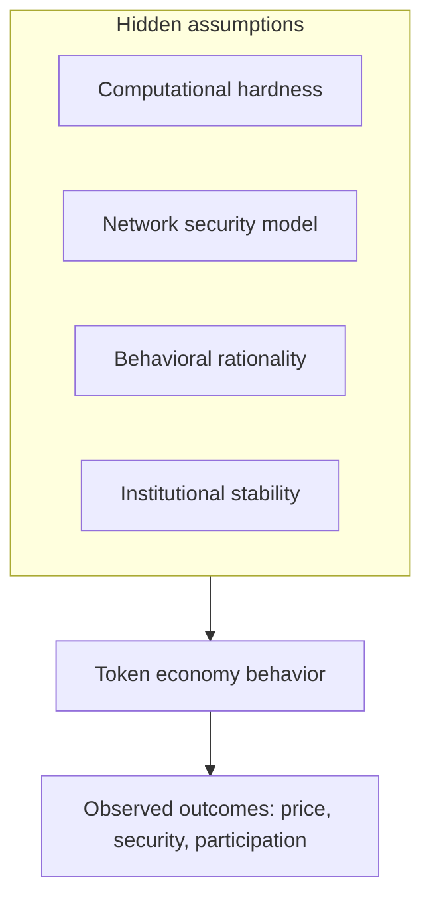
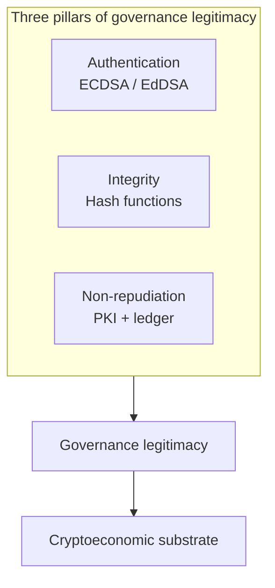
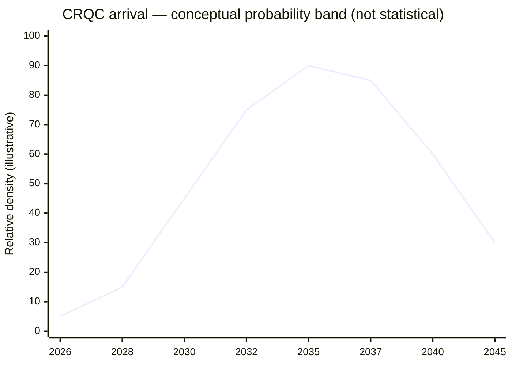
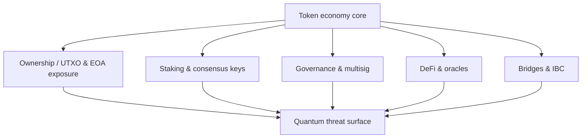

<!-- FIG 1.2 -->

*Figure 1.2 — Hidden assumptions stack (digital edition).*

<!-- FIG 4.1 -->

*Figure 4.1 — Governance legitimacy pillars (digital edition).*

<!-- FIG 5.1 -->

*Figure 5.1 — Conceptual CRQC timeline density (Scenario). Policy lines: NIST 2030/2035.*

<!-- FIG 6.1 -->

*Figure 6.1 — Quantum threat surface map (digital edition).*
