# Post-Quantum Cryptography: Engineering the Migration

**Complete manuscript (revised edition)** — single-file export.

---

# Post-Quantum Cryptography: Engineering the Migration

## Securing Digital Infrastructure Beyond the Quantum Threat Model

---

**Author:** [Your Name]  
**Affiliation:** [Your Organization / Independent Consultant]  
**Edition:** First Edition, 2026  
**Subject:** Post-Quantum Cryptography · Standards · Implementation · Migration

---

## Author's Preface

I wrote this text for the teams who must **ship** quantum-safe cryptography—not only for researchers who already live in lattice papers. Over the past several years I have led readiness assessments for Indian financial institutions, telecommunications operators, and SaaS vendors, alongside global PKI and TLS migrations. The pattern repeats: executives ask for a qubit forecast; engineers need a **cipher-suite decision** by Friday.

This edition is opinionated where standards are silent. I default to **hybrid key exchange** during transition, **ML-KEM / ML-DSA** as primary algorithms, and **cryptographic inventory (CBOM)** before heroics in any single library. I call out India's policy and testing context (MeitY, RBI operational risk, NCIIPC sector guidance, STQC) without pretending to offer legal advice—verify circulars before you contract.

Figures and architecture diagrams appear in every chapter because cryptography is a systems discipline. If a diagram disagrees with a FIPS document, **trust FIPS** and file an erratum.

— *[Your Name], 2026*

---

## Conventions

- **Bold** — first use of a defined term  
- `Monospace` — code, parameters, algorithm names (NIST official names)  
- `> **Author's note:**` — practitioner judgment, deployment caveats  
- **Figure X.Y** — diagrams (Mermaid; print-friendly)  
- Security levels — NIST categories 1–5 unless stated otherwise  

---

## Table of Contents

See `manuscript/chapters/` and `manuscript/appendices/` for chapter files.

---

*Replace bracketed author fields before publisher submission.*

## Table of Contents

- PART I — FOUNDATIONS

- Chapter 1: Cryptography and the Quantum Threat

- Chapter 2: Quantum Computing Fundamentals

- Chapter 3: Shor's and Grover's Algorithms

- Chapter 4: Overview of Post-Quantum Cryptography

- PART II — CORE POST-QUANTUM ALGORITHMS

- Chapter 5: Lattice-Based Cryptography

- Chapter 6: Code-Based Cryptography

- Chapter 7: Hash-Based Signatures

- Chapter 8: Multivariate Polynomial Cryptography

- Chapter 9: Isogeny-Based Cryptography

- PART III — NIST STANDARDIZATION AND STANDARDS

- Chapter 10: The NIST Post-Quantum Standardization Process

- Chapter 11: FIPS 203 — ML-KEM

- Chapter 12: FIPS 204 — ML-DSA

- Chapter 13: FIPS 205 — SLH-DSA

- Chapter 14: Additional Candidates and Round 4 Algorithms

- PART IV — IMPLEMENTATION AND PRACTICE

- Chapter 15: Hybrid Cryptographic Schemes

- Chapter 16: Implementation and Side-Channel Resistance

- Chapter 17: Performance Analysis and Benchmarking

- Chapter 18: PQC in TLS, PKI, and Network Protocols

- PART V — MIGRATION AND THE FUTURE

- Chapter 19: Cryptographic Agility and Migration Strategies

- Chapter 20: Cryptographic Bill of Materials (CBOM)

- Chapter 21: Industry and Government PQC Initiatives

- Chapter 22: Future Directions and Open Problems

- Appendix A: Mathematical Prerequisites

- Appendix B: Glossary of Terms

- Appendix C: Reference Implementations and Tools

- Appendix D: Further Reading and Resources


---

---

# PART I — FOUNDATIONS


---

# Chapter 1: Cryptography and the Quantum Threat

We frame the quantum threat as a **migration and liability** problem for Indian and global digital infrastructure—not a science-fair project.

> **Author's note (India deployment):** Validate any regulatory reference (RBI, MeitY, CERT-In, DPDP retention) against the **current circular** before you bake it into contracts. We describe directionally what we see in the field, not legal advice.

**Figure 1.1 — Stack at risk under Shor and Grover**

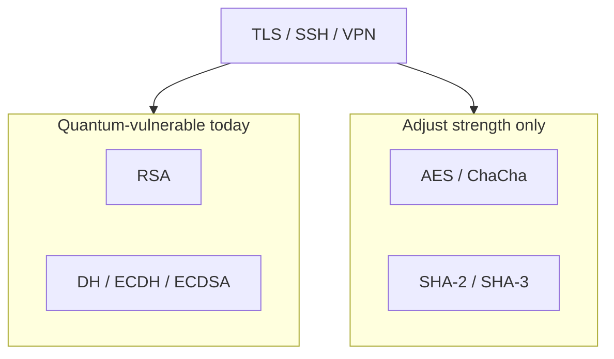

---

We begin with the societal layer because boards fund **risk stories**, not polynomial rings.

## 1.1 The Role of Cryptography in Modern Society

If you run security for a bank, a telco, or a government technology unit in India, you already live inside cryptography whether or not you employ cryptographers. Every `https` session, every software update signature, every VPN into a data centre, and every API token that gates a microservice assumes someone chose algorithms, key lengths, and rotation policies that still look sane five years from now. Our job in this chapter is to name what those choices are today—and which of them quantum computers eventually void.

**Figure 1.1 (above)** is the map we reuse in architecture reviews: Shor's algorithm does not "weaken" RSA or elliptic-curve Diffie–Hellman—it removes the confidentiality and authentication guarantees those primitives were designed to provide, once a cryptographically relevant quantum computer (CRQC) exists. Grover's algorithm is different: it shrinks the effective strength of symmetric keys and hashes, which we answer by doubling key sizes, not by replacing AES.

When you open a site over TLS 1.3, the visible lock icon hides a negotiation most teams never instrument: the server authenticates with a certificate (today, usually RSA or ECDSA), the session keys are derived from a key exchange (today, often X25519 or P-256 ECDH), and only then does AES-GCM or ChaCha20-Poly1305 protect bulk data. In Indian payment and identity ecosystems, the same pattern appears inside API gateways, hardware security modules, and legacy middleware that still terminates TLS on RSA-2048. None of that is invisible to a patient recorder of ciphertext.

> **Author's note:** In discovery workshops we ask for three exports first: (1) TLS cipher suite scan of production endpoints, (2) code-signing and firmware-signing algorithms, (3) data-classification labels with **retention years**. Without those, PQC debates stay abstract.

The deployment scale is hard to overstate, but precise user counts matter less than **where keys live**. A single Kubernetes cluster may mount RSA TLS certificates from a commercial CA, use ECDSA image signatures, and call an HSM that still wraps keys with algorithms NIST now labels quantum-vulnerable. That stacking—not global internet statistics—is what makes migration a systems problem.

Modern public-key cryptography — the foundation of all these systems — relies on a remarkably small number of mathematical hard problems. Essentially, the security of the entire digital economy rests on the belief that three types of mathematical problems are computationally intractable for classical computers:

**Integer Factorization:** The RSA cryptosystem, invented in 1977 by Rivest, Shamir, and Adleman, bases its security on the difficulty of factoring the product of two large prime numbers. Given a number N = p × q where p and q are large primes (each typically 1024 bits or more), finding p and q is believed to require computational resources that grow exponentially with the size of N. The best known classical algorithm for this problem, the General Number Field Sieve (GNFS), has a running time of approximately L_N[1/3, (64/9)^(1/3)], which is sub-exponential but still renders factoring a 2048-bit RSA modulus completely infeasible with current technology. To put this in perspective, the largest RSA number ever factored (RSA-250, 829 bits) required approximately 2,700 CPU core-years of computation in 2020. Factoring a 2048-bit number is estimated to require computational resources equivalent to running all the world's computers simultaneously for longer than the age of the universe.

**The Discrete Logarithm Problem (DLP):** The Diffie-Hellman key exchange protocol and the Digital Signature Algorithm (DSA) base their security on the difficulty of computing discrete logarithms in finite groups. Given a generator g of a cyclic group G of order n, and a group element h = g^x, finding the exponent x is believed to be computationally hard when the group is chosen appropriately. In the multiplicative group of a prime field F_p, the best classical algorithms for DLP (the Number Field Sieve for discrete logarithms) have sub-exponential running time similar to factoring. The security relies on the one-way nature of modular exponentiation: computing g^x mod p is efficient (using square-and-multiply), but reversing this operation — finding x given g and h — is believed to be computationally intractable for properly chosen parameters.

**The Elliptic Curve Discrete Logarithm Problem (ECDLP):** Elliptic Curve Cryptography (ECC), introduced independently by Neal Koblitz and Victor Miller in 1985, operates over the group of rational points on an elliptic curve defined over a finite field. Given two points P and Q = kP on an elliptic curve (where kP means adding P to itself k times using the elliptic curve group law), finding the scalar k is the ECDLP. Unlike DLP in finite fields, no sub-exponential classical algorithm is known for ECDLP on properly chosen curves; the best classical attack is Pollard's rho algorithm with running time O(√n) where n is the group order. This fundamental advantage allows ECC to achieve equivalent security to RSA with dramatically smaller key sizes (a 256-bit ECC key provides security comparable to a 3072-bit RSA key), making ECC the preferred algorithm for mobile devices, IoT, and bandwidth-constrained applications.

These three problems have withstood decades of intense scrutiny from the world's best mathematicians and computer scientists. The mathematical community has developed deep confidence in their hardness on classical computers through half a century of cryptanalytic effort. This confidence underpins the entire global digital infrastructure. However, this confidence has a critical caveat: it applies only to classical computation. The advent of quantum computing threatens to fundamentally and irreversibly alter this landscape.

## 1.2 A Brief History of Public-Key Cryptography

To fully appreciate the significance of the quantum threat, it helps to understand how we arrived at our current cryptographic infrastructure and why replacing it is so challenging.

Before the 1970s, all practical cryptography was symmetric — both communicating parties needed to share the same secret key. Systems like the one-time pad (provably unbreakable but impractical for most uses) and cipher machines like Enigma (breakable, as Alan Turing demonstrated) all required pre-shared secrets. This created a fundamental chicken-and-egg problem for the emerging digital age: how do you securely share a key with someone you've never met, across an untrusted network, without any prior secure channel? The key distribution problem seemed insurmountable for the kind of open, global communication network that was beginning to emerge.

In 1976, Whitfield Diffie and Martin Hellman published their landmark paper "New Directions in Cryptography," introducing the revolutionary concept of public-key cryptography. They proposed that each party could have two mathematically related keys — a public key freely shared with the world, and a private key kept secret. Messages encrypted with the public key could only be decrypted with the corresponding private key. This asymmetry, based on the existence of mathematical one-way functions, was the conceptual breakthrough that made secure internet communication possible. Their paper also introduced the Diffie-Hellman key exchange protocol, allowing two parties to establish a shared secret over an insecure channel without any prior secret.

Just one year later, in 1977, Ron Rivest, Adi Shamir, and Leonard Adleman published the RSA cryptosystem — the first complete public-key encryption and signature scheme. RSA elegantly combined the concepts of public-key encryption and digital signatures using the mathematical structure of modular arithmetic and the hardness of factoring. The simplicity and elegance of RSA made it immediately practical, and it remains widely deployed nearly five decades later.

Throughout the 1980s and 1990s, the field of public-key cryptography flourished. ElGamal encryption (1985) provided an alternative to RSA based on discrete logarithms. Koblitz and Miller independently proposed elliptic curve cryptography (1985), offering equivalent security with smaller keys. The Digital Signature Algorithm (DSA) was proposed by NIST in 1991 and standardized as FIPS 186 in 1994. Various key agreement protocols, zero-knowledge proofs, and advanced cryptographic constructions were developed.

By the late 1990s and early 2000s, public-key cryptography was deeply embedded in the internet's infrastructure. SSL/TLS became ubiquitous for web security. SSH replaced telnet for remote access. S/MIME and PGP provided email encryption. IPsec and VPN technologies secured enterprise networks. Certificate Authorities issued millions of digital certificates. The entire Public Key Infrastructure (PKI) ecosystem grew to support global digital commerce.

Yet throughout all this development, essentially every deployed public-key system relied on one of three mathematical problems: factoring (RSA), discrete logarithms in finite fields (DH, DSA, ElGamal), or discrete logarithms on elliptic curves (ECDH, ECDSA). This convergence — driven by the mathematical elegance and well-understood security of these problems — created a hidden systemic vulnerability. If any single class of these problems became efficiently solvable, vast swaths of the global digital infrastructure would simultaneously become insecure.

This is precisely what quantum computing threatens to do.

## 1.3 The Quantum Computing Revolution

Quantum computing represents a fundamentally different paradigm of information processing, rooted in the counterintuitive laws of quantum mechanics. While classical computers manipulate bits that are definitively in one of two states (0 or 1), quantum computers use quantum bits — qubits — that can exist in coherent superpositions of both states simultaneously. Through the quantum mechanical phenomena of superposition, entanglement, and interference, quantum computers can explore certain computational spaces exponentially more efficiently than any known classical algorithm.

The concept of quantum computation was first proposed by the legendary physicist Richard Feynman in 1981 at a conference at MIT. Feynman observed that accurately simulating quantum mechanical systems appeared to require exponential resources on classical computers — the Hilbert space of even a modest quantum system grows exponentially with the number of particles. He proposed that perhaps a computer operating according to quantum mechanical principles might be fundamentally more powerful for such simulations. This insight suggested that quantum mechanics might offer computational resources beyond what classical physics allows.

In 1985, David Deutsch at Oxford University formalized the concept of a universal quantum computer and proved that it could simulate any physical process efficiently, providing the theoretical foundation for quantum computation as a discipline. Through the early 1990s, quantum computing remained primarily a theoretical curiosity, with no clear killer application that would justify the enormous engineering challenges of building quantum hardware.

The critical turning point for both quantum computing and cryptography came in 1994, when Peter Shor, then at AT&T Bell Labs, discovered a quantum algorithm that solves both the integer factorization problem and the discrete logarithm problem in polynomial time. This single paper — arguably the most consequential algorithm discovery since the Fast Fourier Transform — demonstrated that a sufficiently powerful quantum computer would completely break RSA, Diffie-Hellman, DSA, ECDSA, ECDH, and essentially every widely deployed public-key cryptosystem. The publication electrified both the quantum computing and cryptography communities, providing quantum computing with its first clear "killer application" while simultaneously threatening the foundations of digital security.

Two years later, in 1996, Lov Grover at Bell Labs discovered another important quantum algorithm, this one providing a quadratic speedup for unstructured search problems. While less dramatic than Shor's exponential speedup, Grover's algorithm has significant implications for symmetric cryptography and hash functions, effectively halving their security levels.

The development of quantum computing hardware has accelerated dramatically in recent years, transforming from academic curiosity to major industrial and national priority. What follows is a timeline of key milestones illustrating this acceleration:

In 1998, the first 2-qubit quantum computer was demonstrated at Oxford, performing a simple quantum algorithm. In 2001, IBM researchers used a 7-qubit nuclear magnetic resonance (NMR) quantum computer to factor the number 15 using Shor's algorithm — a proof of concept with no practical significance but enormous symbolic importance. For the next 15 years, progress was steady but slow, limited by the extraordinary difficulty of maintaining quantum coherence and controlling quantum systems.

The pace then accelerated dramatically. In 2016, IBM made a 5-qubit quantum computer available via the cloud (IBM Quantum Experience), democratizing access to quantum hardware. In 2017, IBM demonstrated a 50-qubit processor. In 2019, Google announced "quantum supremacy" — their 53-qubit Sycamore processor performed a specific computation in 200 seconds that Google estimated would take the world's fastest classical supercomputer approximately 10,000 years. While the claim was debated (IBM argued classical simulation was possible in days), the demonstration marked a clear milestone.

In 2022, IBM unveiled its 433-qubit Osprey processor. In 2023, IBM announced the 1,121-qubit Condor processor and published a roadmap targeting 100,000+ qubits by 2033. Atom Computing demonstrated a 1,180-qubit neutral atom system. In 2024, multiple companies demonstrated quantum error correction at meaningful scales, with Harvard/QuEra demonstrating 48 logical qubits and Google achieving below-threshold error rates in their surface code experiments. By 2025-2026, systems with dozens to hundreds of logical qubits are operational for specialized tasks, and several companies have demonstrated the ability to run circuits of increasing depth and complexity.

The quantum computing industry has attracted enormous investment. IBM, Google, Microsoft, Amazon, Intel, and numerous well-funded startups (IonQ, Quantinuum, Rigetti, QuEra, Pasqal, PsiQuantum, Xanadu) are all pursuing quantum computing. The industry is characterized by multiple competing hardware approaches:

**Superconducting qubits** (IBM, Google, Rigetti) use tiny circuits cooled to near absolute zero (approximately 15 millikelvin), where electrical current flows without resistance and quantum effects can be controlled. These systems offer fast gate operations (nanoseconds) and leverage existing semiconductor fabrication infrastructure, but require enormous dilution refrigerators and have limited qubit connectivity.

**Trapped ion qubits** (IonQ, Quantinuum) use individual ions suspended in electromagnetic traps, with quantum information encoded in their electronic states. These systems offer the highest gate fidelities, long coherence times, and all-to-all connectivity, but operate more slowly (microseconds per gate) and face challenges in scaling to large numbers.

**Neutral atom qubits** (QuEra, Pasqal, Atom Computing) use individual neutral atoms held in optical tweezers, offering large qubit counts, flexible geometry, and native multi-qubit gates through Rydberg interactions.

**Photonic qubits** (Xanadu, PsiQuantum) encode quantum information in properties of light (photons), offering room-temperature operation and natural compatibility with optical networks, but requiring probabilistic entanglement and photon loss management.

**Topological qubits** (Microsoft) aim to encode quantum information in exotic quantum states (anyons) that are inherently protected from noise, but the underlying physics (Majorana fermions) has proven extremely challenging to realize experimentally.

This diversity of approaches increases confidence that quantum computing will eventually achieve scale. Each approach has different strengths and challenges, and progress on any one of them could lead to cryptographically relevant machines. The global investment in quantum computing now exceeds $35 billion cumulatively across public and private sectors. China, the United States, the European Union, Japan, South Korea, Australia, Canada, India, and numerous other nations have established major quantum computing programs as strategic national priorities. This level of sustained, multi-national investment makes the eventual achievement of cryptographically relevant quantum computers a near-certainty.

A crucial concept for understanding the path from today's quantum hardware to a cryptographically relevant machine is the distinction between physical qubits and logical qubits. Physical qubits are the individual quantum systems (superconducting circuits, trapped ions, neutral atoms, etc.) that hardware engineers build and control. These physical qubits are inherently noisy — affected by decoherence, thermal fluctuations, control errors, and crosstalk with neighboring qubits. Error rates for current physical qubits range from approximately 0.1% to 1% per gate operation, which is far too high for running algorithms that require billions of sequential operations.

Quantum error correction (QEC) addresses this fundamental problem by encoding a single "logical" qubit across many physical qubits in a redundant fashion, enabling the detection and correction of errors without collapsing the quantum state. The most widely studied approach, the surface code, encodes one logical qubit using a two-dimensional grid of physical qubits with nearest-neighbor interactions. The overhead is substantial: achieving a logical error rate of 10^-12 (needed for running Shor's algorithm on a 2048-bit RSA modulus) with physical error rates of 10^-3 requires roughly 1,000 to 5,000 physical qubits per logical qubit, depending on the specific implementation and distance of the code.

This error correction overhead is why estimates for cryptographically relevant machines cite millions of physical qubits despite needing only thousands of logical qubits. The engineering challenge extends beyond simply fabricating millions of qubits — each qubit must be individually addressable, controllable, and readable out with high fidelity, the control electronics must operate at cryogenic temperatures or interface precisely with laser systems, and the entire system must maintain calibration across millions of components simultaneously. The classical control hardware alone — the waveform generators, digitizers, and feedback systems — represents an engineering challenge comparable to building a supercomputer. Companies are actively developing cryogenic CMOS controllers to place the classical electronics closer to the qubits, reducing wiring complexity but introducing new thermal management challenges.

Despite these formidable engineering hurdles, the trajectory is clear. Error rates have improved by roughly an order of magnitude every few years across multiple platforms. Qubit counts have grown exponentially. New error correction codes — particularly quantum Low-Density Parity-Check (LDPC) codes — promise to dramatically reduce the physical-to-logical qubit ratio, potentially by factors of 10 or more compared to the surface code. Each individual improvement in error rates, qubit counts, connectivity, or error correction efficiency compounds, accelerating the timeline toward cryptographic relevance.

> **Author's note:** HNDL is the budget unlocker—archived TLS matters for years.

> **Author's note:** HNDL is the budget unlocker—archived TLS still matters years later.


**Figure 1.2 — HNDL timeline (author view)**

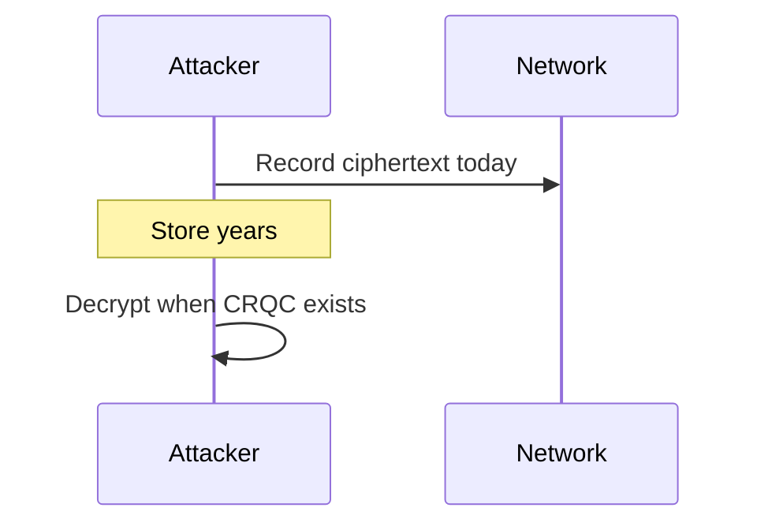

## 1.4 The "Harvest Now, Decrypt Later" Threat

Perhaps the most urgent and underappreciated aspect of the quantum threat is the "Harvest Now, Decrypt Later" (HNDL) attack model, also sometimes called "store now, decrypt later" or "retrospective decryption." This concept fundamentally changes the timeline of quantum risk from a future concern to a present emergency.

The HNDL attack operates on a simple but devastating logic: adversaries intercept and store encrypted communications today, while they are computationally protected by current cryptographic algorithms. These communications remain indecipherable using today's computing resources. However, the adversaries store the captured ciphertext indefinitely — storage is cheap and getting cheaper. When quantum computers capable of running Shor's algorithm at cryptographic scale eventually become available, the adversaries retrieve their stored ciphertexts and decrypt them, exposing secrets that may still be sensitive years or decades after their original transmission.

This is not a theoretical attack model. It is widely understood within the intelligence community that nation-state actors — particularly those with both strong signals intelligence capabilities and active quantum computing programs — are actively conducting HNDL operations at scale. The infrastructure required is not exotic: submarine cable taps, mirrors at internet exchange points, cooperation with telecommunications providers, and massive data centers for storage. All of these capabilities have been documented to exist through various disclosures and investigative journalism.

The Snowden revelations of 2013 confirmed what security researchers had long suspected: intelligence agencies routinely intercept internet backbone traffic at massive scale. Programs like the NSA's UPSTREAM (which taps fiber optic cables) and PRISM (which collects data from major internet companies) demonstrate the capability to capture and store encrypted communications at enormous volume. While these programs were disclosed in the context of classical surveillance, the same infrastructure serves perfectly for HNDL operations — the encrypted data that cannot be read today is simply retained for future quantum decryption.

The economics of HNDL are compelling from an adversary's perspective. The cost of data storage has decreased exponentially over decades (roughly halving every two years). A petabyte of enterprise storage costs under $20,000. An intelligence agency could store years of intercepted communications from a targeted organization for a trivial fraction of its budget. When quantum computers eventually enable decryption, the return on this modest storage investment could be enormous — access to years of diplomatic communications, intelligence assessments, business strategies, or military plans.

The HNDL threat is particularly severe for data with long-term confidentiality requirements. Consider the following categories:

**Government Classified Information:** In the United States, classified information may remain classified for 25 years under standard rules, with extensions to 50 or 75 years for particularly sensitive material. Some categories (nuclear weapons design, intelligence sources and methods) may remain classified indefinitely. Diplomatic communications, covert operations, intelligence assessments, and military strategies all fall into this category. If encrypted communications containing such information are captured today and decrypted in 15 years, the damage could be severe — revealing intelligence sources, compromising ongoing operations, or providing strategic advantage to adversaries.

**Medical Records and Genetic Data:** Patient health information is protected under privacy regulations (HIPAA in the US, GDPR in the EU) with effectively unlimited duration. Genetic information is particularly concerning because it is immutable — your DNA sequence will be relevant to you and your descendants indefinitely. Mental health records, HIV status, reproductive health information, addiction treatment records, and other sensitive medical data could cause devastating personal harm if exposed decades after creation.

**Financial Records and Trade Secrets:** Corporate trade secrets, merger and acquisition plans, proprietary trading algorithms, negotiation strategies, and competitive intelligence retain their sensitivity for years to decades. Even after a deal closes, knowledge of negotiation positions could affect future dealings. Pharmaceutical research data (worth billions) remains proprietary throughout the patent lifecycle and beyond. Leaked financial communications could enable insider trading even years after the original transactions.

**Intellectual Property and Research:** Patent applications contain detailed technical information that must remain confidential until filing. Research data in academia and industry represents years of investment. Proprietary algorithms, manufacturing processes, and chemical formulations are corporate crown jewels. Early-stage startup ideas and business plans could be stolen through retrospective decryption.

**Critical Infrastructure and National Security Plans:** Designs for nuclear power plants, military installations, communications networks, water treatment facilities, electrical grids, and transportation systems remain sensitive for the entire operational lifetime of the infrastructure — often 50-100 years. Knowledge of specific vulnerabilities in these systems could enable catastrophic attacks decades into the future.

**Personal Communications:** Private conversations — between spouses, between patients and doctors, between journalists and sources, between activists and lawyers, between whistleblowers and investigators — could be exposed to embarrassment, blackmail, persecution, or violence if decrypted years later. The chilling effect on free communication is itself a harm, even before any actual decryption occurs. Individuals who are private citizens today may become public figures in the future, making their historical private communications suddenly newsworthy.

**Legal Proceedings:** Attorney-client privilege, sealed court records, witness protection information, grand jury proceedings, and settlement agreements all require long-term confidentiality. The integrity of the legal system depends on the reliability of these protections.

The geopolitical dimension of HNDL cannot be overstated. The nations with the most advanced quantum computing programs — the United States, China, Russia, and several European nations — are also those with the most sophisticated signals intelligence capabilities and the strongest motivations for espionage. China's quantum computing efforts are particularly notable: the nation has invested over $15 billion in quantum research, operates the world's longest quantum communication network (the Beijing-Shanghai backbone), and has demonstrated quantum computational advantages with both superconducting (Zuchongzhi) and photonic (Jiuzhang) systems. Chinese intelligence services have been linked to numerous large-scale cyber intrusions targeting government agencies, defense contractors, and technology companies — providing both the access to intercept encrypted communications and the strategic motivation to store them for future decryption.

Russia presents a similar concern. Despite a somewhat smaller quantum computing program, Russian intelligence services are known for sophisticated cyber operations and long-term strategic patience. The SVR's compromise of SolarWinds (discovered in 2020) demonstrated the capability to maintain persistent access to sensitive networks for extended periods. Such access would be ideal for conducting HNDL collection against high-value targets.

Organizations must also consider the "mosaic" nature of the HNDL threat: even individually innocuous communications can reveal sensitive patterns when analyzed in bulk over long time periods. An adversary who decrypts years of an organization's email traffic gains not just individual secrets but a comprehensive understanding of decision-making processes, organizational relationships, personnel vulnerabilities, and strategic priorities — intelligence that is valuable regardless of whether any single message contains classified information.

The response to HNDL requires a fundamental shift in how organizations think about cryptographic urgency. Unlike most cybersecurity threats where the harm is immediate and visible (ransomware, data breaches, denial of service), HNDL is silent, invisible, and non-disruptive at the time of collection. There is no alarm, no incident response, no indicator of compromise. The data simply moves from the wire to an adversary's archive, waiting. This invisibility makes HNDL uniquely difficult to motivate action against — leaders struggle to allocate resources to defend against a threat that produces no observable harm today. Yet this is precisely why early action is critical: by the time the harm becomes visible (when quantum computers enable decryption), it will be far too late to protect communications that were transmitted years earlier.

The mathematical framework for assessing HNDL risk was formalized by Professor Michele Mosca of the University of Waterloo in what is now known as Mosca's inequality or Mosca's theorem. Mosca defined three variables:

- **x** = the security shelf life of the data (how many years it must remain confidential)
- **y** = the migration time (how many years it will take to deploy quantum-resistant encryption)
- **z** = the threat timeline (how many years until a cryptographically relevant quantum computer exists)

Mosca's key insight: if **x + y > z**, then the organization is already at risk. Data that needs to remain secret for x years, transmitted today using vulnerable encryption that will take y years to replace, is already compromised if a CRQC arrives in fewer than x + y years.

For many organizations, realistic values are:
- x = 15-50 years (classified information, medical records, infrastructure plans)
- y = 5-15 years (realistic migration timeline for complex organizations)
- z = 10-20 years (estimated CRQC arrival, with high uncertainty)

Even using moderate estimates, x + y (20-65 years) likely exceeds z (10-20 years) for most organizations handling sensitive information. This mathematical reality means that for many data categories, the HNDL threat is not a future risk — it is a present one.

## 1.5 Defining the Quantum Threat Timeline

The question of when a cryptographically relevant quantum computer (CRQC) will exist is perhaps the most important — and most uncertain — question in modern technology risk assessment. The answer determines the urgency of PQC migration, the allocation of resources, and the acceptable level of residual risk during transition.

### Expert Estimates and Surveys

The Global Risk Institute (GRI) at the University of Waterloo conducts annual surveys of quantum computing experts worldwide. Their most recent surveys show the following distribution of expert opinion:

- Approximately 25-30% of surveyed experts believe there is a greater than 30% chance of a CRQC within 10 years
- Approximately 50-60% believe there is a greater than 30% chance within 15 years
- Over 75% believe there is a greater than 30% chance within 20 years
- Only about 10-15% believe the timeline extends beyond 30 years

These estimates have been shifting earlier over time, reflecting accelerating hardware progress and algorithmic improvements that reduce resource requirements.

The RAND Corporation, the MITRE Corporation, and various national science advisories have published independent assessments. A common finding is that while the "median" estimate centers around 15-20 years, the distribution has a significant left tail — there is a non-trivial probability of CRQCs arriving significantly earlier than the median estimate, particularly if unexpected breakthroughs occur.

### Technical Requirements Analysis

To factor a 2048-bit RSA modulus using Shor's algorithm with current best-known circuit constructions:
- **Logical qubits needed:** Approximately 4,000-6,000 (depending on the specific implementation)
- **T-gate depth:** Approximately 10^10 (the dominant cost in fault-tolerant quantum computing)
- **Physical qubits needed:** With surface code error correction at current error rates, approximately 4-20 million physical qubits
- **Wall-clock time:** Hours to days once the machine is operational

Recent algorithmic optimizations have continued to reduce these requirements. Gidney and Ekerå (2021) showed that 2,048 + 2 logical qubits suffice using windowed arithmetic techniques. Other researchers have found space-time trade-offs that reduce either qubit count or circuit depth at the expense of the other.

Current quantum hardware (2025-2026) provides:
- Physical qubit counts: 1,000-5,000 (superconducting), 50-100 (trapped ions)
- Two-qubit gate error rates: approximately 10^-3 (superconducting), 10^-4 (trapped ions)
- Demonstrated logical qubits: Dozens (with high-fidelity error correction)
- Coherence times: Milliseconds (superconducting) to seconds (trapped ions)

The gap between current capabilities and CRQC requirements is still significant (roughly 3-4 orders of magnitude in qubit count, with several orders of magnitude improvement needed in error rates for practical error correction), but the rate of improvement has been consistently exponential across multiple hardware platforms.

### Risk Factors That Could Accelerate the Timeline

Several factors could cause CRQCs to arrive earlier than consensus estimates:

1. **Classified programs:** Military and intelligence programs may be years ahead of publicly known capabilities. China's quantum program, in particular, publishes selectively and may have capabilities not reflected in the open literature.

2. **Algorithmic breakthroughs:** New quantum algorithms or improvements to Shor's algorithm could dramatically reduce resource requirements. The factoring algorithm has been improved several times since 1994.

3. **Error correction innovations:** Novel error correction codes or architectures (like quantum LDPC codes) could reduce the physical-to-logical qubit ratio by orders of magnitude.

4. **Hardware breakthroughs:** A fundamentally new qubit technology, or the successful realization of topological qubits, could leap past current scaling barriers.

5. **Manufacturing advances:** If quantum computers can be manufactured at semiconductor-industry scale, the scaling challenge becomes primarily economic rather than scientific.

### Dealing with Deep Uncertainty

A fundamental challenge in quantum threat assessment is that the uncertainty is not merely statistical but epistemic — we are not dealing with well-characterized probability distributions but with genuine ignorance about future scientific breakthroughs. The timeline estimates from expert surveys should be interpreted with great caution: experts are drawing on their experience with current technological trajectories, but paradigm-shifting discoveries (a new qubit technology, a dramatic algorithmic improvement, or a breakthrough in error correction) could invalidate extrapolations based on current progress rates.

Historical precedent from other technology domains suggests that expert consensus often underestimates the speed of transformative technologies in their exponential growth phase. Semiconductor scaling consistently exceeded predictions in the early decades of Moore's Law. Machine learning capabilities have repeatedly exceeded expert timelines in recent years. In quantum computing itself, achievements like Google's 2019 quantum supremacy demonstration arrived earlier than many experts predicted just five years prior.

Organizations should adopt a risk management approach that acknowledges this deep uncertainty rather than relying on point estimates. This means planning for a range of scenarios:

**Best case (CRQC in 25+ years):** Migration proceeds at a comfortable pace; organizations have ample time for testing, standardization, and gradual deployment. The cost of early preparation is merely opportunity cost — resources that could have been spent elsewhere.

**Moderate case (CRQC in 12-18 years):** Organizations that began migration planning in 2024-2026 complete their transitions in time. Those that delayed face increasingly compressed and expensive migration timelines. Some data transmitted before migration completion is compromised via HNDL.

**Worst case (CRQC in 7-10 years):** Only organizations with aggressive migration programs complete the transition before quantum computers enable mass decryption. Vast quantities of historically intercepted data become readable. Critical infrastructure systems that cannot be quickly updated face operational risk.

**Black swan scenario (classified CRQC already exists or arrives within 5 years):** While considered unlikely by most experts, this scenario is not impossible given the opacity of classified military programs. In this scenario, the damage from HNDL is already done for unprotected communications, and only organizations that deployed PQC earliest preserve any confidentiality for recent traffic.

The rational organizational response is to plan for the moderate case while ensuring the infrastructure flexibility to accelerate if indicators suggest the worst case is materializing. This is analogous to insurance purchasing: organizations do not wait for certainty that a disaster will occur before buying coverage. The quantum threat is a low-probability, catastrophically-high-impact risk that demands proactive mitigation precisely because its timing cannot be predicted with confidence.

### The Asymmetry of Risk

A crucial insight for decision-makers is that the consequences of the quantum threat are profoundly asymmetric:

- **If we migrate to PQC too early:** The cost is engineering effort, modest performance overhead, and some bandwidth increase. These costs are manageable and temporary.
- **If we migrate too late:** The consequences could be catastrophic and irreversible — exposure of decades of sensitive communications, compromise of critical infrastructure, theft of intellectual property worth billions, and potential national security breaches.

This asymmetry strongly favors conservative action: beginning PQC migration immediately is the rational response even if the CRQC timeline is uncertain. The cost of being "too early" is far less than the cost of being "too late."

## 1.6 What is Post-Quantum Cryptography?

**Post-Quantum Cryptography (PQC)**, also referred to as quantum-resistant cryptography or quantum-safe cryptography, is the field dedicated to developing cryptographic algorithms that remain secure against attacks by both classical and quantum computers. A critical distinction must be emphasized: PQC algorithms run on classical computers using existing hardware. They do not require quantum hardware, quantum channels, or any quantum technology whatsoever.

PQC achieves quantum resistance by basing cryptographic constructions on mathematical problems for which no efficient quantum algorithm is known, and for which there are strong theoretical reasons to believe no such algorithm exists. While Shor's algorithm provides exponential speedups for problems with specific algebraic structure (the Hidden Subgroup Problem over abelian groups, which includes factoring and discrete logarithms), it does not provide speedups for arbitrary computational problems. Many mathematical problems remain computationally hard even for quantum computers.

The key insight is that Shor's algorithm exploits a very specific mathematical structure: the periodicity of modular exponentiation (for factoring) and the structure of finite abelian groups (for discrete logarithms). Problems that do not have this particular algebraic structure are not accelerated by Shor's algorithm. The known quantum speedup for unstructured problems is limited to Grover's quadratic improvement, which is manageable by simply doubling key sizes.

It is essential to distinguish PQC from related but distinct concepts:

**Quantum Key Distribution (QKD):** QKD uses quantum mechanical properties — specifically, the no-cloning theorem and the fundamental disturbance caused by quantum measurement — to detect eavesdropping on a key distribution channel. QKD provides information-theoretic security (provably unbreakable regardless of the adversary's computational power) for the specific task of key distribution. However, QKD has severe practical limitations: it requires dedicated quantum hardware (single-photon sources, quantum detectors), a direct quantum channel (typically dedicated fiber optic cable), is limited in range (approximately 100 km without quantum repeaters, which do not yet exist at scale), cannot authenticate communicating parties by itself (requiring classical or PQC authentication), and cannot provide digital signatures, key encapsulation, or other essential cryptographic functions. QKD is a complement to PQC for ultra-high-security point-to-point links, not a replacement for PQC in general-purpose cryptography.

**Quantum Random Number Generation (QRNG):** QRNG devices exploit the fundamental randomness of quantum mechanics (e.g., single-photon detection events, vacuum state fluctuations) to generate truly random numbers. While high-quality randomness is important for cryptographic key generation, QRNG by itself does not protect against quantum attacks on public-key cryptography. It is an enabling technology that can strengthen any cryptographic system (classical or PQC) by providing superior entropy sources.

**Quantum-Enhanced Cryptography:** Some research explores using quantum computers or quantum communication to perform cryptographic operations (quantum oblivious transfer, quantum money, quantum homomorphic encryption). These are theoretical constructions requiring quantum hardware and are distinct from PQC's goal of providing quantum resistance using only classical resources.

The five major families of PQC algorithms, each based on distinct mathematical foundations, are:

**Lattice-Based Cryptography:** Based on the hardness of finding short vectors in high-dimensional lattices, specifically the Learning With Errors (LWE) problem and its structured variants (Ring-LWE, Module-LWE). This family provides both key encapsulation mechanisms and digital signatures. The NIST-standardized ML-KEM (FIPS 203) and ML-DSA (FIPS 204) are both lattice-based. Lattice cryptography offers the best balance of security, performance, and versatility, and also enables advanced constructions like fully homomorphic encryption. The underlying hard problems have been studied for over 30 years with no significant quantum speedups discovered.

**Code-Based Cryptography:** Based on the hardness of decoding random linear error-correcting codes (the syndrome decoding problem). The McEliece cryptosystem (1978) is the oldest PQC proposal and has never been broken despite nearly 50 years of analysis. Code-based schemes offer extremely fast operations but suffer from very large public keys. HQC (Hamming Quasi-Cyclic) has been selected by NIST for additional standardization as a code-based KEM, providing algorithmic diversity from lattice-based ML-KEM.

**Hash-Based Signatures:** Based solely on the security properties of cryptographic hash functions (one-wayness, collision resistance). These signatures have the most minimal and conservative security assumptions — if your hash function is secure, the scheme is secure. NIST standardized SLH-DSA (FIPS 205) as a stateless hash-based signature, and previously standardized stateful schemes XMSS and LMS in SP 800-208. Hash-based signatures serve as the "insurance policy" — if unexpected weaknesses are found in lattice-based schemes, hash-based signatures remain secure.

**Multivariate Polynomial Cryptography:** Based on the hardness of solving systems of multivariate quadratic (MQ) polynomial equations over finite fields. The MQ problem is NP-hard, and no quantum speedup beyond Grover's quadratic improvement is known. UOV (Unbalanced Oil and Vinegar) is the primary surviving scheme and is under NIST evaluation for additional standardization. However, this family has seen several schemes broken during the NIST process (notably Rainbow in 2022), reducing confidence somewhat.

**Isogeny-Based Cryptography:** Based on the hardness of computing isogenies (structure-preserving maps) between elliptic curves. This family offered the smallest key sizes of any PQC approach. However, the primary scheme SIKE (Supersingular Isogeny Key Encapsulation) was devastatingly broken in 2022 by a polynomial-time attack. Remaining schemes (CSIDH, SQISign) survive but face various challenges. This family serves as a cautionary tale about the risks of newer mathematical foundations.

> **Author's note:** Vendor refresh cycles dominate Indian timelines more than qubit counts.

> **Author's note:** Indian programs slip on vendor HSM roadmaps more than on lattice theory.

## 1.7 The Scale of the Migration Challenge

The transition to post-quantum cryptography represents one of the most significant coordinated technology transformations in the history of computing. The scope is immense because cryptography is not merely a "feature" that can be updated in isolation — it is deeply embedded in virtually every layer of the technology stack, from hardware circuits to application protocols to organizational processes.

**Network Protocol Layer:** Every implementation of TLS (Transport Layer Security), SSH (Secure Shell), IPsec/IKE (Internet Protocol Security), DTLS (Datagram TLS), QUIC (Google's transport protocol, now standardized), WireGuard, OpenVPN, and dozens of other network security protocols must be updated. This includes billions of devices: web servers, application servers, load balancers, CDN edge nodes, reverse proxies, VPN concentrators, firewalls, intrusion detection systems, mail servers, DNS servers, and more. Each of these implementations comes from different vendors, uses different cryptographic libraries, and has different update mechanisms.

**Cryptographic Library Layer:** The foundational libraries that implement cryptographic algorithms — OpenSSL, BoringSSL, LibreSSL, NSS, GnuTLS, wolfSSL, mbedTLS, Bouncy Castle, libsodium, and many others — must all add PQC algorithm support. This requires not just implementing the algorithms but ensuring constant-time execution, side-channel resistance, memory safety, and correctness across all supported platforms. Each library update then needs to propagate to all dependent applications.

**Application Layer:** Every application that uses cryptography must adopt PQC. This includes web browsers (Chrome, Firefox, Safari, Edge), email clients (Outlook, Thunderbird, Apple Mail), messaging applications (Signal, WhatsApp, iMessage), database systems (MySQL, PostgreSQL, MongoDB), cloud services (AWS, Azure, GCP), code signing tools, PDF signing, document encryption, password managers, VPN clients, cryptocurrency wallets, and thousands of specialized applications. Each application may need changes beyond simple library updates — data format changes, key storage modifications, protocol version negotiations.

**Infrastructure Layer:** Certificate Authorities must develop the ability to issue PQC certificates with new algorithm OIDs and potentially larger certificate formats. DNS systems must support PQC in DNSSEC (where signature sizes are particularly problematic). Key management systems, both hardware (HSMs, TPMs) and software (KMS, key vaults), must handle PQC key types. Identity and access management systems (Active Directory, LDAP, SAML, OAuth, OpenID Connect) must adapt to PQC credentials. Time-stamping authorities must use PQC signatures.

**Hardware Layer:** This may be the most challenging layer. Embedded devices, IoT sensors, smart meters, smart cards, credit card chips, automotive Electronic Control Units (ECUs), industrial Programmable Logic Controllers (PLCs), medical device implants, satellite communication systems, and military hardware all contain fixed cryptographic implementations that may not be upgradeable. Some of these devices have 15-30 year operational lifetimes. Devices manufactured today without PQC capability may become security liabilities long before their operational life ends. Hardware Security Modules (HSMs) — the most security-critical hardware in many organizations — require firmware updates or hardware replacement for PQC support.

**Data Layer:** Historical data encrypted with quantum-vulnerable algorithms cannot be retroactively protected from HNDL attacks — if it has already been captured, it will eventually be decryptable. Future data must be encrypted with PQC. Stored data encrypted for long-term confidentiality should be re-encrypted with PQC algorithms where feasible. Database encryption, file system encryption, backup encryption, and archival systems all need updating.

**Organizational Layer:** People must be trained. Software developers need to understand PQC APIs and secure implementation practices. Security engineers need to understand PQC algorithm properties and selection criteria. System administrators need to manage PQC certificates and keys. Executive leadership needs to understand the risk and allocate resources. Procurement processes need to require PQC support. Compliance frameworks need updating. Audit procedures must verify PQC deployment.

**Interoperability and Testing:** Perhaps the least appreciated challenge is interoperability — ensuring that PQC implementations from different vendors, in different languages, on different platforms, all work correctly together. Cryptographic interoperability bugs have historically been a rich source of vulnerabilities (protocol downgrade attacks, implementation-specific parsing errors, incompatible encoding assumptions). With PQC, interoperability testing is complicated by the proliferation of algorithm variants, parameter sets, encoding formats, and hybrid combinations. A TLS client using one library's ML-KEM implementation must negotiate successfully with servers using different implementations, potentially across different versions of the draft or final specifications. The IETF standardization process for PQC in protocols (TLS 1.3, SSH, IKEv2, X.509 certificates) introduces additional complexity: protocol-level decisions about how to integrate PQC algorithms — where hybrid keys are placed in handshake messages, how certificates chain with mixed algorithm types, how backward compatibility is maintained with non-PQC peers — all create potential interoperability failure points.

**Crypto Agility:** The PQC transition has elevated "crypto agility" from a best practice to an essential architectural requirement. Crypto agility refers to the ability of a system to rapidly switch between cryptographic algorithms without major redesign or redeployment. The need is clear: PQC algorithms are newer and less battle-tested than their classical predecessors. While NIST's standardization process involved extensive cryptanalysis, the history of cryptography includes numerous examples of algorithms believed to be secure that were later broken (MD5, SHA-1, RC4, DES, and most recently SIKE in the PQC context itself). If a deployed PQC algorithm is found vulnerable, organizations need the ability to swap it out rapidly. Systems designed with hardcoded algorithm choices, fixed key sizes, and inflexible protocol structures will face expensive and dangerous emergency migrations. Conversely, systems designed with abstraction layers, algorithm negotiation, and modular cryptographic backends can adapt to algorithm changes as routine configuration updates rather than emergency engineering projects.

**Performance and Bandwidth Impacts:** The performance characteristics of PQC algorithms present real operational challenges that go beyond simple benchmarks. ML-KEM public keys (800 bytes for ML-KEM-512, 1,184 bytes for ML-KEM-768) are significantly larger than ECDH public keys (32-33 bytes), directly impacting TLS handshake sizes and connection establishment latency. ML-DSA signatures (2,420 bytes for ML-DSA-44) dwarf ECDSA signatures (64 bytes), creating serious challenges for certificate chains where multiple signatures are transmitted in each handshake. For bandwidth-constrained environments — IoT networks, satellite links, embedded automotive systems — these size increases can exceed protocol MTU limits, triggering fragmentation and degrading performance. Organizations must conduct thorough performance testing under realistic network conditions, measuring not just algorithm speed but end-to-end protocol behavior including connection setup time, certificate validation latency, and throughput under load.

The magnitude of this challenge significantly exceeds previous cryptographic transitions. When the industry moved from 3DES to AES, only the symmetric cipher changed — key sizes, protocol formats, and infrastructure remained largely the same. When RSA key sizes were increased from 1024 to 2048 bits, the algorithm was the same — just larger parameters. The PQC transition involves entirely new algorithm families with fundamentally different characteristics: much larger keys, different computational profiles, new implementation pitfalls, and sometimes radically different protocol interactions.

## 1.8 Historical Precedents for Cryptographic Transitions

Previous cryptographic transitions provide valuable lessons, though the PQC migration exceeds all of them in scope and complexity:

**DES to AES (1997-2005):** When the Data Encryption Standard's 56-bit key became vulnerable to brute-force attacks in the late 1990s (the EFF built a DES cracking machine for $250,000 in 1998), NIST ran a public competition to select a replacement. The competition ran from 1997 to 2000, selecting Rijndael as the Advanced Encryption Standard. Yet actual widespread deployment took until approximately 2005-2008. Total transition time: approximately 8-10 years. The DES-to-AES transition was relatively simple — both are block ciphers with similar interfaces, just different internals.

**MD5 to SHA-1 to SHA-256 (2004-2017):** Collision attacks against MD5 were demonstrated in 2004, with researchers creating different documents with the same MD5 hash. Yet MD5 remained in widespread use for years afterward — even appearing in certificate signing as late as 2012. SHA-1 collision attacks were first theoretically proposed in 2005 and practically demonstrated by Google in 2017 (the "SHAttered" attack), yet SHA-1 deprecation in certificates took until 2016-2017. This 12+ year saga demonstrates the crypto community's reluctance to deprecate algorithms even after known vulnerabilities.

**RSA Key Size Migration (1999-2015):** As factoring capabilities improved with the General Number Field Sieve and increasing computational power, the minimum acceptable RSA key size grew from 512 bits (1990s) to 1024 bits (2000s) to 2048 bits (2010s). The transition from 512-bit to 1024-bit took nearly a decade, with some systems (particularly embedded) lagging years behind recommendations. The 1024-bit to 2048-bit transition was smoother but still took 5-7 years across the ecosystem.

**SHA-1 Deprecation in Certificates (2014-2017):** This is perhaps the most instructive recent example. Google Chrome announced in 2014 that it would progressively distrust SHA-1 certificates, with full distrust by January 2017. This browser-driven deprecation forced the ecosystem to move relatively quickly (3 years), demonstrating that large platform vendors can accelerate transitions through policy enforcement.

The PQC transition differs from all previous transitions in critical ways:
- Previous transitions changed parameters (key sizes) or swapped algorithms within the same paradigm (one block cipher for another). PQC requires entirely new mathematical foundations.
- PQC algorithms have fundamentally different performance profiles — larger keys, larger signatures, different speed trade-offs. This is not a simple drop-in replacement.
- The quantum threat is prospective (hasn't materialized yet), creating a human psychology challenge — it's hard to motivate urgent action against a threat that hasn't been demonstrated.
- However, the HNDL threat creates genuine present-day urgency despite the future timeline of quantum computers.
- The affected attack surface (all public-key cryptography globally) is vastly larger than any previous transition.
- Some affected systems (embedded hardware) cannot be updated at all.

## 1.9 Global Response and Standardization

The global response to the quantum threat has accelerated dramatically since 2022, driven by the convergence of NIST standardization completion, government mandates, and industry deployments.

NIST's Post-Quantum Cryptography Standardization Process, initiated in 2016, is the most significant effort. The 8-year open competition evaluated 82 submissions through multiple rounds of public cryptanalysis, ultimately selecting three algorithms for primary standardization: ML-KEM (FIPS 203) for key encapsulation, ML-DSA (FIPS 204) for digital signatures, and SLH-DSA (FIPS 205) for conservative hash-based signatures. These standards were finalized in August 2024, providing stable specifications that the industry can implement with confidence.

The US government has been particularly proactive. National Security Memorandum 10 (NSM-10), issued in May 2022, directed all federal agencies to inventory their cryptographic systems and develop migration plans. OMB Memorandum M-23-02 set specific deadlines for these inventories. The NSA published CNSA 2.0 (Commercial National Security Algorithm Suite 2.0), establishing a timeline requiring progressive PQC adoption: PQC preferred for software/firmware signing by 2025, required for web browsers and TLS by 2027, required for all network equipment by 2030, and complete migration for national security systems by 2033.

Europe has responded with a somewhat more conservative but equally determined approach. The German BSI (Federal Office for Information Security) mandates hybrid approaches — requiring that classical algorithms remain alongside PQC during the transition period. The French ANSSI goes further, requiring that any PQC deployment include a classical algorithm as well, and not yet approving PQC-only configurations. ENISA (the EU cybersecurity agency) provides coordinating guidance across member states.

Industry response has been remarkable in its speed. Google Chrome deployed hybrid PQC key exchange (X25519 + ML-KEM-768) for all TLS connections starting in 2024, protecting billions of connections daily. Signal deployed the PQXDH protocol with ML-KEM-1024 in 2023, protecting messaging for hundreds of millions of users. Cloudflare enabled hybrid PQC across its global CDN. Apple deployed PQ3 in iMessage. AWS, Microsoft Azure, and Google Cloud have all announced PQC integration roadmaps for their security services.

## 1.10 Structure and Approach of This Text

We structured this text as a layered reference that serves multiple audiences. It proceeds from foundations through advanced topics to practical deployment:

**Part I: Foundations (Chapters 1-4)** establishes context. Chapter 2 provides quantum computing fundamentals. Chapter 3 explains how Shor's and Grover's algorithms break current cryptography. Chapter 4 surveys all PQC algorithm families with their trade-offs.

**Part II: Core Algorithms (Chapters 5-9)** provides deep technical treatment of each PQC family. Each chapter covers mathematical foundations, constructions, security proofs, and known attacks.

**Part III: NIST Standards (Chapters 10-14)** details the standardization process and the selected algorithms at specification level.

**Part IV: Implementation (Chapters 15-18)** covers hybrid schemes, side-channel resistance, performance analysis, and protocol integration.

**Part V: Migration (Chapters 19-22)** addresses strategic planning, CBOM, government/industry initiatives, and future research.---

## Chapter Summary

**Technical takeaway:** Public-key trust rests on problems Shor breaks; symmetric algorithms need strength bumps, not full replacement.

**Deployment takeaway:** Start inventory and hybrid KEX for long-lived data; do not wait for a public CRQC milestone.

*Figures in this chapter are planning aids—verify all algorithm names and byte sizes against the current NIST FIPS PDF before implementation.*

---

---

# Chapter 2: Quantum Computing Fundamentals

We keep physics intuition where it explains **why Shor wins**; we skip deep Hilbert-space formalism unless you are proving theorems.

**Figure 2.1 — Qubit vs classical bit (decision view)**

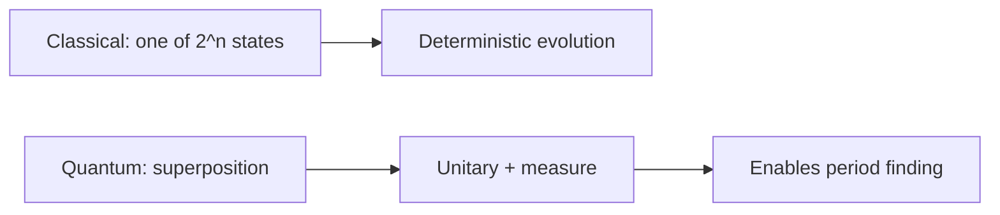

---

## 2.1 Classical vs. Quantum Computation

To understand why quantum computers pose an existential threat to much of modern cryptography, we must first develop a rigorous understanding of how quantum computation differs from classical computation at the most fundamental level. The distinction is not merely one of speed — quantum computers operate according to entirely different physical principles, enabling qualitatively new forms of information processing.

### Classical Bits and Deterministic Computation

A classical computer processes information using **bits** — binary digits that are definitively either 0 or 1. At the physical level, a bit is represented by a voltage level in a transistor, a magnetic orientation on a disk, or a charge state in a capacitor. Regardless of the physical implementation, a bit has exactly one value at any given moment. An n-bit register can be in exactly one of 2^n possible states at any given time. A classical 64-bit register, for example, holds precisely one of the approximately 1.8 × 10^19 possible configurations.

Classical algorithms process these states sequentially, or with limited parallelism through multiple processing cores. When a classical computer needs to search through possible solutions to a problem, it must examine them one at a time (or a few at a time with multiple cores). The fundamental information-processing model is that of a deterministic or probabilistic state machine transitioning between well-defined classical states.

The computational power of classical machines is remarkable — modern supercomputers perform over 10^18 floating-point operations per second. Yet certain mathematical problems resist efficient classical solution not because of insufficient hardware, but because of fundamental computational complexity barriers. It is precisely these barriers that quantum computation can sometimes circumvent.

### Quantum Bits (Qubits)

A **qubit** is the quantum analog of a classical bit, but it obeys the laws of quantum mechanics rather than classical physics. The simplest way to describe a qubit is through the mathematical formalism of quantum mechanics: a qubit is a two-level quantum system whose state is described by a vector in a two-dimensional complex Hilbert space.

Unlike a classical bit, a qubit can exist in a **superposition** of the |0⟩ and |1⟩ basis states simultaneously:

```
|ψ⟩ = α|0⟩ + β|1⟩
```

Here, α and β are complex numbers called **probability amplitudes**, and they must satisfy the normalization condition |α|² + |β|² = 1. The notation |0⟩ and |1⟩ (Dirac notation, or bra-ket notation) represents the two computational basis states, analogous to classical 0 and 1.

When a qubit is measured in the computational basis, the superposition collapses: the result is |0⟩ with probability |α|² or |1⟩ with probability |β|². After measurement, the qubit is irrevocably in whichever state was observed — the superposition is destroyed. This collapse upon measurement is one of the most counterintuitive aspects of quantum mechanics and has profound consequences for quantum algorithm design.

Physically, qubits can be realized in many systems: the spin of an electron (spin-up or spin-down), the polarization of a photon (horizontal or vertical), the energy levels of a superconducting circuit, or the internal states of a trapped ion. What matters is that the system has two distinguishable quantum states and can maintain coherent superpositions between them.

### Geometric Interpretation: The Bloch Sphere

A useful visualization of a single qubit's state is the **Bloch sphere**. Because a qubit state has two complex amplitudes subject to normalization and an overall phase freedom, its state can be parameterized by two real angles, theta and phi:

```
|ψ⟩ = cos(θ/2)|0⟩ + e^(iφ) sin(θ/2)|1⟩
```

This maps every possible qubit state to a point on the surface of a unit sphere. The north pole corresponds to |0⟩, the south pole to |1⟩, and all equatorial points represent equal superpositions with different relative phases. Single-qubit gates correspond to rotations of this sphere.

The Bloch sphere makes visible an important distinction: a classical bit has only two possible values (the poles), while a qubit has a continuous infinity of possible states (the entire sphere surface). However, measurement projects the state onto one of the poles, so extracting information from a qubit is fundamentally limited.

### The Power (and Limitations) of Superposition

An n-qubit register can exist in a superposition of all 2^n possible computational basis states simultaneously:

```
|ψ⟩ = Σ αᵢ|i⟩  for i = 0 to 2^n - 1
```

where the 2^n complex amplitudes satisfy Σ|αᵢ|² = 1. For n = 300 qubits, the number of amplitudes (2^300 ≈ 10^90) exceeds the estimated number of particles in the observable universe. This exponential state space is the fundamental resource that quantum computing exploits.

However, it is critical to understand what this does NOT mean. A common misconception is that a quantum computer "tries all possibilities at once" or is simply an exponentially parallel classical computer. This naive interpretation is incorrect for a crucial reason: measurement. When we measure the n-qubit register, we obtain only a single n-bit classical string, with probability determined by the amplitudes. The exponential amount of information encoded in the amplitudes is largely inaccessible through direct measurement.

The true power of quantum computation lies in the ability to manipulate amplitudes through quantum gates such that, after a carefully designed sequence of operations, the probability of measuring a desired answer is high. This manipulation relies on the phenomena of **entanglement** and **interference** — the genuine sources of quantum computational advantage.


**Figure 2.2 — Quantum circuit abstraction**


## 2.2 Key Quantum Phenomena

Three quantum mechanical phenomena underpin the power of quantum computation: superposition, entanglement, and interference. While superposition provides the exponential state space, entanglement creates correlations that enable efficient information processing across that space, and interference provides the mechanism for extracting useful answers.

### Superposition in Depth

Superposition is the principle that a quantum system can exist simultaneously in multiple eigenstates of an observable until a measurement is performed. For computation, this means a qubit is not merely in an unknown classical state — it genuinely exists in a combination of both states simultaneously. The evidence for this is the phenomenon of interference: if the qubit were simply in one state or the other (and we just didn't know which), we could never observe interference effects.

The distinction between quantum superposition and classical uncertainty is crucial. Consider a coin hidden under a cup — it is either heads or tails, and we simply lack knowledge. A qubit in superposition is fundamentally different: it is analogous to a coin that is genuinely both heads and tails until we look at it, and this "both-ness" has measurable physical consequences.

Superposition is fragile. Interactions with the environment cause **decoherence** — the gradual loss of quantum coherence that transforms a quantum superposition into a classical probability distribution. Maintaining superposition long enough to complete a computation is one of the central engineering challenges of quantum computing.

### Entanglement

**Quantum entanglement** creates correlations between qubits that have no classical analog and cannot be described by assigning individual states to each qubit separately. When qubits are entangled, the composite system exists in a state that cannot be written as a product of individual qubit states.

The simplest example is the Bell state (also called an EPR pair, after Einstein, Podolsky, and Rosen who first discussed such correlations in 1935):

```
|Φ+⟩ = (1/√2)(|00⟩ + |11⟩)
```

In this state, neither qubit has a definite individual state — only the pair has a well-defined joint state. Measuring the first qubit as 0 instantaneously determines that the second qubit will also be measured as 0, and vice versa — regardless of the physical separation between the qubits. Einstein famously called this "spooky action at a distance," but Note that entanglement cannot be used to transmit information faster than light.

For quantum computation, entanglement serves as a computational resource. An n-qubit system can be entangled in ways that create exponentially complex correlations. Quantum algorithms exploit these correlations to coordinate information processing across the full 2^n-dimensional state space in ways that would require exponential classical resources to simulate.

The amount of entanglement in a quantum computation is closely related to its computational power. Quantum computations that create only limited entanglement can typically be simulated efficiently on classical computers. Conversely, the computations that provide exponential speedups (such as Shor's algorithm) necessarily generate large amounts of entanglement throughout their execution.

There are four maximally entangled two-qubit states, known collectively as the Bell states:

```
|Φ+⟩ = (1/√2)(|00⟩ + |11⟩)
|Φ-⟩ = (1/√2)(|00⟩ - |11⟩)
|Ψ+⟩ = (1/√2)(|01⟩ + |10⟩)
|Ψ-⟩ = (1/√2)(|01⟩ - |10⟩)
```

These states form a basis for two-qubit systems and play fundamental roles in quantum teleportation, superdense coding, and various quantum protocols.

### Interference

**Quantum interference** is arguably the most important phenomenon for quantum algorithm design. Because probability amplitudes are complex numbers, they can add constructively (increasing the magnitude and thus the measurement probability) or destructively (decreasing or eliminating the measurement probability).

Consider a qubit that is put into superposition and then subjected to two possible computational paths. If one path contributes an amplitude of +1/2 and another contributes +1/2 to a particular output, the total amplitude is +1, giving certainty of measuring that output (constructive interference). If instead one path contributes +1/2 and another -1/2, the total amplitude is zero, making that output impossible (destructive interference).

Well-designed quantum algorithms structure their computations so that paths leading to correct answers interfere constructively while paths leading to incorrect answers interfere destructively. The quintessential example is Deutsch's algorithm (1985), which demonstrated that a quantum computer could determine a global property of a function with one evaluation, where a classical computer would require two. Though a toy problem, it established the paradigm of interference-based quantum speedup.

Grover's search algorithm provides another illuminating example. It iteratively applies operations that increase the amplitude of the marked item while decreasing the amplitudes of unmarked items. After approximately √N iterations (for a database of size N), the amplitude of the correct answer approaches 1 while all others approach 0. This √N scaling (versus N for classical search) represents the quadratic speedup achievable through interference for unstructured problems.

### The No-Cloning Theorem

An additional quantum principle with profound implications is the **no-cloning theorem**, which states that it is impossible to create an exact copy of an arbitrary unknown quantum state. Mathematically, there exists no unitary operation U such that U|ψ⟩|0⟩ = |ψ⟩|ψ⟩ for all |ψ⟩.

While this theorem limits certain quantum operations (you cannot "back up" a quantum computation mid-way), it is also the foundation of quantum key distribution security. Any attempt to eavesdrop on a quantum communication channel necessarily disturbs the transmitted quantum states, making the eavesdropping detectable.

> **Author's note:** Brief executives on **measurement collapse** before gate fidelities—otherwise qubits sound like magic.

## 2.3 Quantum Gates and Circuits

Quantum computation is performed by applying **quantum gates** — unitary transformations — to qubits. The unitarity requirement (the gate's matrix U satisfies U†U = I, where U† is the conjugate transpose) ensures that quantum operations are reversible and preserve the normalization of quantum states.

### Single-Qubit Gates

Single-qubit gates transform the state of one qubit and are represented by 2×2 unitary matrices.

**Hadamard Gate (H):** The Hadamard gate is perhaps the most important single-qubit gate in quantum computing. It creates an equal superposition from a basis state and is essential for initializing quantum algorithms:

```
H|0⟩ = (1/√2)(|0⟩ + |1⟩)
H|1⟩ = (1/√2)(|0⟩ - |1⟩)
```

In matrix form: H = (1/√2)[[1, 1], [1, -1]]. Note the critical minus sign in H|1⟩ — this relative phase is what makes interference possible. When Hadamard is applied to all n qubits initialized to |0⟩, the result is an equal superposition over all 2^n basis states, which is the starting point for many quantum algorithms.

**Pauli Gates (X, Y, Z):** These three gates form the basis of single-qubit operations.
- Pauli-X: The quantum NOT gate, mapping |0⟩ → |1⟩ and |1⟩ → |0⟩. On the Bloch sphere, it is a 180° rotation about the X-axis.
- Pauli-Y: Maps |0⟩ → i|1⟩ and |1⟩ → -i|0⟩. A 180° rotation about the Y-axis.
- Pauli-Z: Leaves |0⟩ unchanged but maps |1⟩ → -|1⟩. A 180° rotation about the Z-axis. This is a phase gate that introduces a relative phase of -1.

**Phase Gates (S and T):** These gates add relative phases to the |1⟩ component without changing the measurement probabilities in the computational basis:
- S gate: Adds a phase of i (π/2 rotation about Z-axis)
- T gate: Adds a phase of e^(iπ/4) (π/8 rotation about Z-axis)

The T gate is particularly important because the gate set {H, T, CNOT} is universal for quantum computation — any quantum operation can be approximated to arbitrary precision using only these gates. The T gate is also the most expensive gate to implement fault-tolerantly, which has significant implications for the resource requirements of quantum algorithms.

**Rotation Gates:** General rotation gates R_x(θ), R_y(θ), and R_z(θ) perform rotations by angle θ about the respective axes of the Bloch sphere. These provide continuous parameterization of single-qubit operations and are important in variational quantum algorithms.

### Multi-Qubit Gates

Multi-qubit gates create entanglement and correlations between qubits, enabling the full computational power of quantum systems.

**CNOT (Controlled-NOT):** The CNOT gate is the fundamental two-qubit gate. It flips the target qubit if and only if the control qubit is in state |1⟩:

```
CNOT|00⟩ = |00⟩
CNOT|01⟩ = |01⟩
CNOT|10⟩ = |11⟩
CNOT|11⟩ = |10⟩
```

When the control qubit is in superposition, CNOT creates entanglement. For example: applying CNOT to H|0⟩ ⊗ |0⟩ produces the Bell state (1/√2)(|00⟩ + |11⟩). This two-step process (Hadamard followed by CNOT) is the standard method for generating entangled pairs.

**Controlled-Z (CZ):** Applies a phase flip (Z gate) to the target qubit when the control qubit is |1⟩. Unlike CNOT, the CZ gate is symmetric between its two qubits — either can be considered the "control."

**Toffoli Gate (CCNOT):** A controlled-controlled-NOT gate that flips the target qubit only when both control qubits are |1⟩. The Toffoli gate is universal for classical reversible computation, meaning any classical Boolean function can be implemented using only Toffoli gates (with ancilla bits). Combined with Hadamard, it becomes universal for quantum computation as well.

**SWAP Gate:** Exchanges the states of two qubits. This is particularly important for architectures with limited connectivity, where qubits can only interact with their neighbors and SWAP operations are needed to bring distant qubits into proximity.

### The Circuit Model of Quantum Computation

A quantum algorithm is expressed as a **quantum circuit** — a sequence of quantum gates applied to a register of qubits, read from left to right in time. The circuit model of quantum computation, introduced by David Deutsch in 1989, is the most common framework for describing quantum algorithms relevant to cryptography.

A typical quantum circuit proceeds in three stages:

1. **Initialization:** All qubits are prepared in a known state, typically |0⟩^⊗n.
2. **Unitary evolution:** A sequence of quantum gates transforms the state, creating superpositions, entanglement, and interference patterns.
3. **Measurement:** Some or all qubits are measured in the computational basis, yielding a classical bit string as output.

The depth of a circuit (the length of the longest path from input to output) and its width (the number of qubits) are the primary measures of a circuit's resource requirements. For cryptographic applications, both the total number of gates (particularly T gates) and the circuit depth (which determines runtime) are critical parameters.

### Universal Gate Sets

A gate set is **universal** if any unitary operation can be approximated to arbitrary precision using gates from the set. The Solovay-Kitaev theorem guarantees that if a gate set generates a dense subset of SU(2), then any single-qubit unitary can be approximated to precision ε using O(log^c(1/ε)) gates from the set, where c ≈ 3.97 (with later improvements reducing this constant). Combined with an entangling two-qubit gate (such as CNOT), this enables universal quantum computation on any number of qubits through standard circuit decomposition techniques.

Common universal gate sets include:
- {H, T, CNOT} — the standard fault-tolerant gate set
- {H, Toffoli} — useful for reversible classical computation within quantum circuits
- Arbitrary single-qubit rotations plus CNOT — used in hardware-native compilations

## 2.4 Quantum Computational Complexity

Understanding the computational power of quantum computers requires the framework of computational complexity theory — the study of what problems can be solved efficiently with given computational resources.

### BQP: Bounded-Error Quantum Polynomial Time

**BQP** (Bounded-Error Quantum Polynomial Time) is the class of decision problems solvable by a quantum computer in polynomial time with bounded error probability. Specifically, a problem is in BQP if there exists a polynomial-time quantum algorithm that:
- Accepts YES instances with probability at least 2/3
- Rejects NO instances with probability at least 2/3

The choice of 2/3 is arbitrary; any constant strictly greater than 1/2 gives the same class, since probability amplification through repetition can make the error exponentially small.

BQP is the quantum analog of **BPP** (Bounded-Error Probabilistic Polynomial Time) for classical randomized algorithms. The fundamental question of quantum computational complexity is whether BQP strictly contains BPP — that is, whether quantum computers can efficiently solve problems that are intractable classically.

### Relationships Between Complexity Classes

The known relationships between relevant complexity classes form a hierarchy:

```
P ⊆ BPP ⊆ BQP ⊆ PSPACE
```

Additionally:
- P ⊆ BQP (anything efficiently solvable classically and deterministically is also efficiently solvable quantumly)
- BQP ⊆ PSPACE (quantum computations can be simulated with polynomial space, though potentially exponential time)
- It is strongly believed that P ⊊ BQP (quantum provides genuine advantage)
- NP is not known to be contained in BQP, and it is widely believed that NP ⊄ BQP

The problems most relevant to cryptography — integer factoring and the discrete logarithm problem — occupy a particularly interesting position. They are believed to be in BQP (solvable efficiently by quantum computers via Shor's algorithm) but not in BPP (not solvable efficiently by classical computers). They are also not believed to be NP-complete, which places them in an intermediate zone of classical hardness that quantum computers can penetrate.

### What Quantum Computers Cannot Efficiently Solve

It is essential to understand the limitations of quantum computation. Quantum computers are NOT universal problem-solvers:

**NP-Complete Problems:** There is no known quantum algorithm that solves NP-complete problems (such as the traveling salesman problem, Boolean satisfiability, or graph coloring) in polynomial time. While Grover's algorithm provides a quadratic speedup for searching, it does not collapse the exponential complexity of NP-complete problems into polynomial time. The best known quantum algorithms for NP-complete problems still require exponential time.

**Unstructured Search:** For finding a marked item among N unsorted items, Grover's algorithm achieves an optimal O(√N) query complexity. This is provably optimal for quantum computers — no quantum algorithm can do better. This represents "only" a quadratic speedup over the classical O(N) bound.

**PSPACE-Complete Problems:** Problems requiring exponential space classically are equally hard for quantum computers.

**Structure is Essential:** Quantum speedups arise from exploiting mathematical structure in problems — the periodicity in factoring (for Shor's algorithm), the symmetry in search (for Grover's algorithm), or the algebraic structure in hidden subgroup problems. Problems without such exploitable structure generally do not admit significant quantum speedup.

### Quantum Speedups: A Taxonomy

Quantum advantages over classical computation come in several flavors:

| Speedup Type | Classical | Quantum | Example |
|-------------|-----------|---------|---------|
| Exponential | O(2^n) | O(poly(n)) | Integer factoring (Shor's) |
| Super-polynomial | O(2^(n^(1/3))) | O(poly(n)) | Certain oracle problems |
| Polynomial (quadratic) | O(N) | O(√N) | Unstructured search (Grover's) |
| Polynomial (cubic) | O(N^(3/2)) | O(N) | Some graph problems |
| None | O(f(n)) | O(f(n)) | Sorting, many classical tasks |

For cryptography, the exponential speedup provided by Shor's algorithm is devastating: problems that would take billions of years classically can be solved in hours quantumly. The quadratic speedup of Grover's algorithm is significant but manageable: it effectively halves the bit-security of symmetric schemes, requiring a simple doubling of key lengths to compensate.

## 2.5 Quantum Error Correction

Real quantum hardware is extraordinarily fragile. Qubits lose their quantum coherence through interactions with the environment (decoherence), and quantum gates introduce errors at rates many orders of magnitude higher than classical logic gates. Quantum error correction (QEC) is the theoretical and practical framework that makes large-scale quantum computation possible despite these imperfections.

### Sources of Quantum Errors

Quantum errors are fundamentally different from classical bit-flip errors. A classical bit can only suffer one type of error: a flip from 0 to 1 or vice versa. A qubit, existing in a continuous state space, can suffer a continuum of errors. However, the theory of quantum error correction shows that it suffices to correct for a discrete set of errors:

**Bit-flip errors (X errors):** The qubit flips from |0⟩ to |1⟩ or vice versa, analogous to classical bit errors.

**Phase-flip errors (Z errors):** The relative phase between |0⟩ and |1⟩ is flipped. This has no classical analog and represents a uniquely quantum source of error. The state α|0⟩ + β|1⟩ becomes α|0⟩ - β|1⟩.

**Combined errors (Y errors):** Both bit-flip and phase-flip occur simultaneously.

**Decoherence:** Gradual loss of quantum information to the environment, characterized by two timescales — T1 (energy relaxation time, governing amplitude decay) and T2 (dephasing time, governing phase coherence loss).

**Gate errors:** Imperfect implementation of quantum gates, causing small rotational errors that accumulate over the course of a computation.

**Measurement errors:** Incorrect readout of qubit states, confusing |0⟩ for |1⟩ and vice versa.

**Crosstalk:** Unintended interactions between qubits, particularly in densely packed architectures.

### Principles of Quantum Error Correction

Quantum error correction faces unique challenges compared to classical error correction:

1. **No-cloning theorem:** Quantum states cannot be copied, ruling out the simplest classical redundancy approach.
2. **Measurement collapse:** Measuring a qubit to check for errors would destroy the very information we want to protect.
3. **Continuous errors:** Unlike discrete classical bit flips, quantum errors are continuous rotations.

The breakthrough insight, developed independently by Peter Shor (1995) and Andrew Steane (1996), was that these obstacles can be overcome:

- Instead of copying, information is encoded non-locally across multiple physical qubits using entanglement.
- Errors are detected through **syndrome measurements** — measurements of multi-qubit parity operators that reveal error information without collapsing the encoded state.
- Remarkably, correcting only discrete Pauli errors (X, Y, Z) suffices to correct arbitrary continuous errors, because any error can be decomposed into a linear combination of Pauli errors.

### The Surface Code

The **surface code**, proposed by Alexei Kitaev (1997) and developed extensively by others, is currently the leading candidate for practical quantum error correction. Its key advantages include:

- **High threshold:** Error threshold of approximately 1% per physical gate operation, which is achievable with current hardware.
- **Local connectivity:** Requires only nearest-neighbor interactions on a 2D grid of qubits, matching the natural architecture of superconducting and many other platforms.
- **Efficient decoding:** Syndrome measurements can be processed efficiently using classical algorithms like minimum-weight perfect matching.

In the surface code, a logical qubit is encoded in a 2D lattice of physical qubits. The code distance d (roughly the side length of the lattice) determines the number of errors that can be corrected: up to (d-1)/2 errors. A distance-d surface code requires approximately 2d² physical qubits per logical qubit.

For example, a distance-17 surface code (capable of correcting up to 8 simultaneous errors) requires approximately 578 physical qubits per logical qubit. At a physical error rate of 10^-3, this achieves a logical error rate of approximately 10^-12 per logical gate — sufficient for computations of considerable depth.

### The Threshold Theorem

The **threshold theorem** (also called the accuracy threshold theorem) is one of the most important results in quantum computing theory. Proved in the late 1990s through the work of Aharonov and Ben-Or, Kitaev, Knill, Laflamme, and Zurek, it states:

*If the physical error rate per gate operation is below a certain threshold value p_th, then an arbitrarily long quantum computation can be performed with an arbitrarily small logical error rate, provided sufficient physical qubits are available.*

The theorem guarantees that the overhead (the number of physical qubits needed per logical qubit) grows only polylogarithmically with the desired computation length. Specifically, to achieve a logical error rate of ε for a computation of L logical gates, the physical overhead per logical qubit scales as O(polylog(L/ε)).

The threshold value depends on the error correction code and the noise model:
- Surface codes: p_th ≈ 10^-2 (1%) for depolarizing noise
- Concatenated codes: p_th ≈ 10^-4 to 10^-5
- Color codes: p_th ≈ 10^-2 (similar to surface codes)

The threshold theorem transformed quantum computing from a theoretical curiosity into a potentially achievable engineering goal. Before this theorem, it was unclear whether quantum computation was even possible in principle, given the inevitability of noise. After it, the question became one of engineering: can we build hardware with error rates below threshold?

### Logical vs. Physical Qubits

The distinction between **logical qubits** and **physical qubits** is fundamental to understanding the resource requirements of quantum computation:

- A **physical qubit** is a single real-world quantum system (a superconducting circuit, a trapped ion, etc.) that is subject to noise and errors.
- A **logical qubit** is an encoded qubit protected by quantum error correction, consisting of many physical qubits working together to store and process one qubit of quantum information fault-tolerantly.

The ratio of physical to logical qubits depends on the desired logical error rate, the physical error rate, and the error correction code used. Current estimates for cryptographically relevant computations suggest:

| Scenario | Physical Error Rate | Code Distance | Physical Qubits per Logical Qubit |
|----------|-------------------|---------------|----------------------------------|
| Near-term optimistic | 10^-3 | d = 17 | ~578 |
| Moderate | 10^-3 | d = 23 | ~1,058 |
| Conservative | 10^-4 | d = 13 | ~338 |
| Very conservative | 10^-3 | d = 27 | ~1,458 |

For breaking RSA-2048 using Shor's algorithm, estimates range from approximately 4,000 to 20,000 logical qubits depending on algorithmic optimizations. Combined with the physical-to-logical overhead, this translates to roughly 4 million to 20 million physical qubits — a formidable but not physically impossible engineering target.

### Magic State Distillation

A critical bottleneck in fault-tolerant quantum computation is the implementation of non-Clifford gates, particularly the T gate. While Clifford gates (H, S, CNOT) can be implemented transversally (directly on encoded qubits), the T gate requires a technique called **magic state distillation**.

Magic state distillation is a process that takes many copies of noisy "magic states" (specially prepared quantum states) and produces fewer copies of higher-fidelity magic states. These purified magic states are then consumed to implement T gates fault-tolerantly. The process is resource-intensive: producing a single high-fidelity magic state may require hundreds or thousands of physical qubits and multiple rounds of distillation.

Since T gates dominate the resource cost of many quantum algorithms (including Shor's algorithm for factoring), optimizing T-gate count and magic state distillation is an active area of research with direct implications for when cryptographically relevant quantum computers will become feasible.

## 2.6 Current State of Quantum Hardware (2025-2026)

The landscape of quantum computing hardware has evolved rapidly, with multiple technology platforms competing to achieve practical quantum advantage. Understanding the current state of hardware is essential for assessing the timeline to cryptographically relevant quantum computers.

### Performance Metrics

Quantum hardware is characterized by several key metrics:

- **Qubit count:** The total number of physical qubits available.
- **Gate fidelity:** The accuracy of quantum gate operations, typically reported as 1 minus the error rate. Two-qubit gate fidelity is usually the limiting factor.
- **Coherence time:** How long qubits maintain their quantum state (T1 and T2 times).
- **Connectivity:** Which qubits can directly interact (all-to-all vs. nearest-neighbor).
- **Circuit depth:** The maximum number of sequential gate operations before errors dominate.
- **Quantum volume:** A holistic benchmark introduced by IBM that accounts for qubit count, connectivity, and gate fidelity.

### Current Hardware Capabilities

As of 2025-2026, the state of the art across major platforms is:

| Platform | Leading Systems | Qubit Count | Two-Qubit Gate Fidelity | Coherence Times | Connectivity |
|----------|----------------|-------------|------------------------|-----------------|--------------|
| Superconducting | IBM Heron, Google Willow | 100-1,000+ | 99.5-99.9% | 100-300 μs | Nearest-neighbor (heavy-hex, grid) |
| Trapped Ion | Quantinuum H2, IonQ Forte | 30-60 (fully connected) | 99.7-99.9% | Seconds to minutes | All-to-all |
| Neutral Atom | QuEra, Pasqal | 100-1,000+ | 99.0-99.5% | ~1 second | Reconfigurable |
| Photonic | Xanadu Borealis, PsiQuantum | Variable (mode-dependent) | Architecture-dependent | N/A (photons don't decohere) | Graph-dependent |

The most notable recent milestones include demonstrations of quantum error correction below the break-even point — where an error-corrected logical qubit outperforms its constituent physical qubits — achieved by several groups using surface codes and related schemes.

### The NISQ Era and Beyond

The current period of quantum computing development is often called the **NISQ** (Noisy Intermediate-Scale Quantum) era, a term coined by John Preskill in 2018. NISQ devices have tens to hundreds of qubits but lack full error correction, limiting the depth of circuits they can execute reliably.

NISQ devices cannot run Shor's algorithm at a cryptographically relevant scale. The factoring of RSA-2048 requires thousands of logical qubits operating through circuits of enormous depth — far beyond NISQ capabilities. The transition from NISQ to the fault-tolerant era is the critical milestone for cryptographic security.

Current progress toward fault tolerance includes:
- Demonstration of repeated error correction cycles
- Logical qubit lifetimes exceeding physical qubit lifetimes
- Real-time decoding and feedback at speeds compatible with computation
- Initial demonstrations of logical gate operations between error-corrected qubits

## 2.7 Quantum Computing Architectures

Several distinct physical platforms are being developed for quantum computing, each with unique advantages and challenges. The diversity of approaches increases the probability that at least one will achieve the scale needed for cryptographically relevant computation.

### Superconducting Qubits

**Leading Organizations:** IBM, Google, Rigetti, Alice & Bob, OQC

**Physical Basis:** Superconducting qubits use electrical circuits made from superconducting materials (typically aluminum on silicon) cooled to approximately 15 millikelvin — colder than outer space. At these temperatures, electrical resistance vanishes and quantum behavior emerges at the circuit level. The qubit is formed by a Josephson junction — a thin insulating barrier between two superconductors — which creates a nonlinear oscillator with quantized energy levels. The lowest two energy levels serve as |0⟩ and |1⟩.

**Advantages:**
- Fast gate operations: Single-qubit gates in 20-50 nanoseconds, two-qubit gates in 50-300 nanoseconds
- Leverages existing semiconductor fabrication infrastructure
- Highly scalable manufacturing processes
- Strong industrial investment and engineering expertise
- Well-developed control electronics

**Challenges:**
- Extreme cooling requirements (dilution refrigerators)
- Limited connectivity (typically nearest-neighbor on a planar chip)
- Coherence times of 100-300 microseconds limit circuit depth
- Frequency crowding as qubit counts increase
- Wiring and control challenges for scaling beyond thousands of qubits

**Scaling Roadmap:** IBM has articulated a roadmap targeting over 100,000 qubits by the late 2020s through modular architectures connecting multiple quantum processors via quantum interconnects. Google has similarly outlined plans for building systems with millions of qubits through error correction.

### Trapped Ions

**Leading Organizations:** Quantinuum (Honeywell), IonQ, AQT, Universal Quantum

**Physical Basis:** Trapped-ion quantum computers use individual atoms (typically ytterbium-171, barium-133, or calcium-40) suspended in electromagnetic traps in ultra-high vacuum. The qubit is encoded in two internal energy states of the ion (such as hyperfine ground states). Ions are manipulated using precisely tuned laser pulses or microwave radiation. Two-qubit gates are mediated through the shared vibrational (phonon) modes of the ion chain.

**Advantages:**
- Highest gate fidelities of any platform (>99.9% for single-qubit, >99.7% for two-qubit)
- All-to-all connectivity (any qubit can interact with any other)
- Long coherence times (seconds to minutes, even hours for certain encodings)
- Identical qubits (all ions of the same species are physically identical)
- Mature laser technology

**Challenges:**
- Slower gate operations (1-100 microseconds for two-qubit gates)
- Scaling beyond ~50-100 ions in a single trap is difficult due to mode crowding
- Requires complex laser systems and ultra-high vacuum
- Photon interconnects between trap modules are lossy and slow
- SWAP overhead in modular architectures

**Scaling Roadmap:** The path to large-scale trapped-ion quantum computers involves modular architectures where small ion traps (each holding 20-50 ions) are connected via photonic interconnects or ion shuttling between trap zones. Quantinuum has demonstrated systematic improvements in qubit count and fidelity with each hardware generation.

### Neutral Atoms

**Leading Organizations:** QuEra, Pasqal, Atom Computing, Planqc

**Physical Basis:** Neutral atom quantum computers trap individual atoms (typically rubidium or cesium) using focused laser beams called optical tweezers. The atoms are arranged in programmable 2D or 3D arrays. Qubits are encoded in the atomic ground states or in highly excited Rydberg states. Two-qubit gates exploit the strong dipole-dipole interactions between atoms in Rydberg states — when one atom is excited to a Rydberg state, it shifts the energy levels of nearby atoms, preventing their simultaneous excitation (the Rydberg blockade mechanism).

**Advantages:**
- Large qubit counts achievable (hundreds to thousands of atoms)
- Reconfigurable connectivity (atoms can be physically rearranged)
- Native multi-qubit gates (the Rydberg blockade naturally extends to multiple atoms)
- Mid-circuit measurement and feedforward demonstrated
- Relatively simple vacuum and laser requirements compared to ions

**Challenges:**
- Two-qubit gate fidelities still below trapped-ion levels (99.0-99.5%)
- Atom loss during computation
- Finite temperature effects
- Relatively new platform with less engineering maturity
- Rydberg state lifetimes limit gate sequences

**Scaling Roadmap:** Neutral atom systems have a natural path to thousands of qubits through larger optical tweezer arrays. The ability to rearrange atoms mid-computation provides a unique advantage for implementing error correction codes that require non-local connectivity.

### Photonic Quantum Computing

**Leading Organizations:** Xanadu, PsiQuantum, ORCA Computing, Quandela

**Physical Basis:** Photonic quantum computers use individual photons (particles of light) as qubits. The qubit can be encoded in polarization, path, time-bin, or other photonic degrees of freedom. Photonic gates are implemented using beam splitters, phase shifters, and nonlinear optical elements. Measurement-based quantum computing (MBQC) is a common paradigm, where a large entangled "cluster state" is first prepared, and computation proceeds by performing adaptive single-qubit measurements.

**Advantages:**
- Room temperature operation (no cryogenics or vacuum needed)
- Photons naturally travel at the speed of light, enabling fast operations
- Natural interface with quantum networks and communication
- No decoherence in transit (photons don't interact with the environment unless made to)
- Silicon photonic fabrication leverages existing semiconductor industry

**Challenges:**
- Photon loss is the dominant error mechanism
- Deterministic two-photon gates are extremely difficult (photons don't naturally interact)
- Probabilistic operations require resource-intensive multiplexing
- Single-photon sources and detectors remain imperfect
- Large physical footprint for some implementations

**Scaling Roadmap:** PsiQuantum has pursued a "manufacturing-first" approach, designing photonic quantum computers for production in existing semiconductor fabs. Xanadu has developed the Borealis system demonstrating quantum advantage in specific sampling tasks. The photonic approach potentially offers the fastest path to millions of physical qubits if manufacturing challenges are overcome.

### Topological Quantum Computing

**Leading Organization:** Microsoft

**Physical Basis:** Topological quantum computing aims to encode quantum information in topological properties of exotic quasiparticles called **non-Abelian anyons** (specifically Majorana zero modes). These topological states are inherently protected against local perturbations — errors would require changing the global topology of the system, which is exponentially unlikely for local noise. Gates are performed by braiding anyons around each other, with the computation depending only on the topological class of the braiding pattern, not on the precise path taken.

**Advantages:**
- Inherent hardware-level error protection (topological protection)
- Potentially much lower overhead for error correction
- Gate operations are exact (depending only on topology, not on precise control)
- Could dramatically reduce the physical-to-logical qubit ratio

**Challenges:**
- Non-Abelian anyons have been extremely difficult to create and verify experimentally
- Microsoft reported initial evidence of Majorana-based topological qubits in 2023-2025, but the technology remains in early stages
- The engineering path from demonstrated topological qubits to a full computer is unclear
- If topological protection proves insufficient, additional error correction may still be needed

**Scaling Roadmap:** If topological qubits can be reliably manufactured, they could potentially provide a shortcut to fault-tolerant quantum computing by building error protection into the physics itself. However, the technology currently lags behind other platforms in maturity by several years, and its ultimate feasibility remains uncertain.

### Comparative Summary

| Architecture | Gate Speed | Fidelity | Scalability | Error Correction Overhead | Timeline to CRQC |
|-------------|-----------|----------|-------------|--------------------------|-------------------|
| Superconducting | Very fast (ns) | High (99.5-99.9%) | Good (fabrication-based) | High (many physical per logical) | 10-20 years |
| Trapped Ion | Moderate (μs) | Highest (>99.7%) | Moderate (modular) | Moderate-High | 15-25 years |
| Neutral Atom | Moderate (μs) | Improving (99-99.5%) | Very good (large arrays) | High (but improving) | 12-22 years |
| Photonic | Fast (ps-ns) | Variable | Potentially very good | Architecture-dependent | 10-20 years |
| Topological | Varies | Potentially highest | Unknown | Potentially very low | 15-30+ years |

## 2.8 Timeline to Cryptographically Relevant Quantum Computers

A **Cryptographically Relevant Quantum Computer (CRQC)** is a quantum computer capable of breaking widely deployed public-key cryptographic schemes — specifically, one that can factor 2048-bit RSA moduli or compute discrete logarithms in elliptic curve groups of cryptographic size within a practically relevant timeframe (hours to weeks, rather than millions of years).

### Resource Requirements for Breaking RSA-2048

The resource requirements for factoring a 2048-bit number using Shor's algorithm have been extensively studied and optimized:

| Study/Year | Logical Qubits | T-gate Count | Physical Qubits (estimated) | Runtime |
|-----------|---------------|--------------|----------------------------|---------|
| Fowler et al. (2012) | ~4,000 | ~10^10 | ~1 billion | Days |
| Gidney & Ekerå (2021) | ~2,050 algorithm qubits (~6,000 total logical qubits with ancillas) | ~10^9 | ~20 million | 8 hours |
| Litinski (2023) | ~3,700 | ~10^9 | ~4 million | Hours |
| Various optimistic (2024-2025) | ~2,000-3,000 | ~10^8-10^9 | ~1-4 million | Hours |

The dramatic reduction in estimated resources over time reflects ongoing algorithmic and architectural optimizations. Gidney and Ekerå's 2021 paper, in particular, demonstrated that careful algorithm engineering could reduce requirements by orders of magnitude compared to naive implementations.

Key resource drivers include:
- **Modular arithmetic:** Performing modular exponentiation on a quantum computer requires significant qubit overhead for carry propagation and intermediate storage.
- **T-gate count:** Each T gate requires a magic state, and magic state distillation dominates the physical qubit footprint.
- **Circuit depth:** Determines the total computation time and the logical error rate requirements.
- **Parallelism vs. qubit count:** There is a time-space tradeoff — more qubits enable faster computation through parallelized magic state distillation.

### Factors Determining the Timeline

Several independent factors must converge for a CRQC to be realized:

**1. Physical Qubit Count Scaling**

Current systems have hundreds to a few thousand physical qubits. Reaching millions requires:
- Advances in fabrication yield and uniformity
- Solutions to the "wiring problem" (controlling millions of qubits with classical electronics)
- Thermal management at scale (for cryogenic platforms)
- Modular architectures with high-bandwidth quantum interconnects

**2. Error Rate Reduction**

Physical error rates must be sustainably below the error correction threshold (approximately 0.1-1% depending on the code). While individual gates at these fidelities have been demonstrated, maintaining such performance at scale across millions of qubits during extended computations is a separate challenge.

**3. Error Correction Overhead Reduction**

The number of physical qubits per logical qubit depends on:
- The physical error rate (lower is better)
- The error correction code efficiency
- The target logical error rate (determined by total computation length)
- New error correction codes or techniques that reduce overhead

**4. Algorithmic Improvements**

Continued optimization of quantum algorithms for factoring could reduce resource requirements further. Areas of active research include:
- More efficient modular arithmetic circuits
- Better strategies for T-gate synthesis and optimization
- Hybrid classical-quantum approaches that offload parts of the computation
- Alternative algorithms (beyond standard Shor) with lower resource requirements

**5. Engineering Integration**

Beyond individual components, a CRQC requires the integration of:
- Fast, reliable classical control systems for real-time error decoding
- Scalable cryogenic (or other) infrastructure
- Efficient classical-quantum interfaces
- Reliable operation over the hours-to-days timescales needed for computation

### Expert Timeline Estimates

The question of when a CRQC will exist has been addressed by numerous expert surveys, government reports, and industry roadmaps:

**Conservative Estimates (20-30+ years, i.e., 2045-2055+):**
- Assume current progress rates without major breakthroughs
- Point to the enormous gap between current capabilities and requirements
- Note that quantum computing has repeatedly been "10 years away" for decades
- Emphasize unforeseen engineering challenges at scale

**Moderate Estimates (10-20 years, i.e., 2035-2045):**
- Based on extrapolation of recent progress rates
- Assume continued investment and incremental advances
- Account for known algorithmic optimizations reducing requirements
- Align with major industry roadmaps (IBM, Google)

**Aggressive Estimates (5-15 years, i.e., 2030-2040):**
- Assume one or more significant breakthroughs (topological qubits, new error correction codes, algorithmic advances)
- Consider that current progress may be accelerating
- Note historical precedents where technology developed faster than expected once a threshold was crossed

**The "Black Swan" Scenario:**
- A completely new approach or breakthrough could dramatically accelerate the timeline
- Examples: a new factoring algorithm requiring fewer qubits, a hardware breakthrough enabling million-qubit systems sooner than expected
- While unlikely in any given year, cannot be ruled out over a decade

### The "Harvest Now, Decrypt Later" Threat

Regardless of the exact timeline, adversaries can employ a **store-now-decrypt-later** (SNDL) strategy: intercepting and storing encrypted communications today with the intention of decrypting them once a CRQC becomes available. This means that information that must remain confidential for 15 or more years is effectively already at risk from quantum computers, even though CRQCs do not yet exist.

This threat model means that organizations with long-lived secrets (government agencies, healthcare systems, financial institutions, critical infrastructure) should be transitioning to post-quantum cryptography now, regardless of their specific estimate for CRQC arrival.

### Investment Landscape

The global investment in quantum computing reflects the perceived strategic importance of this technology:

- **Government Investment:** Major national quantum initiatives exist in the United States ($1.2 billion National Quantum Initiative, plus defense and intelligence funding), China (estimated $15+ billion), the European Union (€1 billion Quantum Flagship), the United Kingdom (£2.5 billion National Quantum Strategy), and many other nations.
- **Private Investment:** Annual private investment in quantum computing companies exceeds $30 billion globally, with major technology companies (Google, IBM, Microsoft, Amazon) and specialized startups (IonQ, Rigetti, PsiQuantum, Quantinuum) receiving significant funding.
- **Strategic Competition:** Multiple nations treat quantum computing as a strategic priority, creating a competitive dynamic that accelerates development independent of commercial market forces.

## 2.9 The Quantum Advantage for Cryptanalysis

The relevance of quantum computing to cryptography is highly specific. Quantum computers do not threaten all cryptography equally — they provide devastating advantages against certain mathematical problems while offering only modest improvements against others.

### Shor's Algorithm: Exponential Speedup

**Shor's algorithm**, published by Peter Shor in 1994, provides an efficient quantum algorithm for integer factoring and computing discrete logarithms. These are precisely the mathematical problems underlying the most widely deployed public-key cryptographic systems:

- **RSA:** Security relies on the difficulty of factoring large semiprimes (products of two large primes). Shor's algorithm factors an n-bit integer in O(n³) quantum gate operations, compared to the best classical algorithms requiring sub-exponential time O(exp(n^(1/3) · (log n)^(2/3))).
- **Diffie-Hellman Key Exchange:** Security relies on the discrete logarithm problem in finite fields. Shor's algorithm solves this in polynomial time.
- **Elliptic Curve Cryptography (ECC):** Security relies on the elliptic curve discrete logarithm problem. A modified version of Shor's algorithm solves this in polynomial time.
- **DSA/ECDSA Digital Signatures:** These signature schemes are also based on discrete logarithm problems and are equally vulnerable.

The speedup provided by Shor's algorithm is exponential — transforming a problem requiring billions of years of classical computation into one requiring hours of quantum computation. This is not merely a matter of using larger key sizes; no practical increase in RSA key length can provide security against Shor's algorithm, because the quantum algorithm's runtime grows only polynomially with the key size.

### Grover's Algorithm: Quadratic Speedup

**Grover's algorithm**, published by Lov Grover in 1996, provides an optimal quantum algorithm for unstructured search. Given a function f that evaluates to 1 for exactly one of N possible inputs, Grover's algorithm finds that input using only O(√N) evaluations, compared to O(N) classically.

For symmetric cryptography, this means:
- **Key search:** A brute-force quantum search for an n-bit key requires 2^(n/2) operations instead of 2^n. This effectively halves the security level: AES-128 provides only 64 bits of quantum security.
- **Collision finding:** Quantum algorithms can find hash collisions somewhat faster than classical birthday attacks, though the speedup is less than quadratic due to memory limitations.
- **Pre-image attacks:** Finding hash pre-images is accelerated quadratically.

The practical impact of Grover's algorithm on symmetric cryptography is manageable: doubling key lengths (e.g., using AES-256 instead of AES-128) restores the original security level. This is why post-quantum cryptography focuses primarily on replacing public-key schemes rather than symmetric ones.

### Beyond Shor and Grover

Other quantum algorithms with cryptographic relevance include:

- **Quantum period-finding:** Generalizes Shor's algorithm to break other algebraic cryptosystems based on hidden subgroup problems in Abelian groups.
- **Kuperberg's algorithm:** Provides sub-exponential quantum algorithms for certain non-Abelian hidden subgroup problems, relevant to some proposed post-quantum schemes.
- **Quantum random walks:** Provide polynomial speedups for various graph and search problems, with potential cryptanalytic applications.
- **Variational quantum algorithms:** While currently limited by noise, these could potentially find heuristic speedups for optimization problems related to cryptanalysis (lattice reduction, code decoding).

### Why Post-Quantum Cryptography Is Possible

The existence of quantum speedups for factoring and discrete logarithms does NOT mean all cryptography is doomed. Post-quantum cryptography is possible because:

1. **Quantum computers are not universal solvers:** They do not efficiently solve NP-hard problems or all exponential-time problems.
2. **Different mathematical structures:** Lattice problems, error-correcting code problems, multivariate polynomial problems, and hash-based constructions lack the algebraic structure (hidden subgroups in Abelian groups) that Shor's algorithm exploits.
3. **Proven hardness results:** For some post-quantum constructions (particularly hash-based signatures), security can be reduced to well-understood minimal assumptions.
4. **Extensive cryptanalysis:** Decades of quantum algorithm research have failed to find efficient quantum algorithms for the problems underlying post-quantum candidates.

The fundamental insight is that quantum speedups require exploitable mathematical structure. The periodic structure in modular exponentiation enables Shor's algorithm; the symmetric structure in unstructured search enables Grover's algorithm. Problems without such structure — such as finding short vectors in high-dimensional lattices — appear to resist quantum speedup, making them suitable foundations for post-quantum cryptography.---

## Chapter Summary

**Technical takeaway:** Quantum advantage is structural (superposition, interference), not 'infinitely fast classical cores.'

**Deployment takeaway:** Brief leadership on CRQC uses logical qubits and error correction overhead, not marketing qubit counts.

*Figures in this chapter are planning aids—verify all algorithm names and byte sizes against the current NIST FIPS PDF before implementation.*

---

---

# Chapter 3: Shor's and Grover's Algorithms

This is the **kill chain** chapter: which algorithms die, which shrink security margins, and what you must replace first.

**Figure 3.1 — Attack map to primitives**

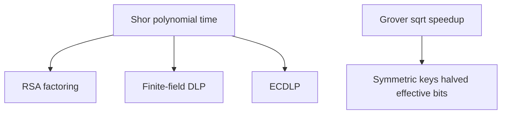

---

Classical hardness assumptions are the contract we have been living under—Shor voids that contract for public-key systems.

## 3.1 The Foundation of Classical Cryptographic Security

Modern cryptography does not rely on secrecy of algorithms. Instead, it rests on a fundamentally different pillar: the assumption that certain mathematical problems are computationally intractable for any classical computer, regardless of the ingenuity of the attacker. This is a subtle but critical distinction. We do not claim these problems are impossible to solve — only that solving them requires resources (time, memory, energy) that exceed what any adversary could plausibly muster within a meaningful timeframe.

This entire framework is built on unproven assumptions. No one has ever proven that integer factorization or discrete logarithm computation is inherently hard. We have no proof that P does not equal NP. What we have instead is decades of empirical evidence: generations of brilliant mathematicians and computer scientists have tried — and failed — to find efficient algorithms for these problems. This accumulated failure constitutes our evidence of security, and it has served us remarkably well for over four decades.

### The Three Pillars of Public-Key Security

The central hard problems underpinning virtually all deployed public-key cryptography are:

**Integer Factorization Problem (IFP):** Given a composite integer N = p * q, where p and q are large primes each approximately n/2 bits long, find the factors p and q. RSA encryption and RSA signatures rely directly on this problem. The product N can be computed trivially in O(n^2) time, but reversing this multiplication — finding p and q given only N — appears to require sub-exponential time with the best known algorithms.

**Discrete Logarithm Problem (DLP):** Given a cyclic group G of order q with generator g, and an element h in G, find the integer x (with 0 <= x < q) such that g^x = h. The Diffie-Hellman key exchange protocol, DSA signatures, and ElGamal encryption all derive their security from this problem, typically instantiated in multiplicative groups of finite fields Z_p* where p is a large prime.

**Elliptic Curve Discrete Logarithm Problem (ECDLP):** Given an elliptic curve E defined over a finite field F_q, a base point P of order n on E, and a point Q = kP (computed via the group law of the elliptic curve), find the scalar k. ECDH key exchange, ECDSA signatures, and EdDSA all rely on this problem. The ECDLP is considered harder than the DLP in finite fields because index calculus methods do not transfer to generic elliptic curve groups.

### Classical Algorithmic Complexity

The best known classical algorithms for these problems operate in sub-exponential or fully exponential time:

**For Integer Factorization:** The General Number Field Sieve (GNFS) achieves a running time of O(exp(c * n^(1/3) * (log n)^(2/3))) where n is the number of bits in N and c is approximately 1.923. For a 2048-bit RSA modulus, this translates to roughly 2^112 operations — placing it firmly beyond the reach of any classical computer or network of computers operating for any reasonable duration. The largest number factored by GNFS as of 2024 is RSA-250, an 829-bit number, which required approximately 2700 core-years of computation.

**For Discrete Logarithm in Finite Fields:** Index calculus methods achieve complexity similar to GNFS, approximately O(exp(c * n^(1/3) * (log n)^(2/3))). The best records are comparable to factoring records of similar bit sizes, achieved through massive distributed computations.

**For ECDLP:** Unlike the previous two problems, no sub-exponential algorithm is known for generic elliptic curves. The best attacks are Pollard's rho algorithm and the baby-step giant-step algorithm, both achieving O(sqrt(n)) = O(2^(k/2)) complexity where k is the bit-length of the group order. This means a 256-bit elliptic curve provides approximately 128 bits of classical security — hence the efficiency advantage of ECC over RSA (256-bit ECC keys provide comparable security to 3072-bit RSA keys).

### Why These Problems Are Chosen

The choice of these particular problems is not arbitrary. Good cryptographic hard problems must satisfy several properties simultaneously. They must be hard on average, not merely in the worst case. They must have a trapdoor structure allowing efficient computation in one direction (public key operations) while remaining hard in the reverse direction (private key recovery). They must permit efficient key generation through knowledge of the secret structure. And they must have been studied extensively enough that confidence in their hardness is well-founded.

For forty years, this approach has proven extraordinarily successful. Despite enormous financial incentives (breaking RSA would enable stealing billions), no one has found polynomial-time classical algorithms for any of these problems. But quantum computers change the calculus entirely.

> **Author's note:** Treat Shor-vulnerable keys as **expired** once CRQC exists—plan backward from data lifetime.


**Figure 3.2 — Grover impact on AES**

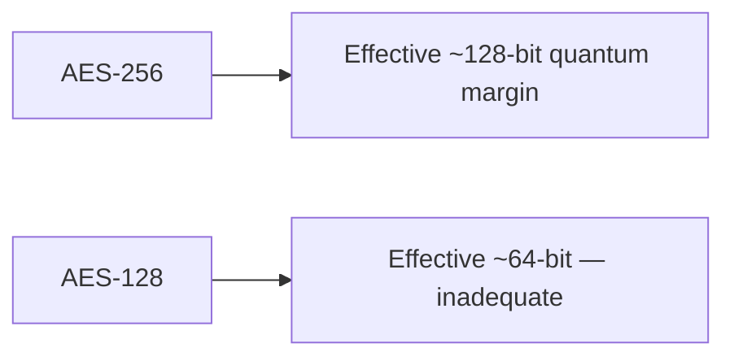

## 3.2 Shor's Algorithm: The Quantum Threat to Public-Key Cryptography

In 1994, Peter Shor, working at Bell Labs, published a quantum algorithm that solves both integer factorization and discrete logarithm in polynomial time. This single paper represents perhaps the most consequential algorithmic discovery in the history of computer science — not because of what it enables constructively, but because of what it destroys. Shor's algorithm renders the entire foundation of public-key cryptography obsolete, given a sufficiently powerful quantum computer.

### Conceptual Foundation: Period Finding

The key insight underlying Shor's algorithm is that both factoring and discrete logarithm can be reduced to a problem quantum computers solve efficiently: finding the period of a periodic function. Classical computers have no known efficient method for period finding in general, but quantum computers exploit quantum interference — the same phenomenon that creates diffraction patterns with light — to extract periodicity from superpositions of function values.

The algorithm divides cleanly into two parts: a classical reduction that converts the cryptographic problem into a period-finding problem, and a quantum subroutine that solves the period-finding problem using quantum parallelism and the Quantum Fourier Transform.

### The Factoring Algorithm: Step by Step

Given a composite integer N to factor (where N is the product of two large primes), Shor's algorithm proceeds as follows:

**Step 1 — Classical Preprocessing:** Choose a random integer a uniformly from {2, 3, ..., N-1}. Compute gcd(a, N) using Euclid's algorithm. If gcd(a, N) > 1, we have found a factor of N (this happens with negligible probability for random a when N has only two large prime factors). Otherwise, proceed with this a.

**Step 2 — Problem Reformulation:** We now need to find the order r of a modulo N — that is, the smallest positive integer r such that a^r is congruent to 1 modulo N. Once we have r, classical number theory gives us the factors with high probability.

**Step 3 — Quantum State Preparation:** Prepare two quantum registers. The first register contains n = ceil(log2(N^2)) qubits (providing sufficient precision), initialized to |0>. The second register contains ceil(log2(N)) qubits, also initialized to |0>. Apply Hadamard gates to every qubit in the first register, creating a uniform superposition over all values from 0 to 2^n - 1:

State after Hadamard: (1/sqrt(2^n)) * sum_{x=0}^{2^n - 1} |x>|0>

**Step 4 — Modular Exponentiation:** Apply the unitary operator that maps |x>|0> to |x>|a^x mod N>. This is the computationally expensive quantum step, requiring a reversible circuit for modular exponentiation. After this operation, the state becomes:

(1/sqrt(2^n)) * sum_{x=0}^{2^n - 1} |x>|a^x mod N>

The key property is that the function f(x) = a^x mod N is periodic with period r. The second register now contains values that repeat with period r, and the first register is entangled with the second in a periodic pattern.

**Step 5 — Quantum Fourier Transform:** Apply the Quantum Fourier Transform (QFT) to the first register only. The QFT maps the computational basis state |j> to (1/sqrt(2^n)) * sum_{k=0}^{2^n - 1} exp(2*pi*i*j*k/2^n) |k>. Applied to a state with period r, the QFT concentrates the amplitude on states |k> where k is close to a multiple of 2^n / r. This is precisely analogous to how a classical Fourier transform converts a periodic time-domain signal into frequency-domain peaks.

**Step 6 — Measurement:** Measure the first register. The outcome k will, with high probability, be close to some integer multiple j * (2^n / r) for some j in {0, 1, ..., r-1}. This gives us the rational approximation k/2^n that is close to j/r.

**Step 7 — Classical Post-Processing:** Use the continued fractions algorithm to extract r from the measured value k/2^n. The continued fractions algorithm efficiently finds the best rational approximation j/r to the decimal k/2^n with denominator bounded by N. If we obtain the correct r (or a divisor of r), proceed. Otherwise, repeat the quantum steps with a new random a or new measurement.

**Step 8 — Extracting Factors:** If r is even (which occurs with probability at least 1/2 for random a), compute gcd(a^(r/2) + 1, N) and gcd(a^(r/2) - 1, N). With probability at least 1/2 (conditioned on r being even), at least one of these GCDs yields a non-trivial factor of N. The total success probability per iteration is at least 1/4, so O(1) repetitions suffice.

### The Quantum Fourier Transform in Detail

The Quantum Fourier Transform is the heart of Shor's algorithm — the component that gives quantum computers their exponential advantage for this problem. The QFT maps an n-qubit state |j> (representing the integer j in binary) to:

QFT|j> = (1/sqrt(2^n)) * sum_{k=0}^{2^n-1} exp(2*pi*i*j*k/2^n) |k>

This can be decomposed into a product representation that reveals the efficient circuit structure:

QFT|j> = (1/sqrt(2^n)) * tensor_product_{l=1}^{n} (|0> + exp(2*pi*i*j/2^l) |1>)

The circuit implementation requires only n Hadamard gates and n(n-1)/2 controlled rotation gates, giving a total gate count of O(n^2). This is exponentially more efficient than the classical Fast Fourier Transform (FFT), which requires O(n * 2^n) operations on a vector of 2^n elements. The quantum advantage arises because the QFT operates on the amplitudes of a quantum state — which encode 2^n values using only n qubits — whereas the classical FFT must explicitly manipulate all 2^n values.

Each controlled rotation gate R_k applies a phase of exp(2*pi*i/2^k) conditioned on a control qubit. The gates are applied in a specific pattern: qubit 1 receives a Hadamard followed by controlled rotations from all subsequent qubits; qubit 2 receives a Hadamard followed by controlled rotations from qubits 3 through n; and so on. A final swap operation reverses the qubit ordering.

### Complexity Analysis

The overall complexity of Shor's algorithm decomposes as follows:

**Quantum Circuit for Modular Exponentiation:** This is the most expensive component. Computing a^x mod N reversibly requires O(n^2) elementary quantum gates using schoolbook multiplication, or O(n * log n * log log n) gates using asymptotically faster multiplication algorithms. The circuit depth (important for error correction overhead) is O(n^2) to O(n^3) depending on the implementation strategy and parallelism trade-offs.

**Quantum Fourier Transform:** Requires O(n^2) gates and O(n) depth with full parallelization. In practice, approximate QFT implementations that drop small-angle rotations below a threshold can reduce this to O(n * log n) gates without affecting the algorithm's success probability.

**Overall Running Time:** The total quantum gate complexity is O(n^2 * log n * log log n) for the best known implementations. This is polynomial in n — specifically, roughly cubic in the number of bits of N. Compare this to the GNFS running time of O(exp(1.923 * n^(1/3) * (log n)^(2/3))), which is sub-exponential but super-polynomial.

**Concrete Comparison for RSA-2048 (n = 2048 bits):**

| Metric | Classical (GNFS) | Quantum (Shor's) |
|--------|-----------------|-------------------|
| Time complexity | ~2^112 operations | ~2^26 quantum operations |
| Wall-clock time | Billions of years (single core) | Hours to days (on CRQC) |
| Parallelizability | High (distributed) | Limited (sequential iterations) |
| Memory | Enormous (petabytes) | ~4000+ logical qubits |

The exponential-to-polynomial collapse means that no amount of key-size increase can save RSA against a quantum computer. Doubling the RSA key length from 2048 to 4096 bits increases the classical attack cost by a factor of roughly 2^35, but only increases the quantum attack cost by a factor of about 8 (since Shor's scales polynomially). This is fundamentally different from symmetric key cryptography where doubling the key size squares the attack cost.

### Resource Requirements for Breaking RSA-2048

Translating the abstract gate complexity into physical resource estimates requires accounting for quantum error correction overhead. Logical qubits must be encoded in many physical qubits to achieve fault tolerance, and the overhead depends on the error rate of physical qubits and the error correction code used.

**Logical Qubit Requirements:** The most optimized implementations of Shor's algorithm for RSA-2048 require approximately 4,000-6,000 logical qubits. The 2021 paper by Gidney and Ekerå showed that 2,048 + 2 logical qubits suffice using windowed arithmetic and measurement-based uncomputation, representing a significant improvement over naive implementations that require 3n to 5n logical qubits.

**T-gate Count and Depth:** The dominant cost in fault-tolerant quantum computing is T-gates (pi/8 rotation gates), as these require expensive magic state distillation. The Gidney-Ekerå construction requires approximately 2.7 * 10^9 Toffoli gates (each decomposable into T-gates). The overall T-depth is approximately 10^10, meaning the computation requires roughly 10 billion sequential layers of T-gates.

**Physical Qubit Requirements:** Using the surface code (the leading candidate for error correction) with physical qubit error rates of approximately 10^-3 (achievable in current superconducting qubit systems), each logical qubit requires roughly 1,000 to 5,000 physical qubits depending on the required code distance. Total physical qubit estimates for breaking RSA-2048 range from approximately 4 million (optimistic, assuming low error rates and efficient architectures) to 20 million (conservative, assuming higher error rates and less aggressive optimization).

**Time Estimates:** With a quantum gate clock speed of 1 microsecond (typical for superconducting qubits) and accounting for error correction overhead (each logical operation requires multiple rounds of syndrome measurement), total execution time estimates range from 8 hours to several days. Faster gate times (achievable with trapped ions at slower clock speeds but higher fidelity, or with future superconducting architectures) could alter this considerably.

**Recent Optimization Milestones:**

| Research Group | Year | Logical Qubits | Toffoli Gates | Key Innovation |
|---------------|------|----------------|---------------|----------------|
| Beauregard | 2003 | 2n + 3 | O(n^3) | In-place addition |
| Häner et al. | 2017 | 2n + 2 | O(n^2 * log n) | Windowed arithmetic |
| Gidney & Ekerå | 2021 | 2n + 2 | ~0.3n^2 * n | Measurement-based uncomputation |
| Latest estimates | 2024 | ~2050 | ~2.7 * 10^9 | Combined optimizations |

### Shor's Algorithm for the Discrete Logarithm Problem

Shor's algorithm extends naturally to computing discrete logarithms, breaking Diffie-Hellman, DSA, and related schemes. The adaptation for computing discrete logarithms in a cyclic group of order N works as follows:

**Problem Statement:** Given a cyclic group G = <g> of known order N, a generator g, and a target element h = g^s where s is unknown, find s.

**Step 1:** Prepare three quantum registers. The first two registers each contain n = ceil(log2(N)) qubits initialized to superposition; the third register holds group elements.

**Step 2:** Create the superposition state: (1/N) * sum_{a=0}^{N-1} sum_{b=0}^{N-1} |a>|b>|g^a * h^b>

Since h = g^s, this equals: (1/N) * sum_{a=0}^{N-1} sum_{b=0}^{N-1} |a>|b>|g^(a + s*b)>

**Step 3:** Apply the QFT to both the first and second registers independently.

**Step 4:** Measure both registers. The measurement outcomes (u, v) satisfy the relation u + s*v is congruent to 0 modulo N (with high probability). This gives us s is congruent to -u * v^(-1) modulo N (when v is invertible).

**Step 5:** A single successful measurement yields s directly (assuming v is coprime to N), or O(1) repetitions suffice.

The gate complexity for discrete logarithm computation is comparable to factoring: O(n^2 * log n * log log n) where n = log2(N).

### Complete Destruction of Elliptic Curve Cryptography

The adaptation of Shor's algorithm to elliptic curve groups is particularly devastating because ECC achieves its efficiency precisely through smaller key sizes — which translates to requiring fewer qubits to break.

For an elliptic curve defined over a field F_q where q is approximately 2^k (so the curve provides approximately k/2 bits of classical security), Shor's algorithm for ECDLP requires:

- **Logical qubits:** Approximately 2k + O(log k) — roughly 521 logical qubits for the P-256 curve
- **Quantum gates:** Approximately 10^8 to 10^9 Toffoli gates for P-256
- **Physical qubits:** Approximately 500,000 to 2,500,000 with surface codes (fewer than RSA-2048)
- **Estimated runtime:** Minutes to hours on a CRQC

The irony is profound: ECC was developed and promoted specifically as a more efficient alternative to RSA, offering equivalent security with much smaller keys. But this same compactness makes it easier to attack quantumly. A quantum computer capable of breaking P-256 would require roughly 5-10 times fewer physical qubits than one capable of breaking RSA-2048. This means that if quantum computing progress follows a gradual trajectory, ECC will become vulnerable significantly before RSA does — the opposite of the classical security ranking.

This affects every system using ECDH for key exchange, ECDSA or EdDSA for digital signatures, and any protocol built upon these primitives. TLS 1.3 uses ECDH by default for key establishment; SSH commonly uses Ed25519; Bitcoin and Ethereum use secp256k1 ECDSA; and Signal Protocol uses X25519 for its key agreement.

## 3.3 Grover's Algorithm: The Quadratic Speedup

In 1996, Lov Grover published a quantum algorithm for unstructured search that achieves a quadratic speedup over any classical algorithm. Unlike Shor's algorithm, which provides an exponential speedup for structured algebraic problems, Grover's provides a more modest — but still significant — quadratic improvement for generic search problems. Crucially, this quadratic speedup has been proven optimal: no quantum algorithm can search an unstructured database faster than O(sqrt(N)).

### The Search Problem

The formal problem is as follows: Given a boolean function f: {0,1}^n -> {0,1} (implemented as a quantum oracle) that evaluates to 1 for exactly one input x_0 (the "marked item") and 0 for all other inputs, find x_0.

Classically, any algorithm must evaluate f at least 2^n / 2 times on average (and 2^n - 1 times in the worst case) since there is no structure to exploit — the marked item could be anywhere. Grover's algorithm finds x_0 with high probability using only O(sqrt(2^n)) = O(2^(n/2)) oracle queries.

### The Algorithm: Amplitude Amplification

Grover's algorithm is best understood as a rotation in a two-dimensional subspace. Define |w> = |x_0> (the target state) and |s> = (1/sqrt(2^n)) * sum_x |x> (the uniform superposition). The algorithm works by repeatedly rotating the state vector toward |w> in the plane spanned by |w> and the component of |s> orthogonal to |w>.

**Step 1 — Initialization:** Prepare the uniform superposition by applying Hadamard gates to all n qubits: |psi_0> = H^(tensor n)|0>^n = (1/sqrt(2^n)) * sum_{x=0}^{2^n - 1} |x>

This state has equal amplitude 1/sqrt(2^n) on every computational basis state, including the target x_0. The initial probability of measuring x_0 is therefore 1/2^n — negligibly small.

**Step 2 — Grover Iteration (repeat k = floor(pi/4 * sqrt(2^n)) times):**

Each iteration consists of two operations:

**(a) Oracle Operator (O_f):** This operator applies a phase inversion to the marked state. It maps |x> to (-1)^f(x) |x>. Concretely, it negates the amplitude of |x_0> while leaving all other amplitudes unchanged. Implementing this requires a quantum circuit that computes f — for cryptographic applications, this means implementing the target cryptographic function (like AES or SHA) as a reversible quantum circuit.

**(b) Diffusion Operator (D):** This operator performs a reflection about the uniform superposition |s>. It is defined as D = 2|s><s| - I, which can be implemented as H^(tensor n) * (2|0><0| - I) * H^(tensor n). Geometrically, this reflects the state about the mean amplitude. After the oracle has negated the amplitude of the marked item (making it negative while others remain positive), the diffusion operator reflects about the mean — which increases the amplitude of the marked item while decreasing all others.

**Step 3 — Measurement:** After k iterations, measure all qubits in the computational basis. The probability of obtaining x_0 is sin^2((2k+1) * theta) where theta = arcsin(1/sqrt(2^n)). For the optimal k approximately equal to pi/4 * sqrt(2^n), this probability approaches 1.

### Geometric Interpretation

The evolution of Grover's algorithm has an elegant geometric interpretation. In the two-dimensional plane spanned by |w> (the target) and |s'> (the uniform superposition over non-target states), the initial state |s> makes an angle theta approximately equal to 1/sqrt(2^n) with |s'>. Each Grover iteration rotates the state by exactly 2*theta toward |w>. After approximately pi/(4*theta) approximately equal to pi/4 * sqrt(2^n) iterations, the state has rotated to align with |w>, at which point measurement yields the target with near-certainty.

This geometric picture also reveals an important subtlety: if we iterate too many times, the state rotates past |w> and the success probability decreases. The number of iterations must be chosen carefully. For the case of multiple marked items (M items out of 2^n), the optimal number of iterations is approximately pi/4 * sqrt(2^n / M).

### Oracle Construction for Cryptographic Functions

For Grover's algorithm to attack a cryptographic system, the oracle must implement the relevant cryptographic function as a reversible quantum circuit. This is where theory meets practical difficulty.

**AES Oracle:** To search for an AES-128 key, the oracle must implement AES-128 encryption as a quantum circuit. Given a known plaintext-ciphertext pair (P, C), the oracle marks key K if AES_K(P) = C. Implementing AES reversibly requires: all S-box lookups must be implemented as reversible circuits (requiring ancilla qubits to store intermediate values); the MixColumns and ShiftRows operations must be made reversible; and garbage bits must be uncomputed. Estimates suggest this requires approximately 2,000 to 7,000 qubits for the AES circuit alone, plus ancilla overhead.

**SHA-256 Oracle:** For preimage attacks on SHA-256, the oracle must implement the full SHA-256 compression function reversibly. This requires approximately 2,500 to 5,000 qubits for the hash circuit, not including ancilla.

The total qubit count for a Grover attack includes: qubits for the n-bit search space (128 or 256), qubits for the oracle circuit, ancilla qubits for maintaining reversibility, and potentially additional qubits for error correction.

### Complexity and Optimality

**Query Complexity:** Grover's algorithm uses O(sqrt(N)) = O(2^(n/2)) oracle queries where N = 2^n is the size of the search space. This is provably optimal by the BBBV theorem (Bennett, Bernstein, Brassard, Vazirani, 1997): any quantum algorithm for unstructured search must make at least Omega(sqrt(N)) queries.

**Gate Complexity:** Each Grover iteration requires one oracle call (whose cost depends on the specific function being inverted) plus O(n) gates for the diffusion operator. Total gate complexity is O(sqrt(N) * C_oracle) where C_oracle is the gate count of the oracle circuit.

**Space Complexity:** The algorithm requires n qubits for the search register plus whatever ancilla the oracle requires. For practical cryptographic attacks, total qubit requirements are moderate but non-trivial.

### Impact on Symmetric Cryptography

Grover's algorithm effectively halves the security level of all symmetric cryptographic primitives when measured in bits:

| Algorithm | Key/Output Size | Classical Security | Quantum Security (Grover) |
|-----------|----------------|-------------------|--------------------------|
| AES-128 | 128 bits | 128 bits | 64 bits |
| AES-192 | 192 bits | 192 bits | 96 bits |
| AES-256 | 256 bits | 256 bits | 128 bits |
| ChaCha20 | 256 bits | 256 bits | 128 bits |
| SHA-256 preimage | 256 bits | 256 bits | 128 bits |
| SHA-512 preimage | 512 bits | 512 bits | 256 bits |
| SHA-256 collision | 256 bits | 128 bits | ~85 bits (BHT) |
| HMAC-SHA-256 | 256-bit key | 256 bits | 128 bits |

The standard mitigation is straightforward: use AES-256 instead of AES-128, providing 128 bits of post-quantum security — universally considered sufficient for the foreseeable future.

### Practical Considerations Limiting Grover's Effectiveness

While Grover's algorithm is theoretically significant, several practical considerations substantially limit its real-world threat to symmetric cryptography:

**1. Sequential Nature:** Grover's algorithm is inherently sequential — the sqrt(N) iterations must be performed one after another, as each iteration depends on the result of the previous one. This means the algorithm cannot be parallelized in the way classical brute-force search can. A classical adversary with 2^64 processors can search a 2^128 space in 2^64 time steps. A quantum adversary with a single quantum processor searches the same space in 2^64 iterations of Grover's. Multiple quantum processors offer only marginal improvement: t quantum processors searching in parallel reduce the time to sqrt(N/t) iterations each, requiring sqrt(t * N) total quantum operations across all processors — worse than linear speedup.

**2. Circuit Depth and Coherence Time:** Each Grover iteration requires implementing the full cryptographic primitive (like AES-256) as a quantum circuit. For AES-256, this involves approximately 2,000+ logical gates per iteration. With 2^128 iterations needed and each iteration requiring thousands of gates, the total circuit depth exceeds 10^41 — requiring quantum coherence to be maintained for an astronomical duration. With current error correction schemes, this translates to extraordinary physical qubit counts.

**3. Energy Considerations:** Landauer's principle and its quantum generalizations suggest that even with perfect reversible computation, the energy required to perform 2^64 sequential quantum operations at any reasonable clock speed would be substantial. While this argument is not as tight as for classical computation, it provides additional practical constraints.

**4. Comparison with Classical Parallelism:** The critical comparison is not "quantum Grover's vs. single classical computer" but rather "quantum Grover's vs. massively parallel classical search." A botnet or dedicated ASIC farm with 2^40 nodes can search a 128-bit keyspace in 2^88 time steps classically. Grover's would require 2^64 sequential quantum iterations. The quantum advantage is real but not as overwhelming as in the case of Shor's algorithm breaking RSA.

**5. Implementation Overhead:** The constant factors hidden in the O(sqrt(N)) notation are substantial. The reversible circuit for AES requires careful management of ancilla qubits, garbage collection, and T-gate distillation. Realistic estimates suggest that breaking AES-256 with Grover's would require quantum resources so enormous as to be impractical for decades or centuries beyond the point where Shor's algorithm becomes feasible for breaking RSA.

For these reasons, the cryptographic community's consensus is that Grover's algorithm poses a manageable threat to symmetric cryptography. The recommended mitigation — doubling key sizes — is simple, well-understood, and carries minimal performance overhead. The existential threat to cryptography comes from Shor's algorithm attacking public-key systems, not from Grover's algorithm attacking symmetric systems.

## 3.4 Other Quantum Algorithms Relevant to Cryptography

Beyond Shor's and Grover's, several other quantum algorithms have implications for cryptographic security, either by providing additional attack capabilities or by illuminating the boundary between quantum-hard and quantum-easy problems.

### Simon's Algorithm

Simon's algorithm (1994) solves the following problem: given a function f: {0,1}^n -> {0,1}^n with the promise that there exists a secret string s such that f(x) = f(y) if and only if x XOR y is in {0, s} (i.e., f is either one-to-one or two-to-one with structure determined by s), find s. The algorithm requires only O(n) quantum queries, compared to Omega(2^(n/2)) classical queries — an exponential separation.

**Cryptographic Relevance:** Simon's algorithm is directly applicable to attacking certain block cipher constructions when the attacker has quantum superposition access to the encryption oracle (the Q2 or quantum chosen-plaintext model). Specifically:

- The two-round Even-Mansour construction can be broken in polynomial quantum queries
- Certain modes of operation (like CBC-MAC) become insecure under quantum superposition attacks
- The Poly1305 MAC is vulnerable to Simon-style attacks in the superposition oracle model
- Offset codebook mode (OCB) and related authenticated encryption schemes require careful analysis

The practical relevance of Simon's algorithm is debated: the Q2 model assumes the attacker can make quantum superposition queries to the cryptographic primitive, which requires the legitimate user's hardware to process quantum states — an unrealistic assumption in most deployed scenarios. However, it is relevant for analyzing the quantum security of symmetric constructions in theoretical cryptography and may become relevant in settings where quantum computers serve as oracles (e.g., in cloud computing scenarios or for quantum-accessible random oracles in post-quantum security proofs).

### The Hidden Subgroup Problem Framework

Many quantum speedups, including Shor's algorithm, are instances of the Hidden Subgroup Problem (HSP). The HSP is defined as follows: given a group G and a function f: G -> X that is constant on (left) cosets of an unknown subgroup H and distinct across different cosets, determine H.

**Abelian HSP:** When G is abelian (commutative), the HSP can be solved efficiently in polynomial time using the quantum Fourier transform over G. Shor's factoring algorithm is the HSP over Z (with H = rZ for the order r). Shor's discrete logarithm algorithm is the HSP over Z x Z. The QFT over finite abelian groups generalizes naturally, and efficient quantum circuits exist for any abelian group.

**Non-Abelian HSP:** When G is non-abelian, the situation is dramatically different. Despite decades of effort, no efficient quantum algorithm is known for the HSP over general non-abelian groups. Specific cases of interest include:

- *Symmetric group S_n:* The HSP over S_n would solve graph isomorphism in polynomial time. No efficient quantum algorithm is known.
- *Dihedral group D_n:* The HSP over D_n is related to finding the shortest vector in a lattice. Only subexponential-time quantum algorithms are known (not polynomial).
- *Free groups and braid groups:* These are relevant to certain proposed cryptographic schemes.

The difficulty of non-abelian HSP is actually good news for post-quantum cryptography. Several PQC proposals derive their security from problems that can be phrased as non-abelian HSP instances, and the apparent quantum hardness of these problems provides evidence for the security of the corresponding cryptographic schemes. The hardness of the dihedral HSP, in particular, provides evidence that lattice problems (which underlie NIST's primary PQC standards) are resistant to quantum attacks.

### Quantum Walk Algorithms

Quantum walks — the quantum analog of classical random walks on graphs — provide polynomial speedups for various computational problems. Unlike Shor's exponential speedup or Grover's quadratic speedup, quantum walks typically provide speedups in specific algebraic or combinatorial settings.

**Applications to Cryptanalysis:**

*Subset-Sum Problem:* Quantum walk algorithms improve the best known attacks on the subset-sum problem from classical O(2^(n/2)) (meet-in-the-middle) to approximately O(2^(n/3)) time using O(2^(n/3)) quantum memory. This is relevant because some cryptographic schemes (particularly certain hash-based and lattice-based constructions) have security related to subset-sum hardness.

*Collision Finding Enhancement:* Quantum walks on Johnson graphs improve collision-finding beyond the basic birthday attack. The Ambainis quantum walk algorithm finds collisions in approximately O(N^(1/3)) time (matching BHT but with different space-time trade-offs).

*Code-Based Cryptography:* Quantum walk techniques provide moderate speedups for information set decoding (ISD) algorithms, which are the best known attacks against code-based cryptographic schemes like Classic McEliece. The speedups are polynomial rather than exponential, meaning code-based schemes remain secure with moderately increased parameters.

*Lattice Problems:* Quantum walks and related quantum techniques provide limited speedups for lattice sieving algorithms. The best known quantum attacks on lattice problems achieve running time approximately 2^(0.2570*n) compared to classical 2^(0.2925*n) for the Shortest Vector Problem (SVP) in dimension n. This represents a meaningful but not devastating constant-factor improvement in the exponent, addressable by modest parameter increases.

### BHT Algorithm (Brassard-Hoyer-Tapp)

The BHT algorithm (1997) finds collisions in arbitrary functions more efficiently than classical algorithms, combining Grover's search with a classical birthday approach.

**The Algorithm:** Given a function f: {0,1}^n -> {0,1}^n, the BHT algorithm finds a collision (two inputs mapping to the same output) using O(2^(n/3)) quantum queries and time:

1. Classically evaluate f on 2^(n/3) random inputs, storing the results in a sorted table
2. Use Grover's algorithm to search (over the remaining inputs) for a value that collides with one of the stored values
3. The Grover search over 2^n inputs needs only sqrt(2^n / 2^(n/3)) = 2^(n/3) iterations because the probability of a collision with the table is 2^(n/3) / 2^n = 2^(-2n/3)

**Impact on Hash Functions:**

| Security Property | Hash Output n bits | Classical Security | BHT Quantum Security |
|------------------|-------------------|-------------------|---------------------|
| Preimage resistance | n | n bits | n/2 bits (Grover) |
| Second preimage | n | n bits | n/2 bits (Grover) |
| Collision resistance | n | n/2 bits | n/3 bits (BHT) |

For SHA-256: classical collision resistance is 128 bits; quantum collision resistance is approximately 85 bits (256/3). For SHA-384: quantum collision resistance is approximately 128 bits. This is why NIST recommends SHA-384 or SHA-512 for applications requiring long-term collision resistance in the post-quantum era.

### Quantum Multi-Target Attacks

When multiple targets exist (e.g., searching for any one of many keys that might be in use across a system), quantum algorithms gain additional advantage. For M targets in a space of size N:

- Classical: O(N/M) expected evaluations
- Grover's: O(sqrt(N/M)) evaluations

This means that large-scale deployments where many keys are simultaneously in use face a slightly worse security picture. If a billion (approximately 2^30) different AES-128 keys are simultaneously in use across a network, a quantum adversary needs only sqrt(2^128 / 2^30) = 2^49 Grover iterations to break any one of them — considerably less than the nominal 2^64 single-target bound. This motivates the recommendation for AES-256 even more strongly in enterprise and infrastructure contexts.

## 3.5 What Quantum Computers Cannot Break

Understanding the limits of quantum computing is just as important as understanding its capabilities. Not all hard problems succumb to quantum speedups, and identifying the boundary between quantum-easy and quantum-hard is precisely what enables the construction of post-quantum cryptographic systems.

### Information-Theoretically Secure Primitives

Some cryptographic constructions are secure against any adversary, regardless of computational power — classical or quantum:

**One-Time Pad (OTP):** The one-time pad achieves perfect secrecy (Shannon's theorem). No amount of quantum computation helps against a scheme where the key is truly random, used only once, and as long as the message. The limitation is purely practical: key distribution and single-use requirements.

**Secret Sharing (Shamir's scheme over finite fields):** Information-theoretic secret sharing remains perfectly secure against quantum adversaries. A (t, n)-threshold scheme reveals zero information about the secret to any coalition of fewer than t parties.

**Quantum Key Distribution (QKD):** QKD protocols like BB84 achieve security based on the laws of quantum physics themselves. While QKD solves the key distribution problem, it requires a quantum communication channel and has severe practical limitations (distance, speed, cost).

### Symmetric Primitives with Adequate Parameters

Symmetric cryptographic primitives are not fundamentally broken by quantum computers — they merely lose a factor of two in their security level due to Grover's algorithm. With appropriately sized parameters:

**AES-256:** Provides 128 bits of security against quantum attacks. Given the practical limitations of Grover's algorithm discussed in Section 3.3, AES-256 is universally considered quantum-safe. No algorithm beyond Grover's provides advantage against AES when treated as an ideal cipher.

**SHA-384 and SHA-512:** These hash functions maintain adequate collision resistance (128+ bits) against quantum collision-finding algorithms. SHA-3 (Keccak) similarly maintains adequate security with appropriate output sizes.

**HMAC with 256-bit keys:** HMAC constructions with sufficiently long keys maintain 128+ bit security against quantum attacks on the key search, and the HMAC security proof (based on the pseudorandomness of the compression function) does not rely on any quantum-vulnerable assumption.

### Problems Without Known Efficient Quantum Algorithms

The following mathematical problems have no known polynomial-time quantum algorithm, making them candidates for post-quantum cryptographic constructions:

**Learning With Errors (LWE) and Ring-LWE:** The LWE problem asks to distinguish (A, As + e) from uniform, where A is a random matrix, s is a secret vector, and e is a short error vector. The best known quantum algorithms for LWE run in time 2^(Omega(n)) where n is the lattice dimension — essentially no better than the best classical algorithms (up to polynomial factors and small constant improvements in the exponent). LWE is the foundation of ML-KEM and ML-DSA, the NIST post-quantum standards.

**Shortest Vector Problem (SVP) and related lattice problems:** Finding the shortest non-zero vector in a high-dimensional lattice remains hard for quantum computers. Quantum sieving algorithms achieve approximately 2^(0.2570*n) time complexity versus classical 2^(0.2925*n) — an improvement in the constant but not in the exponential scaling. For appropriate parameter choices, lattice-based schemes remain secure.

**Syndrome Decoding Problem:** Given a random binary matrix H and a syndrome s = He for some low-weight error vector e, find e. The best quantum algorithms provide only moderate polynomial speedups over classical information-set decoding algorithms. This problem underlies code-based cryptography (Classic McEliece, BIKE, HQC).

**Multivariate Quadratic (MQ) Problem:** Given a system of m quadratic equations in n variables over a finite field, find a solution. The MQ problem is NP-hard in general, and quantum computers provide at most Grover-type speedups for generic instances. This underlies multivariate signature schemes.

**Hash Function Inversion (beyond Grover):** No quantum algorithm beats Grover's sqrt(N) bound for inverting a random function. This means hash-based signatures (SPHINCS+, XMSS, LMS) derive their security from a problem where the quantum speedup is fully characterized and manageable.

**Isogeny Problems (partially):** The problem of computing isogenies between supersingular elliptic curves was believed to lack efficient quantum algorithms, forming the basis of SIKE/SIDH. However, in 2022, a classical polynomial-time attack was found (by Castryck and Decru), breaking SIKE entirely. This serves as a cautionary tale: "no known quantum attack" is weaker assurance than "proven quantum hardness." The newer SQIsign scheme uses different isogeny-related problems that remain unbroken.

### The Structural Requirement

A crucial insight emerges from studying which problems quantum computers solve efficiently: quantum algorithms exploit mathematical structure. Shor's algorithm exploits the group-theoretic structure of modular arithmetic. The QFT extracts periodicity — a form of hidden structure — from quantum states. Problems that are hard because they lack usable structure (like unstructured search, NP-hard problems on random instances, or problems over non-abelian groups) resist quantum attack.

This principle guides the design of post-quantum cryptography: choose problems whose hardness arises from the absence of the specific algebraic structures that quantum algorithms exploit. Lattice problems, error-correcting codes over random matrices, and random-looking multivariate systems all embody this principle.

## 3.6 Comprehensive Summary of Quantum Impact on Cryptographic Primitives

The following table summarizes the quantum impact across all major cryptographic primitives in current use, providing a complete reference for migration planning:

### Public-Key Cryptography (Completely Broken)

| Cryptosystem | Application | Quantum Attack | Time Complexity | Resources Required | Mitigation |
|-------------|-------------|---------------|-----------------|-------------------|------------|
| RSA-2048 | Encryption, Signatures | Shor's (factoring) | O(n^2 log n) | ~20M physical qubits | Replace with ML-KEM/ML-DSA |
| RSA-4096 | Encryption, Signatures | Shor's (factoring) | O(n^2 log n) | ~40M physical qubits | Replace with ML-KEM/ML-DSA |
| DH-2048 | Key Exchange | Shor's (DLP) | O(n^2 log n) | ~20M physical qubits | Replace with ML-KEM |
| ECDH P-256 | Key Exchange | Shor's (ECDLP) | O(n^2 log n) | ~500K-2.5M physical qubits | Replace with ML-KEM |
| ECDH P-384 | Key Exchange | Shor's (ECDLP) | O(n^2 log n) | ~750K-3.5M physical qubits | Replace with ML-KEM |
| ECDSA P-256 | Signatures | Shor's (ECDLP) | O(n^2 log n) | ~500K-2.5M physical qubits | Replace with ML-DSA |
| Ed25519 | Signatures | Shor's (ECDLP) | O(n^2 log n) | ~500K-2.5M physical qubits | Replace with ML-DSA |
| ElGamal | Encryption | Shor's (DLP) | O(n^2 log n) | ~20M physical qubits | Replace with ML-KEM |

### Symmetric Cryptography (Weakened but Survivable)

| Cryptosystem | Application | Quantum Attack | Classical Security | Quantum Security | Mitigation |
|-------------|-------------|---------------|-------------------|-----------------|------------|
| AES-128 | Block cipher | Grover's | 128 bits | 64 bits | Upgrade to AES-256 |
| AES-256 | Block cipher | Grover's | 256 bits | 128 bits | Acceptable as-is |
| ChaCha20 | Stream cipher | Grover's | 256 bits | 128 bits | Acceptable as-is |
| 3DES | Block cipher | Grover's | 112 bits | 56 bits | Already deprecated |

### Hash Functions (Weakened but Survivable)

| Hash Function | Output Size | Classical Preimage | Quantum Preimage | Classical Collision | Quantum Collision (BHT) | Mitigation |
|--------------|-------------|-------------------|-----------------|--------------------|-----------------------|------------|
| SHA-256 | 256 bits | 256 bits | 128 bits | 128 bits | ~85 bits | Use SHA-384+ for collision-critical apps |
| SHA-384 | 384 bits | 384 bits | 192 bits | 192 bits | ~128 bits | Adequate for post-quantum |
| SHA-512 | 512 bits | 512 bits | 256 bits | 256 bits | ~171 bits | Ample margin |
| SHA3-256 | 256 bits | 256 bits | 128 bits | 128 bits | ~85 bits | Use SHA3-384+ for collision-critical apps |
| SHAKE128 | Variable | Variable | Half input | Variable | 2/3 of classical | Adequate with appropriate output size |

### MACs and KDFs

| Primitive | Quantum Impact | Mitigation |
|-----------|---------------|------------|
| HMAC-SHA-256 (256-bit key) | Key security halved to 128 bits | Acceptable |
| KMAC (SHA-3 based) | Key security halved | Use 256-bit keys |
| HKDF | Underlying hash security applies | Use with SHA-384+ |
| Argon2 | Memory-hardness not affected by quantum | Acceptable |
| PBKDF2 | Security halved (Grover on password search) | Use longer passwords/passphrases |

## 3.7 The Cryptographic Apocalypse Scenario

The term "cryptographic apocalypse" (sometimes called "Y2Q" or "Q-Day") refers to the moment when a cryptographically relevant quantum computer (CRQC) becomes operational without adequate preparation by the digital infrastructure. While the term is deliberately dramatic, the scenario it describes is both technically plausible and catastrophically consequential.

### Immediate Consequences of an Unmitigated Q-Day

If a sufficiently powerful quantum computer were to become available tomorrow — before widespread post-quantum migration — the following cascading failures would occur:

**TLS/HTTPS Infrastructure Collapse:** Every "secure" connection on the internet relies on public-key cryptography for key establishment. TLS 1.2 uses RSA or ECDH key exchange; TLS 1.3 mandates ECDH (X25519 or P-256). A CRQC could compute private keys from any public key observed in a TLS handshake, enabling real-time decryption of all HTTPS traffic. Certificate authorities' signing keys would be recoverable, enabling forgery of any certificate. The entire Web PKI — the trust infrastructure of the internet — collapses simultaneously.

**VPN and Secure Communication Breakdown:** IPsec VPNs using IKEv2 with ECDH, WireGuard using X25519, and OpenVPN using RSA or ECDH all become transparent to a quantum adversary. Government classified networks (Type 1 encryption), corporate VPNs, and individual privacy tools all fail simultaneously.

**Digital Signature Forgery:** Code signing certificates, software update mechanisms, document signatures, and identity assertions all rely on RSA or ECDSA/EdDSA signatures. A quantum adversary could forge signatures on malicious software updates, impersonate certificate authorities, sign fraudulent legal documents, and compromise any system relying on digital signature-based authentication.

**Email and Messaging Security:** S/MIME, PGP/GPG, and end-to-end encrypted messaging systems (Signal, WhatsApp) all use public-key cryptography. Historical encrypted emails become readable; ongoing communications are compromised in real-time.

**Financial System Disruption:** Banking systems rely on RSA and ECC for transaction authentication, inter-bank communication (SWIFT), card payment protocols (EMV), and customer authentication. A CRQC enables forging transactions, impersonating banks, and compromising the integrity of financial records.

**Identity Infrastructure Failure:** X.509 certificates, FIDO2/WebAuthn (using ECDSA), passport chips (using ECDSA), and government identity systems all become forgeable. Digital identity ceases to have meaning.

**Cryptocurrency and Blockchain Vulnerability:** Bitcoin uses secp256k1 ECDSA for transaction signing; Ethereum uses the same. A quantum adversary could spend any Bitcoin by computing the private key from the public key (which is revealed when coins are spent from an address). Estimates suggest approximately 25% of all Bitcoin (those in addresses where the public key is known) would be immediately vulnerable.

### The "Harvest Now, Decrypt Later" Threat

Perhaps the most insidious aspect of the quantum threat is that it operates retroactively. Intelligence agencies and sophisticated adversaries are widely believed to be recording encrypted communications today — diplomatic cables, military communications, trade negotiations, corporate secrets — with the intention of decrypting them once quantum computers become available. This "harvest now, decrypt later" (HNDL) strategy means that information with long-term secrecy requirements is already at risk.

Consider the timeline: sensitive government communications often require secrecy for 25-50 years. If a CRQC becomes available in 2035-2040 (within many expert estimates), then communications encrypted today using ECDH key exchange will be retrospectively decryptable within their secrecy lifetime. The threat to confidentiality exists now, not in the future.

This is why organizations like NIST, NSA, and ENISA have emphasized the urgency of beginning post-quantum migration immediately, even though cryptographically relevant quantum computers do not yet exist. The migration timeline (standardization + implementation + deployment + retirement of legacy systems) spans years to decades, and the clock has already been running.

### Asymmetric Impact: Confidentiality vs. Authentication

The quantum threat affects confidentiality and authentication differently in terms of urgency:

**Confidentiality (Encryption):** Vulnerable retroactively due to HNDL attacks. Data encrypted today with vulnerable algorithms may be decrypted in the future. The urgency of migrating key agreement and encryption is therefore immediate — data protected today must use quantum-resistant key establishment.

**Authentication (Signatures):** Vulnerable only at the time of verification. A signature verified today using a classical algorithm is safe unless the adversary can forge a new signature at a future time. The urgency for signature migration is somewhat lower but still significant for long-lived certificates and code signing.

This asymmetry has guided NIST's prioritization: ML-KEM (key encapsulation) was standardized with particular urgency, while signature migration (ML-DSA, SLH-DSA) has slightly more relaxed timelines for some applications.

### Realistic Timeline Assessment

Expert estimates for the arrival of a CRQC capable of breaking RSA-2048 vary widely:

- **Optimistic (for quantum computing progress):** 2030-2035 — assumes rapid scaling of physical qubits and error correction breakthroughs
- **Moderate consensus:** 2035-2045 — assumes steady progress in qubit counts, connectivity, and error rates
- **Conservative:** 2045-2060+ — assumes significant unforeseen engineering challenges

Regardless of the specific timeline, the cryptographic community's consensus is that migration must begin now because: the migration process itself takes 5-15 years for large organizations; cryptographic agility (the ability to swap algorithms) must be built in advance; and the HNDL threat means data encrypted today is already at risk if it needs to remain secret for more than 10-20 years.

### Mitigating the Apocalypse: The Migration Imperative

The path away from cryptographic apocalypse requires coordinated action across the entire technology ecosystem:

**Immediate Actions (2024-2026):**
- Inventory all cryptographic dependencies
- Implement cryptographic agility in new systems
- Begin hybrid deployments (classical + post-quantum) for high-value systems
- Adopt ML-KEM for key establishment in forward-looking applications

**Near-Term Migration (2026-2030):**
- Deploy NIST PQC standards across major protocols (TLS, SSH, IPsec)
- Migrate PKI infrastructure to post-quantum signatures
- Update code signing and software distribution
- Address embedded and IoT devices with long deployment lifetimes

**Long-Term Completion (2030-2035):**
- Retire all classical-only public-key cryptography from production systems
- Complete migration of legacy systems and embedded devices
- Establish post-quantum cryptographic monitoring and agility frameworks
- Prepare for potential algorithm transitions if new attacks emerge---

## Chapter Summary

**Technical takeaway:** Shor targets RSA, finite-field DH/DSA, and ECDLP; Grover halves effective symmetric key strength.

**Deployment takeaway:** Prioritize replacing Shor-vulnerable primitives in protocols that protect long-retention data.

*Figures in this chapter are planning aids—verify all algorithm names and byte sizes against the current NIST FIPS PDF before implementation.*

---

---

# Chapter 4: Overview of Post-Quantum Cryptography

We compare families the way architects do: **assumption, size, speed, maturity**—not fan-club loyalty.

**Figure 4.1 — Family → typical use**

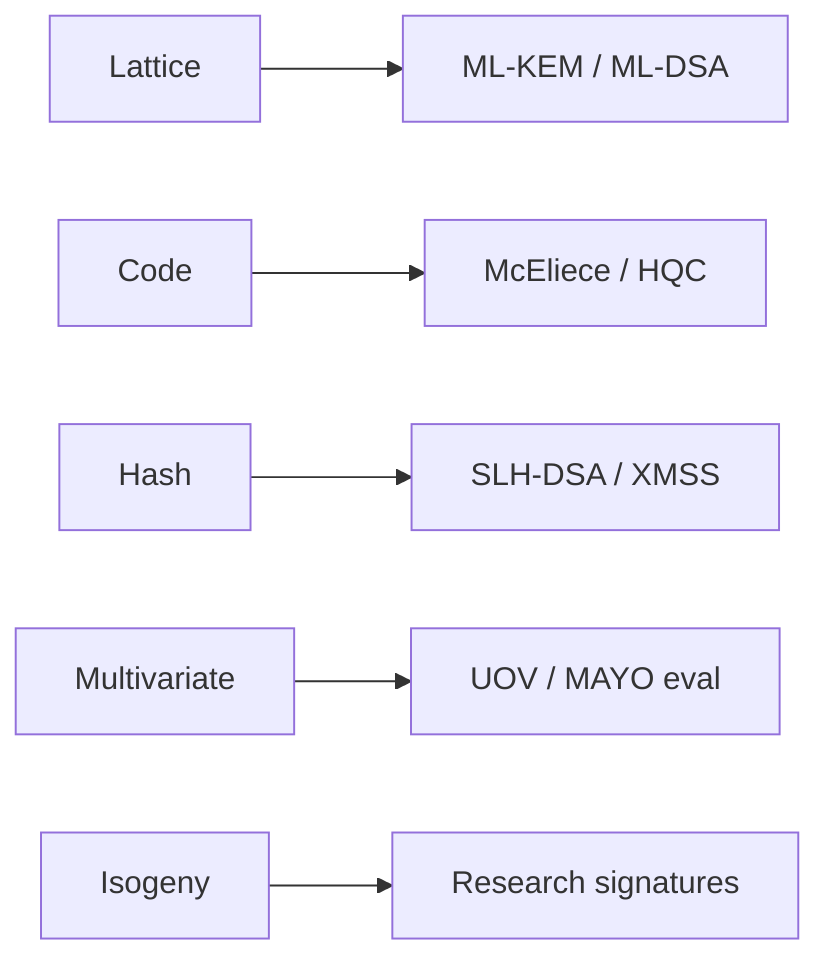

---

## 4.1 Design Principles of Post-Quantum Algorithms

The construction of post-quantum cryptographic algorithms is guided by a set of interrelated design principles that balance theoretical rigor with engineering pragmatism. Understanding these principles is essential for evaluating and selecting PQC schemes.

### 4.1.1 Quantum-Resistant Hardness Assumptions

The foundational requirement of any PQC algorithm is that its security rests on a mathematical problem for which no efficient quantum algorithm is known. This is subtler than it first appears. The problem must resist not only Shor's algorithm (which efficiently solves problems with hidden algebraic structure such as integer factoring and discrete logarithms) but also Grover's algorithm (which provides a quadratic speedup for unstructured search) and any future quantum algorithmic advances.

The distinction between structured and unstructured problems is critical. Shor's algorithm exploits the specific algebraic structure of groups used in RSA and ECC — it finds periods in functions over cyclic groups. Problems that lack this structure, such as finding short vectors in high-dimensional lattices or decoding random linear codes, do not admit known efficient quantum solutions. However, designers must remain vigilant: the history of cryptanalysis shows that hidden structure can sometimes be discovered decades after a problem was first proposed.

### 4.1.2 Classical Efficiency and Practicality

A post-quantum algorithm that requires hours of computation or gigabytes of bandwidth is of limited practical value. PQC algorithms must operate efficiently on classical hardware — from data center servers processing millions of TLS handshakes per second to embedded microcontrollers in IoT devices with kilobytes of RAM. This constraint eliminates many theoretically secure constructions that have impractical parameters.

Efficiency encompasses multiple dimensions: computational time for key generation, encapsulation/decapsulation (or signing/verification), memory requirements during computation, key and ciphertext sizes that affect bandwidth, and energy consumption on battery-powered devices. Different application domains weight these dimensions differently, which is why multiple algorithm families and parameter sets coexist in the standards.

### 4.1.3 Provable Security and Formal Reductions

Modern cryptographic design demands more than intuitive arguments about hardness. PQC algorithms should come equipped with formal security proofs that reduce the problem of breaking the scheme to solving some well-studied computational problem. For example, ML-KEM's security is formally reduced to the Module Learning With Errors (M-LWE) problem in the random oracle model — breaking ML-KEM is provably at least as hard as solving M-LWE.

The quality of these reductions matters enormously. A "tight" reduction means that the security of the scheme is close to the hardness of the underlying problem, while a "loose" reduction introduces a gap that must be compensated by larger parameters. Many PQC schemes suffer from loose reductions, requiring parameter choices that are somewhat conservative relative to the best known attacks, introducing a safety margin whose adequacy is debated.

### 4.1.4 Conservative Parameter Selection

Given the relatively young age of many PQC hardness assumptions compared to factoring (studied since the 1970s), parameter selection for PQC algorithms tends to be conservative. Designers aim for parameters that provide a comfortable margin above the best known attacks, accounting for potential algorithmic improvements. NIST's security levels provide a framework for this, but the actual parameter choices embed additional conservatism through concrete security estimates that consider memory-intensive and parallel attack strategies.

### 4.1.5 Implementation Robustness

An algorithm that is secure in theory but vulnerable to side-channel attacks in practice provides false assurance. PQC algorithms must be designed with implementation safety in mind. This includes amenability to constant-time implementation (avoiding secret-dependent branches and memory accesses), resistance to fault injection attacks, and tolerance of implementation errors. Some constructions, like the Fujisaki-Okamoto transform used in ML-KEM, provide IND-CCA2 security even if the underlying public-key encryption scheme only achieves weaker security — this provides defense-in-depth against certain implementation mistakes.

### 4.1.6 Algorithm Agility and Diversity

The PQC transition introduces unprecedented uncertainty. No single hardness assumption has the decades of cryptanalytic validation that RSA enjoys. Consequently, the design philosophy embraces diversity: standardizing algorithms from multiple mathematical families ensures that a breakthrough against one family does not compromise the entire ecosystem. This principle directly influenced NIST's decision to standardize both lattice-based and hash-based schemes, with code-based algorithms as additional diversification.

> **Author's note:** We keep a **diversity slot** (often SLH-DSA or a code KEM) because monocultures fail in clusters.

## 4.2 The Five Families of PQC

Post-quantum cryptography encompasses five major algorithm families, each rooted in fundamentally different mathematical structures. These families represent decades of research across algebraic geometry, coding theory, combinatorics, and number theory.

### 4.2.1 Lattice-Based Cryptography

Lattice-based cryptography is the dominant family in the PQC landscape, providing the primary NIST standards for both key encapsulation and digital signatures. Its prominence derives from an exceptional combination of strong security foundations, computational efficiency, and algorithmic versatility.

**Mathematical Foundation**

A lattice is a discrete additive subgroup of R^n, or equivalently, the set of all integer linear combinations of a set of linearly independent basis vectors. The fundamental computational problems on lattices involve finding short or close vectors:

- **Shortest Vector Problem (SVP):** Given a lattice basis, find the shortest nonzero lattice vector. The decisional variant (GapSVP) asks whether the shortest vector has length below some threshold.
- **Closest Vector Problem (CVP):** Given a lattice basis and a target point, find the lattice point closest to the target.
- **Learning With Errors (LWE):** Given pairs (a_i, b_i) where b_i = <a_i, s> + e_i for a secret vector s and small error terms e_i, recover s. The decisional variant asks to distinguish these pairs from uniformly random pairs.
- **Short Integer Solution (SIS):** Given a random matrix A, find a short nonzero vector x such that Ax = 0 mod q.

The LWE problem, introduced by Oded Regev in 2005, is particularly important because it admits a quantum worst-case to average-case reduction from GapSVP. This means that solving random LWE instances is at least as hard as solving worst-case lattice problems — a remarkably strong theoretical guarantee.

**Structured Variants and Efficiency**

Plain LWE, while theoretically attractive, yields impractical schemes due to the O(n^2) size of the public matrix A. Structured variants trade some theoretical generality for dramatically improved efficiency:

- **Ring-LWE (R-LWE):** Replaces the random matrix with multiplication in a polynomial ring R_q = Z_q[x]/(x^n + 1), reducing key sizes from O(n^2) to O(n) and enabling fast arithmetic via the Number Theoretic Transform (NTT).
- **Module-LWE (M-LWE):** A middle ground between LWE and R-LWE, using matrices of ring elements. ML-KEM and ML-DSA use M-LWE, providing a tunable trade-off between structure (efficiency) and generality (security confidence).

The security of these structured variants is a subject of ongoing research. While no polynomial-time attacks exploiting the ring structure are known, the reduction from worst-case lattice problems is weaker for structured variants. The cryptographic community generally regards M-LWE as sufficiently conservative for standardization.

**Standardized Algorithms**

- **ML-KEM (Module-Lattice-Based Key-Encapsulation Mechanism, FIPS 203):** Derived from the CRYSTALS-Kyber submission. ML-KEM provides IND-CCA2-secure key encapsulation using M-LWE. It operates by encrypting a random message under a lattice-based public-key encryption scheme, then applying the Fujisaki-Okamoto transform for CCA security. Available in three parameter sets: ML-KEM-512 (Level 1), ML-KEM-768 (Level 3), and ML-KEM-1024 (Level 5).
- **ML-DSA (Module-Lattice-Based Digital Signature Algorithm, FIPS 204):** Derived from CRYSTALS-Dilithium. ML-DSA provides EUF-CMA-secure digital signatures using a Fiat-Shamir with Aborts approach based on M-LWE and M-SIS. The "aborts" technique is crucial: the signer rejects signatures that would leak information about the secret key, requiring multiple signing attempts on average. Available as ML-DSA-44 (Level 2), ML-DSA-65 (Level 3), and ML-DSA-87 (Level 5).

**Strengths**

Lattice-based cryptography offers the most favorable overall profile for general deployment. Key and ciphertext sizes are moderate (ML-KEM-768 public keys are 1,184 bytes, ciphertexts 1,088 bytes). Operations are fast, with key generation and encapsulation/decapsulation taking microseconds on modern hardware. The NTT enables efficient polynomial multiplication, and the algorithms parallelize well. Beyond basic encryption and signatures, lattice assumptions support advanced constructions including fully homomorphic encryption, attribute-based encryption, functional encryption, and verifiable computation — making them the foundation for next-generation cryptographic applications.

**Challenges**

Key sizes remain substantially larger than ECC (32-byte keys for X25519 versus 1,184 bytes for ML-KEM-768). The security of structured lattice problems, while well-studied, lacks the cryptanalytic depth of factoring. Parameter selection involves subtle choices about the error distribution, modulus size, and ring dimension that interact in complex ways. Implementation requires careful attention to constant-time NTT operations and the rejection sampling in ML-DSA.

### 4.2.2 Code-Based Cryptography

Code-based cryptography traces its origins to Robert McEliece's 1978 proposal — predating even RSA's widespread deployment — and represents the oldest post-quantum cryptographic family. Its longevity under cryptanalysis provides exceptional confidence in its security foundations.

**Mathematical Foundation**

Error-correcting codes are mathematical structures designed to detect and correct errors introduced during data transmission. A linear code C over a finite field F_q is a k-dimensional subspace of F_q^n, typically specified by a generator matrix G (k×n) or a parity-check matrix H ((n-k)×n). The fundamental hard problem is:

- **Syndrome Decoding Problem:** Given a parity-check matrix H and a syndrome s = He^T for an unknown error vector e of weight w, find e. This problem is NP-hard in general and has no known quantum speedup beyond Grover's quadratic improvement.
- **Learning Parity with Noise (LPN):** A special case where the code is random and the noise rate is constant. LPN can be viewed as a binary analog of LWE.
- **Bounded Distance Decoding:** Given a code and a received word that is close to a codeword, find the nearest codeword.

The McEliece cryptosystem works by disguising a structured code (for which efficient decoding is possible) as a random-looking code (for which decoding is hard). The secret key is the structured code's decoder; the public key is the scrambled generator matrix.

**Notable Algorithms and NIST Status**

- **Classic McEliece:** Uses binary Goppa codes, which have been studied extensively since the 1970s. Classic McEliece has extraordinarily large public keys (261,120 bytes at Level 1, up to 1,357,824 bytes at Level 5) but tiny ciphertexts (128-240 bytes). It advanced to NIST Round 4 and remains under consideration for standardization as a conservative KEM option.
- **BIKE (Bit Flipping Key Encapsulation):** Uses quasi-cyclic moderate-density parity-check (MDPC) codes. BIKE achieves much smaller keys than Classic McEliece (approximately 1,541 bytes for public keys at Level 1) by exploiting quasi-cyclic structure, but this introduces structural assumptions with less cryptanalytic history.
- **HQC (Hamming Quasi-Cyclic):** Selected by NIST for standardization as an additional KEM, providing code-based diversity alongside ML-KEM. HQC uses quasi-cyclic codes with a security proof reducing to the decisional syndrome decoding problem. Public keys are approximately 2,249 bytes at Level 1.

**Strengths**

The nearly 50-year cryptanalytic history of the McEliece system provides unmatched confidence — no significant algorithmic improvement over information-set decoding (ISD) has been found since its introduction. The best known quantum attacks provide only a modest improvement over classical ISD, suggesting deep quantum resistance. Encryption and decryption are extremely fast (essentially matrix-vector multiplication and syndrome decoding). The mathematical theory of error-correcting codes is vast and mature, providing strong analytical tools.

**Challenges**

Public key sizes remain the primary obstacle to adoption. Classic McEliece's megabyte-scale keys are impractical for many protocols (TLS handshakes, certificate chains, constrained devices). Structured variants like BIKE and HQC reduce key sizes but introduce newer assumptions. Code-based cryptography has proven difficult to extend to digital signatures — no efficient code-based signature scheme has been standardized, though the area remains an active research frontier. Decryption failures, while extremely rare, must be carefully analyzed as they can enable adaptive attacks.

### 4.2.3 Hash-Based Signatures

Hash-based signatures occupy a unique position in the PQC landscape: their security depends solely on the existence of a secure hash function, making them the most conservative post-quantum signature option available.

**Mathematical Foundation**

Rather than relying on a specific algebraic hardness assumption, hash-based signatures derive their security from fundamental properties of cryptographic hash functions:

- **One-wayness (preimage resistance):** Given h(x), it is infeasible to find x.
- **Second preimage resistance:** Given x, it is infeasible to find x' ≠ x with h(x) = h(x').
- **Collision resistance:** It is infeasible to find any x ≠ x' with h(x) = h(x').

These properties are required of any useful hash function regardless of the cryptographic landscape, meaning hash-based signatures remain secure as long as we have any secure hash function at all — an assumption so minimal it is practically unfalsifiable.

**Key Constructions**

Hash-based signatures build complex structures from simple hash-based primitives:

- **Lamport Signatures:** The foundational one-time signature (OTS) scheme. To sign a single bit, publish one of two preimages depending on the bit value. Signing reveals the secret key, so each key pair can only be used once.
- **Winternitz One-Time Signatures (WOTS+):** An optimized OTS that compresses Lamport signatures by encoding message chunks as chain lengths, reducing signature sizes at the cost of increased computation. The "+" variant provides tighter security proofs.
- **Merkle Trees:** Enable multiple OTS key pairs to be authenticated by a single root hash, creating a many-time signature scheme from one-time primitives. A tree of height h supports 2^h signatures.
- **XMSS (eXtended Merkle Signature Scheme):** A stateful scheme standardized in RFC 8391. The signer must maintain state tracking which OTS keys have been used — reusing a key catastrophically compromises security. Well-suited for controlled environments like firmware signing.
- **SPHINCS+ / SLH-DSA (Stateless Hash-Based Digital Signature Algorithm):** Eliminates the state management requirement through a hyper-tree construction with few-time signatures (FORS — Forest of Random Subsets) at the leaves. The stateless design introduces a computational overhead (signing requires traversing the hyper-tree) and larger signatures, but eliminates the dangerous state-reuse vulnerability.

**Standardized Algorithm**

SLH-DSA (FIPS 205) provides stateless hash-based signatures with six parameter sets combining two hash function choices (SHA-256 and SHAKE256) with three security levels. Each level offers a "fast" variant (faster signing, larger signatures) and a "small" variant (smaller signatures, slower signing). At Level 1, SLH-DSA-SHA2-128f produces 17,088-byte signatures with public keys of 32 bytes and secret keys of 64 bytes.

**Strengths**

The minimal security assumptions of hash-based signatures make them the ultimate conservative choice. If lattice problems or coding theory assumptions are ever broken, hash-based signatures remain secure. The mathematical simplicity enables thorough formal verification of implementations. SLH-DSA has been formally verified in Coq/Lean proof assistants. Hash functions are among the most studied and optimized cryptographic primitives, with hardware acceleration (SHA-NI instructions) available on most modern processors.

**Challenges**

Signature sizes are the primary limitation. SLH-DSA signatures range from approximately 7,856 bytes (small variant, Level 1) to 49,856 bytes (fast variant, Level 5). Signing is computationally expensive compared to lattice-based alternatives — SLH-DSA signing can be 10-100x slower than ML-DSA. For applications requiring high-throughput signing (e.g., certificate transparency logs), this overhead is significant. The stateful variants (XMSS, LMS) offer better performance but require careful key state management that is incompatible with many deployment scenarios.

### 4.2.4 Multivariate Polynomial Cryptography

Multivariate cryptography constructs public keys from systems of multivariate polynomial equations, exploiting the NP-hardness of solving such systems. While the family has suffered notable defeats during the NIST process, certain schemes remain competitive for specific applications.

**Mathematical Foundation**

The core hardness assumption is the Multivariate Quadratic (MQ) problem:

- **MQ Problem:** Given a system of m quadratic polynomials in n variables over a finite field F_q, find a solution. The general MQ problem is NP-hard and is not known to admit any quantum speedup beyond Grover's quadratic improvement.

The challenge in building cryptographic schemes from MQ is that using a truly random system of equations would make decryption/verification impossible for the legitimate user. Multivariate schemes therefore use structured systems that can be efficiently inverted using a trapdoor, while appearing random to an adversary. The public key is a composed map P = T ∘ F ∘ S, where F is a central map with special structure (the trapdoor), and T, S are secret affine transformations.

**Central Map Constructions**

Different choices of central map define different schemes:

- **Oil and Vinegar:** Variables are partitioned into "oil" variables (which only appear in mixed terms with "vinegar" variables) and "vinegar" variables. Fixing vinegar variables yields a linear system in oil variables. UOV uses more vinegar than oil variables (unbalanced) for security.
- **Hidden Field Equations (HFE):** The central map is a low-degree univariate polynomial over an extension field, projected down to the base field. This creates a system that appears multivariate quadratic but is invertible using the extension field structure.
- **Rainbow:** A multi-layered generalization of Oil and Vinegar with improved efficiency but ultimately broken by structural attacks.

**Notable Algorithms**

- **UOV (Unbalanced Oil and Vinegar):** The oldest surviving multivariate signature scheme, under evaluation in NIST's additional signature competition. UOV signatures are extremely compact (typically under 200 bytes) with fast verification, but public keys are large (tens to hundreds of kilobytes).
- **Rainbow:** A layered multivariate signature scheme that was a NIST Round 3 finalist before being broken in February 2022. Ward Beullens demonstrated a key recovery attack running in approximately 53 hours on a standard laptop, exploiting the layered structure.
- **MAYO:** A recent construction designed to reduce UOV public key sizes by using a "whipping" technique to derive a larger UOV key from a smaller seed. MAYO is a candidate in NIST's additional signature competition.

**Strengths**

Multivariate schemes offer extremely fast signature verification (often faster than any competing PQC scheme) and compact signatures. These properties make them attractive for applications with asymmetric verification demands — such as certificate validation where signatures are verified millions of times but generated once. The MQ problem's NP-hardness provides a strong theoretical foundation.

**Challenges**

The family has suffered significant setbacks. Rainbow's spectacular collapse — from NIST finalist to completely broken in months — damaged confidence in multivariate schemes generally. Public keys are large (UOV at Level 1 requires approximately 43 KB). The structural requirements for efficient inversion introduce potential attack surfaces that have proven difficult to fully characterize. Fewer research groups work on multivariate cryptography compared to lattices, reducing the breadth of cryptanalytic effort. The schemes are primarily useful for signatures; constructing efficient multivariate encryption remains an open problem.

### 4.2.5 Isogeny-Based Cryptography

Isogeny-based cryptography is the youngest PQC family, exploiting the mathematical structure of maps between elliptic curves. Despite suffering a devastating attack in 2022, the field continues to produce novel constructions and remains an active area of research.

**Mathematical Foundation**

An isogeny is a morphism (structure-preserving map) between elliptic curves that sends the identity point to the identity point. The fundamental computational problems are:

- **Supersingular Isogeny Problem:** Given two supersingular elliptic curves E_1 and E_2 over a finite field F_{p^2}, find an isogeny φ: E_1 → E_2. The set of supersingular curves forms a graph (the supersingular isogeny graph) where edges are isogenies of a fixed degree. This graph is a Ramanujan graph — an optimal expander — making path-finding problems on it potentially hard.
- **Endomorphism Ring Problem:** Given a supersingular elliptic curve E, compute its endomorphism ring End(E). This problem is closely related to the isogeny problem and is believed to be of equivalent difficulty.
- **Group Action Inverse Problem (for CSIDH):** CSIDH uses the action of the ideal class group of an imaginary quadratic order on a set of supersingular elliptic curves over F_p. The hardness lies in inverting this group action.

**The Rise and Fall of SIDH/SIKE**

SIDH (Supersingular Isogeny Diffie-Hellman) was proposed in 2011 by De Feo, Jao, and Plût as a post-quantum key exchange with remarkably small key sizes (only 330 bytes for 128-bit quantum security). SIKE (Supersingular Isogeny Key Encapsulation) was its KEM variant and a NIST Round 4 candidate.

In August 2022, Wouter Castryck and Thomas Decru published a devastating polynomial-time attack on SIDH/SIKE. The attack exploited the auxiliary torsion point information that SIDH publishes as part of the public key — information needed for the protocol to work but which also reveals enough structure for the attack. The key insight was connecting the problem to the theory of Kani's theorem on products of elliptic curves, reducing SIDH to a tractable problem in higher-dimensional isogeny graphs. The attack runs in minutes on a standard laptop, completely breaking all parameter sets.

**Surviving and Emerging Schemes**

- **CSIDH (Commutative SIDH):** Uses a commutative group action, avoiding the publication of torsion point information that enabled the SIDH attack. However, CSIDH faces uncertainty regarding the quantum hardness of the underlying group action problem — subexponential quantum algorithms exist via Kuperberg's algorithm, though their concrete efficiency is debated.
- **SQISign (Short Quaternion and Isogeny Signature):** A signature scheme based on the hardness of the endomorphism ring problem. SQISign produces remarkably compact signatures (177 bytes at NIST Level 1) but with very slow signing (seconds per signature). It is under active development (SQISign 2.0 improves performance significantly) and is a candidate in NIST's additional signature competition.
- **FESTA and other newer constructions:** Various new isogeny-based schemes attempt to recover the compactness benefits of isogeny cryptography while avoiding the structural weaknesses that led to SIDH's demise.

**Strengths**

Isogeny-based cryptography offers the smallest key sizes and signatures of any PQC family — an extremely valuable property for bandwidth-constrained applications. The mathematical elegance of the underlying group-action structure enables protocols that closely mirror classical Diffie-Hellman, potentially simplifying protocol design. SQISign's 177-byte signatures are unmatched by any other PQC signature scheme.

**Challenges**

The SIDH catastrophe demonstrated that isogeny-based assumptions are less mature and more fragile than initially hoped. Computational efficiency is poor — even CSIDH key exchange takes tens of milliseconds, orders of magnitude slower than lattice alternatives. The mathematical theory is deep and accessible to fewer cryptanalysts, meaning less aggregate effort has been applied to finding attacks. Kuperberg's algorithm creates ongoing uncertainty about the quantum security of commutative isogeny problems. The field is evolving rapidly, with new constructions and attacks appearing frequently, making it premature for high-assurance deployment.

## 4.3 Comparative Analysis of PQC Families

Understanding the trade-offs between PQC families requires examining multiple dimensions simultaneously. The following comparison synthesizes the key properties:

### Performance and Size Comparison (at NIST Level 1 / 128-bit quantum security)

| Property | ML-KEM-512 | Classic McEliece | HQC-128 |
|----------|-----------|-----------------|---------|
| Public Key | 800 bytes | 261,120 bytes | 2,249 bytes |
| Secret Key | 1,632 bytes | 6,452 bytes | 2,289 bytes |
| Ciphertext | 768 bytes | 128 bytes | 4,481 bytes |
| Key Gen Time | ~10 μs | ~200 ms | ~50 μs |
| Encaps Time | ~12 μs | ~15 μs | ~70 μs |
| Decaps Time | ~14 μs | ~120 μs | ~100 μs |

| Property | ML-DSA-44 | SLH-DSA-SHA2-128f | SQISign (experimental) |
|----------|----------|-------------------|----------------------|
| Public Key | 1,312 bytes | 32 bytes | 64 bytes |
| Secret Key | 2,560 bytes | 64 bytes | 782 bytes |
| Signature | 2,420 bytes | 17,088 bytes | 177 bytes |
| Sign Time | ~50 μs | ~5 ms | ~3,000 ms |
| Verify Time | ~30 μs | ~3 ms | ~50 ms |

### Security Confidence Assessment

| Family | Years of Cryptanalysis | Major Breaks | Quantum Speedup Known | Confidence Level |
|--------|----------------------|--------------|----------------------|-----------------|
| Lattice (M-LWE) | ~20 years | None | Modest (sub-exponential improvements debated) | High |
| Code (Goppa) | ~47 years | None | Grover-level only | Very High |
| Hash-based | ~45 years | None (minimal assumptions) | Grover on hash | Very High |
| Multivariate | ~30 years | Rainbow, HFE variants broken | Grover-level only | Medium |
| Isogeny | ~15 years | SIDH/SIKE completely broken | Kuperberg (subexponential for CSIDH) | Low-Medium |

### Functional Capability Matrix

| Capability | Lattice | Code | Hash | Multivariate | Isogeny |
|-----------|---------|------|------|--------------|---------|
| Key Encapsulation | ML-KEM (standardized) | HQC, McEliece | Not applicable | Not practical | Broken (SIKE) / CSIDH |
| Digital Signatures | ML-DSA (standardized) | Research stage | SLH-DSA (standardized) | UOV, MAYO | SQISign (research) |
| Key Exchange | Via KEM | Via KEM | Not applicable | Not practical | CSIDH (uncertain) |
| FHE / Advanced | Excellent support | Limited | Not applicable | Not applicable | Limited |
| Zero-Knowledge | Efficient constructions | Possible | Possible | Possible | Possible |

## 4.4 NIST's Standardization Process and Selection Rationale

The National Institute of Standards and Technology initiated its Post-Quantum Cryptography Standardization Process in 2016, receiving 82 submissions by the November 2017 deadline. After three rounds of evaluation spanning six years, NIST announced its primary selections in July 2022 and published final standards (FIPS 203, 204, 205) in August 2024.

### 4.4.1 Evaluation Methodology

NIST's evaluation considered three categories of criteria:

**Security (Primary)**
- Confidence in the underlying hardness assumption
- Quality and tightness of security proofs
- Resilience against side-channel and multi-target attacks
- Conservative parameter choices with safety margins
- Diversity of the cryptanalytic community studying the problem

**Performance (Primary)**
- Computational cost of key generation, encapsulation/signing, decapsulation/verification
- Public key, secret key, and ciphertext/signature sizes
- Performance across diverse platforms (servers, desktops, mobile, embedded)
- Suitability for real-time protocol requirements (TLS handshake latency)

**Implementation Characteristics (Primary)**
- Amenability to constant-time implementation
- Simplicity of correct implementation
- Resistance to implementation-level attacks
- Availability of reference and optimized implementations
- Intellectual property considerations

### 4.4.2 Why Kyber / ML-KEM Won for Key Encapsulation

NIST selected CRYSTALS-Kyber (now ML-KEM) as the primary KEM standard based on a combination of factors:

**Performance dominance:** Kyber demonstrated the best overall performance profile among all KEM candidates. Its key sizes (800-1,568 bytes), ciphertext sizes (768-1,568 bytes), and computational speed (microseconds for all operations) made it suitable for the widest range of applications. The performance gap between Kyber and alternatives like NTRU or Saber was meaningful for high-throughput applications.

**Strong security foundations:** Module-LWE benefits from extensive study within the lattice cryptography community. The worst-case to average-case connection (albeit weaker for structured variants) provides theoretical grounding. No significant attacks had been found through three rounds of intense public scrutiny.

**Implementation quality:** The Kyber team produced clean, well-documented reference implementations with constant-time guarantees. The algorithm's structure — based on polynomial multiplication via NTT — maps well to both software and hardware implementations. The Fujisaki-Okamoto transform provides IND-CCA2 security with a simple and auditable construction.

**Ecosystem readiness:** By the time of selection, Kyber had already been experimentally deployed by Google (in Chrome) and Cloudflare, demonstrating protocol-level compatibility and providing real-world performance data.

### 4.4.3 Why Dilithium / ML-DSA Won for Digital Signatures

CRYSTALS-Dilithium (now ML-DSA) was selected as the primary signature standard:

**Balanced profile:** Dilithium offered the best trade-off between signature size (2,420 bytes at Level 2), public key size (1,312 bytes), and speed. Competing lattice signatures like Falcon offered smaller signatures but with significant implementation complexity.

**Implementation simplicity:** Unlike Falcon (which requires floating-point arithmetic for Gaussian sampling during signing, with complex constant-time requirements), Dilithium uses uniform sampling and rejection, which are straightforward to implement securely. NIST explicitly noted that Dilithium's simpler implementation characteristics reduced the risk of deployment errors.

**Shared foundations with ML-KEM:** Both ML-KEM and ML-DSA are based on Module-LWE, enabling shared analysis, shared library code, and a unified security argument. Organizations can build expertise in a single mathematical framework.

**Deterministic signing option:** ML-DSA supports both deterministic and randomized signing. Deterministic signing eliminates an entire class of implementation vulnerabilities related to random number generator failures (which historically led to devastating breaks, such as the Sony PS3 ECDSA key recovery).

### 4.4.4 Why SPHINCS+ / SLH-DSA Was Selected

Despite its larger signatures and slower performance, SPHINCS+ was selected as SLH-DSA:

**Diversity hedge:** NIST explicitly stated that SLH-DSA provides critical algorithm diversity. If lattice-based assumptions are ever broken (through some unexpected quantum or classical attack on LWE), SLH-DSA remains secure because it relies only on hash function security — a completely independent assumption.

**Minimal and well-understood assumptions:** Hash function security is arguably the most battle-tested assumption in all of cryptography. SHA-256 and SHA-3 have withstood decades of intensive cryptanalysis. The additional security assumption required by SLH-DSA beyond hash function properties (specifically, the security of FORS and WOTS+ in the multi-target setting) is well-understood and tightly bound.

**Conservative deployment scenarios:** For applications where signature size is less critical than security assurance — such as code signing, firmware updates, certificate authorities, and document signing — SLH-DSA provides the highest confidence level available.

### 4.4.5 Additional Selections: HQC and Beyond

NIST selected HQC as an additional KEM for standardization, providing code-based diversity:

**Code-based diversity:** HQC's security rests on the syndrome decoding problem rather than lattice problems, ensuring that a lattice-specific breakthrough would not compromise all deployed KEMs.

**Practical parameters:** Unlike Classic McEliece (whose megabyte-scale keys limit deployability), HQC achieves reasonable key sizes (~2-7 KB) while maintaining security proven reducible to syndrome decoding.

NIST also initiated an additional call for signature schemes in 2022, seeking diversity in the signature space. Candidates under evaluation include MAYO, UOV, SQISign, and others. This reflects the recognition that ML-DSA and SLH-DSA may not optimally serve all signature use cases.

## 4.5 NIST Security Levels

NIST's security level framework provides a standardized way to compare the security strength of different PQC parameter sets. The framework defines five levels based on equivalence to the difficulty of specific reference problems:

### Level Definitions

| Level | Reference Problem | Interpretation | Quantum Attack Baseline |
|-------|------------------|----------------|------------------------|
| 1 | Key recovery on AES-128 | At least as hard as exhaustive search on 128-bit key | Grover requires ~2^64 quantum operations on AES-128 |
| 2 | Collision on SHA-256 (output truncated to 256 bits) | At least as hard as finding a 256-bit hash collision | Quantum collision finding requires ~2^85 operations |
| 3 | Key recovery on AES-192 | At least as hard as exhaustive search on 192-bit key | Grover requires ~2^96 quantum operations on AES-192 |
| 4 | Collision on SHA-384 (output truncated to 384 bits) | At least as hard as finding a 384-bit hash collision | Quantum collision finding requires ~2^128 operations |
| 5 | Key recovery on AES-256 | At least as hard as exhaustive search on 256-bit key | Grover requires ~2^128 quantum operations on AES-256 |

### Interpreting Security Levels

The distinction between odd levels (1, 3, 5) and even levels (2, 4) reflects different attack models. Odd levels compare against key search (a preimage-type problem), while even levels compare against collision finding (a birthday-type problem). For most applications, the odd levels are the relevant benchmark.

**Level 1** provides security equivalent to AES-128 against both classical and quantum adversaries. This is the minimum recommended level for general-purpose deployment. Given that AES-128 is considered secure for the foreseeable future (even against quantum computers, after accounting for Grover's algorithm and its practical limitations), Level 1 provides robust protection.

**Level 3** provides a significant security margin above Level 1. It is recommended for applications requiring long-term security (data that must remain confidential for 30+ years) or for high-value targets where adversaries may invest extraordinary resources.

**Level 5** provides the maximum standardized security, equivalent to AES-256 against quantum attack. This level is reserved for the most sensitive applications — military/intelligence communications, critical infrastructure protection, and scenarios where even theoretical improvements in quantum algorithms must be accounted for. The performance cost of Level 5 parameters is substantial (approximately 2x larger keys and signatures compared to Level 3).

### Practical Level Selection

Most deployments should target Level 1 or Level 3. The choice between them involves a cost-benefit analysis:

- **Level 1 (ML-KEM-512, ML-DSA-44):** Suitable for web traffic, general-purpose encryption, authentication tokens, and applications where data sensitivity diminishes within a decade.
- **Level 3 (ML-KEM-768, ML-DSA-65):** Recommended default for most applications. Provides substantial margin against unforeseen algorithmic improvements. The performance overhead relative to Level 1 is modest (~50% larger keys/ciphertexts).
- **Level 5 (ML-KEM-1024, ML-DSA-87):** Government classified data, strategic infrastructure, and applications requiring security assurance on multi-decade timescales.

## 4.6 The PQC Ecosystem

The transition to post-quantum cryptography requires more than just new algorithms — it demands a comprehensive ecosystem of libraries, protocol integrations, hardware support, and operational tooling.

### 4.6.1 Libraries and Implementations

The PQC library ecosystem has matured significantly since 2020, with production-quality implementations available across major programming languages:

**C/C++ Libraries**
- **liboqs (Open Quantum Safe):** The reference open-source C library providing implementations of all NIST-standardized and candidate algorithms. Liboqs includes optimized implementations using AVX2/AVX-512 intrinsics and provides language bindings for Python, Java, Go, Rust, and .NET. It serves as the upstream implementation for many protocol integrations.
- **PQClean:** Focused on clean, portable, constant-time C implementations suitable for auditing and formal verification. PQClean prioritizes correctness and readability over maximum performance.
- **wolfSSL/wolfCrypt:** Embedded-focused implementations optimized for constrained devices (ARM Cortex-M, RISC-V). Provides FIPS-validated PQC implementations for regulated environments.

**Language-Specific Libraries**
- **CIRCL (Cloudflare Interoperable Reusable Cryptographic Library):** Go implementations used in Cloudflare's production infrastructure, battle-tested at enormous scale.
- **pqcrypto (Rust):** Safe Rust implementations with memory safety guarantees and no-std support for embedded targets.
- **Bouncy Castle:** Java and C# implementations integrated into enterprise application frameworks. Widely used in financial services and government applications.
- **aws-lc (Amazon):** AWS's fork of BoringSSL with integrated PQC support, used in AWS services processing billions of TLS connections daily.

**Mainstream Cryptographic Libraries**
- **OpenSSL 3.5+:** Native provider architecture supporting ML-KEM, ML-DSA, and SLH-DSA through a pluggable provider interface. The oqs-provider enables additional algorithm support.
- **BoringSSL (Google):** Integrated ML-KEM support used in Chrome, Android, and Google Cloud infrastructure.
- **NSS (Mozilla):** Post-quantum support for Firefox and Thunderbird.
- **Libsodium:** Planning post-quantum additions to its simplified cryptographic API.

### 4.6.2 Protocol Integration

PQC algorithms are being integrated into the critical communication protocols that form the backbone of internet security:

**TLS 1.3 (Transport Layer Security)**

TLS is the highest-priority target for PQC deployment because it protects the majority of internet traffic and is vulnerable to "harvest now, decrypt later" attacks. The integration approach uses hybrid key exchange — combining a classical algorithm (X25519 or P-256) with a post-quantum algorithm (ML-KEM-768) such that the connection remains secure as long as either algorithm is unbroken.

The hybrid approach is specified in multiple internet drafts and has been deployed at scale: Google Chrome enabled X25519+ML-KEM-768 hybrid key exchange by default in 2024, followed by Firefox, Cloudflare, AWS, and others. The additional bandwidth cost (~1,100 bytes in the ClientHello and ServerHello combined) has proven manageable for most connections, though some middleboxes and network equipment have required updates to handle the larger handshake messages.

Post-quantum authentication in TLS (using ML-DSA certificates) is more challenging due to the larger certificate sizes. A typical certificate chain with ML-DSA-65 certificates adds approximately 10-15 KB to the handshake, which is significant for latency-sensitive connections. Various approaches to mitigate this include certificate compression, cached certificate stores (RFC 7924), and Merkle tree-based certificate transparency.

**SSH (Secure Shell)**

OpenSSH 9.0+ supports post-quantum key exchange using a hybrid of X25519 and a streamlined NTRU Prime variant (sntrup761). This was among the first widely deployed PQC integrations. Migration to ML-KEM-based key exchange is underway. Post-quantum SSH authentication (using ML-DSA host keys and user keys) is in development.

**Signal Protocol (Messaging)**

Signal deployed PQXDH (Post-Quantum Extended Diffie-Hellman) in 2023, integrating ML-KEM-768 into the X3DH initial key agreement protocol. This protects past messages against future quantum decryption. The Double Ratchet protocol's forward secrecy properties complement PQC protection: even if long-term keys are eventually compromised by a quantum computer, individual message keys derived through the ratchet remain protected.

**S/MIME and Email Security**

Post-quantum S/MIME standards are under development, enabling end-to-end encrypted email that resists quantum decryption. The challenge is backwards compatibility with existing email infrastructure that has strict message size limits.

**IPsec/IKEv2**

Internet Key Exchange version 2 is being extended with post-quantum key exchange for VPN applications. RFC 8784 defines how to integrate additional key material (from a PQC KEM) into the IKEv2 key derivation, and hybrid approaches using ML-KEM are being standardized.

**WireGuard**

The Rosenpass project provides a post-quantum extension to WireGuard VPN using Classic McEliece and ML-KEM in a hybrid construction. Experimental PQ-WireGuard variants are under development.

### 4.6.3 Hardware Ecosystem

Hardware support is critical for environments requiring hardware-enforced key protection and for performance-sensitive deployments:

**Hardware Security Modules (HSMs)**
- Thales Luna HSMs support ML-KEM and ML-DSA with FIPS 140-3 validation
- Entrust nShield HSMs provide PQC algorithm support
- AWS CloudHSM offers post-quantum TLS termination
- Utimaco HSMs support hybrid classical/PQ key management

**Trusted Platform Modules (TPMs)**
- TCG (Trusted Computing Group) has published specifications for PQC-capable TPMs
- TPM 2.0 library specification amendments include ML-DSA and SLH-DSA algorithm identifiers
- Production TPMs with PQC support are beginning to ship in enterprise hardware

**Smart Cards and Secure Elements**
- Infineon and NXP have demonstrated ML-KEM and ML-DSA on smart card platforms
- Java Card 3.2+ specifications include PQC algorithm support
- Performance remains challenging for constrained secure elements (key generation may take seconds)

**Hardware Acceleration**
- Intel has added instructions optimized for lattice polynomial multiplication
- ARM NEON and SVE provide SIMD capabilities leveraged by optimized PQC implementations
- FPGA implementations of NTT-based operations demonstrate 10-100x speedups for high-throughput applications
- Google's custom ASIC designs include PQC acceleration for data center TLS termination

### 4.6.4 Cryptographic Agility Infrastructure

The PQC transition highlights the importance of cryptographic agility — the ability to rapidly swap algorithms without disrupting applications. Key infrastructure components include:

- **Algorithm negotiation protocols:** TLS, SSH, and IKE already support algorithm negotiation, but the PQC transition requires extending code point registries and testing interoperability.
- **Certificate management:** PKI systems must support PQC certificates, including dual-algorithm (hybrid) certificates that contain both classical and PQ public keys/signatures.
- **Key management systems:** Enterprise KMS platforms must track which algorithms protect which data, enabling targeted re-encryption when algorithms are deprecated.
- **Cryptographic inventory tools:** Organizations need automated discovery of where cryptographic algorithms are used across their infrastructure — CBOM (Cryptographic Bill of Materials) standards are emerging to address this.

## 4.7 Choosing the Right Algorithm

Selecting appropriate PQC algorithms requires systematic evaluation of application requirements against algorithm properties. No single algorithm dominates across all dimensions; the optimal choice depends on the specific deployment context.

### 4.7.1 Decision Framework for Key Encapsulation

**ML-KEM (Default Choice)**

ML-KEM should be the default selection for key encapsulation in most applications. Its combination of small keys, small ciphertexts, fast operations, and strong security makes it suitable for:
- TLS key exchange (web servers, API gateways, CDNs)
- VPN key establishment (IPsec, WireGuard)
- Messaging protocols (Signal, Matrix, XMPP)
- IoT device provisioning and communication
- General-purpose hybrid encryption

Parameter selection: ML-KEM-768 (Level 3) is the recommended default. ML-KEM-512 (Level 1) is appropriate for severely constrained environments where the security margin is deemed acceptable. ML-KEM-1024 (Level 5) for highest-assurance applications.

**HQC (Diversity Choice)**

HQC provides algorithm diversity for risk-averse deployments:
- Organizations requiring defense-in-depth against lattice-specific attacks
- Government/military systems mandating algorithm diversity
- Long-term archival encryption where lattice confidence alone is insufficient
- Use alongside ML-KEM in dual-algorithm configurations

**Classic McEliece (Maximum Confidence)**

For applications where public key size is not a constraint but security confidence is paramount:
- Pre-shared key establishment for long-term secure channels
- Offline key distribution for air-gapped systems
- Root key protection in PKI hierarchies (keys distributed rarely, stored locally)
- Military/intelligence applications with extreme security requirements

### 4.7.2 Decision Framework for Digital Signatures

**ML-DSA (Default Choice)**

ML-DSA is appropriate for the majority of signature applications:
- TLS certificate authentication
- Code signing and software distribution
- Document signing workflows
- API request authentication
- Blockchain and distributed ledger transactions

Parameter selection: ML-DSA-65 (Level 3) for general use. ML-DSA-44 (Level 2) for bandwidth-constrained scenarios. ML-DSA-87 (Level 5) for highest assurance.

**SLH-DSA (Conservative Choice)**

SLH-DSA is preferred when security confidence outweighs performance:
- Certificate Authority root and intermediate key signatures
- Firmware and BIOS signing (verified rarely, signed rarely)
- Legal/notarial document signing with multi-decade validity
- Systems requiring defense against hypothetical lattice breaks
- Government classified information protection

The fast vs. small parameter trade-off should be chosen based on workload: use "fast" (suffix 'f') when signing speed matters more than signature size; use "small" (suffix 's') when minimizing signature size is critical and slower signing is acceptable.

**XMSS/LMS (Stateful, Specialized)**

Stateful hash-based signatures offer superior performance to SLH-DSA but require rigorous state management:
- Firmware signing in controlled environments
- Hardware root of trust (TPM, secure boot)
- Certificate Authority operations with hardware-backed state
- Environments where key usage can be strictly tracked and limited

Critical constraint: state reuse (signing with the same OTS key twice) is catastrophic. These schemes must only be deployed where hardware-enforced state tracking is feasible.

### 4.7.3 Hybrid Deployment Strategies

During the transition period, hybrid constructions combine classical and post-quantum algorithms to ensure security regardless of which assumption holds:

**Concatenated Hybrid KEM:** Perform both X25519 and ML-KEM-768 key exchanges, derive the final shared secret from both results using a KDF. The connection is secure if either X25519 or ML-KEM-768 is secure. This approach is deployed in TLS at scale.

**Composite Signatures:** Sign with both an ECDSA key and an ML-DSA key; verification requires both signatures to validate. This provides backwards compatibility (legacy verifiers can check the ECDSA signature) while adding quantum protection.

**Nested Hybrid:** Use PQC to protect the key exchange, but maintain classical authentication until PQ certificates are widely supported. This is the predominant current deployment mode.

### 4.7.4 Application-Specific Recommendations

| Application Domain | Recommended KEM | Recommended Signature | Notes |
|-------------------|----------------|----------------------|-------|
| Web/TLS (general) | ML-KEM-768 hybrid | ML-DSA-65 | Hybrid with X25519 for transition |
| Financial Services | ML-KEM-768 + HQC (dual) | ML-DSA-65 + SLH-DSA (backup) | Regulatory compliance may require diversity |
| IoT/Embedded | ML-KEM-512 | ML-DSA-44 | Minimize memory/bandwidth |
| Government/Military | ML-KEM-1024 | SLH-DSA + ML-DSA-87 | Maximum security, dual algorithms |
| Certificate Authority | N/A (offline) | SLH-DSA-SHA2-256s | Long-lived root keys need maximum confidence |
| Messaging (Signal-type) | ML-KEM-768 | ML-DSA-65 | Integration with ratcheting protocols |
| Blockchain/DLT | ML-KEM-768 | ML-DSA-44 (compact) | Transaction size sensitivity |
| Code Signing | N/A | SLH-DSA or ML-DSA-65 | Verification frequency determines choice |
| Email (S/MIME) | ML-KEM-768 | ML-DSA-65 | Message size constraints relevant |
| VPN (site-to-site) | ML-KEM-1024 | ML-DSA-65 | Long-lived tunnels warrant higher security |

## 4.8 Open Research Areas

Despite the maturation of PQC standards, numerous fundamental and applied research questions remain open. These areas will shape the evolution of post-quantum cryptography over the coming decades.

### 4.8.1 Cryptanalytic Frontiers

**Lattice algorithm improvements:** The best known algorithms for solving LWE and related problems are the BKZ lattice reduction algorithm and its variants combined with sieving subroutines. The precise asymptotic and concrete complexity of these algorithms remains debated. Key open questions include: What is the optimal trade-off between time and memory in lattice sieving? Can the special structure of Module-LWE or Ring-LWE be exploited algorithmically? How does quantum computing affect lattice sieving (e.g., via Grover-accelerated sieve steps)?

**Quantum algorithm development:** Beyond Shor's and Grover's algorithms, what quantum algorithmic techniques might apply to PQC problems? Regev's 2023 quantum factoring algorithm (requiring fewer qubits but more gates) suggests that quantum algorithm design continues to evolve. Researchers are investigating quantum walks, quantum approximate optimization, and hybrid quantum-classical approaches for lattice and code problems.

**Side-channel and fault attacks:** As PQC algorithms are deployed on real hardware, new attack surfaces emerge. Timing attacks on NTT operations, power analysis of rejection sampling in ML-DSA, electromagnetic emanation attacks on polynomial arithmetic — these require ongoing research in both attack development and countermeasure design.

### 4.8.2 Theoretical Advances

**Tighter security reductions:** Many PQC schemes suffer from significant gaps between the security proven by their reductions and the security suggested by best known attacks. Closing these gaps — through tighter reductions or better understanding of the actual hardness — would enable more efficient parameter choices without sacrificing security confidence.

**Post-quantum zero-knowledge proofs:** Constructing efficient zero-knowledge proof systems from post-quantum assumptions is critical for privacy-preserving applications. Current lattice-based ZK proofs (e.g., from the Fiat-Shamir heuristic applied to lattice identification protocols) produce large proofs. Practical PQ-SNARK and PQ-STARK constructions are an active area with significant recent progress.

**Threshold and multi-party PQC:** Many real-world deployments require threshold cryptography — distributing trust among multiple parties so that no single party can sign or decrypt alone. Constructing efficient threshold ML-KEM and threshold ML-DSA protocols that distribute the secret key among n parties with a t-of-n reconstruction threshold is challenging due to the lattice structure. Recent works have made progress but practical protocols remain limited.

**Functional and attribute-based encryption:** Lattice assumptions naturally support advanced encryption paradigms where decryption access can be controlled by policies or functions. Making these constructions practical (with reasonable ciphertext expansion and key sizes) remains an important goal for access control, data sharing, and privacy-preserving computation.

### 4.8.3 Implementation and Deployment Research

**Efficient constant-time implementations:** Ensuring that PQC implementations do not leak secret information through timing variations, cache access patterns, or other microarchitectural side channels remains challenging. NTT butterflies, polynomial sampling, and rejection loops all require careful implementation. Formal verification of constant-time properties (using tools like ct-verif, or verified compilation from high-level specifications) is an active area.

**Post-quantum PKI and certificate management:** The transition to PQ certificates in the Web PKI introduces challenges: larger certificates increase TLS handshake sizes, certificate transparency logs must accommodate new signature types, and backwards compatibility with legacy clients must be managed during the multi-year transition. Research into compressed certificate formats, certificate delegation, and alternative trust models continues.

**Cryptographic inventory and migration tooling:** Enterprise organizations with millions of cryptographic keys across thousands of applications face an enormous migration challenge. Automated discovery, risk assessment, and migration planning tools are needed but remain immature. The concept of a Cryptographic Bill of Materials (CBOM) — analogous to SBOM for software dependencies — is gaining traction but lacks standardized tooling.

**Performance optimization on diverse hardware:** While x86 server performance is well-optimized, PQC implementations for ARM mobile processors, RISC-V IoT devices, specialized automotive microcontrollers, and secure enclaves (SGX, TrustZone) require continued optimization work. Heterogeneous computing environments — where different operations may be offloaded to different processing units — add additional complexity.

### 4.8.4 Emerging Cryptographic Paradigms

**Fully Homomorphic Encryption (FHE):** FHE enables computation on encrypted data without decryption — a transformative capability for cloud computing and privacy. All practical FHE schemes rely on lattice assumptions (specifically, Ring-LWE or NTRU-type problems). Making FHE efficient enough for routine use — currently 1,000-1,000,000x slower than plaintext computation — is perhaps the grandest challenge in applied cryptography. Post-quantum security comes essentially for free since the underlying hardness assumptions are the same.

**Quantum Key Distribution (QKD) integration:** While QKD and PQC are often viewed as competing approaches to quantum-safe security, they may be complementary. Research into hybrid QKD+PQC protocols — where QKD provides information-theoretic security for nearby nodes and PQC provides computational security over longer distances — could yield optimal security architectures for critical infrastructure.

**Post-quantum anonymous credentials and privacy:** Building privacy-preserving identity systems (anonymous credentials, group signatures, ring signatures, blind signatures) from post-quantum assumptions is crucial for maintaining privacy in a quantum-computing era. Lattice-based group signatures exist but produce large signatures; making these practical for real-world anonymous authentication remains open.

**Verifiable computation and blockchain:** As blockchains and verifiable computation platforms transition to post-quantum security, the efficiency of PQ proof systems becomes critical. PQ-SNARKs that are succinct enough for blockchain verification while relying only on post-quantum assumptions (rather than pairing-based constructions) are under intensive development.---

## Chapter Summary

**Technical takeaway:** Lattice schemes are the default deployment path; hash, code, multivariate, and isogeny families fill diversity niches.

**Deployment takeaway:** Pick algorithms by assumption diversity, bytes on the wire, and library maturity—not family politics.

*Figures in this chapter are planning aids—verify all algorithm names and byte sizes against the current NIST FIPS PDF before implementation.*

---

---

# PART II — CORE POST-QUANTUM ALGORITHMS


---

# Chapter 5: Lattice-Based Cryptography

Lattices won NIST for good reason; we explain **why Module-LWE is the workhorse** without drowning you in geometry.

**Figure 5.1 — LWE encryption intuition**

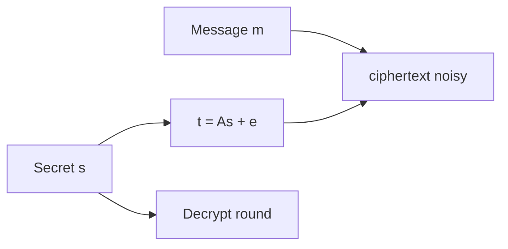

---

## 5.1 Introduction to Lattices

### Formal Definitions

A **lattice** is a discrete additive subgroup of real n-dimensional space R^n. Equivalently, a lattice L is the set of all integer linear combinations of a set of linearly independent vectors b_1, b_2, ..., b_d in R^n, called a **basis**:

```
L(B) = { sum_{i=1}^{d} x_i * b_i : x_i in Z }
```

where B = [b_1 | b_2 | ... | b_d] is the n-by-d **basis matrix** whose columns are the basis vectors. The integer d is the **rank** of the lattice, and when d = n, the lattice is called **full-rank**. Throughout this chapter, we focus primarily on full-rank lattices in Z^n (integer lattices), which are the foundation of all practical lattice-based cryptosystems.

The **fundamental domain** (or fundamental parallelepiped) of a lattice with basis B is the half-open set:

```
P(B) = { Bx : x in [0,1)^n }
```

This region tiles all of R^n when translated by lattice vectors, and its volume equals |det(B)|. This determinant, called the **lattice determinant** or **volume** of the lattice, is an invariant — it does not depend on the choice of basis.

Several geometric quantities characterize a lattice's structure. The **successive minima** lambda_1, lambda_2, ..., lambda_n are defined such that lambda_i is the smallest radius r for which the closed ball of radius r centered at the origin contains at least i linearly independent lattice vectors. The first successive minimum lambda_1(L) equals the length of the shortest non-zero lattice vector.

### Bases and the Basis Problem

A crucial property of lattices is that the same lattice admits infinitely many bases. Two basis matrices B and B' generate the same lattice if and only if B' = B * U for some unimodular matrix U (an integer matrix with determinant +/-1). These different bases can have dramatically different geometric properties.

A basis is considered "good" if its vectors are relatively short and nearly orthogonal to one another. The **Gram-Schmidt orthogonalization** of a basis B produces vectors b_1*, b_2*, ..., b_n* (not themselves lattice vectors in general), and the quality of a basis is often measured by how much the original vectors deviate from their Gram-Schmidt counterparts. The **Hadamard ratio** provides one quantitative measure:

```
H(B) = (product_{i=1}^{n} ||b_i*|| / product_{i=1}^{n} ||b_i||)^(1/n)
```

A basis with H(B) close to 1 is nearly orthogonal, while a basis with H(B) close to 0 consists of vectors that are highly correlated. The central computational challenge underlying lattice cryptography is this: given a "bad" basis (one with long, nearly parallel vectors), it is computationally infeasible to find a "good" basis for the same lattice when the dimension is sufficiently large.

### Geometric Intuition

In two dimensions, a lattice looks like a regular grid of dots — much like the atomic structure of a crystal viewed from above. Finding the shortest non-zero vector in 2D is trivial: one can visually inspect the lattice or apply the Euclidean algorithm. In three dimensions, the problem remains tractable but more subtle.

The fundamental insight is that difficulty grows exponentially with dimension. In dimension n = 500 or n = 1000, the number of lattice points within any fixed radius grows combinatorially, yet the actual shortest vector is hidden among an astronomically large set of candidate directions. The "curse of dimensionality" ensures that exhaustive search strategies become hopelessly impractical, and even sophisticated algorithms like lattice sieving require time exponential in n.

A useful analogy compares lattice problems to finding a needle in a haystack — except the haystack is n-dimensional, the needle's location is determined by global algebraic structure rather than local properties, and all known search strategies must contend with exponentially growing candidate sets.

**Minkowski's theorem** provides a fundamental geometric bound: every n-dimensional lattice of determinant det(L) contains a non-zero vector of length at most sqrt(n) * det(L)^(1/n). This bound (the "Gaussian heuristic" gives a sharper estimate of sqrt(n / (2*pi*e)) * det(L)^(1/n) for random lattices) tells us that short vectors must exist — the computational challenge is finding them. The gap between existence (guaranteed by Minkowski) and efficient computation (exponentially hard) is precisely what makes lattice cryptography possible.

The **covering radius** mu(L) of a lattice is the maximum distance from any point in R^n to the nearest lattice point. It satisfies mu(L) >= lambda_1(L)/2 and determines the worst-case difficulty of CVP. The relationship between lambda_1, mu, and det(L) constrains the geometric structure that lattice algorithms must navigate.

### q-ary Lattices

Cryptographic applications typically employ a special class called **q-ary lattices**, defined for a matrix A in Z_q^(n x m) and a positive integer q:

```
Lambda_q(A) = { x in Z^m : x = A^T * s mod q for some s in Z^n }
Lambda_q^perp(A) = { x in Z^m : A * x = 0 mod q }
```

These lattices have the convenient property that their determinant depends only on the dimensions and modulus (det = q^n for Lambda_q^perp), making their geometric properties predictable and amenable to theoretical analysis.

The LWE problem can be reformulated as a problem on q-ary lattices: given an LWE instance (A, b = A^T*s + e mod q), the vector (b, 1) lies close to the lattice Lambda_q(A) (at distance ||e|| from the nearest lattice point). Thus solving LWE is equivalent to solving BDD on a q-ary lattice, and the hardness of LWE inherits from the difficulty of lattice problems on these specific structured lattices.

Ajtai's seminal 1996 work showed that random q-ary lattices enjoy remarkable average-case hardness properties: solving SIS (and thus SVP) on a randomly chosen q-ary lattice is at least as hard as solving worst-case lattice problems on any lattice of the same dimension. This worst-case to average-case connection is unique among cryptographic assumptions — most other assumptions (factoring, discrete logarithm) are average-case statements without worst-case backing.


**Figure 5.2 — Module-LWE module view**

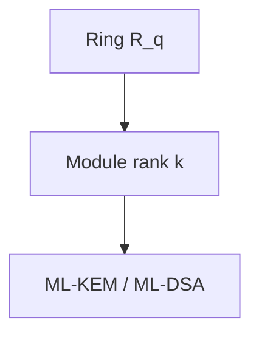

## 5.2 Hard Lattice Problems

### Shortest Vector Problem (SVP)

The **Shortest Vector Problem** asks: given a basis B for a lattice L, find a non-zero vector v in L that minimizes the Euclidean norm ||v||. In its exact form, SVP requires finding a vector achieving lambda_1(L). Exact SVP is known to be NP-hard under randomized reductions (Ajtai, 1998), and no polynomial-time algorithm is known even for quantum computers.

The **approximate SVP** (gamma-SVP) relaxes the requirement: find a non-zero vector v in L with ||v|| <= gamma * lambda_1(L), where gamma >= 1 is the **approximation factor**. The problem becomes easier as gamma increases. Key complexity-theoretic results include:

- For gamma = 2^(n/2), the LLL algorithm solves gamma-SVP in polynomial time.
- For gamma = poly(n), no polynomial-time algorithm is known (classical or quantum).
- For gamma = sqrt(n), GapSVP lies in NP ∩ coNP (Aharonov-Regev, 2005). For polynomial approximation factors, the problem is believed hard, but for super-polynomial gamma the problem becomes easier.
- For gamma = n^(O(1)), the problem is believed to be hard even for quantum computers — this is the regime relevant to cryptography.

The **GapSVP** (decisional version) asks to distinguish between lattices with lambda_1 <= 1 and those with lambda_1 > gamma. This gap problem features prominently in worst-case to average-case reductions.

### Closest Vector Problem (CVP)

The **Closest Vector Problem** asks: given a basis B for a lattice L and a target vector t in R^n, find the lattice vector v in L closest to t in Euclidean distance. CVP is at least as hard as SVP (there are reductions from SVP to CVP), and in many settings the two problems have essentially equivalent computational difficulty.

The **Bounded Distance Decoding** (BDD) problem is a promise version of CVP where the target is guaranteed to be within some fraction alpha < 1/2 of the minimum distance from the lattice. When alpha is sufficiently small (say, alpha < 1/(2 * sqrt(n))), BDD becomes tractable via Babai's nearest plane algorithm. The LWE problem can be formulated as a specific instance of BDD, connecting lattice geometry directly to cryptographic hardness.

### Learning With Errors (LWE)

The **Learning With Errors** problem, introduced by Oded Regev in 2005, is arguably the single most important computational problem in post-quantum cryptography. It captures the essential difficulty of lattice problems in a form amenable to cryptographic construction.

**Definition (Search-LWE):** Let n be a dimension parameter, q >= 2 a modulus, and chi an error distribution over Z (typically a discrete Gaussian with standard deviation sigma = alpha * q for some alpha > 0). Given access to arbitrarily many samples of the form:

```
(a_i, b_i) where a_i <- Z_q^n uniformly, b_i = <a_i, s> + e_i mod q, e_i <- chi
```

the search-LWE problem asks to recover the secret vector s in Z_q^n.

**Definition (Decision-LWE):** Distinguish the distribution of LWE samples (a_i, b_i) from the uniform distribution over Z_q^n x Z_q.

These two formulations are polynomially equivalent under mild conditions on the parameters (specifically, when q is a prime bounded by poly(n)).

**Regev's Reduction (2005):** The landmark result establishing LWE's hardness is a quantum reduction showing that solving decision-LWE with parameters (n, q, chi) is at least as hard as solving worst-case GapSVP and SIVP with approximation factor gamma = O(n * sqrt(n) / alpha) on arbitrary n-dimensional lattices. Concretely, this means: if there exists an efficient algorithm that solves LWE, then there exists an efficient quantum algorithm that solves GapSVP on any lattice in the worst case.

The reduction works in two stages. First, it shows that an LWE oracle can solve BDD instances on arbitrary lattices. Second, it uses a quantum procedure (based on the quantum Fourier transform over lattices) to reduce worst-case GapSVP to BDD. Peikert (2009) later provided a classical (non-quantum) reduction, though with slightly weaker parameters. Brakerski et al. (2013) further improved the classical reductions.

**The role of the error distribution** is critical. Without errors (sigma = 0), the problem reduces to solving a linear system — trivially easy. The Gaussian error creates a "fog" that obscures the linear structure just enough to make the problem hard, while still allowing correct decryption with overwhelming probability. The ratio alpha = sigma / q (relative error rate) governs the hardness-efficiency tradeoff: larger alpha means harder problems but requires larger moduli for correct decryption.

### Short Integer Solution (SIS)

The **Short Integer Solution** problem is the "dual" analogue of LWE, serving as the foundation for lattice-based hash functions and signature schemes.

**Definition (SIS_{n,m,q,beta}):** Given a uniformly random matrix A in Z_q^(n x m), find a non-zero vector x in Z^m such that:

```
A * x = 0 mod q   and   ||x|| <= beta
```

The connection to lattice problems is immediate: a solution to SIS is a short vector in the lattice Lambda_q^perp(A). Ajtai (1996) proved that solving SIS on average (over random A) is at least as hard as solving worst-case SIVP with approximation factor gamma = beta * sqrt(m). This was the first worst-case to average-case reduction for lattice problems and launched the field of lattice-based cryptography.

SIS gives rise to collision-resistant hash functions: define h_A(x) = Ax mod q for short x. Finding a collision h_A(x) = h_A(x') with x != x' yields a short vector x - x' in the kernel of A, which is precisely a SIS solution. The collision resistance of this hash function is therefore guaranteed by the worst-case hardness of lattice problems.

**The relationship between LWE and SIS** is deep and complementary. LWE is a "search in noise" problem (find the secret hidden by errors), while SIS is a "short vector" problem (find a short kernel element). In cryptographic constructions, LWE typically provides the hardness for encryption (distinguishing ciphertexts from random), while SIS provides the hardness for signatures and hash functions (finding short preimages). The duality between these problems mirrors the duality between the lattices Lambda_q and Lambda_q^perp.

**Parametric relationships:** For SIS to be hard, we need beta < q (otherwise the trivial solution with a single non-zero coordinate of value q works) and m > n * log_2(q) (otherwise the SIS instance is underdetermined and may have no short solution). The standard parameter regime is m = O(n * log q) and beta = poly(n), under which SIS is provably as hard as worst-case SIVP with approximation factor gamma = beta * O(sqrt(n * log q)).

## 5.3 Structured Lattice Problems

### The Efficiency Challenge

Plain LWE with dimension n requires public keys containing an n x n matrix over Z_q, resulting in key sizes of O(n^2 * log q) bits. For cryptographically relevant dimensions (n >= 512), this yields keys of several megabytes — impractical for most applications. Structured variants achieve dramatic size reductions by embedding algebraic structure into the matrices.

### Ring-LWE

**Ring-LWE**, introduced by Lyubashevsky, Peikert, and Regev (2010), transplants the LWE problem into the polynomial ring:

```
R_q = Z_q[x] / (x^n + 1)
```

where n is a power of 2. Elements of R_q are polynomials of degree at most n-1 with coefficients in Z_q. Multiplication in R_q is polynomial multiplication modulo x^n + 1 — equivalently, "negacyclic convolution."

**Definition (Ring-LWE):** Given samples (a_i, b_i = a_i * s + e_i) in R_q x R_q, where a_i are uniform, s is fixed, and e_i have small coefficients drawn from a discrete Gaussian, recover s (search) or distinguish from uniform (decision).

The cryptographic advantage is enormous: a single ring element encodes n coefficients, so the "matrix" in Ring-LWE is implicitly a structured n x n matrix (specifically, a negacyclic matrix) determined by a single ring element. This reduces key sizes from O(n^2 log q) to O(n log q) — a factor-n improvement.

Computationally, multiplication in R_q can be performed in O(n log n) time using the **Number Theoretic Transform** (NTT), the finite-field analogue of the FFT. When q is chosen so that x^n + 1 splits completely modulo q (which occurs when q = 1 mod 2n), the NTT maps ring multiplication to coefficient-wise multiplication, enabling extremely fast implementations.

The security of Ring-LWE rests on the hardness of the Shortest Vector Problem in ideal lattices — lattices that correspond to ideals in the ring of integers of the number field Q[x]/(x^n + 1). There exists a worst-case to average-case reduction analogous to Regev's, though restricted to ideal lattices rather than arbitrary lattices.

### Module-LWE

**Module-LWE** provides a middle ground between the strong security guarantees of plain LWE and the efficiency of Ring-LWE. It operates over vectors of ring elements — the free module R_q^k for a rank parameter k >= 1.

**Definition (Module-LWE):** Given a uniformly random matrix A in R_q^(k x k), a secret vector s in R_q^k with small entries, and error vector e in R_q^k with small entries, the Module-LWE problem asks to distinguish (A, b = A*s + e) from uniform.

The key insight is the **flexibility of k**: setting k = 1 recovers Ring-LWE, while setting n = 1 (trivial ring) and k = n recovers plain LWE. By choosing intermediate values (e.g., n = 256, k = 2, 3, or 4), one obtains schemes where:

- The algebraic structure is present but less constraining than pure Ring-LWE.
- Attacks must contend with both the ring structure and the module structure.
- Security can be scaled by adjusting k without changing the underlying ring.

NIST's selected algorithms (ML-KEM and ML-DSA) use Module-LWE and Module-SIS with n = 256 and varying k, representing the community's consensus on the optimal structure-security tradeoff.

### Security Comparison of Structured Variants

The security relationship between these problems forms a hierarchy:

| Problem | Underlying Lattice | Key Size (bits) | Reduction Quality | Attack Surface |
|---------|-------------------|-----------------|-------------------|----------------|
| Plain LWE | Arbitrary | O(n^2 log q) | Quantum worst-case | Generic lattice algorithms only |
| Module-LWE (rank k) | Module lattices | O(k * n * log q) | Worst-case over modules | Module structure may help attacks |
| Ring-LWE | Ideal lattices | O(n * log q) | Worst-case over ideals | Richest algebraic structure |

There has been significant research into whether the algebraic structure of ideal and module lattices enables faster attacks. As of 2024, no practical attack exploits the ideal or module structure to gain more than small constant-factor improvements over generic lattice algorithms. However, some theoretical results suggest that ideal lattices may have slightly shorter vectors than random lattices of the same dimension, and certain algebraic attacks (like the Gentry-Szydlo algorithm for specific ideal lattice problems) exploit ring structure in limited settings.

The consensus view is that Module-LWE with k >= 2 offers security substantially similar to plain LWE for practical parameter sizes, while the pure Ring-LWE setting (k = 1) carries slightly more risk from potential future algebraic attacks.

### Module-SIS

Analogous to Module-LWE, the **Module-SIS** problem asks: given a random matrix A in R_q^(k x l), find a short non-zero vector x in R_q^l such that A*x = 0 mod q and all coefficients of x are bounded. Module-SIS underlies the security of lattice-based signature schemes like ML-DSA, where the signer must produce short preimages under modular linear maps over polynomial rings. The relationship between Module-SIS and Module-LWE mirrors that between SIS and LWE in the unstructured setting — they are "dual" problems that together support the full range of basic cryptographic primitives.

## 5.4 Lattice-Based Encryption: The Regev/LPR Framework

### Regev's Original Encryption Scheme

Regev's 2005 paper introduced not only the LWE problem but also a complete public-key encryption scheme whose security reduces to LWE hardness.

**Key Generation:**
1. Choose parameters n (dimension), m (number of samples), q (modulus), and error distribution chi.
2. Sample a uniformly random matrix A in Z_q^(n x m).
3. Sample a secret vector s uniformly from Z_q^n.
4. Sample an error vector e from chi^m (each coordinate independently from chi).
5. Compute b = A^T * s + e in Z_q^m.
6. Public key: pk = (A, b). Secret key: sk = s.

**Encryption of a single bit mu in {0, 1}:**
1. Choose a random binary vector r in {0,1}^m.
2. Compute: c_1 = A * r in Z_q^n, c_2 = b^T * r + mu * floor(q/2) in Z_q.
3. Output ciphertext (c_1, c_2).

**Decryption:**
1. Compute v = c_2 - s^T * c_1 mod q.
2. If v is closer to 0 than to floor(q/2), output 0; otherwise output 1.

**Correctness Analysis:** Expanding the decryption computation:

```
v = c_2 - s^T * c_1
  = (b^T * r + mu * floor(q/2)) - s^T * (A * r)
  = ((A^T * s + e)^T * r + mu * floor(q/2)) - s^T * A * r
  = e^T * r + mu * floor(q/2)
```

The term e^T * r is a sum of at most m error terms (since r is binary), which is small compared to q with overwhelming probability when the parameters are chosen appropriately. Thus v is approximately mu * floor(q/2), and rounding recovers mu.

### The LPR Framework (Lyubashevsky-Peikert-Regev)

The LPR scheme (2010) adapts Regev's approach to the Ring-LWE setting, achieving dramatically smaller keys while preserving the security reduction.

**Key Generation:**
1. Fix public parameters: ring R_q = Z_q[x]/(x^n + 1), a uniformly random element a in R_q.
2. Sample secret s and error e from the discrete Gaussian distribution over R_q.
3. Compute b = a * s + e in R_q.
4. Public key: (a, b). Secret key: s.

**Encryption of a message polynomial m in R_2 (coefficients in {0,1}):**
1. Sample random r, error terms e_1, e_2 from the discrete Gaussian.
2. Compute c_1 = a * r + e_1 in R_q.
3. Compute c_2 = b * r + e_2 + floor(q/2) * m in R_q.
4. Output ciphertext (c_1, c_2).

**Decryption:**
1. Compute v = c_2 - s * c_1 in R_q.
2. For each coefficient of v: if closer to 0, decode as 0; if closer to floor(q/2), decode as 1.

**Correctness:** The decryption computes:

```
v = c_2 - s * c_1
  = (b * r + e_2 + floor(q/2) * m) - s * (a * r + e_1)
  = (a*s + e) * r + e_2 + floor(q/2) * m - s * a * r - s * e_1
  = e * r - s * e_1 + e_2 + floor(q/2) * m
```

The "noise" term (e * r - s * e_1 + e_2) is a polynomial whose coefficients are small relative to q, allowing correct decoding of each message bit. The noise grows with each multiplication, placing constraints on parameter selection.

**Multi-bit encryption:** The LPR scheme naturally encrypts n bits simultaneously (one per coefficient of the message polynomial m), achieving a message-to-ciphertext expansion ratio of approximately 2 * log_2(q) / 1 (since each message bit maps to approximately 2*log_2(q) bits of ciphertext). With compression techniques (rounding ciphertext coefficients), this ratio can be further improved.

### Decryption Failure Analysis

A critical aspect of lattice-based encryption is the non-zero probability of **decryption failure**: if the accumulated noise exceeds q/4 in any coefficient, the corresponding message bit is decoded incorrectly. The decryption failure rate (DFR) must be made negligibly small — typically below 2^(-128) or 2^(-164).

Computing the DFR precisely requires analyzing the distribution of the noise polynomial e*r - s*e_1 + e_2. For independent discrete Gaussian entries, the variance of each output coefficient can be computed as a sum of variances, and tail bounds (sub-Gaussian or Chernoff-type) give the failure probability. Parameters must be chosen so that even the worst-case coefficient stays below the decoding threshold with overwhelming probability.

The DFR interacts with security in a subtle way: a non-negligible failure probability can be exploited in chosen-ciphertext attacks. An adversary can craft ciphertexts that are likely to trigger decryption failures, and the pattern of successes and failures reveals information about the secret key. This "failure boosting" attack (D'Anvers et al., 2019) requires the DFR to be made exponentially small — hence the extremely conservative bounds (2^(-139) or lower) used in ML-KEM. The FO transform's re-encryption check provides additional protection, but the underlying DFR must still be negligible to maintain security margins.

## 5.5 From Encryption to Key Encapsulation (KEM)

### Why KEM Instead of Public-Key Encryption?

Modern cryptographic protocols overwhelmingly use **Key Encapsulation Mechanisms** (KEMs) rather than direct public-key encryption for several compelling reasons:

**Semantic clarity.** A KEM's purpose is precisely to establish a shared symmetric key between two parties. This matches the actual use case in protocols like TLS, SSH, and Signal, where the asymmetric operation exists solely to bootstrap a symmetric session key.

**Elimination of padding attacks.** Direct public-key encryption requires careful padding to prevent chosen-ciphertext attacks. Decades of experience (Bleichenbacher's attack on PKCS#1 v1.5, padding oracle attacks on OAEP implementations) demonstrate that correct implementation of padded encryption is error-prone.

**Cleaner CCA security.** Achieving chosen-ciphertext (CCA) security for KEMs is more natural than for encryption schemes. The KEM abstraction allows clean, modular security proofs.

**Composability.** The KEM/DEM (Data Encapsulation Mechanism) paradigm cleanly separates asymmetric and symmetric components. The shared key from the KEM feeds into a symmetric cipher (the DEM), and the overall security follows from a straightforward hybrid argument.

### The Fujisaki-Okamoto Transform

The **Fujisaki-Okamoto (FO) transform** is the standard technique for converting a passively secure (IND-CPA) public-key encryption scheme into an actively secure (IND-CCA2) KEM. It is employed by ML-KEM and nearly all other lattice-based KEMs submitted to NIST.

Given a deterministic PKE scheme (KeyGen, Enc, Dec) with message space M, the FO-transformed KEM operates as follows:

**KEM.Encaps(pk):**
1. Sample a random message m uniformly from M.
2. Compute the shared key: K = H(m, pk) (or a variant using the ciphertext).
3. Derive deterministic randomness: r = G(m, pk).
4. Encrypt: c = Enc(pk, m; r) (using randomness r).
5. Recompute the key as K = H(m, c) to bind the key to the ciphertext.
6. Output (c, K).

**KEM.Decaps(sk, c):**
1. Decrypt: m' = Dec(sk, c).
2. Re-derive randomness: r' = G(m', pk).
3. Re-encrypt: c' = Enc(pk, m'; r').
4. If c' = c, output K = H(m', c). Otherwise, output K = H(z, c) where z is a secret random value stored in sk (implicit rejection).

The critical security mechanism is the **re-encryption check** in step 3 of decapsulation. An adversary who submits a malformed ciphertext will, upon decryption, yield a message m' that re-encrypts to a different ciphertext c' != c, triggering the implicit rejection path. This prevents an adversary from learning anything useful about the secret key from decapsulation queries.

**Implicit rejection** (outputting a pseudorandom key rather than an error symbol for invalid ciphertexts) is essential for preventing timing side-channel attacks. An implementation that reveals whether decapsulation succeeded leaks information exploitable in chosen-ciphertext attacks.

The FO transform's security proof shows that the IND-CCA2 security of the resulting KEM reduces to the IND-CPA security of the underlying PKE scheme in the Random Oracle Model (ROM) or Quantum Random Oracle Model (QROM), with a security loss that depends on the number of hash queries and the decryption failure probability.

**Tightness considerations:** In the classical ROM, the FO transform achieves a relatively tight reduction. In the QROM (where the adversary can make superposition queries to the hash function), the security loss is larger — typically quadratic in the number of quantum queries. Recent work by Don et al. (2022) and others has improved QROM security proofs for FO variants, narrowing the gap between ROM and QROM security levels. The ML-KEM specification uses a variant of FO (specifically, the "FO-not-perp" transform with implicit rejection) whose QROM security has been carefully analyzed.

**Ciphertext compression and the FO transform:** An important implementation detail is that ciphertext compression (dropping low-order bits to reduce size) must be applied carefully within the FO framework. The re-encryption check in decapsulation must compare the re-encrypted ciphertext after compression, ensuring that the legitimate decapsulator always passes the check despite rounding. This requires that the compression function is deterministic and that compression noise is accounted for in the DFR analysis.

## 5.6 The NTRU Family

### Historical Context and the NTRU Problem

NTRU, proposed by Hoffstein, Pipher, and Silverman in 1996, predates the LWE-based framework by nearly a decade. It operates in the polynomial ring Z[x]/(x^n - 1) (or variants using x^n + 1) and derives its security from a different lattice problem that is related to, but distinct from, LWE.

**The NTRU Problem:** Given a public key h = p * g * f^(-1) mod q in the truncated polynomial ring, where f and g are "short" polynomials (small coefficients) and p is a small prime, recover f or g.

Geometrically, the NTRU problem corresponds to finding a short vector in a specific 2n-dimensional lattice — the **NTRU lattice**:

```
L_NTRU = { (u, v) in Z^(2n) : u - h*v = 0 mod q }
```

The pair (f, g) constitutes a short vector in this lattice, and recovering it breaks the scheme. The hardness of NTRU thus reduces to a specific instance of approximate SVP on structured lattices.

### NTRU Encryption in Detail

**Key Generation:**
1. Choose parameters n (degree), q (large modulus), p (small modulus, typically 3).
2. Sample small polynomials f, g in Z[x]/(x^n + 1) with coefficients in {-1, 0, 1}.
3. Verify that f is invertible modulo both q and p. If not, resample.
4. Compute f_q = f^(-1) mod q and f_p = f^(-1) mod p.
5. Public key: h = p * g * f_q mod q. Secret key: (f, f_p).

**Encryption of message m (polynomial with coefficients in {-(p-1)/2, ..., (p-1)/2}):**
1. Sample a random short polynomial r (the "blinding polynomial").
2. Compute ciphertext: c = r * h + m mod q.

**Decryption:**
1. Compute a = f * c mod q, choosing representatives in {-q/2, ..., q/2}.
2. Compute m = f_p * a mod p.

**Correctness:** Expanding:

```
a = f * c mod q = f * (r * h + m) mod q
  = f * (r * p * g * f^(-1) + m) mod q
  = p * r * g + f * m mod q
```

If the coefficients of p*r*g + f*m all lie within (-q/2, q/2), then reducing mod q does not wrap around, and subsequent reduction mod p yields m (since p*r*g vanishes mod p, and f*m mod p = m because f = 1 mod p by construction).

### NTRU vs. LWE-Based Systems: Detailed Comparison

| Property | NTRU | Module-LWE (ML-KEM) |
|----------|------|---------------------|
| Year introduced | 1996 | 2005 (LWE), 2012 (Module) |
| Hard problem | NTRU/approximate-SVP in NTRU lattice | Module-LWE |
| Worst-case reduction | Partial (ideal lattice connection) | Full quantum reduction |
| Ring structure | Z[x]/(x^n + 1) or Z[x]/(x^n - 1) | Z_q[x]/(x^n + 1) |
| Ciphertext structure | Single ring element | Pair of ring element vectors |
| Key generation | Requires invertibility check | Always succeeds |
| Decryption failures | Non-zero probability | Non-zero probability |
| Patent status | Expired (2017+) | No patents |
| NIST status | Round 4 finalist (NTRUEncrypt not selected) | Primary selection (ML-KEM) |
| Ciphertext size | Slightly smaller | Slightly larger |
| Security margin | Well-studied, specific algebraic attacks known | Broader reduction guarantees |

NIST ultimately selected ML-KEM over NTRU for standardization, citing the stronger theoretical foundations of Module-LWE and the modularity of the design allowing easy parameter scaling. However, NTRU remains a credible alternative with specific advantages in ciphertext compactness.

### NTRU Lattice Attacks and Security Analysis

The security of NTRU depends on the hardness of finding short vectors in the NTRU lattice. Specific attack strategies include:

**Lattice reduction attacks:** The most direct approach applies BKZ to the 2n-dimensional NTRU lattice to recover the short vector (f, g). The required block size for a successful attack depends on the ratio q/n and the coefficient sizes of f and g. For properly chosen parameters, this requires block sizes in the range beta = 300-400, corresponding to security levels of 2^(100) to 2^(130) operations.

**Hybrid attacks:** The "meet-in-the-middle" or hybrid lattice-combinatorial approach (Howgrave-Graham, 2007) reduces the lattice dimension by guessing a portion of the secret key combinatorially. This combines lattice reduction in reduced dimension with exhaustive search over the guessed portion. For NTRU parameters, this can reduce the effective security by 10-20 bits compared to pure lattice reduction.

**Subfield attacks:** For NTRU defined over certain rings (particularly those with non-trivial subfields), the Albrecht-Bai-Ducas (2016) subfield attack projects the problem into a lower-dimensional lattice over a subfield, potentially reducing security. This attack was instrumental in eliminating certain NTRU parameter sets from consideration and motivated the shift toward rings with fewer exploitable algebraic features.

## 5.7 Lattice-Based Signatures

### The Hash-and-Sign Paradigm: GPV Framework

The Gentry-Peikert-Vaikuntanathan (GPV, 2008) framework constructs signatures using the "hash-and-sign" paradigm, where signing requires knowledge of a short basis for a lattice.

**Key Generation:**
1. Generate a matrix A in Z_q^(n x m) together with a short basis T for Lambda_q^perp(A). (This uses trapdoor generation algorithms due to Alwen-Peikert or Micciancio-Peikert.)
2. Public key: A. Secret key: T.

**Signing a message mu:**
1. Compute the hash u = H(mu) in Z_q^n.
2. Using the short basis T, sample a short vector v in Z^m from the Gaussian distribution conditioned on A*v = u mod q. This uses the SamplePre algorithm (Gaussian sampling with a trapdoor).
3. Signature: sigma = v.

**Verification:**
1. Check that A * sigma = H(mu) mod q.
2. Check that ||sigma|| <= B for a prescribed bound B.

The security argument proceeds as follows: without the short basis T, finding a short preimage v with A*v = u mod q is precisely the Inhomogeneous SIS (ISIS) problem, which is as hard as worst-case lattice problems. The Gaussian sampling ensures that signatures do not leak information about T — all signatures are distributed according to the same discrete Gaussian regardless of which short basis was used.

**FALCON** (Fast Fourier Lattice-based Compact Signatures over NTRU) implements the GPV framework using NTRU lattices, achieving the smallest signatures among lattice-based schemes (approximately 666 bytes at NIST Level 1). The NTRU structure enables efficient Gaussian sampling via a "fast Fourier" technique over the lattice's Gram-Schmidt basis.

### Fiat-Shamir with Aborts: Lyubashevsky's Paradigm

The alternative approach, used by ML-DSA (formerly Dilithium), is based on the Fiat-Shamir transform applied to a Sigma protocol, with a critical modification called **rejection sampling** or "aborts."

**Key Generation:**
1. Sample a uniform matrix A in R_q^(k x l) (for Module-LWE/SIS).
2. Sample secret vectors s_1 in R_q^l and s_2 in R_q^k with small coefficients.
3. Compute t = A * s_1 + s_2.
4. Public key: (A, t). Secret key: (s_1, s_2).

**Signing a message mu:**
1. Sample a masking vector y uniformly from a set of polynomials with bounded coefficients ([-gamma_1 + 1, gamma_1]).
2. Compute the commitment w = A * y.
3. Extract the high-order bits: w_1 = HighBits(w).
4. Compute challenge: c = H(mu, w_1) — a polynomial with small coefficients and bounded weight.
5. Compute response: z = y + c * s_1.
6. **Rejection step:** If ||z||_inf >= gamma_1 - beta, or if the low-order bits of A*z - c*t are too large, REJECT and restart from step 1.
7. If accepted, output signature sigma = (z, c) (plus hints for verification).

**Verification:**
1. Recompute w_1' = HighBits(A*z - c*t) using the provided hints.
2. Check that c = H(mu, w_1').
3. Check that ||z||_inf < gamma_1 - beta.

**Why rejection sampling is essential:** Without the abort step, the distribution of z = y + c*s_1 depends on the secret s_1 (through c*s_1). An adversary collecting multiple signatures could observe correlations between z and c that leak information about s_1. Rejection sampling ensures that the output distribution of z, conditioned on not aborting, is statistically independent of s_1. Specifically, the scheme samples from the distribution:

```
Pr[output z] proportional to min(1, D_y(z) / (M * D_{y-cs}(z)))
```

where M is chosen so that the acceptance probability is approximately 1/M. This guarantees that accepted signatures reveal no information about the secret, achieving a form of zero-knowledge.

The rejection probability is 1 - 1/M (typically M is between 3 and 7), meaning signing requires on average M iterations. This is a modest computational overhead compensated by the scheme's simplicity and avoidance of Gaussian sampling.

**Security proof structure:** The security of the Fiat-Shamir with aborts paradigm reduces to the hardness of Module-LWE and Module-SIS simultaneously. The Module-LWE assumption ensures that the public key (A, t = A*s_1 + s_2) is computationally indistinguishable from uniform (hiding s_1 and s_2). The Module-SIS assumption ensures that no adversary can forge a signature — i.e., produce a short z with the correct algebraic relationship to a challenge c — without knowledge of the secret. The rejection sampling lemma (Lyubashevsky, 2012) formally establishes that the distribution of output signatures is statistically close to a distribution independent of s_1, preventing secret key extraction from signature transcripts.

### Comparison of Lattice Signature Approaches

| Property | GPV / FALCON | Fiat-Shamir with Aborts / ML-DSA |
|----------|-------------|----------------------------------|
| Signature size | ~666 bytes (Level 1) | ~2,420 bytes (Level 2) |
| Public key size | ~897 bytes | ~1,312 bytes |
| Signing complexity | Gaussian sampling (complex) | Rejection loop (simple) |
| Verification speed | Fast | Fast |
| Side-channel risk | Gaussian sampling is delicate | Uniform sampling is simpler |
| Security reduction | SIS/ISIS | Module-LWE + Module-SIS |
| Implementation difficulty | High (floating-point or advanced integer sampling) | Moderate |
| Constant-time implementation | Challenging | More straightforward |

## 5.8 Lattice Reduction Algorithms

Understanding lattice reduction algorithms is essential because they determine the concrete security of lattice-based schemes. These algorithms attempt to find short vectors in lattices and define the "attack boundary" that parameters must exceed.

### The LLL Algorithm (Lenstra-Lenstra-Lovasz, 1982)

LLL is the foundational polynomial-time lattice reduction algorithm. Given a basis B for a lattice in Z^n, LLL produces a **reduced basis** satisfying two conditions:

1. **Size reduction:** |mu_{i,j}| <= 1/2 for all i > j, where mu_{i,j} are the Gram-Schmidt coefficients.
2. **Lovász condition:** ||b_i*||^2 >= (3/4 - mu_{i,i-1}^2) * ||b_{i-1}*||^2 for all i.

The output basis has the property that its shortest vector satisfies:

```
||b_1|| <= 2^((n-1)/2) * lambda_1(L)
```

LLL runs in polynomial time — O(n^5 * (log B)^3) for integer entries bounded by B — making it highly practical for moderate dimensions. However, the exponential approximation factor 2^((n-1)/2) renders it insufficient for attacking cryptographic lattice parameters (where n >= 256). Its primary role in cryptanalysis is as a subroutine within more powerful algorithms.

### BKZ (Block Korkine-Zolotarev) Algorithm

BKZ, introduced by Schnorr and Euchner (1994), generalizes LLL by performing exact SVP computations on projected sublattices of block size beta. The algorithm iterates over consecutive blocks of beta vectors, solving SVP within each block and using the solution to improve the overall basis.

**BKZ-beta algorithm outline:**
1. LLL-reduce the input basis.
2. For i = 1 to n - beta + 1:
   a. Project the basis vectors b_i, ..., b_{i+beta-1} onto the orthogonal complement of b_1, ..., b_{i-1}.
   b. Solve SVP in the projected beta-dimensional sublattice.
   c. Insert the found vector into the basis and LLL-reduce.
3. Repeat until no further progress is made.

The quality of BKZ-beta output is characterized by the **root Hermite factor** delta:

```
||b_1|| approx delta^n * det(L)^(1/n)
```

where delta decreases with increasing beta according to the approximation:

```
delta approx (beta / (2 * pi * e) * (pi * beta)^(1/beta))^(1/(2*(beta-1)))
```

For beta = n, BKZ finds the exact shortest vector (it reduces to HKZ reduction), but the running time is dominated by the SVP oracle calls in dimension beta:

```
T(BKZ-beta) approx poly(n) * T(SVP in dimension beta) * (number of rounds)
```

**BKZ 2.0** (Chen-Nguyen, 2011) incorporates several practical improvements: extreme pruning of the enumeration tree, early termination heuristics, and progressive strategies that gradually increase the block size. The **progressive BKZ** variant starts with small block sizes and increases, saving considerable time in practice.

### Lattice Sieving

Lattice sieving algorithms represent the asymptotically fastest known approach to SVP. The core idea is to maintain a list of lattice vectors and iteratively combine pairs to produce shorter vectors.

**Basic sieving (AKS/NV sieve):**
1. Generate a large list of lattice vectors (via random sampling or BKZ preprocessing).
2. For each pair (v, w) in the list: if ||v - w|| < max(||v||, ||w||), replace the longer with v - w (or v + w).
3. Repeat until the shortest vector in the list reaches lambda_1 or no further progress is made.

The **GaussSieve** (Micciancio-Voulgaris, 2010) maintains a list and stack, iteratively reducing vectors against each other. The **HashSieve** and **ListSieve** variants use locality-sensitive hashing to accelerate nearest-neighbor lookups.

Asymptotic complexity of the best classical sieving algorithms:

```
Time:  2^(0.292n + o(n))
Space: 2^(0.208n + o(n))
```

These bounds derive from the kissing number in high dimensions and the analysis of random lattice vectors on the unit sphere. Practically, current implementations can solve SVP in dimension approximately 150 within reasonable time, establishing the baseline for concrete security estimates.

**The memory barrier:** A significant practical constraint on sieving algorithms is their enormous memory requirement (2^(0.208n) vectors must be stored simultaneously). For dimension n = 400, this corresponds to approximately 2^83 vectors — far exceeding available memory on any existing or foreseeable machine. This memory constraint is one reason that BKZ with enumeration-based SVP oracles (which use polynomial space) remains competitive in practice for intermediate dimensions, despite its worse asymptotic time complexity.

**Practical sieving records:** As of 2024, the Darmstadt SVP Challenge records show exact SVP solutions up to dimension 155 using optimized sieving implementations. The General Sieve Kernel (G6K) framework (Albrecht et al., 2019) combines sieving with lattice reduction in a flexible pipeline that represents the current state of the art for practical lattice attacks.

### Quantum Attacks on Lattices

The interaction between quantum computing and lattice problems represents one of the most important open questions in post-quantum cryptography. Known quantum speedups include:

**Grover-accelerated sieving:** Quantum search (Grover's algorithm) can speed up the nearest-neighbor search within sieving algorithms. The quantum sieving algorithm of Laarhoven (2015) achieves:

```
Time:  2^(0.265n + o(n))   (quantum)
Space: 2^(0.208n + o(n))   (classical memory, QRAM needed)
```

However, this improvement assumes access to quantum random access memory (QRAM), a technology whose feasibility at cryptographic scale is debated. Without QRAM, the quantum advantage is significantly reduced.

**Quantum BKZ:** Replacing the classical SVP oracle in BKZ with a quantum algorithm yields moderate speedups. The block size required to achieve a given approximation factor remains the same, but each SVP call in dimension beta takes time 2^(0.265*beta) rather than 2^(0.292*beta).

**No exponential quantum advantage:** Unlike factoring (where Shor's algorithm provides an exponential speedup), no polynomial-time quantum algorithm for lattice problems is known. The best quantum algorithms still require exponential time, with the exponent reduced by at most a modest constant factor. This structural robustness against quantum attacks is the primary reason lattice problems serve as the foundation for post-quantum cryptography.

**Quantum polynomial-time attacks?** While no such attacks are known, it remains an open theoretical question whether quantum computers might eventually solve lattice problems in polynomial time. The evidence against this includes: the NP-hardness of exact SVP (implying polynomial-time quantum algorithms would require NP contained in BQP), the structural dissimilarity between lattice problems and the hidden subgroup problems that Shor's algorithm exploits, and decades of failed attempts by the quantum algorithms community.

## 5.9 Parameter Selection

### The Core-SVP Methodology

The standard approach to estimating the concrete security of lattice-based schemes is the **Core-SVP model** (Alkim et al., 2016). The methodology proceeds as follows:

1. **Determine the optimal attack dimension beta.** For an LWE instance with dimension n, modulus q, and Gaussian error with standard deviation sigma, compute the BKZ block size beta needed to solve the unique-SVP instance encoded by the LWE samples. This uses the formula: the BKZ-beta algorithm succeeds when delta^(2*beta) * q^(n/m) <= q / sigma (or variants thereof), where delta is the root Hermite factor achievable by BKZ-beta.

2. **Estimate the cost of SVP in dimension beta.** Using the best known (quantum or classical) algorithm, the cost is 2^(c * beta) for c = 0.292 (classical sieving) or c = 0.265 (quantum sieving).

3. **Account for polynomial factors.** The number of BKZ rounds and other polynomial overhead factors contribute additional terms, though these are often absorbed into the o(n) terms.

4. **Add security margins.** To account for algorithmic improvements, implementations typically target a security level 10-20 bits above the minimum.

### Parameters in Detail: Dimensions, Moduli, and Errors

**Dimension (n and k):** The ring dimension n and module rank k together determine the lattice dimension (n * k for the Module-LWE problem). Larger dimensions increase security exponentially (each additional bit of dimension adds approximately c bits of security for some constant c that depends on other parameters).

**Modulus q:** The modulus must be large enough to accommodate the noise growth during encryption while remaining small enough to maintain security. Specifically:
- Larger q means the LWE problem is defined in a larger space, potentially making it easier.
- Smaller q means less room for errors, increasing decryption failure probability.
- ML-KEM uses q = 3329, a prime satisfying q = 1 mod 256, enabling efficient NTT computation.

**Error distribution:** ML-KEM uses a centered binomial distribution with parameter eta (CBD_eta): sample 2*eta uniform bits a_1,...,a_eta, b_1,...,b_eta and output sum(a_i) - sum(b_i). This distribution has variance eta/2 and is efficiently sampleable with constant-time implementations. Different security levels use different eta values:
- ML-KEM-512: eta_1 = 3, eta_2 = 2
- ML-KEM-768: eta_1 = 2, eta_2 = 2
- ML-KEM-1024: eta_1 = 2, eta_2 = 2

**Compression parameters:** To reduce ciphertext size, ML-KEM compresses ciphertext components by dropping low-order bits. The parameters d_u and d_v control the compression levels, trading ciphertext size for increased noise (and higher DFR).

### NIST Security Levels for ML-KEM

| Parameter | ML-KEM-512 | ML-KEM-768 | ML-KEM-1024 |
|-----------|-----------|-----------|-------------|
| Module rank k | 2 | 3 | 4 |
| Ring dimension n | 256 | 256 | 256 |
| Modulus q | 3329 | 3329 | 3329 |
| Error distribution eta_1, eta_2 | 3, 2 | 2, 2 | 2, 2 |
| Ciphertext compression (d_u, d_v) | 10, 4 | 10, 4 | 11, 5 |
| Public key size (bytes) | 800 | 1,184 | 1,568 |
| Ciphertext size (bytes) | 768 | 1,088 | 1,568 |
| Shared secret size (bytes) | 32 | 32 | 32 |
| NIST Security Level | 1 (AES-128) | 3 (AES-192) | 5 (AES-256) |
| Core-SVP security (classical) | ~118 bits | ~182 bits | ~254 bits |
| Core-SVP security (quantum) | ~107 bits | ~166 bits | ~232 bits |
| Decryption failure probability | 2^(-139) | 2^(-164) | 2^(-174) |

The choice of q = 3329 deserves special mention. This prime satisfies 3329 = 1 mod 256, meaning the polynomial x^256 + 1 splits into 256 linear factors modulo 3329. This enables a full 256-point NTT, allowing polynomial multiplication in R_q to be performed as 256 independent multiplications in Z_q — maximally efficient.

### Security Estimation Tools

The lattice cryptography community has developed several tools for concrete security estimation:

- **The Lattice Estimator** (formerly "LWE Estimator"): A SageMath library that estimates the cost of the best known attacks against LWE/LWR instances, including primal and dual attacks, coded-BKZ attacks, and algebraic attacks.
- **leaky-LWE-Estimator:** Extends security estimates to account for side-channel leakage.
- **The MATZOV report (2022):** Provided refined estimates using sophisticated combinations of lattice reduction and combinatorial techniques, suggesting some parameters had slightly less security margin than previously believed.

## 5.10 Advanced Lattice Constructions

### Fully Homomorphic Encryption (FHE)

Fully Homomorphic Encryption — the ability to compute arbitrary functions on encrypted data without decryption — is perhaps the most remarkable application of lattice-based cryptography. Gentry's breakthrough construction (2009) and all subsequent practical FHE schemes rely fundamentally on the hardness of lattice problems.

**Core mechanism:** FHE schemes encrypt messages within the "noise" of an LWE-type ciphertext. Homomorphic addition corresponds to adding ciphertexts (which adds the noise terms). Homomorphic multiplication corresponds to multiplying ciphertexts, which multiplies the noise terms — causing noise to grow. The key challenge is managing noise growth to prevent decryption failure.

**Bootstrapping:** Gentry's key insight was that a "somewhat homomorphic" scheme (supporting a limited number of operations) can be converted to a "fully" homomorphic scheme via **bootstrapping**: homomorphically evaluating the decryption circuit to "refresh" a noisy ciphertext, producing a fresh ciphertext with reduced noise. This requires the decryption circuit to have low enough depth to be evaluated within the scheme's noise budget — the **circular security** assumption or its variants.

**Modern FHE schemes** based on lattices include:
- **BGV (Brakerski-Gentry-Vaikuntanathan):** Uses modulus switching to manage noise.
- **BFV (Brakerski/Fan-Vercauteren):** Scale-invariant variant of BGV.
- **CKKS (Cheon-Kim-Kim-Song):** Supports approximate arithmetic on real/complex numbers, enabling machine learning on encrypted data.
- **TFHE (Torus FHE):** Optimized for Boolean circuit evaluation with fast bootstrapping.

All these schemes rest on the (Ring-)LWE assumption with various parameter regimes, and their security inherits the worst-case hardness guarantees of lattice problems.

### Attribute-Based Encryption (ABE)

Attribute-Based Encryption generalizes public-key encryption by allowing access policies to be embedded in keys or ciphertexts. In **ciphertext-policy ABE**, a ciphertext is associated with an access policy (e.g., "Department = Engineering AND Clearance >= Secret"), and only users whose attribute keys satisfy the policy can decrypt.

Lattice-based ABE constructions, beginning with the work of Boneh et al. (2014) and Gorbunov-Vaikuntanathan-Wee (2013), achieve:
- Full security proofs under standard (Module-)LWE assumptions.
- Support for arbitrary Boolean formulas as access policies.
- Post-quantum security, unlike pairing-based ABE which succumbs to quantum attacks.

The constructions use the **"two-to-one" recombination** technique: the decryption key for a compound policy is built by combining keys for sub-policies using lattice trapdoor operations. The technical core involves algorithms for sampling short lattice vectors that satisfy simultaneous constraints, building on the GPV framework.

### Lattice-Based Zero-Knowledge Proofs

Zero-knowledge proofs allow a prover to convince a verifier of a statement's truth without revealing any additional information. Lattice-based ZK proofs are crucial for privacy-preserving applications in the post-quantum era.

**Key constructions include:**
- **Stern-type protocols** adapted to lattices: The prover demonstrates knowledge of a short vector x with Ax = u mod q by permuting and masking the entries of x, achieving soundness through repetition.
- **Relaxed proofs of knowledge:** Lyubashevsky's rejection sampling technique enables efficient proofs of knowledge of short vectors, where the extracted witness may be slightly larger than the actual witness (a "relaxation" that suffices for most applications).
- **Lattice-based Bulletproofs:** Recent constructions achieve logarithmic proof sizes for range proofs and arithmetic circuit satisfiability.

Applications include anonymous credentials (proving possession of a valid credential without revealing which one), privacy-preserving blockchain transactions, and verifiable computation.

### Multi-Party Computation (MPC) from Lattices

Lattice assumptions enable efficient protocols for secure multi-party computation:

**Threshold decryption:** Multiple parties hold shares of a lattice-based secret key and can jointly decrypt without any single party learning the full key. This is particularly natural for LWE-based encryption, where secret sharing of the vector s allows distributed decryption by summing partial decryptions.

**Oblivious Transfer (OT) from LWE:** Efficient OT protocols (the foundation of general MPC) can be constructed directly from the LWE assumption, avoiding the need for number-theoretic assumptions vulnerable to quantum attacks.

**Threshold signatures:** Distributing the signing capability of ML-DSA across multiple parties is an active research area. The rejection sampling in Lyubashevsky's scheme creates challenges for threshold computation (all parties must agree on whether to abort), but recent protocols achieve practical efficiency.

**Homomorphic secret sharing:** Lattice-based schemes where shares support local homomorphic operations enable communication-efficient MPC for restricted function classes.---

## Chapter Summary

**Technical takeaway:** Module-LWE/LWE hardness underpins ML-KEM and ML-DSA; NTT makes ring arithmetic practical.

**Deployment takeaway:** Treat implementation leakage as the primary risk—use audited libraries and constant-time NTT.

*Figures in this chapter are planning aids—verify all algorithm names and byte sizes against the current NIST FIPS PDF before implementation.*

---

---

# Chapter 6: Code-Based Cryptography

McEliece is the **conservative safe** in the room—huge keys, old confidence. We use it when policy demands assumption diversity.

**Figure 6.1 — McEliece encode/decode roles**

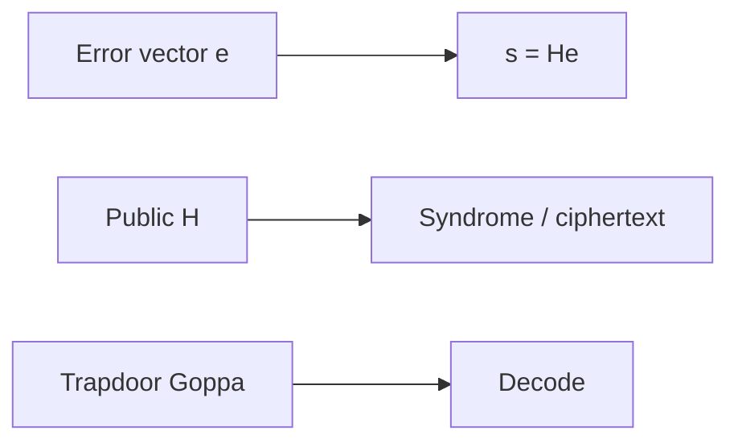

---

## 6.1 Error-Correcting Codes: Background

Error-correcting codes were originally developed by Claude Shannon, Richard Hamming, and others in the late 1940s and 1950s to enable reliable communication over noisy channels. The fundamental idea is to introduce structured redundancy into transmitted messages so that errors introduced during transmission can be detected and corrected by the receiver. This mathematical framework, developed for communications engineering, turns out to provide precisely the right abstraction for building cryptographic systems resistant to quantum attacks.

### Linear Codes

A **linear code** C(n, k, d) over a finite field F_q is defined as a k-dimensional linear subspace of the vector space F_q^n. The parameters carry the following meaning:

- **n** (block length): The total number of symbols in each codeword. This represents the length of the transmitted sequence.
- **k** (dimension): The number of information symbols encoded in each codeword. This represents the meaningful payload.
- **d** (minimum distance): The minimum Hamming distance between any two distinct codewords, equivalently the minimum Hamming weight of any non-zero codeword (by linearity).
- **Rate** R = k/n: The ratio of information symbols to total symbols, measuring the efficiency of the encoding.

The error-correction capability of a linear code is determined by its minimum distance: a code with minimum distance d can detect up to d-1 errors and correct up to t = ⌊(d-1)/2⌋ errors. This value of t defines the error correction capability. The Hamming bound is a separate sphere-packing bound on code size: |C| ≤ q^n / V(n,t), where V(n,t) is the volume of a Hamming ball of radius t. Codes that achieve the Hamming bound with equality are called perfect codes.

The **Hamming weight** wt(v) of a vector v is the number of its non-zero coordinates. The **Hamming distance** d(u, v) between two vectors is the number of positions where they differ, which equals wt(u - v) for vectors over any field.

### Generator and Parity-Check Matrices

Linear codes admit two equivalent matrix representations that are fundamental to both their coding-theoretic and cryptographic applications:

**Generator Matrix:** A matrix G ∈ F_q^(k×n) whose rows form a basis for the code C. Any codeword c can be written as c = mG for some message vector m ∈ F_q^k. When G is in systematic form [I_k | P], the first k symbols of each codeword are the original message symbols, making encoding particularly transparent.

**Parity-Check Matrix:** A matrix H ∈ F_q^((n-k)×n) that defines the code through the condition Hc^T = 0 for all codewords c ∈ C. The rows of H form a basis for the dual code C^⊥. The matrices G and H satisfy the relation GH^T = 0.

**Syndrome:** For any received vector r = c + e (where c is the transmitted codeword and e is the error vector), the syndrome is defined as s = Hr^T = H(c + e)^T = Hc^T + He^T = He^T. The syndrome depends only on the error pattern, not on the transmitted codeword. This property is what makes syndrome-based decoding — and syndrome-based cryptography — possible.

The syndrome decoding problem asks: given H and a syndrome s, find a vector e of minimum weight such that He^T = s. For codes with efficient decoding algorithms (such as Goppa codes), this problem can be solved in polynomial time. For general random codes, it is NP-hard.

### The Dual Code and MacWilliams Identity

The dual code C^⊥ of a linear code C(n, k, d) is an (n, n-k) code consisting of all vectors orthogonal to every codeword in C. The generator matrix of C^⊥ is the parity-check matrix of C, and vice versa. The weight distributions of a code and its dual are related by the MacWilliams identity, which has implications for the security analysis of code-based schemes.

### Important Code Families

The following table summarizes the code families most relevant to code-based cryptography:

| Code Family | Parameters | Decoding Algorithm | Cryptographic Relevance |
|-------------|-----------|-------------------|------------------------|
| Binary Goppa codes | (n, n-mt, ≥2t+1) | Patterson's algorithm, O(n²) | Core of Classic McEliece |
| BCH codes | (2^m-1, k, d) | Berlekamp-Massey | Subfield subcodes used in variants |
| Reed-Solomon | (q, k, q-k+1) | Berlekamp-Welch, Guruswami-Sudan | Foundation for Goppa codes |
| LDPC codes | Various | Iterative belief propagation | Used in BIKE (as QC-MDPC) |
| Reed-Muller | (2^m, k, 2^(m-r)) | Majority logic decoding | Inner code in HQC |
| Polar codes | (2^m, k, various) | Successive cancellation | Potential future applications |
| Convolutional codes | Various | Viterbi algorithm | Streaming/lightweight applications |

**Binary Goppa codes** deserve special attention as they form the foundation of the McEliece cryptosystem. A binary Goppa code is defined by a polynomial g(x) of degree t over GF(2^m) that has no repeated roots, together with a support set L = {α_1, ..., α_n} of n distinct elements from GF(2^m) that are not roots of g(x). The code consists of all binary vectors (c_1, ..., c_n) satisfying the condition that the rational function Σ c_i / (x - α_i) equals zero modulo g(x). Such a code has minimum distance at least 2t + 1 and dimension at least n - mt, and it can be decoded in O(n²) time using Patterson's algorithm.

The crucial property of Goppa codes for cryptography is that they are indistinguishable from random linear codes (to the best of current knowledge) when the defining polynomial and support set are hidden. This indistinguishability assumption, combined with the hardness of decoding random codes, provides the security foundation for the McEliece system.

> **Author's note:** Classic McEliece keys are a **packet size** problem—validate MTU and CDN limits before edge TLS promises.

## 6.2 The McEliece Cryptosystem

Robert McEliece proposed his public-key encryption system at the 1978 IEEE International Symposium on Information Theory. The system was revolutionary in its approach: rather than relying on number-theoretic problems like factoring or discrete logarithms, it drew its security from the computational difficulty of decoding general linear codes. Despite receiving less attention than RSA in the following decades due to its large key sizes, the McEliece system has proven remarkably resistant to cryptanalysis.

### Construction

**Key Generation:**

1. Select parameters (n, k, t) defining the code capability. The parameter t determines the number of errors the code can correct.
2. Choose a random irreducible polynomial g(x) of degree t over GF(2^m) where n ≤ 2^m. This polynomial defines a binary Goppa code Γ.
3. Choose a random support set L = {α_1, ..., α_n} of n distinct elements from GF(2^m) that are not roots of g(x).
4. Compute the generator matrix G' ∈ F_2^(k×n) for the Goppa code Γ.
5. Choose a random invertible k × k binary matrix S (the scrambling matrix).
6. Choose a random n × n permutation matrix P.
7. Compute the public key: G_pub = S · G' · P.
8. The secret key consists of: (S, g(x), L, P) — the scrambling matrix, Goppa polynomial, support set, and permutation.

The public key G_pub appears to be the generator matrix of a random linear (n, k) code, since the scrambling and permutation operations destroy the visible algebraic structure of the Goppa code.

**Encryption:**

To encrypt a k-bit message m:
1. Choose a random error vector e ∈ F_2^n of Hamming weight exactly t.
2. Compute the ciphertext: c = m · G_pub + e.

The ciphertext c is an n-bit vector. The error vector e acts as a randomizing element, ensuring that the same plaintext produces different ciphertexts each time (providing semantic security when combined with appropriate padding).

**Decryption:**

To decrypt a ciphertext c:
1. Compute c' = c · P^(-1) = m · S · G' · P · P^(-1) + e · P^(-1) = m · S · G' + e', where e' = e · P^(-1) has the same Hamming weight t as e (permutation preserves weight).
2. Apply the efficient Goppa decoder (Patterson's algorithm) to c'. Since e' has weight t and the Goppa code corrects t errors, this recovers the vector m · S (the encoded message before scrambling).
3. Recover the original message: m = (m · S) · S^(-1).

The decryption works because only the holder of the secret key knows the permutation P (to remove before decoding), the Goppa code structure (to perform efficient decoding), and the scrambling matrix S (to recover the original message).

### Security Basis

The security of the McEliece cryptosystem rests on two complementary computational assumptions:

**1. Indistinguishability Assumption:** The public key G_pub = S · G' · P is computationally indistinguishable from a uniformly random k × n binary matrix. If an adversary could distinguish the public key from random, they could potentially recover the hidden Goppa code structure and decode efficiently. Decades of research have produced no efficient distinguisher for Goppa codes at cryptographic parameters, though distinguishers exist for certain other code families (which is why the choice of code is critical).

**2. Hardness of Syndrome Decoding:** Even given the public generator matrix G_pub, recovering the message m from the ciphertext c = m · G_pub + e requires finding the low-weight error vector e. This is equivalent to the syndrome decoding problem for a random-appearing linear code, which is NP-hard in the worst case and believed to be hard on average for appropriate parameter choices.

These two assumptions are independent: even if the code could be partially distinguished, the decoding problem remains hard; conversely, even a perfect random code requires exponential time to decode.

### Parameters and Key Sizes

The primary practical limitation of Classic McEliece is its large public key size. The public key is a k × (n-k) matrix (when stored in systematic form), requiring k(n-k) bits:

| Security Level | n | k | t | Public Key | Ciphertext | Decapsulation |
|---------------|------|------|-----|-----------|------------|---------------|
| NIST Level 1 | 3488 | 2720 | 64 | 261,120 B | 128 B | Fast |
| NIST Level 3 | 4608 | 3360 | 96 | 524,160 B | 188 B | Fast |
| NIST Level 5 | 6688 | 5024 | 128 | 1,044,992 B | 240 B | Fast |
| NIST Level 5 (f) | 6960 | 5413 | 119 | 1,047,319 B | 226 B | Fast |
| NIST Level 5 (alt) | 8192 | 6528 | 128 | 1,357,824 B | 240 B | Fast |

Despite the large keys, Classic McEliece offers extremely fast encryption and decryption operations (on the order of microseconds for encapsulation and decapsulation), very small ciphertexts (128-240 bytes depending on security level), and well-understood security based on nearly 50 years of cryptanalysis. The NIST post-quantum standardization process selected Classic McEliece as one of the candidates advancing to standardization, recognizing its exceptional security confidence despite the key size disadvantage.

### CCA Security and KEM Construction

The basic McEliece scheme as described above provides only OW-CPA (one-way security against chosen-plaintext attacks). For modern applications requiring IND-CCA2 security (indistinguishability under adaptive chosen-ciphertext attacks), the scheme must be transformed into a Key Encapsulation Mechanism (KEM) using techniques such as the Fujisaki-Okamoto transform. Classic McEliece applies a variant of this transform: the encapsulator generates a random error vector e of weight t, encapsulates it as the ciphertext (syndrome), and derives the shared secret by hashing e together with the ciphertext.

## 6.3 The Syndrome Decoding Problem

The syndrome decoding problem is the fundamental computational hardness assumption underlying virtually all code-based cryptographic constructions. Its formal definition, complexity-theoretic status, and the best known algorithms for solving it determine the concrete security of deployed systems.

### Formal Definition

**Computational Syndrome Decoding (SD):** Given a random binary parity-check matrix H ∈ F_2^((n-k)×n), a target syndrome s ∈ F_2^(n-k), and a weight bound t, find a vector e ∈ F_2^n such that He^T = s and wt(e) ≤ t.

**Decisional Syndrome Decoding:** Given (H, s, t), determine whether there exists a vector e with He^T = s and wt(e) ≤ t.

### NP-Completeness

Berlekamp, McEliece, and van Tilborg proved in 1978 that the syndrome decoding problem is NP-complete by reduction from the 3-dimensional matching problem. More precisely, the decision version of SD is NP-complete, and the search version (finding the error vector) is at least as hard. This NP-completeness result applies to the worst case; however, cryptographic security requires average-case hardness.

For cryptographic applications, we rely on the stronger conjecture that syndrome decoding is hard on average for random instances with appropriate parameters. Specifically, when H is a uniformly random matrix, the error weight t is below the Gilbert-Varshamov bound (roughly n · H_2^(-1)(1 - k/n) where H_2 is the binary entropy function), and n is sufficiently large, no polynomial-time algorithm is believed to solve SD with non-negligible probability.

The connection between worst-case and average-case hardness for SD is not as clean as for lattice problems (where worst-case to average-case reductions exist). However, decades of cryptanalytic effort have produced no algorithm that exploits the average-case structure, providing strong empirical evidence for hardness.

### Quantum Complexity

Critically, no polynomial-time quantum algorithm is known for the syndrome decoding problem. This stands in stark contrast to factoring and discrete logarithm, which fall to Shor's algorithm. The best quantum approaches apply Grover's search to speed up the classical exponential-time algorithms by a quadratic factor, but the resulting complexity remains exponential. The problem structure — searching for a low-weight vector in a high-dimensional space — does not appear amenable to the Fourier sampling techniques that Shor's algorithm exploits.

## 6.4 Information Set Decoding Attacks

Information Set Decoding (ISD) constitutes the most powerful family of algorithms for attacking generic code-based cryptosystems. Understanding ISD in detail is essential for parameter selection and security analysis.

### Prange's Algorithm (1962)

The foundational ISD algorithm proceeds as follows:

1. Select a random set I of k column indices from {1, ..., n} (an "information set").
2. Restrict H to the complementary columns J = {1, ..., n} \ I, forming the submatrix H_J.
3. If H_J is invertible, solve for the error restricted to J: e_J = H_J^(-1) · s.
4. Check if wt(e_J) = t (meaning all t errors fall in the n-k positions of J, and no errors are in the k positions of I).
5. If the check passes, output the error vector. Otherwise, return to step 1.

The probability that a random information set is error-free is p = C(n-t, k) / C(n, k), and the expected number of iterations is 1/p. Each iteration requires O((n-k)^3) operations for the matrix inversion (or O((n-k)^2 · k) using systematic reduction). The total work factor is approximately:

W_Prange ≈ (n-k)^3 · C(n, t) / C(n-k, t)

For typical McEliece parameters (n=3488, k=2720, t=64), this gives a work factor around 2^150, which already exceeds the 128-bit security target.

### Lee-Brickell Algorithm (1988)

Lee and Brickell improved on Prange by allowing a small number p of errors in the information set:

1. Select a random information set I of k columns.
2. Gaussian-eliminate H to systematic form with respect to I.
3. Search for all weight-p vectors in the k information-set positions whose contribution to the syndrome matches a weight-(t-p) pattern in the remaining positions.
4. The optimal choice of p reduces the number of iterations needed at the cost of more work per iteration.

### Stern's Algorithm (1989)

Stern introduced a birthday-paradox technique that significantly improved ISD efficiency:

1. Split the information set I into two halves I_1 and I_2 of size k/2 each.
2. Choose a subset of ℓ syndrome coordinates as a "window."
3. Build two lists: L_1 contains weight-p/2 vectors on I_1 matching the window syndrome, and L_2 contains weight-p/2 vectors on I_2 matching the complementary window syndrome.
4. Collisions between L_1 and L_2 (vectors whose syndrome contributions sum to the target on the window) yield candidate solutions.

The birthday technique reduces the per-iteration cost by replacing exhaustive search over weight-p vectors with a collision search, at the expense of additional memory. The optimal choice of parameters p and ℓ gives a significant improvement over Lee-Brickell.

### BJMM Algorithm (2012)

Becker, Joux, May, and Meurer introduced the representation technique combined with nearest-neighbor search:

1. Instead of searching for a weight-p error split as (p/2, p/2), represent each weight-p/2 part as a sum of two weight-p/4 parts (with additional allowed weight from "representations").
2. Use multiple levels of merging with increasing window sizes.
3. The representation technique exploits the fact that there are many ways to write a given weight-p vector as a sum of two vectors, increasing the number of useful collisions without increasing the search space proportionally.

BJMM achieves the best known asymptotic exponents for binary ISD in several parameter regimes. For the McEliece parameters at NIST Level 1, BJMM achieves approximately 2^143 operations.

### May-Meurer-Thomae (MMT) Algorithm

The MMT algorithm introduced the representation technique slightly before BJMM (in a different form) and achieves similar complexity. It uses a two-level nearest-neighbor approach where weight-p vectors are represented as sums of vectors that are "close to" weight-p/2 (allowing some deviation). The key insight is that increasing the number of representations per solution allows the algorithm to find solutions faster, provided the merging step can be done efficiently.

### Both-May Algorithm and Further Improvements

Subsequent work by Both and May (2018) achieved further improvements by combining the representation technique with more sophisticated nearest-neighbor algorithms. Their approach uses a multi-level tree structure with carefully optimized parameters at each level. For practical cryptographic parameters, the improvements over BJMM are relatively modest (saving 1-3 bits of security), but they demonstrate that the ISD landscape continues to evolve.

### Quantum Information Set Decoding

Quantum computers can accelerate ISD algorithms through several mechanisms:

**Grover-based quantum ISD:** The most straightforward approach applies Grover's algorithm to the outer loop of Prange's algorithm (or its variants), providing a quadratic speedup in the number of iterations. For Prange, this reduces the work factor from roughly 2^(0.12n) to 2^(0.06n) for typical McEliece parameter ratios.

**Quantum walk-based approaches:** Kachigar and Tillich (2017) applied quantum random walks to the Stern/BJMM framework, achieving better speedups than naive Grover application. Their approach achieves approximately 2^117 quantum operations against McEliece Level 1 parameters.

**Limitations of quantum speedup:** The quantum speedup for ISD is fundamentally limited for several reasons. First, the collision-finding portion of modern ISD algorithms already uses birthday-type techniques that gain less from Grover than simple search. Second, the memory requirements of quantum ISD algorithms grow substantially, and quantum memory (qubits) is far more expensive than classical memory. Third, the depth-width tradeoffs in quantum circuits limit the effective parallelism available.

The consensus estimate for quantum ISD against Classic McEliece Level 1 (n=3488, k=2720, t=64) is approximately 2^129 quantum operations, providing comfortable margin above the 128-bit quantum security target.

## 6.5 Niederreiter Variant

Harald Niederreiter proposed an alternative formulation of code-based public-key encryption in 1986 that uses the parity-check matrix rather than the generator matrix. The Niederreiter system is provably equivalent to McEliece in security but offers practical advantages.

### Construction

**Key Generation:**
1. Generate a binary Goppa code with parity-check matrix H ∈ F_2^((n-k)×n).
2. Choose a random invertible (n-k) × (n-k) binary matrix S.
3. Choose a random n × n permutation matrix P.
4. Public key: H_pub = S · H · P.
5. Secret key: (S, H, P, decoder for the Goppa code).

**Encryption:**
In the Niederreiter system, the plaintext is encoded as an error vector. Specifically:
1. The message is mapped to a binary vector e of length n and Hamming weight exactly t (using a combinatorial number system or similar encoding).
2. The ciphertext is the syndrome: c = H_pub · e^T.

The ciphertext is only (n-k) bits long, compared to n bits in the McEliece system.

**Decryption:**
1. Compute S^(-1) · c = H · P · e^T = H · (Pe)^T.
2. Since Pe is a permutation of e, it has the same weight t.
3. Apply the efficient Goppa decoder to find Pe from its syndrome H · (Pe)^T.
4. Recover e = P^(-1) · (Pe).
5. Decode the error vector back to the original message.

### Advantages over McEliece

The Niederreiter formulation offers several practical advantages:

- **Smaller ciphertexts:** The ciphertext is (n-k) bits rather than n bits, providing significant bandwidth savings.
- **Natural KEM construction:** When used as a KEM, the "message" is simply a random weight-t error vector, and the shared secret is derived by hashing this vector. No separate message encoding is needed.
- **Equivalent security:** Li, Deng, and Wang proved that McEliece and Niederreiter are equivalent under appropriate reductions.
- **Cleaner implementation:** The encapsulation operation is a matrix-vector multiplication (computing a syndrome), which is simpler to implement in constant time than the McEliece encryption (matrix-vector multiply plus error addition).

Classic McEliece, the NIST standardization candidate, uses the Niederreiter formulation for exactly these reasons.

### Security Equivalence

The security equivalence between McEliece and Niederreiter can be understood informally: both systems hide the same secret (the structured code), and both systems produce outputs (ciphertext/syndrome) that are computationally indistinguishable from random to anyone who cannot decode the hidden code. The formal proof establishes a polynomial-time reduction between breaking one system and breaking the other.

## 6.6 Quasi-Cyclic Codes: BIKE and HQC

The principal drawback of Classic McEliece — its multi-hundred-kilobyte public keys — motivated extensive research into code-based systems with more compact keys. The most successful approach uses quasi-cyclic (QC) codes, where the structure of circulant matrices enables compact representation while (conjecturally) preserving computational hardness.

### Quasi-Cyclic Structure

A circulant matrix is completely determined by its first row: each subsequent row is a cyclic shift of the previous one. A quasi-cyclic code of index ℓ has a generator or parity-check matrix composed of ℓ × ℓ blocks of circulant matrices. The key insight is that each n × n circulant block can be stored as a single n-bit vector (its first row), reducing storage from n² bits to n bits per block.

Algebraically, circulant matrices correspond to elements of the ring R = F_2[x]/(x^n - 1). Multiplication of two circulant matrices corresponds to polynomial multiplication modulo x^n - 1 in this ring. When n is prime and x^n - 1 factors into irreducible polynomials of large degree over F_2, the ring has favorable algebraic properties for cryptography.

### BIKE (Bit Flipping Key Encapsulation)

BIKE is a code-based KEM built on Quasi-Cyclic Moderate Density Parity-Check (QC-MDPC) codes. It was a Round 4 candidate in the NIST standardization process.

**Code Structure:**
The parity-check matrix has the form H = [h_0 | h_1] where h_0 and h_1 are n × n circulant matrices with row weight approximately w/2 each (where w is the total row weight of H). The code is a (2n, n) quasi-cyclic code. The public key is the systematic form of the generator matrix, which can be represented as a single circulant: the first row of h_1^(-1) · h_0 (multiplication in the ring R).

**Key Generation:**
1. Choose random polynomials h_0(x) and h_1(x) in R of weight approximately w/2 each.
2. Compute the public key: h(x) = h_1(x)^(-1) · h_0(x) mod (x^n - 1).
3. The secret key is (h_0, h_1) — the sparse parity-check polynomials.

**Encapsulation:**
1. Generate a random error vector e = (e_0, e_1) of total weight t.
2. Compute the syndrome (ciphertext): c = e_0 + e_1 · h mod (x^n - 1).
3. The shared secret is derived by hashing e.

**Decapsulation:**
1. Use the secret sparse parity-check matrix to decode the error from the syndrome.
2. The decoder is an iterative bit-flipping algorithm adapted for MDPC codes.
3. Verify the decoded error has the correct weight, then derive the shared secret.

**Parameters (BIKE Level 1):**
- Block length: n = 12,323 (prime)
- Error weight: t = 134
- Parity-check weight: w = 142
- Public key: ~1,541 bytes
- Ciphertext: ~1,573 bytes
- Shared secret: 256 bits

**Decoding Challenges:**
Unlike Goppa codes, MDPC codes do not have deterministic polynomial-time decoders with guaranteed success. The iterative bit-flipping decoder may occasionally fail to decode correctly, leading to decryption failures. The decryption failure rate (DFR) must be extremely low — below 2^(-128) for IND-CCA2 security via the Fujisaki-Okamoto transform — because even a small probability of failure can be exploited through reaction attacks (where an adversary submits many ciphertexts and observes which ones cause decryption failures, gradually recovering the secret key).

Achieving such low DFR while maintaining efficiency is one of the main technical challenges for BIKE. The Black-Gray-Flip (BGF) decoder used in BIKE's specification has been extensively analyzed, but proving DFR bounds rigorously remains difficult, and most estimates rely on extrapolation from simulations.

**Timing Side-Channels:**
The bit-flipping decoder's execution time depends on the error pattern and the secret key structure, creating potential timing side-channels. Constant-time implementations must carefully control the number of iterations and avoid data-dependent branching.

### HQC (Hamming Quasi-Cyclic)

HQC takes a fundamentally different approach from both Classic McEliece and BIKE. Rather than hiding a structured code within a random-looking matrix, HQC is based on the hardness of the decisional quasi-cyclic syndrome decoding problem: distinguishing random QC codes from structured ones.

**Design Philosophy:**
HQC uses a two-layer code structure:
- An outer random quasi-cyclic code provides the hard problem (indistinguishability from random).
- An inner deterministic code (Reed-Muller or tensor product code) provides efficient error correction with guaranteed success.

**Key Generation:**
1. Choose a random quasi-cyclic vector h (the public code description).
2. Choose a secret sparse vector x and a secret sparse error vector y.
3. Compute the public key: (h, s = h · x + y) where the multiplication is in the ring R = F_2[x]/(x^n - 1).
4. The secret key is x.

**Encapsulation:**
1. Choose random sparse vectors r_1, r_2, and a random error e.
2. Compute u = h · r_1 + r_2 and v = s · r_1 + e + Encode(m), where Encode uses the inner code and m is a random message.
3. The ciphertext is (u, v), and the shared secret is derived from m.

**Decapsulation:**
1. Compute v - u · x = s · r_1 + e + Encode(m) - (h · r_1 + r_2) · x = (h · x + y) · r_1 + e + Encode(m) - h · r_1 · x - r_2 · x = y · r_1 - r_2 · x + e + Encode(m).
2. The terms y · r_1 - r_2 · x + e form a noise vector. Because y, r_1, r_2, x, and e are all sparse, this noise has bounded weight.
3. Apply the inner code decoder to recover m.
4. Re-encapsulate with m to verify correctness, then derive the shared secret.

**Parameters (HQC-128, NIST Level 1):**
- Quasi-cyclic block length: n = 17,669
- Secret/error weight: w = 66
- Public key: ~2,249 bytes
- Ciphertext: ~4,497 bytes
- Shared secret: 256 bits

**Advantages of HQC:**
- **No decryption failures:** The inner code is chosen to guarantee correction of the maximum possible noise weight, eliminating the DFR problem that plagues BIKE.
- **Cleaner security reduction:** The security reduces directly to the decisional QC syndrome decoding problem without additional assumptions about decoder behavior.
- **Moderate key sizes:** While larger than lattice-based schemes, keys are orders of magnitude smaller than Classic McEliece.

**NIST Standardization Status:** In 2024, NIST selected HQC for standardization as an additional KEM alongside the lattice-based ML-KEM, specifically to provide algorithmic diversity. If a breakthrough were to compromise lattice-based schemes, HQC would serve as a fallback based on entirely different mathematical foundations.

## 6.7 Learning Parity with Noise (LPN)

The Learning Parity with Noise (LPN) problem provides an alternative lens through which to view code-based cryptographic hardness. It connects the coding-theoretic perspective to the learning-theoretic perspective and bridges code-based and lattice-based cryptography.

### Definition

The LPN problem with parameters (n, τ) is defined as follows: given access to an oracle that outputs samples (a_i, b_i) where a_i is drawn uniformly from F_2^n and b_i = ⟨a_i, s⟩ ⊕ e_i for a fixed secret s ∈ F_2^n and independent Bernoulli noise e_i with parameter τ (Pr[e_i = 1] = τ), recover the secret s.

The decisional variant asks to distinguish these noisy inner-product samples from uniformly random pairs (a_i, b_i).

### Relationship to Syndrome Decoding

LPN and syndrome decoding are intimately connected. Collecting m samples from the LPN oracle produces a matrix A ∈ F_2^(m×n) (with rows a_i) and a vector b = A · s + e where e has approximately τm ones. Recovering s from (A, b) is precisely the problem of decoding the random linear code generated by A with error vector e — i.e., syndrome decoding with the role of the parity-check matrix played by A.

This equivalence means that the hardness of LPN is exactly the hardness of decoding random linear codes under Bernoulli noise. The syndrome decoding NP-hardness result applies, and ISD algorithms are the best known attacks.

### Structured LPN Variants

Several structured variants of LPN have been proposed for efficiency:

- **Ring-LPN:** The matrix A is replaced by a structured matrix derived from a ring (similar to Ring-LWE versus LWE). This enables quasi-linear-time encryption but introduces algebraic structure that could potentially be exploited.
- **Exact-LPN:** The noise weight is fixed rather than drawn from a Bernoulli distribution. This is more directly equivalent to syndrome decoding with a fixed error weight.
- **Sparse-LPN:** The secret s is also sparse, enabling further efficiency improvements.

### Cryptographic Applications

LPN-based constructions are particularly attractive for resource-constrained environments:

- **HB Protocol Family:** The HB, HB+, and HB# protocols provide lightweight authentication based on LPN, requiring only inner products and XOR operations — no modular arithmetic needed.
- **Symmetric-key primitives:** LPN has been used to construct stream ciphers (Lapin) and other symmetric primitives with provable security.
- **Oblivious transfer and MPC:** LPN enables efficient oblivious transfer protocols and secure multi-party computation with low computational overhead.

The practical significance of LPN is that it provides code-based security with minimal computational requirements — only bitwise AND and XOR operations over F_2 — making it suitable for IoT devices, RFID tags, and other constrained platforms where even modular arithmetic may be too expensive.

## 6.8 Code-Based Signatures: An Open Challenge

While code-based encryption and key encapsulation have achieved practical efficiency and strong security confidence, constructing efficient code-based digital signature schemes remains one of the most significant open problems in post-quantum cryptography. The difficulty is fundamental to the mathematical structure of coding problems.

### Why Signatures Are Hard

The standard paradigm for constructing signatures from identification schemes (the Fiat-Shamir transform) requires a problem where:
1. The prover can efficiently generate valid proof transcripts (using the secret key).
2. The verifier can check proofs efficiently (using the public key).
3. Generating valid transcripts without the secret is computationally infeasible.
4. Proofs do not leak information about the secret (zero-knowledge property).

For code-based systems, efficient "proving" means efficient decoding, which requires knowledge of the code structure. However, the signature (which is made public) must not reveal this structure. The fundamental tension is that decoding is an "all-or-nothing" operation: you either know the code structure and can decode completely, or you don't and decoding is intractable. There is no natural way to perform "partial" decoding that proves knowledge of the secret without revealing it.

Contrast this with number-theoretic signatures: in Schnorr signatures, one can produce a valid discrete-log proof by combining the secret scalar with randomness in a way that reveals nothing about either. The algebraic homomorphism of the group structure enables this blinding. Codes lack an analogous homomorphic property.

### Historical Attempts

**CFS (Courtois-Finiasz-Sendrier, 2001):**
The CFS scheme is based on the Niederreiter framework. Signing involves finding a low-weight vector with a specific syndrome (the hash of the message). Since the signer knows the hidden Goppa code, they can attempt decoding. However, a random syndrome is decodable only with probability approximately 1/t!, so the signer must try many hash variations before finding a decodable one. For security parameters where t ≈ 10, this means approximately 10! ≈ 3.6 million signing attempts, making the scheme slow. Worse, making CFS practical requires choosing parameters where t is small, which necessitates very large codes and keys (tens of megabytes).

**KKS (Kabatianskii-Krouk-Smeets, 1997):**
This approach used a different paradigm where the signature reveals some information about the secret code, but not enough to recover it efficiently. However, the scheme was subsequently shown to be insecure through algebraic attacks that could extract the secret from accumulated signatures.

**Wave (Debris-Alazard, Sendrier, Tillich, 2019):**
Wave introduced a new approach using ternary codes (over F_3) and the framework of generalized (U, U+V) codes. The signing process uses a specialized rejection-sampling technique to produce signatures that are statistically independent of the secret key. Wave achieves EUF-CMA security with a tight reduction to the hardness of decoding generalized (U, U+V) codes over F_3. While the signatures are compact (around 8,000 bits at 128-bit security), the public keys remain large (approximately 3 MB), limiting practical deployment.

### Current Research Directions

**LESS (Linear Equivalence Signature Scheme):**
LESS is based on the Code Equivalence problem: given two generator matrices G_1 and G_2, determine if they generate the same code (up to coordinate permutation). The zero-knowledge proof demonstrates knowledge of the permutation relating two code representations without revealing it. LESS achieves reasonable signature sizes but verification is relatively slow.

**MEDS (Matrix Equivalence Digital Signature):**
MEDS generalizes the code equivalence approach to matrix codes, where the equivalence involves both row and column transformations. This provides a richer structure for building efficient zero-knowledge proofs and achieves smaller signatures than LESS.

**Durandal:**
Based on rank-metric codes, Durandal uses the ideal structure of rank-metric codes over extension fields to enable efficient signing. However, it relies on relatively new hardness assumptions in the rank metric that require more cryptanalytic scrutiny.

**FuLeeca:**
A recent proposal based on Lee-metric codes (codes over integer rings with the Lee distance), FuLeeca attempts to leverage the algebraic structure of certain Lee-metric codes for efficient signing while maintaining security. It is still under active analysis.

The code-based signature landscape is rapidly evolving, and achieving the combination of small signatures, small keys, fast signing/verification, and well-understood security remains an active challenge for the research community.

## 6.9 Rank-Metric Codes

The rank metric provides an alternative distance measure for codes that leads to potentially more compact cryptographic schemes, though with less mature security understanding.

### Definition and Properties

Consider vectors in F_{q^m}^n, which can be represented as n × m matrices over F_q by expanding each coordinate in a basis of F_{q^m} over F_q. The **rank weight** of a vector x ∈ F_{q^m}^n is the rank of the corresponding n × m matrix — equivalently, the dimension of the F_q-subspace spanned by the coordinates of x.

The **rank distance** between two vectors is the rank weight of their difference. A rank-metric code with minimum rank distance d can correct up to ⌊(d-1)/2⌋ rank errors.

Key differences from Hamming metric:
- A rank-1 error can affect all n coordinates simultaneously (if they all lie in a 1-dimensional subspace), whereas a weight-1 Hamming error affects only one coordinate.
- The number of vectors of a given rank weight is much smaller than the number of vectors of the corresponding Hamming weight (the "rank weight spectrum" is much sparser).
- As a consequence, generic decoding in rank metric is harder: the best known algorithms have complexity exponential in both n and m, whereas Hamming-metric ISD depends mainly on n.

### Gabidulin Codes

Gabidulin codes are the rank-metric analogue of Reed-Solomon codes. A Gabidulin code is defined by evaluation points g_1, ..., g_n ∈ F_{q^m} that are linearly independent over F_q, and consists of evaluations of linearized polynomials (q-polynomials) of q-degree less than k. Gabidulin codes achieve the Singleton-like bound for rank metric (d = n - k + 1) and can be decoded efficiently using algorithms analogous to Berlekamp-Massey.

### Cryptographic Schemes

**GPT Cryptosystem (Gabidulin-Paramonov-Tretjakov, 1991):**
The direct rank-metric analogue of McEliece, using Gabidulin codes in place of Goppa codes. Unfortunately, the original GPT system and many variants have been broken through structural attacks that exploit the specific algebraic properties of Gabidulin codes (Overbeck's attack, 2008).

**LRPC Codes (Low-Rank Parity-Check):**
Analogous to LDPC/MDPC codes in Hamming metric, LRPC codes have parity-check matrices with entries drawn from a low-dimensional subspace of F_{q^m}. They can be decoded efficiently when the error has low rank weight, and their structure supports compact representations.

**RQC (Rank Quasi-Cyclic):**
Combines quasi-cyclic structure with rank metric to achieve compact keys. RQC was submitted to the NIST process but did not advance to later rounds due to concerns about the maturity of rank-metric cryptanalysis.

**ROLLO:**
A family of rank-metric KEMs that was submitted to NIST. Some variants were broken during the standardization process, highlighting the relative immaturity of rank-metric assumptions compared to Hamming-metric ones.

### Security Considerations

The rank metric offers tantalizing possibilities for compact cryptographic parameters because generic decoding is harder in rank metric than in Hamming metric. However, several caveats apply:

- **Structural attacks:** Many rank-metric proposals have been broken through attacks exploiting algebraic structure (particularly attacks on Gabidulin-code-based systems).
- **Less cryptanalytic attention:** Rank-metric cryptography has received far less scrutiny than Hamming-metric systems, making security estimates less reliable.
- **Algebraic attacks:** The strong algebraic structure of F_{q^m} over F_q provides attack vectors that have no analogue in binary Hamming-metric codes.
- **Parameter uncertainty:** The concrete complexity of the best rank-metric decoding algorithms is less precisely characterized than for Hamming-metric ISD.

The consensus in the cryptographic community is that rank-metric schemes show promise for future development but require significantly more cryptanalytic effort before they can be deployed with the same confidence as Hamming-metric systems like Classic McEliece or HQC.

## 6.10 Security Analysis and Attacks

A comprehensive understanding of the attack landscape is essential for proper parameter selection and for maintaining confidence in deployed code-based systems.

### Structural Attacks on McEliece

**Distinguishing Attacks:**
The first line of attack against McEliece-type systems attempts to determine whether a public matrix has hidden algebraic structure (and thus admits efficient decoding) or is truly random. For binary Goppa codes, the best known distinguishing attacks exploit the fact that the square of a Goppa code (the code generated by all products of pairs of codewords) has lower dimension than the square of a random code. However, this distinguisher only works for high-rate Goppa codes (where k/n is close to 1) and does not apply to the parameters used in Classic McEliece.

**Support-Splitting Algorithm:**
Sendrier's support-splitting algorithm (2000) can efficiently determine whether two codes are permutation-equivalent. While this does not directly break McEliece (where the public code is disguised rather than just permuted), it places constraints on how keys can be generated and whether multiple public keys can be safely derived from a single secret code.

**Filtration Attacks:**
For specific code families (particularly Reed-Solomon codes and some generalized Reed-Solomon variants), filtration attacks can recover the algebraic structure from the public key. These attacks exploit the special properties of the evaluation points and do not apply to binary Goppa codes, which is why Goppa codes remain the preferred choice for McEliece.

### Structural Attacks on QC Codes

Quasi-cyclic codes introduce additional algebraic structure (the ring R = F_2[x]/(x^n-1)) that could potentially be exploited:

**Algebraic attacks on QC-MDPC:**
The circulant structure means that secret key elements can be viewed as elements of the polynomial ring R. Attacks could potentially exploit the factorization of x^n - 1 over F_2. When n is chosen to be prime with 2 having large multiplicative order modulo n, the factorization yields large irreducible factors that resist known algebraic attacks.

**Reaction attacks (GJS attack):**
Guo, Johansson, and Stankovski (2016) showed that observing decryption failures in BIKE-like schemes leaks information about the secret key structure. Specifically, a decryption failure is more likely when the error vector has large overlap with certain shifts of the secret key. By collecting many failures, an adversary can recover the secret key. This attack is devastating against IND-CPA BIKE variants but is prevented by the CCA transform (which rejects invalid ciphertexts rather than returning decryption results), provided the DFR is sufficiently low.

### Generic Decoding Attacks

**Statistical Decoding (Al Jabri, 2001):**
Uses statistical correlations between syndrome bits and error positions. For each syndrome bit, it identifies which error positions have higher probability of being one given that syndrome bit's value. While asymptotically worse than ISD, statistical decoding has lower memory requirements and can be parallelized differently.

**Generalized Birthday Attack (Wagner, 2002):**
Applies to certain code-based constructions where the problem can be modeled as a k-sum problem. For typical McEliece/Niederreiter parameters, this does not improve over ISD, but it can be relevant for some LPN-based constructions.

**Algebraic Approaches (Algebraic ISD):**
Modeling the syndrome decoding problem as a system of multivariate polynomial equations and applying Gröbner basis techniques (F4/F5 algorithms) or linearization. For typical cryptographic parameters, these approaches are worse than combinatorial ISD, but they provide useful lower bounds and may improve in specific cases.

### Side-Channel Attacks and Countermeasures

Code-based implementations face several side-channel vulnerabilities:

**Timing attacks on decoding:** Patterson's algorithm for Goppa codes involves polynomial GCD computations, root-finding, and Berlekamp-Massey iterations that can vary in timing based on the error pattern and code structure. Constant-time implementations must use fixed iteration counts, constant-time polynomial arithmetic, and branchless conditional operations.

**Power analysis:** The weight-t error sampling during encryption, the syndrome computation, and the decoding steps all involve operations whose power consumption may depend on secret values. Masking techniques and algorithmic countermeasures (such as blinding the syndrome before decoding) help mitigate these attacks.

**Cache-timing attacks:** Table lookups indexed by secret-dependent values can leak information through cache access patterns. Implementations should avoid lookup tables or use constant-time table access (accessing all entries and selecting the desired one through masking).

**Fault injection:** Faults during decoding can cause the system to reveal partial information about the secret code structure. Verification steps (re-encryption and comparison) in the CCA transform provide some protection, but careful implementation is still needed to resist sophisticated fault models.

## 6.11 Implementation Considerations

Implementing code-based cryptographic schemes securely and efficiently requires careful attention to algorithmic details, constant-time programming, and platform-specific optimization.

### Constant-Time Decoding

The most critical implementation requirement for code-based schemes is constant-time decoding. The decoding algorithm processes secret information (the structured code) applied to secret-dependent data (the error pattern), and any timing variation can leak sensitive information.

**Patterson's Algorithm (Classic McEliece):**
- Syndrome computation must process all n positions regardless of error locations.
- The extended Euclidean algorithm (for computing the error-locator polynomial) must run for a fixed number of iterations.
- Root-finding (finding error positions as roots of the locator polynomial) must evaluate the polynomial at all possible positions, not just until enough roots are found.
- All conditional operations on secret-dependent data must use constant-time selection (bitwise masking rather than branching).

**Bit-Flipping Decoders (BIKE):**
- The decoder must run for a fixed number of iterations regardless of whether convergence occurs earlier.
- Threshold computations and bit-flip decisions must not depend on the current iteration's success.
- The unsatisfied parity-check count for each position must be computed over all parity checks, not short-circuited.

### Key Generation

**Classic McEliece key generation:**
- Requires sampling a random irreducible polynomial of degree t over GF(2^m). This can be done by sampling random polynomials and testing irreducibility, with a fixed-time fallback to avoid timing leaks about the number of attempts.
- The support set (field element ordering) defines the code and must be generated securely.
- Gaussian elimination to produce systematic form may fail (if the chosen columns are not linearly independent), requiring a retry that must not leak timing information.

**QC-code key generation (BIKE/HQC):**
- Generating sparse vectors of prescribed weight requires constant-time sampling without replacement.
- Computing circulant inverses (needed for BIKE's public key) uses polynomial inversion in R, which should be done in constant time using batch inversion techniques or fixed-iteration extended GCD in the polynomial ring.

### Optimized Arithmetic

**Polynomial multiplication in R = F_2[x]/(x^n-1):**
For quasi-cyclic schemes (BIKE, HQC), the dominant operation is polynomial multiplication modulo x^n - 1. Efficient implementations use:
- **NTT-based multiplication** when n admits appropriate roots of unity in an extension field.
- **Karatsuba multiplication** for moderate-length polynomials, recursively splitting until base cases are handled with schoolbook multiplication.
- **Hardware carry-less multiply instructions** (PCLMULQDQ on x86, PMULL on ARM) to accelerate binary polynomial multiplication at the base level.

**Matrix operations for Classic McEliece:**
- Systematic form computation requires Gaussian elimination on large binary matrices. SIMD instructions (AVX2, AVX-512) enable processing 256-512 columns simultaneously.
- Syndrome computation is a matrix-vector product that benefits from bitsliced implementation.

### Memory Management

Classic McEliece's large keys create memory pressure in constrained environments:
- **Key streaming:** Rather than storing the entire public key in RAM, it can be generated on-the-fly from a seed using a deterministic PRNG. This trades computation for memory but is viable for encapsulation (where the public key is only needed once).
- **Row-by-row processing:** Matrix operations can be structured to process one row at a time, reducing peak memory usage.
- **Compressed keys:** The secret key can be stored as a seed from which all secret components are re-derived, saving storage at the cost of key derivation time.

### Platform-Specific Considerations

**Embedded systems:** BIKE and HQC are more suitable for embedded deployment due to smaller keys and simpler operations. However, even these schemes require careful optimization on platforms with limited RAM (< 64 KB) and slow processors.

**Hardware acceleration:** All code-based schemes benefit from hardware support for binary polynomial arithmetic. FPGAs can implement custom polynomial multipliers, and ASICs can provide dedicated syndrome computation circuits for high-throughput applications.

**Hybrid deployment:** In practice, code-based KEMs are often deployed alongside classical ECDH in a hybrid configuration, where both key exchanges must be broken for the combined key to be compromised. This hedging strategy is recommended during the transition period to post-quantum cryptography.

## 6.12 Comparison of Code-Based Schemes

The following table summarizes the practical characteristics of the major code-based schemes:

| Property | Classic McEliece | BIKE | HQC |
|----------|-----------------|------|-----|
| Security basis | Goppa code indistinguishability + SD | QC-MDPC syndrome decoding | QC syndrome decoding |
| Public key size | ~261 KB (L1) | ~1.5 KB (L1) | ~2.2 KB (L1) |
| Ciphertext size | ~128 B (L1) | ~1.6 KB (L1) | ~4.5 KB (L1) |
| Security confidence | Very high (47+ years) | High (10+ years) | High (10+ years) |
| Decryption failures | None | Possible (must be negligible) | None |
| NIST status | Selected for standardization | Round 4 candidate | Selected for standardization |
| Key generation | Slow (irreducible poly) | Fast | Fast |
| Encapsulation | Very fast | Fast | Moderate |
| Decapsulation | Fast | Moderate (iterative) | Moderate |

The choice between schemes depends on deployment constraints: Classic McEliece is preferred when security confidence is paramount and key distribution is not bandwidth-limited (e.g., pre-installed keys); HQC is preferred when moderate key sizes and well-understood security are both required; BIKE offers the most compact combined public-key-plus-ciphertext size but with the added complexity of managing decryption failure probability.---

## Chapter Summary

**Technical takeaway:** Code-based KEMs offer long confidence horizons; Classic McEliece and HQC differ sharply in key size.

**Deployment takeaway:** Validate network MTU and storage before promising McEliece at the TLS edge.

*Figures in this chapter are planning aids—verify all algorithm names and byte sizes against the current NIST FIPS PDF before implementation.*

---

---

# Chapter 7: Hash-Based Signatures

Hash signatures trade size for **minimal assumptions**—excellent for roots of trust if you respect state.

**Figure 7.1 — Merkle tree signature flow**

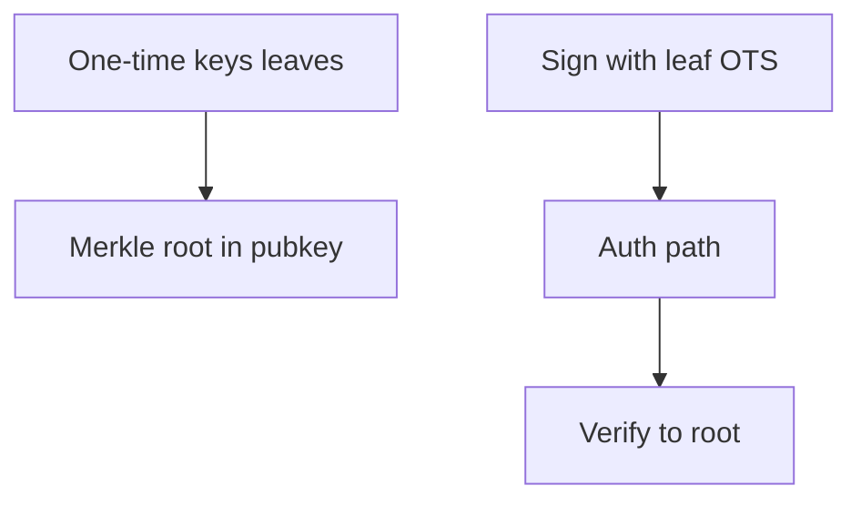

---

## 7.1 The Appeal of Hash-Based Cryptography

Among the families of post-quantum cryptographic schemes, hash-based signatures occupy a philosophically distinctive position. Their security relies on what cryptographers consider the **minimal possible assumption**: the existence of a secure hash function. There are no hidden algebraic structures to exploit, no lattice problems whose hardness might one day be undermined by clever algorithms, and no error-correcting codes whose parameters might prove insufficiently conservative. The entire security argument reduces to the one-wayness, second preimage resistance, and collision resistance of a well-studied hash function.

This minimalism carries profound implications for long-term confidence. Consider the history of cryptographic assumptions: RSA's security depends on the hardness of integer factorization, a problem studied for centuries yet broken in polynomial time by Shor's algorithm on a quantum computer. Elliptic curve discrete logarithm, once considered an independent assumption, fell to the same quantum algorithm. Lattice problems, while promising, have been studied intensively for only a few decades in the cryptographic context, and new algorithmic ideas continue to emerge. Hash functions, by contrast, have been the workhorses of computer science for over fifty years, and the best known quantum attack against them — Grover's algorithm — provides only a quadratic speedup, meaning that doubling the output length fully compensates for quantum adversaries.

The concrete benefits of hash-based security assumptions include:

- **Maximum confidence in quantum resistance.** A quantum computer running Grover's algorithm against a 256-bit hash function achieves only 128-bit quantum security. This is well understood, and no better quantum algorithm is known or expected for generic hash functions. The mathematical arguments for this lower bound are substantially stronger than those for lattice or code-based problems.

- **Conceptual simplicity and transparency.** The constructions — Lamport signatures, Winternitz chains, Merkle trees — can be explained to undergraduate computer science students. Each component has a clear purpose, and the overall security argument composes cleanly from the security of individual building blocks.

- **Cryptographic agility and future-proofing.** If a specific hash function (say SHA-256) were found to be weak, the scheme could be re-instantiated with a different hash function without changing the structural design. The signature scheme is parameterized by an abstract hash function family, and its security proof holds for any instantiation meeting the required properties.

- **Proven security with tight reductions.** Hash-based signature schemes typically enjoy security proofs where the security loss between the scheme and the underlying hash function is minimal — often logarithmic in the number of signatures issued. This contrasts with many lattice-based or code-based schemes where the security reductions involve polynomial or even super-polynomial loss factors.

The trade-offs, however, are significant. Hash-based signatures typically produce larger signatures than lattice-based alternatives: SLH-DSA signatures range from approximately 8 KB to 50 KB, compared to 2.4 KB for ML-DSA at comparable security levels. Signing and verification operations require hundreds or thousands of hash function evaluations, making them slower in absolute terms, though still practical for most applications. Key generation for stateful schemes can also be expensive when large trees must be constructed upfront. These trade-offs make hash-based signatures a complement to lattice-based approaches rather than a replacement: they serve as the conservative fallback when maximum security confidence outweighs performance concerns.


**Figure 7.2 — Stateful vs stateless deployment**

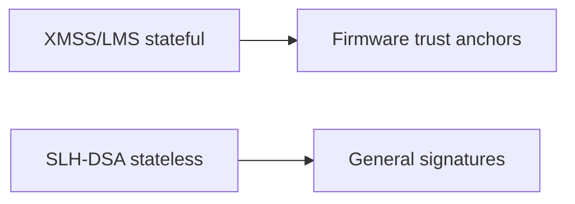

## 7.2 One-Time Signatures: The Building Block

The entire edifice of hash-based cryptography rests on a deceptively simple foundation: the one-time signature (OTS). A one-time signature scheme allows a signer to produce exactly one signature under a given key pair. If the key pair is reused, the scheme's security guarantees evaporate. While this seems like an absurd limitation, it turns out that one-time signatures can be constructed from hash functions alone with extraordinary efficiency, and the limitation can be managed through tree-based key management structures described in later sections.

### Lamport Signatures (1979)

Leslie Lamport proposed the simplest possible hash-based signature in 1979, and it remains the most intuitive introduction to the field. The construction requires nothing beyond a one-way function.

**Key Generation.** Suppose we want to sign messages whose hash is n bits long. For each bit position i from 1 to n, the signer generates two independent random values: x_i^0 and x_i^1, each of length n bits. The signer then computes y_i^0 = H(x_i^0) and y_i^1 = H(x_i^1) for each i. The secret key consists of all 2n random values (x_i^0, x_i^1), and the public key consists of all 2n hash values (y_i^0, y_i^1).

**Signing.** To sign a message m, the signer first computes h = H(m), obtaining n bits h_1, h_2, ..., h_n. The signature is the sequence of n secret values, one per bit position, selected according to the corresponding message hash bit: sigma = (x_1^{h_1}, x_2^{h_2}, ..., x_n^{h_n}).

**Verification.** The verifier receives the signature sigma = (sigma_1, sigma_2, ..., sigma_n). For each position i, the verifier computes H(sigma_i) and checks that it equals y_i^{h_i} from the public key, where h_i is the i-th bit of H(m).

**Security argument.** If an adversary observes a signature on message m, they learn exactly one preimage per bit position — the one corresponding to the actual bit value of H(m). To forge a signature on a different message m', the adversary would need to find a preimage for at least one position where H(m') differs from H(m). Since the adversary has never seen the corresponding secret value for that position, they would need to invert the hash function, which contradicts the one-wayness assumption.

**Practical limitations.** Lamport signatures have enormous key and signature sizes. For n = 256 (using a 256-bit hash), the public key contains 512 hash values (16,384 bytes), and each signature contains 256 hash values (8,192 bytes). Furthermore, the scheme is strictly one-time: signing two different messages reveals preimages for both bit patterns, potentially allowing an adversary to construct a valid signature for a third message whose hash bits are covered by the union of revealed preimages.

Despite its impracticality, the Lamport scheme establishes the conceptual foundation: hash functions alone suffice for digital signatures, and the one-time limitation can be addressed through structural means.

### Winternitz One-Time Signature (WOTS)

Robert Winternitz observed in 1979 that Lamport signatures could be compressed dramatically by signing multiple bits simultaneously using iterated hash chains rather than individual hash function evaluations. This insight reduces signature size by a factor roughly proportional to the Winternitz parameter w, at the cost of increased computation.

**Core Idea: Hash Chains.** Instead of signing one bit at a time, WOTS processes the message hash in base-w digits. A hash chain of length w-1 is a sequence of values computed by iterating the hash function: given a starting value x, the chain is x, H(x), H(H(x)), ..., H^{w-1}(x). The signer reveals an intermediate value in the chain, and the verifier can check it by hashing forward to the chain's endpoint (which is part of the public key).

**Detailed Construction.** Let the message hash be n bits long, and let w be the Winternitz parameter (typically a power of 2). The construction proceeds as follows:

1. Divide the message hash into l_1 = ceil(n / log_2(w)) base-w digits, each ranging from 0 to w-1.
2. Compute a checksum over these digits: C = sum_{i=1}^{l_1} (w - 1 - m_i), where m_i is the i-th digit. This checksum is then encoded as l_2 additional base-w digits.
3. The total number of hash chains is l = l_1 + l_2.
4. The secret key consists of l random starting values (x_1, ..., x_l).
5. The public key consists of l chain endpoints: (H^{w-1}(x_1), ..., H^{w-1}(x_l)).
6. To sign, reveal the chain value at position m_i for message digit i: sigma_i = H^{m_i}(x_i).
7. To verify, hash each signature component forward by (w - 1 - m_i) steps and check against the public key: H^{w-1-m_i}(sigma_i) should equal the corresponding public key element.

**The checksum's role.** Without the checksum, an adversary who observes a signature could trivially forge signatures for messages with larger digit values — they would simply hash forward on the revealed chain values. The checksum ensures that any increase in a message digit must be compensated by a decrease in a checksum digit, which would require inverting the hash function (hashing backward on a chain). This elegant mechanism preserves one-time security without additional assumptions.

**WOTS+ (Used in SPHINCS+/SLH-DSA).** The WOTS+ variant, developed by Hülsing in 2013, introduces two refinements that yield tighter security proofs:

First, WOTS+ uses a **tweakable hash function** rather than a plain hash function for chain computation. Each hash evaluation incorporates a unique "address" that specifies the chain index, the position within the chain, and a public seed. This prevents an adversary from exploiting relationships between different chains or between different signers' keys.

Second, WOTS+ adds **randomized bitmasks** to the hash chain computation. Before each hash evaluation, the input is XORed with a position-dependent bitmask derived from the public seed. This eliminates multi-target attack advantages where an adversary might benefit from seeing many hash chain values across different positions or key pairs.

These modifications enable a security proof that reduces tightly to the properties of the underlying hash function, with security loss that is essentially independent of the number of chains or the chain length.

**The Trade-off Parameter w.** The Winternitz parameter w controls a fundamental space-time trade-off:

| w | Chains (l) for n=256 | Signature Size | Hash Calls (Sign) | Hash Calls (Verify) |
|---|----------------------|----------------|-------------------|---------------------|
| 4 | 133 | ~4,256 bytes | ~199 | ~199 |
| 16 | 67 | ~2,144 bytes | ~503 | ~503 |
| 256 | 34 | ~1,088 bytes | ~4,335 | ~4,335 |

With w = 4, each chain has only 3 intermediate values, so signing and verification require few hash evaluations per chain, but there are many chains. With w = 256, each chain has 255 intermediate values, so there are far fewer chains (smaller signature), but each signing or verification operation requires traversing potentially long chains.

In practice, w = 16 provides the best balance for most applications, and this is the default in both XMSS and SLH-DSA. The choice of w = 256 is occasionally used when signature size must be minimized regardless of computational cost.

## 7.3 Few-Time Signatures: HORST and FORS

One-time signatures must be used exactly once, and violating this constraint catastrophically compromises security. For stateless hash-based schemes, we need a slightly more forgiving primitive: a **few-time signature** (FTS) that remains secure even if a small number of messages are signed with the same key. The degradation in security should be gradual and quantifiable, allowing scheme parameters to compensate for the expected number of reuses.

### HORST (Hash to Obtain Random Subset Tree)

HORST, introduced in the original SPHINCS proposal (2015), was the first few-time signature designed specifically for use within a hypertree construction. Its core idea is simple: the signer possesses a large set of secret values organized into a Merkle tree, and signing a message involves revealing a pseudorandomly selected subset of these values along with their authentication paths.

The construction works as follows: the signer generates t secret values s_1, ..., s_t and builds a Merkle tree over their hashes. To sign a message, the message hash is split into k portions, each selecting one of the t secret values to reveal. The signature consists of the k revealed values plus their Merkle authentication paths.

HORST's security degrades with each additional signature: every signature reveals k secret values, and after q signatures, an adversary knows up to qk values. For the adversary to forge a signature, they need the message hash to select only from the already-revealed values, which has probability approximately (qk/t)^k. By choosing t and k appropriately, this probability can be made negligible for any expected number of signatures.

However, HORST has a significant weakness: its security degrades relatively quickly, and achieving high security levels requires very large parameter sets.

### FORS (Forest of Random Subsets)

FORS, introduced in SPHINCS+ (2019) and used in the standardized SLH-DSA, improves upon HORST with a cleaner construction and better concrete security.

**Structure.** FORS uses k independent binary trees, each of height a (having 2^a leaves). The signer generates k × 2^a random secret values, organized as leaves of k separate Merkle trees. Each tree has its own root, and the k roots are hashed together to form the FORS public key.

**Key generation.** For tree j (j = 0, ..., k-1) and leaf index i (i = 0, ..., 2^a - 1):
- Secret value: sk_{j,i} is derived pseudorandomly from the master secret key and an address
- Leaf node: H(sk_{j,i})
- The tree is built up using standard Merkle tree construction
- The FORS public key is H(root_0 || root_1 || ... || root_{k-1})

**Signing.** To sign a message (or rather, a message digest) of ka bits:
1. Split the digest into k blocks of a bits each: b_0, b_1, ..., b_{k-1}
2. Each block b_j selects a leaf index in tree j
3. The signature consists of k secret values (one per tree, at the selected leaf) plus k authentication paths (one per tree, from the selected leaf to the root)

**Verification.** The verifier:
1. Splits the message digest identically
2. For each tree j, hashes the revealed secret value to obtain the leaf, then uses the authentication path to compute the root
3. Hashes all k roots together and compares with the FORS public key

**Security analysis.** The security of FORS against forgery after observing q signatures depends on the probability that a new message digest selects, in every tree, a leaf that was previously revealed. For tree j, each signature reveals one of 2^a leaves, so after q signatures, the fraction of known leaves is at most q/2^a. The probability that a random message selects only known leaves across all k trees is at most (q/2^a)^k.

For the parameters used in SLH-DSA-128f (k = 33, a = 6), even after 2^10 signatures to the same FORS instance, the forgery probability is approximately (2^10 / 2^6)^33 = (2^4)^33 = 2^132, which is negligible. In practice, the hypertree structure ensures that each FORS instance is used far fewer times than this bound.

**Advantages over HORST.** FORS provides better concrete security with smaller parameters because the tree structure allows efficient authentication without revealing the global structure. The separation into independent trees also simplifies the security analysis and allows tighter reductions.

## 7.4 Merkle Trees: Managing Many Keys

The fundamental limitation of one-time and few-time signatures — that they can sign only a limited number of messages — must be overcome for practical use. Ralph Merkle's brilliant insight in 1979 was that a binary hash tree could aggregate an exponential number of one-time key pairs under a single compact public key, with verification requiring only a logarithmic-length proof.

### Construction

A Merkle signature tree of height h manages N = 2^h one-time signature key pairs:

1. **Leaf generation.** Generate N independent OTS key pairs (sk_0, pk_0), (sk_1, pk_1), ..., (sk_{N-1}, pk_{N-1}).
2. **Leaf hashing.** Compute the leaf nodes of the tree as L_i = H(pk_i) for each i.
3. **Internal nodes.** Build the binary tree bottom-up: each internal node is the hash of the concatenation of its two children: Node_{level, index} = H(Node_{level-1, 2·index} || Node_{level-1, 2·index+1}).
4. **Root.** The single root node at level h serves as the aggregate public key for all N key pairs.

The tree structure creates a binding commitment: modifying any leaf would change the root, so the root effectively commits to all N public keys simultaneously.

### Authentication Path

To sign a message with the i-th OTS key pair, the signer provides:
1. The OTS signature on the message
2. The OTS public key pk_i (which the verifier needs to verify the OTS signature)
3. An **authentication path**: the sequence of h sibling nodes along the path from leaf i to the root

The authentication path allows the verifier to recompute the root independently:
1. Verify the OTS signature against pk_i
2. Compute L_i = H(pk_i)
3. For each level from 0 to h-1, combine the current node with the provided sibling (respecting left/right ordering) and hash to obtain the parent
4. Compare the computed root against the known public key (the published root)

The authentication path contains exactly h hash values, so its size is h × |hash output|. For a tree of height 20 with 256-bit hashes, the authentication path is only 640 bytes — remarkably compact for authenticating one key among over a million.

### Tree Traversal and Efficiency

A naive implementation would store the entire tree (2^{h+1} - 1 nodes), which is impractical for large h. Several algorithms optimize the computation of successive authentication paths:

**Classical Merkle traversal.** The original Merkle traversal algorithm computes authentication paths on-the-fly using O(h^2) storage and O(h) hash computations per signature. It keeps a "stack" of partially computed subtrees and schedules their computation across multiple signing operations.

**BDS (Buchmann-Dahmen-Szydlo) traversal.** The BDS algorithm (2009) reduces the per-signature computation to O(h/2) hash evaluations using O(2h + h·2^(h/d)) storage, where d is a tuning parameter. It achieves this by pre-computing and caching treehash instances — partial tree computations that are advanced incrementally with each signature.

**Fractal Merkle trees.** Fractal tree traversal distributes the computation of future authentication path nodes across current signing operations, maintaining near-constant per-signature cost at the expense of increased storage for intermediate computations.

**Multi-tree approaches.** Rather than using a single large tree, one can layer multiple smaller trees. A tree at level i+1 certifies (signs) the roots of trees at level i. This reduces the memory required for tree traversal at any single level and allows on-demand generation of subtrees.

The choice of traversal algorithm affects only performance, not security. All algorithms produce identical signatures and authentication paths; they differ only in how efficiently these are computed.

## 7.5 Stateful Hash-Based Signatures: XMSS and LMS

The combination of one-time signatures and Merkle trees yields practical signature schemes with excellent security properties. Two such schemes have been standardized: XMSS (eXtended Merkle Signature Scheme) and LMS (Leighton-Micali Signature). Both are **stateful**: the signer must maintain and update a counter indicating which leaf to use next.

### XMSS (eXtended Merkle Signature Scheme)

XMSS, standardized in RFC 8391 (2018) and approved by NIST in SP 800-208, extends the basic Merkle construction with modern security features.

**Structure.** An XMSS instance consists of:
- A single Merkle tree of height h, giving capacity for 2^h signatures
- WOTS+ instances at each leaf, providing one-time signatures
- A bitmask and key generation scheme using a public seed, ensuring that all hash computations are domain-separated

**Detailed signing process:**
1. Retrieve the current leaf index idx from the state and increment it
2. Compute the WOTS+ signature on the message using the secret key at leaf idx
3. Compute the authentication path from leaf idx to the root
4. Output the signature: (idx, WOTS+ signature, authentication path)
5. Persist the updated state (new idx value)

**Parameters and sizes:**

| Parameter Set | h | n | w | Signatures | Sig Size | PK Size | SK Size |
|--------------|---|---|---|-----------|----------|---------|---------|
| XMSS-SHA2_10_256 | 10 | 32 | 16 | 1,024 | 2,500 B | 64 B | 1,395 B |
| XMSS-SHA2_16_256 | 16 | 32 | 16 | 65,536 | 2,692 B | 64 B | 2,083 B |
| XMSS-SHA2_20_256 | 20 | 32 | 16 | 1,048,576 | 2,820 B | 64 B | 2,467 B |

The signature sizes are remarkably compact for hash-based schemes: approximately 2.5–2.8 KB depending on tree height. Public keys are just 64 bytes (a root hash plus a public seed). The signature grows by 32 bytes for each additional level of tree height, reflecting the authentication path.

**Key generation.** XMSS key generation involves computing the entire tree (or at minimum, the root and initial authentication path). For h = 20, this requires computing over one million WOTS+ public keys and building a tree with over two million nodes — a one-time cost that may take several seconds.

### XMSS^MT (Multi-Tree XMSS)

For applications requiring more than 2^20 signatures (approximately one million), a single XMSS tree becomes impractical because key generation would require computing an astronomically large tree. XMSS^MT addresses this through a layered approach.

**Construction.** XMSS^MT uses d layers of XMSS trees, each of height h/d:
- The top layer contains a single tree whose root is the overall public key
- Each leaf of a tree at layer i contains the root of a tree at layer i-1
- The bottom layer's leaves contain the actual WOTS+ key pairs used to sign messages
- Total signing capacity: 2^h signatures, distributed across 2^{h-h/d} bottom-layer trees

**Signing.** To sign with leaf index idx:
1. Decompose idx into d components, one per layer
2. At the bottom layer, sign the message with the appropriate WOTS+ instance
3. At each higher layer, sign the root of the layer below with the appropriate WOTS+ instance
4. The final signature contains d WOTS+ signatures and d authentication paths

**Trade-offs.** XMSS^MT signatures are d times larger than single-tree XMSS signatures (each layer contributes one WOTS+ signature and one authentication path). However, key generation only requires building the top-layer tree immediately, and lower-layer trees can be generated on demand. With d = 4, for example, total height h = 40 gives 2^40 (approximately one trillion) signatures, with each layer having height 10.

### LMS (Leighton-Micali Signature)

LMS, standardized in RFC 8554 (2019) and also approved in NIST SP 800-208, follows the same conceptual design as XMSS but with different technical choices.

**Key differences from XMSS:**
- Uses LM-OTS (Leighton-Micali One-Time Signature) instead of WOTS+. LM-OTS is similar to WOTS but uses a slightly different chain construction with a checksum mechanism.
- Does not use bitmasks or tweakable hash functions in the tree construction, instead relying on a simpler hash construction with explicit type bytes.
- The multi-tree variant is called HSS (Hierarchical Signature System) and allows up to 8 layers.
- Parameters are identified by numeric identifiers rather than algorithm names.

**LMS parameter sets include:**
- LMS_SHA256_M32_H5 through LMS_SHA256_M32_H25 (tree heights 5 through 25)
- LM-OTS parameters with Winternitz values w = 1, 2, 4, 8

**Comparative note.** XMSS has somewhat tighter security proofs due to its use of tweakable hash functions, while LMS has a simpler specification and slightly faster implementation in constrained environments. Both schemes provide equivalent practical security when instantiated with appropriate parameters.

### The State Management Problem

The stateful nature of XMSS and LMS introduces their most significant operational challenge: **the signer must never, under any circumstances, reuse a one-time key pair.**

**Why reuse is catastrophic.** If a WOTS+ key pair is used to sign two different messages, an adversary observing both signatures sees two different intermediate chain values for each position. In positions where the two message digits differ, the adversary can compute hash chain values they should never have seen. With sufficient information from just two signatures on distinct messages, a complete key recovery is often possible, enabling arbitrary forgeries.

**Sources of accidental reuse:**
- **System crashes:** If the state is not persisted to non-volatile storage before the signature is released, a crash and restart could cause the same index to be used again.
- **Virtual machine snapshots and rollbacks:** Restoring a VM to a previous state resets the index counter, causing certain reuse of one-time keys.
- **Backup and restore:** Restoring a system from backup similarly resets the state.
- **Cloning:** Copying a signing system (for load balancing or redundancy) creates two instances with identical state that will inevitably produce colliding signatures.
- **Concurrent access:** Multiple threads or processes accessing the same key without proper synchronization may read the same index.

**Mitigation strategies:**
- Write the incremented index to persistent storage before computing the signature (not after)
- Use hardware security modules (HSMs) with non-volatile monotonic counters
- Reserve index ranges: advance the persisted counter by a batch size (e.g., 1000) and use the reserved range in memory, so a crash wastes at most one batch but never causes reuse
- Never clone, snapshot, or backup the signing key state without permanent decommissioning of the original

These requirements restrict stateful hash-based signatures to controlled, high-security environments where operational discipline can be maintained. They are poorly suited to general-purpose applications where signing keys might be deployed on commodity hardware without specialized state management.

## 7.6 Stateless Hash-Based Signatures: SPHINCS+ / SLH-DSA

### Motivation

The state management burden of XMSS and LMS fundamentally limits their applicability. Most real-world signing scenarios — web servers handling TLS connections, software update systems signing packages, email clients signing messages — cannot guarantee the operational requirements that stateful schemes demand. A single VM rollback or database restore could silently compromise the signature scheme's security, with no detection mechanism.

SPHINCS+ (Stateless Practical Hash-based Incredibly Nice Cryptographic Signatures, Plus) was designed to eliminate state entirely while retaining the hash-only security assumption. Standardized as SLH-DSA (Stateless Hash-Based Digital Signature Algorithm) in FIPS 205 (2024), it achieves statelessness through a combination of large virtual trees and deterministic leaf selection.

### Architecture

SLH-DSA's architecture combines three cryptographic components in a layered structure:

1. **FORS (Forest of Random Subsets):** A few-time signature at the bottom layer that directly signs messages. Each FORS instance can safely sign a small number of messages.

2. **WOTS+ (Winternitz One-Time Signature Plus):** One-time signatures used at every internal tree level to authenticate the roots of trees at the level below.

3. **Hypertree:** A d-layer hierarchy of Merkle trees. The top tree's root is the public key. Each successive layer provides authentication for the layer below, down to the FORS instances at the bottom.

The hypertree contains an enormous number of virtual FORS instances — far more than will ever be used. The key insight is that these instances need not be generated in advance; they can be computed on demand from the secret key using pseudorandom derivation.

### Detailed Operation

**Key generation:**
1. Generate a secret seed SK.seed, a secret PRF key SK.prf, and a public seed PK.seed
2. Compute the root of the top-layer Merkle tree (this requires computing all nodes in the top tree, including all WOTS+ public keys at its leaves)
3. The public key is (PK.seed, PK.root) — just two n-byte values
4. The secret key is (SK.seed, SK.prf, PK.seed, PK.root) — four n-byte values

**Signing a message M:**
1. **Randomized message hashing.** Compute an optional randomizer R = PRF(SK.prf, OptRand, M), then compute the message digest = H_msg(R, PK.seed, PK.root, M). This digest determines both the FORS leaf index and provides the message to be signed.

2. **Index extraction.** From the digest, extract a (h - h/d)-bit index idx that selects a specific FORS instance in the virtual hypertree, plus a ka-bit message digest md to be signed by FORS.

3. **FORS signing.** Use SK.seed and the FORS address (determined by idx) to derive the FORS secret key, then sign md using FORS. Output the FORS signature and compute the FORS public key.

4. **Hypertree authentication.** Starting from the bottom layer:
   - The FORS public key hash is a leaf in the bottom-layer Merkle tree
   - Sign this leaf's tree root with the WOTS+ instance at the appropriate position in the next layer up
   - Compute and include the authentication path for that layer
   - Repeat for each layer up to the top

5. **Signature output.** The complete signature consists of: R (the randomizer), the FORS signature (k secret values + k authentication paths), and d WOTS+ signatures each with their Merkle authentication paths.

**Verification:**
1. Recompute the message digest from (R, PK.seed, PK.root, M)
2. Extract the same index and message digest
3. Verify the FORS signature and reconstruct the FORS public key
4. For each hypertree layer (bottom to top), verify the WOTS+ signature and use the authentication path to compute the next layer's expected root
5. Compare the final computed root against PK.root

### Why Stateless Works

The elimination of state relies on several interacting properties:

**Deterministic leaf selection.** Given the same secret key and the same message (and the same optional randomness), the signing algorithm always selects the same FORS instance and produces the same signature. There is no counter to maintain; the "address" in the hypertree is derived solely from the message and key material.

**Few-time signature tolerance.** If two different messages happen to map to the same FORS instance (a "collision" in the index derivation), FORS can tolerate this because it is a few-time signature. Security degrades gracefully with the number of messages signed per FORS instance, and the parameters are chosen so that the expected number of collisions remains safely within FORS's security margin.

**Astronomical virtual key space.** The hypertree contains 2^{h-h/d} FORS instances. For SLH-DSA-128f with total height h = 66 and d = 22, there are 2^63 FORS instances. Even signing 2^64 messages (far more than any practical system would ever produce), the expected number of messages per FORS instance is only about 2, well within FORS's few-time security tolerance.

**On-demand computation.** The signer never materializes the full hypertree. Each signing operation computes only the specific path from the selected FORS instance up to the root. This requires generating WOTS+ key pairs, building Merkle tree portions, and computing authentication paths for the specific indices needed — all derived deterministically from SK.seed and the addresses.

### Parameters (SLH-DSA, FIPS 205)

SLH-DSA offers six parameter sets spanning three security levels and two performance profiles:

| Parameter Set | Security Level | n | h | d | a | k | w | Sig Size | PK | SK |
|--------------|---------------|---|---|---|---|---|---|----------|----|----|
| SLH-DSA-128s | 1 (128-bit) | 16 | 63 | 7 | 12 | 14 | 16 | 7,856 B | 32 B | 64 B |
| SLH-DSA-128f | 1 (128-bit) | 16 | 66 | 22 | 6 | 33 | 16 | 17,088 B | 32 B | 64 B |
| SLH-DSA-192s | 3 (192-bit) | 24 | 63 | 7 | 14 | 17 | 16 | 16,224 B | 48 B | 96 B |
| SLH-DSA-192f | 3 (192-bit) | 24 | 66 | 22 | 8 | 33 | 16 | 35,664 B | 48 B | 96 B |
| SLH-DSA-256s | 5 (256-bit) | 32 | 64 | 8 | 14 | 22 | 16 | 29,792 B | 64 B | 128 B |
| SLH-DSA-256f | 5 (256-bit) | 32 | 68 | 17 | 9 | 35 | 16 | 49,856 B | 64 B | 128 B |

**The "s" vs "f" trade-off:** The "small" variants use fewer hypertree layers (smaller d) with taller trees per layer. This produces smaller signatures (fewer WOTS+ signatures in the authentication chain) but requires more hash computations during signing because each tree is taller. The "fast" variants use more layers of shorter trees, resulting in larger signatures (more WOTS+ components) but faster signing due to shorter trees.

### Performance Characteristics

| Operation | SLH-DSA-128s | SLH-DSA-128f | ML-DSA-44 | ECDSA P-256 |
|-----------|-------------|-------------|-----------|-------------|
| Key generation | ~5 ms | ~0.5 ms | ~0.1 ms | ~0.1 ms |
| Signing | ~50 ms | ~5 ms | ~0.3 ms | ~0.1 ms |
| Verification | ~5 ms | ~1 ms | ~0.3 ms | ~0.2 ms |
| Signature size | 7,856 B | 17,088 B | 2,420 B | 64 B |
| Public key size | 32 B | 32 B | 1,312 B | 64 B |

Several observations about these numbers:

- SLH-DSA signing is 15–500x slower than ML-DSA depending on the parameter set, making it poorly suited for high-throughput signing applications.
- Verification is faster than signing (typically 5–10x) because verifiers only hash forward on chains and recompute authentication paths, while signers must additionally generate key material.
- Public keys are extraordinarily compact (32–64 bytes), smaller than any other post-quantum scheme. This is advantageous in certificate chains where the same public key is transmitted repeatedly.
- The wide gap between "s" and "f" variants allows applications to choose their preferred point on the speed-vs-size curve.

## 7.7 Hash Function Requirements

The security of hash-based signatures reduces to properties of the underlying hash function, but not all hash function properties are equally important for all components. Understanding which properties are needed where is essential for correct instantiation and security analysis.

### Standard Cryptographic Properties

**Preimage resistance (one-wayness).** Given a hash output y, it must be computationally infeasible to find any input x such that H(x) = y. This is the foundational property used in Lamport and WOTS+ signatures: the public key consists of hash outputs, and forging requires finding their preimages.

Formally, for n-bit security, finding a preimage should require approximately 2^n hash evaluations. Against a quantum adversary using Grover's algorithm, this reduces to 2^{n/2} evaluations, so 256-bit hash outputs provide 128-bit quantum security.

**Second preimage resistance.** Given a specific input x, it must be infeasible to find a different input x' such that H(x) = H(x'). This property is crucial for Merkle tree security: given a valid authentication path, an adversary should not be able to find an alternative leaf that produces the same root.

**Collision resistance.** It must be infeasible to find any pair of distinct inputs (x, x') such that H(x) = H(x'). This property is needed for the binding property of Merkle trees and for the security of the message hashing step.

### Extended Properties for SLH-DSA

SLH-DSA's security proof requires additional properties beyond the standard three:

**Pseudorandom function (PRF) security.** The secret key includes a PRF key SK.prf used to derive the randomizer R for message hashing. This PRF must be indistinguishable from a random function to an adversary who does not know SK.prf. In the SLH-DSA instantiations, PRF is constructed from the same hash primitive (e.g., HMAC-SHA-256 or SHAKE-256 with appropriate domain separation).

**Tweakable hash function (Th) security.** A tweakable hash function takes an additional "tweak" input (called an address in SLH-DSA) that parameterizes the function. The security requirement is that the function behaves as an independent random function for each distinct tweak value. This is formalized through properties including:

- **Single-function multi-target second preimage resistance (SM-SPR):** Even when targeting many different instances (tweaks) simultaneously, finding a second preimage for any one should be no easier than finding a second preimage for a single instance.
- **Single-function multi-target decisional second preimage resistance (SM-DSPR):** A technical variant needed for the undetectability property.

**Interleaved target subset resilience (ITSR).** This property, specific to FORS, captures the difficulty of finding a message whose FORS signing indices fall entirely within a set of previously revealed indices. It is a strengthening of standard subset resilience that accounts for the adaptive nature of the attack (the adversary can choose which messages to request signatures on before attempting the forgery).

### Hash Function Instantiations

SLH-DSA specifies two primary instantiation families:

**SHA-256 based (SLH-DSA-SHA2).** Uses SHA-256 (for 128-bit security) or SHA-512 (for higher security levels) as the core primitive:
- The tweakable hash function Th is constructed using SHA-256 with the address prepended to the input
- The PRF uses HMAC-SHA-256
- The message hash H_msg uses MGF1 (Mask Generation Function 1) based on SHA-256
- This instantiation benefits from hardware acceleration (SHA-NI instructions) on modern x86 processors

**SHAKE-256 based (SLH-DSA-SHAKE).** Uses SHAKE-256 (the extendable-output variant of SHA-3) throughout:
- All hash functions (Th, PRF, H_msg, F) are instantiated as SHAKE-256 with appropriate prefixes for domain separation
- This provides conceptual simplicity (one primitive does everything) and benefits from platforms with Keccak hardware acceleration
- The sponge construction of Keccak provides natural domain separation through its capacity

**Haraka (optional/non-standard).** Haraka is a short-input hash function based on AES round functions, designed specifically for hash-based signatures. It achieves very high throughput on platforms with AES-NI acceleration but is not part of the FIPS 205 standard. Some SPHINCS+ implementations offer it as an optional instantiation for performance-critical applications.

**Choosing between instantiations.** On platforms with SHA-NI (Intel Ice Lake and later, AMD Zen 3 and later), the SHA-256 instantiation typically provides better performance. On platforms without SHA-NI but with general-purpose AES-NI support, SHAKE can be competitive. On platforms with dedicated SHA-3 hardware (certain embedded security controllers), SHAKE is preferred. The security level is identical for both instantiations given the same parameter set.

## 7.8 Security Analysis

Hash-based signatures enjoy the strongest security arguments of any post-quantum signature scheme. This section examines the nature of these proofs, their tightness, and the known attack vectors.

### Tight Security Reductions

A security reduction shows that breaking the signature scheme implies breaking the underlying hash function. The **tightness** of this reduction — how much security is "lost" in the implication — directly affects the concrete security level.

For XMSS, the security reduction is remarkably tight. The reduction from XMSS to the underlying hash function properties loses only a factor of approximately q·l, where q is the number of signature queries and l is the number of WOTS+ chains. For typical parameters (q = 2^20, l = 67), this represents a loss of only about 26 bits — well within the security margin.

For SLH-DSA, the security proof is somewhat more complex due to the multi-layer structure and the few-time nature of FORS. The overall security loss depends on:
- The number of hypertree layers d (multiplicative loss per layer)
- The FORS security degradation as a function of the number of signatures per instance
- The multi-target security properties of the tweakable hash function

NIST's security analysis for SLH-DSA accounts for all these factors and confirms that the standardized parameter sets provide their claimed security levels with comfortable margins.

**Comparison with lattice-based reductions.** ML-DSA's security reduces to the Module-LWE problem, but the reduction involves a significant tightness gap. The concrete hardness of Module-LWE is estimated through extrapolation from the best known algorithms (BKZ, lattice sieving), which introduces uncertainty. Hash-based signatures avoid this uncertainty entirely: the concrete security of SHA-256 against preimage attacks is directly characterized by the hash output length, with no extrapolation needed.

### Multi-Target Attacks

In many deployment scenarios, an adversary can observe signatures from millions of different signers or on millions of different messages. This creates a **multi-target** attack surface: rather than needing to break one specific hash chain, the adversary succeeds if they break any one of millions of instances.

**The threat.** Consider an adversary targeting N different WOTS+ public keys. For a standard hash function, finding a preimage for any one of N random targets costs approximately 2^n / N hash evaluations (a factor-N speedup over single-target attacks). For N = 2^40 (a billion signers), this reduces 256-bit security to 216-bit security.

**Mitigation through tweakable hash functions.** SLH-DSA's use of tweakable hash functions eliminates multi-target advantages. Because each hash evaluation incorporates a unique address (specifying the tree layer, tree index, chain index, and chain position), hash values computed for different signers or different positions within the same signature are effectively independent. An adversary cannot combine effort across different positions.

Formally, the SM-SPR (single-function multi-target second preimage resistance) property guarantees that even with access to many targets, the adversary's advantage is no better than for a single target. This is achieved because the address effectively makes each position's hash function independent, so parallelism across targets provides no benefit.

**Public seed's role.** Each SLH-DSA key pair includes a public seed PK.seed that is incorporated into all hash computations. Different signers have different public seeds with overwhelming probability, ensuring cryptographic independence between their hash function instances.

### Fault Attacks

Physical attacks on hash-based signature implementations present a distinct threat model from purely computational attacks. Fault injection — using voltage glitches, electromagnetic pulses, or laser beams to cause computational errors — can compromise hash-based signatures in several ways:

**WOTS+ chain faults.** If an attacker can induce a fault during WOTS+ signing that causes the hash chain computation to skip a step, the resulting signature contains a chain value at an incorrect position. By comparing the faulted signature with a correct signature on a different message, the attacker may be able to derive chain values at positions that should never have been revealed, potentially enabling forgery.

**Merkle tree computation faults.** Faulting the authentication path computation could cause the signer to output incorrect sibling values. While this doesn't directly enable forgery, it can reveal information about the tree structure that aids other attacks.

**FORS index manipulation.** If the message hash computation is faulted such that the FORS indices are modified, the resulting signature reveals secret values at unintended positions. Combined with a correct signature on the same message, this can reveal additional FORS secret values, accelerating forgery.

**Countermeasures:**
- **Signature verification before release:** The signer verifies each signature against the public key before outputting it. Any fault that corrupts the signature will cause verification to fail, preventing the faulted signature from being released.
- **Redundant computation:** Critical computations (especially hash chain evaluations) are performed twice and compared, detecting single faults.
- **Protected implementations:** Using hardware countermeasures such as dual-rail logic, error-detecting codes on intermediate values, or computation in protected memory regions.

For software implementations on general-purpose hardware, signature verification before release is the most practical countermeasure, adding only modest performance overhead (verification is typically faster than signing).

### Side-Channel Attacks

Hash-based signatures have relatively favorable side-channel properties compared to algebraic schemes:

- Hash functions have regular, data-independent control flow (no branching on secret data)
- Memory access patterns during hash computation are typically independent of the input
- The main side-channel risk is the secret key derivation step, where SK.seed is used

However, the address computation and tree traversal may leak information about which leaf index is being used. For stateless schemes like SLH-DSA, this information is derivable from the signature itself (the index is part of the signature), so it does not represent an additional vulnerability. For stateful schemes, leaking the current index is less concerning than leaking key material, but may still be undesirable in some threat models.

## 7.9 Use Cases for Hash-Based Signatures

The performance and size characteristics of hash-based signatures make them ideal for some applications and poorly suited for others. This section provides concrete guidance for practitioners.

### Ideal Applications

**Firmware and software signing.** Hash-based signatures are exceptionally well-suited for signing firmware and software updates:
- Signatures are computed infrequently (at release time) in a controlled environment
- Verification happens on the device, where signature size is less critical (firmware images are already large)
- Long-term security is paramount: firmware may need to remain securely verified for 15–20 years
- Both stateful (XMSS/LMS) and stateless (SLH-DSA) schemes work well here
- NIST explicitly recommends LMS/XMSS for firmware signing as an immediate deployment option

**Certificate authority root and intermediate certificates.** CA signing keys are used in highly controlled HSM environments where state management is feasible:
- Root CAs sign infrequently (perhaps a few certificates per year)
- The security requirement is extreme: root key compromise affects all subordinate certificates
- Small signature sizes are less critical for certificates that are cached and reused
- Stateful schemes (LMS/XMSS) are ideal here due to their compact signatures and strong security

**Document notarization and timestamping.** For legal and archival purposes:
- Documents must remain verifiable for decades
- The conservative security assumptions of hash-based signatures provide maximum confidence against future cryptanalytic advances
- Signing volume is manageable (documents, not network packets)
- SLH-DSA provides the simplest deployment model (no state management)

**Code signing for package managers and repositories.** Similar to firmware signing:
- Controlled signing environment
- Moderate frequency (thousands of packages, not millions per second)
- Long-term verification requirement
- Both stateful and stateless schemes appropriate

**Trust anchor and root of trust initialization.** When establishing hardware or software roots of trust:
- The root public key is embedded once (small public key is beneficial)
- Verification is infrequent
- Maximum security confidence required
- SLH-DSA's 32-byte public key is actually smaller than ML-DSA's 1,312 bytes

### Less Ideal Applications

**TLS/HTTPS authentication.** Hash-based signatures present challenges for TLS:
- Each handshake requires signature transmission, and 17–50 KB signatures increase latency
- High-traffic servers may perform thousands of signatures per second, making SLH-DSA's 5–50 ms signing time problematic
- Certificate chains compound the size issue (multiple signatures per chain)
- ML-DSA's 2.4 KB signatures and sub-millisecond operations are strongly preferred here

**IoT and embedded devices.** Constrained environments face multiple challenges:
- Limited bandwidth for transmitting large signatures
- Limited RAM for verification (authentication path reconstruction requires buffering)
- Limited computational resources for the many hash evaluations required
- Battery-constrained devices penalized by hash computation energy cost

**Real-time and high-frequency signing.** Applications requiring microsecond-level signing latency:
- Financial trading systems
- Real-time authentication protocols
- High-throughput message authentication
- SLH-DSA's millisecond-scale signing is too slow; even ML-DSA may be marginal for some of these applications

**Bandwidth-constrained communications.** Applications where every byte counts:
- Satellite communications with limited downlink capacity
- Low-power wide-area networks (LoRaWAN, NB-IoT)
- Blockchain transactions where signature size directly affects costs
- DNS responses where UDP packet size is limited

### Hybrid Deployment Strategies

Given the complementary strengths of hash-based and lattice-based signatures, several hybrid strategies are emerging:

**Dual-signature approach.** Some high-security applications sign with both ML-DSA and SLH-DSA, providing redundancy against cryptanalytic breakthroughs in either assumption. The combined signature is larger but provides the intersection of both threat models' security.

**Algorithm selection by tier.** Organizations may use SLH-DSA for root certificates and long-lived trust anchors (maximum confidence) while using ML-DSA for entity certificates and session authentication (performance-sensitive). This leverages each scheme's strengths at the appropriate tier.

**Migration readiness.** Even organizations currently deploying ML-DSA may maintain SLH-DSA implementation readiness as a contingency against lattice cryptanalysis breakthroughs. The hash-only security assumption of SLH-DSA makes it the natural fallback position.

## 7.10 SLH-DSA vs. ML-DSA Selection Guidance

Choosing between SLH-DSA and ML-DSA is one of the most consequential decisions in post-quantum deployment. The following framework organizes the decision criteria:

### Choose SLH-DSA When:

**Security confidence is the primary requirement.** If the application demands the absolute highest confidence in long-term security — perhaps protecting national secrets, critical infrastructure, or information with multi-decade sensitivity — SLH-DSA's minimal assumption (hash function security) provides substantially higher confidence than ML-DSA's lattice-based assumptions.

**You need a cryptographic "insurance policy."** If your organization is primarily deploying ML-DSA but wants a fallback in case of lattice cryptanalysis breakthroughs, maintaining SLH-DSA capability provides this insurance at low operational cost.

**Public key size matters more than signature size.** SLH-DSA's 32-byte public key is dramatically smaller than ML-DSA's 1,312-byte public key. In applications where the public key is stored or transmitted repeatedly (embedded in hardware, cached in verifiers, included in certificate chains), SLH-DSA may actually require less total bandwidth despite larger signatures.

**Signing is infrequent but verification persistence matters.** For applications like certificate authorities, software signing, or document notarization, the signing performance penalty is irrelevant (signatures are created rarely in controlled environments), and the security benefit is paramount.

**Regulatory or compliance requirements specify hash-based schemes.** Some government and critical infrastructure standards specifically require or recommend hash-based signatures for certain use cases (e.g., CNSA 2.0 recommends LMS/XMSS for firmware signing).

### Choose ML-DSA When:

**Performance is a primary constraint.** If the application requires sub-millisecond signing, high throughput, or low latency, ML-DSA's order-of-magnitude performance advantage is decisive.

**Bandwidth is limited.** ML-DSA signatures (2.4 KB) are 3–20x smaller than SLH-DSA signatures (7.8–49.9 KB). For applications transmitting many signatures (TLS handshakes, blockchain transactions, API authentication), this difference is substantial.

**The application requires frequent signing.** High-volume signing (web servers, authentication systems, real-time protocols) strongly favors ML-DSA's fast signing.

**You are comfortable with lattice assumptions.** Module-LWE has been studied for decades, survives intensive cryptanalysis, and is supported by worst-case to average-case reductions. While not as conservative as hash-based assumptions, it provides strong evidence of security.

**Interoperability with the broader ecosystem.** ML-DSA is likely to become the default post-quantum signature in most protocols and libraries, making it the path of least resistance for interoperability.

### Decision Matrix

| Criterion | Favors SLH-DSA | Favors ML-DSA |
|-----------|----------------|---------------|
| Security assumption strength | Strong | Moderate |
| Signing speed | Slow (ms) | Fast (μs) |
| Verification speed | Moderate | Fast |
| Signature size | Large (8–50 KB) | Small (2.4 KB) |
| Public key size | Very small (32 B) | Moderate (1.3 KB) |
| Secret key size | Small (64 B) | Moderate (4 KB) |
| Implementation complexity | Moderate | Moderate |
| Maturity of assumption | Decades (hash functions) | Decades (lattices) |
| Standardization status | FIPS 205 | FIPS 204 |
| Quantum security confidence | Highest | High |

## 7.11 Implementation Considerations

### Constant-Time Implementation

Hash-based signatures have a natural advantage for constant-time implementation because hash functions themselves typically have data-independent control flow. However, implementers must still ensure:

- The leaf index derivation does not leak timing information about the message
- Memory access patterns during tree traversal do not reveal the authentication path indices
- The conditional operations in WOTS+ chain computation (determining when to stop) do not create timing variations

Modern implementations typically achieve constant-time behavior by always computing the full chain and selecting the appropriate intermediate value through constant-time conditional moves.

### Memory Requirements

SLH-DSA signing is memory-intensive due to the need to compute Merkle tree portions on the fly:

- Each tree layer requires storing one full tree level during computation (2^{h_layer} nodes)
- The authentication path construction requires temporary storage for sibling nodes
- FORS computation requires storing k tree computations simultaneously

For the "fast" parameter sets with short trees per layer, memory requirements are modest (tens of kilobytes). For "small" parameter sets with taller trees, memory usage can reach hundreds of kilobytes during signing. Verification is less memory-intensive, as it processes authentication paths sequentially.

### Parallelization Opportunities

Hash-based signature operations offer substantial parallelism:

- WOTS+ chain computations are independent across chains (l chains can be computed in parallel)
- FORS tree computations are independent across the k trees
- Merkle tree node computations at the same level are independent
- Different hypertree layers, once lower layers complete, can overlap in computation

Hardware implementations and multi-core software implementations can exploit this parallelism to significantly reduce wall-clock signing and verification times. On a 16-core processor, SLH-DSA signing can be 8–12x faster than single-threaded execution.---

## Chapter Summary

**Technical takeaway:** Hash signatures minimize assumptions; stateful (XMSS/LMS) vs stateless (SLH-DSA) drives operations design.

**Deployment takeaway:** Never deploy stateful schemes without hardware or HSM state discipline.

*Figures in this chapter are planning aids—verify all algorithm names and byte sizes against the current NIST FIPS PDF before implementation.*

---

---

# Chapter 8: Multivariate Polynomial Cryptography

Rainbow's break is a lesson in **structure leaks**; UOV survives because boring can be good.

**Figure 8.1 — Oil and vinegar partition**

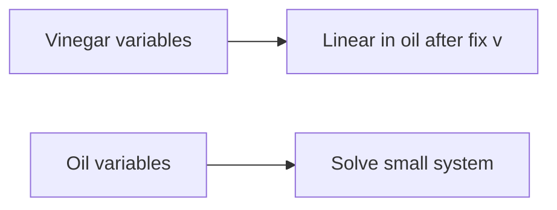

---

## 8.1 The Multivariate Quadratic Problem

Multivariate cryptography stands apart from other post-quantum families by drawing its hardness not from geometric lattice problems or error-correcting codes, but from the algebraic difficulty of solving systems of polynomial equations over finite fields. The fundamental problem underpinning this entire family—the Multivariate Quadratic (MQ) problem—has been studied in computational algebra for decades and possesses strong theoretical complexity guarantees that persist even in the presence of quantum computers.

**The MQ Problem (Formal Definition):** Given a system of m quadratic polynomials p₁, p₂, ..., pₘ in n variables x₁, x₂, ..., xₙ over a finite field F_q:

```
p₁(x₁, ..., xₙ) = 0
p₂(x₁, ..., xₙ) = 0
...
pₘ(x₁, ..., xₙ) = 0
```

where each polynomial pᵢ has the general quadratic form:

```
pᵢ(x) = Σⱼ≤ₖ aᵢⱼₖ · xⱼ · xₖ + Σⱼ bᵢⱼ · xⱼ + cᵢ
```

the computational task is to find a vector (x₁, ..., xₙ) ∈ F_q^n satisfying all m equations simultaneously, or to determine that no such solution exists.

Each polynomial contains at most n(n+1)/2 quadratic terms, n linear terms, and one constant term, giving a total of n(n+1)/2 + n + 1 coefficients per polynomial. A complete system of m polynomials in n variables is therefore described by m · (n(n+1)/2 + n + 1) field elements—this is what constitutes a public key in multivariate cryptography, and it explains the large key sizes characteristic of this family.

**Complexity-Theoretic Foundations:**

The MQ problem has a particularly strong complexity pedigree:

- **NP-hardness:** The decisional version of MQ (does a solution exist?) is NP-complete, even when restricted to F_2 (the binary field). This was established through reduction from Boolean satisfiability.
- **Average-case hardness:** Unlike many NP-hard problems where random instances are easy, random quadratic systems over finite fields appear hard on average for appropriate parameter choices. This average-case hardness is essential for cryptographic applications.
- **Quantum resistance:** No known polynomial-time quantum algorithm solves MQ. Grover's algorithm provides only a quadratic speedup to brute-force search. The algebraic structure of polynomial systems does not appear amenable to the hidden subgroup or period-finding techniques that underpin Shor's algorithm.

**Relationship to Other Hard Problems:**

The MQ problem connects to several other well-studied computational problems. The MinRank problem asks to find a low-rank matrix in an affine subspace of matrices—this problem reduces to MQ and appears in the analysis of many multivariate schemes. The Polynomial System Solving (PoSSo) problem generalizes MQ to higher degrees and is equally important in security analyses. The Extended Linearization (XL) approach relates MQ to systems of higher-degree equations that can be linearized at the cost of exponential expansion.

**Parameter Regimes:**

The difficulty of MQ depends critically on the ratio m/n (equations to variables) and the field size q:

- **Underdetermined (m < n):** The system typically has many solutions; finding one is easier but still potentially hard.
- **Determined (m = n):** The typical case for many cryptographic schemes; generically has q^0 = 1 solution over algebraically closed fields.
- **Overdetermined (m > n):** More constraints than unknowns; often harder for algebraic solvers because the degree of regularity increases, though the solution is more constrained.

For cryptographic applications, the parameters are chosen so that the best known solving algorithms (both classical and quantum) require at least 2^λ operations for a target security level λ.

**Historical Context:**

The study of multivariate polynomial systems has roots in classical algebraic geometry dating to the 19th century, but their cryptographic application began with Matsumoto and Imai's C* scheme in 1988. The subsequent decades saw a productive cycle of constructions and attacks: C* was broken by Patarin (1995) using linearization equations, leading to HFE (1996), Oil and Vinegar (1997, broken), Unbalanced Oil and Vinegar (1999, still secure), and numerous variants. This evolutionary process has produced schemes with well-understood security boundaries.

The multivariate approach to post-quantum cryptography is particularly attractive because it offers a fundamentally different mathematical foundation from lattice-based or code-based schemes. If an unexpected quantum algorithm were discovered that breaks structured lattice problems (such as module-LWE), multivariate schemes would be unaffected, and vice versa. This algorithmic diversity is a key motivation for maintaining multivariate candidates in the NIST standardization process.

**Concrete Instances and Field Choices:**

In practice, most multivariate schemes work over small finite fields:
- **F_2 (binary):** Used in some HFE variants. Compact representation (1 bit per coefficient) but large number of variables needed.
- **F_{16} (4-bit):** Used in Rainbow (before its break). Good balance between field operations and number of variables.
- **F_{31} (prime):** Used in some MAYO parameter sets. Enables efficient modular arithmetic.
- **F_{256} (byte-sized):** Used in UOV. Aligns with byte-oriented computing architectures, enabling efficient SIMD implementations.

The choice of field affects the number of variables and equations needed: larger fields allow fewer variables for the same security level (since each variable carries more entropy), but individual field operations become more expensive.


**Figure 8.2 — Rainbow break lesson**

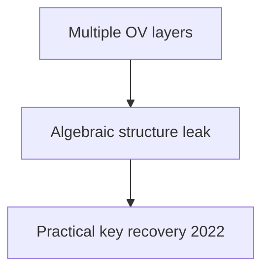

## 8.2 The Trapdoor Construction Paradigm

A random system of multivariate quadratic polynomials is computationally intractable to solve—but it is equally intractable to invert for the legitimate key holder. The fundamental challenge in multivariate cryptography is constructing polynomial systems that appear random to an external observer yet possess a hidden mathematical structure (a trapdoor) that enables efficient inversion by the secret key holder.

### The Central Map Approach

Virtually all multivariate cryptographic schemes share a common architectural pattern known as the "bipolar" or "central map" construction. The design proceeds in three layers:

1. **Central map F: F_q^n → F_q^m:** This is an easily invertible multivariate map that constitutes the trapdoor. Its algebraic structure makes it efficiently invertible given knowledge of its form, but this structure must be carefully hidden.

2. **Secret affine transformations S: F_q^n → F_q^n and T: F_q^m → F_q^m:** These are random invertible affine maps (linear transformation plus translation) that serve as "camouflage." They disguise the special structure of F by applying secret coordinate changes before and after the central map.

3. **Public key P = T ∘ F ∘ S:** The composition of these three maps yields the public polynomial system. Because affine transformations compose with quadratic maps to produce quadratic maps, P is itself a system of m quadratic polynomials in n variables.

The security argument proceeds as follows: the public key P appears (computationally) indistinguishable from a random quadratic system, so an attacker must either solve a random-looking MQ instance (believed intractable) or recover the hidden decomposition P = T ∘ F ∘ S (which various structural attacks attempt).

**Signing with the Trapdoor:**

For a signature scheme, the signer must invert the public map. Given a target value y (derived from the message hash), computing a preimage x such that P(x) = y proceeds as:

1. Compute y' = T⁻¹(y)
2. Find x' such that F(x') = y' (efficient due to the central map's structure)
3. Compute x = S⁻¹(x')
4. Output signature x

Verification simply checks that P(x) = y, which requires only polynomial evaluation.

### Types of Central Maps

The distinguishing feature among multivariate schemes is the choice of central map, which determines both the efficiency and security of the resulting scheme:

| Central Map | Name | Key Idea | Status |
|-------------|------|----------|--------|
| Oil and Vinegar | UOV | Specialized variable partition makes system linear after fixing vinegar | Active NIST candidate |
| Matsumoto-Imai | C* | Monomial x^(q^θ+1) over extension field F_{q^n} | Broken (linearization attack) |
| HFE | Hidden Field Equations | Low-degree polynomial over F_{q^n} | Weakened; variants survive |
| Rainbow | Layered OV | Multi-layer oil-and-vinegar structure | Broken 2022 |
| MAYO | Whipped UOV | UOV with compressed representation | Active NIST candidate |

**Why Quadratic?** The restriction to quadratic polynomials is not arbitrary. Higher-degree systems would provide more structural freedom for trapdoor design but would increase public key sizes (cubic systems have O(n³) coefficients per polynomial) and slow down verification. Quadratic systems represent a practical sweet spot: rich enough for trapdoor construction, compact enough for implementation, and well-studied enough for security analysis.

### The Equivalence Problem

An important theoretical question is the IP (Isomorphism of Polynomials) problem: given two polynomial systems P and P', determine whether there exist affine maps S, T such that P' = T ∘ P ∘ S. This problem is related to graph isomorphism and is believed to be hard in general, which supports the security of the central map paradigm. However, specific central map structures can introduce additional algebraic relationships that make the decomposition easier to find.

## 8.3 Unbalanced Oil and Vinegar (UOV)

UOV is the elder statesman of multivariate signature schemes. Originally proposed by Kipnis, Patarin, and Goubin in 1999 as a repair of the broken "balanced" Oil and Vinegar scheme, UOV has withstood over 25 years of cryptanalytic scrutiny and remains the most trusted multivariate construction. It is currently under evaluation by NIST for additional digital signature standardization.

### The Oil and Vinegar Principle

The core insight of Oil and Vinegar is a partition of variables into two groups with asymmetric roles in the quadratic terms:

- **Vinegar variables** v₁, v₂, ..., vᵥ (count: v): These appear freely in all quadratic terms—they multiply with each other and with oil variables.
- **Oil variables** o₁, o₂, ..., oₒ (count: o): These are restricted—they never multiply with each other in the central map.

The central map F consists of o quadratic polynomials (one for each oil variable's "slot"), each having the form:

```
fₖ(o, v) = Σᵢ₌₁ᵒ Σⱼ₌₁ᵛ αᵢⱼ⁽ᵏ⁾ · oᵢ · vⱼ + Σᵢ₌₁ᵛ Σⱼ₌ᵢᵛ βᵢⱼ⁽ᵏ⁾ · vᵢ · vⱼ + Σᵢ₌₁ⁿ γᵢ⁽ᵏ⁾ · xᵢ + δ⁽ᵏ⁾
```

The critical structural property is the absence of oᵢ · oⱼ terms. This means that once the vinegar variables are assigned concrete values, every equation becomes linear in the oil variables. A system of o linear equations in o unknowns can be solved in O(o³) time by Gaussian elimination.

The name "Unbalanced" refers to choosing v > o (more vinegar than oil variables), which is necessary for security. The original "balanced" scheme (v = o) was broken by Kipnis and Shamir through an attack that exploited the equal-sized partition to recover equivalent secret keys. With v ≈ 2o, this attack becomes exponentially hard.

### UOV Signature Scheme

**Key Generation:**

1. Choose parameters: field F_q, number of oil variables o, number of vinegar variables v, total n = o + v.
2. Generate the central map F: choose random coefficients αᵢⱼ⁽ᵏ⁾, βᵢⱼ⁽ᵏ⁾, γᵢ⁽ᵏ⁾, δ⁽ᵏ⁾ for k = 1, ..., o respecting the oil/vinegar structure.
3. Generate a random invertible affine map T: F_q^n → F_q^n. (In the standard UOV formulation, the outer transformation S is omitted—equivalently set to the identity—without loss of security.)
4. Compute the public key P = F ∘ T: compose F with T to obtain o quadratic polynomials in n variables. The composition destroys the visible oil/vinegar partition.
5. Secret key: (F, T) or equivalently (T, the oil/vinegar partition in the transformed coordinates).
6. Public key: The o polynomials of P, represented as coefficient vectors.

**Signature Generation (Signing message M):**

1. Compute the hash target: h = H(M) ∈ F_q^o where H is a cryptographic hash function.
2. Choose random vinegar assignment: select v₁, ..., vᵥ ← F_q uniformly at random.
3. Substitute vinegar values into the central map to obtain a linear system: fₖ(o₁, ..., oₒ, v₁, ..., vᵥ) = hₖ for k = 1, ..., o. With vinegar values fixed, this is a system of o linear equations in o unknowns.
4. Solve the linear system by Gaussian elimination to obtain o₁, ..., oₒ. If the system is singular (probability ≈ 1/q), return to step 2 with fresh vinegar values.
5. Form the preimage x' = (o₁, ..., oₒ, v₁, ..., vᵥ) in the central map's coordinate system.
6. Apply the inverse transformation: σ = T⁻¹(x') to obtain the signature in public coordinates.
7. Output signature σ ∈ F_q^n.

**Verification:**

Given message M and signature σ:
1. Compute h = H(M) ∈ F_q^o.
2. Evaluate the public polynomials: compute P(σ) ∈ F_q^o.
3. Accept if P(σ) = h; reject otherwise.

Verification requires evaluating o quadratic polynomials at a point in F_q^n, which costs O(o · n²) field multiplications.

### Parameters and Performance

NIST security levels require different parameter sizes. Representative parameters for UOV over F_{256}:

| Security Level | Oil (o) | Vinegar (v) | Total (n) | Public Key | Signature |
|---------------|---------|-------------|-----------|------------|-----------|
| Level I (128-bit) | 44 | 68 | 112 | ~66 KB | 112 bytes |
| Level III (192-bit) | 64 | 96 | 160 | ~213 KB | 160 bytes |
| Level V (256-bit) | 80 | 120 | 200 | ~412 KB | 200 bytes |

The signature size is remarkably small—just n bytes over F_{256}—making UOV competitive with or smaller than any other PQC signature. However, the public key size is the largest among PQC candidates at comparable security levels, representing the primary practical limitation.

Signing is extremely fast (microseconds), as it involves only fixing random values and solving a small linear system. Verification is also fast (tens of microseconds), requiring only polynomial evaluation. These speed characteristics make UOV attractive for applications with pre-distributed keys where key size is amortized over many signatures.

### Security Analysis

UOV has been subjected to extensive cryptanalysis over its 25+ year history. The primary attack categories include:

**Direct Attacks (Solving the Public System):**
The attacker treats the public key as a generic system of quadratic equations and applies Gröbner basis or XL-family algorithms. The cost is determined by the degree of regularity of the system, which for properly parameterized UOV is sufficiently high to ensure exponential complexity.

**Kipnis-Shamir Attack (Key Recovery):**
The original 1999 attack on balanced OV extends partially to the unbalanced case. The attacker attempts to find an equivalent oil subspace by solving a MinRank problem: find a low-rank linear combination of the quadratic forms associated with the public polynomials. For v ≥ 2o, this attack requires solving MinRank instances of complexity approximately q^(v-o), which is exponential.

**Reconciliation Attack:**
This attack reformulates key recovery as finding a simultaneous low-rank decomposition of the public key's quadratic forms. Its complexity is similar to the Kipnis-Shamir attack for standard parameters.

**Intersection Attack:**
Attempts to find the oil subspace by intersecting the solution spaces of specially constructed equations. Effective against multi-layer variants (like Rainbow) but not against single-layer UOV with sufficient imbalance.

**ROLLO/MinRank Approaches:**
Recent advances in solving the MinRank problem through algebraic techniques (support minors modeling, Bardet et al. 2020) have tightened the security estimates for UOV, requiring parameter increases compared to original proposals. Current parameter recommendations account for these improved attacks.

All known attacks on properly parameterized UOV remain exponential, giving high confidence in the scheme's security foundation.

### Provable Security

UOV's security can be formally related to the hardness of the MQ problem and MinRank through security reductions, though these reductions are not tight. The EUF-CMA (Existential Unforgeability under Chosen Message Attack) security of UOV in the random oracle model can be reduced to:
1. The hardness of solving the public system directly (MQ assumption).
2. The hardness of recovering an equivalent secret key (MinRank/Kipnis-Shamir assumption).
3. The difficulty of finding collisions in the hash function used to derive targets.

The non-tightness of the reduction means that parameter selection relies partially on concrete cryptanalysis (testing specific parameters against the best known algorithms) rather than purely on asymptotic reductions. This is common in multivariate cryptography and is one reason why the "security confidence" for multivariate schemes is rated lower than for hash-based schemes with information-theoretic arguments.

### Historical Resilience

UOV has survived multiple waves of improved attacks over its 25+ year history:
- **1999:** Original proposal with v = 2o (Kipnis-Patarin-Goubin).
- **2005-2008:** Improved Kipnis-Shamir attacks necessitated slightly larger v/o ratios.
- **2020-2022:** Support minors modeling for MinRank (Bardet et al.) required parameter increases of approximately 10-15%.
- **2023-2025:** Rectangular MinRank improvements and refined algebraic attacks led to current NIST-submission parameters.

Each attack improvement has been addressable through modest parameter increases, and no attack has fundamentally threatened the UOV paradigm itself. This progressive hardening through scrutiny is a mark of a mature cryptographic design.

## 8.4 Rainbow (Historical — Broken in 2022)

Rainbow, designed by Jintai Ding and Dieter Schmidt in 2005, was for many years considered the most efficient multivariate signature scheme. It advanced to the third round of the NIST PQC competition before being catastrophically broken by Ward Beullens in early 2022. Its story provides critical lessons for post-quantum cryptographic design and evaluation.

### Construction

Rainbow generalized UOV by introducing a multi-layer structure. Instead of a single oil/vinegar partition, Rainbow used two (or more) layers, each with its own oil and vinegar sets:

**Layer structure (two-layer Rainbow):**
- Layer 1: v₁ vinegar variables and o₁ oil variables. The first o₁ polynomials of the central map have the UOV structure with respect to this partition.
- Layer 2: The variables from layer 1 (all v₁ + o₁ of them) become vinegar variables for layer 2, which introduces o₂ new oil variables. The next o₂ polynomials are UOV-structured with respect to this expanded partition.

Total variables: n = v₁ + o₁ + o₂. Total equations: m = o₁ + o₂.

**The efficiency advantage:** By using layers, Rainbow achieved smaller keys than plain UOV at equivalent security levels. The layered structure meant fewer vinegar variables were needed per layer (since previous layers' oil became the next layer's vinegar), reducing the overall public key size by roughly a factor of 2-3 compared to UOV at the same security level.

**Rainbow's NIST Parameters (Level I):**
- v₁ = 36, o₁ = 32, o₂ = 32
- Total: n = 100, m = 64
- Field: F_{16}
- Public key: ~161 KB
- Signature: 64 bytes

### The Attack (Beullens, 2022)

In February 2022, Ward Beullens posted a paper titled "Breaking Rainbow Takes a Weekend on a Laptop" that described a devastating key-recovery attack exploiting Rainbow's layered structure. The attack combined several novel ideas:

**Step 1 — The Rectangular MinRank Attack:**
Beullens observed that the layered structure of Rainbow creates a specific algebraic property: certain linear combinations of the public key's quadratic forms have rectangular (non-square) low-rank structure corresponding to the inter-layer relationships. This is fundamentally different from the MinRank instances arising in attacks on plain UOV.

**Step 2 — Intersection Attack on the First Layer:**
By solving the rectangular MinRank problem, the attacker can recover information about the first layer's oil subspace. Specifically, the attack finds the "intersection" of the oil spaces of different layers, which is empty in UOV but non-trivial in Rainbow due to the layered promotion of variables.

**Step 3 — Efficient Algebraic Solving:**
The MinRank instances arising from Rainbow's specific structure turn out to be significantly easier than generic MinRank problems of the same dimensions. Beullens showed that the "support minors" modeling approach, combined with dedicated algebraic solving techniques, could break these instances in practical time.

**Concrete Results:**
- Rainbow Level I (SL-I, 128-bit security target): Broken in approximately 53 hours on a single laptop
- Rainbow Level III: Broken with moderate computational resources
- Rainbow Level V: Feasible attack, though requiring more computation

The attack was a complete key-recovery attack—it recovered an equivalent secret key, not merely forged signatures. This meant the break was fundamental and not addressable through parameter increases within Rainbow's design framework.

### Why UOV Survived

A natural question is why UOV was not similarly broken. The answer lies in the structural difference: UOV uses a single partition (one layer), so there are no inter-layer relationships to exploit. The MinRank instances arising from UOV lack the rectangular low-rank structure that made Rainbow's instances tractable. Beullens' attack is specifically enabled by the efficiency-improving multi-layer structure, demonstrating a direct security-efficiency trade-off.

### Lessons Learned

The Rainbow break carries several lessons for the broader PQC community:

1. **Structured efficiency comes with risk:** Rainbow's key size advantage over UOV derived from algebraic structure (layering) that ultimately proved exploitable. The simpler, less efficient UOV survived precisely because it had less attackable structure.

2. **Decades of study do not guarantee security:** Rainbow was proposed in 2005 and studied extensively for 17 years before the break. The relevant mathematical tools (support minors modeling) only matured around 2020.

3. **Algorithmic diversity matters:** Having multiple candidate schemes from different mathematical families ensures that a break of one scheme does not compromise the entire standardization effort.

4. **Beware of combining ideas without full analysis:** Rainbow's combination of the oil-and-vinegar principle with layering created new attack surfaces that neither ingredient had alone.

## 8.5 Other Multivariate Schemes

### HFE (Hidden Field Equations)

HFE, proposed by Jacques Patarin in 1996, takes a fundamentally different approach to constructing the central map by working over an extension field.

**Construction:** Let F_{q^n} be an extension of F_q of degree n. The central map is a univariate polynomial over F_{q^n}:

```
F(X) = Σ_{0 ≤ i ≤ j, qⁱ+qʲ ≤ D} aᵢⱼ · X^(qⁱ+qʲ) + Σ_{0 ≤ i, qⁱ ≤ D} bᵢ · X^(qⁱ) + c
```

The exponents qⁱ + qʲ are precisely those for which the map, when projected from F_{q^n} to F_q^n via a basis, yields quadratic polynomials. The parameter D (degree bound) controls both efficiency and security.

**Inversion:** Given Y ∈ F_{q^n}, finding X such that F(X) = Y requires solving a univariate polynomial equation of degree at most D over F_{q^n}. For small D, this is tractable using Berlekamp's or Cantor-Zassenhaus factoring algorithms.

**Security Issues:** The direct algebraic structure of HFE enables an attack by Faugère and Joux (2003) that computes Gröbner bases of HFE systems in polynomial time when D is polynomial in n. For HFE to be secure, D must be large enough to resist this attack, but large D makes inversion slow. This tension makes plain HFE impractical.

**HFE Variants:** Several modifications repair HFE's security:
- **HFE⁻ (minus):** Remove some public equations. The attacker has fewer constraints, making Gröbner basis attacks harder.
- **HFEv (vinegar):** Add vinegar variables that do not participate in the extension field structure.
- **HFEv⁻:** Combine both modifications. This is the basis of GeMSS.

### GeMSS (Great Multivariate Short Signature)

GeMSS is an HFEv⁻ variant that was a second-round candidate in the NIST PQC competition:

**Parameters (Level I):**
- Extension field: F_{2^174}
- HFE degree bound: D = 513
- Vinegar variables: 12
- Removed equations: 12
- Public key: ~352 KB (very large)
- Signature: ~33 bytes (extremely small)

**Trade-offs:** GeMSS exemplified an extreme point in the design space: signatures barely larger than a hash output, but at the cost of enormous public keys and slow verification (the Gröbner basis computation during signing is also slow, taking hundreds of milliseconds). The scheme was not selected for standardization, primarily due to public key size, slow verification, and emerging concerns about tightened security margins.

### MAYO

MAYO, proposed by Ward Beullens in 2021 (the same researcher who broke Rainbow), represents a modern approach to the multivariate key size problem through an algebraic technique called "whipping."

**Key Idea:** Instead of using the full UOV public key directly, MAYO uses a "whipped" version where the public key is derived from a smaller seed using an expandable function. The core observation is that the UOV public key matrix has a specific algebraic structure (it can be expressed as a sum of rank-1 matrices) that enables compact representation.

**Construction:** MAYO works with a UOV-like structure but uses a parameter k (the "whipping" parameter) that allows the scheme to use a much smaller oil space while maintaining security:

- The public map P is defined as a multilinear combination of k copies of a base UOV map.
- The signer must find k vectors that collectively satisfy the system.
- The resulting signatures are k times larger than single UOV signatures, but the public key can be much smaller.

**Parameters (MAYO-1, Level I):**
- Public key: ~1.2 KB (dramatically smaller than UOV)
- Secret key: ~24 bytes (seed)
- Signature: ~321 bytes
- Signing: ~0.3 ms
- Verification: ~0.1 ms

MAYO represents a significant advance in making multivariate signatures practical, achieving key sizes competitive with lattice-based schemes while maintaining small signatures. It is under active consideration for NIST additional signature standardization as of 2025-2026.

### VOX

VOX is another recent multivariate signature proposal that modifies UOV by working over quotient rings rather than direct finite fields. This algebraic modification allows for structured key matrices that can be stored more compactly (using seeds) while maintaining the essential security properties of the UOV framework. VOX is also under NIST evaluation.

### QR-UOV

QR-UOV (Quotient Ring UOV) embeds the UOV structure within polynomial quotient rings F_q[x]/(f(x)), where f(x) is an irreducible polynomial. The ring structure introduces algebraic relationships between matrix entries that enable compact representation:
- Public keys can be reduced by a factor proportional to the ring degree.
- The security analysis must account for potential exploitation of the ring structure by attackers.
- Current proposals suggest ring degrees of 3-8, providing 3-8x key compression.

### SNOVA

SNOVA (Simple Non-commutative Oil and Vinegar Algebra) replaces the base field with a non-commutative ring (a matrix ring over a small field). This non-commutativity provides additional degrees of freedom for the central map construction while maintaining the fundamental oil/vinegar inversion property. SNOVA achieves public keys of approximately 25 KB at Level I—smaller than UOV but larger than MAYO.

### Comparative Analysis of Modern Multivariate Proposals

| Scheme | Public Key (Level I) | Signature | Security Basis |
|--------|---------------------|-----------|----------------|
| UOV | ~66 KB | 112 B | Plain MQ + MinRank |
| MAYO | ~1.2 KB | 321 B | Whipped UOV variant |
| VOX | ~4 KB | ~200 B | Ring-structured UOV |
| QR-UOV | ~10 KB | ~160 B | Quotient ring UOV |
| SNOVA | ~25 KB | ~120 B | Non-commutative OV |

The trend is clear: modern constructions trade slightly larger signatures for dramatically smaller public keys, making multivariate cryptography increasingly practical.

## 8.6 Gröbner Basis Attacks

Gröbner basis computation is the most powerful general-purpose technique for solving systems of polynomial equations and represents the primary threat to multivariate cryptographic schemes. Understanding these attacks is essential for parameter selection and security analysis.

### What Are Gröbner Bases?

A Gröbner basis is a particular generating set for a polynomial ideal with special computational properties. To understand this, consider the analogy with linear algebra: Gaussian elimination transforms a system of linear equations into row echelon form, from which solutions can be read off directly. Gröbner bases generalize this to nonlinear polynomial systems.

**Formal Definition:** Fix a monomial ordering (e.g., graded reverse lexicographic). A set G = {g₁, ..., gₛ} is a Gröbner basis for the ideal I = ⟨f₁, ..., fₘ⟩ if the leading monomials of G generate the leading monomial ideal of I: ⟨LM(g₁), ..., LM(gₛ)⟩ = ⟨LM(I)⟩.

**Key Properties:**
- **Unique reduced form:** Every ideal has a unique reduced Gröbner basis (for a fixed monomial ordering).
- **Ideal membership:** Testing whether a polynomial belongs to I reduces to polynomial division by G.
- **System solving:** With a lexicographic ordering, the Gröbner basis has a triangular structure from which solutions can be extracted by back-substitution (analogous to row echelon form).
- **Elimination:** Gröbner bases can systematically eliminate variables, reducing multivariate systems to univariate ones.

### Algorithms for Computing Gröbner Bases

**Buchberger's Algorithm (1965):**

The foundational algorithm for Gröbner basis computation. It works by:
1. Starting with the input polynomials.
2. Computing S-polynomials (critical pairs) from pairs of current basis elements.
3. Reducing S-polynomials modulo the current basis.
4. Adding non-zero remainders to the basis.
5. Repeating until no new elements are generated.

Buchberger's algorithm is conceptually simple but computationally expensive for cryptographic-sized systems due to intermediate coefficient explosion and redundant computations.

**F4 Algorithm (Faugère, 1999):**

F4 reformulates Gröbner basis computation as a sequence of linear algebra operations:
1. Construct a matrix whose rows correspond to polynomial multiples.
2. Row-reduce the matrix (Gaussian elimination).
3. Extract new basis elements from the reduced rows.
4. Repeat at increasing degree.

The key advantage is replacing individual polynomial reductions with batch matrix operations, which are highly optimized on modern hardware. F4 is typically 10-100x faster than Buchberger for systems relevant to cryptography.

**F5 Algorithm (Faugère, 2002):**

F5 improves upon F4 by introducing a criterion that detects and avoids redundant computations (reductions to zero) before they occur:
- The "F5 criterion" uses signatures (module-theoretic labels) to predict which S-polynomials will reduce to zero.
- This eliminates a large fraction of the unnecessary work in F4.
- For regular sequences (generic systems), F5 performs no reductions to zero at all.

F5 is currently the most efficient known algorithm for computing Gröbner bases of polynomial systems arising in cryptanalysis.

**Mutant Strategy and Hybrid Approaches:**

For some structured systems (like those arising from cryptographic schemes), a "mutant" strategy can be effective: equations that fall to a lower degree during computation ("mutants") are identified and exploited to accelerate the process. This can reduce the effective degree of regularity for specific system structures.

### Complexity Analysis

The computational complexity of Gröbner basis algorithms is governed by the **degree of regularity** (d_reg), which is the maximum degree reached during the computation:

**For generic/random systems:**
- A system of m equations in n variables over F_q has degree of regularity approximately:
  - When m = n: d_reg ≈ n (linear growth)
  - When m ≈ n with m > n: d_reg is determined by the Macaulay bound

**Complexity formula:**
```
Time ≈ O(C(n, d_reg)^ω)
```
where C(n, d_reg) = C(n + d_reg, d_reg) is the number of monomials of degree ≤ d_reg in n variables, and ω ≈ 2.37 is the linear algebra constant (matrix multiplication exponent).

For cryptographic parameters (n ≈ 100, d_reg ≈ 5-8), this gives complexity well beyond 2^128 operations, which is why multivariate schemes can achieve practical security.

**Semi-regular sequences:**

The degree of regularity for semi-regular sequences (the generic case) can be computed from the generating function:

```
Σ_d dim(I_d) · z^d = Π_{i=1}^m (1 - z^(d_i)) / (1 - z)^n
```

where d_i is the degree of the i-th polynomial. The degree of regularity is the index of the first non-positive coefficient.

### The XL Algorithm and Variants

The XL (eXtended Linearization) algorithm, proposed by Courtois et al. in 2000, offers a simpler (though less efficient) alternative to F5:

**Algorithm:**
1. Choose a degree parameter D.
2. Multiply each original equation by all monomials of degree ≤ D - 2 (for quadratic equations).
3. Treat each monomial of degree ≤ D as an independent variable (linearization).
4. Solve the resulting (enormous) linear system.

**Complexity:** XL succeeds when the number of linearized equations exceeds the number of monomials of degree ≤ D. For m equations in n variables, the minimum D satisfying this condition determines the complexity: approximately O(C(n, D)^ω).

**Variants:** XL/FXL (with Frobenius), WXL (with Wiedemann for sparse linear algebra), and MutantXL (incorporating the mutant strategy) offer practical improvements. In practice, XL is less efficient than F5 but easier to analyze theoretically, making it useful for establishing security lower bounds.

### Hybrid Approaches

In practice, the most effective attacks on multivariate cryptographic systems often combine multiple techniques:

**Guess-and-determine:** Fix some variables to random values, reducing the system size, then apply algebraic solving to the reduced system. The optimal number of variables to fix depends on the specific system structure and the efficiency of the solver at smaller sizes.

**FXL (Fix and Linearize):** Combines variable fixing with XL. Fix k variables (q^k choices), then apply XL to the reduced system. The optimal k minimizes q^k · T_XL(m, n-k) where T_XL is the XL complexity at the reduced parameters.

**Crossbred Algorithm (Joux-Vitse):** Combines exhaustive search over some variables with Gröbner basis techniques for the remainder. Particularly effective for dense systems over F_2.

**Practical benchmarks:** For random quadratic systems of the size used in UOV (44 equations, 112 variables over F_{256}), the best known algorithms require well over 2^128 operations. These benchmarks, verified through extensive computational experiments on smaller instances and extrapolation using verified complexity formulas, form the basis of parameter selection.

## 8.7 Quantum Attacks on Multivariate Systems

The resilience of multivariate cryptography against quantum computers is one of its primary selling points, but the quantum security picture deserves careful examination.

### Grover's Algorithm Applied to MQ

The most straightforward quantum attack applies Grover's search to the solution space:

- **Classical brute force:** Enumerate all q^n possible inputs, evaluating the system at each. Cost: O(q^n).
- **Quantum search:** Grover's algorithm finds a solution in O(q^(n/2)) evaluations, a quadratic speedup.
- **Mitigation:** Double the parameter n (or equivalently, ensure that q^(n/2) > 2^λ for security level λ).

For typical multivariate parameters, the MQ problem is not solved primarily by brute force even classically—algebraic algorithms are more efficient. Therefore, Grover's speedup of brute force is rarely the binding constraint.

### Quantum Speedups for Algebraic Attacks

The more relevant question is whether quantum computers can accelerate the algebraic algorithms (F4, F5, XL) that are the actual best attacks:

**Quantum Linear Algebra:**
- The core computational bottleneck in F4/F5/XL is Gaussian elimination on large matrices.
- Quantum algorithms for linear systems (HHL algorithm and successors) can provide polynomial speedups for certain matrix structures.
- However, the matrices arising in Gröbner basis computation are dense and the speedup is modest: roughly reducing the exponent ω from 2.37 to approximately 2 (using quantum matrix multiplication).
- Net effect: Reduces security by a polynomial factor, not an exponential one.

**Quantum Search within Algebraic Algorithms:**
- Some steps of algebraic solving involve combinatorial search (e.g., finding "lucky" variable specializations).
- Grover's algorithm can provide quadratic speedups for these sub-problems.
- The overall impact is modest because the dominant cost is the algebraic computation, not the search.

**Quantum Walks on Solution Spaces:**
- Quantum walk algorithms can potentially speed up certain graph-search-based polynomial system solvers.
- Concrete improvements over classical algorithms are currently marginal for MQ instances of cryptographic relevance.

### Quantitative Security Impact

The consensus among researchers is that quantum computers provide at most a small polynomial speedup for solving MQ:

- **Effective security reduction:** Approximately 2-5 bits of security lost to quantum attacks beyond the Grover baseline.
- **Parameter adjustment:** Increasing parameters by 10-20% compensates for all known quantum speedups.
- **Fundamental barrier:** The MQ problem's algebraic nature does not align with the mathematical structures (periodicity, hidden subgroups) that enable exponential quantum speedups.

This contrasts favorably with lattice problems, where the quantum speedup for BKZ-type algorithms is still debated, and with code-based problems, where information set decoding sees a more significant quantum speedup via amplitude amplification.

### The Quantum Random Oracle Model

For signature schemes, security proofs in the quantum random oracle model (QROM) are also relevant. UOV and MAYO have been analyzed in the QROM, and their security reductions hold with appropriate parameter adjustments (typically a factor of 2 loss in the security bound due to the quantum query model for the hash function).

## 8.8 Implementation Aspects

### Key Representation and Compression

The dominant practical challenge for multivariate cryptography is key size. A naive representation of m quadratic polynomials in n variables over F_q requires:

```
Key size = m × (n(n+1)/2 + n + 1) × ⌈log₂(q)⌉ bits
```

For UOV Level I (m=44, n=112, q=256): this gives approximately 66 KB—acceptable for many applications but significantly larger than lattice-based alternatives.

**Compression Techniques:**

1. **Seed-based derivation (MAYO approach):** Generate most of the public key deterministically from a public seed using an XOF (extendable output function). Only store the seed plus a small "correction" component. This reduces the stored public key to a few kilobytes at the cost of regenerating the full key for each verification.

2. **Cyclic/quasi-cyclic structures:** Impose algebraic structure on the affine transformations S, T so that they can be represented by their first row (the remaining rows are cyclic shifts). This divides key size by n but introduces structure that could potentially be exploited.

3. **Triangular decomposition:** Store the secret key components (which have implicit structure) rather than the expanded public key, regenerating the public key on demand.

4. **Parity-check representation:** For some schemes, the public key can be expressed more compactly using a parity-check-like matrix representation.

### Signature Generation Implementation

Signing in multivariate schemes is computationally inexpensive:

1. **Hash computation:** Standard hash function evaluation (SHA-3, SHAKE) to derive the target vector. This is typically the most expensive step when the message is large.

2. **Vinegar variable sampling:** Generate v random field elements. This requires a good random number generator but minimal computation.

3. **Linear system construction:** Substitute vinegar values into the central map equations. This requires O(o·v²) field multiplications (evaluating the quadratic vinegar-vinegar terms) and O(o²·v) multiplications (for the oil-vinegar cross terms, forming the coefficient matrix).

4. **Gaussian elimination:** Solve the o×o linear system. Cost: O(o³) field operations. For typical parameters (o ≈ 44-80), this takes microseconds.

5. **Affine transformation:** Apply T⁻¹ to the solution. Cost: O(n²) field operations.

Total signing time is typically 10-100 microseconds on modern CPUs, making multivariate signatures among the fastest PQC operations.

### Verification Implementation

Verification requires evaluating m quadratic polynomials at the signature point:

1. **Polynomial evaluation:** For each of the m polynomials, compute the quadratic form value. Using the "evaluate by rows" method with the upper triangular matrix representation of each quadratic form, this costs O(m·n²/2) multiplications total.

2. **Optimization techniques:**
   - **SIMD/AVX vectorization:** Multiple polynomial evaluations can be performed in parallel using vector instructions, since the same signature point is evaluated under different coefficient sets.
   - **Lookup tables:** Over small fields (F_{16}), multiplication can be replaced by table lookups, eliminating the need for field arithmetic units.
   - **Batch verification:** When verifying multiple signatures from the same key, the public key expansion can be amortized.

3. **Performance:** Verification typically takes 10-50 microseconds, comparable to lattice-based signature verification.

### Constant-Time Implementation

Side-channel resistance is critical for any deployed cryptographic implementation:

**Timing Channels:**
- Gaussian elimination during signing must be implemented in constant time. The standard approach uses constant-time conditional swaps for pivot selection rather than branching on pivot values.
- Vinegar variable sampling must not leak information about which values were tried (if retry logic is used for singular systems).

**Power Analysis and Electromagnetic Emanation:**
- Polynomial evaluation must process all terms uniformly regardless of coefficient values (avoid skipping zero coefficients).
- Field multiplications must execute in constant time regardless of operand values.
- The affine transformation application must not leak the secret matrix T through power or EM measurements.

**Fault Attacks:**
- Faulted signatures can reveal information about the secret key structure. If a fault occurs during signing (e.g., corrupting a vinegar variable), the resulting invalid signature, when combined with the public key, can expose algebraic relationships revealing the oil/vinegar partition.
- Countermeasures include signature verification before output (sign-then-verify) and redundant computation with comparison.

**Randomization Countermeasures:**
- Adding random multiples of the public equations to the signing computation (blinding).
- Randomizing the order of operations during polynomial evaluation.
- Using random coordinate transformations that are undone before output.

### Hardware Acceleration

Multivariate cryptography is well-suited to hardware implementation:

- **FPGA:** Polynomial evaluation is naturally parallelizable across equations. FPGA implementations can evaluate all m polynomials simultaneously using dedicated multiplier arrays.
- **ASIC:** For high-throughput applications (network devices), custom circuits for field arithmetic and matrix operations can achieve verification rates exceeding 10 million signatures per second.
- **Embedded systems:** The small signature size and fast verification make multivariate schemes attractive for IoT and constrained devices, provided the public key can be stored (or streamed from external memory).

### Memory-Constrained Implementation Strategies

For devices with limited RAM that cannot hold the full public key simultaneously:

**Streaming verification:** The public key can be streamed from external storage (flash memory, SD card) during verification. Each polynomial is loaded, evaluated at the signature point, and discarded. This requires only O(n) working memory rather than O(m·n²).

**On-the-fly key generation:** For schemes using seed-based key derivation (MAYO, seeded UOV), the public key can be regenerated polynomial-by-polynomial from the seed during verification, avoiding the need to store the expanded key at all. The cost is increased verification time due to the XOF evaluations.

**Precomputation tables:** For fixed public keys (e.g., CA certificates), precomputed intermediate values can accelerate verification. These tables trade storage for speed, which can be beneficial when the same key is verified many times.

## 8.9 Comparison with Other PQC Families

Understanding multivariate cryptography's position in the PQC landscape requires comparing across multiple dimensions:

### Size Comparison

| Property | UOV (Level I) | MAYO (Level I) | ML-DSA-44 | SLH-DSA-128s | FALCON-512 |
|----------|--------------|----------------|-----------|--------------|------------|
| Public key | ~66 KB | ~1.2 KB | 1,312 B | 32 B | 897 B |
| Secret key | ~66 KB | ~24 B (seed) | 2,560 B | 64 B | 1,281 B |
| Signature | 112 B | 321 B | 2,420 B | 7,856 B | 666 B |

### Performance Comparison

| Operation | UOV | MAYO | ML-DSA | SLH-DSA | FALCON |
|-----------|-----|------|--------|---------|--------|
| Key generation | ~1 ms | ~0.5 ms | ~0.1 ms | ~5 ms | ~50 ms |
| Signing | ~0.05 ms | ~0.3 ms | ~1 ms | ~100 ms | ~5 ms |
| Verification | ~0.05 ms | ~0.1 ms | ~0.5 ms | ~5 ms | ~0.5 ms |

### Security Confidence

| Criterion | Multivariate | Lattice-based | Hash-based | Code-based |
|-----------|-------------|---------------|------------|------------|
| Years studied | 25+ | 20+ | 40+ | 45+ |
| Major breaks | Rainbow (2022) | None (for NIST selections) | None | None (for NIST selections) |
| Quantum security confidence | High | High | Very High | High |
| Security reduction quality | Moderate | Strong | Very Strong | Strong |
| Parameter selection confidence | Moderate-High | High | Very High | High |

### Application Suitability

Multivariate signatures are best suited for scenarios where:

- **Signature size is critical:** Applications transmitting many signatures benefit from UOV's 112-byte signatures versus ML-DSA's 2,420 bytes.
- **Verification speed matters:** High-throughput verification scenarios (certificate transparency logs, blockchain) benefit from multivariate schemes' fast verification.
- **Key distribution is infrequent:** If keys are pre-distributed or rarely transmitted, the large public key size is amortized.
- **Signing speed is paramount:** Applications requiring very high signing throughput (timestamping services) benefit from microsecond signing times.

Multivariate signatures are less suitable for:

- **Constrained memory environments:** The large public keys (for UOV) may exceed available RAM on small embedded devices, though MAYO addresses this limitation.
- **Frequent key exchange/distribution:** Transmitting 66 KB public keys frequently is impractical for many protocols. Certificate chains with multiple UOV keys would be particularly expensive.
- **Applications requiring maximum security confidence:** Organizations prioritizing conservative security choices may prefer hash-based signatures with their information-theoretic security arguments.
- **Encryption/KEM applications:** No practical multivariate encryption scheme exists, so multivariate cryptography cannot provide a complete cryptographic suite on its own.

### Protocol Integration Considerations

When deploying multivariate signatures in real protocols, several factors require attention:

**TLS/HTTPS:** UOV's large public key would increase the TLS handshake size significantly. However, MAYO's compact keys make TLS integration practical. The small signature size benefits protocols like Certificate Transparency that store large numbers of signatures.

**Code signing:** Multivariate signatures are well-suited for code signing where the public key is distributed once (in an OS update or trust store) and used to verify many signatures. The 112-byte UOV signatures add negligible overhead to signed binaries.

**Firmware updates for IoT:** The combination of small signatures (for bandwidth-constrained transmission) with fast verification (for CPU-constrained devices) makes multivariate signatures attractive for firmware update authentication, provided the public key can be pre-installed on the device.

**Certificate hierarchies:** In PKI systems, intermediate CA certificates carry both a public key and a signature from the parent CA. With UOV, the large public key dominates; with MAYO, the entire certificate remains compact.

## 8.10 Current Status and Future Directions

### Standardization Landscape (2025-2026)

As of 2025-2026, the multivariate signature landscape is evolving rapidly:

- **UOV:** Under NIST evaluation for additional signature standardization. Its long cryptanalytic history provides strong confidence, but the large public key (~66 KB at Level I) limits certain applications. The NIST submission includes optimized implementations with AVX2 and NEON acceleration.
- **MAYO:** Also under NIST evaluation with strong interest due to its dramatic key size reduction (~1.2 KB). MAYO's relatively young cryptanalytic history (proposed 2021) is balanced against its structural relationship to the well-studied UOV framework.
- **VOX, QR-UOV, SNOVA:** Newer proposals in NIST's additional signatures track representing different points in the key-size/signature-size trade-off space.
- **Rainbow:** Withdrawn following the 2022 break. Serves as a permanent cautionary example in the PQC literature.

The NIST additional signatures process is expected to select one or more multivariate schemes for standardization, providing algorithmic diversity alongside the already-standardized ML-DSA (lattice-based) and SLH-DSA (hash-based).

### Research Frontiers

Active research directions include:

1. **Further key compression:** New algebraic techniques for representing multivariate maps more compactly without introducing exploitable structure. Ring-based, non-commutative, and seed-based approaches each offer different trade-offs.
2. **Tighter security analysis:** Better understanding of the degree of regularity for specific multivariate constructions, leading to tighter parameter selection. Recent work has produced sharper bounds for semi-regular systems that enable smaller parameters.
3. **Post-quantum MinRank:** Understanding the quantum complexity of MinRank, which underlies the security of many multivariate schemes. Current evidence suggests MinRank has at most modest quantum speedups, but definitive lower bounds are lacking.
4. **Multivariate encryption:** While multivariate signature schemes are well-developed, practical multivariate encryption schemes have proven elusive. The fundamental challenge is that inverting a multivariate system to decrypt requires the system to be underdetermined (more variables than equations), but this makes the system easier to solve. Research continues on constructions like ZHFE, DME, and HFERP.
5. **Formal verification:** Machine-checked proofs of correctness and security for multivariate implementations. The algebraic complexity of these schemes makes this particularly challenging.
6. **Threshold and multi-party signatures:** Developing efficient threshold variants of UOV/MAYO where multiple parties must cooperate to produce a signature without any single party holding the full secret key.
7. **Post-quantum zero-knowledge proofs:** Using MQ instances as a foundation for efficient post-quantum zero-knowledge proof systems (MQ-based ZKPs).

### Open Questions

Several fundamental questions remain open in multivariate cryptography:

- **Is there a provably secure multivariate scheme?** Current security arguments rely on concrete hardness assumptions rather than worst-case-to-average-case reductions. Can we prove that breaking a specific multivariate scheme is as hard as solving worst-case MQ?
- **What is the true quantum complexity of MinRank?** MinRank underlies the security of UOV, MAYO, and most other multivariate schemes. Its quantum complexity is not well-understood beyond the generic Grover speedup.
- **Can multivariate encryption be made practical?** Decades of attempts have failed to produce a practical multivariate encryption scheme. Is this a fundamental limitation or merely a gap in current techniques?
- **How far can key compression go?** Is there a fundamental limit to how small multivariate public keys can be made without compromising security, or will continued innovation eventually match lattice-based key sizes?---

## Chapter Summary

**Technical takeaway:** MQ hardness is strong in theory; structured traps (Rainbow layers) created practical breaks.

**Deployment takeaway:** Treat NIST additional-signature candidates as evolving—monitor cryptanalysis releases.

*Figures in this chapter are planning aids—verify all algorithm names and byte sizes against the current NIST FIPS PDF before implementation.*

---

---

# Chapter 9: Isogeny-Based Cryptography

SIDH taught us that **published torsion can be lethal**; we document survivors and label them experimental.

**Figure 9.1 — SIDH break lesson (conceptual)**

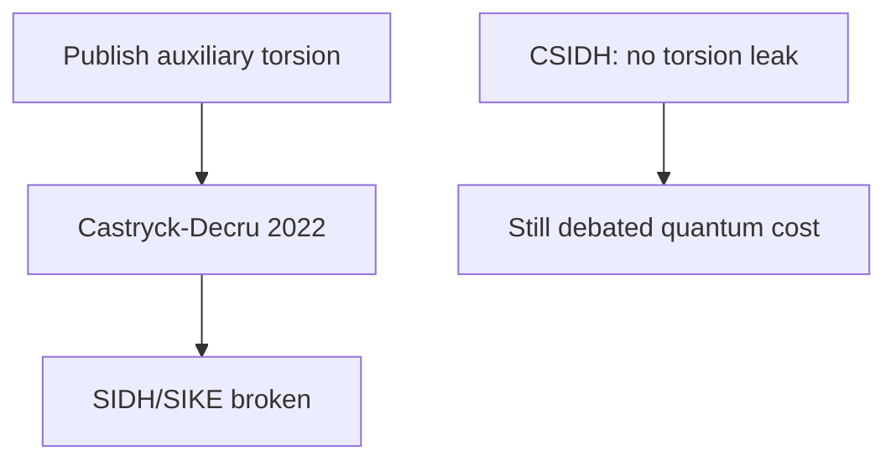

---

## 9.1 Elliptic Curves and Isogenies

Isogeny-based cryptography occupies a unique position in the post-quantum landscape. While lattice and code-based schemes dominate standardization efforts, isogeny-based constructions offer unmatched compactness—public keys and signatures measured in tens of bytes rather than kilobytes. This chapter traces the mathematical foundations, the dramatic rise and fall of SIDH/SIKE, the surviving constructions, and the current state of this rapidly evolving field.

### Elliptic Curve Recap

An elliptic curve E over a field K is a smooth projective algebraic curve of genus 1 equipped with a distinguished rational point O (the "point at infinity"). In short Weierstrass form over a field of characteristic ≠ 2, 3:

```
E: y² = x³ + ax + b    where Δ = -16(4a³ + 27b²) ≠ 0
```

The non-vanishing discriminant condition Δ ≠ 0 ensures the curve is smooth (has no singular points). The points on E, together with the point at infinity O, form an abelian group under a geometric chord-and-tangent addition law.

**Key arithmetic properties over finite fields F_p:**

- **Group structure:** E(F_p) is either cyclic or a product of two cyclic groups. By Hasse's theorem: |E(F_p)| = p + 1 - t where |t| ≤ 2√p. The value t is called the trace of Frobenius.
- **The j-invariant:** j(E) = 1728 · (4a³)/(4a³ + 27b²) classifies elliptic curves up to isomorphism over the algebraic closure. Two curves are isomorphic over F̄_p if and only if they share the same j-invariant.
- **Torsion subgroups:** For a positive integer N, the N-torsion subgroup E[N] = {P ∈ E(F̄_p) : [N]P = O} is isomorphic to (Z/NZ)² when gcd(N, p) = 1. This structure is fundamental to SIDH.
- **Endomorphisms:** An endomorphism of E is a morphism φ: E → E that is also a group homomorphism. The set End(E) forms a ring under addition and composition.

### What Is an Isogeny?

An **isogeny** φ: E₁ → E₂ is a surjective morphism of algebraic varieties that is simultaneously a group homomorphism. In concrete terms, it is a rational map φ(x, y) = (R₁(x, y), R₂(x, y)) between two elliptic curves that sends the identity point of E₁ to the identity point of E₂ and preserves the group operation: φ(P + Q) = φ(P) + φ(Q).

**Fundamental properties of isogenies:**

1. **Kernel determines the isogeny:** By a theorem of algebraic geometry, a separable isogeny φ: E₁ → E₂ is uniquely determined (up to isomorphism of E₂) by its kernel ker(φ) = {P ∈ E₁ : φ(P) = O₂}. Conversely, every finite subgroup G ⊆ E₁ determines a unique (up to isomorphism) isogeny φ: E₁ → E₁/G.

2. **Degree:** The degree of φ equals the size of its kernel for separable isogenies: deg(φ) = |ker(φ)|. The degree is multiplicative under composition: deg(φ ∘ ψ) = deg(φ) · deg(ψ).

3. **Dual isogeny:** For every isogeny φ: E₁ → E₂ of degree d, there exists a unique dual isogeny φ̂: E₂ → E₁ satisfying φ̂ ∘ φ = [d]_{E₁} and φ ∘ φ̂ = [d]_{E₂}, where [d] denotes multiplication by d.

4. **Vélu's formulas:** Given a finite subgroup G ⊆ E, Vélu's formulas (1971) provide explicit rational expressions for computing the isogeny φ_G: E → E/G and the equation of the codomain curve E/G. For a subgroup G of order ℓ, Vélu's formulas require O(ℓ) field operations.

5. **√élu algorithm:** For large-degree isogenies, Bernstein, De Feo, Leroux, and Smith (2020) developed √élu, which computes isogenies in O(√ℓ) field operations using a product-tree approach—a crucial optimization for practical implementations.

6. **Isogeny factorization:** Any isogeny of degree N = ℓ₁^{e₁} · ℓ₂^{e₂} · ... can be decomposed into a chain of prime-degree isogenies. This factorization principle underlies most isogeny-based protocols, which work with chains of small-degree (typically 2 or 3) isogenies.

### The Isogeny Graph

Fix a prime p and a small prime ℓ ≠ p. The **ℓ-isogeny graph** over F_{p²} is defined as:
- **Vertices:** Isomorphism classes of elliptic curves over F_{p²} (represented by j-invariants).
- **Edges:** ℓ-isogenies between curves. Each curve E has exactly ℓ + 1 outgoing ℓ-isogenies (corresponding to the ℓ + 1 subgroups of order ℓ in E[ℓ] ≅ (Z/ℓZ)²).

The structure of the isogeny graph depends dramatically on whether we restrict to supersingular or ordinary curves:

**Supersingular ℓ-isogeny graph:**
- Contains approximately p/12 vertices (supersingular j-invariants over F_{p²}).
- Is (ℓ + 1)-regular (every vertex has exactly ℓ + 1 neighbors).
- Is a **Ramanujan graph:** the spectral gap is optimal, meaning the graph has excellent expansion properties. Random walks on this graph mix rapidly—reaching a nearly uniform distribution over vertices in O(log p) steps.
- Is connected (for ℓ ≠ p and considering curves over F_{p²}).
- The Ramanujan property means that short paths between any two vertices are hard to find—this is the computational hardness assumption underlying isogeny-based cryptography.

**Cryptographic significance of graph properties:** The rapid mixing property ensures that a random walk of length O(log p) starting from any fixed curve E₀ produces a curve that is computationally indistinguishable from a uniformly random supersingular curve. This is the basis for key generation: the public key is a curve reached by a secret random walk from a known starting point, and recovering the walk (the secret key) requires finding a short path in the expander graph.

**Graph diameter:** The supersingular ℓ-isogeny graph has diameter O(log p), meaning any two curves can be connected by a path of length O(log p). However, finding this path is the computationally hard problem—the best known algorithms require exponential time despite the logarithmic diameter.

**Ordinary ℓ-isogeny graph:**
- Has a "volcanic" structure: vertices are organized into levels (the crater, and descending layers), with horizontal isogenies at each level and vertical isogenies between levels.
- The structure is determined by the factorization of the ideal (ℓ) in the endomorphism ring.
- This regular structure is used in CSIDH, where the class group action follows horizontal paths on the volcano.


**Figure 9.2 — Post-SIDH landscape**


## 9.2 Supersingular vs. Ordinary Curves

The distinction between supersingular and ordinary elliptic curves is the most important structural dichotomy in isogeny-based cryptography. These two classes have fundamentally different algebraic properties that lead to different cryptographic constructions and different security characteristics.

### Ordinary Curves

An elliptic curve E over F_p is **ordinary** if its trace of Frobenius t satisfies gcd(t, p) = 1 (equivalently, E[p] ≅ Z/pZ over F̄_p). The vast majority (≈ p - p/12) of isomorphism classes over F_p are ordinary.

**Endomorphism ring structure:** For an ordinary curve E, End(E) is isomorphic to an order O in an imaginary quadratic number field K = Q(√(-D)) for some discriminant -D. This order is a commutative ring—the commutativity is crucial for CSIDH.

**Class group action:** The ideal class group Cl(O) of the endomorphism ring acts on the set of ordinary curves with endomorphism ring isomorphic to O. This action is:
- **Free and transitive:** Each class group element maps each curve to a unique different curve.
- **Commutative:** The class group is abelian, so [a]([b]·E) = [b]([a]·E) for all class group elements [a], [b].

This commutative group action structure is what makes CSIDH possible—it directly generalizes the Diffie-Hellman paradigm.

**Isogeny graph structure (volcanic):** The ordinary ℓ-isogeny graph decomposes into connected components called "volcanoes." Each volcano has:
- A crater (top cycle) consisting of curves whose endomorphism ring is maximal at ℓ.
- Descending levels corresponding to orders of increasing ℓ-conductor.
- Edges within a level (horizontal) and between adjacent levels (vertical/ascending/descending).

### Supersingular Curves

An elliptic curve E over F_p is **supersingular** if t ≡ 0 (mod p), which for p > 3 means t = 0 (the curve has exactly p + 1 points over F_p). There are approximately p/12 supersingular j-invariants, all defined over F_{p²}.

**Endomorphism ring structure:** For a supersingular curve E, End(E) is isomorphic to a maximal order in the quaternion algebra B_{p,∞} ramified at p and infinity. This is a non-commutative ring of rank 4 over Z—the non-commutativity means the Diffie-Hellman paradigm cannot be directly applied but also provides richer mathematical structure for signature schemes.

**The Deuring correspondence:** There is a deep correspondence (due to Deuring) between:
- Supersingular elliptic curves over F_{p²} ↔ Maximal orders in B_{p,∞}
- Isogenies between supersingular curves ↔ Left ideals connecting the corresponding orders

This correspondence is the mathematical foundation of SQISign: computing isogenies is equivalent to finding connecting ideals in the quaternion algebra, and vice versa.

**Why supersingular curves for cryptography?**
- The Ramanujan graph structure means finding paths (isogenies) between random curves is computationally hard.
- The quaternion algebra structure provides rich algebraic tools for constructing schemes (especially signatures).
- The approximately p/12 curves provide a large enough space for security (choosing p ≈ 2^256 gives ≈ 2^252 curves).

### The Choice Affects Everything

| Property | Ordinary (CSIDH) | Supersingular (SIDH, SQISign) |
|----------|-------------------|-------------------------------|
| End(E) | Commutative (quadratic order) | Non-commutative (quaternion order) |
| Group action | Yes (Cl(O) acts) | No natural commutative action |
| Graph structure | Volcanic | Ramanujan (expander) |
| Key exchange | Natural DH analogue | Requires torsion point images (SIDH) or quaternion algebra (SQISign) |
| Quantum threat | Kuperberg (subexponential) | No known subexponential quantum attack (for SQISign) |

### Computing with Isogenies in Practice

Computing an ℓ-isogeny from a curve E given a kernel point P of order ℓ uses Vélu's formulas:
- Input: Curve E and kernel generator P with [ℓ]P = O.
- Output: The codomain curve E' = E/⟨P⟩ and the isogeny map φ: E → E'.
- Cost: O(ℓ) field operations for the standard Vélu algorithm; O(√ℓ · log ℓ) using the √élu algorithm of Bernstein, De Feo, Leroux, and Smith (2020).

For large-degree isogenies (degree N = ℓ^e), the isogeny is computed as a chain of ℓ-isogenies:

```
E₀ →^{φ₁} E₁ →^{φ₂} E₂ → ... →^{φₑ} Eₑ
```

Each φᵢ is an ℓ-isogeny with kernel generated by the appropriate push-forward of the original kernel point. The "optimal strategy" algorithm (De Feo, Jao, and Plût, 2014) minimizes the total computation cost by scheduling multiplication and isogeny operations in an optimal tree-like pattern, reducing the total cost from O(e²) to O(e · log e) ℓ-isogeny evaluations.

### Supersingular Curves over F_p vs F_{p²}

An important subtlety in the design of isogeny-based schemes is the field of definition. All supersingular j-invariants lie in F_{p²}, but only a subset (approximately √p of them) have F_p-rational j-invariants. CSIDH works exclusively with this smaller F_p-rational set, while SIDH and SQISign use the full set over F_{p²}.

Working over F_p (CSIDH) enables simpler arithmetic, commutativity of the group action, and smaller field representations, but provides a smaller keyspace and vulnerability to Kuperberg's algorithm through the commutative structure. Working over F_{p²} (SIDH, SQISign) enables a larger keyspace with stronger security assumptions and richer algebraic structure through quaternion algebras, but requires more expensive field arithmetic and confronts the challenges of non-commutativity.

## 9.3 Hard Problems in Isogeny-Based Cryptography

### The Supersingular Isogeny Problem

**Definition:** Given two supersingular elliptic curves E₁ and E₂ over F_{p²}, find an isogeny φ: E₁ → E₂ (of smooth degree, or any degree).

**Classical complexity:**
- **Meet-in-the-middle (MITM):** Enumerate isogenies of degree up to √p from both E₁ and E₂, looking for a collision (a common intermediate curve). Cost: O(p^(1/4)) time and O(p^(1/4)) storage using birthday-paradox arguments over the ≈ p/12 supersingular curves.
- **Van Oorschot-Wiener:** Parallelized MITM using distinguished points, trading time for reduced memory.
- **Delfs-Galbraith:** First find a path from each curve to a special curve defined over F_p (cost: O(p^(1/4))), then connect the two F_p-paths.

**Quantum complexity:**
- **Quantum walk (Biasse-Jao-Sankar):** Using quantum walks on the isogeny graph, the problem can be solved in O(p^(1/6)) quantum queries. This is better than Grover's O(p^(1/4)) but still exponential.
- **No polynomial-time quantum algorithm** is known for the general supersingular isogeny problem without auxiliary information.

**Critical caveat:** The hardness of the supersingular isogeny problem depends critically on what auxiliary information is provided alongside the two curves. The raw problem (given only E₁ and E₂, find an isogeny) remains exponentially hard. However, as the SIDH attack demonstrated, providing images of torsion basis points under the secret isogeny reduces the problem to polynomial time. This sensitivity to auxiliary information is a distinctive feature of isogeny-based problems that has no direct analogue in lattice or code-based cryptography, where revealing partial structural information about the secret typically does not lead to catastrophic breaks.

### The Endomorphism Ring Problem

**Definition:** Given a supersingular elliptic curve E over F_{p²}, compute its endomorphism ring End(E) (as a maximal order in the quaternion algebra B_{p,∞}).

**Significance:** A series of results by Eisenträger, Hallgren, Lauter, Morrison, and Petit established that:
- Computing End(E) is equivalent (under polynomial-time reductions) to computing isogenies between supersingular curves.
- Given End(E₁) and End(E₂), one can efficiently find an isogeny E₁ → E₂.
- Given an isogeny E₁ → E₂ and End(E₁), one can efficiently compute End(E₂).

This establishes the **endomorphism ring problem** as the foundational hard problem for supersingular isogeny cryptography. It is to supersingular curves what the discrete logarithm problem is to classical elliptic curve cryptography.

**Best known algorithms:**
- Classical: O(p^(1/4)) via the MITM approach on isogeny graphs
- Quantum: O(p^(1/6)) via quantum walks
- Both are exponential in log(p)

### The CSIDH Problem (Class Group Action Inversion)

**Definition:** Given two elliptic curves E₁ and E₂ that are related by the class group action (E₂ = [a]·E₁ for some [a] ∈ Cl(O)), find the class group element [a].

This is essentially the "discrete logarithm" analogue for group actions: given the base (E₁), the result (E₂), and the group (Cl(O)), find the exponent ([a]).

**Classical complexity:**
- **Baby-step giant-step:** Decompose [a] with respect to generators of Cl(O). Cost: O(√|Cl(O)|) ≈ O(p^(1/4)).
- **Pohlig-Hellman-type decomposition:** If the class group order has small factors, the problem decomposes correspondingly.

**Quantum complexity:**
- **Kuperberg's algorithm for the hidden shift problem:** The CSIDH problem reduces to an instance of the (abelian) hidden shift problem, for which Kuperberg's algorithm provides a subexponential quantum attack.
- **Complexity of Kuperberg's algorithm:** The original version requires 2^O(√(log p)) quantum time and quantum memory. The "collimation" variant by Kuperberg (2004) uses only polynomial quantum memory but 2^O(∛(log p · log log p)) time.
- **Peikert's analysis (2020):** Demonstrated that with CSIDH-512 parameters, Kuperberg's algorithm might achieve practical attacks with moderate quantum resources, calling into question the concrete security claims.

The subexponential quantum attack is the primary security concern for CSIDH and distinguishes it from the fully exponential quantum resistance of lattice-based schemes.

### The One-More Isogeny Problem

**Definition:** Given access to an oracle that computes isogenies from a fixed (unknown) starting curve E₀, after querying the oracle on n inputs and receiving n isogenies, compute an isogeny from E₀ that was not directly provided by the oracle.

**Significance:** This problem appears in the security analysis of SQISign and related signature schemes. The security proof for SQISign shows that forging a signature requires solving either the endomorphism ring problem or the one-more isogeny problem.

### The Decisional CSIDH Problem

**Definition:** Distinguish between (E₁, [a]·E₁) for a random class group element [a], and (E₁, E₂) for independently random curves E₁, E₂.

This decisional variant is needed for CPA-secure encryption from CSIDH. Its hardness follows from the computational problem under standard assumptions, but the tightness of the reduction matters for concrete parameter selection.

### Relationship Between Problems

The hard problems are interconnected:
- Endomorphism ring computation ≡ Supersingular isogeny problem (polynomial reductions exist)
- CSIDH problem reduces to the hidden shift problem (which has subexponential quantum algorithms)
- SIDH problem (with auxiliary points) reduces to polynomial time (Castryck-Decru 2022)

## 9.4 SIDH/SIKE: Rise and Fall

### The SIDH Protocol (Jao and De Feo, 2011)

Supersingular Isogeny Diffie-Hellman (SIDH) was the first practical isogeny-based key exchange protocol and represented a breakthrough in compact post-quantum cryptography. Its design was elegant, exploiting the non-commutative structure of supersingular isogeny graphs through a clever use of torsion point information.

**System Parameters:**
- A prime of the form p = 2^a · 3^b · f - 1 (chosen so both 2^a and 3^b divide p² - 1, ensuring E₀[2^a] and E₀[3^b] are F_{p²}-rational).
- A starting supersingular curve E₀ over F_{p²} (typically y² = x³ + x with j = 1728).
- Basis points: (P_A, Q_A) generating E₀[2^a] and (P_B, Q_B) generating E₀[3^b].
- Parameters chosen so 2^a ≈ 3^b ≈ √p (balancing Alice's and Bob's computations).

**Protocol:**

Alice's computation:
1. Choose a secret scalar m_A ∈ {0, 1, ..., 2^a - 1}.
2. Define the secret kernel subgroup: K_A = ⟨P_A + [m_A]Q_A⟩ ⊆ E₀[2^a], a cyclic subgroup of order 2^a.
3. Compute the secret isogeny φ_A: E₀ → E_A = E₀/K_A using iterated 2-isogenies (a steps).
4. Publish: the curve E_A and the images φ_A(P_B) and φ_A(Q_B).

Bob's computation:
1. Choose a secret scalar m_B ∈ {0, 1, ..., 3^b - 1}.
2. Define K_B = ⟨P_B + [m_B]Q_B⟩ ⊆ E₀[3^b], a cyclic subgroup of order 3^b.
3. Compute φ_B: E₀ → E_B = E₀/K_B using iterated 3-isogenies (b steps).
4. Publish: the curve E_B and the images φ_B(P_A) and φ_B(Q_A).

Shared secret computation:
- Alice computes: φ'_A: E_B → E_B/⟨φ_B(P_A) + [m_A]φ_B(Q_A)⟩. The shared secret is j(E_{AB}).
- Bob computes: φ'_B: E_A → E_A/⟨φ_A(P_B) + [m_B]φ_A(Q_B)⟩. The shared secret is j(E_{BA}).

**Why this works:** The key insight is that E_{AB} ≅ E_{BA} because both are isomorphic to E₀/⟨K_A, K_B⟩. The auxiliary torsion point images allow each party to "transport" their secret kernel generator to the other party's codomain curve.

**Why auxiliary points are necessary:** Without the images φ_A(P_B), φ_A(Q_B), Bob cannot determine how to embed his secret isogeny into Alice's codomain E_A—the non-commutativity of the quaternion endomorphism ring means there is no natural way to "commute" the two isogenies without this auxiliary information.

### SIKE (Supersingular Isogeny Key Encapsulation)

SIKE was the IND-CCA2-secure KEM constructed from SIDH via the Fujisaki-Okamoto transform:

**Parameters (SIKEp434, targeting Level I):**
- Prime: p = 2^216 · 3^137 - 1 (434 bits)
- Public key: 330 bytes (E_A represented by coefficients, plus two torsion point images)
- Ciphertext: 346 bytes
- Shared secret: 16 bytes
- Key generation: ~10 ms
- Encapsulation: ~15 ms
- Decapsulation: ~16 ms

SIKE held the record for the smallest public keys and ciphertexts of any PQC KEM candidate—an order of magnitude smaller than lattice-based alternatives. This compactness made SIKE attractive for bandwidth-constrained applications (IoT, embedded systems, TLS handshakes).

**Performance limitations:** Despite compact sizes, SIKE was 100-1000x slower than lattice-based KEMs. Each isogeny computation required hundreds of large-integer multiplications over F_{p²}. Various optimizations (optimal strategies for isogeny chain evaluation, efficient F_{p²} arithmetic, VELU/√élu improvements) reduced but never eliminated this gap.

**NIST competition history:** SIKE progressed through all rounds of the NIST competition as an "alternate" candidate—recognized as having uniquely attractive size properties but with concerns about:
- Relatively young cryptanalytic history (proposed 2011, standardization began 2017).
- Slow performance compared to lattice-based alternatives.
- Complex mathematical foundation with potential for unexpected structural attacks.

The final concern proved prescient. SIKE was broken just weeks after NIST announced it as a fourth-round candidate for potential standardization.

### The Devastating Attack (Castryck-Decru, July 2022)

On July 30, 2022, Wouter Castryck and Thomas Decru posted a preprint describing a polynomial-time key-recovery attack against SIDH. Within days, Luciano Maino and Chloe Martindale produced an independent attack using similar ideas, and Damien Robert gave a simplified version. The attack was quickly verified to break SIKE at all security levels.

**Mathematical Foundation — The Kani Lemma:**

The attack exploits a deep result from the theory of abelian varieties. The Kani lemma (1997) provides a criterion for when a product of two isogenies between elliptic curves can be "glued" into an isogeny between abelian surfaces (products of two elliptic curves):

Given isogenies φ: E₁ → E₂ and ψ: E₁ → E₃ with deg(φ) + deg(ψ) = N, under certain conditions there exists an isogeny of abelian surfaces:
```
(φ, ψ): E₁ × E₁ → E₂ × E₃
```
that factors through the (1, N)-polarized surface E₁ × E₁/⟨graph of [N]⟩.

**How the Attack Works:**

1. **From auxiliary points to a higher-dimensional problem:** Alice publishes (E_A, φ_A(P_B), φ_A(Q_B)). The images φ_A(P_B) and φ_A(Q_B) on E_A, combined with the known basis points P_B, Q_B on E₀, define enough data to construct an isogeny between products of elliptic curves (abelian surfaces).

2. **Dimension upgrade:** Using the Kani lemma, the degree-2^a isogeny φ_A: E₀ → E_A is "lifted" to an isogeny between abelian surfaces that can be factored differently.

3. **Richelot isogenies and gluing:** The attack proceeds by computing isogenies between abelian surfaces (Richelot isogenies, which are the genus-2 analogue of 2-isogenies) using the extra structure provided by the auxiliary points.

4. **Recovery:** The chain of surface isogenies reveals the kernel of the original elliptic curve isogeny φ_A, completely recovering Alice's secret.

**Complexity:** The attack runs in polynomial time in the security parameter—O(a³) or O(a⁴) depending on implementation details. For SIKE-p434, this translates to seconds on a standard laptop.

**Why the attack works fundamentally:**

The root cause is that SIDH publishes the action of the secret isogeny on the full torsion structure of the "other" party's subgroup. This is an enormous amount of algebraic information—it constrains the secret isogeny so severely that it can be uniquely (and efficiently) determined. In retrospect, publishing φ_A(P_B) and φ_A(Q_B) reveals the entire action of φ_A on E₀[3^b], which essentially determines φ_A given that deg(φ_A) = 2^a and gcd(2^a, 3^b) = 1.

### Lessons from the SIDH Break

The SIDH/SIKE break carries profound lessons for post-quantum cryptography:

1. **Auxiliary information is dangerous:** Publishing the action of a secret map on known points can catastrophically reduce the hardness of the underlying problem. The raw isogeny problem (find φ given only E₁ and E₂) remains exponentially hard; it is the auxiliary torsion point information that enables the polynomial-time attack.

2. **Higher-dimensional algebraic geometry provides unexpected attacks:** The attack crucially used the theory of abelian surfaces—a domain not traditionally considered in isogeny cryptanalysis. This suggests that cryptographic assumptions must be evaluated against the full power of algebraic geometry, not just elliptic curve techniques.

3. **Young schemes carry elevated risk:** SIDH was proposed in 2011 and had only 11 years of cryptanalytic study before being broken. The relevant mathematical tools (Kani's lemma, Richelot isogeny computation) existed in the literature but their cryptanalytic applicability was not recognized until 2022.

4. **Performance advantages can mask structural weaknesses:** SIKE's uniquely compact key sizes attracted attention and investment, but the same structural features that enabled compactness (the auxiliary point publication) were precisely what enabled the attack.

5. **The importance of diverse approaches:** The SIDH break did not affect CSIDH (which publishes no auxiliary points) or SQISign (which uses a fundamentally different paradigm), illustrating the value of maintaining multiple approaches within a cryptographic family.

## 9.5 CSIDH: Commutative Group Actions

### Construction

CSIDH (Commutative Supersingular Isogeny Diffie-Hellman), proposed by Castryck, Lange, Martindale, Panny, and Renes in 2018, takes a fundamentally different approach from SIDH. Instead of working with arbitrary supersingular curves over F_{p²} and publishing torsion point images, CSIDH restricts to a special subset of supersingular curves that admit a commutative group action.

**The Key Insight:** Consider supersingular elliptic curves over F_p (not F_{p²}) of the form E: y² = x³ + Ax² + x (Montgomery form). These curves have the special property that their F_p-rational endomorphism ring is isomorphic to an order O in an imaginary quadratic field—specifically, O = Z[π] where π is the Frobenius endomorphism.

Although these curves are supersingular (having p + 1 points over F_p, with trace t = 0), their F_p-rational endomorphism ring is commutative. The ideal class group Cl(O) acts on the set of F_p-isomorphism classes of such curves via isogenies.

**The Group Action:**

For each prime ℓ (with ℓ ≠ p), the ideal (ℓ) factors in O as:
- **Split:** (ℓ) = l · l̄ if the Legendre symbol (−p/ℓ) = 1. In this case, l acts by the unique F_p-rational ℓ-isogeny, and l̄ acts by its dual.
- **Inert:** (ℓ) remains prime. No F_p-rational ℓ-isogeny exists.
- **Ramified:** (ℓ) = l². The curve has a unique ℓ-isogeny that maps it to itself (up to isomorphism).

For split primes, the class group action by l corresponds to walking one step in the ℓ-isogeny graph. The commutativity of the class group means these walks commute with each other, enabling a Diffie-Hellman-like protocol.

**CSIDH Key Exchange:**

Setup: A starting curve E₀ over F_p and a set of small split primes ℓ₁, ..., ℓₛ.

- Alice: Chooses a secret vector (e₁, ..., eₛ) of small integers. Computes E_A = [l₁^{e₁} · ... · lₛ^{eₛ}] · E₀ by repeatedly applying ℓᵢ-isogenies (eᵢ times for prime ℓᵢ, in the forward or reverse direction depending on sign).
- Bob: Chooses (f₁, ..., fₛ) and computes E_B similarly.
- Shared secret: Alice computes [l₁^{e₁} · ... · lₛ^{eₛ}] · E_B. Bob computes [l₁^{f₁} · ... · lₛ^{fₛ}] · E_A. By commutativity, both obtain the same curve E_{AB}.

**Key sizes:** The public key is simply the Montgomery coefficient A of the resulting curve, requiring only ⌈log₂ p⌉ bits ≈ 64 bytes. This is the smallest key size of any post-quantum key exchange proposal.

### Security of CSIDH

CSIDH is NOT broken by the Castryck-Decru attack because it publishes no auxiliary torsion point information—only the resulting curve. The security rests on the raw computational problem of inverting the class group action.

**Classical security:**
- Best attack: A combination of baby-step giant-step on the class group and meet-in-the-middle techniques. For CSIDH-512, this gives approximately 62 bits of classical security (debated; some analyses give higher estimates depending on the cost model).

**Quantum security — Kuperberg's algorithm:**

The CSIDH problem reduces to an instance of the **hidden shift problem**: given two functions f₀ and f₁ that satisfy f₁(x) = f₀(x + s) for an unknown shift s, find s. Kuperberg's quantum algorithm solves this problem in subexponential time.

**Variants of Kuperberg's algorithm and their costs:**

| Variant | Quantum Time | Quantum Memory | Classical Memory |
|---------|-------------|----------------|-----------------|
| Original (2003) | 2^O(√(log N)) | 2^O(√(log N)) | Polynomial |
| Collimation (2004) | 2^O(√(log N · log log N)) | Polynomial | Polynomial |
| Regev-style (adapted) | 2^O(∛(log N)) | 2^O(∛(log N)) | Polynomial |

For CSIDH-512 (N ≈ 2^256, log N ≈ 256):
- Original Kuperberg: 2^O(√256) ≈ 2^O(16) — potentially practical
- With careful analysis: Estimates range from 2^32 to 2^65 quantum operations (highly dependent on constant factors and quantum memory model)

**The security debate:** The concrete quantum security of CSIDH remains one of the most contentious topics in post-quantum cryptography. Optimistic analyses suggest CSIDH-512 offers adequate security; pessimistic analyses (notably Peikert 2020, Bonnetain-Schrottenloher 2020) argue it may be breakable with a moderate quantum computer. This uncertainty has hindered CSIDH's path to standardization.

### CSIDH Variants and Improvements

**CSIDH-512:** The original parameter set with p ≈ 2^511. Offers the most compact keys but debated quantum security.

**CSIDH-1024 and CSIDH-1792:** Larger parameter sets providing higher security margins, at the cost of proportionally slower computation.

**CTIDH (Constant-Time CSIDH):** A major implementation challenge for CSIDH is achieving constant-time execution. The number of ℓᵢ-isogeny steps varies based on the secret vector, creating a timing side channel. CTIDH (Banegas et al., 2021) provides a constant-time implementation by fixing the total number of operations through dummy isogeny computations, using a "SIMBA" batching strategy.

**CSURF (CSIDH on the Surface):** Replaces the floor of the isogeny volcano with the surface (maximal order), potentially offering better performance.

**Séta and threshold constructions:** CSIDH's commutative group action enables natural constructions of threshold protocols, oblivious transfer, and other advanced cryptographic primitives that are difficult to build from non-commutative assumptions.

## 9.6 SQISign: Isogeny-Based Signatures

### Overview

SQISign (Short Quaternion and Isogeny Signature), introduced by De Feo, Kohel, Leroux, Petit, and Wesolowski in 2020, is the most promising isogeny-based digital signature scheme. It achieves remarkably compact signatures (177 bytes at the 128-bit security level) by exploiting the deep connection between supersingular isogenies and quaternion algebra—the Deuring correspondence.

SQISign is fundamentally different from both SIDH and CSIDH:
- It works with the full supersingular isogeny graph over F_{p²} (not restricted to F_p-rational curves).
- It does not publish torsion point images (avoiding the SIDH vulnerability).
- It uses the non-commutative quaternion algebra constructively for signing, rather than treating non-commutativity as an obstacle.

### The Deuring Correspondence in Detail

The Deuring correspondence provides a dictionary between geometric objects (curves and isogenies) and algebraic objects (orders and ideals):

| Geometric Side | Algebraic Side |
|---------------|---------------|
| Supersingular curve E | Maximal order O ⊂ B_{p,∞} |
| Isogeny φ: E₁ → E₂ | Left O₁-ideal I with right order O₂ |
| Degree of φ | Norm of I |
| Composition of isogenies | Product of ideals |
| Endomorphism of E | Two-sided ideal of O |

This correspondence is effective in both directions: given an ideal I of norm N in a maximal order, one can efficiently compute the corresponding isogeny of degree N (using the "ideal-to-isogeny" translation), and conversely, given an isogeny and knowledge of the endomorphism ring, one can compute the corresponding ideal.

### SQISign Construction

**Key Generation:**
1. Start with a special curve E₀ whose endomorphism ring O₀ is known (typically the curve with j = 1728, where End(E₀) ≅ Z[i, (1+j)/2, (i+k)/2] in the quaternion algebra).
2. Choose a random secret isogeny τ: E₀ → E_A of smooth degree (a product of small primes). The secret key is τ (or equivalently, the corresponding quaternion ideal).
3. The public key is E_A (just the j-invariant or curve coefficients).

**Signing (Sigma protocol / Fiat-Shamir):**

SQISign uses a sigma protocol (commit-challenge-response) made non-interactive via Fiat-Shamir:

1. **Commitment:** The signer chooses a random isogeny ψ: E₀ → E₁ of smooth degree. The commitment is E₁.

2. **Challenge:** Hash the message and commitment to obtain a challenge, which specifies a degree-D cyclic subgroup of E₁ (determining a challenge isogeny φ_c: E₁ → E₂).

3. **Response:** The signer must produce an isogeny σ: E_A → E₂ of specific (smooth) degree. This requires "connecting" E_A to E₂ through the quaternion algebra:
   - Translate everything to ideals: the secret key τ ↔ ideal I_τ, the commitment ψ ↔ ideal I_ψ, the challenge φ_c ↔ ideal I_c.
   - Compute the ideal corresponding to the path E_A → E₀ → E₁ → E₂ (using I_τ̄ · I_ψ · I_c).
   - Find an equivalent ideal of smooth norm using the "SigningKLPT" algorithm (a variant of the Kohel-Lauter-Petit-Tignol algorithm for finding equivalent smooth-norm ideals).
   - Translate the smooth ideal back to an isogeny.

4. **Output:** The signature is the isogeny σ: E_A → E₂ (represented by its kernel or evaluation at specific points), requiring only ~177 bytes.

**Verification:**
1. Recompute E₁ from E_A and σ: since σ: E_A → E₂ and the dual σ̂: E₂ → E_A are related by σ̂ ∘ σ = [deg σ], the verifier can reconstruct the path.
2. Recompute the challenge from the message and E₁.
3. Check that the response isogeny has the correct degree and endpoints.

### Performance Characteristics

SQISign's performance reflects the computational complexity of quaternion algebra operations:

| Operation | Time (approx.) | Notes |
|-----------|---------------|-------|
| Key generation | ~100 ms | Random walk + endomorphism ring setup |
| Signing | ~1,000-5,000 ms | Dominated by KLPT algorithm and ideal-to-isogeny translation |
| Verification | ~50-100 ms | Isogeny evaluation and degree checking |

The slow signing speed is the primary practical limitation. It stems from the KLPT algorithm's need to find short vectors in quaternion lattices and the multi-step ideal-to-isogeny translation.

### Security Analysis

SQISign's security rests on the hardness of the endomorphism ring problem for supersingular curves:

**Positive security arguments:**
- No torsion point images are published (avoiding the SIDH attack vector entirely).
- The response isogeny σ does not reveal the full path E₀ → E₁ → E₂, only the composed connection E_A → E₂.
- The quaternion algebra structure provides information-theoretic arguments about the difficulty of recovering the secret from responses.
- The best known attack requires solving the general supersingular isogeny problem: O(p^(1/4)) classically, O(p^(1/6)) quantumly.

**Potential concerns:**
- The KLPT algorithm introduces specific algebraic structure into the response isogeny that might be exploitable.
- The scheme is relatively young (2020) and the full power of algebraic attacks has not yet been explored.
- Side-channel resistance of the complex signing algorithm is difficult to ensure.
- The security proof relies on non-standard assumptions (one-more isogeny problem) whose relationship to the raw endomorphism ring problem needs further study.

### SQISign Variants and Improvements

**SQISignHD (Higher-Dimensional):** Uses higher-dimensional isogenies (abelian surfaces) to improve signing efficiency. By working with 2-dimensional isogenies, the KLPT step can be simplified.

**AprèsSQI:** A variant with faster verification using precomputed auxiliary data.

**SQISign with NIST Parameters:** Ongoing work to optimize SQISign for the specific security levels required by NIST (Levels I, III, V), with current proposals achieving:
- Level I: Public key 64 bytes, signature 177 bytes
- Level V: Public key 128 bytes, signature ~370 bytes

### Current Status (2025-2026)

SQISign is under evaluation by NIST for additional digital signature standardization. Key developments:
- Significant performance improvements since the original 2020 proposal (signing time reduced from ~minutes to ~1-5 seconds).
- Growing implementation ecosystem with side-channel-aware implementations.
- Active cryptanalysis with no successful attacks found.
- Concerns remain about implementation complexity and the difficulty of formal verification.

## 9.7 Other Isogeny-Based Constructions

### FESTA (Fast Encryption from Supersingular Torsion Attacks)

FESTA, proposed by Basso, Maino, and Pope in 2023, represents a creative turning-point in isogeny cryptography: it uses the mathematical structure exploited in the SIDH attack as a constructive tool for building encryption schemes.

**Key idea:** The Castryck-Decru attack shows that publishing torsion point images enables efficient isogeny recovery. FESTA uses this property constructively: the legitimate decryptor can efficiently recover the encryption isogeny using the attack algorithm, while the lack of auxiliary information makes it hard for an adversary to break the scheme.

**Construction outline:**
1. Encryption involves computing an isogeny and publishing specific torsion point images (like SIDH).
2. Decryption uses a Castryck-Decru-style algorithm with knowledge of the secret key.
3. Security relies on the hardness of the isogeny problem WITHOUT the auxiliary point information.

**Status:** FESTA is in an early stage of development. Its security assumptions need further scrutiny, and the performance characteristics (inherited from the expensive surface isogeny computations) limit practical applicability. However, it demonstrates that the SIDH attack, far from being purely destructive, opened new constructive possibilities.

**Parameters (preliminary):**
- Public key: ~4,000 bytes
- Ciphertext: ~4,000 bytes
- Encryption/Decryption: ~100-500 ms
- Security: Based on hardness of the supersingular isogeny problem (without auxiliary points)

While FESTA's sizes are larger than SIKE's were, its security rests on a fundamentally different (and apparently harder) problem. The scheme demonstrates that isogeny-based encryption need not require the dangerous auxiliary point publication that doomed SIDH.

### SCALLOP (Scalable Group Action from Isogenies of Oriented Supersingular Curves)

SCALLOP, proposed by De Feo, Fouotsa, Kutas, Leroux, Merz, Panny, and Wesolowski in 2023, provides an efficient group action from oriented supersingular curves that avoids the vulnerabilities of both SIDH (auxiliary points) and CSIDH (Kuperberg's algorithm).

**Key innovation:** SCALLOP works with supersingular curves equipped with an "orientation"—additional endomorphism structure that enables a group action by the class group of a carefully chosen imaginary quadratic order. The orientation provides the commutativity needed for Diffie-Hellman without requiring restriction to F_p (which makes CSIDH vulnerable to Kuperberg via the structure of the class group).

**Security argument:** The orientation is chosen so that the class group is large and structurally resistant to Kuperberg-type attacks. The smooth class number prevents efficient evaluation of the hidden shift oracle required by Kuperberg's algorithm. Specifically, evaluating the group action for a single ideal class element requires computing a large-degree isogeny, and Kuperberg's algorithm needs many such evaluations—if each evaluation is expensive enough, the total quantum attack cost exceeds the security target.

**Performance:** SCALLOP is significantly slower than CSIDH but potentially offers better quantum security guarantees. Current implementations achieve key exchange in ~1-10 seconds. The performance cost is the price paid for resistance to Kuperberg's algorithm—the same structural properties that prevent efficient quantum oracle queries also make legitimate computation slower.

### OSIDH (Oriented Supersingular Isogeny Diffie-Hellman)

An earlier group-action construction using oriented curves, proposed by Colò and Kohel in 2019. OSIDH suffered from structural issues related to the choice of orientation that made certain information leakage possible. Specifically, the original OSIDH revealed enough information about the orientation to enable partial key recovery in certain parameter regimes. SCALLOP addresses these issues through careful choice of the orientation and class group structure, demonstrating how the field learns from each construction's weaknesses.

### Threshold and Advanced Protocols

The mathematical richness of isogeny-based group actions enables advanced cryptographic protocols:

**Non-interactive Key Exchange (NIKE):** CSIDH's commutative group action naturally provides NIKE—two parties can derive a shared key from each other's public keys without any interaction. This is impossible from lattice-based assumptions without additional rounds.

**Threshold Signatures:** The group action structure enables threshold variants of isogeny-based signatures, where k-of-n parties must cooperate to produce a signature.

**Verifiable Random Functions (VRFs):** Group-action-based VRFs have been proposed using CSIDH-like assumptions, providing quantum-resistant verifiable randomness.

**Oblivious Transfer and MPC:** Smooth group actions (where the group order is smooth) enable efficient oblivious transfer protocols, which are building blocks for general multi-party computation.

**Delay Encryption:** The sequential nature of isogeny computation (each step depends on the previous one) has been proposed for use in delay encryption and verifiable delay functions.

### The Post-SIDH Constructive Landscape

The SIDH break paradoxically opened new constructive directions by providing new tools:

**Constructive use of the Kani lemma:** The same mathematical structure that broke SIDH provides new ways to build cryptographic schemes. FESTA directly uses the attack algorithm as a decryption mechanism.

**Higher-dimensional techniques:** The dimension-lifting techniques (from elliptic curves to abelian surfaces) used in the SIDH attack have inspired new efficient algorithms for computing endomorphism rings, evaluating isogenies, and building signature schemes (SQISignHD).

**Torsion-point-free protocols:** The community has developed a clear understanding of which auxiliary information is safe to publish: the j-invariant of the codomain curve alone (CSIDH, SQISign) appears safe, while full torsion point images (SIDH) are catastrophically unsafe. This understanding guides the design of all new isogeny-based protocols.

## 9.8 Performance Characteristics

Isogeny-based cryptography exhibits a distinctive performance profile: exceptionally compact but computationally expensive. The following table provides a comprehensive comparison:

| Metric | CSIDH-512 | SQISign (Level I) | SIKE p434 (broken) | ML-KEM-768 | ML-DSA-65 |
|--------|-----------|-------------------|---------------------|------------|-----------|
| Public key | 64 B | 64 B | 330 B | 1,184 B | 1,952 B |
| Secret key | 32 B | ~782 B | 374 B | 2,400 B | 4,032 B |
| Ciphertext/Signature | 64 B | 177 B | 346 B | 1,088 B | 3,309 B |
| Key gen | ~40 ms | ~100 ms | ~10 ms | ~0.05 ms | ~0.1 ms |
| Encaps/Sign | ~40 ms | ~2,000 ms | ~15 ms | ~0.07 ms | ~1 ms |
| Decaps/Verify | ~40 ms | ~80 ms | ~16 ms | ~0.06 ms | ~0.5 ms |
| Bandwidth (total exchange) | 128 B | 241 B | 676 B | 2,272 B | 5,261 B |

**Key observations:**

1. **Size advantage:** Isogeny-based schemes achieve 5-50x smaller sizes than lattice-based alternatives. For bandwidth-constrained applications (satellite links, low-power radio, IoT), this advantage can be decisive.

2. **Speed disadvantage:** Isogeny-based schemes are 100-10,000x slower than lattice-based alternatives. This makes them unsuitable for high-throughput applications or latency-sensitive protocols.

3. **Asymmetric performance:** SQISign verification (~80 ms) is dramatically faster than signing (~2,000 ms), making it potentially suitable for scenarios with a powerful signer and many lightweight verifiers.

4. **Hardware acceleration potential:** Isogeny computation is dominated by large-integer arithmetic in F_{p²}. Custom hardware (FPGA, ASIC) can provide 10-100x speedups, potentially making isogeny-based schemes practical for specific deployed systems.

### Implementation Challenges

Beyond raw performance, isogeny-based implementations face unique challenges:

**Constant-time execution:** The variable-length isogeny chains in CSIDH and the complex algebraic operations in SQISign make constant-time implementation difficult. CTIDH addresses this for CSIDH but adds significant overhead.

**Code complexity:** SQISign requires implementing quaternion algebra arithmetic, lattice reduction (KLPT), ideal-to-isogeny translation, and multi-step isogeny evaluation. The implementation surface is large, increasing the risk of bugs and side-channel vulnerabilities.

**Formal verification:** The mathematical complexity of isogeny-based schemes makes formal verification of implementations extremely challenging compared to simpler schemes (hash-based signatures, even lattice-based schemes).

### Comparison with Lattice-Based Performance

To put isogeny-based performance in perspective, consider a typical use case—establishing a secure channel:

**Bandwidth-limited scenario (satellite communication, 1 kbps link):**
- ML-KEM-768 key exchange: 2,272 bytes → 18 seconds of link time
- CSIDH-512 key exchange: 128 bytes → 1 second of link time
- Computation difference (40 ms vs 0.1 ms) is negligible compared to transmission savings

**Compute-limited scenario (high-throughput server, 10,000 connections/second):**
- ML-KEM-768: 0.1 ms per operation → 10,000 connections achievable
- CSIDH-512: 40 ms per operation → only 25 connections/second
- Bandwidth savings irrelevant when compute is the bottleneck

This analysis shows that isogeny-based schemes are only appropriate when bandwidth is the dominant constraint and computation time is acceptable. This niche is small but includes important applications like satellite communication, deep-space networks, and extremely constrained IoT devices.

## 9.9 The State of Isogeny-Based Cryptography (2025-2026)

### What Has Been Broken

**SIDH/SIKE (completely broken, 2022):**
- Polynomial-time key-recovery attack by Castryck-Decru, Maino-Martindale, and Robert.
- Fundamental structural flaw: publishing torsion point images under the secret isogeny.
- No parameter-level fix possible—the attack exploits an inherent design choice.
- SIKE was withdrawn from NIST consideration immediately.

**Weak CSIDH parameters (security questioned):**
- CSIDH-512's quantum security is disputed; multiple analyses suggest it may offer as few as 32-65 bits of quantum security against Kuperberg's algorithm.
- The debate hinges on concrete cost estimates for quantum operations and quantum memory.
- Conservative parameter choices (CSIDH-1024 or larger) appear to restore adequate security but at significant performance cost.

**OSIDH (partially broken):**
- The original OSIDH construction was shown to have vulnerabilities related to the orientation structure.
- Repaired in subsequent work (leading to SCALLOP).

### What Survives

**SQISign (no known efficient attack):**
- Based on the endomorphism ring problem, which has exponential classical and quantum complexity.
- Not affected by the SIDH attack (no torsion point publication).
- Not affected by Kuperberg-type attacks (operates over F_{p²}, not using a commutative group action vulnerable to hidden shift).
- Under active NIST evaluation for additional digital signatures.

**CSIDH with conservative parameters:**
- Larger parameter choices (CSIDH-1024, CSIDH-1792) provide higher security margins.
- The fundamental construction remains sound; the debate is about concrete parameter selection.
- Useful for advanced protocols (NIKE, threshold schemes) where lattice-based alternatives don't exist.

**Group-action-based constructions (SCALLOP, etc.):**
- Newer designs that attempt to achieve group action properties without CSIDH's Kuperberg vulnerability.
- Still in early stages of cryptanalytic evaluation.

**FESTA and constructive uses of the SIDH attack:**
- Preliminary but promising direction for building encryption from isogenies.

### Active Research Directions (2025-2026)

**Improving SQISign performance:**
- SQISignHD and related variants aim to reduce signing time from seconds to hundreds of milliseconds.
- Parallelization of the KLPT algorithm and ideal-to-isogeny translation.
- Hardware-accelerated implementations targeting specific deployment scenarios.
- AprèsSQI and other optimized verification procedures.

**Understanding the hardness boundary:**
- What exactly makes some isogeny problems easy (SIDH with auxiliary points) and others hard (raw isogeny problem)?
- Can we characterize precisely which auxiliary information is "safe" to publish?
- Formal security models for group-action cryptography.

**New constructions:**
- Isogeny-based encryption schemes (post-SIDH) using carefully controlled auxiliary information.
- Group-action-based schemes with provable resistance to Kuperberg-type attacks.
- Hybrid constructions combining isogenies with other PQC primitives.

**Quantum cryptanalysis:**
- Better understanding of quantum walk algorithms on isogeny graphs.
- Potential improvements to Kuperberg's algorithm or discovery of new quantum attack paradigms.
- Establishing tighter lower bounds on quantum attack costs.

### Practical Outlook and Recommendations

**For production deployment (2025-2026):**
- Isogeny-based cryptography is NOT recommended for general production use.
- The field has experienced major surprises (SIDH break) that demonstrate insufficient cryptanalytic maturity.
- Performance limitations make isogeny-based schemes impractical for most standard applications.
- No isogeny-based algorithm has been standardized by NIST.

**Potential niche applications:**
- Bandwidth-critical systems where 64-177 byte keys/signatures provide decisive advantages.
- Long-term archival where compact ciphertext size matters more than encryption speed.
- Advanced protocol constructions (NIKE, threshold schemes) where isogeny-based group actions provide unique capabilities not available from other PQC families.

**For research and development:**
- Monitor SQISign's progress through NIST evaluation.
- Track improvements in concrete security estimates for both CSIDH and SQISign.
- Investigate hardware acceleration paths that might make isogeny-based schemes competitive for specific use cases.
- Maintain awareness of isogeny-based constructions as a "hedge" against unforeseen breaks in lattice or code-based schemes.

**The long-term perspective:**
Isogeny-based cryptography is the youngest of the major PQC families, and its theoretical richness suggests significant undiscovered territory—both for constructive applications and for attacks. The SIDH break, while devastating for that specific protocol, paradoxically enriched the field by revealing new mathematical connections (Kani lemma, constructive use of attacks in FESTA) and by sharpening the community's understanding of what auxiliary information is safe to publish. Whether SQISign or its successors will achieve the maturity and trust required for standardization remains one of the most interesting open questions in post-quantum cryptography.

### Comparison with Other PQC Families' Maturity

| Criterion | Isogeny-Based | Lattice-Based | Code-Based | Hash-Based |
|-----------|--------------|---------------|------------|------------|
| Major surprise attacks | SIDH (2022) | None (for standards) | None (for standards) | None |
| Years since foundation | ~15 | ~25 | ~45 | ~40+ |
| NIST standards | 0 | 3 (ML-KEM, ML-DSA, FALCON) | 0 (HQC pending) | 1 (SLH-DSA) |
| Active NIST candidates | SQISign | — | HQC | — |
| Unique capabilities | NIKE, compact sizes | General purpose | Large ciphertext encryption | Minimal assumptions |
| Main limitation | Speed, maturity | Key/signature size | Ciphertext size | Signature size, speed |

This table underscores the fundamental trade-off: isogeny-based cryptography offers unique properties (extreme compactness, NIKE capability) that no other family matches, but at the cost of computational expense and less mature security understanding. The field's value lies precisely in this complementarity—it provides capabilities that other families cannot, while the other families provide the robustness and performance that isogenies currently lack.---

## Chapter Summary

**Technical takeaway:** SIDH failed because published torsion points enabled polynomial-time recovery; CSIDH/SQISign remain research-grade for production.

**Deployment takeaway:** Do not plan production on isogeny KEX until standards and mature libraries exist.

*Figures in this chapter are planning aids—verify all algorithm names and byte sizes against the current NIST FIPS PDF before implementation.*

---

---

# PART III — NIST STANDARDIZATION AND STANDARDS


---

# Chapter 10: The NIST Post-Quantum Standardization Process

NIST's process is the **global clock** for procurement—even when your data never leaves India.

**Figure 10.1 — NIST PQC phases**

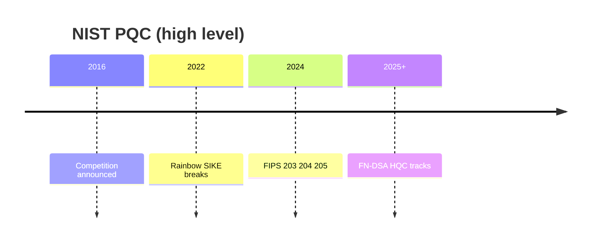

---

## 10.1 Why NIST?

### A Legacy of Cryptographic Standards

The National Institute of Standards and Technology (NIST) occupies a unique position in the global cryptographic ecosystem. As a non-regulatory agency of the United States Department of Commerce, NIST has the dual mandate of promoting innovation and establishing measurement standards that serve industry, government, and the public. In cryptography, this has translated into a decades-long track record of defining the algorithms that protect the world's digital infrastructure.

NIST's involvement in cryptographic standardization dates back to the 1970s, when the agency (then called the National Bureau of Standards) worked with IBM and the NSA to develop the Data Encryption Standard (DES) in 1977. Despite controversies about potential NSA backdoors and the 56-bit key length, DES became the foundational block cipher for commercial cryptography and demonstrated that a federal standard could drive widespread adoption across industries and borders.

The agency's approach matured significantly with the Advanced Encryption Standard (AES) competition in 1997-2001. Rather than developing an algorithm internally or accepting one from a single submitter, NIST organized an open international competition. Fifteen candidate algorithms were submitted, publicly analyzed, and progressively narrowed to a single winner—Rijndael, designed by Belgian cryptographers Joan Daemen and Vincent Rijmen. The AES competition established the template that NIST would refine in subsequent efforts: public call for proposals, transparent evaluation criteria, multiple rounds of public analysis, and a final selection informed by community input.

The SHA-3 competition (2007-2012) further refined this model. After theoretical weaknesses were discovered in the SHA-1 family, NIST solicited hash function candidates and received 64 submissions. Through five years of analysis across multiple rounds, Keccak was selected as SHA-3. Notably, the competition served its purpose even though the feared practical breaks of SHA-2 never materialized—SHA-3 provided algorithmic diversity as insurance.

### Why Not Another Organization?

Several factors make NIST the natural choice for post-quantum standardization rather than alternative bodies:

**Institutional credibility.** NIST standards carry weight in both government procurement (through FIPS mandates) and private industry (through voluntary adoption). When NIST publishes a standard, hardware manufacturers embed it in silicon, software libraries implement it, and compliance frameworks reference it. No other organization achieves this degree of practical impact.

**Technical capacity.** NIST employs dedicated cryptographers and mathematicians who can evaluate submissions at a deep technical level. The agency's Computer Security Division has decades of experience managing the interplay between theoretical security and practical deployment.

**Open process expertise.** NIST has refined the mechanics of open competitions over multiple iterations—managing submissions, organizing workshops, soliciting public comments, and navigating the political dynamics of international participation. These procedural capabilities are as important as technical ones.

**Neutrality and accessibility.** Unlike national security agencies (NSA, GCHQ) that might favor classified algorithms or intelligence equities, NIST operates transparently. Unlike standards bodies (ISO, IETF) that can be slow or politically constrained, NIST can drive a focused multi-year effort with clear decision authority.

**Regulatory impact.** FIPS standards are mandatory for US federal agencies and widely adopted by regulated industries (finance, healthcare, critical infrastructure). This creates a guaranteed adoption pathway that incentivizes participation from the best cryptographers worldwide.

### The Scale of the Post-Quantum Challenge

The post-quantum standardization effort was unprecedented in scope even by NIST's standards. Unlike AES (one block cipher) or SHA-3 (one hash function), this effort needed to standardize replacements for multiple cryptographic primitives—key encapsulation mechanisms, digital signatures, and potentially more—across different mathematical foundations. The threat model was also unusual: standardizing defenses against an adversary (a large-scale quantum computer) that did not yet exist but whose capabilities could be precisely characterized through quantum computational complexity theory.


**Figure 10.2 — Round funnel**

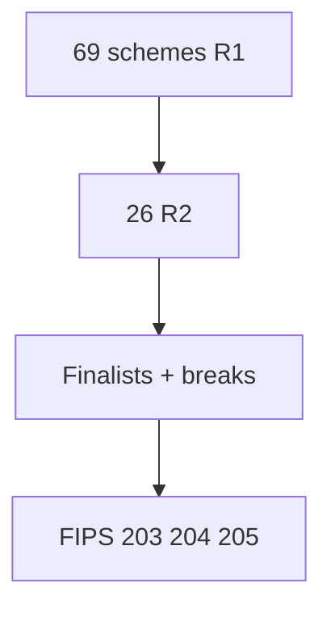

## 10.2 Timeline of the PQC Standardization

### Pre-Competition Phase (2014-2016)

The formal standardization process was preceded by years of growing concern within the cryptographic community about quantum threats and increasing governmental attention to the problem.

**2013-2014: Early workshops.** NIST began hosting workshops on quantum-resistant cryptography, bringing together academic researchers, industry practitioners, and government stakeholders. These workshops served to gauge the maturity of post-quantum proposals and assess whether the field was ready for standardization.

**April 2015: The NSA announcement.** The National Security Agency issued a surprising public advisory through its Information Assurance Directorate, stating that it planned to transition to quantum-resistant algorithms and advising partners to begin preparing. The advisory specifically noted that Suite B algorithms (which NSA had been promoting since 2005) would need to be replaced. This was widely interpreted as a signal that the intelligence community assessed quantum computing progress as more advanced than publicly known, though the simpler explanation—prudent long-term planning given the decades-long deployment cycles of cryptographic infrastructure—was also compelling.

**2015-2016: NIST internal deliberations.** NIST's cryptographic team, led by Dustin Moody and others, developed the framework for the competition. Key decisions included: evaluating KEMs and signatures together rather than separately; defining security levels relative to existing standards (AES-128, AES-192, AES-256); requiring complete specifications and reference implementations with submissions; and establishing evaluation criteria that weighted security, performance, and implementation characteristics.

**December 2016: The formal call.** NIST published the "Call for Proposals" in NISTIR 8105, setting a November 2017 deadline for submissions. The document specified five security levels (corresponding to the difficulty of breaking AES-128, SHA-256, AES-192, SHA-384, and AES-256), required both KEM and signature functionality, and established submission requirements including security proofs, parameter justifications, reference implementations, and known-answer test vectors.

### Round 1 (December 2017 – January 2019)

**The initial submissions.** NIST received 82 submissions, of which 69 were deemed complete and accepted for evaluation. These spanned five major mathematical approaches:

- **Lattice-based (26):** Including Kyber, Dilithium, FALCON, NTRU, SABER, FrodoKEM, NewHope, and many others
- **Code-based (17):** Including Classic McEliece, BIKE, HQC, and variations on the McEliece/Niederreiter frameworks
- **Multivariate (9):** Including Rainbow, GeMSS, LUOV, and related schemes
- **Hash-based (3):** Including SPHINCS+ and variations
- **Isogeny-based (2):** SIKE and CSIDH-related proposals
- **Other/hybrid (12):** Including zero-knowledge-based schemes and novel constructions

**Early eliminations.** Several submissions were broken almost immediately after publication—a testament to the value of open analysis. Some fell to trivial attacks exploiting implementation errors in the specification, while others had fundamental design flaws revealed by the community. Notable early breaks included schemes with algebraic vulnerabilities that allowed polynomial-time key recovery.

**The evaluation process.** During Round 1, NIST organized the First PQC Standardization Conference (April 2018) where submitters presented their schemes and attendees shared cryptanalysis results. The NIST team also conducted internal evaluations of performance, studying implementations on multiple platforms including ARM Cortex-M4 microcontrollers (representative of IoT/embedded devices).

**Round 1 results (January 2019).** NIST advanced 26 candidates to Round 2: 17 KEMs/encryption schemes and 9 signature schemes. The eliminated candidates fell into categories: complete breaks, insufficient security margins relative to parameter sizes, dramatically inferior performance compared to better alternatives in the same mathematical family, and incomplete or unclear specifications.

### Round 2 (January 2019 – July 2020)

Round 2 saw dramatically intensified scrutiny. With the field narrowed from 69 to 26 candidates, researchers could focus their analysis more deeply.

**Enhanced cryptanalysis.** The reduced candidate pool allowed for more thorough cryptanalytic attention. Several important results emerged: improved lattice reduction estimates affected security claims of lattice-based schemes; new side-channel attacks demonstrated practical vulnerabilities in some implementations; and theoretical advances in understanding the relationships between different lattice problems refined security proofs.

**Implementation studies.** NIST and the community produced extensive benchmarking data across platforms. The PQM4 project (post-quantum crypto on Cortex-M4) became a crucial reference for embedded performance. Researchers also identified implementation challenges including constant-time requirements, stack usage constraints on embedded devices, and hardware acceleration opportunities.

**The Second PQC Conference (August 2019).** This workshop provided critical input for Round 2 decisions, featuring updated security analyses, performance comparisons, and discussions about evaluation criteria.

**Round 2 results (July 2020).** NIST announced 7 finalists (candidates expected to be standardized) and 8 alternates (candidates that might advance or be standardized later):

*Finalists:*
- KEMs: CRYSTALS-Kyber, NTRU, Classic McEliece, SABER
- Signatures: CRYSTALS-Dilithium, FALCON, Rainbow

*Alternates:*
- KEMs: BIKE, FrodoKEM, HQC, NTRU Prime, SIKE
- Signatures: GeMSS, Picnic, SPHINCS+

The finalist/alternate distinction was significant: finalists were considered the most promising for standardization, while alternates might be standardized if finalists failed or if additional diversity was needed.

### Round 3 (July 2020 – July 2022)

Round 3 was the decisive phase, producing both the final selections and two spectacular breaks that validated the extended evaluation process.

**Deepening analysis.** The 15 remaining candidates received extraordinary attention from the global cryptographic community. Hundreds of papers analyzed security, efficiency, and implementation aspects. NIST conducted the Third PQC Conference (June 2021) and the Fourth Conference (scheduled to coincide with announcements).

**The SABER-Kyber-NTRU convergence.** For KEMs, the three lattice-based finalists (Kyber, NTRU, SABER) presented NIST with a complex choice. All three offered strong security from lattice assumptions, competitive performance, and reasonable parameter sizes. The choice between them came down to subtle differences in efficiency, implementation characteristics, and theoretical elegance.

**Signature competition dynamics.** For signatures, Dilithium and FALCON represented different approaches within lattice cryptography (Fiat-Shamir with aborts versus NTRU-based sampling), while Rainbow represented the multivariate alternative. SPHINCS+ as an alternate provided hash-based diversity.

### Key Events During Round 3

#### The Rainbow Break (February 2022)

Ward Beullens published a devastating attack against Rainbow that reduced its security far below claimed levels. The attack exploited the layered structure of Rainbow's multi-layered Oil-and-Vinegar construction, using algebraic techniques to peel apart the layers and recover the private key.

Specifically, Beullens' attack combined two techniques: a "rectangular min-rank" attack that exploited the structure visible in the public key, and intersection attacks that leveraged relationships between the layers. For Rainbow's Level I parameters, the attack required only approximately 2^53 operations—far below the claimed 2^128 security level and well within practical reach.

The implications were profound. Rainbow had been a finalist—one of seven schemes NIST considered most likely to be standardized. Its complete break validated several principles: the value of extended evaluation periods, the risks of schemes whose security relies on the difficulty of problems not yet extensively studied, and the importance of algorithmic diversity across different mathematical foundations.

#### The SIKE Break (July 2022)

Even more dramatic was the break of SIKE (Supersingular Isogeny Key Encapsulation), announced by Wouter Castryck and Thomas Decru just days before NIST's planned selection announcement. The attack recovered SIKE private keys in minutes on a single laptop—a complete and total break of what had been considered a serious contender.

The attack exploited the mathematical structure of the auxiliary torsion point information that SIKE published alongside isogeny computations. By applying the work of Ernst Kani on "gluing" of abelian varieties, Castryck and Decru showed that this auxiliary information created a computational shortcut, reducing the hard isogeny problem to a much easier computation on a higher-dimensional abelian variety.

The SIKE break was remarkable for several reasons. First, it came from relatively classical number theory applied in a novel way—the mathematical tools were decades old, but no one had recognized their applicability to isogeny-based cryptography. Second, SIKE had been studied for years by a large community without anyone discovering this vulnerability. Third, the break was so complete (minutes on a laptop) that it eliminated not just SIKE but cast doubt on the entire design pattern of publishing auxiliary torsion information.

Both breaks powerfully demonstrated why NIST's multi-year, open evaluation process was essential. Had standards been rushed, either Rainbow or SIKE could have been deployed worldwide before their fatal flaws were discovered.

### Selections and Standards (2022-2024)

**July 2022: NIST announces primary selections.** After six years of evaluation, NIST announced four algorithms for standardization:

- **CRYSTALS-Kyber** → to become ML-KEM (FIPS 203)
- **CRYSTALS-Dilithium** → to become ML-DSA (FIPS 204)
- **SPHINCS+** → to become SLH-DSA (FIPS 205)
- **FALCON** → selected for future standardization (implementation complexity warranted additional time)

**2022-2024: Standards development.** NIST worked with the algorithm designers to produce final standards documents. This involved minor parameter tweaks, specification clarifications, and the development of conformance testing requirements. Draft standards were published for public comment in August 2023.

**August 13, 2024: Final standards published.** NIST officially released FIPS 203, FIPS 204, and FIPS 205 as final standards, marking the culmination of eight years of work. These documents replaced the earlier competition specifications with normative standards suitable for implementation and compliance purposes.

### Round 4 and Beyond (2022-Present)

NIST recognized that three standards were insufficient for all deployment scenarios and continued evaluation of additional candidates:

**Classic McEliece.** Despite enormous public keys (ranging from 261 KB to over 1 MB depending on parameter set), Classic McEliece's decades-long security track record and conservative design made it attractive for applications where key size is not a constraint (certificate authorities, firmware signing). Standardization is proceeding separately.

**HQC selection (2024).** NIST announced that HQC (Hamming Quasi-Cyclic) would be standardized as an additional KEM, providing code-based diversity alongside the lattice-based ML-KEM. This gives implementers a choice between mathematical foundations—if lattice problems prove easier than expected, HQC provides an independent fallback.

**Additional signature call.** Recognizing that ML-DSA's relatively large signatures might be problematic for some applications, and seeking greater diversity, NIST issued a separate call for additional signature algorithms in 2022. Approximately 40 submissions were received, currently under evaluation.

> **Author's note:** SIKE's weekend break is our board-slide cautionary tale.

## 10.3 Selection Criteria

NIST's evaluation balanced multiple dimensions, explicitly acknowledging that no single metric could determine the best algorithm. The criteria evolved through the competition as NIST gained understanding of the practical trade-offs.

### Security Evaluation

**Theoretical foundations.** NIST assessed the quality of security proofs—how tightly the scheme's security reduces to well-studied hard problems, how well-understood those underlying problems are, and whether the proofs require idealized models (random oracle model) or hold in the standard model. Schemes with tighter reductions to better-studied problems scored higher.

**Cryptanalytic resistance.** The most important security criterion was empirical: how well did the scheme withstand six years of public analysis by the world's best cryptanalysts? Schemes that required parameter adjustments during the competition (due to improved attacks) were viewed less favorably than those whose original parameters remained secure. The complete breaks of Rainbow and SIKE demonstrated why this empirical testing was essential.

**Security margins.** NIST preferred parameters with comfortable margins between estimated attack costs and target security levels. A scheme claiming NIST Level 3 security should ideally have attack costs significantly above the 2^143 quantum operation threshold, not barely meeting it. Larger margins protect against future improvements in cryptanalysis.

**Confidence level.** Distinct from raw security, NIST assessed how confident the community could be in security estimates. Problems studied for decades (LWE, coding theory) inspired more confidence than newer constructions (isogenies, layered multivariate). This "confidence level" was separate from the nominal security level—a scheme might claim 2^200 security but with lower confidence than another claiming 2^180 based on a better-understood problem.

### Performance Evaluation

**Computational efficiency.** NIST measured key generation, encapsulation/signing, and decapsulation/verification speeds across multiple platforms: modern x86-64 servers with vector instructions (AVX2/AVX-512), ARM-based mobile/embedded processors, and constrained microcontrollers (Cortex-M4 with 192 KB RAM). Performance needed to be acceptable across all target platforms, not just the fastest.

**Communication overhead.** Public key sizes, ciphertext sizes, and signature sizes directly impact protocol performance. In TLS, additional bytes increase handshake latency. In constrained networks (IoT, satellite), bandwidth is expensive. NIST weighted communication costs heavily, recognizing that bandwidth overhead is the primary practical impact of post-quantum migration for most deployed protocols.

**Memory requirements.** Embedded devices and hardware security modules have limited RAM and code storage. Stack usage during computations, total memory footprint, and code size all factored into evaluation. Schemes requiring megabytes of RAM or code were penalized for constrained environments.

**Scalability.** How do schemes perform under load? For high-throughput servers handling thousands of TLS connections per second, the computational cost of key exchange and signing multiplies. NIST considered how schemes would perform at scale in real deployment scenarios.

### Implementation Characteristics

**Constant-time feasibility.** Modern cryptographic implementations must execute in time independent of secret data to prevent timing side-channel attacks. NIST evaluated whether each scheme could be practically implemented in constant time. Schemes requiring operations like Gaussian sampling (which naturally varies in execution time) or complex rejection loops were scrutinized for side-channel resistance.

**Misuse resistance.** How badly does a scheme fail if implementers make mistakes? Some schemes are fragile—leaking a nonce destroys security entirely—while others gracefully degrade. NIST valued robustness against common implementation errors, recognizing that real-world code is written by developers with varying cryptographic expertise.

**Implementation simplicity.** Simpler algorithms are less likely to contain implementation bugs. NIST considered specification complexity, the number of distinct operations required, and the potential for subtle errors. This criterion favored schemes like Kyber (straightforward polynomial arithmetic) over schemes requiring floating-point Gaussian sampling or complex algebraic geometry.

**Side-channel resistance.** Beyond constant-time execution, NIST evaluated resistance to power analysis, electromagnetic emanation, and fault injection attacks. Hardware implementations face threats that pure software never encounters. Schemes with simpler data flows and fewer secret-dependent operations rated higher for hardware deployment.

**Hardware acceleration potential.** Would the algorithm benefit from dedicated hardware? Could existing hardware (AES-NI, SHA extensions) be leveraged? The NTT operations central to lattice schemes map well to existing DSP hardware, while some other operations require entirely new hardware designs.

## 10.4 Why Kyber/ML-KEM Won

The selection of CRYSTALS-Kyber as the primary KEM standard over three other lattice finalists (NTRU, SABER) and one code-based finalist (Classic McEliece) was among NIST's most closely debated decisions. The three lattice KEMs were remarkably close in overall quality, and NIST's decision ultimately rested on a combination of technical advantages and practical considerations.

### Kyber's Comprehensive Advantages

**Efficient arithmetic with NTT-friendly parameters.** Kyber's choice of q = 3329 (where 3329 ≡ 1 mod 256) enables a particularly efficient Number Theoretic Transform. The polynomial ring R_q = Z_q[X]/(X^256 + 1) factors into 256 linear factors modulo q, enabling complete NTT decomposition. This means polynomial multiplication can be performed entirely as pointwise multiplication in the NTT domain, avoiding the need for incomplete NTT with Karatsuba multiplication that other parameter choices require.

**Strong, clean security reduction.** Kyber's security reduces tightly to the Module-LWE problem, which itself reduces (with some tightness loss) to worst-case lattice problems. The module structure (working with vectors of ring elements rather than single ring elements or unstructured matrices) provides a sweet spot between efficiency and security confidence—more structure than plain LWE (enabling efficient implementation) but less structure than Ring-LWE (providing larger security margins against potential algebraic attacks).

**Negligible decryption failure probability.** Kyber's parameters are chosen so that the probability of decryption failure is less than 2^(-139) for ML-KEM-512 and even lower for larger parameter sets. This effectively eliminates decryption failures from practical consideration, simplifying protocol design and preventing failure-boosting attacks where an adversary selects ciphertexts that maximize failure probability.

**Simple noise sampling.** The Centered Binomial Distribution (CBD) used for noise sampling is trivial to implement in constant time: sample random bits, count them, subtract. No rejection sampling, no floating-point arithmetic, no lookup tables that might leak through cache timing. This simplicity dramatically reduces the surface area for implementation errors and side-channel vulnerabilities.

**Compact specification.** The core Kyber algorithm can be described concisely, making it accessible to implementers without deep algebraic expertise. The operations are straightforward: matrix-vector multiplication, polynomial addition, sampling from simple distributions, and compression via rounding. This accessibility is crucial for the diverse set of implementations needed across the ecosystem.

**Balanced size/performance trade-off.** At the NIST Level 3 target (ML-KEM-768), Kyber achieves a combined key-plus-ciphertext size of 2,272 bytes with operations completing in approximately 100 microseconds on commodity hardware. This balance made it suitable for the widest range of applications, from bandwidth-constrained IoT to latency-sensitive web traffic.

### Why Not NTRU?

NTRU, invented in 1996 by Hoffstein, Pipher, and Silverman, is the oldest lattice-based encryption scheme and has undergone decades of analysis. Despite this impressive pedigree, several factors worked against its selection as the primary standard:

**Complex key generation.** NTRU key generation requires finding a polynomial f in the ring such that f is invertible modulo both q and a smaller modulus p (typically 3). This invertibility requirement makes key generation more complex than Kyber's straightforward matrix-vector computation. While not a fundamental obstacle, it adds implementation complexity and requires additional validation.

**Decryption failure handling.** NTRU has non-negligible decryption failure probability for some parameter choices, requiring either larger parameters (increasing size) or careful failure management. The interaction between decryption failures and CCA security through the Fujisaki-Okamoto transform creates subtle implementation requirements.

**Weaker security reduction.** While NTRU has a long track record of empirical security, its formal security reductions are less tight than Kyber's Module-LWE foundation. The NTRU problem is a specific structured lattice problem rather than a general module problem, and the exact hardness relationship to standard lattice problems remains less clean.

**Similar performance.** NTRU offered no clear performance advantage over Kyber that might compensate for its added complexity. Given that the two schemes were roughly comparable in size and speed, Kyber's simpler implementation profile tipped the balance.

### Why Not Classic McEliece?

Classic McEliece, based on the original McEliece cryptosystem from 1978, has the most conservative security story of any candidate—nearly 50 years without a fundamental break. However, its selection as the primary standard was effectively impossible due to one factor:

**Enormous public keys.** Classic McEliece public keys range from approximately 261 KB (lowest security level) to over 1 MB (highest security level). These sizes are incompatible with most deployed protocols. A TLS handshake carrying a 261 KB public key would require fragmentation across multiple TCP packets, dramatically increasing latency. Certificate chains containing such keys would be impractical. Storage of millions of such keys (as in key transparency systems) would require orders of magnitude more infrastructure.

NIST acknowledged Classic McEliece's outstanding security properties and continued its evaluation for separate standardization, recognizing its value for applications where key size is acceptable (long-lived CA certificates, firmware signing systems, air-gapped environments).

### Why Not SABER?

SABER was Kyber's closest competitor—so close that NIST's decision was arguably the most marginal of the entire process. The schemes shared almost identical design philosophy (module lattice, CPA-secure core plus FO transform, similar parameter sizes). The key differences:

**Power-of-two modulus.** SABER used a modulus that was a power of two, enabling modular reduction via simple masking rather than explicit reduction modulo a prime. While this simplifies some operations, it prevented the use of NTT for polynomial multiplication (since NTT requires a prime modulus with appropriate roots of unity). SABER instead used Toom-Cook or schoolbook multiplication.

**Kyber's NTT advantage.** Kyber's NTT-based arithmetic provided a consistent performance edge, particularly on platforms with wide SIMD registers (AVX2, NEON). The NTT naturally maps to parallel butterfly operations that modern processors execute efficiently. SABER's polynomial multiplication, while not slow, could not leverage this parallelism as effectively.

**Avoiding redundancy.** NIST explicitly stated that standardizing both Kyber and SABER would provide minimal additional value—they share the same fundamental security assumption (module lattice problems) and similar parameter sizes. Choosing one was sufficient; choosing both would not meaningfully increase diversity.

## 10.5 Why Dilithium/ML-DSA Won

The signature competition saw three finalists from two mathematical families: CRYSTALS-Dilithium and FALCON (both lattice-based) and Rainbow (multivariate). Rainbow's break left the decision between two lattice approaches.

### Dilithium's Design and Advantages

CRYSTALS-Dilithium uses the "Fiat-Shamir with Aborts" paradigm: generate a commitment, hash it with the message to get a challenge, compute the response, and check whether the response would leak information about the secret key. If it would leak, abort and retry (rejection sampling). This design provides several advantages:

**No floating-point arithmetic.** Dilithium's operations are entirely integer-based: polynomial arithmetic over Z_q, sampling from uniform or bounded distributions, and comparison operations. This eliminates an entire class of potential implementation errors and side-channel vulnerabilities related to floating-point unit behavior.

**Predictable rejection count.** While Dilithium uses rejection sampling (aborting and retrying if the signature would leak), the expected number of repetitions is small (approximately 4-7 for standard parameters) and publicly visible (an observer can count how many attempts were needed). Since the iteration count is not secret, it does not constitute a timing side-channel.

**Straightforward constant-time implementation.** Every individual iteration of Dilithium's signing loop can be implemented in constant time with standard techniques. The only variable is the number of iterations, which leaks no information about the secret key. This makes secure implementation accessible to developers without deep side-channel expertise.

**Module-LWE foundation.** Like Kyber, Dilithium builds on Module-LWE (specifically, Module-SIS for the signature scheme), providing a shared mathematical foundation between NIST's KEM and signature standards. This conceptual consistency simplifies security analysis and may allow shared implementations of core arithmetic routines.

**Reasonable sizes.** At NIST Level 3, ML-DSA produces 3,309-byte signatures with 1,952-byte public keys. While significantly larger than classical ECDSA (64-byte signatures, 32-byte keys), these sizes are manageable for most applications. Certificate chains, signed software updates, and protocol messages can accommodate this overhead without fundamental redesign.

### Why FALCON Was Not Primary (But Still Selected)

FALCON (Fast Fourier Lattice-based Compact Signatures over NTRU) produces significantly smaller signatures than Dilithium—approximately 666 bytes at Level I versus Dilithium's 2,420 bytes. This size advantage is important for bandwidth-constrained applications. However, FALCON's implementation characteristics made it unsuitable as the primary standard:

**Gaussian sampling requirement.** FALCON requires sampling from a discrete Gaussian distribution over a lattice using a "fast Fourier sampling" procedure originally proposed by Gentry, Peikert, and Vaikuntanathan. This sampling procedure operates over floating-point numbers and is intricate to implement securely. Even small errors in floating-point precision can completely break security, and achieving constant-time behavior in floating-point code is notoriously difficult.

**Side-channel vulnerability surface.** The tree-based recursive Gaussian sampler in FALCON's signing algorithm operates on secret data in complex patterns, creating numerous potential side-channel leakage points. While constant-time implementations exist, they require exceptional care and sacrifice some of FALCON's performance advantages.

**Implementation complexity.** FALCON's specification is substantially more complex than Dilithium's. Correct implementation requires understanding NTRU lattice geometry, recursive sampling trees, and floating-point arithmetic for lattice reduction. NIST judged that the risk of widespread incorrect implementations outweighed FALCON's size benefits for a primary standard.

**Separate standardization track.** NIST selected FALCON for standardization as FN-DSA (FFT-based NTRU Digital Signature Algorithm) on a separate timeline, acknowledging that its compact signatures are valuable for applications that can invest in careful implementation (hardware security modules, specialized cryptographic libraries).

### Why Not Rainbow?

Rainbow's February 2022 break by Ward Beullens eliminated it from consideration entirely. The break demonstrated that Rainbow's "layered" oil-and-vinegar construction introduced algebraic structure that could be exploited to recover secret keys in practical time. Beyond the specific attack, the break highlighted risks inherent in multivariate schemes whose security depends on the difficulty of solving systems of multivariate quadratic equations—while the general MQ problem is NP-hard, the specific structured instances created by cryptographic constructions may be much easier.

The broader lesson was that decades of study do not guarantee security if the right attack technique has not yet been discovered. Oil-and-vinegar schemes were proposed in 1997, and Rainbow specifically in 2005, yet the fatal flaw was not identified until 2022.

## 10.6 The Role of SPHINCS+/SLH-DSA

### Selection Rationale

SPHINCS+ was the only non-lattice signature scheme selected for standardization in the initial set. Its selection was motivated by strategic diversity considerations rather than raw performance—in every performance metric, ML-DSA is superior. NIST's reasoning was explicit and deliberate:

**Minimal security assumptions.** SLH-DSA's security depends only on the properties of the underlying hash function (second-preimage resistance, pseudorandom function security, target collision resistance). These properties are extremely well-understood, having been studied for decades. If the hash function (SHA-256 or SHAKE-256) remains secure, SLH-DSA remains secure regardless of any developments in lattice cryptanalysis, quantum algorithms, or algebraic geometry.

**Insurance against lattice breakthroughs.** If an unexpected advance dramatically reduces the cost of solving Module-LWE or Module-SIS problems, both ML-KEM and ML-DSA could be compromised. SLH-DSA provides a "safety net"—organizations can deploy it alongside or instead of ML-DSA for high-value applications where long-term security is paramount.

**Proven theoretical lineage.** Hash-based signatures have the strongest theoretical foundation of any signature primitive. Lamport signatures (1979) demonstrated that one-time signatures could be built from any one-way function. Merkle trees (1979) extended this to many-time signatures. The line of development through XMSS and SPHINCS to SPHINCS+ represents a mature, deeply analyzed construction pattern with no fundamental surprises remaining.

### Performance Trade-offs

SLH-DSA's conservative design comes at a significant performance cost:

**Large signatures.** SLH-DSA signatures range from approximately 7,856 bytes (smallest parameter sets) to 49,856 bytes (fastest parameter sets), compared to ML-DSA's 2,420-3,309 bytes. This is a direct consequence of the Merkle tree structure—the signature must include an authentication path through the tree.

**Slow signing.** Signing operations require traversing and computing multiple hash trees, taking milliseconds rather than microseconds. The SLH-DSA-SHAKE-128f ("fast") parameter set takes approximately 5 ms to sign, while SLH-DSA-SHAKE-128s ("small") takes approximately 100 ms but produces smaller signatures.

**Fast verification.** Verification is relatively fast (approximately 1 ms for the fast parameter sets) because it only recomputes hashes along the authentication path rather than the full tree.

### Appropriate Use Cases

Given these trade-offs, SLH-DSA is best suited for applications where signing is infrequent and security requirements are extreme: root certificate authority certificates (signed once, verified millions of times), code signing for critical infrastructure firmware, long-lived document signatures, and applications where a future lattice break would be catastrophic.

## 10.7 Naming Conventions

### The Renaming Decision

When NIST published final standards, all algorithms were renamed from their competition names to standardized designations following a consistent naming scheme:

| Competition Name | Standard Name | Standard Number | Naming Logic |
|-----------------|--------------|----------------|--------------|
| CRYSTALS-Kyber | ML-KEM | FIPS 203 | Module-Lattice Key Encapsulation Mechanism |
| CRYSTALS-Dilithium | ML-DSA | FIPS 204 | Module-Lattice Digital Signature Algorithm |
| SPHINCS+ | SLH-DSA | FIPS 205 | Stateless Hash-based Digital Signature Algorithm |
| FALCON | FN-DSA | (Pending) | FFT over NTRU-lattice Digital Signature Algorithm |

### Rationale for Renaming

NIST's decision to rename algorithms was controversial among some in the community but followed sound institutional logic:

**Standardization convention.** Previous NIST standards similarly renamed algorithms: Rijndael became AES, Keccak became SHA-3. Standards documents have their own naming conventions reflecting the standardized function rather than the competition entry.

**Descriptive naming.** The new names encode the mathematical foundation ("ML" for Module-Lattice, "SLH" for Stateless Hash-based) and the cryptographic function ("KEM" for Key Encapsulation, "DSA" for Digital Signature Algorithm). This helps implementers and procurement officers understand what they are deploying without deep mathematical background.

**Intellectual property neutrality.** Competition names often reflected team identities or references (CRYSTALS, Dilithium from Star Trek, Kyber crystals from Star Wars). Standard names should be neutral and generic, reflecting function rather than origin.

**Version distinction.** The standardized algorithms differ slightly from their competition versions (minor parameter tweaks, specification clarifications). Distinct names prevent confusion about which version is being referenced in implementations, compliance documents, and protocol specifications.

### Practical Implications

The dual naming creates some confusion during the transition period. Literature from before 2024 references "Kyber" and "Dilithium," while standards-compliant implementations reference "ML-KEM" and "ML-DSA." Practitioners should understand both names and recognize that the standardized versions are the authoritative specifications for new implementations.

## 10.8 Ongoing Standardization Activities

### HQC Standardization

In 2024, NIST announced the selection of HQC (Hamming Quasi-Cyclic) as an additional KEM standard. This decision reflects NIST's commitment to algorithmic diversity:

**Code-based security.** HQC's security relies on the difficulty of decoding random quasi-cyclic codes, a problem from coding theory with different mathematical foundations than lattice problems. If Module-LWE proves unexpectedly easier than believed (due to new algebraic techniques or quantum algorithms), HQC provides a fallback from an entirely different hardness assumption.

**Quasi-cyclic structure.** HQC uses quasi-cyclic codes for efficiency—the underlying matrix has a structure that enables compact representation and efficient computation. This structured approach is analogous to how ML-KEM uses module lattices rather than unstructured lattices for efficiency, accepting somewhat less security confidence in exchange for practical deployability.

**Parameter sizes.** HQC has somewhat larger parameters than ML-KEM: approximately 2,249 bytes for the public key and 4,481 bytes for the ciphertext at 128-bit security (compared to ML-KEM-768's 1,184 and 1,088 bytes). This size premium is the cost of code-based diversity.

**Standardization timeline.** HQC standardization is proceeding on a separate timeline from the initial three FIPS standards, with draft standards expected to follow the same public comment process.

### Additional Signature Competition

NIST's call for additional digital signature schemes, issued in 2022, seeks to address gaps in the initial standardization:

**Short signatures.** ML-DSA's signatures (2,420-4,627 bytes) are large compared to classical ECDSA (64 bytes). Applications transmitting many signatures (certificate chains, blockchain) need shorter alternatives. Candidates like MAYO and UOV (Unbalanced Oil-and-Vinegar, in a new less-layered configuration) offer shorter signatures from multivariate assumptions.

**Short public keys.** Some applications (constrained storage, key transparency) need compact public keys more than compact signatures. Different trade-off points between key size and signature size serve different deployment needs.

**Novel properties.** Some candidates offer properties beyond basic signing—signature aggregation (combining multiple signatures into one), threshold signing (distributed key generation and signing), or unique algebraic structures that enable advanced protocols.

**Current candidates under evaluation include:**

- **UOV (Unbalanced Oil-and-Vinegar):** Multivariate scheme with very short signatures (~100 bytes) but large public keys (~67 KB). Unlike Rainbow, UOV has a simpler single-layer structure that has resisted cryptanalysis for over 25 years.
- **MAYO:** A compressed variant of UOV that achieves shorter public keys while maintaining short signatures. Uses "whipping" technique to reduce key sizes.
- **SQISign:** Based on isogenies between supersingular elliptic curves, offering the smallest combined key+signature size of any candidate. However, signing is computationally expensive and the security analysis of the underlying problem (computing isogenies without auxiliary points) is less mature.
- **CROSS:** Code-based signature scheme using the syndrome decoding problem. Offers medium-sized signatures with conservative security assumptions.
- **LESS, MEDS, HAWK, SquirrelS, and others:** Representing diverse mathematical approaches including group actions, matrix equivalence, and structured lattice variants.

### Stateful Hash-Based Signatures

Before the main PQC competition concluded, NIST standardized two stateful hash-based signature schemes in SP 800-208:

**XMSS (eXtended Merkle Signature Scheme, RFC 8391).** A stateful scheme based on Merkle trees where each key pair can produce a fixed number of signatures. The signer must maintain state (a counter of which one-time keys have been used). Reusing a one-time key catastrophically breaks security.

**LMS (Leighton-Micali Signature, RFC 8554).** Similar to XMSS with different design choices. Also stateful with the same one-time key reuse caveat.

These schemes are recommended for specific use cases where state management is feasible: firmware signing (small number of signatures from a controlled signing server), certificate authority root certificates (signed very infrequently), and systems with hardware-enforced monotonic counters to prevent state reuse.

The statelessness of SLH-DSA (which uses randomized "few-time" keys within a hyper-tree structure) makes it applicable to general-purpose signing where state management is impractical.

## 10.9 International Standardization

### ISO/IEC

The International Organization for Standardization's Joint Technical Committee 1 (JTC 1), Subcommittee 27 (Information Security) has been working to incorporate post-quantum algorithms into international standards:

**ISO/IEC 14888-4.** This forthcoming part of the digital signature standard will include post-quantum signature schemes, expected to align closely with NIST's selections (ML-DSA and SLH-DSA).

**ISO/IEC 18033-2.** The public-key encryption standard is being updated to include post-quantum KEMs, expected to incorporate ML-KEM.

**Timeline alignment.** ISO's standards process is generally slower than NIST's, involving broader international consensus-building. ISO standards are expected to reference or align with the FIPS specifications, potentially with minor notational differences but identical algorithms.

**Independent evaluation.** While ISO generally defers to NIST's security evaluation for PQC algorithms, the ISO process provides an additional layer of review, particularly for implementation guidance and interoperability requirements.

### ETSI (European Telecommunications Standards Institute)

ETSI's Quantum-Safe Cryptography (QSC) working group has been particularly active in bridging the gap between cryptographic standards and deployment reality:

**Migration guidance (TR 103 619).** ETSI published comprehensive technical reports on migrating existing systems to quantum-safe cryptography, covering TLS, IPsec, IKEv2, and other protocols. These reports provide practical deployment advice beyond what algorithm standards themselves contain.

**Hybrid mechanisms (TS 103 744).** ETSI standards for combining classical and post-quantum algorithms address the transition period where confidence in new algorithms is still building. These specify how to combine ECDH with ML-KEM, how to handle dual signatures, and how hybrid schemes interact with existing protocol infrastructure.

**Quantum Key Distribution integration.** Uniquely among standards bodies, ETSI also addresses the integration of quantum key distribution (QKD) with post-quantum cryptographic schemes, relevant for organizations pursuing defense-in-depth with both quantum-information-theoretic and computational security.

### IETF (Internet Engineering Task Force)

The IETF is responsible for integrating post-quantum algorithms into internet protocols:

**TLS integration.** RFC 9370 and subsequent drafts specify how ML-KEM integrates into TLS 1.3 key exchange, including hybrid mechanisms combining ML-KEM-768 with X25519. These drafts address practical concerns: how to handle the larger key exchange messages, how to negotiate PQC support, and how to maintain backward compatibility.

**Certificate formats.** Internet-Drafts specify how post-quantum public keys and signatures fit into X.509 certificates and the Web PKI. Challenges include certificate size impacts on TLS handshakes, the need for intermediate caching strategies, and certificate transparency log implications.

**IPsec/IKEv2.** Drafts extend the Internet Key Exchange protocol with post-quantum key exchange, addressing both initial key establishment and rekey operations.

**SSH.** Post-quantum key exchange methods for Secure Shell, enabling quantum-resistant server authentication and session key establishment.

**S/MIME and OpenPGP.** Drafts for post-quantum email security address the unique challenges of asynchronous communication: messages encrypted today might be stored and decrypted decades hence, making post-quantum protection particularly urgent for email.

### BSI (German Federal Office for Information Security)

Germany's BSI has taken a notably independent approach to post-quantum recommendations:

**FrodoKEM endorsement.** BSI has explicitly recommended FrodoKEM (based on unstructured LWE, without ring or module structure) as a conservative option alongside NIST's structured selections. BSI's reasoning is that unstructured LWE eliminates any risk from attacks exploiting algebraic structure, providing a higher confidence floor at the cost of larger parameters and slower performance.

**Technical guidelines (TR-02102).** BSI's cryptographic recommendation documents include post-quantum algorithms with specific guidance for German government and critical infrastructure. These sometimes differ from NIST in parameter recommendations or transition timelines.

**Hybrid requirement.** BSI mandates hybrid modes (combining classical and post-quantum) for government communications during the transition period, reflecting a conservative approach that maintains security even if PQC algorithms have undiscovered weaknesses.

### ANSSI (French National Cybersecurity Agency)

France's ANSSI has adopted the most conservative stance among major national agencies:

**Hybrid-only requirement.** ANSSI requires that post-quantum algorithms be deployed exclusively in hybrid mode—combining them with classical algorithms (ECDH, ECDSA) that have decades of security track record. This policy reflects the position that confidence in new algorithms builds gradually and that premature standalone deployment risks catastrophic failure if PQC algorithms prove weaker than expected.

**Extended timeline.** ANSSI's migration guidance specifies a longer transition period than NIST's, with hybrid modes remaining mandatory for an extended period. Standalone post-quantum deployment is envisioned only after additional years of cryptanalytic study post-standardization.

**Algorithm-agnostic approach.** Rather than endorsing specific algorithms, ANSSI's guidance focuses on security levels and hybrid construction principles. This approach provides flexibility to adopt whatever algorithms prove most robust over time.

### Other National and Regional Efforts

Beyond the major bodies listed above, numerous other organizations have published PQC guidance or initiated their own evaluations:

**CCCS (Canadian Centre for Cyber Security).** Aligned closely with NIST selections, recommending immediate adoption of FIPS 203/204/205 for Canadian government systems. Published guidance on hybrid deployment and migration planning timelines.

**AISA/ASD (Australia).** The Australian Signals Directorate has endorsed NIST algorithms for Australian government use, with particular emphasis on the urgency of protecting classified information against "harvest now, decrypt later" attacks.

**KISA (Korea).** South Korea's Internet & Security Agency has been evaluating post-quantum algorithms for national infrastructure, with particular focus on performance on domestic hardware platforms and integration with Korean cryptographic standards (ARIA, LEA).

**CRYPTREC (Japan).** Japan's cryptographic evaluation committee is assessing NIST selections for inclusion in Japanese government recommendations, conducting independent performance evaluations on Japanese computing platforms.

### Alignment and Divergence

While international bodies are broadly aligned—all recognize NIST's selections as the primary reference point—meaningful differences exist in:

- **Transition aggressiveness:** NIST encourages immediate deployment; ANSSI counsels patience
- **Hybrid requirements:** Some mandate hybrid, others merely recommend it
- **Algorithm diversity:** BSI endorses unstructured options (FrodoKEM) that NIST did not standardize
- **Timeline:** Varying urgency about "harvest now, decrypt later" threats
- **Compliance mechanisms:** Some jurisdictions mandate adoption by specific dates; others rely on voluntary adoption

These differences reflect legitimate policy trade-offs rather than technical disagreements. Organizations operating internationally must navigate this landscape, typically defaulting to the most conservative position that satisfies all relevant jurisdictions. In practice, this often means: deploying NIST-standardized algorithms (for broadest interoperability), in hybrid mode (satisfying ANSSI and BSI requirements), with a migration timeline that meets the most aggressive applicable deadline.

## 10.10 Lessons Learned

The eight-year NIST PQC standardization process offers profound lessons for cryptographic engineering, standards development, and technology governance. These lessons are relevant not only for future cryptographic standards but for any large-scale technology selection process where long-term security implications are at stake.

### Open Competitions Discover Fatal Flaws

The complete breaks of Rainbow and SIKE—both during the final round, after years of public analysis—powerfully validate the open competition model. Had these schemes been standardized through a closed process with limited analysis time, they could have been deployed worldwide before their vulnerabilities were discovered. The open process created incentives for the world's best cryptanalysts to scrutinize candidates, and they delivered crucial results.

The timing of these breaks is instructive. Rainbow was studied since 2005 and SIKE since 2011, yet their fatal flaws were not discovered until 2022. This demonstrates that even sustained public attention does not guarantee timely discovery of vulnerabilities—the eight-year competition was barely long enough.

The incentive structure of open competitions deserves particular attention. By publicly listing candidate algorithms and inviting analysis, NIST created a situation where breaking a prominent candidate would bring academic recognition and career advancement. This aligned individual researcher incentives with collective security goals. In contrast, proprietary or classified algorithms benefit from no such alignment—their security depends on the competence and diligence of a limited internal review team.

### Diversity Is Not Optional

NIST's explicit decision to standardize SLH-DSA alongside ML-DSA—despite SLH-DSA's inferior performance in every metric—reflects hard-won wisdom about cryptographic monocultures. If every deployed system depends on the same mathematical assumption (Module-LWE), then a single unexpected advance could compromise global infrastructure simultaneously. Diversity of mathematical foundations provides systemic resilience even if individual alternatives are less efficient.

This lesson extends beyond algorithm selection to deployment strategy: organizations should consider which of their systems can tolerate the performance overhead of hash-based signatures, and deploy SLH-DSA there as insurance.

### Implementation Complexity Is a First-Order Concern

NIST's preference for Dilithium over FALCON as the primary signature standard—despite FALCON's smaller signatures—reflects the reality that most cryptographic code is written by developers who are not cryptographers. A scheme that is simple to implement correctly provides better real-world security than one that is theoretically superior but frequently implemented with subtle bugs.

The catastrophic consequences of implementation errors in cryptography (total security failure rather than mere performance degradation) make simplicity a security property, not merely an engineering convenience.

### Patience Enables Better Outcomes

The eight-year timeline (2016-2024) was longer than the AES competition (4 years) or SHA-3 competition (5 years), and it was barely sufficient. The Rainbow break in year 6 and the SIKE break in year 6 demonstrate that even extended timelines cannot guarantee all flaws are found—but shorter timelines would certainly have missed them.

The lesson is that cryptographic standardization should not be rushed, even under the pressure of quantum computing advances. The "harvest now, decrypt later" threat creates urgency, but deploying a broken standard is worse than deploying a good standard a year or two later.

### Migration Must Begin Before Standards Are Final

Organizations that waited until August 2024 (final standards publication) to begin migration planning are years behind those that started with the July 2022 selections or even earlier. The practical work of migrating cryptographic infrastructure—inventorying systems, testing compatibility, updating protocols, training staff, purchasing new hardware—takes years and should begin as soon as algorithm selections are reasonably stable, not when standards documents receive their final stamp.

### The Quantum Threat Model Creates Unique Pressure

Unlike previous cryptographic transitions (DES to AES, SHA-1 to SHA-2), the post-quantum transition is driven by a threat that does not yet fully exist. Large-scale quantum computers capable of running Shor's algorithm on production key sizes have not been demonstrated. This creates an unusual dynamic: the urgency comes from the combination of uncertain threat timelines and the decades-long deployment cycles of cryptographic infrastructure.

The "harvest now, decrypt later" attack—where adversaries capture encrypted communications today for future quantum decryption—means that data requiring long-term confidentiality (decades) is already at risk even though quantum computers cannot yet break the encryption. This is not speculative: intelligence agencies are widely believed to be stockpiling encrypted data.

### Standards Are Beginnings, Not Endings

The publication of FIPS 203, 204, and 205 marks the beginning of post-quantum deployment, not the end of post-quantum work. Continued cryptanalysis of the standardized algorithms, development of efficient implementations across platforms, integration into protocols and applications, migration of existing systems, and standardization of additional algorithms all continue indefinitely.

The cryptographic community must maintain vigilant analysis of ML-KEM and ML-DSA parameters even after standardization. If new attack techniques significantly reduce security margins, parameter updates or even algorithm replacements might be needed. The modularity of modern protocols (algorithm agility) supports this ongoing evolution.

### The Importance of Ecosystem Readiness

A standard is only as useful as the ecosystem that implements it. The NIST PQC effort benefited enormously from parallel efforts to prepare the implementation ecosystem: the PQClean project provided clean reference implementations, the PQM4 project benchmarked on embedded platforms, major cryptographic libraries (OpenSSL, BoringSSL, wolfSSL) developed implementations alongside the competition, and protocol working groups (IETF) drafted integration specifications before final standards were published. This ecosystem co-development meant that practical deployment could begin almost immediately upon standard publication, rather than requiring years of additional implementation work.

### Balancing Conservatism and Practicality

The tension between security conservatism (preferring the safest possible algorithms regardless of performance) and deployment practicality (needing algorithms efficient enough for real-world use) was a constant theme. NIST's resolution—standardizing both the efficient-but-newer lattice schemes and the conservative-but-slower hash-based scheme—represents a thoughtful compromise that gives different communities appropriate options.

BSI's additional endorsement of FrodoKEM (unstructured LWE, even more conservative but significantly larger) and ANSSI's hybrid-only mandate represent alternative positions on this spectrum. No single point is "correct"—the appropriate choice depends on threat model, performance constraints, and institutional risk tolerance. The existence of multiple options at different conservatism levels is a feature, not a deficiency, of the standardization landscape.

### Communication and Transparency Build Trust

Throughout the eight-year process, NIST maintained remarkable transparency: publishing detailed evaluation reports explaining selection rationale, holding public workshops where community members could question decisions, and explicitly acknowledging uncertainties and trade-offs. This transparency built trust in the process and the resulting standards, even among those who might have preferred different selections.

The contrast with earlier, less transparent standardization efforts (the DES controversy around S-box design, concerns about Dual_EC_DRBG) underscores how important procedural legitimacy is for cryptographic standards that the world depends on. Organizations are more willing to adopt standards they trust were selected on merit through a fair process.---

## Chapter Summary

**Technical takeaway:** NIST's open competition model produced FIPS 203–205; breaks during the process validated public review.

**Deployment takeaway:** Align procurement language to FIPS names (ML-KEM) not legacy submission names (Kyber) in new contracts.

*Figures in this chapter are planning aids—verify all algorithm names and byte sizes against the current NIST FIPS PDF before implementation.*

---

---

# Chapter 11: FIPS 203 — ML-KEM

We walk ML-KEM the way implementers need: **K-PKE, FO transform, implicit rejection**—with constant-time warnings baked in.

**Figure 11.1 — ML-KEM-768 object sizes (typical deployment)**

| Object | Bytes (ML-KEM-768) | Role |
|--------|-------------------:|------|
| Public key `ek` | 1,184 | Long-lived; in cert extensions / config |
| Secret key `dk` | 2,400 | HSM-protected; never logged |
| Ciphertext `c` | 1,088 | Per-handshake on the wire |
| Shared secret | 32 | Feeds HKDF → AES-GCM |

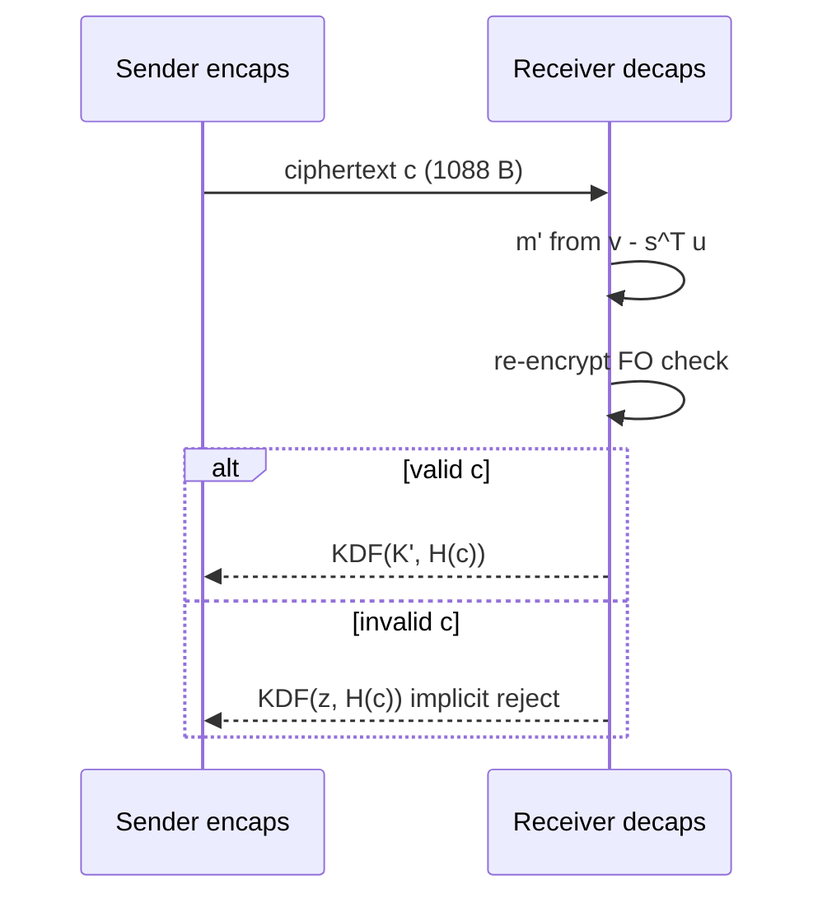

---

> **Author's note:** Implement ML-KEM from **FIPS 203 PDF + ACVP test vectors**, not from memory of the Kyber submission. Parameter sets (512/768/1024) are not interchangeable—your TLS profile must name the exact set.

## 11.1 Overview

ML-KEM (Module-Lattice-Based Key Encapsulation Mechanism), standardized as FIPS 203 in August 2024, is the primary post-quantum key encapsulation mechanism selected by NIST. It enables two parties to establish a shared 256-bit secret key over an insecure channel, providing security against both classical and quantum adversaries. This shared secret is then used with a symmetric cipher (such as AES-256) to encrypt subsequent communications.

A Key Encapsulation Mechanism differs from public-key encryption in a subtle but important way. Public-key encryption encrypts an arbitrary message chosen by the sender. A KEM instead generates a random shared secret internally and encapsulates it—the sender cannot choose the shared secret, only receive it. This restriction enables stronger and simpler security proofs, and is the natural primitive for key exchange protocols (TLS, SSH, IPsec) where the goal is establishing a random session key rather than transmitting a specific message.

ML-KEM is derived from the CRYSTALS-Kyber submission to the NIST PQC competition, with minor modifications for the final standard. Its security rests on the presumed computational hardness of the Module Learning With Errors (MLWE) problem—a structured variant of the Learning With Errors problem that is believed to resist both classical and quantum attacks. The scheme achieves IND-CCA2 security (indistinguishability under adaptive chosen-ciphertext attack), the strongest standard notion of security for key encapsulation, through application of a variant of the Fujisaki-Okamoto transform.

### Design Philosophy

ML-KEM embodies a design philosophy that prioritizes implementation simplicity and efficiency alongside strong security:

**Algebraic efficiency.** By working in the polynomial ring Z_q[X]/(X^256 + 1) with a carefully chosen modulus q = 3329, ML-KEM enables Number Theoretic Transform (NTT)-based polynomial multiplication that maps naturally to modern processor architectures.

**Simple noise distributions.** The Centered Binomial Distribution replaces Gaussian sampling, eliminating a major source of implementation complexity and side-channel vulnerability.

**Module structure.** Working with vectors of ring elements (module lattices) provides a tunable security-efficiency trade-off: increasing the module rank k provides more security without changing the underlying ring arithmetic.

**Implicit rejection.** Rather than signaling decapsulation failure explicitly, ML-KEM returns a pseudorandom value for invalid ciphertexts, preventing entire classes of oracle attacks.


**Figure 11.2 — FO transform wrapper**

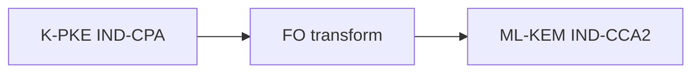

## 11.2 Mathematical Foundation

### The Learning With Errors Problem

The Learning With Errors (LWE) problem, introduced by Oded Regev in 2005, is the foundational hardness assumption underlying ML-KEM. In its basic form, LWE asks: given a matrix **A** ∈ Z_q^(m×n), a secret vector **s** ∈ Z_q^n, and noisy products **b** = **A**·**s** + **e** (where **e** is a vector of small "error" terms), recover **s** or even distinguish **b** from a uniformly random vector.

Regev proved that solving LWE is at least as hard as solving several worst-case lattice problems (including the Shortest Vector Problem and the Closest Vector Problem) using quantum reductions. This means that any efficient algorithm for LWE would imply efficient quantum algorithms for problems that have resisted decades of cryptanalytic effort.

The difficulty of LWE—and thus the security of ML-KEM—depends on three parameters: the dimension n (size of the secret), the modulus q (the ring in which arithmetic is performed), and the error distribution (how much noise is added). Larger dimensions and smaller error-to-modulus ratios make the problem harder but increase computational and communication costs.

### Ring-LWE and Module-LWE

Plain LWE with an unstructured random matrix **A** ∈ Z_q^(m×n) produces excellent security but impractical key sizes (the matrix itself must be communicated or derived from a shared seed, and operations are O(n²)). Two structured variants address this:

**Ring-LWE** replaces the unstructured matrix with multiplication by a single element in a polynomial ring R_q = Z_q[X]/(f(X)). This reduces the public key from O(n²) elements to O(n) and speeds computation from O(n²) to O(n log n) via the NTT. However, the algebraic structure raises concerns about potential attacks exploiting ring properties.

**Module-LWE** provides a middle ground. Instead of a single ring element (Ring-LWE) or an unstructured matrix (plain LWE), Module-LWE works with a k×k matrix of ring elements—a "module" over the polynomial ring. The MLWE problem states: given random **A** ∈ R_q^(k×k) and **b** = **A**·**s** + **e** where **s**, **e** ∈ R_q^k have small coefficients, distinguish **b** from uniform.

Module-LWE inherits efficiency from the ring structure (NTT-based arithmetic within each ring element) while providing security margins from the module structure (each additional module rank adds security without fully committing to pure ring structure). For ML-KEM, the module rank k ∈ {2, 3, 4} provides three security levels.

The security relationship is: plain LWE ≥ Module-LWE ≥ Ring-LWE (where ≥ means "at least as hard"). Module-LWE with k ≥ 2 is believed to be essentially as hard as plain LWE of the same total dimension nk, because no attack is known that exploits the module structure beyond what already applies to the ring structure of individual components.

### The Polynomial Ring R_q

ML-KEM performs arithmetic in the polynomial ring:

```
R_q = Z_q[X]/(X^256 + 1)    where q = 3329
```

Elements of R_q are polynomials of degree at most 255 with coefficients in {0, 1, ..., 3328}. Addition is coefficient-wise modulo q. Multiplication is polynomial multiplication reduced modulo both q (for coefficients) and X^256 + 1 (for degree).

The polynomial X^256 + 1 is the 512th cyclotomic polynomial, chosen for several critical properties:

**Irreducibility over Q.** X^256 + 1 is irreducible over the rationals, making R_q a field when q is prime and X^256 + 1 is irreducible modulo q, or factoring into ideals of consistent degree otherwise.

**Negacyclic convolution.** Multiplication modulo X^256 + 1 corresponds to negacyclic convolution, which can be computed efficiently via a "negacyclic NTT"—a variant of the standard NTT adapted for the sign alternation.

**Power-of-two degree.** The degree 256 = 2^8 enables recursive FFT-style decomposition with log₂(256) = 8 levels of butterfly operations. Combined with the NTT-friendly modulus, this allows O(n log n) multiplication with small constants.

### Why q = 3329?

The choice of modulus q = 3329 is one of ML-KEM's most consequential design decisions, driven by multiple interlocking requirements:

**NTT compatibility: 3329 ≡ 1 (mod 256).** For the NTT to fully decompose the ring R_q into 256 independent components (enabling pointwise multiplication), we need a primitive 256th root of unity to exist modulo q. This requires q ≡ 1 (mod 256). Actually, since we need a negacyclic NTT (for the X^256 + 1 modulus), we need a primitive 512th root of unity, requiring q ≡ 1 (mod 512). The value 3329 satisfies 3329 = 13 × 256 + 1 = 6 × 512 + 513... let us verify: 3329 mod 512 = 3329 - 6×512 = 3329 - 3072 = 257. Actually, for ML-KEM's specific NTT approach, the requirement is q ≡ 1 (mod 2n) where n = 256, so q ≡ 1 (mod 512). We have 3329 mod 512 = 257, which means 3329 ≡ 1 (mod 256) but not mod 512. ML-KEM uses a 128-point NTT that decomposes each degree-255 polynomial into 128 degree-1 polynomials (linear factors), exploiting that X^256 + 1 = ∏(X² - ζ^(2i+1)) for appropriate roots ζ. The requirement 3329 ≡ 1 (mod 256) ensures the existence of a primitive 256th root of unity, which suffices for this decomposition.

**Primality.** Being prime simplifies modular arithmetic—every non-zero element has a multiplicative inverse, and the multiplicative group Z_q* is cyclic. This enables clean NTT formulations and avoids complications that composite moduli introduce.

**Bit efficiency.** 3329 fits in 12 bits (2^11 = 2048 < 3329 < 4096 = 2^12). This means each coefficient can be represented in 12 bits for storage and transmission. Products of two coefficients fit in 24 bits (3328² = 11,075,584 < 2^24 = 16,777,216), which means multiplication can use 32-bit integers without overflow—critical for efficient implementation on commodity processors.

**Noise tolerance.** For a given modulus q and error distribution, the gap between "signal" (the useful information) and "noise" (the errors) determines decryption correctness. The value 3329 is large enough relative to the chosen error parameters (CBD with η ≤ 3) that decryption failures are negligibly rare, while being small enough to keep ciphertext sizes compact.

**Compression compatibility.** ML-KEM compresses ciphertext components by rounding coefficients from Z_q to Z_{2^d} for various d values. The value 3329 interacts favorably with the compression parameters (d_u = 10 or 11, d_v = 4 or 5), keeping rounding errors small relative to the noise tolerance.

### The Number Theoretic Transform (NTT)

The NTT is the workhorse of ML-KEM's arithmetic, enabling polynomial multiplication in O(n log n) time rather than the naive O(n²). It is the finite-field analog of the Discrete Fourier Transform, replacing complex roots of unity with roots of unity in Z_q.

**Basic operation.** The NTT transforms a polynomial a(X) = a_0 + a_1·X + ... + a_{255}·X^255 from "coefficient representation" to "evaluation representation" at 256 specific points (powers of a root of unity ζ). In evaluation representation, multiplication of two polynomials becomes pointwise multiplication of their evaluations—O(n) operations instead of O(n²).

**ML-KEM's specific NTT.** ML-KEM uses a variant that exploits the factorization of X^256 + 1 modulo 3329. Since 3329 ≡ 1 (mod 256), there exists a primitive 256th root of unity ζ such that X^256 + 1 = ∏_{i=0}^{127} (X² - ζ^(2i+1)) modulo 3329. The NTT maps each polynomial to 128 degree-1 residues (pairs of values), after which multiplication becomes 128 pointwise multiplications of linear polynomials—each requiring 3 multiplications and 2 additions in Z_q.

**Butterfly operations.** The NTT computation proceeds through 7 layers (log₂(128) + adjustments) of "butterfly" operations, each combining pairs of coefficients using multiplication by powers of ζ ("twiddle factors"):

```
(a, b) → (a + ζ^k · b,  a - ζ^k · b)
```

These operations are highly parallelizable and map naturally to SIMD instructions (AVX2 processes 16 16-bit butterflies simultaneously).

**In-place computation.** Like the FFT, the NTT can be computed in-place, requiring no additional memory beyond the input array and a table of precomputed twiddle factors.

**Domain strategy.** ML-KEM stores the public matrix **Â** and secret vector **ŝ** permanently in NTT domain. This avoids redundant transformations: key generation computes **t̂** = **Â**·**ŝ** + **ê** directly in NTT domain; encapsulation multiplies by **Â** without ever computing inverse NTTs for the matrix. Only the final ciphertext construction and decryption steps require inverse NTTs.

## 11.3 Parameter Sets

ML-KEM defines three parameter sets targeting NIST security levels 1, 3, and 5:

| Parameter | ML-KEM-512 | ML-KEM-768 | ML-KEM-1024 |
|-----------|-----------|-----------|------------|
| NIST Security Level | 1 (≥ AES-128) | 3 (≥ AES-192) | 5 (≥ AES-256) |
| Module rank k | 2 | 3 | 4 |
| Polynomial degree n | 256 | 256 | 256 |
| Modulus q | 3329 | 3329 | 3329 |
| η₁ (secret/error noise) | 3 | 2 | 2 |
| η₂ (encryption noise) | 2 | 2 | 2 |
| d_u (u compression bits) | 10 | 10 | 11 |
| d_v (v compression bits) | 4 | 4 | 5 |
| Public key bytes | 800 | 1,184 | 1,568 |
| Secret key bytes | 1,632 | 2,400 | 3,168 |
| Ciphertext bytes | 768 | 1,088 | 1,568 |
| Shared secret bytes | 32 | 32 | 32 |
| Decryption failure prob. | 2^(-139) | 2^(-164) | 2^(-174) |

### Parameter Rationale

**Module rank k.** Increasing k from 2 to 3 to 4 increases the lattice dimension (from 512 to 768 to 1024), making lattice reduction attacks exponentially harder. Each increment roughly corresponds to one NIST security level jump. The ring dimension n = 256 remains fixed across all parameter sets—only the module rank varies.

**Noise parameters η₁, η₂.** These control the Centered Binomial Distribution width. ML-KEM-512 uses η₁ = 3 (coefficients in [-3, 3]) for secret and error vectors, while ML-KEM-768 and ML-KEM-1024 use η₁ = 2 (coefficients in [-2, 2]). Larger η provides slightly more security margin but requires a larger gap between signal and noise for correct decryption. The encryption noise η₂ = 2 is consistent across all parameter sets.

**Compression parameters d_u, d_v.** These control how aggressively ciphertext components are compressed. The first ciphertext component u (a vector of k polynomials) is compressed to d_u bits per coefficient, while the second component v (a single polynomial) is compressed to d_v bits. Higher compression (fewer bits) reduces ciphertext size but introduces more rounding noise, potentially causing decryption failures. ML-KEM-1024 uses d_u = 11 and d_v = 5 (versus 10 and 4 for smaller parameter sets) because its narrower noise tolerance at higher security levels requires preserving more precision.

**Key and ciphertext sizes.** Public key size is 32 + 12·k·256/8 = 32 + 384k bytes (32 bytes for the seed ρ, plus k polynomials encoded at 12 bits per coefficient). Ciphertext size is d_u·k·256/8 + d_v·256/8 bytes. The shared secret is always 256 bits (32 bytes), matching the output of standard KDFs.

### Security Level Guidance

**ML-KEM-512** targets NIST Level 1 (equivalent security to AES-128). Suitable for applications where data sensitivity is moderate and performance/bandwidth are highly constrained. Provides the smallest parameter sizes but with less margin against future cryptanalytic improvements.

**ML-KEM-768** targets NIST Level 3 (equivalent security to AES-192). This is the recommended default for most applications. It provides substantial security margin while maintaining practical parameter sizes. Most deployed hybrid schemes (TLS, Signal) use ML-KEM-768.

**ML-KEM-1024** targets NIST Level 5 (equivalent security to AES-256). Intended for the highest-security applications: classified government communications, long-term protection of state secrets, and scenarios where adversaries may have decades to attack stored ciphertexts with future technology.

> **Author's note:** Test **implicit rejection**—invalid ciphertexts must not leak via errors or timing.

## 11.4 Algorithm Description

### Key Generation (ML-KEM.KeyGen)

Key generation produces a public key (used by anyone to encapsulate shared secrets) and a secret key (used by the key owner to decapsulate). The process is straightforward matrix-vector arithmetic with small noise:

```
ML-KEM.KeyGen():
  1. d ←$ B^32                            // 32 random bytes (seed)
  2. (ρ, σ) ← G(d ‖ k)                   // Hash seed with domain separator
  3. N ← 0                                // Counter for noise sampling
  4. for i from 0 to k-1:                 // Generate public matrix row by row
  5.   for j from 0 to k-1:
  6.     Â[i][j] ← SampleNTT(XOF(ρ, j, i))  // Deterministic matrix from ρ
  7. for i from 0 to k-1:
  8.     s[i] ← SampleCBD_η₁(PRF(σ, N)); N++  // Secret vector (small coefficients)
  9. for i from 0 to k-1:
  10.    e[i] ← SampleCBD_η₁(PRF(σ, N)); N++  // Error vector (small coefficients)
  11. ŝ ← NTT(s)                           // Transform secret to NTT domain
  12. ê ← NTT(e)                           // Transform error to NTT domain
  13. t̂ ← Â ∘ ŝ + ê                       // Compute public vector (NTT domain)
  14. ek ← Encode₁₂(t̂) ‖ ρ                // Encapsulation key (public key)
  15. h ← H(ek)                            // Hash of public key
  16. z ←$ B^32                             // Implicit rejection secret
  17. dk ← Encode₁₂(ŝ) ‖ ek ‖ h ‖ z       // Decapsulation key (secret key)
  18. return (ek, dk)
```

**Step-by-step explanation:**

Steps 1-2 generate the randomness needed for key generation. A single 32-byte seed d is expanded using the hash function G (SHA3-512) into a public seed ρ (used to derive the public matrix) and a private seed σ (used to sample secret and error vectors). The domain separation by k ensures different parameter sets produce different keys from the same seed.

Steps 3-6 generate the public matrix **Â** deterministically from ρ using an extendable output function (XOF, specifically SHAKE-128). Each matrix entry is a polynomial sampled uniformly from R_q by rejecting values ≥ q from the XOF output stream. Since ρ is public and included in the public key, anyone can reconstruct **Â** without transmitting it—a critical efficiency optimization that keeps public keys compact.

Steps 7-10 sample the secret vector **s** and error vector **e** from the Centered Binomial Distribution CBD_η₁. Each polynomial coefficient is independently sampled with magnitude at most η₁. The PRF (SHAKE-256) is keyed by σ with a counter N, ensuring each polynomial gets independent randomness.

Steps 11-13 perform the core computation: transform **s** and **e** to NTT domain, then compute **t̂** = **Â** · **ŝ** + **ê**. This is the public LWE instance—**t̂** appears random to anyone who doesn't know **s**, but the key owner can use **s** to recover the error term from any linear combination involving **t̂**.

Steps 14-17 assemble the key pair. The encapsulation (public) key contains the NTT-domain public vector **t̂** and the matrix seed ρ. The decapsulation (secret) key contains the NTT-domain secret **ŝ**, a copy of the public key (needed for re-encryption during decapsulation), a hash of the public key h (used in encapsulation), and an implicit rejection secret z (used to produce pseudorandom output for invalid ciphertexts).

### Encapsulation (ML-KEM.Encaps)

Encapsulation takes a public key and produces a ciphertext plus shared secret. The shared secret is deterministically derived from internal randomness, enabling the re-encryption verification that provides CCA2 security:

```
ML-KEM.Encaps(ek):
  1. m ←$ B^32                              // Random message
  2. (K, r) ← G(m ‖ H(ek))                 // Derive shared secret and randomness
  3. Â ← RegenerateMatrix(ρ from ek)        // Reconstruct public matrix
  4. t̂ ← Decode₁₂(ek)                      // Extract public vector
  5. N ← 0
  6. for i from 0 to k-1:
  7.     y[i] ← SampleCBD_η₁(PRF(r, N)); N++  // Encryption randomness
  8. for i from 0 to k-1:
  9.     e₁[i] ← SampleCBD_η₂(PRF(r, N)); N++ // First error term
  10. e₂ ← SampleCBD_η₂(PRF(r, N))          // Second error term
  11. ŷ ← NTT(y)                             // Transform to NTT domain
  12. u ← NTT⁻¹(Âᵀ ∘ ŷ) + e₁              // First ciphertext component
  13. μ ← Decompress₁(Decode₁(m))           // Encode message as polynomial
  14. v ← NTT⁻¹(t̂ᵀ ∘ ŷ) + e₂ + μ          // Second ciphertext component
  15. c₁ ← Encode_{d_u}(Compress_{d_u}(u))   // Compress and serialize u
  16. c₂ ← Encode_{d_v}(Compress_{d_v}(v))   // Compress and serialize v
  17. c ← c₁ ‖ c₂                            // Complete ciphertext
  18. K̄ ← KDF(K ‖ H(c))                     // Final shared secret
  19. return (K̄, c)
```

**Core mechanics:**

The encapsulation performs an encryption of the random message m under the public key, producing a ciphertext (u, v) that can only be decrypted by the holder of the secret key **s**. The shared secret K̄ is derived from both the message m and the ciphertext c, binding the secret to the specific ciphertext.

The ciphertext components have the structure:
- u = **Aᵀ** · **y** + **e₁** (an LWE encryption of nothing, using randomness **y**)
- v = **t**ᵀ · **y** + e₂ + μ (the message μ masked by the LWE "inner product" of public key and randomness)

The holder of **s** can compute **s**ᵀ · **u** = **s**ᵀ · (**A**ᵀ · **y** + **e₁**) = (**A** · **s**)ᵀ · **y** + **s**ᵀ · **e₁** = **t**ᵀ · **y** - **e**ᵀ · **y** + **s**ᵀ · **e₁**. Subtracting this from v yields: μ + e₂ + **e**ᵀ · **y** - **s**ᵀ · **e₁**. Since all error terms are small, the accumulated noise is much smaller than q/2, and μ can be recovered by rounding.

**Why include H(ek) in step 2?** Binding the randomness derivation to the public key prevents multi-target attacks where an adversary uses a single ciphertext against multiple public keys. It also provides domain separation between different recipients.

### Decapsulation (ML-KEM.Decaps)

Decapsulation recovers the shared secret from a ciphertext using the secret key. The critical feature is the re-encryption check that provides CCA2 security:

```
ML-KEM.Decaps(dk, c):
  1. (ŝ, ek, h, z) ← ParseDecapsKey(dk)    // Extract secret key components
  2. (c₁, c₂) ← SplitCiphertext(c)         // Split ciphertext
  3. u ← Decompress_{d_u}(Decode_{d_u}(c₁)) // Decompress first component
  4. v ← Decompress_{d_v}(Decode_{d_v}(c₂)) // Decompress second component
  5. w ← v - NTT⁻¹(ŝᵀ ∘ NTT(u))          // Subtract secret contribution
  6. m' ← Encode₁(Compress₁(w))            // Recover message candidate
  7. (K', r') ← G(m' ‖ h)                  // Re-derive randomness
  8. Re-encrypt: compute c' using ek and r' // Full re-encryption
  9. if c = c':                              // Constant-time comparison
  10.    K̄ ← KDF(K' ‖ H(c))               // Valid: return real shared secret
  11. else:
  12.    K̄ ← KDF(z ‖ H(c))                // Invalid: return pseudorandom value
  13. return K̄
```

**The re-encryption paradigm:**

Steps 5-6 perform the "raw" LWE decryption: compute **s**ᵀ · **u** (recovering the LWE noise correlation), subtract it from v to isolate the message plus residual noise, then round to recover the message m'. If the ciphertext was honestly generated, m' = m with overwhelming probability.

Steps 7-8 verify the ciphertext's legitimacy by re-deriving the randomness r' from the recovered message m' and performing a complete re-encryption. If the re-encrypted ciphertext c' matches the received ciphertext c, then the ciphertext is valid and the derived shared secret K' is genuine.

Steps 9-12 implement the implicit rejection mechanism: invalid ciphertexts produce a pseudorandom value KDF(z ‖ H(c)) that is computationally indistinguishable from a genuine shared secret but is actually derived from the secret z (unknown to the adversary) and the ciphertext. This prevents any observable difference between valid and invalid decapsulations.

**Why re-encryption is necessary:** Without the re-encryption check, an adversary could submit malformed ciphertexts to a decapsulation oracle and learn information about the secret key from the responses. The re-encryption check makes ML-KEM a "check-then-use" construction: the shared secret is only released if the ciphertext is provably well-formed under the derived randomness.

## 11.5 Security Mechanisms

### IND-CCA2 Security via the Fujisaki-Okamoto Transform

ML-KEM's core public-key encryption scheme (called K-PKE in the specification) is only IND-CPA secure—secure against passive eavesdroppers but not against active adversaries who can query a decryption oracle. The Fujisaki-Okamoto (FO) transform elevates this to IND-CCA2 security through three mechanisms:

**Derandomization.** All encryption randomness is derived deterministically from the message m and public key hash H(ek). This means that for any given message, the ciphertext is unique—there is only one valid ciphertext that encapsulates a given message under a given public key. An adversary cannot produce alternative ciphertexts for the same message.

**Re-encryption verification.** During decapsulation, the scheme re-encrypts the recovered message and compares the result to the received ciphertext. Since encryption is deterministic (randomness derived from message), any valid ciphertext must match the re-encryption. Malformed ciphertexts—those not producible by honest encryption—will fail this check.

**Implicit rejection.** Failed verification does not produce an error signal but rather a pseudorandom value. This eliminates any information leakage about why a ciphertext was rejected, preventing adaptive adversaries from refining their attack based on rejection reasons.

The FO transform's security proof (in the Quantum Random Oracle Model, QROM) shows that any IND-CCA2 adversary against the KEM can be converted into an IND-CPA adversary against the underlying encryption scheme, with a polynomial security loss. The tightness of this reduction has been extensively studied, and for ML-KEM's parameters, the security loss is modest.

### Implicit Rejection in Detail

Classical public-key encryption schemes (RSA-OAEP, ECIES) typically return an explicit error (⊥) when decryption fails. This creates a "validity oracle" that adversaries can exploit:

**Bleichenbacher-style attacks.** By observing whether decryption succeeds or fails for carefully crafted ciphertexts, an adversary can progressively recover the plaintext. Such attacks have been devastating in practice against RSA-PKCS#1v1.5 and variants.

**Timing differences.** Even if the error is not explicitly returned, different code paths for valid versus invalid decryption often execute in different times, creating a timing side-channel that functions as a validity oracle.

ML-KEM eliminates both attack vectors:

```
K̄ = c == c' ? KDF(K' ‖ H(c)) : KDF(z ‖ H(c))
```

The value z is a 32-byte secret stored in the decapsulation key, known only to the key owner. For any invalid ciphertext c, the output KDF(z ‖ H(c)) is a deterministic function of z and c—the same invalid ciphertext always produces the same "rejection" key. But without knowledge of z, this output is indistinguishable from the genuine shared secret KDF(K' ‖ H(c)).

The comparison `c == c'` must be implemented in constant time (fixed-time byte comparison regardless of where mismatches occur), and the selection between the two K̄ values must use constant-time conditional selection (cmov-style operations).

### Ciphertext Compression

ML-KEM reduces ciphertext size by lossy compression—rounding coefficients to fewer bits:

**Compress_d(x):** Maps x ∈ {0, ..., q-1} to ⌈(2^d / q) · x⌋ mod 2^d. This represents x using d bits instead of ⌈log₂(q)⌉ = 12 bits, discarding fine-grained information.

**Decompress_d(y):** Maps y ∈ {0, ..., 2^d - 1} back to ⌈(q / 2^d) · y⌋. This recovers an approximation of the original value, with a rounding error bounded by q/(2^(d+1)).

For ML-KEM-768: the u vector (3 polynomials × 256 coefficients × 10 bits) contributes 3 × 256 × 10 / 8 = 960 bytes, and the v polynomial (256 coefficients × 4 bits) contributes 256 × 4 / 8 = 128 bytes, totaling 1,088 bytes of ciphertext.

The compression introduces rounding errors that add to the noise budget. ML-KEM's parameters are chosen so that the total noise (sampling noise from secret/error + rounding noise from compression) remains well below the decoding threshold, keeping the decryption failure probability negligible (< 2^(-139) for all parameter sets).

### Decryption Failure Analysis

A decryption failure occurs when the accumulated noise during decryption exceeds the tolerance threshold, causing a message bit to be incorrectly decoded. For ML-KEM, the noise sources are:

1. **Secret and error sampling noise:** The small coefficients of **s**, **e**, and the encryption vectors **y**, **e₁**, **e₂**
2. **Cross-term noise:** The inner products **e**ᵀ · **y** and **s**ᵀ · **e₁** that don't perfectly cancel during decryption
3. **Compression rounding noise:** The errors introduced by compressing and decompressing ciphertext coefficients

The parameter selection ensures that the probability of any coefficient's total noise exceeding q/4 (the decoding boundary for 1-bit messages) is negligible. For ML-KEM-768, this probability is bounded by 2^(-164), meaning that even with 2^100 decapsulations (far beyond any practical scenario), the expected number of failures is essentially zero.

This negligible failure probability is important not just for correctness but for security: if failures were common enough to observe, an adversary could use failure-boosting techniques (submitting carefully chosen ciphertexts that maximize failure probability) to extract information about the secret key.

## 11.6 Noise Distributions

### The Centered Binomial Distribution (CBD)

ML-KEM samples all secret and error coefficients from the Centered Binomial Distribution CBD_η, defined as:

```
SampleCBD_η():
  Sample 2η uniform random bits: (a₁, a₂, ..., aη, b₁, b₂, ..., bη)
  Return (a₁ + a₂ + ... + aη) - (b₁ + b₂ + ... + bη)
```

The output is an integer in the range [-η, η] with the following probability distribution:

For CBD_2 (η = 2), the probabilities are:
- P(x = 0) = 6/16 = 3/8
- P(x = ±1) = 4/16 = 1/4
- P(x = ±2) = 1/16

For CBD_3 (η = 3), the probabilities are:
- P(x = 0) = 20/64 = 5/16
- P(x = ±1) = 15/64
- P(x = ±2) = 6/64 = 3/32
- P(x = ±3) = 1/64

The variance of CBD_η is η/2, making it a reasonable approximation to a discrete Gaussian with the same variance. For ML-KEM-768 with η₁ = 2, each secret coefficient has variance 1.

### Properties Critical for Implementation

**Trivial constant-time sampling.** The CBD requires only: (1) generating random bits, (2) counting set bits in fixed-width groups (population count), and (3) subtraction. All operations are naturally constant-time on any processor. No rejection sampling, no division, no comparison with secret-dependent bounds. This eliminates timing side-channels from the noise sampling process entirely.

**Uniform byte consumption.** Each coefficient consumes exactly 2η bits of randomness, regardless of the output value. There is no rejection (every random input produces a valid output), so the random number generator's consumption pattern reveals nothing about the sampled values.

**Simple verification.** An auditor can verify CBD sampling correctness by inspection—the algorithm is only a few lines of bit manipulation. Compare this to discrete Gaussian sampling, which requires careful implementation of cumulative distribution tables or rejection sampling with subtle precision requirements.

### Why Not Discrete Gaussian?

The theoretically optimal noise distribution for LWE-based cryptography is the discrete Gaussian: its smoothing properties provide the tightest security reductions, and its "subgaussian" tail behavior enables the most aggressive parameter choices. However, practical considerations overwhelmingly favor the CBD:

**Timing side-channels.** Discrete Gaussian sampling via rejection sampling (sample a candidate, accept with probability proportional to the Gaussian weight) inherently varies in time—some candidates are accepted immediately, others require many rejections. Constant-time implementations either waste time (always computing the maximum possible rejections) or use complex table-based approaches that are vulnerable to cache-timing attacks.

**Precision requirements.** Discrete Gaussian sampling requires evaluating exp(-x²/(2σ²)) to high precision. Insufficient precision creates a bias that can be exploited to distinguish the actual distribution from a true Gaussian, potentially breaking security proofs. The required precision depends on parameters and security level, adding another axis of potential implementation error.

**Implementation complexity.** Correct constant-time Gaussian sampling requires either large precomputed tables (consuming valuable memory on constrained devices) or complex arithmetic procedures (introducing many potential bug locations). FALCON's experience demonstrates the difficulty: its Gaussian sampler is the single most complex and side-channel-sensitive component.

**Sufficient security.** For ML-KEM's specific parameters, the security difference between CBD and discrete Gaussian is negligible. The parameter selection accounts for the CBD's slightly heavier tails (compared to a Gaussian of the same variance), and the resulting security levels comfortably exceed their targets regardless of which distribution is used.

**Provable security.** While early LWE security proofs required Gaussian errors, modern analyses (particularly those by Peikert and others) establish hardness for any error distribution with sufficient min-entropy and appropriate parameters. The CBD satisfies these requirements.

## 11.7 Implementation Guidance

### Constant-Time Requirements

ML-KEM implementations MUST execute in constant time to prevent timing side-channel attacks. Specifically:

**No secret-dependent branches.** The program's control flow must not depend on secret data. The most critical instance is the ciphertext comparison in decapsulation (`c == c'`): the comparison must examine all bytes regardless of where differences occur (unlike `memcmp` which may short-circuit on first difference).

**No secret-dependent memory access patterns.** Array indices must not depend on secret data, preventing cache-timing attacks where an adversary observes which cache lines are accessed. ML-KEM's NTT uses fixed access patterns (the butterfly indices depend only on the transform layer, not on coefficient values), naturally satisfying this requirement.

**Constant-time conditional selection.** The choice between KDF(K' ‖ H(c)) and KDF(z ‖ H(c)) in decapsulation must use arithmetic selection (cmov) rather than branching:

```
// Constant-time select: mask is all-ones if equal, all-zeros if not
mask = constant_time_eq(c, c_prime);
for i in 0..31:
    K_bar[i] = (K_real[i] & mask) | (K_fake[i] & ~mask);
```

**NTT butterfly operations.** Each butterfly involves a multiplication by a twiddle factor, modular reduction, addition, and subtraction. All operations must use constant-time modular arithmetic—rejecting implementations that use variable-time division or branch on coefficient signs.

**Modular reduction.** Barrett reduction or Montgomery reduction should be used for modular arithmetic, both of which execute in constant time. Naive modular reduction using the division instruction may have data-dependent timing on some processors.

### Random Number Generation

ML-KEM's security depends critically on the quality of randomness used in key generation and encapsulation:

**Entropy requirements.** Key generation requires 32 bytes (256 bits) of entropy for the seed d, plus 32 bytes for the implicit rejection value z. Encapsulation requires 32 bytes for the message m. All randomness must be sampled from a cryptographically secure pseudorandom number generator (CSPRNG) seeded from a hardware entropy source.

**Approved DRBGs.** FIPS 203 mandates the use of NIST-approved Deterministic Random Bit Generators: CTR_DRBG (AES-256 in counter mode), HMAC_DRBG (HMAC-based), or Hash_DRBG (hash-based). These must be seeded with at least 256 bits of entropy from a hardware noise source (TRNG).

**Seed handling.** The seed d in key generation is security-critical: if an adversary can predict or influence d, they can recover the secret key. Seeds must be generated fresh (not reused), transmitted securely to the DRBG, and erased after use. Implementations should use memory barriers or volatile writes to prevent compiler optimization from eliminating seed erasure.

**Platform considerations.** On Linux, /dev/urandom or getrandom() provide suitable entropy. On Windows, BCryptGenRandom(). On embedded systems without hardware TRNGs, careful entropy accumulation from multiple independent noise sources (ring oscillator jitter, ADC noise, timing jitter) is necessary, with health testing to detect entropy source failures.

### Key Validation

Public key validation prevents attacks using malformed keys:

**Encoding validation.** Verify that the encoded public key has the correct length (800, 1184, or 1568 bytes depending on parameter set). Reject keys that are too short, too long, or not a multiple of the expected encoding unit.

**Coefficient range checking.** After decoding, verify that all polynomial coefficients are in the valid range [0, q-1] = [0, 3328]. The 12-bit encoding can represent values up to 4095, so values in [3329, 4095] indicate a malformed key. This check must be performed (and can be done in constant time by checking if any coefficient exceeds 3328 using subtraction and sign detection).

**Semantic validation.** While not strictly required for security (the FO transform handles malformed ciphertexts gracefully), validating that the public key is well-formed prevents undefined behavior in implementations and provides defense-in-depth.

### Serialization and Byte Encoding

ML-KEM uses specific encoding formats defined in FIPS 203:

**Polynomial encoding (Encode_d).** Each polynomial coefficient is represented in d bits, and coefficients are packed sequentially into bytes in little-endian bit order. For the NTT-domain encoding (d = 12), each pair of coefficients occupies 3 bytes:

```
byte[0] = coeff[0] & 0xFF
byte[1] = (coeff[0] >> 8) | ((coeff[1] & 0x0F) << 4)
byte[2] = coeff[1] >> 4
```

**Public key format.** The encapsulation key ek is the concatenation of Encode₁₂(t̂) (the encoded public vector in NTT domain) and ρ (32 bytes of matrix seed). Total size: 12·k·256/8 + 32 bytes.

**Ciphertext format.** The ciphertext c is the concatenation of Encode_{d_u}(Compress_{d_u}(u)) and Encode_{d_v}(Compress_{d_v}(v)). Total size: d_u·k·256/8 + d_v·256/8 bytes.

**Secret key format.** The decapsulation key dk concatenates: Encode₁₂(ŝ) (secret vector), ek (full public key), H(ek) (32-byte hash), and z (32-byte implicit rejection secret). This "wide" secret key format supports efficient decapsulation without recomputing the public key or its hash.

### Side-Channel Protections Beyond Timing

**Power analysis countermeasures.** For hardware implementations (smart cards, HSMs), additional protections against differential power analysis (DPA) and correlation power analysis (CPA) may be necessary. Masking techniques—splitting secret values into random shares that are processed independently and recombined only at the final step—are the standard countermeasure. ML-KEM's linear operations (NTT, polynomial addition) are straightforward to mask; the compression and comparison operations require more careful treatment.

**Electromagnetic emanation.** Similar to power analysis but using EM probes to capture signals from specific circuit regions. Countermeasures include masking, shuffling operation order, and physical shielding.

**Fault injection.** An adversary who can induce computational faults (glitching the power supply, laser injection) might bypass the re-encryption check in decapsulation or corrupt intermediate values to leak secret information. Countermeasures include redundant computation (compute critical operations twice and compare), integrity checks on intermediate values, and hardware fault detection mechanisms.

## 11.8 Performance Characteristics

### Computational Performance

ML-KEM achieves excellent performance on modern processors, competitive with classical key exchange mechanisms:

| Operation | ML-KEM-512 | ML-KEM-768 | ML-KEM-1024 |
|-----------|-----------|-----------|------------|
| KeyGen (x86-64 AVX2) | ~30 μs | ~50 μs | ~75 μs |
| Encaps (x86-64 AVX2) | ~40 μs | ~65 μs | ~95 μs |
| Decaps (x86-64 AVX2) | ~40 μs | ~70 μs | ~100 μs |
| KeyGen (ARM Cortex-A72) | ~80 μs | ~120 μs | ~180 μs |
| Encaps (ARM Cortex-A72) | ~95 μs | ~145 μs | ~215 μs |
| Decaps (ARM Cortex-A72) | ~100 μs | ~155 μs | ~230 μs |
| KeyGen (ARM Cortex-M4) | ~600 μs | ~1,000 μs | ~1,500 μs |
| Encaps (ARM Cortex-M4) | ~750 μs | ~1,200 μs | ~1,800 μs |
| Decaps (ARM Cortex-M4) | ~800 μs | ~1,300 μs | ~1,950 μs |

*Times are approximate and vary with specific implementations, compiler optimizations, and processor generations.*

**Performance breakdown.** The computational cost is dominated by NTT operations (approximately 60-70% of total time), with the remainder split between hashing (SHAKE-128/256 for matrix generation and PRF evaluation), CBD sampling, and encoding/decoding. The NTT's dominance means that implementations optimized for NTT performance (using AVX2 vectorization, NEON instructions, or dedicated hardware) achieve the best overall results.

**Stack usage.** On constrained platforms, stack memory is often the binding constraint. ML-KEM-768 requires approximately 2.5 KB of stack space for key generation and encapsulation, and approximately 3.5 KB for decapsulation (which must hold both the secret key and the re-encryption workspace). These requirements are feasible for most microcontrollers but may require careful stack management on the most constrained devices.

### Comparison with Classical Key Exchange

| Metric | ML-KEM-768 | X25519 (ECDH) | RSA-2048 | RSA-4096 |
|--------|-----------|--------------|----------|----------|
| Public key size | 1,184 B | 32 B | 256 B | 512 B |
| Ciphertext/response | 1,088 B | 32 B | 256 B | 512 B |
| Total wire bytes | 2,272 B | 64 B | 512 B | 1,024 B |
| KeyGen time | ~50 μs | ~40 μs | ~60 ms | ~500 ms |
| Encaps/DH time | ~65 μs | ~50 μs | ~40 μs | ~40 μs |
| Decaps/DH time | ~70 μs | ~50 μs | ~1 ms | ~8 ms |
| Security (classical) | ~2^200 | ~2^128 | ~2^112 | ~2^140 |
| Security (quantum) | ~2^175 | ~2^64 | ~2^56 | ~2^70 |

**Key observations:**

ML-KEM is computationally competitive with classical key exchange—encapsulation and decapsulation are only slightly slower than X25519's scalar multiplication. The performance penalty of post-quantum protection is minimal in computation.

The significant overhead is bandwidth: ML-KEM-768 requires 2,272 bytes of wire traffic versus X25519's 64 bytes—a 35× increase. For high-bandwidth connections (modern broadband, data center interconnects), this is negligible. For constrained links (satellite, IoT, congested mobile networks), it may be significant.

Compared to RSA, ML-KEM is dramatically faster while using moderately more bandwidth. This makes ML-KEM a clear upgrade path for systems still using RSA key exchange.

### Hardware Acceleration

ML-KEM's computational primitives are well-suited to hardware acceleration:

**SIMD/vector instructions.** The NTT's butterfly operations are independent across coefficient pairs, mapping naturally to SIMD parallelism. Intel AVX2 (256-bit vectors of 16-bit elements) processes 16 butterfly operations simultaneously. AVX-512 doubles this. ARM NEON provides similar benefits on mobile/embedded ARM processors.

**SHA-3/SHAKE hardware.** Platforms with SHA-3 hardware acceleration (increasingly common in server and mobile processors) benefit significantly, as ML-KEM uses SHAKE-128 and SHAKE-256 extensively for matrix generation, PRF evaluation, and hashing. Hardware SHA-3 can be 10-50× faster than software implementations.

**Dedicated PQC accelerators.** FPGA and ASIC implementations of ML-KEM's NTT achieve throughput of millions of operations per second, relevant for high-volume servers and hardware security modules. The regular structure of the NTT maps efficiently to hardware datapaths.

## 11.9 Known Attacks and Security Margin

### The Lattice Reduction Framework

All known attacks against ML-KEM follow a common framework: reduce the problem to finding short vectors in a lattice, then apply lattice reduction algorithms (BKZ with sieving subroutines) to find those vectors. The cost depends on the required block size β for the BKZ algorithm, which in turn depends on the lattice dimension and the target vector length.

**BKZ (Block Korkin-Zolotarev) algorithm.** BKZ processes a lattice basis in blocks of size β, calling an SVP (Shortest Vector Problem) oracle on each block. The SVP oracle is the computational bottleneck, with the best known algorithms (lattice sieving) requiring time approximately 2^(0.292β) classically or 2^(0.265β) quantum (using Grover's algorithm to speed the sieving search).

**The Core-SVP methodology.** ML-KEM's security estimates use the "Core-SVP" methodology: estimate the BKZ block size β needed to solve the MLWE instance, then estimate the cost of the SVP oracle at that block size. The total attack cost is approximately 2^(0.292β) classical operations or 2^(0.265β) quantum operations (with significant memory requirements in both cases).

### Primal Attack

The primal attack constructs a lattice from the MLWE instance and searches for the secret as a short vector:

**Construction.** Given the public matrix **A** ∈ R_q^(k×k) and public vector **t** = **A**·**s** + **e**, construct a lattice whose short vectors correspond to (**s**, **e**). This is done by embedding the MLWE instance into a BDD (Bounded Distance Decoding) or uSVP (unique Shortest Vector Problem) lattice instance.

**For ML-KEM-768:** The resulting lattice has dimension approximately 768 + 768 = 1536 (over Z, accounting for the polynomial ring structure). The target vector (**s**, **e**) has norm approximately √(k·n·η₁²/2) ≈ √(3·256·1) ≈ 27.7. The BKZ block size required to find such a vector in a lattice of this dimension is estimated at β ≈ 650-700, giving a classical attack cost of approximately 2^(0.292·670) ≈ 2^196 and a quantum cost of approximately 2^(0.265·670) ≈ 2^178.

**Current estimates for all parameter sets:**

| Parameter Set | Lattice Dimension | Required β | Classical Cost | Quantum Cost |
|--------------|------------------|-----------|---------------|-------------|
| ML-KEM-512 | ~1024 | ~430 | ~2^126 | ~2^114 |
| ML-KEM-768 | ~1536 | ~670 | ~2^196 | ~2^178 |
| ML-KEM-1024 | ~2048 | ~910 | ~2^266 | ~2^241 |

### Dual Attack

The dual attack takes a different approach: rather than finding the secret directly, find a short vector in the dual lattice that serves as a "distinguisher" between MLWE samples and uniform random vectors.

**Mechanism.** A short vector **w** in the dual lattice satisfies **w**ᵀ · **A** ≈ **0** (mod q). For a genuine MLWE sample (**A**, **b** = **A**·**s** + **e**), the inner product **w**ᵀ · **b** = **w**ᵀ · **e** will be small (since both **w** and **e** are short). For a uniform random **b**, the inner product **w**ᵀ · **b** will be uniformly distributed. This creates a statistical distinguisher.

**Effectiveness.** For ML-KEM's parameters, the dual attack is generally slightly less effective than the primal attack—requiring a marginally larger block size for the same distinguishing advantage. However, the dual attack has different time-memory trade-offs that could be relevant for specific adversarial scenarios.

**Recent refinements.** In 2022-2023, several papers proposed potential improvements to the dual attack by combining it with lattice sieving techniques ("dual hybrid" attacks) or by exploiting multiple MLWE samples simultaneously. After community analysis, the consensus is that these improvements do not meaningfully reduce security below claimed levels for ML-KEM's chosen parameters, though they narrowed security margins slightly for ML-KEM-512.

### Algebraic and Structural Attacks

These attacks attempt to exploit the specific algebraic structure of the polynomial ring R_q and/or the module structure:

**Ring structure exploitation.** The polynomial ring Z_q[X]/(X^256 + 1) has algebraic structure that plain LWE over Z_q does not. Potential attacks could exploit the factorization of X^256 + 1 modulo q, automorphisms of the ring, or ideal structure. Despite extensive study, no practical attack exploiting these structures is known for ML-KEM's parameters. The use of module rank k ≥ 2 provides additional protection—even if the ring structure could be exploited, the attacker must solve a k-dimensional problem over the ring.

**Algebraic attacks on the noise.** Since ML-KEM's noise (CBD_η with small η) takes values in a very restricted range, algebraic attacks that exploit the "sparse" structure of the secret might be possible. The "Arora-Ge" framework shows that for very small noise (η = 1 with polynomial modulus), the MLWE problem can be solved in subexponential time by linearization. However, for ML-KEM's parameters (η ≥ 2 with q = 3329), the linearization produces systems too large to solve with known techniques.

**Hybrid attacks.** These combine lattice reduction with exhaustive/meet-in-the-middle search over portions of the secret. For ML-KEM's parameters, hybrid techniques provide modest constant-factor improvements over pure lattice reduction but do not change the exponential scaling.

### Security Margin Assessment

The cryptographic community's current consensus on ML-KEM security:

**ML-KEM-512:** Meets NIST Level 1 (equivalent to breaking AES-128) with moderate margin. Some researchers argue the margin is thinner than ideal, particularly given ongoing improvements to sieving algorithms and the dual attack. For long-term security or high-value targets, ML-KEM-768 is preferred.

**ML-KEM-768:** Comfortably exceeds NIST Level 3 requirements with substantial margin. Even aggressive estimates of near-future cryptanalytic improvements leave significant security buffer. This is the recommended parameter set for most applications and is considered safe against foreseeable advances in both classical and quantum computation.

**ML-KEM-1024:** Far exceeds NIST Level 5 requirements. Provides extreme security margin suitable for the most sensitive applications with multi-decade confidentiality requirements. The performance cost over ML-KEM-768 is modest (roughly 50% slower, 45% larger keys/ciphertexts).

### The Quantum Speedup Question

A common concern is whether quantum computers might speed lattice reduction beyond the Grover quadratic speedup applied to sieving subroutines. Several observations are relevant:

**Grover on sieving.** The best known quantum speedup for lattice sieving replaces the classical 2^(0.292β) cost with approximately 2^(0.265β)—a meaningful but not dramatic improvement. This assumes a quantum computer with sufficient qubits to run Grover's algorithm on the sieving search space.

**Memory-intensive algorithms.** Lattice sieving requires exponential memory (storing exponentially many lattice vectors). Quantum speedups that replace memory with quantum superposition face challenges: the sieved vectors must be accessed classically for the overall algorithm to proceed, limiting the advantage of quantum parallelism.

**No quantum BKZ.** No fully quantum version of the BKZ algorithm is known. Current quantum advantages are limited to speedups within classical algorithmic frameworks, not fundamentally different algorithmic approaches.

**Conservative conclusion.** ML-KEM's security margins account for a quantum speedup factor in the sieving exponent. Unless a fundamentally new quantum algorithm for lattice problems is discovered (analogous to Shor's algorithm for factoring), ML-KEM's parameters provide adequate quantum resistance.

## 11.10 Deployment Considerations

### Protocol Integration

ML-KEM is designed as a drop-in replacement for classical key exchange in existing protocols, though the larger message sizes require some protocol adaptation:

**TLS 1.3.** The primary deployment target. ML-KEM key shares are transmitted in the ClientHello and ServerHello messages. The larger key share size (1,184 bytes for ML-KEM-768 versus 32 bytes for X25519) means the ClientHello may exceed a single TLS record or TCP packet, potentially triggering an additional round-trip on some network paths. Hybrid key exchange (ML-KEM-768 + X25519) is specified in IETF drafts, with the combined key share occupying approximately 1,216 bytes.

**IKEv2/IPsec.** Post-quantum key exchange in IKE requires transmitting ML-KEM public keys in the Key Exchange payload. The larger sizes fit within IKE's UDP fragmentation framework but may require adjusting fragment sizes. IKEv2 supports multiple key exchange rounds, enabling hybrid approaches where classical DH and ML-KEM are combined across separate exchanges.

**SSH.** Post-quantum key exchange for SSH follows a similar pattern to TLS: the larger key exchange messages fit within SSH's packet framing, with modest increases in connection establishment time. Implementations are available in OpenSSH 9.x and later.

**Signal Protocol (PQXDH).** Signal's post-quantum extended Diffie-Hellman protocol uses ML-KEM-1024 (the highest security level) for its "last resort" prekeys. Since Signal prekeys are uploaded to servers and stored, the larger size impacts storage but not real-time communication latency.

**Certificate transparency and PKI.** ML-KEM public keys in X.509 certificates increase certificate size, affecting certificate transparency logs, OCSP responses, and certificate chain transmission in TLS. Strategies to mitigate this include certificate compression, intermediate CA caching, and deferred certificate verification.

### Hybrid Mode Operation

During the transition to post-quantum cryptography, the recommended deployment model is hybrid key exchange—combining ML-KEM with a classical algorithm so that security is maintained if either algorithm remains unbroken:

```
Combined_Secret = KDF(ML-KEM_Secret ‖ X25519_Secret ‖ context)
```

**Security guarantee.** A hybrid scheme is secure as long as at least one component algorithm is secure. If ML-KEM has an undiscovered vulnerability, X25519 still provides classical security. If quantum computers break X25519, ML-KEM provides quantum resistance. Only if both fail simultaneously is security compromised.

**Concatenation vs. other combiners.** The simplest combiner is concatenation followed by a KDF (key derivation function). More complex combiners (XOR, dual-PRF) have been proposed but offer minimal practical advantage while adding complexity. NIST, IETF, and most implementations use concatenation with KDF.

**Performance impact.** Hybrid adds the computational cost of both algorithms (ML-KEM encapsulation + X25519 scalar multiplication) and the communication cost of both key shares (1,184 + 32 = 1,216 bytes for public keys, 1,088 + 32 = 1,120 bytes for ciphertexts). The computational overhead is modest (approximately 150 μs total versus 100 μs for ML-KEM alone or 50 μs for X25519 alone). The bandwidth overhead is dominated by ML-KEM regardless.

**Transition timeline.** Organizations should deploy hybrid mode immediately and maintain it until the cryptographic community reaches consensus that ML-KEM alone provides sufficient confidence—likely 5-10 years after standardization, depending on the pace of cryptanalytic progress and quantum computing development.

### Key Reuse and Ephemeral vs. Static Keys

ML-KEM's IND-CCA2 security guarantee explicitly supports multiple encapsulations to the same public key. This is critical for several deployment patterns:

**Ephemeral keys in TLS.** In TLS 1.3, each connection uses a fresh key pair. The server generates a new ML-KEM key pair for each handshake, and the client encapsulates to that ephemeral key. Key reuse is minimal (the key exists only for the duration of the handshake).

**Semi-static keys in Signal.** Signal's PQXDH protocol uses "prekeys" that persist on the server until used. Multiple contacts may encapsulate to the same prekey before it is rotated. IND-CCA2 security ensures this is safe—each encapsulation produces an independent shared secret even with the same public key.

**Static keys for server certificates.** Some deployment models use longer-lived ML-KEM keys (analogous to RSA key transport). While technically safe under IND-CCA2, best practice recommends periodic key rotation to limit the impact of potential key compromise.

**Forward secrecy.** Ephemeral key usage provides forward secrecy: compromise of a long-term key does not compromise past session keys. ML-KEM is well-suited to ephemeral use due to its fast key generation (approximately 50 μs for ML-KEM-768), making per-session key generation practical even for high-throughput servers.

### Migration Strategy

Organizations deploying ML-KEM should consider:

**Inventory and prioritize.** Identify systems processing data with long confidentiality requirements (health records, financial data, government secrets, personal communications) for early migration. "Harvest now, decrypt later" attacks make these systems urgent even though quantum computers cannot yet break current encryption.

**Test bandwidth impact.** The 35× increase in key exchange bytes (compared to X25519) may trigger issues in systems with tight MTU constraints, packet size limits, or bandwidth budgets. Test with realistic network conditions including congestion, packet loss, and high-latency links.

**Update cryptographic libraries.** Ensure that deployed cryptographic libraries support ML-KEM with constant-time implementations. Major libraries (OpenSSL 3.x, BoringSSL, liboqs, PQClean, wolfSSL) provide validated ML-KEM implementations.

**Plan for algorithm agility.** Design systems so that the KEM algorithm can be changed without major refactoring. This protects against both advances in cryptanalysis (requiring parameter or algorithm changes) and future standardization of additional algorithms (HQC, potential improvements).

**Compliance considerations.** For organizations subject to FIPS requirements, ML-KEM implementations must be validated through the CMVP (Cryptographic Module Validation Program). This process adds time beyond initial deployment; plan accordingly.---

## Chapter Summary

**Technical takeaway:** ML-KEM is IND-CCA2 via FO transform with implicit rejection—test invalid ciphertext paths.

**Deployment takeaway:** Use ACVP/KAT vectors; document whether you expose decapsulation oracles in your API.

*Figures in this chapter are planning aids—verify all algorithm names and byte sizes against the current NIST FIPS PDF before implementation.*

---

---

# Chapter 12: FIPS 204 — ML-DSA

Rejection sampling is not a detail—it is **the reason ML-DSA is secure**. Budget signing latency accordingly.

**Figure 12.1 — Fiat–Shamir with aborts**

```mermaid
flowchart TD
  Y[Sample masking y] --> Z[Compute z = y + c s]
  Z -->|norm ok| OUT[Output signature]
  Z -->|reject| Y
```

---

## 12.1 Overview

ML-DSA (Module-Lattice-Based Digital Signature Algorithm), standardized as FIPS 204 by NIST in August 2024, is the primary post-quantum digital signature standard selected through NIST's multi-year Post-Quantum Cryptography Standardization Process. Derived from the CRYSTALS-Dilithium submission, ML-DSA represents the culmination of over a decade of research into practical lattice-based signature schemes. It provides existential unforgeability under chosen-message attacks (EUF-CMA), the standard security notion for digital signatures, meaning that an adversary who can adaptively obtain signatures on messages of their choice still cannot produce a valid signature on any new message not previously queried.

The mathematical foundation of ML-DSA rests on two well-studied computational problems over module lattices: the Module Learning With Errors (Module-LWE) problem and the Module Short Integer Solution (Module-SIS) problem. These problems generalize their "plain" lattice counterparts by working over the polynomial ring R_q = Z_q[X]/(X^256 + 1), where operations on polynomials can be performed efficiently using the Number Theoretic Transform (NTT). The module structure provides a careful middle ground between efficiency (achieved through algebraic structure) and security (maintained by working with modules of dimension greater than one, avoiding the potential risks of purely ring-based constructions).

The signature scheme follows the Fiat-Shamir with Aborts paradigm, originally introduced by Vadim Lyubashevsky in 2009 and refined in subsequent works. This paradigm transforms a lattice-based identification protocol into a full signature scheme while using rejection sampling to eliminate any information leakage about the secret key from the produced signatures. The "aborts" mechanism is what distinguishes ML-DSA from naive lattice-based Schnorr-like constructions and is essential for achieving provable security.

ML-DSA is positioned as the general-purpose signature algorithm in NIST's post-quantum portfolio. It offers the best overall balance of signature size, key size, signing speed, and verification speed among the standardized options, making it suitable for the widest range of applications from TLS certificate authentication to code signing and document signatures.

> **Author's note:** Capacity-plan signing for **p99** latency; rejection sampling variance is not noise.

## 12.2 Design Philosophy: Fiat-Shamir with Aborts

### The Classical Fiat-Shamir Transform

The Fiat-Shamir heuristic, introduced by Amos Fiat and Adi Shamir in 1986, is a foundational technique that converts an interactive three-round public-coin identification protocol (a sigma protocol) into a non-interactive signature scheme. The transformation works as follows:

1. **Commit:** The prover generates internal randomness and computes a commitment value w. In the interactive setting, this is sent to the verifier.
2. **Challenge:** In the interactive protocol, the verifier would send a random challenge c. In the Fiat-Shamir transformation, the challenge is instead derived deterministically as c = H(message || w), where H is a cryptographic hash function modeled as a random oracle. This binds the challenge to both the message being signed and the commitment.
3. **Response:** The prover computes a response z using the secret key, the commitment randomness, and the challenge. The pair (w, z) or equivalently (c, z) constitutes the signature.

Verification reconstructs the commitment from the response and public key, then checks that the hash of the message and reconstructed commitment matches the challenge. This paradigm has been extraordinarily successful, underpinning schemes like Schnorr signatures, which form the basis of Ed25519 and similar elliptic curve signature schemes.

### Why Naive Lattice Signatures Fail

A natural first attempt at constructing a lattice-based signature applies the Fiat-Shamir transform directly to a lattice-based identification scheme, analogous to how Schnorr signatures work over discrete-logarithm groups. Consider the following naive construction:

- **Key Generation:** Sample a random matrix **A** ∈ R_q^{k×ℓ}, sample a short secret vector **s** ∈ R_q^ℓ with small coefficients, and compute the public key **t** = **A**·**s**.
- **Commitment:** Sample a random masking vector **y** with moderately-sized coefficients, compute the commitment **w** = **A**·**y**.
- **Challenge:** Compute c = H(message, **w**) and interpret c as a polynomial with small coefficients.
- **Response:** Compute **z** = **y** + c·**s** and output (c, **z**) as the signature.

Verification checks that **A**·**z** - c·**t** = **A**·(**y** + c·**s**) - c·**A**·**s** = **A**·**y** = **w**, then verifies the hash.

The fatal flaw in this construction lies in the response computation **z** = **y** + c·**s**. While **y** is sampled freshly for each signature, the term c·**s** introduces a bias in the distribution of **z** that depends on the secret key **s**. Specifically, the covariance of **z** correlates with **s**. After observing sufficiently many signatures (on the order of n signatures for a dimension-n scheme), an attacker can perform statistical analysis to recover **s** with high probability. This is fundamentally different from the discrete-logarithm setting where the group structure automatically provides the necessary statistical hiding.

The leakage is subtle but devastating. Each signature reveals the vector **z** = **y** + c·**s**, where c is known (it is part of the signature) and **y** is drawn from some distribution. The conditional distribution of **z** given c shifts by c·**s**, and averaging over many signatures with known challenges allows recovery of **s** through lattice reduction or simple linear algebra on the covariance matrix.

### The Abort Solution: Lyubashevsky's Framework

ML-DSA employs rejection sampling (the "abort" mechanism) to completely decouple the distribution of output signatures from the secret key. The key insight, due to Lyubashevsky, is elegant: rather than outputting every computed response, the signer checks whether the response "looks like" it could have been generated without knowledge of the secret key. If it does not, the signer discards the attempt and tries again with fresh randomness.

More precisely, the signing procedure operates as follows:

1. Sample the masking vector **y** uniformly from a large range [-γ₁+1, γ₁].
2. Compute the response **z** = **y** + c·**s₁**.
3. Apply rejection sampling: output **z** only if its infinity norm is strictly less than γ₁ - β. If any coefficient of **z** exceeds this bound, reject and restart with a new **y**.
4. Additionally, check that the low-order bits of the commitment do not become too large (which would indicate that the response is close to a "boundary" that could leak information).

The rejection bound γ₁ - β is chosen so that the acceptance probability is reasonably high (roughly 1/e ≈ 0.37 per attempt for well-chosen parameters, leading to an average of about 4-7 iterations), while simultaneously ensuring that the conditional distribution of accepted **z** values is statistically close to the uniform distribution over the appropriate range, regardless of what secret key was used.

This achieves a strong zero-knowledge property: given only the public key and a collection of valid signatures, no adversary can distinguish which of the many possible secret keys (all consistent with the public key) was actually used to generate those signatures. The signatures carry essentially zero information about the specific secret key beyond what is already revealed by the public key itself.

The technique can be understood through an analogy: imagine a biased coin that tends to land on heads. If you want to simulate a fair coin using this biased coin, you can flip the biased coin and sometimes "reject" the result (reflip) according to a carefully chosen rule. The outputs you do accept will follow the uniform distribution, even though the underlying mechanism is biased. Rejection sampling in ML-DSA applies this same principle to multivariate polynomial distributions.

## 12.3 Parameter Sets

ML-DSA defines three parameter sets targeting different NIST security levels:

| Parameter | ML-DSA-44 | ML-DSA-65 | ML-DSA-87 |
|-----------|----------|----------|----------|
| NIST Security Level | 2 | 3 | 5 |
| Classical security target | AES-128 equivalent | AES-192 equivalent | AES-256 equivalent |
| (k, ℓ) — matrix dimensions | (4, 4) | (6, 5) | (8, 7) |
| n — polynomial degree | 256 | 256 | 256 |
| q — modulus | 8,380,417 | 8,380,417 | 8,380,417 |
| d — dropped bits in t | 13 | 13 | 13 |
| τ — challenge weight (non-zero coefficients) | 39 | 49 | 60 |
| γ₁ — masking vector range | 2^17 = 131,072 | 2^19 = 524,288 | 2^19 = 524,288 |
| γ₂ — decomposition parameter | (q-1)/88 = 95,232 | (q-1)/32 = 261,888 | (q-1)/32 = 261,888 |
| η — secret coefficient range | 2 | 4 | 2 |
| β — rejection norm bound (= τ·η) | 78 | 196 | 120 |
| ω — maximum hint weight | 80 | 55 | 75 |
| Public key size | 1,312 bytes | 1,952 bytes | 2,592 bytes |
| Secret key size | 2,560 bytes | 4,032 bytes | 4,896 bytes |
| Signature size | 2,420 bytes | 3,309 bytes | 4,627 bytes |

The naming convention encodes the matrix dimensions: "ML-DSA-44" uses a 4×4 module (k=4, ℓ=4), "ML-DSA-65" uses a 6×5 module (k=6, ℓ=5), and "ML-DSA-87" uses an 8×7 module (k=8, ℓ=7).

**Understanding the parameter relationships:** The modulus q = 8,380,417 = 2^23 - 2^13 + 1 is chosen specifically because it is a prime congruent to 1 modulo 2·256 = 512, which enables efficient NTT computations of degree-256 polynomials. The decomposition parameter γ₂ divides (q-1) exactly, facilitating the high-bits/low-bits decomposition that enables the hint mechanism. The rejection bound β = τ·η represents the maximum infinity norm that the product c·**s₁** can achieve (since c has exactly τ non-zero ±1 coefficients, and each coefficient of **s₁** is bounded by η in absolute value).

**Security level rationale:** ML-DSA-44 targets NIST Level 2, meaning it is at least as hard to break as AES-128 against a quantum adversary. This is the minimum recommended level for new deployments. ML-DSA-65 at Level 3 provides a comfortable margin and is recommended as the default choice for most applications. ML-DSA-87 at Level 5 provides the highest security margin and is intended for applications requiring the utmost long-term assurance or regulatory compliance with the highest tiers.

## 12.4 Algorithm Description

### Key Generation (ML-DSA.KeyGen)

Key generation produces a public-private key pair from 32 bytes of random seed material:

```
ML-DSA.KeyGen():
1.  ξ ← Random(32)                          // Sample 32 bytes of entropy
2.  (ρ, ρ', K) ← H(ξ)                      // Expand seed into three components:
                                             //   ρ (32B): seed for public matrix A
                                             //   ρ' (64B): seed for secret vectors
                                             //   K (32B): signing key component
3.  Â ← ExpandA(ρ)                          // Generate matrix A ∈ R_q^{k×ℓ} in NTT domain
4.  (s₁, s₂) ← ExpandS(ρ')                 // Sample secret vectors:
                                             //   s₁ ∈ R_q^ℓ, coefficients in [-η, η]
                                             //   s₂ ∈ R_q^k, coefficients in [-η, η]
5.  t ← NTT⁻¹(Â · NTT(s₁)) + s₂           // Compute t = A·s₁ + s₂
6.  (t₁, t₀) ← Power2Round(t, d)           // Decompose: t = t₁·2^d + t₀
7.  pk ← (ρ, t₁)                           // Public key: matrix seed + high bits of t
8.  tr ← H(pk)                             // Public key hash (for binding)
9.  sk ← (ρ, K, tr, s₁, s₂, t₀)           // Secret key: includes low bits of t
10. return (pk, sk)
```

The Power2Round decomposition in step 6 splits each coefficient of **t** into high-order bits (t₁) and low-order bits (t₀), keeping only d=13 bits in the low part. The public key contains only t₁, reducing its size while retaining enough information for verification. The full precision t₀ is stored in the secret key and used during signing to compute the hint vector.

The matrix **A** is generated pseudorandomly from the seed ρ using an extendable output function (XOF). Since ρ is part of the public key, any party can regenerate **A** from the public key alone, which is essential for verification. This "seed-based" representation is standard in lattice cryptography and dramatically reduces key sizes compared to storing the full matrix.

### Signing (ML-DSA.Sign)

The signing algorithm implements the Fiat-Shamir with Aborts paradigm. It may require multiple iterations before producing a valid signature:

```
ML-DSA.Sign(sk, M, ctx):
1.  Parse sk as (ρ, K, tr, s₁, s₂, t₀)
2.  Â ← ExpandA(ρ)                          // Regenerate A in NTT domain
3.  μ ← H(tr ‖ M)                          // Message representative (binds pk to msg)
4.  ρ' ← H(K ‖ rnd ‖ μ)                    // Commitment seed:
                                             //   rnd = random (hedged) or zeros (deterministic)
5.  κ ← 0                                   // Nonce/attempt counter
6.  (z, h) ← ⊥                             // Will hold the signature components
7.  while (z, h) = ⊥:                       // Rejection sampling loop
    a.  y ← ExpandMask(ρ', κ)              // Masking vector ∈ [-γ₁+1, γ₁]^{256·ℓ}
    b.  w ← NTT⁻¹(Â · NTT(y))             // Compute commitment w = A·y
    c.  w₁ ← HighBits(w, 2γ₂)             // Extract high-order bits
    d.  c̃ ← H(μ ‖ w₁)                     // Hash to get challenge seed
    e.  c ← SampleInBall(c̃)                // Sparse challenge polynomial:
                                             //   exactly τ coefficients are ±1, rest are 0
    f.  ĉ ← NTT(c)
    g.  z ← y + NTT⁻¹(ĉ · NTT(s₁))       // Candidate response: z = y + c·s₁
    h.  if ‖z‖∞ ≥ γ₁ - β:                  // REJECTION CHECK 1:
            (z, h) ← ⊥; κ++; continue       //   Response too large → abort
    i.  r₀ ← LowBits(NTT⁻¹(·NTT(z)) - c·t, 2γ₂)
    j.  if ‖r₀‖∞ ≥ γ₂ - β:                // REJECTION CHECK 2:
            (z, h) ← ⊥; κ++; continue       //   Low bits too large → abort
    k.  h ← MakeHint(-c·t₀, w - c·s₂ + c·t₀)  // Compute hint vector
    l.  if ‖c·t₀‖∞ ≥ γ₂ or ones(h) > ω:   // REJECTION CHECK 3:
            (z, h) ← ⊥; κ++; continue       //   Hint too heavy → abort
    m.  κ ← κ + 1
8.  σ ← (c̃, z, h)                          // Signature
9.  return σ
```

The three rejection checks serve distinct purposes:
- **Check 1** (line h) ensures the response **z** is small enough that it could plausibly have come from a uniform distribution over [-γ₁+1, γ₁], regardless of the secret key.
- **Check 2** (line j) ensures the low-order bits of the reconstructed commitment remain bounded, preventing information leakage through the decomposition.
- **Check 3** (line l) ensures the hint vector h is sparse enough (at most ω ones) to fit within the allocated signature space and prevents leakage through the hint.

### Verification (ML-DSA.Verify)

Verification is deterministic and substantially faster than signing:

```
ML-DSA.Verify(pk, M, σ, ctx):
1.  Parse pk as (ρ, t₁)
2.  Parse σ as (c̃, z, h)
3.  Â ← ExpandA(ρ)                          // Regenerate A (same as in KeyGen/Sign)
4.  tr ← H(pk)                             // Compute public key hash
5.  μ ← H(tr ‖ M)                          // Recompute message representative
6.  c ← SampleInBall(c̃)                    // Reconstruct challenge polynomial
7.  w₁' ← UseHint(h, NTT⁻¹(·NTT(z) - NTT(c)·NTT(t₁·2^d)))
                                             // Recover high bits using hint
8.  Verify: ‖z‖∞ < γ₁ - β                  // Response within bounds
9.  Verify: ones(h) ≤ ω                     // Hint weight valid
10. Verify: c̃ = H(μ ‖ w₁')                 // Challenge consistency check
11. return (all checks pass)
```

The critical operation in verification is step 7, which computes **A**·**z** - c·**t₁**·2^d and uses the hint h to recover the same high-order bits w₁ that were computed during signing. The hint corrects for the discrepancy introduced by using only the high bits t₁ of the public key (rather than the full vector t = t₁·2^d + t₀).

## 12.5 Key Mechanisms Explained

### Rejection Sampling: Purpose and Theory

The rejection sampling mechanism is the central innovation that makes lattice-based signatures secure. To understand it deeply, consider what happens without rejection:

If the signer always outputs **z** = **y** + c·**s₁** without any checks, the expected value of **z** conditioned on a known challenge c is E[**z** | c] = E[**y**] + c·**s₁** = c·**s₁** (since **y** has zero mean). An attacker who collects multiple signatures with their associated challenges can compute:

E[**z** · c^T] = E[(**y** + c·**s₁**) · c^T] = **s₁** · E[c · c^T]

Since the challenges c are known (they are part of the signature), this system of equations can be solved for **s₁** after collecting sufficiently many samples. In practice, only O(n) signatures are needed for full key recovery.

With rejection sampling, the accepted values of **z** follow a distribution that is statistically independent of **s₁**. The formal guarantee is that for any two secret keys **s₁** and **s₁'** (both consistent with the same public key), the distributions of accepted signatures are statistically close — within distance 2^{-256} or less. This makes the attack described above completely ineffective.

The rejection probability depends on the parameters but is typically around 70-85% per iteration. This means the geometric distribution of the number of attempts has an expected value of roughly 4-7 iterations depending on the parameter set. While this introduces variability in signing time, the expected time is well-bounded and the probability of requiring more than 20 iterations is negligible (less than 2^{-10}).

### The Hint Vector: Bridging Precision Gaps

The hint vector h is a subtle but crucial efficiency optimization. To understand its role, consider the verification equation. The verifier needs to check that the commitment matches the challenge, but faces a precision problem:

- During signing, the commitment **w** = **A**·**y** is computed from the exact masking vector **y**.
- During verification, the verifier does not know **y** but can compute **A**·**z** - c·**t** = **A**·**y** - c·**s₂** (using the relationship **t** = **A**·**s₁** + **s₂**).
- Furthermore, the public key only contains t₁ (the high bits of **t**), so the verifier actually computes **A**·**z** - c·t₁·2^d, which differs from **A**·**y** by c·**s₂** + c·t₀.

The high-order bits HighBits(**A**·**z** - c·t₁·2^d) may differ from HighBits(**A**·**y**) = w₁ at some positions due to carries from the discarded low-order bits. The hint h encodes exactly which positions differ, allowing the verifier to "correct" its computation and recover w₁ exactly.

The hint is encoded as a binary vector indicating which positions need correction. Its weight (number of ones) is bounded by ω, which is chosen so that the probability of exceeding this bound is negligible for honest signers but would require finding short vectors for a forger. The hint occupies k·256 bits in the worst case but is compressed using the weight bound.

### Deterministic vs. Hedged Signing

ML-DSA supports two signing modes that differ in how the nonce seed ρ' is generated:

**Deterministic signing:** The nonce seed is computed as ρ' = H(K ‖ 0^32 ‖ μ), where the 32 zero bytes replace what would be random bytes. This means the same key signing the same message always produces the same signature. Benefits include:
- Reproducibility for testing and auditing
- No dependency on a random number generator during signing
- Immunity to RNG failures (a common failure mode in embedded systems)
- Simplified implementation with fewer failure modes

**Hedged (randomized) signing:** The nonce seed incorporates 32 bytes of fresh randomness: ρ' = H(K ‖ rnd ‖ μ) where rnd ← Random(32). This provides:
- Protection against differential fault analysis (DFA), where an attacker induces faults during computation and compares faulty signatures with correct ones
- Side-channel resistance through randomization — each signing operation uses different intermediate values
- Defense against hypothetical hash function weaknesses that might allow prediction of deterministic nonces
- Protection against "rowhammer" style attacks that might flip bits in deterministic computations

FIPS 204 mandates the hedged variant for general use because the additional protections against physical attacks are considered essential for hardware implementations. Deterministic signing remains available for constrained environments or applications where reproducibility is required.

### The Challenge Polynomial

The challenge c is constructed with specific structure that enables the security proof and bounds the rejection probability:

- c is a polynomial of degree 255 (in R_q = Z_q[X]/(X^256 + 1))
- Exactly τ coefficients are non-zero, each being +1 or -1
- The remaining 256 - τ coefficients are zero
- The non-zero positions and signs are derived from the challenge hash c̃ using a rejection sampling procedure (SampleInBall)

This sparsity is critical: since c·**s₁** has infinity norm at most τ·η = β (because c has at most τ non-zero ±1 entries and **s₁** has coefficients bounded by η), the rejection bound γ₁ - β determines the acceptance probability. If c were a general polynomial with larger coefficients, the product c·**s₁** would be much larger, requiring either a much larger γ₁ (increasing signature size) or suffering much lower acceptance probability.

The SampleInBall algorithm uses the hash output c̃ as a seed to generate the positions and signs through a Fisher-Yates-like shuffle, ensuring uniform distribution over the set of all polynomials with exactly τ non-zero ±1 coefficients.

## 12.6 Security Analysis

### Module-LWE and Module-SIS Hardness

ML-DSA's security is formally reduced to two computational problems over module lattices:

**Module-LWE (MLWE_{k,ℓ,η}):** Given a random matrix **A** ∈ R_q^{k×ℓ} and a vector **t** ∈ R_q^k, distinguish whether **t** = **A**·**s** + **e** (for short secrets **s**, **e** with coefficients in [-η, η]) or **t** is uniformly random. This problem protects the secret key: recovering **s₁** from (A, t = A·s₁ + s₂) is at least as hard as solving MLWE.

**Module-SIS (MSIS_{k,ℓ+1,β'}):** Given **A** ∈ R_q^{k×ℓ}, find a short non-zero vector **v** ∈ R_q^{ℓ+1} such that [**A** | **I**]·**v** = 0 and ‖**v**‖ ≤ β'. This problem protects against forgery: producing a valid signature without the secret key requires solving an MSIS instance.

The module structure (working over R_q^{k×ℓ} rather than Z_q^{n×m}) provides a factor of 256 efficiency improvement (since each ring element encodes 256 coefficients) while maintaining security. The best known attacks against module lattice problems scale with the total dimension n·k (or n·ℓ), and no attack exploiting the special ring structure X^256 + 1 is known to provide more than a small constant factor improvement.

### Provable Security: EUF-CMA in the (Q)ROM

ML-DSA achieves EUF-CMA security in the Quantum Random Oracle Model (QROM), meaning security holds even if the adversary can evaluate the hash function in quantum superposition. The security proof proceeds through a sequence of game hops:

1. Replace the hash function with a random oracle (standard model to ROM)
2. Show that any forger must either solve MLWE (to recover the key) or MSIS (to forge directly)
3. The "lossy mode" technique handles the adaptive nature of chosen-message attacks
4. The QROM reduction accounts for quantum access to the random oracle using techniques such as the "compressed oracle" framework

The concrete security loss in the QROM reduction is larger than in the classical ROM (roughly a factor of q_H, the number of hash queries), which motivates the relatively conservative parameter choices.

### Concrete Security Estimates

The security of ML-DSA parameter sets is evaluated against the best known classical and quantum attacks:

| Parameter Set | Classical BKZ Cost | Quantum BKZ Cost | NIST Level | Equivalent Symmetric |
|--------------|-------------------|-----------------|-----------|---------------------|
| ML-DSA-44 | ~2^128 gates | ~2^115 gates | 2 | AES-128 |
| ML-DSA-65 | ~2^192 gates | ~2^170 gates | 3 | AES-192 |
| ML-DSA-87 | ~2^256 gates | ~2^225 gates | 5 | AES-256 |

These estimates are based on the "Core-SVP" methodology, which estimates the cost of the BKZ lattice reduction algorithm using the best known quantum speedups for the underlying SVP oracle (such as Grover-accelerated sieving). The quantum estimates assume access to a large-scale fault-tolerant quantum computer running optimized lattice sieving algorithms.

The security margin between classical and quantum estimates (roughly 10-15%) reflects the current understanding of quantum speedups for lattice problems, which are more modest than the quadratic speedup Shor's algorithm provides for factoring.

### Known Attack Vectors and Cryptanalysis

**1. Primal attack (key recovery via lattice reduction):**
The attacker constructs a lattice from the public matrix **A** and target vector **t**, then applies BKZ (Block Korkin-Zolotarev) reduction to find the short secret vectors **s₁**, **s₂**. The cost scales exponentially with the lattice dimension and inversely with the ratio of the secret norm to the lattice determinant. This is the most relevant attack and determines parameter selection.

**2. Dual attack:**
Rather than finding the secret directly, the attacker finds a short vector in the dual lattice that can serve as a distinguisher between MLWE samples and random. Recent work has refined dual attack estimates, with some analyses suggesting slightly better performance than the primal attack in certain regimes, though this remains debated in the community.

**3. Forgery via Module-SIS:**
An attacker attempts to directly construct a valid signature (c̃, **z**, h) without knowing the secret key. This requires finding a short vector **z** and challenge c such that the verification equation holds. The MSIS hardness ensures this is infeasible.

**4. Hybrid attacks:**
Combining lattice reduction with combinatorial search (e.g., guessing some coordinates of the secret, then reducing a lower-dimensional lattice). These attacks are considered in parameter selection and do not provide significant advantages for ML-DSA parameters.

**5. Algebraic attacks exploiting ring structure:**
The ring R_q = Z_q[X]/(X^256+1) has algebraic structure (it is the 512th cyclotomic ring). No practical attack exploiting this structure is known for the module dimensions used in ML-DSA. The module structure (k,ℓ > 1) provides additional protection compared to pure ring-based schemes.

**6. Side-channel and fault attacks:**
These are implementation-dependent rather than algorithmic. The most significant risks include timing attacks on the rejection sampling loop (mitigated by constant-time implementation), power analysis of NTT operations (mitigated by masking), and fault attacks on deterministic signing (mitigated by the hedged mode).

## 12.7 Implementation Guidance

### Constant-Time Programming Requirements

Side-channel resistance demands that the execution time and memory access patterns of the signing algorithm be independent of secret data. The following operations are critical:

**NTT and polynomial arithmetic:** All butterfly operations in the NTT must execute in constant time. Barrett or Montgomery reduction must avoid conditional branches. Coefficient-wise operations (addition, subtraction, multiplication modulo q) must use constant-time modular arithmetic. On platforms without hardware multipliers of sufficient width, careful implementation is needed to avoid timing variations.

**Norm computation and comparison:** The infinity norm check ‖**z**‖∞ ≥ γ₁ - β must be computed without early termination. A naive implementation might return true as soon as any coefficient exceeds the bound, leaking information about which coefficient was "bad" (and thus about the secret). Instead, all coefficients must be checked and the results combined through bitwise operations.

**Rejection decision:** The boolean decision of whether to accept or reject must be computed in constant time, with both code paths (accept/continue) taking the same time. The counter κ and the fact of rejection are not secret (the number of attempts is observable through timing regardless), but intermediate values from rejected attempts must be securely erased.

**Hint computation:** The MakeHint function compares values derived from the secret (specifically c·**s₂** and c·**t₀**) and must not leak these through memory access patterns or timing.

**Hash function calls:** The underlying hash (SHAKE-256 for the XOF operations) must be implemented in constant time. Most standard library implementations already satisfy this requirement, but verification is important.

### Managing the Rejection Loop

The signing loop presents unique implementation challenges:

**Timing variability:** The number of loop iterations varies between signatures (average 4-7, but occasionally much more). This timing variation is considered acceptable because the iteration count does not depend on the secret key — it depends only on the (random) masking vector **y** and the (publicly derivable) challenge c. An attacker observing timing cannot learn anything about the secret beyond what is already public.

**Memory management:** Each rejected iteration produces intermediate values (the candidate **z**, partial computations of **w**, etc.) that must be securely zeroed before the next iteration. Failure to clear these values could allow a memory-scanning attacker to recover rejected candidates, which do carry information about the secret key.

**Maximum iterations:** While the expected number of iterations is small, there is no hard upper bound. Implementations must handle the (astronomically unlikely) case of very many iterations gracefully, without buffer overflows or integer overflow in the counter κ. In practice, limiting to 1000 iterations and returning an error is acceptable — the probability of exceeding this is less than 2^{-100}.

**Streaming vs. batch processing:** Implementations can either regenerate the matrix **A** for each signature (lower memory) or cache it (lower computation). Since **A** depends only on the public seed ρ, it can be precomputed once per key pair and reused across all signing operations.

### Random Number Generation Requirements

**Key generation:** Requires 32 bytes (256 bits) of entropy from a cryptographically secure random number generator. This is the most critical randomness in the system — compromise of this entropy compromises all future operations with the resulting key.

**Hedged signing:** Requires 32 bytes of fresh randomness per signature. The quality requirements are less stringent than for key generation: even partially predictable randomness provides some fault-attack protection (the attacker cannot precisely predict the internal state). However, best practice demands full-quality randomness.

**Deterministic signing:** No randomness is needed during signing operations. The nonce is derived entirely from the secret key component K and the message. This mode is particularly valuable for environments where RNG quality is uncertain (embedded devices, early boot stages, virtual machines with limited entropy).

**RNG failure modes:** Unlike ECDSA (where RNG failure in signing leads to immediate key compromise), ML-DSA's hedged mode degrades gracefully under RNG failure. If the RNG produces constant output, the scheme reduces to deterministic signing. If the RNG is partially biased, the rejection sampling still provides security — the bias can only affect the fault-attack protection, not the core EUF-CMA security.

### Batch Verification

When multiple signatures need verification (common in blockchain, certificate chains, and bulk document processing), batch verification provides significant speedups:

**Technique:** Given n signatures (pk_i, M_i, σ_i), verify them simultaneously using random linear combinations:
1. Choose random weights α₁, ..., αₙ
2. Compute the combined verification equation using a single large matrix-vector product
3. Check the combined result

**Correctness:** If all signatures are valid, the combined check passes. If any signature is invalid, the combined check fails with overwhelming probability (at least 1 - 1/q per invalid signature).

**Speedup:** The dominant cost in verification is the matrix-vector product **A**·**z**. By batching, the n individual products can be replaced with fewer operations, yielding 2-4x speedup for batches of 10-20 signatures, with diminishing returns beyond that.

**Failure handling:** If batch verification fails, the verifier must identify which signature(s) are invalid. This can be done through binary search (log₂(n) batch verifications) or sequential fallback.

## 12.8 Performance Characteristics

### Operation Timing

Performance measurements on modern hardware (Intel x86-64 with AVX2 vector instructions, 3.5 GHz):

| Operation | ML-DSA-44 | ML-DSA-65 | ML-DSA-87 |
|-----------|----------|----------|----------|
| KeyGen | ~150 μs | ~250 μs | ~400 μs |
| Sign (average) | ~700 μs | ~1,100 μs | ~1,500 μs |
| Sign (worst 1%) | ~2,500 μs | ~4,000 μs | ~5,500 μs |
| Verify | ~175 μs | ~280 μs | ~420 μs |
| Batch Verify (per sig, n=32) | ~90 μs | ~140 μs | ~210 μs |

On ARM platforms (Cortex-A72, 1.5 GHz, without NEON optimization):

| Operation | ML-DSA-44 | ML-DSA-65 | ML-DSA-87 |
|-----------|----------|----------|----------|
| KeyGen | ~400 μs | ~650 μs | ~1,000 μs |
| Sign (average) | ~1,800 μs | ~2,800 μs | ~3,900 μs |
| Verify | ~450 μs | ~700 μs | ~1,100 μs |

On constrained platforms (ARM Cortex-M4, 168 MHz):

| Operation | ML-DSA-44 | ML-DSA-65 | ML-DSA-87 |
|-----------|----------|----------|----------|
| KeyGen | ~10 ms | ~18 ms | ~30 ms |
| Sign (average) | ~40 ms | ~70 ms | ~100 ms |
| Verify | ~12 ms | ~20 ms | ~32 ms |

### Comparison with Classical Signature Schemes

| Metric | ML-DSA-65 | Ed25519 | RSA-2048 | RSA-4096 | ECDSA P-256 |
|--------|----------|---------|----------|----------|-------------|
| Public key | 1,952 B | 32 B | 256 B | 512 B | 64 B |
| Signature | 3,309 B | 64 B | 256 B | 512 B | 64 B |
| Combined (pk+sig) | 5,261 B | 96 B | 512 B | 1,024 B | 128 B |
| KeyGen time | ~250 μs | ~50 μs | ~100 ms | ~2 s | ~60 μs |
| Sign time | ~1.1 ms | ~50 μs | ~1 ms | ~5 ms | ~60 μs |
| Verify time | ~280 μs | ~120 μs | ~30 μs | ~60 μs | ~120 μs |

The size overhead of ML-DSA compared to elliptic curve schemes is approximately 30-50x for public keys and signatures. While significant, this is acceptable for most modern network protocols (a TLS handshake adding 5-10 KB is manageable on typical internet connections). The computational overhead is more modest: signing is about 20x slower than Ed25519 but comparable to RSA-2048, and verification is only about 2x slower than Ed25519.

### Bandwidth and Storage Implications

For protocol designers considering ML-DSA deployment, the size implications deserve careful analysis:

**TLS 1.3 handshake:** A typical handshake with ML-DSA-65 adds approximately 5-10 KB compared to the ECDSA equivalent (accounting for certificate chain, signature, and potentially the server's ephemeral key). On broadband connections this is negligible; on satellite links or congested mobile networks, the added latency from larger handshakes may be noticeable.

**X.509 certificates:** Each certificate grows by approximately 5 KB (public key + signature). A three-certificate chain (end-entity, intermediate, root) adds roughly 15 KB total overhead compared to ECDSA-based chains.

**Code signing:** Software packages are typically megabytes to gigabytes; a 3.3 KB signature is insignificant. ML-DSA is well-suited for this application.

**Blockchain:** Each transaction carrying an ML-DSA signature is roughly 50x larger than with ECDSA. For high-throughput chains processing thousands of transactions per second, this is a meaningful consideration that may require larger blocks or more aggressive aggregation techniques.

## 12.9 Comparison with Other PQC Signatures

### ML-DSA vs. SLH-DSA (FIPS 205)

| Metric | ML-DSA-65 | SLH-DSA-SHA2-192s | SLH-DSA-SHA2-192f |
|--------|----------|-------------------|-------------------|
| Public key | 1,952 B | 48 B | 48 B |
| Signature | 3,309 B | 16,224 B | 35,664 B |
| Sign time | ~1.1 ms | ~120 ms | ~10 ms |
| Verify time | ~280 μs | ~6 ms | ~2 ms |
| Security basis | Module-LWE/SIS | Hash functions only | Hash functions only |
| Implementation complexity | Moderate | Low | Low |
| Key generation | Fast (~250 μs) | Fast (~1 ms) | Fast (~1 ms) |

ML-DSA offers dramatically smaller signatures and faster operations, while SLH-DSA provides the conservative advantage of relying only on hash function security. Organizations with the highest security requirements may prefer SLH-DSA for root-of-trust applications where the performance penalty is acceptable.

### ML-DSA vs. FN-DSA (FIPS 206, forthcoming)

| Metric | ML-DSA-65 | FN-DSA-512 | FN-DSA-1024 |
|--------|----------|-----------|------------|
| Public key | 1,952 B | 897 B | 1,793 B |
| Signature | 3,309 B | 666 B | 1,280 B |
| Sign time | ~1.1 ms | ~5 ms | ~12 ms |
| Verify time | ~280 μs | ~0.5 ms | ~1 ms |
| Security basis | Module-LWE/SIS | NTRU lattice | NTRU lattice |
| Implementation complexity | Low | High | High |
| Constant-time feasibility | Straightforward | Very difficult | Very difficult |

FN-DSA (based on FALCON) achieves the smallest combined public key plus signature size of any lattice-based scheme, making it attractive for bandwidth-constrained applications. However, its reliance on discrete Gaussian sampling over lattices makes constant-time implementation extremely challenging. The signing procedure requires high-precision floating-point arithmetic that is difficult to implement securely on embedded platforms. ML-DSA's simpler rejection sampling is significantly easier to implement correctly and securely.

### Positioning in the PQC Ecosystem

ML-DSA occupies the "default choice" position in the NIST PQC portfolio. It should be the first algorithm considered for any new signature application unless there are specific constraints that favor alternatives:
- If signature size is the overriding concern and implementation expertise is available → consider FN-DSA
- If maximum conservatism is required and large signatures are acceptable → choose SLH-DSA
- For all other cases → ML-DSA provides the best balance

## 12.10 Use Cases and Deployment

### Ideal Applications for ML-DSA

**TLS certificate authentication:** ML-DSA-65 is well-suited for TLS server authentication. The additional handshake overhead of approximately 5-10 KB is acceptable for nearly all deployment scenarios. Modern TLS 1.3 implementations can accommodate the larger certificate chains with minimal impact on connection establishment time. The fast verification speed (sub-millisecond) ensures that clients can validate certificates without noticeable delay.

**Code signing and software distribution:** Software packages are signed infrequently (at release time) but verified frequently (at every installation). ML-DSA's fast verification and moderate signature size make it ideal for this asymmetric use case. The signing time of approximately 1 ms is negligible compared to the build process.

**Document signatures (PDF, XML, office formats):** Digital signature standards for documents are transitioning to support post-quantum algorithms. ML-DSA signatures can be embedded within existing signature container formats (CAdES, XAdES, PAdES) with straightforward modifications to accommodate the larger signature data.

**Authentication tokens and credentials:** JWT-like tokens signed with ML-DSA are larger than their ECDSA counterparts but remain practical for API authentication and identity assertion. The impact on HTTP header sizes is manageable for server-to-server communication.

**Email security (S/MIME):** Post-quantum S/MIME using ML-DSA adds several kilobytes to each signed email. For typical email sizes (tens to hundreds of KB), this overhead is minor. The greater challenge lies in the certificate chain sizes embedded in each message.

### Deployment Considerations for Specific Scenarios

**Certificate chains and PKI:** A complete PKI migration to ML-DSA involves:
- Root CA keys: ML-DSA-87 for maximum long-term security
- Intermediate CA keys: ML-DSA-65 for the balance of security and size
- End-entity certificates: ML-DSA-44 or ML-DSA-65 depending on the application
- Certificate chain overhead: 3-4 certificates × ~5 KB each = 15-20 KB total

Organizations may initially deploy hybrid certificates (containing both classical and PQ signatures) during the transition period, further increasing sizes temporarily.

**Blockchain and distributed ledger technology:** The larger transaction sizes present a genuine challenge. A Bitcoin-style UTXO transaction with ML-DSA signatures would grow from approximately 250 bytes to approximately 4,000 bytes. This 16x increase affects block propagation time, storage requirements, and network bandwidth. Solutions include:
- Signature aggregation where applicable
- Batch verification to maintain validation throughput
- Gradual transition with hybrid approaches
- Layer-2 protocols to reduce on-chain signature volume

**Embedded and IoT devices:** ML-DSA-44 is feasible on ARM Cortex-M4 class devices with approximately 30 KB of RAM for signing operations. Key considerations include:
- Stack usage during signing: approximately 30 KB (significant for devices with 64-256 KB total RAM)
- Flash storage for the implementation: approximately 20-40 KB compiled code size
- Precomputation of NTT(A) if the key is fixed: trades 7 KB storage for 30% signing speedup
- Verification-only deployments (e.g., firmware update validation) have lower resource requirements

**High-performance computing and HSMs:** Hardware Security Modules must accommodate the larger key and signature sizes. The computational requirements of ML-DSA are well within the capabilities of modern HSMs, with signing rates of thousands of operations per second achievable with dedicated hardware. The NTT structure maps well to DSP-like hardware accelerators.

## 12.11 Deterministic Signatures, Nonce Safety, and Fault Resistance

### The Critical Importance of Nonce Quality in Classical Schemes

To appreciate ML-DSA's nonce handling, recall the devastating consequences of nonce failure in ECDSA: if two signatures ever reuse the same nonce k with different messages, the secret key d is immediately and trivially recoverable through simple algebra:

s₁ = k⁻¹(H(m₁) + r·d) and s₂ = k⁻¹(H(m₂) + r·d)
⟹ s₁ - s₂ = k⁻¹(H(m₁) - H(m₂))
⟹ k = (H(m₁) - H(m₂))/(s₁ - s₂)
⟹ d = (s₁·k - H(m₁))/r

This catastrophic failure mode has been responsible for numerous real-world key compromises, including the Sony PlayStation 3 root key extraction in 2010 and various cryptocurrency wallet thefts. Even partial nonce bias (a few bits of predictability) can enable lattice-based attacks that recover the key after observing hundreds of signatures.

### ML-DSA's Improved Nonce Safety

ML-DSA provides substantially better resilience to nonce-related failures:

**No catastrophic nonce reuse:** In ML-DSA, the masking vector **y** plays the role of the nonce. If the same **y** is used twice with different messages, the resulting challenges c and c' will differ. The two signatures reveal **z** = **y** + c·**s₁** and **z'** = **y** + c'·**s₁**, giving **z** - **z'** = (c - c')·**s₁**. While this leaks information about **s₁**, it does not immediately reveal the secret (solving for **s₁** still requires finding a short vector in a lattice). Moreover, the rejection sampling may prevent both signatures from being output.

**Deterministic derivation:** In deterministic mode, the masking vector is derived as **y** = ExpandMask(H(K ‖ 0^32 ‖ μ), κ), where K is a secret key component and μ depends on the message. Since different messages produce different μ values, different messages always produce different masking vectors, completely preventing nonce reuse across messages.

**Key component K:** The secret value K, stored in the private key, acts as a per-key secret that prevents an attacker from predicting the deterministic nonce even if the message is known. This is analogous to the role of the additional secret in EdDSA (RFC 8032) deterministic signing.

### Hedged Mode as Defense in Depth

The hedged signing mode (FIPS 204's default) provides multiple layers of protection against physical attacks:

**Fault injection resistance:** If an attacker can inject a fault during signing (e.g., flipping a bit in memory or disrupting a computation), the resulting faulty signature might leak information about the secret key. With deterministic signing, the attacker can cause the same computation to execute again (with the same message and key) and compare correct versus faulty outputs. Hedged signing includes fresh randomness, so repeating the operation produces entirely different intermediate values, making differential fault analysis ineffective.

**Side-channel decorrelation:** Power analysis attacks (DPA/CPA) and electromagnetic emanation attacks work by correlating many traces from the same operation. If each signing operation uses different randomness, the internal state differs each time, requiring the attacker to correlate across different random values — dramatically increasing the number of traces needed for a successful attack.

**Implementation simplicity for security-critical code:** By including randomness, the implementation is less sensitive to subtle constant-time failures. A minor timing leak that reveals a few bits of information is less dangerous when combined with unpredictable randomness, as the leaked bits are different each time.

### Signature Non-Malleability

ML-DSA signatures are not unique: for a given message and key, there are many valid signatures (different choices of **y** in the rejection loop lead to different valid (c̃, **z**, h) triples). This non-uniqueness has implications:

- **Deterministic signing** produces the same signature each time, providing de facto uniqueness per (key, message) pair
- **Hedged signing** produces a different valid signature each time the same message is signed
- Applications requiring signature uniqueness (e.g., some blockchain protocols) should use deterministic mode or hash the signature for deduplication
- The non-uniqueness does not affect security — all valid signatures are equally secure

## 12.12 Advanced Topics

### NTT-Based Arithmetic

The Number Theoretic Transform is the computational workhorse of ML-DSA. The choice of q = 8,380,417 = 2^23 - 2^13 + 1 ensures that:
- q is prime (enabling NTT over Z_q)
- q ≡ 1 (mod 512), so 512th roots of unity exist in Z_q (enabling radix-2 NTT of length 256)
- q fits in 23 bits (enabling efficient single-word arithmetic on 32-bit and 64-bit platforms)
- The special form allows fast reduction: x mod q can be computed efficiently using shifts and additions

All polynomial multiplications in ML-DSA (A·y, A·z, c·s₁, c·s₂) are performed in the NTT domain for O(n log n) efficiency rather than O(n²) schoolbook multiplication. The matrix **A** is stored permanently in NTT form (as Â) to avoid repeated forward transforms.

### Compressed Representations and Encoding

ML-DSA uses several encoding optimizations to minimize sizes:
- **Public key t₁:** Each coefficient is at most ⌈log₂(q)⌉ - d = 10 bits, packed without waste
- **Signature z:** Coefficients are in [-γ₁+1, γ₁], encoded using γ₁-dependent bit width
- **Hint h:** Encoded as indices of the non-zero positions (using the ω bound for allocation)
- **Challenge seed c̃:** Raw 32-byte hash output (the polynomial c is reconstructed from this)

### Formal Verification Efforts

Given ML-DSA's importance as a foundational standard, several formal verification efforts are underway:
- Machine-checked proofs of the cryptographic security reduction (using EasyCrypt and similar tools)
- Formal verification of reference implementations (ensuring correctness and constant-time properties)
- Side-channel verification using tools like ct-verif that check for secret-dependent branching
- Verification of the NTT implementation against the mathematical specification

These efforts provide high assurance that implementations faithfully realize the security guarantees of the mathematical design.

## 12.13 Migration and Interoperability

### Hybrid Signatures During Transition

During the migration period from classical to post-quantum cryptography, organizations may deploy hybrid signature schemes that combine ML-DSA with a classical algorithm (typically ECDSA or Ed25519):

- **Concatenated signatures:** Both signatures are generated and both must verify
- **Composite keys:** A single certificate contains both a classical and a PQ public key
- **Backward compatibility:** Older systems that do not support ML-DSA can still verify the classical component

Standards bodies including IETF (RFC drafts for composite signatures) and X.509 working groups are developing interoperability specifications for hybrid deployment.

### Algorithm Agility and OID Assignment

ML-DSA has been assigned specific Object Identifiers (OIDs) for use in X.509 certificates, CMS (Cryptographic Message Syntax), and related standards:
- Each parameter set (ML-DSA-44, ML-DSA-65, ML-DSA-87) has its own OID
- Pure and pre-hash variants have separate OIDs
- The pre-hash variant (HashML-DSA) hashes the message before signing, enabling streaming of large messages

### Timeline Considerations

Organizations should plan their ML-DSA migration with awareness that:
- NIST has indicated that RSA and ECDSA will eventually be deprecated (target: 2035 for disallowing in federal systems)
- Certificate lifetimes mean that certificates issued today may still be in use when quantum computers arrive
- "Harvest now, decrypt later" attacks on signatures are less concerning than for encryption (signatures protect authenticity at a point in time, not long-term secrecy), but long-lived signatures on critical documents do benefit from post-quantum protection

## 12.14 Testing and Validation

### Known Answer Tests (KATs)

NIST provides official Known Answer Test vectors for ML-DSA that implementations must pass before deployment. These test vectors cover:

- **Key generation:** Given a specific seed ξ, verify that the produced public key and secret key match expected values exactly. This tests the ExpandA, ExpandS, and Power2Round functions.
- **Signing:** Given a specific key pair, message, and (for deterministic mode) all inputs, verify the output signature matches. Due to the rejection loop, deterministic signing with a fixed seed must produce the exact same signature on every compliant implementation.
- **Verification:** Both positive tests (valid signatures that must be accepted) and negative tests (corrupted signatures that must be rejected).

### Intermediate Value Testing

Beyond end-to-end KATs, thorough testing should verify intermediate computations:
- NTT and inverse NTT against known polynomial multiplication results
- HighBits/LowBits/Power2Round decomposition consistency
- MakeHint/UseHint round-trip correctness
- SampleInBall output distribution (correct weight and coefficient range)
- Rejection bounds: verify that all three rejection checks fire appropriately on crafted inputs

### Interoperability Testing

As ML-DSA implementations proliferate across different languages and platforms, interoperability testing ensures that:
- A signature produced by implementation A verifies correctly under implementation B
- Key encoding formats are interpreted identically across implementations
- Context strings and domain separators are handled consistently
- Pre-hash mode (HashML-DSA) produces compatible results across implementations

The NIST Algorithm Validation Program (CAVP) provides automated testing infrastructure for certifying implementations against the standard.---

## Chapter Summary

**Technical takeaway:** ML-DSA security requires rejection sampling; signing time has variance—capacity-plan p99.

**Deployment takeaway:** Prefer ML-DSA-65/87 where policy allows; match parameter set to certificate hierarchy depth.

*Figures in this chapter are planning aids—verify all algorithm names and byte sizes against the current NIST FIPS PDF before implementation.*

---

---

# Chapter 13: FIPS 205 — SLH-DSA

SLH-DSA is our choice when we want **hash-only assumptions** and can pay signature bytes.

**Figure 13.1 — SLH-DSA hypertree sketch**

```mermaid
flowchart TB
  FORS[FORS few-time sigs] --> WOTS[WOTS+ chains]
  WOTS --> HT[Hypertree layers]
  HT --> ROOT[Root in public key]
```

---

## 13.1 Overview

SLH-DSA (Stateless Hash-Based Digital Signature Algorithm), standardized as FIPS 205 by NIST in August 2024, represents the most conservative approach to post-quantum digital signatures. Derived from the SPHINCS+ submission, SLH-DSA occupies a unique position in the NIST post-quantum portfolio: its security rests solely on the well-understood properties of cryptographic hash functions — specifically second-preimage resistance and pseudorandomness — without relying on any algebraic or number-theoretic hardness assumptions.

This minimal assumption profile makes SLH-DSA fundamentally different from lattice-based schemes like ML-DSA or FN-DSA. If a breakthrough were to undermine the hardness of lattice problems (whether through improved classical algorithms, novel quantum algorithms beyond Shor's, or unexpected algebraic weaknesses in cyclotomic rings), SLH-DSA would remain completely unaffected. Its security would only be compromised if the underlying hash function itself were broken — a scenario that cryptographers consider extremely unlikely for well-designed functions like SHA-256 and SHAKE-256.

The trade-off for this extraordinary security conservatism is performance: SLH-DSA produces significantly larger signatures (7-50 KB versus 2-5 KB for ML-DSA) and requires more computation for signing (5-350 ms versus ~1 ms for ML-DSA). These penalties make SLH-DSA unsuitable as a general-purpose replacement for existing signature schemes in performance-sensitive contexts. Instead, it serves as the cryptographic "backstop" — the scheme of last resort for applications where absolute confidence in long-term security outweighs operational efficiency.

SLH-DSA achieves the remarkable property of being stateless despite being built from inherently stateful primitives. Classical hash-based signature schemes like XMSS and LMS require the signer to maintain a counter that tracks which one-time keys have been used; reusing a key compromises security catastrophically. SLH-DSA eliminates this state management requirement through a deterministic indexing mechanism that derives the signing path from the message itself, making deployment substantially simpler and eliminating an entire class of operational failure modes.


**Figure 13.2 — Parameter trade-off axes**

```mermaid
quadrantChart
  title SLH-DSA variant axes
  x Small sigs --> Large sigs
  y Fast --> Slow
```

## 13.2 Architecture: The Hypertree

SLH-DSA employs a sophisticated layered structure called a hypertree that composes three distinct cryptographic building blocks into a single unified signature scheme. Understanding this architecture requires examining each component and how they interconnect.

### The Three Building Blocks

**1. FORS (Forest of Random Subsets):** A few-time signature scheme that occupies the bottom of the hypertree and directly signs message digests. FORS is specifically designed to tolerate a limited number of signatures under the same key without catastrophic security degradation, which is essential for the stateless construction.

**2. WOTS+ (Winternitz One-Time Signature Plus):** A one-time signature scheme that provides authentication within the Merkle tree layers. Each WOTS+ instance signs exactly one message (the root of a lower-level tree), and its one-time nature is guaranteed by the hypertree structure, which ensures each WOTS+ leaf is used at most once.

**3. XMSS trees (eXtended Merkle Signature Scheme trees):** Binary Merkle trees that authenticate collections of WOTS+ public keys (or FORS public keys at the bottom layer). Each XMSS tree has 2^h' leaves, where h' is the tree height for that layer, and its root serves as a compact commitment to all the public keys it contains.

### Hierarchical Composition

The hypertree stacks d layers of XMSS trees, creating a tree of trees:

```
                        [PK.root = Top XMSS Root]
                                  |
              Layer d-1:    XMSS Tree (height h')
                           /    |    \
              Leaves:   WOTS+₁  WOTS+₂ ... WOTS+_{2^h'}
                          |       |            |
              Layer d-2:  XMSS   XMSS   ...  XMSS
                           /|\    /|\          /|\
                          ...    ...          ...
                           |      |            |
              Layer 1:   XMSS   XMSS   ...  XMSS
                          /|\    /|\          /|\
              Leaves:   WOTS+  WOTS+  ...  WOTS+
                          |      |            |
              Layer 0:   XMSS   XMSS   ...  XMSS
                          /|\    /|\          /|\
              Leaves:   FORS   FORS   ...  FORS
                          |      |            |
                       [Sign messages here]
```

The total tree height is h = d × h', meaning the system can address 2^h distinct FORS instances. Each FORS instance can safely sign a limited number of messages (determined by its parameters), and the stateless construction ensures that each message is deterministically mapped to a specific FORS instance.

### How Signing Traverses the Hypertree

When a message is signed, the signature contains a complete authentication chain from the FORS instance at the bottom up through every layer to the root:

1. **Bottom:** A FORS signature authenticating the message digest
2. **Layer 0:** A WOTS+ signature authenticating the FORS public key, plus a Merkle authentication path from the WOTS+ leaf to the Layer 0 XMSS root
3. **Layer 1:** A WOTS+ signature authenticating the Layer 0 root, plus a Merkle authentication path to the Layer 1 XMSS root
4. **...continuing through all layers...**
5. **Layer d-1:** A WOTS+ signature authenticating the Layer d-2 root, plus a Merkle authentication path to the top-level root (which equals the public key)

Verification reverses this chain: starting from the FORS signature, it reconstructs each tree root and verifies the WOTS+ signatures linking layers together, ultimately checking that the chain terminates at the known public key.

## 13.3 Parameter Sets

SLH-DSA offers twelve parameter sets, providing flexibility across three security levels, two hash function families, and two optimization targets:

### SHA-256 Based Parameter Sets

| Parameter Set | NIST Level | n | h | d | h' | a | k | Sig Size | PK | SK |
|--------------|-----------|---|---|---|----|----|---|----------|----|----|
| SLH-DSA-SHA2-128s | 1 | 16 | 63 | 7 | 9 | 12 | 14 | 7,856 B | 32 B | 64 B |
| SLH-DSA-SHA2-128f | 1 | 16 | 66 | 22 | 3 | 6 | 33 | 17,088 B | 32 B | 64 B |
| SLH-DSA-SHA2-192s | 3 | 24 | 63 | 7 | 9 | 14 | 17 | 16,224 B | 48 B | 96 B |
| SLH-DSA-SHA2-192f | 3 | 24 | 66 | 22 | 3 | 8 | 33 | 35,664 B | 48 B | 96 B |
| SLH-DSA-SHA2-256s | 5 | 32 | 64 | 8 | 8 | 14 | 22 | 29,792 B | 64 B | 128 B |
| SLH-DSA-SHA2-256f | 5 | 32 | 68 | 17 | 4 | 9 | 35 | 49,856 B | 64 B | 128 B |

### SHAKE-256 Based Parameter Sets

| Parameter Set | NIST Level | n | h | d | h' | a | k | Sig Size | PK | SK |
|--------------|-----------|---|---|---|----|----|---|----------|----|----|
| SLH-DSA-SHAKE-128s | 1 | 16 | 63 | 7 | 9 | 12 | 14 | 7,856 B | 32 B | 64 B |
| SLH-DSA-SHAKE-128f | 1 | 16 | 66 | 22 | 3 | 6 | 33 | 17,088 B | 32 B | 64 B |
| SLH-DSA-SHAKE-192s | 3 | 24 | 63 | 7 | 9 | 14 | 17 | 16,224 B | 48 B | 96 B |
| SLH-DSA-SHAKE-192f | 3 | 24 | 66 | 22 | 3 | 8 | 33 | 35,664 B | 48 B | 96 B |
| SLH-DSA-SHAKE-256s | 5 | 32 | 64 | 8 | 8 | 14 | 22 | 29,792 B | 64 B | 128 B |
| SLH-DSA-SHAKE-256f | 5 | 32 | 68 | 17 | 4 | 9 | 35 | 49,856 B | 64 B | 128 B |

### Understanding the Parameter Structure

**n (security parameter):** The hash output length in bytes. Determines the fundamental security level: n=16 for 128-bit, n=24 for 192-bit, n=32 for 256-bit post-quantum security.

**h (total tree height):** The total number of levels in the hypertree, determining how many FORS instances can be addressed. Larger h means more FORS instances available, reducing the probability that any single instance is overloaded.

**d (hypertree layers):** The number of XMSS tree layers. Each layer has height h' = h/d. More layers mean shorter individual trees (faster to traverse) but more WOTS+ signatures in the final signature (larger output).

**h' (per-layer height):** Height of each individual XMSS tree within a layer, computed as h/d. Determines how many leaves (WOTS+ or FORS instances) each tree authenticates.

**a (FORS tree height):** Each of the k FORS trees has 2^a leaves. Larger a means larger FORS key space, improving the few-time security.

**k (FORS trees):** Number of independent trees in each FORS instance. Together with a, determines the FORS security level: forging requires guessing k correct leaves simultaneously.

### The "s" vs "f" Design Choice

The two optimization targets represent fundamentally different tree geometries:

**"s" (small signature) variants:** Use fewer hypertree layers (d=7 or 8), meaning each layer is taller (h'=8 or 9). Taller trees have more leaves per WOTS+ authentication path, but fewer layers means fewer WOTS+ signatures total. The FORS parameters are also chosen with larger a (deeper trees), meaning each FORS signature reveals less of the secret space. The result: smaller total signatures but slower signing (more computation to build the taller trees).

**"f" (fast signing) variants:** Use many more hypertree layers (d=17 or 22), making each layer very short (h'=3 or 4). Short trees are quick to compute, and the FORS uses smaller a with more trees k, optimized for speed rather than size. The result: much faster signing but significantly larger signatures.

The size ratio between "s" and "f" variants is approximately 2-2.5x, while the speed ratio is approximately 10-15x. This makes the choice highly application-dependent.

## 13.4 WOTS+ in Detail

### Construction and Rationale

WOTS+ (Winternitz One-Time Signature Plus) is a hash-based one-time signature scheme that forms the internal authentication mechanism of the hypertree. Its security relies solely on the second-preimage resistance of the hash function, making it perfectly aligned with SLH-DSA's minimal-assumption philosophy.

The core idea of Winternitz signatures is to trade signature size for computation: rather than using one hash chain per bit of the message (as in Lamport signatures), WOTS+ uses longer chains to encode multiple bits per chain, dramatically reducing the number of chains needed.

**Parameters:**
- n: Hash output length (security parameter in bytes)
- w: Winternitz parameter, typically 16, controlling the time-space trade-off
- ℓ₁ = ⌈8n / log₂(w)⌉: Number of chains encoding the message (for n=16, w=16: ℓ₁ = 32)
- ℓ₂ = ⌊log₂(ℓ₁(w-1)) / log₂(w)⌋ + 1: Number of chains encoding the checksum (typically 3-4)
- ℓ = ℓ₁ + ℓ₂: Total number of hash chains

### Hash Chain Construction

Each hash chain in WOTS+ consists of w-1 iterated applications of a tweakable hash function. The "Plus" in WOTS+ refers to the use of random bitmasks (or equivalently, tweakable hash functions with unique addresses) at each step, which provides tighter security bounds than plain iterated hashing.

A single chain computation proceeds as:

```
chain(x, start, steps, ADRS):
    tmp ← x
    for i from start to start + steps - 1:
        ADRS.setHashAddress(i)
        tmp ← F(PK.seed, ADRS, tmp)
    return tmp
```

Here F is a tweakable hash function parameterized by a public seed and an address structure. The address uniquely identifies this particular hash invocation within the entire SLH-DSA scheme, ensuring that each hash call is effectively independent.

**Key generation** produces ℓ chains, each of length w-1:
- Secret key: ℓ random n-byte values (sk₀, sk₁, ..., sk_{ℓ-1}) — the chain starting points
- Public key: The ℓ chain endpoints: pk_i = chain(sk_i, 0, w-1, ADRS) for each i
- Compressed public key: A single n-byte hash of all ℓ endpoints, denoted WOTS_PK

### Signing Process

To sign an n-byte message M with WOTS+:

1. **Base-w encoding:** Convert M into ℓ₁ digits in base w: (m₀, m₁, ..., m_{ℓ₁-1}) where each m_i ∈ {0, 1, ..., w-1}
2. **Checksum computation:** C = Σᵢ (w - 1 - mᵢ), converted to ℓ₂ base-w digits: (c₀, c₁, ..., c_{ℓ₂-1})
3. **Concatenated message:** B = (m₀, ..., m_{ℓ₁-1}, c₀, ..., c_{ℓ₂-1}) — a total of ℓ digits
4. **Signature generation:** For each digit b_i in B: σᵢ = chain(sk_i, 0, b_i, ADRS)

The signature σ = (σ₀, σ₁, ..., σ_{ℓ-1}) consists of ℓ intermediate hash chain values, each n bytes long.

### Verification Process

Given message M and signature σ:

1. Re-encode M as base-w digits and compute the checksum (same as signing steps 1-3)
2. For each digit b_i: Extend the chain from the signature value to the endpoint:
   pk'_i = chain(σ_i, b_i, w-1-b_i, ADRS)
3. Compress all pk'_i values into a single hash and compare with the known public key

If the signature is valid, each σ_i is exactly b_i steps along the chain from sk_i, so extending by w-1-b_i more steps reaches pk_i. If any σ_i is incorrect, the chain endpoint will differ from the true pk_i with overwhelming probability.

### The Checksum Mechanism

The checksum is essential for security. Without it, an attacker who observes a signature (σ₀, ..., σ_{ℓ₁-1}) for message digits (m₀, ..., m_{ℓ₁-1}) could forge a signature for any message whose digits are component-wise greater than or equal to the original. This is because chain(σ_i, m_i, m'_i - m_i) = chain(sk_i, 0, m'_i) for any m'_i ≥ m_i — the attacker simply extends the chain further.

The checksum defeats this by ensuring that if any message digit increases, at least one checksum digit must decrease. Since decreasing a digit requires inverting hash function applications (finding preimages), which is computationally infeasible, the checksum makes forgery equivalent to breaking the hash function.

Formally: C = Σᵢ(w-1-mᵢ). If m_j increases by δ, the sum decreases by δ, meaning at least one checksum digit must decrease to compensate. Decreasing a checksum digit c_k to c'_k < c_k requires computing chain(sk_{ℓ₁+k}, 0, c'_k) from chain(sk_{ℓ₁+k}, 0, c_k), which is a preimage computation.

### Security Properties and Limitations

WOTS+ provides existential unforgeability for a **single** message signature. The security reduction is tight: forging a WOTS+ signature is exactly as hard as finding a second preimage of the tweakable hash function F. This is optimal — no hash-based one-time signature can be more secure than the underlying hash function.

The critical limitation is the one-time nature: signing two different messages with the same WOTS+ key reveals chain values at two different positions. An attacker can then extend from whichever revealed value is further along the chain, potentially forging signatures for messages whose digits are component-wise between the two signed messages. This is why the hypertree structure must guarantee that each WOTS+ key is used exactly once.

## 13.5 FORS in Detail

### Construction and Design Goals

FORS (Forest of Random Subsets) is a few-time signature scheme specifically designed for SLH-DSA. Unlike WOTS+ which can only sign one message, FORS can safely sign multiple messages under the same key (up to a parameter-dependent limit) with graceful security degradation. This few-time property is crucial: in the stateless SLH-DSA construction, the deterministic indexing may map multiple messages to the same FORS instance, so the bottom-layer scheme must tolerate reuse.

**Parameters:**
- k: Number of independent binary trees (typically 14-35 depending on the parameter set)
- a: Height of each tree (each tree has 2^a leaves, typically 6-14)
- n: Hash output length (security parameter)
- Total FORS key size: k × 2^a × n bytes of secret data

### Key Generation

A FORS key pair consists of:
- **Secret key:** k × 2^a random n-byte values, organized as k binary trees each with 2^a leaves. Each leaf value is a secret random string.
- **Public key:** Computed by hashing up each tree to obtain k root hashes, then hashing all k roots together into a single n-byte public key: PK_FORS = H(root₀ ‖ root₁ ‖ ... ‖ root_{k-1})

The tree structure is a standard binary Merkle tree: each internal node is the hash of its two children, and the root commits to all 2^a leaf values. This allows any individual leaf to be authenticated using an authentication path of a sibling hashes.

### Signing Process

To sign a message digest md (of length k·a bits) with FORS:

1. **Index extraction:** Partition md into k groups of a bits each. Each group defines an index i_j ∈ {0, ..., 2^a - 1} selecting one leaf from tree j.
2. **Leaf revelation:** For each tree j, reveal the secret leaf value at position i_j: val_j = SK_FORS[j][i_j]
3. **Authentication paths:** For each tree j, provide the Merkle authentication path from leaf i_j to the root of tree j (a sibling hashes per path)
4. **Signature:** σ_FORS = (val₀, auth₀, val₁, auth₁, ..., val_{k-1}, auth_{k-1})

The signature size is k × (n + a × n) = k × n × (1 + a) bytes.

### Verification Process

Given message digest md and FORS signature σ_FORS:

1. Extract the k indices from md (same as signing step 1)
2. For each tree j:
   a. Start with the revealed leaf value val_j
   b. Hash it to get the leaf node: leaf = H(ADRS, val_j)
   c. Use the authentication path auth_j to reconstruct the root of tree j
3. Hash all k reconstructed roots together: PK' = H(root'₀ ‖ ... ‖ root'_{k-1})
4. Compare PK' with the known FORS public key

### Few-Time Security Analysis

FORS security degrades gracefully with the number of signatures produced under the same key:

**After signing B messages with the same FORS key:**
- B leaves per tree have been revealed (not necessarily distinct — collisions are possible)
- The probability that a random target message has all k of its indices among the revealed leaves is approximately (B/2^a)^k
- An attacker's forgery success probability is bounded by: P_forge ≤ (B/2^a)^k

**Concrete example (SLH-DSA-SHA2-128s: k=14, a=12):**
- After B=1 signing: P_forge ≤ (1/4096)^14 ≈ 2^{-168} — overwhelmingly secure
- After B=100 signings: P_forge ≤ (100/4096)^14 ≈ 2^{-74} — still very secure
- After B=1000 signings: P_forge ≤ (1000/4096)^14 ≈ 2^{-28} — marginal

The hypertree structure with h=63 provides 2^63 distinct FORS instances. Even if an adversary can induce collisions in the index derivation (which requires breaking the PRF), the expected number of messages mapping to any single FORS instance grows only logarithmically with the number of signatures produced, keeping B well within safe bounds for any realistic workload.

### Information-Theoretic Perspective

Each FORS signature reveals exactly k leaf values out of a total of k × 2^a secrets. The information leaked is k × n bytes per signature. After B signatures, at most B × k distinct leaf values are known (less if there are index collisions). The remaining unleaked leaves form the basis of security: forging requires guessing the correct leaf value for at least one unrevealed position, which has probability 0 (the values are random and independent).

This is fundamentally different from WOTS+, where leaking intermediate chain values partially compromises security for related messages. FORS leakage is all-or-nothing per leaf: either a leaf is known (fully compromised for that position) or it is unknown (fully secure).

## 13.6 The Hypertree Structure

### Stateless Operation via Deterministic Indexing

The central innovation that makes SLH-DSA practical is its stateless design. Classical hash-based schemes (XMSS, LMS) maintain a counter that increments with each signature, ensuring each one-time key is never reused. This state management introduces operational challenges: the counter must be persisted reliably, synchronized across distributed signers, and never rolled back. Failure to maintain state correctly leads to catastrophic security failure.

SLH-DSA eliminates state entirely through deterministic index derivation:

```
SLH-DSA.Sign(SK, M):
1.  opt ← random or zeros (hedged vs deterministic)
2.  R ← PRF_msg(SK.prf, opt, M)          // Pseudorandom value bound to message
3.  digest ← H_msg(R, PK.seed, PK.root, M)  // Message digest
4.  idx ← digest[0..⌈h/8⌉]              // Extract tree/leaf index from digest
5.  [Sign using FORS instance at position idx]
6.  [Authenticate up through hypertree layers]
```

The index idx determines:
- Which FORS instance signs the message (bottom layer)
- Which path through each XMSS tree layer provides authentication
- Which WOTS+ key at each layer produces the connecting signature

Because idx is derived deterministically from (SK, M), the same message always maps to the same FORS instance. Different messages map to (pseudo)random positions in the 2^h address space with overwhelming probability (by the PRF security of the hash function). This guarantees that FORS instances are not overloaded unless many more than 2^h messages are signed, which is operationally infeasible for h=63-68.

### The ADRS (Address) Structure

Every hash function invocation in SLH-DSA receives a unique address that specifies its exact position within the overall structure. The ADRS is a 32-byte structured value containing:

- **Layer address (4 bytes):** Which hypertree layer (0 to d-1)
- **Tree address (12 bytes):** Which XMSS tree within that layer
- **Type (4 bytes):** What kind of operation:
  - 0: WOTS+ hash chain
  - 1: WOTS+ public key compression
  - 2: Hash tree (Merkle tree internal node)
  - 3: FORS tree
  - 4: FORS tree roots
  - 5: WOTS+ PRF (key generation)
  - 6: FORS PRF (key generation)
- **Type-specific fields (12 bytes):** Chain address, hash address, tree height, tree index, or key-pair address depending on the type

This addressing serves multiple critical purposes:

**Domain separation:** Every hash invocation has unique input even if the data being hashed happens to be identical. This prevents an attacker from transferring a successful attack at one position to another position.

**Multi-target attack prevention:** Without unique addresses, an attacker could search for preimages that are valid at any of the 2^h positions simultaneously, gaining a factor of 2^h speedup. The per-position addresses force the attacker to target each position independently.

**Parallel security:** The tweakable hash construction T(PK.seed, ADRS, M) with unique ADRS values makes each invocation behave as an independent random function, enabling tight security reductions.

### Complete Signature Structure

A full SLH-DSA signature contains the following components:

```
σ_SLH-DSA = (R, σ_FORS, σ_HT)
```

Where:
- **R** (n bytes): The randomization value used in message hashing
- **σ_FORS** (k(1+a)n bytes): The FORS signature on the message digest
- **σ_HT**: The hypertree signature authenticating the FORS public key up to the root

The hypertree signature σ_HT consists of d layers, each containing:
```
σ_HT = [(σ_WOTS₀, AUTH₀), (σ_WOTS₁, AUTH₁), ..., (σ_WOTS_{d-1}, AUTH_{d-1})]
```

Each (σ_WOTSᵢ, AUTHᵢ) pair contains:
- σ_WOTSᵢ: A WOTS+ signature (ℓ × n bytes) authenticating the lower layer's tree root
- AUTHᵢ: A Merkle authentication path (h' × n bytes) from the WOTS+ leaf to the layer's tree root

**Total signature size calculation:**
- R: n bytes
- FORS: k × (1 + a) × n bytes
- HT: d × (ℓ × n + h' × n) = d × (ℓ + h') × n bytes
- Total: n + k(1+a)n + d(ℓ+h')n bytes

For SLH-DSA-SHA2-128s: 16 + 14×13×16 + 7×(35+9)×16 = 16 + 2,912 + 4,928 = 7,856 bytes.

## 13.7 Hash Function Instantiations

### SHA-256 Based Construction

The SHA-256 instantiation uses the following hash function assignments:

- **Tweakable hash F(PK.seed, ADRS, M₁):** SHA-256 with compressed ADRS and PK.seed as part of the input. For n=16, the output is truncated to 16 bytes; for n=24 and n=32, full SHA-256 output or HMAC-based constructions are used.
- **Tweakable hash H(PK.seed, ADRS, M₁ ‖ M₂):** Same construction for 2n-byte inputs (used in Merkle tree nodes)
- **PRF(SK.seed, ADRS):** HMAC-SHA-256 keyed with SK.seed, message is the ADRS
- **PRF_msg(SK.prf, opt, M):** HMAC-SHA-256 for message-dependent randomness
- **H_msg(R, PK.seed, PK.root, M):** MGF1-SHA-256 (mask generation function) for variable-length message hashing

The SHA-256 instantiation benefits from ubiquitous hardware support:
- **Intel SHA-NI:** Dedicated SHA-256 instructions providing 3-5x speedup over software
- **ARM Crypto Extensions:** SHA-256 acceleration on modern ARM processors (Cortex-A53 and later)
- **Dedicated accelerators:** Many SoCs include hardware SHA-256 engines for full-speed operation

For the 128-bit security level (n=16), using truncated SHA-256 output introduces a subtlety: the internal state of SHA-256 is 256 bits, but only 128 bits are used. This is safe because finding a second preimage of the truncated function is still 2^128-hard (birthday attacks do not apply to second preimage resistance), though it requires careful analysis of multi-target scenarios.

### SHAKE-256 Based Construction

The SHAKE-256 instantiation uses the SHA-3 family's extendable output function for all operations:

- **Tweakable hash F and H:** SHAKE-256(PK.seed ‖ ADRS ‖ M) truncated to n bytes
- **PRF:** SHAKE-256(SK.seed ‖ ADRS) truncated to n bytes
- **PRF_msg:** SHAKE-256(SK.prf ‖ opt ‖ M) truncated to n bytes
- **H_msg:** SHAKE-256(R ‖ PK.seed ‖ PK.root ‖ M) with output length as needed

The SHAKE-256 instantiation offers several advantages:

**Simplicity:** A single primitive (Keccak/SHAKE-256) serves all roles. This simplifies implementation, reduces code size, and eliminates potential issues arising from interactions between different hash functions.

**Sponge construction benefits:** The Keccak sponge naturally supports variable-length output (no need for MGF1 or similar constructions), arbitrary-length input (no need for HMAC's key padding), and domain separation through suffix bits.

**No length-extension vulnerability:** Unlike SHA-256 (Merkle-Damgård construction), SHAKE-256 is not susceptible to length-extension attacks. While SLH-DSA's design already prevents exploitation of this property, the sponge construction provides an additional safety margin.

**Hardware considerations:** Keccak hardware accelerators are becoming more common (particularly in FPGA implementations and newer ASIC designs), though SHA-256 hardware support remains more ubiquitous as of 2024.

### Security Equivalence

Both instantiations target identical security levels. The choice between SHA-256 and SHAKE-256 should be based on practical considerations rather than security differences:

| Consideration | SHA-256 | SHAKE-256 |
|--------------|---------|-----------|
| Hardware acceleration availability | Very widespread | Growing |
| Software performance (without HW) | Comparable | Comparable |
| Software performance (with HW) | Faster (SHA-NI) | Depends on platform |
| Implementation complexity | Moderate (multiple constructions) | Lower (single primitive) |
| Existing infrastructure compatibility | Higher (SHA-2 deployed everywhere) | Lower (SHA-3 newer) |
| Regulatory preference | FIPS 180-4 (long-established) | FIPS 202 (newer) |
| Resistance to theoretical advances | Good | Good |

## 13.8 Security Analysis

### Minimal Cryptographic Assumptions

SLH-DSA's security proof requires only three properties from the underlying hash function:

**1. Second-preimage resistance (SPR) of the tweakable hash:** Given a random input x and address ADRS, it should be infeasible to find x' ≠ x such that F(PK.seed, ADRS, x) = F(PK.seed, ADRS, x'). This protects the Merkle tree structure (prevents replacing authenticated nodes) and the WOTS+ chains (prevents extending signatures).

**2. Pseudorandomness (PRF) of the keyed function:** Given a secret key SK.seed, the function PRF(SK.seed, ·) should be indistinguishable from a random function. This protects the secret key material: an attacker who doesn't know SK.seed cannot predict WOTS+ or FORS secret values.

**3. Interleaved target subset resilience (ITSR) / Undetectability:** A property ensuring that the tweakable hash function behaves "randomly enough" that multi-target attacks cannot be mounted efficiently. In the random oracle model, this is implied by the hash function behaving as an independent random function at each address.

These properties are strictly weaker than collision resistance. A hash function could have known collisions (violating collision resistance) while still satisfying SPR and PRF, and SLH-DSA would remain secure. This is remarkable: even SHA-1, whose collision resistance is broken, likely still satisfies the properties needed for SLH-DSA (though no one would recommend using it at this point for reasons of caution).

### Quantum Security Analysis

Quantum computers affect hash function security through Grover's algorithm, which provides a quadratic speedup for unstructured search:

**Single-target preimage/second-preimage:** Grover's algorithm finds a preimage of an n-byte hash in O(2^{4n}) queries instead of O(2^{8n}) classically. For n=16 (128-bit), quantum second-preimage resistance is ~2^{64}... but SLH-DSA parameters are set assuming the quantum threat, so n=16 provides 2^{128} classical / 2^{64} quantum security at the hash level, which matches NIST Level 1.

Wait — this requires clarification. NIST Level 1 is defined as "at least as hard to break as AES-128 against a quantum adversary." Grover's algorithm reduces AES-128's security to 2^{64} quantum queries, setting the bar. SLH-DSA-128s/f targets this level, meaning finding a second preimage of the 16-byte hash requires at least 2^{64} quantum hash evaluations (matching the Grover-on-AES-128 bound).

**Multi-target considerations:** The BHT (Brassard-Høyer-Tapp) algorithm can find one collision among 2^t targets in time O(2^{(n-t)/3}) quantumly. The ADRS mechanism in SLH-DSA prevents this: each hash position uses a unique address, so targets at different positions are effectively different functions, and multi-target speedups do not apply.

**Overall quantum security mapping:**
- SLH-DSA-128s/f: At least as hard as breaking AES-128 quantumly (NIST Level 1)
- SLH-DSA-192s/f: At least as hard as breaking AES-192 quantumly (NIST Level 3)
- SLH-DSA-256s/f: At least as hard as breaking AES-256 quantumly (NIST Level 5)

### Multi-Target Attack Prevention Through Addressing

Without the ADRS mechanism, SLH-DSA would be vulnerable to devastating multi-target attacks. Consider a hypertree with h=63 and d=7 layers: there are 2^63 FORS instances, each with k=14 trees of 2^12=4096 leaves. An attacker attempting to forge a signature for a chosen message needs to find the correct leaf values for 14 specific positions.

Without unique addressing, the attacker could simultaneously search for valid leaf values across all 2^63 × 14 × 4096 ≈ 2^{88} leaf positions in the entire tree, potentially finding one that matches a target in dramatically less time than attacking a single position.

The ADRS construction prevents this entirely: each leaf value is computed as PRF(SK.seed, ADRS_specific_to_that_leaf). Since ADRS is different for every leaf, and PRF is pseudorandom, knowing the value at one position provides zero information about values at other positions. The attacker is forced to attack each position independently.

### Fault Attack Resistance

SLH-DSA provides natural resistance to certain classes of fault attacks, and can be hardened further:

**Self-verification:** After computing a signature, the signer can verify it before releasing it. If a fault caused any component to be computed incorrectly, verification will fail, and the faulty signature (which might leak secret key information) is never output. The computational overhead of self-verification is modest (verification is typically 5-10x faster than signing).

**Tree computation integrity:** If a fault corrupts a hash computation during tree construction, the resulting incorrect node propagates up to produce an incorrect root. The WOTS+ signature at the next layer will sign this incorrect root, but verification against the known public key root will fail. Thus, faults produce invalid (detectable) signatures rather than leaking secrets.

**Randomized signing:** The optional randomized mode (including random bytes in the R computation) ensures that each signing operation uses completely different internal values, preventing differential fault analysis that compares correct and faulty executions of the same operation.

### Comparison with Lattice-Based Security

| Security Aspect | SLH-DSA | ML-DSA |
|----------------|---------|--------|
| Underlying assumption | Hash function properties | Module-LWE/SIS hardness |
| Years of cryptanalysis | 30+ years (hash functions) | ~15 years (lattice problems) |
| Quantum algorithm risk | Only Grover (quadratic) | Unknown (no poly-time known) |
| Algebraic structure risk | None (no algebraic structure) | Ring/module structure present |
| Assumption minimality | Extremely minimal | Moderate (structured lattice) |
| Confidence in long-term security | Very high | High |

## 13.9 Performance Optimization

### Parallelism in Tree Computation

SLH-DSA's tree structure offers extensive opportunities for parallel execution:

**FORS tree parallelism:** The k trees in a FORS instance are completely independent. On a k-core processor, all trees can be computed simultaneously, providing up to k× speedup for FORS signing and verification. Even with k=14-35, modern multi-core CPUs can exploit significant parallelism.

**Merkle tree leaf parallelism:** Within a single Merkle tree of height h', all 2^{h'} leaves can be computed independently (each leaf is a WOTS+ public key derived from the secret). Computing up the tree from leaves to root has log₂(2^{h'}) = h' sequential steps, but at each level, all nodes at that level can be computed in parallel.

**WOTS+ chain parallelism:** The ℓ hash chains in a WOTS+ computation are independent of each other (they share no intermediate values). All ℓ chains can be computed simultaneously, bounded only by available hash function hardware.

**Inter-layer parallelism (limited):** Hypertree layers are sequential — you cannot compute layer i until layer i-1's root is known. However, during signing, the tree traversal within each layer offers parallelism.

**Practical speedup on multi-core systems:**
- 4 cores: ~3.5x speedup (bounded by tree serialization)
- 8 cores: ~5-6x speedup
- 16+ cores: ~8-10x speedup (diminishing returns from sequential dependencies)

### Hardware Acceleration

**SHA-256 acceleration (Intel SHA-NI):**
SHA-NI provides dedicated SHA-256 instructions (SHA256RNDS2, SHA256MSG1, SHA256MSG2) that compute rounds directly in hardware. For SLH-DSA, which is dominated by hash function calls:
- Without SHA-NI: Each SHA-256 call takes ~300-400 cycles
- With SHA-NI: Each SHA-256 call takes ~60-80 cycles
- Net speedup: 4-5x for the overall signature generation

**SIMD vectorization (AVX2/AVX-512):**
Multiple independent hash computations can be interleaved using SIMD registers. Using 256-bit AVX2, four SHA-256 computations can execute in parallel. Using 512-bit AVX-512, eight can execute simultaneously. This combines multiplicatively with the algorithmic parallelism:
- AVX2 with 4 cores: Effective ~14-16x speedup over scalar single-core
- AVX-512 with 8 cores: Effective ~40-50x speedup

**ARM implementations:**
ARM Cortex-A series processors with Crypto Extensions provide SHA-256 acceleration comparable to Intel SHA-NI. For IoT applications on Cortex-M series (without crypto extensions), software implementation remains practical but significantly slower.

**FPGA and ASIC acceleration:**
For high-throughput applications (timestamping servers, CA operations), custom hardware can compute many hash chains simultaneously:
- Dedicated pipeline per hash chain
- Tree computation with hardwired routing
- Throughput: potentially thousands of signatures per second at Level 1

### Verification Performance

Verification is inherently faster than signing because it traverses only one path through each structure rather than computing entire trees:

**Signing computes:**
- Full FORS trees (k trees of height a): k × 2^a leaf hash + k × (2^a - 1) internal hashes
- WOTS+ public keys for multiple leaves
- Full authentication paths

**Verification computes:**
- k single paths through FORS trees: k × a hashes per path
- One WOTS+ verification per layer: ℓ × (average w/2) hashes per verification
- Authentication path verification: h' hashes per layer

The ratio is dominated by the FORS component: signing computes all k × 2^a leaves while verification only needs k paths of length a, giving a factor of 2^a/a speedup (e.g., 4096/12 ≈ 341 for SLH-DSA-SHA2-128s).

In practice, additional overheads reduce this ratio to approximately 5-15x:

| Parameter Set | Sign Time | Verify Time | Ratio |
|--------------|-----------|-------------|-------|
| SLH-DSA-SHA2-128s | ~60 ms | ~4 ms | 15x |
| SLH-DSA-SHA2-128f | ~5 ms | ~1 ms | 5x |
| SLH-DSA-SHA2-192s | ~120 ms | ~8 ms | 15x |
| SLH-DSA-SHA2-192f | ~10 ms | ~2 ms | 5x |
| SLH-DSA-SHA2-256s | ~250 ms | ~15 ms | 17x |
| SLH-DSA-SHA2-256f | ~20 ms | ~3 ms | 7x |

### Precomputation and Caching

For applications where the same key signs many messages, precomputation can amortize costs:

**Caching the top layers:** The upper layers of the hypertree are shared across all signatures. Their WOTS+ keys and tree structures can be precomputed once during key generation (or first use) and cached. This eliminates the cost of recomputing these layers for each signature.

**Partial tree precomputation:** Some intermediate tree nodes can be precomputed and stored, trading storage for computation time. For the "s" variants with tall trees (h'=9), caching internal nodes at height 5 reduces per-signature computation by approximately 2^4 = 16 hash computations per cached node.

**Trade-offs:** Precomputation storage scales as O(2^{h_cache} × n × d) bytes, where h_cache is the cached depth. For moderate caching (h_cache = h'/2), this adds several KB to tens of KB of storage per key, which is acceptable for server deployments but may be prohibitive for constrained devices.

## 13.10 Detailed Comparison: "s" vs. "f" Variants

The choice between small-signature and fast-signing variants deserves careful analysis across multiple dimensions:

### Structural Differences

| Structural Parameter | "s" variant (128-bit) | "f" variant (128-bit) |
|---------------------|----------------------|----------------------|
| Total height h | 63 | 66 |
| Layers d | 7 | 22 |
| Per-layer height h' | 9 | 3 |
| FORS trees k | 14 | 33 |
| FORS height a | 12 | 6 |
| Leaves per XMSS tree | 512 | 8 |
| Total FORS instances | 2^63 | 2^66 |

### Performance Comparison

| Metric | SLH-DSA-SHA2-128s | SLH-DSA-SHA2-128f | Ratio (f/s) |
|--------|-------------------|-------------------|-------------|
| Signature size | 7,856 B | 17,088 B | 2.2x larger |
| Signing time | ~60 ms | ~5 ms | 12x faster |
| Verification time | ~4 ms | ~1 ms | 4x faster |
| Key generation time | ~15 ms | ~1 ms | 15x faster |
| Signing hash calls | ~500,000 | ~40,000 | 12x fewer |
| Verification hash calls | ~5,000 | ~4,000 | Similar |

### Decision Framework

**Choose "s" when:**
- Bandwidth is expensive or limited (satellite links, metered connections)
- Signatures are stored long-term (archival, blockchain)
- Signing is infrequent (root CA key, annual code signing)
- The application can tolerate 50-350 ms signing latency
- Signature verification happens rarely (each signature verified few times)

**Choose "f" when:**
- Signing latency is critical (online services, real-time systems)
- Bandwidth is plentiful (datacenter-to-datacenter communication)
- Signatures are ephemeral (session authentication, short-lived tokens)
- High signing throughput is needed (timestamping service)
- The application signs frequently but transmits signatures rarely

**Hybrid approach:** Some deployments use "f" variants for operational signatures (frequent, latency-sensitive) and "s" variants for archival or trust-anchor signatures (infrequent, size-sensitive).

## 13.11 Use Cases and Deployment Strategies

### When to Choose SLH-DSA Over ML-DSA

The decision between SLH-DSA and ML-DSA should be driven by the threat model and operational requirements:

**Certificate Authority root keys:** Root CA keys protect the entire PKI hierarchy for decades. A compromise would be catastrophic. SLH-DSA's minimal assumptions provide maximum confidence that the root key will remain secure regardless of advances in lattice cryptanalysis. Root keys sign rarely (only to issue intermediate CA certificates), so the signing performance penalty is irrelevant. The "s" variant is ideal here, as root certificates are stored in trust stores (not transmitted frequently).

**Long-term document signing:** Legal documents, contracts, and government records may need to be verifiable for 50-100 years. Over such timescales, the risk of lattice-problem breakthroughs is non-negligible. SLH-DSA provides assurance that signatures will remain valid as long as the underlying hash function remains secure — a much safer bet over multi-decade horizons.

**Firmware and BIOS signing:** Firmware signatures protect the lowest level of system integrity. A break would allow persistent, undetectable compromise of entire device fleets. The extreme security conservatism of SLH-DSA is appropriate here, and firmware images are large enough that the signature overhead is proportionally insignificant. Updates happen infrequently, so signing speed is not a concern.

**Critical infrastructure SCADA systems:** Industrial control systems have extreme longevity requirements (20-30 year deployment cycles) and cannot be easily updated. The conservative security of SLH-DSA, combined with its simple security assumptions that are unlikely to be invalidated, makes it suitable for protecting systems that must remain secure far into the future.

**Regulatory compliance:** Some regulatory frameworks may specifically require or prefer hash-based signatures due to their minimal-assumption security profile. Government agencies dealing with classified information may mandate SLH-DSA for the highest-assurance applications.

### When NOT to Choose SLH-DSA

**High-throughput TLS:** Web servers handling thousands of TLS connections per second cannot afford 60-350 ms per signature. Even the "f" variants at 5-20 ms are significantly slower than ML-DSA's ~1 ms. Furthermore, the large signatures (8-50 KB) would noticeably increase TLS handshake times on slower connections.

**Bandwidth-constrained IoT:** Devices communicating over LoRaWAN, NB-IoT, or similar low-bandwidth protocols cannot efficiently transmit 8-50 KB signatures. ML-DSA's 2.4-4.6 KB signatures are already challenging for these environments.

**High-frequency authentication:** Systems requiring sub-millisecond signature verification for every operation (real-time trading, high-frequency authentication tokens) need the speed of ML-DSA.

**Mobile applications:** While modern smartphones can easily handle SLH-DSA computationally, the signature sizes impact cellular data usage and response times for mobile API calls.

### Combining SLH-DSA with ML-DSA

A layered approach leverages each scheme's strengths:

**Tiered PKI deployment:**
- Root CA: SLH-DSA-SHA2-256s (maximum security, signs rarely)
- Intermediate CA: SLH-DSA-SHA2-192s or ML-DSA-87 (high security, moderate signing frequency)
- End-entity certificates: ML-DSA-65 (balanced performance for frequent issuance and verification)

**Dual-signature critical documents:**
For the highest-assurance applications, sign the same document with both ML-DSA and SLH-DSA. The document is considered authentic if either signature verifies. This provides:
- Performance of ML-DSA for routine verification
- Insurance of SLH-DSA if lattice problems are broken
- Continued protection as long as either underlying assumption holds

**Algorithm negotiation:**
Protocols like TLS can negotiate the signature algorithm at connection time:
- Offer ML-DSA as the primary (faster, smaller)
- Fall back to SLH-DSA if the peer doesn't support ML-DSA
- Use SLH-DSA for the handshake signature if maximum security is configured

## 13.12 Implementation Considerations

### Memory Requirements and Constraints

SLH-DSA signing requires significant working memory compared to ML-DSA, primarily for tree computation:

**Stack/heap usage during signing (approximate):**
- FORS computation: k × 2^a × n bytes for leaf generation (e.g., 14 × 4096 × 16 ≈ 900 KB if all leaves generated at once, or ~2 KB per tree if computed incrementally)
- Merkle tree state: h' × n bytes per tree level for authentication path computation
- WOTS+ signature: ℓ × n bytes per instance
- Total with streaming computation: Approximately 10-50 KB depending on implementation strategy

**Memory-optimized approaches:**
Rather than computing entire trees in memory, implementations can use BDS (Buchmann-Dahmen-Schneider) tree traversal or similar algorithms that compute Merkle authentication paths with O(h × n) memory by cleverly scheduling node computations:

1. **Treehash algorithm:** Computes authentication paths using a stack-based approach, requiring only O(h' × n) memory per tree (instead of O(2^{h'} × n) for full materialization)
2. **On-the-fly computation:** FORS leaves are generated only as needed (using PRF), never stored all at once
3. **Streaming WOTS+ chains:** Each chain is computed sequentially, with only the current value kept in memory

**Constrained device feasibility:**
- ARM Cortex-M4 (256 KB flash, 64 KB RAM): Feasible with memory-optimized implementation
- 8-bit microcontrollers (≤8 KB RAM): Not feasible for signing; verification-only is possible with careful implementation
- Smart cards (limited RAM, hardware SHA): Feasible with hardware hash acceleration

### Deterministic vs. Randomized Signing

SLH-DSA supports both modes through the `opt` parameter:

**Deterministic (opt = 0^n):**
- Same message + same key always produces identical signature
- Reproducible for testing and debugging
- No RNG dependency during signing
- Vulnerable to differential fault analysis (attacker can repeat the same computation)

**Randomized (opt ← Random(n)):**
- Different signature each time, even for the same message
- Requires n bytes of randomness per signature
- Protects against fault attacks (different internal state each time)
- Recommended by FIPS 205 for general deployment

**Security implications of the choice:**
- Core EUF-CMA security is identical for both modes (rejection sampling is not needed as in ML-DSA)
- The choice affects only side-channel and fault attack resistance
- For software-only implementations on general-purpose CPUs, deterministic mode is often sufficient
- For hardware implementations (smart cards, HSMs) in physically adversarial environments, randomized mode is strongly recommended

### Key Storage and Management

SLH-DSA keys are remarkably compact:

**Secret key structure:** SK = (SK.seed, SK.prf, PK.seed, PK.root)
- SK.seed (n bytes): Seed for deriving all WOTS+ and FORS secret values
- SK.prf (n bytes): Key for the message-dependent PRF (index generation)
- PK.seed (n bytes): Public seed for tweakable hash instantiation
- PK.root (n bytes): Root of the top-level tree (redundant with public key, stored for convenience)
- Total: 4n bytes (64, 96, or 128 bytes for Level 1, 3, 5)

**Public key structure:** PK = (PK.seed, PK.root)
- PK.seed (n bytes): Same as in secret key (needed for verification)
- PK.root (n bytes): Root hash of the hypertree
- Total: 2n bytes (32, 48, or 64 bytes for Level 1, 3, 5)

**Key generation process:**
1. Sample SK.seed, SK.prf, PK.seed randomly (3n bytes of entropy required)
2. Compute the entire hypertree from SK.seed and PK.seed to derive PK.root
3. This computation is expensive (equivalent to one signing operation × 2^{h'} for the top layer)
4. PK.root can be cached after first computation

**Key backup and recovery:** Because the secret key is just seeds, key backup is simple — back up the 4n seed bytes. The entire tree structure (all WOTS+ and FORS keys, all internal tree nodes) can be regenerated deterministically from these seeds.

### Signature Serialization

The encoding of SLH-DSA signatures follows a straightforward concatenation format specified in FIPS 205:

```
Encoded signature = R ‖ σ_FORS ‖ σ_HT
                  = R ‖ (val₀ ‖ auth₀ ‖ ... ‖ val_{k-1} ‖ auth_{k-1})
                      ‖ (σ_WOTS₀ ‖ AUTH₀ ‖ ... ‖ σ_WOTS_{d-1} ‖ AUTH_{d-1})
```

All components are fixed-size for a given parameter set, so no length prefixes or delimiters are needed. Parsing is simply reading sequential fixed-size blocks.

### Side-Channel Considerations

SLH-DSA's hash-only construction simplifies side-channel resistance compared to lattice schemes:

**Inherently constant-time operations:** Hash functions (SHA-256, SHAKE-256) have no data-dependent branches or memory accesses in standard implementations. The entire SLH-DSA computation consists of hash function calls, array indexing with publicly-known indices, and simple concatenation.

**Secret-dependent values:** The only values that must remain secret are:
- SK.seed and SK.prf (stored in secure memory)
- WOTS+ and FORS secret leaf values (derived from SK.seed via PRF, never stored)
- Intermediate hash chain values during signing

**Timing channels:** The tree traversal path depends on the message (through the deterministic index), which is not secret. The signing time is constant for a given parameter set (no rejection sampling or variable-length loops). This makes SLH-DSA naturally easier to implement in constant time compared to ML-DSA.

**Power/EM emanation:** The primary leakage vector is through hash function computations that process secret key-derived values. Standard countermeasures (shuffling, blinding) for hash function implementations apply.

## 13.13 Advanced Topics

### Relationship to Stateful Schemes (XMSS, LMS)

SLH-DSA evolved from stateful hash-based signature schemes standardized earlier:

**XMSS (RFC 8391) and LMS (RFC 8554):** These schemes use a simple Merkle tree of WOTS+ instances, with a counter tracking which leaf to use next. They are more efficient than SLH-DSA (signatures are 2-3 KB, signing is fast) but require careful state management:
- The counter must be persisted before the signature is released
- Rollback must be prevented (using the same counter value twice breaks security)
- Distributed signing requires synchronized counter access
- Backup and restore operations must coordinate counter state

SLH-DSA trades size and speed for operational simplicity: no counter, no state synchronization, no rollback risk. For organizations that can manage state rigorously (e.g., dedicated HSMs with non-volatile counters), stateful schemes remain an option with better performance characteristics. NIST has published SP 800-208 covering XMSS and LMS for this purpose.

### Multi-Tree and Hybrid Constructions

Research continues on optimizations and variants:

**Gravity-SPHINCS:** A variant using a different tree structure optimized for smaller signatures at the cost of increased verification time.

**SPHINCS-α:** Research proposals for tighter security proofs that could enable smaller parameters.

**Hash-then-sign optimizations:** For very large messages, computing the message digest outside the signature scheme allows streaming processing without buffering the entire message.

### Post-Quantum Security Margins

The security margins in SLH-DSA parameters deserve explicit discussion:

For Level 1 (n=16 bytes = 128 bits):
- Classical second-preimage: 2^128 work
- Quantum second-preimage (Grover): 2^64 quantum queries
- NIST Level 1 target: "as hard as AES-128 against quantum"
- Grover on AES-128: ~2^64 quantum gates

The margins are thus tight at Level 1 — the security is exactly at the target level, not significantly above it. This motivates choosing Level 3 or Level 5 for applications with long-term security requirements or where a conservative margin is desired.

For Level 5 (n=32 bytes = 256 bits):
- Classical second-preimage: 2^256 work
- Quantum second-preimage (Grover): 2^128 quantum queries
- This provides a substantial quantum security margin even accounting for potential improvements in quantum algorithms

### Future Directions

The SLH-DSA design space continues to evolve:

**Signature size reduction:** Research into more efficient few-time signatures (beyond FORS) could reduce the bottom-layer contribution to signature size.

**Faster hash functions:** Purpose-built hash functions optimized for tree hashing (like KangarooTwelve or Skein's tree mode) could accelerate SLH-DSA without changing the overall structure.

**Hardware co-design:** ASIC/FPGA designs specifically optimized for SLH-DSA's tree structure could close the performance gap with lattice-based schemes for dedicated signing appliances.

**Improved security proofs:** Tighter reductions in the QROM could allow more aggressive parameter choices while maintaining provable security guarantees.---

## Chapter Summary

**Technical takeaway:** SLH-DSA trades signature size for hash-only assumptions; pick fast vs small parameter sets deliberately.

**Deployment takeaway:** Embed SLH-DSA where conservative assumptions outweigh bandwidth (roots of trust, some firmware).

*Figures in this chapter are planning aids—verify all algorithm names and byte sizes against the current NIST FIPS PDF before implementation.*

---

---

# Chapter 14: Additional Candidates and Round 4 Algorithms

Standards are not finished—**diversity algorithms** matter for insurance, not for day-one TLS.

**Figure 14.1 — Portfolio beyond FIPS 203–205**

```mermaid
flowchart LR
  CORE[FIPS 203 204 205] --> DIV[Diversity layer]
  DIV --> FN[FN-DSA]
  DIV --> HQC[HQC KEM]
  DIV --> MCE[Classic McEliece]
```

---

## 14.1 Beyond the Primary Standards

While FIPS 203, 204, and 205 provide the foundation for post-quantum cryptography—covering key encapsulation (ML-KEM), general-purpose digital signatures (ML-DSA), and hash-based signatures (SLH-DSA)—they do not represent the full scope of NIST's post-quantum standardization effort. The three primary standards were selected to provide immediate, deployable protection against quantum threats using algorithms that balance security, performance, and implementation simplicity. However, the NIST PQC process has always recognized that no single algorithm family provides optimal solutions for every use case, and that algorithmic diversity is essential for long-term cryptographic resilience.

Several factors motivate the continued evaluation and standardization of additional algorithms beyond the primary three. First, the lattice-based assumptions underlying both ML-KEM and ML-DSA, while well-studied, represent a single mathematical family. A breakthrough in lattice cryptanalysis—however unlikely—would simultaneously compromise two of the three primary standards. Diversifying the mathematical foundations of standardized algorithms provides insurance against such a catastrophic scenario. Second, specific deployment contexts have requirements that the primary standards do not optimally serve: signature-size-constrained environments benefit from FN-DSA's compact signatures, ultra-high-security archival scenarios benefit from Classic McEliece's conservative design, and bandwidth-constrained code-based alternatives provide options if lattice assumptions weaken. Third, the signature landscape in particular remains actively evolving, with promising candidates from multivariate, isogeny-based, and code-based paradigms offering dramatically different trade-off profiles.

We survey the algorithms beyond the primary standards: those selected for standardization but not yet finalized (FN-DSA), those providing diversity for key encapsulation (Classic McEliece, HQC, BIKE), the additional signature candidates under evaluation in NIST's separate call, the already-standardized stateful hash-based signatures (XMSS/LMS), and guidance for algorithm selection across diverse deployment scenarios.


**Figure 14.2 — When to reach beyond core FIPS**

```mermaid
flowchart TD
  Q{Need diversity or special size?}
  Q -->|yes| ALT[FN-DSA / HQC / McEliece]
  Q -->|no| CORE[FIPS 203-205 only]
```

## 14.2 FN-DSA (FALCON)

### Overview and History

FN-DSA (Fast-Fourier Lattice-based Compact Signatures over NTRU), formerly known as FALCON during the NIST competition, is a lattice-based digital signature scheme that was selected by NIST alongside ML-DSA but placed on a separate standardization track due to its significantly greater implementation complexity. Where ML-DSA prioritizes ease of implementation, FN-DSA prioritizes compact signatures—achieving the smallest signature sizes of any lattice-based scheme by a substantial margin.

The scheme was designed by a team led by Thomas Prest, Pierre-Alain Fouque, Jeffrey Hoffstein, and others, building on a rich theoretical lineage. Its mathematical foundations trace back to the GPV framework (Gentry, Peikert, and Vaikuntanathan, 2008), which established the paradigm of "hash-and-sign" signatures over lattices, and the NTRU lattice structure introduced by Hoffstein, Pipher, and Silverman in 1996. FN-DSA represents the culmination of over a decade of work on making GPV-style signatures practical.

### Mathematical Construction

FN-DSA operates as a hash-and-sign scheme over NTRU lattices. The construction proceeds as follows:

**Key Generation.** Generate a short basis **B** for an NTRU lattice Λ in dimension 2n (where n is 512 or 1024). The NTRU lattice is defined by polynomials f, g, F, G ∈ Z[X]/(X^n + 1) satisfying the NTRU equation fG - gF = q (mod X^n + 1). The private key consists of the short polynomials (f, g, F, G) which form a short basis of the lattice. The public key is h = g/f (mod q), which defines the lattice but does not reveal the short basis.

**Signing.** To sign a message m:
1. Hash the message to a target point **t** = (t₁, t₂) in the lattice's ambient space using a hash function (SHAKE-256).
2. Use the short basis **B** to sample a lattice vector **v** = (v₁, v₂) that is close to **t**—specifically, sample from a discrete Gaussian distribution centered at **t** with standard deviation σ over the lattice.
3. The signature is **s** = **t** - **v**, which is a short vector (its shortness is guaranteed by the Gaussian sampling).

**Verification.** Given the public key h, message m, and signature **s** = (s₁, s₂):
1. Recompute the hash target **t** from m.
2. Check that **t** - **s** lies on the NTRU lattice (using the public key h).
3. Check that **s** is sufficiently short: ‖s‖² ≤ bound.

The security relies on two problems: the hardness of finding a short basis for an NTRU lattice (key recovery) and the hardness of finding a short lattice vector close to an arbitrary target without the short basis (signature forgery). Both reduce to well-studied lattice problems.

### The Gaussian Sampling Challenge

The defining technical challenge of FN-DSA—and the primary reason for its separate standardization timeline—is the requirement to sample from a discrete Gaussian distribution over a lattice coset. This operation, called "lattice Gaussian sampling" or "trapdoor sampling," is essential for producing signatures that are both short (for correctness) and independent of the secret key (for zero-knowledge/security).

**Why Gaussian sampling is necessary.** If the signing algorithm used a simpler approach (such as rounding to the nearest lattice vector), the resulting signatures would leak information about the secret basis through their distribution. The Gaussian distribution provides the mathematical property needed: regardless of which short basis generated the sample, the output distribution is statistically close to the same ideal Gaussian, revealing nothing about the private key.

**The FALCON tree.** FN-DSA implements Gaussian sampling using a recursive structure called the "FALCON tree" (or "ffSampling"). The algorithm performs a tree-based decomposition of the sampling problem:
1. Represent the NTRU basis in a tree structure via the LDL* decomposition (a Hermitian variant of LDL factorization over the FFT domain).
2. At each leaf of the tree, sample a one-dimensional Gaussian (base case).
3. Combine leaf samples through the tree structure to produce the final lattice Gaussian sample.

This tree-based approach operates entirely in the FFT domain (using complex floating-point arithmetic), which gives it the "Fast-Fourier" name and provides excellent asymptotic efficiency.

**Floating-point precision requirements.** The FALCON tree computation requires floating-point arithmetic with 53 bits of precision (standard IEEE 754 double precision) for FN-DSA-512, and careful analysis shows this suffices to maintain the statistical quality of the Gaussian samples. For FN-DSA-1024, double precision also suffices but with tighter margins. The requirement for floating-point arithmetic is unusual in cryptography, where integer-only implementations are preferred for portability and constant-time guarantees.

**Side-channel vulnerability.** Gaussian sampling is inherently difficult to implement in constant time:
- The sampling involves comparisons and branching based on random values and secret data.
- Floating-point operations on many platforms have data-dependent timing (subnormal numbers, special values).
- The tree traversal pattern could leak information about the secret basis.
- Cache access patterns during the FFT may depend on secret values.

Constant-time implementations exist but impose significant complexity. The reference implementation provides a constant-time variant that uses 64-bit integer emulation of floating-point arithmetic, avoiding hardware floating-point entirely at a 5-10x performance cost. Alternative approaches include using masking techniques or operating in constant-time using fixed-point arithmetic.

**Correctness sensitivity.** Small errors in the Gaussian sampling (from insufficient floating-point precision, implementation bugs, or fault attacks) can catastrophically compromise security. Unlike ML-DSA, where implementation errors typically cause operational failures, FN-DSA implementation errors can silently leak the private key through biased signature distributions.

### Parameters and Performance

| Parameter | FN-DSA-512 | FN-DSA-1024 |
|-----------|-----------|------------|
| Security Level | NIST Level 1 (128-bit) | NIST Level 5 (256-bit) |
| Lattice dimension n | 512 | 1024 |
| Modulus q | 12289 | 12289 |
| Standard deviation σ | 165.7 | 168.4 |
| Public key size | 897 bytes | 1,793 bytes |
| Signature size (avg) | ~666 bytes | ~1,280 bytes |
| Signature size (max) | ~710 bytes | ~1,371 bytes |
| Private key size | 1,281 bytes | 2,305 bytes |
| Key generation | ~8 ms | ~20 ms |
| Signing time | ~5 ms | ~10 ms |
| Verification time | ~0.5 ms | ~1 ms |
| FALCON tree memory | ~40 KB | ~80 KB |

Note that FN-DSA signatures have variable length due to the compression of Gaussian samples. The average size is reported above; maximum sizes are slightly larger. Implementations must handle this variability.

### Advantages Over ML-DSA

FN-DSA's primary advantage is its dramatically smaller signatures:

| Metric | FN-DSA-512 (Level 1) | ML-DSA-44 (Level 2) | FN-DSA-1024 (Level 5) | ML-DSA-87 (Level 5) |
|--------|----------------------|---------------------|----------------------|---------------------|
| Public key | 897 B | 1,312 B | 1,793 B | 2,592 B |
| Signature | ~666 B | 2,420 B | ~1,280 B | 4,627 B |
| PK + Sig combined | ~1,563 B | 3,732 B | ~3,073 B | 7,219 B |
| Bandwidth saving | 58% smaller | — | 57% smaller | — |

This makes FN-DSA attractive for:
- **Certificate chains** where multiple signatures accumulate (HTTPS, code signing).
- **Blockchain and distributed ledger** systems where signature size directly impacts throughput and storage.
- **Constrained network links** where every byte matters (satellite communications, IoT backhaul).
- **Embedded protocols** with fixed-size packet constraints.

Additionally, FN-DSA verification is extremely fast, comparable to or faster than ML-DSA verification, making it attractive for systems that verify many signatures (certificate transparency logs, blockchain validators).

### Disadvantages and Risks

- **Implementation complexity.** The Gaussian sampling, FFT-domain operations, and FALCON tree represent substantially more implementation effort than ML-DSA's straightforward matrix operations. The attack surface for implementation errors is larger.
- **Side-channel exposure.** Protecting the Gaussian sampler against timing, power analysis, and electromagnetic side channels is an active research challenge. Hardware implementations require careful design.
- **Floating-point dependence.** Reliance on floating-point arithmetic (or its emulation) complicates portability and formal verification.
- **Variable-size signatures.** Unlike ML-DSA's fixed-size signatures, FN-DSA signatures vary in length, complicating protocol designs that assume fixed-size fields.
- **Key generation cost.** Generating NTRU lattice bases is more expensive than ML-DSA key generation, though this is typically a one-time cost.
- **Memory requirements.** The FALCON tree precomputation requires significant RAM (40-80 KB), problematic for deeply constrained microcontrollers.

### Standardization Status

NIST has announced that FN-DSA will be standardized as a separate FIPS standard (expected as FIPS 206). The separate timeline reflects the additional review needed for implementation guidance, particularly around constant-time Gaussian sampling and side-channel resistance. NIST recommends FN-DSA for applications where signature size is the primary constraint and where implementers have demonstrated expertise in handling its complexity. For general-purpose use, ML-DSA remains the recommended default.

## 14.3 Classic McEliece

### Overview and Historical Significance

Classic McEliece is the most conservative KEM candidate in the NIST post-quantum process—and arguably in the entire field of post-quantum cryptography. It is a direct descendant of the cryptosystem proposed by Robert McEliece in 1978, making it one of the oldest public-key cryptosystems still considered secure. In its nearly five decades of existence, no practical attack has significantly reduced its security beyond incremental improvements to Information Set Decoding (ISD) algorithms.

The scheme works by disguising a structured error-correcting code (a binary Goppa code) as a random linear code through a secret permutation and scrambling transformation. Encryption adds errors to a codeword; decryption uses knowledge of the hidden structure to efficiently decode and remove the errors. Without knowledge of the hidden structure, an attacker faces the general decoding problem for random linear codes—a problem believed to be hard even for quantum computers (the best quantum speedup known is Grover's square-root improvement to ISD, which is accounted for in parameter selection).

### Why It Wasn't Selected as the Primary KEM

Despite its unparalleled cryptanalytic track record, Classic McEliece was not selected as the primary KEM standard for a single overwhelming reason: its public keys are enormous.

| Parameter Set | Public Key Size | Equivalent RSA Key Size for Context |
|---|---|---|
| mceliece348864 (Level 1) | 261,120 bytes (255 KB) | RSA-2048: 256 bytes |
| mceliece460896 (Level 3) | 524,160 bytes (512 KB) | RSA-3072: 384 bytes |
| mceliece6688128 (Level 5) | 1,044,992 bytes (~1 MB) | RSA-4096: 512 bytes |
| mceliece8192128 (Level 5) | 1,357,824 bytes (~1.3 MB) | RSA-8192: 1,024 bytes |

These key sizes make Classic McEliece impractical for most interactive protocols:
- A TLS ClientHello carrying a 255 KB public key would require hundreds of TCP segments.
- Embedded devices cannot store such keys in typical flash/RAM allocations.
- Certificate chains containing McEliece keys would be measured in megabytes.
- QR codes, NFC, and other constrained transport media cannot accommodate these sizes.

However, the scheme has a remarkable compensating property: its **ciphertexts are tiny** (128-240 bytes, smaller than ML-KEM) and its **decapsulation is extremely fast** (50-140 μs, faster than any other PQC KEM). This asymmetry—large keys but small ciphertexts and fast decapsulation—makes it ideal for scenarios where the public key can be pre-distributed and stored, with subsequent operations being highly efficient.

### Parameters in Detail

| Parameter Set | Level | n | t | PK Size | SK Size | CT Size | Decaps Time |
|---|---|---|---|---|---|---|---|
| mceliece348864 | 1 | 3488 | 64 | 261,120 B | 6,492 B | 128 B | ~50 μs |
| mceliece348864f | 1 | 3488 | 64 | 261,120 B | 6,492 B | 128 B | ~50 μs |
| mceliece460896 | 3 | 4608 | 96 | 524,160 B | 13,608 B | 188 B | ~80 μs |
| mceliece460896f | 3 | 4608 | 96 | 524,160 B | 13,608 B | 188 B | ~80 μs |
| mceliece6688128 | 5 | 6688 | 128 | 1,044,992 B | 13,932 B | 240 B | ~120 μs |
| mceliece6960119 | 5 | 6960 | 119 | 1,047,319 B | 13,948 B | 226 B | ~120 μs |
| mceliece8192128 | 5 | 8192 | 128 | 1,357,824 B | 14,120 B | 240 B | ~140 μs |

The "f" variants use a different key generation algorithm (faster but with identical security properties). The parameter n is the code length and t is the error-correcting capability (number of errors added during encryption).

### Ideal Use Cases

Classic McEliece excels in scenarios where the public key can be pre-distributed or stored persistently:

**Long-term key pairs for pre-positioned infrastructure.** Government and military systems that pre-distribute keying material through secure (possibly physical) channels can load McEliece public keys once and use them for years. The tiny ciphertexts and fast decapsulation then provide extremely efficient ongoing operation.

**High-assurance archival protection.** For data that must remain confidential for 50+ years (state secrets, medical records, financial instruments), Classic McEliece provides the highest confidence in long-term security among all PQC KEMs. Organizations can encrypt archival material under McEliece keys with confidence that cryptanalytic advances are unlikely to compromise it.

**Satellite and space communication.** Ground stations can upload McEliece public keys to spacecraft during initialization. Subsequent uplink/downlink encryption uses the tiny ciphertexts, which is ideal for bandwidth-constrained space links where the key upload is a one-time cost.

**Root key agreement in hierarchical systems.** In systems with a root authority that rarely changes keys, a McEliece key can serve as the root KEM, with derived session keys used for ongoing communication. The root key is distributed once (through certificates or configuration) and the ongoing overhead is minimal.

**Hardware Security Module (HSM) pre-provisioning.** HSMs can store McEliece keys in their large secure memories, using them for key wrapping and transport operations where the counterparty's public key is loaded during device provisioning.

### Standardization Status

Classic McEliece's standardization has proceeded more slowly than ML-KEM due to the specialized nature of its use cases and the ongoing discussion about which parameter sets to include in the standard. The scheme is expected to be standardized for applications where its unique properties—maximum cryptanalytic confidence and tiny ciphertexts—justify the key size burden. NIST has indicated it will be available as an alternative KEM for high-assurance applications.

## 14.4 HQC (Hamming Quasi-Cyclic)

### Overview and Selection Rationale

HQC (Hamming Quasi-Cyclic) was selected by NIST in 2024 for standardization as an additional KEM, specifically to provide **code-based diversity** alongside the lattice-based ML-KEM. This selection reflects NIST's strategy of ensuring that standardized algorithms rest on different mathematical foundations, so that a breakthrough against one family does not compromise the entire post-quantum infrastructure.

HQC is based on the syndrome decoding problem for quasi-cyclic codes—a problem with decades of study in coding theory and no known quantum speedup beyond Grover's square-root improvement. Its selection over BIKE (discussed in Section 14.5) was influenced by HQC's cleaner security properties, particularly its absence of decryption failures.

### Mathematical Construction

HQC's construction combines two layers of coding theory:

**Outer layer (public-key mechanism).** The public-key component uses the hardness of distinguishing a noisy quasi-cyclic codeword from random. The public key consists of a random vector **h** and a vector **s** = **x** · **h** + **y**, where **x** and **y** are secret sparse vectors (with fixed Hamming weight). The quasi-cyclic structure means all operations are polynomial multiplications modulo X^n - 1, providing efficiency.

**Inner layer (error correction).** To ensure reliable decryption despite the noise inherent in the public-key mechanism, HQC encodes the plaintext using a concatenation of Reed-Muller and repetition codes (or, in the latest specification, a tensor product code). This inner code can correct the expected level of noise, guaranteeing zero decryption failures.

**Encapsulation.** To encapsulate a shared secret:
1. Generate a random message m.
2. Encode m with the inner error-correcting code to produce a codeword **c_inner**.
3. Encrypt **c_inner** using the outer quasi-cyclic mechanism: compute **u** = **r₁** + **r₂** · **h** and **v** = **r₂** · **s** + **c_inner** (where **r₁**, **r₂** are fresh sparse random vectors).
4. The ciphertext is (u, v).

**Decapsulation.** The recipient:
1. Computes **v** - **u** · **x** = **c_inner** + noise (the noise is bounded by the sum of weight of secret and random vectors).
2. Decodes using the inner error-correcting code to recover m.
3. Re-encrypts to verify correctness (Fujisaki-Okamoto transform).
4. Derives the shared secret from m.

### Parameters

| Parameter Set | Security Level | n | w (weight) | PK Size | CT Size | SS Size |
|---|---|---|---|---|---|---|
| HQC-128 | 1 (128-bit) | 17,669 | 66 | 2,249 B | 4,497 B | 64 B |
| HQC-192 | 3 (192-bit) | 35,851 | 100 | 4,522 B | 9,042 B | 64 B |
| HQC-256 | 5 (256-bit) | 57,637 | 131 | 7,245 B | 14,485 B | 64 B |

The relatively large sizes (compared to ML-KEM) are inherent to the code-based approach: the quasi-cyclic code operates over longer block lengths to achieve equivalent security.

### Performance Characteristics

| Operation | HQC-128 | ML-KEM-512 | Ratio |
|---|---|---|---|
| Key generation | ~0.3 ms | ~0.1 ms | 3x slower |
| Encapsulation | ~0.5 ms | ~0.1 ms | 5x slower |
| Decapsulation | ~0.8 ms | ~0.1 ms | 8x slower |
| Public key | 2,249 B | 800 B | 2.8x larger |
| Ciphertext | 4,497 B | 768 B | 5.9x larger |

While HQC is measurably slower and larger than ML-KEM, its performance is still well within acceptable bounds for most applications. Encapsulation and decapsulation complete in under a millisecond, which is negligible compared to network round-trip times.

### Advantages

**Clean security reduction.** HQC's security reduces directly to the decisional quasi-cyclic syndrome decoding problem (QCSD). This reduction is tight and well-understood, providing clear confidence in the relationship between the scheme's parameters and its concrete security.

**Zero decryption failures.** Unlike BIKE and some parameter choices of other code-based schemes, HQC guarantees correct decryption through its inner error-correcting code. This eliminates an entire class of attacks (decryption failure attacks) and simplifies the security analysis of the IND-CCA2 transformation.

**Mathematical diversity from ML-KEM.** The syndrome decoding problem is fundamentally different from the Module-LWE problem underlying ML-KEM. No known reduction connects the two, meaning a breakthrough against lattice-based schemes would not compromise HQC.

**Implementation simplicity.** HQC's operations (sparse polynomial multiplication, Reed-Muller encoding/decoding) are straightforward to implement and amenable to constant-time execution without the complexities of Gaussian sampling or NTT arithmetic.

**Conservative design.** The syndrome decoding problem for random linear codes has been studied since the 1960s. While the quasi-cyclic structure adds some algebraic properties, no attack has been found that significantly exploits this structure beyond the generic ISD framework.

### Disadvantages

**Larger sizes than ML-KEM.** At every security level, HQC requires approximately 3-6x more bandwidth than ML-KEM. This is the fundamental cost of code-based diversity—the syndrome decoding problem requires longer codes for equivalent security compared to Module-LWE's compact lattice representation.

**Slower operations.** Encapsulation and decapsulation are measurably slower than ML-KEM, though still fast in absolute terms. The bottleneck is the sparse polynomial multiplication and the error-correction decoding step.

**Less implementation ecosystem.** ML-KEM has benefited from massive implementation effort (hardware accelerators, optimized libraries, formal verification projects). HQC's ecosystem is smaller, though growing as standardization proceeds.

**Quasi-cyclic structure concerns.** While no attack exploits the quasi-cyclic structure, some cryptographers note that it provides more mathematical structure than a random linear code, and future advances might exploit this. The current consensus is that this concern is theoretical and well-mitigated by parameter margins.

### Role in the PQC Ecosystem

HQC's primary role is as **insurance**: organizations that want maximum resilience can deploy both ML-KEM and HQC (in a hybrid configuration or as alternatives), ensuring that a failure of lattice-based assumptions does not leave them vulnerable. For systems where only a single KEM is practical, ML-KEM remains the default recommendation due to its superior efficiency. HQC is the fallback—the "break glass in case of lattice emergency" algorithm.

## 14.5 BIKE (Bit Flipping Key Encapsulation)

### Overview and Design Philosophy

BIKE (Bit Flipping Key Encapsulation) is a code-based KEM using quasi-cyclic moderate-density parity-check (QC-MDPC) codes. It was designed by Nicolas Aragon, Paulo Barreto, Slim Bettaieb, Loïc Bidoux, Olivier Blazy, Jean-Christophe Deneuville, and others, with the goal of providing a code-based KEM with small keys and ciphertexts while avoiding the conservative (but large) approach of Classic McEliece.

The key insight behind BIKE is that MDPC codes—codes with parity-check matrices of moderate (rather than low) density—can be decoded efficiently using iterative bit-flipping algorithms borrowed from LDPC code theory. This allows compact representations: unlike Goppa codes (used in McEliece) where the parity-check matrix is dense and must be hidden, MDPC codes use sparse parity-check matrices that serve as both the structural code and the secret key.

### Construction

**Key generation:**
1. Generate two random sparse polynomials h₀, h₁ ∈ F₂[X]/(X^n - 1) of fixed Hamming weight w/2 each.
2. The private key is (h₀, h₁).
3. The public key is h = h₁ · h₀⁻¹ (mod X^n - 1), a single dense polynomial.

**Encapsulation:**
1. Generate a random error vector (e₀, e₁) of total weight t.
2. Compute the ciphertext c = e₀ + e₁ · h (a syndrome with respect to the quasi-cyclic parity-check matrix).
3. Derive the shared secret from (e₀, e₁) using a hash function.

**Decapsulation:**
1. Compute the syndrome s = c · h₀ = e₀ · h₀ + e₁ · h₁ (using the private key relationship).
2. Apply the bit-flipping decoder to recover (e₀, e₁) from the syndrome s and the sparse private key.
3. Verify correctness and derive the shared secret.

### Parameters

| Parameter Set | Security Level | n | w (key weight) | t (error weight) | PK Size | CT Size | SS Size |
|---|---|---|---|---|---|---|---|
| BIKE-1 (Level 1) | 128-bit | 12,323 | 142 | 134 | 1,541 B | 1,573 B | 32 B |
| BIKE-3 (Level 3) | 192-bit | 24,659 | 206 | 199 | 3,083 B | 3,115 B | 32 B |
| BIKE-5 (Level 5) | 256-bit | 40,973 | 274 | 264 | 5,122 B | 5,154 B | 32 B |

BIKE's key sizes are notably compact for a code-based scheme—only about 2x larger than ML-KEM at Level 1, and significantly smaller than HQC.

### The Decryption Failure Rate Challenge

The defining technical challenge for BIKE is establishing rigorous bounds on the **Decryption Failure Rate (DFR)**. For IND-CCA2 security (via the Fujisaki-Okamoto transform), the DFR must be bounded below 2^(-λ) where λ is the security level—that is, below 2^(-128) for Level 1.

**Why DFR matters for security.** The Fujisaki-Okamoto transform converts an IND-CPA-secure scheme into an IND-CCA2-secure scheme, but this reduction requires that decryption failures are negligible. If an attacker can cause or detect decryption failures, they can mount a "failure boosting" attack—sending specially crafted ciphertexts that fail with higher probability for certain secret keys, gradually leaking information about the private key.

**The analytical difficulty.** BIKE's iterative bit-flipping decoder is a heuristic algorithm—it works extremely well in practice but does not have a clean mathematical guarantee of success. Proving that the DFR is below 2^(-128) requires one of:
- An analytical proof that the decoder succeeds with probability ≥ 1 - 2^(-128) over the randomness of key and error generation.
- An exhaustive or statistical testing approach—but reaching probability 2^(-128) would require an infeasible number of trials (more than 2^128 decapsulations).
- Conservative extrapolation from achievable testing ranges combined with theoretical arguments about the decoder's behavior in the tail of the error distribution.

BIKE's designers have provided several approaches to bounding the DFR:
1. **Empirical extrapolation:** Test at elevated error rates (higher than nominal), measure the failure curve, and extrapolate to the target parameters.
2. **Analytical bounds:** Derive worst-case bounds on the decoder's behavior using combinatorial arguments about the parity-check matrix structure.
3. **Weak-key analysis:** Identify and bound the probability of "weak keys" (specific private key patterns that lead to elevated failure rates).

Current analysis suggests the DFR is well below the required threshold, but the absence of a fully rigorous proof has been a factor in BIKE's standardization timeline.

### Timing Side Channels in Iterative Decoding

BIKE's bit-flipping decoder iterates until convergence (all syndrome bits are zero) or until a maximum iteration count is reached. In a naive implementation, this creates a timing side channel:
- The number of iterations depends on the relationship between the secret key and the ciphertext.
- An attacker who can measure decapsulation time can potentially learn information about the private key.

**Mitigation:** Constant-time implementations fix the iteration count at the maximum (typically 5-10 iterations), padding shorter runs with dummy operations. This imposes a performance penalty of 20-50% compared to the variable-time implementation but eliminates the timing channel. Additionally, the bit-flipping threshold decisions must be implemented without data-dependent branches.

### Comparison with HQC

| Property | BIKE-1 (Level 1) | HQC-128 (Level 1) |
|---|---|---|
| Public key | 1,541 B | 2,249 B |
| Ciphertext | 1,573 B | 4,497 B |
| Total (PK + CT) | 3,114 B | 6,746 B |
| Decryption failures | Negligible (bounded) | None (guaranteed) |
| DFR proof | Analytical + empirical | Not applicable |
| Decoder type | Iterative bit-flipping | Algebraic (Reed-Muller) |
| Side-channel complexity | Higher (iterative) | Lower (fixed structure) |

BIKE offers more compact sizes than HQC but at the cost of the DFR complexity. NIST's selection of HQC over BIKE for immediate standardization reflects the preference for clean security properties, though BIKE remains under active consideration.

### Current Status

BIKE remains under NIST evaluation as a potential additional standard. Its compact sizes make it attractive, but the DFR analysis complexity and the availability of HQC as a code-based alternative have placed it lower in priority. Research continues on both improved decoders with provable DFR bounds and on formal security analyses that account for the non-zero failure probability.

## 14.6 Additional Signature Candidates

In 2022, NIST issued a separate call for additional digital signature algorithms, motivated by the desire for:
- Shorter signatures than ML-DSA (which has signatures of 2.4-4.6 KB).
- Mathematical diversity beyond lattice-based and hash-based approaches.
- Schemes optimized for specific use cases (e.g., very fast verification, very small signatures).

This call attracted over 40 submissions, which NIST has been evaluating through multiple rounds. The following represent the most prominent candidates.

### UOV (Unbalanced Oil and Vinegar)

**Mathematical basis.** UOV is a multivariate quadratic signature scheme based on the difficulty of solving systems of multivariate quadratic equations over finite fields (the MQ problem). It uses a "trapdoor" structure called Oil and Vinegar, introduced by Patarin in 1997, where variables are divided into "oil" variables (hidden) and "vinegar" variables (public), with a secret linear transformation relating the structured system to the public random-looking system.

**Construction.** The public key is a system of m quadratic equations in n variables over GF(q) (typically GF(256) or GF(16)). Signing involves:
1. Choosing random vinegar variable values.
2. Solving the resulting linear system for oil variables.
3. Applying the inverse of the secret transformation.

Verification involves evaluating the public quadratic system on the signature and checking equality with the hash of the message.

**Parameters (UOV-I, Level 1):**
- Public key: ~44 KB (the system of quadratic equations)
- Signature: ~96 bytes
- Signing time: ~0.01 ms
- Verification time: ~0.02 ms

**Strengths:**
- Extremely small signatures (under 128 bytes).
- Very fast signing and verification.
- Long cryptanalytic history (27+ years for the Oil and Vinegar concept).
- Simple implementation with no floating-point or complex sampling.

**Weaknesses:**
- Very large public keys (44-96 KB depending on security level).
- The quadratic public key grows as O(n²m) in the parameters.
- Some multivariate schemes have been broken; confidence varies across the family.

**Status:** UOV is among the leading candidates in NIST's additional signature evaluation, valued for its maturity and tiny signatures.

### MAYO

**Mathematical basis.** MAYO is a multivariate scheme derived from UOV but using a revolutionary "whipping" technique to dramatically compress the public key. Where UOV's public key contains a full system of quadratic equations, MAYO expresses the public map as a small number of "seed" matrices from which the full system can be expanded.

**Key innovation.** MAYO uses a structured public key that is defined as the image of a small oil space under multiple quadratic maps, allowing the public key to be compressed from O(n²m) to O(nm) or even O(m²). This brings public keys from 44+ KB (UOV) down to approximately 1-5 KB.

**Parameters (MAYO-1, Level 1):**
- Public key: ~1,168 bytes
- Signature: ~321 bytes
- Signing time: ~0.1 ms
- Verification time: ~0.1 ms
- Secret key: ~24 bytes (seed form)

**Parameters (MAYO-2, Level 1):**
- Public key: ~5,488 bytes
- Signature: ~180 bytes

**Strengths:**
- Dramatically smaller public keys than UOV while maintaining small signatures.
- Excellent performance (sub-millisecond operations).
- Mathematical foundation related to the well-studied UOV problem.
- Multiple parameter trade-offs between key size and signature size.

**Weaknesses:**
- Newer construction (2021)—less cryptanalytic maturity than UOV.
- The "whipping" technique introduces additional algebraic structure that might be exploitable.
- Security analysis is ongoing; some parameter sets have been attacked and revised.

**Status:** MAYO is considered one of the most promising candidates, offering a compelling balance between key sizes, signature sizes, and performance. It is advancing through NIST's evaluation rounds.

### SQISign

**Mathematical basis.** SQISign (Short Quaternion and Isogeny Signature) is based on the mathematics of supersingular elliptic curve isogenies and quaternion algebras. It represents a fundamentally different approach from lattice, code, and multivariate schemes—its security relies on the difficulty of computing isogenies between supersingular curves, connected to hard problems in algebraic number theory.

**Construction overview.** SQISign uses the Deuring correspondence—a deep relationship between supersingular elliptic curves over finite fields and maximal orders in quaternion algebras. Signing involves:
1. Computing an isogeny (a structure-preserving map between curves) as the signature.
2. The isogeny must satisfy a "shortness" condition in the quaternion algebra.
3. Verification checks that the isogeny connects the public key curve to the challenge curve with the correct properties.

**Parameters (SQISign-I, Level 1):**
- Public key: 64 bytes
- Signature: ~177 bytes
- Combined (PK + Sig): ~241 bytes
- Signing time: ~5,000 ms (5 seconds)
- Verification time: ~100 ms

**The size advantage.** SQISign achieves the smallest combined public key + signature size of any known PQC signature scheme. At 241 bytes total, it is smaller than a single ML-DSA-44 signature (2,420 bytes) by an order of magnitude. For applications where total size is the only metric that matters, SQISign is unmatched.

**The performance problem.** Signing takes approximately 5 seconds on modern hardware—several orders of magnitude slower than any other candidate. This reflects the computational complexity of navigating the isogeny graph and solving norm equations in quaternion algebras. Recent optimizations (SQISign-2D, SQISignHD) have reduced this significantly, but it remains far slower than alternatives.

**Strengths:**
- Smallest combined size of any PQC signature.
- Novel mathematical foundation providing diversity.
- Public keys and signatures are extremely compact.

**Weaknesses:**
- Extremely slow signing (seconds, not milliseconds).
- Complex implementation requiring arithmetic in quaternion algebras and isogeny computation.
- Young field—the SIDH/SIKE attack in 2022 demonstrated that isogeny-based assumptions can be fragile.
- Verification is also relatively slow (100 ms).
- Limited implementation experience and few constant-time implementations.

**Status:** SQISign is advancing through NIST evaluation as a research-oriented candidate. Its unique size properties make it attractive for niche applications (e.g., blockchain, where a single signature per block amortizes the signing cost), but its performance disqualifies it from general-purpose use. Active research is rapidly improving its efficiency.

### CROSS (Code-based Ring Signature Scheme)

**Mathematical basis.** CROSS is based on zero-knowledge proofs of knowledge of the solution to a restricted syndrome decoding problem. Specifically, it proves knowledge of a sparse vector **e** satisfying **H** · **e** = **s** over a finite field, where the proof is made non-interactive via the Fiat-Shamir transform.

**Parameters (CROSS-I, Level 1):**
- Public key: ~77 bytes
- Signature: ~5,000-13,000 bytes (depending on variant)
- Signing time: ~1-5 ms
- Verification time: ~1-3 ms

**Strengths:**
- Very small public keys (under 100 bytes).
- Security based on well-studied syndrome decoding over finite fields.
- Multiple parameter variants trading signature size for computation.

**Weaknesses:**
- Large signatures (5-13 KB), comparable to or larger than SLH-DSA.
- Relatively new construction with limited cryptanalytic attention.

### LESS (Linear Equivalence Signature Scheme)

**Mathematical basis.** LESS is based on the code equivalence problem: given two linear codes, determine if they are equivalent (i.e., related by a coordinate permutation). The scheme uses a zero-knowledge proof of knowledge of an equivalence between a public code and a secret related code.

**Parameters (LESS-I, Level 1):**
- Public key: ~100 bytes
- Signature: ~5,000-10,000 bytes
- Based on: The Linear Code Equivalence Problem (which is at least as hard as Graph Isomorphism, and believed harder)

**Strengths:**
- Novel mathematical foundation distinct from all other candidates.
- Compact public keys.
- Clean security reduction to a well-defined computational problem.

**Weaknesses:**
- Large signatures.
- Limited optimization history.
- Less cryptanalytic attention than established schemes.

### MEDS (Matrix Equivalence Digital Signature)

**Mathematical basis.** MEDS is based on the matrix code equivalence problem: given two matrix codes (sets of matrices closed under linear combination), determine if they are equivalent under left and right multiplication by invertible matrices.

**Parameters (MEDS-I, Level 1):**
- Public key: ~9,900 bytes
- Signature: ~9,900 bytes
- The problem generalizes linear code equivalence to a richer algebraic setting.

**Strengths:**
- New mathematical problem providing diversity.
- Good parameter flexibility.
- The matrix equivalence problem appears harder than linear code equivalence.

**Weaknesses:**
- Larger public keys and signatures than some competitors.
- Very new (limited cryptanalytic history).
- Performance optimization is ongoing.

**Status:** MEDS is in early evaluation stages, valued primarily for its novel mathematical foundation.

## 14.7 Stateful Hash-Based Signatures (XMSS and LMS)

### Already Standardized

Unlike the post-quantum schemes discussed elsewhere in this chapter, stateful hash-based signatures are already fully standardized and approved for use:
- **XMSS:** RFC 8391 (2018), NIST SP 800-208 (2020)
- **LMS:** RFC 8554 (2019), NIST SP 800-208 (2020)

These schemes predate the NIST PQC competition entirely and have been available for deployment since 2020. Their security relies solely on the properties of the underlying hash function (collision resistance, second-preimage resistance, and PRF security)—the most conservative and well-understood cryptographic assumptions available.

### XMSS (eXtended Merkle Signature Scheme)

**Construction.** XMSS uses a Merkle tree of one-time signatures (WOTS+):
1. Generate 2^h WOTS+ key pairs (where h is the tree height, typically 10-20).
2. Build a Merkle tree over the WOTS+ public keys.
3. The root of the Merkle tree is the XMSS public key.
4. To sign, use the next unused WOTS+ key pair and include the Merkle authentication path.

**XMSS^MT (Multi-Tree).** For larger signature counts, XMSS^MT uses a tree of trees:
- Multiple layers of Merkle trees, each certifying the next layer.
- Enables up to 2^60 signatures without impractical tree sizes.
- Trades signature size for the ability to sign more messages.

**Parameters:**

| Variant | Tree Height | Signatures Available | PK Size | Sig Size |
|---|---|---|---|---|
| XMSS-SHA2_10_256 | h=10 | 1,024 | 64 B | 2,500 B |
| XMSS-SHA2_16_256 | h=16 | 65,536 | 64 B | 2,692 B |
| XMSS-SHA2_20_256 | h=20 | 1,048,576 | 64 B | 2,820 B |
| XMSS^MT-SHA2_20/4_256 | h=20, d=4 | 1,048,576 | 64 B | 4,963 B |
| XMSS^MT-SHA2_40/8_256 | h=40, d=8 | ~10^12 | 64 B | 9,893 B |
| XMSS^MT-SHA2_60/12_256 | h=60, d=12 | ~10^18 | 64 B | 14,824 B |

### LMS (Leighton-Micali Signature Scheme)

**Construction.** LMS follows a similar approach to XMSS with slightly different design choices:
- Uses LM-OTS (Leighton-Micali One-Time Signature) instead of WOTS+.
- Simpler parameter structure.
- HSS (Hierarchical Signature System) provides the multi-tree variant.

**Key differences from XMSS:**
- LMS uses SHA-256 in a straightforward manner (XMSS uses domain-separated hash calls).
- LMS parameter encoding is simpler (fixed OID-based).
- HSS allows more flexible multi-level hierarchies.
- Simpler to implement due to fewer design choices.

**Parameters:**

| Variant | Tree Height | Signatures | Sig Size |
|---|---|---|---|
| LMS-SHA256-M32-H5 | h=5 | 32 | ~1,600 B |
| LMS-SHA256-M32-H10 | h=10 | 1,024 | ~1,900 B |
| LMS-SHA256-M32-H15 | h=15 | 32,768 | ~2,200 B |
| LMS-SHA256-M32-H20 | h=20 | 1,048,576 | ~2,500 B |
| LMS-SHA256-M32-H25 | h=25 | 33,554,432 | ~2,800 B |
| HSS (2-level, H10+H10) | h=10+10 | 1,048,576 | ~2,800 B |

### Use Cases for Stateful Schemes

Stateful hash-based signatures are optimal when their unique constraint (state management) aligns with the operational environment:

**Firmware and software signing.** A firmware signing authority produces signatures infrequently (perhaps dozens per day), operates in a controlled environment, and can reliably maintain state. The security benefit—relying only on hash function strength—is substantial for protecting billions of devices.

**Certificate Authority root keys.** CA root keys sign intermediate certificates infrequently (typically hundreds over their lifetime). The signing infrastructure is well-controlled and can maintain state reliably. The maximum security confidence justifies the operational overhead.

**Hardware Security Module (HSM) operations.** HSMs provide an ideal environment for stateful signatures: they have persistent, tamper-resistant storage for state, controlled access that prevents concurrent signing races, and atomic state update operations.

**Secure boot and code signing.** Boot chains have well-defined signing relationships (platform vendor signs firmware, which signs bootloader, which signs OS). The number of signatures is bounded and predictable, and the signing environment is controlled.

**Timestamping authorities.** RFC 3161 timestamp servers produce signatures at predictable rates. Multi-tree variants with appropriate height can accommodate millions of timestamps while maintaining state reliably.

### State Management Best Practices

The critical operational requirement for stateful signatures is **never reusing a one-time signing key**. Reuse of a WOTS+ or LM-OTS key catastrophically compromises security (revealing enough information to forge signatures). Best practices include:

**1. Persist state before signing.** The state update (advancing the leaf index) must be written to persistent storage BEFORE the signature is produced. If a crash occurs between signing and state update, the same leaf might be used twice. Writing state first means a crash results in a skipped leaf (wasting one signature capacity) rather than a reuse (security failure).

**2. Reserve index ranges.** To handle crashes gracefully, reserve a batch of leaf indices (e.g., 100) in persistent storage, then use them from a volatile counter. On restart, skip to the next unreserved range. This avoids writing to persistent storage for every single signature while maintaining safety.

**3. Use hardware-backed state.** Whenever possible, manage state in an HSM, TPM, or other tamper-resistant hardware that provides atomic increment operations and survives power failures.

**4. Prevent concurrent access.** Multiple processes or threads must never sign simultaneously with the same key. Use exclusive locks or single-threaded signing services to prevent races.

**5. Monitor remaining capacity.** Track how many leaf indices remain and alert operators well before exhaustion. Running out of leaves requires key rotation—a disruptive operation that should be planned, not forced by an emergency.

**6. Audit state management.** Regular audits should verify that the persistent state monotonically increases and that no leaf indices have been reused. Logging every signature's leaf index enables post-hoc verification.

**7. Consider multi-tree for longevity.** If the expected signature count exceeds a single tree's capacity, use XMSS^MT or HSS from the start. Migrating from a single-tree to multi-tree later requires key rotation.

## 14.8 Comparison of All PQC Signature Schemes

The following table provides a comprehensive comparison across all discussed signature schemes at approximately NIST Level 1 (128-bit post-quantum security):

| Scheme | Type | PK Size | Sig Size | PK+Sig | Sign Time | Verify Time | Maturity |
|--------|------|---------|----------|--------|-----------|-------------|----------|
| ML-DSA-44 | Lattice (Module-LWE) | 1,312 B | 2,420 B | 3,732 B | ~0.7 ms | ~0.2 ms | FIPS standard |
| ML-DSA-65 | Lattice (Module-LWE) | 1,952 B | 3,309 B | 5,261 B | ~1.1 ms | ~0.3 ms | FIPS standard |
| ML-DSA-87 | Lattice (Module-LWE) | 2,592 B | 4,627 B | 7,219 B | ~1.5 ms | ~0.4 ms | FIPS standard |
| FN-DSA-512 | Lattice (NTRU) | 897 B | ~666 B | ~1,563 B | ~5 ms | ~0.5 ms | Pending FIPS |
| FN-DSA-1024 | Lattice (NTRU) | 1,793 B | ~1,280 B | ~3,073 B | ~10 ms | ~1 ms | Pending FIPS |
| SLH-DSA-128f | Hash (SPHINCS+) | 32 B | 17,088 B | 17,120 B | ~5 ms | ~1 ms | FIPS standard |
| SLH-DSA-128s | Hash (SPHINCS+) | 32 B | 7,856 B | 7,888 B | ~60 ms | ~3 ms | FIPS standard |
| XMSS (h=10) | Hash (stateful) | 64 B | ~2,500 B | ~2,564 B | ~2 ms | ~0.5 ms | SP 800-208 |
| LMS (h=10) | Hash (stateful) | 60 B | ~1,900 B | ~1,960 B | ~1.5 ms | ~0.4 ms | SP 800-208 |
| UOV-I | Multivariate | ~44 KB | ~96 B | ~44 KB | ~0.01 ms | ~0.02 ms | Under evaluation |
| MAYO-1 | Multivariate | ~1,168 B | ~321 B | ~1,489 B | ~0.1 ms | ~0.1 ms | Under evaluation |
| SQISign-I | Isogeny | 64 B | ~177 B | ~241 B | ~5,000 ms | ~100 ms | Under evaluation |
| CROSS-I | Code (ZK) | ~77 B | ~5,000 B | ~5,077 B | ~2 ms | ~1.5 ms | Under evaluation |
| LESS-I | Code (equiv.) | ~100 B | ~6,000 B | ~6,100 B | ~3 ms | ~2 ms | Under evaluation |
| MEDS-I | Matrix (equiv.) | ~9,900 B | ~9,900 B | ~19,800 B | ~5 ms | ~3 ms | Under evaluation |

### Key Observations from the Comparison

**No single scheme dominates all metrics.** Each scheme occupies a different region of the design space:
- ML-DSA: balanced, well-understood, standardized — the safe default.
- FN-DSA: compact signatures at the cost of implementation complexity.
- SLH-DSA: minimal assumptions (hash-only) at the cost of large signatures.
- XMSS/LMS: minimal assumptions and compact signatures, but stateful.
- UOV/MAYO: tiny signatures, fast operations, but large keys (UOV) or newer (MAYO).
- SQISign: smallest total size, but impractical signing speed.

**The PK+Sig metric matters most for bandwidth.** For protocols like TLS where both the public key (in a certificate) and signature are transmitted together, the combined size determines the bandwidth impact. By this metric, MAYO and FN-DSA are the leaders among practical schemes.

**Verification speed is rarely the bottleneck.** All schemes verify in under 1 ms (except SQISign at 100 ms), which is negligible compared to network latency. Signing speed matters more for server-side operations.

## 14.9 Algorithm Selection Guide

### For General-Purpose Digital Signatures

**Primary recommendation: ML-DSA-65**

ML-DSA-65 provides the best balance of security (NIST Level 3), performance, implementation simplicity, and ecosystem support. It is a FIPS standard with extensive implementation resources, hardware support on the roadmap, and broad interoperability. Unless a specific constraint rules it out, ML-DSA-65 should be the default choice.

**Fallback: ML-DSA-44** for Level 2 security when bandwidth is somewhat constrained, or **ML-DSA-87** when Level 5 security is mandated by policy.

### For Signature-Size-Constrained Applications

**Primary recommendation: FN-DSA-512** (when implementation expertise is available)

FN-DSA provides signatures under 700 bytes—roughly 3.6x smaller than ML-DSA-44. Applications that benefit include:
- Blockchain systems paying per-byte transaction costs.
- Certificate chains transmitted over low-bandwidth links.
- Protocols with fixed packet sizes that cannot accommodate ML-DSA signatures.

**Prerequisite:** Implementers must demonstrate proficiency with constant-time Gaussian sampling and floating-point handling. If this expertise is unavailable, use ML-DSA and accept the larger signatures.

**Future alternative: MAYO-1** (if standardized). MAYO offers 321-byte signatures with a ~1.2 KB public key—an excellent combined profile. However, it is not yet standardized and has less cryptanalytic history.

### For Maximum Security Confidence (Conservative Deployment)

**Primary recommendation: SLH-DSA-128s or SLH-DSA-192s**

When the deployment requires maximum confidence that the scheme will remain secure for decades—even against unforeseen cryptanalytic advances—SLH-DSA's hash-only security assumptions are unmatched among stateless schemes. The security of SLH-DSA rests solely on the collision resistance and PRF security of the hash function, properties that are extremely well-understood.

**For controlled environments: XMSS or LMS**

When the signing environment supports reliable state management (HSMs, firmware signing pipelines, certificate authorities), stateful schemes provide the same hash-only security with significantly smaller signatures (~2.5 KB vs 7-17 KB for SLH-DSA).

### For Constrained Devices (IoT, Embedded)

**Primary recommendation: ML-DSA-44** for signing, with platform-specific considerations:

- **Memory-constrained (<32 KB RAM):** Consider streaming implementations of SLH-DSA (which can operate with minimal RAM but slower speed) or hardware-accelerated ML-DSA.
- **Bandwidth-constrained:** FN-DSA-512 if the implementation complexity can be handled (perhaps via a validated library).
- **Verification-only devices:** All schemes verify efficiently; the choice should optimize for the signer's constraints.

### For Long-Term Document Archival and Legal Signatures

**Recommendation: Dual signatures (ML-DSA + SLH-DSA)**

For documents that must remain verifiable for 30+ years, using two independent signatures from different mathematical families provides defense in depth. If either lattice-based (ML-DSA) or hash-based (SLH-DSA) assumptions hold, the document's authenticity is preserved. The size overhead (~20 KB total for both signatures) is negligible for archival documents.

### For Post-Quantum PKI and Certificate Chains

**Recommendation: FN-DSA (if standardized) or ML-DSA-44**

Certificate chains multiply the signature overhead by the chain length (typically 2-3). FN-DSA's compact signatures minimize chain bloat:
- 3-certificate chain with FN-DSA: ~2 KB of signatures
- 3-certificate chain with ML-DSA-44: ~7.3 KB of signatures
- 3-certificate chain with ML-DSA-65: ~9.9 KB of signatures

For the Web PKI, where TLS certificates are transmitted with every new connection, this difference affects page load times at scale.

### For High-Frequency Automated Signing

**Recommendation: ML-DSA-44 or ML-DSA-65**

For systems that produce thousands of signatures per second (timestamping, logging, API authentication), ML-DSA's fast signing (~0.7-1.1 ms) and fixed-size output are ideal. FN-DSA's slower signing (~5 ms) and variable-size output add operational complexity at scale.

### Decision Matrix Summary

| Scenario | Recommended Scheme | Key Reason |
|---|---|---|
| General purpose | ML-DSA-65 | Balanced, standardized, well-supported |
| Size-sensitive | FN-DSA-512 | 3.6x smaller signatures than ML-DSA |
| Maximum confidence | SLH-DSA / XMSS / LMS | Hash-only assumptions |
| IoT/embedded | ML-DSA-44 | Best size/speed trade-off |
| Document archival | ML-DSA + SLH-DSA dual | Defense in depth |
| PKI certificates | FN-DSA or ML-DSA-44 | Chain size minimization |
| High throughput | ML-DSA-44/65 | Fast, fixed-size output |
| Extreme size constraints | SQISign (future) | Smallest total size |
| Diversity mandate | HQC (KEM) + MAYO (sig) | Non-lattice alternatives |

## 14.10 The Evolving Landscape

The post-quantum cryptography ecosystem continues to evolve rapidly. Several trends shape the future of additional candidates:

**Ongoing cryptanalysis.** Every scheme faces continuous scrutiny from the cryptographic community. The SIKE/SIDH collapse in 2022 demonstrated that even NIST finalist algorithms can fall to unexpected attacks. Continued cryptanalytic attention to lattice problems, syndrome decoding, multivariate systems, and isogeny structures will determine which current candidates survive long-term.

**Implementation maturity.** As schemes move from academic papers to production deployments, implementation quality becomes critical. Side-channel attacks, fault injection, and implementation errors represent practical threats that theoretical security analyses do not capture. Schemes that are difficult to implement correctly (FN-DSA, SQISign) face higher barriers to safe deployment.

**Hardware acceleration.** As PQC algorithms become standard, hardware support will emerge (dedicated NTT units, hash accelerators, polynomial multiplication coprocessors). Schemes that map well to hardware implementations will gain practical advantages over those requiring complex or unusual arithmetic.

**Standardization timeline.** NIST's additional signature evaluation is expected to complete selection by 2026-2027, with draft standards following. Organizations should monitor these developments while deploying the primary FIPS 203/204/205 standards for immediate protection.

**Quantum computing progress.** Advances in quantum computing hardware—larger qubit counts, better error correction, longer coherence times—will sharpen the urgency of PQC deployment while also informing parameter selection. If quantum computers advance faster than expected, current security margins may need reassessment.---

## Chapter Summary

**Technical takeaway:** FN-DSA, HQC, and Classic McEliece extend the portfolio—none replace day-one ML-KEM/ML-DSA deployment.

**Deployment takeaway:** Reserve diversity algorithms for second-wave migration after core FIPS rollout.

*Figures in this chapter are planning aids—verify all algorithm names and byte sizes against the current NIST FIPS PDF before implementation.*

---

---

# PART IV — IMPLEMENTATION AND PRACTICE


---

# Chapter 15: Hybrid Cryptographic Schemes

Hybrids are our default recommendation for production TLS until you have a written reason not to.

**Figure 15.1 — Hybrid shared secret combiner**

```mermaid
flowchart LR
  C1[X25519 ss] --> HKDF[HKDF-Extract/Expand]
  C2[ML-KEM-768 ss] --> HKDF
  HKDF --> KEYS[TLS handshake keys]
```

---

> **Author's note:** Measure hybrid overhead on **your** POPs; Indian mobile RTT amplifies byte costs.

## 15.1 The Case for Hybrid Approaches

The transition from classical to post-quantum cryptography presents a dilemma that has no precedent in the history of cryptographic deployment. Previous algorithm transitions—from DES to AES, from MD5 to SHA-256, from 1024-bit RSA to 2048-bit RSA—replaced algorithms that were known to be weakened with stronger alternatives whose security margins were well-characterized. The post-quantum transition is fundamentally different: we are replacing algorithms (RSA, ECDSA, ECDH) whose classical security is backed by decades of cryptanalytic study with algorithms (ML-KEM, ML-DSA) that are comparatively young and rest on mathematical problems that, while extensively studied, have not endured as many years of scrutiny.

This asymmetry creates a unique risk. If a post-quantum algorithm is later found to have an unexpected weakness—as happened with SIKE/SIDH, a NIST PQC Round 4 candidate that was completely broken in 2022 by a novel mathematical attack—systems that had entirely replaced their classical cryptography with the compromised PQC scheme would be left unprotected. Conversely, systems that delay PQC deployment indefinitely remain vulnerable to "harvest now, decrypt later" attacks by adversaries who capture encrypted traffic today for future quantum decryption.

The **hybrid approach** resolves this dilemma by combining classical and post-quantum algorithms in a single construction, providing a security guarantee that holds as long as **either** component remains secure. This "best of both worlds" property means:
- If PQC algorithms prove weaker than expected, the classical component still provides security.
- If quantum computers arrive sooner than expected, the PQC component provides security.
- Only if **both** classical algorithms **and** PQC algorithms are simultaneously broken does the hybrid construction fail.

### Why Hybrid? The Full Argument

**Cryptanalytic immaturity of PQC.** While ML-KEM and ML-DSA have been extensively analyzed throughout the NIST competition, they have been the subject of intensive global scrutiny for roughly a decade—compared to RSA's 47+ years and ECDSA's 30+ years. Novel lattice attacks continue to be discovered (though none have been fatal to Module-LWE), and the possibility of an unforeseen breakthrough cannot be excluded.

**The SIKE precedent.** In 2022, the SIDH/SIKE algorithm—a NIST PQC alternate candidate with four years of competition-stage analysis—was completely broken by Castryck and Decru using techniques from algebraic geometry that the cryptographic community had not anticipated. This demonstrated that PQC algorithms can fail suddenly and completely, validating the conservative approach of maintaining classical algorithms as a fallback.

**Regulatory requirements.** Multiple national security agencies (BSI in Germany, ANSSI in France, NCSC in the UK, CCCS in Canada) explicitly mandate or strongly recommend hybrid approaches during the transition period. Some regulations require the continued presence of approved classical algorithms alongside any PQC deployment.

**Gradual ecosystem migration.** Not all endpoints will support PQC simultaneously. Hybrid approaches provide a natural upgrade path: systems that support PQC gain post-quantum protection while remaining compatible with systems that only support classical algorithms (through graceful fallback to the classical component).

**Insurance for long-lived data.** For data that must remain confidential for 20-50+ years, the cost of being wrong about either classical or post-quantum security is severe. Hybrid approaches eliminate the need to bet on a single assumption for multi-decade protection.

### The Hybrid Security Property

A well-designed hybrid construction satisfies the fundamental security property:

**Security(Hybrid) ≥ max(Security(Classical), Security(PQC))**

This is formalized differently for different primitives:
- **Key exchange:** The combined shared secret is computationally indistinguishable from random if EITHER the classical key exchange OR the PQC key exchange produces an indistinguishable shared secret.
- **Signatures:** A forged hybrid signature requires forging BOTH the classical and PQC components; if EITHER scheme is existentially unforgeable, the hybrid is existentially unforgeable.
- **Encryption:** The combined ciphertext is semantically secure if EITHER the classical encryption OR the PQC encryption is semantically secure.

This property distinguishes a true hybrid construction from merely "running both algorithms and hoping one works." The construction must ensure that the security of the whole is at least as strong as the stronger component, under formal cryptographic definitions.

## 15.2 Hybrid Key Exchange

### Concatenated Key Derivation

The most common and simplest hybrid key exchange construction combines the shared secrets from both a classical and a post-quantum key exchange into a single derived key using a Key Derivation Function:

```
Classical exchange:  ss_classical = ECDH(sk_c, pk_c_peer)
PQC exchange:        ss_pqc = ML-KEM.Decaps(sk_pqc, ct_pqc)
Combined key:        K = KDF(ss_classical ‖ ss_pqc ‖ context)
```

The `context` typically includes protocol-specific binding information (transcript hashes, session identifiers, algorithm identifiers) to prevent cross-protocol attacks. The KDF is typically HKDF (RFC 5869) or the protocol's native key derivation mechanism.

**Security argument.** If the KDF is modeled as a random oracle (or satisfies dual-PRF properties—discussed in Section 15.5), then:
- If an adversary cannot distinguish ss_classical from random (because ECDH is secure), then K is indistinguishable from random regardless of ss_pqc's value.
- If an adversary cannot distinguish ss_pqc from random (because ML-KEM is IND-CCA2 secure), then K is indistinguishable from random regardless of ss_classical's value.
- Therefore, K is secure as long as EITHER component provides security.

This "concatenate-then-KDF" approach is simple, efficient, and well-understood. It is the foundation for most deployed hybrid key exchange implementations.

### TLS 1.3 Hybrid Key Exchange

The Transport Layer Security protocol version 1.3 is the most widely deployed cryptographic protocol on the Internet, protecting web traffic, API communications, and email. Hybrid PQC key exchange for TLS 1.3 has been standardized through IETF work and is now deployed at massive scale.

**Protocol mechanism.** TLS 1.3's extensibility allows hybrid key exchange through the `supported_groups` and `key_share` extensions:

1. **ClientHello:** The client advertises hybrid groups (e.g., `X25519_ML-KEM-768`) in `supported_groups` and includes both classical and PQC key shares in the `key_share` extension.
2. **ServerHello:** The server selects a hybrid group and responds with both key shares.
3. **Key Schedule:** Both shared secrets (from X25519 and ML-KEM) are combined in the TLS key schedule's `shared_secret` input.

The combination happens within TLS's existing HKDF-based key schedule:
```
shared_secret = HKDF-Extract(salt=0, IKM=ss_ecdh ‖ ss_mlkem)
```
This feeds into the standard TLS 1.3 key derivation to produce handshake keys, application keys, and the resumption master secret.

**Deployed combinations:**

| Hybrid Group | Classical | PQC | Total ClientHello Impact |
|---|---|---|---|
| X25519_ML-KEM-768 | X25519 (32 B) | ML-KEM-768 (1,184 B ek) | +1,184 B |
| P-256_ML-KEM-768 | P-256 (65 B) | ML-KEM-768 (1,184 B ek) | +1,184 B |
| X25519_ML-KEM-1024 | X25519 (32 B) | ML-KEM-1024 (1,568 B ek) | +1,568 B |
| X448_ML-KEM-1024 | X448 (56 B) | ML-KEM-1024 (1,568 B ek) | +1,568 B |

**ClientHello size analysis:**
- A typical TLS 1.3 ClientHello without PQC: ~300-500 bytes
- With X25519_ML-KEM-768 key share: ~1,500-1,700 bytes
- This may require two TCP segments (MSS typically 1,460 bytes with standard headers, or up to ~1,400 bytes with options)
- In practice, the ServerHello also grows (ML-KEM ciphertext: 1,088 bytes for Level 3)

**Backward compatibility.** Clients include both the hybrid group and classical-only groups in `supported_groups`. Servers that do not support hybrid select a classical group, falling back gracefully. This allows incremental deployment without breaking existing servers.

**Performance measurements from production deployments:**
- Additional latency from ML-KEM computation: <0.5 ms (negligible compared to typical 20-100 ms RTTs)
- Additional bandwidth per handshake: ~2,200 bytes (client + server key shares + ciphertext)
- Connection establishment success rate: no measurable change in production (Google, Cloudflare data)

### Signal Protocol: PQXDH

The Signal messaging protocol, which provides end-to-end encrypted messaging for Signal, WhatsApp, and other applications, adopted a hybrid post-quantum key exchange called **PQXDH** (Post-Quantum Extended Diffie-Hellman) in 2023.

**Context.** Signal's security model requires protecting message confidentiality even if an adversary records all ciphertext today and later obtains a quantum computer. This "harvest now, decrypt later" threat is particularly relevant for messaging, where messages may contain sensitive information that remains relevant decades later.

**PQXDH construction.** PQXDH extends Signal's existing X3DH (Extended Triple Diffie-Hellman) protocol by adding an ML-KEM-1024 component:

1. **Prekey bundle:** Each user publishes a prekey bundle containing:
   - Identity key (Ed25519/X25519)
   - Signed prekey (X25519)
   - One-time prekey (X25519)
   - **Post-quantum prekey (ML-KEM-1024 encapsulation key)** [new]

2. **Initial key agreement:** When Alice initiates a session with Bob:
   - Perform all standard X3DH Diffie-Hellman operations (producing DH shared secrets)
   - **Encapsulate to Bob's ML-KEM-1024 prekey** (producing ss_pqc and ciphertext) [new]
   - Combine: `master_secret = KDF(DH1 ‖ DH2 ‖ DH3 ‖ DH4 ‖ ss_pqc)`

3. **Ratcheting:** The Double Ratchet algorithm continues with X25519 for ongoing forward secrecy, with periodic ML-KEM ratchet steps for post-quantum forward secrecy.

**Security properties preserved:**
- Forward secrecy (from X25519 ratcheting)
- Post-quantum confidentiality (from ML-KEM component)
- Deniability (maintained through the DH components)
- Asynchronous operation (prekey bundle allows offline initiation)

**Deployment impact:**
- Prekey bundle size increase: +1,568 bytes (ML-KEM-1024 encapsulation key)
- Initial message size increase: +1,088 bytes (ML-KEM-1024 ciphertext)
- Computational overhead: negligible (<1 ms for ML-KEM operations)
- Deployed to all Signal users since late 2023

### WireGuard: Post-Quantum Variants

WireGuard, a modern VPN protocol valued for its simplicity and performance, has inspired several post-quantum extensions:

**Rosenpass.** The most mature PQ-WireGuard implementation, Rosenpass operates as a companion protocol alongside standard WireGuard:
- Runs a separate key exchange using Classic McEliece (for its conservative security) and ML-KEM (for efficiency).
- Produces an additional shared secret that is mixed into WireGuard's symmetric key through a pre-shared key (PSK) mechanism.
- Does not modify the WireGuard protocol itself, operating as an add-on.
- The McEliece public key is configured statically (pre-distributed), avoiding the bandwidth problem during handshakes.

**PQ-WireGuard proposals.** Native modifications to WireGuard's Noise IKpsk2 handshake pattern:
- Replace or augment X25519 with ML-KEM-768 in the handshake.
- Maintain WireGuard's property of fitting handshake messages in single packets (challenging with PQC sizes).
- Under development but not yet widely deployed.

**Key insight for VPNs:** VPN tunnels are typically long-lived (hours to days), and the handshake overhead is amortized across millions of data packets. Even several kilobytes of additional handshake data have negligible impact on overall throughput.

## 15.3 Hybrid Signatures

Hybrid signatures present significantly more design complexity than hybrid key exchange. While key exchange has a natural combination point (the KDF merging two shared secrets), signatures have multiple valid architectures with different security properties, compatibility characteristics, and implementation complexities.

### Concatenated Signatures

The simplest hybrid signature approach: generate both signatures independently and concatenate them.

**Construction:**
```
Sign(sk_c, sk_pqc, message):
    sig_c = Classical.Sign(sk_c, message)
    sig_pqc = PQC.Sign(sk_pqc, message)
    return (sig_c, sig_pqc)

Verify(pk_c, pk_pqc, message, (sig_c, sig_pqc)):
    return Classical.Verify(pk_c, message, sig_c) AND
           PQC.Verify(pk_pqc, message, sig_pqc)
```

**Security property:** The concatenated construction is EUF-CMA (existentially unforgeable under chosen-message attack) if EITHER component scheme is EUF-CMA. An attacker must forge both signatures to produce a valid hybrid forgery.

**Advantages:**
- Simple to implement and analyze.
- Each component can be verified independently (useful for incremental deployment).
- Parallelizable: both sign and verify operations can execute concurrently.
- Clean composition: does not require internal knowledge of either scheme.

**Disadvantages:**
- Size is the sum of both signatures (potentially wasteful during the PQC-only phase).
- No binding between components: an attacker could strip one signature and present the other in a context that only verifies one component (stripping attack).
- Does not provide non-repudiation for the binding between the two signatures without additional protocol-level protections.

### Nested Signatures

Nested signatures create a cryptographic dependency between the two signatures:

**Construction (PQC-outer):**
```
Sign(sk_c, sk_pqc, message):
    sig_c = Classical.Sign(sk_c, message)
    sig_pqc = PQC.Sign(sk_pqc, message ‖ sig_c)
    return (sig_c, sig_pqc)

Verify(pk_c, pk_pqc, message, (sig_c, sig_pqc)):
    return Classical.Verify(pk_c, message, sig_c) AND
           PQC.Verify(pk_pqc, message ‖ sig_c, sig_pqc)
```

**Security properties:**
- The PQC signature covers the classical signature, binding them together.
- An attacker cannot substitute the classical signature without invalidating the PQC signature.
- Provides a form of non-separability (discussed below).
- If either scheme is EUF-CMA, the nested construction is EUF-CMA.

**Disadvantages:**
- Sequential: the outer signature cannot begin until the inner signature is complete.
- More complex verification (must reconstruct the nested message).
- The choice of which scheme is "inner" vs. "outer" affects the construction's properties.

**Which scheme should be outer?** If we expect PQC to be the long-term survivor (because quantum computers will eventually break classical), placing PQC as the outer scheme is preferred: even if the classical signature is eventually forgeable, the PQC outer signature still protects integrity.

### Composite Signatures for X.509

The X.509 certificate infrastructure requires a specific approach to hybrid signatures because certificates have a fixed format: a single `signatureAlgorithm` field, a single `signature` field, and a single `subjectPublicKeyInfo` field. The **composite** approach addresses this by defining new algorithm identifiers that represent the combination as a single algorithm.

**IETF Composite Signature specifications** define algorithm OIDs such as:
- `id-MLDSA44-Ed25519-SHA512`: ML-DSA-44 combined with Ed25519
- `id-MLDSA65-ECDSA-brainpoolP256r1-SHA512`: ML-DSA-65 with ECDSA on brainpoolP256r1
- `id-MLDSA65-ECDSA-P256-SHA512`: ML-DSA-65 with ECDSA on NIST P-256
- `id-MLDSA87-ECDSA-P384-SHA512`: ML-DSA-87 with ECDSA on P-384
- `id-MLDSA87-Ed448-SHA512`: ML-DSA-87 with Ed448

**Composite Public Key structure:**
```
CompositePublicKey ::= SEQUENCE {
    classicalPublicKey  SubjectPublicKeyInfo,
    pqcPublicKey        SubjectPublicKeyInfo
}
```

**Composite Signature structure:**
```
CompositeSignatureValue ::= SEQUENCE {
    classicalSignature  BIT STRING,
    pqcSignature        BIT STRING
}
```

**Domain separation.** The composite specification requires that each component signs a modified message that includes the composite context:
```
M_classical = composite_context ‖ DER(compositePK) ‖ message
M_pqc = composite_context ‖ DER(compositePK) ‖ message
```

This binds both signatures to the specific composite key pair, preventing cross-key attacks.

**Advantages of the composite approach:**
- Fits within existing X.509 and PKCS#7/CMS infrastructure without structural changes.
- A single certificate contains both keys and a single (composite) signature.
- Existing validation libraries can be extended with composite algorithm support.
- Path validation logic remains unchanged (one signature per certificate to verify).

**Disadvantages:**
- Requires new algorithm OIDs for every combination.
- Legacy validators that do not recognize the composite OID will reject the certificate entirely (no graceful degradation).
- Increases certificate size significantly (both keys + both signatures in one certificate).

### Non-Separability

Non-separability is a critical security property for hybrid signatures in adversarial deployment environments. A hybrid signature scheme is **non-separable** if an attacker cannot:

1. **Strip one component:** Take a valid hybrid signature, remove one component, and present the remaining component as a valid single-algorithm signature in another context.
2. **Substitute a component:** Replace one signature component with a forgery while keeping the other component valid.
3. **Re-target:** Use a hybrid signature from one context (one key pair, one message) in a different context that only checks one component.

**Why non-separability matters.** Consider a transition period where some verifiers check both components (hybrid-aware) and others check only the classical component (legacy). If an attacker can strip the PQC component, they can present a "classical-only" signature that passes legacy verification but lacks quantum protection. Worse, if the classical algorithm is later broken (by a quantum computer), signatures that were stripped during the transition period are retroactively forgeable.

**Achieving non-separability:**
- **Binding via message inclusion:** Include both public keys and a composite identifier in the signed message for each component. This prevents using a single component signature in a non-composite context.
- **Cross-signing:** The nested approach inherently provides binding (the outer signature covers the inner signature's value).
- **Domain separation:** Use different hash prefixes or context strings for composite vs. standalone signatures, ensuring a composite-context signature never validates as a standalone signature.
- **Protocol-level enforcement:** Verifiers must be configured to reject signatures that lack the expected composite structure, preventing downgrade.

## 15.4 Hybrid Modes for Different Protocols

### Hybrid PKI / X.509 Certificates

Deploying hybrid cryptography within the Public Key Infrastructure poses significant challenges due to the accumulated size of certificates in chains and the rigidity of the X.509 format.

**Size impact analysis (certificate chain):**

| Configuration | Single Cert | 3-Cert Chain | Notes |
|---|---|---|---|
| ECDSA P-256 only | ~1 KB | ~3 KB | Current standard |
| ML-DSA-65 only | ~6 KB | ~18 KB | PQC-only future |
| Hybrid (ECDSA + ML-DSA-65) composite | ~7 KB | ~21 KB | Maximum size |
| Hybrid (Ed25519 + ML-DSA-44) composite | ~5 KB | ~15 KB | Smaller hybrid |
| Hybrid with FN-DSA-512 (ECDSA + FN-DSA) | ~3 KB | ~9 KB | Compact hybrid |

**Deployment strategies for hybrid PKI:**

1. **Composite certificates (single-cert hybrid).** Each certificate in the chain contains both keys and both signatures, using composite algorithm OIDs. This is the IETF's primary standardization direction. Advantages: single certificate per entity, standard path validation. Disadvantages: maximum size, requires all validators to support composite.

2. **Parallel certificate chains.** Maintain two independent PKI hierarchies: one classical, one PQC. During transition, entities hold certificates from both chains. The verifier selects which chain to validate based on capability. Advantages: clean separation, graceful degradation. Disadvantages: doubled operational overhead, two certificates to manage per entity.

3. **Catalyst/bridge certificates.** The existing classical PKI issues certificates that include or reference PQC keys, "bridging" trust from the established hierarchy to new PQC keys. This allows incremental trust establishment without replacing the entire PKI. Advantages: leverages existing trust anchors, incremental deployment. Disadvantages: complex trust model, requires extensions to certificate formats.

4. **Hybrid extensions.** Use X.509 v3 extensions to carry the PQC key and signature alongside the classical ones in standard fields. Legacy validators ignore unknown extensions while hybrid-aware validators check both. Advantages: backward compatible (legacy systems see a valid classical certificate). Disadvantages: legacy systems do not benefit from PQC protection, extension handling varies across implementations.

**Web PKI considerations.** For HTTPS, the certificate chain is transmitted during every TLS handshake. A 21 KB hybrid chain (vs. 3 KB classical) adds ~18 KB per new connection. At global scale (trillions of TLS handshakes per day), this represents significant bandwidth. Strategies to mitigate include:
- Certificate compression (RFC 8879) to reduce redundancy.
- Intermediate certificate caching (clients cache commonly seen intermediates).
- Shorter chains (eliminating unnecessary intermediate CAs).
- Using FN-DSA for CA signatures (smaller signatures reduce chain overhead).

### Hybrid S/MIME (Email)

Secure email via S/MIME presents unique challenges for hybrid cryptography due to the asynchronous, store-and-forward nature of email and the diversity of client implementations.

**Hybrid encryption for email:**
1. Generate a content encryption key (CEK) for symmetric encryption (AES-256-GCM).
2. Encrypt the CEK to the recipient's classical key: `wrapped_1 = ECDH-KEM(pk_classical, CEK)`.
3. Encrypt the CEK to the recipient's PQC key: `wrapped_2 = ML-KEM(pk_pqc, CEK)`.
4. Include both wrapped keys in the CMS EnvelopedData structure.
5. Recipient uses either (or both) to recover the CEK.

Alternatively, using a KEM combiner:
1. `ss_1 = ECDH-KEM(pk_classical)` → produces shared secret and wrapped key.
2. `ss_2 = ML-KEM(pk_pqc)` → produces shared secret and ciphertext.
3. `CEK = KDF(ss_1 ‖ ss_2)` → combined CEK.
4. Both the ECDH wrapped key and ML-KEM ciphertext are included.

**Hybrid signatures for email:**
- Sign the message body with both classical and PQC signatures.
- CMS SignedData can include multiple SignerInfo entries (one for each algorithm).
- Alternatively, use composite signatures in a single SignerInfo.
- Include both signing certificates in the S/MIME wrapper.

**Backward compatibility.** S/MIME's MIME multipart structure allows layered approaches:
- The outer MIME structure can include both classical and PQC components.
- Legacy clients that do not understand PQC can still process the classical component.
- This provides graceful degradation during transition.

**Size concerns.** Email messages are typically stored (not streamed), so size impacts storage costs rather than latency. A hybrid-signed and -encrypted email may add 5-10 KB of overhead versus classical-only, which is negligible compared to typical email attachment sizes.

### Hybrid VPN (IPsec/IKEv2)

Internet Key Exchange version 2 (IKEv2, RFC 7296) is the standard key exchange protocol for IPsec VPNs. Hybrid PQC extensions have been defined to add quantum resistance while maintaining interoperability.

**RFC 9370 framework.** RFC 9370 ("Multiple Key Exchanges in the Internet Key Exchange Protocol Version 2") provides the framework for hybrid key exchange in IKEv2:
- Multiple Key Exchange (MKE) payloads in IKE_SA_INIT.
- Each key exchange produces an independent shared secret.
- All shared secrets are combined in the IKE key derivation using:
  ```
  SKEYSEED = prf(Ni ‖ Nr, g^ir ‖ SS_PQC)
  ```
  where g^ir is the classical DH shared secret and SS_PQC is the PQC shared secret.

**Fragmentation handling.** IKEv2 messages are typically UDP datagrams. With hybrid key exchange, messages may exceed the Maximum Transmission Unit (MTU):
- ML-KEM-768 key share: 1,184 bytes
- Classical DH group 14: 256 bytes
- Total IKE_SA_INIT: may exceed 1,500-byte Ethernet MTU

IKEv2 fragmentation (RFC 7383) handles this by splitting large messages into fragments reassembled by the peer. However, some networks and middleboxes block IP fragments, requiring careful deployment testing.

**Authentication considerations.** Beyond key exchange, IKEv2 authentication (IKE_AUTH) can also be hybridized:
- Multiple AUTH payloads (one classical, one PQC signature).
- Composite certificate-based authentication.
- Pre-shared key (PSK) as an additional factor alongside signatures.

**Deployment status.** Several VPN vendors (strongSwan, Libreswan) have implemented or are implementing hybrid IKEv2 with ML-KEM. Enterprise VPN deployments are among the earliest hybrid PQC adopters due to the sensitivity of the traffic they protect and the controlled nature of VPN endpoints.

## 15.5 Combiner Security Proofs

### KDF-Based Combining

The most widely used hybrid combiner feeds concatenated shared secrets into a Key Derivation Function:

```
K = KDF(ss_1 ‖ ss_2 ‖ context)
```

**Theorem (Random Oracle Model).** If KDF is modeled as a random oracle H, and the adversary A cannot distinguish ss_1 from a uniformly random string (i.e., the classical KE is secure), then for any ss_2 (even adversarially chosen), H(ss_1 ‖ ss_2 ‖ context) is computationally indistinguishable from random.

**Proof sketch:** If A can distinguish H(ss_1 ‖ ss_2 ‖ context) from random, we can build an adversary B that breaks the indistinguishability of ss_1. B receives a challenge (either real ss_1 or random), evaluates H on the challenge concatenated with ss_2, and returns A's guess. B succeeds whenever A succeeds, contradicting the assumed security of the classical KE.

The symmetric argument holds: if ss_2 is indistinguishable from random (PQC KE is secure), then the output is indistinguishable from random regardless of ss_1's distribution.

**Standard model.** In the standard model (without random oracle), a KDF instantiated with HKDF provides security under the assumption that HMAC is a pseudorandom function. The formal statement is: if HMAC-SHA256 is a PRF, and either ss_1 or ss_2 has sufficient min-entropy, then HKDF-Expand(HKDF-Extract(salt, ss_1 ‖ ss_2), info, L) is computationally indistinguishable from random.

### Dual-PRF Combiner

A more sophisticated combiner construction provides security under different (potentially stronger) assumptions:

```
K = PRF(ss_1, label ‖ ss_2) ⊕ PRF(ss_2, label ‖ ss_1)
```

**Security property:** K is pseudorandom if EITHER:
- PRF keyed with ss_1 is a secure PRF (and ss_1 is a good key), OR
- PRF keyed with ss_2 is a secure PRF (and ss_2 is a good key).

**Proof intuition:** If PRF(ss_1, ·) is a secure PRF, then PRF(ss_1, label ‖ ss_2) is pseudorandom from the adversary's perspective. XORing a pseudorandom value with any other value (even an adversarially controlled one) preserves pseudorandomness. Therefore K is pseudorandom. The symmetric argument applies if PRF(ss_2, ·) is secure instead.

**Advantage over simple concatenation:** The Dual-PRF combiner does not require a random oracle assumption. It provides security in the standard model under the PRF assumption for either component. This is a slightly stronger theoretical guarantee, relevant when formal security proofs are required by certification bodies.

**Practical consideration:** TLS 1.3's key schedule already uses HKDF in a manner that provides Dual-PRF-like properties when processing multiple key shares. The specific details of how shared secrets enter the key schedule determine whether the formal Dual-PRF guarantee applies.

### Signature Combiner Security

For hybrid signatures, the security analysis depends on the construction:

**Concatenated signatures:** If scheme A is EUF-CMA secure and scheme B is EUF-CMA secure (independently), then the concatenated construction is EUF-CMA secure. Formally: any adversary that forges the concatenated signature must produce valid forgeries for BOTH A and B on the same message. If either A or B is unforgeable, this is impossible.

**Proof:** Assume the concatenated construction is forgeable. Then there exists an adversary A_hybrid that produces (msg*, sig_A*, sig_B*) where both sig_A* and sig_B* are valid on msg*. We can construct:
- Adversary A_1 against scheme A: simulate B's signing oracle honestly, use A_hybrid to obtain sig_A* (a forgery against A).
- Adversary A_2 against scheme B: simulate A's signing oracle honestly, use A_hybrid to obtain sig_B* (a forgery against B).

If either A or B is EUF-CMA secure, one of these adversaries cannot exist, contradicting the assumption.

**Nested signatures:** The analysis for nested signatures is slightly more complex because the PQC signature's message depends on the classical signature. However, the same conclusion holds: unforgeability of either component implies unforgeability of the nested construction, with a tight reduction.

**Non-separability proofs.** Proving non-separability requires additional assumptions about how the signed message binds the components. With proper domain separation (including the composite public key and algorithm identifier in each component's signed message), non-separability can be formally proven under standard assumptions.

## 15.6 Performance Considerations

### Bandwidth Impact

The primary cost of hybrid cryptography is bandwidth. The following table quantifies the overhead for common protocols:

| Protocol/Operation | Classical Only | Hybrid (Classical + PQC) | Absolute Overhead | Relative Overhead |
|---|---|---|---|---|
| TLS 1.3 key exchange (client) | 32 B (X25519) | 1,216 B (X25519 + ML-KEM-768) | +1,184 B | 37x |
| TLS 1.3 key exchange (server) | 32 B (X25519) | 1,120 B (X25519 + ML-KEM-768 CT) | +1,088 B | 35x |
| TLS 1.3 full handshake (KE only) | ~128 B | ~2,432 B | +2,304 B | 19x |
| TLS 1.3 certificate (single) | ~1 KB | ~6 KB (ECDSA + ML-DSA-65) | +5 KB | 6x |
| TLS 1.3 cert chain (3 certs) | ~3 KB | ~18 KB (hybrid composite) | +15 KB | 6x |
| TLS 1.3 total handshake | ~4 KB | ~22 KB | +18 KB | 5.5x |
| SSH key exchange | ~200 B | ~2,400 B | +2,200 B | 12x |
| SSH host key + signature | ~200 B | ~5,500 B (Ed25519 + ML-DSA-65) | +5,300 B | 27.5x |
| IKEv2 IKE_SA_INIT | ~500 B | ~3,000 B | +2,500 B | 6x |
| S/MIME signed email overhead | ~2 KB | ~7 KB (hybrid signatures) | +5 KB | 3.5x |
| X.509 certificate (single) | ~1 KB | ~7 KB (composite) | +6 KB | 7x |
| DNSSEC signed zone record | ~300 B | ~5,500 B (hybrid RRSIG) | +5,200 B | 18.3x |

### Latency Analysis

While bandwidth increases are significant in relative terms, the computational latency impact of hybrid is minimal:

**Key exchange operations:**
- X25519: ~50 μs
- ML-KEM-768 KeyGen: ~30 μs
- ML-KEM-768 Encaps: ~40 μs
- ML-KEM-768 Decaps: ~40 μs
- Combined hybrid KE: ~120-160 μs total (both components)
- Typical network RTT: 20,000-100,000 μs (20-100 ms)
- **Ratio: hybrid computation is <1% of typical RTT**

**Signature operations:**
- ECDSA P-256 Sign: ~100 μs
- ML-DSA-65 Sign: ~1,100 μs
- Combined hybrid sign: ~1,200 μs
- ECDSA P-256 Verify: ~200 μs
- ML-DSA-65 Verify: ~300 μs
- Combined hybrid verify: ~500 μs (parallelizable)

**Certificate chain verification (3 certs):**
- Classical: 3 × 200 μs = 600 μs
- Hybrid: 3 × 500 μs = 1,500 μs
- Difference: +900 μs (sub-millisecond, imperceptible to users)

The conclusion is clear: for interactive protocols over the Internet, the computational overhead of hybrid is negligible. The dominant cost is bandwidth, which affects:
- Time to transmit larger handshake messages (proportional to message size / link bandwidth).
- Congestion window behavior (larger initial flights may interact with TCP slow-start).
- Mobile network efficiency (larger transmissions consume more radio time).

### Fragmentation and Middlebox Issues

Larger hybrid messages interact problematically with network infrastructure:

**TCP segmentation (TLS, SSH).** TCP handles arbitrary-length data transparently through segmentation. A 22 KB TLS handshake is transmitted as multiple TCP segments (each ≤ MSS, typically ~1,400 bytes). This is transparent to the TLS layer but may:
- Increase the number of round trips if the congestion window is small (initial CWND = 10 segments = ~14 KB, may require 2 flights for a 22 KB handshake).
- Interact with TCP Fast Open or 0-RTT extensions.

**UDP fragmentation (IKEv2, QUIC, DTLS).** UDP has no built-in segmentation. Large IKEv2 messages must use IKEv2-level fragmentation (RFC 7383) or IP-level fragmentation:
- IP fragmentation is unreliable: many networks and middleboxes drop IP fragments.
- IKEv2 fragmentation adds round trips (fragments must be individually acknowledged).
- QUIC has its own framing that handles large handshakes, but early QUIC implementations may not be optimized for PQC-sized handshakes.

**DTLS (IoT, WebRTC).** Datagram TLS for constrained environments may struggle with hybrid handshakes:
- Single DTLS messages must fit in a UDP datagram (or use DTLS fragmentation).
- IoT networks (LoRaWAN, NB-IoT) have extremely small MTUs (50-200 bytes), making hybrid impractical without application-layer fragmentation protocols.

**Middlebox interference.** Network middleboxes (firewalls, load balancers, DPI systems) may:
- Drop connections with unexpectedly large ClientHello messages (some have hard-coded size limits).
- Fail to reassemble fragmented handshakes correctly.
- Timeout on connections that require additional round trips.
- Flag large handshakes as anomalous traffic.

Production deployments (Chrome, Cloudflare) have measured middlebox interference at <0.5% of connections, manageable through retry with classical-only fallback. However, this fallback introduces a potential downgrade attack vector (see Section 15.8).

## 15.7 Transition Strategies

### Phase 1: Hybrid Optional (Current — 2025-2027)

**Objective:** Deploy hybrid support in infrastructure without disrupting existing operations.

**Characteristics:**
- Organizations add hybrid capability to their systems (libraries, configurations, certificates).
- Connections negotiate hybrid when both parties support it; fall back to classical otherwise.
- PQC algorithms are available but not mandated.
- Testing and performance measurement in production environments.
- Early adopters gain "harvest now, decrypt later" protection for new traffic.

**Actions:**
- Update cryptographic libraries to versions supporting hybrid (OpenSSL 3.x, BoringSSL, AWS-LC).
- Configure servers to offer hybrid key exchange groups alongside classical groups.
- Issue dual/hybrid certificates from internal CAs for testing and internal services.
- Monitor connection success rates and performance metrics across diverse client populations.
- Train engineering teams on PQC concepts, hybrid deployment patterns, and debugging.
- Establish cryptographic inventory (CBOM) processes to track algorithm usage.
- Begin vendor engagement for systems where hybrid support depends on third-party updates.

**Risks during Phase 1:**
- Middlebox interference causing connection failures for some client populations.
- Fallback to classical-only creating a false sense of security (traffic remains quantum-vulnerable).
- Implementation bugs in newly deployed hybrid code that go undetected without adversarial pressure.
- Incomplete deployment coverage leaving high-value data paths unprotected.

### Phase 2: Hybrid Preferred (2026-2028)

**Objective:** Make hybrid the default, with classical-only as a fallback for legacy systems.

**Characteristics:**
- Hybrid groups listed first in preference order (clients and servers prefer hybrid).
- Most connections use hybrid key exchange.
- Classical-only connections are logged and tracked for migration planning.
- Organizational policies begin requiring hybrid for sensitive communications.
- Certificate authorities issue hybrid certificates by default.

**Actions:**
- Configure hybrid as the preferred (highest-priority) option in all protocol negotiations.
- Implement monitoring to identify connections still using classical-only.
- Develop migration plans for legacy systems that do not support hybrid.
- Begin procurement requirements for PQC/hybrid support in new systems.
- Conduct risk assessments for data still protected by classical-only cryptography.

**Risks during Phase 2:**
- Legacy systems unable to upgrade creating security gaps.
- Performance regressions in high-volume services.
- Key management complexity from dual key pairs.

### Phase 3: Hybrid Required (2028-2032)

**Objective:** Mandate hybrid for all connections, eliminating classical-only configurations.

**Characteristics:**
- Organizational policy prohibits classical-only connections for sensitive data.
- Legacy systems must be upgraded, isolated, or decommissioned.
- Compliance frameworks require hybrid (or PQC-only) cryptography.
- Classical algorithms remain present in hybrid constructions but cannot be used alone.
- Cryptographic agility infrastructure is mature and tested.

**Actions:**
- Disable classical-only cipher suites and key exchange groups.
- Implement network-level enforcement (reject non-hybrid connections).
- Complete migration of all legacy systems.
- Maintain classical components within hybrid for continued defense-in-depth.
- Plan for eventual removal of classical components.

**Risks during Phase 3:**
- Disruption from removing classical-only support before all systems are ready.
- Increased attack surface from complex hybrid implementations.
- Supply chain compliance challenges (third-party systems may not support hybrid).

### Phase 4: PQC Only (2032+)

**Objective:** Simplify to post-quantum algorithms only, removing classical components.

**Characteristics:**
- Confidence in PQC algorithms has matured sufficiently (15+ years of deployment, extensive cryptanalysis).
- Quantum computers may be practically threatening classical algorithms, making their continued presence counterproductive.
- The overhead of maintaining both algorithm families no longer provides sufficient benefit to justify the complexity.
- Simplification reduces code complexity, key management burden, bandwidth overhead, and attack surface.
- The cryptographic community has reached consensus that the standardized PQC algorithms have withstood sufficient scrutiny.

**Actions:**
- Remove classical algorithm support from configurations and deprecate classical-only cipher suites.
- Issue PQC-only certificates from all certificate authorities.
- Simplify key management infrastructure to single (PQC) key pairs per entity.
- Archive hybrid transition infrastructure and decommission redundant key management systems.
- Maintain capability to re-enable hybrid if new PQC concerns emerge (cryptographic agility).
- Update compliance frameworks and audit procedures to reflect PQC-only requirements.
- Retire classical algorithm implementations from FIPS-validated modules (reducing validation scope).

**Conditions for Phase 4 activation:**
- No significant new attacks on standardized PQC algorithms over a sustained period (10+ years of intensive study).
- Broad consensus from the international cryptographic research community that hybrid provides negligible additional security.
- National security agency guidance explicitly permits or recommends PQC-only deployment.
- Sufficient PQC-specific cryptanalytic maturity (comparable to the decades of confidence backing current RSA/ECC).
- Quantum computing progress confirms that classical algorithms are actively threatened (providing urgency to simplify).
- Ecosystem readiness: all critical systems, protocols, and standards support PQC-only operation without compatibility issues.

### Timeline Expectations and National Guidance

Different national security agencies provide varying guidance on hybrid timelines:

| Agency | Country | Position | Key Guidance |
|---|---|---|---|
| BSI | Germany | Hybrid mandatory | Classical algorithm must be present; PQC-only not yet approved |
| ANSSI | France | Hybrid required | Both components must meet independent security requirements |
| NCSC | UK | Hybrid recommended | Encourages hybrid, monitors for PQC-only readiness |
| NIST | USA | Hybrid recommended for transition | PQC-only acceptable once confidence is sufficient |
| CCCS | Canada | Hybrid encouraged | Aligns with NIST guidance |
| NSA/CNSA 2.0 | USA (NSS) | Aggressive PQC timeline | CNSA 2.0 specifies target dates for PQC adoption in NSS |

The consensus is that hybrid will remain the recommended approach for at least 5-10 years from initial PQC deployment (2024), placing the earliest PQC-only transition around 2032-2035 for most organizations.

## 15.8 Challenges and Pitfalls

### Downgrade Attacks

If hybrid is optional (Phase 1 and Phase 2), an active attacker positioned between communicating parties can potentially force a downgrade to classical-only:

**TLS downgrade scenario:**
1. Client sends ClientHello with hybrid groups listed first.
2. Attacker intercepts and strips hybrid groups, leaving only classical groups.
3. Server receives modified ClientHello and selects a classical-only group.
4. Connection proceeds with classical-only protection.
5. Attacker records traffic for future quantum decryption.

**Mitigations:**
- **Authenticated negotiation:** TLS 1.3's handshake transcript hash includes the ClientHello content. If the client later sees (in the Finished message) that the server selected a group that should not have been selected given the client's true preferences, the mismatch will be detected. However, this only works if the server also supported hybrid—if the server genuinely does not support hybrid, the fallback is legitimate.
- **Version pinning / HSTS-style declarations:** Clients can remember that a server previously supported hybrid and refuse to downgrade on subsequent connections (similar to HSTS for HTTPS). This prevents intermittent downgrades but not the first-connection scenario.
- **Fail-closed policies:** Organizations can configure clients to refuse connections if hybrid is not available, eliminating the downgrade vector at the cost of connectivity to non-hybrid servers.
- **Certificate-bound capability:** Include hybrid support indicators in certificates, allowing clients to detect if a previously hybrid-capable server suddenly appears to not support hybrid.

### Implementation Complexity

Hybrid approaches significantly increase implementation complexity:

**Doubled codepaths.** Every cryptographic operation now involves two algorithms:
- Two key generation procedures per entity.
- Two key serialization/deserialization formats.
- Two algorithm negotiation mechanisms.
- Two signature computations per signing operation.
- Two verification computations per certificate in a chain.
- Two error handling paths (what if one component succeeds and the other fails?).

**Combiner logic bugs.** The code that combines shared secrets or verifies composite signatures is novel and may contain subtle errors:
- Incorrect concatenation order (ss_1 ‖ ss_2 vs. ss_2 ‖ ss_1) can create interoperability failures.
- Missing context in KDF calls can enable cross-protocol attacks.
- Partial verification (only checking one component) defeats the hybrid purpose.

**State management.** Hybrid key pairs require managing double the cryptographic state:
- Two private keys that must be protected with equal care.
- Synchronized key generation (both components should use the same entropy source).
- Coordinated key rotation (both keys should be replaced together).
- Unified revocation (revoking one component should invalidate both).

**Library support.** Not all cryptographic libraries support hybrid constructions natively:
- Applications may need to compose two libraries or two algorithm calls manually.
- The composition logic is security-critical but often not covered by library validation (FIPS 140).
- Interface mismatches between libraries can introduce vulnerabilities.

### Testing and Validation

**FIPS 140 validation challenges.** For U.S. government deployments, cryptographic modules must be FIPS 140 validated:
- Each component algorithm must be individually validated (ML-KEM, ECDH both need CAVP certificates).
- The hybrid combination logic may require separate validation as a "cryptographic function."
- CMVP (Cryptographic Module Validation Program) processes for hybrid are still evolving.
- Dual validation timelines (PQC algorithms are newly added to CAVP) create scheduling challenges.

**Interoperability testing.** Hybrid introduces new interoperability failure modes:
- Different implementations may use different composite encodings.
- Key share format differences (big-endian vs. little-endian, compressed vs. uncompressed points).
- Algorithm identifier mismatches (draft-stage OIDs vs. final OIDs).
- Partial support (one implementation supports ML-KEM-768 hybrid but not ML-KEM-1024 hybrid).

**Regression testing.** Hybrid deployments must be tested against:
- Pure classical counterparties (graceful fallback).
- Pure PQC counterparties (if applicable in later phases).
- Other hybrid implementations (interoperability).
- Adversarial inputs (malformed hybrid messages, oversized components, truncated signatures).
- Performance under load (hybrid's additional computation may expose bottlenecks at scale).

### Key Management Complexity

**Dual key lifecycle.** Each entity now has two key pairs with potentially different characteristics:
- Classical key: well-understood lifecycle, existing revocation infrastructure.
- PQC key: newer lifecycle, potentially different validity periods, different revocation considerations.
- Both keys must be bound together (in certificates) to prevent substitution attacks.
- Key escrow, backup, and recovery must handle both keys atomically.

**Certificate management.** Hybrid certificates create operational challenges:
- Larger certificates consume more storage in certificate databases.
- Certificate Transparency (CT) logs must accommodate larger entries.
- OCSP responses may need to cover both components.
- Certificate renewal must replace both keys simultaneously.

**HSM compatibility.** Hardware Security Modules may not support PQC algorithms yet:
- Classical key operations occur in the HSM; PQC operations may occur in software.
- This creates an asymmetric security model (hardware-protected classical, software-only PQC).
- Organizations must evaluate whether this asymmetry is acceptable during transition.
- HSM vendors are actively adding PQC support, but timelines vary.

## 15.9 Real-World Hybrid Deployments (2024-2026)

### Google Chrome / BoringSSL

**Deployment scope:** Hybrid key exchange (X25519 + ML-KEM-768) for all Chrome TLS connections globally.

**Timeline:**
- 2023 Q3: Initial experiment with X25519 + Kyber-768 (pre-standard).
- 2024 Q1: Expanded rollout to 50% of Chrome stable connections.
- 2024 Q3: Updated to ML-KEM-768 (final FIPS 203 standard).
- 2024 Q4: Default for all Chrome connections to supporting servers.
- 2025+: Universal deployment, >90% of Chrome TLS connections use hybrid.

**Measured results:**
- Additional latency: <0.5 ms (measured 50th percentile), <2 ms (99th percentile).
- Connection failure rate increase: <0.1% (due to middlebox interference).
- Handshake size increase: ~2,200 bytes per connection.
- Server-side CPU impact: negligible (<0.1% additional CPU utilization).

**Lessons learned:**
- Some enterprise middleboxes required firmware updates to handle larger ClientHello messages.
- A small fraction of servers (<<1%) failed with oversized key shares and required retry logic.
- The Chrome team implemented "hybrid-or-classical" retry: if the hybrid handshake fails, retry with classical-only and report the failure for tracking.
- Performance impact was imperceptible to end users even on mobile networks.

### Cloudflare

**Deployment scope:** Hybrid key exchange for all TLS connections to Cloudflare's global edge network, protecting millions of websites.

**Implementation details:**
- Server-side support for X25519 + ML-KEM-768 across all Cloudflare data centers.
- Automatic negotiation: clients that offer hybrid groups receive hybrid responses.
- Published performance analysis showing sub-millisecond computational overhead.
- Bandwidth analysis: ~2 KB additional per handshake, negligible at Cloudflare's scale.

**Scale metrics:**
- Billions of hybrid handshakes per day across Cloudflare's network.
- No measurable impact on latency percentiles (p50, p95, p99) for page loads.
- Hybrid is now the default for any client that supports it (Chrome, Firefox, etc.).

**Research contributions:**
- Cloudflare published detailed measurements comparing Kyber (pre-standard) and ML-KEM performance.
- Contributed to IETF standardization of hybrid key exchange specifications.
- Open-sourced hybrid TLS implementation components.

### Signal

**Deployment scope:** PQXDH (hybrid X25519 + ML-KEM-1024) for all new Signal messaging sessions.

**Implementation details:**
- Every new Signal session (between any two users) establishes post-quantum key material.
- ML-KEM-1024 (NIST Level 5) provides maximum quantum security for message confidentiality.
- Prekey bundles include ML-KEM encapsulation keys, distributed through Signal's key distribution infrastructure.
- The Double Ratchet incorporates periodic ML-KEM ratchet steps for ongoing post-quantum forward secrecy.

**Deployment characteristics:**
- Billions of messages per day protected by hybrid key agreement.
- Prekey bundle size increased by ~1.5 KB (ML-KEM-1024 encapsulation key).
- Initial message size increased by ~1 KB (ML-KEM ciphertext).
- No user-visible impact on message delivery latency or app performance.

**Significance:** Signal's deployment is notable because:
- It protects real-time communications against future quantum decryption.
- It demonstrates hybrid PQC in an end-to-end encrypted context (no central server holds keys).
- The asynchronous nature (prekey bundles) required careful protocol engineering.
- It represents the largest deployment of post-quantum protection for messaging.

### AWS / Amazon

**Deployment scope:** Hybrid TLS for AWS services, hybrid key agreement in AWS KMS.

**AWS SDK and s2n-tls:**
- The s2n-tls library (AWS's TLS implementation) supports ML-KEM + ECDH hybrid key exchange.
- AWS SDK clients can negotiate hybrid connections to AWS service endpoints.
- Available for all AWS services that accept TLS connections.

**AWS Key Management Service (KMS):**
- AWS KMS supports post-quantum key agreement for key derivation.
- Customers can establish PQ-protected keys for use with KMS-managed encryption.
- Hybrid mode ensures that key material remains secure against both classical and quantum adversaries.

**AWS Certificate Manager (ACM):**
- Research and preparation for hybrid certificates in AWS PKI infrastructure.
- Planning for composite certificate issuance when standards are finalized.

**Customer-facing deployment:**
- Hybrid TLS is available opt-in for customers connecting to AWS services.
- Performance measurements show negligible latency impact across AWS regions.
- Documentation and migration guides published for enterprise customers.

### Additional Deployments

**Apple iMessage (PQ3 protocol):**
- Deployed post-quantum ratcheting using ML-KEM for iMessage end-to-end encryption.
- Hybrid approach combining existing Diffie-Hellman ratchet with ML-KEM ratchet steps.
- Provides post-quantum confidentiality for billions of messages daily across iOS and macOS.
- Apple's PQ3 achieves "Level 3" in their security classification: post-quantum initial key establishment AND ongoing post-quantum ratcheting (the highest level, exceeding Signal's initial implementation which initially lacked PQ ratcheting).

**Mullvad VPN / WireGuard:**
- Production post-quantum WireGuard deployments using Rosenpass as a companion protocol.
- Classic McEliece (for conservative security) + ML-KEM (for efficiency) hybrid configuration.
- Available as an option for privacy-conscious users in Mullvad's VPN client.
- Demonstrates that post-quantum VPN protection is achievable without WireGuard protocol modifications.

**European government networks:**
- Multiple EU member states have deployed hybrid VPN connections for inter-agency communication.
- BSI-approved configurations using hybrid IPsec/IKEv2 with ML-KEM-768.
- Production deployments since 2024 for classified network interconnections between government data centers.
- French government networks following ANSSI guidance with mandatory hybrid configurations for sensitive traffic.
- NATO exploring hybrid requirements for alliance-wide secure communications infrastructure.

**Banking and finance:**
- Major global banks have deployed hybrid TLS for inter-bank communication channels.
- SWIFT network preparing infrastructure for post-quantum-protected messaging between financial institutions.
- Payment card industry (PCI) evaluating hybrid requirements for payment processing and point-of-sale terminals.
- Central banks exploring hybrid protection for real-time gross settlement (RTGS) systems.
- Financial regulatory bodies (SEC, FCA, BaFin) issuing guidance on PQC transition timelines for regulated entities.

## 15.10 Design Recommendations

Based on real-world deployment experience and formal analysis, the following recommendations guide hybrid implementation decisions:

**For key exchange:**
- Use the "concatenate-then-KDF" combiner with the protocol's native KDF.
- Include full transcript/context binding in the KDF input.
- Prefer X25519 + ML-KEM-768 for general Internet protocols (NIST Level 3 equivalent).
- Use X25519 + ML-KEM-1024 for high-security applications (messaging, financial).
- Implement graceful fallback to classical-only for interoperability, but log and alert on fallback events.

**For signatures:**
- Use composite signatures (IETF composite algorithm identifiers) for X.509 and CMS.
- Use concatenated signatures with domain separation for custom protocols.
- Prefer ML-DSA-65 + ECDSA-P256 for general PKI use.
- Consider FN-DSA + Ed25519 for size-constrained certificate chains.
- Ensure non-separability through proper message binding.

**For protocol integration:**
- Do not invent novel combining constructions; use established patterns (IETF-standardized hybrids).
- Test against middlebox interference and implement retry logic with telemetry.
- Monitor classical-only fallback rates as a security metric—alert if fallback rate increases unexpectedly.
- Plan for eventual removal of the classical component (cryptographic agility).
- Document the hybrid configuration choices and rationale for future audits.
- Ensure logging captures which hybrid mode was negotiated for each connection.

**For key management:**
- Generate both key pairs from the same entropy source in the same secure environment.
- Bind both keys in a single certificate or credential (preventing independent use or substitution).
- Implement atomic key rotation (both keys replaced simultaneously to prevent temporal gaps).
- Use unified revocation (revoking the credential invalidates both components).
- Ensure backup and disaster recovery procedures handle dual key material correctly.
- Audit that both components are consistently present in all deployed credentials.---

## Chapter Summary

**Technical takeaway:** Hybrid KEX concatenates classical and PQC shared secrets; security is at least as strong as the better component under standard combiners.

**Deployment takeaway:** Default to hybrid for customer-facing TLS until your threat model and policy allow pure PQC.

*Figures in this chapter are planning aids—verify all algorithm names and byte sizes against the current NIST FIPS PDF before implementation.*

---

---

# Chapter 16: Implementation and Side-Channel Resistance

Theory is IND-CCA; production is **constant-time or bust**. We have seen lattice leaks from careless NTT loops.

**Figure 16.1 — Implementation threat model**

```mermaid
flowchart TD
  CODE[Crypto code] --> TIME[Timing cache]
  CODE --> POWER[Power EM]
  LEAK[Leak bits] --> LATTICE[Lattice recovery]
  TIME --> LEAK
  POWER --> LEAK
```

---

Every PQC proof we trust still fails when a single branch leaks key bits—implementation is the real battlefield.

## 16.1 The Implementation Gap

The history of cryptography teaches a humbling lesson: mathematically perfect algorithms routinely fail in practice due to implementation flaws. RSA's textbook security proofs meant nothing when PKCS#1 v1.5 padding oracles allowed Bleichenbacher's attack. AES survived decades of cryptanalysis only for cache-timing attacks to extract keys from software implementations. The gap between theoretical security and real-world security is the implementation gap, and post-quantum cryptography widens it considerably.

Classical cryptographic primitives — AES, SHA-256, ECDSA — have been deployed for decades. Their implementation pitfalls are well-documented, their constant-time coding patterns are established, and hardware acceleration has been purpose-built for their operations. Post-quantum algorithms introduce fundamentally different computational structures that create new categories of implementation vulnerabilities:

**Larger internal state.** ML-KEM-768 requires manipulating polynomials with 256 coefficients in Z_q where q = 3329, organized into matrices. The intermediate state during key generation and decapsulation involves multiple kilobytes of sensitive data that must be protected from leakage and properly cleared after use. Classical ECDH operates on 32-byte scalars — a factor of 50-100x less sensitive state.

**Novel arithmetic operations.** The Number Theoretic Transform (NTT), polynomial arithmetic over Z_q[X]/(X^n + 1), binomial sampling, and rejection sampling are operations with no classical cryptographic precedent at scale. Each introduces unique side-channel attack surfaces that have not been studied for decades in deployment.

**Rejection-based algorithms.** ML-DSA's signing procedure involves a rejection loop that may iterate multiple times before producing a valid signature. Each iteration processes secret key material, and the number of iterations is inherently variable. While the iteration count itself is considered public, intermediate state from failed iterations must be completely erased — a requirement that compilers may silently optimize away.

**Different attack surfaces.** The algebraic structure of lattice-based schemes means that partial information leakage can be fed into lattice reduction algorithms to recover keys. A timing side-channel that reveals a few bits of information per NTT butterfly operation may, over thousands of observations, provide enough information for an attacker to mount a lattice attack with reduced dimension.

**Extreme platform diversity.** PQC must be implemented securely on everything from high-performance servers with AVX-512 to 32-bit ARM Cortex-M4 microcontrollers with 64 KB RAM, to smart cards, to FPGA accelerators. Each platform has different instruction sets, different timing characteristics, different power profiles, and different memory hierarchies. A single reference implementation cannot serve all targets.

The consequence is clear: implementing post-quantum cryptography securely requires understanding both the mathematical structure of the algorithms and the physical characteristics of the target platform. We provide the technical foundation for secure PQC implementation across the full spectrum of deployment targets.

> **Author's note:** We refuse greenfield lattice code without side-channel review—use audited libraries (liboqs, vendor HSM paths).

> **Author's note:** We block lattice KEM releases without constant-time NTT—non-negotiable in our reviews.

## 16.2 Constant-Time Programming

### Why Constant-Time Matters

Modern processors are optimized for average-case performance, not for security. Nearly every performance optimization — branch prediction, speculative execution, cache hierarchies, variable-latency arithmetic units — creates observable differences in execution time that correlate with processed data. For cryptographic code, these timing variations become information channels that leak secret key material.

The fundamental sources of timing variation on modern processors include:

**Branch prediction and speculative execution.** When code contains a conditional branch that depends on secret data, the processor's branch predictor may mispredict, causing pipeline flushes that add measurable latency. Even without misprediction, the taken path may differ in instruction count or memory access pattern from the not-taken path. Speculative execution (as demonstrated by Spectre-class attacks) can transiently access secret-dependent data and leave observable microarchitectural traces even when the speculated path is architecturally discarded.

**Cache hierarchy effects.** Modern processors use multi-level caches (L1, L2, L3) with access time differences of 1-4 ns (L1 hit) versus 50-100 ns (DRAM access). When code performs memory accesses at addresses that depend on secret data, the resulting cache line activations are observable through timing measurements, Flush+Reload attacks, or Prime+Probe attacks.

**Variable-latency instructions.** Integer division on x86 processors takes different numbers of cycles depending on the magnitude of operands. Early multiplication hardware (particularly on ARM Cortex-M series) exhibited data-dependent timing. Floating-point operations exhibit different latencies for denormalized numbers, zeros, and NaN values.

**Memory access patterns.** Even without cache effects, memory bus contention and DRAM row buffer hits versus misses can create timing variations when access addresses depend on secrets.

For PQC specifically, the concern is amplified because lattice reduction algorithms can exploit partial information. An attacker who learns even a few bits per coefficient of an ML-KEM secret key may be able to reduce the effective lattice dimension enough to make the scheme breakable. This contrasts with classical ECC where learning a few bits of a scalar has less direct impact on the discrete logarithm problem difficulty.

### Principles of Constant-Time Code

The goal of constant-time programming is to ensure that the sequence of instructions executed and the sequence of memory addresses accessed are independent of secret values. The execution time may still vary due to factors like interrupt handling or DRAM refresh, but these are uncorrelated with secrets.

**Principle 1: No secret-dependent branches.**

Every conditional branch in code that depends on a secret value must be replaced with an arithmetic equivalent that computes both outcomes and selects the correct one:

```c
// VULNERABLE: Branch on secret bit reveals which path was taken
if (secret_bit) {
    result = value_a;
} else {
    result = value_b;
}

// SECURE: Constant-time conditional select using bitwise operations
static inline uint32_t ct_select(uint32_t a, uint32_t b, uint32_t condition) {
    // condition must be 0 or 1
    uint32_t mask = -(uint32_t)condition; // 0x00000000 or 0xFFFFFFFF
    return (a & mask) | (b & ~mask);
}
result = ct_select(value_a, value_b, secret_bit);
```

The `ct_select` function executes identical instructions regardless of whether `condition` is 0 or 1. The compiler must be prevented from optimizing this back into a branch — techniques include using volatile intermediate variables, compiler-specific barriers, or inline assembly.

**Principle 2: No secret-dependent memory access patterns.**

Table lookups indexed by secret values reveal the index through cache timing. The constant-time alternative scans the entire table:

```c
// VULNERABLE: Cache timing reveals which table entry was accessed
uint16_t result = ntt_twiddle_table[secret_index];

// SECURE: Access every table entry, select the correct one
static inline uint16_t ct_lookup(const uint16_t *table, size_t len, size_t index) {
    uint16_t result = 0;
    for (size_t i = 0; i < len; i++) {
        uint16_t mask = ct_eq(i, index); // 0xFFFF if equal, 0x0000 otherwise
        result |= table[i] & mask;
    }
    return result;
}
```

This approach has O(n) cost per lookup, which is acceptable when tables are small (as in NTT twiddle factors for ML-KEM where q = 3329 requires at most a few hundred entries).

**Principle 3: Only constant-time arithmetic operations.**

Safe operations that execute in data-independent time on virtually all modern processors:
- Addition, subtraction: `+`, `-`
- Bitwise operations: `&`, `|`, `^`, `~`
- Logical shifts by constant amounts: `<<`, `>>`
- Multiplication (on most modern architectures): `*`

Unsafe operations with potentially data-dependent timing:
- Division and modulo: `/`, `%` (nearly always variable-time)
- Shifts by variable amounts (on some older architectures)
- Floating-point operations (denormals, special values)
- Population count on some architectures (older implementations)

**Principle 4: Prevent compiler interference.**

Compilers may optimize constant-time code into non-constant-time equivalents. For example, a compiler may recognize the `ct_select` pattern and replace it with a conditional move (acceptable on x86) or a branch (unacceptable). Strategies to prevent this:

```c
// Use volatile to prevent optimization of intermediate values
static inline uint32_t ct_barrier(uint32_t x) {
    volatile uint32_t v = x;
    return v;
}

// Or use inline assembly barriers (GCC/Clang)
static inline uint32_t ct_barrier_asm(uint32_t x) {
    __asm__ __volatile__("" : "+r"(x));
    return x;
}
```

### ML-KEM Specific Requirements

ML-KEM's Fujisaki-Okamoto transform includes a critical re-encryption check during decapsulation. The comparison between the received ciphertext and the re-encrypted ciphertext must be constant-time, and the selection between the real shared secret and a pseudorandom "implicit rejection" value must not leak which case occurred:

```c
// ML-KEM decapsulation critical path
void ml_kem_decaps(uint8_t *shared_secret,
                   const uint8_t *ciphertext,
                   const struct ml_kem_sk *sk) {
    uint8_t m_prime[32];
    uint8_t ct_recomputed[ML_KEM_CT_BYTES];
    uint8_t K_real[32], K_reject[32];
    
    // Decrypt to recover m'
    indcpa_dec(m_prime, ciphertext, sk);
    
    // Re-encrypt m' to get ct'
    indcpa_enc(ct_recomputed, m_prime, sk->pk, sk->coins);
    
    // Constant-time comparison: does ct == ct'?
    uint8_t ct_match = ct_compare_constant_time(ciphertext,
                                                 ct_recomputed,
                                                 ML_KEM_CT_BYTES);
    
    // Derive both possible outputs
    derive_key(K_real, m_prime, sk->h);
    derive_key(K_reject, sk->z, ciphertext);  // implicit rejection
    
    // Constant-time select based on comparison result
    ct_cmov(shared_secret, K_reject, 32, 1);  // default to reject
    ct_cmov(shared_secret, K_real, 32, ct_match);  // overwrite if match
    
    // Clear sensitive intermediates
    secure_zeroize(m_prime, sizeof(m_prime));
    secure_zeroize(ct_recomputed, sizeof(ct_recomputed));
}
```

Additional ML-KEM constant-time requirements include:
- NTT butterfly operations must use constant-time modular reduction (Barrett or Montgomery)
- Centered Binomial Distribution (CBD) sampling must not branch on sampled values
- Compression and decompression (rounding) operations must be uniform
- The Compress function's rounding must avoid division (use shifts and multiply-high)

### ML-DSA Specific Requirements

ML-DSA's rejection sampling introduces a tension between efficiency and security. The signing loop may iterate 4-7 times on average before producing a valid signature. While the number of iterations is considered public information (it is observable through timing regardless), the intermediate values from rejected iterations must not persist:

```c
void ml_dsa_sign(uint8_t *sig, const uint8_t *msg, size_t msg_len,
                 const struct ml_dsa_sk *sk) {
    uint16_t kappa = 0;
    int reject;
    
    do {
        // Generate masking vector y from seed and counter
        expand_mask(y, sk->rhoprime, kappa);
        kappa++;
        
        // Compute w = A*y, decompose into w1
        matrix_vector_ntt(w, sk->A_hat, y_ntt);
        decompose(w1, w0, w);
        
        // Create challenge from w1 and message
        challenge_hash(c_tilde, w1, mu);
        sample_in_ball(c, c_tilde);
        
        // Compute z = y + c*s1
        poly_vector_pointwise(cs1, c_ntt, sk->s1_ntt);
        poly_vector_add(z, y, cs1);
        
        // Check norm bounds (constant-time comparison)
        reject = ct_norm_check(z, GAMMA1 - BETA);
        
        // Compute hints
        poly_vector_pointwise(cs2, c_ntt, sk->s2_ntt);
        poly_vector_sub(r0, w0, cs2);
        reject |= ct_norm_check(r0, GAMMA2 - BETA);
        
        // CRITICAL: Clear all intermediates before next iteration
        if (reject) {
            secure_zeroize(&y, sizeof(y));
            secure_zeroize(&w, sizeof(w));
            secure_zeroize(&cs1, sizeof(cs1));
            secure_zeroize(&cs2, sizeof(cs2));
            secure_zeroize(&z, sizeof(z));
            secure_zeroize(&r0, sizeof(r0));
        }
    } while (reject);
    
    // Encode valid signature
    encode_signature(sig, z, h, c_tilde);
}
```

The `SampleInBall` function, which generates the challenge polynomial with exactly τ non-zero coefficients (each ±1), must not reveal through timing which positions were selected or what signs were assigned. The Fisher-Yates shuffle within `SampleInBall` must use constant-time conditional swaps.

### SLH-DSA Specific Requirements

SLH-DSA (SPHINCS+) is hash-based and stateless, but its tree structure creates unique constant-time requirements:

- **WOTS+ chain computation:** Each WOTS+ digit requires computing a hash chain of variable length (determined by the message digest). The implementation must compute the maximum chain length for all digits, then select the appropriate intermediate value in constant time.
- **FORS tree construction:** Leaf selection in FORS trees must not reveal which leaves correspond to the message's index through memory access patterns.
- **Authentication path computation:** Generating Merkle tree authentication paths requires accessing sibling nodes. The access pattern must not reveal the leaf index being authenticated.

## 16.3 Side-Channel Attacks

### Timing Attacks

Timing attacks exploit measurable differences in execution time that correlate with secret data. In the PQC context, these attacks are particularly relevant because:

**ML-DSA rejection sampling.** The signing loop's iteration count reveals coarse-grained timing information. While this is accepted in the security model, subtler timing variations within each iteration can leak information about the secret key vectors s₁ and s₂. If the norm check (`‖z‖∞ < γ₁ - β`) is implemented with an early-exit comparison, an attacker observing many signatures can statistically correlate timing with coefficient values.

**FN-DSA (FALCON) Gaussian sampling.** FALCON requires sampling from a discrete Gaussian distribution over lattice cosets, typically implemented using floating-point arithmetic. Floating-point operations exhibit data-dependent timing due to denormalized numbers, and the comparison-based rejection sampling reveals information through its accept/reject timing pattern. This is one reason FALCON's implementation complexity significantly exceeds ML-DSA's.

**Polynomial reduction timing.** A naive implementation of modular reduction in Z_q that uses conditional subtraction (`if (x >= q) x -= q;`) has branch-dependent timing. Over millions of NTT butterfly operations processing secret coefficients, this timing difference becomes statistically exploitable.

**Network-level timing attacks.** Remote timing attacks against PQC in TLS are plausible when servers process attacker-chosen ciphertexts. ML-KEM's implicit rejection mechanism specifically defends against this: even if timing leaks whether the re-encryption check passed, the output is always a valid-looking shared secret (either real or pseudorandom), preventing a Bleichenbacher-style oracle.

### Power Analysis

**Simple Power Analysis (SPA)** examines a single power consumption trace during cryptographic execution to directly identify operations being performed.

In the PQC context, SPA can reveal:
- The number of ML-DSA rejection loop iterations (each iteration produces a distinct power signature pattern)
- Individual NTT butterfly operations and their sequence
- Whether polynomial coefficients are zero (skip pattern) versus non-zero (compute pattern) in naive implementations
- The Hamming weight of intermediate values during polynomial multiplication

**Differential Power Analysis (DPA)** collects many power traces for different inputs and statistically correlates power consumption with hypothesized intermediate values.

DPA attacks against ML-KEM target:
- Individual coefficients of the secret polynomial s during the NTT computation `NTT(s)`
- The multiplication `ŝ · ĉ` in NTT domain during decapsulation, where ŝ is the secret key in NTT form
- The CBD sampling process where secret noise polynomials are generated from seed material

DPA attacks against ML-DSA target:
- The secret key vectors s₁ and s₂ during the multiplication `c·s₁` and `c·s₂`
- The expansion of the masking vector y from the seed ρ'

A particularly powerful attack template correlates the power consumption of a single NTT butterfly operation with a hypothesis about the coefficient being processed:

```
Hypothesis: coefficient a[i] = v
Predicted intermediate: result = v * twiddle[j] mod q
Observed: power trace at the corresponding time point
Correlation: Hamming weight model of 'result' vs. power measurement
```

When the correct hypothesis yields statistically higher correlation than incorrect hypotheses across many traces, the coefficient value is recovered. Repeating for all coefficients reveals the full secret key.

**Countermeasures:**
- First-order Boolean/arithmetic masking (randomize shares so individual intermediate values are uncorrelated with secrets)
- Shuffling (randomize the order of independent operations like NTT butterflies)
- Hiding (add random dummy operations and delays to obscure signal patterns)
- Amplitude randomization (vary supply voltage slightly between operations)

### Electromagnetic Emanation

Electromagnetic (EM) side-channel attacks use near-field probes placed close to the chip surface to measure electromagnetic emissions during computation. EM attacks offer several advantages over power analysis:

- **Spatial resolution:** Small probes (< 1 mm) can isolate emissions from specific functional units on the chip (ALU, memory bus, cache)
- **Bypasses countermeasures:** On-chip power filtering and decoupling capacitors reduce power measurement quality but do not eliminate EM emissions
- **Multiple probe positions:** Different probe locations provide independent leakage channels that can be combined for improved attack efficiency

For PQC implementations, EM attacks have demonstrated:
- Recovery of ML-KEM secret keys from NTT computations in fewer than 10,000 traces using targeted probing of the multiplier unit
- Identification of rejection events in ML-DSA through emissions from the comparison unit
- Extraction of WOTS+ chain intermediate values in SLH-DSA implementations on microcontrollers

The countermeasures are the same as for power analysis (masking and hiding), with additional physical countermeasures including metal shielding layers, randomized placement and routing in ASIC designs, and active EM noise generation.

### Fault Injection

Fault injection attacks deliberately introduce computational errors to extract secret information from the corrupted outputs. Common fault injection mechanisms include:

- **Voltage glitching:** Briefly dropping or spiking the supply voltage causes logic gates to evaluate incorrectly
- **Clock glitching:** Inserting extra clock edges or shortening clock periods violates setup/hold times
- **Laser fault injection:** Focused laser pulses can flip individual bits in SRAM or registers
- **Electromagnetic fault injection (EMFI):** Localized EM pulses can cause targeted computation errors

**PQC-specific fault attacks are particularly devastating:**

*Skipping the rejection check in ML-DSA:* If an attacker can cause the norm check (`‖z‖∞ < γ₁ - β`) to always pass, signatures are produced with z values that directly reveal the secret key. A single fault-induced signature where z = y + c·s₁ with ‖z‖∞ ≥ γ₁ - β allows the attacker to recover s₁ through linear algebra (since y, c are known from the signature).

*Corrupting the re-encryption check in ML-KEM:* If the comparison between ct and ct' is forced to always succeed, the decapsulation becomes a standard CPA-secure decryption oracle. An attacker can then submit malformed ciphertexts and use the decrypted values to mount a key-recovery attack against the underlying IND-CPA scheme.

*Zeroing NTT twiddle factors:* If a fault causes twiddle factors to become zero during the NTT of the secret key, the NTT output becomes a trivially invertible function of the secret coefficients (essentially a partial identity transform), revealing key material directly.

*Faulting WOTS+ chain computation in SLH-DSA:* If a hash computation in a WOTS+ chain is skipped, the output reveals an intermediate chain value. Given an intermediate value at position i in a chain, an attacker can compute all values from position i to the end, effectively forging signatures for any message whose digit at that position is ≥ i.

**Comprehensive fault countermeasures:**

```c
// Double computation with comparison
void ml_dsa_sign_protected(uint8_t *sig, const uint8_t *msg,
                           const struct ml_dsa_sk *sk) {
    uint8_t sig1[SIG_BYTES], sig2[SIG_BYTES];
    
    // Compute signature twice
    ml_dsa_sign_internal(sig1, msg, msg_len, sk);
    ml_dsa_sign_internal(sig2, msg, msg_len, sk);
    
    // Verify both computations match
    if (!ct_compare_constant_time(sig1, sig2, SIG_BYTES)) {
        secure_zeroize(sig1, SIG_BYTES);
        secure_zeroize(sig2, SIG_BYTES);
        abort();  // Fault detected
    }
    
    // Verify signature before output (catches computation faults)
    if (!ml_dsa_verify(sig1, msg, msg_len, &sk->pk)) {
        secure_zeroize(sig1, SIG_BYTES);
        abort();  // Invalid signature indicates fault
    }
    
    memcpy(sig, sig1, SIG_BYTES);
    secure_zeroize(sig1, SIG_BYTES);
    secure_zeroize(sig2, SIG_BYTES);
}
```

Additional hardware-level countermeasures include voltage and clock monitors (detecting glitch attempts), light sensors (detecting decapping for laser injection), instruction flow monitoring (detecting skipped instructions), and error-correcting codes on internal buses and memory.

### Cache-Timing Attacks

Cache-timing attacks exploit the shared cache hierarchy in modern processors to observe memory access patterns of victim processes. The primary attack variants include:

**Flush+Reload:** The attacker flushes specific cache lines (using `clflush` on x86), waits for the victim to execute, then measures the reload time of each line. Lines the victim accessed will be fast (cache hit); others will be slow (cache miss). This requires shared memory (shared libraries or deduplication) between attacker and victim.

**Prime+Probe:** The attacker fills cache sets with their own data, waits for the victim to execute, then measures access time to their own data. Cache sets where the victim evicted the attacker's data will be slow. This works across process boundaries without shared memory.

**PQC-specific cache-timing vulnerabilities:**

NTT implementations that use lookup tables for twiddle factors indexed by loop variables that depend on the transform stage and butterfly position are generally safe (indices are public). However, implementations where the table index depends on secret polynomial coefficients — such as table-based modular reduction or table-based Gaussian sampling — are vulnerable.

The FORS component of SLH-DSA signs a message by revealing FORS tree leaves at positions determined by the message hash. If the leaf computation accesses a pre-computed tree stored in memory, the access pattern reveals which leaves (and hence which message) is being signed. This matters when the signing key is used with different messages.

**Comprehensive cache-timing mitigation:**

```c
// Scatter-gather technique for table access
// Store table values scattered across cache lines, gather in constant time
void scatter_table(uint16_t *scattered, const uint16_t *table, size_t n) {
    for (size_t i = 0; i < n; i++) {
        // Place each value in a separate cache line (64 bytes apart)
        scattered[i * 32] = table[i];  // 32 uint16_t per cache line
    }
}

uint16_t gather_constant_time(const uint16_t *scattered, size_t n,
                              size_t secret_idx) {
    uint16_t result = 0;
    for (size_t i = 0; i < n; i++) {
        uint16_t mask = ct_eq_16(i, secret_idx);
        result |= scattered[i * 32] & mask;
    }
    return result;
}
```

Alternatively, eliminate tables entirely by computing values inline using arithmetic operations. For ML-KEM's small modulus (q = 3329), twiddle factors can be computed on the fly using Barrett reduction rather than looked up from a table, trading computation time for cache-timing resistance.

## 16.4 Masking Countermeasures

### Boolean Masking

Boolean masking splits each secret value x into d+1 random shares such that x = x₀ ⊕ x₁ ⊕ ... ⊕ x_d. Any d shares are uniformly random and reveal no information about x. Operations are performed on individual shares without ever recombining them until the final output:

**XOR operations** are trivial under Boolean masking:
```
(a₀ ⊕ a₁) ⊕ (b₀ ⊕ b₁) = (a₀ ⊕ b₀) ⊕ (a₁ ⊕ b₁)
```
Each share is XORed independently, maintaining the masking invariant.

**AND operations** require interaction between shares. The ISW (Ishai-Sahai-Wagner) multiplication protocol for first-order masking computes c = a & b where a = a₀ ⊕ a₁ and b = b₀ ⊕ b₁:

```c
// ISW first-order secure AND gate
void secure_and(uint32_t *c0, uint32_t *c1,
                uint32_t a0, uint32_t a1,
                uint32_t b0, uint32_t b1) {
    uint32_t r = random_uint32();  // Fresh randomness
    
    *c0 = (a0 & b0) ^ r;
    uint32_t temp = (a0 & b1) ^ r;
    temp ^= (a1 & b0);
    *c1 = temp ^ (a1 & b1);
    // Invariant: c0 ^ c1 = (a0^a1) & (b0^b1) = a & b
}
```

The cost of ISW multiplication scales as O(d²) for d-th order masking (d+1 shares), requiring d(d+1)/2 random values per AND gate.

### Arithmetic Masking

For lattice-based PQC operating in Z_q, arithmetic masking is more natural. Each secret value x ∈ Z_q is split into shares such that x = x₀ + x₁ + ... + x_d (mod q):

**Addition in Z_q** is trivial:
```
(a₀ + a₁) + (b₀ + b₁) = (a₀ + b₀) + (a₁ + b₁) (mod q)
```

**Multiplication in Z_q** requires secure protocols. For first-order arithmetic masking:

```c
// First-order secure multiplication in Z_q
void secure_mul_Zq(uint16_t *c0, uint16_t *c1,
                   uint16_t a0, uint16_t a1,
                   uint16_t b0, uint16_t b1, uint16_t q) {
    uint16_t r = random_mod_q(q);
    
    *c0 = ((uint32_t)a0 * b0 + r) % q;
    uint32_t cross = ((uint32_t)a0 * b1 + (uint32_t)a1 * b0) % q;
    *c1 = ((uint32_t)a1 * b1 + cross + q - r) % q;
    // Invariant: (c0 + c1) mod q = (a0+a1)*(b0+b1) mod q
}
```

**Conversion between Boolean and arithmetic masking** is required when an algorithm mixes bitwise and arithmetic operations. The conversion is non-trivial and requires careful protocols to avoid unmasking intermediate values. Goubin's algorithm provides efficient first-order conversion from Boolean to arithmetic masking, while Debraize's algorithm handles the reverse direction.

### Masking the NTT

The NTT is a linear operation over Z_q, which is the key property that makes masking lattice-based PQC feasible:

```
NTT(x₀ + x₁) = NTT(x₀) + NTT(x₁) (mod q)
```

This linearity means that the NTT of a masked polynomial can be computed by independently transforming each share:

```c
// Masked NTT: transform each share independently
void masked_ntt(uint16_t shares[][256], int num_shares) {
    for (int s = 0; s < num_shares; s++) {
        ntt(shares[s]);  // Standard NTT on each share
    }
    // Invariant preserved: sum of shares in NTT domain
    // equals NTT of sum of shares in time domain
}
```

However, pointwise multiplication in the NTT domain (required for polynomial multiplication) is NOT linear and requires the secure multiplication protocol from arithmetic masking. This is where the primary masking overhead occurs:

```c
// Masked pointwise multiplication in NTT domain
void masked_pointwise_mul(uint16_t c_shares[][256],
                          const uint16_t a_shares[][256],
                          const uint16_t b_shares[][256],
                          int num_shares, uint16_t q) {
    for (int i = 0; i < 256; i++) {
        // Each coefficient multiplication requires secure protocol
        secure_mul_Zq(&c_shares[0][i], &c_shares[1][i],
                      a_shares[0][i], a_shares[1][i],
                      b_shares[0][i], b_shares[1][i], q);
    }
}
```

For ML-KEM decapsulation, the critical masked operation is the multiplication of the secret key (in NTT form) by the ciphertext vector (also in NTT form). Since the ciphertext is public, one optimization is to use "one-sided" masking where only the secret key is shared:

```c
// Optimized: multiply public value by masked secret
void masked_mul_public(uint16_t c_shares[][256],
                       const uint16_t *public_val,
                       const uint16_t s_shares[][256],
                       int num_shares, uint16_t q) {
    for (int s = 0; s < num_shares; s++) {
        for (int i = 0; i < 256; i++) {
            c_shares[s][i] = ((uint32_t)public_val[i] * s_shares[s][i]) % q;
        }
    }
    // No cross-terms needed since public value doesn't require shares
}
```

### Masking Cost Analysis

| Masking Order | Shares | Protection Level | Overhead Factor | Random Values per Mul |
|---------------|--------|-----------------|-----------------|----------------------|
| Unmasked | 1 | None (CT only) | 1x | 0 |
| 1st order | 2 | Defeats 1st-order DPA/SPA | 2-4x | 1 |
| 2nd order | 3 | Defeats up to 2nd-order DPA | 5-12x | 3 |
| 3rd order | 4 | Defeats up to 3rd-order DPA | 12-30x | 6 |
| d-th order | d+1 | Defeats up to d-th order DPA | O(d²) | d(d+1)/2 |

The practical sweet spot for most embedded applications is first-order masking, which provides protection against standard DPA attacks at 2-4x overhead. Second-order masking is required for high-security applications (smart cards, HSMs) where sophisticated attackers with expensive lab equipment are in the threat model. Higher-order masking is generally reserved for the most sensitive applications due to rapidly escalating costs.

For ML-KEM-768 on ARM Cortex-M4, representative cycle counts demonstrate the masking overhead:
- Unmasked decapsulation: ~1.5 million cycles
- First-order masked decapsulation: ~4.5 million cycles (3x overhead)
- Second-order masked decapsulation: ~15 million cycles (10x overhead)

### Masking Randomness Requirements

Masking requires significant quantities of random values. For first-order masked ML-KEM-768 decapsulation, approximately 768 random field elements (1,536 bytes) are needed for the pointwise multiplication alone. This randomness must be generated from a cryptographically secure source (typically a DRBG seeded from hardware entropy), adding to the overall cost. Implementations must carefully manage the random number generator to avoid becoming a bottleneck.

## 16.5 Platform-Specific Considerations

### x86-64 (Servers, Desktops)

Modern x86-64 processors provide extensive SIMD capabilities that dramatically accelerate PQC operations. The key acceleration technologies and their applications:

**AVX2 (256-bit SIMD):** Available on all recent Intel (Haswell+) and AMD (Zen+) processors. Sixteen 16-bit coefficient operations can be performed in parallel, ideal for ML-KEM (q = 3329 fits in 16 bits) and ML-DSA (q = 8380417 requires 32-bit lanes, so eight parallel operations):

```c
// AVX2 NTT butterfly for ML-KEM (16 coefficients in parallel)
// Process 16 butterfly operations simultaneously
__m256i ntt_butterfly_avx2(__m256i a, __m256i b, __m256i zeta) {
    __m256i t = _mm256_mullo_epi16(b, zeta);
    t = barrett_reduce_avx2(t);         // Parallel Barrett reduction
    __m256i r0 = _mm256_add_epi16(a, t);
    __m256i r1 = _mm256_sub_epi16(a, t);
    r0 = _mm256_add_epi16(r0, _mm256_and_si256(
        _mm256_cmpgt_epi16(_mm256_setzero_si256(), r0),
        _mm256_set1_epi16(3329)));
    return r0;  // Simplified; actual implementation interleaves r0, r1
}
```

**AVX-512 (512-bit SIMD):** Available on Intel Ice Lake+ and AMD Zen 4+. Doubles the parallelism of AVX2 (32 × 16-bit operations), but thermal throttling on some processors may reduce the net benefit. AVX-512 is particularly beneficial for ML-DSA where 32-bit coefficient processing benefits from the wider registers (16 × 32-bit operations).

**AES-NI and SHA-NI:** Hardware acceleration for symmetric primitives used within PQC. ML-KEM uses SHAKE-128 and SHAKE-256 (Keccak-based) for matrix expansion and key derivation. While there is no native Keccak instruction on x86, the SHA-NI extensions accelerate SHA-256 operations relevant to SLH-DSA's SHA-256 instantiation. Some implementations use AES-CTR as a faster (non-standard) drop-in for the XOF when FIPS compliance is not required.

**VPCLMULQDQ:** Carry-less multiplication acceleration can be repurposed for certain polynomial operations, though its primary PQC application is limited compared to NTT-based approaches.

**Best practices for x86-64:**
- Use AVX2 as the baseline SIMD target (universal on modern processors)
- Provide AVX-512 code paths with runtime detection for additional speedup
- Batch hash operations (4-way parallel SHAKE using AVX2)
- Use `RDTSC` for benchmarking but `RDRAND`/`RDSEED` for entropy
- Ensure constant-time properties are preserved under SIMD transformation (no conditional moves that depend on lane values)

### ARM (Mobile, Server, Embedded)

The ARM ecosystem spans from high-performance server chips (Neoverse, Apple M-series) to embedded processors (Cortex-A, Cortex-R):

**NEON (128-bit SIMD):** Available on all ARMv7+ and ARMv8 processors. Provides 8 × 16-bit parallel operations for ML-KEM:

```c
// NEON NTT butterfly for ML-KEM
int16x8_t ntt_butterfly_neon(int16x8_t a, int16x8_t b, int16_t zeta) {
    int16x8_t zeta_vec = vdupq_n_s16(zeta);
    int16x8_t t = vqdmulhq_s16(b, zeta_vec);  // Approximate; actual uses Montgomery
    int16x8_t r0 = vaddq_s16(a, t);
    int16x8_t r1 = vsubq_s16(a, t);
    return r0;  // Simplified
}
```

**ARMv8 Crypto Extensions:** Hardware SHA-256 and AES acceleration directly benefit SLH-DSA (SHA-256 instantiation) and can be used for DRBG operations within ML-KEM/ML-DSA.

**SVE/SVE2 (Scalable Vector Extension):** Available on ARMv9 (Neoverse V1+, some A-profile cores). SVE provides vector lengths from 128 to 2048 bits, determined by the hardware. SVE2 adds integer operations beneficial for NTT. The vector-length-agnostic programming model allows single binary support across different SVE implementations.

**Apple M-series and ARM server considerations:** These high-performance ARM processors often have performance characteristics comparable to x86-64 with AVX2, but with different cache hierarchies and memory models. The unified memory architecture on Apple Silicon simplifies memory management but doesn't eliminate cache-timing concerns.

### Microcontrollers (IoT, Embedded)

**ARM Cortex-M4** has become the standard benchmark platform for constrained PQC implementations due to its representative characteristics:
- 32-bit ARM Thumb-2 instruction set
- Single-cycle 32×32→32 multiply (constant-time on M4)
- No SIMD (no NEON), no floating point (on many variants)
- Typical configurations: 64-256 KB SRAM, 256 KB-2 MB Flash
- Clock speeds: 80-168 MHz (STM32F4 series)

**Memory management is the primary challenge.** ML-KEM-768 requires approximately 6-7 KB of stack during operation, while ML-DSA-65 signing requires approximately 32 KB. On a device with 128 KB total SRAM (of which the OS and application consume a portion), this is a significant allocation:

```c
// Stack-optimized ML-KEM-768 on Cortex-M4
// Total stack: ~6.5 KB during decapsulation
typedef struct {
    int16_t poly[256];        // 512 bytes - single polynomial buffer
    int16_t ntt_temp[256];    // 512 bytes - NTT working space
    uint8_t hash_state[200];  // 200 bytes - Keccak state
    uint8_t ct_compare[32];   // 32 bytes - running comparison hash
    // Reuse buffers across sequential operations
} ml_kem_workspace;

// Streaming decapsulation: process one polynomial at a time
// rather than materializing the full matrix
void ml_kem_decaps_streaming(uint8_t *ss, const uint8_t *ct,
                             const uint8_t *sk,
                             ml_kem_workspace *ws) {
    // Regenerate A matrix row-by-row from seed (don't store full matrix)
    // Process inner product incrementally
    // ...
}
```

**Key optimization strategies for Cortex-M4:**
- **In-place NTT:** Transform polynomial without allocating a second buffer
- **Streaming matrix generation:** Regenerate matrix A from seed row-by-row rather than storing the full k×k matrix of polynomials (saves k² × 512 bytes)
- **Lazy reduction:** Accumulate multiple additions before performing modular reduction, exploiting the fact that int32 can hold many unreduced additions before overflow
- **Interleaved computation:** Overlap hash computation with polynomial arithmetic when possible
- **Flash-stored constants:** Place twiddle factor tables in Flash (read-only, no SRAM cost) since access time from Flash is constant on Cortex-M4

**ARM Cortex-M33 and M55** (ARMv8-M) add security-relevant features:
- TrustZone-M for hardware isolation of cryptographic operations
- DSP extensions (M33) for faster multiply-accumulate
- Helium/MVE vector extensions (M55) providing limited SIMD for embedded

### Hardware Security Modules (HSMs)

HSMs provide the highest level of implementation security through physical containment and tamper resistance. PQC in HSMs introduces unique challenges:

**FIPS 140-3 validation complexity:** PQC algorithms are significantly more complex than RSA or ECC, increasing the validation effort. The NIST Algorithm Validation Program (CAVP/ACVP) must test all parameter sets, all operations (KeyGen, Sign/Verify or Encaps/Decaps), and various edge cases. The implementation must be fixed (no updates) during the validation period, which can take 12-24 months.

**Key storage requirements:** ML-DSA-65 expanded secret keys are approximately 4 KB (compared to 32 bytes for Ed25519). An HSM managing thousands of keys needs significantly more secure storage capacity. Some HSMs mitigate this by storing only the seed and re-expanding keys on demand, trading computation time for storage.

**Side-channel countermeasures are mandatory** for HSM certification under Common Criteria or FIPS 140-3 Level 3+. This means first-order masking at minimum, with second-order often required. The performance cost of masking (3-10x) is acceptable in HSM contexts where security outweighs throughput.

**NTT hardware acceleration** within the HSM's secure boundary is highly beneficial. A dedicated NTT coprocessor can provide both high performance and inherent constant-time execution (fixed datapath, no cache effects). Several HSM vendors have announced PQC-capable hardware with custom NTT engines targeting 2025-2026 availability.

### FPGA/ASIC Acceleration

Hardware implementation of PQC offers several fundamental advantages over software:

**Inherent constant-time execution:** A fixed-datapath hardware implementation processes every input in the same number of clock cycles, regardless of data values. There are no branches, no caches, no speculative execution — eliminating entire categories of side-channel vulnerabilities.

**Parallelism:** Hardware can instantiate multiple NTT butterfly units, hash engines, and polynomial multipliers operating simultaneously. A pipelined NTT engine processing one butterfly per clock cycle can complete a 256-point NTT in 256 × 8 = 2048 cycles (8 stages of 256 butterflies each) at GHz clock rates.

**Common acceleration architectures:**

| Component | FPGA Resources | Throughput Benefit |
|-----------|---------------|-------------------|
| Pipelined NTT engine | ~5K LUTs, 2 BRAMs | 10-50x vs. software |
| SHA-3/SHAKE core | ~8K LUTs | 5-20x vs. software |
| Polynomial MAC unit | ~2K LUTs, 1 DSP | 8-15x vs. software |
| Gaussian sampler (FN-DSA) | ~10K LUTs | 20-100x vs. software |

**Design trade-offs:**
- **Area vs. throughput:** More parallel NTT units increase throughput but consume more silicon area
- **Latency vs. throughput:** Pipelining improves throughput but increases latency per operation
- **Flexibility vs. efficiency:** Programmable parameters (supporting multiple security levels) versus fixed-parameter optimized designs
- **Power:** FPGA implementations typically consume 5-20x more power than equivalent ASIC implementations

## 16.6 Random Number Generation

### Requirements

Random number generation is arguably the most critical component of any cryptographic implementation. For PQC algorithms specifically:

**ML-KEM key generation** requires 64 bytes of entropy (d ‖ z where |d| = |z| = 32 bytes). From this seed, the entire key pair is deterministically derived. If an attacker can predict or bias these 64 bytes, the private key is completely compromised regardless of the algorithm's mathematical security.

**ML-KEM encapsulation** requires 32 bytes of fresh randomness (m) per operation. This randomness is hashed together with the public key hash to derive the encryption coins. If m is predictable, the ciphertext becomes deterministic and an attacker who observes multiple encapsulations to the same key can detect repeated messages.

**ML-DSA hedged signing** requires 32 bytes of fresh randomness (rnd) that is combined with the secret key and message to derive the signing nonce. This "hedging" protects against fault attacks that attempt to force nonce reuse (which would reveal the secret key), while deterministic signing (rnd = 0) is permitted for applications where randomness is unavailable but fault attacks are not in the threat model.

**SLH-DSA** can operate in purely deterministic mode (no randomness needed after key generation) or randomized mode (32 bytes per signature for improved multi-target security). The deterministic mode is particularly valuable for environments where the random number generator's quality is uncertain.

### Entropy Sources

**Hardware random number generators (HRNGs):**

Modern processors include dedicated entropy sources:
- **Intel RDRAND/RDSEED:** RDRAND provides conditioned output from an on-die entropy source suitable for seeding a DRBG. RDSEED provides direct access to the entropy source for reseeding. Both are accessed via dedicated x86 instructions.
- **ARM TRNG (True Random Number Generator):** ARMv8.5+ defines an optional TRNG feature accessed via system registers (RNDR, RNDRRS).
- **Ring oscillator entropy:** Common in FPGAs and ASICs, exploiting jitter between free-running oscillators.
- **Metastable circuit entropy:** Intentionally violating setup/hold times in flip-flops to generate random bits from metastable resolution.

**Operating system entropy pools:**

- **Linux `getrandom()`:** Preferred interface; blocks until the entropy pool is initialized, then provides cryptographic-quality random bytes. Equivalent to reading from `/dev/urandom` after initialization.
- **Windows `BCryptGenRandom()`:** Cryptographic-quality random bytes from the OS entropy pool.
- **OpenBSD `arc4random()`:** Automatically reseeds from system entropy; available on many platforms.

**Embedded entropy challenges:**

Microcontrollers without hardware RNG must derive entropy from:
- ADC noise (least significant bits of analog-to-digital conversions)
- Clock jitter between independent oscillators
- SRAM power-up patterns (not usable after boot)
- External entropy sources (dedicated TRNG chips)

The risk of insufficient entropy is particularly acute during early boot on embedded systems, where the device may need to perform key generation before sufficient entropy has accumulated.

### DRBG (Deterministic Random Bit Generator)

After seeding from an entropy source, a DRBG provides an efficient stream of pseudorandom bytes:

**NIST SP 800-90A approved mechanisms:**
- **CTR_DRBG:** Based on AES in counter mode. Fast with AES-NI hardware. 256-bit security with AES-256.
- **HMAC_DRBG:** Based on HMAC. More conservative design, slightly slower, widely trusted.
- **Hash_DRBG:** Based on hash functions. Simple design, adequate performance.

**Reseeding requirements:**
- NIST requires reseeding before generating 2^48 blocks (CTR_DRBG) or 2^48 requests (HMAC_DRBG)
- In practice, reseeding every few minutes or after generating 1 MB of output provides conservative margins
- Prediction resistance mode: fresh entropy mixed in with each request (expensive but maximum forward security)

### PQC-Specific Randomness Considerations

**Hedged randomness in ML-DSA:** The signing randomness rnd is combined with the secret key and message hash: ρ' = H(K ‖ rnd ‖ μ). Even if rnd is compromised or constant, the output ρ' still depends on the secret key K, providing a "belt and suspenders" defense. However, if both K is compromised and rnd is constant, the signature becomes deterministic — which is actually the intended deterministic mode.

**Implicit rejection in ML-KEM:** The pseudorandom shared secret for invalid ciphertexts is derived as K' = H(z ‖ ct) where z is part of the secret key. This requires z to be uniformly random (32 bytes of entropy from key generation), as a predictable z would allow an attacker to distinguish implicit rejection from valid decapsulation.

**Side-channel protection for RNG state:** The DRBG internal state (V, Key for CTR_DRBG) is as sensitive as any secret key. If the DRBG state is compromised through a side-channel attack, future outputs are predictable and past outputs may be recoverable. The DRBG state must be stored in protected memory and processed with the same constant-time discipline as cryptographic keys.

## 16.7 Testing and Validation

### Known Answer Tests (KATs)

NIST provides official KAT vectors for all standardized PQC algorithms. These vectors fix the internal randomness (by specifying the DRBG seed) to produce deterministic outputs that any correct implementation must match:

```
# Example ML-KEM-768 KAT structure
seed = 0x7c9935a0b07694aa0c6d10e4db6b1add2fd81a25ccb14803...
expected_pk = 0xa32c65e8b4438e6d9c3a4e8b...
expected_sk = 0x07638fb69868f3d320e5862b...
expected_ct = 0x14a0e5473c95b0f8f3d7e6a2...
expected_ss = 0x49c5780de3996940...
```

A correct implementation initializes its DRBG with the given seed, generates a key pair, performs encapsulation/decapsulation, and verifies that all intermediate and final values match the expected outputs byte-for-byte.

**KAT coverage limitations:** KATs verify correctness for specific inputs but cannot detect:
- Non-constant-time behavior (timing side channels)
- Memory safety issues (buffer overflows, use-after-free)
- Incorrect error handling for malformed inputs
- Platform-specific issues (endianness, alignment)
- Statistical biases that don't affect specific test vectors

### Algorithm Validation Program (CAVP/ACVP)

NIST's Automated Cryptographic Validation Protocol (ACVP) provides machine-readable test vectors and a validation protocol that implementations must pass for FIPS 140-3 certification:

**ACVP test types for ML-KEM:**
- AFT (Algorithm Functional Test): Standard KeyGen/Encaps/Decaps with provided randomness
- VAL (Validation Test): Verify that decapsulation produces correct shared secret or implicit rejection for invalid ciphertexts

**ACVP test types for ML-DSA:**
- KeyGen: Verify key pair generation from seed
- SigGen: Verify signature generation (deterministic and hedged modes)
- SigVer: Verify signature validation (valid and invalid signatures)

**ACVP test types for SLH-DSA:**
- KeyGen: Verify key pair from seed
- SigGen: Verify signature for given message (deterministic and randomized)
- SigVer: Verify correct accept/reject of signatures

The ACVP protocol operates over HTTPS with JSON-formatted requests and responses, enabling automated testing of implementations in their target environment (including HSMs via proxy servers).

### Interoperability Testing

Beyond correctness, implementations must interoperate across different codebases, languages, and platforms:

**Cross-library validation matrix:**
- Keys generated by liboqs (C) must verify in BouncyCastle (Java)
- Signatures from pqcrypto-rs (Rust) must verify in OpenSSL (C)
- Ciphertexts from CIRCL (Go) must decapsulate in wolfSSL (C)
- All combinations of parameter sets must be tested

**Protocol-level interoperability:**
- TLS implementations from different vendors must complete hybrid handshakes
- X.509 certificates with PQC signatures must validate across implementations
- CMS/S/MIME messages with PQC must be processable by all compliant software

**Endianness and encoding testing:** PQC standards specify little-endian byte encoding for most structures, but implementation bugs in serialization/deserialization are common when porting between architectures. Test vectors should be verified on both little-endian (x86, ARM) and big-endian (some MIPS, IBM Z) platforms.

### Side-Channel Testing

**Test Vector Leakage Assessment (TVLA):** The standard methodology for evaluating first-order side-channel leakage. TVLA uses Welch's t-test to compare power traces collected under two scenarios:
- Fixed input: Same secret key/plaintext for all traces
- Random input: Different random key/plaintext for each trace

If the t-statistic exceeds ±4.5 at any point in time, first-order leakage is detected with >99.999% confidence:

```python
# TVLA analysis pseudocode
def tvla_analysis(fixed_traces, random_traces):
    n_fixed = len(fixed_traces)
    n_random = len(random_traces)
    
    mean_fixed = np.mean(fixed_traces, axis=0)
    mean_random = np.mean(random_traces, axis=0)
    var_fixed = np.var(fixed_traces, axis=0)
    var_random = np.var(random_traces, axis=0)
    
    t_statistic = (mean_fixed - mean_random) / np.sqrt(
        var_fixed/n_fixed + var_random/n_random)
    
    # |t| > 4.5 indicates leakage
    leakage_points = np.where(np.abs(t_statistic) > 4.5)[0]
    return t_statistic, leakage_points
```

**Higher-order leakage testing:** First-order masked implementations should be tested for second-order leakage by applying preprocessing (centered product) to traces before t-test analysis. This detects leakage from pairs of points that individually appear random but whose product correlates with secrets.

**Tools and equipment:**
- **ChipWhisperer:** Open-source hardware/software platform for power analysis and fault injection testing. Supports automated TVLA and CPA (Correlation Power Analysis).
- **Riscure Inspector:** Commercial side-channel analysis platform with advanced statistical tests and automated leakage localization.
- **Langer EMV:** Near-field EM probe sets for spatially-resolved electromagnetic measurements.
- **NewAE:** Oscilloscope-based measurement systems for high-resolution power traces.

## 16.8 Common Implementation Pitfalls

### Mistake 1: Non-Constant-Time Comparison in Decapsulation

The most critical single operation in ML-KEM decapsulation is the comparison between the received ciphertext and the re-encrypted version. Standard `memcmp` returns immediately upon finding the first differing byte:

```c
// VULNERABLE: memcmp short-circuits on first difference
// Timing reveals the position of the first differing byte
int result = memcmp(ct_received, ct_recomputed, CIPHERTEXT_BYTES);
if (result == 0) {
    memcpy(shared_secret, K_real, 32);
} else {
    memcpy(shared_secret, K_implicit_reject, 32);
}

// SECURE: Constant-time comparison examines all bytes
static int ct_memcmp(const uint8_t *a, const uint8_t *b, size_t len) {
    uint8_t diff = 0;
    for (size_t i = 0; i < len; i++) {
        diff |= a[i] ^ b[i];
    }
    // Return 0 if equal, non-zero otherwise
    // This loop always executes len iterations regardless of content
    return (int)diff;
}

// Even the conditional output must be constant-time
uint8_t match = (uint8_t)(1 - ((ct_memcmp(ct_received, ct_recomputed,
                                           CIPHERTEXT_BYTES) + 255) >> 8));
ct_cmov(shared_secret, K_real, 32, match);
ct_cmov(shared_secret, K_implicit_reject, 32, 1 - match);
```

### Mistake 2: Compiler-Eliminated Secure Zeroization

When sensitive data (rejected signature attempts, decrypted plaintexts, intermediate NTT values) must be cleared from memory, compilers routinely eliminate the clearing code as a "dead store" optimization:

```c
// VULNERABLE: Compiler may optimize away the memset
void process_secret(const uint8_t *input) {
    uint8_t secret_buffer[4096];
    compute_with_secret(secret_buffer, input);
    use_result(secret_buffer);
    memset(secret_buffer, 0, sizeof(secret_buffer)); // May be removed!
}

// SECURE: Use platform-specific guaranteed-execution clearing
#if defined(_WIN32)
    #define secure_zeroize(ptr, len) SecureZeroMemory(ptr, len)
#elif defined(__STDC_LIB_EXT1__)
    #define secure_zeroize(ptr, len) memset_s(ptr, len, 0, len)
#else
    // Portable fallback: volatile function pointer prevents optimization
    typedef void *(*memset_func)(void *, int, size_t);
    static volatile memset_func secure_memset = memset;
    #define secure_zeroize(ptr, len) secure_memset(ptr, 0, len)
#endif

// Alternative: explicit_bzero (available on Linux/BSD)
// Or use volatile write loop:
static void secure_zeroize_portable(void *ptr, size_t len) {
    volatile uint8_t *p = (volatile uint8_t *)ptr;
    while (len--) { *p++ = 0; }
}
```

This is particularly critical in ML-DSA where rejected loop iterations process the secret key, and on embedded systems where stack memory may be reused by other functions.

### Mistake 3: Variable-Time Modular Reduction

The NTT butterfly operation for ML-KEM requires modular reduction mod q = 3329. A naive conditional implementation leaks timing information:

```c
// VULNERABLE: Branch reveals whether reduction was needed
int16_t reduce_mod_q(int16_t x) {
    if (x >= 3329) x -= 3329;      // Branch on value
    if (x < 0) x += 3329;          // Branch on value
    return x;
}

// SECURE: Barrett reduction (no branches, constant-time)
// For q = 3329: v = round(2^26 / q) = 20159
static inline int16_t barrett_reduce(int16_t a) {
    int16_t t;
    const int16_t v = 20159;
    t = ((int32_t)v * a + (1 << 25)) >> 26;
    t *= 3329;
    return a - t;
}

// SECURE: Montgomery reduction for NTT domain
// For q = 3329, R = 2^16: qinv = -3327 mod 2^16 = 62209
static inline int16_t montgomery_reduce(int32_t a) {
    int16_t t;
    t = (int16_t)a * (-3327);  // Low 16 bits of a * qinv
    t = (a - (int32_t)t * 3329) >> 16;
    return t;
}
```

Barrett and Montgomery reduction use only multiplication, addition, and shifts — all constant-time operations. The result may not be fully reduced (it might be in [0, 2q) rather than [0, q)), but this is acceptable within NTT computations as long as intermediate values don't overflow.

### Mistake 4: Leaking Rejection Information in ML-DSA

ML-DSA's rejection sampling must clear intermediate state and avoid leaking which specific check caused the rejection:

```c
// VULNERABLE: Different timing reveals which check failed
// An attacker can distinguish "z too large" from "hint too heavy"
int ml_dsa_sign_attempt(signature_t *sig, const message_t *msg,
                        const secret_key_t *sk) {
    compute_y_and_w(sig, msg, sk);
    
    // Early return 1: timing reveals this check failed
    if (infinity_norm(sig->z) >= GAMMA1 - BETA) {
        return REJECT;  // Attacker knows z was too large
    }
    
    // Early return 2: additional timing reveals this check
    compute_hints(sig, sk);
    if (hint_weight(sig->h) > OMEGA) {
        return REJECT;  // Attacker knows hints were too heavy
    }
    
    return ACCEPT;
}

// SECURE: Evaluate all checks, combine results, clear state uniformly
int ml_dsa_sign_attempt_ct(signature_t *sig, const message_t *msg,
                           const secret_key_t *sk) {
    compute_y_and_w(sig, msg, sk);
    compute_hints(sig, sk);
    
    // Evaluate ALL checks (constant-time comparisons)
    uint32_t reject = 0;
    reject |= ct_ge(infinity_norm(sig->z), GAMMA1 - BETA);
    reject |= ct_ge(infinity_norm(sig->r0), GAMMA2 - BETA);
    reject |= ct_gt(hint_weight(sig->h), OMEGA);
    
    // Always clear full state (same cost regardless of which check failed)
    volatile uint32_t r = reject;
    if (r) {
        secure_zeroize(sig, sizeof(*sig));
    }
    return (int)r;
}
```

### Mistake 5: Insufficient or Biased Randomness

Poor randomness is catastrophic for all PQC algorithms. Beyond the obvious `srand(time(NULL))` mistake, subtler issues arise:

```c
// VULNERABLE (subtle): Modular bias when reducing random bytes to range
uint16_t random_mod_q_biased(void) {
    uint16_t r;
    getrandom(&r, 2, 0);
    return r % 3329;  // Bias: values 0-1365 are slightly more likely
    // 65536 / 3329 = 19.68..., so values < 65536 mod 3329 = 2903
    // have probability 20/65536 vs 19/65536 for others
}

// SECURE: Rejection sampling for uniform distribution
uint16_t random_mod_q_uniform(void) {
    uint16_t r;
    do {
        getrandom(&r, 2, 0);
        r &= 0x0FFF;  // Mask to 12 bits (0-4095)
    } while (r >= 3329);  // Reject values >= q
    return r;
    // Expected iterations: 4096/3329 ≈ 1.23
}

// VULNERABLE: Using system RNG before initialization
void early_boot_keygen(void) {
    uint8_t seed[64];
    // On embedded Linux, /dev/urandom may return low-entropy data
    // before the entropy pool is fully initialized
    int fd = open("/dev/urandom", O_RDONLY);
    read(fd, seed, 64);  // May have insufficient entropy!
    ml_kem_keygen(seed);
    
    // SECURE: Use getrandom() with GRND_RANDOM flag, which blocks
    // until the entropy pool is initialized
    getrandom(seed, 64, GRND_RANDOM);
    ml_kem_keygen(seed);
}
```

### Mistake 6: Incorrect NTT Domain Management

A common source of subtle bugs (and potential security issues if they lead to incorrect decapsulation behavior):

```c
// VULNERABLE: Mixing NTT and normal domain polynomials
void broken_decaps(poly *result, const poly *ct_poly, const poly *sk_poly) {
    // sk_poly is stored in NTT domain for efficiency
    // ct_poly arrives in normal domain
    poly_mul(result, ct_poly, sk_poly);  // WRONG: domains don't match!
    // This produces garbage, not a valid decryption
    // If the garbage happens to pass the re-encryption check
    // (astronomically unlikely but not impossible with faults),
    // it could leak information
}

// SECURE: Explicit domain tracking
typedef struct {
    int16_t coeffs[256];
    int is_ntt;  // Track whether polynomial is in NTT domain
} poly_checked;

void safe_mul(poly_checked *r, const poly_checked *a, const poly_checked *b) {
    assert(a->is_ntt && b->is_ntt);  // Both must be in NTT domain
    poly_basemul(r->coeffs, a->coeffs, b->coeffs);
    r->is_ntt = 1;
}
```

## 16.9 Reference Implementations and Libraries

### Production-Quality Libraries

| Library | Language | Algorithms | Side-Channel Protection | FIPS Status | Platform Support |
|---------|----------|-----------|------------------------|-------------|-----------------|
| liboqs | C | ML-KEM, ML-DSA, SLH-DSA, FN-DSA, HQC | Varies by backend | Pre-validation | x86-64, ARM64, ARM32 |
| PQClean | C | All NIST standards | Clean constant-time, no masking | Reference | Portable (no SIMD) |
| OpenSSL 3.5+ | C | ML-KEM, ML-DSA, SLH-DSA | Production CT, platform-optimized | In process | x86-64, ARM64, s390x |
| BoringSSL | C | ML-KEM | Production CT, AVX2/NEON optimized | Google internal | x86-64, ARM64 |
| AWS-LC | C | ML-KEM, ML-DSA | Production CT, FIPS-focused | In process | x86-64, ARM64 |
| BouncyCastle | Java/C# | All NIST standards | Language-limited CT | N/A | JVM, .NET |
| CIRCL | Go | ML-KEM, ML-DSA | Go runtime limitations | N/A | x86-64, ARM64 |
| pqcrypto-rs | Rust | ML-KEM, ML-DSA, SLH-DSA | Memory safety + CT | N/A | x86-64, ARM64 |
| wolfSSL | C | ML-KEM, ML-DSA | Embedded-optimized CT | In process | x86, ARM, MIPS, RISC-V |
| Mbed TLS | C | ML-KEM | Embedded-focused CT | In process | ARM Cortex-M, A-profile |
| pqm4 | C | ML-KEM, ML-DSA, SLH-DSA | Cortex-M4 optimized | N/A | ARM Cortex-M4 |

### Language-Specific Considerations

**C/C++:** Maximum control over constant-time behavior and memory management. Risk of memory safety bugs (buffer overflow, use-after-free). Requires manual secure zeroization. Best option for embedded and high-performance deployments.

**Rust:** Memory safety eliminates buffer overflows and use-after-free. The `zeroize` crate provides Drop-based automatic clearing. However, the Rust compiler's optimizer is aggressive and may reorder operations in ways that affect constant-time properties. The `subtle` crate provides constant-time primitives that resist optimization.

**Go:** Garbage collection makes secure zeroization unreliable (the GC may copy objects before clearing). The runtime scheduler can introduce timing variability between goroutines. CIRCL uses assembly for critical paths to work around these limitations.

**Java:** The JIT compiler can introduce timing variations by optimizing hot paths differently. Garbage collection prevents reliable zeroization of sensitive data (objects may be copied during GC before being cleared). BouncyCastle uses `byte[]` arrays and attempts clearing but cannot guarantee it. Not recommended for high-security implementations where side-channel resistance is critical.

### Choosing an Implementation

The selection criteria should be evaluated in order of priority:

1. **Security requirements:** Does the threat model include physical side-channel attacks? If yes, masking is required (limits choices to specialized implementations). If only remote timing attacks, constant-time software implementations suffice.

2. **Platform constraints:** Embedded targets with <64 KB RAM eliminate most general-purpose libraries. FPGA/ASIC targets require HDL implementations (Verilatored C or VHDL/Verilog reference).

3. **Compliance requirements:** FIPS 140-3 validation restricts the choice to validated modules (currently limited; expanding through 2025-2027). CNSA 2.0 requirements may mandate specific implementations.

4. **Performance requirements:** High-throughput servers benefit from AVX2/AVX-512 optimized implementations. Battery-powered devices need energy-optimized code.

5. **Maintenance and ecosystem:** Choose libraries with active maintenance, security advisory processes, and timely updates for vulnerability patches.

6. **Integration complexity:** Consider API compatibility with existing cryptographic frameworks. OpenSSL's provider model allows PQC algorithm addition without application changes.

## 16.10 Secure Development Practices

### Code Review for PQC

PQC implementation review requires specialized expertise. Reviewers should verify:

- All operations on secret data use only constant-time primitives
- No compiler optimization can transform constant-time code into branching code (verify generated assembly)
- Memory containing secrets is cleared before deallocation (check for compiler elimination)
- Random number generation uses appropriate entropy sources with sufficient seed length
- All rejection loops clear intermediate state from failed iterations
- The FO transform (re-encryption check) is implemented correctly in both success and failure cases
- NTT implementations correctly handle domain transitions and produce correct results for all inputs

### Continuous Integration for Security

Automated CI/CD pipelines should include:

```yaml
# Example CI pipeline for PQC implementation
security_checks:
  - name: "Constant-time verification"
    tool: "ct-verif / timecop / ctgrind"
    description: "Verify no secret-dependent branches or memory accesses"
    
  - name: "KAT verification"
    tool: "NIST KAT vectors"
    description: "Verify correctness against all official test vectors"
    
  - name: "Memory safety"
    tool: "AddressSanitizer + MemorySanitizer"
    description: "Detect buffer overflows, use-after-free, uninitialized reads"
    
  - name: "Undefined behavior"
    tool: "UBSan"
    description: "Detect signed overflow, alignment issues, type punning"
    
  - name: "Fuzzing"
    tool: "libFuzzer / AFL++"
    description: "Fuzz all public API entry points with malformed inputs"
```

### Formal Verification

For the highest assurance levels, formal verification techniques can prove constant-time properties:

- **ct-verif:** Based on LLVM, verifies that no secret-dependent branch or memory access exists at the IR level
- **Vale/EverCrypt:** Verified cryptographic implementations in F* with machine-checked proofs of correctness and constant-time behavior
- **Jasmin:** Domain-specific language for cryptographic implementations with compiler-verified constant-time guarantees

While formal verification of complete PQC implementations remains an active research area, verified implementations of critical sub-components (NTT, comparison, conditional selection) provide high assurance for the most sensitive code paths.---

## Chapter Summary

**Technical takeaway:** PQC implementations fail on side channels before they fail on math—constant-time NTT and rejection handling are mandatory.

**Deployment takeaway:** Mandate audited libraries; block custom lattice code without independent review.

*Figures in this chapter are planning aids—verify all algorithm names and byte sizes against the current NIST FIPS PDF before implementation.*

---

---

# Chapter 17: Performance Analysis and Benchmarking

Never trust a microsecond table without **CPU, library version, and percentile**—we publish our methodology before our winners.

**Figure 17.1 — Benchmark dimensions**

```mermaid
flowchart LR
  CPU[Platform] --> LAT[Latency percentiles]
  CPU --> SIZE[Bytes on wire]
  SIZE --> COST[Cloud egress $]
```

---

## 17.1 Performance Metrics for PQC

Evaluating post-quantum cryptographic algorithms requires a multidimensional analysis that goes far beyond simple "operations per second" measurements. The transition from classical to post-quantum cryptography changes the performance landscape in ways that affect system architecture, protocol design, and deployment decisions. Understanding these metrics — and their interactions — is essential for making informed choices about algorithm selection and deployment strategy.

### Computation Time

Computation time measures the CPU cycles or wall-clock time required for each cryptographic operation. For KEMs, this includes key generation, encapsulation, and decapsulation. For signatures, it includes key generation, signing, and verification. The relevance of each operation varies by use case:

- **Key generation** frequency depends on deployment model. TLS servers may generate ephemeral keys for every connection (high frequency) while certificate authorities generate keys rarely (low frequency). ML-KEM key generation is fast enough for per-connection use, while Classic McEliece's extremely slow key generation effectively mandates long-lived keys.
- **Encapsulation/signing** occurs at different rates depending on the application. A TLS server signs once per connection (certificate verify), while a code signing service may sign thousands of artifacts per minute.
- **Decapsulation/verification** is often the most performance-critical operation. Certificate chain validation requires multiple signature verifications per connection. Load balancers performing TLS termination must verify client certificates at scale.

Computation time must be measured at the appropriate level: raw cryptographic operations (best case, cache-warm), within protocol context (realistic), and under load (worst case, with cache contention and context switching).

### Communication Size

Post-quantum algorithms universally require larger keys, ciphertexts, and signatures than their classical counterparts. This size increase has cascading effects:

- **Network bandwidth consumption:** Directly impacts transmission time, especially on constrained links
- **Protocol fragmentation:** UDP-based protocols (DNS, QUIC initial packets, IKEv2) may exceed MTU limits, requiring fragmentation or protocol modifications
- **Storage requirements:** Certificate stores, key databases, and backup systems must accommodate larger objects
- **Memory bandwidth:** Copying larger structures through the memory hierarchy consumes more CPU cycles and cache capacity

The bandwidth metric is often more impactful than computation time for PQC deployment decisions, particularly for latency-sensitive applications.

### Memory Usage

Memory consumption during cryptographic operations includes:
- **Stack memory:** Temporary buffers for intermediate computations (NTT working space, polynomial buffers)
- **Heap memory:** Dynamically allocated structures for keys and context
- **Persistent storage:** Long-term key material that must remain in memory for the process lifetime
- **Code size:** The implementation binary itself (significant for Flash-constrained embedded devices)

For embedded systems with 64-256 KB of SRAM, memory usage often determines whether a PQC algorithm is feasible at all.

### Energy Consumption

Energy per operation is critical for battery-powered devices. It encompasses:
- **Dynamic energy:** Proportional to computation time × power consumption during active processing
- **Communication energy:** Proportional to bytes transmitted × energy per byte (often dominates for wireless devices)
- **Static/leakage energy:** Proportional to total elapsed time (significant for sleep-wake cycling)

An algorithm with fast computation but large communication may consume more total energy on a wireless device than a slower algorithm with smaller transmission sizes.

### Throughput and Latency

These metrics characterize system-level performance:
- **Throughput:** Maximum sustained operations per second, relevant for servers handling many concurrent connections
- **Latency:** End-to-end time experienced by a single operation, including queueing, computation, and network delay
- **Scalability:** How throughput changes with parallelism (cores, threads, hardware acceleration)

Throughput and latency often trade off: batching operations improves throughput but increases individual latency.

> **Author's note:** Report p50 **and** p99 for ML-DSA signing; means lie.


**Figure 17.2 — Measurement checklist**

```mermaid
flowchart LR
  HW[Document CPU] --> LIB[Library version]
  LIB --> PCT[Report p50 p99]
  PCT --> NET[Include bytes on wire]
```

## 17.2 KEM Performance Comparison

### Computational Performance (x86-64, AVX2)

The following measurements represent optimized implementations on modern x86-64 processors (Intel Core i7-11th gen or AMD Zen 3 class) with AVX2 acceleration enabled, compiled with Clang/GCC at -O3 optimization:

| Algorithm | Security Level | KeyGen (μs) | Encaps (μs) | Decaps (μs) | Total KE (μs) |
|-----------|---------------|------------|------------|------------|---------------|
| X25519 (ECDH) | ~128-bit | — | 48 | 48 | 96 |
| ECDH P-256 | 128-bit | — | 60 | 60 | 120 |
| RSA-2048 | 112-bit | 200,000 | 25 | 800 | 825 |
| RSA-4096 | 128-bit | 2,000,000 | 50 | 5,000 | 5,050 |
| ML-KEM-512 | 1 (128-bit) | 30 | 40 | 45 | 85 |
| ML-KEM-768 | 3 (192-bit) | 50 | 65 | 70 | 135 |
| ML-KEM-1024 | 5 (256-bit) | 75 | 95 | 100 | 195 |
| HQC-128 | 1 (128-bit) | 120 | 250 | 350 | 600 |
| HQC-192 | 3 (192-bit) | 250 | 550 | 750 | 1,300 |
| HQC-256 | 5 (256-bit) | 500 | 1,000 | 1,400 | 2,400 |
| Classic McEliece 348864 | 1 (128-bit) | 200,000 | 50 | 120 | 170 |
| Classic McEliece 6960119 | 5 (256-bit) | 1,500,000 | 200 | 400 | 600 |
| X25519 + ML-KEM-768 (hybrid) | 192-bit | 50 | 113 | 118 | 231 |
| P-256 + ML-KEM-768 (hybrid) | 192-bit | 60 | 125 | 130 | 255 |

**Key observations:**

ML-KEM is computationally competitive with — or faster than — most classical algorithms for key exchange. ML-KEM-768 achieves NIST security level 3 (192-bit equivalent) in roughly the same time as a single X25519 exchange (which provides only ~128-bit classical security). The NTT-based polynomial multiplication that underlies ML-KEM is extremely efficient on modern processors with SIMD support.

Classic McEliece has extremely fast encapsulation (50 μs) and decapsulation (120 μs) but catastrophically slow key generation (200,000 μs). This makes it suitable only for scenarios with long-lived keys, such as pre-distributed trust anchors or code signing root keys.

HQC, as the NIST fourth-round code-based KEM, is 5-10x slower than ML-KEM for equivalent security levels. Its main advantage is providing cryptographic diversity (code-based versus lattice-based) rather than performance superiority.

Hybrid schemes (classical + PQC) roughly double the computation time compared to either component alone, providing defense-in-depth at modest computational cost.

### Size Comparison

| Algorithm | Public Key | Secret Key | Ciphertext | Total Bandwidth (PK+CT) |
|-----------|-----------|-----------|------------|------------------------|
| X25519 | 32 B | 32 B | 32 B | 64 B |
| ECDH P-256 | 64 B | 32 B | 64 B | 128 B |
| RSA-2048 | 256 B | ~1,200 B | 256 B | 512 B |
| ML-KEM-512 | 800 B | 1,632 B | 768 B | 1,568 B |
| ML-KEM-768 | 1,184 B | 2,400 B | 1,088 B | 2,272 B |
| ML-KEM-1024 | 1,568 B | 3,168 B | 1,568 B | 3,136 B |
| HQC-128 | 2,249 B | 2,289 B | 4,497 B | 6,746 B |
| HQC-192 | 4,522 B | 4,562 B | 9,026 B | 13,548 B |
| HQC-256 | 7,245 B | 7,285 B | 14,469 B | 21,714 B |
| Classic McEliece 348864 | 261,120 B | 6,452 B | 128 B | 261,248 B |
| Classic McEliece 6960119 | 1,047,319 B | 13,908 B | 226 B | 1,047,545 B |

**Bandwidth analysis:**

ML-KEM's bandwidth overhead is 25-50x compared to X25519. While this sounds large in relative terms, the absolute numbers (2.2 KB for ML-KEM-768 versus 64 B for X25519) are negligible on modern networks where typical web pages are 2-5 MB. The bandwidth cost becomes relevant only in extremely constrained scenarios (satellite, LPWAN, BLE) or when multiplied by very high connection rates.

Classic McEliece's public key (261 KB at the lowest security level) is genuinely problematic. It exceeds typical TCP initial window sizes, requires multiple round trips for key distribution, and makes certificate-based authentication impractical. This relegates Classic McEliece to niche applications where keys can be pre-distributed.

HQC's communication sizes are 3-7x larger than ML-KEM at equivalent security levels, a significant disadvantage that combines with its slower computation to make it primarily a "backup" algorithm for cryptographic diversity rather than a primary choice.

### ARM Cortex-M4 Performance (STM32F4 @ 168 MHz)

Constrained device performance is critical for IoT deployment decisions:

| Algorithm | KeyGen (ms) | Encaps (ms) | Decaps (ms) | Stack (KB) |
|-----------|------------|------------|------------|-----------|
| ECDH P-256 (micro-ecc) | 92.0 | 92.0 | 92.0 | 2.0 |
| X25519 (ref) | — | 65.0 | 65.0 | 1.5 |
| ML-KEM-512 | 0.7 | 0.9 | 1.0 | 5.2 |
| ML-KEM-768 | 1.1 | 1.4 | 1.5 | 6.5 |
| ML-KEM-1024 | 1.6 | 2.0 | 2.2 | 8.0 |
| HQC-128 | 3.5 | 12.0 | 18.0 | 28.0 |
| Kyber-768 (pqm4) | 0.6 | 0.8 | 0.9 | 2.6 |

ML-KEM is dramatically faster than classical ECC on Cortex-M4. The primary ML-KEM operation (NTT over Z_3329) maps efficiently to 32-bit integer multiply-accumulate operations that the Cortex-M4 executes in a single cycle. Classical ECC requires multi-precision arithmetic over 256-bit integers, involving many sequential multiply-add operations.

The stack memory requirements (5-8 KB) are the binding constraint on the most memory-limited Cortex-M0/M0+ devices (which may have only 8-32 KB total SRAM), but are comfortable on the Cortex-M4 class devices (128-256 KB) that are the primary PQC IoT target.

### Performance Scaling with Security Level

Understanding how performance scales with increasing security requirements helps inform algorithm selection:

| ML-KEM Parameter | n | k | Relative KeyGen | Relative Encaps | Relative Decaps |
|-----------------|---|---|----------------|-----------------|-----------------|
| ML-KEM-512 | 256 | 2 | 1.0x | 1.0x | 1.0x |
| ML-KEM-768 | 256 | 3 | 1.7x | 1.6x | 1.6x |
| ML-KEM-1024 | 256 | 4 | 2.5x | 2.4x | 2.2x |

The scaling is sub-quadratic because the NTT cost (O(n log n)) is fixed — only the number of polynomial multiplications (proportional to k²) increases. Moving from Level 1 to Level 5 roughly doubles the cost, a much gentler scaling than RSA (where doubling the security level requires roughly 8x the computation due to the cube-law of modular exponentiation cost).

## 17.3 Signature Performance Comparison

### Computational Performance (x86-64, AVX2)

| Algorithm | Security Level | KeyGen (μs) | Sign (μs) | Verify (μs) | Sign Variance |
|-----------|---------------|------------|-----------|------------|--------------|
| Ed25519 | ~128-bit | 25 | 50 | 120 | None |
| ECDSA P-256 | 128-bit | 30 | 60 | 120 | Minimal |
| RSA-2048 | 112-bit | 200,000 | 1,000 | 30 | None |
| RSA-4096 | 128-bit | 2,000,000 | 5,000 | 100 | None |
| ML-DSA-44 | 2 (128-bit) | 150 | 700 | 200 | High (rejection) |
| ML-DSA-65 | 3 (192-bit) | 250 | 1,100 | 300 | High (rejection) |
| ML-DSA-87 | 5 (256-bit) | 400 | 1,500 | 450 | High (rejection) |
| SLH-DSA-128f | 1 (128-bit) | 1,000 | 5,000 | 800 | None |
| SLH-DSA-128s | 1 (128-bit) | 1,000 | 60,000 | 3,000 | None |
| SLH-DSA-192f | 3 (192-bit) | 2,500 | 12,000 | 1,500 | None |
| SLH-DSA-256f | 5 (256-bit) | 5,000 | 25,000 | 3,500 | None |
| SLH-DSA-256s | 5 (256-bit) | 5,000 | 300,000 | 10,000 | None |
| FN-DSA-512 | 1 (128-bit) | 10,000 | 5,000 | 500 | Moderate |
| FN-DSA-1024 | 5 (256-bit) | 30,000 | 12,000 | 1,200 | Moderate |

**ML-DSA signing variance:** Due to the rejection sampling loop, ML-DSA signing time varies between invocations. The expected number of loop iterations is approximately 4-7 (depending on the parameter set), but occasional signatures may require 15-20+ iterations. The timing distribution is geometric, with:
- Median signing time: ~700 μs (ML-DSA-44)
- 99th percentile: ~2,500 μs (ML-DSA-44)
- Worst observed (rare): ~5,000 μs (ML-DSA-44)

This variance must be considered for real-time systems with strict latency bounds.

**SLH-DSA's fast/small trade-off:** The "f" (fast) variants optimize for signing speed at the cost of larger signatures. The "s" (small) variants produce smaller signatures but are 10-12x slower to sign. Both variants have similar verification times (proportional to signature size). The choice depends on whether signing speed or bandwidth is the binding constraint.

**FN-DSA (FALCON) characteristics:** FN-DSA has slow key generation (Gaussian sampler for NTRU lattice) but produces the smallest PQC signatures (666 bytes at 128-bit security). Its signing speed is moderate, and verification is fast. The implementation complexity (floating-point Gaussian sampling that must be constant-time) is substantially higher than ML-DSA.

### Size Comparison

| Algorithm | Public Key | Secret Key | Signature | PK + Sig | Relative to Ed25519 |
|-----------|-----------|-----------|-----------|----------|-------------------|
| Ed25519 | 32 B | 64 B | 64 B | 96 B | 1.0x |
| ECDSA P-256 | 64 B | 32 B | 64 B | 128 B | 1.3x |
| RSA-2048 | 256 B | ~1,200 B | 256 B | 512 B | 5.3x |
| RSA-4096 | 512 B | ~2,400 B | 512 B | 1,024 B | 10.7x |
| ML-DSA-44 | 1,312 B | 2,560 B | 2,420 B | 3,732 B | 38.9x |
| ML-DSA-65 | 1,952 B | 4,032 B | 3,309 B | 5,261 B | 54.8x |
| ML-DSA-87 | 2,592 B | 4,896 B | 4,627 B | 7,219 B | 75.2x |
| SLH-DSA-128f | 32 B | 64 B | 17,088 B | 17,120 B | 178.3x |
| SLH-DSA-128s | 32 B | 64 B | 7,856 B | 7,888 B | 82.2x |
| SLH-DSA-192f | 48 B | 96 B | 35,664 B | 35,712 B | 372.0x |
| SLH-DSA-256f | 64 B | 128 B | 49,856 B | 49,920 B | 520.0x |
| SLH-DSA-256s | 64 B | 128 B | 29,792 B | 29,856 B | 311.0x |
| FN-DSA-512 | 897 B | 1,281 B | 666 B | 1,563 B | 16.3x |
| FN-DSA-1024 | 1,793 B | 2,305 B | 1,280 B | 3,073 B | 32.0x |

**Size trade-offs by algorithm family:**

- **ML-DSA:** Balanced sizes with moderate keys and moderate signatures. Best general-purpose choice.
- **SLH-DSA:** Tiny keys (32-64 bytes) but enormous signatures (8-50 KB). Ideal for applications where public keys are distributed widely but signatures are verified rarely (firmware signing, root CA certificates).
- **FN-DSA:** Smallest combined PK+Sig among PQC options (1,563 bytes). Best for bandwidth-constrained applications requiring frequent authentication, but implementation complexity is high.

### ARM Cortex-M4 Signature Performance

| Algorithm | KeyGen (ms) | Sign (ms) | Verify (ms) | Stack (KB) |
|-----------|------------|-----------|------------|-----------|
| Ed25519 | 22.0 | 22.0 | 53.0 | 1.5 |
| ML-DSA-44 | 5.0 | 22.0 | 6.5 | 32 |
| ML-DSA-65 | 8.5 | 40.0 | 10.0 | 48 |
| ML-DSA-87 | 14.0 | 55.0 | 16.0 | 60 |
| SLH-DSA-128f | 35.0 | 800.0 | 45.0 | 5 |
| SLH-DSA-128s | 35.0 | 8,000.0 | 200.0 | 5 |

ML-DSA-44 verification (6.5 ms) is actually faster than Ed25519 verification (53 ms) on Cortex-M4 due to the efficiency of NTT-based computation on 32-bit processors. However, ML-DSA signing is comparable in speed and requires substantially more stack memory (32 KB versus 1.5 KB), which is the true constraint on very small microcontrollers.

## 17.4 Protocol-Level Performance

### TLS 1.3 Handshake

The TLS handshake is the most important real-world performance benchmark for PQC because it affects every HTTPS connection. The analysis must consider both computation and communication:

**Classical TLS 1.3 (X25519 + Ed25519/ECDSA certificates):**
- ClientHello key share: 32 B (X25519 public value)
- ServerHello key share: 32 B (X25519 public value)
- Server certificate chain (3 certs, ECDSA): ~3,000 B
- CertificateVerify (ECDSA): 64 B
- Total handshake data: ~3,200 B additional beyond headers
- Computation (server): ~230 μs (1 ECDH + 1 ECDSA sign + cert verify)
- Computation (client): ~350 μs (1 ECDH + 3 ECDSA verify + 1 key derive)

**Hybrid TLS 1.3 (X25519 + ML-KEM-768, ECDSA + ML-DSA-65 certificates):**
- ClientHello key share: 32 + 1,184 = 1,216 B
- ServerHello key share: 32 + 1,088 = 1,120 B
- Server certificate chain (3 hybrid certs): ~18,000 B
  - Each cert: ~1,952 (ML-DSA PK) + ~64 (ECDSA PK) + ~3,309 (ML-DSA sig) + ~64 (ECDSA sig) + overhead ≈ 5,800 B
- CertificateVerify (ML-DSA-65 + ECDSA): 3,309 + 64 = 3,373 B
- Total handshake data: ~23,700 B
- Computation (server): ~1,600 μs (1 hybrid KE + 1 ML-DSA sign + 1 ECDSA sign + cert verify)
- Computation (client): ~1,800 μs (1 hybrid KE + 3 ML-DSA verify + 3 ECDSA verify)

**PQC-only TLS 1.3 (ML-KEM-768, ML-DSA-65 certificates):**
- ClientHello key share: 1,184 B
- ServerHello key share: 1,088 B
- Server certificate chain (3 ML-DSA-65 certs): ~15,800 B
- CertificateVerify (ML-DSA-65): 3,309 B
- Total handshake data: ~21,400 B
- Computation (server): ~1,400 μs
- Computation (client): ~1,500 μs

**Real-world latency impact:**

The critical metric is user-perceived latency. On a typical broadband connection (50 Mbps):
- Classical handshake: 3.2 KB / 50 Mbps = 0.5 ms transmission + ~0.3 ms computation ≈ 0.8 ms
- Hybrid handshake: 23.7 KB / 50 Mbps = 3.8 ms transmission + ~1.6 ms computation ≈ 5.4 ms
- Additional latency: ~4.6 ms (dominated by bandwidth)

On a mobile 4G connection (10 Mbps, 50 ms RTT):
- Classical: Fits in initial congestion window, 1 RTT = 50 ms
- Hybrid: May exceed initial congestion window (typically 14-15 KB), requiring 2 RTTs = 100 ms
- Additional latency: ~50 ms (additional RTT)

On a satellite connection (2 Mbps, 600 ms RTT):
- Classical: 1 RTT = 600 ms
- Hybrid: 23.7 KB / 2 Mbps = 95 ms transmission, still 1 RTT if within window
- If window exceeded: 2 RTTs = 1,200 ms additional latency

**Certificate chain compression mitigations:**

The largest contributor to PQC handshake size is the certificate chain. Mitigations include:
- **Certificate compression (RFC 8879):** Brotli/zlib compression of certificate messages reduces chain size by 30-50%
- **Cached certificates:** Subsequent connections to the same server can omit the chain entirely
- **Intermediate CA suppression:** Only send end-entity certificate; client fetches chain via AIA extension
- **Merkle tree certificates:** Proposed scheme where certificates reference a transparency log, reducing per-certificate size

### SSH Connection

**Classical SSH (Ed25519 host/user keys, X25519 KEX):**
- Key exchange: 32 + 32 = 64 B
- Host authentication: 32 (PK) + 64 (sig) = 96 B
- User authentication: 32 (PK) + 64 (sig) = 96 B
- Total overhead: ~256 B
- Connection time: Dominated by RTT (typically 1-2 RTTs)

**Post-Quantum SSH (ML-KEM-768 + X25519, ML-DSA-65 host/user keys):**
- Key exchange: 1,184 + 1,088 + 32 + 32 = 2,336 B
- Host authentication: 1,952 (PK) + 3,309 (sig) = 5,261 B
- User authentication: 1,952 (PK) + 3,309 (sig) = 5,261 B
- Total overhead: ~12,858 B
- Connection time: Still dominated by RTT on modern networks

**Impact assessment:** For interactive SSH sessions on typical networks (>1 Mbps), the 12 KB additional overhead adds <100 ms to the initial connection. After the handshake, the data channel performance is identical (symmetric encryption is unchanged). The main concern is serial/low-bandwidth connections (embedded device management over RS-232/UART) where 12 KB at 115,200 baud takes ~1 second.

### IPsec/IKEv2

IPsec presents a unique challenge due to UDP-based transport with strict fragmentation requirements:

**Classical IKE_SA_INIT (DH + ECDSA):**
- KE payload: ~256 B (DH group 14) or ~64 B (ECDH P-256)
- Total IKE_SA_INIT: ~500-800 B (fits in single UDP datagram)

**Hybrid IKE_SA_INIT (ML-KEM-768 + ECDH, ML-DSA-65):**
- KE payload: 1,184 (ML-KEM) + 64 (ECDH) = 1,248 B
- AUTH payload: 3,309 B (ML-DSA-65 signature)
- CERT payload: ~5,261 B (ML-DSA-65 certificate)
- Total: ~10,000+ B

This exceeds the typical Ethernet MTU (1,500 B) and even the IPv6 minimum MTU (1,280 B). Solutions include:
- **IKE fragmentation (RFC 7383):** Fragments IKE messages before UDP encapsulation
- **TCP transport for IKE (RFC 8229):** Eliminates UDP size constraints
- **Multiple exchanges:** Split key exchange across IKE_SA_INIT and CREATE_CHILD_SA

The fragmentation overhead adds 1-2 additional round trips to VPN establishment, increasing connection time from ~100 ms to ~300 ms on typical networks.

### DNS and DNSSEC

DNSSEC presents one of the most challenging deployment scenarios for PQC signatures:

**Classical DNSSEC (ECDSA P-256):**
- DNSKEY record: ~100 B
- RRSIG record: ~100 B
- Typical signed response: ~500 B (fits in standard UDP datagram)

**Post-Quantum DNSSEC (ML-DSA-44):**
- DNSKEY record: ~1,400 B (1,312 B public key + overhead)
- RRSIG record: ~2,500 B (2,420 B signature + overhead)
- Typical signed response: ~4,000 B (requires TCP fallback or EDNS0)

**Impact:** DNS traditionally uses 512 B UDP datagrams (or 4096 B with EDNS0). PQC DNSSEC responses routinely exceed even the EDNS0 buffer size, requiring TCP fallback for many queries. This significantly increases DNS resolution latency (from 1 RTT for UDP to 3+ RTTs for TCP) and increases server load. This remains an active research problem with proposals for signature compression, key caching, and zone-level optimizations.

## 17.5 Throughput Benchmarks

### Server-Side Signature Operations

For high-traffic web servers performing TLS termination, the signing throughput determines maximum new-connection rate:

| Algorithm | Signatures/sec (1 core) | Verifications/sec (1 core) | Sig+Verify/sec |
|-----------|------------------------|---------------------------|----------------|
| ECDSA P-256 | ~15,000 | ~8,000 | ~5,200 |
| Ed25519 | ~20,000 | ~8,000 | ~5,700 |
| RSA-2048 | ~1,000 | ~33,000 | ~970 |
| ML-DSA-44 | ~1,400 | ~5,000 | ~1,100 |
| ML-DSA-65 | ~900 | ~3,300 | ~700 |
| ML-DSA-87 | ~670 | ~2,200 | ~515 |
| SLH-DSA-128f | ~200 | ~1,250 | ~172 |
| SLH-DSA-128s | ~17 | ~333 | ~16 |
| FN-DSA-512 | ~200 | ~2,000 | ~182 |

**Server capacity analysis:**

A modern TLS-terminating server with 32 cores can handle (assuming ML-DSA-65):
- Signing capacity: 32 × 900 = 28,800 new connections/sec
- For comparison, ECDSA: 32 × 15,000 = 480,000 new connections/sec

For context, a major website serving 100,000 new connections per second would need:
- ECDSA: 7 cores dedicated to signing
- ML-DSA-65: 112 cores (or 4 servers) dedicated to signing
- SLH-DSA-128f: 500 cores dedicated to signing

ML-DSA's throughput reduction (roughly 16x versus ECDSA) is significant for the largest web properties but manageable for the vast majority of deployments where connection rates are far below these thresholds. A single modern server core handling 900 ML-DSA-65 signatures per second supports 900 new TLS connections per second — more than sufficient for most web applications.

### Key Exchange Throughput

| Algorithm | Full Operations/sec (1 core) | Notes |
|-----------|------------------------------|-------|
| X25519 | ~20,000 | Both sides |
| ECDH P-256 | ~8,000 | Both sides |
| ML-KEM-768 (Encaps) | ~15,000 | Client side |
| ML-KEM-768 (Decaps) | ~14,000 | Server side |
| Hybrid X25519+ML-KEM-768 | ~8,500 | Both operations |
| HQC-128 | ~4,000 | Encaps |
| HQC-128 | ~2,800 | Decaps |

ML-KEM key exchange throughput is excellent — a server performing ML-KEM-768 decapsulation can handle 14,000 new connections per second per core. Combined with X25519 in hybrid mode, this drops to ~8,500/sec, which is still comparable to classical ECDH P-256 alone.

### Batch Processing Performance

Some applications process cryptographic operations in batches (certificate chain validation, bulk signature verification in blockchain contexts, batch key generation for IoT provisioning):

| Operation | Individual (μs) | Batched ×100 (μs/op) | Batch Speedup |
|-----------|-----------------|---------------------|---------------|
| ML-DSA-65 Verify | 300 | 250 | 1.2x |
| SLH-DSA-128f Verify | 800 | 520 | 1.5x |
| ML-KEM-768 KeyGen | 50 | 35 | 1.4x |
| ML-KEM-768 Encaps | 65 | 48 | 1.4x |

Batch processing benefits come from:
- Amortized hash state initialization across multiple operations
- Better CPU cache utilization (data stays warm)
- Parallel hash computation using SIMD (4-way SHAKE with AVX2)
- Reduced function call overhead

For SLH-DSA, where the dominant cost is hashing, batching with 4-way parallel SHAKE (using AVX2) provides meaningful speedups by processing four hash evaluations simultaneously.

## 17.6 Memory Usage

### Stack and Heap Requirements

Detailed memory profiling for optimized implementations:

| Algorithm | Operation | Peak Stack | Heap Alloc | Code Size (text) |
|-----------|-----------|-----------|-----------|-----------------|
| ML-KEM-512 | KeyGen | 4.8 KB | 0 | 12 KB |
| ML-KEM-512 | Encaps | 5.0 KB | 0 | 12 KB |
| ML-KEM-512 | Decaps | 5.5 KB | 0 | 12 KB |
| ML-KEM-768 | KeyGen | 6.2 KB | 0 | 14 KB |
| ML-KEM-768 | Encaps | 6.5 KB | 0 | 14 KB |
| ML-KEM-768 | Decaps | 7.0 KB | 0 | 14 KB |
| ML-KEM-1024 | KeyGen | 8.0 KB | 0 | 16 KB |
| ML-KEM-1024 | Encaps | 8.2 KB | 0 | 16 KB |
| ML-KEM-1024 | Decaps | 8.8 KB | 0 | 16 KB |
| ML-DSA-44 | KeyGen | 10 KB | 0 | 28 KB |
| ML-DSA-44 | Sign | 28 KB | 0 | 28 KB |
| ML-DSA-44 | Verify | 12 KB | 0 | 28 KB |
| ML-DSA-65 | KeyGen | 12 KB | 0 | 32 KB |
| ML-DSA-65 | Sign | 32 KB | 0 | 32 KB |
| ML-DSA-65 | Verify | 15 KB | 0 | 32 KB |
| ML-DSA-87 | KeyGen | 15 KB | 0 | 36 KB |
| ML-DSA-87 | Sign | 42 KB | 0 | 36 KB |
| ML-DSA-87 | Verify | 18 KB | 0 | 36 KB |
| SLH-DSA-128f | KeyGen | 4 KB | 0 | 20 KB |
| SLH-DSA-128f | Sign | 8 KB | 0 | 20 KB |
| SLH-DSA-128f | Verify | 4 KB | 0 | 20 KB |
| SLH-DSA-256s | Sign | 12 KB | 0 | 24 KB |

**Memory optimization strategies for constrained devices:**

The peak memory for ML-DSA-65 signing (32 KB) is challenging for devices with limited SRAM. Optimization techniques include:

- **Incremental matrix expansion:** Instead of storing the full matrix A (k×l polynomials = 5×4×512 bytes = 10 KB for ML-DSA-65), regenerate each row from the seed as needed during matrix-vector multiplication
- **In-place NTT:** Perform the transform without allocating a separate output buffer
- **Polynomial reuse:** Free polynomial buffers as soon as they are no longer needed within the signing algorithm
- **Split computation:** Perform the signing algorithm in phases, clearing intermediate state between phases to reduce peak memory

With aggressive optimization, ML-DSA-65 signing can be achieved in approximately 20 KB stack on Cortex-M4, at the cost of some computation overhead from regenerating values.

### Key Storage at Scale

For systems managing large numbers of keys (PKI infrastructure, key management systems, certificate stores):

| Scenario | Classical (Ed25519) | PQC (ML-DSA-65) | Growth Factor |
|----------|-------------------|-----------------|---------------|
| Single key pair | 96 B | 5,984 B | 62x |
| 1,000 key pairs | 94 KB | 5.7 MB | 62x |
| 10,000 key pairs | 938 KB | 57 MB | 62x |
| 100,000 key pairs | 9.2 MB | 570 MB | 62x |
| Certificate store (1,000 CAs) | 64 KB (PK+cert) | 3.8 MB | 59x |
| Browser root store (150 CAs) | 10 KB | 570 KB | 57x |
| S/MIME address book (5,000) | 320 KB | 19 MB | 59x |

Storage is not a binding constraint on servers and desktops (where terabytes are available), but matters for:
- Smart cards with 128-512 KB EEPROM
- Embedded devices with limited Flash
- Mobile devices managing large certificate stores
- HSMs with fixed secure storage capacity

**Seed-based key storage:** ML-KEM and ML-DSA support deterministic key generation from a 32-64 byte seed. Storing only the seed reduces long-term storage to ~64 bytes per key pair, with keys re-expanded on demand. This trades computation for storage — re-expansion takes ~50-250 μs depending on algorithm and platform.

## 17.7 Energy Consumption

### Embedded Device Energy Analysis

Energy measurements on ARM Cortex-M4 (STM32F407, 3.3V, 168 MHz):

| Algorithm | Operation | Cycles | Energy (μJ) | Relative to ECC |
|-----------|-----------|--------|-------------|-----------------|
| ECDH P-256 | Full exchange | 15.4M | 850 | 1.0x |
| X25519 | Full exchange | 10.8M | 600 | 0.7x |
| ML-KEM-512 | Full exchange | 5.4M | 300 | 0.35x |
| ML-KEM-768 | Full exchange | 7.6M | 420 | 0.49x |
| ML-KEM-1024 | Full exchange | 10.5M | 580 | 0.68x |
| ECDSA P-256 | Sign | 7.6M | 420 | 1.0x |
| ECDSA P-256 | Verify | 15.2M | 840 | 2.0x |
| ML-DSA-44 | Sign (avg) | 50M | 2,800 | 6.7x |
| ML-DSA-44 | Verify | 10M | 560 | 1.3x |
| ML-DSA-65 | Sign (avg) | 80M | 4,500 | 10.7x |
| ML-DSA-65 | Verify | 16M | 900 | 2.1x |
| SLH-DSA-128f | Sign | 135M | 7,500 | 17.9x |
| SLH-DSA-128s | Sign | 1,350M | 75,000 | 178.6x |
| SLH-DSA-128f | Verify | 7.5M | 420 | 1.0x |

**Key insight:** ML-KEM is more energy-efficient than classical ECDH because the NTT-based operations require fewer CPU cycles. ML-DSA signing is more expensive, but ML-DSA verification is comparable to ECDSA. For devices that primarily verify (sensor nodes checking firmware signatures, IoT devices validating server certificates), the energy overhead of PQC is minimal.

### Communication Energy

For wireless devices, the energy cost of transmitting data often exceeds the computation cost:

| Radio Technology | Energy per byte (nJ/B) | ML-KEM-768 overhead (2.2 KB) | ML-DSA-65 sig (3.3 KB) |
|-----------------|----------------------|------------------------------|------------------------|
| WiFi (802.11n) | 10 | 22 μJ | 33 μJ |
| BLE 5.0 | 100 | 220 μJ | 330 μJ |
| LoRa (SF7) | 5,000 | 11,000 μJ | 16,500 μJ |
| LoRa (SF12) | 50,000 | 110,000 μJ | 165,000 μJ |
| LTE Cat-M1 | 50 | 110 μJ | 165 μJ |
| NB-IoT | 200 | 440 μJ | 660 μJ |

For LoRa devices at high spreading factors, the communication energy of a single ML-DSA signature (165 mJ) is comparable to the entire energy budget for a day of sensor readings on a coin-cell battery. In such environments, minimizing communication size is far more important than minimizing computation.

### Total Energy Budget Analysis

For a battery-powered IoT sensor (CR2032 coin cell, ~2,400 J total capacity) performing daily authentication:

| Scenario | Per-authentication energy | Battery life |
|----------|--------------------------|-------------|
| ECDH + ECDSA (WiFi) | 850 + 420 + 55 = 1,325 μJ | 4.9 years |
| ML-KEM-768 + ML-DSA-65 (WiFi) | 420 + 4,500 + 253 = 5,173 μJ | 1.3 years |
| ECDH + ECDSA (LoRa SF12) | 850 + 420 + 25,600 = 26,870 μJ | 245 days |
| ML-KEM-768 + ML-DSA-65 (LoRa SF12) | 420 + 4,500 + 275,000 = 279,920 μJ | 24 days |

The LoRa scenario illustrates why communication-dominant environments require different PQC strategies: pre-shared keys, asymmetric authentication frequency (authenticate rarely, use symmetric crypto for ongoing communication), or more compact signature schemes (FN-DSA at 666 bytes).

## 17.8 Bandwidth-Constrained Scenarios

### Satellite Communications

**LEO (Low Earth Orbit) satellite constellations (Starlink, OneWeb):**
- Typical user terminal bandwidth: 50-200 Mbps downlink, 10-50 Mbps uplink
- Latency: 20-40 ms
- PQC TLS handshake overhead (23 KB): Adds <1 ms at 200 Mbps, negligible
- Verdict: No meaningful PQC performance concern for LEO broadband

**GEO (Geostationary) satellite links:**
- Bandwidth: 50 kbps - 50 Mbps (highly variable)
- Latency: 550-600 ms RTT
- At 512 kbps: Hybrid TLS handshake (23 KB) requires 360 ms of link time
- Combined with 600 ms RTT: First request takes >1.5 seconds
- Verdict: Acceptable for bulk data transfer; problematic for interactive applications requiring frequent new connections

**Deep space communications:**
- Bandwidth: 1 kbps - 6 Mbps (Mars: ~500 kbps to 6 Mbps depending on distance)
- Latency: 4-24 minutes one-way (Mars)
- PQC handshake: 23 KB at 500 kbps = 370 ms (negligible versus 8+ minute RTT)
- Verdict: PQC bandwidth overhead is irrelevant compared to propagation delay; Delay-Tolerant Networking (DTN) protocols dominate design decisions

### LoRaWAN / LPWAN

LoRaWAN represents the extreme of bandwidth-constrained PQC deployment:

- **Data rates:** 0.3 kbps (SF12) to 50 kbps (SF7, 500 kHz bandwidth)
- **Maximum payload per frame:** 51 bytes (SF12, DR0) to 222 bytes (SF7, DR5)
- **Duty cycle limitations:** 0.1-1% in most regions (EU 868 MHz)
- **Daily uplink budget:** Often limited to ~10 frames per day under duty cycle

**ML-KEM-768 key exchange over LoRaWAN:**
- Public key: 1,184 B → requires 6-24 frames depending on data rate
- Ciphertext: 1,088 B → requires 5-22 frames
- Total: 11-46 frames just for key exchange
- Time at SF12 with 1% duty cycle: ~11 frames × 1.5 s airtime × 100 (duty cycle) = 27.5 minutes

**Practical approaches for LPWAN:**
1. **Pre-shared symmetric keys:** Avoid PQC key exchange entirely; provision keys at manufacturing
2. **Asymmetric frequency:** Perform PQC key exchange once per device provisioning (via higher-bandwidth channel), use derived symmetric keys for all LoRaWAN communication
3. **Lightweight PQC research:** FrodoKEM-640 (smaller parameters with larger matrices) actually has larger keys; no current PQC KEM fits comfortably in LoRaWAN constraints
4. **Compressed key transport:** Pre-distribute public keys out of band; only transport the 1,088 B ciphertext (5-22 frames), which is the minimum for PQ key exchange

### Bluetooth Low Energy (BLE)

BLE's characteristics present moderate challenges:

- **PHY data rate:** 1 Mbps (BLE 4.x), 2 Mbps (BLE 5.0), 125/500 kbps (coded PHY)
- **Maximum ATT MTU:** 517 bytes (negotiated; default 23 bytes in BLE 4.0)
- **L2CAP LE Credit-Based Flow Control:** Allows larger logical payloads via segmentation
- **Connection interval:** 7.5 ms - 4 s (determines throughput)

**ML-KEM-768 key exchange over BLE (2 Mbps PHY, 247 B ATT MTU):**
- Public key (1,184 B): 5 ATT packets × 7.5 ms = 37.5 ms
- Ciphertext (1,088 B): 5 ATT packets × 7.5 ms = 37.5 ms
- Total key exchange time: ~75 ms
- Classical ECDH equivalent: 1 packet each direction = 15 ms
- Additional latency: ~60 ms

**ML-DSA-65 authentication over BLE:**
- Signature (3,309 B): 14 ATT packets × 7.5 ms = 105 ms
- Public key (1,952 B): 8 ATT packets × 7.5 ms = 60 ms
- Total authentication: ~165 ms
- Classical Ed25519 equivalent: 1 packet = 7.5 ms
- Additional latency: ~160 ms

**Verdict:** The ~200 ms additional pairing/authentication time is noticeable but acceptable for most BLE applications (device pairing, secure connections). For BLE applications requiring frequent re-authentication (e.g., repeated challenge-response for proximity verification), the overhead may require protocol redesign or use of pre-established symmetric keys after initial PQC authentication.

### Constrained Application Protocol (CoAP) over UDP

IoT devices using CoAP with DTLS face similar fragmentation challenges as IKEv2:

- **CoAP over DTLS 1.3:** Handshake messages must fit in UDP datagrams
- **6LoWPAN MTU:** 127 bytes at the link layer (IEEE 802.15.4)
- **IPv6 minimum MTU:** 1280 bytes (after 6LoWPAN header compression)
- **Practical payload:** ~100-1,000 bytes depending on network layer

DTLS handshake fragmentation is handled at the DTLS layer (built-in support), but each fragment requires a separate UDP datagram and round trip for acknowledgment, multiplying the handshake latency by the number of fragments.

## 17.9 Benchmarking Methodology

### Correct Benchmarking Practices

Accurate PQC benchmarking requires careful methodology to produce meaningful, reproducible results:

**1. CPU frequency stabilization:**
```bash
# Disable frequency scaling for consistent measurements
echo performance | sudo tee /sys/devices/system/cpu/cpu*/cpufreq/scaling_governor
# Disable turbo boost (Intel)
echo 1 | sudo tee /sys/devices/system/cpu/intel_pstate/no_turbo
# Disable boost (AMD)
echo 0 | sudo tee /sys/devices/system/cpu/cpufreq/boost
```

**2. Process isolation:**
```bash
# Pin benchmark to specific CPU core, isolated from scheduler
taskset -c 0 ./benchmark
# Or better: use CPU isolation via kernel parameter
# GRUB: isolcpus=0,1 nohz_full=0,1
```

**3. Warm-up and statistical rigor:**
```c
// Warm up: run algorithm 1000 times before measuring
for (int i = 0; i < 1000; i++) {
    ml_kem_keygen(pk, sk);
}

// Measurement: collect 10,000 samples
uint64_t cycles[10000];
for (int i = 0; i < 10000; i++) {
    uint64_t start = rdtsc();
    ml_kem_keygen(pk, sk);
    uint64_t end = rdtsc();
    cycles[i] = end - start;
}

// Report percentiles, not just mean
qsort(cycles, 10000, sizeof(uint64_t), cmp_u64);
printf("Median: %lu cycles\n", cycles[5000]);
printf("P1:     %lu cycles\n", cycles[100]);
printf("P99:    %lu cycles\n", cycles[9900]);
printf("Min:    %lu cycles\n", cycles[0]);
printf("Max:    %lu cycles\n", cycles[9999]);
```

**4. Accounting for ML-DSA signing variance:**

ML-DSA's rejection sampling creates a non-trivial timing distribution. Report the full distribution rather than just the mean:

| Statistic | ML-DSA-44 | ML-DSA-65 | ML-DSA-87 |
|-----------|-----------|-----------|-----------|
| Minimum (1 iteration) | 350 μs | 550 μs | 750 μs |
| Median (~4 iterations) | 700 μs | 1,100 μs | 1,500 μs |
| Mean (~4.3 iterations) | 740 μs | 1,150 μs | 1,570 μs |
| 95th percentile | 1,500 μs | 2,400 μs | 3,300 μs |
| 99th percentile | 2,500 μs | 4,000 μs | 5,500 μs |
| 99.9th percentile | 4,000 μs | 6,500 μs | 9,000 μs |

For real-time systems, the tail latency (99th or 99.9th percentile) is more relevant than the median.

**5. Platform documentation requirements:**

Every benchmark result should be accompanied by:
- CPU model and microarchitecture (e.g., "Intel Core i7-1165G7, Tiger Lake")
- Clock frequency (base and actual during measurement)
- Compiler and version (e.g., "Clang 17.0.1")
- Optimization flags (e.g., "-O3 -mavx2 -mbmi2")
- OS and kernel version
- SIMD level used (AVX2, AVX-512, NEON, etc.)
- Library version and specific implementation variant
- Measurement methodology (cycles vs. wall-clock, number of iterations, percentile reporting)

### Common Benchmarking Pitfalls

**Pitfall 1: Measuring debug builds.** Debug builds (-O0) can be 10-50x slower than optimized builds (-O3) due to lack of inlining, register allocation, and instruction scheduling. PQC benchmarks must always use production optimization levels.

**Pitfall 2: Including allocation overhead.** Memory allocation (malloc/free) can add thousands of cycles of variance. Measure the cryptographic operation separately from memory management:

```c
// BAD: allocation included in measurement
uint64_t start = rdtsc();
uint8_t *pk = malloc(PK_BYTES);  // This adds variable overhead
ml_kem_keygen(pk, sk);
free(pk);
uint64_t end = rdtsc();

// GOOD: pre-allocate, measure only crypto
uint8_t pk[PK_BYTES], sk[SK_BYTES];
uint64_t start = rdtsc();
ml_kem_keygen(pk, sk);
uint64_t end = rdtsc();
```

**Pitfall 3: Comparing different security levels.** ML-KEM-768 (Level 3) should not be compared to X25519 (Level 1) without noting the security level difference. Fair comparisons match security levels: ML-KEM-512 vs. X25519, ML-KEM-768 vs. P-384.

**Pitfall 4: Ignoring system-level overhead.** Raw cryptographic operation benchmarks don't capture memory allocation, serialization/deserialization, context switching under load, or cache contention from other processes. Protocol-level benchmarks provide more realistic performance expectations.

**Pitfall 5: DVFS (Dynamic Voltage and Frequency Scaling).** Modern processors dynamically adjust frequency based on thermal state and power budget. A benchmark that starts at high frequency may throttle partway through, producing inconsistent results. Always disable frequency scaling or wait for thermal steady-state.

**Pitfall 6: Compiler-eliminated operations.** If the benchmark doesn't use the output of a cryptographic operation, the compiler may optimize it away entirely. Use `volatile` output or inline assembly barriers to ensure the operation actually executes:

```c
// Prevent dead-code elimination
static void escape(void *p) {
    __asm__ __volatile__("" : : "g"(p) : "memory");
}
```

### SUPERCOP Benchmarking Framework

SUPERCOP (System for Unified Performance Evaluation Related to Cryptographic Operations and Primitives) is the standard framework for cryptographic benchmarking maintained by the ECRYPT community:

**Features:**
- Standardized measurement methodology (median of many iterations, cycle-accurate)
- Automatic compiler flag exploration (tests many optimization flag combinations)
- Cross-platform support (x86-64, ARM, MIPS, RISC-V, and others)
- Historical database enabling performance comparison across implementations and platforms
- Automated testing of correctness (KATs) alongside performance measurement
- Community-maintained, open-source

**Integration with PQC:**
- All NIST PQC submissions include SUPERCOP-compatible implementations
- Results are publicly available at bench.cr.yp.to
- Enables fair comparison across algorithms using identical measurement infrastructure
- Tracks performance improvements across implementation versions

**Limitations:**
- Measures only raw cryptographic operations (no protocol-level context)
- Single-threaded measurements only (no parallelism benchmarking)
- Limited embedded platform support (primarily desktop/server targets)
- Results can be platform-specific and may not generalize

### PQC-Specific Benchmarking Considerations

**Amortized vs. individual cost:** Some operations (like NTT precomputation) have high one-time cost but amortize across many subsequent operations. Report both cold-start and warm-start times.

**Constant-time overhead:** Report the performance cost of constant-time implementation relative to a variable-time implementation. This helps implementers understand the security vs. performance trade-off:

| Algorithm | Variable-time (μs) | Constant-time (μs) | CT Overhead |
|-----------|--------------------|--------------------|-------------|
| ML-KEM-768 Decaps | 55 | 70 | 1.27x |
| ML-DSA-65 Sign | 900 | 1,100 | 1.22x |
| SLH-DSA-128f Sign | 4,200 | 5,000 | 1.19x |

The constant-time overhead for PQC is typically 15-30%, substantially less than for classical ECC (where constant-time scalar multiplication can be 2-3x slower than variable-time).

## 17.10 Performance Optimization Techniques

### NTT Optimization

The Number Theoretic Transform dominates ML-KEM and ML-DSA computation time (typically 60-80% of total). Optimizing the NTT is the single most impactful performance improvement:

**Merged NTT layers:** A standard radix-2 NTT for n = 256 has 8 stages. Each stage reads and writes all 256 coefficients, creating 16 full passes through memory. Merging adjacent stages reduces memory traffic:

```c
// Standard: 8 separate stages, 8 full memory passes
for (int stage = 0; stage < 8; stage++) {
    for (int i = 0; i < 128; i++) {
        butterfly(&poly[pair_a[stage][i]], &poly[pair_b[stage][i]],
                  twiddle[stage][i]);
    }
}

// Merged: Process 4 butterflies across 2 stages before writing back
// Reduces memory traffic by keeping intermediate values in registers
for (int block = 0; block < 64; block++) {
    int16_t a = poly[4*block + 0];
    int16_t b = poly[4*block + 1];
    int16_t c = poly[4*block + 2];
    int16_t d = poly[4*block + 3];
    
    // Stage 1 butterflies
    butterfly_pair(&a, &b, twiddle_1);
    butterfly_pair(&c, &d, twiddle_2);
    
    // Stage 2 butterflies (reusing register values)
    butterfly_pair(&a, &c, twiddle_3);
    butterfly_pair(&b, &d, twiddle_4);
    
    poly[4*block + 0] = a;
    poly[4*block + 1] = b;
    poly[4*block + 2] = c;
    poly[4*block + 3] = d;
}
```

**Montgomery multiplication for NTT:** Instead of Barrett reduction (which requires a multiply-high operation), Montgomery form allows modular multiplication using only standard multiply and shift:

For ML-KEM with q = 3329 and R = 2^16:
- Montgomery constant: q_inv = -q^(-1) mod R = 62209
- Conversion to Montgomery form: a_mont = a * R mod q
- Montgomery reduction of product a*b: reduces a*b*R^(-1) mod q using only multiply-low and multiply-high

The Montgomery approach eliminates the conditional subtraction entirely, providing both constant-time execution and higher throughput.

**Vectorized NTT with AVX2:** Processing 16 coefficients simultaneously using 256-bit SIMD:

```c
// AVX2 NTT butterfly: 16 parallel butterflies
static inline void butterfly_avx2(__m256i *a, __m256i *b, __m256i zeta) {
    __m256i t = montgomery_mul_avx2(*b, zeta);
    *b = _mm256_sub_epi16(*a, t);
    *a = _mm256_add_epi16(*a, t);
}

// Full NTT using AVX2: 256 coefficients in 16×16-coefficient vectors
void ntt_avx2(int16_t poly[256]) {
    __m256i f[16];  // 16 vectors of 16 coefficients each
    
    // Load polynomial into SIMD registers
    for (int i = 0; i < 16; i++) {
        f[i] = _mm256_load_si256((__m256i *)&poly[16*i]);
    }
    
    // First 4 stages: butterflies across vectors
    // Last 4 stages: butterflies within vectors
    // Total: 8 stages × 128 butterflies = 1024 butterfly operations
    // Throughput: ~1024 / 16 = 64 SIMD operations + overhead
    
    // ... (stage implementation) ...
    
    // Store results
    for (int i = 0; i < 16; i++) {
        _mm256_store_si256((__m256i *)&poly[16*i], f[i]);
    }
}
```

AVX2 NTT achieves ~3,500 cycles for a complete 256-point NTT of ML-KEM (versus ~12,000 cycles for scalar C implementation — a 3.4x speedup).

**Incomplete NTT:** ML-KEM uses a polynomial ring Z_q[X]/(X^256 + 1) which factors into 128 degree-1 factors modulo q = 3329. The NTT can stop after 7 stages (mapping to 128 degree-1 polynomials), and pointwise multiplication becomes 128 multiplications of pairs. This is the standard approach used in all optimized ML-KEM implementations.

### Hash Function Optimization

Hash functions (SHAKE-128, SHAKE-256, SHA-256) constitute a significant portion of PQC computation:
- ML-KEM: ~30% of total time (matrix expansion from seed, key derivation)
- ML-DSA: ~20% of total time (challenge computation, hint generation)
- SLH-DSA: ~95% of total time (WOTS+ chains, Merkle tree computation)

**4-way parallel SHAKE with AVX2:** The Keccak permutation can be executed four times in parallel using AVX2, processing four independent hash instances simultaneously:

```c
// 4-way parallel Keccak-f[1600] using AVX2
// Each lane of the Keccak state is duplicated 4 times
typedef struct {
    __m256i state[25];  // 25 lanes × 4 instances (64 bits each)
} keccak4x_state;

void keccak4x_permute(keccak4x_state *s) {
    // 24 rounds of Keccak on 4 independent states simultaneously
    for (int round = 0; round < 24; round++) {
        theta_4x(s);
        rho_pi_4x(s);
        chi_4x(s);
        iota_4x(s, round);
    }
}
```

This is particularly impactful for ML-KEM's matrix expansion (ExpandA), which requires k² = 9 independent SHAKE-128 absorb+squeeze operations for ML-KEM-768. With 4-way parallelism, this reduces to 3 batches instead of 9 sequential calls.

**SLH-DSA hash optimization:** Since SLH-DSA is dominated by hash computation (thousands of hash calls for WOTS+ chains and Merkle trees), hardware hash acceleration provides the largest speedup:
- SHA-NI on x86: ~3x speedup for SHA-256 based SLH-DSA
- ARMv8 Crypto Extensions: ~3-4x speedup for SHA-256
- Batched tree computation: Compute all leaves of a Merkle sub-tree in parallel, then hash upward

**Incremental hashing:** Many PQC hash operations share a common prefix. Saving and restoring the hash state after the common prefix avoids redundant computation:

```c
// SLH-DSA: Many hash calls share the same prefix (address, public seed)
shake256_state base_state;
shake256_init(&base_state);
shake256_absorb(&base_state, pub_seed, 32);
shake256_absorb(&base_state, address_prefix, 22);

// For each WOTS+ chain step, fork from the saved state
for (int i = 0; i < 67; i++) {
    shake256_state step_state = base_state;  // Copy saved state
    shake256_absorb(&step_state, &chain_index, 1);
    shake256_absorb(&step_state, input, 32);
    shake256_squeeze(&step_state, output, 32);
}
```

### Memory Optimization for Constrained Devices

**Streaming matrix-vector product:** For ML-KEM, the matrix A (k×k polynomials) can be regenerated on the fly rather than stored:

```c
// Memory-saving: generate and use A row-by-row
void matvec_product_streaming(poly result[K], const poly s[K],
                              const uint8_t *seed) {
    poly a_row_elem;  // Single polynomial buffer (512 bytes)
    
    for (int i = 0; i < K; i++) {
        poly_zero(&result[i]);
        for (int j = 0; j < K; j++) {
            // Generate A[i][j] from seed (no storage needed)
            expand_a_element(&a_row_elem, seed, i, j);
            ntt(&a_row_elem);
            // Accumulate: result[i] += A[i][j] * s[j]
            poly_mac(&result[i], &a_row_elem, &s[j]);
        }
    }
}
// Saves k*k*512 bytes = 4.5 KB for ML-KEM-768 (k=3)
// At cost of recomputing A elements (adds ~30% to computation time)
```

**Stack-only allocation:** Heap allocation on embedded devices introduces fragmentation risk and non-deterministic timing. All PQC operations should use only stack allocation with compile-time-known sizes:

```c
// All buffers declared on stack with known sizes
void ml_kem_decaps_stack_only(uint8_t ss[32], const uint8_t *ct,
                              const uint8_t *sk) {
    // Fixed-size stack allocation (total ~7 KB)
    int16_t poly_buffer[256];        // 512 B
    int16_t ntt_buffer[256];         // 512 B
    int16_t accum[3][256];           // 1536 B
    uint8_t hash_state[200];         // 200 B (Keccak)
    uint8_t msg[32];                 // 32 B
    uint8_t kr[64];                  // 64 B
    uint8_t ct_cmp[ML_KEM_CT_LEN];  // 1088 B
    // ... remaining buffers ...
    
    // All computation uses these stack buffers
    // No malloc/free, predictable memory usage
}
```

### Precomputation Trade-offs

Some operations can be accelerated by precomputing and storing intermediate values:

| Precomputation | Storage Cost | Speed Benefit | Best For |
|---------------|-------------|---------------|----------|
| NTT twiddle factors | 256 × 2 B = 512 B | Avoids runtime twiddle computation | All platforms |
| Matrix A in NTT form | k² × 512 B (4.5 KB for k=3) | Avoids regeneration per operation | Servers, long-lived keys |
| Secret key in NTT form | k × 512 B (1.5 KB for k=3) | Avoids per-decaps NTT | Servers, HSMs |
| WOTS+ public key cache | Variable (large) | Avoids recomputation on sign | Rarely beneficial |

For embedded devices, the precomputed NTT twiddle factors (stored in Flash) are always worthwhile. Precomputing and storing the matrix A is beneficial when the same key pair is used for many operations and RAM is available.

## 17.11 Future Performance Improvements

### Hardware Acceleration (2025-2030 Horizon)

**Dedicated NTT instructions:** Similar to how AES-NI added single-instruction AES rounds, future ISA extensions may include:
- NTT butterfly instruction (fused multiply-add-reduce)
- Parallel modular reduction for specific moduli (q = 3329, q = 8380417)
- Vector polynomial operations

Intel, ARM, and RISC-V are all researching PQC-specific ISA extensions. Draft proposals include:
- Intel: PQC acceleration as part of future Xeon extensions
- ARM: Custom instructions via ARM CCA (Confidential Compute Architecture)
- RISC-V: Custom extensions via the standard extension mechanism (Zpq proposed)

**Expected performance impact of hardware NTT:**
- Current AVX2 NTT: ~3,500 cycles per 256-point transform
- Projected hardware NTT: ~200-500 cycles per transform (7-17x improvement)
- Overall ML-KEM improvement: ~3-5x faster (NTT is 60-80% of total time)

**TPM (Trusted Platform Module) integration:**

TPM 2.0 firmware updates supporting ML-DSA and ML-KEM are expected by 2026-2027. This enables:
- Hardware-protected PQC key storage
- PQC-based measured boot and attestation
- PQC key agreement for disk encryption (BitLocker, LUKS)

Performance will be limited by the TPM's constrained processor (typically ARM Cortex-M class), but hardware isolation provides security value independent of speed.

**Smart card evolution:**

Next-generation smart cards (Java Card 3.2+) are expected to include:
- ML-DSA-44 signing in <500 ms (comparable to current RSA-2048 on smart cards)
- ML-KEM-512 key agreement in <200 ms
- Dedicated NTT coprocessor within the secure element
- Sufficient EEPROM for PQC key storage (8-16 KB minimum)

### Algorithmic Improvements

**Tighter security proofs:** As the cryptanalysis community better understands the concrete security of ML-KEM and ML-DSA, tighter reductions may allow smaller parameters that maintain the same security level. For example, if the BKZ cost estimates for lattice reduction are shown to be conservative by a factor of 2^10, parameters could potentially be reduced, improving both computation and communication.

**Improved NTT algorithms:** Research into higher-radix NTT (radix-4, radix-8) reduces the number of stages and potentially the total operation count. For n = 256, a radix-4 NTT has 4 stages instead of 8, with each stage performing more complex butterflies. On architectures with fast multiply-accumulate (DSP cores, Apple M-series), higher-radix NTT can provide 10-30% improvement.

**Batch/amortized operations:**

Multiple signature verifications can share common computation:
- Batch ML-DSA verification: Share the NTT of the public matrix A across multiple verifications with the same key
- Batch ML-KEM encapsulation: When encrypting to multiple recipients with different keys, share the random sampling computation
- Certificate chain optimization: Verify all signatures in a chain using a single pass through the NTT constants

Expected improvement: 20-40% per-operation cost reduction when processing batches of 4+ operations.

**Compressed keys and signatures:**

Research into representation compression may reduce PQC communication sizes:
- ML-DSA signature compression using entropy coding: 10-15% size reduction (at cost of variable-length output)
- Key compression for ML-KEM: Store keys in seed form, decompress on use (already standard practice)
- Hybrid signature aggregation: Combine classical and PQC signatures using cross-protocol aggregation techniques

### Software Implementation Evolution

**Compiler improvements:** As PQC code patterns become more common, compilers will better optimize:
- Auto-vectorization of NTT butterfly loops
- Instruction scheduling optimized for PQC arithmetic patterns
- Better constant-time preservation (not optimizing away security-critical patterns)

**Library maturation:** Current PQC libraries are in their first generation. Performance will improve as:
- Platform-specific assembly implementations are added (currently most implementations are portable C with optional AVX2)
- Profile-guided optimization becomes standard for PQC libraries
- Memory allocators are tuned for PQC access patterns
- Thread-safe implementations enable better parallel utilization

**Estimated 3-year performance improvement trajectory:**

| Component | Current (2024) | Expected (2027) | Improvement |
|-----------|---------------|-----------------|-------------|
| ML-KEM-768 Decaps (x86-64) | 70 μs | 20-30 μs | 2-3x |
| ML-DSA-65 Sign (x86-64) | 1,100 μs | 500-700 μs | 1.5-2x |
| SLH-DSA-128f Sign (x86-64) | 5,000 μs | 1,500-2,500 μs | 2-3x |
| ML-KEM-768 (Cortex-M4) | 1.5 ms | 0.8-1.0 ms | 1.5-2x |
| ML-DSA-65 Sign (Cortex-M4) | 40 ms | 20-25 ms | 1.5-2x |

These improvements come from better implementations (not algorithmic changes) and assume current parameter sets remain standard.---

## Chapter Summary

**Technical takeaway:** PQC performance is multidimensional: CPU, bytes on the wire, and tail latency (especially ML-DSA signing).

**Deployment takeaway:** Publish benchmark methodology before numbers; never compare μs figures without library and CPU disclosure.

*Figures in this chapter are planning aids—verify all algorithm names and byte sizes against the current NIST FIPS PDF before implementation.*

---

---

# Chapter 18: PQC in TLS, PKI, and Network Protocols

Protocols are where PQC wins or loses: **cert chains, UDP MTU, middleboxes**—especially on Indian mobile paths.

> **Author's note (India deployment):** Validate any regulatory reference (RBI, MeitY, CERT-In, DPDP retention) against the **current circular** before you bake it into contracts. We describe directionally what we see in the field, not legal advice.

**Figure 18.1 — TLS 1.3 hybrid placement**

```mermaid
sequenceDiagram
  participant C as Client
  participant S as Server
  C->>S: ClientHello key_share hybrid
  S->>C: ServerHello + cert chain PQC sig
```

---

## 18.1 Transport Layer Security (TLS)

TLS is the most widely deployed cryptographic protocol on the Internet, securing web traffic, API communications, email transmission, and countless other application-layer protocols. Its migration to PQC is both the highest priority and the most visible indicator of progress.

### TLS 1.3 and PQC Integration

TLS 1.3, standardized in RFC 8446, provides a significantly cleaner integration surface for PQC than its predecessors. The protocol's redesigned handshake eliminated many legacy mechanisms and introduced a modular approach to key exchange through the `supported_groups` and `key_share` extensions. This modularity means that adding new key exchange algorithms does not require changes to the core protocol state machine.

The key exchange mechanism is the primary integration target for PQC, and the reason is straightforward: key exchange protects against "harvest now, decrypt later" (HNDL) attacks. An adversary who records encrypted TLS sessions today can store those recordings indefinitely and decrypt them once a sufficiently powerful quantum computer becomes available. Because the confidentiality of data protected by today's key exchanges may need to last decades, deploying PQC key exchange is urgently needed even before a cryptographically relevant quantum computer (CRQC) exists.

Authentication, by contrast, is a real-time property — forging a signature only matters at the moment of the handshake. While PQC authentication is important for long-term security, its deployment can follow key exchange without the same urgency.

### Hybrid Key Exchange in TLS 1.3

The IETF has standardized hybrid key exchange mechanisms that combine a classical algorithm (such as X25519 or P-256 ECDH) with a post-quantum KEM (such as ML-KEM). The hybrid approach ensures that security is maintained even if one of the component algorithms is broken — whether by a quantum computer defeating the classical algorithm or by an unforeseen cryptanalytic breakthrough against the post-quantum algorithm.

**Standard approach (IETF RFC 9370 and related drafts):**

```
ClientHello:
  supported_groups: [x25519_ml_kem768, secp256r1_ml_kem768, x25519, ...]
  key_share: x25519_ml_kem768 (32B X25519 ephemeral pk + 1184B ML-KEM-768 ek)

ServerHello:
  key_share: x25519_ml_kem768 (32B X25519 ephemeral pk + 1088B ML-KEM-768 ct)

Shared Secret Derivation:
  ecdh_ss = X25519(client_sk, server_pk)
  mlkem_ss = ML-KEM.Decaps(ct, client_dk)
  combined_ss = HKDF-Extract(salt=0, IKM = ecdh_ss || mlkem_ss)
  
Handshake keys derived from combined_ss via HKDF-Expand
```

The combined shared secret is computed by concatenating the classical and post-quantum shared secrets, then using HKDF to derive the handshake keys. This concatenation-then-KDF approach provides a simple security argument: the combined secret is at least as strong as either component, assuming the KDF is secure.

**Negotiated hybrid groups with assigned code points:**

| Group Identifier | Components | Security Level | Client Key Share Size |
|-----------------|-----------|----------------|----------------------|
| `x25519_ml_kem768` | X25519 + ML-KEM-768 | ~128-bit PQ | 1,216 bytes |
| `secp256r1_ml_kem768` | P-256 + ML-KEM-768 | ~128-bit PQ | 1,249 bytes |
| `x25519_ml_kem1024` | X25519 + ML-KEM-1024 | ~192-bit PQ | 1,600 bytes |
| `secp384r1_ml_kem1024` | P-384 + ML-KEM-1024 | ~192-bit PQ | 1,649 bytes |

The negotiation process follows standard TLS 1.3 mechanics: the client advertises supported groups in order of preference, includes key shares for one or more groups, and the server selects a mutually supported group. If the server does not support any of the client's offered groups, it responds with a `HelloRetryRequest` specifying an acceptable group, adding one round trip.

**HelloRetryRequest considerations:**

In current deployments, clients typically speculatively include a key share for their most-preferred group. If a server does not support the PQC hybrid group, it issues a HelloRetryRequest asking for a classical group. This adds latency for connections to servers that have not yet deployed PQC, creating a tension between early adoption and performance. To mitigate this, clients may include multiple key shares (one hybrid, one classical) at the cost of a larger ClientHello message.

### PQC Authentication in TLS

While key exchange provides confidentiality against future quantum attackers, authentication ensures that the communicating parties are who they claim to be. In TLS 1.3, server authentication primarily relies on the server presenting a certificate chain and proving possession of the corresponding private key via a CertificateVerify message.

**Certificate chain considerations with PQC:**

A typical certificate chain consists of an end-entity certificate, one or more intermediate CA certificates, and a root CA certificate (which is not transmitted but is pre-installed in the client's trust store). Each certificate in the chain contains a public key and a signature from its issuer. When PQC algorithms are used, both the public keys and signatures grow substantially.

Recommended algorithm assignment across the chain:

- **Root CA:** ML-DSA-87 (2,592-byte public key, 4,627-byte signature) — maximum security for keys that may remain in trust stores for decades, not transmitted over the wire
- **Intermediate CA:** ML-DSA-65 (1,952-byte public key, 3,309-byte signature) — strong security with reasonable overhead for certificates that change infrequently
- **End-entity:** ML-DSA-44 or ML-DSA-65 — depends on the specific use case and lifetime requirements

**Size impact on TLS handshake:**

| Component | Classical (ECDSA P-256) | PQC (ML-DSA-65) | Hybrid (ECDSA + ML-DSA-65) |
|-----------|------------------------|-----------------|---------------------------|
| Client key share | 32 B | 1,216 B (hybrid KE) | 1,216 B |
| Server key share | 32 B | 1,120 B (hybrid KE) | 1,120 B |
| End-entity cert public key | 64 B | 1,952 B | 2,016 B |
| Each intermediate cert | ~800 B | ~6,000 B | ~7,000 B |
| CertificateVerify signature | 64 B | 3,309 B | 3,373 B |
| Full server-to-client flight (2 intermediates) | ~3.1 KB | ~22.4 KB | ~26 KB |
| Total handshake bytes (both directions) | ~4 KB | ~25 KB | ~29 KB |

This six-fold increase in handshake size has real-world implications. On high-bandwidth connections, the additional bytes add negligible latency. But on connections with small initial congestion windows (typically 10 TCP segments or approximately 14 KB), the larger handshake may require additional round trips due to TCP slow start. Mobile connections and high-latency satellite links are particularly affected.

### Optimizations for TLS with PQC

Given the significant size increases, multiple optimization techniques have been developed to reduce the practical impact of PQC in TLS:

**Certificate compression (RFC 8879):**

RFC 8879 defines a mechanism for compressing certificate messages in TLS 1.3. The client advertises supported compression algorithms (zlib, Brotli, or zstd) in a `compress_certificate` extension, and the server compresses its Certificate message accordingly.

For PQC certificates, compression is particularly effective because the lattice-based public keys and signatures contain structured data with exploitable redundancy. Measured compression ratios:

| Algorithm | Brotli Compression | zstd Compression |
|-----------|-------------------|-----------------|
| ML-DSA-65 certificate chain (3 certs) | 38-45% reduction | 35-42% reduction |
| ML-DSA-87 certificate chain (3 certs) | 40-48% reduction | 37-44% reduction |
| Hybrid ECDSA + ML-DSA-65 chain | 35-42% reduction | 32-38% reduction |

With Brotli compression, a 22 KB PQC certificate chain can typically be reduced to 12-14 KB, potentially fitting within the initial TCP congestion window.

**Cached certificates and trust expressions:**

The concept of cached certificates allows a server to omit intermediate certificates that the client has already seen and cached from prior connections. Since intermediate CA certificates change infrequently (typically valid for 5-10 years), caching eliminates the repeated transmission of these large certificates.

Implementations use certificate fingerprints (SHA-256 hashes) to identify cached certificates. The client sends a list of cached certificate fingerprints, and the server sends only certificates not already cached by the client. For a typical three-certificate chain where the two intermediate CA certificates are cached, this reduces per-handshake overhead from ~18 KB to ~6 KB for PQC certificates.

**Suppressed extensions and certificate fingerprints:**

Building on the caching concept, clients can signal known certificates via compact fingerprints, allowing servers to completely omit known certificates from the chain. This approach works particularly well for CDN and cloud deployments where a small number of intermediate CAs serve many endpoints.

**Merkle Tree Certificates (experimental):**

Merkle Tree Certificates represent an experimental approach to amortizing signature overhead across many certificates. Instead of each certificate carrying its own CA signature, certificates are issued in batches and organized into a Merkle tree. Each certificate carries a compact Merkle inclusion proof (logarithmic in the batch size) rather than a full signature.

For a batch of 2^20 (approximately 1 million) certificates:
- Merkle proof size: ~640 bytes (20 hash values × 32 bytes)
- Compared to ML-DSA-65 signature: 3,309 bytes
- Savings per certificate: ~2,669 bytes

This approach requires infrastructure support for batch issuance and proof distribution, and is still under development, but it represents a promising path toward making PQC authentication overhead negligible.

**Early data and session resumption:**

TLS 1.3 session resumption and 0-RTT (early data) mechanisms avoid repeating the full handshake for subsequent connections to the same server. Once a session is established with PQC key exchange, resumed sessions use symmetric pre-shared keys derived from the original handshake, completely avoiding the PQC key exchange overhead. In practice, many connections are resumptions, significantly reducing the average overhead.

### Deployment Status and Real-World Performance

Major deployments of PQC in TLS have already occurred. Google Chrome enabled X25519+ML-KEM-768 hybrid key exchange by default starting in 2024, and Cloudflare deployed PQC key exchange across its global network. These deployments provided critical real-world data:

- Handshake latency increase: 0.3-0.5 ms on typical broadband connections
- Handshake latency increase on mobile (4G): 2-5 ms
- Percentage of connections requiring HelloRetryRequest: decreasing as adoption grows
- No measurable impact on page load times for most web applications
- Some middleboxes initially failed on larger ClientHello messages (now largely resolved)


**Figure 18.2 — PKI chain with PQC signatures**

```mermaid
flowchart TB
  Root[Root CA ML-DSA] --> ICA[Issuing CA]
  ICA --> Leaf[Server cert]
  Leaf --> TLS[TLS handshake]
```

## 18.2 Public Key Infrastructure (PKI)

Public Key Infrastructure provides the trust framework that underpins TLS, email security, code signing, and document verification. Migrating PKI to PQC is both essential and complex because of the deep interdependencies across the certificate ecosystem.

### X.509 Certificate Adaptations

X.509 certificates, defined in RFC 5280, provide a flexible structure that can accommodate new algorithms through Algorithm Identifiers (OIDs). The ASN.1 encoding used in X.509 does not impose fixed-size fields for keys or signatures, which provides some inherent agility. However, the practical implications of larger PQC keys and signatures extend throughout the ecosystem.

**Algorithm identifiers and OIDs:**

NIST and the IETF have assigned Object Identifiers (OIDs) for the standardized PQC algorithms:

| Algorithm | OID | Use Case |
|-----------|-----|----------|
| ML-DSA-44 | 2.16.840.1.101.3.4.3.17 | Signatures (NIST Level 2) |
| ML-DSA-65 | 2.16.840.1.101.3.4.3.18 | Signatures (NIST Level 3) |
| ML-DSA-87 | 2.16.840.1.101.3.4.3.19 | Signatures (NIST Level 5) |
| ML-KEM-512 | 2.16.840.1.101.3.4.4.1 | Key encapsulation (NIST Level 1) |
| ML-KEM-768 | 2.16.840.1.101.3.4.4.2 | Key encapsulation (NIST Level 3) |
| ML-KEM-1024 | 2.16.840.1.101.3.4.4.3 | Key encapsulation (NIST Level 5) |
| SLH-DSA-SHA2-128s | (assigned) | Hash-based signatures (small) |

For hybrid certificates, composite algorithm OIDs combine a classical and post-quantum algorithm into a single identifier, allowing a certificate to contain keys for both algorithms and a combined signature.

**Subject Public Key Info encoding:**

The SubjectPublicKeyInfo field in X.509 encodes the PQC public key using the standard ASN.1 structure: an AlgorithmIdentifier followed by a BIT STRING containing the raw public key bytes. For ML-DSA-65, this results in approximately 1,970 bytes for the SPKI field alone.

**Certificate size comparison:**

| Certificate Type | Public Key | Signature | Total Cert Size |
|-----------------|-----------|-----------|----------------|
| RSA-2048 end-entity | 256 B | 256 B | ~1,200 B |
| RSA-4096 end-entity | 512 B | 512 B | ~2,000 B |
| ECDSA P-256 end-entity | 64 B | 64 B | ~800 B |
| ML-DSA-44 end-entity | 1,312 B | 2,420 B | ~4,500 B |
| ML-DSA-65 end-entity | 1,952 B | 3,309 B | ~6,000 B |
| ML-DSA-87 end-entity | 2,592 B | 4,627 B | ~8,000 B |
| Hybrid (ECDSA + ML-DSA-65) | ~2,016 B | ~3,373 B | ~7,000 B |
| SLH-DSA-SHA2-128s end-entity | 32 B | 7,856 B | ~8,500 B |

### Certificate Lifecycle with PQC

The entire certificate lifecycle is affected by the transition to PQC, from issuance through revocation and transparency logging.

**Issuance:**

Certificate Authorities must generate and manage PQC signing keys, which requires updated HSM firmware or new HSMs that support PQC algorithms. The issuance process itself changes minimally — the CA signs the certificate with its PQC key rather than its RSA or ECDSA key — but the infrastructure requirements are significant.

Validity periods deserve reconsideration. Currently, publicly trusted end-entity certificates have a maximum lifetime of 398 days (with further reductions planned). For PQC certificates, shorter validity periods are actually beneficial: they reduce the window during which a compromised key can be exploited and limit the storage burden of larger certificates in revocation databases. Some proposals suggest 90-day or even shorter certificate lifetimes for PQC, aligned with the automated issuance capabilities of ACME (Let's Encrypt and similar CAs).

**Revocation:**

Certificate revocation mechanisms must also support PQC. Certificate Revocation Lists (CRLs) contain the CA's signature over the list of revoked certificates. With PQC signatures, CRL sizes increase due to the larger signature, though the per-revoked-certificate data remains the same.

OCSP (Online Certificate Status Protocol) responses include a signature from the OCSP responder. With PQC, OCSP responses grow from approximately 500 bytes to 4-5 KB, primarily due to the larger signature. OCSP stapling, where the server includes a pre-fetched OCSP response in the TLS handshake, helps reduce the verification overhead for clients but adds to the handshake size.

**Certificate Transparency:**

Certificate Transparency (CT) logs store all publicly issued certificates and provide cryptographic proof of inclusion. Signed Certificate Timestamps (SCTs) are signatures from CT log servers attesting that a certificate has been logged. With PQC:
- SCTs grow from ~100 bytes to ~3,500 bytes (ML-DSA-65 signature)
- Log storage requirements increase proportionally to certificate sizes
- Merkle tree proofs within CT logs are unaffected (they use hash functions)
- Log server signing infrastructure must support PQC

### Migration Strategies for PKI

PKI migration is perhaps the most complex aspect of the PQC transition because of the hierarchical trust model and the need for backward compatibility during the transition period.

**Phase 1: Dual-signed intermediate CAs (Years 1-3)**

The first phase establishes PQC capability without disrupting existing trust chains:
- Existing classical root CAs (already in trust stores) issue new intermediate CA certificates that contain PQC keys
- These intermediate CAs can issue end-entity certificates with PQC signatures
- Hybrid certificates containing both classical and PQC signatures provide backward compatibility
- Clients that understand PQC verify the PQC signature; legacy clients verify the classical signature
- Trust is anchored in existing roots, requiring no changes to trust stores

**Phase 2: PQC root CAs (Years 3-5)**

The second phase establishes dedicated PQC trust anchors:
- New root CA certificates are generated with PQC keys (e.g., ML-DSA-87)
- Cross-signing: existing classical roots sign the new PQC roots, creating trust bridges
- New PQC roots are gradually added to operating system and browser trust stores
- Certificate paths may temporarily be longer (classical root → cross-sign → PQC intermediate → end-entity)
- Parallel verification paths exist for both PQC-aware and legacy clients

**Phase 3: PQC-only operation (Years 5+)**

The final phase completes the transition:
- Classical signature paths are deprecated and eventually removed
- All certificates in the chain use PQC algorithms exclusively
- Trust stores contain only PQC root certificates
- Legacy clients that cannot verify PQC are no longer supported
- The timeline for this phase depends on the deprecation of classical algorithms by standards bodies and regulators

## 18.3 Secure Shell (SSH)

SSH protects remote administration, file transfers, and automated infrastructure operations for millions of servers worldwide. Its migration to PQC follows patterns similar to TLS but with some protocol-specific considerations.

### SSH Key Exchange

The SSH key exchange protocol (defined in RFC 4253 and extensions) establishes a shared secret between client and server that is used to derive session encryption and authentication keys. The key exchange is the highest-priority target for PQC migration, as it protects session confidentiality.

**Classical key exchange (curve25519-sha256):**
```
Client → Server: SSH_MSG_KEX_ECDH_INIT
  e_C: 32 bytes (X25519 ephemeral public key)

Server → Client: SSH_MSG_KEX_ECDH_REPLY
  K_S: server host key
  e_S: 32 bytes (X25519 ephemeral public key)
  sig: signature over exchange hash H

Shared secret: K = X25519(client_sk, server_pk)
Exchange hash: H = hash(V_C || V_S || I_C || I_S || K_S || e_C || e_S || K)
```

**PQC hybrid key exchange (mlkem768x25519-sha256):**
```
Client → Server: SSH_MSG_KEX_HYBRID_INIT
  e_C_ecdh: 32 bytes (X25519 ephemeral public key)
  ek_mlkem: 1,184 bytes (ML-KEM-768 encapsulation key)

Server → Client: SSH_MSG_KEX_HYBRID_REPLY
  K_S: server host key
  e_S_ecdh: 32 bytes (X25519 ephemeral public key)
  ct_mlkem: 1,088 bytes (ML-KEM-768 ciphertext)
  sig: signature over exchange hash H

Shared secrets:
  ss_ecdh = X25519(client_sk, server_pk)
  ss_mlkem = ML-KEM-768.Decaps(ct_mlkem, client_dk)
  K = KDF(ss_ecdh || ss_mlkem)
```

The message flow remains the same (one round trip for key exchange), so the protocol latency is unchanged. Only the message sizes increase: the client's initial message grows from 32 bytes to 1,216 bytes, and the server's reply grows by 1,088 bytes.

### SSH Host and User Authentication

**Host key authentication:**

When a client connects to a server, the server presents its host key and signs the exchange hash to prove possession of the corresponding private key. With PQC:
- Server host keys can be ML-DSA key pairs (ML-DSA-65 recommended for servers)
- The `known_hosts` file stores the server's public key — entries grow from ~68 bytes (Ed25519) to ~2,600 bytes (ML-DSA-65, base64-encoded)
- The host key signature in the key exchange reply grows from 64 bytes (Ed25519) to 3,309 bytes (ML-DSA-65)
- First-connection trust-on-first-use (TOFU) prompts display larger key fingerprints

**User authentication with public keys:**

SSH user authentication can use PQC key pairs:
- Private keys stored in `~/.ssh/id_mldsa65` (or similar naming)
- Public keys in `~/.ssh/id_mldsa65.pub` are larger (~2.6 KB vs ~68 bytes for Ed25519)
- `authorized_keys` entries on servers grow correspondingly
- Agent forwarding (ssh-agent) works with PQC keys without protocol changes, as the agent protocol abstracts key types
- SSH key passphrases protect PQC private keys the same as classical keys

**SSH certificate format:**

OpenSSH certificates (distinct from X.509) can be extended for PQC:
- The CA signs user/host certificates with a PQC key
- Certificate sizes grow primarily due to the CA signature (~3.3 KB for ML-DSA-65)
- The certificate-based trust model (avoiding TOFU) becomes even more valuable with PQC, as it reduces the need to distribute and store many individual PQC host keys

### Current SSH PQC Support

The SSH ecosystem has been actively preparing for PQC:

- **OpenSSH 9.0+:** Introduced `sntrup761x25519-sha512@openssh.com` (NTRU-based hybrid key exchange) as default in 2022
- **OpenSSH 9.5+:** Experimental support for ML-KEM-based hybrid key exchange via liboqs integration
- **libssh:** PQC integration through the liboqs provider, supporting multiple PQC KEMs
- **PuTTY:** Experimental PQC key exchange support in recent versions
- **Paramiko (Python):** Community patches for PQC support via oqs-python
- **Dropbear:** Ongoing work for embedded/constrained SSH implementations with PQC

The SSH protocol's simplicity relative to TLS makes PQC migration more straightforward: fewer negotiation options, simpler state machines, and typically fewer intermediary devices that might interfere with larger messages.

### SSH Migration Recommendations

For organizations managing SSH infrastructure, the recommended migration approach:

1. **Immediate:** Enable hybrid key exchange (sntrup761x25519 or mlkem768x25519) on all SSH servers. This is a configuration change that requires no key regeneration and protects session confidentiality against HNDL.

2. **Short-term:** Generate PQC host keys alongside existing Ed25519 keys. Clients that support PQC authentication will use the PQC host key; legacy clients continue using classical keys.

3. **Medium-term:** Issue PQC user keys for privileged access (administrators, CI/CD systems, automated tooling). Require PQC keys for access to systems handling sensitive data.

4. **Long-term:** Deprecate classical-only SSH connections. Require PQC key exchange and authentication for all SSH access.

The transition is simplified by SSH's point-to-point nature — unlike TLS where middleboxes (proxies, CDNs, WAFs) must also support the algorithms, SSH connections are typically direct between client and server, meaning only the endpoints need updating.

## 18.4 Virtual Private Networks (VPN)

VPN protocols establish encrypted tunnels for network-layer traffic. Their migration to PQC involves unique challenges related to the interaction between cryptographic overhead and network-layer constraints.

### IPsec/IKEv2

IPsec uses the Internet Key Exchange version 2 (IKEv2) protocol to establish Security Associations. IKEv2 has a well-defined extension mechanism that accommodates PQC.

**IKE_SA_INIT and PQC key exchange:**

RFC 9370 defines a framework for integrating post-quantum key exchange into IKEv2 through Additional Key Exchange (AKE) payloads. The approach uses intermediate exchanges after the initial IKE_SA_INIT to perform additional key exchange operations:

```
Initiator                          Responder
---------                          ---------
IKE_SA_INIT (HDR, SAi1, KEi, Ni) →
                                 ← IKE_SA_INIT (HDR, SAr1, KEr, Nr)
[IKE SA partially established with classical DH]

IKE_INTERMEDIATE (SK{KEi_pq}) →
                                 ← IKE_INTERMEDIATE (SK{KEr_pq})
[PQ shared secret mixed into IKE SA keying material]

IKE_AUTH (SK{IDi, AUTH, SAi2, TSi, TSr}) →
                                 ← IKE_AUTH (SK{IDr, AUTH, SAr2, TSi, TSr})
[Child SA established]
```

This multi-exchange approach has a significant advantage: the PQ key exchange happens within the already-encrypted IKE SA, so the PQ payloads are protected by the classical encryption established in IKE_SA_INIT. This means fragmentation of PQ payloads can use IKE-level fragmentation (RFC 7383) rather than IP fragmentation.

**Fragmentation challenges:**

IKE messages have historically been compact, fitting within a single UDP datagram. With PQC:
- ML-KEM-768 adds 1,184 bytes to initiator and 1,088 bytes to responder messages
- ML-KEM-1024 adds 1,568 bytes and 1,568 bytes respectively
- Combined with Diffie-Hellman groups, total key exchange payloads can exceed typical MTUs

The critical issue is the IKE_SA_INIT exchange: this first exchange occurs before any SA is established, so IKE fragmentation (which requires an SA for encryption) is not available. Solutions include:

- **IP fragmentation:** Allow the IKE_SA_INIT packet to be IP-fragmented; this works but is unreliable on many networks due to middleboxes dropping fragments
- **TCP transport (RFC 8229):** Encapsulate IKE in TCP, which handles segmentation transparently; adds overhead but eliminates fragmentation concerns
- **Compact PQ parameters:** Use ML-KEM-512 for the initial exchange if the security level is acceptable
- **Cookie-based exchange:** Use IKEv2 cookies to complete the initial exchange over multiple messages before committing to the full PQ exchange

**Performance impact:**

IKEv2 handshake with PQC typically adds 3-8 ms to connection establishment on modern hardware. For VPN scenarios where connections persist for hours or days, this one-time overhead is negligible. For mobile VPN scenarios with frequent reconnections, session resumption mechanisms (IKEv2 session resumption, RFC 5723) avoid repeating the full PQ handshake.

### WireGuard

WireGuard's minimalist design presents both opportunities and challenges for PQC integration. Its use of the Noise protocol framework (specifically Noise_IKpattern) with X25519 and ChaCha20-Poly1305 is elegant but tightly coupled.

**Classical WireGuard handshake:**
```
Initiator → Responder (148 bytes):
  Type (1B) || Sender (4B) || Ephemeral (32B) || 
  Static_encrypted (48B) || Timestamp_encrypted (28B) || MAC1 (16B) || MAC2 (16B)

Responder → Initiator (92 bytes):
  Type (1B) || Sender (4B) || Receiver (4B) || Ephemeral (32B) ||
  Empty_encrypted (16B) || MAC1 (16B) || MAC2 (16B)
```

This extreme compactness (240 bytes total for a full handshake) is part of WireGuard's design philosophy. Integrating PQC necessarily increases these sizes substantially.

**Post-Quantum WireGuard approaches:**

**Rosenpass (layered approach):**
Rosenpass is an independent project that adds post-quantum key exchange as a separate protocol layer on top of standard WireGuard. It performs a Classic McEliece or ML-KEM key exchange out-of-band and feeds the resulting shared secret into WireGuard as a pre-shared key (PSK). This approach preserves WireGuard unchanged while adding quantum resistance.

- Advantages: No modification to WireGuard itself; uses WireGuard's existing PSK mechanism; can use conservative algorithms like Classic McEliece
- Disadvantages: Additional complexity; separate key management; additional process running alongside WireGuard

**Native ML-KEM integration:**
Proposals for native WireGuard PQC integration replace or augment the X25519 key exchange within the Noise framework:
- The ephemeral key becomes a hybrid X25519 + ML-KEM-768 encapsulation key
- Handshake initiator message grows to approximately 1,350 bytes
- Handshake responder message grows to approximately 1,200 bytes
- The Noise framework's chaining key mechanism naturally accommodates the additional key material

**Pre-shared key with Classic McEliece:**
For maximum conservatism, a Classic McEliece public key can be configured as a long-term pre-shared element:
- Classic McEliece public key (~261 KB at 128-bit security) is exchanged out-of-band during peer configuration
- Provides quantum resistance without modifying the real-time handshake protocol
- Drawback: extremely large public keys make dynamic peer addition impractical

### OpenVPN

OpenVPN's architecture provides a natural PQC integration path because its control channel uses TLS. When the underlying TLS library (typically OpenSSL) supports PQC algorithms, OpenVPN gains PQC capability for its control channel with minimal changes:

- The TLS handshake for the control channel uses PQC hybrid key exchange
- Certificate-based authentication can use PQC certificates
- The data channel symmetric encryption (AES-256-GCM) is already quantum-resistant
- OpenVPN's `--tls-crypt` option (which encrypts the TLS handshake itself) provides defense-in-depth

Practical deployment requires OpenSSL 3.x with the oqs-provider for PQC algorithms, updated certificate chains, and potentially increased `--tun-mtu` settings to accommodate the larger handshake messages.

### VPN Performance Comparison

The performance impact of PQC varies significantly across VPN protocols due to their different architectural choices:

| VPN Protocol | Handshake Overhead (PQC vs Classical) | Steady-State Impact | Key Consideration |
|-------------|--------------------------------------|--------------------|--------------------|
| IPsec/IKEv2 | +2-3 KB per direction; +1 RTT if intermediate exchange used | None (symmetric data plane) | Fragmentation of IKE_SA_INIT |
| WireGuard (native) | +1,100 B initiator, +1,100 B responder | None | Compact protocol philosophy disrupted |
| WireGuard (Rosenpass) | Out-of-band PQC; WireGuard handshake unchanged | None | Separate daemon complexity |
| OpenVPN | Same as TLS (inherited from control channel) | None (symmetric data channel) | Relies on OpenSSL PQC support |

For all VPN protocols, the critical observation is that PQC overhead affects only the key establishment phase. Once symmetric session keys are derived, the data plane operates identically to classical deployments. Given that VPN tunnels are typically long-lived (hours to days), the one-time handshake overhead is negligible in the overall performance budget.

**Rekeying considerations:**

VPN protocols periodically rekey to limit the amount of data encrypted under any single key. With PQC:
- IPsec CREATE_CHILD_SA exchanges can use PQC within the existing IKE SA (already encrypted, so fragmentation is handled by IKE)
- WireGuard rekeys every 2 minutes (by design); if using native PQC, each rekey incurs PQC overhead
- The frequency of rekeying may need adjustment to balance forward secrecy against PQC computational cost on constrained VPN gateways

## 18.5 Email Security

Email communication represents one of the most challenging protocol environments for PQC deployment due to its store-and-forward nature, multiple relay hops, and diverse client ecosystem.

### S/MIME with PQC

S/MIME (Secure/Multipurpose Internet Mail Extensions) provides end-to-end email encryption and digital signatures. Its migration to PQC affects both confidentiality and authentication.

**Encryption workflow with PQC:**

S/MIME uses a hybrid encryption model where a symmetric content-encryption key (CEK) is encrypted to each recipient using their public key:

1. Sender generates a random CEK (e.g., AES-256 key)
2. Sender encrypts the message content with the CEK
3. For each recipient, sender encapsulates the CEK using the recipient's KEM key
4. With ML-KEM-768: each encrypted key block is 1,088 bytes (ciphertext)
5. Hybrid approach: encapsulate with both ECDH and ML-KEM, combine for CEK derivation

For messages with multiple recipients, the overhead scales linearly — each additional recipient adds an ML-KEM ciphertext to the message. A message to 10 recipients adds approximately 10.9 KB of PQC overhead.

**Digital signatures with PQC:**

S/MIME signatures authenticate the sender and provide non-repudiation:
- Sender signs the message with their ML-DSA private key
- Signature size: 2,420 bytes (ML-DSA-44) to 4,627 bytes (ML-DSA-87)
- The signer's certificate chain is typically included with the message
- Total signature + certificate overhead: 10-20 KB for a single-signer ML-DSA-65 message

**Certificate discovery and distribution:**

S/MIME requires knowing the recipient's public key certificate before sending encrypted mail. With PQC:
- LDAP directory entries for PQC certificates are significantly larger
- Users may have separate certificates for encryption (ML-KEM) and signing (ML-DSA)
- Automated certificate discovery (RFC 7929, DNS-based) must handle larger records
- Enterprise GAL (Global Address List) entries grow substantially
- Multiple certificates per user increases directory query response sizes

**Practical implications:**

Email messages with PQC S/MIME protection are 10-25 KB larger than their classical equivalents. While this is modest compared to typical email message sizes (especially those with attachments), it affects:
- Email size quotas (cumulative effect over millions of messages)
- Mobile email synchronization bandwidth
- Email server storage requirements
- Message rendering time on constrained clients

### PGP/OpenPGP

OpenPGP (RFC 9580 and related specifications) has also developed PQC support:

**Key management changes:**
- ML-KEM-768 encryption subkeys replace X25519/RSA subkeys
- ML-DSA-65 primary keys replace EdDSA/RSA signing keys
- Key packets grow substantially (from ~100 bytes to ~2-3 KB for public keys)
- Key server (SKS, keys.openpgp.org) storage and bandwidth requirements increase
- Web of Trust signature accumulation on PQC keys results in very large key blocks

**Hybrid approach in OpenPGP:**
- IETF drafts define composite key structures combining classical and PQC algorithms
- A single key ID maps to both X25519+ML-KEM-768 for encryption and Ed25519+ML-DSA-65 for signing
- Backward compatibility: classical components can be used by legacy clients

**Key distribution challenges:**
- Public keyservers must handle and serve larger keys efficiently
- Key refresh operations download larger key blocks
- Web Key Directory (WKD) protocol needs larger DNS/HTTPS responses
- Key fingerprints change format to accommodate composite keys

## 18.6 DNS and DNSSEC

The Domain Name System and its security extension DNSSEC face uniquely severe challenges from PQC due to the DNS protocol's tight size constraints and its fundamental role in Internet infrastructure.

### DNSSEC Challenges

DNSSEC authenticates DNS responses using digital signatures. Zone signing keys (ZSKs) sign individual resource record sets, and key signing keys (KSKs) sign the ZSK. The signatures (RRSIG records) and public keys (DNSKEY records) are transmitted alongside DNS data in responses.

**Why DNSSEC is particularly affected:**

1. **UDP size constraints:** Classic DNS uses UDP with a 512-byte message limit. EDNS(0) extends this to approximately 4,096 bytes in practice, though many networks reliably deliver only up to 1,232 bytes. Larger responses trigger TCP fallback, which adds latency and server load.

2. **Every response is signed:** Unlike TLS where a certificate is presented once per connection, DNSSEC signatures accompany every DNS response. The per-query overhead is constant and unavoidable.

3. **Multiple signatures per response:** A typical signed DNS response contains the requested records, their RRSIG, the DNSKEY records for the zone, and possibly DS records from the parent zone. Multiple RRSIG records may be present if both ZSK and KSK are included.

4. **Resolution chain:** A full DNS resolution from root to leaf traverses multiple signed zones (root → TLD → authoritative), each contributing DNSKEY and RRSIG records.

**Size impact with ML-DSA-44 (smallest ML-DSA parameter set):**

| Component | Classical (ECDSA P-256) | PQC (ML-DSA-44) | Difference |
|-----------|------------------------|-----------------|------------|
| DNSKEY record (public key) | 64 B | 1,312 B | +1,248 B |
| RRSIG record (signature) | 64 B | 2,420 B | +2,356 B |
| Typical signed response | ~500 B | ~4,200 B | +3,700 B |
| Response with DNSKEY + RRSIG | ~650 B | ~5,500 B | +4,850 B |

A single signed DNS response with ML-DSA-44 already exceeds the practical EDNS UDP limit of 1,232 bytes, forcing TCP fallback for most responses. This is operationally unacceptable for the DNS infrastructure, which handles trillions of queries per day.

**Alternative PQC algorithms for DNSSEC:**

Given ML-DSA's size challenges, alternative algorithms are being explored:

| Algorithm | Public Key | Signature | Combined | Trade-off |
|-----------|-----------|-----------|----------|-----------|
| ML-DSA-44 | 1,312 B | 2,420 B | 3,732 B | Large both |
| FN-DSA-512 | 897 B | 666 B | 1,563 B | Compact, but complex implementation |
| SLH-DSA-SHA2-128s | 32 B | 7,856 B | 7,888 B | Tiny key, huge signature |
| SLH-DSA-SHA2-128f | 32 B | 17,088 B | 17,120 B | Fast but enormous |

FN-DSA (formerly FALCON) is the most promising candidate for DNSSEC due to its relatively compact combined key+signature size, though its complex implementation (using floating-point arithmetic for signing) raises concerns for zone signing infrastructure.

**Proposed mitigations and protocol redesigns:**

- **Key and signature caching:** Resolvers cache DNSKEY records aggressively, reducing per-query overhead for repeated queries to the same zone
- **Delta signing:** Sign only changes to zone data rather than individual records
- **Signature amortization:** Group multiple records under a single signature using Merkle-tree-based approaches
- **New DNSSEC wire format:** Protocol extensions that separate keys from signatures and allow more efficient encoding
- **Reduced signature frequency:** Longer RRSIG validity periods (at the cost of slower revocation)
- **Online signing:** Sign responses on-demand rather than pre-signing entire zones, allowing per-query optimization

### DNS over HTTPS/TLS

DNS-over-HTTPS (DoH) and DNS-over-TLS (DoT) fundamentally change the PQC calculus for DNS:

- The TLS connection carries all DNS queries and responses as application data
- PQC overhead is in the TLS handshake (one-time cost), not in individual DNS responses
- DNSSEC signatures within DNS responses are still present but are not the bottleneck
- Connection reuse amortizes the TLS handshake cost over many queries
- This makes DoH/DoT significantly more PQC-friendly than traditional UDP-based DNS

For recursive resolvers that communicate with authoritative servers, the situation remains challenging — these connections typically use traditional UDP-based DNS with DNSSEC, and the signature size problem persists.

### DNSSEC Transition Timeline

The DNSSEC ecosystem's transition to PQC will likely follow a distinct path from other protocols:

1. **Research phase (current):** Algorithm selection, protocol redesign proposals, proof-of-concept implementations
2. **Root zone preparation:** IANA/ICANN evaluate PQC algorithms for root zone signing (extremely conservative timeline due to global impact)
3. **TLD adoption:** Major TLDs (.com, .org, country codes) begin supporting PQC zone signing
4. **Resolver support:** Major recursive resolvers (Google Public DNS, Cloudflare 1.1.1.1, ISP resolvers) add PQC verification support
5. **Broad deployment:** Authoritative servers across the Internet deploy PQC-signed zones

This transition will likely take significantly longer than TLS migration because of the decentralized nature of DNS authority and the extreme conservatism required for the root zone. DNS operators should plan for a 10-15 year transition period and ensure that classical DNSSEC remains operational throughout.

## 18.7 Code Signing and Software Updates

Software supply chain security depends on cryptographic signatures to ensure that code has not been tampered with. These signatures must remain valid for the operational lifetime of the software they protect, making PQC migration important for long-lived systems.

### Package Manager Signatures

Modern software distribution relies heavily on cryptographic signatures at multiple levels:

**Repository-level signing:**
- APT (Debian/Ubuntu): Repository Release files signed with GPG keys; package managers verify before installing any package
- RPM (Red Hat/Fedora): Individual packages carry GPG signatures; repository metadata is also signed
- Alpine APK: Package indexes signed with RSA keys

**Language ecosystem packages:**
- npm: Package integrity via SHA-512 hashes; registry signing planned
- PyPI: PEP 480 and TUF-based signing for package distributions
- Maven Central: PGP signatures required for all published artifacts
- Go modules: Checksum database (sum.golang.org) provides transparency

**Container signing:**
- Sigstore/cosign: Keyless signing with ephemeral certificates for container images
- Docker Content Trust: Notary-based signing with TUF
- In-toto: Supply chain attestation framework

**Considerations for PQC migration in package signing:**

1. **Verification frequency:** Popular packages are verified millions of times daily. ML-DSA verification speed (~50,000 verifications/second on modern CPUs) is adequate, but aggregate computational cost matters for build systems that verify thousands of packages.

2. **Repository metadata size:** A typical Linux distribution repository contains metadata with thousands of package signatures. With ML-DSA-65 signatures (3,309 bytes each), repository metadata grows substantially.

3. **Backward compatibility:** During transition, packages may carry dual signatures (classical + PQC) for clients that do not yet support PQC verification.

4. **Trust anchors:** Root signing keys for repositories are the highest-value targets and should migrate first, using conservative algorithms like SLH-DSA for root keys.

5. **Timestamp validity:** Signatures on software must remain verifiable for the software's operational lifetime. Firmware signed today might be verified during secure boot ten years from now.

### Secure Boot and Firmware Signing

Firmware and boot chain security operates under severe constraints:

**UEFI Secure Boot:**
- Platform Key (PK): Signs the Key Exchange Key; stored in NVRAM; root of boot trust
- Key Exchange Key (KEK): Authorizes updates to signature databases
- Signature Database (db): Contains hashes or public keys of authorized bootloaders
- NVRAM constraints: Typically 32-64 KB total for all Secure Boot variables

With PQC, the NVRAM space constraint is the primary challenge:
- ML-DSA-65 public key: 1,952 bytes per entry in db
- Multiple entries needed (OS vendor, hardware vendor, user keys)
- db might contain 5-20 entries × 1,952 bytes = 10-39 KB (potentially exceeding NVRAM budget)

**Recommended approaches for firmware signing:**

| Use Case | Recommended Algorithm | Rationale |
|----------|---------------------|-----------|
| Root Platform Key | SLH-DSA-SHA2-192s | Maximum conservatism for 15+ year lifetime; small public key (48 B) |
| Firmware signing (BIOS/UEFI) | XMSS or LMS | Stateful hash-based; controlled signing environment; compact signatures |
| OS bootloader signing | ML-DSA-65 | Frequent updates; fast verification needed |
| Driver signing | ML-DSA-44 | Large volume; verification speed important |
| Code integrity policy | LMS | Infrequent updates; maximum confidence in security |

XMSS and LMS (stateful hash-based signatures, NIST SP 800-208) are particularly well-suited to firmware signing because:
- The signing environment is controlled (a build server that can maintain state)
- The number of signatures is predictable and bounded
- The signatures are compact (~2.5 KB for LMS at 128-bit security)
- Security relies only on hash function properties (maximum conservatism)

## 18.8 Blockchain and Cryptocurrency

Blockchain systems face unique PQC challenges because of their decentralized nature, immutability, and the direct financial value tied to cryptographic keys.

### Quantum Threats to Blockchain

**Address derivation and public key exposure:**

Most blockchain systems derive addresses from public keys using hash functions (e.g., Bitcoin: address = RIPEMD160(SHA256(compressed_pubkey))). The public key is not revealed until a transaction is broadcast from that address. This provides some protection: an attacker with a quantum computer must extract the public key and forge a signature within the block confirmation time (approximately 10 minutes for Bitcoin).

However, several scenarios expose public keys:
- Reused addresses reveal the public key after the first transaction
- Unconfirmed transactions in the mempool expose public keys
- Multi-signature scripts may embed public keys
- Some protocols (Ethereum) reveal public keys in every transaction

**Transaction signature forgery:**

ECDSA (Bitcoin, Ethereum) and EdDSA signatures can be forged by a quantum computer running Shor's algorithm. This allows:
- Spending any funds from addresses with exposed public keys
- Impersonating any identity in the blockchain system
- Forging smart contract authorizations

**Mining and Proof-of-Work:**

Grover's algorithm provides a quadratic speedup for hash preimage search, theoretically halving the effective security of PoW mining. However:
- Grover's algorithm provides only a √N speedup (requiring an attacker to run for extended periods)
- Quantum computers are far slower at hash computation than classical ASICs
- The difficulty adjustment mechanism would compensate for any quantum mining advantage
- Proof-of-Stake consensus eliminates this concern entirely

### PQC Integration Challenges

The unique constraints of blockchain systems make PQC integration particularly challenging:

**Transaction size:**
- Classical ECDSA signature: 64-72 bytes
- ML-DSA-44 signature: 2,420 bytes (34× larger)
- ML-DSA-65 signature: 3,309 bytes (46× larger)
- Impact: Fewer transactions per block, higher fees, reduced throughput

**State bloat:**
- Classical public key (compressed): 33 bytes
- ML-DSA-44 public key: 1,312 bytes (40× larger)
- UTXO set or account state grows proportionally
- Full node storage and synchronization requirements increase dramatically

**Address format:**
- PQC public keys are too large to display as simple addresses
- New address formats needed that hash PQC public keys
- Address length changes break existing tooling, QR code generation, and UI assumptions

### Approaches to Blockchain PQC Migration

**Account abstraction:**
Separate the signing scheme from the address derivation. Accounts are identified by a hash regardless of the underlying signature scheme. Smart contract wallets (ERC-4337 on Ethereum) already enable this pattern.

**Signature aggregation (research area):**
For lattice-based signatures, aggregation schemes could combine multiple signatures into a single compact proof. This is an active research area without deployed solutions, but could dramatically reduce per-block PQC overhead.

**Commit-reveal schemes:**
Hide the public key until the moment of spending:
1. Address is a hash commitment to a PQC public key
2. When spending, reveal the public key and provide the signature
3. The quantum attacker cannot target the key before the reveal
4. Combined with tight confirmation times, this provides quantum resistance even with classical signatures

**Gradual migration strategies:**
- New transactions use PQC-signed outputs
- Old addresses with exposed public keys are frozen or moved to PQC addresses within a migration window
- Hard fork or soft fork introduces PQC signature verification rules
- Transition period allows both classical and PQC transactions

**Specific blockchain platform approaches:**

| Platform | Current Crypto | PQC Challenge | Proposed Approach |
|----------|---------------|---------------|-------------------|
| Bitcoin | ECDSA secp256k1 | Hard fork required; conservative community | Taproot-based PQC integration; long community debate expected |
| Ethereum | ECDSA secp256k1 | Account abstraction available (ERC-4337) | Smart contract wallets with PQC verification |
| Solana | Ed25519 | High throughput demands; signature size impacts TPS | Runtime-level PQC signature verification |
| Cardano | Ed25519 | Formal verification culture | Peer-reviewed PQC integration proposals |
| Post-quantum native chains | Various PQC | Designed from scratch with PQC | QRL (XMSS), IOTA (Winternitz OTS) |

The decentralized governance of blockchain networks means that PQC migration requires community consensus — a social and political challenge as much as a technical one. Projects should begin research and community education now, even if deployment is years away.

## 18.9 IoT and Constrained Protocols

The Internet of Things encompasses billions of devices with extreme resource constraints: limited memory, processing power, bandwidth, and energy. These constraints make PQC integration particularly demanding.

### MQTT and CoAP

**MQTT (Message Queuing Telemetry Transport):**

MQTT is designed for constrained devices communicating with brokers over unreliable networks. Its security model relies on the underlying transport (typically TLS) for encryption and authentication.

PQC considerations for MQTT:
- TLS handshake overhead is amortized over long-lived MQTT connections
- Persistent connections reduce handshake frequency (many IoT devices maintain connections for days/weeks)
- QoS levels and keep-alive mechanisms work identically with PQC
- The primary concern is the initial connection establishment time and memory usage for the TLS handshake

**CoAP (Constrained Application Protocol):**

CoAP uses DTLS (or OSCORE for application-layer security) and is designed for very constrained environments:
- Preferred message size: < 1 KB (to fit in a single 6LoWPAN frame)
- DTLS handshake with PQC may require multiple fragments over 6LoWPAN
- Block-wise transfer can handle larger handshake messages but adds round trips
- OSCORE (Object Security for Constrained RESTful Environments) provides application-layer security that can amortize key exchange costs

**Solutions for constrained protocols:**

1. **Pre-provisioned PQC keys:** During device manufacturing or commissioning, install ML-KEM keys that enable efficient session establishment without full key exchange
2. **Lightweight protocols:** Use EDHOC (Ephemeral Diffie-Hellman Over COSE) with PQC extensions for compact authenticated key exchange
3. **Session resumption:** Aggressive session caching and resumption to minimize handshake frequency
4. **Asymmetric constraints:** Use PQC only for initial provisioning; use symmetric keys (derived from PQC exchange) for ongoing communication
5. **Proxy-assisted:** Edge gateways terminate PQC-capable connections and relay to constrained devices using pre-shared symmetric keys

### Matter (Smart Home)

Matter is the unified smart home protocol backed by major industry players. Its security model involves several PQC-relevant operations:

**Device attestation:**
- Every Matter device carries a Device Attestation Certificate (DAC) signed by the manufacturer
- With PQC, DAC sizes grow from ~500 bytes to ~6 KB (ML-DSA-65)
- Attestation is performed during commissioning (one-time), so size is less critical than for ongoing operations
- The attestation chain (DAC → PAI → PAA) involves three certificates, totaling ~18 KB with PQC

**Commissioning protocol:**
- PASE (Passcode-Authenticated Session Establishment): uses SPAKE2+ for passcode-based setup
- CASE (Certificate-Authenticated Session Establishment): mutual authentication with certificates
- CASE with PQC requires larger key exchange and certificate messages
- Thread and BLE transport MTU constraints (127 bytes for BLE, variable for Thread) require extensive fragmentation

**Operational security:**
- Device-to-device communication uses symmetric session keys derived from CASE
- Once commissioned, PQC overhead is minimal (symmetric encryption is quantum-safe)
- Periodic session re-establishment uses PQC but is infrequent

**Constraints specific to Matter devices:**
- Flash storage: PQC certificates and keys require 10-50 KB additional storage
- RAM during handshake: ML-KEM-768 operations require ~10 KB working memory
- Processing time: Commissioning may take 2-5 seconds longer with PQC on microcontrollers
- Battery impact: Additional computation during commissioning, but negligible during operation

### Automotive (V2X Communication)

Vehicle-to-Everything (V2X) communication has stringent real-time requirements combined with high-security needs:

**Broadcast safety messages:**
- Vehicles broadcast Basic Safety Messages (BSMs) at 10 Hz (10 messages per second)
- Each BSM must be digitally signed for authentication
- Receivers must verify signatures in real-time (potentially from dozens of nearby vehicles simultaneously)
- Latency budget: signature generation and verification must complete within ~100 ms

**PQC feasibility for V2X:**

| Operation | ML-DSA-44 Time | ECDSA P-256 Time | Feasibility |
|-----------|---------------|-----------------|-------------|
| Signature generation | ~0.1 ms | ~0.05 ms | Feasible (10 Hz) |
| Signature verification | ~0.1 ms | ~0.1 ms | Feasible with HW acceleration |
| 100 verifications (nearby vehicles) | ~10 ms | ~10 ms | Feasible within budget |
| Signature size per BSM | 2,420 B | 64 B | Significant bandwidth impact |
| BSMs/second × signature size | 24.2 KB/s | 0.64 KB/s | 38× bandwidth increase |

The signature size is the primary concern for V2X. DSRC (802.11p) channels have limited bandwidth (~6 Mbps shared among all vehicles), and the 38× increase in signature overhead significantly reduces available bandwidth for safety data.

**Mitigation strategies for V2X:**

1. **FN-DSA (compact signatures):** 666-byte signatures reduce overhead to ~10× classical (vs 38× for ML-DSA)
2. **Implicit certificates:** ECQV-style implicit certificates reduce certificate overhead
3. **Signature amortization:** Sign groups of consecutive BSMs with a single signature
4. **Hardware acceleration:** Dedicated PQC accelerators in vehicle ECUs maintain timing requirements
5. **Hybrid deployment:** Use ML-KEM for V2I (Vehicle-to-Infrastructure) long-lived connections; use compact PQC for V2V broadcast---

## Chapter Summary

**Technical takeaway:** TLS integrates PQC at key exchange first; PKI signature migration follows with cert chain size constraints.

**Deployment takeaway:** Test middleboxes and CDN paths—especially mobile networks in India—before enabling PQC ciphers broadly.

*Figures in this chapter are planning aids—verify all algorithm names and byte sizes against the current NIST FIPS PDF before implementation.*

---

---

# PART V — MIGRATION AND THE FUTURE


---

# Chapter 19: Cryptographic Agility and Migration Strategies

Migration is a **program**, not a library upgrade. We sequence discover → pilot → mandate → retire.

> **Author's note (India deployment):** Validate any regulatory reference (RBI, MeitY, CERT-In, DPDP retention) against the **current circular** before you bake it into contracts. We describe directionally what we see in the field, not legal advice.

**Figure 19.1 — Migration program phases**

```mermaid
flowchart LR
  D[Discover] --> P[Prioritize HNDL]
  P --> I[Pilot hybrid]
  I --> S[Scale]
  S --> R[Retire RSA ECC]
```

---

## 19.1 The Scale of the Challenge

To appreciate the magnitude of this transition, consider what must change:

- **Billions** of TLS endpoints must negotiate new algorithms across web servers, load balancers, CDNs, API gateways, and mobile applications
- **Millions** of applications rely on cryptographic libraries that must be updated, tested, and redeployed
- **Thousands** of distinct protocol implementations (SSH, IPsec, S/MIME, DNSSEC, and proprietary protocols) must be individually adapted
- **Hundreds** of hardware platforms — HSMs, smart cards, TPMs, secure enclaves, embedded controllers — contain cryptographic implementations in silicon or firmware that cannot be trivially updated
- **Decades** of legacy systems remain in production, some running on hardware that cannot support PQC algorithms due to memory, processing, or storage constraints

The challenge extends beyond technology. Organizational processes, regulatory compliance frameworks, vendor contracts, and staff expertise must all adapt. The interdependencies between systems mean that migration cannot happen in isolation — a single unupdated component in a chain of trust can block the entire migration for dependent systems.

Historical precedent offers limited comfort. The transition from DES to AES took over a decade. The deprecation of SHA-1 required years of coordinated effort across the web ecosystem. The PQC migration is larger in scope than either, affecting every layer of the protocol stack simultaneously.

Yet the transition is achievable. It has already begun, with major deployments of PQC key exchange in TLS by Google, Cloudflare, and others. The frameworks and tools described in this chapter provide a systematic path from assessment through completion.

> **Author's note:** Agility means **ops can change algorithms** without a monolith redeploy.


**Figure 19.2 — CBOM-driven migration**

```mermaid
flowchart LR
  CBOM[CBOM inventory] --> RISK[Risk score]
  RISK --> ROAD[Roadmap]
```

## 19.2 Cryptographic Agility

### Definition and Importance

**Cryptographic agility** is the capability of a system to transition between cryptographic algorithms without requiring fundamental redesign of protocols, applications, or infrastructure. It is simultaneously the property that enables the current PQC migration and the long-term architectural goal that will prevent future transitions from being equally painful.

A cryptographically agile system treats algorithms as pluggable components — selected by configuration, negotiated between parties, and replaceable without breaking backward compatibility or requiring coordinated global deployment. This stands in contrast to the current reality where many systems have hard-coded algorithm choices baked into source code, database schemas, wire formats, and hardware.

### Principles of Cryptographic Agility

Building and maintaining cryptographic agility requires adherence to several architectural principles:

**1. Algorithm abstraction:**
Applications should reference cryptographic operations by their function (sign, verify, encrypt, decrypt, exchange keys) rather than by specific algorithm. A signing operation should be invoked through an interface that accepts an algorithm identifier, rather than calling `ECDSA_sign()` directly.

```
// Poor agility: algorithm hard-coded
signature = ecdsa_p256_sign(private_key, message)

// Good agility: algorithm parameterized
signature = crypto_sign(algorithm_id, private_key, message)
```

**2. Protocol-level negotiation:**
Communication protocols must include mechanisms for parties to discover and agree upon mutually supported algorithms. TLS's cipher suite negotiation and SSH's algorithm lists are examples of this principle, though their fixed-size assumptions still limit agility.

**3. Configuration-driven selection:**
Algorithm choices should be externalized to configuration files, policy engines, or management planes — not embedded in source code. This allows algorithm changes through configuration updates rather than code deployments.

**4. Key format flexibility:**
Key storage systems (databases, key management systems, file formats) must accommodate varying key sizes and types without structural modifications. A key store designed for 32-byte symmetric keys and 64-byte ECDSA public keys will fail when confronted with 1,952-byte ML-DSA-65 public keys.

**5. Size tolerance:**
Systems must handle varying sizes for keys, signatures, ciphertexts, and certificates. Fixed-size buffers, database columns with length constraints, protocol fields with size limits, and UI elements designed for specific data lengths all represent agility failures.

**6. Performance adaptability:**
Different algorithms have vastly different computational costs. Systems must accommodate varying CPU time for cryptographic operations without triggering timeouts, overloading capacity, or degrading user experience beyond acceptable thresholds.

### Current State of Agility

Despite decades of experience with algorithm transitions, many production systems lack meaningful cryptographic agility:

**Hard-coded algorithm choices:**
- Application code that directly calls algorithm-specific APIs
- Protocol implementations that assume specific key/signature sizes
- Certificate parsing code with hard-coded field expectations
- Authentication systems that embed algorithm names in stored credentials

**Fixed-size assumptions:**
- Database columns sized for RSA-2048 keys (256 bytes) that cannot store ML-DSA-65 keys (1,952 bytes)
- Wire protocol fields with length limits that reject larger PQC values
- QR codes and visual identifiers designed for short key fingerprints
- NVRAM and flash storage partitions sized for classical crypto

**Ecosystem lock-in:**
- Hardware Security Modules that support only specific algorithms
- Smart cards with fixed cryptographic capabilities
- Embedded devices with no firmware update mechanism
- Third-party APIs that accept only specific key types or signature formats

**Process rigidity:**
- Certificate management workflows that assume specific certificate sizes
- Key rotation procedures designed for specific algorithm properties
- Compliance frameworks that reference specific algorithm names rather than security levels
- Incident response playbooks that assume specific cryptographic failure modes

### Building Agility Into Systems

**Architecture pattern — the crypto abstraction layer:**

```
┌─────────────────────────────────────────────┐
│            Application Layer                  │
│  (references operations and algorithm IDs)   │
└────────────────────┬────────────────────────┘
                     │ algorithm_id + operation
┌────────────────────▼────────────────────────┐
│         Crypto Abstraction Layer             │
│  - Algorithm registry (ID → implementation)  │
│  - Policy engine (which algorithms allowed)  │
│  - Key type mapping                          │
│  - Size/format translation                   │
└────────────────────┬────────────────────────┘
                     │ dispatch
┌────────────────────▼────────────────────────┐
│         Algorithm Provider                    │
│  (OpenSSL, BoringSSL, AWS-LC, liboqs, etc.) │
│  - Pluggable provider architecture           │
│  - Runtime algorithm loading                 │
│  - Hardware acceleration dispatch            │
└────────────────────┬────────────────────────┘
                     │
┌────────────────────▼────────────────────────┐
│       Specific Implementation                │
│  (ML-KEM-768, ML-DSA-65, SLH-DSA, etc.)    │
└─────────────────────────────────────────────┘
```

**Key practices for achieving agility:**

1. Use algorithm identifiers (OIDs, named algorithms, algorithm URIs) throughout your stack — never reference raw implementations
2. Design protocols with algorithm negotiation from day one; if your protocol doesn't negotiate, add negotiation now
3. Make key and signature storage dynamic (variable-length fields in databases, elastic buffers in memory)
4. Implement algorithm deprecation as a standard operational procedure, not an emergency response
5. Test algorithm transitions regularly — rotate algorithms in non-production environments to verify agility actually works
6. Monitor algorithm usage through observability (metrics on which algorithms are negotiated, logging of algorithm failures)
7. Maintain algorithm policy documents that specify minimum security levels rather than specific algorithm names

## 19.3 Migration Framework

### The Three-Phase Approach

Based on guidelines from NIST (SP 1800-38), BSI, ANSSI, and industry best practices, a successful PQC migration follows three major phases:

**Phase 1: Discovery and Assessment (Foundation)**

This phase establishes the complete picture of cryptographic usage across the organization:

- **Comprehensive inventory:** Identify every cryptographic algorithm, key, certificate, and protocol in use across all systems, networks, and applications
- **Vulnerability assessment:** Determine which uses are vulnerable to quantum attack and under what conditions (confidentiality, authentication, integrity)
- **Risk prioritization:** Evaluate each system using Mosca's inequality and organizational risk factors to determine urgency
- **Dependency mapping:** Identify how systems, libraries, and vendors depend on each other cryptographically
- **Constraint identification:** Document hardware limitations, contractual obligations, regulatory requirements, and other factors that constrain migration options

Phase 1 deliverables: Cryptographic inventory database, risk assessment report, prioritized migration backlog, dependency graph, constraint matrix.

**Phase 2: Planning and Preparation (Architecture)**

This phase designs the target state and transition path:

- **Algorithm selection:** Choose target PQC algorithms for each use case based on security requirements, performance constraints, and standardization status
- **Architecture design:** Determine the migration pattern for each system (hybrid, direct replacement, parallel infrastructure, phased protocol)
- **Implementation development:** Build or procure PQC-capable implementations; develop integration code
- **Testing infrastructure:** Establish test environments that can validate interoperability, performance, and security
- **Rollout sequencing:** Plan the deployment order, considering dependencies, risk, and organizational capacity
- **Rollback planning:** Design mechanisms to revert to classical algorithms if PQC deployment reveals issues
- **Communication planning:** Prepare internal teams, partners, and customers for the changes

Phase 2 deliverables: Target architecture documents, implementation prototypes, test plans, deployment sequence, rollback procedures, communication materials.

**Phase 3: Execution and Validation (Deployment)**

This phase implements the migration in production:

- **Hybrid deployment:** Enable PQC alongside classical algorithms (defense-in-depth) as the first production step
- **Interoperability validation:** Confirm that PQC-enabled systems communicate correctly with all peers
- **Performance monitoring:** Track latency, throughput, bandwidth, and error rates under production load
- **Progressive enforcement:** Gradually increase PQC requirements — from optional to preferred to required
- **Classical deprecation:** Disable classical algorithms according to the planned timeline
- **Continuous validation:** Ongoing monitoring, testing, and vulnerability assessment
- **Documentation and knowledge transfer:** Ensure operational teams can maintain the PQC deployment

Phase 3 deliverables: Production deployments, monitoring dashboards, updated operational procedures, compliance documentation, lessons learned.

### Prioritization Framework

Not all systems need to migrate simultaneously. Prioritization should consider both the risk of quantum attack and the feasibility of migration:

| Priority | Risk Profile | Migration Difficulty | Examples | Action |
|----------|-------------|---------------------|----------|--------|
| Critical (P0) | Long-lived data (>25yr), high value, exposed to HNDL | Any difficulty | Government classified, healthcare records, legal archives, strategic IP | Start immediately — even high-difficulty items |
| High (P1) | Moderate data lifetime (10-25yr), significant impact | Low to medium | Financial transactions, corporate communications, customer PII | Plan now, begin execution within 6 months |
| Medium (P2) | Shorter data lifetime (5-10yr), moderate impact | Any | Session authentication, internal APIs, operational data | Begin planning, execute within 12-18 months |
| Lower (P3) | Ephemeral data (<5yr), limited exposure | Any | Development/test environments, internal logging, caching layers | Monitor, plan for future migration cycles |
| Deferred | Minimal quantum risk | Very high (hardware replacement) | Air-gapped systems with physical security, systems approaching end-of-life | Evaluate at next hardware refresh cycle |

The prioritization must also account for dependencies: a lower-priority system that blocks migration of a higher-priority system inherits the higher priority.

## 19.4 Cryptographic Inventory

The cryptographic inventory is the foundation of any migration effort. Without a comprehensive understanding of what cryptography is in use, where, and why, migration planning is guesswork.

### What to Inventory

A complete cryptographic inventory captures eight categories of information:

**1. Algorithms in use:**
Every cryptographic algorithm across the organization: RSA-2048, RSA-4096, ECDSA P-256, ECDSA P-384, Ed25519, X25519, AES-128-GCM, AES-256-GCM, SHA-256, SHA-384, HMAC-SHA256, ChaCha20-Poly1305, and any others. Include both quantum-vulnerable (asymmetric) and quantum-resistant (symmetric, hash) algorithms.

**2. Usage context:**
How each algorithm is used: key exchange, digital signatures, authentication, data encryption at rest, data encryption in transit, key wrapping, message authentication codes, random number generation.

**3. Key locations:**
Where cryptographic keys are stored: HSMs, cloud KMS (AWS KMS, Azure Key Vault, GCP Cloud KMS), local keystores (Java KeyStore, PKCS#12), certificate files, embedded in source code or configuration, smart cards, TPMs, secure enclaves.

**4. Protocol dependencies:**
Which protocols carry the cryptographic operations: TLS versions and cipher suites, SSH algorithm lists, IPsec/IKE proposals, S/MIME certificate types, DNSSEC zone signing algorithms, custom application protocols.

**5. Library and framework versions:**
The specific cryptographic implementations in use: OpenSSL 1.1.1, OpenSSL 3.x, BoringSSL, libsodium, Bouncy Castle, Windows CNG, Apple CryptoKit, AWS-LC, wolfSSL. Version numbers are critical — they determine PQC readiness.

**6. Hardware dependencies:**
Cryptographic hardware with fixed capabilities: HSM models and firmware versions, smart card types, TPM specifications, hardware security keys (FIDO2), custom ASICs, network accelerator cards.

**7. Data protection duration:**
For each piece of encrypted data, how long must confidentiality be maintained? This ranges from seconds (session keys) to decades (medical records, legal documents, state secrets). This directly drives HNDL risk assessment.

**8. External dependencies:**
Third-party systems that participate in cryptographic operations: partner API endpoints, certificate authorities, cloud services, payment processors, identity providers, vendor-managed systems.

### Automated Discovery Tools

Manual inventory of large environments is impractical. Automated tools accelerate discovery:

**Network-layer scanning:**
- TLS/SSH protocol scanners (sslyze, testssl.sh, ssh-audit) identify configured algorithms on reachable services
- Passive network monitoring captures algorithm negotiations from traffic without active probing
- Certificate transparency log monitoring identifies all publicly issued certificates for owned domains
- Cloud provider APIs enumerate TLS configurations on load balancers, CDNs, and managed services

**Code-level analysis:**
- Static Application Security Testing (SAST) tools with cryptographic detection capabilities identify algorithm usage in source code
- Custom rules for tools like Semgrep, CodeQL, or SonarQube can flag specific crypto API calls
- Dependency analysis identifies which libraries provide cryptographic functionality
- Binary analysis tools (for compiled applications without source access) detect cryptographic constants and API calls

**Infrastructure scanning:**
- Configuration management databases (CMDBs) often record security configurations
- HSM inventory systems track key types and usage
- Certificate lifecycle management platforms provide certificate inventory
- Cloud security posture management (CSPM) tools identify cryptographic configurations in cloud environments

**CBOM (Cryptographic Bill of Materials) tools:**
- Automated CBOM generation tools produce machine-readable inventories following emerging standards (OWASP CBOM, IBM Quantum Safe)
- These tools combine static analysis, network scanning, and configuration inspection into unified inventories
- CBOM formats enable automated risk assessment and migration tracking

### The Inventory Process

A structured process ensures comprehensive coverage:

```
1. SCOPE DEFINITION
   ├─ Define organizational boundaries (which business units, systems, networks)
   ├─ Identify system owners and responsible parties
   ├─ Define inventory granularity (per-service, per-application, per-key)
   └─ Establish update cadence (initial inventory + ongoing discovery)

2. AUTOMATED DISCOVERY
   ├─ Deploy network scanners across all network segments
   ├─ Run code analysis on all application repositories
   ├─ Collect configuration from infrastructure-as-code repositories
   ├─ Query certificate management platforms and CT logs
   └─ Extract HSM key inventories and cloud KMS metadata

3. MANUAL ASSESSMENT
   ├─ Review embedded systems and OT (Operational Technology) environments
   ├─ Document custom protocols and proprietary implementations
   ├─ Interview system owners about undocumented cryptographic usage
   ├─ Assess vendor-managed systems (request information from vendors)
   └─ Review legacy systems without automated tooling access

4. CLASSIFICATION
   ├─ Categorize each finding: quantum-vulnerable vs. quantum-resistant
   ├─ Assess data lifetime and sensitivity
   ├─ Identify HNDL exposure (is data traversing networks?)
   ├─ Tag with migration priority based on risk framework
   └─ Note dependencies between systems

5. GAP ANALYSIS
   ├─ Compare current state to target state (PQC-ready)
   ├─ Identify systems that cannot support PQC (hardware limitations)
   ├─ Map library upgrade paths (current version → PQC-capable version)
   ├─ Identify missing agility capabilities
   └─ Document vendor dependencies blocking migration

6. PRIORITIZED MIGRATION PLAN
   ├─ Sequence migrations based on risk, feasibility, and dependencies
   ├─ Identify quick wins (systems already on modern libraries)
   ├─ Flag blocking issues requiring long lead times (hardware refresh, vendor engagement)
   ├─ Estimate resource requirements per migration item
   └─ Establish milestones and checkpoints
```

The inventory is not a one-time activity. New systems are deployed continuously, configurations change, and the threat landscape evolves. Establish ongoing cryptographic monitoring that updates the inventory continuously and flags new instances of quantum-vulnerable cryptography.

## 19.5 Risk Assessment

### Mosca's Inequality Revisited

Michele Mosca's inequality provides the fundamental framework for quantum risk assessment. For any system protecting data or operations:

- **x** = Security shelf life: how long must the data remain protected (confidential, authentic, or both)?
- **y** = Migration time: how long will it take to deploy PQC protection for this system (including planning, implementation, testing, and deployment)?
- **z** = Threat timeline: when will a cryptographically relevant quantum computer (CRQC) be available to adversaries?

**If x + y > z, action must begin now.**

This inequality reveals a critical insight: even if a CRQC is 15 years away (z = 15), a system protecting 25-year secrets (x = 25) that requires 3 years to migrate (y = 3) has x + y = 28 > 15, meaning migration should have started years ago.

For HNDL attacks specifically, the inequality simplifies: if y > z - today (i.e., migration takes longer than the remaining time until CRQC), then data being transmitted today will be compromised. Since we do not know z precisely, the conservative approach is to begin migration immediately for any long-lived data.

**Estimating z (CRQC timeline):**

Expert estimates for CRQC arrival vary widely, but recent surveys suggest:
- Optimistic: 2030-2035 (some national intelligence agencies may have access earlier)
- Moderate consensus: 2035-2040
- Conservative: 2040-2050

The wide range reflects genuine uncertainty. For risk planning, organizations should assume the optimistic end of the range for their most sensitive data and the moderate range for general planning.

### Risk Scoring Matrix

A practical risk scoring approach combines data lifetime, migration difficulty, and data sensitivity:

| Data Lifetime | Migration Difficulty | Data Sensitivity | Risk Score | Required Action |
|--------------|---------------------|-----------------|-----------|-----------------|
| >25 years | High (embedded/hardware) | Critical (classified, PII) | 10 (Critical) | Executive priority; start immediately regardless of cost |
| >25 years | Low (software update) | Critical | 9 (Critical) | Begin execution within 3 months |
| >25 years | High | High (financial, IP) | 8 (High) | Initiate project; secure funding |
| 10-25 years | High | Critical | 8 (High) | Initiate project; secure funding |
| 10-25 years | Low | Critical | 7 (High) | Plan and begin within 6 months |
| 10-25 years | High | High | 7 (High) | Plan and begin within 6 months |
| 10-25 years | Low | High | 6 (Medium-High) | Plan within 12 months |
| 5-10 years | High | Critical | 6 (Medium-High) | Plan within 12 months |
| 5-10 years | Low | Any | 5 (Medium) | Include in next refresh cycle |
| <5 years | High | Any | 4 (Medium) | Plan for hardware refresh |
| <5 years | Low | Any | 3 (Low) | Schedule migration; no urgency |

### Quantum Risk Categories

Different types of quantum threats require different urgency levels and mitigation strategies:

**Category 1: Store-and-break (HNDL — Harvest Now, Decrypt Later)**

This risk exists today for any data transmitted over networks using quantum-vulnerable key exchange. An adversary records encrypted traffic and waits for quantum capability to decrypt.

- **Affected operations:** Key exchange (Diffie-Hellman, ECDH, RSA key transport)
- **Risk timeline:** Active now for data with long confidentiality requirements
- **Mitigation:** PQC key exchange (highest urgency)
- **Detection:** Cannot detect harvesting after it occurs
- **Assessment question:** "If this data were decrypted in 15 years, what would the impact be?"

**Category 2: Real-time cryptographic break**

This risk materializes only when a CRQC exists and an adversary uses it to break cryptographic operations in real-time.

- **Affected operations:** Authentication (digital signatures, certificate verification), real-time key exchange
- **Risk timeline:** Begins when CRQC exists; does not retroactively affect past authenticated communications
- **Mitigation:** PQC signatures and authentication (important but less urgent than key exchange)
- **Assessment question:** "If an adversary could forge signatures or authenticate as anyone, what could they do to this system?"

**Category 3: Retroactive forgery and integrity loss**

Digital signatures created with quantum-vulnerable algorithms become untrustworthy once a CRQC exists, even for signatures created years ago.

- **Affected operations:** Code signing, document signing, audit logs, legal records, certificate chains
- **Risk timeline:** Future CRQC invalidates all historical signatures
- **Mitigation:** Timestamp services with PQC, re-signing of critical records, hash-based commitment schemes
- **Assessment question:** "If all historical digital signatures were considered unreliable, what records or systems would be affected?"

## 19.6 Migration Patterns

Four primary patterns have emerged for migrating systems to PQC. Each has distinct advantages, challenges, and appropriate use cases.

### Pattern 1: Hybrid Overlay

Add PQC alongside existing classical cryptography without removing the classical component. The system's security is maintained as long as either component remains unbroken.

```
Before:  Client ←──(ECDH shared secret)──→ Server
After:   Client ←──(ECDH_ss || ML-KEM_ss)──→ Server
         Final key = KDF(ECDH_ss || ML-KEM_ss)
```

**Advantages:**
- No reduction in classical security (the system is at least as secure as before)
- Gradual rollout possible (hybrid with willing peers, classical with others)
- Provides quantum resistance immediately upon deployment
- Allows PQC algorithms to be field-tested while maintaining a classical safety net
- Recommended by ANSSI, BSI, and most national cybersecurity agencies

**Challenges:**
- Increased bandwidth (both classical and PQC key material transmitted)
- Increased complexity (two key exchanges, combined secret derivation)
- Potential for implementation errors in the combination logic
- Some legacy implementations may fail when receiving larger messages
- Performance overhead (two computations instead of one)

**Best suited for:**
- TLS key exchange (the dominant deployment pattern today)
- SSH key exchange
- VPN key establishment
- Any protocol where backward compatibility is essential during transition

**Implementation guidance:**
- Combine shared secrets via concatenation + KDF (not XOR)
- Negotiate hybrid support via protocol extension; fall back to classical-only for peers that do not support PQC
- Treat the classical component as necessary for interoperability, the PQC component as necessary for quantum security
- Plan for eventual removal of the classical component (Pattern 1 transitions to Pattern 2 over time)

### Pattern 2: Algorithm Replacement

Direct substitution of the classical algorithm with a PQC algorithm. No hybrid combination; the system relies entirely on PQC.

```
Before:  signature = Sign(ECDSA_key, document)
After:   signature = Sign(ML-DSA_key, document)
```

**Advantages:**
- Simpler implementation (one algorithm, not two)
- Smaller overhead than hybrid (only PQC sizes, not PQC + classical)
- No ongoing dependency on classical cryptography
- Clean architecture without transition-period complexity

**Challenges:**
- Requires high confidence in PQC algorithm security (no classical fallback)
- No interoperability with systems that only support classical algorithms
- Algorithm-specific quirks (ML-DSA's non-deterministic signing, key sizes) must be fully understood
- Rolling back requires re-keying, re-signing, or re-encrypting

**Best suited for:**
- New systems with no backward compatibility requirements
- Internal systems where all peers can be updated simultaneously
- Scenarios where the classical algorithm provides no meaningful security anyway (e.g., quantum computers already exist)
- Code signing for new platforms (future firmware will only run on PQC-aware systems)

### Pattern 3: Parallel Infrastructure

Operate separate classical and PQC systems simultaneously during the transition period, with cross-certification or bridging between them.

```
Classical Infrastructure:        PQC Infrastructure:
┌─────────────────────┐         ┌─────────────────────┐
│ Classical Root CA    │←cross─→│ PQC Root CA          │
│   ↓                 │  sign  │   ↓                  │
│ Classical Intermediate│        │ PQC Intermediate     │
│   ↓                 │         │   ↓                  │
│ Classical End-Entity │         │ PQC End-Entity       │
└─────────────────────┘         └─────────────────────┘
```

**Advantages:**
- Clean separation of concerns; each infrastructure is internally consistent
- Easy rollback (simply revert to classical infrastructure)
- No risk of interference between classical and PQC components
- Clear migration milestone (cut over from classical to PQC)
- Useful for testing PQC at scale without affecting production classical systems

**Challenges:**
- Double the infrastructure cost during transition (servers, HSMs, certificates, management)
- Synchronization between parallel systems (users/entities exist in both)
- Cross-certification complexity
- Longer transition period (both systems must be maintained until classical is fully retired)

**Best suited for:**
- Large PKI deployments where hybrid certificates are not feasible
- Organizations with strict change management that prefer clean cut-overs
- Government and military systems with formal accreditation requirements
- Financial systems where any risk of disruption is unacceptable

### Pattern 4: Phased Protocol Migration

Migrate different protocol layers independently, starting with the highest-priority protection and progressing through the stack:

```
Phase 4A: Key exchange → PQC (protects against HNDL immediately)
          ┌─────────────────────────────────────────┐
          │ Data confidentiality: quantum-safe       │
          │ Authentication: still classical          │
          └─────────────────────────────────────────┘

Phase 4B: Session authentication → PQC
          ┌─────────────────────────────────────────┐
          │ Data confidentiality: quantum-safe       │
          │ Session authentication: quantum-safe     │
          │ Long-term identity: still classical      │
          └─────────────────────────────────────────┘

Phase 4C: Long-term keys and certificates → PQC
          ┌─────────────────────────────────────────┐
          │ Data confidentiality: quantum-safe       │
          │ Authentication: quantum-safe             │
          │ Identity infrastructure: quantum-safe    │
          └─────────────────────────────────────────┘

Phase 4D: Stored data re-encryption → PQC
          ┌─────────────────────────────────────────┐
          │ All layers: fully quantum-safe           │
          └─────────────────────────────────────────┘
```

**Advantages:**
- Highest-risk operations (key exchange) protected first
- Each phase provides incremental security improvement
- Complexity is distributed over time
- Allows learning from each phase before proceeding to the next

**Challenges:**
- Extended transition period with partial protection
- Some systems may be difficult to upgrade partially (tightly coupled layers)
- Tracking which phase each system is in adds operational complexity

**Best suited for:**
- Large organizations with diverse system portfolios
- Environments where complete simultaneous migration is infeasible
- Risk-driven approaches where HNDL is the primary concern

## 19.7 Dependency Management

### Critical Dependencies

PQC migration frequently reveals deep dependency chains that constrain the migration schedule. A single unupdated component can block migration of many dependent systems.

**Typical dependency chain:**
```
Application A uses Framework F (e.g., Spring Boot 2.x)
  → Framework F depends on Library L (e.g., Bouncy Castle 1.70)
    → Library L depends on JDK 11+ for certain APIs
      → JDK 11 needs OS version ≥ X for performance features
        → OS version X requires hardware driver updates
          → Hardware vendor hasn't released updated drivers
```

**Common blocking dependencies:**
- Cryptographic libraries without PQC support (older OpenSSL, proprietary libraries)
- HSMs with firmware that doesn't support PQC algorithms
- Certificate authorities that don't issue PQC certificates
- Operating system trust stores that don't include PQC root CAs
- Network middleware (load balancers, WAFs, proxies) that don't support PQC TLS
- Compliance frameworks that haven't approved PQC algorithms
- Partner/customer systems that cannot consume PQC-protected communications

### Dependency Resolution Strategies

**1. Bottom-up (infrastructure-first):**
Update foundational infrastructure components first, then let applications benefit as they upgrade:
- Update cryptographic libraries (OpenSSL → 3.x with oqs-provider)
- Update HSM firmware to support PQC algorithms
- Deploy PQC-capable TLS termination at network edge
- Applications gain PQC automatically when they use the updated infrastructure

Advantage: Enables many applications simultaneously. Disadvantage: Long lead time before any application benefits.

**2. Top-down (application-first):**
Start with the highest-priority application, identify everything it needs, and drive requirements down the stack:
- "Application A must have PQC by date X"
- Identify all dependencies blocking that goal
- Fund and prioritize those specific dependency upgrades
- Other applications benefit as a side effect

Advantage: Fastest time-to-value for the most critical system. Disadvantage: May leave most systems unprotected while focusing on one.

**3. Middleware abstraction:**
Insert a cryptographic abstraction layer between applications and their cryptographic dependencies:
- Applications call the abstraction layer (which supports PQC)
- The abstraction layer dispatches to available implementations
- Legacy libraries continue to handle classical operations
- PQC operations route to new providers
- Applications need not wait for their direct dependencies to upgrade

Advantage: Decouples applications from library upgrade timelines. Disadvantage: Additional complexity and potential performance overhead.

**4. Parallel deployment:**
Run new PQC-capable infrastructure alongside existing classical infrastructure and migrate applications one by one:
- New load balancers with PQC TLS handle migrated applications
- Classical load balancers continue serving non-migrated applications
- DNS or routing directs each application to the appropriate infrastructure
- Gradual migration without disrupting either environment

Advantage: Minimal risk to existing systems. Disadvantage: Infrastructure cost during transition.

### Vendor Dependencies

External vendor dependencies are often the longest pole in the migration tent:

**Cloud provider PQC timelines:**
- AWS, Azure, and GCP have all announced PQC roadmaps
- Managed services (managed databases, managed Kubernetes, serverless) may lag self-managed equivalents
- Service-level encryption (KMS, managed TLS) follows the provider's timeline, not yours
- Review provider roadmaps and communicate urgency for your timeline

**Certificate Authority readiness:**
- Public CAs must update their infrastructure to issue PQC certificates
- Root programs (Mozilla, Apple, Microsoft, Google) must accept PQC root CAs
- Timeline for PQC certificates in public WebPKI: depends on root program acceptance
- Private CAs (enterprise) can move independently of public root programs

**HSM vendor firmware:**
- HSM lifecycle: 7-10 years; many deployed HSMs cannot support PQC
- Firmware updates (when available) require HSM vendor engagement and testing
- New HSM procurement may have lead times of months
- Budget for HSM replacement must be allocated early

**Partner ecosystem:**
- B2B integrations require both parties to support PQC
- Coordinate with critical partners on PQC migration timelines
- Contractual updates may be needed for changed security requirements
- Industry working groups facilitate coordinated partner migration

### Creating a Dependency Resolution Plan

A practical approach to dependency management:

```
1. MAP: Create a directed graph of all cryptographic dependencies
   - Nodes: systems, libraries, services, hardware, vendors
   - Edges: "depends on for PQC" relationships
   - Identify cycles and strongly connected components

2. CLASSIFY: For each dependency, determine:
   - Is PQC support available today? (Ready)
   - Is PQC support planned with a published timeline? (Planned)
   - Is PQC support unknown or not planned? (Blocked)
   - Is the dependency end-of-life with no successor? (Dead end)

3. SEQUENCE: Determine migration order:
   - Start with leaf nodes (no downstream dependencies)
   - Progress inward through the graph
   - Blocked and dead-end nodes require workarounds or replacements

4. EXECUTE: For each dependency in sequence:
   - Update, replace, or work around
   - Validate that dependent systems can now proceed
   - Move to next dependency in sequence

5. MONITOR: Track dependency resolution progress:
   - Dashboard showing blocked vs. resolved dependencies
   - Alert on new dependencies introduced by system changes
   - Regular review of vendor roadmap commitments
```

## 19.8 Testing Strategy

PQC migration introduces changes that can affect functionality, performance, and security in subtle ways. Comprehensive testing is essential before production deployment.

### Compatibility Testing

**Interoperability testing:**
Verify that PQC-enabled systems communicate correctly with all expected peers:
- Test PQC client with PQC server (should use PQC algorithms)
- Test PQC client with classical-only server (should negotiate classical fallback)
- Test classical client with PQC-capable server (should negotiate classical)
- Test across different implementations (OpenSSL ↔ BoringSSL ↔ Java ↔ Go)
- Verify correct algorithm negotiation precedence
- Test with middleboxes (proxies, WAFs, load balancers) in the path

**Backward compatibility testing:**
- Ensure that enabling PQC does not break communication with legacy systems
- Test oldest supported client versions against PQC-enabled servers
- Verify graceful degradation when PQC is not mutually supported
- Test protocol version fallback behavior

**Failure mode testing:**
- What happens when a PQC key exchange fails? (Implementation bug, corrupted message)
- Does the system correctly fall back to classical algorithms?
- Are error messages meaningful and actionable?
- Do monitoring systems correctly report PQC-related failures?
- Does the system remain available when PQC operations timeout?

**Rollback testing:**
- Can PQC be disabled quickly if issues are discovered in production?
- Does disabling PQC restore full classical operation without side effects?
- Are rollback procedures documented and practiced?
- What is the rollback time (minutes, hours, days)?

### Performance Testing

| Test Type | Purpose | Key Metrics | PQC-Specific Concerns |
|-----------|---------|-------------|----------------------|
| Latency benchmark | Handshake time increase | P50, P95, P99 latency | Initial connection cost; session resumption amortization |
| Throughput test | Operations/second under load | Max TPS, saturation point | CPU utilization from PQC operations |
| Bandwidth test | Network utilization | Bytes/connection, peak bandwidth | Larger handshakes; certificate chain overhead |
| Memory test | RAM consumption under load | Peak memory, per-connection cost | Larger key material in memory; operation buffers |
| Endurance (soak) test | Long-term stability | Memory leaks, GC pressure, degradation | Long-running PQC operations; key rotation under load |
| Scalability test | Behavior at scale | Connection limits, clustering behavior | HSM throughput limits for PQC operations |
| Cold-start test | First-connection latency | Time to first byte | Certificate chain fetch + PQC handshake combined |

**Performance acceptance criteria should be established before deployment:**
- Maximum acceptable P99 latency increase (e.g., <10 ms for web applications)
- Minimum throughput that must be maintained (e.g., 95% of classical throughput)
- Maximum bandwidth increase budget (e.g., <30% additional bytes)
- CPU headroom requirement (e.g., PQC must not push CPU utilization above 80%)

### Security Testing

**Constant-time implementation verification:**
- Side-channel attacks remain relevant for PQC implementations
- Use tools (ctgrind, dudect, timecop) to verify constant-time execution of sensitive operations
- ML-KEM decapsulation and ML-DSA signing are particularly sensitive to timing leaks
- Test across different CPU architectures (x86, ARM) and optimization levels

**Fuzzing:**
- Fuzz PQC implementations with malformed inputs: invalid public keys, corrupted ciphertexts, truncated signatures
- Test parsing code for certificate and key format handling with PQC-sized inputs
- Memory-safety fuzzing (AddressSanitizer, MemorySanitizer) for C/C++ implementations
- Protocol-level fuzzing: send malformed PQC key shares in TLS ClientHello

**Known Answer Test (KAT) verification:**
- Verify implementations against NIST-published KAT vectors
- Confirm correct behavior for all parameter sets (ML-KEM-512/768/1024, ML-DSA-44/65/87)
- Test both reference and optimized (AVX2, NEON) code paths
- Re-verify after any compiler, library, or platform update

**Formal verification (for critical deployments):**
- Mathematical proofs of implementation correctness for core algorithms
- Verified implementations exist (e.g., libjade for ML-KEM)
- Protocol-level formal verification (ProVerif, Tamarin) for custom PQC protocol integrations
- Particularly important for key encapsulation where decapsulation failure modes are complex

## 19.9 Organizational Readiness

Technical migration succeeds only with appropriate organizational support. People, processes, and budgets must align with the migration goals.

### Roles and Responsibilities

| Role | Responsibility | Key Activities |
|------|---------------|----------------|
| Executive Sponsor (CISO/CTO) | Strategy, risk acceptance, resource allocation | Approve migration strategy; allocate budget; accept residual risk; report to board |
| PQC Program Manager | Overall coordination and tracking | Maintain migration plan; track progress; manage dependencies; escalate blockers |
| Security Architect | Algorithm selection, protocol design, architecture | Define target architecture; select algorithms per use case; review implementations |
| Cryptographic Engineer | Implementation and integration | Implement PQC in libraries and applications; optimize performance; resolve bugs |
| Application Teams | Integration, testing, deployment | Update applications; run integration tests; deploy changes; monitor production |
| Infrastructure/Platform | Library updates, certificate deployment, network config | Update shared libraries; deploy PQC-capable infrastructure; manage certificates |
| QA/Testing | Validation and verification | Execute test plans; performance testing; interoperability testing; regression testing |
| Compliance/Legal | Regulatory alignment, audit preparation | Map requirements to PQC standards; prepare audit evidence; update policies |
| Vendor Management | Third-party PQC readiness tracking | Engage vendors on PQC roadmaps; negotiate timelines; evaluate alternatives |
| Training/Enablement | Knowledge building across organization | Develop training materials; run workshops; maintain internal documentation |

### Timeline Planning

A realistic PQC migration timeline for a large enterprise:

```
YEAR 1: FOUNDATION
├─ Months 1-3:   Executive awareness and strategic commitment
│                 ├─ Board/C-suite briefing on quantum risk
│                 ├─ Migration program chartered and funded
│                 └─ Program manager and core team assigned
├─ Months 3-6:   Cryptographic inventory
│                 ├─ Automated discovery tools deployed
│                 ├─ Network scanning completed
│                 ├─ Code analysis of critical applications
│                 └─ Initial CBOM generated
└─ Months 6-12:  Risk assessment and prioritization
                  ├─ Mosca's inequality evaluated per system
                  ├─ Risk scoring completed
                  ├─ Dependency graph mapped
                  └─ Prioritized migration backlog created

YEAR 2: ARCHITECTURE AND PILOTS
├─ Months 12-15: Standards and architecture
│                 ├─ Algorithm selection per use case documented
│                 ├─ Target architecture defined
│                 ├─ Internal cryptographic standards updated
│                 └─ Procurement requirements include PQC
├─ Months 15-18: Pilot implementations
│                 ├─ PQC enabled on non-critical systems
│                 ├─ Performance baseline established
│                 ├─ Interoperability validated
│                 └─ Operational procedures tested
└─ Months 18-24: Broad hybrid deployment (high-priority systems)
                  ├─ PQC key exchange enabled for critical data flows
                  ├─ Hybrid certificates deployed for high-priority services
                  ├─ Partner coordination initiated
                  └─ Monitoring and incident response updated

YEAR 3-4: BROAD DEPLOYMENT
├─ Months 24-36: Full hybrid coverage
│                 ├─ PQC key exchange across all external-facing systems
│                 ├─ Internal systems migrated per priority
│                 ├─ Hardware refresh includes PQC requirements
│                 └─ Vendor dependencies resolved or worked around
└─ Months 36-48: PQC authentication deployment
                  ├─ PQC certificates in production
                  ├─ Code signing with PQC
                  ├─ SSH authentication with PQC
                  └─ Classical-only configurations flagged

YEAR 5+: COMPLETION AND CLASSICAL DEPRECATION
├─ Months 48-60: PQC-primary operation
│                 ├─ Classical algorithms moved to fallback/legacy role
│                 ├─ New systems deployed PQC-only
│                 └─ Compliance with CNSA 2.0 and regulatory requirements
└─ Months 60+:   Classical deprecation
                  ├─ Classical-only connections refused
                  ├─ Legacy systems decommissioned or isolated
                  └─ Ongoing agility maintenance for future transitions
```

### Budget Considerations

PQC migration costs span multiple categories. Organizations should budget for:

**Technology costs:**
- Cryptographic library upgrades and licensing (if commercial libraries used)
- HSM replacement or firmware upgrades (often the largest hardware cost: $50K-500K per HSM depending on FIPS level)
- Increased bandwidth costs (10-30% more bytes for PQC handshakes, temporary during hybrid period)
- Additional compute capacity (PQC operations use more CPU; may require capacity additions)
- Testing infrastructure (dedicated test environments, performance testing tools)
- Certificate re-issuance costs (new PQC certificates from CAs)

**Personnel costs:**
- Dedicated PQC program staff (program manager, cryptographic engineers)
- Training existing staff in PQC concepts and implementation
- Application team time for integration work (often the largest cost in total)
- Security team time for risk assessment, testing, and validation
- External consultants for specialized expertise or accelerated timelines

**Process costs:**
- Compliance re-certification (FIPS 140-3, Common Criteria, PCI DSS updates)
- Audit preparation and evidence collection
- Documentation updates (architecture documents, operational procedures, disaster recovery plans)
- Vendor engagement and contract negotiation

**Risk mitigation costs:**
- Extended parallel running of classical and PQC infrastructure
- Enhanced monitoring during transition
- Incident response preparation for PQC-related issues
- Insurance or contractual provisions for transition-related failures

## 19.10 Government and Regulatory Drivers

Government mandates and regulatory requirements provide both motivation and timelines for PQC migration. Organizations subject to these requirements must align their migration plans accordingly.

### United States

**National Security Memorandum 10 (NSM-10, 2022):**
The White House memorandum "Promoting United States Leadership in Quantum Computing While Mitigating Risks to Vulnerable Cryptographic Systems" directed federal agencies to begin preparing for PQC migration. Key requirements:
- Agencies must inventory their cryptographic systems
- Agencies must identify systems vulnerable to quantum attack
- Migration plans must be developed and submitted

**OMB Memorandum M-23-02:**
"Migrating to Post-Quantum Cryptography" provides specific implementation guidance:
- Cryptographic inventory due dates for federal agencies
- Prioritization criteria for federal systems
- Reporting requirements for migration progress
- Budget justification guidance for PQC activities

**CNSA 2.0 (NSA Commercial National Security Algorithm Suite 2.0):**

The NSA's timeline for National Security Systems provides the most concrete migration schedule:

| Requirement | Algorithm | Timeline |
|------------|-----------|----------|
| Software/firmware signing | ML-DSA-87, SLH-DSA | Prefer by 2025 |
| Web browsers/servers (TLS) | ML-KEM-1024, ML-DSA-87 | Required by 2027 |
| Networking equipment (VPN/IPsec) | ML-KEM-1024, ML-DSA-87 | Required by 2030 |
| Operating systems | ML-KEM-1024, ML-DSA-87 | Required by 2030 |
| Custom/niche equipment | ML-KEM-1024, ML-DSA-87 | Required by 2033 |
| Complete migration (all systems) | All CNSA 2.0 algorithms | Required by 2033 |

CNSA 2.0 mandates NIST Level 5 security (ML-KEM-1024, ML-DSA-87) for national security systems, which is more conservative than commercial recommendations (which often accept Level 3).

**FIPS 140-3 and PQC:**
- NIST is developing FIPS 203, 204, 205 for ML-KEM, ML-DSA, and SLH-DSA respectively
- Validated PQC modules will be required for federal use
- CMVP (Cryptographic Module Validation Program) is processing PQC module submissions
- Transition period allows hybrid modules with both classical (validated) and PQC algorithms

### European Union

**ENISA (European Union Agency for Cybersecurity):**
- Published "Post-Quantum Cryptography: Current State and Quantum Mitigation" guidance
- Recommends hybrid approaches during transition
- Provides risk assessment frameworks for EU member states
- Coordinates with national agencies on harmonized PQC requirements

**BSI (Germany — Federal Office for Information Security):**
- Technical Guideline TR-02102: Recommends specific PQC algorithms and parameters
- Mandates hybrid approaches (classical + PQC) for transition period
- Does not accept PQC-only until algorithms have sufficient maturity
- Provides specific guidance for German critical infrastructure operators

**ANSSI (France — National Agency for the Security of Information Systems):**
- Strictly requires hybrid deployment (no PQC-only without ANSSI approval)
- Publishes qualified product lists that include PQC-capable products
- Provides sector-specific guidance for operators of essential services
- Coordinates with NATO on alliance-wide PQC requirements

**EU Cybersecurity Act and NIS2 Directive:**
- Quantum readiness expected to become part of cybersecurity certification schemes
- Critical infrastructure operators (covered by NIS2) will face PQC requirements
- Coordinated EU approach through European Cybersecurity Certification Framework (ECCF)

### Financial Sector

Financial services face particularly stringent requirements due to the sensitivity and longevity of financial data:

**PCI DSS (Payment Card Industry Data Security Standard):**
- PCI SSC monitoring PQC developments and evaluating timeline for requirements
- Future PCI DSS versions expected to mandate PQC for payment data protection
- Organizations should begin preparation before formal requirements appear
- Cardholder data protection (long-lived data) makes HNDL a relevant threat

**SWIFT (Society for Worldwide Interbank Financial Telecommunication):**
- Post-quantum readiness program for the SWIFT network
- Customer Security Programme (CSP) will incorporate PQC requirements
- Financial messaging integrity requires PQC signatures for long-term non-repudiation
- Coordination across 11,000+ member institutions required

**Central banks and payment systems:**
- ECB, Federal Reserve, Bank of England evaluating PQC for payment systems
- Real-time gross settlement (RTGS) systems process critical transactions requiring long-term integrity
- Digital currency systems (CBDCs) being designed with PQC from inception
- Cross-border payment systems (e.g., Project mBridge) incorporating PQC considerations

## 19.11 Common Pitfalls and Lessons Learned

Organizations that have begun PQC migration efforts report consistent patterns of challenges. Learning from these experiences accelerates future migrations.

**1. Underestimating inventory scope:**
Cryptographic usage is pervasive and often invisible. Organizations consistently find 3-5× more cryptographic dependencies than initially estimated. Hidden usage includes: embedded certificates in Docker images, hard-coded keys in legacy code, cryptographic operations in third-party libraries used transitively, and operational scripts that reference specific algorithms.

*Lesson:* Budget 2× the time you think inventory will require. Use automated tools as the foundation and accept that manual discovery will be an ongoing effort.

**2. Ignoring embedded systems and OT:**
Operational Technology (OT) and embedded systems are often the hardest to migrate and the last to receive attention. Industrial control systems, medical devices, building automation, and IoT sensors may have 15-20 year lifecycles with no firmware update mechanism.

*Lesson:* Identify embedded and OT systems early. For systems that cannot be updated, plan compensating controls (network isolation, gateway-based PQC termination). Include PQC requirements in all new OT procurement.

**3. Vendor lock-in and dependency deadlocks:**
Proprietary systems with no upgrade path create hard blockers. A vendor may have no PQC roadmap, may have gone out of business, or may require expensive custom development to support PQC.

*Lesson:* Engage vendors early about PQC roadmaps. Include PQC migration clauses in new contracts. Identify alternative vendors or abstraction layers for critical proprietary dependencies. Accept that some systems will require replacement rather than upgrade.

**4. Insufficient testing:**
PQC changes subtle system behaviors: timing characteristics change (affecting load balancers and health checks), message sizes change (affecting WAF rules and buffer allocations), error messages change (affecting monitoring and alerting), and certificate validation paths change (affecting trust chain verification code).

*Lesson:* Test extensively in environments that mirror production. Include performance testing, failure mode testing, and extended soak testing. Monitor for subtle behavioral changes, not just outright failures.

**5. Big-bang migration approach:**
Attempting to migrate everything simultaneously creates overwhelming complexity, resource contention, and a risk of organization-wide disruption.

*Lesson:* Adopt phased migration. Start with the highest-priority, lowest-complexity items to build experience and confidence. Use early wins to justify continued investment. Accept that full migration will take years.

**6. Forgetting data at rest:**
Organizations often focus exclusively on protocols (data in transit) while neglecting encrypted stored data. Databases, backups, encrypted files, and archived records containing quantum-vulnerable encryption require attention.

*Lesson:* Include data at rest in the inventory and risk assessment. For long-lived archived data, re-encryption with PQC-protected keys may be necessary. For data approaching end-of-life, the cost of re-encryption may not be justified.

**7. Compliance tunnel vision:**
Treating PQC migration purely as a compliance exercise (meeting minimum regulatory requirements) rather than a genuine security improvement.

*Lesson:* Regulatory requirements represent minimums, not targets. Use the migration as an opportunity to improve cryptographic agility, key management practices, and security architecture broadly.

**8. Underestimating bandwidth and resource impact:**
PQC's larger keys, signatures, and ciphertexts have cascading effects: increased network bandwidth, larger logs, more storage for certificates, higher memory usage, and increased CPU consumption. These costs compound across large deployments.

*Lesson:* Model the resource impact before deployment. Budget for infrastructure capacity increases. Use compression, caching, and session resumption to mitigate overhead. Accept some overhead as the cost of quantum resistance.

**9. Inadequate organizational awareness:**
Technical teams may understand PQC but business stakeholders, project managers, and procurement teams may not appreciate the urgency or scope.

*Lesson:* Invest in awareness and education at all levels. Frame quantum risk in business terms (financial exposure, regulatory compliance, competitive positioning). Use Mosca's inequality with concrete organizational data to make urgency tangible.

**10. Neglecting agility for the future:**
Organizations migrate to PQC algorithms and then lock themselves into those specific algorithms, recreating the same agility failure that made the current migration difficult.

*Lesson:* The goal is not just to deploy ML-KEM and ML-DSA. The goal is to build systems that can transition to any future algorithm with minimal effort. If your PQC deployment is hard-coded to specific PQC algorithms, you have not solved the underlying problem.

**11. Ignoring supply chain and third-party risk:**
Organizations focus exclusively on their own systems while neglecting the cryptographic posture of their supply chain — software vendors, cloud providers, SaaS platforms, and integration partners.

*Lesson:* Include supply chain in your risk assessment. Request PQC roadmaps from critical vendors. Include PQC migration requirements in procurement criteria and vendor contracts. Monitor third-party dependencies for PQC readiness.

**12. Failing to communicate urgency appropriately:**
Either panic-inducing messaging that causes hasty, poorly planned decisions, or dismissive messaging that delays action until it becomes an emergency.

*Lesson:* Frame PQC migration as a multi-year engineering project with clear milestones, not as an imminent crisis or a distant future concern. Use risk-based language that motivates action without creating panic. Mosca's inequality provides the rational framework for urgency assessment.

## 19.12 Measuring Migration Progress

Organizations need concrete metrics to track migration progress and demonstrate value to stakeholders:

**Coverage metrics:**
- Percentage of external-facing TLS endpoints with PQC key exchange enabled
- Percentage of internal services using PQC-capable libraries
- Percentage of certificate chains that include PQC signatures
- Percentage of HSMs with PQC-capable firmware

**Risk reduction metrics:**
- Volume of HNDL-exposed data (bytes/day) without PQC protection — should trend toward zero
- Number of critical systems pending migration — tracked against plan
- Mean time from vulnerability disclosure to algorithm replacement (measures agility)

**Operational metrics:**
- Handshake latency percentiles (P50, P95, P99) before and after PQC deployment
- Connection error rates attributable to PQC changes
- Certificate issuance success rate with PQC algorithms
- Interoperability test pass rate across implementation combinations

**Compliance metrics:**
- Number of systems meeting CNSA 2.0 requirements (by target year)
- Cryptographic inventory completeness (percentage of systems inventoried)
- Audit finding closure rate for quantum-related findings

Reporting these metrics regularly (monthly or quarterly) to executive stakeholders maintains organizational focus and enables early identification of stalled migration efforts.---

## Chapter Summary

**Technical takeaway:** Migration is a program: CBOM → prioritize HNDL → pilot → scale → retire classical PK.

**Deployment takeaway:** Cryptographic agility is configuration and ownership—not a one-time library upgrade.

*Figures in this chapter are planning aids—verify all algorithm names and byte sizes against the current NIST FIPS PDF before implementation.*

---

---

# Chapter 20: Cryptographic Bill of Materials (CBOM)

If you cannot list your algorithms, you cannot claim PQC readiness—CBOM is the **bill of health** for crypto debt.

**Figure 20.1 — CBOM data model**

```mermaid
flowchart TB
  APP[Application] --> LIB[Crypto library]
  LIB --> ALG[Algorithms + params]
  ALG --> QV[Quantum vulnerability flag]
```

---

## 20.1 What Is a CBOM?

A **Cryptographic Bill of Materials (CBOM)** is a structured, machine-readable inventory of all cryptographic assets, dependencies, configurations, and implementations within a system, application, or organization. It answers the fundamental question that most organizations cannot today: "What cryptography are we using, where is it deployed, how is it configured, and what is its quantum vulnerability status?"

The concept extends the well-established Software Bill of Materials (SBOM) into the cryptographic domain. An SBOM catalogs software components and their dependencies — it tells you that your application uses OpenSSL 3.0.12, that it depends on libcrypto, and that it was compiled with certain flags. A CBOM goes deeper into the cryptographic layer: it tells you that your application uses RSA-2048 for TLS certificate authentication, AES-256-GCM for session encryption, SHA-384 for integrity verification, and ECDHE with P-384 for key exchange. It captures not just what libraries are present, but what algorithms they implement, with what parameters, for what purposes, and with what quantum vulnerability implications.

### The SBOM-to-CBOM Evolution

The software industry spent the decade from 2014-2024 building SBOM maturity. Executive Order 14028 (2021) mandated SBOMs for software sold to the US government. The Log4Shell vulnerability in December 2021 demonstrated why: organizations that maintained SBOMs could quickly determine whether they were exposed. Those without SBOMs spent days or weeks in uncertainty.

CBOM applies this same principle to the cryptographic dimension. When a quantum computer eventually breaks RSA, organizations with CBOMs will know within minutes which systems are affected, what data is at risk, and what remediation steps are needed. Organizations without CBOMs will face the same uncertainty that those without SBOMs faced during Log4Shell — but with potentially catastrophic consequences for long-lived secrets.

### Anatomy of a CBOM

A full CBOM captures multiple dimensions of cryptographic usage:

**Algorithm inventory:** Every cryptographic algorithm in use, including key sizes, modes of operation, and parameter choices. This includes not just the primary algorithms (RSA, AES, SHA) but also their specific configurations (RSA-2048-OAEP-SHA256, AES-256-GCM with 96-bit nonces).

**Key inventory:** All cryptographic keys, including their types, sizes, generation methods, storage locations, rotation schedules, and access controls. This encompasses everything from TLS private keys to database encryption keys to API signing keys.

**Certificate inventory:** All X.509 certificates and other credential types, including their algorithms, validity periods, issuers, subjects, and chain relationships.

**Protocol inventory:** All cryptographic protocols in use (TLS 1.3, SSH, IPsec, WireGuard, etc.) with their specific configurations, cipher suite preferences, and negotiation behaviors.

**Implementation inventory:** Which libraries and implementations provide cryptographic functionality, their versions, their FIPS validation status, and their PQC readiness.

**Relationship mapping:** How cryptographic components relate to each other, to applications, to data stores, and to business processes.

### CBOM vs. Traditional Approaches

Before CBOM emerged as a discipline, organizations attempted to track cryptographic usage through several less effective methods:

**Spreadsheet inventories** relied on manual data collection, typically through surveys sent to development teams. These were perpetually outdated, incomplete, and unverifiable. A 2023 study by the Ponemon Institute found that organizations using spreadsheet-based tracking identified fewer than 40% of their actual cryptographic dependencies.

**Point-in-time assessments** provided snapshots through penetration testing or compliance audits. While more accurate than spreadsheets at the moment of assessment, they became stale within weeks as systems changed.

**Compliance-driven audits** focused only on the subset of systems in regulatory scope, leaving vast portions of infrastructure unexamined.

CBOM addresses all of these limitations through automation, standardization, and continuous maintenance — principles borrowed from the SBOM world but adapted for the unique characteristics of cryptographic assets.


**Figure 20.2 — CBOM in CI/CD**

```mermaid
flowchart LR
  Build[Build pipeline] --> SBOM[SBOM]
  SBOM --> CBOM[CBOM scan]
  CBOM --> Gate[Release gate]
```

## 20.2 Why CBOM Matters for PQC Migration

The post-quantum cryptography transition represents the largest coordinated change to cryptographic infrastructure in the history of computing. Every RSA key, every ECDSA signature, every ECDH key exchange across the global technology stack must eventually be replaced or supplemented. Without comprehensive visibility into what currently exists, this transition cannot succeed.

### Visibility: Seeing the Full Picture

Most organizations dramatically underestimate their cryptographic footprint. A mid-size enterprise typically has thousands of TLS certificates, hundreds of SSH keys, dozens of VPN configurations, and countless application-level cryptographic operations. Many of these are invisible to traditional IT asset management.

Consider a typical web application: the load balancer terminates TLS with one cipher suite configuration; the application server re-encrypts traffic with a different configuration; the database connection uses yet another set of algorithms; session tokens are signed with HMAC; user passwords are hashed with bcrypt; API calls to third parties use OAuth tokens signed with RSA. Each of these represents a distinct cryptographic dependency that must be understood for PQC migration.

CBOM provides this visibility — the complete, accurate, and current picture of what cryptography exists across the organization.

### Risk Assessment: Quantifying Quantum Exposure

Not all cryptographic usage carries equal quantum risk. CBOM enables risk-stratified analysis:

**Immediate risk (harvest-now, decrypt-later):** Data encrypted with RSA or ECDH today may be stored by adversaries for future quantum decryption. Systems protecting data with long confidentiality requirements (25+ years) face this risk today. CBOM identifies these systems and their associated data classification levels.

**Medium-term risk:** Systems that will still be operational when large-scale quantum computers arrive (estimated 2030-2040) need migration plans now. CBOM identifies these systems and their migration complexity.

**Authentication risk:** Digital signatures and authentication mechanisms will be directly threatened once quantum computers exist. Unlike encryption (where the threat is retrospective), authentication threats are prospective — they only matter when quantum computers actually become available. CBOM tracks these separately.

### Planning: Understanding Dependencies and Sequencing

PQC migration cannot happen in arbitrary order. Dependencies constrain the sequence:

- You cannot use PQC certificates until your Certificate Authority issues them
- You cannot negotiate PQC key exchange until both parties support it  
- You cannot sign firmware with PQC until the verification infrastructure is updated
- You cannot update client libraries until servers support the new algorithms

CBOM reveals these dependency chains, enabling intelligent migration sequencing. A well-structured CBOM shows not just individual cryptographic instances but their relationships — which systems depend on which certificates, which protocols negotiate with which peers, which libraries serve which applications.

### Progress Tracking: Measuring Migration Quantitatively

Leadership and regulators need quantitative answers. CBOM transforms vague status updates ("we're making progress") into precise metrics:

- "We have migrated 67% of our key exchange operations to hybrid PQC"
- "23 systems remain on RSA-2048 for authentication; all are scheduled for Q3"
- "100% of our high-sensitivity data stores now use quantum-resistant encryption"
- "Our third-party vendor portfolio is 45% PQC-ready based on vendor attestations"

Without CBOM, these numbers are estimates at best and fabrications at worst.

### Compliance: Demonstrating Readiness

Regulatory requirements for PQC readiness are already arriving. OMB M-23-02 requires federal agencies to submit cryptographic inventories. CNSA 2.0 mandates progressive PQC adoption through 2033. Financial regulators are beginning to ask about quantum risk exposure. DORA (Digital Operational Resilience Act) in the EU will increasingly require cryptographic risk assessment.

CBOM provides the evidentiary basis for compliance. It demonstrates not just that an organization is aware of quantum risk, but that it has comprehensive visibility into its exposure and a measurable plan for remediation.

### Without CBOM: The Blind Migration

Organizations attempting PQC migration without CBOM face predictable failures:

- **Unknown scope:** How many systems use RSA? ECDSA? Which key sizes? Without CBOM, the answer is "we think it's approximately..." — unacceptable precision for a migration affecting security.
- **Surprise dependencies:** A vendor system deep in the supply chain uses hardcoded ECDSA verification. No one knew until migration broke it.
- **Incomplete migration:** Eighteen months into the migration, a forgotten system in a subsidiary still uses RSA-1024. It becomes the weakest link.
- **Inability to demonstrate progress:** The CISO asks for a status update. The answer is a shrug or an unreliable estimate.
- **Emergency response failure:** A new attack is published against a specific parameter set. Without CBOM, determining exposure requires days of manual investigation.

### With CBOM: The Informed Migration

With a full CBOM, the same scenarios play out differently:

- **Scope query:** "Show all uses of RSA or ECDH in production systems classified as High-Value Assets" → immediate, precise migration target list with priority ordering.
- **Dependency discovery:** CBOM relationship mapping shows all systems dependent on a vendor's ECDSA verification, flagging the risk before migration begins.
- **Migration tracking:** "In January we had 10,847 RSA instances across production; now we have 4,219. Migration is 61% complete, tracking ahead of schedule."
- **Compliance evidence:** "Zero quantum-vulnerable algorithms remain in payment processing systems. Here is the machine-readable evidence with timestamps."
- **Rapid response:** "The new attack affects ML-KEM with parameter set X. CBOM query shows we have zero deployments matching those parameters."

## 20.3 CBOM Standards and Formats

### CycloneDX Cryptographic BOM

CycloneDX, developed under the OWASP Foundation, has emerged as the leading standard for CBOM representation. Version 1.6 (released 2024) introduced comprehensive native support for cryptographic assets as first-class components. This built upon earlier versions that supported basic algorithm identification and extended the standard with rich cryptographic metadata.

**Supported component types:**

- `crypto:algorithm` — Specific algorithm instances with full parameterization (key size, mode, padding, hash function)
- `crypto:certificate` — X.509 and other certificate types with chain relationships, validity windows, and usage constraints
- `crypto:key` — Cryptographic keys with metadata including size, type, generation method, storage location, and rotation status
- `crypto:protocol` — Protocol configurations including version, cipher suite preferences, extension support, and negotiation behavior
- `crypto:related-crypto-material` — Supporting cryptographic material including tokens, seeds, initialization vectors, nonces, and shared secrets

**Example CycloneDX CBOM entry (expanded):**

```json
{
  "bomFormat": "CycloneDX",
  "specVersion": "1.6",
  "serialNumber": "urn:uuid:3e671687-395b-41f5-a30f-a58921a69b79",
  "version": 1,
  "components": [
    {
      "type": "crypto-asset",
      "bom-ref": "crypto-001",
      "name": "RSA-2048-PKCS1v15-Sign",
      "cryptoProperties": {
        "assetType": "algorithm",
        "algorithmProperties": {
          "primitive": "pke",
          "parameterSetIdentifier": "2048",
          "executionEnvironment": "software",
          "implementationPlatform": "x86_64",
          "certificationLevel": ["fips-140-3-l1"],
          "mode": "PKCS1v15",
          "cryptoFunctions": ["sign", "verify"],
          "classicalSecurityLevel": 112,
          "nistQuantumSecurityLevel": 0
        },
        "oid": "1.2.840.113549.1.1.1"
      },
      "evidence": {
        "occurrences": [
          {
            "location": "/opt/app/lib/auth-service.jar",
            "line": 247
          }
        ]
      }
    },
    {
      "type": "crypto-asset",
      "bom-ref": "crypto-002",
      "name": "TLS-1.3-Config",
      "cryptoProperties": {
        "assetType": "protocol",
        "protocolProperties": {
          "type": "tls",
          "version": "1.3",
          "cipherSuites": [
            {
              "name": "TLS_AES_256_GCM_SHA384",
              "identifiers": ["0x13,0x02"]
            }
          ]
        }
      }
    }
  ]
}
```

**CycloneDX advantages for CBOM:**

- Machine-readable (JSON and XML formats)
- Extensible through property taxonomy
- Supports relationships between components (dependencies, implementations-of)
- Integrates with broader SBOM ecosystem tooling
- Version-controlled specification with clear evolution path
- Supported by major security tools and platforms

### SPDX (Software Package Data Exchange)

While CycloneDX leads in CBOM-specific features, SPDX (an ISO/IEC standard — ISO/IEC 5962:2021) also supports cryptographic asset documentation through its security extension mechanisms. SPDX 3.0 introduced snippet-level granularity that can identify specific cryptographic code usage within larger packages. Organizations already standardized on SPDX for SBOM can extend their existing workflows to include cryptographic metadata.

### NIST CBOM Guidance

NIST Special Publication 1800-38 (Migration to Post-Quantum Cryptography) provides authoritative guidance on CBOM creation and use. Key principles include:

**Automated discovery over manual inventory:** NIST emphasizes that manual cryptographic inventories cannot achieve the accuracy or currency needed for PQC migration. The guidance recommends automated discovery as the primary mechanism, with manual enrichment for context that automation cannot capture (business classification, data lifetime requirements, ownership).

**Machine-readable format for interoperability:** CBOM data must be machine-readable to enable automated analysis, dashboarding, and integration with risk management tools. NIST references CycloneDX as a suitable format and encourages use of standardized identifiers (OIDs, NIST algorithm names) for consistency.

**Integration with risk management frameworks:** CBOM should not exist in isolation but should feed into enterprise risk management processes. Quantum vulnerability assessments derived from CBOM data should appear alongside other risk factors in GRC (Governance, Risk, Compliance) platforms.

**Continuous monitoring and updating:** A CBOM reflects a point in time. As systems change — new deployments, library updates, configuration changes — the CBOM must be updated. NIST recommends integration with CI/CD pipelines and deployment monitoring to maintain currency.

**Prioritized migration planning:** CBOM data combined with data classification enables risk-prioritized migration. Systems protecting data with long confidentiality requirements and high sensitivity should migrate first.

### Key CBOM Fields

A full CBOM record captures the following information for each cryptographic instance:

| Field | Description | Example Values |
|-------|-------------|----------------|
| Algorithm | Specific algorithm with parameterization | RSA-2048, AES-256-GCM, ML-KEM-768 |
| Function | Cryptographic purpose | Encryption, signing, key exchange, hashing, MAC |
| Key size | Bit length of key material | 2048, 256, 384, 1024 |
| Mode | Algorithm mode of operation | GCM, CBC, CTR, OAEP, PSS |
| Location | Deployment location | Application X, server Y, container Z |
| Library | Implementation library and version | OpenSSL 3.0.12, BoringSSL, libsodium 1.0.19 |
| Protocol | Protocol context | TLS 1.3, SSH, IPsec, WireGuard, S/MIME |
| Quantum status | Vulnerability classification | Vulnerable, Safe, Hybrid, Unknown |
| Classical security | Equivalent symmetric security bits | 112 (RSA-2048), 128 (ECDSA-256), 256 (AES-256) |
| Quantum security | Post-quantum security level | 0 (RSA), 128 (AES-256), 192 (ML-KEM-768) |
| Data sensitivity | Classification level | Top Secret, Confidential, Internal, Public |
| Data lifetime | Required protection period | 5 years, 25 years, indefinite |
| Owner | Responsible team or individual | Infrastructure Team, AppDev Team 3, vendor X |
| FIPS status | Validation status | FIPS 140-3 Level 1, Not validated, Pending |
| Expiration | Key or certificate expiry | 2025-12-31, No expiration (symmetric) |
| Dependencies | What depends on this crypto | Services A, B, C; certificate chain X |
| PQC readiness | Migration status | Not started, In progress, Hybrid deployed, Complete |
| Discovery method | How this entry was found | Static analysis, network scan, manual entry |
| Last verified | When this entry was last confirmed accurate | 2025-06-15T14:30:00Z |

## 20.4 Discovery Methods

Discovering all cryptographic usage across an enterprise requires multiple complementary approaches. No single method provides complete coverage. Organizations should employ all four major discovery methods in combination.

### Static Analysis

Static analysis examines source code, configuration files, and infrastructure-as-code definitions without executing them. It provides the highest fidelity view of intended cryptographic usage.

**What to detect:**

- Direct crypto library function calls (OpenSSL EVP_* functions, Java JCE Cipher instances, .NET System.Security.Cryptography usage, Go crypto/* package calls)
- Algorithm name strings and constants ("AES", "RSA", "SHA256", "secp256r1")
- Key size specifications and parameter choices
- Certificate loading, parsing, and validation code
- TLS/SSL configuration (cipher suite lists, minimum version settings)
- Key derivation function usage (PBKDF2, scrypt, Argon2)
- Random number generation (CSPRNG usage and seeding)
- Cryptographic protocol implementations (custom handshakes, key negotiations)
- Hard-coded keys or secrets (a security issue beyond CBOM but relevant)

**Tools and approaches:**

- **Semgrep:** Write custom rules matching crypto API patterns across languages. Semgrep's pattern matching handles code structure variations well and supports taint analysis for tracking data flow through cryptographic functions.
- **CodeQL:** GitHub's query language enables deep semantic analysis of code. CodeQL can track which variables flow into cryptographic functions, identify parameter sources, and detect configuration patterns across method boundaries.
- **Custom AST analyzers:** For languages with mature parsing ecosystems (Python's ast module, JavaScript's Babel parser, Java's Eclipse JDT), custom analyzers can extract precise cryptographic usage patterns.
- **SAST tools with crypto plugins:** Commercial SAST tools (Checkmarx, Fortify, SonarQube) increasingly offer crypto-awareness modules that identify weak or deprecated algorithm usage.
- **IaC scanning:** Tools like Checkov, tfsec, and KICS scan Terraform, CloudFormation, and Kubernetes manifests for cryptographic configurations (TLS versions, cipher suites, certificate references).

**Limitations of static analysis:**

- Cannot detect runtime algorithm selection (e.g., algorithms chosen by configuration file at startup)
- May produce false positives from string matching (variable named "RSA" vs. actual RSA usage)
- Limited visibility into third-party binary libraries
- Cannot observe actual protocol negotiations (configured vs. negotiated may differ)

### Network Analysis

Network analysis observes actual cryptographic protocol usage in transit. It reveals what algorithms are being negotiated and used in practice, regardless of what's configured.

**What to detect:**

- TLS versions and cipher suites actually negotiated (not just configured)
- TLS certificate chains exchanged during handshakes
- SSH key exchange algorithms and host key types
- IPsec/IKE Security Association proposals and selections
- DNSSEC algorithm usage
- Protocol downgrade patterns (where newer algorithms fail and systems fall back)
- Certificate transparency log entries for organizational domains
- Weak or deprecated algorithm usage in production traffic

**Tools and approaches:**

- **Network TAP/SPAN with TLS inspection:** Hardware or software network taps capture handshakes. Tools like Zeek (formerly Bro) can parse TLS Client Hello and Server Hello messages to extract cipher suite information without decrypting traffic.
- **SSL/TLS scanners (sslyze, testssl.sh):** Active scanners probe endpoints to enumerate supported cipher suites, protocol versions, and certificate details. Can be run on schedules against all known endpoints.
- **SSH scanners (ssh-audit):** Enumerate SSH server configurations including key exchange algorithms, host key algorithms, encryption ciphers, and MAC algorithms.
- **Passive network monitoring:** Flow metadata can identify cryptographic protocol usage patterns without deep packet inspection. JA3/JA3S fingerprinting identifies TLS client and server configurations.
- **Certificate Transparency log monitoring:** CT logs provide a comprehensive view of certificates issued for organizational domains, including algorithm choices.

**Limitations of network analysis:**

- Only observes protocols in use during monitoring period (seasonal or infrequent connections may be missed)
- Cannot see inside encrypted tunnels without termination/inspection
- Active scanning may trigger security alerts
- Does not reveal application-layer cryptography (only transport-layer)

### Configuration Analysis

Configuration analysis examines system and application settings to determine intended cryptographic behavior. It bridges the gap between code (static analysis) and practice (network analysis).

**What to detect:**

- TLS cipher suite configurations (web servers, load balancers, API gateways)
- SSH server and client configurations (sshd_config, ssh_config)
- VPN concentrator algorithm settings (IPsec proposals, WireGuard keys)
- Certificate store contents and configurations
- Key Management System (KMS) configurations
- HSM slot contents and algorithm capabilities
- Database encryption settings (TDE algorithms, key sizes)
- Application configuration files with cryptographic parameters
- Cloud service encryption configurations (AWS KMS, Azure Key Vault, GCP Cloud KMS)
- Container orchestration secrets and TLS configurations

**Tools and approaches:**

- **Configuration Management Databases (CMDB):** Enterprise CMDBs may already track some cryptographic configuration as part of broader system documentation.
- **Certificate management platforms:** Tools like Venafi, DigiCert, and Sectigo provide comprehensive views of certificate inventories with algorithm details.
- **HSM inventory systems:** HSM management consoles (Thales CipherTrust, Entrust nShield) report on stored key types and algorithms.
- **Cloud configuration scanners:** AWS Config, Azure Policy, GCP Security Command Center can evaluate cryptographic configurations against baselines.
- **Configuration management tools:** Ansible, Puppet, Chef, and SaltStack can query system configurations across fleets and report cryptographic settings.
- **Container image scanning:** Tools like Trivy and Grype can identify cryptographic libraries and their configurations within container images.

**Limitations of configuration analysis:**

- Configuration may not reflect actual behavior (misconfiguration, overrides)
- Distributed configurations may be inconsistent
- Dynamic configurations (loaded from databases, environment variables) may be missed
- Vendor-managed systems may not expose configuration details

### Binary Analysis

For compiled software without source code access — vendor applications, firmware, embedded systems — binary analysis reveals cryptographic usage through inspection of compiled artifacts.

**What to detect:**

- Linked cryptographic libraries (dynamic library dependencies, static linking)
- Algorithm constants embedded in binaries (AES S-boxes, SHA round constants, elliptic curve parameters)
- Crypto API symbol imports (function names in symbol tables)
- Key material patterns (high-entropy byte sequences of characteristic lengths)
- Certificate bundles embedded in firmware
- Protocol implementation fingerprints

**Tools and approaches:**

- **Binary composition analysis (BCA):** Tools that decompose binaries to identify component libraries, including cryptographic libraries and their versions.
- **Symbol table inspection:** Using tools like nm, objdump, or IDA Pro to identify imported cryptographic function names.
- **Entropy analysis:** High-entropy regions in binaries may indicate embedded keys, certificates, or cryptographic constants. Tools like binwalk provide entropy visualization.
- **Signature-based detection:** Pattern matching for known cryptographic constants (e.g., the AES S-box values, SHA initial hash values, specific curve parameters).
- **Runtime monitoring:** Instrumenting binaries during execution to observe cryptographic API calls (using LD_PRELOAD, DTrace, or similar mechanisms).
- **Firmware extraction and analysis:** For embedded systems, extracting firmware images and analyzing their contents for cryptographic components.

**Limitations of binary analysis:**

- Obfuscated or packed binaries resist analysis
- Static analysis of optimized code may miss crypto usage
- Cannot determine configuration parameters without runtime observation
- Legal restrictions may limit reverse engineering of proprietary software

### Combining Discovery Methods

The most effective CBOM programs combine all four methods to maximize coverage and validate findings:

```
                    ┌──────────────┐
                    │   Complete   │
                    │     CBOM     │
                    └──────────────┘
                          ↑
            ┌─────────────┼─────────────┐
            │             │             │
     ┌──────┴──────┐ ┌───┴───┐ ┌──────┴──────┐
     │   Validate  │ │ Merge │ │  Reconcile  │
     └──────┬──────┘ └───┬───┘ └──────┬──────┘
            │             │             │
  ┌─────────┼─────────────┼─────────────┼─────────┐
  │         │             │             │         │
┌─┴──┐  ┌──┴──┐  ┌──────┴──────┐  ┌──┴──┐  ┌──┴──┐
│Src │  │ Net │  │   Config    │  │ Bin │  │ Man │
│Code│  │Scan │  │  Analysis   │  │ Anl │  │ ual │
└────┘  └─────┘  └─────────────┘  └─────┘  └─────┘
```

Cross-referencing findings across methods provides confidence: if static analysis shows RSA-2048 in the source code, and network analysis confirms RSA-2048 in TLS handshakes, and configuration shows RSA-2048 in the certificate, the finding is validated from multiple angles.

## 20.5 Building and Maintaining a CBOM

### Phase 1: Scope Definition

Before beginning discovery, define clear boundaries:

```
Scope Definition Dimensions:
├── System boundary
│   ├── All production systems? Development/staging too?
│   ├── Internal systems only? Or include customer-facing?
│   ├── Cloud services? On-premises? Hybrid?
│   └── Subsidiaries? Acquired companies? Joint ventures?
├── Depth of analysis
│   ├── Application layer (code, configurations)
│   ├── Infrastructure layer (TLS, SSH, VPN)
│   ├── Platform layer (HSMs, KMS, certificate stores)
│   ├── Hardware layer (TPM, secure elements, smart cards)
│   └── Third-party services (SaaS, APIs, cloud provider)
├── Accuracy requirements
│   ├── Automated discovery only (fast, scalable, some gaps)
│   ├── Automated + sampling validation (balanced)
│   └── Comprehensive (automated + full manual validation)
├── Classification
│   ├── Data sensitivity levels to track
│   ├── Regulatory scope indicators
│   └── Business criticality tiers
└── Stakeholders
    ├── Who receives CBOM data?
    ├── Who maintains the CBOM?
    ├── Who approves changes to scope?
    └── Who funds the program?
```

**Prioritization guidance:** Start with the highest-risk scope — production systems handling sensitive data with long confidentiality requirements. Expand scope iteratively as the program matures.

### Phase 2: Automated Discovery

Execute discovery methods across the defined scope:

```
Automated Discovery Process:
├── Source code scanning
│   ├── Identify all code repositories in scope
│   ├── Configure and run static analysis tools
│   ├── Parse results into CBOM format
│   └── Flag findings requiring manual review
├── Network scanning
│   ├── Enumerate all network endpoints
│   ├── Run TLS/SSH/IPsec scanners
│   ├── Capture passive traffic metadata
│   └── Parse results into CBOM format
├── Configuration collection
│   ├── Query configuration management systems
│   ├── Scan certificate management platforms
│   ├── Inventory HSM and KMS contents
│   ├── Collect cloud service configurations
│   └── Parse results into CBOM format
├── Binary analysis (where applicable)
│   ├── Identify vendor/binary-only applications
│   ├── Run binary composition analysis
│   ├── Catalog firmware cryptographic dependencies
│   └── Parse results into CBOM format
└── Certificate Transparency
    ├── Monitor CT logs for organizational domains
    ├── Catalog all discovered certificates
    └── Cross-reference with internal certificate inventory
```

**Toolchain integration:** Automated discovery should produce output in CycloneDX format for consistency. Each tool may need a translation layer (adapter) to convert native output into standardized CBOM entries.

### Phase 3: Manual Enrichment

Automation discovers cryptographic assets; humans provide business context:

**Data sensitivity classification:** Automated tools cannot determine whether a particular encrypted database contains public marketing content or classified patient records. Human classification assigns sensitivity levels that drive migration priority.

**Data lifetime determination:** How long must the protected data remain confidential? A session token needs protection for minutes; medical records need protection for a human lifetime; classified intelligence may need protection indefinitely. This directly determines quantum risk urgency.

**Dependency and relationship mapping:** While some dependencies are discoverable (library dependencies, certificate chains), business-level relationships require human knowledge. "Service A authenticates to Service B using this certificate" is a relationship that tooling may infer but humans must validate.

**Ownership assignment:** Every cryptographic component needs a responsible owner — a team or individual accountable for its maintenance, migration, and security. Automated tools cannot assign organizational responsibility.

**Exception documentation:** Some systems cannot be migrated immediately (vendor dependencies, hardware limitations, contractual constraints). These exceptions need documentation including justification, compensating controls, and planned resolution timeline.

### Phase 4: Validation

Validate the CBOM for accuracy and completeness:

**Cross-reference validation:** Compare CBOM findings against known architecture documentation. If the architecture diagram shows a TLS connection between services A and B, the CBOM should contain corresponding entries. Missing entries indicate gaps in discovery.

**Completeness checking:** Compare the list of systems in the CBOM against the IT asset inventory. Any system in the asset inventory but absent from the CBOM either uses no cryptography (unlikely for any networked system) or represents a discovery gap.

**Accuracy spot-checking:** Select a random sample of CBOM entries and verify them manually. Connect to systems, inspect configurations, review code, and confirm that the CBOM entries match reality. This provides a statistical confidence measure for overall accuracy.

**Duplicate resolution:** Multiple discovery methods may find the same cryptographic instance. Merge duplicate entries, preserving the most detailed metadata from each source.

**Conflict resolution:** When different discovery methods report conflicting information (static analysis says AES-256, network scan shows AES-128), investigate and resolve. The conflict often reveals configuration drift or environment-specific overrides.

### Phase 5: Publication and Integration

Make the CBOM available and actionable:

**Storage:** Store the CBOM in a structured, queryable format. Options range from version-controlled JSON/XML files in Git repositories (suitable for smaller organizations) to dedicated databases or CBOM management platforms (necessary at enterprise scale).

**Access control:** CBOM data is security-sensitive — it reveals the organization's cryptographic posture including weaknesses. Apply appropriate access controls and need-to-know restrictions.

**Reporting:** Generate tailored reports for different audiences:
- Executive dashboards: High-level quantum risk metrics, migration progress
- Technical teams: Detailed findings for their systems, migration guidance
- Compliance: Evidence packages for auditors and regulators
- Vendors: Sanitized summaries for supply chain coordination

**Integration:** Connect CBOM data to other enterprise systems:
- Risk management platforms (aggregate quantum risk)
- ITSM (create migration work items)
- CI/CD pipelines (enforce policy at deployment)
- Security orchestration (automate response to findings)

### Continuous Maintenance

A CBOM created once and left static rapidly loses accuracy. Cryptographic environments change constantly — new applications are deployed, libraries are updated, certificates are renewed, configurations are modified. Effective CBOM programs build maintenance into operational processes.

**CI/CD integration:** The most effective CBOM maintenance mechanism is integration with deployment pipelines. When code is committed, static analysis identifies cryptographic changes. When containers are built, binary analysis catalogs cryptographic contents. When infrastructure is deployed, configuration analysis verifies cryptographic settings. Each deployment event updates the CBOM automatically.

```python
# Example: CI/CD pipeline CBOM update hook
def on_deployment(deployment_event):
    # Extract cryptographic findings from deployment artifacts
    findings = []
    findings.extend(scan_source_code(deployment_event.code_changes))
    findings.extend(scan_container_image(deployment_event.container))
    findings.extend(scan_configuration(deployment_event.config_changes))
    
    # Update CBOM with new findings
    cbom = load_current_cbom(deployment_event.service_name)
    cbom.update(findings, timestamp=deployment_event.timestamp)
    
    # Check for policy violations
    violations = check_crypto_policy(findings)
    if violations:
        alert_security_team(violations)
        if any(v.severity == 'critical' for v in violations):
            block_deployment(deployment_event, violations)
    
    # Publish updated CBOM
    publish_cbom(cbom)
```

**Certificate monitoring:** Certificates have defined lifetimes and are regularly renewed or replaced. Certificate management platforms should feed renewal events into the CBOM, updating algorithm and validity information.

**Library update tracking:** When cryptographic libraries are updated (OpenSSL, BoringSSL, etc.), the available algorithms and their implementations may change. Dependency management tools should trigger CBOM re-evaluation when crypto libraries change.

**Drift detection:** Continuous monitoring should detect unauthorized cryptographic changes — a system that was migrated to PQC but regresses to classical algorithms due to a misconfiguration rollback, a new service deployed without going through PQC evaluation, or a library downgrade that removes PQC support.

**Scheduled re-discovery:** Even with event-driven updates, periodic full re-discovery catches anything that slipped through the event-driven process. Quarterly comprehensive scans supplemented by monthly targeted scans of high-risk systems provide defense in depth.

### CBOM Lifecycle Model

The CBOM lifecycle is a continuous cycle, not a linear process:

```
    ┌─────────┐     ┌──────────┐     ┌─────────┐
    │ Discover│────▶│ Validate │────▶│ Analyze │
    └────┬────┘     └──────────┘     └────┬────┘
         │                                  │
         │                                  ▼
    ┌────┴────┐                       ┌─────────┐
    │ Monitor │◀───────────────────── │   Act   │
    └────┬────┘                       └────┬────┘
         │                                  │
         ▼                                  ▼
    ┌─────────┐                       ┌─────────┐
    │ Update  │◀──────────────────────│ Report  │
    └─────────┘                       └─────────┘
```

Each phase feeds the next: Discovery produces data, Validation ensures accuracy, Analysis identifies risks and priorities, Action implements changes (migration, remediation), Reporting communicates status, Monitoring detects new changes, Updates refresh the inventory, and the cycle repeats.

## 20.6 Using CBOM for PQC Migration

A CBOM's value is realized through its use in driving and tracking the PQC migration. This section describes practical applications of CBOM data for migration planning, execution, and monitoring.

### Query-Driven Migration Planning

CBOM stored in a queryable format enables powerful migration intelligence. The following examples use SQL-like pseudocode for clarity, though actual implementations may use GraphQL, REST APIs, or purpose-built query languages.

**Identifying quantum-vulnerable assets by priority:**
```sql
SELECT 
    asset_id, algorithm, location, data_sensitivity, data_lifetime,
    CASE 
        WHEN data_sensitivity = 'Top Secret' AND data_lifetime > 25 THEN 'Critical'
        WHEN data_sensitivity = 'Confidential' AND data_lifetime > 10 THEN 'High'
        WHEN quantum_status = 'vulnerable' THEN 'Medium'
        ELSE 'Low'
    END as migration_priority
FROM cbom 
WHERE quantum_status = 'vulnerable' 
ORDER BY migration_priority ASC, data_lifetime DESC
```

**Measuring migration progress across the organization:**
```sql
SELECT 
    business_unit,
    algorithm_family,
    COUNT(*) as total_instances,
    SUM(CASE WHEN quantum_status = 'safe' THEN 1 ELSE 0 END) as migrated,
    SUM(CASE WHEN quantum_status = 'hybrid' THEN 1 ELSE 0 END) as hybrid,
    SUM(CASE WHEN quantum_status = 'vulnerable' THEN 1 ELSE 0 END) as vulnerable,
    ROUND(100.0 * SUM(CASE WHEN quantum_status IN ('safe','hybrid') THEN 1 ELSE 0 END) 
        / COUNT(*), 1) as progress_pct
FROM cbom
GROUP BY business_unit, algorithm_family
ORDER BY business_unit, progress_pct ASC
```

**Identifying migration blockers:**
```sql
SELECT 
    c.asset_id, c.algorithm, c.location, c.owner,
    l.library_name, l.pqc_support_version, l.current_version,
    h.hardware_model, h.pqc_firmware_available
FROM cbom c
LEFT JOIN library_catalog l ON c.library_id = l.id
LEFT JOIN hardware_catalog h ON c.hardware_id = h.id
WHERE c.quantum_status = 'vulnerable'
AND (l.pqc_support_version IS NULL 
     OR l.pqc_support_version > l.current_version
     OR h.pqc_firmware_available = false)
ORDER BY c.data_sensitivity DESC, c.data_lifetime DESC
```

**Dependency chain analysis:**
```sql
-- Find all systems that will be affected if we migrate Certificate Authority X
WITH RECURSIVE cert_chain AS (
    SELECT asset_id, issuer_id, subject
    FROM cbom WHERE asset_type = 'certificate' AND issuer_id = 'CA-X'
    UNION ALL
    SELECT c.asset_id, c.issuer_id, c.subject
    FROM cbom c INNER JOIN cert_chain cc ON c.issuer_id = cc.asset_id
)
SELECT DISTINCT 
    cc.asset_id, s.service_name, s.environment, s.owner
FROM cert_chain cc
JOIN service_registry s ON cc.location = s.service_id
```

**Vendor dependency assessment:**
```sql
SELECT 
    vendor_name,
    COUNT(DISTINCT asset_id) as crypto_instances,
    COUNT(DISTINCT location) as affected_systems,
    MIN(vendor_pqc_roadmap_date) as earliest_pqc_support,
    CASE 
        WHEN MIN(vendor_pqc_roadmap_date) IS NULL THEN 'No PQC Roadmap'
        WHEN MIN(vendor_pqc_roadmap_date) > '2027-01-01' THEN 'Late PQC Support'
        ELSE 'On Track'
    END as vendor_risk
FROM cbom
WHERE quantum_status = 'vulnerable'
GROUP BY vendor_name
ORDER BY crypto_instances DESC
```

### Dashboard Metrics

CBOM data powers executive and operational dashboards that communicate migration status clearly:

| Metric | Definition | Target | Frequency |
|--------|-----------|--------|-----------|
| Quantum-vulnerable % | Vulnerable instances / total instances | 0% by 2033 | Daily |
| Hybrid coverage % | Hybrid instances / total key exchanges | 100% during transition | Daily |
| Library currency | % of crypto libraries at PQC-ready versions | 100% | Weekly |
| Certificate readiness | % of CAs capable of PQC certificate issuance | 100% | Monthly |
| Hardware readiness | % of HSMs/TPMs with PQC firmware | 100% | Monthly |
| Discovery coverage | % of IT assets with CBOM entries | >95% | Monthly |
| CBOM freshness | % of entries verified within last 30 days | >90% | Daily |
| Policy compliance | % of new deployments meeting PQC policy | 100% | Daily |
| Vendor readiness | % of critical vendors with PQC roadmaps | 100% | Quarterly |
| Mean time to detect | Average time from crypto change to CBOM update | <24 hours | Weekly |
| Risk score trend | Weighted quantum risk score over time | Decreasing | Weekly |

### Migration Wave Planning

CBOM data enables structured migration planning in waves:

**Wave 1 — Quick wins:** Systems where the library already supports PQC, hardware is capable, and the change is configuration-only. CBOM query: vulnerable assets where library_pqc_support = true AND hardware_pqc_capable = true AND change_type = 'configuration'.

**Wave 2 — Library upgrades:** Systems requiring library updates but no hardware changes. These need testing but are generally straightforward.

**Wave 3 — Infrastructure upgrades:** Systems requiring new hardware (HSM replacements, TPM updates) or major platform changes.

**Wave 4 — Vendor-dependent:** Systems blocked by third-party vendor PQC support timelines. These require vendor engagement and potentially vendor changes.

**Wave 5 — Complex migrations:** Systems with deep architectural dependencies on classical algorithms (custom protocol implementations, embedded systems with long hardware lifecycles).

## 20.7 Integration with Security Frameworks

### NIST Cybersecurity Framework (CSF) 2.0

CBOM maps naturally to the CSF functions, providing concrete implementation evidence for each:

**Govern (GV):** CBOM supports organizational governance of cryptographic risk. It provides the data needed for risk-informed decisions about PQC migration priority, resource allocation, and acceptable risk levels. CBOM policies (what must be tracked, how often, with what accuracy) are governance artifacts.

**Identify (ID):** CBOM is fundamentally an asset identification activity. It maps to:
- ID.AM (Asset Management): Cryptographic assets are inventoried, classified, and managed
- ID.RA (Risk Assessment): Quantum vulnerability is assessed based on CBOM data
- ID.IM (Improvement): CBOM maturity improvements tracked over time

**Protect (PR):** CBOM informs protective controls:
- PR.DS (Data Security): CBOM confirms appropriate encryption for data at rest and in transit
- PR.AA (Identity Management, Authentication, and Access Control): CBOM tracks authentication mechanism quantum safety
- PR.PS (Platform Security): CBOM monitors cryptographic platform configurations

**Detect (DE):** CBOM enables detection of cryptographic anomalies:
- DE.CM (Continuous Monitoring): Drift detection identifies unauthorized algorithm changes
- DE.AE (Adverse Event Analysis): Correlation of CBOM data with threat intelligence

**Respond (RS):** When a cryptographic vulnerability is announced, CBOM enables rapid response:
- RS.MA (Incident Management): CBOM queries immediately identify affected systems
- RS.MI (Incident Mitigation): Prioritized remediation based on CBOM risk data

**Recover (RC):** CBOM supports recovery planning:
- RC.RP (Recovery Planning): Pre-planned migration paths based on CBOM analysis
- RC.CO (Recovery Communication): Accurate status reporting from CBOM data

### Zero Trust Architecture

Zero Trust Architecture assumes no implicit trust — every access request must be verified, least privilege must be enforced, and breach must be assumed. CBOM supports all three principles in the quantum context:

**Verify explicitly:** Zero Trust requires strong authentication at every boundary. CBOM enables verification that every authentication mechanism is quantum-safe. If a microsegmentation boundary uses TLS with RSA for mutual authentication, CBOM flags this as a zero-trust gap in the quantum era.

**Least privilege:** Cryptographic key access should follow least privilege principles. CBOM tracks which systems and identities have access to which keys, enabling audit of overly broad key access. In the PQC context, this extends to ensuring that PQC keys are generated and stored with appropriate access controls.

**Assume breach:** If an adversary compromises a specific algorithm or key, what is the blast radius? CBOM dependency mapping answers this question. "If RSA-2048 is broken tomorrow, these 347 systems are immediately affected, protecting this data of this classification level." This enables pre-planned response procedures.

### Supply Chain Security (NIST SP 800-161)

CBOM extends supply chain risk management into the cryptographic domain:

**Third-party library cryptography:** What algorithms do the open-source and commercial libraries in your supply chain use? If a dependency uses a quantum-vulnerable algorithm internally, your system inherits that vulnerability even if your own code uses PQC.

**Vendor system cryptography:** SaaS providers, managed services, and outsourced systems all use cryptography. CBOM captures the cryptographic posture of the supply chain, enabling informed vendor risk decisions.

**Cloud service provider cryptography:** AWS, Azure, and GCP provide cryptographic services (KMS, certificate management, TLS termination). CBOM tracks which cloud cryptographic services are in use and their PQC readiness status.

**Hardware supply chain:** TPMs, HSMs, secure elements, and smart cards contain cryptographic implementations. CBOM tracks hardware cryptographic capabilities and identifies hardware that cannot support PQC and must be replaced.

### Regulatory Compliance Mapping

CBOM data supports compliance demonstration across multiple regulatory frameworks:

| Regulation | CBOM Contribution |
|-----------|-------------------|
| NIST SP 800-53 (SC-12, SC-13) | Evidence of cryptographic key management and algorithm selection |
| PCI DSS v4.0 (Req. 4) | Demonstration of strong cryptography for cardholder data |
| HIPAA (§164.312) | Verification of encryption for ePHI |
| GDPR (Art. 32) | Evidence of appropriate technical measures |
| DORA (EU) | ICT risk management including cryptographic resilience |
| OMB M-23-02 | Cryptographic inventory submission for federal agencies |
| CMMC | Cryptographic protection evidence for defense contractors |

## 20.8 Automation and Tooling

### Open Source Tools

The open-source ecosystem for CBOM discovery and management continues to grow:

| Tool | Function | Language | Strengths |
|------|----------|----------|-----------|
| IBM Quantum Safe Explorer | Code scanning for crypto usage | Multiple | Enterprise-grade, multiple language support |
| CycloneDX CLI Tools | CBOM generation and validation | Multiple | Standard format generation, broad ecosystem |
| OWASP Dependency-Track | SBOM/CBOM management platform | Java | Continuous monitoring, policy enforcement |
| ssh-audit | SSH configuration analysis | Python | Comprehensive SSH algorithm enumeration |
| sslyze | TLS configuration analysis | Python | Fast, detailed TLS cipher suite analysis |
| testssl.sh | TLS testing | Bash | Portable, no dependencies, comprehensive |
| Trivy | Container/IaC security scanning | Go | Broad vulnerability and misconfiguration detection |
| Grype | Container vulnerability scanning | Go | Fast, accurate library identification |
| Certigo | Certificate inspection | Go | Quick certificate analysis |
| step-cli | Certificate management | Go | Certificate lifecycle operations |
| OpenCRE | Requirements mapping | Python | Links controls to standards |
| liboqs | PQC reference implementations | C | Algorithm availability testing |

### Building Custom Discovery Tools

Organizations with unique environments often need custom discovery tools. The following example demonstrates building a comprehensive Python-based crypto scanner:

```python
import ast
import json
import os
import re
from dataclasses import dataclass, field
from datetime import datetime
from pathlib import Path
from typing import List, Optional

@dataclass
class CryptoFinding:
    file_path: str
    line_number: int
    algorithm: str
    function: str
    key_size: Optional[int] = None
    library: Optional[str] = None
    quantum_status: str = "unknown"
    confidence: str = "medium"
    context: str = ""
    
    def to_cyclonedx(self) -> dict:
        return {
            "type": "crypto-asset",
            "name": f"{self.algorithm}-{self.key_size or 'unknown'}",
            "cryptoProperties": {
                "assetType": "algorithm",
                "algorithmProperties": {
                    "primitive": self._classify_primitive(),
                    "parameterSetIdentifier": str(self.key_size) if self.key_size else None,
                    "cryptoFunctions": [self.function],
                    "nistQuantumSecurityLevel": self._quantum_level()
                }
            },
            "evidence": {
                "occurrences": [{
                    "location": self.file_path,
                    "line": self.line_number
                }]
            }
        }
    
    def _classify_primitive(self) -> str:
        if self.algorithm in ("RSA", "ECDSA", "Ed25519", "ML-DSA"):
            return "signature"
        elif self.algorithm in ("AES", "ChaCha20"):
            return "blockcipher"
        elif self.algorithm in ("ECDH", "X25519", "ML-KEM"):
            return "kem"
        return "other"
    
    def _quantum_level(self) -> int:
        vulnerable = {"RSA", "ECDSA", "ECDH", "Ed25519", "X25519", "DSA", "DH"}
        if self.algorithm in vulnerable:
            return 0
        return -1  # Unknown


CRYPTO_PATTERNS = {
    "python": {
        "libraries": {
            "cryptography": {
                "rsa.generate_private_key": ("RSA", "sign", "key_size"),
                "ec.generate_private_key": ("ECDSA", "sign", None),
                "x25519.X25519PrivateKey": ("X25519", "key_exchange", 256),
            },
            "Crypto.Cipher.AES": ("AES", "encrypt", None),
            "hashlib.sha256": ("SHA-256", "hash", 256),
        },
        "patterns": [
            (r"RSA.*?(\d{4})", "RSA", "key_size_group_1"),
            (r"AES.*?(\d{3})", "AES", "key_size_group_1"),
            (r"ECDSA|secp256r1|secp384r1|P-256|P-384", "ECDSA", None),
        ]
    },
    "java": {
        "patterns": [
            (r'Cipher\.getInstance\("([^"]+)"\)', "cipher_spec", None),
            (r'KeyPairGenerator\.getInstance\("([^"]+)"\)', "keygen", None),
            (r'Signature\.getInstance\("([^"]+)"\)', "signature", None),
            (r'KeyGenerator\.getInstance\("([^"]+)".*?init\((\d+)\)', "symmetric", "key_size"),
        ]
    }
}


class CryptoScanner:
    def __init__(self, root_path: str):
        self.root_path = Path(root_path)
        self.findings: List[CryptoFinding] = []
    
    def scan(self) -> List[CryptoFinding]:
        for py_file in self.root_path.rglob("*.py"):
            self._scan_python_file(py_file)
        for java_file in self.root_path.rglob("*.java"):
            self._scan_java_file(java_file)
        for config_file in self._find_config_files():
            self._scan_config_file(config_file)
        return self.findings
    
    def _scan_python_file(self, filepath: Path):
        try:
            source = filepath.read_text(encoding='utf-8')
            tree = ast.parse(source)
            for node in ast.walk(tree):
                if isinstance(node, ast.Call):
                    self._analyze_python_call(node, str(filepath))
                elif isinstance(node, ast.ImportFrom):
                    self._analyze_python_import(node, str(filepath))
        except (SyntaxError, UnicodeDecodeError):
            pass
    
    def _scan_java_file(self, filepath: Path):
        try:
            source = filepath.read_text(encoding='utf-8')
            for pattern, category, key_size_type in CRYPTO_PATTERNS["java"]["patterns"]:
                for match in re.finditer(pattern, source):
                    line_num = source[:match.start()].count('\n') + 1
                    self.findings.append(CryptoFinding(
                        file_path=str(filepath),
                        line_number=line_num,
                        algorithm=match.group(1),
                        function=category,
                        confidence="high"
                    ))
        except UnicodeDecodeError:
            pass
    
    def _find_config_files(self):
        patterns = ["**/nginx.conf", "**/haproxy.cfg", "**/sshd_config",
                    "**/*.yml", "**/*.yaml", "**/tls.*"]
        for pattern in patterns:
            yield from self.root_path.rglob(pattern.replace("**/", ""))
    
    def _scan_config_file(self, filepath: Path):
        tls_cipher_pattern = r'(ssl_ciphers|ciphersuites|CipherString)\s*[=:]\s*(.+)'
        try:
            content = filepath.read_text(encoding='utf-8')
            for match in re.finditer(tls_cipher_pattern, content, re.IGNORECASE):
                line_num = content[:match.start()].count('\n') + 1
                self.findings.append(CryptoFinding(
                    file_path=str(filepath),
                    line_number=line_num,
                    algorithm="TLS-CipherSuite",
                    function="protocol_config",
                    context=match.group(2).strip(),
                    confidence="high"
                ))
        except UnicodeDecodeError:
            pass
    
    def export_cyclonedx(self, output_path: str):
        bom = {
            "bomFormat": "CycloneDX",
            "specVersion": "1.6",
            "version": 1,
            "metadata": {
                "timestamp": datetime.utcnow().isoformat() + "Z",
                "tools": [{"name": "custom-crypto-scanner", "version": "1.0"}]
            },
            "components": [f.to_cyclonedx() for f in self.findings]
        }
        Path(output_path).write_text(json.dumps(bom, indent=2))


if __name__ == "__main__":
    import sys
    scanner = CryptoScanner(sys.argv[1] if len(sys.argv) > 1 else ".")
    findings = scanner.scan()
    print(f"Found {len(findings)} cryptographic instances")
    scanner.export_cyclonedx("cbom-output.json")
```

### Enterprise CBOM Platforms

For large organizations, commercial CBOM platforms provide capabilities beyond what custom tools deliver:

**Continuous scanning and monitoring:** Enterprise platforms deploy agents or integrate with infrastructure to provide real-time CBOM updates without manual scanning cycles.

**Multi-source correlation:** Platforms correlate findings from multiple discovery methods, resolving conflicts and deduplicating entries automatically.

**Policy engine:** Define organizational cryptographic policies (e.g., "No RSA below 3072 bits," "All new deployments must use hybrid PQC") and automatically evaluate compliance.

**Integration ecosystem:** Pre-built integrations with ITSM platforms (ServiceNow, Jira), risk management tools (RSA Archer, LogicGate), and CI/CD systems (Jenkins, GitHub Actions, GitLab CI).

**Executive dashboards and reporting:** Purpose-built visualizations for different stakeholder audiences, with drill-down capability from executive summary to individual finding detail.

**Remediation workflow management:** Track migration tasks from identification through assignment, implementation, testing, and verification. Integrate with change management processes.

**Vendor risk management:** Track third-party vendor PQC readiness, manage vendor questionnaires, and aggregate supply chain cryptographic risk.

Leading platforms in this space include InfoSec Global (AgileSec), Cryptosense, SandboxAQ, and Keyfactor, each with different strengths in discovery depth, integration breadth, and reporting capability.

## 20.9 CBOM for Multi-Cloud and Hybrid Environments

Modern enterprises operate across multiple cloud providers and on-premises infrastructure, creating unique CBOM challenges.

### Cloud Provider Cryptographic Services

Each cloud provider offers cryptographic services with different implementations:

**AWS:** KMS (symmetric and asymmetric keys), ACM (certificate management), CloudHSM (dedicated HSMs), Secrets Manager, Parameter Store encryption, S3 encryption, EBS encryption, RDS encryption (TDE). Each has distinct algorithm support and PQC readiness timelines.

**Azure:** Key Vault (keys and secrets), Azure HSM (dedicated and managed), App Service certificates, Azure Disk Encryption, SQL TDE, Azure Storage encryption. Microsoft's PQC support timeline differs from AWS.

**GCP:** Cloud KMS, Certificate Authority Service, Secret Manager, Customer-Managed Encryption Keys (CMEK), disk encryption, Cloud SQL encryption. Google's PQC deployment timeline (already active in Chrome and internal infrastructure) provides leading-edge options.

CBOM must track not only which cloud cryptographic services are in use, but their specific algorithm configurations, key sizes, and PQC readiness status.

### Container and Kubernetes Environments

Containerized environments present specific CBOM challenges:

- Container images may embed cryptographic libraries at build time that differ from the host
- Service mesh sidecars (Istio, Linkerd) handle TLS independently from application code
- Secrets management (Vault, Kubernetes Secrets) involves additional cryptographic layers
- Certificate rotation (cert-manager) automates certificate lifecycle but needs monitoring
- Pod-to-pod encryption may use different algorithms than ingress/egress

CBOM in Kubernetes environments should integrate with:
- Container image scanning (build-time CBOM)
- Service mesh configuration monitoring (runtime CBOM)
- Secrets management audit logs (key lifecycle CBOM)
- cert-manager event monitoring (certificate CBOM)

### Hybrid and Multi-Cloud CBOM Aggregation

Organizations operating across multiple environments need a unified CBOM view:

```
┌────────────────────────────────────────────────┐
│              Unified CBOM Dashboard              │
├────────────────────────────────────────────────┤
│                                                  │
│  ┌──────────┐  ┌──────────┐  ┌──────────────┐ │
│  │   AWS    │  │  Azure   │  │  On-Premises  │ │
│  │  CBOM    │  │  CBOM    │  │    CBOM       │ │
│  └────┬─────┘  └────┬─────┘  └──────┬───────┘ │
│       │              │               │          │
│       └──────────────┼───────────────┘          │
│                      │                           │
│              ┌───────┴────────┐                  │
│              │  Aggregation   │                  │
│              │    Engine      │                  │
│              └───────┬────────┘                  │
│                      │                           │
│              ┌───────┴────────┐                  │
│              │ Deduplication  │                  │
│              │ & Correlation  │                  │
│              └────────────────┘                  │
└────────────────────────────────────────────────┘
```

## 20.10 Challenges and Best Practices

### Challenges

**1. Scale:** Large organizations have thousands of applications, each potentially using multiple cryptographic implementations. A Fortune 500 company may have 50,000+ distinct cryptographic instances across its portfolio. Discovery, tracking, and updating at this scale requires significant automation investment.

**2. Accuracy:** False positives arise from string matching (a variable named `rsaKey` that is actually unused), from test code (cryptographic test fixtures that don't represent production usage), and from dead code (deprecated modules still present in repositories). False negatives arise from obfuscation, from dynamically loaded algorithms, and from third-party systems that resist inspection.

**3. Completeness:** Shadow IT systems bypass standard deployment processes. Acquired companies bring unknown cryptographic estates. Vendor black-box systems resist inspection. IoT devices in facilities may run cryptographic protocols without IT knowledge. Legacy systems may predate the organization's current management structures.

**4. Currency:** In organizations practicing continuous deployment, the cryptographic landscape changes with every deployment cycle. A CBOM that updates monthly may be hundreds of deployments out of date.

**5. Ownership:** Legacy systems often lack clear ownership. The original development team may have left the organization. Outsourced systems may have unclear responsibility boundaries. Shared infrastructure (PKI, TLS termination) may have split ownership between teams.

**6. Resources:** Initial inventory creation requires significant effort — tool deployment, scanning time, manual enrichment, validation cycles. Ongoing maintenance requires dedicated staff or platform investment. Budget justification can be challenging for what appears to be an inventory exercise.

**7. Organizational resistance:** Development teams may view CBOM scanning as surveillance or overhead. Vendors may refuse to disclose cryptographic implementation details. Business units may resist classification exercises. All of these slow CBOM programs.

**8. Dynamic environments:** Serverless functions, ephemeral containers, auto-scaling groups, and spot instances may use cryptography ephemerally, making point-in-time scanning insufficient.

### Best Practices

**1. Start imperfect, iterate continuously:** A 60% accurate CBOM available today provides enormously more value than a 95% accurate CBOM delivered next year. Begin with automated scanning of the highest-risk assets. Accept known gaps and improve over time. Document confidence levels so consumers understand CBOM accuracy.

**2. Automate first, enrich manually:** Human time is the scarcest resource. Invest in automation for repeatable discovery; reserve human effort for context that machines cannot determine (data classification, lifetime requirements, business criticality). A human should not manually record that a server uses TLS 1.3 — a scanner should detect that automatically.

**3. Integrate into CI/CD pipelines:** The most effective CBOM maintenance happens at deployment time. If every deployment automatically updates the CBOM, currency is maintained without ongoing manual effort. Treat CBOM scanning like unit tests — it runs on every build.

**4. Prioritize by risk:** Not all cryptographic instances have equal urgency. Focus discovery and migration efforts on systems protecting the most sensitive data with the longest confidentiality requirements. A development server using RSA for test TLS certificates is lower priority than a production database using RSA for data-at-rest encryption of medical records.

**5. Use standards consistently:** Adopt CycloneDX (or SPDX) as the standard format from day one. Custom formats create integration debt. Standard formats enable tooling ecosystem leverage, platform interoperability, and regulatory compliance evidence.

**6. Assign ownership explicitly:** Every cryptographic component in the CBOM needs a designated owner — a team or individual responsible for its migration. Unowned components become permanent risks. Ownership assignment may be automated (based on code repository ownership, deployment responsibility, or service ownership metadata).

**7. Establish regular review cadences:** Quarterly comprehensive review of CBOM accuracy and completeness. Monthly review of high-risk findings. Weekly automated validation of critical systems. Daily drift detection for the highest-sensitivity assets.

**8. Provide executive visibility:** Create dashboards that communicate quantum risk and migration progress in business terms. Executives need to understand the risk exposure, the progress trajectory, and the resource requirements — not algorithm details.

**9. Engage the supply chain early:** Vendor PQC readiness is often the longest-lead-time dependency. Begin vendor assessments early, include PQC requirements in procurement, and track vendor roadmaps in the CBOM.

**10. Plan for the long term:** CBOM is not a project with an end date — it is an ongoing operational capability. Design the program, tooling, and team structures for sustainability, not just initial creation.---

## Chapter Summary

**Technical takeaway:** CBOM extends SBOM with algorithms, parameters, and quantum-vulnerability flags.

**Deployment takeaway:** Automate CBOM in CI/CD; tie findings to owners and migration waves.

*Figures in this chapter are planning aids—verify all algorithm names and byte sizes against the current NIST FIPS PDF before implementation.*

---

---

# Chapter 21: Industry and Government PQC Initiatives

Policy sets deadlines; **your stack sets feasibility**. We map global mandates and India's parallel track.

> **Author's note (India deployment):** Validate any regulatory reference (RBI, MeitY, CERT-In, DPDP retention) against the **current circular** before you bake it into contracts. We describe directionally what we see in the field, not legal advice.

**Figure 21.1 — Policy → engineering feedback loop**

```mermaid
flowchart LR
  POL[NIST FIPS / CNSA / EU] --> PROC[Procurement]
  PROC --> ENG[Engineering CBOM]
  ENG --> AUDIT[Audit evidence]
```

---

## 21.1 Government Programs and Mandates

Governments worldwide have recognized that the quantum threat to cryptographic infrastructure requires coordinated, mandated action. Unlike many cybersecurity improvements that can be left to market forces, PQC migration involves a tight timeline, massive coordination requirements, and national security implications that demand government leadership. This section surveys the major government programs driving PQC adoption.

### United States

The United States has taken the most coordinated federal approach to PQC readiness, with multiple agencies issuing directives, standards, and guidance that collectively create binding timelines for the federal government and strong signals for the private sector.

**National Security Memorandum 10 (NSM-10, May 2022):**

NSM-10, titled "Promoting United States Leadership in Quantum Computing While Mitigating Risks to Vulnerable Cryptographic Systems," established the policy foundation for federal PQC migration. Its key provisions include:

- Direction to all federal agencies to inventory their cryptographic systems, with emphasis on systems protecting sensitive data and those most vulnerable to quantum attack
- Requirement for agency-specific migration plans within defined timelines, including identification of systems that cannot be migrated quickly and associated risk mitigation strategies
- Establishment of the Quantum Computing Cybersecurity Preparedness Act, providing legislative backing for executive directives
- Creation of an interagency coordination mechanism through the National Security Council to ensure consistency across government
- Recognition that "harvest now, decrypt later" attacks make the timeline urgent even before quantum computers achieve cryptographic relevance
- Direction to NIST to continue PQC standardization and to develop migration guidance
- Requirement for regular progress reporting to the President through the National Security Advisor

NSM-10's significance extends beyond the federal government — it created urgency in the private sector by signaling that the US government considers quantum threats both real and imminent.

**OMB Memorandum M-23-02 (November 2022):**

The Office of Management and Budget translated NSM-10's policy direction into concrete administrative requirements:

- All federal agencies must submit cryptographic system inventories identifying quantum-vulnerable systems, with initial inventories due within defined timelines
- Inventories must categorize systems by data sensitivity, data lifetime, and exposure to harvest-now-decrypt-later threats
- Agencies must develop migration roadmaps with specific milestones and resource requirements
- Annual progress reporting to OMB with quantitative metrics on migration completion
- Priority systems (those protecting classified data, critical infrastructure controls, and long-lived sensitive data) must be identified for earliest migration
- Agencies must identify budget implications and submit funding requests through the normal budget process
- CIO and CISO accountability for migration progress

**CNSA 2.0 (NSA Commercial National Security Algorithm Suite 2.0, September 2022):**

NSA's CNSA 2.0 guidance provides the most specific timeline for PQC adoption in national security systems. While technically applicable only to National Security Systems (NSS), it strongly influences the broader defense industrial base and critical infrastructure sectors:

| Timeline | Requirement | Algorithms |
|----------|-------------|------------|
| 2025 | PQC preferred for all firmware and software signing | ML-DSA-87, SLH-DSA |
| 2025 | Begin transition planning for all other use cases | All CNSA 2.0 algorithms |
| 2027 | PQC required for web browsers/servers, cloud services | ML-KEM-1024, ML-DSA-87 |
| 2027 | PQC required for network protocols (TLS, SSH, IKE) | ML-KEM-1024, ML-DSA-87 |
| 2028 | PQC required for operating systems and network infrastructure | All applicable algorithms |
| 2029 | PQC required for custom/specialty applications | All applicable algorithms |
| 2030 | PQC required for all new equipment acquisitions | Full CNSA 2.0 suite |
| 2033 | Complete migration — all legacy equipment using PQC or decommissioned | Full CNSA 2.0 suite |
| 2035 | No quantum-vulnerable algorithms in any national security system | Zero exceptions |

CNSA 2.0 algorithm selections:
- **Key Establishment:** ML-KEM-1024 (FIPS 203)
- **Digital Signatures:** ML-DSA-87 (FIPS 204) for general use; SLH-DSA (FIPS 205) for cases where hash-based signatures are preferred
- **Symmetric Encryption:** AES-256 (unchanged — already quantum-resistant)
- **Hashing:** SHA-384 or SHA-512 (unchanged — Grover's attack mitigated by 384+ bit output)

Notable aspects of CNSA 2.0: NSA exclusively recommends the highest security level (Level 5 for ML-KEM and ML-DSA), does not endorse hybrid modes for national security systems (preferring direct PQC adoption), and does not include FN-DSA due to implementation complexity concerns.

**NIST Post-Quantum Cryptography Program:**

NIST's PQC standardization program, initiated in 2016, represents the most significant cryptographic standardization effort since AES selection:

- **FIPS 203 (ML-KEM):** Finalized August 2024. Module-Lattice-based Key-Encapsulation Mechanism. Three parameter sets: ML-KEM-512 (Level 1), ML-KEM-768 (Level 3), ML-KEM-1024 (Level 5).
- **FIPS 204 (ML-DSA):** Finalized August 2024. Module-Lattice-based Digital Signature Algorithm. Three parameter sets: ML-DSA-44 (Level 2), ML-DSA-65 (Level 3), ML-DSA-87 (Level 5).
- **FIPS 205 (SLH-DSA):** Finalized August 2024. Stateless Hash-based Digital Signature Algorithm. Twelve parameter sets spanning security levels 1-5 with fast/small variants.
- **SP 800-208 (LMS/XMSS):** Stateful hash-based signatures for firmware signing. Already available since 2020.
- **FIPS 206 (FN-DSA):** Expected 2025. Fast-Fourier lattice-based signatures (derived from FALCON). Compact signatures but complex implementation.
- **Additional signatures:** Round 2 evaluation ongoing for additional signature schemes to provide diversity.
- **SP 1800-38:** Migration to Post-Quantum Cryptography practice guide — ongoing development with multiple volumes covering inventory, prioritization, and implementation.
- **ACVP (Automated Cryptographic Validation Protocol):** Testing infrastructure for PQC algorithm implementations, enabling FIPS 140-3 validation.

**DHS/CISA (Cybersecurity and Infrastructure Security Agency):**

CISA has taken the lead on PQC readiness for critical infrastructure:

- Post-Quantum Cryptography Initiative providing sector-specific guidance for the 16 critical infrastructure sectors
- "Preparing Critical Infrastructure for Post-Quantum Cryptography" guidance document with actionable steps for asset owners
- Awareness campaigns educating private sector organizations on quantum risk
- Technical assistance programs providing hands-on support for critical infrastructure operators
- Coordination with Sector Risk Management Agencies (SRMAs) to embed PQC requirements in sector-specific frameworks
- Joint advisories with NSA and NIST on PQC implementation best practices
- Binding Operational Directives (BODs) establishing requirements for federal civilian agencies

### European Union

The EU takes a characteristically standards-driven approach, emphasizing coordination across member states and institutional readiness.

**ENISA (European Union Agency for Cybersecurity):**

ENISA serves as the EU's coordinating body for cybersecurity, including PQC:

- Published "Post-Quantum Cryptography: Current State and Quantum Mitigation" report (2022, updated 2024) providing comprehensive risk assessment and migration guidance
- Algorithm recommendations align with NIST selections while acknowledging European research contributions (FrodoKEM, CRYSTALS originated from EU-funded research)
- Migration guidelines for EU institutions emphasize hybrid approaches and conservative timelines
- Coordination across 27 member states to prevent fragmented national approaches
- Integration of PQC requirements into the NIS2 Directive implementation guidance
- Research coordination through the Horizon Europe framework program, funding PQC implementation and migration research
- Published "Quantum-Safe Cryptography" infographic series for awareness across non-technical stakeholders

**BSI (Bundesamt für Sicherheit in der Informationstechnik — German Federal Office for Information Security):**

Germany's BSI takes the most technically detailed position among EU national agencies:

- Technical Guideline TR-02102 updated with PQC recommendations, specifying acceptable algorithms, parameters, and implementation requirements for German federal systems
- Uniquely recommends FrodoKEM alongside NIST standards as a conservative alternative — FrodoKEM uses unstructured lattices (plain LWE) which avoid the algebraic structure of Module-LWE, providing insurance if structured lattice assumptions prove weaker than expected
- Mandates hybrid mode for transition: classical algorithm combined with PQC algorithm such that security holds if either is secure. BSI specifies precise hybrid construction methods (concatenation for key exchange, dual signatures for authentication)
- Earlier timeline pressure than NIST — BSI recommends beginning active migration now rather than waiting for full standard ecosystem maturity
- Published detailed analysis of parameter selection rationale, providing transparency on security margin assumptions
- Active collaboration with European Common Criteria community on PQC evaluation methodology
- Maintains reference implementations and testing tools for German government use

**ANSSI (Agence Nationale de la Sécurité des Systèmes d'Information — French National Cybersecurity Agency):**

France's ANSSI has adopted the most conservative PQC position among major agencies:

- Strongest hybrid mandate in the world: classical algorithm MUST remain present in all cryptographic operations during transition, and ANSSI recommends this period extend significantly (potentially to 2030+)
- Rationale: PQC algorithms have insufficient cryptanalysis history compared to RSA/ECC (decades of study). Hybrid ensures that a PQC algorithm failure does not leave systems unprotected.
- Recommends only hybrid deployments for high-security applications — pure PQC-only is explicitly discouraged
- Conservative approach extends to parameter selection: ANSSI recommends Level 3 or Level 5 parameters exclusively for sensitive applications
- Publishes algorithm whitelists ("référentiel général de sécurité") specifying exactly which algorithms and configurations are acceptable for French government systems
- Strong position on implementation quality: approved implementations must undergo extensive evaluation including side-channel testing
- Coordinates with BSI on common European positions where possible, while maintaining independent national security assessment

**European Cybersecurity Certification Scheme (EUCS and EU Common Criteria):**

The EU is building PQC requirements into its emerging cybersecurity certification framework:

- European Union Cybersecurity Certification Scheme for Cloud Services (EUCS) will progressively require quantum-safe cryptography at higher assurance levels
- Common Criteria evaluation methodology being updated to include PQC algorithm assessment (protection profiles, security targets)
- Timeline for mandatory PQC in certified products being developed in consultation with industry
- Impact on EU digital sovereignty initiatives (European digital identity, eIDAS regulation) requiring PQC-ready implementations

### United Kingdom

**NCSC (National Cyber Security Centre):**

The UK's NCSC provides measured, pragmatic guidance reflecting its position as a Five Eyes intelligence partner with strong academic cryptographic research:

- Published "Preparing for Quantum-Safe Cryptography" white paper establishing a phased approach: awareness (understand the threat) → preparation (inventory and plan) → migration (implement changes)
- Strong emphasis on cryptographic agility as a foundational requirement — systems should be designed to change algorithms without architectural redesign
- Recommends against premature migration of systems with short data lifetimes, focusing urgency on long-lived secrets
- Industry engagement through NCSC's Industry 100 program and dedicated PQC working groups
- Alignment with NIST algorithm selections — NCSC has not endorsed alternative algorithms
- Specific guidance for UK critical national infrastructure sectors
- Published technical analysis of hybrid key exchange constructions and their security properties
- Active participation in IETF standardization of PQC protocol integration

### Asia-Pacific

**Japan (CRYPTREC — Cryptography Research and Evaluation Committees):**

Japan maintains an independent cryptographic evaluation program that has historically paralleled but occasionally diverged from Western standards:

- CRYPTREC "e-Government Recommended Ciphers List" being updated to include PQC algorithms
- Evaluating NIST selections for compatibility with Japanese government systems and regulatory requirements
- Parallel research programs on lattice-based cryptography through NICT (National Institute of Information and Communications Technology)
- Government procurement guidelines requiring PQC readiness assessment for new system acquisitions
- Active contribution to ISO/IEC PQC standardization through national mirror committees
- Strong academic research presence (Tsukuba, Tokyo Tech, NTT labs) contributing to PQC security analysis

**South Korea (KISA — Korea Internet & Security Agency):**

South Korea has pursued a distinctive dual-track approach:

- National PQC migration program with specific sector timelines aligned with but not identical to US schedules
- KpqC competition: Korea's own PQC algorithm evaluation competition evaluating algorithms beyond NIST selections, including submissions optimized for Korean infrastructure requirements
- Strong industry engagement through KISA's partnership with Samsung, SK Telecom, and Korean financial institutions
- Integration of PQC readiness into Korea's K-ISMS (Information Security Management System) certification
- Investment in quantum computing research (IonQ partnership, Korean Quantum Computing initiative) informing threat timeline estimates
- Government-funded PQC implementation support for critical infrastructure operators

**China:**

China's approach to PQC combines elements of independent development with selective alignment:

- China's Office of State Commercial Cryptography Administration (OSCCA) developing national PQC standards partially aligned with NIST but with additional algorithm considerations
- Significant investment in quantum computing ($15B+ estimated) creates both threat awareness and technical expertise applicable to PQC
- SM series algorithms (SM2, SM3, SM4) being evaluated for quantum resistance; SM2 (elliptic curve-based) identified as quantum-vulnerable
- Research institutions (Chinese Academy of Sciences, Tsinghua, Peking University) producing significant PQC research output
- Strategic priority for quantum readiness — quantum communication (QKD) network deployment more advanced than any other country
- National standards process less transparent than NIST, creating interoperability uncertainty for international commerce

**Australia (ASD — Australian Signals Directorate):**

- ISM (Information Security Manual) updates incorporating PQC requirements aligned with Five Eyes partner recommendations
- Essential Eight maturity model being extended to include PQC readiness indicators
- Critical infrastructure protection guidance through the Security of Critical Infrastructure Act framework
- Coordination with NIST selections — no independent algorithm development program
- Defence industry requirements flowing through AUKUS and Five Eyes frameworks
- Active participation in international PQC working groups through ASD's Australian Cyber Security Centre

**Singapore (CSA — Cyber Security Agency):**

- Published National Quantum-Safe Roadmap establishing phased migration plan for government and critical infrastructure
- Strong financial sector focus through MAS (Monetary Authority of Singapore) guidance, leveraging Singapore's position as a global financial hub
- Quantum Engineering Programme funding PQC research and implementation at NUS and NTU
- Early mover in quantum-safe network infrastructure pilot programs, including nation-wide QKD network combined with PQC
- Infocomm Media Development Authority (IMDA) publishing industry guidance for telecommunications PQC adoption
- National Digital Identity (Singpass) evaluating PQC for long-term credential security

> **Author's note (India deployment):** Validate any regulatory reference (RBI, MeitY, CERT-In, DPDP retention) against the **current circular** before you bake it into contracts. We describe directionally what we see in the field, not legal advice.


> **Author's note:** Align engineering to **both** NIST timelines and India's NQM/RBI/NCIIPC tracks—not either-or.

**India (NCIIPC and MeitY):**

- National Quantum Mission (2023, ₹6,003 crore / ~$730M) includes cryptographic security as a key deliverable
- NCIIPC (National Critical Information Infrastructure Protection Centre) developing PQC guidelines for India's critical sectors
- Strong academic cryptographic research community (IITs, ISI Kolkata, IISc Bangalore) contributing to international PQC development and evaluation
- Defense sector PQC requirements emerging through DRDO (Defence Research and Development Organisation) programs
- STQC (Standardisation Testing and Quality Certification) developing testing frameworks for PQC implementations
- RBI (Reserve Bank of India) monitoring quantum risk for financial infrastructure including UPI digital payments

**Israel:**

- National Cyber Directorate (INCD) published quantum computing preparedness guidance
- Strong cybersecurity industry with multiple companies developing PQC solutions (QuantLR)
- Defense establishment actively migrating classified systems to PQC
- Academic cryptography community (Weizmann, Technion, Tel Aviv University) contributing foundational PQC research
- Military intelligence operations driving early adoption timelines

## 21.2 Industry Initiatives

### Technology Companies

**Google/Alphabet:**

Google has been the most aggressive major technology company in PQC deployment:

- Chrome browser deployed hybrid PQC key exchange (X25519Kyber768 / X25519MLKEM768) beginning 2023, reaching full deployment across all Chrome users by 2024
- Internal infrastructure: Progressive migration of inter-datacenter communications to PQC, building on the existing ALTS (Application Layer Transport Security) protocol
- Research contributions: NTRU-HRSS variant optimization, PQC performance benchmarking at scale, real-world key size impact measurement across billions of connections
- Google Cloud Platform: PQC key exchange available in Cloud VPN, Cloud Interconnect, and TLS to Google services; Cloud KMS PQC algorithm support roadmap
- Android: PQC in TLS stack for Android applications connecting to Google services
- Published performance data showing negligible latency impact (< 1ms) for hybrid PQC key exchange at global scale, countering industry concerns about overhead
- Google Security Blog regularly publishes PQC migration status and best practices, contributing to industry knowledge

**Microsoft:**

Microsoft's approach emphasizes enterprise ecosystem readiness:

- Windows: PQC algorithm support in Schannel (Windows TLS library) and CNG (Cryptography Next Generation), enabling Windows applications to use PQC without code changes when configured
- Azure: PQC key exchange support across Azure services including VPN Gateway, Application Gateway, and Azure Front Door; Azure Key Vault PQC key types roadmap
- SymCrypt: Microsoft's core cryptographic library now includes ML-KEM and ML-DSA implementations, validated through rigorous testing and available to all Microsoft products
- Microsoft 365: Exchange Online and Teams exploring PQC for email and messaging protection
- Research: Active PQC research program including provable security analysis, implementation optimization, and protocol integration design
- Enterprise guidance: Published detailed migration guidance for enterprises using Microsoft technology stacks, including assessment tools and migration planning templates
- Xbox/Gaming: PQC considerations for game anti-cheat and DRM systems with long-lived secrets
- Supply chain: Microsoft requires PQC readiness from key technology suppliers

**Apple:**

Apple's PQC deployment focuses on consumer-facing security:

- iMessage: PQ3 protocol deployed across the Apple ecosystem (iOS 17.4+, macOS 14.4+), implementing ML-KEM for key encapsulation with periodic re-keying, providing forward secrecy against future quantum computers
- PQ3 design is notably sophisticated: implements a "ratcheting" system where PQC key exchange occurs periodically throughout a conversation, limiting the window of vulnerability even against harvest-now-decrypt-later attacks
- iOS/macOS: Core Crypto library (corecrypto) updated with PQC algorithm implementations, available to third-party developers through CryptoKit framework
- iCloud: PQC protection for iCloud data in transit, building on the Advanced Data Protection framework
- Research: Apple Security Engineering and Architecture team publishing on efficient PQC implementation for mobile platforms with constrained power budgets
- Hardware: Apple Silicon processors may include PQC acceleration in future generations (no public confirmation)
- Privacy focus: Apple positions PQC as essential to user privacy protection against nation-state adversaries

**Amazon/AWS:**

AWS leads in cloud-service PQC enablement:

- AWS KMS: Post-quantum TLS key agreement for KMS API connections, protecting master key operations against harvest-now-decrypt-later attacks
- s2n-tls: Amazon's open-source TLS implementation includes hybrid PQC key exchange (X25519+ML-KEM-768), used by all AWS services
- AWS-LC (LibCrypto): Fork of BoringSSL with ML-KEM and ML-DSA support, FIPS-validated, serving as the cryptographic foundation for all AWS services
- AWS CloudHSM: PQC algorithm support roadmap for hardware security modules
- AWS Nitro Enclaves: PQC attestation and key management for confidential computing
- AWS Transfer Family, ACM, and Route 53: Progressive PQC integration across managed services
- Research: Amazon Science publications on PQC at scale, including cost analysis and performance characterization
- Customer guidance: Well-Architected Framework updated with PQC readiness pillar

**Meta:**

- Internal infrastructure evaluation across Facebook, Instagram, and WhatsApp backends
- WhatsApp: Signal Protocol-based encryption being upgraded with PQC extensions (following Signal's PQXDH lead)
- Meta AI: Evaluating PQC requirements for model protection and inference security
- Open-source contributions to PQC ecosystem through research publications
- Massive scale (3+ billion users) creates unique challenges for PQC deployment regarding bandwidth and compute costs

**Cloudflare:**

Cloudflare's position handling significant portions of global web traffic makes it a critical PQC deployment vector:

- Full hybrid PQC deployment across entire global network — every HTTPS connection to a Cloudflare-protected site can negotiate PQC key exchange
- Published comprehensive performance measurements demonstrating PQC viability at scale (200+ data centers worldwide)
- Open-source CIRCL library (Cloudflare Interoperable Reusable Cryptographic Library) in Go, providing production-quality PQC implementations
- Research on PQC certificate optimization — exploring how to minimize the TLS handshake size impact of PQC certificates
- Active IETF participation in PQC protocol standardization
- Blog posts providing transparency on deployment experience, challenges, and solutions

### Messaging and Communication

**Signal:**

Signal's deployment of PQC in its messaging protocol represents a landmark in consumer cryptography:

- PQXDH (Post-Quantum Extended Diffie-Hellman) protocol deployed in 2023, combining ML-KEM-1024 with X25519 for key establishment
- Design rationale: hybrid approach ensures security even if ML-KEM is unexpectedly broken, while providing protection against quantum harvest-now-decrypt-later attacks
- Open specification published for community adoption, enabling other messaging platforms to implement compatible PQC protection
- Implementation available in libsignal, the open-source library used by Signal and adopted by other messaging platforms
- Ongoing research into PQC for the Double Ratchet algorithm and group messaging protocols
- Demonstrated that PQC can be deployed at scale in messaging without user-perceptible performance degradation

**WhatsApp / Meta Messenger:**

- Following Signal's PQXDH approach for end-to-end encryption upgrade
- Scale challenges: 2+ billion WhatsApp users, many on low-end devices with limited bandwidth in developing markets
- Progressive rollout strategy to manage performance impact across device diversity
- Consideration of backward compatibility with older clients that cannot support PQC

**Matrix/Element:**

- Open federation protocol evaluating PQC integration for decentralized messaging
- Community-driven development of PQC extensions to the Matrix specification
- Unique challenge: federated architecture requires all participating servers to support PQC

### Financial Services

The financial sector faces acute PQC urgency due to strict data protection requirements, regulatory pressure, and the catastrophic impact of cryptographic failure on financial system integrity.

**SWIFT (Society for Worldwide Interbank Financial Telecommunication):**

- Quantum-safe readiness program initiated 2022, engaging with the global banking community
- Testing PQC algorithm integration into SWIFT messaging infrastructure (connecting 11,000+ financial institutions)
- Timeline aligned with regulatory requirements but extending beyond CNSA 2.0 due to global coordination complexity
- Member awareness and education programs including quantum risk assessments
- Collaboration with central banks on PQC requirements for RTGS (Real-Time Gross Settlement) systems
- Challenge: SWIFT messages carry financial instructions with long audit retention requirements, creating harvest-now-decrypt-later exposure

**Major Banks:**

- **JPMorgan Chase:** Dedicated quantum computing research team; PQC pilot programs for internal communications; quantum key distribution experiments with Toshiba
- **Goldman Sachs:** Quantum risk assessment across trading infrastructure; PQC-ready VPN connections between trading centers globally
- **Deutsche Bank:** Participating in ECB quantum-readiness working groups; HSM upgrade programs for PQC key management
- **HSBC:** Quantum-safe networking pilots; assessment of PQC impact on cross-border payment systems
- **Bank of America:** Enterprise-wide cryptographic inventory initiative feeding PQC migration planning

Common financial sector activities:
- HSM upgrades to PQC-capable hardware (Luna, nShield firmware updates)
- Certificate infrastructure preparation for PQC certificate issuance
- Quantum-safe VPN connections between critical facilities
- Assessment of PQC impact on regulatory reporting and audit trails
- Coordination through FSSCC (Financial Services Sector Coordinating Council)

**Payment Networks:**

- **Visa:** PQC research team evaluating impact on payment transaction processing; pilot programs for quantum-safe card authentication
- **Mastercard:** PQC readiness assessment for network infrastructure; participating in EMVCo PQC evaluation
- **PCI SSC (Payment Card Industry Security Standards Council):** Monitoring PQC standards development for incorporation into PCI DSS; published information supplement on quantum computing impact
- **EMVCo:** Evaluating PQC for chip card specifications — constrained environment requiring compact algorithms

### Telecommunications

**GSMA (Global System for Mobile Communications Association):**

- Post-Quantum Telco Network Taskforce established 2022, bringing together major carriers and equipment vendors
- Published "Post Quantum Telco Network Impact Assessment" white paper
- SIM card PQC capability roadmap — current SIM applets use ECDSA/ECDH; future eUICC specifications must include PQC
- Network equipment vendor coordination to ensure consistent PQC adoption across equipment from different manufacturers
- Guidelines for mobile network PQC migration covering RAN, core network, and service layer
- 5G-Advanced and 6G security architecture incorporating PQC from the design phase

**Major Carriers:**

- **Vodafone:** PQC pilot programs across European operations; testing ML-KEM for VPN between mobile switching centers
- **AT&T:** Quantum-safe network architecture research; PQC in software-defined networking infrastructure
- **Deutsche Telekom:** Leading European carrier PQC initiative; T-Labs research on efficient PQC for network equipment
- **SK Telecom:** Partnership with Samsung on PQC-enabled 5G infrastructure; quantum-safe VPN deployment
- **NTT (Japan):** Research on PQC for optical network encryption; integration with QKD network

Telecom-specific challenges:
- Network equipment has long operational lifetimes (15-20 years) — equipment deployed today must support PQC
- SIM cards cannot be remotely upgraded in many cases — hardware refresh required
- Roaming agreements require cross-operator algorithm support negotiation
- Regulatory compliance across multiple jurisdictions with different timelines
- Real-time protocol requirements (signaling, authentication) constrain acceptable PQC overhead

### Hardware and Semiconductor

**Intel:**

- PQC acceleration through future instruction set extensions — similar to how AES-NI accelerated AES operations, dedicated instructions for NTT (Number Theoretic Transform) and polynomial operations
- Firmware signing with PQC: Transitioning Intel boot guard and firmware verification to PQC signatures
- Platform security updates: TPM specification participation for PQC, SGX attestation PQC roadmap
- Research publications on efficient lattice arithmetic in hardware
- Collaboration with OS vendors on PQC boot chain integrity

**Thales (incorporating Gemalto):**

- Luna Network HSM 7.x firmware updates adding ML-KEM and ML-DSA support
- CipherTrust Manager platform with PQC key lifecycle management
- Smart card platform (SIM, banking, identity) PQC roadmap with constrained algorithm implementations
- PayShield (payment HSM) PQC algorithm integration for financial transaction processing
- Transparent encryption products with PQC algorithm support for data-at-rest protection

**Entrust:**

- nShield HSM firmware updates with FIPS 203/204/205 algorithm support
- PKI platform (Certificate Authority) supporting PQC certificate issuance including hybrid certificates
- Code signing platform integration with PQC signature algorithms
- Identity and access management products incorporating PQC authentication
- Cloud-hosted HSM service (nShield as a Service) with PQC capabilities

**NXP Semiconductors:**

- Smart card chips (JCOP platform) with PQC capability for government ID, banking, and transit applications
- Automotive security processors with PQC support for vehicle-to-everything (V2X) communication
- IoT edge processors with hardware PQC acceleration
- SE (Secure Element) platform roadmap including ML-KEM for constrained environments

**Infineon:**

- OPTIGA TPM with PQC algorithm support roadmap
- Security controller chips for smart cards and embedded systems
- Automotive security modules with PQC capability
- SLx crypto accelerators with PQC algorithm support

**Microchip Technology:**

- ATECC/ATECC PQC-capable secure element chips for IoT
- FPGA platforms with PQC acceleration IP cores
- Trust Platform for IoT with PQC provisioning capability

## 21.3 Standards Organizations

### IETF (Internet Engineering Task Force)

The IETF is the critical venue for standardizing how PQC algorithms are integrated into Internet protocols. Multiple working groups are developing PQC extensions, and the pace of standardization work has accelerated significantly since NIST finalized FIPS 203/204/205.

**Published RFCs:**
- **RFC 9370:** Multiple Key Exchanges in IKEv2 — enables combining multiple key exchange methods (including PQC) in a single IKE SA establishment, providing hybrid security for IPsec VPNs
- **RFC 9629:** Using ML-KEM in TLS 1.3 — defines the concrete mechanism for ML-KEM key encapsulation within TLS 1.3 key_share extensions, including encoding, negotiation, and error handling

**Active drafts and working groups:**
- **Hybrid TLS key exchange:** Combining classical (X25519/P-384) with PQC (ML-KEM) key shares in TLS 1.3, ensuring security holds if either the classical or PQC algorithm remains secure. Multiple draft approaches under discussion regarding concatenation vs. key combiner methods.
- **PQC certificates in X.509:** Defining how ML-DSA and SLH-DSA signatures work within X.509 certificate structures, including certificate chain validation, CRL/OCSP response signatures, and trust anchor management. Challenges include certificate size (ML-DSA certificates are 5-8 KB vs. ~1 KB for ECDSA) and their impact on TLS handshake latency.
- **Composite signatures:** Structures for multiple signatures (e.g., ECDSA + ML-DSA) in a single certificate or signed object, enabling graceful transition where verifiers that understand PQC verify both signatures while legacy verifiers check only the classical signature.
- **PQC in S/MIME:** Email security updates for end-to-end encrypted email with PQC key management, addressing both message encryption (ML-KEM for key wrapping) and digital signatures (ML-DSA for message authentication).
- **PQC in DNSSEC:** Adapting DNS security for PQC — particularly challenging due to UDP packet size constraints (512 bytes traditional, 4096 bytes with EDNS0) and signature size implications. SLH-DSA signatures (17 KB+) far exceed DNS response limits; FN-DSA (~666 bytes) is the most viable candidate but still significantly larger than current ECDSA usage.
- **PQC in JOSE/COSE:** JSON and CBOR object signing with PQC algorithms for web tokens (JWT) and IoT object security. Critical for OAuth, OpenID Connect, and FIDO2 ecosystem migration.
- **PQC in SSH:** Updates to SSH key exchange and host key algorithms for PQC. OpenSSH already ships experimental PQC key exchange; formal standardization of algorithm identifiers and negotiation behavior ongoing.
- **PQC in CMS:** Cryptographic Message Syntax updates for PQC in document signing, timestamping, and encryption. Important for code signing, email (S/MIME), and document workflows.
- **HPKE with PQC:** Hybrid Public Key Encryption integration with PQC KEMs for applications like encrypted DNS (ECH), MLS (Messaging Layer Security), and general-purpose public key encryption.

**IETF PQUIP (Post-Quantum Use in Protocols) Working Group:** Coordinating cross-protocol PQC integration to ensure consistent approaches and avoid conflicting design decisions across different protocol specifications. PQUIP provides a forum for cross-area review and common terminology/approach development.

### ISO/IEC

ISO/IEC standards provide the formal international standard framework that many governments reference in regulations:

- **ISO/IEC 14888 (Digital Signatures):** Being updated to include ML-DSA and SLH-DSA alongside existing algorithms
- **ISO/IEC 18033 (Encryption Algorithms):** PQC encryption/KEM standards being developed
- **ISO/IEC 11770 (Key Management):** PQC key agreement protocols being standardized
- **ISO/IEC 19772 (Authenticated Encryption):** Evaluating PQC impact on authenticated encryption constructions
- **ISO/IEC JTC 1/SC 27:** Primary committee coordinating with NIST on algorithm specification alignment and ensuring NIST FIPS standards can be referenced from ISO standards
- **ISO/IEC 20085:** Evaluating PQC test vector requirements for conformance testing

Timeline: ISO standards typically lag NIST FIPS by 2-3 years due to longer consensus processes, but referencing mechanisms allow earlier adoption.

### ETSI (European Telecommunications Standards Institute)

ETSI provides telecommunications-specific standardization:

- **QSC (Quantum-Safe Cryptography) Working Group:** Active since 2015, producing guidance documents for telecom industry PQC migration
- **TR 103 619:** Migration strategies for quantum-safe cryptography — practical guidance for telco operators
- **TS 103 744:** Quantum-safe hybrid key exchanges for telco protocols
- Interoperability testing framework: ETSI Plugtests events for PQC interoperability verification between implementations from different vendors
- **TC CYBER:** Broader cybersecurity committee incorporating PQC into security controls standards
- Coordination with 3GPP on PQC requirements for 5G-Advanced and 6G security specifications

### TCG (Trusted Computing Group)

TCG standards define trusted hardware platforms that must evolve for PQC:

- **TPM 2.0 specification updates:** Algorithm registry additions for ML-KEM, ML-DSA, and SLH-DSA; new key types and command parameters
- Platform integrity with PQC: Boot measurements and integrity quotes using PQC signatures
- Remote attestation with PQC: Attestation key certificates using PQC algorithms
- DICE (Device Identifier Composition Engine) with PQC: Hardware identity and attestation for IoT devices
- Key hierarchy updates: TPM key hierarchies incorporating PQC algorithms while maintaining backward compatibility during transition

### W3C (World Wide Web Consortium)

- Web Cryptography API: Evaluating PQC algorithm additions to the browser crypto API
- WebAuthn: PQC implications for FIDO2 authentication (large signature sizes affect UX)
- Verifiable Credentials: PQC signature requirements for decentralized identity

## 21.4 Research and Academic Initiatives

### Major Research Programs

**EU Quantum Flagship:**

The EU's €1 billion Quantum Flagship program (2018-2028) includes substantial PQC research:

- Communication pillar includes PQC research alongside QKD
- Projects: PROMETHEUS (lattice-based privacy-preserving cryptography), PQC4MED (PQC for medical systems), QU-PILOT (quantum communication infrastructure including PQC)
- Industry-academic collaboration through consortium-based research projects
- Training programs developing next-generation PQC expertise across EU member states
- Technology transfer mechanisms moving research results into industrial deployment

**US National Quantum Initiative (NQI):**

- Multi-agency coordination (NSF, DARPA, DOE, NIST) with over $1.2 billion investment in quantum information science
- NSF quantum computing and cryptography research grants including dedicated PQC tracks
- DARPA programs: SIEVE (secure computation), SafeDocs (secure document processing with PQC)
- DOE quantum network testbeds incorporating PQC for authentication
- Quantum Economic Development Consortium (QED-C) connecting industry and research

**UK National Quantum Technologies Programme:**

- Quantum Communications Hub with PQC integration research
- EPSRC-funded PQC research projects at Bristol, Cambridge, Oxford, and Royal Holloway
- Quantum computing threat timeline assessment research
- Industrial partnership programs with BT, Toshiba, and ID Quantique

**Open Quantum Safe (OQS):**

OQS is the most important open-source PQC research infrastructure:

- **liboqs:** Comprehensive open-source C library implementing all NIST PQC algorithms (finalized and candidate), providing uniform API for comparison and experimentation
- **OQS-OpenSSL/OQS-Provider:** OpenSSL integration enabling PQC in existing applications with minimal code changes through the OpenSSL 3.x provider mechanism
- **OQS-BoringSSL:** Integration with Google's BoringSSL for applications using that library
- **oqs-demos:** Demonstration applications (web servers, VPNs, email) showing PQC in realistic deployments
- Community-maintained with primary development at University of Waterloo (Canada) and TU Darmstadt (Germany)
- ISARA Corporation, a Canadian company (Waterloo, Ontario), has contributed significantly to PQC migration tooling and hybrid certificate development
- Essential for interoperability testing: OQS implementations serve as reference for verifying correctness of other implementations
- Integration with Docker containers, CI/CD pipelines, and cloud environments for easy experimentation

### Academic Conferences

Key venues where PQC research is published and debated:

- **CRYPTO / EUROCRYPT / ASIACRYPT (IACR Flagship Conferences):** Top-tier venues for fundamental cryptographic research including PQC security proofs, new constructions, and cryptanalysis. Papers here shape the direction of PQC development.
- **PQCrypto (International Conference on Post-Quantum Cryptography):** Dedicated biennial conference focused entirely on PQC. Mix of theory and practice.
- **CHES (Cryptographic Hardware and Embedded Systems):** Implementation-focused venue critical for PQC side-channel analysis, efficient implementation, and hardware design.
- **CCS (ACM Conference on Computer and Communications Security) / IEEE S&P (Oakland):** Applied security venues where PQC deployment challenges, protocol integration, and system-level security are addressed.
- **RWC (Real World Crypto):** Bridge between theory and practice — many PQC deployment experience reports presented here.
- **NIST PQC Conferences:** NIST's dedicated PQC workshops and conferences providing standardization-focused discussion.
- **SAC (Selected Areas in Cryptography):** Canadian conference with strong PQC track.
- **CT-RSA / PKC:** Annual conferences with regular PQC content.

### Cryptanalysis Community

The ongoing security of PQC standards depends on continuous cryptanalysis:

**Lattice Estimation tools:** The Lattice Estimator (developed at Royal Holloway) provides the primary tool for estimating concrete security of lattice-based schemes. Parameter selections for ML-KEM and ML-DSA are validated against this estimator. Ongoing refinements to attack cost estimates may affect future parameter recommendations.

**Reduction improvements:** Tighter security reductions between the problems underlying PQC schemes and the hardness assumptions (LWE, Module-LWE, Ring-LWE) enable either more confident security claims or smaller parameters. Active research area with direct practical implications.

**Implementation attacks:** Side-channel analysis (power analysis, electromagnetic emanation, timing attacks) and fault injection targeting PQC implementations. The CHES community regularly publishes new attacks and countermeasures. These practical attacks often represent the most immediate threat to deployed systems.

**Quantum algorithm research:** Monitoring for new quantum algorithms that could threaten PQC assumptions. Recent work includes quantum approaches to lattice problems (though none currently threaten parameters), quantum walk algorithms, and quantum machine learning approaches to cryptanalysis.

**Algebraic cryptanalysis:** Investigating whether the algebraic structure of Module-LWE (used in ML-KEM and ML-DSA) provides attack advantages over unstructured LWE. Twenty years of research has found no such advantage, but the question remains open.

## 21.5 Industry Consortia and Alliances

### PQC Coalition

The PQC Coalition (launched 2023) brings together technology companies, financial institutions, and infrastructure operators:

- Member companies share migration best practices, implementation experiences, and testing results
- Interoperability testing events verifying that PQC implementations from different vendors can communicate correctly
- Vendor coordination ensuring ecosystem readiness (e.g., a PQC TLS client must have PQC TLS servers to connect to)
- Public guidance documents on migration planning, testing approaches, and risk management
- Working groups on specific topics: certificate transition, key management, performance optimization, and embedded systems

### NCCoE (National Cybersecurity Center of Excellence)

NIST's NCCoE operates as a collaborative hub between government, industry, and academia:

- **Migration to Post-Quantum Cryptography project:** Multi-year effort producing practical migration guidance
- Reference architectures demonstrating PQC integration in representative enterprise environments
- Practice guides (NIST SP 1800-38 volumes): Step-by-step guidance for cryptographic discovery, prioritization, and migration planning
- Industry partner engagement: Technology vendors contribute implementations and expertise; financial and healthcare organizations provide realistic use cases
- Published "Getting Ready for Post-Quantum Cryptography" preliminary draft with community feedback
- Demonstration environments where organizations can test PQC implementations against reference architectures

### Cloud Security Alliance (CSA)

- Quantum-Safe Security Working Group providing cloud-specific PQC guidance
- Published "Practical Preparations for the Post-Quantum World" report
- Guidance for cloud service providers on PQC integration in shared responsibility models
- Guidance for cloud consumers on evaluating provider PQC readiness
- Certificate of Cloud Security Knowledge (CCSK) curriculum update including PQC concepts
- Research into PQC impact on cloud-native architectures (containers, serverless, microservices)

### Linux Foundation / Post-Quantum Cryptography Alliance (PQCA)

Launched 2024, PQCA coordinates open-source PQC ecosystem development:

- Founding members include Amazon, Cisco, Google, IBM, NVIDIA, Samsung, and others
- Hosts open-source PQC projects including Open Quantum Safe and PQ Code Package
- Provides neutral governance for collaborative PQC software development
- Testing and validation infrastructure for PQC implementations
- Industry collaboration on common technical challenges (interoperability, performance, deployment)
- Education and training resources for developers implementing PQC

### OASIS (Organization for the Advancement of Structured Information Standards)

- PKCS#11 specification updates for PQC algorithm support in cryptographic tokens
- Key Management Interoperability Protocol (KMIP) PQC extensions
- Integration with enterprise key management infrastructure

### Quantum Economic Development Consortium (QED-C)

- Industry-led consortium managed by SRI International
- Use case development for quantum technologies including PQC
- Workforce development and training recommendations
- Standards coordination across quantum technology domains

## 21.6 Supply Chain Considerations

### Vendor Readiness Assessment

Organizations depend on their technology vendors for PQC capability. A systematic vendor assessment process is essential:

**Essential questions for critical vendors:**

1. Do you have a published PQC migration roadmap with specific dates?
2. When will your products support FIPS 203 (ML-KEM), FIPS 204 (ML-DSA), and FIPS 205 (SLH-DSA)?
3. Will PQC support be available through software/firmware update, or is hardware replacement required?
4. What is your FIPS 140-3 validation timeline for PQC algorithm implementations?
5. Do you support hybrid mode (classical + PQC) during the transition period?
6. What are the performance implications of PQC in your products (latency, throughput, storage)?
7. What is the cost of PQC upgrades (licensing, hardware, professional services)?
8. Do you participate in PQC interoperability testing with other vendors?
9. How do you monitor and respond to PQC cryptanalysis developments?
10. What is your contingency plan if an algorithm you've implemented is found to be insecure?

**Vendor assessment scoring framework:**

| Maturity Level | Description | Indicators |
|---------------|-------------|------------|
| Level 0: Unaware | Vendor has no PQC awareness | No roadmap, no plans, no understanding |
| Level 1: Aware | Vendor acknowledges PQC need | General statements but no concrete plans |
| Level 2: Planning | Vendor has PQC roadmap | Published timelines, resource allocation |
| Level 3: Developing | PQC implementation underway | Beta/preview availability, testing programs |
| Level 4: Available | PQC support released | Production-ready, documented, supported |
| Level 5: Validated | PQC independently verified | FIPS validation, interoperability certified |

### Critical Supply Chain Dependencies

The PQC migration is gated by supply chain readiness across multiple component categories:

| Component | Current Status (2025) | Key Challenge | Risk Mitigation |
|-----------|----------------------|---------------|-----------------|
| TLS libraries (OpenSSL, BoringSSL, NSS) | PQC support available in latest versions | Application must recompile/update; regression testing needed | Maintain currency; plan testing cycles |
| HSMs (Thales Luna, Entrust nShield) | Firmware updates rolling out for PQC | Older HSMs may require hardware replacement | Inventory HSM models; plan replacement budget |
| Smart cards/tokens (PIV, banking) | Limited PQC support; constrained resources | Signature size exceeds card capabilities; hardware refresh cycle | Pilot new card platforms; plan replacement waves |
| Network equipment (routers, firewalls) | Major vendor roadmaps published | Firmware capacity limits; hardware lifecycle | Include PQC in procurement requirements |
| Certificate Authorities | PQC issuance beginning (hybrid certs) | Trust store propagation; subscriber readiness | Engage CAs; plan hybrid certificate deployment |
| Cloud services (AWS, Azure, GCP) | Major providers supporting PQC | Customer application updates needed | Track provider roadmaps; plan application testing |
| Identity providers (Okta, Azure AD) | Early stage PQC evaluation | Federation protocol updates needed | Monitor provider roadmaps; plan testing |
| Email security (S/MIME, PGP) | Standards in development | Client update required globally | Track IETF progress; plan client updates |
| IoT platforms | Limited PQC support | Hardware constraints; firmware update capability | Assess upgrade paths; plan hardware refresh |
| Code signing | PQC signing available (dual-sign approach) | Verifier update required before signer | Coordinate with ecosystem; dual-sign early |

### Supply Chain Risk Scenarios

**Scenario 1: Critical vendor has no PQC roadmap**
A key infrastructure vendor (e.g., industrial control system manufacturer) has no PQC plans. Risk: this component becomes the weakest link regardless of other migration progress. Mitigation: engage vendor through procurement leverage; identify alternative vendors with PQC roadmaps; implement compensating controls (network isolation, VPN wrapping).

**Scenario 2: Vendor PQC timeline exceeds organizational requirements**
A vendor's PQC support is planned for 2029, but the organization's regulatory requirement mandates PQC by 2027. Risk: compliance failure. Mitigation: negotiate accelerated support; request early-access programs; evaluate alternative vendors; document compensating controls for interim period.

**Scenario 3: Hardware cannot support PQC**
Legacy HSMs or smart cards physically cannot implement PQC algorithms due to memory, storage, or processing constraints. Risk: expensive hardware replacement program needed. Mitigation: early identification through CBOM; budget planning for hardware refresh; negotiate trade-in/upgrade programs with vendors.

## 21.7 Workforce and Skills Considerations

### The PQC Skills Gap

The PQC migration requires expertise that is scarce in the current workforce:

- **Cryptographic engineering:** Understanding of lattice mathematics, NTT implementations, constant-time programming, and security parameter selection. Estimated global workforce: fewer than 5,000 qualified cryptographic engineers.
- **Migration planning:** Ability to inventory cryptographic systems, assess dependencies, sequence changes, and manage enterprise-scale technical programs. Requires combination of security expertise and program management skills.
- **Testing and validation:** FIPS 140-3 validation expertise, side-channel testing capabilities, protocol conformance testing, and interoperability verification. Specialized equipment and knowledge required.
- **Protocol integration:** Deep understanding of TLS, SSH, IPsec, and other protocols combined with PQC algorithm knowledge. Required for correct and secure protocol integration.

### Building Organizational Capability

Organizations should invest in PQC capability building through multiple channels:

- **Training programs:** SANS, (ISC)², and university programs beginning to offer PQC curriculum. Internal training programs adapting vendor-provided materials.
- **Hiring:** Recruiting from academic cryptography programs, quantum computing companies, and cybersecurity firms with PQC practices.
- **Partnerships:** Engaging consulting firms and managed security services with PQC expertise for initial migration phases while building internal capability.
- **Community participation:** Contributing to open-source PQC projects (OQS, PQCA) builds organizational expertise while advancing the ecosystem.
- **Certification development:** Industry certifications for PQC competency are emerging (ISC² and ISACA developing quantum security credentials).

## 21.8 Economic Considerations

### Cost of Inaction

**Data breach from quantum attack:** For organizations protecting high-value, long-lived data, the eventual cost of quantum-enabled decryption could be existential. Healthcare organizations facing exposure of decades of patient records; financial institutions facing compromise of transaction histories; defense organizations facing exposure of classified intelligence. The potential impact scale is unprecedented in information security. The Ponemon Institute estimates the average cost of a data breach at $4.45M (2023); a quantum-enabled breach of long-archived data could affect millions of records simultaneously, with costs potentially exceeding $1B for major financial institutions.

**Regulatory non-compliance:** As PQC mandates crystallize (CNSA 2.0 for defense, DORA for EU finance, potential PCI DSS updates), non-compliant organizations face fines, sanctions, loss of government contracts, and potential exclusion from critical markets. For defense contractors, loss of CMMC certification means loss of all government business. GDPR fines can reach 4% of global annual revenue. DORA penalties for financial institutions can be similarly severe.

**Competitive disadvantage:** Enterprise customers increasingly ask vendors about quantum readiness. Financial institutions are beginning to require quantum-safe connections for high-value transactions. Government procurement already favors PQC-ready vendors. Organizations that cannot demonstrate PQC readiness will lose business to those that can. RFP requirements increasingly include quantum readiness questions — by 2027, this will likely be standard for any security-sensitive procurement.

**Retroactive liability:** If a data breach occurs that could have been prevented through timely PQC migration — particularly after public awareness of the threat and availability of mitigation — organizations may face shareholder lawsuits, regulatory enforcement actions, and reputational damage amplified by the finding that the breach was foreseeable and preventable. Legal precedent in cybersecurity increasingly holds organizations accountable for failing to implement known mitigations within reasonable timeframes.

**Emergency migration costs:** Organizations that delay until quantum computers are imminent will face emergency migration conditions: compressed timelines, premium pricing for scarce expertise, higher error rates from rushed implementation, and potential service disruption from inadequate testing. Historical precedent (Y2K, SHA-1 deprecation, TLS 1.0 retirement) shows that late movers consistently pay 5-10x the cost of early adopters for equivalent outcomes.

**Harvest-now-decrypt-later accumulation:** Every day of delay extends the window during which adversaries may be collecting encrypted data for future quantum decryption. For organizations where this data has multi-decade value (government intelligence, pharmaceutical research, legal privilege, trade secrets), delay has compounding cost — the exposure grows linearly with time.

### Cost of Action

**Technology investment:** Library updates, HSM firmware upgrades or replacements, testing infrastructure, certificate infrastructure changes, and potentially hardware acceleration. Estimates range from $2-20M for mid-size enterprises depending on complexity, with larger enterprises spending $50-200M+ over the migration period.

**Personnel:** Cryptographic engineering expertise is scarce and expensive. Organizations need staff capable of evaluating PQC implementations, configuring hybrid deployments, testing for regressions, and managing the migration program. Training existing staff in PQC specifics or hiring dedicated expertise.

**Performance overhead:** PQC algorithms generally require more computation, bandwidth, and storage than classical equivalents. During hybrid deployment (running both classical and PQC simultaneously), these costs compound. Network bandwidth costs, compute capacity additions, and storage expansion may be needed.

**Testing and validation:** PQC migration touches security-critical systems that require extensive testing before production deployment. Regression testing, performance testing, interoperability testing, and security testing all require investment. Formal validation (FIPS 140-3) for regulated environments adds cost and time.

**Opportunity cost:** Engineering effort devoted to PQC migration is effort not spent on other business priorities. For technology companies, this represents a significant allocation of scarce engineering capacity.

### ROI Framework

The business case for PQC migration strengthens along several dimensions:

**Data value multiplier:** Organizations protecting data worth $1B+ in aggregate (financial assets, intellectual property, national security information) face asymmetric risk — the cost of PQC migration ($10-100M) is a small fraction of the potential loss. A pharmaceutical company with $50B in R&D pipeline data faces potential loss of competitive advantage worth 100-1000x the cost of PQC migration.

**Time horizon multiplier:** Organizations protecting data that must remain confidential for 25+ years face current risk from harvest-now-decrypt-later. The ROI is immediate for these organizations — they are already losing value to interception. Government agencies, healthcare providers, and legal firms fall squarely into this category.

**Regulatory compliance multiplier:** Where PQC is mandated (federal government, defense, increasingly financial services), the cost of non-compliance (contract loss, fines, sanctions) typically exceeds migration cost significantly. A defense contractor losing $500M in government contracts due to CMMC non-compliance faces far greater loss than the $10-20M cost of timely PQC migration.

**Gradual migration advantage:** Organizations beginning migration now can spread costs over 5-8 years, upgrading systems as part of natural refresh cycles (hardware replacement, software updates, cloud migrations). Those who delay compress the same work into 1-2 years at premium cost. The cost differential is typically 3-5x based on historical technology migration precedents.

**Competitive advantage:** Early PQC adopters can win business from quantum-sensitive customers, differentiate in marketing, and build organizational capability that competitors will struggle to replicate on shorter timelines. First-mover advantage in PQC readiness is particularly valuable in financial services, cloud computing, and defense sectors.

**Insurance analogy:** PQC migration is analogous to insurance — the cost is certain but bounded, while the protected loss is uncertain but potentially catastrophic. Standard risk management frameworks support this investment when the expected loss exceeds the premium.

**Talent acquisition advantage:** Organizations investing in PQC early attract and retain cryptographic engineering talent that will become increasingly scarce and expensive as mandatory timelines approach. Building a team now at market rates is far less costly than competing for the same talent against deadline-driven demand.

### Funding Models

Organizations are funding PQC migration through several approaches:

- **Security budget allocation:** Treating PQC as a cybersecurity initiative funded from existing security budgets. Appropriate for organizations with mature security programs and adequate budgets.
- **Technology refresh bundling:** Including PQC migration activities in already-planned technology refresh projects (server upgrades, cloud migration, application modernization). Reduces incremental cost perception.
- **Regulatory compliance funding:** For regulated sectors, PQC migration costs can be positioned as compliance investments with predictable regulatory return.
- **Risk reduction investment:** Presenting PQC migration as a risk reduction investment to CFO/Board audiences, using quantified risk reduction metrics.
- **Phased investment:** Multi-year budgeting that spreads investment across fiscal years, beginning with inventory/assessment (Year 1), pilot migrations (Year 2-3), and broad deployment (Year 4-6).---

## Chapter Summary

**Technical takeaway:** Policy sets deadlines; engineering determines feasibility—map both for your jurisdiction.

**Deployment takeaway:** Indian teams should track NIST FIPS and domestic initiatives (NQM, NCIIPC, RBI) in parallel.

*Figures in this chapter are planning aids—verify all algorithm names and byte sizes against the current NIST FIPS PDF before implementation.*

---

---

# Chapter 22: Future Directions and Open Problems

Standards froze **first-generation** PQC; research on FHE, ZK, and leaner signatures continues—read this chapter to avoid surprise.

**Figure 22.1 — Research → future standards funnel**

```mermaid
flowchart TD
  R[Research prototypes] --> E[Industry pilots]
  E --> N[NIST additional calls]
  N --> F[Future FIPS]
```

---

## 22.1 The Evolving Landscape

Post-quantum cryptography is not a static field that concluded with the publication of FIPS 203, 204, and 205 in August 2024. Those standards represent a critical milestone — the transition from research to deployment — but they are emphatically a beginning rather than an end. Significant research challenges remain across nearly every dimension of cryptographic science, and the solutions to these challenges will shape the security landscape for decades to come.

The standardized algorithms (ML-KEM, ML-DSA, SLH-DSA) were selected for their combination of security confidence, implementation feasibility, and acceptable performance. But they represent conservative choices along multiple axes — larger key and signature sizes than classical algorithms, performance overhead in constrained environments, and limited support for advanced cryptographic functionalities that the classical world has come to rely upon. The next decade of PQC research will progressively address these limitations, yielding second-generation standards with improved efficiency, new cryptographic capabilities from post-quantum assumptions, and deeper understanding of the security foundations.

We survey the frontiers of PQC research: advanced primitives being built from PQC-hard problems, open problems whose solutions would transform entire application domains, emerging application areas requiring specialized PQC solutions, and the long-term trajectory of the field. For practitioners, We provide a roadmap of what to expect and when. For researchers, it maps the highest-impact open problems where contributions would have disproportionate real-world impact.


**Figure 22.2 — Research to production path**

```mermaid
flowchart LR
  Paper[Paper] --> PoC[PoC lib]
  PoC --> Pilot[Pilot]
  Pilot --> Std[Standard]
```

## 22.2 Advanced Cryptographic Primitives from PQC Assumptions

The hard problems underlying PQC — primarily lattice problems like LWE and Module-LWE — support far richer cryptographic constructions than basic encryption and signatures. The lattice world offers a uniquely powerful algebraic structure that enables advanced primitives that have no practical constructions from classical assumptions like RSA or discrete logarithms.

### Fully Homomorphic Encryption (FHE)

**The vision:** Compute arbitrary functions on encrypted data without ever decrypting it. A hospital could send encrypted patient records to a cloud service that performs medical AI inference without ever accessing the plaintext data. A financial institution could query encrypted databases without exposing query patterns or results to the database operator.

**Current state:**

All practical FHE schemes are lattice-based, making them inherently quantum-resistant. This is not coincidence — the algebraic structure of lattice problems (particularly the "noise growth" properties of LWE) enables the homomorphic operations. Major schemes include:

- **BGV/BFV (Brakerski-Gentry-Vaikuntanathan / Brakerski-Fan-Vercauteren):** Integer arithmetic over finite fields. Suitable for exact computation (database queries, statistics, machine learning on integer data).
- **CKKS (Cheon-Kim-Kim-Song):** Approximate arithmetic over real/complex numbers. Suitable for machine learning inference, signal processing, and scientific computation where small errors are acceptable.
- **TFHE (Torus FHE):** Boolean/small-integer operations with fast bootstrapping. Enables efficient evaluation of arbitrary circuits, though currently limited to small operations per bootstrapping cycle.

Performance has improved by a factor of approximately 1,000,000x over the past decade, from taking hours to evaluate a single AES circuit (2011) to evaluating complex machine learning models in minutes (2024). Real applications are emerging:

- Private database queries (encrypted SQL evaluation)
- Private machine learning inference (encrypted model evaluation)
- Private set intersection (matching encrypted records across organizations)
- Encrypted genomic analysis (querying genetic databases without exposing query or results)
- Financial compliance (anti-money-laundering on encrypted transactions)

Standardization efforts through HomomorphicEncryption.org (an industry-academic consortium) are defining API standards, security parameters, and interoperability requirements.

**Open problems:**

- **Practical performance for general computation:** Current FHE is 10,000-1,000,000x slower than plaintext computation for general programs. Can the gap be reduced to 100x or less? This requires breakthroughs in bootstrapping efficiency, noise management, and compiler optimization.
- **Reducing ciphertext expansion:** FHE ciphertexts are orders of magnitude larger than plaintext (expansion factors of 100-10,000x). Compression techniques exist but add computation; fundamental improvements in expansion ratio would enable new applications.
- **Efficient bootstrapping for deep circuits:** Bootstrapping (refreshing ciphertexts to reduce noise) remains the primary bottleneck. Current approaches require 50-500ms per bootstrap on modern hardware. Can this reach 1ms?
- **Hardware acceleration:** Custom ASIC/FPGA designs for FHE operations (polynomial arithmetic, NTT, modular reduction) could provide 100-1000x speedup over general-purpose CPUs. Several startups and research groups are pursuing this.
- **Multi-key and threshold FHE:** Enabling multiple parties to jointly compute on data encrypted under different keys, without key sharing. Essential for multi-party applications.
- **FHE-friendly machine learning:** Redesigning ML architectures (activation functions, normalization layers) for efficient homomorphic evaluation. Current workarounds (polynomial approximation of ReLU, etc.) lose accuracy; native FHE-friendly designs could eliminate this gap.

### Zero-Knowledge Proofs from PQC Assumptions

Zero-knowledge proofs allow a prover to convince a verifier of a statement's truth without revealing anything beyond the statement's validity. They are foundational to privacy-preserving systems, blockchain scalability, and authenticated credential systems.

**Current state:**

The landscape of post-quantum zero-knowledge proofs has multiple tracks with different trade-offs:

- **Lattice-based ZK proofs:** Direct constructions from LWE/SIS assumptions. Proof sizes remain large (~100 KB to 1 MB for simple statements) due to the geometry of lattice-based commitments and the rejection sampling needed for zero-knowledge. Notable constructions include those based on Lyubashevsky's techniques and more recent approaches using module lattices.

- **Hash-based ZK (STARKs):** Scalable Transparent ARguments of Knowledge use only hash functions (specifically, Merkle trees and polynomial IOPs). Since hash functions are quantum-secure (with doubled output size), STARKs are naturally quantum-safe. Proof sizes are larger than SNARKs (~50-200 KB) but require no trusted setup and no number-theoretic assumptions. StarkWare, Polygon Miden, and others deploy STARKs in production.

- **Lattice-based SNARKs:** Attempts to build succinct proofs from lattice assumptions exist in theory but remain far from practical. The succinctness property (tiny proofs regardless of computation size) is extremely difficult to achieve from lattice assumptions without introducing additional (potentially non-standard) assumptions.

- **Symmetric-key ZK (MPC-in-the-head):** Protocols like Limbo, Banquet, and BBQ construct ZK proofs from symmetric primitives (AES, SHA). Moderate proof sizes (10-100 KB) with fast verification. Quantum-safe under standard assumptions.

**Open problems:**

- **Compact lattice-based ZK proofs (sub-10 KB):** Current lattice-based proofs for meaningful statements require tens to hundreds of kilobytes. Reducing this to sizes comparable with classical Groth16 proofs (~192 bytes) appears impossible from lattice assumptions alone, but achieving sub-10 KB would unlock many applications.
- **Efficient PQC-based anonymous credentials:** Anonymous credential systems (showing you're over 18 without revealing your age, proving group membership without revealing identity) require efficient ZK proofs of credential possession. Current PQC constructions are too large for practical credential use.
- **PQC verifiable computation:** Efficiently proving that a computation was performed correctly on private inputs. Current PQC approaches incur significant overhead compared to the computation itself.
- **Post-quantum privacy-preserving identity systems:** Decentralized identity (DIDs, Verifiable Credentials) built on PQC foundations, enabling selective disclosure and unlinkability without quantum-vulnerable cryptography.
- **Recursive PQC proof composition:** Composing proofs of proofs (essential for blockchain scalability) from quantum-safe assumptions without the pairing-based SNARKs that current recursive systems depend on.

### Multi-Party Computation (MPC)

MPC enables multiple parties to jointly compute a function on their combined private inputs without revealing individual inputs to each other. Applications include private auctions, joint data analysis, and threshold cryptography.

**Current state:**

- **Oblivious Transfer (OT) from lattice assumptions:** OT is the fundamental building block of MPC. Lattice-based OT constructions (from LWE) are efficient and well-studied, providing quantum-safe foundations for general MPC protocols.
- **PQC-based secret sharing:** Verifiable secret sharing schemes from lattice assumptions, enabling threshold operations where a secret is split among parties and can only be reconstructed by qualified subsets.
- **Threshold PQC signatures:** Early constructions of threshold ML-DSA (where signing requires cooperation of t-of-n parties) exist but are not yet standardized or production-ready.
- **Quantum-safe MPC frameworks:** Libraries like MP-SPDZ and SCALE-MAMBA are adding PQC-safe communication channels and authentication, though the core MPC protocols (garbled circuits, secret sharing) don't directly depend on number-theoretic assumptions.

**Open problems:**

- **Round-efficient PQC MPC protocols:** Classical MPC has highly optimized protocols with minimal communication rounds. PQC MPC protocols often require additional rounds due to the structure of lattice-based constructions. Reducing round complexity for PQC MPC would directly improve practical latency.
- **Practical threshold ML-DSA:** Efficient and secure threshold versions of the standardized ML-DSA algorithm, enabling distributed key generation and signing. This is critical for high-security deployments (HSM-backed signing, multi-party authorization) and is actively being researched for standardization.
- **Threshold ML-KEM decapsulation:** Distributing decapsulation across multiple parties so that no single party ever holds the complete private key. Required for secure multi-party key management.
- **PQC-based private set intersection at scale:** Efficiently computing set intersection on millions of elements where communication is encrypted with PQC. Current protocols work at moderate scale but face challenges at the billion-element scale needed for advertising and fraud detection.
- **Quantum-safe covert computation:** Computing on data without even revealing that computation is occurring, using PQC channels for all communication.

### Attribute-Based and Functional Encryption

These advanced encryption paradigms enable fine-grained access control cryptographically, without relying on a trusted central authority for enforcement.

**Attribute-Based Encryption (ABE):** Encrypt data with a policy ("decrypt only if (role=doctor AND department=cardiology) OR role=hospital_admin") and issue keys with attributes. Anyone whose attributes satisfy the policy can decrypt; others learn nothing.

**Functional Encryption (FE):** Issue keys that decrypt to a function of the plaintext rather than the plaintext itself. A "statistics key" might reveal the mean and variance of an encrypted dataset without revealing individual values.

**Current state:**

- Lattice-based ABE constructions exist but are largely theoretical — proof-of-concept implementations demonstrate feasibility but performance is 3-5 orders of magnitude from practical use for real-world policies.
- Inner product functional encryption from LWE is relatively efficient and can support useful computations (weighted sums, simple statistics, linear functions).
- Multi-input functional encryption from lattice assumptions enables computation across ciphertexts encrypted under different keys.
- Predicate encryption from lattice assumptions provides a middle ground between identity-based and attribute-based encryption.

**Open problems:**

- **Efficient ABE for practical policy sizes:** Current lattice-based ABE constructions have ciphertext/key sizes that grow with the complexity of the access policy. For policies involving 50+ attributes (realistic for enterprise access control), sizes become prohibitive. Can we achieve ABE with sizes independent of policy complexity?
- **Unbounded-attribute ABE from lattices:** Constructions that support policies over an unbounded number of attributes (rather than fixing the maximum attribute count at setup time).
- **Functional encryption for general circuits:** FE supporting arbitrary functions (not just linear) from standard lattice assumptions. Current constructions require indistinguishability obfuscation (itself an open problem) or non-standard assumptions.
- **Practical deployment:** Engineering challenges in making lattice ABE/FE practical: key size management, revocation, accountability, and integration with existing access control systems.
- **Decentralized ABE:** Removing the need for a single trusted authority to issue all attribute keys, instead distributing this across multiple authorities.

## 22.3 Signature Aggregation and Compression

### The Problem

PQC signatures are dramatically larger than their classical counterparts:

| Algorithm | Signature Size | Public Key Size | Total (sig + pk) |
|-----------|---------------|-----------------|-------------------|
| ECDSA (P-256) | 64 bytes | 33 bytes | 97 bytes |
| Ed25519 | 64 bytes | 32 bytes | 96 bytes |
| ML-DSA-44 | 2,420 bytes | 1,312 bytes | 3,732 bytes |
| ML-DSA-65 | 3,309 bytes | 1,952 bytes | 5,261 bytes |
| ML-DSA-87 | 4,627 bytes | 2,592 bytes | 7,219 bytes |
| SLH-DSA-128f | 17,088 bytes | 32 bytes | 17,120 bytes |
| FN-DSA-512 | ~666 bytes | ~897 bytes | ~1,563 bytes |

For applications that process or store many signatures, this size increase is a major scalability concern:

- **Blockchain:** Every transaction requires a signature. Bitcoin processes ~500,000 transactions/day; Ethereum processes millions. At ML-DSA-65 sizes, signature data alone would consume 10-50x more storage and bandwidth than current ECDSA signatures.
- **Certificate Transparency:** CT logs store billions of certificates, each containing signatures. Signature size increase directly multiplies storage costs.
- **Code signing:** Software repositories (npm, PyPI, Maven) contain millions of signed packages. Each package may have multiple signatures (publisher, repository, timestamping).
- **IoT sensor data:** Signed sensor readings from millions of devices, transmitted over constrained networks.

### Research Directions

**Aggregate signatures:** Combine n individual signatures into a single compact aggregate signature, verifiable against all n original messages and public keys.

- In the classical world, BLS signatures (based on pairings over elliptic curves) provide elegant aggregation — n signatures compress to a single group element regardless of n. This requires pairing-friendly curves that are quantum-vulnerable.
- In the PQC world, no efficient general aggregation is known for lattice signatures. The fundamental challenge: lattice signatures use rejection sampling (discarding signatures that would leak secret key information), and aggregation must work despite this sampling structure.
- Partial solutions exist: **sequential aggregation** (each signer aggregates with previous aggregate, producing linearly-growing output), **history-free aggregation** for specific structured messages, and **aggregation with logarithmic overhead** from lattice assumptions.
- **Falcon/FN-DSA** signatures have algebraic structure amenable to aggregation research, though no practical construction has been demonstrated.

**Batch verification:** Verify many signatures faster than verifying each individually, without reducing overall signature size.

- ML-DSA supports batch verification through random linear combinations: given signatures σ₁,...,σₙ on messages m₁,...,mₙ, verify a random linear combination in roughly the time of 2-3 individual verifications.
- Speedup: 2-4x for batches of 10+, approaching n/3 amortized cost per signature for large batches.
- Important distinction: batch verification reduces computation but not bandwidth or storage. For bandwidth-constrained applications (blockchain propagation, IoT transmission), signature size remains the binding constraint.

**Structured compact signatures:**

Several signature schemes achieve substantially smaller signatures than ML-DSA, though with different security assumptions or construction complexity:

- **MAYO (multivariate):** ~321 bytes (Level 1 signature), 1,168 bytes (public key). Based on multivariate quadratic equations — different (potentially less studied) hardness assumption than lattice-based schemes.
- **SQISign (isogeny-based):** ~177 bytes (Level 1 signature), 64 bytes (public key). Extremely compact but very slow signing (seconds per signature) and based on supersingular isogeny problems where recent cryptanalysis (SIDH attack of 2022) has reduced confidence in related problems.
- **FN-DSA (lattice, NTRU-based):** ~666 bytes (Level 1 signature), ~897 bytes (public key). Most compact practical lattice-based signature, but implementation complexity (floating-point Gaussian sampling) raises side-channel concerns.
- **HAWK (lattice-based):** Alternative lattice signature design targeting compact sizes while avoiding Gaussian sampling. Under evaluation in NIST Additional Signatures round.
- **UOV (Unbalanced Oil and Vinegar):** Multivariate signature with relatively compact signatures (~96-128 bytes at Level 1) but very large public keys (66-412 KB).

### Open Problems

- **Efficient aggregate signatures from standard lattice assumptions (LWE/SIS):** The most impactful open problem in PQC signatures. A solution providing even n/log(n) compression would transform blockchain scalability, certificate management, and signed-log applications.
- **Compact multi-signatures for blockchain consensus:** Blockchain consensus requires many validators to sign the same block. Can we construct a PQC multi-signature where n validators produce a single compact signature proving majority agreement?
- **Accountable-subgroup multi-signatures:** Multi-signatures where a verifier can determine exactly which subset of signers participated — essential for blockchain slashing (penalizing misbehaving validators).
- **Signature size reduction without weakening assumptions:** Can we achieve sub-1KB signatures from well-studied lattice assumptions at security Level 3? The theoretical minimum signature size from LWE-type assumptions is not known — there may be constructions approaching classical sizes.
- **Cross-scheme aggregation:** Can signatures from different schemes (e.g., ML-DSA and FN-DSA) be aggregated? This would enable migration flexibility in multi-signer applications.
- **Incremental signatures:** Efficiently updating a signature when the message changes slightly, without re-signing from scratch. Useful for signed data structures that evolve over time.

## 22.4 Post-Quantum Blockchain and Distributed Systems

### Challenges

The blockchain and distributed systems community faces unique PQC challenges due to the transparent, immutable, and decentralized nature of these systems:

- **Transaction signature bloat:** Every blockchain transaction includes a signature and often a public key. At ML-DSA-65 sizes (5.2 KB combined), a Bitcoin block with 2,000 transactions would contain 10.4 MB of signature data alone (vs. ~192 KB with ECDSA). This threatens the decentralization properties maintained by block size limits.
- **State growth:** Public keys stored in the UTXO set or account state. Larger keys mean faster state growth, increasing requirements for full node operation and threatening decentralization.
- **Smart contract verification:** On-chain signature verification in smart contracts (Ethereum, Solana) must account for larger input data and higher gas costs for PQC operations.
- **Consensus protocol adaptation:** BFT consensus protocols where validators sign proposals and votes — current protocols assume compact signatures.
- **Address derivation:** Cryptocurrency addresses typically derived from public key hashes. PQC public keys may require different address formats and derivation schemes.
- **Migration complexity:** Existing coins/tokens are controlled by classical keys. Migration requires user action (transferring to PQC-controlled addresses), creating urgency as quantum computers approach.

### Research Directions

- **Hash-based accumulators and commitments:** Merkle trees are already quantum-safe, but more efficient quantum-safe accumulator structures (based on lattice assumptions) could reduce proof sizes for blockchain light clients.
- **PQC-friendly consensus protocols:** Redesigning BFT consensus to minimize the number of signatures per block (leader-based protocols, signature-free sub-protocols) reduces PQC overhead.
- **State compression techniques:** Techniques for managing PQC key/signature bloat: address reuse policies that amortize public key storage, compressed public key representations, and hierarchical key structures.
- **Layer-2 solutions with PQC:** Moving PQC signature verification off-chain (state channels, rollups) where verification cost is less constrained, with only quantum-safe commitments on-chain.
- **Quantum-safe randomness beacons:** Public randomness from PQC assumptions (hash-based VRFs, lattice-based VDFs) enabling fair leader election and verifiable random functions.
- **PQC-based verifiable delay functions (VDFs):** Time-lock puzzles from lattice assumptions enabling sequencing without a trusted authority — critical for some consensus mechanisms.
- **Quantum-safe threshold ECDSA migration:** Bridge protocols allowing gradual migration from ECDSA to PQC by distributing key control across classical and post-quantum systems during transition.
- **Stateless validation with PQC:** Techniques enabling nodes to validate transactions without storing the complete state, reducing the impact of larger PQC state.

### Practical Migration Strategies

Several blockchain networks are actively developing PQC migration approaches:

- **Ethereum:** EIP proposals for PQC account types, research into PQC-friendly hash functions for account abstraction, lattice-based BLS replacement for consensus
- **Bitcoin:** Proposals for PQC signature opcodes, address format extensions, and soft-fork activation paths
- **Algorand:** Falcon-based signature support planned for state proofs
- **QRL (Quantum Resistant Ledger):** Purpose-built quantum-safe blockchain using XMSS (hash-based signatures), serving as a testbed for PQC blockchain design

## 22.5 Lightweight PQC for IoT and Embedded Systems

### Current Constraints

The Internet of Things encompasses billions of devices with severe resource constraints that challenge PQC deployment:

**Memory constraints:**
- Many IoT microcontrollers have 16-64 KB RAM total (ML-KEM-768 key generation alone requires ~12 KB working memory)
- Flash storage often limited to 128-512 KB (must hold firmware, application logic, AND cryptographic code)
- Stack depth limits in RTOS environments restrict algorithm implementations that use deep recursion

**Compute constraints:**
- Clock speeds of 8-100 MHz (ARM Cortex-M0/M3/M4 class)
- No floating-point unit (eliminates naive Gaussian sampling for FN-DSA)
- No hardware multiplication in smallest controllers (impacts polynomial arithmetic)
- Energy budgets of 1-100 µJ per cryptographic operation (battery-powered or energy-harvesting devices)

**Communication constraints:**
- LPWAN (LoRa, Sigfox, NB-IoT): 50-250 bytes per message typical, maximum 256-512 bytes
- BLE: ~244 bytes per packet
- RFID/NFC: 1-4 KB transfer typical
- Duty-cycled radios: Communication time directly costs energy

**Real-time constraints:**
- Industrial control: Cryptographic operations must complete within deterministic time bounds (microseconds to low milliseconds)
- Automotive: Vehicle-to-vehicle communication requires authentication within brake-reaction time
- Medical devices: Pacemaker communication must be responsive within patient-safety bounds

### Research Directions

**Lightweight lattice schemes:**

- **Smaller parameters for lower security requirements:** IoT devices may not need Level 3 or Level 5 security. Level 1 parameters (ML-KEM-512) are significantly smaller and faster, and may be appropriate for devices with short data lifetimes and limited attack exposure.
- **Optimized NTT for small word sizes:** The Number Theoretic Transform (core operation for lattice-based crypto) can be optimized for 16-bit or even 8-bit arithmetic, fitting naturally into small microcontroller ALUs. Research on NTT implementations for ARM Cortex-M0 (no multiplier) and M3/M4 (32-bit multiplier) shows practical performance.
- **Memory-efficient key generation:** Streaming algorithms that generate keys without holding the entire key in RAM simultaneously. Matrix-vector products computed row-by-row to minimize peak memory.
- **Split implementations:** Offloading heavy computation (key generation, decapsulation) to a gateway while keeping lightweight operations (encapsulation) on the constrained device.

**LPN/LWE-based lightweight protocols:**

- **Learning Parity with Noise (LPN):** A simpler assumption than LWE that enables extremely lightweight authentication protocols. HB-family protocols (HB+, HB#, Lapin) provide authentication using only XOR and AND operations.
- **Lightweight key exchange from ring-LPN:** Compressed key exchange suitable for highly constrained devices, trading some security confidence for significant resource savings.
- **Challenge-response with minimal computation:** Authentication protocols where the device's role requires only hash evaluation or simple linear operations, with the server performing heavy lifting.

**Hash-based approaches for constraints:**

- **SPHINCS+ (SLH-DSA) with small parameters:** Hash-based signatures require only hash function evaluation — no polynomial arithmetic, no matrix operations. The trade-off is large signature size (8-17 KB) but the computation uses only SHA-256/SHAKE which is available in hardware on many IoT chips.
- **XMSS/LMS for firmware signing:** Stateful hash-based signatures are ideal for firmware update verification — the signer (manufacturer) manages state, while the verifier (device) only needs to verify, requiring minimal resources.

**Hardware-software co-design:**

- **Minimal crypto accelerators:** Custom hardware blocks for NTT butterfly operations, polynomial multiplication, and Keccak/SHA-3 that fit within the area and power budget of IoT SoCs (< 10,000 gate equivalents).
- **Application-specific instruction set extensions:** Custom instructions for modular reduction, Barrett multiplication, and rejection sampling that accelerate PQC without full dedicated accelerators.
- **Energy-harvesting-compatible operations:** Intermittent computing approaches where cryptographic operations can be suspended and resumed across power cycles (relevant for batteryless RFID tags and energy-harvesting sensors).

### Open Problems

- **ML-KEM on < 16 KB RAM devices:** Can ML-KEM-512 be implemented with a total RAM footprint (stack, heap, buffers) under 16 KB? Current best implementations require approximately 12-15 KB for key generation; further reduction may require algorithmic innovations.
- **PQC authentication for sub-$0.10 chips:** The cheapest IoT chips (RFID tags, simple sensors) cost cents. PQC implementations must fit within the silicon area budget at this price point while providing meaningful security.
- **Battery-less PQC:** Energy-harvesting devices (powered by ambient RF, light, or vibration) have energy budgets of 1-10 µJ per operation. Can any PQC primitive complete within this budget? Hash-based verification may be feasible; key establishment is extremely challenging.
- **PQC in RFID and NFC form factors:** ISO 14443 / 15693 RFID tags have severe constraints on both computation (limited clock cycles available during field exposure) and communication (bitrate and frame sizes). Current PQC parameters exceed what can be transmitted in standard RFID protocol frames.
- **Secure PQC in the presence of side-channels on IoT:** Constrained devices often lack countermeasures (constant-time execution, random delays, masking) due to performance constraints. Implementations that are inherently side-channel resistant (without explicit countermeasures) would be transformative.
- **PQC group key management for sensor networks:** Efficiently managing group keys for thousands of constrained sensors, supporting dynamic join/leave, using PQC for key establishment.

## 22.6 Cryptanalysis: What Could Go Wrong?

The security of post-quantum cryptography ultimately rests on computational hardness assumptions — beliefs that certain mathematical problems cannot be efficiently solved by any algorithm, classical or quantum. These beliefs are supported by decades of study but are not proven (no computational hardness assumption has ever been formally proven, for any cryptographic scheme in use). Vigilant cryptanalysis is essential.

### Potential Threats to Current Standards

**New classical attacks on structured lattices:**

The primary PQC standards (ML-KEM, ML-DSA, FN-DSA) all rely on the hardness of problems over **structured** (module or ideal) lattices — specifically, Module-LWE and Module-SIS. These structured problems offer efficiency advantages over "plain" LWE/SIS but introduce algebraic structure that might be exploitable.

Key concerns:
- Could the ring/module structure of polynomial rings (Zq[x]/(x^n+1)) enable attacks that don't apply to unstructured lattices? The cyclotomic structure provides symmetries (automorphisms, Galois action) that an attacker might exploit.
- What if a sub-exponential classical attack exists for Module-LWE over cyclotomic rings? Such an attack need not be practical today — even a theoretical result would trigger parameter increases or algorithm replacement.
- Could algebraic attacks on NTT-friendly moduli (specifically, moduli chosen for efficient polynomial arithmetic) provide advantages? The choice of modulus q is constrained by NTT requirements, potentially limiting the problem to a structured subset.

**Assessment:** After 20+ years of intensive study by the worldwide cryptographic community (including the multi-year NIST competition where cryptanalysis was explicitly encouraged), no evidence of structural weakness has been found. The gap between structured and unstructured lattice hardness appears negligible in practice. However, impossibility results are rare in cryptanalysis — we cannot prove that such attacks don't exist. SLH-DSA (hash-based) provides insurance, relying only on hash function security.

**Quantum algorithm breakthroughs:**

- Could a quantum algorithm for solving LWE be discovered? Current quantum algorithms provide at most a polynomial speedup over classical lattice algorithms (e.g., quantum sieving reduces the exponent slightly). A super-polynomial quantum speedup would be transformative.
- New quantum algorithmic paradigms beyond Shor's (period-finding) and Grover's (search speedup)? Quantum walk algorithms, variational quantum algorithms, and quantum machine learning approaches to hard problems are all active research areas.
- Quantum lattice reduction improvements? Could quantum computers perform BKZ-style lattice reduction exponentially faster? Current evidence suggests not, but the question is not settled.

**Assessment:** Discovering a quantum algorithm for LWE would require a fundamental breakthrough comparable to Shor's discovery of quantum factoring. Most researchers consider this unlikely within the next two decades but cannot rule it out on principled grounds. The cryptographic community maintains vigilance through active quantum algorithm research and engagement with quantum computing experts.

**Side-channel and implementation attacks:**

- Practical exploitation of timing leaks in ML-KEM decapsulation (despite constant-time requirements, implementation errors persist)
- Power analysis attacks on ML-DSA signing (NTT operations have data-dependent power consumption unless carefully masked)
- Fault injection during ML-KEM key generation (inducing faults to extract secret key information through the failure-boosting technique)
- Electromagnetic emanation analysis of PQC operations on embedded devices
- Combined attacks leveraging both mathematical structure and side-channel information (e.g., using a partial key recovery from side-channels to reduce the lattice problem dimension)
- Cache-timing attacks exploiting memory access patterns in polynomial arithmetic

**Assessment:** Side-channel and implementation attacks are the most likely near-term threats to deployed PQC. Unlike mathematical attacks (which may never materialize), implementation attacks exploit engineering imperfections that are present in real-world code. The CHES community regularly publishes new attacks against PQC implementations, driving continuous improvement in countermeasures. FIPS 140-3 validation increasingly requires side-channel testing.

### Monitoring and Response

The cryptographic community must maintain readiness for algorithm compromise:

**Active cryptanalysis programs:**
- Funding for lattice cryptanalysis research (through NSF, EPSRC, ERC, and agency research programs)
- Regular workshops focused on PQC security assessment (LAC workshops, PQCrypto cryptanalysis sessions)
- Public Lattice Estimator tool maintained and updated with latest attack improvements
- Bug bounty / analysis incentive programs for finding weaknesses in standardized algorithms

**Parameter adjustment capability:**
- NIST standards include multiple parameter sets (Levels 1-5) providing margin for adjustment
- If security margin erosion is detected (e.g., a 20-bit improvement in attack cost), organizations can move to higher parameter sets without algorithm replacement
- Reference implementations and validation systems can quickly update to new parameters

**Algorithm diversity and alternatives:**
- SLH-DSA provides hash-based insurance against lattice compromise (for signatures)
- Code-based encryption (Classic McEliece) standardized as alternative to lattice-based KEM
- Multivariate signatures (under NIST evaluation) provide algebraic diversity
- Multiple independent hard problem families ensure resilience against single-assumption failure

**Rapid response capability:**
- CBOM (Chapter 20) enables immediate impact assessment if an algorithm is compromised
- Cryptographic agility in deployments enables algorithm switching without architectural change
- Hybrid deployments provide inherent protection — both algorithms must be broken simultaneously
- Industry coordination mechanisms (PQC Coalition, NIST alerts) enable coordinated response

## 22.7 Quantum Key Distribution (QKD) vs. PQC

### The Debate

The relationship between QKD and PQC is often framed as competition, but a more nuanced analysis reveals distinct roles for each technology.

**QKD proponents argue:**

- **Information-theoretic security:** QKD security follows from the laws of quantum physics, not computational hardness assumptions. No future mathematical or computational breakthrough (quantum or classical) can break properly implemented QKD.
- **No computational assumptions:** QKD does not depend on any mathematical problem being hard. Even with unlimited computational power (quantum or classical), an eavesdropper cannot obtain the key without detection.
- **Future-proof by physics:** Unlike PQC (which might be broken by future algorithms), QKD security is permanent — the laws of physics do not change.
- **Detection of eavesdropping:** QKD uniquely provides detection of interception attempts, something no computational cryptographic scheme can guarantee.

**PQC proponents argue:**

- **Infrastructure requirements:** QKD requires dedicated quantum hardware (photon sources, single-photon detectors) and optical fiber or free-space quantum channels. This infrastructure costs millions per link and cannot use existing networks.
- **Distance limitations:** Without quantum repeaters (still experimental), QKD links are limited to approximately 100 km over fiber, or ~300 km with satellite-based QKD. This limits practical deployment to point-to-point links.
- **Incomplete security:** QKD provides only key agreement — it cannot authenticate the parties. Authentication requires classical or post-quantum cryptography. QKD also cannot provide signatures, commitments, or other non-key-establishment primitives.
- **Implementation security:** Real QKD implementations have numerous side-channel vulnerabilities (detector blinding, photon-number-splitting, Trojan horse attacks) that compromise the theoretical information-theoretic security.
- **Scalability:** QKD does not scale to the Internet's requirements — billions of endpoints cannot each have dedicated quantum links to every other endpoint.
- **Cost-effectiveness:** PQC runs on existing infrastructure with minimal marginal cost. QKD requires per-link quantum hardware investment.

### Complementary Roles

The mature position recognizes that QKD and PQC serve different niches:

**PQC role — general-purpose quantum-resistant cryptography:**
- All Internet communications (TLS, SSH, IPsec)
- All digital signatures and authentication
- Cloud computing and distributed systems
- Mobile and IoT devices
- Email and messaging encryption
- Any application requiring scalability across billions of endpoints

**QKD role — ultra-high-security point-to-point key establishment:**
- Government/military links between specific high-security facilities
- Financial institution backbone connections (trading centers, data centers)
- Critical infrastructure control channels (power grid, nuclear facilities)
- Scenarios where information-theoretic security justifies infrastructure investment
- Environments where the complete absence of computational assumptions is required by policy

**Hybrid PQC+QKD — maximum security:**
- For the most critical links, combining QKD key material with PQC-established keys provides defense-in-depth: security holds if either QKD physics or PQC hardness assumptions hold.
- Practical in scenarios where QKD infrastructure exists and additional PQC layer adds minimal cost.

### Quantum Internet

The long-term vision for quantum networking extends beyond point-to-point QKD:

**Quantum repeaters:** Devices that extend entanglement over long distances using quantum error correction and entanglement swapping. Current status: laboratory demonstrations of elementary quantum repeater nodes; practical deployment remains 10-20+ years away.

**Quantum network protocols:** Research into network-layer protocols for entanglement distribution, quantum routing, and resource allocation. The quantum Internet will require its own protocol stack, likely building on classical network infrastructure.

**Quantum applications beyond QKD:**
- Distributed quantum computing (linking quantum processors)
- Quantum sensing networks (distributed precision measurement)
- Quantum money and quantum tokens (unforgeable quantum states)
- Blind quantum computation (computing on remote quantum computers without revealing input/output)

**Integration with PQC:** Even in a mature quantum Internet, PQC remains essential:
- Authentication for quantum network participants (QKD cannot authenticate)
- Digital signatures for quantum network management
- Encryption for classical control channels managing quantum infrastructure
- Backward compatibility with classical Internet

**Timeline reality:** Widespread quantum Internet deployment is likely decades away (2050+). QKD networks exist today but serve niche applications. PQC is the practical solution for the 2025-2050+ timeframe and will coexist with quantum networking even after quantum Internet matures.

## 22.8 Post-Quantum Random Oracles and Hash Functions

### Current Understanding

Many PQC security proofs rely on the **Random Oracle Model (ROM)** — an idealization where hash functions are modeled as truly random functions. This simplification enables proofs that would be impossible in the standard model but raises concerns about whether proofs in the ROM translate to security with concrete hash functions.

The **Quantum Random Oracle Model (QROM)** extends this to adversaries that can make quantum superposition queries to the hash function. This is the appropriate model for PQC, since quantum adversaries have quantum access to any function they can compute, including hash functions.

Key issues:

- **QROM vs ROM gap:** Some classical ROM security proofs do not automatically hold in the QROM. The Fujisaki-Okamoto (FO) transform (used to convert CPA-secure KEMs to CCA-secure, as in ML-KEM) has been proven secure in the QROM, but with a security loss compared to the ROM proof. This "tightness gap" means parameters must be slightly larger to achieve the same security level in the QROM.
- **Measure-and-reprogram technique:** A key proof technique for QROM security, enabling simulation of random oracles in quantum settings. Not all classical proof techniques have QROM analogues.
- **Compressed Oracle technique:** Zhandry's compressed oracle provides a different approach to QROM simulation, enabling some proofs that measure-and-reprogram cannot.

### Open Problems

- **Tighter QROM reductions for FO transform:** The current QROM security proof for ML-KEM's FO variant loses a quadratic factor in the number of hash queries. Can this be improved to match the (tight) classical ROM proof? A positive answer would allow smaller ML-KEM parameters at the same security level.
- **Understanding the ROM-to-QROM gap:** Is the gap fundamental (inherent to quantum oracle access) or an artifact of proof techniques? If fundamental, what is the optimal QROM security we can hope for?
- **Standard model PQC constructions:** Can we build efficient PQC KEMs and signatures with proofs that don't rely on random oracle idealization at all? Standard model lattice-based constructions exist but are significantly less efficient than ROM-based ones.
- **Multi-user QROM security:** Security when many users share the same hash function (the real-world setting). Tight multi-user QROM reductions for PQC schemes would validate parameter choices for large-scale deployment.
- **Quantum indifferentiability:** The classical notion of hash function "indifferentiability" (from a random oracle) needs quantum analogues. What properties must a hash function have to securely instantiate a quantum random oracle?

### Hash Function Security Against Quantum Attacks

The security of hash functions in the quantum era goes beyond Grover's search speedup:

- **Are SHA-256 and SHA-3 secure against all quantum attacks?** Grover's algorithm finds preimages in O(2^{n/2}) for n-bit outputs, and birthday-bound collisions cost O(2^{n/3}) quantum queries. But are there structural quantum attacks exploiting the internal construction (Merkle-Damgård for SHA-256, sponge for SHA-3)?
- **Quantum attacks on the sponge construction:** SHA-3 uses the sponge construction over the Keccak permutation. Is the sponge construction optimally secure against quantum adversaries? Research suggests yes (matching known generic bounds) but formal proofs in certain settings remain open.
- **Simon's algorithm and hash function modes:** Simon's algorithm provides exponential speedup for finding periods in functions. Some hash function modes of operation (particularly certain MACs and key derivation functions) may be vulnerable to Simon-type attacks. Identifying and avoiding such constructions is an ongoing concern.
- **Long-term hash function design:** Should we design new hash functions specifically optimized for quantum security? Or are existing designs (with doubled output length) sufficient for all foreseeable quantum threats?
- **Quantum collision resistance lower bounds:** Proving that any quantum algorithm requires at least O(2^{n/3}) queries to find hash collisions. The current best lower bound matches the best upper bound (BHT algorithm), suggesting our understanding is tight for generic attacks.

## 22.9 Formal Verification of PQC Implementations

### The Need

PQC implementations are significantly more complex than classical cryptographic implementations. ML-KEM requires polynomial arithmetic, NTT transforms, compression/decompression, CPA-to-CCA transformation, and constant-time implementation of all operations. ML-DSA adds rejection sampling, hint computation, and matrix operations. This complexity creates a large attack surface for implementation bugs.

Formal verification — mathematically proving that an implementation satisfies its specification — provides the highest assurance that an implementation is correct, constant-time, and memory-safe.

**What formal verification can prove:**

- **Functional correctness:** The implementation produces exactly the outputs specified by the algorithm description for all valid inputs. No edge cases, no off-by-one errors, no arithmetic overflow issues.
- **Constant-time execution:** The control flow and memory access patterns of the implementation do not depend on secret data. This is essential for side-channel resistance but extremely difficult to achieve and verify manually in complex algorithms.
- **Memory safety:** No buffer overflows, use-after-free, or other memory errors that could be exploited for key extraction or code execution.
- **Type safety and API correctness:** The implementation's interface enforces correct usage, preventing API misuse that could compromise security.
- **Protocol-level properties:** For protocols using PQC (like TLS with ML-KEM), formal verification can prove properties like forward secrecy, authentication, and key indistinguishability.

### Current State

**Jasmin:**

Jasmin is a framework for writing formally verified, high-speed assembly implementations of cryptographic algorithms:
- Implementations are written in a domain-specific language that compiles directly to assembly
- The Jasmin compiler is itself formally verified (proven correct in Coq)
- Constant-time property is verified automatically during compilation
- ML-KEM (Kyber) has been implemented and verified in Jasmin for x86-64 and ARM
- ML-DSA implementation work in progress
- Performance matches or exceeds hand-optimized assembly implementations

**EasyCrypt:**

EasyCrypt provides computer-aided cryptographic proofs at the protocol level:
- Proves that a protocol satisfies security definitions (IND-CCA, EUF-CMA, etc.)
- Used to formally verify the security of the ML-KEM FO transform
- Bridges the gap between paper proofs and verified implementations
- Can establish that an implementation correctly instantiates a proven-secure scheme

**F* and HACL*:**

- F* (F-star) is a functional programming language designed for verification
- HACL* is a verified cryptographic library written in F* (targeting C via Kremlin compiler)
- Includes verified implementations of many classical algorithms and is being extended to PQC
- Project Everest: Microsoft-led effort to build a verified TLS implementation including PQC extensions

**Coq/Lean proofs:**

- Mathematical proofs of core PQC algorithm properties (correctness of NTT, security reductions)
- Coq proofs of lattice-based encryption security from standard assumptions
- Lean4 formalization of PQC security theories under development at multiple universities
- Connection to implementation: proving that a mathematical specification matches its code realization

**CryptoLine:**

- Automated tool for verifying arithmetic correctness of cryptographic implementations
- Handles the modular arithmetic, carries, and bounds checking specific to crypto code
- Applied to ML-KEM and ML-DSA arithmetic core verification
- Particularly effective for verifying optimized implementations with non-obvious correctness

### Open Problems

- **Scaling formal verification to full library implementations:** Current verified PQC implementations cover core algorithms but not complete libraries (with key management, serialization, error handling, randomness collection). Verifying a complete, deployable library (comparable to OpenSSL) remains beyond current capabilities.
- **Verified compilation from high-level to constant-time assembly:** Can we verify that a high-level implementation (in C, Rust, or a DSL) compiles to constant-time machine code? Compiler optimizations can violate constant-time properties that exist in source code. The CompCert verified C compiler provides a partial solution but does not guarantee constant-time preservation.
- **Automated side-channel absence proofs:** Current approaches to proving constant-time properties require significant manual effort (annotations, proof guidance). Fully automated tools that can verify arbitrary implementations would dramatically increase deployment of formal verification in practice.
- **Verification of PQC hardware implementations:** Formally verifying that FPGA/ASIC implementations of PQC algorithms are functionally correct and side-channel resistant. Hardware verification is less mature than software verification for cryptographic implementations.
- **Verification of randomness quality:** PQC security critically depends on high-quality randomness for key generation. Formally verifying that a platform's random number generator provides sufficient entropy and is correctly seeded remains challenging, especially on embedded platforms.
- **Compositional verification:** Proving that individually verified components maintain their security properties when composed into a larger system. A verified ML-KEM implementation and a verified TLS state machine should compose into a verified TLS implementation — but compositional proofs are technically challenging.

## 22.10 The Long-Term Cryptographic Landscape

### 2025-2030: The Deployment Era

This phase focuses on deploying standardized PQC across existing infrastructure:

**Protocol integration:** TLS 1.3 with hybrid ML-KEM key exchange becomes standard across web servers and browsers. SSH adopts ML-KEM for key exchange and ML-DSA for host keys. IPsec/IKEv2 adds PQC key exchange through RFC 9370. Email (S/MIME, PGP) begins PQC certificate adoption.

**Hardware acceleration:** Intel, AMD, and ARM ship processors with PQC-relevant instruction extensions (wider NTT units, dedicated polynomial multipliers). HSMs achieve FIPS 140-3 validation for PQC algorithms. Smart card platforms ship with ML-KEM/ML-DSA support.

**Certificate infrastructure migration:** Major Certificate Authorities issue hybrid (classical + PQC) certificates. Root certificate programs (Mozilla, Apple, Microsoft, Google) add PQC CA roots to trust stores. Certificate Transparency logs accommodate larger PQC certificates.

**Regulatory crystallization:** CNSA 2.0 timelines drive defense and intelligence sector compliance. Financial regulators (Basel Committee, SEC, PRA) issue formal PQC requirements. Healthcare (HIPAA) and critical infrastructure regulations updated for quantum risk.

**IoT and embedded solutions:** First-generation IoT devices with PQC support ship. Lightweight PQC protocols standardized for constrained environments. Firmware update signing transitions to PQC (hash-based signatures).

### 2030-2040: The Maturation Era

**PQC-only deployments:** Hybrid modes (classical + PQC) phase out as confidence in PQC algorithms grows. ML-KEM-only and ML-DSA-only deployments become common. Some organizations drop hybrid earlier (Google's approach); regulated sectors maintain hybrid longer (ANSSI's guidance).

**Second-generation PQC standards:** Based on a decade of deployment experience and ongoing research, NIST initiates next-generation standardization. Improved efficiency (smaller keys/signatures), additional capabilities (aggregation, threshold operations), and potentially new mathematical foundations.

**Advanced PQC primitives become practical:**
- FHE reaches 100x slowdown (from current 10,000x), enabling practical private computing
- Zero-knowledge proofs from PQC assumptions become compact enough for credential systems
- Threshold PQC (distributed key management) is standardized and deployed
- Attribute-based encryption from lattices becomes practical for access control

**Quantum computers approach cryptographic relevance:** Systems with thousands of logical qubits (requiring millions of physical qubits with error correction) begin appearing. Estimated capability to break RSA-2048 approaches feasibility. The transition from "threat is theoretical" to "threat is imminent" validates the early migration decisions.

**Cryptanalysis may erode some margins:** A decade of post-standardization analysis may improve attacks by small constant factors, potentially triggering parameter increases for some applications. The algorithm diversity strategy (lattice-based + hash-based + code-based) provides resilience.

### 2040+: The Quantum Era

**Cryptographically-relevant quantum computers exist:** Systems capable of executing Shor's algorithm at scale break RSA, ECDSA, and all classical public-key cryptography. Any data or system not protected by PQC (or other quantum-resistant measures) is immediately vulnerable.

**PQC is standard; pre-PQC is legacy:** Post-quantum cryptography is simply "cryptography" — the qualifier drops away. Legacy classical algorithms (RSA, ECDSA, ECDH) are prohibited in all security-sensitive contexts, similar to how MD5 and DES are viewed today.

**Quantum networking enables new paradigms:** Quantum repeaters enable long-distance entanglement distribution. Quantum Internet protocols provide key establishment with information-theoretic security at scale. Integration of quantum network keys with PQC authentication creates layered security architectures.

**New hard problems may emerge:** Quantum complexity theory may reveal new computational problems that are hard even for quantum computers, enabling new cryptographic constructions with different properties or efficiency profiles.

**Post-quantum computing challenges:** If dramatically more powerful computing paradigms emerge beyond quantum (hypothetical — perhaps thermodynamic computing or other exotic models), the cryptographic community will need to evaluate which current "post-quantum" algorithms remain secure. This is speculative but illustrates that cryptographic evolution is perpetual.

## 22.11 Advice for Researchers

### High-Impact Open Problems

The following problems, if solved, would have immediate and significant real-world impact:

1. **Efficient PQC signature aggregation from standard assumptions:** Combining n ML-DSA or FN-DSA signatures into an aggregate with size sub-linear in n. Impact: enables PQC blockchain scalability, efficient CT logs, IoT data authentication at scale. Difficulty: fundamental — 15+ years of research without breakthrough suggests this may require new techniques.

2. **Compact lattice-based zero-knowledge proofs (sub-10 KB for practical statements):** Impact: enables privacy-preserving PQC identity systems, anonymous credentials, and confidential transactions. Difficulty: significant — current best results are 50-100 KB for simple statements.

3. **Lightweight PQC for extreme constraints (< 8 KB RAM, < 10 µJ/operation):** Impact: enables quantum safety for billions of IoT/RFID/NFC devices. Difficulty: may require fundamentally new protocol designs rather than optimizing existing algorithms.

4. **Tighter security reductions for ML-KEM/ML-DSA in the QROM:** Impact: could allow 20-30% smaller parameters at the same security level, improving performance across all deployments. Difficulty: moderate — incremental improvements are regular; factor-of-2 improvement would be significant.

5. **Better understanding of structured lattice security:** Impact: either increases confidence in current parameters (allowing smaller parameters) or reveals weaknesses (enabling timely response). Difficulty: fundamental — requires deep algebraic geometry and number theory.

6. **Post-quantum anonymous credentials from standard assumptions:** Impact: essential for privacy in a PQC world — digital identity without mass surveillance. Difficulty: builds on compact ZK proofs (problem #2) plus credential-specific constructions.

7. **Hardware-software co-design for PQC acceleration:** Impact: 10-100x speedup for PQC operations, enabling real-time applications and energy-efficient deployment. Difficulty: moderate — requires cross-disciplinary expertise (VLSI design, cryptographic engineering, system architecture).

8. **Formally verified PQC implementations at library scale:** Impact: mathematical guarantees of correctness and side-channel resistance for production deployments. Difficulty: significant — requires advances in verification tool scalability and domain-specific proof automation.

9. **PQC-based threshold signatures with practical efficiency:** Impact: enables distributed signing (HSM clusters, multi-party authorization) essential for high-security deployments. Difficulty: moderate — constructions exist but efficiency is insufficient for production use.

10. **Quantum-safe verifiable random functions (VRFs) with compact proofs:** Impact: enables fair randomness generation for blockchain consensus, lotteries, and leader election without relying on quantum-vulnerable pairings. Difficulty: moderate — hash-based constructions exist but have large proof sizes.

### Underexplored Areas

Several domains offer research opportunities with limited current attention:

- **PQC for emerging computing paradigms:** Edge computing, serverless architectures, confidential computing (SGX/TDX/SEV), and WebAssembly environments each have unique constraints and opportunities for PQC that are underexplored.
- **Post-quantum biometric authentication protocols:** Biometric template protection schemes often rely on discrete-log-based commitments. Quantum-safe biometric authentication combining PQC with template protection is largely unstudied.
- **Quantum-safe secure enclaves and TEEs:** Trusted Execution Environments (Intel SGX, ARM TrustZone, AMD SEV) use cryptographic attestation that must transition to PQC. The interaction between enclave security properties and PQC algorithm requirements is underexplored.
- **PQC in operational technology (OT/ICS/SCADA):** Industrial control systems have 30-year operational lifetimes, real-time constraints, and minimal update capability. PQC solutions for SCADA/ICS environments are critically needed but little-studied.
- **Post-quantum federated learning and AI security:** ML model integrity, federated learning aggregation, and AI watermarking increasingly rely on cryptographic primitives. Quantum-safe versions are needed as AI systems become critical infrastructure.
- **PQC for satellite and space communication:** Satellite systems have unique constraints (radiation hardening, extreme latency, decades-long missions) that affect PQC deployment.
- **Cultural and economic barriers to PQC adoption:** Technical solutions exist, but why is adoption slow? Research into incentive design, organizational behavior, and policy mechanisms could accelerate real-world migration.
- **Post-quantum secure time-stamping:** Long-lived time stamps (for legal documents, intellectual property) must use quantum-safe signatures. Existing time-stamping authorities need transition strategies.

------

## Chapter Summary

**Technical takeaway:** FIPS 203–205 are generation one; FHE, ZK, and leaner signatures remain research-to-product pipelines.

**Deployment takeaway:** Build agility so future algorithm drops do not repeat today's migration pain.

*Figures in this chapter are planning aids—verify all algorithm names and byte sizes against the current NIST FIPS PDF before implementation.*

---

---

# APPENDICES


---

> **Author's note:** Appendix A-MATH is reference material—use it beside the narrative chapters, not instead of them.

# Appendix A: Mathematical Prerequisites

This appendix provides the mathematical foundations needed to understand the constructions, security proofs, and parameter selections in post-quantum cryptography. Readers familiar with undergraduate mathematics may use this as a reference; those encountering these topics for the first time should work through examples alongside the definitions.

**Figure A.1 — Mathematical map to PQC chapters**

```mermaid
flowchart LR
  NT[Number theory] --> LWE[LWE / lattices]
  ALG[Abstract algebra] --> NTT[NTT rings]
  LWE --> MLKEM[ML-KEM ML-DSA]
```

## A.1 Number Theory Basics

### Modular Arithmetic

For integers a, b, and a positive integer n, we say a is congruent to b modulo n, written a ≡ b (mod n), if n divides (a - b). The set of residues modulo n is denoted Z_n = {0, 1, 2, ..., n-1}. This set forms a ring under addition and multiplication modulo n.

The multiplicative group of Z_n, denoted Z_n* = {a ∈ Z_n : gcd(a, n) = 1}, consists of elements that have multiplicative inverses. The order of this group is given by Euler's totient function φ(n). For prime p, φ(p) = p - 1, meaning every nonzero element is invertible. For a product of two distinct primes p and q, φ(pq) = (p-1)(q-1).

Modular exponentiation can be performed efficiently via repeated squaring: to compute a^k mod n, we decompose k in binary and perform O(log k) multiplications. This is critical for both classical and post-quantum cryptographic operations.

The extended Euclidean algorithm computes gcd(a, b) along with integers x, y satisfying ax + by = gcd(a, b). When gcd(a, n) = 1, this yields the modular inverse a^(-1) mod n in O(log n) arithmetic operations.

### Euler's Theorem and Fermat's Little Theorem

Euler's theorem states that for any a with gcd(a, n) = 1:

```
a^φ(n) ≡ 1 (mod n)
```

As a special case, Fermat's little theorem gives a^(p-1) ≡ 1 (mod p) for prime p and a not divisible by p. This result is fundamental for understanding the structure of finite fields and for efficient computation of modular inverses: a^(-1) ≡ a^(p-2) (mod p).

### Chinese Remainder Theorem (CRT)

If n₁, n₂, ..., nₖ are pairwise coprime, then the system of congruences x ≡ aᵢ (mod nᵢ) for i = 1, ..., k has a unique solution modulo N = n₁n₂···nₖ. The CRT provides an isomorphism:

```
Z_N ≅ Z_{n₁} × Z_{n₂} × ... × Z_{nₖ}
```

This isomorphism preserves ring structure and enables computations modulo a large N to be decomposed into independent computations modulo smaller moduli. In the context of PQC, the CRT appears in NTT decompositions and in some parameter choices for lattice-based schemes.

The constructive form of the CRT computes the solution as x = Σᵢ aᵢ · Nᵢ · (Nᵢ^(-1) mod nᵢ) mod N, where Nᵢ = N/nᵢ. This can be computed in O(k · log²N) bit operations.

### Finite Fields

A finite field (or Galois field) F_q has exactly q elements, where q must be a prime power q = p^k. The prime p is called the characteristic of the field.

**Prime fields:** When k = 1, we have F_p = Z_p, the integers modulo a prime p. Arithmetic is simply addition and multiplication of integers reduced modulo p.

**Extension fields:** When k > 1, the field F_{p^k} is constructed as a quotient F_p[x]/(f(x)) where f(x) is an irreducible polynomial of degree k over F_p. Elements are polynomials of degree less than k with coefficients in F_p, and multiplication is polynomial multiplication reduced modulo f(x).

Every finite field of a given order is unique up to isomorphism. The multiplicative group F_q* = F_q \ {0} is cyclic of order q - 1, meaning there exists a generator g (primitive element) such that every nonzero element can be written as a power of g.

**Frobenius endomorphism:** The map φ: F_{p^k} → F_{p^k} defined by φ(x) = x^p is a field automorphism. It generates the Galois group Gal(F_{p^k}/F_p), which is cyclic of order k. The fixed field of φ is precisely F_p. The Frobenius plays a central role in the theory of elliptic curves over finite fields and in the analysis of extension field arithmetic relevant to isogeny-based cryptography.

**Subfield structure:** F_{p^m} is a subfield of F_{p^k} if and only if m divides k. The trace map Tr: F_{p^k} → F_p defined by Tr(x) = x + x^p + x^(p²) + ... + x^(p^(k-1)) is a surjective F_p-linear map used in various cryptographic constructions.

## A.2 Abstract Algebra

### Groups

A group (G, ·) is a set G equipped with a binary operation satisfying four axioms:

1. **Closure:** For all a, b ∈ G, the product a · b ∈ G.
2. **Associativity:** For all a, b, c ∈ G, (a · b) · c = a · (b · c).
3. **Identity:** There exists an element e ∈ G such that e · a = a · e = a for all a ∈ G.
4. **Inverse:** For every a ∈ G, there exists a⁻¹ ∈ G with a · a⁻¹ = a⁻¹ · a = e.

If additionally a · b = b · a for all elements, the group is called abelian (or commutative). We often write abelian groups additively, with the operation denoted + and the identity denoted 0.

**Cyclic groups:** A group G is cyclic if G = ⟨g⟩ = {g^k : k ∈ Z} for some generator g. Every cyclic group of order n is isomorphic to Z_n. Cyclic groups are always abelian. The number of generators of a cyclic group of order n equals φ(n).

**Group order:** The order |G| is the number of elements. The order of an element g, written ord(g), is the smallest positive integer k such that g^k = e. By Lagrange's theorem, the order of any element divides the order of the group.

**Group homomorphisms:** A map φ: G → H between groups is a homomorphism if φ(ab) = φ(a)φ(b) for all a, b ∈ G. An isomorphism is a bijective homomorphism. The kernel ker(φ) = {a ∈ G : φ(a) = e_H} is always a normal subgroup.

**Quotient groups:** For a normal subgroup N of G, the quotient group G/N consists of cosets gN with multiplication (gN)(hN) = (gh)N. This construction is essential for understanding polynomial quotient rings.

### Rings and Ideals

A ring (R, +, ·) is a set with two operations where (R, +) is an abelian group, multiplication is associative, and the distributive laws hold: a(b + c) = ab + ac and (a + b)c = ac + bc. A commutative ring has ab = ba. A ring with identity has a multiplicative identity element 1.

An ideal I of a ring R is a subset that is an additive subgroup and absorbs multiplication: for all r ∈ R and a ∈ I, both ra ∈ I and ar ∈ I. The principal ideal generated by element a is (a) = {ra : r ∈ R}.

The quotient ring R/I consists of cosets r + I with operations (r + I) + (s + I) = (r + s) + I and (r + I)(s + I) = (rs) + I. A maximal ideal M yields a field R/M; a prime ideal P yields an integral domain R/P.

### Polynomial Rings

The polynomial ring R[x] consists of formal expressions a₀ + a₁x + a₂x² + ... + aₙxⁿ with coefficients aᵢ ∈ R. Addition is coefficient-wise; multiplication uses the convolution formula. If R is a commutative ring with identity, so is R[x].

**Division with remainder:** When R is a field F, we can perform polynomial division: for any f(x), g(x) ∈ F[x] with g ≠ 0, there exist unique q(x), r(x) with f = qg + r and deg(r) < deg(g). This makes F[x] a Euclidean domain and principal ideal domain.

**Irreducible polynomials:** A polynomial f(x) ∈ F[x] of degree ≥ 1 is irreducible if it cannot be factored as a product of two polynomials of smaller positive degree. Irreducible polynomials play the role of primes. The quotient F[x]/(f(x)) is a field if and only if f(x) is irreducible.

### Quotient Rings of Polynomials

The quotient ring R[x]/(f(x)) consists of equivalence classes of polynomials modulo f(x). Each class has a unique representative of degree less than deg(f). Elements can be identified with polynomials of degree < deg(f), with multiplication followed by reduction modulo f(x).

**The key ring for PQC: Z_q[x]/(x^n + 1)** where n is a power of 2 and q is a prime.

This ring is central to ML-KEM and ML-DSA. Its elements are polynomials a₀ + a₁x + ... + a_{n-1}x^{n-1} with coefficients in Z_q = {0, 1, ..., q-1}. Arithmetic proceeds as follows:

- **Addition:** Coefficient-wise modulo q: (a + b)ᵢ = aᵢ + bᵢ mod q.
- **Multiplication:** Polynomial multiplication followed by reduction modulo x^n + 1 and coefficient reduction modulo q. The key identity is x^n ≡ -1 (mod x^n + 1), so any term x^{n+j} becomes -x^j.

The polynomial x^n + 1 is the 2n-th cyclotomic polynomial Φ_{2n}(x) when n is a power of 2. It factors into n irreducible polynomials of degree 1 over Z_q when q ≡ 1 (mod 2n), which is precisely the condition enabling the Number Theoretic Transform. This ring has nice algebraic properties: it is a principal ideal domain, and the negacyclic structure provides resistance against certain algebraic attacks that affect simpler quotient rings.

The module structure used in ML-KEM and ML-DSA considers vectors and matrices over this ring: an element of R_q^k is a vector of k ring elements, and multiplication of a matrix A ∈ R_q^{k×k} by a vector s ∈ R_q^k involves ring multiplications rather than scalar multiplications.

## A.3 Linear Algebra over Finite Fields

### Vectors and Matrices

A vector space over F_q consists of n-tuples F_q^n = {(v₁, v₂, ..., vₙ) : vᵢ ∈ F_q} with component-wise addition and scalar multiplication. A matrix M ∈ F_q^{m×n} has m rows and n columns with entries in F_q.

Standard matrix operations — addition, scalar multiplication, transposition, and matrix multiplication — work identically to real linear algebra, except all arithmetic occurs in F_q. The key difference is that F_q has finite characteristic p, so p · v = 0 for any vector v.

**Linear maps and matrices:** Every F_q-linear map T: F_q^n → F_q^m can be represented by a matrix M ∈ F_q^{m×n} via T(v) = Mv. Composition of linear maps corresponds to matrix multiplication.

### Rank, Kernel, and Image

The rank of a matrix A ∈ F_q^{m×n} is the dimension of its column space (equivalently, its row space). Key facts:

- rank(A) ≤ min(m, n)
- A has full row rank if rank(A) = m
- A has full column rank if rank(A) = n
- The rank-nullity theorem: rank(A) + dim(ker(A)) = n

The kernel (null space) of A is ker(A) = {x ∈ F_q^n : Ax = 0}. Its dimension is n - rank(A). In code-based cryptography, the kernel of a parity-check matrix contains exactly the codewords.

The image (column space) of A is im(A) = {Ax : x ∈ F_q^n}. Its dimension equals rank(A).

### Syndrome and Decoding

For a linear code C with parity-check matrix H ∈ F_q^{(n-k)×n}, the syndrome of a received vector r is s = Hr^T. The syndrome captures the "error pattern":

- If r = c + e where c is a codeword and e is an error, then s = Hr^T = He^T (since Hc^T = 0 for all codewords).
- Syndrome decoding: find the minimum weight vector e with He^T = s.
- This decoding problem underlies the security of code-based cryptography (McEliece, HQC).

The syndrome space F_q^{n-k} has q^{n-k} elements, while there are q^n possible received vectors. Each coset of C maps to a unique syndrome, providing a many-to-one mapping that is computationally hard to invert for random codes.

### Gaussian Elimination

Gaussian elimination over F_q proceeds identically to the real case: pivot selection, row scaling, and row addition, with all arithmetic in F_q. It achieves:

- Row echelon form in O(mn · min(m,n)) field operations
- Determinant computation for square matrices
- System solving: Ax = b has solutions if and only if rank(A) = rank(A|b)
- Kernel computation: the null space basis can be read from the reduced row echelon form

Over finite fields, Gaussian elimination never encounters numerical stability issues (no rounding errors), making it perfectly reliable. However, its cubic complexity means it is not suitable for very large instances, motivating the use of structured matrices in lattice-based cryptography.

### Inner Products and Norms

While norms are typically defined over the reals, several norm-like functions on Z_q^n are essential for PQC:

**Inner product:** For vectors a, b ∈ Z_q^n, the inner product is ⟨a, b⟩ = Σᵢ aᵢbᵢ mod q. The LWE problem involves distinguishing (A, As + e) from (A, u) where s is secret and e is a short error vector.

**Euclidean norm (ℓ₂ norm):** For a vector x ∈ Z^n (lifted to integers in [-q/2, q/2)), ‖x‖₂ = √(Σᵢ xᵢ²). This measures the "size" of a lattice vector or error term. Short vectors with small ℓ₂ norm are central to lattice-based cryptography.

**Infinity norm (ℓ∞ norm):** ‖x‖∞ = max|xᵢ| where coefficients are centered in [-q/2, q/2). ML-KEM parameter selection ensures that error terms have bounded ℓ∞ norm with overwhelming probability.

**ℓ₁ norm:** ‖x‖₁ = Σᵢ |xᵢ|, used occasionally in analysis of noise growth.

**Hamming weight:** wt(x) = |{i : xᵢ ≠ 0}|, counting nonzero positions. Central to code-based cryptography where errors have bounded Hamming weight.

The relationship between these norms for vectors in Z^n satisfies: ‖x‖∞ ≤ ‖x‖₂ ≤ ‖x‖₁ ≤ n·‖x‖∞ and ‖x‖₂ ≤ √n · ‖x‖∞. These inequalities are used in security proofs to convert between different notions of "shortness."

## A.4 Lattice Theory

### Definitions

A lattice L in R^n is the set of all integer linear combinations of a set of linearly independent vectors b₁, b₂, ..., bₘ ∈ R^n:

```
L = L(b₁, ..., bₘ) = {Σᵢ₌₁^m zᵢbᵢ : zᵢ ∈ Z}
```

The vectors b₁, ..., bₘ form a basis of the lattice. The integer m is the rank of the lattice, and n is the ambient dimension. When m = n, the lattice is called full-rank. Most cryptographic lattices are full-rank.

A lattice has infinitely many bases: if B is a basis matrix (columns are basis vectors) and U is any unimodular matrix (integer matrix with determinant ±1), then BU is also a basis for the same lattice. Different bases can look dramatically different — some with short, nearly orthogonal vectors and others with long, highly correlated vectors. This disparity between "good" and "bad" bases is what makes lattice cryptography possible.

**q-ary lattices:** For a matrix A ∈ Z_q^{n×m}, define:
- Λ_q(A) = {x ∈ Z^m : x ≡ A^T s (mod q) for some s ∈ Z_q^n}
- Λ_q⊥(A) = {x ∈ Z^m : Ax ≡ 0 (mod q)}

These q-ary lattices are the natural lattice families arising in LWE-based and SIS-based cryptography. Both have determinant q^n (for suitable dimensions).

### Key Parameters

**Dimension:** The rank m of the lattice. Lattice problems become harder as dimension increases (super-exponentially in the best known algorithms). Cryptographic parameters typically use dimensions between 256 and 1024.

**Determinant:** For a full-rank lattice with basis matrix B ∈ R^{n×n}, det(L) = |det(B)|. This is independent of the choice of basis. The determinant measures the "density" of the lattice: larger determinant means lattice points are more spread out, and the fundamental domain has larger volume.

**Successive minima:** The i-th successive minimum λᵢ(L) is the smallest radius r such that the closed ball of radius r centered at the origin contains at least i linearly independent lattice vectors:

```
λᵢ(L) = inf{r : dim(span(L ∩ B̄(0, r))) ≥ i}
```

The first successive minimum λ₁(L) is the length of the shortest nonzero vector. Minkowski's first theorem gives λ₁(L) ≤ √n · det(L)^{1/n}, ensuring short vectors exist.

**Covering radius:** μ(L) = max_{x ∈ R^n} min_{v ∈ L} ‖x - v‖₂. This is the maximum distance from any point in space to the nearest lattice point. The Bounded Distance Decoding (BDD) problem asks to find the nearest lattice point to a target within some fraction of the covering radius.

**Smoothing parameter:** η_ε(L) is the smallest s such that the discrete Gaussian over the dual lattice with parameter 1/s has statistical distance at most ε from uniform. This parameter governs when a discrete Gaussian over the lattice "looks" continuous, and appears in security reductions for lattice-based schemes.

### Gaussian Heuristic

For a "random" lattice of rank n with determinant det(L), the Gaussian heuristic predicts:

```
λ₁(L) ≈ √(n/(2πe)) · det(L)^{1/n)
```

This approximation estimates the shortest vector length by modeling lattice points as if they were uniformly distributed with the correct density. The heuristic becomes increasingly accurate as dimension grows and is the basis for concrete security estimates in lattice-based cryptography.

For q-ary lattices with det(L) = q^{n/m} (in the appropriate formulation), the Gaussian heuristic gives λ₁ ≈ √(m/(2πe)) · q^{n/m}. Parameters are chosen so that the LWE error vector is shorter than this heuristic bound, enabling correct decryption while ensuring that finding such short vectors is computationally hard.

### Dual Lattice

The dual lattice of L is defined as:

```
L* = {x ∈ R^n : ⟨x, v⟩ ∈ Z for all v ∈ L}
```

Key properties of the dual:
- If B is a basis for L, then (B^{-T}) is a basis for L* (for full-rank lattices)
- det(L*) = 1/det(L)
- (L*)* = L (biduality)
- λ₁(L) · λₙ(L*) ≥ 1 (transference theorem)
- For q-ary lattices: (Λ_q⊥(A))* = (1/q) · Λ_q(A)

The dual lattice appears in the security analysis of LWE: the decision-LWE problem can be rephrased in terms of distinguishing a point close to the dual lattice from a random point. Transference theorems relate the hardness of problems on L to problems on L*.

### Minkowski's Bounds and Blichfeldt's Theorem

Minkowski's convex body theorem states: if S ⊂ R^n is a convex set symmetric about the origin with vol(S) > 2^n · det(L), then S contains a nonzero lattice point. Applied to an n-dimensional ball:

```
λ₁(L) ≤ √n · det(L)^{1/n}
```

A tighter bound due to Minkowski-Hlawka shows existence of lattices achieving λ₁(L) ≥ c · √n · det(L)^{1/n} for a constant c, demonstrating the Gaussian heuristic is roughly tight.

### Computational Lattice Problems

The following problems form the security foundation of lattice-based PQC:

**Shortest Vector Problem (SVP):** Given a basis B of lattice L, find a nonzero vector v ∈ L with ‖v‖₂ = λ₁(L). The approximate version γ-SVP asks for v with ‖v‖ ≤ γ · λ₁(L).

**Closest Vector Problem (CVP):** Given a basis B and target t ∈ R^n, find the lattice vector v ∈ L closest to t. The approximate version γ-CVP allows ‖v - t‖ ≤ γ · dist(t, L).

**Bounded Distance Decoding (BDD):** A special case of CVP where the target is promised to be within distance α · λ₁(L) of a lattice point (for α < 1/2). The LWE problem reduces to BDD on q-ary lattices.

**Short Integer Solution (SIS):** Given A ∈ Z_q^{n×m}, find a short nonzero x ∈ Z^m with Ax ≡ 0 (mod q) and ‖x‖ ≤ β. This problem underlies lattice-based hash functions and signature schemes.

The best known algorithms for these problems in high dimensions are lattice sieving algorithms achieving time 2^{0.292n+o(n)} for SVP and the BKZ algorithm with block size β achieving approximation factor roughly 2^{n/β} in time 2^{0.292β+o(β)}.

## A.5 Probability and Statistics

### Discrete Distributions

**Uniform distribution U(S):** Assigns equal probability 1/|S| to each element of a finite set S. In cryptography, uniformly random values serve as idealized keys, nonces, and challenges. Sampling uniformly from Z_q or {0,1}^n is a fundamental primitive.

**Bernoulli distribution:** A binary random variable X with Pr[X = 1] = p and Pr[X = 0] = 1 - p. The building block for more complex distributions.

**Binomial distribution B(n, p):** The sum of n independent Bernoulli(p) trials. Takes values in {0, 1, ..., n} with Pr[X = k] = C(n,k) · p^k · (1-p)^{n-k}.

**Centered Binomial Distribution CBD_η:** The noise distribution used in ML-KEM and ML-DSA. To sample from CBD_η:
1. Sample 2η independent uniform bits b₁, ..., b_{2η}.
2. Output: (b₁ + b₂ + ... + b_η) - (b_{η+1} + b_{η+2} + ... + b_{2η}).

Properties of CBD_η:
- Range: {-η, -η+1, ..., η-1, η}
- Mean: 0 (centered/symmetric)
- Variance: η/2
- Maximum absolute value: η (with probability 2^{-2η+1})
- Efficiently samplable from uniform random bits
- Approximates a discrete Gaussian with σ² = η/2

The CBD is preferred over the discrete Gaussian in ML-KEM/ML-DSA because it can be sampled in constant time without rejection sampling, eliminating a potential timing side-channel. The parameter η controls the tradeoff between noise magnitude and security.

**Discrete Gaussian Distribution D_{Z,σ,c}:** Over the integers Z, centered at c (often c = 0), with parameter σ > 0:

```
Pr[X = x] = ρ_σ(x - c) / Σ_{z ∈ Z} ρ_σ(z - c)
```

where ρ_σ(x) = exp(-πx²/σ²) is the Gaussian function. Properties:
- Symmetric about c
- Tails decrease super-exponentially: Pr[|X - c| > t·σ] ≤ 2·exp(-πt²)
- With overwhelming probability, samples satisfy |x - c| < σ√(2ln(2/ε)·n) for dimension n

Over a lattice L, the discrete Gaussian D_{L,σ,c} assigns probability proportional to ρ_σ(v - c) to each lattice point v ∈ L. This distribution is used in FN-DSA (FALCON) signature generation via lattice-based trapdoor sampling.

**Uniform over bounded sets:** Many PQC schemes sample coefficients uniformly from small ranges, e.g., from {-η, ..., η} or {0, 1, ..., q-1}. ML-KEM samples public matrix entries uniformly from Z_q.

### Statistical Distance

The statistical distance (total variation distance) between two distributions X and Y over a common domain D is:

```
Δ(X, Y) = (1/2) · Σ_{d∈D} |Pr[X = d] - Pr[Y = d]|
```

Equivalent characterizations:
- Δ(X, Y) = max_{S ⊆ D} |Pr[X ∈ S] - Pr[Y ∈ S]|
- Δ(X, Y) represents the maximum advantage any (even unbounded) distinguisher can achieve

Properties of statistical distance:
- 0 ≤ Δ(X, Y) ≤ 1
- Δ(X, Y) = 0 if and only if X and Y are identical distributions
- Triangle inequality: Δ(X, Z) ≤ Δ(X, Y) + Δ(Y, Z)
- Data processing inequality: for any (randomized) function f, Δ(f(X), f(Y)) ≤ Δ(X, Y)

Distributions are statistically close (written X ≈_s Y) if Δ(X, Y) ≤ negl(λ) for security parameter λ. Statistical closeness implies that no distinguisher — even an computationally unbounded one — can tell them apart with non-negligible probability.

### Rényi Divergence

The Rényi divergence of order α > 1 between distributions P and Q is:

```
R_α(P ‖ Q) = (1/(α-1)) · ln(Σ_x P(x)^α / Q(x)^{α-1})
```

The Rényi divergence provides tighter security bounds than statistical distance in some lattice-based proofs, particularly for FN-DSA. It satisfies a multiplicative version of the data processing inequality and enables security proofs with better parameters.

### Computational Indistinguishability

Two distribution ensembles {X_λ}_{λ∈N} and {Y_λ}_{λ∈N} are computationally indistinguishable (written X ≈_c Y) if for every probabilistic polynomial-time (PPT) algorithm D:

```
|Pr[D(X_λ) = 1] - Pr[D(Y_λ) = 1]| ≤ negl(λ)
```

This is weaker than statistical closeness: distributions may be far apart statistically but still computationally indistinguishable because efficient algorithms cannot detect the difference. The LWE assumption, for instance, asserts that (A, As + e) is computationally indistinguishable from (A, u) even though they are statistically far apart.

### Negligible Functions

A function ν: N → R is negligible if for every positive polynomial p(n), there exists N₀ such that for all n > N₀:

```
ν(n) < 1/p(n)
```

Equivalently, ν(n) decreases faster than the inverse of any polynomial. Typical examples: 2^{-n}, 2^{-√n}, n^{-log n}. Non-examples: 1/n², 1/n^{100} (these are polynomial-bounded).

Cryptographic security guarantees take the form: "the advantage of any PPT adversary is negligible in the security parameter λ." Concretely, for 128-bit security, we want attack success probability at most 2^{-128}, which is negligible for practical security parameter choices.

The sum and product of negligible functions remain negligible. This closure property enables hybrid arguments in security proofs where the overall advantage bounds a polynomial sum of negligible terms.

### Leftover Hash Lemma

The leftover hash lemma (LHL) states that if H is a universal hash family from {0,1}^n to {0,1}^m and X is a random variable with min-entropy k, then for a random h ← H:

```
Δ((h, h(X)), (h, U_m)) ≤ (1/2) · 2^{(m-k)/2}
```

This is negligible when k > m + 2λ for security parameter λ. The LHL is used in lattice-based constructions to argue that products As (mod q) are close to uniform when s has sufficient entropy.

## A.6 Elliptic Curves

### Weierstrass Form

An elliptic curve over a field K is a smooth projective algebraic curve of genus 1 with a specified rational point. Over a field with char(K) ≠ 2, 3, every elliptic curve can be written in short Weierstrass form:

```
E: y² = x³ + ax + b
```

where a, b ∈ K satisfy the non-singularity condition 4a³ + 27b² ≠ 0 (equivalently, the discriminant Δ = -16(4a³ + 27b²) ≠ 0).

Over fields of characteristic 2 or 3, more general Weierstrass equations are needed:

```
y² + a₁xy + a₃y = x³ + a₂x² + a₄x + a₆
```

The set of K-rational points E(K) = {(x, y) ∈ K² : y² = x³ + ax + b} ∪ {O} includes the point at infinity O, which serves as the identity element.

### Group Law

The K-rational points E(K) form an abelian group under a geometrically-defined addition operation:

**Point addition (P ≠ Q):** To add P = (x₁, y₁) and Q = (x₂, y₂) with x₁ ≠ x₂:
- Slope: λ = (y₂ - y₁)/(x₂ - x₁)
- x₃ = λ² - x₁ - x₂
- y₃ = λ(x₁ - x₃) - y₁
- P + Q = (x₃, y₃)

**Point doubling (P = Q):** To compute 2P = P + P for P = (x₁, y₁) with y₁ ≠ 0:
- Slope: λ = (3x₁² + a)/(2y₁)
- x₃ = λ² - 2x₁
- y₃ = λ(x₁ - x₃) - y₁
- 2P = (x₃, y₃)

**Identity and inverses:** The point at infinity O is the identity: P + O = P for all P. The inverse of P = (x, y) is -P = (x, -y).

For E over F_q, the group E(F_q) is finite. By Hasse's theorem: |#E(F_q) - (q + 1)| ≤ 2√q. The structure theorem gives E(F_q) ≅ Z/n₁Z × Z/n₂Z where n₂ | n₁ and n₂ | (q - 1).

### j-Invariant

The j-invariant of an elliptic curve E: y² = x³ + ax + b is:

```
j(E) = 1728 · (4a³)/(4a³ + 27b²)
```

Two elliptic curves over an algebraically closed field are isomorphic if and only if they have the same j-invariant. Over non-closed fields, the j-invariant classifies isomorphism classes up to twists.

For every j₀ ∈ K, there exists an elliptic curve with j(E) = j₀ (except j = 0 and j = 1728 require special treatment in small characteristic). The j-invariant takes all values in F_q as E ranges over isomorphism classes of curves over F_q, and the number of isomorphism classes of curves with a given j-invariant is either 1, 2, or 6.

In isogeny-based cryptography, the j-invariant serves as the "public key" component: walking along isogeny graphs changes the j-invariant, and security relies on the difficulty of finding the path between two j-invariants.

### Endomorphism Ring

The endomorphism ring End(E) of an elliptic curve E over K consists of all group homomorphisms φ: E → E that are also morphisms of algebraic varieties, together with the zero map. Under addition and composition, End(E) forms a ring.

Every endomorphism ring contains Z (generated by the multiplication-by-n maps [n]: P → nP). The structure depends on the curve type:

**Ordinary curves:** End(E) is isomorphic to an order in an imaginary quadratic field Q(√(-d)) for some positive squarefree d. The discriminant of End(E) determines the isogeny class and connects to class field theory.

**Supersingular curves:** End(E) is isomorphic to a maximal order in a quaternion algebra B_{p,∞} ramified at p and ∞. Supersingular curves have richer endomorphism structure (rank 4 over Z versus rank 2 for ordinary curves). The quaternion algebra structure makes the endomorphism ring problem computationally hard, which is exploited in SQISign and related schemes.

The endomorphism ring problem (computing End(E) given E) is believed to be hard for supersingular curves and forms the foundation of some isogeny-based signature schemes.

### Isogenies

An isogeny φ: E₁ → E₂ is a non-constant morphism of elliptic curves that is also a group homomorphism. Key properties:

- Every isogeny is surjective (over the algebraic closure)
- The kernel ker(φ) is a finite subgroup of E₁
- The degree of φ equals |ker(φ)| (for separable isogenies)
- For every finite subgroup G ⊂ E, there exists a unique (up to isomorphism) isogeny φ: E → E/G with kernel G

**Vélu's formulas:** Given a finite subgroup G ⊂ E(K), Vélu's formulas explicitly compute the isogenous curve E' = E/G and the isogeny φ: E → E' in O(|G|) field operations. For large kernels, the √élu algorithm achieves O(√|G|) complexity.

**Dual isogeny:** For every isogeny φ: E₁ → E₂ of degree d, there exists a unique dual isogeny φ̂: E₂ → E₁ with φ̂ ∘ φ = [d] and φ ∘ φ̂ = [d].

**Isogeny graphs:** Fix a prime ℓ. The ℓ-isogeny graph has vertices representing j-invariants of elliptic curves (or isomorphism classes) and edges representing degree-ℓ isogenies. For supersingular curves over F_{p²}, this graph is (ℓ+1)-regular (a Ramanujan graph) with excellent expansion properties. Walking in this graph forms the basis of isogeny-based key exchange and signatures.

The security of isogeny-based cryptography relies on the difficulty of the path-finding problem: given two vertices in the supersingular isogeny graph, find a path (sequence of isogenies) connecting them. After the Castryck-Decru attack broke SIDH/SIKE (which revealed torsion point information), current schemes like SQISign avoid revealing such auxiliary data.

## A.7 Number Theoretic Transform (NTT)

### Definition and Context

The Number Theoretic Transform is the finite-field analog of the discrete Fourier transform. It enables polynomial multiplication in Z_q[x]/(x^n + 1) in O(n log n) operations rather than the naive O(n²), making it indispensable for efficient lattice-based cryptography.

For the NTT to work on Z_q[x]/(x^n + 1) where n is a power of 2, we need q ≡ 1 (mod 2n). This ensures the existence of a primitive 2n-th root of unity ω ∈ Z_q (meaning ω^{2n} ≡ 1 and ω^k ≢ 1 for 0 < k < 2n).

The forward NTT maps a polynomial a(x) = a₀ + a₁x + ... + a_{n-1}x^{n-1} to its evaluation representation:

```
â_i = NTT(a)_i = Σ_{j=0}^{n-1} a_j · ω^{(2i+1)j}  for i = 0, 1, ..., n-1
```

The evaluations are at the points ω, ω³, ω⁵, ..., ω^{2n-1} (the primitive 2n-th roots of unity), which are the roots of x^n + 1 in Z_q. This means the NTT decomposes the ring Z_q[x]/(x^n + 1) into a product of n copies of Z_q:

```
Z_q[x]/(x^n + 1) ≅ Z_q × Z_q × ... × Z_q  (n copies, via CRT)
```

### Properties

**Pointwise multiplication:** The key property enabling fast polynomial multiplication:
```
NTT(a · b mod (x^n + 1)) = NTT(a) ⊙ NTT(b)
```
where ⊙ denotes component-wise multiplication. This reduces polynomial multiplication (O(n²) naively) to n independent modular multiplications plus two NTT computations.

**Linearity:** NTT(a + b) = NTT(a) + NTT(b) and NTT(c·a) = c·NTT(a) for scalar c.

**Inverse NTT:** The INTT recovers the polynomial from its evaluation representation:
```
a_j = n^{-1} · Σ_{i=0}^{n-1} â_i · ω^{-(2i+1)j}  for j = 0, 1, ..., n-1
```

**Parseval-like property:** ‖NTT(a)‖² = n · ‖a‖² (up to the n^{-1} normalization factor in INTT).

### Butterfly Operation

The NTT is computed using the Cooley-Tukey butterfly decomposition. The basic butterfly operation combines two values using a "twiddle factor" ω^k:

```
(a', b') = (a + ω^k · b,  a - ω^k · b)  mod q
```

This in-place operation takes two inputs and produces two outputs using one multiplication and two additions modulo q. The full n-point NTT uses (n/2)·log₂(n) butterfly operations arranged in log₂(n) layers.

The inverse butterfly (Gentleman-Sande) reverses the process:
```
(a', b') = ((a + b)/2,  (a - b)/(2ω^k))  mod q
```

Implementation considerations:
- All operations are modular arithmetic in Z_q — no floating point
- The butterfly structure enables parallelization and vectorization
- Constant-time implementation is straightforward (no data-dependent branches)
- Memory access patterns are fixed (no data-dependent indexing)

### Connection to ML-KEM

In ML-KEM (FIPS 203), the NTT uses:
- Ring: Z_q[x]/(x^n + 1) with q = 3329 and n = 256
- Primitive 2n-th root: ω = 17 (since 17^{512} ≡ 1 mod 3329 and 17^{256} ≡ -1 mod 3329)
- The condition q ≡ 1 (mod 2n): 3329 ≡ 1 (mod 512) ✓

ML-KEM stores polynomials in NTT domain for efficiency. Key generation, encapsulation, and decapsulation perform most operations in NTT domain, converting back only when needed (e.g., for compression). The NTT representation also facilitates modular multiplication: multiplying two polynomials requires just n = 256 modular multiplications of their NTT coefficients.

For ML-DSA, the same NTT structure applies with q = 8380417 and n = 256, where q ≡ 1 (mod 512) ensures the required roots of unity exist.

### Montgomery and Barrett Reduction

Efficient NTT implementation requires fast modular reduction. Two key techniques:

**Barrett reduction:** Precomputes an approximation of 1/q to avoid explicit division. Computes a mod q using only multiplications and shifts, suitable when q is fixed.

**Montgomery reduction:** Represents elements in Montgomery form aR mod q (for a power of 2 R > q). Modular multiplication in Montgomery form avoids division by q, replacing it with division by R (a simple bit shift). This is the preferred approach in ML-KEM and ML-DSA implementations.

## A.8 Hash Functions and Random Oracles

### Cryptographic Hash Function Properties

A cryptographic hash function H: {0,1}* → {0,1}^n maps arbitrary-length inputs to fixed-length outputs (the hash or digest). Three fundamental security properties are required:

**Preimage resistance (one-wayness):** Given a hash value y, it should be computationally infeasible to find any x such that H(x) = y. Formally: for y ← H(U), any PPT adversary A has Pr[H(A(y)) = y] ≤ negl(λ).

**Second preimage resistance:** Given x, it should be computationally infeasible to find x' ≠ x with H(x) = H(x'). This is generally weaker than collision resistance.

**Collision resistance:** It should be computationally infeasible to find any pair x ≠ x' with H(x) = H(x'). By the birthday paradox, this requires output length n ≥ 2λ for λ-bit security (e.g., 256-bit output for 128-bit collision resistance).

Additional properties used in PQC constructions:

**Pseudorandomness (PRF-like behavior):** For a keyed hash H_k, the output should be indistinguishable from random to anyone not knowing k. HMAC and KMAC provide this property.

**Extractable/programmable:** In security proofs, we sometimes need the hash to be "extractable" (the prover must "know" the preimage) or "programmable" (the simulator can set hash outputs).

### Hash Functions in PQC Standards

ML-KEM and ML-DSA use SHAKE (SHA-3 based extendable output functions) extensively:
- **SHAKE-128/256:** XOF (extendable output function) for generating pseudorandom bytes
- **SHA3-256/512:** For deriving keys and commitments
- **H, G, PRF, XOF:** Abstract functions in the specification instantiated with SHA-3 family

SLH-DSA relies entirely on hash functions for security: its only assumption is the security of the underlying hash (SHA-256 or SHAKE-256, depending on the parameter set).

### Random Oracle Model (ROM)

The Random Oracle (RO) is an idealized hash function modeled as a truly random function: for each new input x, the output H(x) is chosen uniformly at random from the output space, and repeated queries to the same input return the same output. The random oracle is accessible to all parties (including the adversary) only through oracle queries.

Security proofs in the ROM proceed by:
1. Replacing the hash function with a random oracle in the security game
2. Showing that any successful adversary must make "useful" queries to the oracle
3. Extracting a solution to the underlying hard problem from the adversary's queries

The Fujisaki-Okamoto (FO) transform, used to construct ML-KEM from a CPA-secure encryption scheme, has its security proof in the ROM. The transform uses the random oracle to bind the encryption randomness to the message, enabling implicit rejection of invalid ciphertexts.

Limitations of the ROM: there exist (contrived) schemes that are provably secure in the ROM but insecure for any concrete hash function instantiation. Despite this theoretical concern, ROM proofs are widely accepted in practice and provide meaningful security assurance.

### Quantum Random Oracle Model (QROM)

In the QROM, the adversary can query the random oracle on quantum superpositions of inputs:

```
|x⟩|y⟩ → |x⟩|y ⊕ H(x)⟩
```

This models a quantum adversary's ability to evaluate any efficiently computable function (including hash functions) on superpositions. The QROM is the appropriate model for post-quantum security.

Key differences from classical ROM:
- **No recording of queries:** The simulator cannot observe individual queries without disturbing the quantum state (measurement collapses superposition).
- **No lazy sampling:** The oracle must be defined on all inputs simultaneously (cannot be programmed on-the-fly without detection).
- **Stronger techniques needed:** Proofs require quantum-specific tools like the "compressed oracle" technique (Zhandry), "measure-and-reprogram" (Don et al.), or "one-way-to-hiding" (Unruh).

The FO transform has been proven secure in the QROM, but the proof is more complex and sometimes yields slightly looser security bounds than the classical ROM proof. NIST standards require QROM security.

### Fiat-Shamir Transform in the (Q)ROM

The Fiat-Shamir transform converts a public-coin interactive proof (sigma protocol) into a non-interactive signature scheme by replacing the verifier's challenge with a hash of the commitment:

```
Challenge c = H(message ‖ commitment)
```

ML-DSA uses this paradigm: the signer generates a commitment w, computes the challenge c = H(μ ‖ w) where μ encodes the message and public key, then computes the response. Classical ROM security of Fiat-Shamir follows from the forking lemma. QROM security requires more sophisticated techniques but has been established.

## A.9 Complexity Theory Basics

### Deterministic Complexity Classes

**P (Polynomial Time):** The class of decision problems solvable by a deterministic Turing machine in time polynomial in the input length. Problems in P are considered "efficiently solvable." Examples: sorting, shortest paths, linear programming, GCD computation.

**NP (Nondeterministic Polynomial Time):** The class of decision problems for which "yes" instances have polynomial-length certificates verifiable in polynomial time. Equivalently, problems solvable in polynomial time on a nondeterministic Turing machine.

- Every problem in P is also in NP (the certificate can be ignored)
- P ≠ NP is the most important open problem in theoretical computer science
- NP-hard: at least as hard as any NP problem (via polynomial reductions)
- NP-complete: in NP and NP-hard (e.g., SAT, 3-coloring, subset sum)

**coNP:** The class of problems whose complements are in NP. A problem is in coNP if "no" instances have efficiently verifiable certificates.

### Probabilistic Complexity Classes

**BPP (Bounded-Error Probabilistic Polynomial Time):** Decision problems solvable by a probabilistic polynomial-time machine with error probability at most 1/3 (on both yes and no instances). The error can be reduced to 2^{-k} by repeating k times and taking majority vote. BPP is the classical analog of efficient computation with randomness.

**RP (Randomized Polynomial Time):** Yes instances accepted with probability ≥ 1/2; no instances always rejected. One-sided error.

**ZPP (Zero-Error Probabilistic Polynomial Time):** Always gives correct answer but runtime is polynomial only in expectation. ZPP = RP ∩ coRP.

It is widely believed (but unproven) that P = BPP, meaning randomness does not help for decision problems. Under standard derandomization assumptions, this holds.

### Quantum Complexity Classes

**BQP (Bounded-Error Quantum Polynomial Time):** Decision problems solvable by a polynomial-time quantum algorithm with error probability at most 1/3. This is the quantum analog of BPP and represents what quantum computers can efficiently solve.

Known relationships: P ⊆ BPP ⊆ BQP. It is believed (but unproven) that BPP ⊊ BQP, meaning quantum computers provide genuine advantage. Evidence comes from Shor's algorithm (factoring is in BQP but not known to be in BPP) and quantum simulation.

**QMA (Quantum Merlin-Arthur):** The quantum analog of NP — problems verifiable by a polynomial-time quantum machine given a quantum proof (witness state). QMA contains NP.

### The Polynomial Hierarchy and PQC

The computational problems underlying PQC are chosen to be hard for BQP:

- **Lattice problems (LWE, SIS):** Not known to be in BQP. Best quantum algorithms provide at most polynomial speedup over classical algorithms.
- **Syndrome decoding:** NP-hard in general; random instances are assumed hard even quantumly.
- **Multivariate quadratic systems:** NP-hard; best quantum algorithms offer limited advantage.
- **Hash function inversion:** Grover's algorithm provides only quadratic speedup (√N vs N for search in space of size N).

The only structured problems broken by quantum computers are those with hidden algebraic structure exploitable by the quantum Fourier transform: integer factoring, discrete logarithms in abelian groups, and period-finding problems.

### Reductions and Security Proofs

A reduction from problem A to problem B is an efficient algorithm that solves A using an oracle for B. If such a reduction exists and A is hard, then B must also be hard (contrapositive: if B were easy, we could solve A efficiently).

**Karp (many-one) reductions:** Map instances of A to instances of B such that x ∈ A ⟺ f(x) ∈ B. Used for NP-completeness.

**Cook (Turing) reductions:** Algorithm for A makes adaptive queries to a B-oracle. More general than Karp reductions.

**Security reductions in cryptography:** Show that breaking a cryptographic scheme implies solving a hard problem. The reduction is an algorithm (often called a simulator) that:
1. Receives a hard problem instance
2. Constructs a cryptographic scheme instance (simulating the honest environment)
3. Runs the adversary as a subroutine
4. Extracts a solution to the hard problem from the adversary's output

**Tight reductions:** A reduction is tight if the security loss (ratio between the hardness assumption and the scheme's security) is small (ideally 1 or a small constant). Non-tight reductions require larger parameters to compensate for the security loss. ML-KEM has a relatively tight reduction from Module-LWE; ML-DSA has a somewhat less tight reduction involving a loss proportional to the number of signing queries.

**Average-case to worst-case reductions:** A distinctive feature of lattice-based cryptography: Regev's original LWE reduction shows that solving random LWE instances is at least as hard as solving worst-case lattice problems (approximate GapSVP and SIVP). This provides stronger theoretical guarantees than most cryptographic assumptions, which are average-case.

### Negligible Functions and Asymptotic Security

A function ν: N → [0,1] is negligible if it vanishes faster than any inverse polynomial:

```
∀c > 0, ∃N₀: ∀n > N₀, ν(n) < n^{-c}
```

Examples of negligible functions: 2^{-n}, 2^{-√n}, n^{-log n}, e^{-n^{1/3}}.
Not negligible: 1/n^{100}, 1/(n · log n), any function ≥ 1/p(n) for some fixed polynomial p.

In cryptographic definitions, security means that no PPT adversary succeeds with more than negligible probability. Concretely, for security parameter λ = 128:
- Negligible means probability < 2^{-128}
- An adversary running in time T with advantage ε achieves "bit security" log₂(T/ε)
- Parameters are chosen so that the best known attack achieves bit security ≥ λ

The asymptotic framework provides clean definitions and proof techniques, while concrete security analysis ensures practical parameter choices provide the claimed security level.

### Quantum Algorithms Relevant to PQC

**Shor's algorithm:** Factors n-bit integers in O(n³) quantum gates using O(n) qubits (simplified). Relies on quantum Fourier transform to find periods. Breaks RSA, DH, ECDSA/ECDH, and any system based on factoring or discrete logarithms in abelian groups.

**Grover's algorithm:** Searches an unstructured space of N elements in O(√N) queries (versus O(N) classically). For symmetric crypto: effectively halves key lengths (AES-128 → 64-bit quantum security, AES-256 → 128-bit quantum security). For hash functions: reduces collision resistance from 2^{n/2} to 2^{n/3} (via BHT algorithm, though practical impact is debated).

**Quantum walks and amplitude amplification:** Generalize Grover's search; can provide sub-quadratic speedups for certain graph problems. Applied to lattice sieving, they might reduce exponents slightly (e.g., from 2^{0.292n} to 2^{0.265n}) but do not fundamentally change the exponential hardness.

## A.10 Additional Topics in Algebraic Structures

### Ideal Lattices

An ideal lattice is a lattice that corresponds to an ideal in a number ring. Specifically, consider the ring of integers O_K of a number field K = Q[x]/(f(x)). An ideal I ⊂ O_K, when embedded into R^n via the canonical embedding σ: K → R^n (or C^n), yields a lattice σ(I) ⊂ R^n.

For the ring R = Z[x]/(x^n + 1) used in PQC (with n a power of 2), ideals in R correspond to lattices with additional algebraic structure. Specifically, if a = (a₀, a₁, ..., a_{n-1}) represents an element of R, then multiplication by a corresponds to a matrix-vector product with a special anti-circulant matrix:

```
       [ a₀   -a_{n-1}  -a_{n-2}  ...  -a₁  ]
       [ a₁    a₀       -a_{n-1}  ...  -a₂  ]
M_a =  [ a₂    a₁        a₀      ...  -a₃  ]
       [ ...                                  ]
       [ a_{n-1} a_{n-2}  a_{n-3}  ...   a₀  ]
```

This algebraic structure means that ring-LWE and module-LWE problems operate on structured lattices rather than arbitrary ones. The benefit is significantly smaller key sizes (a single ring element specifies an entire lattice basis). The risk is that structure might enable faster attacks — though decades of cryptanalysis have not found practical exploits of this structure for the parameters used in standards.

### Module Structure

ML-KEM and ML-DSA use module lattices, which generalize both unstructured lattices and ring lattices. A module over R_q = Z_q[x]/(x^n + 1) is a free R_q-module of rank k, analogous to a vector space but over a ring instead of a field.

The Module-LWE problem with rank k and ring dimension n provides:
- k = 1: Equivalent to Ring-LWE (most structured, smallest parameters)
- k = n: Equivalent to standard LWE (least structured, largest parameters)
- Intermediate k: Balances structure and security confidence

ML-KEM-768 uses k = 3, n = 256, giving a total dimension of 768 with module structure. This provides a middle ground where keys are compact (leveraging ring structure) but security does not depend on ring-specific vulnerabilities (due to the module dimension).

### Cyclotomic Polynomials

The n-th cyclotomic polynomial Φ_n(x) is the minimal polynomial of primitive n-th roots of unity over Q:

```
Φ_n(x) = Π_{gcd(k,n)=1, 1≤k≤n} (x - e^{2πik/n})
```

Key properties:
- deg(Φ_n) = φ(n) (Euler's totient)
- x^n - 1 = Π_{d|n} Φ_d(x) (factorization into cyclotomic polynomials)
- For n = 2^k: Φ_n(x) = x^{n/2} + 1

The ring Z[x]/(Φ_n(x)) is the ring of integers of the cyclotomic field Q(ζ_n). For PQC, we primarily use Φ_{2n}(x) = x^n + 1 with n a power of 2, which yields the cleanest algebraic properties and NTT-friendliness.

### Tensor Products and Module Operations

For understanding the module structure in ML-KEM/ML-DSA, consider:
- A public matrix A ∈ R_q^{k×k} (each entry is a polynomial in R_q)
- A secret vector s ∈ R_q^k (k polynomials)  
- The product As ∈ R_q^k involves k² ring multiplications

The tensor product R_q^k ⊗ R_q^k provides the correct framework for understanding the public key structure. The matrix A acts as a linear map on the module R_q^k, and the LWE instance (A, b = As + e) lives in R_q^{k×k} × R_q^k.

## A.11 Further Mathematical Reading

For deeper study of the mathematical foundations:

- **Lattice theory:** Micciancio & Goldwasser, "Complexity of Lattice Problems: A Cryptographic Perspective" provides the definitive treatment of computational lattice problems. Peikert's survey "A Decade of Lattice Cryptography" covers modern constructions.
- **Algebraic number theory:** Neukirch, "Algebraic Number Theory" covers the number field theory relevant to ideal lattice constructions and ring-LWE.
- **Elliptic curves:** Silverman, "The Arithmetic of Elliptic Curves" is the standard graduate reference. Washington's "Elliptic Curves: Number Theory and Cryptography" provides a more applied treatment.
- **Coding theory:** MacWilliams & Sloane, "The Theory of Error-Correcting Codes" remains the classic reference. Huffman & Pless provide a modern treatment.
- **Computational complexity:** Arora & Barak, "Computational Complexity: A Modern Approach" covers all the complexity theory needed for cryptographic security analysis.
- **Quantum computing:** Nielsen & Chuang, "Quantum Computation and Quantum Information" is comprehensive. For quantum algorithms specifically, see Childs' lecture notes.
- **Probability theory:** Mitzenmacher & Upfal, "Probability and Computing" covers the probabilistic techniques used in cryptographic proofs.
- **Abstract algebra:** Dummit & Foote, "Abstract Algebra" provides thorough coverage of groups, rings, and fields at the level needed for understanding PQC constructions.

---

> **Author's note:** Appendix B-GLOSSARY is reference material—use it beside the narrative chapters, not instead of them.

# Appendix B: Glossary of Terms

This glossary provides comprehensive definitions of key terms used throughout this text. Terms are organized alphabetically, with cross-references indicated in italics. Where relevant, the relationship to specific PQC standards or algorithms is noted.

## A

**ACVP (Automated Cryptographic Validation Protocol):** A protocol developed by NIST for automated testing and validation of cryptographic implementations. ACVP enables continuous validation of cryptographic modules against algorithm specifications, replacing manual testing processes. It supports ML-KEM, ML-DSA, and SLH-DSA validation.

**AES (Advanced Encryption Standard):** The NIST-standardized symmetric block cipher (FIPS 197), operating on 128-bit blocks with key sizes of 128, 192, or 256 bits. AES-256 provides approximately 128-bit security against quantum adversaries due to *Grover's algorithm* providing at most a quadratic speedup. AES is used within PQC standards as a building block for key derivation and as an alternative to SHAKE for certain internal functions.

**Algorithm agility:** See *Cryptographic agility*.

**Approximate SVP (γ-SVP):** The problem of finding a lattice vector within a factor γ of the shortest vector length λ₁. For polynomial γ, this problem is known to be NP-hard. For exponential γ, efficient algorithms exist (LLL achieves γ ≈ 2^{n/2}). The security of lattice-based PQC depends on the hardness of γ-SVP for sub-exponential approximation factors.

**Authentication:** The process of verifying the identity of a communicating party or the integrity and origin of data. PQC provides quantum-resistant authentication through digital signature schemes (*ML-DSA*, *SLH-DSA*, *FN-DSA*) and through authenticated key exchange protocols.

**Avalanche effect:** A desirable property of cryptographic functions where a small change in input produces a large, unpredictable change in output. Hash functions and block ciphers exhibit this property, which is essential for the security of hash-based signature schemes like *SLH-DSA*.

## B

**BDD (Bounded Distance Decoding):** A lattice problem where given a target point within a promised distance of a lattice point, the goal is to find the nearest lattice point. The *LWE* problem can be viewed as a BDD instance on a q-ary lattice. BDD is easier than general *CVP* but still believed to be hard for lattice parameters used in cryptography.

**BKZ (Block Korkine-Zolotarev):** A lattice reduction algorithm parameterized by block size β that iteratively applies SVP solvers to projected sublattices of dimension β. BKZ-β achieves approximation factor approximately 2^{n/β} in time dominated by the SVP oracle calls in dimension β. The BKZ cost model is the primary tool for estimating the concrete security of lattice-based cryptographic parameters. As β increases, the reduction quality improves but runtime increases exponentially.

**Block cipher:** A symmetric encryption primitive that encrypts fixed-length blocks of plaintext under a key. *AES* is the standard block cipher. Block ciphers are not directly affected by quantum computers beyond the Grover speedup, but their modes of operation must be analyzed for quantum security.

**BPP (Bounded-Error Probabilistic Polynomial Time):** The class of decision problems solvable by a probabilistic polynomial-time Turing machine with error probability at most 1/3 on all inputs. BPP represents efficient classical randomized computation. It is widely conjectured that P = BPP.

**BQP (Bounded-Error Quantum Polynomial Time):** The class of decision problems efficiently solvable by a quantum computer with error probability at most 1/3. BQP contains factoring and discrete logarithm problems (via *Shor's algorithm*) but is believed not to contain NP-complete problems. PQC problems are chosen to lie outside BQP.

## C

**CBOM (Cryptographic Bill of Materials):** A structured, machine-readable inventory of all cryptographic algorithms, protocols, keys, and certificates used within a system, application, or organization. CBOMs enable systematic discovery of quantum-vulnerable cryptography and planning for PQC migration. The CycloneDX standard provides a format for CBOM generation.

**CBD (Centered Binomial Distribution):** A discrete probability distribution parameterized by η, producing values in {-η, ..., η} by computing the difference of two sums of η uniform random bits. CBD_η has variance η/2 and is used in *ML-KEM* and *ML-DSA* for sampling error vectors. The CBD is preferred over discrete Gaussians because it can be sampled in constant time without rejection, preventing timing side channels.

**CCA (Chosen Ciphertext Attack):** An attack model where the adversary can submit ciphertexts to a decryption oracle and observe the results. IND-CCA2 (adaptive chosen ciphertext) security is the standard security notion for *KEMs* and public-key encryption schemes. The *Fujisaki-Okamoto transform* elevates CPA-secure schemes to CCA-secure KEMs.

**CFRG (Crypto Forum Research Group):** An IRTF research group that evaluates and recommends cryptographic algorithms for IETF protocols. CFRG plays a key role in specifying how PQC algorithms are integrated into Internet protocols like *TLS* and *SSH*.

**CNSA (Commercial National Security Algorithm Suite):** The NSA's set of recommended cryptographic algorithms for protecting classified and sensitive information. CNSA 2.0, published in 2022, specifies a transition timeline to PQC: ML-KEM by 2025, ML-DSA by 2025, and exclusive use of PQC by 2033-2035.

**Code-based cryptography:** A family of PQC schemes whose security is based on the difficulty of decoding random linear error-correcting codes. Includes the *McEliece* cryptosystem (1978), *HQC*, *BIKE*, and related schemes. The general decoding problem is NP-hard, and the best algorithms (*ISD* variants) require exponential time.

**Commitment scheme:** A two-phase cryptographic protocol where a sender first commits to a value (hiding it) and later reveals it (binding the sender to the committed value). Commitments appear in sigma protocols underlying *ML-DSA* and in the Fiat-Shamir transform.

**Composite algorithm:** A cryptographic construction that combines two or more algorithms (typically one classical and one PQC) into a single combined algorithm with unified key and signature/ciphertext formats. Defined in IETF drafts for composite ML-DSA and composite ML-KEM, enabling hybrid security with a single OID and certificate.

**CPA (Chosen Plaintext Attack):** An attack model where the adversary can query an encryption oracle to obtain ciphertexts of chosen plaintexts. IND-CPA security means ciphertexts reveal no information about plaintexts beyond their length. CPA security is the base notion that the *FO transform* elevates to *CCA* security.

**CRQC (Cryptographically Relevant Quantum Computer):** A quantum computer with sufficient logical qubits and gate fidelity to execute *Shor's algorithm* against production cryptographic keys (e.g., breaking RSA-2048 or ECDSA-256). Current estimates suggest a CRQC may emerge within 10-20 years, motivating urgent PQC migration.

**Cryptanalysis:** The study of methods for breaking cryptographic schemes, recovering keys, or forging signatures/ciphertexts without knowing the secret key. For PQC, relevant cryptanalysis includes lattice reduction attacks, algebraic attacks on multivariate schemes, and information set decoding for code-based systems.

**Cryptographic agility:** The architectural property of a system that enables replacement of cryptographic algorithms and parameters without requiring fundamental redesign of protocols, data formats, or infrastructure. Cryptographic agility is essential for PQC migration because it allows incremental deployment and rapid response to algorithm compromises.

**CSIDH (Commutative Supersingular Isogeny Diffie-Hellman):** A key exchange protocol based on the action of an ideal class group on a set of supersingular elliptic curves defined over F_p. Unlike SIDH/SIKE, CSIDH does not reveal torsion point images, making it resistant to the *Castryck-Decru attack*. However, its security relies on assumptions about quantum resistance of class group computation.

**CVP (Closest Vector Problem):** Given a lattice L and a target point t, find the lattice vector closest to t in Euclidean distance. CVP is at least as hard as *SVP* (via Kannan's reduction). The *LWE* problem can be reformulated as a CVP instance.

**Cyclotomic polynomial:** The minimal polynomial Φ_n(x) of primitive n-th roots of unity over the rationals. For n = 2^k, Φ_n(x) = x^{n/2} + 1, which defines the polynomial ring used in *ML-KEM* and *ML-DSA*.

## D

**Decapsulation:** The *KEM* operation performed by the recipient, taking a ciphertext and secret key as input and producing a shared secret. In ML-KEM, decapsulation involves polynomial operations, decompression, comparison with re-encapsulation (implicit rejection), and key derivation.

**Decryption failure:** An event where a correctly formed ciphertext decrypts to an incorrect plaintext due to noise accumulation exceeding the scheme's error-correction capacity. ML-KEM parameters are chosen so that decryption failure probability is less than 2^{-139}, making it negligible in practice. Non-negligible failure rates can enable chosen-ciphertext attacks.

**Digital signature:** A cryptographic mechanism that provides authentication, integrity, and non-repudiation. A signature scheme consists of key generation, signing, and verification algorithms. PQC signature standards include *ML-DSA*, *SLH-DSA*, and *FN-DSA*.

**DRBG (Deterministic Random Bit Generator):** A cryptographic algorithm that produces a sequence of pseudorandom bits from a seed value. Also called a cryptographic PRNG. DRBGs based on AES-CTR or HMAC are used within PQC implementations for deterministic key generation from a seed.

**DSA (Digital Signature Algorithm):** A classical digital signature standard based on the discrete logarithm problem. Broken by *Shor's algorithm*. Being replaced by *ML-DSA* and *SLH-DSA* in the post-quantum era.

## E

**ECC (Elliptic Curve Cryptography):** A family of public-key cryptographic algorithms based on the algebraic structure of elliptic curves over finite fields. Provides equivalent security to RSA with shorter keys. All standard ECC schemes (ECDSA, ECDH, EdDSA) are broken by *Shor's algorithm* applied to the elliptic curve discrete logarithm problem.

**Encapsulation:** The *KEM* operation performed by the sender, taking a public key as input and producing both a ciphertext and a shared secret. In ML-KEM, encapsulation involves sampling a random message, polynomial operations, compression, and key derivation.

**Endomorphism ring:** The ring End(E) of algebraic group homomorphisms from an elliptic curve E to itself, under addition and composition. For ordinary curves, End(E) is an order in an imaginary quadratic field. For supersingular curves, End(E) is a maximal order in a quaternion algebra. Computing the endomorphism ring is believed to be hard and forms the security basis for some isogeny-based schemes.

**EUF-CMA (Existential Unforgeability under Chosen Message Attack):** The standard security definition for digital signature schemes. An adversary who can obtain signatures on adaptively chosen messages should be unable to produce a valid signature on any new message. *ML-DSA*, *SLH-DSA*, and *FN-DSA* all target EUF-CMA security.

## F

**Fault attack:** A physical attack that induces computational errors (via voltage glitching, clock manipulation, laser injection, or electromagnetic pulses) to extract secret information or bypass security checks. PQC implementations must incorporate countermeasures such as redundant computation, error detection codes, and verification after signing.

**FIPS (Federal Information Processing Standard):** US government standards for computing and information processing, issued by NIST. PQC standards: FIPS 203 (*ML-KEM*), FIPS 204 (*ML-DSA*), FIPS 205 (*SLH-DSA*). Compliance with FIPS is mandatory for US federal systems and widely adopted in industry.

**FN-DSA (Fast-Fourier Lattice-based Compact Signatures over NTRU):** A lattice-based digital signature scheme formerly known as FALCON, expected to be standardized as FIPS 206. FN-DSA uses NTRU lattices and Gaussian sampling via a "hash-and-sign" paradigm with a trapdoor basis. It offers the smallest combined public key and signature sizes among PQC signature schemes but requires careful constant-time implementation of floating-point Gaussian sampling.

**FO Transform (Fujisaki-Okamoto Transform):** A generic cryptographic construction that converts a weakly secure (IND-CPA) public-key encryption scheme into a strongly secure (IND-CCA2) *KEM*. The transform uses a hash function to derive encryption randomness from the message, enabling implicit rejection of invalid ciphertexts. ML-KEM uses a variant of the FO transform with security proven in the *QROM*.

**FORS (Forest of Random Subsets):** A few-time signature scheme used as the bottom layer in *SLH-DSA*. FORS signs a message by revealing secret values at positions determined by the message hash. Security allows a bounded number of signatures (determined by the hypertree height) before the scheme is compromised.

**FHE (Fully Homomorphic Encryption):** An encryption scheme that allows arbitrary computations on ciphertexts, producing encrypted results that decrypt to the computation applied to the plaintexts. All practical FHE schemes (BGV, BFV, CKKS, TFHE) are lattice-based and benefit from the same hardness assumptions as *LWE*-based PQC.

## G

**Galois field:** See *Finite field*.

**GapSVP (Gap Shortest Vector Problem):** A promise problem version of SVP: given a lattice and a threshold d, determine whether λ₁ ≤ d or λ₁ > γ·d (promised that one case holds). GapSVP is the problem that appears in worst-case to average-case reductions for *LWE*.

**Gaussian elimination:** A systematic algorithm for solving systems of linear equations, computing matrix rank, determinants, and null spaces. Over finite fields, it runs in O(n³) operations without numerical stability concerns. Used in *ISD* attacks against code-based cryptography.

**Goppa code:** A class of algebraic error-correcting codes defined using rational functions over finite fields. Binary Goppa codes are used in the Classic McEliece cryptosystem. Their algebraic structure enables efficient decoding (given the secret structure) while random instances resist all known decoding attacks.

**Grover's algorithm:** A quantum algorithm that searches an unstructured database of N items in O(√N) quantum queries, providing a quadratic speedup over classical exhaustive search. Implications for cryptography: effectively halves the security level of symmetric ciphers and hash functions. AES-256 provides 128-bit quantum security; SHA-256 provides approximately 128 bits of quantum preimage resistance.

## H

**Harvest Now, Decrypt Later (HNDL):** A threat model in which adversaries collect and store encrypted communications today with the intention of decrypting them in the future when a *CRQC* becomes available. HNDL motivates immediate deployment of PQC for *key exchange* and encryption, even before quantum computers exist, to protect data with long-term confidentiality requirements.

**Hash-based signatures:** A family of digital signature schemes whose security relies solely on the properties of cryptographic hash functions (preimage resistance, collision resistance, or second preimage resistance). Includes stateful schemes (*LMS*, *XMSS*) and the stateless scheme *SLH-DSA*. Hash-based signatures are considered the most conservative PQC signatures because their security assumption is minimal.

**HNDL:** See *Harvest Now, Decrypt Later*.

**HQC (Hamming Quasi-Cyclic):** A code-based *KEM* selected by NIST for additional standardization (expected as FIPS 207). HQC is based on the difficulty of decoding random quasi-cyclic codes and uses the Hamming metric. It provides an alternative to lattice-based KEMs with different security assumptions, offering diversification in case lattice problems are found vulnerable.

**HSM (Hardware Security Module):** A dedicated, tamper-resistant hardware device for secure cryptographic key management, key generation, and cryptographic operations. HSM vendors are adding PQC algorithm support; the transition requires firmware updates and potentially new hardware to accommodate larger PQC key sizes and different computational requirements.

**Hybrid key exchange:** A key exchange protocol that combines a classical algorithm (e.g., X25519 or ECDH) with a PQC algorithm (e.g., ML-KEM) so that the resulting shared secret is secure if either component remains unbroken. Typically implemented by concatenating or KDF-combining both shared secrets. Standardized for TLS 1.3 in IETF drafts.

**Hybrid signature:** A combined digital signature using both a classical and a PQC algorithm, requiring both signatures to verify. Can be implemented as composite signatures (single OID, combined format) or as dual signatures (two separate signatures). Provides backward compatibility and defense-in-depth.

**Hypertree:** The multi-layer Merkle tree structure used in *SLH-DSA*. The hypertree consists of d layers of Merkle trees, where each leaf of a tree at one layer certifies the root of a tree at the layer below. The bottom layer signs the *FORS* public key. This structure reduces signature size by amortizing the authentication path cost across multiple tree layers.

## I

**IND-CCA2 (Indistinguishability under Adaptive Chosen Ciphertext Attack):** The strongest standard security notion for encryption and KEMs. An adversary with access to a decryption oracle (except on the challenge ciphertext) cannot distinguish encryptions of two chosen plaintexts with non-negligible advantage. All PQC KEMs (*ML-KEM*, *HQC*) target IND-CCA2 security.

**IND-CPA (Indistinguishability under Chosen Plaintext Attack):** A security notion where an adversary with access only to an encryption oracle cannot distinguish encryptions of chosen plaintexts. Weaker than *IND-CCA2*. The base encryption scheme in ML-KEM achieves IND-CPA security, which the *FO transform* elevates to IND-CCA2.

**Implicit rejection:** A design choice in *ML-KEM* where decapsulation of an invalid ciphertext produces a pseudorandom key (derived from a secret hash of the ciphertext) rather than an error message. This prevents chosen-ciphertext attacks that exploit knowledge of decryption failure and ensures constant-time behavior.

**Information Set Decoding (ISD):** A family of algorithms for decoding random linear codes, representing the best known attacks against code-based cryptographic schemes. ISD works by guessing information sets (positions without errors), with optimizations including partial Gaussian elimination, birthday decoding (Stern/Dumer), nearest-neighbor techniques (MMT, BJMM), and representation techniques. The exponential complexity of ISD provides the security foundation for *McEliece*, *HQC*, and *BIKE*.

**Isogeny:** A non-constant rational map between elliptic curves that is also a group homomorphism. Isogenies are determined (up to isomorphism of the target curve) by their kernel subgroup. They preserve the group structure while mapping between curves with potentially different equations. Isogenies form the basis of *CSIDH* and *SQISign*.

## K

**KAT (Known Answer Test):** A test vector consisting of specified inputs and the corresponding correct outputs for a cryptographic algorithm. NIST provides official KAT files for FIPS 203, 204, and 205 to validate implementation correctness. KAT testing is a requirement for FIPS validation (CMVP).

**KDF (Key Derivation Function):** A cryptographic function that derives one or more cryptographic keys from a shared secret, password, or other key material. KDFs incorporate domain separation, context binding, and output expansion. HKDF and KMAC are commonly used in PQC protocol integration.

**KEM (Key Encapsulation Mechanism):** A public-key cryptographic primitive consisting of three algorithms: KeyGen (generate key pair), Encapsulate (produce ciphertext and shared secret from public key), and Decapsulate (recover shared secret from ciphertext and secret key). KEMs replaced public-key encryption as the standard primitive for key establishment because they provide cleaner security definitions and more natural composition with symmetric encryption.

**Key pair:** A matched public key and private (secret) key generated by a key generation algorithm. In PQC, key pairs are typically much larger than classical counterparts: ML-KEM-768 has 1,184-byte public keys (vs. 32 bytes for X25519), and ML-DSA-65 has 1,952-byte public keys (vs. 32 bytes for Ed25519).

## L

**Lattice:** A discrete additive subgroup of R^n, equivalently the set of all integer linear combinations of a set of linearly independent basis vectors. Lattices are the mathematical structure underlying the majority of PQC constructions (*ML-KEM*, *ML-DSA*, *FN-DSA*). Their security relies on the computational difficulty of finding short vectors or close vectors.

**Lattice reduction:** A family of algorithms that, given a "bad" lattice basis (with long, nearly parallel vectors), produce a "better" basis with shorter, more orthogonal vectors. Key algorithms include LLL (polynomial time, exponential approximation), *BKZ* (exponential time, better approximation), and lattice sieving (exponential time, near-optimal approximation).

**LLL (Lenstra-Lenstra-Lovász):** A polynomial-time lattice reduction algorithm that produces a basis whose shortest vector is within a factor of 2^{(n-1)/2} of λ₁. While insufficient to break cryptographic parameters directly, LLL serves as a subroutine in more powerful algorithms like *BKZ* and as a preprocessing step in lattice attacks.

**LMS (Leighton-Micali Signature):** A stateful hash-based signature scheme standardized in RFC 8554 and NIST SP 800-208. LMS uses a Merkle tree over one-time signatures and requires careful state management to prevent key reuse. Suitable for firmware signing and other applications where state management is feasible.

**LWE (Learning With Errors):** A computational problem: given a matrix A ∈ Z_q^{m×n} and a vector b = As + e (mod q) where s is a secret vector and e is a "short" error vector, recover s (search-LWE) or distinguish (A, b) from uniform (decision-LWE). LWE is the foundational hardness assumption for *ML-KEM* and *ML-DSA*. It enjoys a worst-case to average-case reduction from lattice problems (GapSVP, SIVP).

## M

**McEliece cryptosystem:** The first code-based public-key encryption scheme, proposed by Robert McEliece in 1978. The public key is a disguised generator matrix for a Goppa code; encryption adds random errors. Classic McEliece is a NIST PQC candidate with very large public keys (~261 KB for 128-bit security) but fast operations and strong security confidence from 45+ years of cryptanalysis.

**Merkle tree:** A binary tree data structure where each leaf contains a hash of a data block and each internal node contains the hash of its two children. The root hash authenticates the entire tree. Merkle trees enable efficient membership proofs (authentication paths of O(log n) hashes). They are fundamental to hash-based signature schemes (*SLH-DSA*, *XMSS*, *LMS*).

**ML-DSA (Module-Lattice Digital Signature Algorithm):** The primary PQC digital signature standard (FIPS 204), based on the Module-LWE and Module-SIS problems. Formerly known as CRYSTALS-Dilithium. Uses the Fiat-Shamir with Aborts paradigm: signing involves rejection sampling to prevent secret key leakage. Available in three security levels: ML-DSA-44, ML-DSA-65, and ML-DSA-87.

**ML-KEM (Module-Lattice Key Encapsulation Mechanism):** The primary PQC key encapsulation standard (FIPS 203), based on the Module-LWE problem. Formerly known as CRYSTALS-Kyber. Uses the *FO transform* to achieve IND-CCA2 security from an IND-CPA-secure base scheme. Available in three security levels: ML-KEM-512, ML-KEM-768, and ML-KEM-1024.

**Module-LWE:** A variant of *LWE* where the matrix A has entries in a polynomial ring R_q = Z_q[x]/(x^n + 1) rather than Z_q. Module-LWE with rank k and ring dimension n interpolates between Ring-LWE (k=1) and standard LWE (k=n). This construction provides compact key sizes through ring structure while maintaining security confidence through the module dimension.

**Module-SIS (Module Short Integer Solution):** The module variant of *SIS*: given A ∈ R_q^{k×ℓ}, find a short vector x ∈ R_q^ℓ with Ax = 0 mod q. Module-SIS underlies the security of *ML-DSA* signatures.

**Mosca's theorem (inequality):** A risk assessment framework: if the time to migrate systems (x) plus the required secrecy duration of data (y) exceeds the time until a *CRQC* arrives (z), then migration is already overdue: if x + y > z, act now. This motivates the urgency of PQC deployment for long-lived secrets.

**MQ (Multivariate Quadratic) problem:** The problem of solving a system of m quadratic polynomial equations in n variables over a finite field F_q. The MQ problem is NP-hard in general and forms the security basis for multivariate PQC schemes like *UOV* and the broken Rainbow scheme.

**Multivariate cryptography:** A family of PQC schemes based on the difficulty of solving systems of multivariate polynomial equations over finite fields. The public key is a set of quadratic (or higher degree) polynomials; the trapdoor provides a way to invert the system efficiently. *UOV* is the leading multivariate signature scheme.

## N

**Negligible function:** A function ν(n) that decreases faster than any inverse polynomial: for every constant c > 0, there exists N such that ν(n) < n^{-c} for all n > N. Cryptographic security requires that attack success probability is negligible in the security parameter. Concretely, 2^{-128} is negligible for any practical security parameter.

**NIST (National Institute of Standards and Technology):** The US federal agency responsible for developing cryptographic standards. NIST conducted the PQC standardization process from 2016 to 2024, resulting in FIPS 203, 204, and 205, with additional algorithms (FN-DSA, HQC) under continued standardization.

**NTT (Number Theoretic Transform):** The finite-field analog of the Fast Fourier Transform, enabling polynomial multiplication in O(n log n) operations. The NTT maps polynomials to their evaluation representation, where multiplication becomes pointwise. Critical for the performance of *ML-KEM* and *ML-DSA*, where the ring Z_q[x]/(x^n+1) with q ≡ 1 (mod 2n) admits an efficient NTT decomposition.

**NTRU:** A lattice-based cryptosystem family introduced in 1996. NTRU operates in the ring Z_q[x]/(x^n - 1) or related quotient rings. While NTRU encryption was not selected by NIST (ML-KEM was preferred), *FN-DSA* uses NTRU lattices for its trapdoor construction. The NTRU assumption posits that a ratio f/g of two short ring elements is indistinguishable from random.

## O

**OID (Object Identifier):** A globally unique hierarchical identifier used in ASN.1 and X.509 to identify cryptographic algorithms, curves, and protocols. PQC algorithms have assigned OIDs for use in certificates, CMS, and other standards. Composite algorithms receive their own OIDs distinct from their component algorithms.

**One-time signature (OTS):** A signature scheme that is secure for signing exactly one message per key pair. Signing multiple messages with the same key compromises security. Lamport signatures and *WOTS+* are one-time schemes. They serve as building blocks for many-time schemes via Merkle trees.

**One-way function:** A function f that is easy to compute but hard to invert: given y = f(x), finding any x' with f(x') = y is computationally infeasible. The existence of one-way functions is the minimal assumption for much of cryptography. Hash functions are assumed to be one-way.

## P

**Parity-check matrix:** A matrix H ∈ F_q^{(n-k)×n} defining a linear code C = {c : Hc^T = 0}. The syndrome s = Hr^T of a received word r reveals the error pattern. Syndrome decoding (finding minimum-weight error given syndrome) is the hard problem underlying code-based PQC.

**PKI (Public Key Infrastructure):** The systems, policies, and procedures for managing digital certificates and public keys. PKI must be upgraded for PQC: certificates grow larger (PQC public keys and signatures are larger), chain validation becomes more expensive, and transition mechanisms (hybrid certificates, composite algorithms) must be deployed.

**PQC (Post-Quantum Cryptography):** Cryptographic algorithms designed to be secure against attacks by both classical and quantum computers, while running on conventional classical hardware. PQC is distinct from quantum cryptography (which requires quantum hardware). The main PQC families are lattice-based, code-based, hash-based, multivariate, and isogeny-based.

**PQXDH (Post-Quantum Extended Diffie-Hellman):** Signal's hybrid key agreement protocol combining the classical X3DH protocol (using X25519) with *ML-KEM*-1024 for post-quantum security. PQXDH provides forward secrecy and post-quantum protection for the initial key exchange in the Signal Protocol.

**PRF (Pseudorandom Function):** A keyed function family F_k: {0,1}^n → {0,1}^m that is computationally indistinguishable from a truly random function to any efficient adversary not knowing k. PRFs are used extensively in PQC constructions for key derivation, deterministic randomness generation, and mask computation.

## Q

**QKD (Quantum Key Distribution):** A method of generating shared secret keys using quantum mechanical properties (typically photon polarization or entanglement) that guarantees detection of eavesdropping. QKD requires dedicated quantum optical hardware and cannot traverse the classical Internet infrastructure. It complements but does not replace PQC.

**QROM (Quantum Random Oracle Model):** A security model where the adversary can evaluate the random oracle on quantum superpositions of inputs. The QROM is the appropriate model for analyzing PQC security because quantum adversaries can compute hash functions on superpositions. Security proofs in the QROM are more complex than in the classical ROM but provide stronger guarantees against quantum attacks.

**Quantum advantage (supremacy):** A demonstration that a quantum computer can perform a specific computational task faster than any classical computer. Google's Sycamore (2019) and subsequent demonstrations have shown quantum advantage for specialized sampling problems, though not yet for cryptographically relevant computations.

**Quantum Fourier Transform (QFT):** A quantum analog of the discrete Fourier transform, implemented efficiently on quantum computers in O(n²) gates for n qubits. The QFT is the key subroutine in *Shor's algorithm*, enabling efficient period-finding which breaks RSA, DH, and ECC.

**Qubit:** The fundamental unit of quantum information, analogous to a classical bit. A qubit can exist in a superposition of |0⟩ and |1⟩ states: α|0⟩ + β|1⟩ where |α|² + |β|² = 1. Current quantum computers have thousands of noisy physical qubits; a *CRQC* requires millions of physical qubits to support thousands of error-corrected logical qubits.

## R

**Random oracle:** An idealized hash function that behaves as a truly random function: each distinct input maps to a uniformly random independent output. Used as a proof technique in the *Random Oracle Model*. Real hash functions (SHA-3, SHAKE) instantiate the random oracle in practice.

**Reduction (security):** A proof technique showing that breaking a cryptographic scheme implies solving a computationally hard problem. If no efficient algorithm solves the hard problem, no efficient adversary can break the scheme. Reductions are characterized by their tightness (how much security is lost in the translation).

**Rejection sampling:** A technique where computation outputs are probabilistically discarded and recomputed if they would leak information about the secret key. *ML-DSA* uses rejection sampling during signing: candidate signatures correlated with the secret key are rejected, with the process repeating until an independent-looking signature is produced. This makes ML-DSA signing non-deterministic and variable-time (in terms of number of iterations, not per-iteration time).

**Ring-LWE:** A variant of *LWE* where the secret and error are elements of a polynomial ring R_q = Z_q[x]/(f(x)), and the "matrix" is defined by multiplication by a single ring element. Ring-LWE provides very compact parameters but concentrates security in the ring structure. *Module-LWE* generalizes Ring-LWE to vectors of ring elements, providing better security/efficiency tradeoffs.

**RSA:** A public-key cryptosystem based on the difficulty of factoring large integers, invented by Rivest, Shamir, and Adleman in 1977. RSA key exchange, encryption, and signatures are all broken by *Shor's algorithm*. RSA is being replaced by *ML-KEM* (for key exchange) and *ML-DSA* (for signatures).

## S

**SHA-3 (Secure Hash Algorithm 3):** A family of cryptographic hash functions (SHA3-224/256/384/512) and extendable output functions (SHAKE128/256) based on the Keccak sponge construction. SHA-3 functions are used throughout PQC standards for hashing, key derivation, pseudorandom generation, and domain separation.

**Shor's algorithm:** A quantum polynomial-time algorithm for integer factoring and computing discrete logarithms in any finite abelian group. Shor's algorithm breaks RSA, Diffie-Hellman, DSA, ECDSA, ECDH, and all cryptosystems based on factoring or discrete logarithms. It is the primary motivation for PQC.

**Side-channel attack:** An attack that exploits physical leakage from a cryptographic implementation rather than mathematical weaknesses. Leakage channels include timing, power consumption, electromagnetic emanation, cache behavior, and acoustic/thermal emissions. PQC implementations must be hardened against side channels, particularly timing attacks (constant-time code) and power analysis (masking, shuffling).

**SIKE/SIDH (Supersingular Isogeny Key Encapsulation / Diffie-Hellman):** An isogeny-based key exchange scheme that was a NIST PQC candidate. SIDH was completely broken in 2022 by the *Castryck-Decru attack*, which exploited the published torsion point information to recover the secret isogeny in polynomial time. This demonstrated the risk of schemes relying on novel mathematical assumptions.

**SIS (Short Integer Solution):** A lattice problem: given a random matrix A ∈ Z_q^{n×m}, find a non-zero vector x ∈ Z^m with Ax ≡ 0 (mod q) and ‖x‖ ≤ β. SIS is the basis for lattice-based hash functions (Ajtai's construction) and signature schemes. The hardness of SIS is related to worst-case lattice problems via average-case reductions.

**SLH-DSA (Stateless Hash-Based Digital Signature Algorithm):** A PQC signature standard (FIPS 205), formerly known as SPHINCS+. SLH-DSA relies only on the security of hash functions, making it the most conservative PQC signature scheme. It uses a *hypertree* structure combining *FORS* few-time signatures with *WOTS+* one-time signatures and Merkle trees. Signatures are relatively large (7-50 KB) but security assumptions are minimal.

**Smoothing parameter:** For a lattice L and ε > 0, the smoothing parameter η_ε(L) is the smallest Gaussian parameter s such that the discrete Gaussian distribution D_{L*,1/s} over the dual lattice is within statistical distance ε of uniform. The smoothing parameter determines when Gaussian sampling over the lattice produces "smooth" outputs useful for cryptographic proofs.

**SQISign:** A compact isogeny-based digital signature scheme whose security is based on the endomorphism ring problem for supersingular elliptic curves. SQISign produces very small signatures (~177 bytes) but has relatively slow signing operations. It represents the state of the art in isogeny-based signatures after the SIDH break.

**Supersingular curve:** An elliptic curve over a finite field F_q whose trace of Frobenius is divisible by the characteristic p of the field. Equivalently, a curve whose endomorphism ring is a maximal order in a quaternion algebra. Supersingular curves have richer algebraic structure than ordinary curves, and their isogeny graphs have good expansion properties exploited in isogeny-based cryptography.

**SVP (Shortest Vector Problem):** Given a lattice L (specified by a basis), find a non-zero lattice vector of minimum Euclidean length. SVP is NP-hard under randomized reductions (for exact SVP). Approximate SVP with polynomial approximation factor is the computational problem underlying the security of lattice-based PQC.

## T

**Tight reduction:** A security reduction where the security loss (ratio between the adversary's advantage against the scheme and the implied advantage against the hard problem) is close to 1. Tight reductions enable smaller parameters because no "security gap" needs to be compensated. ML-KEM has relatively tight reductions; ML-DSA's reductions involve a loss proportional to the number of signing queries.

**TLS (Transport Layer Security):** The dominant protocol for secure communication on the Internet (HTTPS, email, VPN). TLS 1.3 is being extended with PQC through hybrid key exchange (combining X25519 with ML-KEM) and PQC authentication (ML-DSA certificates). The transition requires handling larger handshake messages and potentially multiple round trips.

**TPM (Trusted Platform Module):** A hardware chip providing platform integrity measurement, secure key storage, and cryptographic operations. The TCG is updating TPM specifications to support PQC algorithms, requiring both firmware updates and hardware changes to accommodate larger key sizes and PQC-specific operations.

**Trapdoor:** Secret information that makes an otherwise hard problem easy. In PQC: the private key in *FN-DSA* is a short basis for an NTRU lattice (making lattice decoding easy); the private key in McEliece is the structure of the Goppa code (making syndrome decoding easy). The public key hides the trapdoor while preserving functionality.

## U

**UOV (Unbalanced Oil and Vinegar):** A multivariate digital signature scheme under NIST consideration for additional standardization. UOV uses a system of quadratic equations with a trapdoor based on the partition of variables into "oil" (secret) and "vinegar" (public) sets. It offers small signatures but large public keys.

## V

**Vélu's formulas:** Explicit algebraic formulas for computing an *isogeny* given its kernel subgroup. For a kernel of size ℓ, Vélu's formulas compute the isogeny and target curve in O(ℓ) field operations. The √élu algorithm (Bernstein, De Feo, Leroux, Smith) improves this to O(√ℓ) for large prime-degree isogenies.

## W

**WOTS+ (Winternitz One-Time Signature Plus):** An optimized one-time hash-based signature scheme used as a building block in *XMSS*, *LMS*, and *SLH-DSA*. WOTS+ signs a message by iteratively hashing secret values; the Winternitz parameter w trades signature size for computation (larger w gives smaller signatures but more hashing). The "+" variant includes randomized hashing for multi-target security.

## X

**X.509:** The ITU-T/ISO standard defining the format for public key certificates used in TLS, S/MIME, code signing, and other PKI applications. X.509 is being extended for PQC through new algorithm OIDs, composite certificate formats (containing both classical and PQC keys/signatures), and mechanisms for handling larger PQC certificates.

**XMSS (eXtended Merkle Signature Scheme):** A stateful hash-based signature scheme standardized in RFC 8391 and NIST SP 800-208. XMSS uses a Merkle tree over *WOTS+* one-time signatures with L-tree construction. State management is critical: signing the same one-time key twice catastrophically compromises security. XMSS^MT extends XMSS with a multi-tree structure for larger signing capacity.

**XOF (Extendable Output Function):** A hash function variant that can produce arbitrary-length output. SHAKE-128 and SHAKE-256 are the primary XOFs used in PQC standards. XOFs enable efficient generation of pseudorandom matrices, mask values, and other variable-length cryptographic material from fixed-length seeds.

## Y

**Y-00 protocol:** A physical-layer encryption scheme sometimes confused with quantum cryptography. Y-00 uses coherent optical states for communication security but does not provide information-theoretic security guarantees. It is unrelated to PQC and should not be confused with quantum-resistant algorithms.

## Z

**Zero-knowledge proof:** A cryptographic protocol where a prover convinces a verifier of a statement's truth without revealing any information beyond the statement's validity. The sigma protocols underlying *ML-DSA* (Fiat-Shamir with Aborts) have a zero-knowledge property: the transcript reveals nothing about the secret key. Zero-knowledge proofs are also being developed with post-quantum security for blockchain and privacy applications.

---

## Extended Terms

### Additional Lattice and Algebra Terms

**Basis (lattice):** A set of linearly independent vectors b₁, ..., bₙ ∈ R^n that generate a lattice L = {Σ zᵢbᵢ : zᵢ ∈ Z}. A lattice has infinitely many bases related by unimodular transformations. The quality of a basis (how short and orthogonal its vectors are) determines how easy it is to solve lattice problems. Cryptographic public keys correspond to "bad" bases while secret keys correspond to "good" bases.

**Canonical embedding:** The ring homomorphism σ: Q[x]/(f(x)) → C^n that maps a polynomial to its evaluations at all complex roots of f(x). For cyclotomic polynomials, the canonical embedding maps ring elements to vectors in R^n (after appropriate identification), providing the geometric interpretation needed for lattice analysis of ring-based schemes.

**Circulant matrix:** A matrix where each row is a cyclic shift of the previous row. Anti-circulant matrices (negacyclic shifts) arise naturally from multiplication in Z_q[x]/(x^n + 1). The special structure of circulant matrices enables NTT-based fast multiplication but also introduces algebraic structure that must be carefully analyzed for security.

**Coppersmith's method:** A technique for finding small roots of polynomial equations modulo a composite number or over the integers, using the *LLL* lattice reduction algorithm. Coppersmith's method has applications in RSA cryptanalysis and in analyzing certain lattice-based constructions.

**Deterministic signature:** A signature scheme where the signing algorithm is deterministic (no fresh randomness needed). ML-DSA supports a deterministic mode where the per-signature randomness is derived from the message and secret key via a PRF. Deterministic signing prevents failures due to poor randomness but may enable fault attacks that exploit repeated computations.

**Dimension (lattice):** The rank of a lattice, equal to the number of basis vectors. Lattice problems become exponentially harder as dimension increases. ML-KEM-768 operates in effective lattice dimension 768, and ML-KEM-1024 in dimension 1024. The security level roughly doubles with each additional 256 dimensions.

### Additional Protocol and Implementation Terms

**Constant-time implementation:** A software implementation whose execution time (and memory access patterns) are independent of secret data. Constant-time code prevents timing side-channel attacks. PQC implementations must avoid secret-dependent branches, secret-dependent array indexing, and variable-time instructions (like division) on secret data. The NTT butterfly structure naturally supports constant-time implementation.

**Decryption failure rate (DFR):** The probability that a correctly-generated ciphertext fails to decrypt correctly. For ML-KEM, the DFR must be extremely small (< 2^{-139}) to prevent exploitation. The DFR is determined by the noise distribution parameters and the modulus/rounding parameters. Schemes with non-negligible DFR are vulnerable to "failure boosting" attacks.

**Domain separation:** A technique ensuring that hash function calls in different contexts produce independent outputs, typically by prepending a unique label or byte to each hash input. PQC standards use domain separation extensively to prevent cross-protocol attacks where a hash collision in one context could be exploited in another.

**Encapsulation key:** The public key in a *KEM*, used by the encapsulator to generate a ciphertext and shared secret. In ML-KEM, the encapsulation key consists of a compressed representation of the public matrix and public vector.

**Expansion factor:** The ratio between ciphertext size and plaintext size in an encryption scheme or between public key size and secret key size. PQC schemes typically have larger expansion factors than classical schemes, impacting bandwidth and storage requirements.

**Forward secrecy (perfect forward secrecy):** A property of key exchange protocols ensuring that compromise of long-term keys does not compromise past session keys. Achieved by using ephemeral key pairs for each session. PQC hybrid key exchange in TLS 1.3 maintains forward secrecy through ephemeral ML-KEM key pairs.

**Gaussian sampler:** An algorithm that produces samples from the discrete Gaussian distribution D_{Z,σ}. Implementations must be constant-time and avoid floating-point arithmetic on secret data. *FN-DSA* requires high-precision Gaussian sampling (a significant implementation challenge), while ML-KEM/ML-DSA avoid it by using the *CBD* instead.

**Hedged signature:** A signature scheme that incorporates both deterministic (derived from message and key) and random components in its nonce generation. Hedging provides security against both poor randomness (deterministic component) and fault attacks (random component). ML-DSA supports a hedged mode recommended for most implementations.

**IKE/IKEv2 (Internet Key Exchange):** The protocol used to establish security associations for IPsec VPNs. RFC 9370 specifies how to combine multiple key exchanges (including PQC) in IKEv2. strongSwan and Libreswan implement PQC-hybrid IKEv2.

**Key compression:** A technique for reducing public key or ciphertext size by representing elements with fewer bits. ML-KEM uses coefficient compression (rounding to fewer bits) for both the public key and ciphertext. Compression introduces a small rounding error that must remain within the scheme's error-correction capacity.

**Lattice sieving:** A family of algorithms for finding short lattice vectors by generating many lattice vectors and finding pairs that can be combined into shorter vectors. Sieving algorithms (e.g., GaussSieve, HashSieve, BDGL) achieve time complexity 2^{0.292n+o(n)} for SVP in dimension n, making them the most efficient known SVP solvers for cryptographic dimensions. They serve as the SVP oracle in *BKZ*.

**Masking (countermeasure):** A side-channel countermeasure that splits sensitive values into multiple random shares, performing computations on shares independently. First-order masking splits a value x into (r, x⊕r) for random r. Higher-order masking uses more shares for stronger protection. Masking PQC implementations (especially the NTT and polynomial arithmetic) is an active research area.

**NIST security levels:** Five discrete security strength categories defined by NIST for PQC standardization: Level 1 (at least as hard as AES-128 key recovery), Level 2 (at least SHA-256 collision), Level 3 (at least AES-192 key recovery), Level 4 (at least SHA-384 collision), Level 5 (at least AES-256 key recovery). ML-KEM-512/768/1024 target Levels 1/3/5; ML-DSA-44/65/87 target Levels 2/3/5.

**Polynomial multiplication:** The core algebraic operation in lattice-based PQC. Naive multiplication of two degree-(n-1) polynomials costs O(n²) coefficient operations. The *NTT* reduces this to O(n log n). In the NTT domain, multiplication is pointwise (n independent modular multiplications), making it highly parallelizable.

**Post-quantum TLS:** TLS 1.3 extended with PQC algorithms for key exchange and/or authentication. Key exchange uses hybrid groups (e.g., X25519+ML-KEM-768); authentication uses PQC certificates (ML-DSA or SLH-DSA). Challenges include larger handshake messages potentially exceeding UDP MTU, requiring multiple round trips or certificate compression.

**Rounding:** The operation of reducing the precision of a value by mapping to a smaller set of representatives. In ML-KEM, rounding (compression) maps Z_q coefficients to Z_{2^d} for small d, reducing ciphertext size. The rounding error behaves like additional noise that must be absorbed by the scheme's error tolerance.

**Seed (cryptographic):** A short random value from which longer pseudorandom values are derived. In ML-KEM, the public matrix A is generated by expanding a 32-byte seed using SHAKE-128. This "seed representation" dramatically reduces public key size compared to storing A explicitly. Key generation starts from a 64-byte random seed that determines the entire key pair.

**Sigma protocol:** A three-move interactive proof (commitment, challenge, response) between a prover and verifier. Sigma protocols form the basis for many digital signatures via the *Fiat-Shamir transform*. ML-DSA's signing procedure follows this structure: compute a commitment w₁, derive challenge c = H(message, w₁), compute response z, and verify bounds on z.

**Syndrome decoding:** The problem of finding a minimum-weight error vector e given a syndrome s = He^T for a parity-check matrix H. For random codes, syndrome decoding is NP-hard (in the worst case). The average-case hardness of syndrome decoding for random codes provides the security foundation for code-based cryptography.

**Torsion point:** A point P on an elliptic curve with finite order: [n]P = O for some positive integer n. The n-torsion subgroup E[n] = {P ∈ E : [n]P = O} has structure Z/nZ × Z/nZ for n coprime to the characteristic. The Castryck-Decru attack on SIDH exploited auxiliary torsion point information that was published as part of the public key.

**Unforgeability:** See *EUF-CMA*. The primary security goal for digital signatures: no efficient adversary should be able to produce a valid signature on a message not previously signed by the legitimate signer, even after observing polynomially many legitimate signatures on adaptively chosen messages.

### Additional Security and Deployment Terms

**Agile cryptography:** See *Cryptographic agility*. The design principle of building systems that can transition between cryptographic algorithms with minimal disruption. Critical for PQC migration and for future-proofing against potential algorithm compromises.

**BIKE (Bit Flipping Key Encapsulation):** A code-based KEM candidate in NIST's additional algorithms track, based on quasi-cyclic moderate-density parity-check (MDPC) codes. BIKE uses a bit-flipping decoder and offers compact key sizes relative to Classic McEliece but has a non-negligible (though very small) decryption failure rate requiring careful analysis.

**Certificate chain:** A sequence of X.509 certificates from an end-entity certificate to a trusted root CA, where each certificate is signed by the next certificate's key. PQC migration affects certificate chains significantly: larger PQC signatures increase chain size, potentially causing fragmentation in protocols like TLS (especially over DTLS/UDP). Certificate compression (RFC 8879) helps mitigate this.

**Certificate transparency (CT):** A framework for publicly logging TLS certificates to detect misissued certificates. PQC certificates will be logged in CT logs, requiring log infrastructure to handle larger certificate entries and PQC signature verification during audit.

**CMVP (Cryptographic Module Validation Program):** The joint NIST/CSE program that validates cryptographic modules against FIPS 140 requirements. PQC algorithms in FIPS 203/204/205 will require CMVP validation before use in federal systems. The validation process includes algorithm testing (ACVP), physical security testing, and documentation review.

**Combiners (KEM combiners):** Constructions that combine multiple KEMs into a single KEM whose security holds if any constituent KEM remains secure. Common combiners include concatenation (K = KDF(K₁ ‖ K₂)), XOR (for equal-length keys), and split-key PRF constructions. The choice of combiner affects the security proof model and whether CCA security is preserved.

**Compression (ML-KEM):** The process of representing polynomial coefficients with fewer bits by rounding. In ML-KEM, the public key vector t is compressed to d_u bits per coefficient, and the ciphertext components are compressed to d_v bits. This lossy compression is a form of rounding that introduces noise within the scheme's error tolerance.

**Core-SVP model:** A security estimation methodology that measures lattice hardness by the cost of one SVP oracle call in the BKZ block dimension β needed to break the scheme. The cost is estimated as 2^{0.292β} (classical sieving) or 2^{0.265β} (quantum sieving). This model is used to set concrete security levels for lattice-based PQC parameters.

**Crypto discovery:** The process of identifying and cataloging all cryptographic algorithms, keys, certificates, and protocols in use across an organization's systems. Crypto discovery is the first step in PQC migration planning, enabling organizations to identify quantum-vulnerable assets and prioritize remediation.

**Decapsulation key:** The private (secret) key in a *KEM*, used by the decapsulator to recover the shared secret from a ciphertext. In ML-KEM, the decapsulation key contains the secret vector s, the public key (for re-encapsulation check), a hash of the public key, and a random value z for implicit rejection.

**Dual-use algorithm:** A cryptographic algorithm suitable for both classified and unclassified applications. ML-KEM and ML-DSA are positioned as dual-use under CNSA 2.0 guidelines, intended to protect both national security and commercial systems.

**Entropy source:** A physical or computational process providing unpredictable random bits for cryptographic key generation and nonce creation. PQC key generation requires high-quality entropy; the security of the entire scheme depends on the unpredictability of the initial seed. Hardware random number generators (ring oscillators, shot noise circuits) and operating system entropy pools (/dev/urandom) are standard sources.

**Ephemeral key:** A key pair generated for a single session or transaction and discarded afterward. Ephemeral ML-KEM key pairs in TLS provide *forward secrecy*: compromise of the server's long-term key does not reveal past session keys. The cost of generating ephemeral ML-KEM key pairs is low enough for per-connection use.

**ETSI QSC (Quantum-Safe Cryptography):** The ETSI Industry Specification Group focused on quantum-safe cryptographic standards and migration guidance. ETSI publishes technical reports (TR 103 619) on migration strategies and maintains a quantum-safe cryptography reference framework.

**Fiat-Shamir with Aborts:** The paradigm used in *ML-DSA* where the Fiat-Shamir transform is combined with rejection sampling. After computing a candidate signature, the signer checks whether it would leak information about the secret key; if so, the signature is "aborted" and the process restarts. This prevents key recovery from multiple signature observations.

**Forking lemma:** A proof technique for the Fiat-Shamir transform showing that a forger who can produce a valid signature with non-negligible probability can be "rewound" (run again with a different hash value) to extract a witness for the underlying hard problem. The forking lemma introduces a quadratic security loss. Quantum generalizations exist but are more complex.

**Grover oracle:** A quantum oracle implementation needed to apply *Grover's algorithm* to a specific search problem. The concrete cost of constructing a Grover oracle for AES key search (requiring quantum implementations of AES circuits) significantly exceeds the O(√N) query complexity, reducing Grover's practical impact on symmetric cryptography.

**Hash-then-sign:** A signature paradigm where the message is first hashed to a fixed-length digest, which is then signed. All PQC signature schemes effectively use this paradigm (the message is absorbed into a hash context before signing), enabling signing of messages of arbitrary length.

**Hybrid certificate:** An X.509 certificate containing both classical and PQC public keys and/or signed with both classical and PQC signature algorithms. Hybrid certificates enable gradual migration: verifiers that support PQC validate the PQC signature, while legacy verifiers validate the classical signature. Multiple encoding approaches exist (composite, dual-signed, and alternative extensions).

**Key encapsulation:** See *Encapsulation*. The process of generating a fresh shared secret and a ciphertext (encapsulation of the secret) using only the recipient's public key. The recipient uses their private key to recover (decapsulate) the shared secret.

**Lattice Gaussian sampling:** The process of sampling vectors from the discrete Gaussian distribution over a lattice, required by *FN-DSA* for producing signatures. This operation requires high precision (53+ bits of floating-point arithmetic) and must be performed in constant time to prevent side-channel attacks, making it the primary implementation challenge for FN-DSA.

**LUOV:** Lifted Unbalanced Oil and Vinegar, a variant of *UOV* that operates over extension fields to reduce public key size. LUOV and related schemes demonstrate the ongoing research in improving multivariate signature efficiency.

**NIST PQC competition:** The multi-year standardization process (2016-2024) conducted by NIST to select post-quantum algorithms for standardization. The process consisted of three rounds of public evaluation, with community cryptanalysis, performance benchmarking, and security analysis informing selection decisions. 82 initial submissions were narrowed to four standards plus additional algorithms.

**Pre-hash mode:** A signature scheme mode where the message is hashed externally before being passed to the signature algorithm. FIPS 204 and 205 define pre-hash variants (HashML-DSA, HashSLH-DSA) alongside direct signing modes. Pre-hashing enables streaming and reduces memory requirements for large messages.

**Quantum annihilation:** A colloquial term for the threat that quantum computers pose to currently deployed public-key cryptography. Used in awareness campaigns to emphasize the urgency of PQC migration.

**Ring structure:** The algebraic structure present in polynomial rings Z_q[x]/(f(x)) used in ring-LWE and module-LWE. Ring structure enables compact representation (one ring element replaces an entire matrix row) but introduces algebraic relations that could potentially be exploited. No practical attack exploiting ring structure against standard parameters is known.

**Security parameter (λ):** A positive integer parameterizing the security strength of a cryptographic scheme. All algorithms run in time polynomial in λ, while attacks require time super-polynomial (typically exponential) in λ. For NIST Level 1/3/5, the concrete security parameter corresponds to 128/192/256 bits respectively.

**Structural lattice:** A lattice with additional algebraic structure (such as ideal lattices, module lattices, or NTRU lattices) that enables more compact cryptographic constructions. The security of structural lattices depends on whether their additional structure can be exploited by attackers — an area of active cryptanalytic research.

**Worst-case hardness:** A hardness guarantee that holds for all instances of a problem, not just random or average instances. Lattice-based PQC uniquely benefits from worst-case to average-case reductions: solving random LWE instances (the cryptographic assumption) is provably at least as hard as solving the worst case of approximate lattice problems (GapSVP, SIVP).

---

> **Author's note:** Appendix C-TOOLS is reference material—use it beside the narrative chapters, not instead of them.

# Appendix C: Reference Implementations and Tools

This appendix catalogs the software libraries, protocol implementations, testing tools, and development resources available for working with post-quantum cryptography. The landscape evolves rapidly; URLs and version numbers are current as of the time of writing but should be verified against upstream sources.

**Figure C.1 — Typical deployment stack**

```mermaid
flowchart TB
  App[Application] --> TLS[TLS library]
  TLS --> liboqs[liboqs / provider]
  liboqs --> HSM[HSM optional]
```

## C.1 Cryptographic Libraries with PQC Support

### liboqs (Open Quantum Safe)

The Open Quantum Safe (OQS) project provides the most comprehensive open-source PQC library, serving as a reference integration point for multiple algorithms.

- **Language:** C99 (with language bindings for Python, Go, Java, .NET, Rust, C++)
- **Repository:** https://github.com/open-quantum-safe/liboqs
- **Algorithms:** All NIST standardized algorithms (ML-KEM, ML-DSA, SLH-DSA) plus candidates under evaluation (FN-DSA, HQC, BIKE, Classic McEliece)
- **Status:** Research and reference quality; suitable for prototyping and interoperability testing
- **License:** MIT
- **Key features:**
  - Uniform API across all algorithms
  - Pluggable architecture supporting multiple implementations per algorithm (reference, optimized, AVX2, ARM NEON)
  - Integration with OpenSSL via oqs-provider
  - Comprehensive test infrastructure including KAT verification
  - Performance benchmarking utilities
  - Regular updates tracking specification changes

The OQS project maintains several integration layers:
- **oqs-provider:** OpenSSL 3.x provider enabling PQC in any application using OpenSSL
- **oqs-demos:** Docker-based demonstrations of PQC in Apache, nginx, curl, and other applications
- **liboqs-python/go/java/dotnet:** Language-specific wrappers providing idiomatic APIs

### OpenSSL 3.5+

OpenSSL is the dominant TLS and cryptographic library in production deployments, making its PQC support critical for ecosystem-wide adoption.

- **Language:** C
- **Repository:** https://github.com/openssl/openssl
- **Algorithms:** ML-KEM-512/768/1024, ML-DSA-44/65/87, SLH-DSA (all parameter sets)
- **Status:** Production quality for standardized algorithms; FIPS module validation in progress
- **License:** Apache 2.0
- **Key features:**
  - Provider architecture enables modular algorithm addition without core library changes
  - Native ML-KEM and ML-DSA support integrated in OpenSSL 3.5
  - Hybrid key exchange support for TLS 1.3
  - Certificate generation and verification with PQC algorithms
  - FIPS 140-3 validated module (validation in progress for PQC algorithms)
  - EVP API provides algorithm-agnostic interface for applications

Configuration for PQC in OpenSSL:
- TLS hybrid key exchange groups: `x25519_mlkem768`, `secp384r1_mlkem1024`
- Signature algorithms: `mldsa65`, `mldsa87`, `slhdsa_sha2_128s`
- Certificate generation supports PQC key types via standard `-algorithm` parameter

### BoringSSL (Google)

Google's OpenSSL fork prioritizes simplicity, correctness, and deployment in Google services.

- **Language:** C/C++
- **Repository:** https://boringssl.googlesource.com/boringssl
- **Algorithms:** ML-KEM-768 (hybrid with X25519 for TLS key exchange)
- **Status:** Production (deployed in Chrome, Android, and Google Cloud services since 2023)
- **License:** ISC/OpenSSL dual license
- **Key features:**
  - Battle-tested in the largest TLS deployment in the world
  - Hybrid key exchange (X25519Kyber768) enabled by default in Chrome
  - Optimized implementations with AVX2/AVX-512 support
  - Constant-time implementation verified through tooling
  - Focused scope: TLS use cases only, not a general-purpose PQC library

BoringSSL's production deployment provides valuable real-world data on PQC performance, compatibility issues, and protocol behavior at Internet scale. Key lessons from their deployment include: middlebox interference with larger TLS ClientHello messages (addressed by splitting into multiple records), negligible performance impact of ML-KEM hybrid key exchange on typical web connections, and the importance of split-handshake architectures for managing PQC computation costs at load balancers.

Google's experience demonstrates that PQC hybrid key exchange can be deployed transparently at global scale with minimal user-visible impact. The slightly larger handshake messages (approximately 1.1 KB additional for ML-KEM-768) are well within normal network path MTU for TCP-based connections, though QUIC/UDP deployments required additional consideration for packet fragmentation boundaries.

### wolfSSL

An embedded-focused TLS library offering PQC support for resource-constrained devices.

- **Language:** C (ANSI C89 compatible)
- **Repository:** https://github.com/wolfSSL/wolfssl
- **Algorithms:** ML-KEM-512/768/1024, ML-DSA-44/65/87, SLH-DSA, XMSS, LMS
- **Status:** Production quality with FIPS 140-3 validation in progress
- **License:** GPLv2 (commercial licenses available)
- **Key features:**
  - Small footprint suitable for embedded systems (ARM Cortex-M, RISC-V)
  - Hardware acceleration support (ARM Cryptographic Extensions, Intel AES-NI/AVX2)
  - Stateful hash-based signature support (XMSS, LMS) with state management
  - Progressive algorithm implementation tracking NIST standardization
  - DO-178C, ISO 26262, and IEC 62443 certification paths
  - Integration with FreeRTOS, Zephyr, and bare-metal environments

wolfSSL is particularly relevant for IoT and automotive PQC deployment where memory and computation are severely constrained.

### PQClean

A community project providing clean, portable, and auditable reference implementations.

- **Language:** C (no dependencies beyond standard library)
- **Repository:** https://github.com/PQClean/PQClean
- **Algorithms:** All NIST Round 3+ candidates and standards, with multiple parameter sets
- **Status:** Reference quality; prioritizes correctness and readability over performance
- **License:** Various (per-algorithm, matching upstream submissions)
- **Key features:**
  - Strict coding standards: no dynamic memory allocation, no global state
  - Comprehensive test suites including functional tests, KAT verification, and memory safety checks
  - Each implementation is standalone (can be extracted independently)
  - API compatibility with NIST submission format
  - Continuous integration with sanitizers (ASan, MSan, UBSan)
  - Used as upstream source by many other projects (pqcrypto-rs, liboqs)

PQClean serves as the baseline for correctness comparison and as source material for higher-level libraries.

### CIRCL (Cloudflare Interoperable Reusable Cryptographic Library)

Cloudflare's Go cryptographic library with first-class PQC support.

- **Language:** Go
- **Repository:** https://github.com/cloudflare/circl
- **Algorithms:** ML-KEM-512/768/1024, ML-DSA-44/65/87, SLH-DSA (all parameter sets), X25519+ML-KEM-768 hybrid
- **Status:** Production quality (deployed across Cloudflare's network)
- **License:** BSD-3-Clause
- **Key features:**
  - Native Go implementation with assembly-optimized critical paths
  - Hybrid key exchange support matching IETF drafts
  - HPKE integration with PQC KEMs
  - Used in Cloudflare's production TLS termination (serving millions of connections per second)
  - Group-based API design enabling algorithm-agnostic code
  - CSIDH and SQISign experimental implementations for research

CIRCL demonstrates that PQC can be deployed at massive scale in production Go services.

### pqcrypto (Rust)

The Rust ecosystem's primary PQC library, leveraging Rust's memory safety guarantees.

- **Language:** Rust
- **Crates:** `pqcrypto`, `pqcrypto-kyber`, `pqcrypto-dilithium`, `pqcrypto-sphincsplus`
- **Repository:** https://github.com/rustpq/pqcrypto
- **Algorithms:** ML-KEM, ML-DSA, SLH-DSA, Classic McEliece, FN-DSA
- **Status:** Production quality for standardized algorithms
- **License:** MIT/Apache 2.0 dual license
- **Key features:**
  - Rust's type system prevents many classes of implementation bugs
  - No unsafe code in high-level API (unsafe confined to low-level optimization)
  - Zero-copy API design for performance
  - Serde integration for serialization
  - Wasm compilation target for browser-based PQC
  - Integration with RustCrypto ecosystem (traits, algorithms)

The `ml-kem` and `ml-dsa` crates from the RustCrypto project provide pure Rust implementations without C dependencies, offering an alternative to the PQClean-wrapping approach.

### Bouncy Castle

The dominant Java/C# cryptographic library for enterprise applications.

- **Language:** Java (bcprov/bcpqc), C# (bc-csharp)
- **Repository:** https://www.bouncycastle.org/
- **Algorithms:** ML-KEM, ML-DSA, SLH-DSA, FN-DSA, XMSS, LMS, Classic McEliece, BIKE, HQC, Picnic, Rainbow (deprecated)
- **Status:** Production quality
- **License:** MIT
- **Key features:**
  - Comprehensive Java Cryptography Architecture (JCA) provider
  - X.509 certificate generation and parsing with PQC algorithms
  - CMS (S/MIME) support for PQC signatures and encryption
  - PKCS#12 keystore support with PQC keys
  - TLS implementation with PQC key exchange and authentication
  - Long track record of enterprise deployment and security audits
  - Composite signature and KEM support per IETF drafts

Bouncy Castle is critical for Java enterprise migration to PQC, including application servers, PKI systems, and document signing.

### libsignal

Signal's cryptographic library implementing the Signal Protocol with post-quantum extensions.

- **Language:** Rust (with bindings for Java/Kotlin, Swift, TypeScript)
- **Repository:** https://github.com/signalapp/libsignal
- **Algorithms:** ML-KEM-1024 (within PQXDH protocol)
- **Status:** Production (deployed to billions of Signal users)
- **License:** AGPL 3.0
- **Key features:**
  - First major deployment of PQC in end-to-end encrypted messaging
  - PQXDH protocol combines X25519 with ML-KEM-1024 for initial key agreement
  - Post-quantum ratcheting for ongoing message encryption
  - Careful protocol design maintaining forward secrecy and deniability
  - Production-hardened against side channels and implementation attacks

### AWS LibCrypto (AWS-LC)

Amazon's cryptographic library for AWS services, forked from BoringSSL.

- **Language:** C/C++
- **Repository:** https://github.com/aws/aws-lc
- **Algorithms:** ML-KEM-768/1024, ML-DSA-65/87
- **Status:** Production (used in AWS services)
- **License:** Apache 2.0 and ISC
- **Key features:**
  - FIPS 140-3 validated
  - Optimized for cloud workloads (x86-64, ARM64)
  - Integrated with AWS SDK, s2n-tls, and AWS Nitro Enclaves
  - Formal verification of critical code paths using SAW
  - Supports PQC hybrid key exchange in TLS via s2n-tls

## C.2 Protocol Implementations

### TLS Libraries with PQC

| Library | PQC Key Exchange | PQC Authentication | Language | Status |
|---------|-----------------|-------------------|----------|--------|
| OpenSSL 3.5+ | ML-KEM hybrid (x25519_mlkem768) | ML-DSA, SLH-DSA | C | Production |
| BoringSSL | ML-KEM hybrid (X25519Kyber768Draft00) | In development | C/C++ | Production |
| s2n-tls (AWS) | ML-KEM hybrid | ML-DSA | C | Production |
| rustls | ML-KEM hybrid (via aws-lc-rs) | In development | Rust | Production |
| wolfSSL | ML-KEM hybrid | ML-DSA, SLH-DSA | C | Production |
| GnuTLS | ML-KEM hybrid | In development | C | Experimental |
| NSS (Mozilla) | ML-KEM hybrid | In development | C | Experimental |
| Mbed TLS | ML-KEM hybrid | ML-DSA | C | Experimental |
| Java JSSE | ML-KEM hybrid | ML-DSA (via Bouncy Castle) | Java | Experimental |

TLS PQC key exchange negotiation uses code points defined in IETF drafts. The most widely deployed combination is X25519+ML-KEM-768 (providing hybrid NIST Level 3 security). Authentication migration (PQC certificates) is proceeding more slowly due to certificate chain size concerns and PKI infrastructure dependencies.

### SSH Implementations

| Implementation | PQC Key Exchange | PQC Authentication | Notes |
|---------------|-----------------|-------------------|-------|
| OpenSSH 9.x+ | sntrup761x25519 (hybrid) | In development | sntrup761 is Streamlined NTRU Prime |
| OpenSSH (OQS) | ML-KEM hybrids | ML-DSA host/user keys | Research fork via liboqs integration |
| libssh | Via liboqs integration | Via liboqs integration | Library-level support |
| PuTTY | sntrup761x25519 | Experimental | Windows SSH client |
| Dropbear | Experimental | Experimental | Embedded SSH server |

OpenSSH's adoption of sntrup761 (a NTRU-based KEM) predates NIST standardization. Migration to ML-KEM-based key exchange is expected as IETF SSH PQC drafts mature. SSH host key authentication with ML-DSA requires updates to known_hosts formats and SSH certificate infrastructure.

### VPN and IPsec

| Implementation | PQC Support | Protocol | Notes |
|---------------|------------|----------|-------|
| strongSwan | ML-KEM hybrid in IKEv2 | RFC 9370 | Most mature PQC VPN |
| Libreswan | ML-KEM key exchange | IKEv2 | Experimental support |
| WireGuard + Rosenpass | ML-KEM overlay protocol | Custom | Separate PQC key agreement layer |
| OpenVPN | PQC via TLS library | TLS-based VPN | Inherits OpenSSL/wolfSSL PQC |
| Cisco IOS-XE | ML-KEM in IKEv2 | IKEv2 | Enterprise networking |
| Juniper Junos | PQC IKEv2 (planned) | IKEv2 | Enterprise networking |

RFC 9370 standardizes the framework for multiple key exchanges in IKEv2, enabling hybrid PQC deployment in IPsec VPNs. strongSwan provides the most mature open-source implementation with ML-KEM hybrid key exchange.

### Messaging Protocols

| Protocol/App | PQC Integration | Algorithm | Status |
|-------------|----------------|-----------|--------|
| Signal (PQXDH) | Initial key exchange | ML-KEM-1024 | Production |
| Signal (PQ ratchet) | Ongoing ratchet | ML-KEM-768 | Production |
| iMessage (PQ3) | Key exchange | ML-KEM-768 | Production |
| Matrix/Element | Vodozemac PQC | ML-KEM (planned) | Development |
| MLS (RFC 9420) | Key package | ML-KEM hybrid | Specification |

## C.3 Testing and Validation Tools

### Known Answer Test (KAT) Infrastructure

**NIST KAT Files:** Official test vectors for FIPS 203, 204, and 205, available from the NIST PQC project page. These include intermediate values enabling step-by-step validation of implementations.

**ACVP (Automated Cryptographic Validation Protocol):** NIST's framework for automated algorithm testing:
- Server: https://acvts.nist.gov/
- Specification: ACVP documents for ML-KEM, ML-DSA, SLH-DSA
- Client implementations: libacvp (Cisco), acvp-server (NIST reference)
- Tests: Key generation, encapsulation/decapsulation, signing/verification with various parameters
- Integration: Required for FIPS 140-3 module validation

**KAT generation tools:**
- PQClean includes KAT generators for all algorithms matching NIST format
- liboqs provides KAT verification as part of its test suite
- Algorithm-specific reference implementations include their own KAT generation

**Test vector format:** NIST KAT files use a request/response format:
```
count = 0
seed = [64 hex bytes]
pk = [public key hex]
sk = [secret key hex]
ct = [ciphertext hex]
ss = [shared secret hex]
```

### Side-Channel Analysis Tools

| Tool | Purpose | Type | Platform |
|------|---------|------|----------|
| ChipWhisperer | Power analysis, fault injection, glitching | Hardware + Python | CW-Lite, CW-Pro, CW-Husky boards |
| Langer EMV | EM near-field probes for side-channel measurement | Hardware | Oscilloscope integration |
| Riscure Inspector | Professional side-channel evaluation suite | Hardware + Software | Commercial platform |
| NewAE Scared | Side-channel analysis framework | Software (Python) | Open source |
| ctgrind | Constant-time checking via Valgrind instrumentation | Software | x86/x64 Linux |
| timecop | Timing leak detection through instruction tracing | Software | LLVM-based |
| dudect | Statistical timing analysis (Welch's t-test) | Software | C, platform-independent |
| DATA (Differential Address Trace Analysis) | Cache timing leak detection | Software | Pin-based instrumentation |
| ct-fuzz | Fuzzing for constant-time violations | Software | LLVM-based |
| ELMO | Power model for ARM Cortex-M | Software | Simulation-based |
| Microwalk | Microarchitectural timing leakage detection | Software | Intel Pin framework |

Side-channel analysis methodology for PQC implementations:
1. **Profiling phase:** Collect power/EM traces during algorithm execution with known keys
2. **Attack phase:** Apply statistical techniques (DPA, CPA, template attacks) to recover keys
3. **Validation:** Confirm key recovery success rate and required trace count
4. **Specific PQC targets:** NTT butterfly twiddle factors, rejection sampling loops, Gaussian sampling, decapsulation comparison

### Benchmarking Frameworks

**SUPERCOP (System for Unified Performance Evaluation Related to Cryptographic Operations and Primitives):**
- URL: https://bench.cr.yp.to/supercop.html
- Provides standardized benchmarking across all cryptographic primitives
- Supports multiple platforms and compilers
- Results published at https://bench.cr.yp.to/results-kem.html
- Includes cycle counts, key sizes, and signature/ciphertext sizes

**PQM4 (Post-Quantum Crypto for ARM Cortex-M4):**
- Repository: https://github.com/mupq/pqm4
- Benchmarks PQC algorithms on the STM32F4 Discovery board
- Measures cycle counts, stack usage, and code size
- Critical for evaluating PQC feasibility on embedded platforms
- Includes implementations optimized for ARM Cortex-M4 (e.g., using UMAAL instruction)

**pqax (PQC on ARM Cortex-A):**
- Repository: https://github.com/mupq/pqax
- Benchmarks on application-class ARM processors (Cortex-A72, Apple M1/M2)
- Tests NEON vectorization effectiveness

**liboqs speed tests:**
- Built into liboqs: `./tests/speed_kem` and `./tests/speed_sig`
- Measures key generation, encapsulation/decapsulation, sign/verify times
- Reports cycles and wall-clock time
- Supports algorithm comparison across all implemented schemes

**Criterion.rs / Google Benchmark:**
- Statistical benchmarking frameworks used within Rust and C++ PQC implementations
- Provide statistical confidence intervals and regression detection
- Integrated into CI/CD pipelines for performance monitoring

### Interoperability Testing

**OQS Interop Tests:** Cross-library interoperability validation ensuring implementations produce compatible outputs:
- Key exchange interoperability between liboqs, BoringSSL, wolfSSL
- Certificate generation and verification across libraries
- TLS handshake testing with mixed client/server implementations

**NIST PQC Interoperability Events:** Periodic testing events organized by NIST:
- Validate algorithm implementations against specification
- Test interoperability between vendors
- Identify specification ambiguities

**Wycheproof-style Testing:** Edge case and malformed input testing:
- Invalid public keys (points not on curve, incorrect length)
- Malformed ciphertexts (wrong size, invalid encoding)
- Boundary value testing (maximum/minimum parameter values)
- Test vectors for error handling and implicit rejection

**IETF Hackathons:** Multi-vendor interoperability events at IETF meetings:
- TLS 1.3 with PQC hybrid key exchange
- Certificate chain validation with PQC signatures
- SSH key exchange interoperability
- Protocol-level testing beyond algorithm correctness

## C.4 Discovery and Inventory Tools

### Cryptographic Discovery

| Tool | Function | Type | Key Features |
|------|----------|------|-------------|
| Cryptosense Analyzer | Application crypto discovery via API monitoring | Commercial | Runtime analysis, identifies weak crypto usage patterns |
| IBM Quantum Safe Explorer | Static code scanning for crypto | Commercial | Identifies crypto libraries, algorithms, key sizes in source code |
| InfoSec Global AgileSec | Network crypto discovery | Commercial | Passive network monitoring, protocol analysis |
| Symantec/Broadcom Crypto Discovery | Enterprise crypto inventory | Commercial | Certificate and key management integration |
| sslyze | TLS configuration scanning | Open source | Tests server TLS configuration including PQC group support |
| testssl.sh | Comprehensive TLS/SSL testing | Open source | Shell script, tests all TLS parameters |
| ssh-audit | SSH configuration analysis | Open source | Python-based, checks SSH algorithms and key sizes |
| CycloneDX CLI | CBOM generation | Open source | Produces machine-readable crypto inventories |
| OWASP Dependency-Check | Dependency vulnerability scanning | Open source | Identifies libraries with crypto vulnerabilities |
| Anchore/Syft | Container SBOM/CBOM | Open source | Scans container images for crypto libraries |

Discovery methodology for PQC migration:
1. **Network scanning:** Identify all TLS, SSH, VPN, and other crypto protocol endpoints
2. **Code analysis:** Scan source code and binaries for cryptographic API calls and library usage
3. **Certificate inventory:** Catalog all X.509 certificates, their algorithms, and expiration dates
4. **Key management audit:** Map HSMs, key stores, and key lifecycle processes
5. **Data classification:** Identify data with long-term confidentiality requirements (HNDL-vulnerable)
6. **Prioritization:** Rank assets by quantum vulnerability and migration complexity

### Certificate Management

| Tool | Function | PQC Support | Type |
|------|----------|-------------|------|
| cert-manager (Kubernetes) | Automated certificate lifecycle | PQC CAs via external issuers | Open source |
| Venafi Trust Protection Platform | Enterprise certificate management | PQC certificate inventory/planning | Commercial |
| DigiCert CertCentral | Public CA with certificate management | PQC hybrid certificates (pilot) | Commercial |
| Sectigo Certificate Manager | CA and certificate lifecycle | PQC readiness assessment | Commercial |
| Let's Encrypt (ISRG) | Automated free certificates | PQC roadmap published | Open source |
| Step CA (Smallstep) | Private CA with ACME support | ML-DSA, SLH-DSA support | Open source |
| EJBCA | Enterprise CA software | PQC algorithm support | Open source |
| HashiCorp Vault PKI | Secrets management and PKI | PQC plugin development | Open source |
| Keyfactor EJBCA/Command | Certificate lifecycle platform | PQC migration planning | Commercial |

Certificate management considerations for PQC:
- PQC certificates are significantly larger (ML-DSA-65: ~4 KB vs. ECDSA: ~300 bytes for a signature)
- Certificate chains may need compression (RFC 8879) or pruning
- Hybrid certificates require dual validation paths
- Certificate transparency logs must accommodate larger entries
- OCSP and CRL distribution handles larger signed responses

## C.5 Development and Debugging Tools

### Algorithm Exploration and Research

**SageMath:**
- The premier open-source mathematical software for cryptography research
- Built-in support for finite fields, polynomial rings, lattices, elliptic curves
- Lattice reduction (LLL, BKZ via fpLLL), ideal arithmetic, isogeny computation
- Python-based interface enabling rapid prototyping
- Example: Exploring ML-KEM parameters

```python
# SageMath: Exploring ML-KEM ring structure
q = 3329; n = 256
R.<x> = PolynomialRing(GF(q))
Rq = R.quotient(x^n + 1)

# Verify NTT root of unity
omega = GF(q)(17)
assert omega^(2*n) == 1
assert omega^n == q-1  # omega^256 = -1 mod 3329

# Sample a small polynomial (like CBD_2)
from random import randint
def sample_cbd(eta):
    coeffs = []
    for i in range(n):
        a = sum(randint(0,1) for _ in range(eta))
        b = sum(randint(0,1) for _ in range(eta))
        coeffs.append(a - b)
    return Rq(coeffs)

s = sample_cbd(2)
print(f"Secret polynomial norm: {sqrt(sum(int(c)^2 for c in s.list())):.2f}")
```

**Magma Computational Algebra System:**
- Commercial system widely used in number theory and algebraic geometry research
- High-performance implementations of lattice algorithms
- Elliptic curve and isogeny computation
- Used extensively in PQC cryptanalysis research
- Strongest for algebraic number theory computations

**FLINT (Fast Library for Number Theory):**
- Repository: https://github.com/flintlib/flint
- High-performance C library for number theory
- Polynomial arithmetic, finite fields, linear algebra over Z and Z_q
- Basis for many research implementations

**NTL (Number Theory Library):**
- Victor Shoup's C++ library for number theory
- Lattice reduction (LLL/BKZ), polynomial arithmetic
- Used in many lattice cryptography research papers
- Well-documented and battle-tested

**lattice-estimator:**
- Repository: https://github.com/malb/lattice-estimator
- Python/SageMath tool for estimating concrete security of lattice parameters
- Models: primal attack, dual attack, enumeration, sieving
- Used by NIST and PQC community for parameter selection
- Input: LWE parameters (n, q, error distribution); Output: estimated bit security

```python
# Using lattice-estimator to analyze ML-KEM-768 parameters
from estimator import *

params = LWE.Parameters(
    n=768,
    q=3329,
    Xs=ND.CenteredBinomial(2),  # Secret distribution CBD_2
    Xe=ND.CenteredBinomial(2),  # Error distribution CBD_2
)

# Estimate security against various attacks
result = LWE.estimate(params)
print(result)
```

### Implementation Development

```bash
# Building liboqs from source with all optimizations
git clone --depth 1 https://github.com/open-quantum-safe/liboqs
cd liboqs
mkdir build && cd build
cmake -GNinja \
    -DBUILD_SHARED_LIBS=ON \
    -DCMAKE_BUILD_TYPE=Release \
    -DOQS_USE_OPENSSL=ON \
    -DOQS_DIST_BUILD=ON \
    -DOQS_ENABLE_KEM_ML_KEM=ON \
    -DOQS_ENABLE_SIG_ML_DSA=ON \
    -DOQS_ENABLE_SIG_SLH_DSA=ON \
    ..
ninja
ninja install

# Running the full test suite
ninja run_tests

# Performance benchmarking
./tests/speed_kem --duration 5 --filter ML-KEM
./tests/speed_sig --duration 5 --filter ML-DSA

# KAT verification
./tests/kat_kem
./tests/kat_sig
```

```bash
# Using OpenSSL with PQC (via oqs-provider or native 3.5+)
# Generate ML-DSA-65 key pair
openssl genpkey -algorithm mldsa65 -out mldsa_key.pem
openssl pkey -in mldsa_key.pem -pubout -out mldsa_pub.pem

# Examine key details
openssl pkey -in mldsa_key.pem -text -noout

# Sign a document
openssl dgst -sign mldsa_key.pem -out signature.bin document.pdf

# Verify a signature
openssl dgst -verify mldsa_pub.pem -signature signature.bin document.pdf

# Generate ML-KEM-768 key pair
openssl genpkey -algorithm mlkem768 -out mlkem_key.pem
openssl pkey -in mlkem_key.pem -pubout -out mlkem_pub.pem

# Generate a self-signed certificate with ML-DSA
openssl req -new -x509 -key mldsa_key.pem \
    -out cert.pem -days 365 \
    -subj "/CN=PQC Test/O=Example"

# Examine certificate
openssl x509 -in cert.pem -text -noout

# Test TLS server with PQC
openssl s_server -cert cert.pem -key mldsa_key.pem \
    -groups x25519_mlkem768 -port 4433

# Test TLS client with PQC
openssl s_client -connect localhost:4433 \
    -groups x25519_mlkem768
```

```bash
# Using CIRCL (Go) for PQC operations
cat > pqc_example.go << 'EOF'
package main

import (
    "fmt"
    "github.com/cloudflare/circl/kem/mlkem/mlkem768"
    "github.com/cloudflare/circl/sign/mldsa/mldsa65"
)

func main() {
    // ML-KEM-768 key exchange
    pk, sk, _ := mlkem768.GenerateKeyPair(nil)
    ct, ss1, _ := mlkem768.Encapsulate(nil, pk)
    ss2, _ := mlkem768.Decapsulate(sk, ct)
    fmt.Printf("KEM shared secrets match: %v\n", ss1 == ss2)
    fmt.Printf("Public key size: %d bytes\n", len(pk.Bytes()))
    fmt.Printf("Ciphertext size: %d bytes\n", len(ct))

    // ML-DSA-65 signing
    pubKey, privKey, _ := mldsa65.GenerateKey(nil)
    msg := []byte("Hello, post-quantum world!")
    sig, _ := mldsa65.Sign(privKey, msg, nil)
    valid := mldsa65.Verify(pubKey, msg, sig)
    fmt.Printf("Signature valid: %v\n", valid)
    fmt.Printf("Signature size: %d bytes\n", len(sig))
}
EOF
```

### Container Images for PQC Development

```dockerfile
# Dockerfile: Complete PQC development environment
FROM ubuntu:24.04 AS builder

ENV DEBIAN_FRONTEND=noninteractive
RUN apt-get update && apt-get install -y \
    build-essential cmake ninja-build git \
    libssl-dev python3-dev python3-pip \
    astyle valgrind \
    && rm -rf /var/lib/apt/lists/*

# Build liboqs
RUN git clone --depth 1 --branch main \
    https://github.com/open-quantum-safe/liboqs /opt/liboqs \
    && cd /opt/liboqs && mkdir build && cd build \
    && cmake -GNinja -DBUILD_SHARED_LIBS=ON \
       -DCMAKE_INSTALL_PREFIX=/usr/local .. \
    && ninja && ninja install

# Build OpenSSL with oqs-provider
RUN git clone --depth 1 \
    https://github.com/open-quantum-safe/oqs-provider /opt/oqs-provider \
    && cd /opt/oqs-provider && mkdir build && cd build \
    && cmake -GNinja .. && ninja && ninja install

# Configure OpenSSL to load oqs-provider
RUN echo '[openssl_init]\nproviders = provider_sect\n\
[provider_sect]\noqsprovider = oqsprovider_sect\ndefault = default_sect\n\
[default_sect]\nactivate = 1\n[oqsprovider_sect]\n\
activate = 1\nmodule = /usr/local/lib/ossl-modules/oqsprovider.so' \
    > /usr/local/ssl/openssl.cnf

FROM ubuntu:24.04
COPY --from=builder /usr/local /usr/local
ENV LD_LIBRARY_PATH=/usr/local/lib
RUN ldconfig

# Verify installation
RUN openssl list -kem-algorithms | grep -i ml && \
    openssl list -signature-algorithms | grep -i ml
```

```bash
# Docker Compose for PQC interoperability testing
# docker-compose.yml
cat > docker-compose.yml << 'EOF'
version: '3.8'
services:
  pqc-server:
    image: openquantumsafe/oqs-openssl
    command: openssl s_server -cert /certs/server.pem -key /certs/server.key
             -groups x25519_mlkem768 -port 443 -www
    ports: ["4433:443"]
    volumes: ["./certs:/certs"]

  pqc-client:
    image: openquantumsafe/curl
    command: curl --curves x25519_mlkem768 https://pqc-server:443/
    depends_on: [pqc-server]
EOF
```

## C.6 Formal Verification Tools

Formal verification provides mathematical guarantees about implementation correctness and security properties, going beyond testing to prove absence of bugs.

| Tool | Purpose | Input Language | Output | Notable Results |
|------|---------|---------------|--------|-----------------|
| Jasmin | Verified high-performance crypto assembly | Jasmin DSL | x86-64, ARM64 assembly | Verified ML-KEM, Kyber implementations |
| EasyCrypt | Computer-aided cryptographic proofs | Custom procedural language | Proof certificates | ML-KEM IND-CCA2 proof |
| F*/HACL* | Verified C crypto implementations | F* (ML dialect) | Portable C via KaRaMeL | Verified Curve25519, SHA-3, ChaCha20 |
| Coq/Mathcomp | General theorem proving | Gallina (Coq) | Proof objects | Foundational crypto proofs |
| Isabelle/HOL | Interactive theorem prover | Isabelle theory files | Proof documents | Protocol verification |
| ct-verif | Constant-time verification of binaries | LLVM IR | Pass/fail + counterexample | Verified constant-time NTT |
| SAW (Software Analysis Workbench) | Equivalence checking against specification | Cryptol + LLVM/JVM | Proof of equivalence | AWS-LC verification |
| CryptoLine | Algebraic verification of assembly | Annotated assembly | Correctness proofs | Verified modular arithmetic |
| Vale | Verified assembly framework | Vale DSL | x86-64, ARM64 | Microsoft's verified crypto |

Formal verification achievements in PQC:
- **Jasmin ML-KEM:** Fully verified implementation of ML-KEM-768 producing assembly code with proven functional correctness (output matches specification) and constant-time execution
- **EasyCrypt ML-KEM:** Machine-checked proof that ML-KEM satisfies IND-CCA2 security assuming Module-LWE hardness in the QROM
- **HACL*:** Verified C implementations of hash functions used within PQC (SHA-3, SHAKE)
- **ct-verif:** Verified absence of timing leaks in NTT implementations used by ML-KEM/ML-DSA

## C.7 Hardware and Accelerator Support

### FPGA Implementations

| Platform | Algorithm | Performance | Resource Usage |
|----------|-----------|-------------|----------------|
| Xilinx Artix-7 | ML-KEM-768 | ~50 μs keygen, ~65 μs encaps | ~15K LUTs, ~20 BRAMs |
| Xilinx Zynq UltraScale+ | ML-KEM-1024 | ~25 μs keygen | ~25K LUTs |
| Intel Cyclone V | ML-DSA-65 | ~200 μs sign | ~30K ALMs |
| Lattice iCE40 | ML-KEM-512 | ~5 ms encaps | ~5K LUTs |

FPGA implementations are critical for high-throughput applications (TLS termination, HSMs) and for embedded systems requiring hardware acceleration.

### ASIC and SoC Integration

Several vendors are developing PQC hardware accelerators:
- **PQShield:** PQC IP cores for ASIC integration (ML-KEM, ML-DSA, SLH-DSA)
- **Xiphera:** FPGA/ASIC crypto IP including PQC
- **Rambus:** DPA-resistant PQC hardware implementations
- **ARM CryptoCell:** PQC acceleration in future generations

### Platform Crypto Support

| Platform | PQC Status | Algorithms | Notes |
|----------|-----------|------------|-------|
| Windows CNG | Preview | ML-KEM, ML-DSA | SymCrypt backend |
| macOS/iOS CryptoKit | Preview | ML-KEM | Apple Security framework |
| Android Keystore | Planned | ML-KEM, ML-DSA | Via Conscrypt/BoringSSL |
| Linux Kernel Crypto API | Patches submitted | ML-KEM | In-kernel PQC for IKE/TLS |
| Java JCA/JCE | Available | ML-KEM, ML-DSA | Via Bouncy Castle provider |
| .NET Cryptography | Preview | ML-KEM, ML-DSA | System.Security.Cryptography |

## C.8 Online Resources and Documentation

### Standards and Specifications

- **NIST PQC Project:** https://csrc.nist.gov/projects/post-quantum-cryptography
- **FIPS 203 (ML-KEM):** https://csrc.nist.gov/pubs/fips/203/final
- **FIPS 204 (ML-DSA):** https://csrc.nist.gov/pubs/fips/204/final
- **FIPS 205 (SLH-DSA):** https://csrc.nist.gov/pubs/fips/205/final
- **NIST SP 800-208:** https://csrc.nist.gov/pubs/sp/800-208/final (Stateful HBS)
- **NIST SP 1800-38:** Migration to Post-Quantum Cryptography (practice guide)

### IETF Specifications

- **draft-ietf-tls-hybrid-design:** Hybrid key exchange in TLS 1.3
- **draft-ietf-lamps-pq-composite-sigs:** Composite ML-DSA for X.509/CMS
- **draft-ietf-lamps-pq-composite-kem:** Composite ML-KEM for X.509/CMS
- **draft-ietf-lamps-dilithium-certificates:** ML-DSA in X.509 certificates
- **draft-connolly-tls-mlkem-key-agreement:** ML-KEM key agreement for TLS
- **RFC 9370:** Multiple Key Exchanges in IKEv2

### Community and Research

- **IACR ePrint Archive:** https://eprint.iacr.org/ (latest cryptography research preprints)
- **PQC Forum (NIST):** https://groups.google.com/a/list.nist.gov/g/pqc-forum
- **Open Quantum Safe:** https://openquantumsafe.org/
- **PQCA (Post-Quantum Cryptography Alliance):** https://pqca.org/ (Linux Foundation)
- **PQCrypto Conference:** Biennial academic conference dedicated to PQC research
- **Real World Crypto:** https://rwc.iacr.org/ (annual applied cryptography conference)

### Migration Guidance Documents

- **NIST SP 1800-38:** Quantum Readiness: Migration to Post-Quantum Cryptography
- **BSI TR-02102:** Cryptographic Mechanisms (updated annually with PQC recommendations)
- **ANSSI:** Avis relatif à la migration vers la cryptographie post-quantique
- **ETSI TR 103 619:** Migration Strategies and Recommendations for Quantum-Safe Cryptography
- **CISA:** Post-Quantum Cryptography Resources (https://www.cisa.gov/quantum)
- **NSA CNSA 2.0:** Cybersecurity Advisory on PQC transition timeline
- **Canadian Centre for Cyber Security:** Guidance on PQC migration for Canadian organizations

## C.9 Detailed Usage Examples

### ML-KEM Key Exchange in Python (via liboqs)

```python
# pip install liboqs-python
import oqs

# ML-KEM-768 Key Encapsulation
kem_name = "ML-KEM-768"

# Key Generation (performed by recipient)
with oqs.KeyEncapsulation(kem_name) as kem:
    public_key = kem.generate_keypair()
    secret_key = kem.export_secret_key()
    print(f"Public key size: {len(public_key)} bytes")
    print(f"Secret key size: {len(secret_key)} bytes")

# Encapsulation (performed by sender using recipient's public key)
with oqs.KeyEncapsulation(kem_name) as kem_sender:
    ciphertext, shared_secret_sender = kem_sender.encap_secret(public_key)
    print(f"Ciphertext size: {len(ciphertext)} bytes")
    print(f"Shared secret size: {len(shared_secret_sender)} bytes")

# Decapsulation (performed by recipient using their secret key)
with oqs.KeyEncapsulation(kem_name, secret_key) as kem_recipient:
    shared_secret_recipient = kem_recipient.decap_secret(ciphertext)

assert shared_secret_sender == shared_secret_recipient
print("Key exchange successful!")

# Available parameter sets
print("\nAvailable ML-KEM variants:")
for alg in oqs.get_enabled_kem_mechanisms():
    if "ML-KEM" in alg:
        with oqs.KeyEncapsulation(alg) as k:
            details = k.details
            print(f"  {alg}: pk={details['length_public_key']}B, "
                  f"ct={details['length_ciphertext']}B, "
                  f"ss={details['length_shared_secret']}B")
```

### ML-DSA Signing in Python (via liboqs)

```python
import oqs

# ML-DSA-65 Digital Signature
sig_name = "ML-DSA-65"

# Key Generation
with oqs.Signature(sig_name) as signer:
    public_key = signer.generate_keypair()
    secret_key = signer.export_secret_key()
    print(f"Public key: {len(public_key)} bytes")
    print(f"Secret key: {len(secret_key)} bytes")

    # Signing
    message = b"This message is authenticated with ML-DSA-65"
    signature = signer.sign(message)
    print(f"Signature: {len(signature)} bytes")

# Verification (by any party with the public key)
with oqs.Signature(sig_name) as verifier:
    is_valid = verifier.verify(message, signature, public_key)
    print(f"Signature valid: {is_valid}")

    # Tampered message should fail verification
    tampered = message + b"!"
    try:
        verifier.verify(tampered, signature, public_key)
        print("ERROR: Tampered message verified!")
    except Exception:
        print("Tampered message correctly rejected")
```

### Hybrid TLS Configuration (nginx with OpenSSL)

```nginx
# nginx.conf - PQC hybrid TLS configuration
server {
    listen 443 ssl;
    server_name example.com;

    # PQC certificate (ML-DSA-65 signed)
    ssl_certificate /etc/nginx/certs/server-mldsa65.pem;
    ssl_certificate_key /etc/nginx/certs/server-mldsa65-key.pem;

    # Fallback classical certificate for non-PQC clients
    ssl_certificate /etc/nginx/certs/server-ecdsa.pem;
    ssl_certificate_key /etc/nginx/certs/server-ecdsa-key.pem;

    # Hybrid key exchange groups (PQC + classical)
    ssl_ecdh_curve x25519_mlkem768:X25519:P-256;

    # TLS 1.3 only for PQC
    ssl_protocols TLSv1.3;
    ssl_prefer_server_ciphers off;

    # Signature algorithms preference
    ssl_conf_command SignatureAlgorithms mldsa65:ecdsa_secp384r1_sha384:rsa_pss_rsae_sha256;
}
```

### Rust Implementation Example

```rust
// Cargo.toml dependency: ml-kem = "0.1"
use ml_kem::{MlKem768, KemCore};
use ml_kem::kem::{Encapsulate, Decapsulate};
use rand::rngs::OsRng;

fn main() {
    // Key Generation
    let (dk, ek) = MlKem768::generate(&mut OsRng);

    // Encapsulation
    let (ct, ss_sender) = ek.encapsulate(&mut OsRng).unwrap();

    // Decapsulation
    let ss_recipient = dk.decapsulate(&ct).unwrap();

    assert_eq!(ss_sender.as_bytes(), ss_recipient.as_bytes());
    println!("ML-KEM-768 key exchange successful");
    println!("Shared secret: {} bytes", ss_sender.as_bytes().len());
}
```

### Java Implementation with Bouncy Castle

```java
import org.bouncycastle.pqc.crypto.mlkem.*;
import org.bouncycastle.pqc.crypto.mldsa.*;
import org.bouncycastle.crypto.AsymmetricCipherKeyPair;
import java.security.SecureRandom;

public class PQCExample {
    public static void main(String[] args) {
        // ML-KEM-768 Key Encapsulation
        MLKEMKeyPairGenerator kemGen = new MLKEMKeyPairGenerator();
        kemGen.init(new MLKEMKeyGenerationParameters(
            new SecureRandom(), MLKEMParameters.ml_kem_768));
        AsymmetricCipherKeyPair kemKeyPair = kemGen.generateKeyPair();

        // Encapsulation
        MLKEMEncapsulator encapsulator = new MLKEMEncapsulator();
        encapsulator.init(kemKeyPair.getPublic());
        SecretWithEncapsulation encapsulated = encapsulator.encapsulate();
        byte[] ciphertext = encapsulated.getEncapsulation();
        byte[] sharedSecret1 = encapsulated.getSecret();

        // Decapsulation
        MLKEMDecapsulator decapsulator = new MLKEMDecapsulator();
        decapsulator.init(kemKeyPair.getPrivate());
        byte[] sharedSecret2 = decapsulator.decapsulate(ciphertext);

        assert java.util.Arrays.equals(sharedSecret1, sharedSecret2);
        System.out.println("ML-KEM-768 successful, shared secret: " +
            sharedSecret1.length + " bytes");

        // ML-DSA-65 Signing
        MLDSAKeyPairGenerator sigGen = new MLDSAKeyPairGenerator();
        sigGen.init(new MLDSAKeyGenerationParameters(
            new SecureRandom(), MLDSAParameters.ml_dsa_65));
        AsymmetricCipherKeyPair sigKeyPair = sigGen.generateKeyPair();

        MLDSASigner signer = new MLDSASigner();
        signer.init(true, sigKeyPair.getPrivate());
        byte[] message = "Hello PQC".getBytes();
        byte[] signature = signer.generateSignature(message);

        signer.init(false, sigKeyPair.getPublic());
        boolean valid = signer.verifySignature(message, signature);
        System.out.println("ML-DSA-65 signature valid: " + valid);
    }
}
```

## C.10 Performance Comparison Tables

### KEM Performance (x86-64, Intel Core i7-12700, single core)

| Algorithm | KeyGen (μs) | Encaps (μs) | Decaps (μs) | PK (bytes) | CT (bytes) | SS (bytes) |
|-----------|-------------|-------------|-------------|------------|------------|------------|
| ML-KEM-512 | 12 | 15 | 17 | 800 | 768 | 32 |
| ML-KEM-768 | 20 | 24 | 26 | 1,184 | 1,088 | 32 |
| ML-KEM-1024 | 30 | 35 | 38 | 1,568 | 1,568 | 32 |
| X25519 (classical) | 48 | 48 | 48 | 32 | 32 | 32 |
| RSA-2048 (classical) | 82,000 | 18 | 640 | 256 | 256 | 32 |
| HQC-128 | 65 | 125 | 170 | 2,249 | 4,497 | 64 |
| Classic McEliece 348864 | 250,000 | 42 | 120 | 261,120 | 128 | 32 |

### Signature Performance (x86-64, Intel Core i7-12700, single core)

| Algorithm | KeyGen (μs) | Sign (μs) | Verify (μs) | PK (bytes) | Sig (bytes) |
|-----------|-------------|-----------|-------------|------------|-------------|
| ML-DSA-44 | 25 | 80 | 28 | 1,312 | 2,420 |
| ML-DSA-65 | 42 | 140 | 45 | 1,952 | 3,309 |
| ML-DSA-87 | 65 | 210 | 70 | 2,592 | 4,627 |
| SLH-DSA-SHA2-128s | 3,200 | 52,000 | 2,800 | 32 | 7,856 |
| SLH-DSA-SHA2-128f | 450 | 8,500 | 520 | 32 | 17,088 |
| SLH-DSA-SHAKE-256f | 1,800 | 35,000 | 2,100 | 64 | 49,856 |
| FN-DSA-512 | 8,500 | 320 | 55 | 897 | 666 |
| FN-DSA-1024 | 18,000 | 680 | 110 | 1,793 | 1,280 |
| Ed25519 (classical) | 20 | 48 | 70 | 32 | 64 |
| RSA-2048 (classical) | 82,000 | 1,200 | 18 | 256 | 256 |

### Embedded Performance (ARM Cortex-M4 @ 168 MHz)

| Algorithm | KeyGen (kcycles) | Encaps/Sign (kcycles) | Decaps/Verify (kcycles) | Stack (bytes) |
|-----------|-----------------|----------------------|------------------------|---------------|
| ML-KEM-512 | 580 | 740 | 790 | 2,400 |
| ML-KEM-768 | 960 | 1,200 | 1,260 | 3,200 |
| ML-KEM-1024 | 1,450 | 1,800 | 1,870 | 4,100 |
| ML-DSA-44 | 1,500 | 5,800 | 1,600 | 28,000 |
| ML-DSA-65 | 2,500 | 8,200 | 2,600 | 40,000 |
| SLH-DSA-SHA2-128s | 1.2M | 18M | 1.0M | 3,500 |

## C.11 Build System Integration

### CMake Integration with liboqs

```cmake
# CMakeLists.txt for a project using liboqs
cmake_minimum_required(VERSION 3.16)
project(pqc_application)

find_package(liboqs REQUIRED)

add_executable(pqc_app main.c)
target_link_libraries(pqc_app PRIVATE OQS::oqs)

# Enable ASAN for development
if(CMAKE_BUILD_TYPE STREQUAL "Debug")
    target_compile_options(pqc_app PRIVATE -fsanitize=address,undefined)
    target_link_options(pqc_app PRIVATE -fsanitize=address,undefined)
endif()
```

### Go Module Integration

```go
// go.mod
module github.com/example/pqc-service

go 1.22

require (
    github.com/cloudflare/circl v1.3.7
    golang.org/x/crypto v0.21.0
)
```

### Rust Cargo Integration

```toml
# Cargo.toml for a PQC application
[package]
name = "pqc-service"
version = "0.1.0"
edition = "2021"

[dependencies]
ml-kem = { version = "0.1", features = ["std"] }
ml-dsa = { version = "0.1", features = ["std"] }
slh-dsa = "0.1"
rand = "0.8"
sha3 = "0.10"

[dev-dependencies]
criterion = "0.5"
hex = "0.4"

[[bench]]
name = "pqc_benchmarks"
harness = false
```

## C.12 Continuous Integration and Testing

### GitHub Actions Workflow for PQC Testing

```yaml
# .github/workflows/pqc-test.yml
name: PQC Algorithm Tests
on: [push, pull_request]

jobs:
  test:
    runs-on: ubuntu-latest
    strategy:
      matrix:
        algorithm: [ML-KEM-768, ML-DSA-65, SLH-DSA-SHA2-128f]
    steps:
      - uses: actions/checkout@v4

      - name: Install liboqs
        run: |
          sudo apt-get update
          sudo apt-get install -y cmake ninja-build
          git clone --depth 1 https://github.com/open-quantum-safe/liboqs
          cd liboqs && mkdir build && cd build
          cmake -GNinja -DCMAKE_INSTALL_PREFIX=/usr/local ..
          ninja && sudo ninja install
          sudo ldconfig

      - name: Run PQC tests
        run: |
          cmake -B build -DCMAKE_BUILD_TYPE=Release
          cmake --build build
          ctest --test-dir build --output-on-failure

      - name: Run constant-time checks
        run: |
          cmake -B build-ct -DCMAKE_BUILD_TYPE=Debug \
            -DENABLE_CT_TESTING=ON
          cmake --build build-ct
          valgrind --tool=memcheck ./build-ct/tests/ct_test_${{ matrix.algorithm }}

  interop:
    runs-on: ubuntu-latest
    steps:
      - uses: actions/checkout@v4
      - name: Cross-library interoperability
        run: |
          # Generate keys with liboqs, verify with OpenSSL
          ./tests/interop/run_interop_tests.sh

  benchmark:
    runs-on: ubuntu-latest
    steps:
      - uses: actions/checkout@v4
      - name: Performance regression check
        run: |
          cmake -B build -DCMAKE_BUILD_TYPE=Release
          cmake --build build
          ./build/bench/pqc_bench --benchmark_out=results.json
          python3 scripts/check_regression.py results.json baseline.json
```

### Constant-Time Verification in CI

```bash
#!/bin/bash
# Script: verify_constant_time.sh
# Verifies that PQC implementations have no timing leaks

# Method 1: Using ctgrind (Valgrind-based)
valgrind --tool=memcheck \
    --track-origins=yes \
    --error-exitcode=1 \
    ./tests/ct_mlkem768

# Method 2: Using dudect (statistical timing analysis)
./tests/dudect_mlkem768_decaps \
    --number-measurements 1000000 \
    --threshold 10.0

# Method 3: Using timecop
./tests/timecop_mlkem768 2>&1 | grep -c "TIMING LEAK" | \
    xargs -I{} test {} -eq 0
```

## C.13 Debugging and Troubleshooting

### Common Issues and Solutions

**Issue: ML-KEM decapsulation produces wrong shared secret**
- Check: Are public key bytes correctly serialized (compressed representation)?
- Check: Is the NTT domain correctly handled (forward vs. inverse)?
- Check: Are coefficients properly centered (symmetric vs. unsigned representation)?
- Tool: Compare intermediate values against NIST KAT files

**Issue: ML-DSA signature verification fails**
- Check: Is the message hash correctly bound to context/pre-hash mode?
- Check: Is the challenge polynomial correctly reconstructed from hash output?
- Check: Are coefficient bounds (γ₁, γ₂) applied correctly in hint computation?
- Tool: Enable verbose logging of intermediate values and compare against reference

**Issue: Performance regression after optimization**
- Check: Verify functional correctness first (run KAT tests)
- Check: Ensure optimized code paths are actually being exercised (check CPU feature detection)
- Tool: Use `perf stat` to identify bottleneck (cache misses, branch mispredictions)

**Issue: Side-channel leakage detected**
- Check: Secret-dependent branches in NTT butterfly selection
- Check: Secret-dependent table lookups (rejection sampling, encode/decode)
- Check: Variable-time division or modular reduction
- Tool: Run dudect with increased measurement count for statistical confidence

### Debugging with Intermediate Values

```c
// Enable intermediate value output for debugging
#define MLKEM_DEBUG 1

#ifdef MLKEM_DEBUG
#include <stdio.h>
static void debug_poly(const char* label, const int16_t* coeffs, int n) {
    printf("%s: [", label);
    for (int i = 0; i < 8 && i < n; i++)
        printf("%d, ", coeffs[i]);
    printf("...]\n");
}
#else
#define debug_poly(label, coeffs, n) ((void)0)
#endif
```

### Memory and Resource Analysis

```bash
# Stack usage analysis for embedded targets
arm-none-eabi-gcc -fstack-usage -c mlkem768.c
cat mlkem768.su | sort -k2 -n -r | head -20

# Heap allocation analysis
valgrind --tool=massif ./pqc_application
ms_print massif.out.* | head -40

# Code size analysis
arm-none-eabi-size -A mlkem768.o | sort -k2 -n -r

# Binary size for each PQC algorithm
for alg in mlkem768 mldsa65 slhdsa_sha2_128s; do
    size=$(arm-none-eabi-size build/lib${alg}.a | tail -1 | awk '{print $1}')
    echo "${alg}: ${size} bytes (text)"
done
```

## C.14 Algorithm-Specific Implementation Notes

### ML-KEM Implementation Considerations

**NTT Implementation:** The NTT is the performance-critical component of ML-KEM. Key implementation choices include:
- Layer ordering: Cooley-Tukey (forward) vs. Gentleman-Sande (inverse) butterfly
- Twiddle factor storage: precomputed table vs. on-the-fly computation
- Modular reduction: Barrett (for general q) vs. Montgomery (for odd q) vs. special reduction for q = 3329
- Vectorization: AVX2 processes 16 coefficients simultaneously; ARM NEON processes 8

For q = 3329, a specialized reduction exists: since 3329 = 13 × 256 + 1, Barrett reduction can be implemented with a simple shift-and-subtract sequence avoiding general-purpose multiplication.

**Compression and decompression:** ML-KEM uses lossy compression to reduce ciphertext and public key sizes. The compress function maps Z_q → Z_{2^d} via Compress_d(x) = ⌈(2^d/q)·x⌋ mod 2^d. The decompress function reverses this approximately: Decompress_d(x) = ⌈(q/2^d)·x⌋. The rounding error must be accounted for in decryption correctness analysis.

**Implicit rejection:** When decapsulation detects an invalid ciphertext (re-encapsulation check fails), ML-KEM does not return an error. Instead, it derives a pseudorandom shared secret from a hash of the ciphertext and a secret random value z stored as part of the secret key. This prevents chosen-ciphertext attackers from distinguishing valid/invalid ciphertexts through the API. The implementation must ensure constant-time behavior regardless of whether the ciphertext is valid.

**Serialization:** ML-KEM uses a specific byte-encoding format for polynomials and polynomial vectors. Each coefficient (0 to q-1, needing 12 bits) is packed into bytes using a bitpacking routine. Implementations must handle the byte-to-coefficient and coefficient-to-byte conversions correctly, particularly for compressed representations using fewer bits per coefficient.

### ML-DSA Implementation Considerations

**Rejection sampling loops:** ML-DSA signing involves multiple rejection checks that cause the signing algorithm to restart:
1. The challenge response z = y + cs must satisfy ‖z‖∞ < γ₁ - β (otherwise, z would leak information about s)
2. The low-order bits of Az - ct must have small norm
3. The hint vector h must have Hamming weight ≤ ω

On average, signing requires approximately 4-7 iterations (depending on the parameter set). The implementation must ensure that the number of iterations does not leak information beyond what the final signature reveals. Each iteration should take constant time, though the total signing time is inherently variable.

**Expandable output functions:** ML-DSA uses SHAKE-128 and SHAKE-256 extensively for deterministic generation of the public matrix A from a seed, for sampling the masking vector y, and for computing the challenge hash. Efficient SHAKE implementation (particularly incremental/streaming absorption) is important for overall ML-DSA performance.

**Hint encoding:** The hint vector h (used to reconstruct high-order bits during verification) is encoded using a sparse representation since it has at most ω nonzero positions out of 256k total. The encoding stores the positions of ones, enabling efficient transmission without revealing the exact distribution.

### SLH-DSA Implementation Considerations

**Tree traversal:** SLH-DSA involves traversing a multi-layer tree structure (hypertree) of total height h. Efficient tree traversal requires computing authentication paths — the sibling nodes along the path from a leaf to the root. For a tree of height h', this requires h' hash computations per layer.

**FORS signing:** The few-time signature at the base uses k trees of height a. For each message chunk, one leaf secret is revealed and its authentication path is included. The FORS public key (root of a Merkle tree over the k individual tree roots) must be computed during signing.

**Parallelization opportunities:** The multi-layer tree structure offers natural parallelism: different layers can be computed independently, and within a layer, different tree computations are independent. SIMD implementations can hash multiple tree nodes simultaneously.

**Parameter set selection:** SLH-DSA offers many parameter sets trading signature size against speed:
- "s" (small) variants: smaller signatures but slower signing (more tree layers, smaller trees per layer)
- "f" (fast) variants: faster signing but larger signatures (fewer layers, larger trees)
- SHA-256 vs. SHAKE-256 instantiations: SHA-256 is faster on platforms with hardware acceleration; SHAKE-256 offers simplicity and security margin

### FN-DSA Implementation Considerations

**Gaussian sampling:** FN-DSA requires sampling from a discrete Gaussian distribution over an NTRU lattice. This involves:
1. Computing a Gram-Schmidt orthogonalization of the secret basis (precomputed at key generation)
2. Sampling coordinates in the Gram-Schmidt basis using independent 1D Gaussian samples
3. Converting back to the original lattice

The 1D Gaussian sampler must achieve sufficient precision (53-bit floating point for FN-DSA-512, 64-bit for FN-DSA-1024) and operate in constant time. This is the primary implementation challenge: floating-point arithmetic on secret data raises side-channel concerns, and the precision requirements demand careful numerical analysis.

**Tree-based fast Fourier sampling:** FN-DSA uses a recursive FFT-like structure (the "falcon tree") to efficiently sample vectors from the target Gaussian distribution. The tree representation of the Gram-Schmidt information enables O(n log n) Gaussian sampling rather than O(n²).

**Key generation complexity:** FN-DSA key generation requires finding an NTRU key pair (f, g, F, G) satisfying fG - gF = q and with all polynomials short. The required basis quality makes key generation significantly slower than signing or verification (approximately 100× slower).

## C.15 Platform-Specific Optimization Guides

### x86-64 Optimizations

Modern x86-64 processors offer several features exploitable by PQC implementations:

**AVX2 (256-bit SIMD):** Process 16 16-bit coefficients simultaneously in ML-KEM/ML-DSA NTT operations. The butterfly operations map naturally to vpaddw/vpsubw (add/subtract) and vpmullw/vpmulhw (multiply low/high halves). AVX2 implementations achieve 3-5× speedup over scalar code.

**AVX-512 (512-bit SIMD):** Process 32 16-bit coefficients simultaneously. Available on Intel Ice Lake+ and AMD Zen 4+. Provides additional speedup over AVX2 but with potential frequency throttling on some processors.

**AES-NI + AVX2 for hashing:** When SLH-DSA uses the SHA-256 instantiation, hardware SHA extensions (SHA-NI) provide significant acceleration for the hash-intensive tree computations. For SHAKE-based instantiations, the Keccak permutation benefits from scatter/gather instructions.

**BMI2 (Bit Manipulation Instructions):** PEXT/PDEP instructions enable efficient bitpacking/unpacking of compressed polynomial coefficients. Useful for ML-KEM serialization routines.

### ARM Optimizations

**NEON (128-bit SIMD):** Process 8 16-bit coefficients simultaneously. ARM NEON is available on all modern ARM application processors (Cortex-A series, Apple M-series) and provides the primary vectorization path for mobile and server ARM platforms.

**SVE/SVE2 (Scalable Vector Extension):** Available on ARMv9 (Cortex-X2+, Neoverse V1+), SVE provides scalable vectors up to 2048 bits. PQC implementations can be written with vector-length-agnostic code that automatically benefits from wider SVE implementations.

**Cryptographic extensions:** ARM Cryptographic Extensions provide hardware acceleration for SHA-256 and SHA-512, benefiting SLH-DSA and internal hashing in ML-KEM/ML-DSA. Some implementations use these for SHAKE by leveraging the Keccak-f permutation structure.

**Cortex-M optimization:** For embedded ARM (Cortex-M4), key optimizations include:
- Using the DSP multiply-accumulate instructions (UMAAL, SMLAD) for NTT butterflies
- Careful register allocation to minimize stack spills in the NTT
- Lazy reduction (deferring modular reduction to reduce instruction count)
- Barrett reduction optimized for the specific modulus (q = 3329 for ML-KEM)

### RISC-V Optimizations

RISC-V is gaining importance for PQC in IoT and embedded applications:

**Vector extension (RVV):** Scalable vector processing similar to ARM SVE. PQC implementations using RVV intrinsics adapt to different vector register widths.

**Bitmanip extension (Zb*):** Provides population count, byte reversal, and bit extraction useful for constant-time implementations and serialization.

**Crypto extensions (Zkn*):** Hardware acceleration for AES and SHA-256, benefiting PQC hash operations.

**Custom extensions:** RISC-V's extensibility allows vendors to add PQC-specific instructions (NTT butterfly, modular multiply-accumulate) for maximum throughput in hardware accelerators.

## C.16 Security Audit Resources

### Audit Frameworks for PQC Implementations

When commissioning or performing security audits of PQC implementations, the following areas require specialized review:

**Correctness verification:**
- KAT test vector validation against NIST reference
- Interoperability testing with at least two independent implementations
- Boundary condition testing (maximum-size inputs, zero vectors, identity elements)
- Error handling validation (malformed inputs, truncated keys/ciphertexts)

**Side-channel resistance:**
- Constant-time analysis (timing, cache, branch prediction)
- Power analysis resistance (if hardware deployment)
- Fault injection resistance (redundant computation, verification after signing)
- Microarchitectural leakage (speculative execution, memory access patterns)

**Memory safety:**
- Buffer overflow/underflow in serialization routines
- Integer overflow in index computation
- Stack buffer overflows in recursive algorithms (tree traversal)
- Zeroization of sensitive values after use

**Randomness quality:**
- Entropy source validation
- DRBG seeding and reseeding
- Nonce generation uniqueness (particularly critical for deterministic signatures)
- Failure mode when entropy is unavailable

### Notable PQC Security Audits

Several significant audits have been conducted on PQC implementations:
- **NCC Group:** Audit of pqcrypto Rust crates (2023)
- **Trail of Bits:** Audit of AWS-LC ML-KEM implementation (2024)
- **X41 D-Sec:** Audit of wolfSSL PQC implementations (2024)
- **Quarkslab:** Audit of liboqs core algorithms (2023)
- **Cure53:** Audit of Signal's PQXDH implementation (2023)

These audits typically identify issues in serialization, error handling, and subtle constant-time violations rather than fundamental cryptographic flaws, highlighting the importance of implementation quality beyond algorithmic correctness.

## C.17 Migration Planning Tools

### Assessment and Planning

| Tool/Framework | Purpose | Provider |
|---------------|---------|----------|
| NIST Quantum Readiness Assessment | Organizational readiness evaluation | NIST |
| IBM Quantum Safe Roadmap | Enterprise migration planning | IBM |
| Microsoft PQC Migration Guide | Azure/Windows ecosystem guidance | Microsoft |
| AWS PQC Migration Hub | Cloud service PQC transition | AWS |
| Entrust PQC Readiness | Certificate and PKI assessment | Entrust |
| PQC Risk Assessment Tool | Crypto risk quantification | Various vendors |

### Migration Execution Tools

**Protocol Analyzer:** Tools for identifying PQC-relevant protocol usage in network traffic:
- Wireshark with PQC dissectors (OQS plugin provides ML-KEM/ML-DSA TLS decode)
- Network traffic analysis for identifying quantum-vulnerable key exchanges
- Certificate chain analysis identifying classical-only signatures

**Configuration Management:**
- Ansible/Terraform modules for PQC algorithm deployment across infrastructure
- Kubernetes operators for automated PQC certificate rotation
- CI/CD pipeline integration for PQC testing and validation

**Monitoring and Alerting:**
- Dashboard templates for tracking PQC migration progress
- Alerting on non-PQC connections after migration deadlines
- Performance monitoring comparing classical vs. PQC operation latency

### Compliance and Reporting

Organizations undergoing PQC migration need to demonstrate compliance with various mandates:

**US Federal:** OMB M-23-02 requires agencies to submit cryptographic inventory and migration plans. CISA's Quantum-Ready guidance mandates prioritized migration based on data sensitivity.

**Financial Services:** PCI DSS and SOC 2 requirements are being updated to address quantum threats. Financial institutions must demonstrate quantum risk awareness and migration planning.

**Healthcare:** HIPAA's security requirements extend to quantum threats for long-lived PHI. Healthcare organizations must assess quantum vulnerability of stored health records.

**Defense/Intelligence:** CNSA 2.0 mandates specific PQC algorithm adoption by defined dates. DoD Instruction 8523.01 addresses quantum computing preparedness.

Compliance reporting tools help organizations track:
- Percentage of systems migrated to PQC
- Remaining quantum-vulnerable cryptographic assets
- Timeline adherence against regulatory deadlines
- Risk quantification for remaining classical cryptography
- Evidence collection for audit and certification purposes

The tooling ecosystem for PQC continues to mature rapidly. Organizations should establish relationships with library maintainers, participate in interoperability testing events, and monitor standards development to stay current with evolving best practices and tool capabilities.

---

> **Author's note:** Appendix D-RESOURCES is reference material—use it beside the narrative chapters, not instead of them.

# Appendix D: Further Reading and Resources

This appendix provides a curated guide to the literature, standards, communities, and educational resources relevant to post-quantum cryptography. The field moves rapidly; while foundational references remain stable, readers should verify that they are consulting the most recent editions and latest versions of standards documents.

## D.1 Foundational Textbooks

### General Cryptography

**Katz, J. & Lindell, Y.** *Introduction to Modern Cryptography* (3rd edition, 2020). CRC Press. The standard graduate-level introduction to cryptography, covering both theoretical foundations and practical constructions. The third edition includes introductory material on lattice-based cryptography and post-quantum considerations. Essential background for understanding security proofs, definitions (IND-CPA, IND-CCA2, EUF-CMA), and the reduction-based paradigm that underpins all PQC security analysis. The treatment of public-key encryption, digital signatures, and hash functions provides the framework into which PQC algorithms fit.

**Goldreich, O.** *Foundations of Cryptography* (Volumes 1 & 2, 2001/2004). Cambridge University Press. The most rigorous theoretical treatment of cryptographic primitives and protocols. Volume 1 covers basic tools (one-way functions, pseudorandomness, zero-knowledge proofs); Volume 2 covers applications (encryption, signatures, secure computation). While predating PQC standardization, the foundational definitions and proof techniques are directly applicable. Particularly valuable for understanding simulation-based security, which appears in FO transform proofs.

**Boneh, D. & Shoup, V.** *A Graduate Course in Applied Cryptography* (continuously updated). Available free online at https://toc.cryptobook.us/. Excellent coverage of modern cryptographic constructions with detailed security proofs. Includes chapters on lattice-based cryptography (LWE, Ring-LWE, SIS), hash-based signatures, and the random oracle model. The online format enables regular updates incorporating PQC developments. Particularly strong on authenticated encryption, key exchange protocols, and the TLS handshake — all relevant to PQC deployment.

**Smart, N.P.** *Cryptography Made Simple* (2016). Springer. An accessible introduction targeting practitioners who need working knowledge without full mathematical rigor. Covers classical and public-key cryptography, protocols, and implementations. Useful as a bridge for engineers approaching PQC from a practical background.

**Stinson, D.R. & Paterson, M.** *Cryptography: Theory and Practice* (4th edition, 2018). CRC Press. Balances theory and practice with extensive examples. Good treatment of information-theoretic security, block ciphers, and protocols. The coverage of coding theory provides relevant background for code-based PQC.

### Post-Quantum Cryptography

**Bernstein, D.J., Buchmann, J., & Dahmen, E. (Eds.)** *Post-Quantum Cryptography* (2009). Springer. The foundational reference for the PQC field, with dedicated chapters on each algorithm family: hash-based signatures (Buchmann, Dahmen, Szydlo), code-based cryptography (Overbeck, Sendrier), lattice-based cryptography (Micciancio, Regev), multivariate cryptography (Wolf, Preneel), and quantum computing background (Bernstein). While predating NIST standardization, the mathematical foundations and attack analyses remain highly relevant. Each chapter was written by leading researchers in the respective area.

**Galbraith, S.D.** *Mathematics of Public Key Cryptography* (2012). Cambridge University Press. Exceptional mathematical treatment covering number theory, elliptic curves, pairings, and lattices. The lattice chapters (13-16) provide thorough coverage of LLL, BKZ, and the complexity of lattice problems. The elliptic curve chapters (chapters 4-12) provide essential background for understanding isogeny-based cryptography. Available free online from the author's website.

**Peikert, C.** *A Decade of Lattice Cryptography* (2016). Foundations and Trends in Theoretical Computer Science. This monograph provides the most accessible yet rigorous introduction to lattice-based cryptography. Covers the LWE problem, Ring-LWE, worst-case to average-case reductions, and lattice-based constructions (encryption, signatures, FHE). Essential reading for understanding the theoretical foundations of ML-KEM and ML-DSA.

**Bernstein, D.J. & Lange, T. (Eds.)** *Post-Quantum Cryptography — PQCrypto Conference Proceedings*. Springer LNCS. The proceedings of the biennial PQCrypto conference document the evolution of the field. Key volumes include PQCrypto 2006 (inaugural), 2014 (pre-NIST), 2017-2024 (during NIST process). These provide archival snapshots of the state of the art at each point in time.

### Quantum Computing

**Nielsen, M.A. & Chuang, I.L.** *Quantum Computation and Quantum Information* (10th Anniversary Edition, 2010). Cambridge University Press. The definitive textbook on quantum computing, universally known as "Mike and Ike." Comprehensive coverage from quantum mechanics basics through quantum algorithms, quantum error correction, and quantum information theory. Chapter 5 (quantum Fourier transform and applications) explains Shor's algorithm in detail. Chapter 6 covers Grover's search algorithm. Essential for understanding the quantum threat model that motivates PQC.

**Mermin, N.D.** *Quantum Computer Science: An Introduction* (2007). Cambridge University Press. A more accessible introduction targeting computer scientists without physics background. Explains quantum computation using the circuit model without requiring knowledge of Hilbert spaces or quantum mechanics formalism. Excellent for understanding Shor's and Grover's algorithms at a conceptual level.

**Yanofsky, N.S. & Mannucci, M.A.** *Quantum Computing for Computer Scientists* (2008). Cambridge University Press. Bridges the gap between computer science and physics with a linear algebra approach. Provides necessary mathematical background (complex vector spaces, tensor products, unitary operators) before covering quantum algorithms.

**de Wolf, R.** *Quantum Computing: Lecture Notes* (continuously updated). Available from CWI Amsterdam. Concise lecture notes covering quantum algorithms relevant to cryptanalysis, including the hidden subgroup problem framework that generalizes Shor's algorithm. Particularly relevant for understanding which algebraic structures quantum computers can exploit and which they cannot.

**Childs, A.** *Lecture Notes on Quantum Algorithms* (continuously updated). University of Maryland. Detailed treatment of quantum algorithms beyond Shor and Grover, including quantum walks, amplitude amplification, and quantum simulation. Relevant for understanding the full scope of quantum algorithmic techniques applicable to cryptanalysis.

### Lattice-Based Cryptography

**Micciancio, D. & Goldwasser, S.** *Complexity of Lattice Problems: A Cryptographic Perspective* (2002). Springer. detailed treatment of the computational complexity of lattice problems (SVP, CVP, GapSVP, SIVP). Proves NP-hardness results, average-case/worst-case relationships, and establishes the theoretical foundation for lattice-based cryptography. While some results have been improved since publication, this remains the definitive reference for lattice problem complexity.

**Micciancio, D. & Regev, O.** "Lattice-based Cryptography" (2009). In *Post-Quantum Cryptography* (Bernstein et al., Eds.). The authoritative survey chapter covering LWE, SIS, one-way functions, collision-resistant hash functions, public-key encryption, and identity-based encryption from lattices. Includes the proof of Regev's reduction from GapSVP to LWE.

**Regev, O.** "The Learning with Errors Problem" (invited survey, 2010). CCC 2010. A survey by the originator of LWE covering the problem's history, known reductions, and applications. Accessible introduction to the classical and quantum reductions that establish LWE's worst-case hardness.

**Lyubashevsky, V., Peikert, C., & Regev, O.** "On Ideal Lattices and Learning with Errors over Rings" (2010/2013). EUROCRYPT 2010, Journal of the ACM 2013. Introduces Ring-LWE and proves its hardness based on worst-case ideal lattice problems. This paper provides the theoretical foundation for efficient lattice-based constructions including the ancestor of ML-KEM.

### Coding Theory

**MacWilliams, F.J. & Sloane, N.J.A.** *The Theory of Error-Correcting Codes* (1977). North-Holland. The classic layered reference for algebraic coding theory. Covers linear codes, cyclic codes, BCH codes, Reed-Solomon codes, Goppa codes, and bounds on code parameters. The chapters on Goppa codes are directly relevant to understanding the McEliece cryptosystem.

**Huffman, W.C. & Pless, V.** *Fundamentals of Error-Correcting Codes* (2003). Cambridge University Press. A more modern treatment of coding theory with updated notation and additional topics. Good coverage of decoding algorithms, code constructions, and combinatorial properties relevant to code-based cryptography.

**Sendrier, N.** "Code-Based Cryptography: State of the Art and Perspectives" (2017). IEEE Security & Privacy. A survey of code-based cryptography covering McEliece, Niederreiter, and modern proposals. Discusses key reduction techniques, structural attacks, and the code-based KEM paradigm that HQC follows.

**Weger, V., Gassner, N., & Rosenthal, J.** "A Survey on Code-Based Cryptography" (2024). Advances in Mathematics of Communications. A comprehensive modern survey covering all code-based PQC proposals including HQC, BIKE, and Classic McEliece, along with the information set decoding attacks that determine their concrete security parameters.

### Isogeny-Based Cryptography

**De Feo, L.** "Mathematics of Isogeny Based Cryptography" (2017). Lecture notes from Arithmetic of Finite Fields summer school. The most accessible introduction to the mathematics of isogeny-based cryptography, covering supersingular curves, isogeny graphs, endomorphism rings, and the computational problems underlying SIDH and CSIDH.

**De Feo, L., Kohel, D., Leroux, A., Petit, C., & Wesolowski, B.** "SQISign: Compact Post-Quantum Signatures from Quaternions and Isogenies" (2020). ASIACRYPT 2020. Introduces SQISign, the leading isogeny-based signature scheme that survived the SIDH attacks. Security is based on the endomorphism ring problem for supersingular curves over F_p.

**Galbraith, S.D. & Vercauteren, F.** "Computational Problems in Supersingular Elliptic Curve Isogenies" (2018). Quantum Information Processing. Survey of computational problems in isogeny cryptography: path-finding in isogeny graphs, endomorphism ring computation, and the relationship between these problems.

### Multivariate Cryptography

**Ding, J. & Schmidt, D.** "Rainbow, a New Multivariable Polynomial Signature Scheme" (2005). ACNS 2005. The original Rainbow paper describing the layered Oil-and-Vinegar construction that was a NIST PQC finalist before being broken by Beullens. Important for understanding the design space of multivariate signatures.

**Kipnis, A., Patarin, J., & Goubin, L.** "Unbalanced Oil and Vinegar Signature Schemes" (1999). EUROCRYPT 1999. Introduces the UOV construction that remains unbroken and is under NIST consideration for additional standardization. The fundamental trapdoor is the partition of variables into "oil" (quadratic) and "vinegar" (linear) roles.

**Beullens, W.** "MAYO: Practical Post-Quantum Signatures from Oil-and-Vinegar Maps" (2021). Selected Areas in Cryptography 2021. Introduces MAYO, a UOV variant with significantly smaller public keys. Demonstrates that multivariate schemes can be made practical through careful parameter and structure choices.

### Hash-Based Signatures

**Buchmann, J., Dahmen, E., & Hülsing, A.** "XMSS – A Practical Forward Secure Signature Scheme Based on Minimal Security Assumptions" (2011). PQCrypto 2011. Introduces XMSS with its multi-tree extension and forward security properties. Provides the construction that became RFC 8391 and NIST SP 800-208.

**Bernstein, D.J., Hülsing, A., Kölbl, S., Niederhagen, R., Rijneveld, J., & Schwabe, P.** "The SPHINCS+ Signature Framework" (2019). CCS 2019. Describes the SPHINCS+ construction that became SLH-DSA (FIPS 205). Covers the hypertree structure, FORS few-time signatures, parameter selection methodology, and security analysis in the (quantum) random oracle model.

## D.2 Key Research Papers

### Foundational Papers

**Shor, P.W. (1994/1997)** "Algorithms for Quantum Computation: Discrete Logarithms and Factoring." Proceedings of the 35th Annual Symposium on Foundations of Computer Science (FOCS), 1994. Full journal version: SIAM Journal on Computing, 26(5):1484-1509, 1997. This paper demonstrates polynomial-time quantum algorithms for integer factoring and discrete logarithms, breaking RSA, Diffie-Hellman, and elliptic curve cryptography. The key insight is using the quantum Fourier transform to efficiently find the period of modular exponentiation. This paper catalyzed the entire field of post-quantum cryptography.

**Grover, L.K. (1996)** "A Fast Quantum Mechanical Algorithm for Database Search." Proceedings of the 28th Annual ACM Symposium on Theory of Computing (STOC), 1996. Provides a quadratic speedup for unstructured search: finding a marked item among N possibilities in O(√N) quantum queries. For cryptography, this means symmetric key search, hash preimage finding, and other brute-force attacks gain a quadratic quantum speedup, effectively halving security levels.

**Regev, O. (2005/2009)** "On Lattices, Learning with Errors, Random Linear Codes, and Cryptography." Proceedings of STOC 2005. Journal version: Journal of the ACM, 56(6), 2009. Introduces the Learning with Errors problem and proves a quantum reduction from worst-case lattice problems (GapSVP and SIVP with polynomial approximation factors) to the average-case hardness of LWE. This paper establishes the theoretical foundation for the entire family of LWE-based cryptosystems, including ML-KEM.

**McEliece, R.J. (1978)** "A Public-Key Cryptosystem Based on Algebraic Coding Theory." DSN Progress Report 42-44, Jet Propulsion Laboratory, 1978. Proposes the first code-based public-key cryptosystem: the public key is a disguised generator matrix for a binary Goppa code, encryption adds a random error vector, and decryption uses the secret Goppa decoding algorithm. Remarkable for its nearly 50-year resistance to cryptanalysis, though large key sizes have limited practical adoption.

**Merkle, R. (1979/1989)** "Secrecy, Authentication, and Public Key Systems." Stanford University PhD thesis, 1979. "A Certified Digital Signature." CRYPTO 1989. Introduces the concept of hash-based signatures using binary hash trees for one-time signature authentication. The Merkle tree construction enables signing 2^h messages using a single public key (the tree root), with authentication paths of length h. This idea underpins LMS, XMSS, and SLH-DSA.

**Ajtai, M. (1996)** "Generating Hard Instances of Lattice Problems." Proceedings of STOC 1996. Proves the foundational worst-case to average-case reduction for lattice-based cryptography: if worst-case approximate SVP/SIVP is hard, then the SIS problem is hard on average. This provides the theoretical justification for basing cryptography on random lattice instances.

**Lyubashevsky, V. (2009/2012)** "Fiat-Shamir with Aborts: Applications to Lattice and Factoring-Based Signatures." ASIACRYPT 2009. Journal version: 2012. Introduces the rejection sampling technique for lattice-based signatures: the signer repeatedly samples a masking vector and discards outputs correlated with the secret key. This technique is the foundation of ML-DSA's signing algorithm and resolves the key leakage problem in lattice-based signatures.

**Hoffstein, J., Pipher, J., & Silverman, J.H. (1998)** "NTRU: A Ring-Based Public Key Cryptosystem." Proceedings of ANTS III, 1998. Introduces the NTRU public-key cryptosystem based on short vectors in polynomial rings. NTRU's ring structure provides compact keys and fast operations. While NTRU encryption was not selected for NIST standardization, NTRU lattices form the trapdoor structure used in FN-DSA.

### NIST Standardized Algorithm Papers

**Avanzi, R., Bos, J., Ducas, L., Kiltz, E., Lepoint, T., Lyubashevsky, V., Schanck, J.M., Schwabe, P., Seiler, G., & Stehlé, D.** "CRYSTALS-Kyber: Algorithm Specifications and Supporting Documentation" (versions 1.0-3.02, 2017-2021). NIST PQC submission. Describes the design of what became ML-KEM (FIPS 203): the Module-LWE-based encryption scheme, its CPA security, the FO transform for CCA security, parameter selection methodology, implementation guidance, and security analysis. The companion paper "CRYSTALS-Kyber: A CCA-Secure Module-Lattice-Based KEM" (IEEE EuroS&P 2018) provides the formal security proof.

**Ducas, L., Kiltz, E., Lepoint, T., Lyubashevsky, V., Schwabe, P., Seiler, G., & Stehlé, D.** "CRYSTALS-Dilithium: Algorithm Specifications and Supporting Documentation" (versions 1.0-3.1, 2017-2021). NIST PQC submission. Describes the design of what became ML-DSA (FIPS 204): the Module-LWE/SIS-based signature scheme using Fiat-Shamir with Aborts. Covers the rejection sampling mechanism, hint computation for reducing signature size, deterministic and randomized signing modes, and parameter selection for NIST security levels 2, 3, and 5.

**Aumasson, J.-P., Bernstein, D.J., Dobraunig, C., Eichlseder, M., Fluhrer, S., Gazdag, S.-L., Hülsing, A., Kampanakis, P., Kölbl, S., Lange, T., Lauridsen, M.M., Mendel, F., Niederhagen, R., Rechberger, C., Rijneveld, J., Schwabe, P., & Šramka, M.** "SPHINCS+: Submission to the NIST Post-Quantum Project" (versions 1.0-3.1, 2017-2022). NIST PQC submission. Describes the stateless hash-based signature scheme that became SLH-DSA (FIPS 205). Covers the hypertree construction, FORS few-time signatures, WOTS+ parameters, and the SHA-256/SHAKE-256 instantiations. The design achieves stateless operation (avoiding the state management problem of XMSS/LMS) at the cost of larger signatures.

**Prest, T., Fouque, P.-A., Hoffstein, J., Kirchner, P., Lyubashevsky, V., Pornin, T., Ricosset, T., Seiler, G., Whyte, W., & Zhang, Z.** "FALCON: Fast-Fourier Lattice-Based Compact Signatures over NTRU" (versions 1.0-1.2, 2017-2020). NIST PQC submission. Describes the NTRU-lattice-based hash-and-sign signature scheme selected for standardization as FN-DSA (expected FIPS 206). Covers the NTRU key generation, GPV framework for lattice-based signatures with trapdoors, fast Fourier sampling over NTRU lattices, and the tree-based Gaussian sampler.

### Important Attacks and Cryptanalysis

**Beullens, W. (2022)** "Breaking Rainbow Takes a Weekend on a Laptop." CRYPTO 2022. Demonstrates a practical attack against the Rainbow multivariate signature scheme (a NIST PQC finalist) using rectangular MinRank attacks. The attack recovers the secret key in approximately 53 hours on a standard laptop, completely breaking the scheme. This result eliminated Rainbow from NIST standardization and highlighted the risks of multivariate schemes with structured trapdoors.

**Castryck, W. & Decru, T. (2022)** "An Efficient Key Recovery Attack on SIDH (Preliminary Version)." Preprint, July 2022. EUROCRYPT 2023. Presents a polynomial-time attack against SIDH/SIKE exploiting the published torsion point images to recover the secret isogeny. The attack uses the Kani construction to translate the isogeny problem into a higher-dimensional abelian variety problem solvable via theta functions. This completely broke SIKE (a NIST PQC candidate) and demonstrated the danger of revealing auxiliary information about isogenies.

**Gidney, C. & Ekerå, M. (2021)** "How to Factor 2048 Bit RSA Integers in 8 Hours Using 20 Million Noisy Qubits." Quantum 5, 433. Provides the most detailed resource estimate for breaking RSA-2048 with a quantum computer: approximately 20 million physical qubits with 8 hours of computation, assuming surface code error correction with realistic noise rates. This paper is the primary reference for CRQC timeline estimates and demonstrates that quantum factoring is plausible with near-term hardware scaling.

**Albrecht, M.R., Player, R., & Scott, S. (2015)** "On the Concrete Hardness of Learning with Errors." Journal of Mathematical Cryptology, 9(3), 2015. Establishes the methodology for estimating the concrete security of LWE-based schemes using the core-SVP model. This paper defines the cost models (sieving, enumeration, BKZ simulation) used to set parameters for ML-KEM and ML-DSA. Updated estimates are maintained in the lattice-estimator tool.

**Becker, A., Joux, A., May, A., & Meurer, A. (2012)** "Decoding Random Binary Linear Codes in 2^(n/20): How 1+1=0 Improves Information Set Decoding." EUROCRYPT 2012. Introduces the nearest-neighbor technique for information set decoding, improving the asymptotic complexity of attacks against code-based cryptosystems. The BJMM algorithm and its successors define the concrete security estimates for McEliece and HQC parameter selection.

**Ducas, L. (2018)** "Shortest Vector from Lattice Sieving: A Few Dimensions for Free." EUROCRYPT 2018. Introduces the "dimensions for free" technique that improves BKZ by starting sieving in dimension d > β and projecting to find short vectors in the target sublattice. This optimization is incorporated into modern security estimates and reduces the cost of lattice attacks by a small polynomial factor.

### Hybrid Schemes and Protocol Design

**Stebila, D. & Mosca, M. (2016)** "Post-Quantum Key Exchange for the Internet and the Open Quantum Safe Project." Selected Areas in Cryptography (SAC) 2016. Introduces the hybrid key exchange paradigm and the OQS project. Establishes the design principles for combining classical and PQC algorithms in TLS, ensuring security if either component remains unbroken. This paper motivated much of the subsequent IETF standardization work.

**Bindel, N., Brendel, J., Fischlin, M., Goncalves, B., & Stebila, D. (2019)** "Hybrid Key Encapsulation Mechanisms and Authenticated Key Exchange." PQCrypto 2019. Provides formal security definitions for hybrid KEMs and proves that simple combiners (concatenation with KDF) achieve the desired "secure if either component is secure" guarantee under standard assumptions. Informs the design of TLS hybrid key exchange drafts.

**Cremers, C., Düzlü, S., Fiedler, R., Fischlin, M., & Gagliardoni, T. (2024)** "BUFFing Signature Schemes Beyond Unforgeability and the Case of Post-Quantum Signatures." IEEE S&P 2021. Analyzes additional security properties beyond EUF-CMA (exclusive ownership, message-bound signatures, non-resignability) and evaluates PQC signatures against these properties. Important for understanding certificate and protocol security in the PQC context.

**Schwabe, P., Stebila, D., & Wiggers, T. (2021)** "Post-Quantum TLS Without Handshake Signatures." ACM CCS 2020. Explores TLS 1.3 with post-quantum authentication using cached certificates and KEMs for authentication (KEMTLS). Addresses the bandwidth overhead problem of PQC signatures in TLS handshakes by replacing signature-based authentication with KEM-based authentication.

**Paquin, C., Stebila, D., & Tamvada, G. (2020)** "Benchmarking Post-Quantum Cryptography in TLS." PQCrypto 2020. Comprehensive measurement study of PQC algorithm performance within TLS handshakes, including latency impact, bandwidth overhead, and server load implications. Essential reference for deployment planning.

**Crockett, E., Paquin, C., & Stebila, D. (2019)** "Prototyping Post-Quantum and Hybrid Key Exchange and Authentication in TLS and SSH." NIST 2nd PQC Standardization Conference. Documents early integration of PQC into production protocols, identifying practical challenges including buffer sizes, API design, and backward compatibility requirements.

### Quantum Resource Estimation

**Häner, T., Jaques, S., Naehrig, M., Roetteler, M., & Soeken, M. (2020)** "Improved Quantum Circuits for Elliptic Curve Discrete Logarithms." PQCrypto 2020. Provides refined quantum resource estimates for breaking elliptic curve cryptography, showing that ECDLP on a 256-bit curve requires approximately 2,330 logical qubits and 1.26 × 10^11 Toffoli gates.

**Webber, M., Elfving, V., Weiss, S., & et al. (2022)** "The Impact of Hardware Specifications on Reaching Quantum Advantage in the Fault Tolerant Regime." AVS Quantum Science 4(1). Analyzes how physical qubit quality, connectivity, and error correction overhead determine the timeline to cryptographically relevant quantum computers. Provides parameterized estimates based on hardware improvement trajectories.

**Litinski, D. (2023)** "How to Compute a 256-bit Elliptic Curve Private Key with Only 50 Million Toffoli Gates." Cryptology ePrint Archive 2023/224. Demonstrates further optimization of quantum circuits for ECC, reducing resource requirements. These continued improvements in quantum algorithms mean that CRQC timeline estimates may need periodic revision.

### Side-Channel Security of PQC

**Ravi, P., Roy, S.S., Chattopadhyay, A., & Bhasin, S. (2020)** "Generic Side-Channel Attacks on CCA-Secure Lattice-Based PKE and KEMs." TCHES 2020. Demonstrates that the FO transform comparison (between re-encrypted ciphertext and received ciphertext) is a critical side-channel target. Motivates the need for constant-time comparison and masking in ML-KEM decapsulation.

**Primas, R., Pessl, P., & Mangard, S. (2017)** "Single-Trace Side-Channel Attacks on Masked Lattice-Based Encryption." CHES 2017. Shows that even masked implementations can be vulnerable to single-trace attacks targeting the NTT or polynomial multiplication. Motivates higher-order masking and shuffling countermeasures.

**Heinz, D., Kannwischer, M.J., Pessl, P., Primas, R., & Sigl, G. (2022)** "First-Order Masked Kyber on ARM Cortex-M4." TCHES 2022. Provides the first practical masked implementation of ML-KEM on an embedded platform, achieving approximately 3× overhead over unmasked implementation. Demonstrates feasibility of side-channel-protected PQC on constrained devices.

### Formal Verification of PQC

**Almeida, J.B., Baritel-Ruet, C., Barbosa, M., Barthe, G., Dupressoir, F., Grégoire, B., Laporte, V., Oliveira, T., Stoughton, A., Strub, P.-Y., & Zucchini, R. (2020)** "Machine-Checked Proofs for Cryptographic Standards: Indifferentiability of Sponge and Secure High-Assurance Implementations of SHA-3." CCS 2020. Demonstrates formal verification of the SHA-3/SHAKE constructions used throughout PQC standards, providing mathematical proof that the implementations correctly realize the specification.

**Barbosa, M., Barthe, G., Fan, X., Grégoire, B., Hung, S.-H., Katz, J., Strub, P.-Y., Wu, X., & Zhou, L. (2021)** "EasyCrypt Meets Jasmin: Formal Proof of ML-KEM." Cryptology ePrint Archive. Machine-checked proof that ML-KEM achieves IND-CCA2 security assuming Module-LWE hardness, with a verified implementation in the Jasmin language compiled to correct-by-construction assembly code. Represents the gold standard for PQC implementation assurance.

**Schwabe, P. & Stebila, D. (2022)** "Post-Quantum Verification." IEEE Security & Privacy Magazine. Survey article discussing the state of formal verification applied to PQC, covering both cryptographic proof verification (security proofs) and implementation verification (functional correctness, constant-time). Identifies gaps and future directions.

### Performance and Deployment Studies

**Sikeridis, D., Kampanakis, P., & Devetsikiotis, M. (2020)** "Assessing the Overhead of Post-Quantum Cryptography in TLS 1.3 and SSH." CoNEXT 2020. Empirical measurement of PQC impact on protocol performance across different network conditions (varying latency, bandwidth, packet loss). Provides data-driven guidance for deployment planning in diverse network environments.

**Kwiatkowski, K. & Langley, A. (2019)** "Measuring TLS Key Exchange with Post-Quantum KEM." Workshop on PQC Standardization, NIST. Reports on Google's CECPQ2 experiment measuring NTRU-HRSS hybrid key exchange performance in production Chrome traffic (note: CECPQ2 used NTRU-HRSS, not Kyber/ML-KEM; the later X25519Kyber768 experiment was a separate effort). Demonstrated negligible performance impact and identified middlebox compatibility issues resolved by record splitting.

**Kampanakis, P. & Stebila, D. (2021)** "Post-Quantum Signatures in TLS 1.3: A Measurement Study." IMC 2021 (Internet Measurement Conference). Measures the impact of PQC signatures (specifically the larger certificate chains) on TLS handshake performance. Identifies certificate chain transmission as the primary bottleneck and evaluates mitigation strategies (compression, caching, certificate omission).

**Bos, J.W., Costello, C., Naehrig, M., & Stebila, D. (2015)** "Post-Quantum Key Exchange for the TLS Protocol from the Ring Learning with Errors Problem." IEEE S&P 2015. One of the earliest integration studies of PQC in TLS, establishing the hybrid design pattern and performance measurement methodology used by subsequent work.

## D.3 Standards Documents

### NIST Standards and Publications

| Document | Title | Status | Relevance |
|----------|-------|--------|-----------|
| FIPS 203 | Module-Lattice-Based Key-Encapsulation Mechanism Standard | Final (2024) | Primary PQC KEM standard |
| FIPS 204 | Module-Lattice-Based Digital Signature Standard | Final (2024) | Primary PQC signature standard |
| FIPS 205 | Stateless Hash-Based Digital Signature Standard | Final (2024) | Conservative PQC signature |
| FIPS 206 (draft) | FFT-Based Lattice Signature Standard (FN-DSA) | In development | Compact lattice signature |
| SP 800-208 | Recommendation for Stateful Hash-Based Signature Schemes | Final (2020) | LMS and XMSS guidance |
| SP 1800-38 | Quantum Readiness: Migration to Post-Quantum Cryptography | Final | Practice guide for migration |
| NISTIR 8413 | Status Report on the Third Round of the NIST PQC Process | Final (2022) | Selection rationale and analysis |
| NISTIR 8309 | Status Report on the Second Round of the NIST PQC Process | Final (2020) | Round 2 evaluation |
| NIST IR 8545 | PQC Migration: Challenges and Approaches | Draft | Migration methodology |
| CNSA 2.0 FAQ | CNSA 2.0 Frequently Asked Questions | Final (2022) | NSA transition timeline |

### IETF RFCs and Internet-Drafts

| Document | Title | Status | Working Group |
|----------|-------|--------|---------------|
| RFC 8391 | XMSS: eXtended Merkle Signature Scheme | Informational | CFRG |
| RFC 8554 | Leighton-Micali Hash-Based Signatures (LMS) | Informational | CFRG |
| RFC 9370 | Multiple Key Exchanges in the IKEv2 Protocol | Standards Track | IPsecME |
| RFC 8879 | TLS Certificate Compression | Standards Track | TLS |
| RFC 9420 | The Messaging Layer Security (MLS) Protocol | Standards Track | MLS |
| draft-ietf-tls-hybrid-design | Hybrid Key Exchange in TLS 1.3 | WG Draft | TLS |
| draft-ietf-lamps-pq-composite-sigs | Composite ML-DSA for X.509 and CMS | WG Draft | LAMPS |
| draft-ietf-lamps-pq-composite-kem | Composite ML-KEM for X.509 and CMS | WG Draft | LAMPS |
| draft-ietf-lamps-dilithium-certificates | ML-DSA in Internet X.509 Certificates | WG Draft | LAMPS |
| draft-connolly-tls-mlkem-key-agreement | ML-KEM for TLS 1.3 | Individual | TLS |
| draft-ietf-pquip-pqc-engineers | PQC for Engineers | WG Draft | PQUIP |
| draft-ietf-lamps-kyber-certificates | ML-KEM in Internet X.509 Certificates | WG Draft | LAMPS |
| draft-ietf-ipsecme-ikev2-mlkem | ML-KEM in IKEv2 | WG Draft | IPsecME |
| draft-kampanakis-ml-kem-ikev2 | ML-KEM Key Exchange for IKEv2 | Individual | IPsecME |
| draft-ietf-openpgp-pqc | PQC in OpenPGP | WG Draft | OpenPGP |

### European and International Standards

| Organization | Document | Title/Subject |
|-------------|----------|---------------|
| BSI (Germany) | TR-02102-1 | Cryptographic Mechanisms: Recommendations and Key Lengths (updated annually) |
| BSI | TR-02102-2 | Use of TLS (PQC hybrid requirements for German government) |
| ANSSI (France) | Avis PQC | Recommendations for post-quantum cryptography transition |
| ANSSI | Position paper | Hybrid mechanisms: mandatory for PQC transition period |
| ETSI | TR 103 619 | Migration Strategies and Recommendations for Quantum-Safe Cryptography |
| ETSI | TS 103 744 | Quantum-Safe Hybrid Key Exchanges |
| ETSI | GR QSC 006 | Limits of Quantum Computing for Cryptanalysis |
| ISO/IEC | 14888-4 | Digital Signatures with Appendix (PQC addition in progress) |
| ISO/IEC | 18033-5 | Encryption Algorithms Part 5 (PQC KEM in progress) |
| TCG | TPM 2.0 Library | TPM specification (PQC algorithm profiles) |
| OASIS | KMIP 2.x | Key Management Interoperability Protocol (PQC extensions) |
| 3GPP | TS 33.501+ | 5G Security (PQC integration study items) |
| GSMA | PQC Guidelines | Quantum-safe cryptography for mobile industry |
| W3C | WebCrypto API | Web platform crypto (PQC extension in progress) |
| FIDO Alliance | FIDO2/WebAuthn | Authentication standard (PQC considerations) |
| GlobalPlatform | TEE/SE Specs | Secure element PQC integration |
| SAE International | J3061 | Automotive cybersecurity (PQC for V2X) |

### Government Guidance Documents

| Issuing Body | Document | Focus |
|-------------|----------|-------|
| NSA/CISA (US) | CNSA 2.0 | Algorithm selection and transition timeline |
| CISA (US) | Quantum-Ready Guidance | Federal agency preparedness |
| OMB (US) | M-23-02 | Memorandum on migrating to PQC (reporting requirements) |
| NCSC (UK) | PQC Guidance | Preparing for quantum-safe cryptography |
| CCCS (Canada) | ITSAP.00.017 | Preparing for post-quantum cryptography |
| ASD (Australia) | Quantum Computing Guidance | PQC migration for Australian government |
| AIVD (Netherlands) | PQC Migration Handbook | Practical migration guidance |
| Singapore CSA | PQC Advisory | National PQC transition guidance |
| Japan CRYPTREC | PQC Report | Japanese cryptographic evaluation |
| South Korea KISA | PQC Roadmap | Korean PQC transition plan |
| NATO | STANAG updates | Military interoperability (PQC integration) |
| ENISA (EU) | PQC Recommendations | EU-wide quantum-safe guidance |

## D.4 Online Courses and Tutorials

### University Courses (Available Online)

**MIT 6.875/18.425: Foundations of Cryptography (Vinod Vaikuntanathan):**
Covers lattice-based cryptography in depth, including LWE, Ring-LWE, FHE, and attribute-based encryption. Lecture notes available online. Directly relevant to understanding ML-KEM and ML-DSA at a theoretical level.

**Stanford CS355: Topics in Cryptography (Dan Boneh):**
Rotating topics often include lattice cryptography, post-quantum protocols, and advanced signature schemes. Lecture videos periodically available through Stanford Online.

**ETH Zurich: Cryptography (Dennis Hofheinz):**
Rigorous treatment of modern cryptography with explicit coverage of lattice assumptions and PQC. Lecture notes publicly available.

**Bar-Ilan University Winter School on Cryptography:**
Annual intensive school with varying PQC-relevant topics. Past editions covered lattice-based cryptography (2017), hash-based signatures (2019), and isogeny-based cryptography (2020). Videos and slides available online.

**Simons Institute Programs (UC Berkeley):**
The Simons Institute hosts semester-long programs and workshops on cryptography and quantum computing. Notable programs: "Lattices: Algorithms, Complexity, and Cryptography" (2020), "The Quantum Wave in Computing" (2024). Workshop videos freely available.

**University of Waterloo: Quantum-Safe Cryptography (Michele Mosca):**
Covers quantum computing threats to cryptography and post-quantum solutions. Available through the Institute for Quantum Computing.

**Chris Peikert's Lattice Cryptography Course Notes (University of Michigan):**
Comprehensive lecture notes covering lattice problems, LWE, Ring-LWE, and applications. Freely available and regularly updated. Widely considered the best self-contained introduction to the theory of lattice-based cryptography.

**Coursera/edX Quantum Computing Courses:**
Multiple introductory quantum computing courses provide the background needed to understand quantum threats:
- MIT xPRO "Quantum Computing Fundamentals" (professional certificate program)
- IBM Quantum Learning Path (free, hands-on with quantum simulators)
- University of Chicago "Quantum Computer Systems" (research-oriented)
- Delft University "Quantum Internet and Quantum Computers" (networking focus)

**SANS Institute — Quantum-Ready Cybersecurity:**
Professional training courses covering PQC from a practitioner/compliance perspective. Topics include risk assessment, migration planning, and technical implementation. Suited for security professionals responsible for organizational PQC readiness.

**Udacity — Applied Cryptography:**
While not PQC-specific, provides solid foundations in cryptographic thinking that facilitate understanding PQC security proofs and protocol analysis.

**Khan Academy / 3Blue1Brown — Linear Algebra:**
For readers lacking mathematical background, these resources provide the linear algebra intuition (vector spaces, eigenvalues, matrices) needed to understand lattice-based PQC at a conceptual level.

### Industry Training and Tutorials

**Cloudflare Blog — Post-Quantum Series:**
Accessible technical explanations of PQC concepts and Cloudflare's production deployment experience. Topics include: "The Quantum Threat," "How ML-KEM Works," "Deploying Post-Quantum Cryptography at Scale," and "Measuring the PQC Transition." Excellent for practitioners needing working understanding without full mathematical depth.

**Google Security Blog — Post-Quantum Updates:**
Regular updates on Chrome's PQC deployment, BoringSSL development, and lessons learned from production hybrid key exchange. Provides unique perspective on Internet-scale PQC deployment challenges.

**AWS Cryptography Blog:**
Coverage of AWS-LC PQC support, s2n-tls hybrid key exchange deployment, and cloud migration strategies. Includes practical code examples and architecture guidance.

**NIST PQC Workshop Presentations:**
All presentations from NIST PQC standardization workshops (2016-2024) are available on the NIST website. These provide invaluable insight into design decisions, security analyses, and selection criteria.

**Open Quantum Safe Tutorials:**
Step-by-step guides for integrating PQC into applications using liboqs, oqs-provider, and OQS protocol integrations. Available on the OQS website and GitHub.

### Video Resources

**IACR YouTube Channel:** Conference presentations from CRYPTO, EUROCRYPT, ASIACRYPT, and affiliated workshops. Search for specific paper titles or authors for detailed technical talks on PQC algorithms and attacks.

**Real World Crypto Talks:** Annual conference focusing on deployed cryptography. PQC-related talks from 2020-2025 cover deployment challenges, implementation pitfalls, and migration strategies.

**Computerphile (YouTube):** Accessible explanations of lattice problems, quantum computing threats, and PQC basics for general technical audiences. Good starting point for non-specialists.

**PQCast (Podcast):** Dedicated podcast on post-quantum cryptography developments, featuring interviews with researchers and practitioners. Covers standards updates, deployment experiences, and research breakthroughs.

**Security Cryptography Whatever (Podcast):** Broader cryptography podcast (Thomas Ptacek, Deirdre Connolly, David Adrian) frequently covering PQC topics including NIST decisions, protocol integration, and deployment challenges.

**Risky Business (Podcast):** Information security news podcast with periodic coverage of quantum computing threats and PQC migration urgency. Accessible to security professionals without deep cryptographic background.

### Open Educational Resources (OER)

**PQC Reference Card:** A concise reference document summarizing all NIST PQC standards, their parameters, key sizes, and security levels. Available from multiple sources (NIST, BSI, vendor documentation). Useful for quick lookup during implementation and architecture review.

**Algorithm Comparison Matrices:** Multiple organizations maintain comparison tables of PQC algorithms across dimensions including key/signature sizes, performance, security assumptions, maturity, and implementation complexity. The lattice-estimator GitHub repository and liboqs documentation provide particularly detailed comparisons.

**Migration Decision Trees:** Several organizations (NIST SP 1800-38, BSI, Entrust) publish decision trees helping organizations determine which PQC algorithms to deploy in specific contexts (long-term storage encryption, real-time communication, firmware signing, certificate issuance).

**Implementation Checklists:** Security checklists for PQC implementations covering constant-time verification, KAT testing, interoperability validation, side-channel resistance testing, and randomness quality requirements. Available from NIST CMVP guidance and academic papers on implementation security.

### Historical Context and Retrospectives

Understanding the historical development of PQC provides perspective on current decisions and future directions:

**Early vision (1994-2005):** Shor's algorithm (1994) demonstrated the quantum threat, but practical quantum computing seemed distant. McEliece (1978) and NTRU (1996) existed as alternatives but received limited attention. Ajtai's worst-case hardness result (1996) and Regev's LWE construction (2005) established the theoretical foundation for lattice-based cryptography.

**Field maturation (2006-2016):** The PQCrypto conference series began (2006), bringing dedicated focus to quantum-resistant algorithms. Ring-LWE (2010) and subsequent work enabled practical lattice-based schemes. NIST began planning its standardization process, recognizing the need for proactive migration before quantum computers arrive.

**NIST standardization (2016-2024):** The NIST PQC competition attracted 82 initial submissions across all algorithm families. Three rounds of evaluation, extensive community cryptanalysis, and real-world performance assessment narrowed candidates to four initial standards. The process demonstrated the value of open evaluation: Rainbow and SIKE were eliminated due to community-discovered attacks, validating the multi-year timeline.

**Deployment era (2024-present):** With standards finalized, the focus shifts to production deployment. Chrome, Signal, iMessage, and AWS demonstrated PQC deployment at scale. The challenge transitions from algorithm design to engineering, migration planning, and ecosystem coordination.

This historical arc illustrates that PQC represents decades of research achieving practical standardization — it is not a rushed response but a mature field finally receiving the deployment investment it requires. The remaining challenge is organizational and infrastructural rather than algorithmic. Organizations beginning their migration today benefit from mature algorithms, production-quality implementations, established deployment patterns, and a growing body of operational experience from early adopters. The resources in this appendix provide the knowledge foundation for navigating this transition successfully.

## D.5 Software Repositories

### Core Libraries

| Repository | URL | Language | Focus |
|-----------|-----|----------|-------|
| liboqs | https://github.com/open-quantum-safe/liboqs | C | Comprehensive PQC library |
| oqs-provider | https://github.com/open-quantum-safe/oqs-provider | C | OpenSSL 3.x PQC provider |
| PQClean | https://github.com/PQClean/PQClean | C | Clean reference implementations |
| CIRCL | https://github.com/cloudflare/circl | Go | Production PQC in Go |
| pqcrypto | https://github.com/rustpq/pqcrypto | Rust | Rust PQC wrappers |
| Bouncy Castle | https://www.bouncycastle.org/ | Java/C# | Enterprise Java/C# PQC |
| aws-lc | https://github.com/aws/aws-lc | C | AWS production crypto |
| wolfSSL | https://github.com/wolfSSL/wolfssl | C | Embedded PQC |
| ml-kem (RustCrypto) | https://github.com/RustCrypto/KEMs | Rust | Pure Rust ML-KEM |
| ml-dsa (RustCrypto) | https://github.com/RustCrypto/signatures | Rust | Pure Rust ML-DSA |

### Algorithm Reference Implementations

| Algorithm | Repository | Maintainer |
|-----------|-----------|------------|
| ML-KEM (Kyber) | https://github.com/pq-crystals/kyber | CRYSTALS team |
| ML-DSA (Dilithium) | https://github.com/pq-crystals/dilithium | CRYSTALS team |
| SLH-DSA (SPHINCS+) | https://github.com/sphincs/sphincsplus | SPHINCS+ team |
| FN-DSA (FALCON) | https://falcon-sign.info/ | Falcon team |
| Classic McEliece | https://classic.mceliece.org/ | McEliece team |
| HQC | https://pqc-hqc.org/ | HQC team |
| BIKE | https://bikesuite.org/ | BIKE team |
| NTRU Prime | https://ntruprime.cr.yp.to/ | Bernstein et al. |
| SQISign | https://github.com/SQISign/sqisign2 | SQISign team |

### Tools and Analysis Software

| Tool | Purpose | URL |
|------|---------|-----|
| lattice-estimator | Concrete security estimation | https://github.com/malb/lattice-estimator |
| fpLLL | LLL/BKZ lattice reduction | https://github.com/fplll/fplll |
| G6K | Lattice sieving framework | https://github.com/fplll/g6k |
| pqm4 | ARM Cortex-M4 benchmarks | https://github.com/mupq/pqm4 |
| SUPERCOP | Crypto benchmarking | https://bench.cr.yp.to/supercop.html |
| OQS demos | PQC protocol demonstrations | https://github.com/open-quantum-safe/oqs-demos |
| Rosenpass | PQC WireGuard extension | https://github.com/rosenpass/rosenpass |
| SageMath | Mathematical exploration | https://www.sagemath.org/ |
| leakage-models | Side-channel simulation | https://github.com/simple-crypto/SCALib |

## D.6 Communities and Mailing Lists

### Standards Bodies and Working Groups

**NIST PQC Forum:** The official NIST discussion forum for post-quantum cryptography standardization. Active discussions on algorithm specifications, security analyses, implementation questions, and migration guidance. Essential for tracking standardization progress and community feedback. Subscribe at: https://groups.google.com/a/list.nist.gov/g/pqc-forum

**IETF Working Groups:** Multiple IETF groups are actively integrating PQC:
- **CFRG (Crypto Forum Research Group):** Algorithm evaluation and selection for IETF protocols
- **TLS WG:** Hybrid key exchange and PQC authentication for TLS 1.3
- **LAMPS WG:** PQC in X.509 certificates and CMS (S/MIME)
- **IPsecME WG:** PQC in IKEv2 and IPsec
- **PQUIP WG:** Post-Quantum Use in Protocols (guidance and coordination)
- **OpenPGP WG:** PQC in PGP/GPG
Subscribe via https://www.ietf.org/mailman/listinfo/

**ETSI QSC ISG:** European standards body for quantum-safe cryptography. Regular workshops, technical reports, and industry engagement events. Membership open to organizations.

### Research Communities

**IACR (International Association for Cryptologic Research):** The primary professional organization for cryptography researchers. Publishes the ePrint archive (preprints), organizes major conferences, and maintains the IACR Communications newsletter. Essential for tracking new cryptanalysis results.

**Open Quantum Safe Project:** Open-source community developing PQC integration software. Active GitHub discussions, regular community calls, and collaborative development. Welcoming to new contributors.

**PQCA (Post-Quantum Cryptography Alliance):** Linux Foundation project bringing together industry, academia, and government to advance PQC adoption. Members include IBM, Google, Cisco, and others. Focuses on open-source tooling, interoperability testing, and migration guidance.

**PQC Coalition (MITRE):** Industry consortium focused on practical PQC migration challenges. Publishes guidance documents, use cases, and interoperability test results. Membership includes major technology vendors and government agencies.

### Discussion Platforms

- **Cryptography Stack Exchange:** Q&A platform for cryptography questions, including PQC topics. High-quality answers from researchers and practitioners. Particularly useful for implementation questions and understanding subtle aspects of specifications.
- **Reddit r/crypto and r/cryptography:** Community discussions on PQC developments, news, and educational content. Good for tracking community sentiment and emerging concerns.
- **Twitter/X #PostQuantum:** Real-time discussion and news sharing among PQC researchers and practitioners. Many researchers announce results here before formal publication.
- **Mastodon/Fediverse:** Growing cryptography community, particularly among European researchers. The infosec.exchange and mathstodon.xyz instances have active PQC discussions.
- **Signal/Matrix groups:** Several PQC research communities maintain real-time chat groups for rapid discussion of new results, implementation questions, and community coordination.
- **GitHub Discussions:** Many PQC library repositories (liboqs, PQClean, CIRCL) use GitHub Discussions for community Q&A, feature requests, and technical design decisions.

## D.7 Conferences and Events

### Academic Conferences

| Conference | Focus | Frequency | Typical Dates | PQC Relevance |
|-----------|-------|-----------|--------------|---------------|
| CRYPTO | General cryptography | Annual | August | Major PQC papers, attacks, and constructions |
| EUROCRYPT | General cryptography | Annual | May/June | Theoretical foundations, new constructions |
| ASIACRYPT | General cryptography | Annual | December | Implementations, Asian research community |
| PQCrypto | Post-quantum cryptography | Biennial | Varies | Dedicated PQC venue, all algorithm families |
| CHES | Cryptographic hardware/embedded | Annual | September | PQC implementation security, side channels |
| TCC | Theory of cryptography | Annual | November | Foundational lattice/code theory |
| CCS | Computer and communications security | Annual | November | Systems security, protocol analysis |
| IEEE S&P (Oakland) | Security and privacy | Annual | May | Foundational security, PQC protocol analysis |
| USENIX Security | Systems security | Annual | August | Practical PQC deployment and measurement |
| PKC | Public key cryptography | Annual | Spring | Key exchange, signatures, PQC constructions |
| CT-RSA | RSA Conference cryptography track | Annual | Spring | Applied cryptography, PQC migration |
| SAC | Selected Areas in Cryptography | Annual | August | Canadian conference, strong PQC presence |
| INDOCRYPT | Indian cryptography | Annual | December | Regional PQC research |
| ACISP | Australasian information security | Annual | July | Regional PQC research |

### Industry Events

| Event | Focus | Audience | PQC Content |
|-------|-------|---------|-------------|
| Real World Crypto (RWC) | Deployed cryptography | Practitioners + academics | PQC deployment experiences, migration talks |
| RSA Conference | Enterprise security | Industry practitioners | PQC vendor exhibits, migration workshops |
| Black Hat | Security research | Researchers/practitioners | PQC attack demonstrations, tool releases |
| NIST PQC Workshops | Standardization | All stakeholders | Algorithm evaluation, standardization progress |
| ETSI QSC Events | Quantum-safe deployment | Telecom/industry | Migration strategies, interoperability |
| ICMC (CMUF) | Crypto module validation | Compliance professionals | FIPS validation for PQC, testing methodology |
| Quantum World Congress | Quantum technology | Industry | Quantum threat timeline, PQC migration |
| IEEE QCE (Quantum Week) | Quantum computing | Researchers/industry | Quantum algorithm advances, threat assessment |
| NIST NCCoE Events | Cybersecurity practice | Government/industry | SP 1800-38 implementation guidance |

### Workshops and Specialized Events

**Dagstuhl Seminars:** Invitation-only research workshops at Schloss Dagstuhl, Germany. PQC-relevant seminars occur approximately annually, bringing together leading researchers for intensive week-long discussions. Past topics include "Post-Quantum Cryptography — Computational Aspects" and "Quantum Cryptanalysis."

**Lorentz Center Workshops:** Similar format to Dagstuhl, hosted in Leiden, Netherlands. Regular workshops on computational number theory, lattice algorithms, and cryptographic applications.

**DIMACS Workshops:** Rutgers University workshops on discrete mathematics and computer science, occasionally featuring PQC and quantum computing topics.

**COSIC Seminars (KU Leuven):** Regular research seminars from one of Europe's leading cryptography groups, with frequent PQC topics. Many are recorded and available online.

**NIST PQC Standardization Conferences:** NIST organized dedicated conferences during each round of the standardization process (2018, 2019, 2021, 2022, 2024) where submitters presented their algorithms, cryptanalysts presented attacks, and the community discussed selection criteria. Presentation slides and videos are available from the NIST website and provide invaluable insight into the decision-making process.

**Post-Quantum Cryptography Standardization Workshop Series:** Focused workshops organized by research institutions examining specific aspects of PQC standardization: parameter selection methodology, implementation security requirements, migration challenges, and interoperability testing frameworks.

**Quantum Computing and Cryptography Workshops:** Joint events bringing together quantum computing researchers and cryptographers to assess the realistic timeline for quantum threats. These events produce the most informed CRQC timeline estimates by combining hardware roadmap knowledge with algorithmic analysis.

## D.8 Keeping Current

The PQC field evolves rapidly, with new research, standards updates, and deployment experiences appearing regularly. A systematic approach to staying current is essential for both researchers and practitioners.

### Recommended Reading Paths

**For cryptography researchers entering PQC:**
1. Peikert's "A Decade of Lattice Cryptography" (survey paper)
2. Regev's original LWE paper (STOC 2005)
3. CRYSTALS-Kyber and CRYSTALS-Dilithium specification documents
4. Recent CRYPTO/EUROCRYPT papers on lattice attacks (Ducas, Albrecht, et al.)
5. Lattice-estimator documentation and underlying cost models

**For software engineers implementing PQC:**
1. FIPS 203/204/205 specification documents (primary references)
2. PQClean source code (clean reference implementations)
3. Cloudflare and Google deployment blog posts
4. IETF draft-ietf-pquip-pqc-engineers (PQC for Engineers)
5. Side-channel analysis papers (Ravi et al., TCHES 2020)

**For security architects planning PQC migration:**
1. NIST SP 1800-38 (Migration Practice Guide)
2. Mosca's theorem and risk quantification framework
3. IETF hybrid design drafts (TLS, IKEv2, X.509)
4. BSI/ANSSI/NCSC national guidance documents
5. Vendor deployment case studies (Cloudflare, Google, AWS, Signal)

**For managers and decision-makers:**
1. NISTIR 8413 (Third Round Status Report — explains selection decisions)
2. NSA CNSA 2.0 (timeline and algorithm requirements)
3. Gidney & Ekerå quantum resource paper (CRQC feasibility)
4. CISA quantum readiness guidance (organizational assessment)
5. Industry case studies of PQC deployment (Signal, Chrome, iMessage)

### Priority Information Sources (Check Weekly)

1. **IACR ePrint Archive (https://eprint.iacr.org/):** New cryptanalysis, constructions, and security analyses appear here before formal publication. Search for keywords: "lattice," "ML-KEM," "ML-DSA," "quantum," "post-quantum." Particularly important for early warning of attacks against standardized algorithms.

2. **NIST PQC Announcements:** Monitor the NIST PQC mailing list and project page for standards updates, errata, additional algorithm selections, and migration guidance updates. Critical for compliance planning.

3. **Library Release Notes:** Track releases of OpenSSL, liboqs, BoringSSL, and wolfSSL for PQC feature additions, security fixes, and API changes. Subscribe to GitHub release notifications for critical libraries.

4. **IETF Datatracker:** Monitor TLS, LAMPS, IPsecME, and PQUIP working group Internet-Drafts for protocol-level PQC integration progress. Draft updates often signal approaching RFC publication.

### Monthly Review

5. **Conference proceedings:** Review accepted papers at CRYPTO, EUROCRYPT, ASIACRYPT, CCS, and CHES for new attacks, improved implementations, and novel constructions.

6. **Vendor security blogs:** Cloudflare, Google, AWS, Microsoft, and Apple periodically publish PQC deployment updates and lessons learned. These provide practical insights unavailable in academic papers.

7. **Government publications:** Monitor CISA, NCSC (UK), BSI (Germany), and ANSSI (France) for updated migration guidance and timeline requirements.

### Quarterly Strategic Review

8. **Standards progress:** Assess which IETF drafts are advancing toward RFC status, which NIST additional algorithms are progressing, and how international standards (ISO, ETSI) are incorporating PQC.

9. **Quantum computing progress:** Track quantum hardware announcements from IBM, Google, Microsoft, and others. Assess whether CRQC timelines are accelerating or stable. Review quantum algorithm improvements that might affect PQC security margins.

10. **Ecosystem maturity:** Evaluate which PQC libraries have received security audits, FIPS validation, or production deployment. Update internal tool and library recommendations based on maturity progression.

### Building Organizational Knowledge

- **Designate a PQC champion:** Someone within the organization responsible for tracking developments and communicating relevant changes to engineering and management.
- **Maintain a reading list:** Curate a rotating list of recent papers, blog posts, and standards updates relevant to your specific deployment context.
- **Attend one conference annually:** RWC (for practitioners) or PQCrypto (for researchers) provide concentrated updates and networking opportunities.
- **Participate in interoperability events:** IETF hackathons and NIST testing events provide hands-on experience and early exposure to implementation challenges.
- **Engage with open-source communities:** Contributing to OQS, PQClean, or language-specific PQC libraries provides deep technical understanding and early access to developments.

### Key Researchers to Follow

The following researchers have made significant contributions to PQC and regularly publish relevant work:

**Lattice-based cryptography:** Vadim Lyubashevsky (IBM Research), Chris Peikert (University of Michigan), Léo Ducas (CWI Amsterdam), Damien Stehlé (ENS Lyon/CryptoLab), Martin Albrecht (King's College London/SandboxAQ), Peter Schwabe (MPI-SP/Radboud University)

**Hash-based signatures:** Andreas Hülsing (Eindhoven University of Technology), Jean-Philippe Aumasson (Taurus), Daniel J. Bernstein (University of Illinois at Chicago)

**Code-based cryptography:** Nicolas Sendrier (Inria), Carlos Aguilar-Melchor (SandboxAQ), Daniel J. Bernstein, Tanja Lange (Eindhoven University of Technology)

**Isogeny-based cryptography:** Luca De Feo (IBM Research), David Kohel (Aix-Marseille University), Benjamin Wesolowski (ENS Lyon/CNRS), Wouter Castryck (KU Leuven)

**Multivariate cryptography:** Ward Beullens (IBM Research), Jintai Ding (Tsinghua University), Jacques Patarin (University of Versailles)

**Quantum algorithms and resource estimation:** Craig Gidney (Google), Martin Ekerå (KTH/GCHQ), Thomas Häner (Microsoft), Michael Naehrig (Microsoft)

**PQC deployment and protocols:** Douglas Stebila (University of Waterloo), Bas Westerbaan (Cloudflare), Thom Wiggers (PQShield), Panos Kampanakis (AWS)

### Significant Blogs and News Sources

**Academic/Research:**
- **Daniel J. Bernstein's website (cr.yp.to):** Comprehensive PQC resources, software, and commentary on standardization decisions
- **Léo Ducas's notes:** Technical insights on lattice algorithms and parameter selection
- **Chris Peikert's publications page:** Preprints and lecture notes on lattice cryptography
- **IACR News:** Official announcements from the cryptography research community

**Industry/Deployment:**
- **Cloudflare Research Blog:** Production PQC deployment insights, performance data, and protocol analysis
- **Google Security Blog:** Chrome PQC deployment, quantum threat assessment, BoringSSL development
- **AWS Security Blog:** Cloud PQC migration, s2n-tls development, customer guidance
- **Microsoft Security Blog:** Windows/Azure PQC, quantum computing research program, SymCrypt development
- **Signal Engineering Blog:** PQXDH protocol design, messaging PQC deployment experience
- **Apple Security Research:** PQ3 protocol for iMessage, CryptoKit PQC integration

**Policy/Governance:**
- **CISA Insights:** US government quantum readiness guidance and agency requirements
- **NCSC (UK) Blog:** UK government PQC position and guidance updates
- **BSI Publications:** German government cryptographic recommendations

---

*The post-quantum cryptography transition represents one of the most significant infrastructure upgrades in the history of digital security. The resources in this appendix provide the foundation for understanding, implementing, and deploying quantum-resistant cryptography. Stay engaged with the community, maintain awareness of developments, and begin your migration today. The window for proactive, orderly migration narrows with each passing year — the investments made now in understanding, planning, and early deployment will determine how smoothly organizations weather the quantum transition when cryptographically relevant quantum computers finally arrive.*
