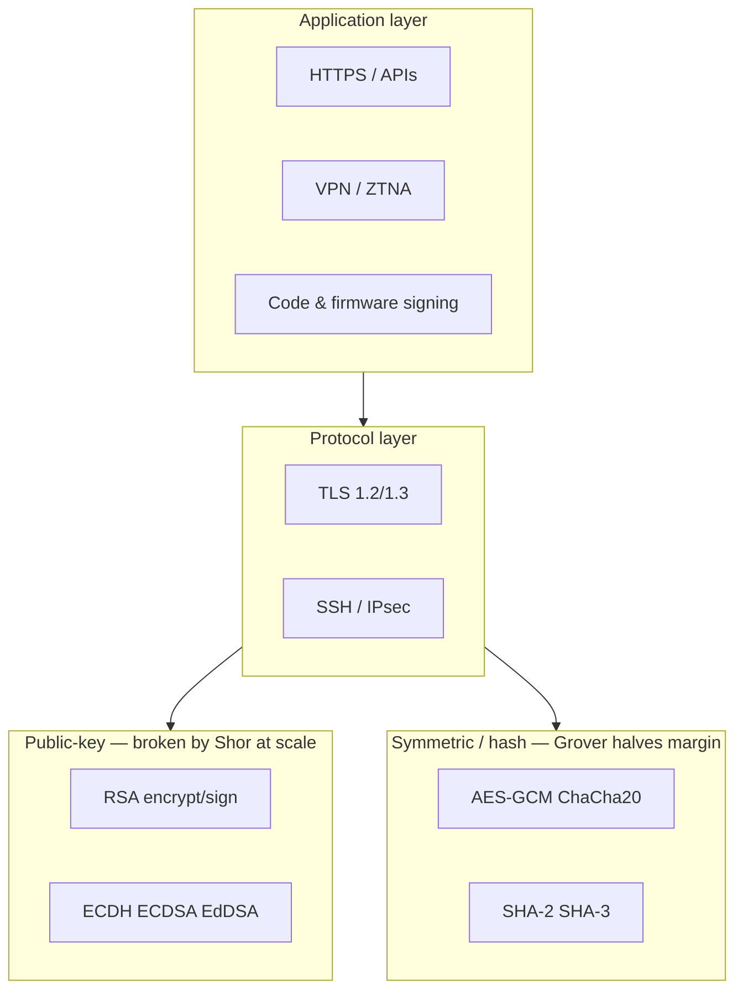
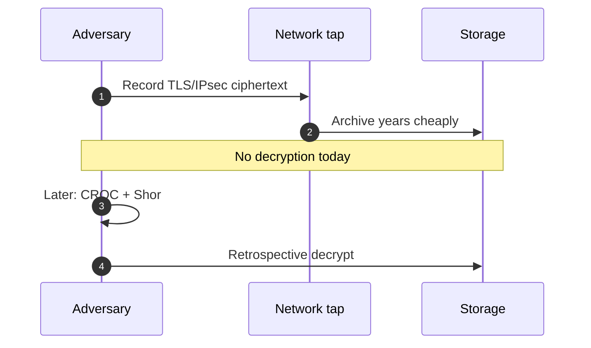
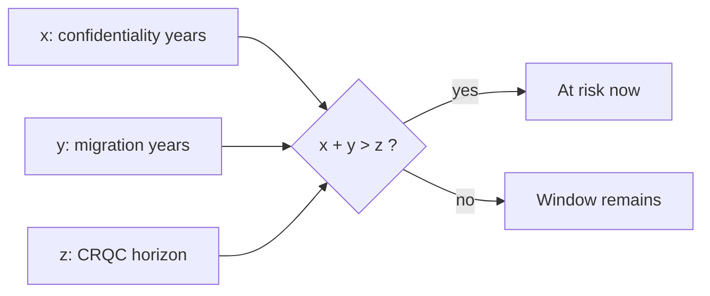

# Chapter 1: Cryptography and the Quantum Threat

We frame the quantum threat as a **migration and liability** problem for Indian and global digital infrastructure—not a science-fair project.

We begin with the societal layer because boards fund **risk stories**, not polynomial rings.

## 1.1 The Role of Cryptography in Modern Society

If you run security for a bank, a telco, or a government technology unit in India, you already live inside cryptography whether or not you employ cryptographers. Every `https` session, every software update signature, every VPN into a data centre, and every API token that gates a microservice assumes someone chose algorithms, key lengths, and rotation policies that still look sane five years from now. Our job in this chapter is to name what those choices are today—and which of them quantum computers eventually void.

**Figure 1.1 — Cryptographic trust stack under quantum attack**

*Figure 1.1 summarizes which layers Shor and Grover affect; we use it in every architecture review.*

Figure 1.1 is the map we reuse in architecture reviews: Shor's algorithm does not "weaken" RSA or elliptic-curve Diffie–Hellman—it removes the confidentiality and authentication guarantees those primitives were designed to provide, once a cryptographically relevant quantum computer (CRQC) exists. Grover's algorithm is different: it shrinks the effective strength of symmetric keys and hashes, which we answer by doubling key sizes, not by replacing AES.

When you open a site over TLS 1.3, the visible lock icon hides a negotiation most teams never instrument: the server authenticates with a certificate (today, usually RSA or ECDSA), the session keys are derived from a key exchange (today, often X25519 or P-256 ECDH), and only then does AES-GCM or ChaCha20-Poly1305 protect bulk data. In Indian payment and identity ecosystems, the same pattern appears inside API gateways, hardware security modules, and legacy middleware that still terminates TLS on RSA-2048. None of that is invisible to a patient recorder of ciphertext.

> **Author's note:** In discovery workshops we ask for three exports first: (1) TLS cipher suite scan of production endpoints, (2) code-signing and firmware-signing algorithms, (3) data-classification labels with **retention years**. Without those, PQC debates stay abstract.

The deployment scale is hard to overstate, but precise user counts matter less than **where keys live**. A single Kubernetes cluster may mount RSA TLS certificates from a commercial CA, use ECDSA image signatures, and call an HSM that still wraps keys with algorithms NIST now labels quantum-vulnerable. That stacking—not global internet statistics—is what makes migration a systems problem.

Modern public-key cryptography — the foundation of all these systems — relies on a remarkably small number of mathematical hard problems. Essentially, the security of the entire digital economy rests on the belief that three types of mathematical problems are computationally intractable for classical computers:

**Integer Factorization:** The RSA cryptosystem, invented in 1977 by Rivest, Shamir, and Adleman, bases its security on the difficulty of factoring the product of two large prime numbers. Given a number N = p × q where p and q are large primes (each typically 1024 bits or more), finding p and q is believed to require computational resources that grow exponentially with the size of N. The best known classical algorithm for this problem, the General Number Field Sieve (GNFS), has a running time of approximately L_N[1/3, (64/9)^(1/3)], which is sub-exponential but still renders factoring a 2048-bit RSA modulus completely infeasible with current technology. To put this in perspective, the largest RSA number ever factored (RSA-250, 829 bits) required approximately 2,700 CPU core-years of computation in 2020. Factoring a 2048-bit number is estimated to require computational resources equivalent to running all the world's computers simultaneously for longer than the age of the universe.

**The Discrete Logarithm Problem (DLP):** The Diffie-Hellman key exchange protocol and the Digital Signature Algorithm (DSA) base their security on the difficulty of computing discrete logarithms in finite groups. Given a generator g of a cyclic group G of order n, and a group element h = g^x, finding the exponent x is believed to be computationally hard when the group is chosen appropriately. In the multiplicative group of a prime field F_p, the best classical algorithms for DLP (the Number Field Sieve for discrete logarithms) have sub-exponential running time similar to factoring. The security relies on the one-way nature of modular exponentiation: computing g^x mod p is efficient (using square-and-multiply), but reversing this operation — finding x given g and h — is believed to be computationally intractable for properly chosen parameters.

**The Elliptic Curve Discrete Logarithm Problem (ECDLP):** Elliptic Curve Cryptography (ECC), introduced independently by Neal Koblitz and Victor Miller in 1985, operates over the group of rational points on an elliptic curve defined over a finite field. Given two points P and Q = kP on an elliptic curve (where kP means adding P to itself k times using the elliptic curve group law), finding the scalar k is the ECDLP. Unlike DLP in finite fields, no sub-exponential classical algorithm is known for ECDLP on properly chosen curves; the best classical attack is Pollard's rho algorithm with running time O(√n) where n is the group order. This fundamental advantage allows ECC to achieve equivalent security to RSA with dramatically smaller key sizes (a 256-bit ECC key provides security comparable to a 3072-bit RSA key), making ECC the preferred algorithm for mobile devices, IoT, and bandwidth-constrained applications.

These three problems have withstood decades of intense scrutiny from the world's best mathematicians and computer scientists. The mathematical community has developed deep confidence in their hardness on classical computers through half a century of cryptanalytic effort. This confidence underpins the entire global digital infrastructure. However, this confidence has a critical caveat: it applies only to classical computation. The advent of quantum computing threatens to fundamentally and irreversibly alter this landscape.

## 1.2 A Brief History of Public-Key Cryptography

To fully appreciate the significance of the quantum threat, it helps to understand how we arrived at our current cryptographic infrastructure and why replacing it is so challenging.

Before the 1970s, all practical cryptography was symmetric — both communicating parties needed to share the same secret key. Systems like the one-time pad (provably unbreakable but impractical for most uses) and cipher machines like Enigma (breakable, as Alan Turing demonstrated) all required pre-shared secrets. This created a fundamental chicken-and-egg problem for the emerging digital age: how do you securely share a key with someone you've never met, across an untrusted network, without any prior secure channel? The key distribution problem seemed insurmountable for the kind of open, global communication network that was beginning to emerge.

In 1976, Whitfield Diffie and Martin Hellman published their landmark paper "New Directions in Cryptography," introducing the revolutionary concept of public-key cryptography. They proposed that each party could have two mathematically related keys — a public key freely shared with the world, and a private key kept secret. Messages encrypted with the public key could only be decrypted with the corresponding private key. This asymmetry, based on the existence of mathematical one-way functions, was the conceptual breakthrough that made secure internet communication possible. Their paper also introduced the Diffie-Hellman key exchange protocol, allowing two parties to establish a shared secret over an insecure channel without any prior secret.

Just one year later, in 1977, Ron Rivest, Adi Shamir, and Leonard Adleman published the RSA cryptosystem — the first complete public-key encryption and signature scheme. RSA elegantly combined the concepts of public-key encryption and digital signatures using the mathematical structure of modular arithmetic and the hardness of factoring. The simplicity and elegance of RSA made it immediately practical, and it remains widely deployed nearly five decades later.

Throughout the 1980s and 1990s, the field of public-key cryptography flourished. ElGamal encryption (1985) provided an alternative to RSA based on discrete logarithms. Koblitz and Miller independently proposed elliptic curve cryptography (1985), offering equivalent security with smaller keys. The Digital Signature Algorithm (DSA) was proposed by NIST in 1991 and standardized as FIPS 186 in 1994. Various key agreement protocols, zero-knowledge proofs, and advanced cryptographic constructions were developed.

By the late 1990s and early 2000s, public-key cryptography was deeply embedded in the internet's infrastructure. SSL/TLS became ubiquitous for web security. SSH replaced telnet for remote access. S/MIME and PGP provided email encryption. IPsec and VPN technologies secured enterprise networks. Certificate Authorities issued millions of digital certificates. The entire Public Key Infrastructure (PKI) ecosystem grew to support global digital commerce.

Yet throughout all this development, essentially every deployed public-key system relied on one of three mathematical problems: factoring (RSA), discrete logarithms in finite fields (DH, DSA, ElGamal), or discrete logarithms on elliptic curves (ECDH, ECDSA). This convergence — driven by the mathematical elegance and well-understood security of these problems — created a hidden systemic vulnerability. If any single class of these problems became efficiently solvable, vast swaths of the global digital infrastructure would simultaneously become insecure.

This is precisely what quantum computing threatens to do.

## 1.3 The Quantum Computing Revolution

Quantum computing represents a fundamentally different paradigm of information processing, rooted in the counterintuitive laws of quantum mechanics. While classical computers manipulate bits that are definitively in one of two states (0 or 1), quantum computers use quantum bits — qubits — that can exist in coherent superpositions of both states simultaneously. Through the quantum mechanical phenomena of superposition, entanglement, and interference, quantum computers can explore certain computational spaces exponentially more efficiently than any known classical algorithm.

The concept of quantum computation was first proposed by the legendary physicist Richard Feynman in 1981 at a conference at MIT. Feynman observed that accurately simulating quantum mechanical systems appeared to require exponential resources on classical computers — the Hilbert space of even a modest quantum system grows exponentially with the number of particles. He proposed that perhaps a computer operating according to quantum mechanical principles might be fundamentally more powerful for such simulations. This insight suggested that quantum mechanics might offer computational resources beyond what classical physics allows.

In 1985, David Deutsch at Oxford University formalized the concept of a universal quantum computer and proved that it could simulate any physical process efficiently, providing the theoretical foundation for quantum computation as a discipline. Through the early 1990s, quantum computing remained primarily a theoretical curiosity, with no clear killer application that would justify the enormous engineering challenges of building quantum hardware.

The critical turning point for both quantum computing and cryptography came in 1994, when Peter Shor, then at AT&T Bell Labs, discovered a quantum algorithm that solves both the integer factorization problem and the discrete logarithm problem in polynomial time. This single paper — arguably the most consequential algorithm discovery since the Fast Fourier Transform — demonstrated that a sufficiently powerful quantum computer would completely break RSA, Diffie-Hellman, DSA, ECDSA, ECDH, and essentially every widely deployed public-key cryptosystem. The publication electrified both the quantum computing and cryptography communities, providing quantum computing with its first clear "killer application" while simultaneously threatening the foundations of digital security.

Two years later, in 1996, Lov Grover at Bell Labs discovered another important quantum algorithm, this one providing a quadratic speedup for unstructured search problems. While less dramatic than Shor's exponential speedup, Grover's algorithm has significant implications for symmetric cryptography and hash functions, effectively halving their security levels.

The development of quantum computing hardware has accelerated dramatically in recent years, transforming from academic curiosity to major industrial and national priority. What follows is a timeline of key milestones illustrating this acceleration:

In 1998, the first 2-qubit quantum computer was demonstrated at Oxford, performing a simple quantum algorithm. In 2001, IBM researchers used a 7-qubit nuclear magnetic resonance (NMR) quantum computer to factor the number 15 using Shor's algorithm — a proof of concept with no practical significance but enormous symbolic importance. For the next 15 years, progress was steady but slow, limited by the extraordinary difficulty of maintaining quantum coherence and controlling quantum systems.

The pace then accelerated dramatically. In 2016, IBM made a 5-qubit quantum computer available via the cloud (IBM Quantum Experience), democratizing access to quantum hardware. In 2017, IBM demonstrated a 50-qubit processor. In 2019, Google announced "quantum supremacy" — their 53-qubit Sycamore processor performed a specific computation in 200 seconds that Google estimated would take the world's fastest classical supercomputer approximately 10,000 years. While the claim was debated (IBM argued classical simulation was possible in days), the demonstration marked a clear milestone.

In 2022, IBM unveiled its 433-qubit Osprey processor. In 2023, IBM announced the 1,121-qubit Condor processor and published a roadmap targeting 100,000+ qubits by 2033. Atom Computing demonstrated a 1,180-qubit neutral atom system. In 2024, multiple companies demonstrated quantum error correction at meaningful scales, with Harvard/QuEra demonstrating 48 logical qubits and Google achieving below-threshold error rates in their surface code experiments. By 2025-2026, systems with dozens to hundreds of logical qubits are operational for specialized tasks, and several companies have demonstrated the ability to run circuits of increasing depth and complexity.

The quantum computing industry has attracted enormous investment. IBM, Google, Microsoft, Amazon, Intel, and numerous well-funded startups (IonQ, Quantinuum, Rigetti, QuEra, Pasqal, PsiQuantum, Xanadu) are all pursuing quantum computing. The industry is characterized by multiple competing hardware approaches:

**Superconducting qubits** (IBM, Google, Rigetti) use tiny circuits cooled to near absolute zero (approximately 15 millikelvin), where electrical current flows without resistance and quantum effects can be controlled. These systems offer fast gate operations (nanoseconds) and leverage existing semiconductor fabrication infrastructure, but require enormous dilution refrigerators and have limited qubit connectivity.

**Trapped ion qubits** (IonQ, Quantinuum) use individual ions suspended in electromagnetic traps, with quantum information encoded in their electronic states. These systems offer the highest gate fidelities, long coherence times, and all-to-all connectivity, but operate more slowly (microseconds per gate) and face challenges in scaling to large numbers.

**Neutral atom qubits** (QuEra, Pasqal, Atom Computing) use individual neutral atoms held in optical tweezers, offering large qubit counts, flexible geometry, and native multi-qubit gates through Rydberg interactions.

**Photonic qubits** (Xanadu, PsiQuantum) encode quantum information in properties of light (photons), offering room-temperature operation and natural compatibility with optical networks, but requiring probabilistic entanglement and photon loss management.

**Topological qubits** (Microsoft) aim to encode quantum information in exotic quantum states (anyons) that are inherently protected from noise, but the underlying physics (Majorana fermions) has proven extremely challenging to realize experimentally.

This diversity of approaches increases confidence that quantum computing will eventually achieve scale. Each approach has different strengths and challenges, and progress on any one of them could lead to cryptographically relevant machines. The global investment in quantum computing now exceeds $35 billion cumulatively across public and private sectors. China, the United States, the European Union, Japan, South Korea, Australia, Canada, India, and numerous other nations have established major quantum computing programs as strategic national priorities. This level of sustained, multi-national investment makes the eventual achievement of cryptographically relevant quantum computers a near-certainty.

A crucial concept for understanding the path from today's quantum hardware to a cryptographically relevant machine is the distinction between physical qubits and logical qubits. Physical qubits are the individual quantum systems (superconducting circuits, trapped ions, neutral atoms, etc.) that hardware engineers build and control. These physical qubits are inherently noisy — affected by decoherence, thermal fluctuations, control errors, and crosstalk with neighboring qubits. Error rates for current physical qubits range from approximately 0.1% to 1% per gate operation, which is far too high for running algorithms that require billions of sequential operations.

Quantum error correction (QEC) addresses this fundamental problem by encoding a single "logical" qubit across many physical qubits in a redundant fashion, enabling the detection and correction of errors without collapsing the quantum state. The most widely studied approach, the surface code, encodes one logical qubit using a two-dimensional grid of physical qubits with nearest-neighbor interactions. The overhead is substantial: achieving a logical error rate of 10^-12 (needed for running Shor's algorithm on a 2048-bit RSA modulus) with physical error rates of 10^-3 requires roughly 1,000 to 5,000 physical qubits per logical qubit, depending on the specific implementation and distance of the code.

This error correction overhead is why estimates for cryptographically relevant machines cite millions of physical qubits despite needing only thousands of logical qubits. The engineering challenge extends beyond simply fabricating millions of qubits — each qubit must be individually addressable, controllable, and readable out with high fidelity, the control electronics must operate at cryogenic temperatures or interface precisely with laser systems, and the entire system must maintain calibration across millions of components simultaneously. The classical control hardware alone — the waveform generators, digitizers, and feedback systems — represents an engineering challenge comparable to building a supercomputer. Companies are actively developing cryogenic CMOS controllers to place the classical electronics closer to the qubits, reducing wiring complexity but introducing new thermal management challenges.

Despite these formidable engineering hurdles, the trajectory is clear. Error rates have improved by roughly an order of magnitude every few years across multiple platforms. Qubit counts have grown exponentially. New error correction codes — particularly quantum Low-Density Parity-Check (LDPC) codes — promise to dramatically reduce the physical-to-logical qubit ratio, potentially by factors of 10 or more compared to the surface code. Each individual improvement in error rates, qubit counts, connectivity, or error correction efficiency compounds, accelerating the timeline toward cryptographic relevance.

## 1.4 The "Harvest Now, Decrypt Later" Threat

Perhaps the most urgent and underappreciated aspect of the quantum threat is the "Harvest Now, Decrypt Later" (HNDL) attack model, also sometimes called "store now, decrypt later" or "retrospective decryption." This concept fundamentally changes the timeline of quantum risk from a future concern to a present emergency.

> **Author's note:** HNDL is the budget unlocker—archived TLS still matters years later. Budget for hybrid KEX on long-retention paths first.

**Figure 1.2 — Harvest now, decrypt later (HNDL)**

*Figure 1.2 is the threat model we use when arguing for hybrid KEX before CRQC exists.*

The HNDL attack operates on a simple but devastating logic: adversaries intercept and store encrypted communications today, while they are computationally protected by current cryptographic algorithms. These communications remain indecipherable using today's computing resources. However, the adversaries store the captured ciphertext indefinitely — storage is cheap and getting cheaper. When quantum computers capable of running Shor's algorithm at cryptographic scale eventually become available, the adversaries retrieve their stored ciphertexts and decrypt them, exposing secrets that may still be sensitive years or decades after their original transmission.

This is not a theoretical attack model. It is widely understood within the intelligence community that nation-state actors — particularly those with both strong signals intelligence capabilities and active quantum computing programs — are actively conducting HNDL operations at scale. The infrastructure required is not exotic: submarine cable taps, mirrors at internet exchange points, cooperation with telecommunications providers, and massive data centers for storage. All of these capabilities have been documented to exist through various disclosures and investigative journalism.

The Snowden revelations of 2013 confirmed what security researchers had long suspected: intelligence agencies routinely intercept internet backbone traffic at massive scale. Programs like the NSA's UPSTREAM (which taps fiber optic cables) and PRISM (which collects data from major internet companies) demonstrate the capability to capture and store encrypted communications at enormous volume. While these programs were disclosed in the context of classical surveillance, the same infrastructure serves perfectly for HNDL operations — the encrypted data that cannot be read today is simply retained for future quantum decryption.

The economics of HNDL are compelling from an adversary's perspective. The cost of data storage has decreased exponentially over decades (roughly halving every two years). A petabyte of enterprise storage costs under $20,000. An intelligence agency could store years of intercepted communications from a targeted organization for a trivial fraction of its budget. When quantum computers eventually enable decryption, the return on this modest storage investment could be enormous — access to years of diplomatic communications, intelligence assessments, business strategies, or military plans.

The HNDL threat is particularly severe for data with long-term confidentiality requirements. Consider the following categories:

**Government Classified Information:** In the United States, classified information may remain classified for 25 years under standard rules, with extensions to 50 or 75 years for particularly sensitive material. Some categories (nuclear weapons design, intelligence sources and methods) may remain classified indefinitely. Diplomatic communications, covert operations, intelligence assessments, and military strategies all fall into this category. If encrypted communications containing such information are captured today and decrypted in 15 years, the damage could be severe — revealing intelligence sources, compromising ongoing operations, or providing strategic advantage to adversaries.

**Medical Records and Genetic Data:** Patient health information is protected under privacy regulations (HIPAA in the US, GDPR in the EU) with effectively unlimited duration. Genetic information is particularly concerning because it is immutable — your DNA sequence will be relevant to you and your descendants indefinitely. Mental health records, HIV status, reproductive health information, addiction treatment records, and other sensitive medical data could cause devastating personal harm if exposed decades after creation.

**Financial Records and Trade Secrets:** Corporate trade secrets, merger and acquisition plans, proprietary trading algorithms, negotiation strategies, and competitive intelligence retain their sensitivity for years to decades. Even after a deal closes, knowledge of negotiation positions could affect future dealings. Pharmaceutical research data (worth billions) remains proprietary throughout the patent lifecycle and beyond. Leaked financial communications could enable insider trading even years after the original transactions.

**Intellectual Property and Research:** Patent applications contain detailed technical information that must remain confidential until filing. Research data in academia and industry represents years of investment. Proprietary algorithms, manufacturing processes, and chemical formulations are corporate crown jewels. Early-stage startup ideas and business plans could be stolen through retrospective decryption.

**Critical Infrastructure and National Security Plans:** Designs for nuclear power plants, military installations, communications networks, water treatment facilities, electrical grids, and transportation systems remain sensitive for the entire operational lifetime of the infrastructure — often 50-100 years. Knowledge of specific vulnerabilities in these systems could enable catastrophic attacks decades into the future.

**Personal Communications:** Private conversations — between spouses, between patients and doctors, between journalists and sources, between activists and lawyers, between whistleblowers and investigators — could be exposed to embarrassment, blackmail, persecution, or violence if decrypted years later. The chilling effect on free communication is itself a harm, even before any actual decryption occurs. Individuals who are private citizens today may become public figures in the future, making their historical private communications suddenly newsworthy.

**Legal Proceedings:** Attorney-client privilege, sealed court records, witness protection information, grand jury proceedings, and settlement agreements all require long-term confidentiality. The integrity of the legal system depends on the reliability of these protections.

The geopolitical dimension of HNDL cannot be overstated. The nations with the most advanced quantum computing programs — the United States, China, Russia, and several European nations — are also those with the most sophisticated signals intelligence capabilities and the strongest motivations for espionage. China's quantum computing efforts are particularly notable: the nation has invested over $15 billion in quantum research, operates the world's longest quantum communication network (the Beijing-Shanghai backbone), and has demonstrated quantum computational advantages with both superconducting (Zuchongzhi) and photonic (Jiuzhang) systems. Chinese intelligence services have been linked to numerous large-scale cyber intrusions targeting government agencies, defense contractors, and technology companies — providing both the access to intercept encrypted communications and the strategic motivation to store them for future decryption.

Russia presents a similar concern. Despite a somewhat smaller quantum computing program, Russian intelligence services are known for sophisticated cyber operations and long-term strategic patience. The SVR's compromise of SolarWinds (discovered in 2020) demonstrated the capability to maintain persistent access to sensitive networks for extended periods. Such access would be ideal for conducting HNDL collection against high-value targets.

Organizations must also consider the "mosaic" nature of the HNDL threat: even individually innocuous communications can reveal sensitive patterns when analyzed in bulk over long time periods. An adversary who decrypts years of an organization's email traffic gains not just individual secrets but a comprehensive understanding of decision-making processes, organizational relationships, personnel vulnerabilities, and strategic priorities — intelligence that is valuable regardless of whether any single message contains classified information.

The response to HNDL requires a fundamental shift in how organizations think about cryptographic urgency. Unlike most cybersecurity threats where the harm is immediate and visible (ransomware, data breaches, denial of service), HNDL is silent, invisible, and non-disruptive at the time of collection. There is no alarm, no incident response, no indicator of compromise. The data simply moves from the wire to an adversary's archive, waiting. This invisibility makes HNDL uniquely difficult to motivate action against — leaders struggle to allocate resources to defend against a threat that produces no observable harm today. Yet this is precisely why early action is critical: by the time the harm becomes visible (when quantum computers enable decryption), it will be far too late to protect communications that were transmitted years earlier.

The mathematical framework for assessing HNDL risk was formalized by Professor Michele Mosca of the University of Waterloo in what is now known as Mosca's inequality or Mosca's theorem. Mosca defined three variables:

- **x** = the security shelf life of the data (how many years it must remain confidential)
- **y** = the migration time (how many years it will take to deploy quantum-resistant encryption)
- **z** = the threat timeline (how many years until a cryptographically relevant quantum computer exists)

Mosca's key insight: if **x + y > z**, then the organization is already at risk. Data that needs to remain secret for x years, transmitted today using vulnerable encryption that will take y years to replace, is already compromised if a CRQC arrives in fewer than x + y years.

For many organizations, realistic values are:
- x = 15-50 years (classified information, medical records, infrastructure plans)
- y = 5-15 years (realistic migration timeline for complex organizations)
- z = 10-20 years (estimated CRQC arrival, with high uncertainty)

Even using moderate estimates, x + y (20-65 years) likely exceeds z (10-20 years) for most organizations handling sensitive information. This mathematical reality means that for many data categories, the HNDL threat is not a future risk — it is a present one.

## 1.5 Defining the Quantum Threat Timeline

The question of when a cryptographically relevant quantum computer (CRQC) will exist is perhaps the most important — and most uncertain — question in modern technology risk assessment. The answer determines the urgency of PQC migration, the allocation of resources, and the acceptable level of residual risk during transition.

**Figure 1.3 — Mosca inequality (planning)**

*Use Figure 1.3 when prioritizing systems: if x + y > z, migration is already late for that data class.*

### Expert Estimates and Surveys

The Global Risk Institute (GRI) at the University of Waterloo conducts annual surveys of quantum computing experts worldwide. Their most recent surveys show the following distribution of expert opinion:

- Approximately 25-30% of surveyed experts believe there is a greater than 30% chance of a CRQC within 10 years
- Approximately 50-60% believe there is a greater than 30% chance within 15 years
- Over 75% believe there is a greater than 30% chance within 20 years
- Only about 10-15% believe the timeline extends beyond 30 years

These estimates have been shifting earlier over time, reflecting accelerating hardware progress and algorithmic improvements that reduce resource requirements.

The RAND Corporation, the MITRE Corporation, and various national science advisories have published independent assessments. A common finding is that while the "median" estimate centers around 15-20 years, the distribution has a significant left tail — there is a non-trivial probability of CRQCs arriving significantly earlier than the median estimate, particularly if unexpected breakthroughs occur.

### Technical Requirements Analysis

To factor a 2048-bit RSA modulus using Shor's algorithm with current best-known circuit constructions:
- **Logical qubits needed:** Approximately 4,000-6,000 (depending on the specific implementation)
- **T-gate depth:** Approximately 10^10 (the dominant cost in fault-tolerant quantum computing)
- **Physical qubits needed:** With surface code error correction at current error rates, approximately 4-20 million physical qubits
- **Wall-clock time:** Hours to days once the machine is operational

Recent algorithmic optimizations have continued to reduce these requirements. Gidney and Ekerå (2021) showed that 2,048 + 2 logical qubits suffice using windowed arithmetic techniques. Other researchers have found space-time trade-offs that reduce either qubit count or circuit depth at the expense of the other.

Current quantum hardware (2025-2026) provides:
- Physical qubit counts: 1,000-5,000 (superconducting), 50-100 (trapped ions)
- Two-qubit gate error rates: approximately 10^-3 (superconducting), 10^-4 (trapped ions)
- Demonstrated logical qubits: Dozens (with high-fidelity error correction)
- Coherence times: Milliseconds (superconducting) to seconds (trapped ions)

The gap between current capabilities and CRQC requirements is still significant (roughly 3-4 orders of magnitude in qubit count, with several orders of magnitude improvement needed in error rates for practical error correction), but the rate of improvement has been consistently exponential across multiple hardware platforms.

### Risk Factors That Could Accelerate the Timeline

Several factors could cause CRQCs to arrive earlier than consensus estimates:

1. **Classified programs:** Military and intelligence programs may be years ahead of publicly known capabilities. China's quantum program, in particular, publishes selectively and may have capabilities not reflected in the open literature.

2. **Algorithmic breakthroughs:** New quantum algorithms or improvements to Shor's algorithm could dramatically reduce resource requirements. The factoring algorithm has been improved several times since 1994.

3. **Error correction innovations:** Novel error correction codes or architectures (like quantum LDPC codes) could reduce the physical-to-logical qubit ratio by orders of magnitude.

4. **Hardware breakthroughs:** A fundamentally new qubit technology, or the successful realization of topological qubits, could leap past current scaling barriers.

5. **Manufacturing advances:** If quantum computers can be manufactured at semiconductor-industry scale, the scaling challenge becomes primarily economic rather than scientific.

### Dealing with Deep Uncertainty

A fundamental challenge in quantum threat assessment is that the uncertainty is not merely statistical but epistemic — we are not dealing with well-characterized probability distributions but with genuine ignorance about future scientific breakthroughs. The timeline estimates from expert surveys should be interpreted with great caution: experts are drawing on their experience with current technological trajectories, but paradigm-shifting discoveries (a new qubit technology, a dramatic algorithmic improvement, or a breakthrough in error correction) could invalidate extrapolations based on current progress rates.

Historical precedent from other technology domains suggests that expert consensus often underestimates the speed of transformative technologies in their exponential growth phase. Semiconductor scaling consistently exceeded predictions in the early decades of Moore's Law. Machine learning capabilities have repeatedly exceeded expert timelines in recent years. In quantum computing itself, achievements like Google's 2019 quantum supremacy demonstration arrived earlier than many experts predicted just five years prior.

Organizations should adopt a risk management approach that acknowledges this deep uncertainty rather than relying on point estimates. This means planning for a range of scenarios:

**Best case (CRQC in 25+ years):** Migration proceeds at a comfortable pace; organizations have ample time for testing, standardization, and gradual deployment. The cost of early preparation is merely opportunity cost — resources that could have been spent elsewhere.

**Moderate case (CRQC in 12-18 years):** Organizations that began migration planning in 2024-2026 complete their transitions in time. Those that delayed face increasingly compressed and expensive migration timelines. Some data transmitted before migration completion is compromised via HNDL.

**Worst case (CRQC in 7-10 years):** Only organizations with aggressive migration programs complete the transition before quantum computers enable mass decryption. Vast quantities of historically intercepted data become readable. Critical infrastructure systems that cannot be quickly updated face operational risk.

**Black swan scenario (classified CRQC already exists or arrives within 5 years):** While considered unlikely by most experts, this scenario is not impossible given the opacity of classified military programs. In this scenario, the damage from HNDL is already done for unprotected communications, and only organizations that deployed PQC earliest preserve any confidentiality for recent traffic.

The rational organizational response is to plan for the moderate case while ensuring the infrastructure flexibility to accelerate if indicators suggest the worst case is materializing. This is analogous to insurance purchasing: organizations do not wait for certainty that a disaster will occur before buying coverage. The quantum threat is a low-probability, catastrophically-high-impact risk that demands proactive mitigation precisely because its timing cannot be predicted with confidence.

### The Asymmetry of Risk

A crucial insight for decision-makers is that the consequences of the quantum threat are profoundly asymmetric:

- **If we migrate to PQC too early:** The cost is engineering effort, modest performance overhead, and some bandwidth increase. These costs are manageable and temporary.
- **If we migrate too late:** The consequences could be catastrophic and irreversible — exposure of decades of sensitive communications, compromise of critical infrastructure, theft of intellectual property worth billions, and potential national security breaches.

This asymmetry strongly favors conservative action: beginning PQC migration immediately is the rational response even if the CRQC timeline is uncertain. The cost of being "too early" is far less than the cost of being "too late."

## 1.6 What is Post-Quantum Cryptography?

**Post-Quantum Cryptography (PQC)**, also referred to as quantum-resistant cryptography or quantum-safe cryptography, is the field dedicated to developing cryptographic algorithms that remain secure against attacks by both classical and quantum computers. A critical distinction must be emphasized: PQC algorithms run on classical computers using existing hardware. They do not require quantum hardware, quantum channels, or any quantum technology whatsoever.

PQC achieves quantum resistance by basing cryptographic constructions on mathematical problems for which no efficient quantum algorithm is known, and for which there are strong theoretical reasons to believe no such algorithm exists. While Shor's algorithm provides exponential speedups for problems with specific algebraic structure (the Hidden Subgroup Problem over abelian groups, which includes factoring and discrete logarithms), it does not provide speedups for arbitrary computational problems. Many mathematical problems remain computationally hard even for quantum computers.

The key insight is that Shor's algorithm exploits a very specific mathematical structure: the periodicity of modular exponentiation (for factoring) and the structure of finite abelian groups (for discrete logarithms). Problems that do not have this particular algebraic structure are not accelerated by Shor's algorithm. The known quantum speedup for unstructured problems is limited to Grover's quadratic improvement, which is manageable by simply doubling key sizes.

It is essential to distinguish PQC from related but distinct concepts:

**Quantum Key Distribution (QKD):** QKD uses quantum mechanical properties — specifically, the no-cloning theorem and the fundamental disturbance caused by quantum measurement — to detect eavesdropping on a key distribution channel. QKD provides information-theoretic security (provably unbreakable regardless of the adversary's computational power) for the specific task of key distribution. However, QKD has severe practical limitations: it requires dedicated quantum hardware (single-photon sources, quantum detectors), a direct quantum channel (typically dedicated fiber optic cable), is limited in range (approximately 100 km without quantum repeaters, which do not yet exist at scale), cannot authenticate communicating parties by itself (requiring classical or PQC authentication), and cannot provide digital signatures, key encapsulation, or other essential cryptographic functions. QKD is a complement to PQC for ultra-high-security point-to-point links, not a replacement for PQC in general-purpose cryptography.

**Quantum Random Number Generation (QRNG):** QRNG devices exploit the fundamental randomness of quantum mechanics (e.g., single-photon detection events, vacuum state fluctuations) to generate truly random numbers. While high-quality randomness is important for cryptographic key generation, QRNG by itself does not protect against quantum attacks on public-key cryptography. It is an enabling technology that can strengthen any cryptographic system (classical or PQC) by providing superior entropy sources.

**Quantum-Enhanced Cryptography:** Some research explores using quantum computers or quantum communication to perform cryptographic operations (quantum oblivious transfer, quantum money, quantum homomorphic encryption). These are theoretical constructions requiring quantum hardware and are distinct from PQC's goal of providing quantum resistance using only classical resources.

The five major families of PQC algorithms, each based on distinct mathematical foundations, are:

**Lattice-Based Cryptography:** Based on the hardness of finding short vectors in high-dimensional lattices, specifically the Learning With Errors (LWE) problem and its structured variants (Ring-LWE, Module-LWE). This family provides both key encapsulation mechanisms and digital signatures. The NIST-standardized ML-KEM (FIPS 203) and ML-DSA (FIPS 204) are both lattice-based. Lattice cryptography offers the best balance of security, performance, and versatility, and also enables advanced constructions like fully homomorphic encryption. The underlying hard problems have been studied for over 30 years with no significant quantum speedups discovered.

**Code-Based Cryptography:** Based on the hardness of decoding random linear error-correcting codes (the syndrome decoding problem). The McEliece cryptosystem (1978) is the oldest PQC proposal and has never been broken despite nearly 50 years of analysis. Code-based schemes offer extremely fast operations but suffer from very large public keys. HQC (Hamming Quasi-Cyclic) has been selected by NIST for additional standardization as a code-based KEM, providing algorithmic diversity from lattice-based ML-KEM.

**Hash-Based Signatures:** Based solely on the security properties of cryptographic hash functions (one-wayness, collision resistance). These signatures have the most minimal and conservative security assumptions — if your hash function is secure, the scheme is secure. NIST standardized SLH-DSA (FIPS 205) as a stateless hash-based signature, and previously standardized stateful schemes XMSS and LMS in SP 800-208. Hash-based signatures serve as the "insurance policy" — if unexpected weaknesses are found in lattice-based schemes, hash-based signatures remain secure.

**Multivariate Polynomial Cryptography:** Based on the hardness of solving systems of multivariate quadratic (MQ) polynomial equations over finite fields. The MQ problem is NP-hard, and no quantum speedup beyond Grover's quadratic improvement is known. UOV (Unbalanced Oil and Vinegar) is the primary surviving scheme and is under NIST evaluation for additional standardization. However, this family has seen several schemes broken during the NIST process (notably Rainbow in 2022), reducing confidence somewhat.

**Isogeny-Based Cryptography:** Based on the hardness of computing isogenies (structure-preserving maps) between elliptic curves. This family offered the smallest key sizes of any PQC approach. However, the primary scheme SIKE (Supersingular Isogeny Key Encapsulation) was devastatingly broken in 2022 by a polynomial-time attack. Remaining schemes (CSIDH, SQISign) survive but face various challenges. This family serves as a cautionary tale about the risks of newer mathematical foundations.

> **Author's note:** Vendor refresh cycles dominate Indian timelines more than qubit counts.

> **Author's note:** Indian programs slip on vendor HSM roadmaps more than on lattice theory.

## 1.7 The Scale of the Migration Challenge

The transition to post-quantum cryptography represents one of the most significant coordinated technology transformations in the history of computing. The scope is immense because cryptography is not merely a "feature" that can be updated in isolation — it is deeply embedded in virtually every layer of the technology stack, from hardware circuits to application protocols to organizational processes.

**Network Protocol Layer:** Every implementation of TLS (Transport Layer Security), SSH (Secure Shell), IPsec/IKE (Internet Protocol Security), DTLS (Datagram TLS), QUIC (Google's transport protocol, now standardized), WireGuard, OpenVPN, and dozens of other network security protocols must be updated. This includes billions of devices: web servers, application servers, load balancers, CDN edge nodes, reverse proxies, VPN concentrators, firewalls, intrusion detection systems, mail servers, DNS servers, and more. Each of these implementations comes from different vendors, uses different cryptographic libraries, and has different update mechanisms.

**Cryptographic Library Layer:** The foundational libraries that implement cryptographic algorithms — OpenSSL, BoringSSL, LibreSSL, NSS, GnuTLS, wolfSSL, mbedTLS, Bouncy Castle, libsodium, and many others — must all add PQC algorithm support. This requires not just implementing the algorithms but ensuring constant-time execution, side-channel resistance, memory safety, and correctness across all supported platforms. Each library update then needs to propagate to all dependent applications.

**Application Layer:** Every application that uses cryptography must adopt PQC. This includes web browsers (Chrome, Firefox, Safari, Edge), email clients (Outlook, Thunderbird, Apple Mail), messaging applications (Signal, WhatsApp, iMessage), database systems (MySQL, PostgreSQL, MongoDB), cloud services (AWS, Azure, GCP), code signing tools, PDF signing, document encryption, password managers, VPN clients, cryptocurrency wallets, and thousands of specialized applications. Each application may need changes beyond simple library updates — data format changes, key storage modifications, protocol version negotiations.

**Infrastructure Layer:** Certificate Authorities must develop the ability to issue PQC certificates with new algorithm OIDs and potentially larger certificate formats. DNS systems must support PQC in DNSSEC (where signature sizes are particularly problematic). Key management systems, both hardware (HSMs, TPMs) and software (KMS, key vaults), must handle PQC key types. Identity and access management systems (Active Directory, LDAP, SAML, OAuth, OpenID Connect) must adapt to PQC credentials. Time-stamping authorities must use PQC signatures.

**Hardware Layer:** This may be the most challenging layer. Embedded devices, IoT sensors, smart meters, smart cards, credit card chips, automotive Electronic Control Units (ECUs), industrial Programmable Logic Controllers (PLCs), medical device implants, satellite communication systems, and military hardware all contain fixed cryptographic implementations that may not be upgradeable. Some of these devices have 15-30 year operational lifetimes. Devices manufactured today without PQC capability may become security liabilities long before their operational life ends. Hardware Security Modules (HSMs) — the most security-critical hardware in many organizations — require firmware updates or hardware replacement for PQC support.

**Data Layer:** Historical data encrypted with quantum-vulnerable algorithms cannot be retroactively protected from HNDL attacks — if it has already been captured, it will eventually be decryptable. Future data must be encrypted with PQC. Stored data encrypted for long-term confidentiality should be re-encrypted with PQC algorithms where feasible. Database encryption, file system encryption, backup encryption, and archival systems all need updating.

**Organizational Layer:** People must be trained. Software developers need to understand PQC APIs and secure implementation practices. Security engineers need to understand PQC algorithm properties and selection criteria. System administrators need to manage PQC certificates and keys. Executive leadership needs to understand the risk and allocate resources. Procurement processes need to require PQC support. Compliance frameworks need updating. Audit procedures must verify PQC deployment.

**Interoperability and Testing:** Perhaps the least appreciated challenge is interoperability — ensuring that PQC implementations from different vendors, in different languages, on different platforms, all work correctly together. Cryptographic interoperability bugs have historically been a rich source of vulnerabilities (protocol downgrade attacks, implementation-specific parsing errors, incompatible encoding assumptions). With PQC, interoperability testing is complicated by the proliferation of algorithm variants, parameter sets, encoding formats, and hybrid combinations. A TLS client using one library's ML-KEM implementation must negotiate successfully with servers using different implementations, potentially across different versions of the draft or final specifications. The IETF standardization process for PQC in protocols (TLS 1.3, SSH, IKEv2, X.509 certificates) introduces additional complexity: protocol-level decisions about how to integrate PQC algorithms — where hybrid keys are placed in handshake messages, how certificates chain with mixed algorithm types, how backward compatibility is maintained with non-PQC peers — all create potential interoperability failure points.

**Crypto Agility:** The PQC transition has elevated "crypto agility" from a best practice to an essential architectural requirement. Crypto agility refers to the ability of a system to rapidly switch between cryptographic algorithms without major redesign or redeployment. The need is clear: PQC algorithms are newer and less battle-tested than their classical predecessors. While NIST's standardization process involved extensive cryptanalysis, the history of cryptography includes numerous examples of algorithms believed to be secure that were later broken (MD5, SHA-1, RC4, DES, and most recently SIKE in the PQC context itself). If a deployed PQC algorithm is found vulnerable, organizations need the ability to swap it out rapidly. Systems designed with hardcoded algorithm choices, fixed key sizes, and inflexible protocol structures will face expensive and dangerous emergency migrations. Conversely, systems designed with abstraction layers, algorithm negotiation, and modular cryptographic backends can adapt to algorithm changes as routine configuration updates rather than emergency engineering projects.

**Performance and Bandwidth Impacts:** The performance characteristics of PQC algorithms present real operational challenges that go beyond simple benchmarks. ML-KEM public keys (800 bytes for ML-KEM-512, 1,184 bytes for ML-KEM-768) are significantly larger than ECDH public keys (32-33 bytes), directly impacting TLS handshake sizes and connection establishment latency. ML-DSA signatures (2,420 bytes for ML-DSA-44) dwarf ECDSA signatures (64 bytes), creating serious challenges for certificate chains where multiple signatures are transmitted in each handshake. For bandwidth-constrained environments — IoT networks, satellite links, embedded automotive systems — these size increases can exceed protocol MTU limits, triggering fragmentation and degrading performance. Organizations must conduct thorough performance testing under realistic network conditions, measuring not just algorithm speed but end-to-end protocol behavior including connection setup time, certificate validation latency, and throughput under load.

The magnitude of this challenge significantly exceeds previous cryptographic transitions. When the industry moved from 3DES to AES, only the symmetric cipher changed — key sizes, protocol formats, and infrastructure remained largely the same. When RSA key sizes were increased from 1024 to 2048 bits, the algorithm was the same — just larger parameters. The PQC transition involves entirely new algorithm families with fundamentally different characteristics: much larger keys, different computational profiles, new implementation pitfalls, and sometimes radically different protocol interactions.

## 1.8 Historical Precedents for Cryptographic Transitions

Previous cryptographic transitions provide valuable lessons, though the PQC migration exceeds all of them in scope and complexity:

**DES to AES (1997-2005):** When the Data Encryption Standard's 56-bit key became vulnerable to brute-force attacks in the late 1990s (the EFF built a DES cracking machine for $250,000 in 1998), NIST ran a public competition to select a replacement. The competition ran from 1997 to 2000, selecting Rijndael as the Advanced Encryption Standard. Yet actual widespread deployment took until approximately 2005-2008. Total transition time: approximately 8-10 years. The DES-to-AES transition was relatively simple — both are block ciphers with similar interfaces, just different internals.

**MD5 to SHA-1 to SHA-256 (2004-2017):** Collision attacks against MD5 were demonstrated in 2004, with researchers creating different documents with the same MD5 hash. Yet MD5 remained in widespread use for years afterward — even appearing in certificate signing as late as 2012. SHA-1 collision attacks were first theoretically proposed in 2005 and practically demonstrated by Google in 2017 (the "SHAttered" attack), yet SHA-1 deprecation in certificates took until 2016-2017. This 12+ year saga demonstrates the crypto community's reluctance to deprecate algorithms even after known vulnerabilities.

**RSA Key Size Migration (1999-2015):** As factoring capabilities improved with the General Number Field Sieve and increasing computational power, the minimum acceptable RSA key size grew from 512 bits (1990s) to 1024 bits (2000s) to 2048 bits (2010s). The transition from 512-bit to 1024-bit took nearly a decade, with some systems (particularly embedded) lagging years behind recommendations. The 1024-bit to 2048-bit transition was smoother but still took 5-7 years across the ecosystem.

**SHA-1 Deprecation in Certificates (2014-2017):** This is perhaps the most instructive recent example. Google Chrome announced in 2014 that it would progressively distrust SHA-1 certificates, with full distrust by January 2017. This browser-driven deprecation forced the ecosystem to move relatively quickly (3 years), demonstrating that large platform vendors can accelerate transitions through policy enforcement.

The PQC transition differs from all previous transitions in critical ways:
- Previous transitions changed parameters (key sizes) or swapped algorithms within the same paradigm (one block cipher for another). PQC requires entirely new mathematical foundations.
- PQC algorithms have fundamentally different performance profiles — larger keys, larger signatures, different speed trade-offs. This is not a simple drop-in replacement.
- The quantum threat is prospective (hasn't materialized yet), creating a human psychology challenge — it's hard to motivate urgent action against a threat that hasn't been demonstrated.
- However, the HNDL threat creates genuine present-day urgency despite the future timeline of quantum computers.
- The affected attack surface (all public-key cryptography globally) is vastly larger than any previous transition.
- Some affected systems (embedded hardware) cannot be updated at all.

## 1.9 Global Response and Standardization

The global response to the quantum threat has accelerated dramatically since 2022, driven by the convergence of NIST standardization completion, government mandates, and industry deployments.

NIST's Post-Quantum Cryptography Standardization Process, initiated in 2016, is the most significant effort. The 8-year open competition evaluated 82 submissions through multiple rounds of public cryptanalysis, ultimately selecting three algorithms for primary standardization: ML-KEM (FIPS 203) for key encapsulation, ML-DSA (FIPS 204) for digital signatures, and SLH-DSA (FIPS 205) for conservative hash-based signatures. These standards were finalized in August 2024, providing stable specifications that the industry can implement with confidence.

The US government has been particularly proactive. National Security Memorandum 10 (NSM-10), issued in May 2022, directed all federal agencies to inventory their cryptographic systems and develop migration plans. OMB Memorandum M-23-02 set specific deadlines for these inventories. The NSA published CNSA 2.0 (Commercial National Security Algorithm Suite 2.0), establishing a timeline requiring progressive PQC adoption: PQC preferred for software/firmware signing by 2025, required for web browsers and TLS by 2027, required for all network equipment by 2030, and complete migration for national security systems by 2033.

Europe has responded with a somewhat more conservative but equally determined approach. The German BSI (Federal Office for Information Security) mandates hybrid approaches — requiring that classical algorithms remain alongside PQC during the transition period. The French ANSSI goes further, requiring that any PQC deployment include a classical algorithm as well, and not yet approving PQC-only configurations. ENISA (the EU cybersecurity agency) provides coordinating guidance across member states.

Industry response has been remarkable in its speed. Google Chrome deployed hybrid PQC key exchange (X25519 + ML-KEM-768) for all TLS connections starting in 2024, protecting billions of connections daily. Signal deployed the PQXDH protocol with ML-KEM-1024 in 2023, protecting messaging for hundreds of millions of users. Cloudflare enabled hybrid PQC across its global CDN. Apple deployed PQ3 in iMessage. AWS, Microsoft Azure, and Google Cloud have all announced PQC integration roadmaps for their security services.

## 1.10 Structure and Approach of This Text

We structured this text as a layered reference that serves multiple audiences. It proceeds from foundations through advanced topics to practical deployment:

**Part I: Foundations (Chapters 1-4)** establishes context. Chapter 2 provides quantum computing fundamentals. Chapter 3 explains how Shor's and Grover's algorithms break current cryptography. Chapter 4 surveys all PQC algorithm families with their trade-offs.

**Part II: Core Algorithms (Chapters 5-9)** provides deep technical treatment of each PQC family. Each chapter covers mathematical foundations, constructions, security proofs, and known attacks.

**Part III: NIST Standards (Chapters 10-14)** details the standardization process and the selected algorithms at specification level.

**Part IV: Implementation (Chapters 15-18)** covers hybrid schemes, side-channel resistance, performance analysis, and protocol integration.

**Part V: Migration (Chapters 19-22)** addresses strategic planning, CBOM, government/industry initiatives, and future research.---

## Chapter Summary

**Technical takeaway:** Public-key trust rests on problems Shor breaks; symmetric algorithms need strength bumps, not full replacement.

**Deployment takeaway:** Start inventory and hybrid KEX for long-lived data; do not wait for a public CRQC milestone.

*Figures in this chapter are planning aids—verify all algorithm names and byte sizes against the current NIST FIPS PDF before implementation.*

---
