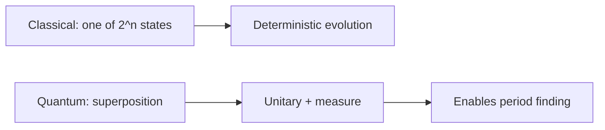

# Chapter 2: Quantum Computing Fundamentals

We keep physics intuition where it explains **why Shor wins**; we skip deep Hilbert-space formalism unless you are proving theorems.

**Figure 2.1 — Qubit vs classical bit (decision view)**



---

## 2.1 Classical vs. Quantum Computation

To understand why quantum computers pose an existential threat to much of modern cryptography, we must first develop a rigorous understanding of how quantum computation differs from classical computation at the most fundamental level. The distinction is not merely one of speed — quantum computers operate according to entirely different physical principles, enabling qualitatively new forms of information processing.

### Classical Bits and Deterministic Computation

A classical computer processes information using **bits** — binary digits that are definitively either 0 or 1. At the physical level, a bit is represented by a voltage level in a transistor, a magnetic orientation on a disk, or a charge state in a capacitor. Regardless of the physical implementation, a bit has exactly one value at any given moment. An n-bit register can be in exactly one of 2^n possible states at any given time. A classical 64-bit register, for example, holds precisely one of the approximately 1.8 × 10^19 possible configurations.

Classical algorithms process these states sequentially, or with limited parallelism through multiple processing cores. When a classical computer needs to search through possible solutions to a problem, it must examine them one at a time (or a few at a time with multiple cores). The fundamental information-processing model is that of a deterministic or probabilistic state machine transitioning between well-defined classical states.

The computational power of classical machines is remarkable — modern supercomputers perform over 10^18 floating-point operations per second. Yet certain mathematical problems resist efficient classical solution not because of insufficient hardware, but because of fundamental computational complexity barriers. It is precisely these barriers that quantum computation can sometimes circumvent.

### Quantum Bits (Qubits)

A **qubit** is the quantum analog of a classical bit, but it obeys the laws of quantum mechanics rather than classical physics. The simplest way to describe a qubit is through the mathematical formalism of quantum mechanics: a qubit is a two-level quantum system whose state is described by a vector in a two-dimensional complex Hilbert space.

Unlike a classical bit, a qubit can exist in a **superposition** of the |0⟩ and |1⟩ basis states simultaneously:

```
|ψ⟩ = α|0⟩ + β|1⟩
```

Here, α and β are complex numbers called **probability amplitudes**, and they must satisfy the normalization condition |α|² + |β|² = 1. The notation |0⟩ and |1⟩ (Dirac notation, or bra-ket notation) represents the two computational basis states, analogous to classical 0 and 1.

When a qubit is measured in the computational basis, the superposition collapses: the result is |0⟩ with probability |α|² or |1⟩ with probability |β|². After measurement, the qubit is irrevocably in whichever state was observed — the superposition is destroyed. This collapse upon measurement is one of the most counterintuitive aspects of quantum mechanics and has profound consequences for quantum algorithm design.

Physically, qubits can be realized in many systems: the spin of an electron (spin-up or spin-down), the polarization of a photon (horizontal or vertical), the energy levels of a superconducting circuit, or the internal states of a trapped ion. What matters is that the system has two distinguishable quantum states and can maintain coherent superpositions between them.

### Geometric Interpretation: The Bloch Sphere

A useful visualization of a single qubit's state is the **Bloch sphere**. Because a qubit state has two complex amplitudes subject to normalization and an overall phase freedom, its state can be parameterized by two real angles, theta and phi:

```
|ψ⟩ = cos(θ/2)|0⟩ + e^(iφ) sin(θ/2)|1⟩
```

This maps every possible qubit state to a point on the surface of a unit sphere. The north pole corresponds to |0⟩, the south pole to |1⟩, and all equatorial points represent equal superpositions with different relative phases. Single-qubit gates correspond to rotations of this sphere.

The Bloch sphere makes visible an important distinction: a classical bit has only two possible values (the poles), while a qubit has a continuous infinity of possible states (the entire sphere surface). However, measurement projects the state onto one of the poles, so extracting information from a qubit is fundamentally limited.

### The Power (and Limitations) of Superposition

An n-qubit register can exist in a superposition of all 2^n possible computational basis states simultaneously:

```
|ψ⟩ = Σ αᵢ|i⟩  for i = 0 to 2^n - 1
```

where the 2^n complex amplitudes satisfy Σ|αᵢ|² = 1. For n = 300 qubits, the number of amplitudes (2^300 ≈ 10^90) exceeds the estimated number of particles in the observable universe. This exponential state space is the fundamental resource that quantum computing exploits.

However, it is critical to understand what this does NOT mean. A common misconception is that a quantum computer "tries all possibilities at once" or is simply an exponentially parallel classical computer. This naive interpretation is incorrect for a crucial reason: measurement. When we measure the n-qubit register, we obtain only a single n-bit classical string, with probability determined by the amplitudes. The exponential amount of information encoded in the amplitudes is largely inaccessible through direct measurement.

The true power of quantum computation lies in the ability to manipulate amplitudes through quantum gates such that, after a carefully designed sequence of operations, the probability of measuring a desired answer is high. This manipulation relies on the phenomena of **entanglement** and **interference** — the genuine sources of quantum computational advantage.


**Figure 2.2 — Quantum circuit abstraction**


## 2.2 Key Quantum Phenomena

Three quantum mechanical phenomena underpin the power of quantum computation: superposition, entanglement, and interference. While superposition provides the exponential state space, entanglement creates correlations that enable efficient information processing across that space, and interference provides the mechanism for extracting useful answers.

### Superposition in Depth

Superposition is the principle that a quantum system can exist simultaneously in multiple eigenstates of an observable until a measurement is performed. For computation, this means a qubit is not merely in an unknown classical state — it genuinely exists in a combination of both states simultaneously. The evidence for this is the phenomenon of interference: if the qubit were simply in one state or the other (and we just didn't know which), we could never observe interference effects.

The distinction between quantum superposition and classical uncertainty is crucial. Consider a coin hidden under a cup — it is either heads or tails, and we simply lack knowledge. A qubit in superposition is fundamentally different: it is analogous to a coin that is genuinely both heads and tails until we look at it, and this "both-ness" has measurable physical consequences.

Superposition is fragile. Interactions with the environment cause **decoherence** — the gradual loss of quantum coherence that transforms a quantum superposition into a classical probability distribution. Maintaining superposition long enough to complete a computation is one of the central engineering challenges of quantum computing.

### Entanglement

**Quantum entanglement** creates correlations between qubits that have no classical analog and cannot be described by assigning individual states to each qubit separately. When qubits are entangled, the composite system exists in a state that cannot be written as a product of individual qubit states.

The simplest example is the Bell state (also called an EPR pair, after Einstein, Podolsky, and Rosen who first discussed such correlations in 1935):

```
|Φ+⟩ = (1/√2)(|00⟩ + |11⟩)
```

In this state, neither qubit has a definite individual state — only the pair has a well-defined joint state. Measuring the first qubit as 0 instantaneously determines that the second qubit will also be measured as 0, and vice versa — regardless of the physical separation between the qubits. Einstein famously called this "spooky action at a distance," but Note that entanglement cannot be used to transmit information faster than light.

For quantum computation, entanglement serves as a computational resource. An n-qubit system can be entangled in ways that create exponentially complex correlations. Quantum algorithms exploit these correlations to coordinate information processing across the full 2^n-dimensional state space in ways that would require exponential classical resources to simulate.

The amount of entanglement in a quantum computation is closely related to its computational power. Quantum computations that create only limited entanglement can typically be simulated efficiently on classical computers. Conversely, the computations that provide exponential speedups (such as Shor's algorithm) necessarily generate large amounts of entanglement throughout their execution.

There are four maximally entangled two-qubit states, known collectively as the Bell states:

```
|Φ+⟩ = (1/√2)(|00⟩ + |11⟩)
|Φ-⟩ = (1/√2)(|00⟩ - |11⟩)
|Ψ+⟩ = (1/√2)(|01⟩ + |10⟩)
|Ψ-⟩ = (1/√2)(|01⟩ - |10⟩)
```

These states form a basis for two-qubit systems and play fundamental roles in quantum teleportation, superdense coding, and various quantum protocols.

### Interference

**Quantum interference** is arguably the most important phenomenon for quantum algorithm design. Because probability amplitudes are complex numbers, they can add constructively (increasing the magnitude and thus the measurement probability) or destructively (decreasing or eliminating the measurement probability).

Consider a qubit that is put into superposition and then subjected to two possible computational paths. If one path contributes an amplitude of +1/2 and another contributes +1/2 to a particular output, the total amplitude is +1, giving certainty of measuring that output (constructive interference). If instead one path contributes +1/2 and another -1/2, the total amplitude is zero, making that output impossible (destructive interference).

Well-designed quantum algorithms structure their computations so that paths leading to correct answers interfere constructively while paths leading to incorrect answers interfere destructively. The quintessential example is Deutsch's algorithm (1985), which demonstrated that a quantum computer could determine a global property of a function with one evaluation, where a classical computer would require two. Though a toy problem, it established the paradigm of interference-based quantum speedup.

Grover's search algorithm provides another illuminating example. It iteratively applies operations that increase the amplitude of the marked item while decreasing the amplitudes of unmarked items. After approximately √N iterations (for a database of size N), the amplitude of the correct answer approaches 1 while all others approach 0. This √N scaling (versus N for classical search) represents the quadratic speedup achievable through interference for unstructured problems.

### The No-Cloning Theorem

An additional quantum principle with profound implications is the **no-cloning theorem**, which states that it is impossible to create an exact copy of an arbitrary unknown quantum state. Mathematically, there exists no unitary operation U such that U|ψ⟩|0⟩ = |ψ⟩|ψ⟩ for all |ψ⟩.

While this theorem limits certain quantum operations (you cannot "back up" a quantum computation mid-way), it is also the foundation of quantum key distribution security. Any attempt to eavesdrop on a quantum communication channel necessarily disturbs the transmitted quantum states, making the eavesdropping detectable.

> **Author's note:** Brief executives on **measurement collapse** before gate fidelities—otherwise qubits sound like magic.

## 2.3 Quantum Gates and Circuits

Quantum computation is performed by applying **quantum gates** — unitary transformations — to qubits. The unitarity requirement (the gate's matrix U satisfies U†U = I, where U† is the conjugate transpose) ensures that quantum operations are reversible and preserve the normalization of quantum states.

### Single-Qubit Gates

Single-qubit gates transform the state of one qubit and are represented by 2×2 unitary matrices.

**Hadamard Gate (H):** The Hadamard gate is perhaps the most important single-qubit gate in quantum computing. It creates an equal superposition from a basis state and is essential for initializing quantum algorithms:

```
H|0⟩ = (1/√2)(|0⟩ + |1⟩)
H|1⟩ = (1/√2)(|0⟩ - |1⟩)
```

In matrix form: H = (1/√2)[[1, 1], [1, -1]]. Note the critical minus sign in H|1⟩ — this relative phase is what makes interference possible. When Hadamard is applied to all n qubits initialized to |0⟩, the result is an equal superposition over all 2^n basis states, which is the starting point for many quantum algorithms.

**Pauli Gates (X, Y, Z):** These three gates form the basis of single-qubit operations.
- Pauli-X: The quantum NOT gate, mapping |0⟩ → |1⟩ and |1⟩ → |0⟩. On the Bloch sphere, it is a 180° rotation about the X-axis.
- Pauli-Y: Maps |0⟩ → i|1⟩ and |1⟩ → -i|0⟩. A 180° rotation about the Y-axis.
- Pauli-Z: Leaves |0⟩ unchanged but maps |1⟩ → -|1⟩. A 180° rotation about the Z-axis. This is a phase gate that introduces a relative phase of -1.

**Phase Gates (S and T):** These gates add relative phases to the |1⟩ component without changing the measurement probabilities in the computational basis:
- S gate: Adds a phase of i (π/2 rotation about Z-axis)
- T gate: Adds a phase of e^(iπ/4) (π/8 rotation about Z-axis)

The T gate is particularly important because the gate set {H, T, CNOT} is universal for quantum computation — any quantum operation can be approximated to arbitrary precision using only these gates. The T gate is also the most expensive gate to implement fault-tolerantly, which has significant implications for the resource requirements of quantum algorithms.

**Rotation Gates:** General rotation gates R_x(θ), R_y(θ), and R_z(θ) perform rotations by angle θ about the respective axes of the Bloch sphere. These provide continuous parameterization of single-qubit operations and are important in variational quantum algorithms.

### Multi-Qubit Gates

Multi-qubit gates create entanglement and correlations between qubits, enabling the full computational power of quantum systems.

**CNOT (Controlled-NOT):** The CNOT gate is the fundamental two-qubit gate. It flips the target qubit if and only if the control qubit is in state |1⟩:

```
CNOT|00⟩ = |00⟩
CNOT|01⟩ = |01⟩
CNOT|10⟩ = |11⟩
CNOT|11⟩ = |10⟩
```

When the control qubit is in superposition, CNOT creates entanglement. For example: applying CNOT to H|0⟩ ⊗ |0⟩ produces the Bell state (1/√2)(|00⟩ + |11⟩). This two-step process (Hadamard followed by CNOT) is the standard method for generating entangled pairs.

**Controlled-Z (CZ):** Applies a phase flip (Z gate) to the target qubit when the control qubit is |1⟩. Unlike CNOT, the CZ gate is symmetric between its two qubits — either can be considered the "control."

**Toffoli Gate (CCNOT):** A controlled-controlled-NOT gate that flips the target qubit only when both control qubits are |1⟩. The Toffoli gate is universal for classical reversible computation, meaning any classical Boolean function can be implemented using only Toffoli gates (with ancilla bits). Combined with Hadamard, it becomes universal for quantum computation as well.

**SWAP Gate:** Exchanges the states of two qubits. This is particularly important for architectures with limited connectivity, where qubits can only interact with their neighbors and SWAP operations are needed to bring distant qubits into proximity.

### The Circuit Model of Quantum Computation

A quantum algorithm is expressed as a **quantum circuit** — a sequence of quantum gates applied to a register of qubits, read from left to right in time. The circuit model of quantum computation, introduced by David Deutsch in 1989, is the most common framework for describing quantum algorithms relevant to cryptography.

A typical quantum circuit proceeds in three stages:

1. **Initialization:** All qubits are prepared in a known state, typically |0⟩^⊗n.
2. **Unitary evolution:** A sequence of quantum gates transforms the state, creating superpositions, entanglement, and interference patterns.
3. **Measurement:** Some or all qubits are measured in the computational basis, yielding a classical bit string as output.

The depth of a circuit (the length of the longest path from input to output) and its width (the number of qubits) are the primary measures of a circuit's resource requirements. For cryptographic applications, both the total number of gates (particularly T gates) and the circuit depth (which determines runtime) are critical parameters.

### Universal Gate Sets

A gate set is **universal** if any unitary operation can be approximated to arbitrary precision using gates from the set. The Solovay-Kitaev theorem guarantees that if a gate set generates a dense subset of SU(2), then any single-qubit unitary can be approximated to precision ε using O(log^c(1/ε)) gates from the set, where c ≈ 3.97 (with later improvements reducing this constant). Combined with an entangling two-qubit gate (such as CNOT), this enables universal quantum computation on any number of qubits through standard circuit decomposition techniques.

Common universal gate sets include:
- {H, T, CNOT} — the standard fault-tolerant gate set
- {H, Toffoli} — useful for reversible classical computation within quantum circuits
- Arbitrary single-qubit rotations plus CNOT — used in hardware-native compilations

## 2.4 Quantum Computational Complexity

Understanding the computational power of quantum computers requires the framework of computational complexity theory — the study of what problems can be solved efficiently with given computational resources.

### BQP: Bounded-Error Quantum Polynomial Time

**BQP** (Bounded-Error Quantum Polynomial Time) is the class of decision problems solvable by a quantum computer in polynomial time with bounded error probability. Specifically, a problem is in BQP if there exists a polynomial-time quantum algorithm that:
- Accepts YES instances with probability at least 2/3
- Rejects NO instances with probability at least 2/3

The choice of 2/3 is arbitrary; any constant strictly greater than 1/2 gives the same class, since probability amplification through repetition can make the error exponentially small.

BQP is the quantum analog of **BPP** (Bounded-Error Probabilistic Polynomial Time) for classical randomized algorithms. The fundamental question of quantum computational complexity is whether BQP strictly contains BPP — that is, whether quantum computers can efficiently solve problems that are intractable classically.

### Relationships Between Complexity Classes

The known relationships between relevant complexity classes form a hierarchy:

```
P ⊆ BPP ⊆ BQP ⊆ PSPACE
```

Additionally:
- P ⊆ BQP (anything efficiently solvable classically and deterministically is also efficiently solvable quantumly)
- BQP ⊆ PSPACE (quantum computations can be simulated with polynomial space, though potentially exponential time)
- It is strongly believed that P ⊊ BQP (quantum provides genuine advantage)
- NP is not known to be contained in BQP, and it is widely believed that NP ⊄ BQP

The problems most relevant to cryptography — integer factoring and the discrete logarithm problem — occupy a particularly interesting position. They are believed to be in BQP (solvable efficiently by quantum computers via Shor's algorithm) but not in BPP (not solvable efficiently by classical computers). They are also not believed to be NP-complete, which places them in an intermediate zone of classical hardness that quantum computers can penetrate.

### What Quantum Computers Cannot Efficiently Solve

It is essential to understand the limitations of quantum computation. Quantum computers are NOT universal problem-solvers:

**NP-Complete Problems:** There is no known quantum algorithm that solves NP-complete problems (such as the traveling salesman problem, Boolean satisfiability, or graph coloring) in polynomial time. While Grover's algorithm provides a quadratic speedup for searching, it does not collapse the exponential complexity of NP-complete problems into polynomial time. The best known quantum algorithms for NP-complete problems still require exponential time.

**Unstructured Search:** For finding a marked item among N unsorted items, Grover's algorithm achieves an optimal O(√N) query complexity. This is provably optimal for quantum computers — no quantum algorithm can do better. This represents "only" a quadratic speedup over the classical O(N) bound.

**PSPACE-Complete Problems:** Problems requiring exponential space classically are equally hard for quantum computers.

**Structure is Essential:** Quantum speedups arise from exploiting mathematical structure in problems — the periodicity in factoring (for Shor's algorithm), the symmetry in search (for Grover's algorithm), or the algebraic structure in hidden subgroup problems. Problems without such exploitable structure generally do not admit significant quantum speedup.

### Quantum Speedups: A Taxonomy

Quantum advantages over classical computation come in several flavors:

| Speedup Type | Classical | Quantum | Example |
|-------------|-----------|---------|---------|
| Exponential | O(2^n) | O(poly(n)) | Integer factoring (Shor's) |
| Super-polynomial | O(2^(n^(1/3))) | O(poly(n)) | Certain oracle problems |
| Polynomial (quadratic) | O(N) | O(√N) | Unstructured search (Grover's) |
| Polynomial (cubic) | O(N^(3/2)) | O(N) | Some graph problems |
| None | O(f(n)) | O(f(n)) | Sorting, many classical tasks |

For cryptography, the exponential speedup provided by Shor's algorithm is devastating: problems that would take billions of years classically can be solved in hours quantumly. The quadratic speedup of Grover's algorithm is significant but manageable: it effectively halves the bit-security of symmetric schemes, requiring a simple doubling of key lengths to compensate.

## 2.5 Quantum Error Correction

Real quantum hardware is extraordinarily fragile. Qubits lose their quantum coherence through interactions with the environment (decoherence), and quantum gates introduce errors at rates many orders of magnitude higher than classical logic gates. Quantum error correction (QEC) is the theoretical and practical framework that makes large-scale quantum computation possible despite these imperfections.

### Sources of Quantum Errors

Quantum errors are fundamentally different from classical bit-flip errors. A classical bit can only suffer one type of error: a flip from 0 to 1 or vice versa. A qubit, existing in a continuous state space, can suffer a continuum of errors. However, the theory of quantum error correction shows that it suffices to correct for a discrete set of errors:

**Bit-flip errors (X errors):** The qubit flips from |0⟩ to |1⟩ or vice versa, analogous to classical bit errors.

**Phase-flip errors (Z errors):** The relative phase between |0⟩ and |1⟩ is flipped. This has no classical analog and represents a uniquely quantum source of error. The state α|0⟩ + β|1⟩ becomes α|0⟩ - β|1⟩.

**Combined errors (Y errors):** Both bit-flip and phase-flip occur simultaneously.

**Decoherence:** Gradual loss of quantum information to the environment, characterized by two timescales — T1 (energy relaxation time, governing amplitude decay) and T2 (dephasing time, governing phase coherence loss).

**Gate errors:** Imperfect implementation of quantum gates, causing small rotational errors that accumulate over the course of a computation.

**Measurement errors:** Incorrect readout of qubit states, confusing |0⟩ for |1⟩ and vice versa.

**Crosstalk:** Unintended interactions between qubits, particularly in densely packed architectures.

### Principles of Quantum Error Correction

Quantum error correction faces unique challenges compared to classical error correction:

1. **No-cloning theorem:** Quantum states cannot be copied, ruling out the simplest classical redundancy approach.
2. **Measurement collapse:** Measuring a qubit to check for errors would destroy the very information we want to protect.
3. **Continuous errors:** Unlike discrete classical bit flips, quantum errors are continuous rotations.

The breakthrough insight, developed independently by Peter Shor (1995) and Andrew Steane (1996), was that these obstacles can be overcome:

- Instead of copying, information is encoded non-locally across multiple physical qubits using entanglement.
- Errors are detected through **syndrome measurements** — measurements of multi-qubit parity operators that reveal error information without collapsing the encoded state.
- Remarkably, correcting only discrete Pauli errors (X, Y, Z) suffices to correct arbitrary continuous errors, because any error can be decomposed into a linear combination of Pauli errors.

### The Surface Code

The **surface code**, proposed by Alexei Kitaev (1997) and developed extensively by others, is currently the leading candidate for practical quantum error correction. Its key advantages include:

- **High threshold:** Error threshold of approximately 1% per physical gate operation, which is achievable with current hardware.
- **Local connectivity:** Requires only nearest-neighbor interactions on a 2D grid of qubits, matching the natural architecture of superconducting and many other platforms.
- **Efficient decoding:** Syndrome measurements can be processed efficiently using classical algorithms like minimum-weight perfect matching.

In the surface code, a logical qubit is encoded in a 2D lattice of physical qubits. The code distance d (roughly the side length of the lattice) determines the number of errors that can be corrected: up to (d-1)/2 errors. A distance-d surface code requires approximately 2d² physical qubits per logical qubit.

For example, a distance-17 surface code (capable of correcting up to 8 simultaneous errors) requires approximately 578 physical qubits per logical qubit. At a physical error rate of 10^-3, this achieves a logical error rate of approximately 10^-12 per logical gate — sufficient for computations of considerable depth.

### The Threshold Theorem

The **threshold theorem** (also called the accuracy threshold theorem) is one of the most important results in quantum computing theory. Proved in the late 1990s through the work of Aharonov and Ben-Or, Kitaev, Knill, Laflamme, and Zurek, it states:

*If the physical error rate per gate operation is below a certain threshold value p_th, then an arbitrarily long quantum computation can be performed with an arbitrarily small logical error rate, provided sufficient physical qubits are available.*

The theorem guarantees that the overhead (the number of physical qubits needed per logical qubit) grows only polylogarithmically with the desired computation length. Specifically, to achieve a logical error rate of ε for a computation of L logical gates, the physical overhead per logical qubit scales as O(polylog(L/ε)).

The threshold value depends on the error correction code and the noise model:
- Surface codes: p_th ≈ 10^-2 (1%) for depolarizing noise
- Concatenated codes: p_th ≈ 10^-4 to 10^-5
- Color codes: p_th ≈ 10^-2 (similar to surface codes)

The threshold theorem transformed quantum computing from a theoretical curiosity into a potentially achievable engineering goal. Before this theorem, it was unclear whether quantum computation was even possible in principle, given the inevitability of noise. After it, the question became one of engineering: can we build hardware with error rates below threshold?

### Logical vs. Physical Qubits

The distinction between **logical qubits** and **physical qubits** is fundamental to understanding the resource requirements of quantum computation:

- A **physical qubit** is a single real-world quantum system (a superconducting circuit, a trapped ion, etc.) that is subject to noise and errors.
- A **logical qubit** is an encoded qubit protected by quantum error correction, consisting of many physical qubits working together to store and process one qubit of quantum information fault-tolerantly.

The ratio of physical to logical qubits depends on the desired logical error rate, the physical error rate, and the error correction code used. Current estimates for cryptographically relevant computations suggest:

| Scenario | Physical Error Rate | Code Distance | Physical Qubits per Logical Qubit |
|----------|-------------------|---------------|----------------------------------|
| Near-term optimistic | 10^-3 | d = 17 | ~578 |
| Moderate | 10^-3 | d = 23 | ~1,058 |
| Conservative | 10^-4 | d = 13 | ~338 |
| Very conservative | 10^-3 | d = 27 | ~1,458 |

For breaking RSA-2048 using Shor's algorithm, estimates range from approximately 4,000 to 20,000 logical qubits depending on algorithmic optimizations. Combined with the physical-to-logical overhead, this translates to roughly 4 million to 20 million physical qubits — a formidable but not physically impossible engineering target.

### Magic State Distillation

A critical bottleneck in fault-tolerant quantum computation is the implementation of non-Clifford gates, particularly the T gate. While Clifford gates (H, S, CNOT) can be implemented transversally (directly on encoded qubits), the T gate requires a technique called **magic state distillation**.

Magic state distillation is a process that takes many copies of noisy "magic states" (specially prepared quantum states) and produces fewer copies of higher-fidelity magic states. These purified magic states are then consumed to implement T gates fault-tolerantly. The process is resource-intensive: producing a single high-fidelity magic state may require hundreds or thousands of physical qubits and multiple rounds of distillation.

Since T gates dominate the resource cost of many quantum algorithms (including Shor's algorithm for factoring), optimizing T-gate count and magic state distillation is an active area of research with direct implications for when cryptographically relevant quantum computers will become feasible.

## 2.6 Current State of Quantum Hardware (2025-2026)

The landscape of quantum computing hardware has evolved rapidly, with multiple technology platforms competing to achieve practical quantum advantage. Understanding the current state of hardware is essential for assessing the timeline to cryptographically relevant quantum computers.

### Performance Metrics

Quantum hardware is characterized by several key metrics:

- **Qubit count:** The total number of physical qubits available.
- **Gate fidelity:** The accuracy of quantum gate operations, typically reported as 1 minus the error rate. Two-qubit gate fidelity is usually the limiting factor.
- **Coherence time:** How long qubits maintain their quantum state (T1 and T2 times).
- **Connectivity:** Which qubits can directly interact (all-to-all vs. nearest-neighbor).
- **Circuit depth:** The maximum number of sequential gate operations before errors dominate.
- **Quantum volume:** A holistic benchmark introduced by IBM that accounts for qubit count, connectivity, and gate fidelity.

### Current Hardware Capabilities

As of 2025-2026, the state of the art across major platforms is:

| Platform | Leading Systems | Qubit Count | Two-Qubit Gate Fidelity | Coherence Times | Connectivity |
|----------|----------------|-------------|------------------------|-----------------|--------------|
| Superconducting | IBM Heron, Google Willow | 100-1,000+ | 99.5-99.9% | 100-300 μs | Nearest-neighbor (heavy-hex, grid) |
| Trapped Ion | Quantinuum H2, IonQ Forte | 30-60 (fully connected) | 99.7-99.9% | Seconds to minutes | All-to-all |
| Neutral Atom | QuEra, Pasqal | 100-1,000+ | 99.0-99.5% | ~1 second | Reconfigurable |
| Photonic | Xanadu Borealis, PsiQuantum | Variable (mode-dependent) | Architecture-dependent | N/A (photons don't decohere) | Graph-dependent |

The most notable recent milestones include demonstrations of quantum error correction below the break-even point — where an error-corrected logical qubit outperforms its constituent physical qubits — achieved by several groups using surface codes and related schemes.

### The NISQ Era and Beyond

The current period of quantum computing development is often called the **NISQ** (Noisy Intermediate-Scale Quantum) era, a term coined by John Preskill in 2018. NISQ devices have tens to hundreds of qubits but lack full error correction, limiting the depth of circuits they can execute reliably.

NISQ devices cannot run Shor's algorithm at a cryptographically relevant scale. The factoring of RSA-2048 requires thousands of logical qubits operating through circuits of enormous depth — far beyond NISQ capabilities. The transition from NISQ to the fault-tolerant era is the critical milestone for cryptographic security.

Current progress toward fault tolerance includes:
- Demonstration of repeated error correction cycles
- Logical qubit lifetimes exceeding physical qubit lifetimes
- Real-time decoding and feedback at speeds compatible with computation
- Initial demonstrations of logical gate operations between error-corrected qubits

## 2.7 Quantum Computing Architectures

Several distinct physical platforms are being developed for quantum computing, each with unique advantages and challenges. The diversity of approaches increases the probability that at least one will achieve the scale needed for cryptographically relevant computation.

### Superconducting Qubits

**Leading Organizations:** IBM, Google, Rigetti, Alice & Bob, OQC

**Physical Basis:** Superconducting qubits use electrical circuits made from superconducting materials (typically aluminum on silicon) cooled to approximately 15 millikelvin — colder than outer space. At these temperatures, electrical resistance vanishes and quantum behavior emerges at the circuit level. The qubit is formed by a Josephson junction — a thin insulating barrier between two superconductors — which creates a nonlinear oscillator with quantized energy levels. The lowest two energy levels serve as |0⟩ and |1⟩.

**Advantages:**
- Fast gate operations: Single-qubit gates in 20-50 nanoseconds, two-qubit gates in 50-300 nanoseconds
- Leverages existing semiconductor fabrication infrastructure
- Highly scalable manufacturing processes
- Strong industrial investment and engineering expertise
- Well-developed control electronics

**Challenges:**
- Extreme cooling requirements (dilution refrigerators)
- Limited connectivity (typically nearest-neighbor on a planar chip)
- Coherence times of 100-300 microseconds limit circuit depth
- Frequency crowding as qubit counts increase
- Wiring and control challenges for scaling beyond thousands of qubits

**Scaling Roadmap:** IBM has articulated a roadmap targeting over 100,000 qubits by the late 2020s through modular architectures connecting multiple quantum processors via quantum interconnects. Google has similarly outlined plans for building systems with millions of qubits through error correction.

### Trapped Ions

**Leading Organizations:** Quantinuum (Honeywell), IonQ, AQT, Universal Quantum

**Physical Basis:** Trapped-ion quantum computers use individual atoms (typically ytterbium-171, barium-133, or calcium-40) suspended in electromagnetic traps in ultra-high vacuum. The qubit is encoded in two internal energy states of the ion (such as hyperfine ground states). Ions are manipulated using precisely tuned laser pulses or microwave radiation. Two-qubit gates are mediated through the shared vibrational (phonon) modes of the ion chain.

**Advantages:**
- Highest gate fidelities of any platform (>99.9% for single-qubit, >99.7% for two-qubit)
- All-to-all connectivity (any qubit can interact with any other)
- Long coherence times (seconds to minutes, even hours for certain encodings)
- Identical qubits (all ions of the same species are physically identical)
- Mature laser technology

**Challenges:**
- Slower gate operations (1-100 microseconds for two-qubit gates)
- Scaling beyond ~50-100 ions in a single trap is difficult due to mode crowding
- Requires complex laser systems and ultra-high vacuum
- Photon interconnects between trap modules are lossy and slow
- SWAP overhead in modular architectures

**Scaling Roadmap:** The path to large-scale trapped-ion quantum computers involves modular architectures where small ion traps (each holding 20-50 ions) are connected via photonic interconnects or ion shuttling between trap zones. Quantinuum has demonstrated systematic improvements in qubit count and fidelity with each hardware generation.

### Neutral Atoms

**Leading Organizations:** QuEra, Pasqal, Atom Computing, Planqc

**Physical Basis:** Neutral atom quantum computers trap individual atoms (typically rubidium or cesium) using focused laser beams called optical tweezers. The atoms are arranged in programmable 2D or 3D arrays. Qubits are encoded in the atomic ground states or in highly excited Rydberg states. Two-qubit gates exploit the strong dipole-dipole interactions between atoms in Rydberg states — when one atom is excited to a Rydberg state, it shifts the energy levels of nearby atoms, preventing their simultaneous excitation (the Rydberg blockade mechanism).

**Advantages:**
- Large qubit counts achievable (hundreds to thousands of atoms)
- Reconfigurable connectivity (atoms can be physically rearranged)
- Native multi-qubit gates (the Rydberg blockade naturally extends to multiple atoms)
- Mid-circuit measurement and feedforward demonstrated
- Relatively simple vacuum and laser requirements compared to ions

**Challenges:**
- Two-qubit gate fidelities still below trapped-ion levels (99.0-99.5%)
- Atom loss during computation
- Finite temperature effects
- Relatively new platform with less engineering maturity
- Rydberg state lifetimes limit gate sequences

**Scaling Roadmap:** Neutral atom systems have a natural path to thousands of qubits through larger optical tweezer arrays. The ability to rearrange atoms mid-computation provides a unique advantage for implementing error correction codes that require non-local connectivity.

### Photonic Quantum Computing

**Leading Organizations:** Xanadu, PsiQuantum, ORCA Computing, Quandela

**Physical Basis:** Photonic quantum computers use individual photons (particles of light) as qubits. The qubit can be encoded in polarization, path, time-bin, or other photonic degrees of freedom. Photonic gates are implemented using beam splitters, phase shifters, and nonlinear optical elements. Measurement-based quantum computing (MBQC) is a common paradigm, where a large entangled "cluster state" is first prepared, and computation proceeds by performing adaptive single-qubit measurements.

**Advantages:**
- Room temperature operation (no cryogenics or vacuum needed)
- Photons naturally travel at the speed of light, enabling fast operations
- Natural interface with quantum networks and communication
- No decoherence in transit (photons don't interact with the environment unless made to)
- Silicon photonic fabrication leverages existing semiconductor industry

**Challenges:**
- Photon loss is the dominant error mechanism
- Deterministic two-photon gates are extremely difficult (photons don't naturally interact)
- Probabilistic operations require resource-intensive multiplexing
- Single-photon sources and detectors remain imperfect
- Large physical footprint for some implementations

**Scaling Roadmap:** PsiQuantum has pursued a "manufacturing-first" approach, designing photonic quantum computers for production in existing semiconductor fabs. Xanadu has developed the Borealis system demonstrating quantum advantage in specific sampling tasks. The photonic approach potentially offers the fastest path to millions of physical qubits if manufacturing challenges are overcome.

### Topological Quantum Computing

**Leading Organization:** Microsoft

**Physical Basis:** Topological quantum computing aims to encode quantum information in topological properties of exotic quasiparticles called **non-Abelian anyons** (specifically Majorana zero modes). These topological states are inherently protected against local perturbations — errors would require changing the global topology of the system, which is exponentially unlikely for local noise. Gates are performed by braiding anyons around each other, with the computation depending only on the topological class of the braiding pattern, not on the precise path taken.

**Advantages:**
- Inherent hardware-level error protection (topological protection)
- Potentially much lower overhead for error correction
- Gate operations are exact (depending only on topology, not on precise control)
- Could dramatically reduce the physical-to-logical qubit ratio

**Challenges:**
- Non-Abelian anyons have been extremely difficult to create and verify experimentally
- Microsoft reported initial evidence of Majorana-based topological qubits in 2023-2025, but the technology remains in early stages
- The engineering path from demonstrated topological qubits to a full computer is unclear
- If topological protection proves insufficient, additional error correction may still be needed

**Scaling Roadmap:** If topological qubits can be reliably manufactured, they could potentially provide a shortcut to fault-tolerant quantum computing by building error protection into the physics itself. However, the technology currently lags behind other platforms in maturity by several years, and its ultimate feasibility remains uncertain.

### Comparative Summary

| Architecture | Gate Speed | Fidelity | Scalability | Error Correction Overhead | Timeline to CRQC |
|-------------|-----------|----------|-------------|--------------------------|-------------------|
| Superconducting | Very fast (ns) | High (99.5-99.9%) | Good (fabrication-based) | High (many physical per logical) | 10-20 years |
| Trapped Ion | Moderate (μs) | Highest (>99.7%) | Moderate (modular) | Moderate-High | 15-25 years |
| Neutral Atom | Moderate (μs) | Improving (99-99.5%) | Very good (large arrays) | High (but improving) | 12-22 years |
| Photonic | Fast (ps-ns) | Variable | Potentially very good | Architecture-dependent | 10-20 years |
| Topological | Varies | Potentially highest | Unknown | Potentially very low | 15-30+ years |

## 2.8 Timeline to Cryptographically Relevant Quantum Computers

A **Cryptographically Relevant Quantum Computer (CRQC)** is a quantum computer capable of breaking widely deployed public-key cryptographic schemes — specifically, one that can factor 2048-bit RSA moduli or compute discrete logarithms in elliptic curve groups of cryptographic size within a practically relevant timeframe (hours to weeks, rather than millions of years).

### Resource Requirements for Breaking RSA-2048

The resource requirements for factoring a 2048-bit number using Shor's algorithm have been extensively studied and optimized:

| Study/Year | Logical Qubits | T-gate Count | Physical Qubits (estimated) | Runtime |
|-----------|---------------|--------------|----------------------------|---------|
| Fowler et al. (2012) | ~4,000 | ~10^10 | ~1 billion | Days |
| Gidney & Ekerå (2021) | ~2,050 algorithm qubits (~6,000 total logical qubits with ancillas) | ~10^9 | ~20 million | 8 hours |
| Litinski (2023) | ~3,700 | ~10^9 | ~4 million | Hours |
| Various optimistic (2024-2025) | ~2,000-3,000 | ~10^8-10^9 | ~1-4 million | Hours |

The dramatic reduction in estimated resources over time reflects ongoing algorithmic and architectural optimizations. Gidney and Ekerå's 2021 paper, in particular, demonstrated that careful algorithm engineering could reduce requirements by orders of magnitude compared to naive implementations.

Key resource drivers include:
- **Modular arithmetic:** Performing modular exponentiation on a quantum computer requires significant qubit overhead for carry propagation and intermediate storage.
- **T-gate count:** Each T gate requires a magic state, and magic state distillation dominates the physical qubit footprint.
- **Circuit depth:** Determines the total computation time and the logical error rate requirements.
- **Parallelism vs. qubit count:** There is a time-space tradeoff — more qubits enable faster computation through parallelized magic state distillation.

### Factors Determining the Timeline

Several independent factors must converge for a CRQC to be realized:

**1. Physical Qubit Count Scaling**

Current systems have hundreds to a few thousand physical qubits. Reaching millions requires:
- Advances in fabrication yield and uniformity
- Solutions to the "wiring problem" (controlling millions of qubits with classical electronics)
- Thermal management at scale (for cryogenic platforms)
- Modular architectures with high-bandwidth quantum interconnects

**2. Error Rate Reduction**

Physical error rates must be sustainably below the error correction threshold (approximately 0.1-1% depending on the code). While individual gates at these fidelities have been demonstrated, maintaining such performance at scale across millions of qubits during extended computations is a separate challenge.

**3. Error Correction Overhead Reduction**

The number of physical qubits per logical qubit depends on:
- The physical error rate (lower is better)
- The error correction code efficiency
- The target logical error rate (determined by total computation length)
- New error correction codes or techniques that reduce overhead

**4. Algorithmic Improvements**

Continued optimization of quantum algorithms for factoring could reduce resource requirements further. Areas of active research include:
- More efficient modular arithmetic circuits
- Better strategies for T-gate synthesis and optimization
- Hybrid classical-quantum approaches that offload parts of the computation
- Alternative algorithms (beyond standard Shor) with lower resource requirements

**5. Engineering Integration**

Beyond individual components, a CRQC requires the integration of:
- Fast, reliable classical control systems for real-time error decoding
- Scalable cryogenic (or other) infrastructure
- Efficient classical-quantum interfaces
- Reliable operation over the hours-to-days timescales needed for computation

### Expert Timeline Estimates

The question of when a CRQC will exist has been addressed by numerous expert surveys, government reports, and industry roadmaps:

**Conservative Estimates (20-30+ years, i.e., 2045-2055+):**
- Assume current progress rates without major breakthroughs
- Point to the enormous gap between current capabilities and requirements
- Note that quantum computing has repeatedly been "10 years away" for decades
- Emphasize unforeseen engineering challenges at scale

**Moderate Estimates (10-20 years, i.e., 2035-2045):**
- Based on extrapolation of recent progress rates
- Assume continued investment and incremental advances
- Account for known algorithmic optimizations reducing requirements
- Align with major industry roadmaps (IBM, Google)

**Aggressive Estimates (5-15 years, i.e., 2030-2040):**
- Assume one or more significant breakthroughs (topological qubits, new error correction codes, algorithmic advances)
- Consider that current progress may be accelerating
- Note historical precedents where technology developed faster than expected once a threshold was crossed

**The "Black Swan" Scenario:**
- A completely new approach or breakthrough could dramatically accelerate the timeline
- Examples: a new factoring algorithm requiring fewer qubits, a hardware breakthrough enabling million-qubit systems sooner than expected
- While unlikely in any given year, cannot be ruled out over a decade

### The "Harvest Now, Decrypt Later" Threat

Regardless of the exact timeline, adversaries can employ a **store-now-decrypt-later** (SNDL) strategy: intercepting and storing encrypted communications today with the intention of decrypting them once a CRQC becomes available. This means that information that must remain confidential for 15 or more years is effectively already at risk from quantum computers, even though CRQCs do not yet exist.

This threat model means that organizations with long-lived secrets (government agencies, healthcare systems, financial institutions, critical infrastructure) should be transitioning to post-quantum cryptography now, regardless of their specific estimate for CRQC arrival.

### Investment Landscape

The global investment in quantum computing reflects the perceived strategic importance of this technology:

- **Government Investment:** Major national quantum initiatives exist in the United States ($1.2 billion National Quantum Initiative, plus defense and intelligence funding), China (estimated $15+ billion), the European Union (€1 billion Quantum Flagship), the United Kingdom (£2.5 billion National Quantum Strategy), and many other nations.
- **Private Investment:** Annual private investment in quantum computing companies exceeds $30 billion globally, with major technology companies (Google, IBM, Microsoft, Amazon) and specialized startups (IonQ, Rigetti, PsiQuantum, Quantinuum) receiving significant funding.
- **Strategic Competition:** Multiple nations treat quantum computing as a strategic priority, creating a competitive dynamic that accelerates development independent of commercial market forces.

## 2.9 The Quantum Advantage for Cryptanalysis

The relevance of quantum computing to cryptography is highly specific. Quantum computers do not threaten all cryptography equally — they provide devastating advantages against certain mathematical problems while offering only modest improvements against others.

### Shor's Algorithm: Exponential Speedup

**Shor's algorithm**, published by Peter Shor in 1994, provides an efficient quantum algorithm for integer factoring and computing discrete logarithms. These are precisely the mathematical problems underlying the most widely deployed public-key cryptographic systems:

- **RSA:** Security relies on the difficulty of factoring large semiprimes (products of two large primes). Shor's algorithm factors an n-bit integer in O(n³) quantum gate operations, compared to the best classical algorithms requiring sub-exponential time O(exp(n^(1/3) · (log n)^(2/3))).
- **Diffie-Hellman Key Exchange:** Security relies on the discrete logarithm problem in finite fields. Shor's algorithm solves this in polynomial time.
- **Elliptic Curve Cryptography (ECC):** Security relies on the elliptic curve discrete logarithm problem. A modified version of Shor's algorithm solves this in polynomial time.
- **DSA/ECDSA Digital Signatures:** These signature schemes are also based on discrete logarithm problems and are equally vulnerable.

The speedup provided by Shor's algorithm is exponential — transforming a problem requiring billions of years of classical computation into one requiring hours of quantum computation. This is not merely a matter of using larger key sizes; no practical increase in RSA key length can provide security against Shor's algorithm, because the quantum algorithm's runtime grows only polynomially with the key size.

### Grover's Algorithm: Quadratic Speedup

**Grover's algorithm**, published by Lov Grover in 1996, provides an optimal quantum algorithm for unstructured search. Given a function f that evaluates to 1 for exactly one of N possible inputs, Grover's algorithm finds that input using only O(√N) evaluations, compared to O(N) classically.

For symmetric cryptography, this means:
- **Key search:** A brute-force quantum search for an n-bit key requires 2^(n/2) operations instead of 2^n. This effectively halves the security level: AES-128 provides only 64 bits of quantum security.
- **Collision finding:** Quantum algorithms can find hash collisions somewhat faster than classical birthday attacks, though the speedup is less than quadratic due to memory limitations.
- **Pre-image attacks:** Finding hash pre-images is accelerated quadratically.

The practical impact of Grover's algorithm on symmetric cryptography is manageable: doubling key lengths (e.g., using AES-256 instead of AES-128) restores the original security level. This is why post-quantum cryptography focuses primarily on replacing public-key schemes rather than symmetric ones.

### Beyond Shor and Grover

Other quantum algorithms with cryptographic relevance include:

- **Quantum period-finding:** Generalizes Shor's algorithm to break other algebraic cryptosystems based on hidden subgroup problems in Abelian groups.
- **Kuperberg's algorithm:** Provides sub-exponential quantum algorithms for certain non-Abelian hidden subgroup problems, relevant to some proposed post-quantum schemes.
- **Quantum random walks:** Provide polynomial speedups for various graph and search problems, with potential cryptanalytic applications.
- **Variational quantum algorithms:** While currently limited by noise, these could potentially find heuristic speedups for optimization problems related to cryptanalysis (lattice reduction, code decoding).

### Why Post-Quantum Cryptography Is Possible

The existence of quantum speedups for factoring and discrete logarithms does NOT mean all cryptography is doomed. Post-quantum cryptography is possible because:

1. **Quantum computers are not universal solvers:** They do not efficiently solve NP-hard problems or all exponential-time problems.
2. **Different mathematical structures:** Lattice problems, error-correcting code problems, multivariate polynomial problems, and hash-based constructions lack the algebraic structure (hidden subgroups in Abelian groups) that Shor's algorithm exploits.
3. **Proven hardness results:** For some post-quantum constructions (particularly hash-based signatures), security can be reduced to well-understood minimal assumptions.
4. **Extensive cryptanalysis:** Decades of quantum algorithm research have failed to find efficient quantum algorithms for the problems underlying post-quantum candidates.

The fundamental insight is that quantum speedups require exploitable mathematical structure. The periodic structure in modular exponentiation enables Shor's algorithm; the symmetric structure in unstructured search enables Grover's algorithm. Problems without such structure — such as finding short vectors in high-dimensional lattices — appear to resist quantum speedup, making them suitable foundations for post-quantum cryptography.---

## Chapter Summary

**Technical takeaway:** Quantum advantage is structural (superposition, interference), not 'infinitely fast classical cores.'

**Deployment takeaway:** Brief leadership on CRQC uses logical qubits and error correction overhead, not marketing qubit counts.

*Figures in this chapter are planning aids—verify all algorithm names and byte sizes against the current NIST FIPS PDF before implementation.*

---
