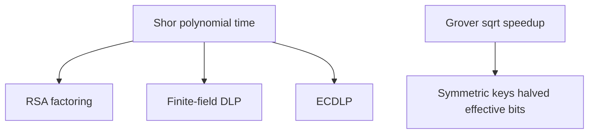
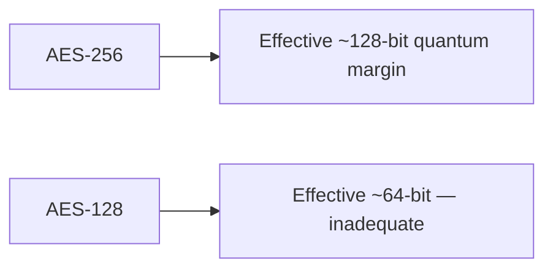

# Chapter 3: Shor's and Grover's Algorithms

This is the **kill chain** chapter: which algorithms die, which shrink security margins, and what you must replace first.

**Figure 3.1 — Attack map to primitives**

---

Classical hardness assumptions are the contract we have been living under—Shor voids that contract for public-key systems.

## 3.1 The Foundation of Classical Cryptographic Security

Modern cryptography does not rely on secrecy of algorithms. Instead, it rests on a fundamentally different pillar: the assumption that certain mathematical problems are computationally intractable for any classical computer, regardless of the ingenuity of the attacker. This is a subtle but critical distinction. We do not claim these problems are impossible to solve — only that solving them requires resources (time, memory, energy) that exceed what any adversary could plausibly muster within a meaningful timeframe.

This entire framework is built on unproven assumptions. No one has ever proven that integer factorization or discrete logarithm computation is inherently hard. We have no proof that P does not equal NP. What we have instead is decades of empirical evidence: generations of brilliant mathematicians and computer scientists have tried — and failed — to find efficient algorithms for these problems. This accumulated failure constitutes our evidence of security, and it has served us remarkably well for over four decades.

### The Three Pillars of Public-Key Security

The central hard problems underpinning virtually all deployed public-key cryptography are:

**Integer Factorization Problem (IFP):** Given a composite integer N = p * q, where p and q are large primes each approximately n/2 bits long, find the factors p and q. RSA encryption and RSA signatures rely directly on this problem. The product N can be computed trivially in O(n^2) time, but reversing this multiplication — finding p and q given only N — appears to require sub-exponential time with the best known algorithms.

**Discrete Logarithm Problem (DLP):** Given a cyclic group G of order q with generator g, and an element h in G, find the integer x (with 0 <= x < q) such that g^x = h. The Diffie-Hellman key exchange protocol, DSA signatures, and ElGamal encryption all derive their security from this problem, typically instantiated in multiplicative groups of finite fields Z_p* where p is a large prime.

**Elliptic Curve Discrete Logarithm Problem (ECDLP):** Given an elliptic curve E defined over a finite field F_q, a base point P of order n on E, and a point Q = kP (computed via the group law of the elliptic curve), find the scalar k. ECDH key exchange, ECDSA signatures, and EdDSA all rely on this problem. The ECDLP is considered harder than the DLP in finite fields because index calculus methods do not transfer to generic elliptic curve groups.

### Classical Algorithmic Complexity

The best known classical algorithms for these problems operate in sub-exponential or fully exponential time:

**For Integer Factorization:** The General Number Field Sieve (GNFS) achieves a running time of O(exp(c * n^(1/3) * (log n)^(2/3))) where n is the number of bits in N and c is approximately 1.923. For a 2048-bit RSA modulus, this translates to roughly 2^112 operations — placing it firmly beyond the reach of any classical computer or network of computers operating for any reasonable duration. The largest number factored by GNFS as of 2024 is RSA-250, an 829-bit number, which required approximately 2700 core-years of computation.

**For Discrete Logarithm in Finite Fields:** Index calculus methods achieve complexity similar to GNFS, approximately O(exp(c * n^(1/3) * (log n)^(2/3))). The best records are comparable to factoring records of similar bit sizes, achieved through massive distributed computations.

**For ECDLP:** Unlike the previous two problems, no sub-exponential algorithm is known for generic elliptic curves. The best attacks are Pollard's rho algorithm and the baby-step giant-step algorithm, both achieving O(sqrt(n)) = O(2^(k/2)) complexity where k is the bit-length of the group order. This means a 256-bit elliptic curve provides approximately 128 bits of classical security — hence the efficiency advantage of ECC over RSA (256-bit ECC keys provide comparable security to 3072-bit RSA keys).

### Why These Problems Are Chosen

The choice of these particular problems is not arbitrary. Good cryptographic hard problems must satisfy several properties simultaneously. They must be hard on average, not merely in the worst case. They must have a trapdoor structure allowing efficient computation in one direction (public key operations) while remaining hard in the reverse direction (private key recovery). They must permit efficient key generation through knowledge of the secret structure. And they must have been studied extensively enough that confidence in their hardness is well-founded.

For forty years, this approach has proven extraordinarily successful. Despite enormous financial incentives (breaking RSA would enable stealing billions), no one has found polynomial-time classical algorithms for any of these problems. But quantum computers change the calculus entirely.

> **Author's note:** Treat Shor-vulnerable keys as **expired** once CRQC exists—plan backward from data lifetime.

**Figure 3.2 — Grover impact on AES**

## 3.2 Shor's Algorithm: The Quantum Threat to Public-Key Cryptography

In 1994, Peter Shor, working at Bell Labs, published a quantum algorithm that solves both integer factorization and discrete logarithm in polynomial time. This single paper represents perhaps the most consequential algorithmic discovery in the history of computer science — not because of what it enables constructively, but because of what it destroys. Shor's algorithm renders the entire foundation of public-key cryptography obsolete, given a sufficiently powerful quantum computer.

### Conceptual Foundation: Period Finding

The key insight underlying Shor's algorithm is that both factoring and discrete logarithm can be reduced to a problem quantum computers solve efficiently: finding the period of a periodic function. Classical computers have no known efficient method for period finding in general, but quantum computers exploit quantum interference — the same phenomenon that creates diffraction patterns with light — to extract periodicity from superpositions of function values.

The algorithm divides cleanly into two parts: a classical reduction that converts the cryptographic problem into a period-finding problem, and a quantum subroutine that solves the period-finding problem using quantum parallelism and the Quantum Fourier Transform.

### The Factoring Algorithm: Step by Step

Given a composite integer N to factor (where N is the product of two large primes), Shor's algorithm proceeds as follows:

**Step 1 — Classical Preprocessing:** Choose a random integer a uniformly from {2, 3, ..., N-1}. Compute gcd(a, N) using Euclid's algorithm. If gcd(a, N) > 1, we have found a factor of N (this happens with negligible probability for random a when N has only two large prime factors). Otherwise, proceed with this a.

**Step 2 — Problem Reformulation:** We now need to find the order r of a modulo N — that is, the smallest positive integer r such that a^r is congruent to 1 modulo N. Once we have r, classical number theory gives us the factors with high probability.

**Step 3 — Quantum State Preparation:** Prepare two quantum registers. The first register contains n = ceil(log2(N^2)) qubits (providing sufficient precision), initialized to |0>. The second register contains ceil(log2(N)) qubits, also initialized to |0>. Apply Hadamard gates to every qubit in the first register, creating a uniform superposition over all values from 0 to 2^n - 1:

State after Hadamard: (1/sqrt(2^n)) * sum_{x=0}^{2^n - 1} |x>|0>

**Step 4 — Modular Exponentiation:** Apply the unitary operator that maps |x>|0> to |x>|a^x mod N>. This is the computationally expensive quantum step, requiring a reversible circuit for modular exponentiation. After this operation, the state becomes:

(1/sqrt(2^n)) * sum_{x=0}^{2^n - 1} |x>|a^x mod N>

The key property is that the function f(x) = a^x mod N is periodic with period r. The second register now contains values that repeat with period r, and the first register is entangled with the second in a periodic pattern.

**Step 5 — Quantum Fourier Transform:** Apply the Quantum Fourier Transform (QFT) to the first register only. The QFT maps the computational basis state |j> to (1/sqrt(2^n)) * sum_{k=0}^{2^n - 1} exp(2*pi*i*j*k/2^n) |k>. Applied to a state with period r, the QFT concentrates the amplitude on states |k> where k is close to a multiple of 2^n / r. This is precisely analogous to how a classical Fourier transform converts a periodic time-domain signal into frequency-domain peaks.

**Step 6 — Measurement:** Measure the first register. The outcome k will, with high probability, be close to some integer multiple j * (2^n / r) for some j in {0, 1, ..., r-1}. This gives us the rational approximation k/2^n that is close to j/r.

**Step 7 — Classical Post-Processing:** Use the continued fractions algorithm to extract r from the measured value k/2^n. The continued fractions algorithm efficiently finds the best rational approximation j/r to the decimal k/2^n with denominator bounded by N. If we obtain the correct r (or a divisor of r), proceed. Otherwise, repeat the quantum steps with a new random a or new measurement.

**Step 8 — Extracting Factors:** If r is even (which occurs with probability at least 1/2 for random a), compute gcd(a^(r/2) + 1, N) and gcd(a^(r/2) - 1, N). With probability at least 1/2 (conditioned on r being even), at least one of these GCDs yields a non-trivial factor of N. The total success probability per iteration is at least 1/4, so O(1) repetitions suffice.

### The Quantum Fourier Transform in Detail

The Quantum Fourier Transform is the heart of Shor's algorithm — the component that gives quantum computers their exponential advantage for this problem. The QFT maps an n-qubit state |j> (representing the integer j in binary) to:

QFT|j> = (1/sqrt(2^n)) * sum_{k=0}^{2^n-1} exp(2*pi*i*j*k/2^n) |k>

This can be decomposed into a product representation that reveals the efficient circuit structure:

QFT|j> = (1/sqrt(2^n)) * tensor_product_{l=1}^{n} (|0> + exp(2*pi*i*j/2^l) |1>)

The circuit implementation requires only n Hadamard gates and n(n-1)/2 controlled rotation gates, giving a total gate count of O(n^2). This is exponentially more efficient than the classical Fast Fourier Transform (FFT), which requires O(n * 2^n) operations on a vector of 2^n elements. The quantum advantage arises because the QFT operates on the amplitudes of a quantum state — which encode 2^n values using only n qubits — whereas the classical FFT must explicitly manipulate all 2^n values.

Each controlled rotation gate R_k applies a phase of exp(2*pi*i/2^k) conditioned on a control qubit. The gates are applied in a specific pattern: qubit 1 receives a Hadamard followed by controlled rotations from all subsequent qubits; qubit 2 receives a Hadamard followed by controlled rotations from qubits 3 through n; and so on. A final swap operation reverses the qubit ordering.

### Complexity Analysis

The overall complexity of Shor's algorithm decomposes as follows:

**Quantum Circuit for Modular Exponentiation:** This is the most expensive component. Computing a^x mod N reversibly requires O(n^2) elementary quantum gates using schoolbook multiplication, or O(n * log n * log log n) gates using asymptotically faster multiplication algorithms. The circuit depth (important for error correction overhead) is O(n^2) to O(n^3) depending on the implementation strategy and parallelism trade-offs.

**Quantum Fourier Transform:** Requires O(n^2) gates and O(n) depth with full parallelization. In practice, approximate QFT implementations that drop small-angle rotations below a threshold can reduce this to O(n * log n) gates without affecting the algorithm's success probability.

**Overall Running Time:** The total quantum gate complexity is O(n^2 * log n * log log n) for the best known implementations. This is polynomial in n — specifically, roughly cubic in the number of bits of N. Compare this to the GNFS running time of O(exp(1.923 * n^(1/3) * (log n)^(2/3))), which is sub-exponential but super-polynomial.

**Concrete Comparison for RSA-2048 (n = 2048 bits):**

| Metric | Classical (GNFS) | Quantum (Shor's) |
|--------|-----------------|-------------------|
| Time complexity | ~2^112 operations | ~2^26 quantum operations |
| Wall-clock time | Billions of years (single core) | Hours to days (on CRQC) |
| Parallelizability | High (distributed) | Limited (sequential iterations) |
| Memory | Enormous (petabytes) | ~4000+ logical qubits |

The exponential-to-polynomial collapse means that no amount of key-size increase can save RSA against a quantum computer. Doubling the RSA key length from 2048 to 4096 bits increases the classical attack cost by a factor of roughly 2^35, but only increases the quantum attack cost by a factor of about 8 (since Shor's scales polynomially). This is fundamentally different from symmetric key cryptography where doubling the key size squares the attack cost.

### Resource Requirements for Breaking RSA-2048

Translating the abstract gate complexity into physical resource estimates requires accounting for quantum error correction overhead. Logical qubits must be encoded in many physical qubits to achieve fault tolerance, and the overhead depends on the error rate of physical qubits and the error correction code used.

**Logical Qubit Requirements:** The most optimized implementations of Shor's algorithm for RSA-2048 require approximately 4,000-6,000 logical qubits. The 2021 paper by Gidney and Ekerå showed that 2,048 + 2 logical qubits suffice using windowed arithmetic and measurement-based uncomputation, representing a significant improvement over naive implementations that require 3n to 5n logical qubits.

**T-gate Count and Depth:** The dominant cost in fault-tolerant quantum computing is T-gates (pi/8 rotation gates), as these require expensive magic state distillation. The Gidney-Ekerå construction requires approximately 2.7 * 10^9 Toffoli gates (each decomposable into T-gates). The overall T-depth is approximately 10^10, meaning the computation requires roughly 10 billion sequential layers of T-gates.

**Physical Qubit Requirements:** Using the surface code (the leading candidate for error correction) with physical qubit error rates of approximately 10^-3 (achievable in current superconducting qubit systems), each logical qubit requires roughly 1,000 to 5,000 physical qubits depending on the required code distance. Total physical qubit estimates for breaking RSA-2048 range from approximately 4 million (optimistic, assuming low error rates and efficient architectures) to 20 million (conservative, assuming higher error rates and less aggressive optimization).

**Time Estimates:** With a quantum gate clock speed of 1 microsecond (typical for superconducting qubits) and accounting for error correction overhead (each logical operation requires multiple rounds of syndrome measurement), total execution time estimates range from 8 hours to several days. Faster gate times (achievable with trapped ions at slower clock speeds but higher fidelity, or with future superconducting architectures) could alter this considerably.

**Recent Optimization Milestones:**

| Research Group | Year | Logical Qubits | Toffoli Gates | Key Innovation |
|---------------|------|----------------|---------------|----------------|
| Beauregard | 2003 | 2n + 3 | O(n^3) | In-place addition |
| Häner et al. | 2017 | 2n + 2 | O(n^2 * log n) | Windowed arithmetic |
| Gidney & Ekerå | 2021 | 2n + 2 | ~0.3n^2 * n | Measurement-based uncomputation |
| Latest estimates | 2024 | ~2050 | ~2.7 * 10^9 | Combined optimizations |

### Shor's Algorithm for the Discrete Logarithm Problem

Shor's algorithm extends naturally to computing discrete logarithms, breaking Diffie-Hellman, DSA, and related schemes. The adaptation for computing discrete logarithms in a cyclic group of order N works as follows:

**Problem Statement:** Given a cyclic group G = <g> of known order N, a generator g, and a target element h = g^s where s is unknown, find s.

**Step 1:** Prepare three quantum registers. The first two registers each contain n = ceil(log2(N)) qubits initialized to superposition; the third register holds group elements.

**Step 2:** Create the superposition state: (1/N) * sum_{a=0}^{N-1} sum_{b=0}^{N-1} |a>|b>|g^a * h^b>

Since h = g^s, this equals: (1/N) * sum_{a=0}^{N-1} sum_{b=0}^{N-1} |a>|b>|g^(a + s*b)>

**Step 3:** Apply the QFT to both the first and second registers independently.

**Step 4:** Measure both registers. The measurement outcomes (u, v) satisfy the relation u + s*v is congruent to 0 modulo N (with high probability). This gives us s is congruent to -u * v^(-1) modulo N (when v is invertible).

**Step 5:** A single successful measurement yields s directly (assuming v is coprime to N), or O(1) repetitions suffice.

The gate complexity for discrete logarithm computation is comparable to factoring: O(n^2 * log n * log log n) where n = log2(N).

### Complete Destruction of Elliptic Curve Cryptography

The adaptation of Shor's algorithm to elliptic curve groups is particularly devastating because ECC achieves its efficiency precisely through smaller key sizes — which translates to requiring fewer qubits to break.

For an elliptic curve defined over a field F_q where q is approximately 2^k (so the curve provides approximately k/2 bits of classical security), Shor's algorithm for ECDLP requires:

- **Logical qubits:** Approximately 2k + O(log k) — roughly 521 logical qubits for the P-256 curve
- **Quantum gates:** Approximately 10^8 to 10^9 Toffoli gates for P-256
- **Physical qubits:** Approximately 500,000 to 2,500,000 with surface codes (fewer than RSA-2048)
- **Estimated runtime:** Minutes to hours on a CRQC

The irony is profound: ECC was developed and promoted specifically as a more efficient alternative to RSA, offering equivalent security with much smaller keys. But this same compactness makes it easier to attack quantumly. A quantum computer capable of breaking P-256 would require roughly 5-10 times fewer physical qubits than one capable of breaking RSA-2048. This means that if quantum computing progress follows a gradual trajectory, ECC will become vulnerable significantly before RSA does — the opposite of the classical security ranking.

This affects every system using ECDH for key exchange, ECDSA or EdDSA for digital signatures, and any protocol built upon these primitives. TLS 1.3 uses ECDH by default for key establishment; SSH commonly uses Ed25519; Bitcoin and Ethereum use secp256k1 ECDSA; and Signal Protocol uses X25519 for its key agreement.

## 3.3 Grover's Algorithm: The Quadratic Speedup

In 1996, Lov Grover published a quantum algorithm for unstructured search that achieves a quadratic speedup over any classical algorithm. Unlike Shor's algorithm, which provides an exponential speedup for structured algebraic problems, Grover's provides a more modest — but still significant — quadratic improvement for generic search problems. Crucially, this quadratic speedup has been proven optimal: no quantum algorithm can search an unstructured database faster than O(sqrt(N)).

### The Search Problem

The formal problem is as follows: Given a boolean function f: {0,1}^n -> {0,1} (implemented as a quantum oracle) that evaluates to 1 for exactly one input x_0 (the "marked item") and 0 for all other inputs, find x_0.

Classically, any algorithm must evaluate f at least 2^n / 2 times on average (and 2^n - 1 times in the worst case) since there is no structure to exploit — the marked item could be anywhere. Grover's algorithm finds x_0 with high probability using only O(sqrt(2^n)) = O(2^(n/2)) oracle queries.

### The Algorithm: Amplitude Amplification

Grover's algorithm is best understood as a rotation in a two-dimensional subspace. Define |w> = |x_0> (the target state) and |s> = (1/sqrt(2^n)) * sum_x |x> (the uniform superposition). The algorithm works by repeatedly rotating the state vector toward |w> in the plane spanned by |w> and the component of |s> orthogonal to |w>.

**Step 1 — Initialization:** Prepare the uniform superposition by applying Hadamard gates to all n qubits: |psi_0> = H^(tensor n)|0>^n = (1/sqrt(2^n)) * sum_{x=0}^{2^n - 1} |x>

This state has equal amplitude 1/sqrt(2^n) on every computational basis state, including the target x_0. The initial probability of measuring x_0 is therefore 1/2^n — negligibly small.

**Step 2 — Grover Iteration (repeat k = floor(pi/4 * sqrt(2^n)) times):**

Each iteration consists of two operations:

**(a) Oracle Operator (O_f):** This operator applies a phase inversion to the marked state. It maps |x> to (-1)^f(x) |x>. Concretely, it negates the amplitude of |x_0> while leaving all other amplitudes unchanged. Implementing this requires a quantum circuit that computes f — for cryptographic applications, this means implementing the target cryptographic function (like AES or SHA) as a reversible quantum circuit.

**(b) Diffusion Operator (D):** This operator performs a reflection about the uniform superposition |s>. It is defined as D = 2|s><s| - I, which can be implemented as H^(tensor n) * (2|0><0| - I) * H^(tensor n). Geometrically, this reflects the state about the mean amplitude. After the oracle has negated the amplitude of the marked item (making it negative while others remain positive), the diffusion operator reflects about the mean — which increases the amplitude of the marked item while decreasing all others.

**Step 3 — Measurement:** After k iterations, measure all qubits in the computational basis. The probability of obtaining x_0 is sin^2((2k+1) * theta) where theta = arcsin(1/sqrt(2^n)). For the optimal k approximately equal to pi/4 * sqrt(2^n), this probability approaches 1.

### Geometric Interpretation

The evolution of Grover's algorithm has an elegant geometric interpretation. In the two-dimensional plane spanned by |w> (the target) and |s'> (the uniform superposition over non-target states), the initial state |s> makes an angle theta approximately equal to 1/sqrt(2^n) with |s'>. Each Grover iteration rotates the state by exactly 2*theta toward |w>. After approximately pi/(4*theta) approximately equal to pi/4 * sqrt(2^n) iterations, the state has rotated to align with |w>, at which point measurement yields the target with near-certainty.

This geometric picture also reveals an important subtlety: if we iterate too many times, the state rotates past |w> and the success probability decreases. The number of iterations must be chosen carefully. For the case of multiple marked items (M items out of 2^n), the optimal number of iterations is approximately pi/4 * sqrt(2^n / M).

### Oracle Construction for Cryptographic Functions

For Grover's algorithm to attack a cryptographic system, the oracle must implement the relevant cryptographic function as a reversible quantum circuit. This is where theory meets practical difficulty.

**AES Oracle:** To search for an AES-128 key, the oracle must implement AES-128 encryption as a quantum circuit. Given a known plaintext-ciphertext pair (P, C), the oracle marks key K if AES_K(P) = C. Implementing AES reversibly requires: all S-box lookups must be implemented as reversible circuits (requiring ancilla qubits to store intermediate values); the MixColumns and ShiftRows operations must be made reversible; and garbage bits must be uncomputed. Estimates suggest this requires approximately 2,000 to 7,000 qubits for the AES circuit alone, plus ancilla overhead.

**SHA-256 Oracle:** For preimage attacks on SHA-256, the oracle must implement the full SHA-256 compression function reversibly. This requires approximately 2,500 to 5,000 qubits for the hash circuit, not including ancilla.

The total qubit count for a Grover attack includes: qubits for the n-bit search space (128 or 256), qubits for the oracle circuit, ancilla qubits for maintaining reversibility, and potentially additional qubits for error correction.

### Complexity and Optimality

**Query Complexity:** Grover's algorithm uses O(sqrt(N)) = O(2^(n/2)) oracle queries where N = 2^n is the size of the search space. This is provably optimal by the BBBV theorem (Bennett, Bernstein, Brassard, Vazirani, 1997): any quantum algorithm for unstructured search must make at least Omega(sqrt(N)) queries.

**Gate Complexity:** Each Grover iteration requires one oracle call (whose cost depends on the specific function being inverted) plus O(n) gates for the diffusion operator. Total gate complexity is O(sqrt(N) * C_oracle) where C_oracle is the gate count of the oracle circuit.

**Space Complexity:** The algorithm requires n qubits for the search register plus whatever ancilla the oracle requires. For practical cryptographic attacks, total qubit requirements are moderate but non-trivial.

### Impact on Symmetric Cryptography

Grover's algorithm effectively halves the security level of all symmetric cryptographic primitives when measured in bits:

| Algorithm | Key/Output Size | Classical Security | Quantum Security (Grover) |
|-----------|----------------|-------------------|--------------------------|
| AES-128 | 128 bits | 128 bits | 64 bits |
| AES-192 | 192 bits | 192 bits | 96 bits |
| AES-256 | 256 bits | 256 bits | 128 bits |
| ChaCha20 | 256 bits | 256 bits | 128 bits |
| SHA-256 preimage | 256 bits | 256 bits | 128 bits |
| SHA-512 preimage | 512 bits | 512 bits | 256 bits |
| SHA-256 collision | 256 bits | 128 bits | ~85 bits (BHT) |
| HMAC-SHA-256 | 256-bit key | 256 bits | 128 bits |

The standard mitigation is straightforward: use AES-256 instead of AES-128, providing 128 bits of post-quantum security — universally considered sufficient for the foreseeable future.

### Practical Considerations Limiting Grover's Effectiveness

While Grover's algorithm is theoretically significant, several practical considerations substantially limit its real-world threat to symmetric cryptography:

**1. Sequential Nature:** Grover's algorithm is inherently sequential — the sqrt(N) iterations must be performed one after another, as each iteration depends on the result of the previous one. This means the algorithm cannot be parallelized in the way classical brute-force search can. A classical adversary with 2^64 processors can search a 2^128 space in 2^64 time steps. A quantum adversary with a single quantum processor searches the same space in 2^64 iterations of Grover's. Multiple quantum processors offer only marginal improvement: t quantum processors searching in parallel reduce the time to sqrt(N/t) iterations each, requiring sqrt(t * N) total quantum operations across all processors — worse than linear speedup.

**2. Circuit Depth and Coherence Time:** Each Grover iteration requires implementing the full cryptographic primitive (like AES-256) as a quantum circuit. For AES-256, this involves approximately 2,000+ logical gates per iteration. With 2^128 iterations needed and each iteration requiring thousands of gates, the total circuit depth exceeds 10^41 — requiring quantum coherence to be maintained for an astronomical duration. With current error correction schemes, this translates to extraordinary physical qubit counts.

**3. Energy Considerations:** Landauer's principle and its quantum generalizations suggest that even with perfect reversible computation, the energy required to perform 2^64 sequential quantum operations at any reasonable clock speed would be substantial. While this argument is not as tight as for classical computation, it provides additional practical constraints.

**4. Comparison with Classical Parallelism:** The critical comparison is not "quantum Grover's vs. single classical computer" but rather "quantum Grover's vs. massively parallel classical search." A botnet or dedicated ASIC farm with 2^40 nodes can search a 128-bit keyspace in 2^88 time steps classically. Grover's would require 2^64 sequential quantum iterations. The quantum advantage is real but not as overwhelming as in the case of Shor's algorithm breaking RSA.

**5. Implementation Overhead:** The constant factors hidden in the O(sqrt(N)) notation are substantial. The reversible circuit for AES requires careful management of ancilla qubits, garbage collection, and T-gate distillation. Realistic estimates suggest that breaking AES-256 with Grover's would require quantum resources so enormous as to be impractical for decades or centuries beyond the point where Shor's algorithm becomes feasible for breaking RSA.

For these reasons, the cryptographic community's consensus is that Grover's algorithm poses a manageable threat to symmetric cryptography. The recommended mitigation — doubling key sizes — is simple, well-understood, and carries minimal performance overhead. The existential threat to cryptography comes from Shor's algorithm attacking public-key systems, not from Grover's algorithm attacking symmetric systems.

## 3.4 Other Quantum Algorithms Relevant to Cryptography

Beyond Shor's and Grover's, several other quantum algorithms have implications for cryptographic security, either by providing additional attack capabilities or by illuminating the boundary between quantum-hard and quantum-easy problems.

### Simon's Algorithm

Simon's algorithm (1994) solves the following problem: given a function f: {0,1}^n -> {0,1}^n with the promise that there exists a secret string s such that f(x) = f(y) if and only if x XOR y is in {0, s} (i.e., f is either one-to-one or two-to-one with structure determined by s), find s. The algorithm requires only O(n) quantum queries, compared to Omega(2^(n/2)) classical queries — an exponential separation.

**Cryptographic Relevance:** Simon's algorithm is directly applicable to attacking certain block cipher constructions when the attacker has quantum superposition access to the encryption oracle (the Q2 or quantum chosen-plaintext model). Specifically:

- The two-round Even-Mansour construction can be broken in polynomial quantum queries
- Certain modes of operation (like CBC-MAC) become insecure under quantum superposition attacks
- The Poly1305 MAC is vulnerable to Simon-style attacks in the superposition oracle model
- Offset codebook mode (OCB) and related authenticated encryption schemes require careful analysis

The practical relevance of Simon's algorithm is debated: the Q2 model assumes the attacker can make quantum superposition queries to the cryptographic primitive, which requires the legitimate user's hardware to process quantum states — an unrealistic assumption in most deployed scenarios. However, it is relevant for analyzing the quantum security of symmetric constructions in theoretical cryptography and may become relevant in settings where quantum computers serve as oracles (e.g., in cloud computing scenarios or for quantum-accessible random oracles in post-quantum security proofs).

### The Hidden Subgroup Problem Framework

Many quantum speedups, including Shor's algorithm, are instances of the Hidden Subgroup Problem (HSP). The HSP is defined as follows: given a group G and a function f: G -> X that is constant on (left) cosets of an unknown subgroup H and distinct across different cosets, determine H.

**Abelian HSP:** When G is abelian (commutative), the HSP can be solved efficiently in polynomial time using the quantum Fourier transform over G. Shor's factoring algorithm is the HSP over Z (with H = rZ for the order r). Shor's discrete logarithm algorithm is the HSP over Z x Z. The QFT over finite abelian groups generalizes naturally, and efficient quantum circuits exist for any abelian group.

**Non-Abelian HSP:** When G is non-abelian, the situation is dramatically different. Despite decades of effort, no efficient quantum algorithm is known for the HSP over general non-abelian groups. Specific cases of interest include:

- *Symmetric group S_n:* The HSP over S_n would solve graph isomorphism in polynomial time. No efficient quantum algorithm is known.
- *Dihedral group D_n:* The HSP over D_n is related to finding the shortest vector in a lattice. Only subexponential-time quantum algorithms are known (not polynomial).
- *Free groups and braid groups:* These are relevant to certain proposed cryptographic schemes.

The difficulty of non-abelian HSP is actually good news for post-quantum cryptography. Several PQC proposals derive their security from problems that can be phrased as non-abelian HSP instances, and the apparent quantum hardness of these problems provides evidence for the security of the corresponding cryptographic schemes. The hardness of the dihedral HSP, in particular, provides evidence that lattice problems (which underlie NIST's primary PQC standards) are resistant to quantum attacks.

### Quantum Walk Algorithms

Quantum walks — the quantum analog of classical random walks on graphs — provide polynomial speedups for various computational problems. Unlike Shor's exponential speedup or Grover's quadratic speedup, quantum walks typically provide speedups in specific algebraic or combinatorial settings.

**Applications to Cryptanalysis:**

*Subset-Sum Problem:* Quantum walk algorithms improve the best known attacks on the subset-sum problem from classical O(2^(n/2)) (meet-in-the-middle) to approximately O(2^(n/3)) time using O(2^(n/3)) quantum memory. This is relevant because some cryptographic schemes (particularly certain hash-based and lattice-based constructions) have security related to subset-sum hardness.

*Collision Finding Enhancement:* Quantum walks on Johnson graphs improve collision-finding beyond the basic birthday attack. The Ambainis quantum walk algorithm finds collisions in approximately O(N^(1/3)) time (matching BHT but with different space-time trade-offs).

*Code-Based Cryptography:* Quantum walk techniques provide moderate speedups for information set decoding (ISD) algorithms, which are the best known attacks against code-based cryptographic schemes like Classic McEliece. The speedups are polynomial rather than exponential, meaning code-based schemes remain secure with moderately increased parameters.

*Lattice Problems:* Quantum walks and related quantum techniques provide limited speedups for lattice sieving algorithms. The best known quantum attacks on lattice problems achieve running time approximately 2^(0.2570*n) compared to classical 2^(0.2925*n) for the Shortest Vector Problem (SVP) in dimension n. This represents a meaningful but not devastating constant-factor improvement in the exponent, addressable by modest parameter increases.

### BHT Algorithm (Brassard-Hoyer-Tapp)

The BHT algorithm (1997) finds collisions in arbitrary functions more efficiently than classical algorithms, combining Grover's search with a classical birthday approach.

**The Algorithm:** Given a function f: {0,1}^n -> {0,1}^n, the BHT algorithm finds a collision (two inputs mapping to the same output) using O(2^(n/3)) quantum queries and time:

1. Classically evaluate f on 2^(n/3) random inputs, storing the results in a sorted table
2. Use Grover's algorithm to search (over the remaining inputs) for a value that collides with one of the stored values
3. The Grover search over 2^n inputs needs only sqrt(2^n / 2^(n/3)) = 2^(n/3) iterations because the probability of a collision with the table is 2^(n/3) / 2^n = 2^(-2n/3)

**Impact on Hash Functions:**

| Security Property | Hash Output n bits | Classical Security | BHT Quantum Security |
|------------------|-------------------|-------------------|---------------------|
| Preimage resistance | n | n bits | n/2 bits (Grover) |
| Second preimage | n | n bits | n/2 bits (Grover) |
| Collision resistance | n | n/2 bits | n/3 bits (BHT) |

For SHA-256: classical collision resistance is 128 bits; quantum collision resistance is approximately 85 bits (256/3). For SHA-384: quantum collision resistance is approximately 128 bits. This is why NIST recommends SHA-384 or SHA-512 for applications requiring long-term collision resistance in the post-quantum era.

### Quantum Multi-Target Attacks

When multiple targets exist (e.g., searching for any one of many keys that might be in use across a system), quantum algorithms gain additional advantage. For M targets in a space of size N:

- Classical: O(N/M) expected evaluations
- Grover's: O(sqrt(N/M)) evaluations

This means that large-scale deployments where many keys are simultaneously in use face a slightly worse security picture. If a billion (approximately 2^30) different AES-128 keys are simultaneously in use across a network, a quantum adversary needs only sqrt(2^128 / 2^30) = 2^49 Grover iterations to break any one of them — considerably less than the nominal 2^64 single-target bound. This motivates the recommendation for AES-256 even more strongly in enterprise and infrastructure contexts.

## 3.5 What Quantum Computers Cannot Break

Understanding the limits of quantum computing is just as important as understanding its capabilities. Not all hard problems succumb to quantum speedups, and identifying the boundary between quantum-easy and quantum-hard is precisely what enables the construction of post-quantum cryptographic systems.

### Information-Theoretically Secure Primitives

Some cryptographic constructions are secure against any adversary, regardless of computational power — classical or quantum:

**One-Time Pad (OTP):** The one-time pad achieves perfect secrecy (Shannon's theorem). No amount of quantum computation helps against a scheme where the key is truly random, used only once, and as long as the message. The limitation is purely practical: key distribution and single-use requirements.

**Secret Sharing (Shamir's scheme over finite fields):** Information-theoretic secret sharing remains perfectly secure against quantum adversaries. A (t, n)-threshold scheme reveals zero information about the secret to any coalition of fewer than t parties.

**Quantum Key Distribution (QKD):** QKD protocols like BB84 achieve security based on the laws of quantum physics themselves. While QKD solves the key distribution problem, it requires a quantum communication channel and has severe practical limitations (distance, speed, cost).

### Symmetric Primitives with Adequate Parameters

Symmetric cryptographic primitives are not fundamentally broken by quantum computers — they merely lose a factor of two in their security level due to Grover's algorithm. With appropriately sized parameters:

**AES-256:** Provides 128 bits of security against quantum attacks. Given the practical limitations of Grover's algorithm discussed in Section 3.3, AES-256 is universally considered quantum-safe. No algorithm beyond Grover's provides advantage against AES when treated as an ideal cipher.

**SHA-384 and SHA-512:** These hash functions maintain adequate collision resistance (128+ bits) against quantum collision-finding algorithms. SHA-3 (Keccak) similarly maintains adequate security with appropriate output sizes.

**HMAC with 256-bit keys:** HMAC constructions with sufficiently long keys maintain 128+ bit security against quantum attacks on the key search, and the HMAC security proof (based on the pseudorandomness of the compression function) does not rely on any quantum-vulnerable assumption.

### Problems Without Known Efficient Quantum Algorithms

The following mathematical problems have no known polynomial-time quantum algorithm, making them candidates for post-quantum cryptographic constructions:

**Learning With Errors (LWE) and Ring-LWE:** The LWE problem asks to distinguish (A, As + e) from uniform, where A is a random matrix, s is a secret vector, and e is a short error vector. The best known quantum algorithms for LWE run in time 2^(Omega(n)) where n is the lattice dimension — essentially no better than the best classical algorithms (up to polynomial factors and small constant improvements in the exponent). LWE is the foundation of ML-KEM and ML-DSA, the NIST post-quantum standards.

**Shortest Vector Problem (SVP) and related lattice problems:** Finding the shortest non-zero vector in a high-dimensional lattice remains hard for quantum computers. Quantum sieving algorithms achieve approximately 2^(0.2570*n) time complexity versus classical 2^(0.2925*n) — an improvement in the constant but not in the exponential scaling. For appropriate parameter choices, lattice-based schemes remain secure.

**Syndrome Decoding Problem:** Given a random binary matrix H and a syndrome s = He for some low-weight error vector e, find e. The best quantum algorithms provide only moderate polynomial speedups over classical information-set decoding algorithms. This problem underlies code-based cryptography (Classic McEliece, BIKE, HQC).

**Multivariate Quadratic (MQ) Problem:** Given a system of m quadratic equations in n variables over a finite field, find a solution. The MQ problem is NP-hard in general, and quantum computers provide at most Grover-type speedups for generic instances. This underlies multivariate signature schemes.

**Hash Function Inversion (beyond Grover):** No quantum algorithm beats Grover's sqrt(N) bound for inverting a random function. This means hash-based signatures (SPHINCS+, XMSS, LMS) derive their security from a problem where the quantum speedup is fully characterized and manageable.

**Isogeny Problems (partially):** The problem of computing isogenies between supersingular elliptic curves was believed to lack efficient quantum algorithms, forming the basis of SIKE/SIDH. However, in 2022, a classical polynomial-time attack was found (by Castryck and Decru), breaking SIKE entirely. This serves as a cautionary tale: "no known quantum attack" is weaker assurance than "proven quantum hardness." The newer SQIsign scheme uses different isogeny-related problems that remain unbroken.

### The Structural Requirement

A crucial insight emerges from studying which problems quantum computers solve efficiently: quantum algorithms exploit mathematical structure. Shor's algorithm exploits the group-theoretic structure of modular arithmetic. The QFT extracts periodicity — a form of hidden structure — from quantum states. Problems that are hard because they lack usable structure (like unstructured search, NP-hard problems on random instances, or problems over non-abelian groups) resist quantum attack.

This principle guides the design of post-quantum cryptography: choose problems whose hardness arises from the absence of the specific algebraic structures that quantum algorithms exploit. Lattice problems, error-correcting codes over random matrices, and random-looking multivariate systems all embody this principle.

## 3.6 Comprehensive Summary of Quantum Impact on Cryptographic Primitives

The following table summarizes the quantum impact across all major cryptographic primitives in current use, providing a complete reference for migration planning:

### Public-Key Cryptography (Completely Broken)

| Cryptosystem | Application | Quantum Attack | Time Complexity | Resources Required | Mitigation |
|-------------|-------------|---------------|-----------------|-------------------|------------|
| RSA-2048 | Encryption, Signatures | Shor's (factoring) | O(n^2 log n) | ~20M physical qubits | Replace with ML-KEM/ML-DSA |
| RSA-4096 | Encryption, Signatures | Shor's (factoring) | O(n^2 log n) | ~40M physical qubits | Replace with ML-KEM/ML-DSA |
| DH-2048 | Key Exchange | Shor's (DLP) | O(n^2 log n) | ~20M physical qubits | Replace with ML-KEM |
| ECDH P-256 | Key Exchange | Shor's (ECDLP) | O(n^2 log n) | ~500K-2.5M physical qubits | Replace with ML-KEM |
| ECDH P-384 | Key Exchange | Shor's (ECDLP) | O(n^2 log n) | ~750K-3.5M physical qubits | Replace with ML-KEM |
| ECDSA P-256 | Signatures | Shor's (ECDLP) | O(n^2 log n) | ~500K-2.5M physical qubits | Replace with ML-DSA |
| Ed25519 | Signatures | Shor's (ECDLP) | O(n^2 log n) | ~500K-2.5M physical qubits | Replace with ML-DSA |
| ElGamal | Encryption | Shor's (DLP) | O(n^2 log n) | ~20M physical qubits | Replace with ML-KEM |

### Symmetric Cryptography (Weakened but Survivable)

| Cryptosystem | Application | Quantum Attack | Classical Security | Quantum Security | Mitigation |
|-------------|-------------|---------------|-------------------|-----------------|------------|
| AES-128 | Block cipher | Grover's | 128 bits | 64 bits | Upgrade to AES-256 |
| AES-256 | Block cipher | Grover's | 256 bits | 128 bits | Acceptable as-is |
| ChaCha20 | Stream cipher | Grover's | 256 bits | 128 bits | Acceptable as-is |
| 3DES | Block cipher | Grover's | 112 bits | 56 bits | Already deprecated |

### Hash Functions (Weakened but Survivable)

| Hash Function | Output Size | Classical Preimage | Quantum Preimage | Classical Collision | Quantum Collision (BHT) | Mitigation |
|--------------|-------------|-------------------|-----------------|--------------------|-----------------------|------------|
| SHA-256 | 256 bits | 256 bits | 128 bits | 128 bits | ~85 bits | Use SHA-384+ for collision-critical apps |
| SHA-384 | 384 bits | 384 bits | 192 bits | 192 bits | ~128 bits | Adequate for post-quantum |
| SHA-512 | 512 bits | 512 bits | 256 bits | 256 bits | ~171 bits | Ample margin |
| SHA3-256 | 256 bits | 256 bits | 128 bits | 128 bits | ~85 bits | Use SHA3-384+ for collision-critical apps |
| SHAKE128 | Variable | Variable | Half input | Variable | 2/3 of classical | Adequate with appropriate output size |

### MACs and KDFs

| Primitive | Quantum Impact | Mitigation |
|-----------|---------------|------------|
| HMAC-SHA-256 (256-bit key) | Key security halved to 128 bits | Acceptable |
| KMAC (SHA-3 based) | Key security halved | Use 256-bit keys |
| HKDF | Underlying hash security applies | Use with SHA-384+ |
| Argon2 | Memory-hardness not affected by quantum | Acceptable |
| PBKDF2 | Security halved (Grover on password search) | Use longer passwords/passphrases |

## 3.7 The Cryptographic Apocalypse Scenario

The term "cryptographic apocalypse" (sometimes called "Y2Q" or "Q-Day") refers to the moment when a cryptographically relevant quantum computer (CRQC) becomes operational without adequate preparation by the digital infrastructure. While the term is deliberately dramatic, the scenario it describes is both technically plausible and catastrophically consequential.

### Immediate Consequences of an Unmitigated Q-Day

If a sufficiently powerful quantum computer were to become available tomorrow — before widespread post-quantum migration — the following cascading failures would occur:

**TLS/HTTPS Infrastructure Collapse:** Every "secure" connection on the internet relies on public-key cryptography for key establishment. TLS 1.2 uses RSA or ECDH key exchange; TLS 1.3 mandates ECDH (X25519 or P-256). A CRQC could compute private keys from any public key observed in a TLS handshake, enabling real-time decryption of all HTTPS traffic. Certificate authorities' signing keys would be recoverable, enabling forgery of any certificate. The entire Web PKI — the trust infrastructure of the internet — collapses simultaneously.

**VPN and Secure Communication Breakdown:** IPsec VPNs using IKEv2 with ECDH, WireGuard using X25519, and OpenVPN using RSA or ECDH all become transparent to a quantum adversary. Government classified networks (Type 1 encryption), corporate VPNs, and individual privacy tools all fail simultaneously.

**Digital Signature Forgery:** Code signing certificates, software update mechanisms, document signatures, and identity assertions all rely on RSA or ECDSA/EdDSA signatures. A quantum adversary could forge signatures on malicious software updates, impersonate certificate authorities, sign fraudulent legal documents, and compromise any system relying on digital signature-based authentication.

**Email and Messaging Security:** S/MIME, PGP/GPG, and end-to-end encrypted messaging systems (Signal, WhatsApp) all use public-key cryptography. Historical encrypted emails become readable; ongoing communications are compromised in real-time.

**Financial System Disruption:** Banking systems rely on RSA and ECC for transaction authentication, inter-bank communication (SWIFT), card payment protocols (EMV), and customer authentication. A CRQC enables forging transactions, impersonating banks, and compromising the integrity of financial records.

**Identity Infrastructure Failure:** X.509 certificates, FIDO2/WebAuthn (using ECDSA), passport chips (using ECDSA), and government identity systems all become forgeable. Digital identity ceases to have meaning.

**Cryptocurrency and Blockchain Vulnerability:** Bitcoin uses secp256k1 ECDSA for transaction signing; Ethereum uses the same. A quantum adversary could spend any Bitcoin by computing the private key from the public key (which is revealed when coins are spent from an address). Estimates suggest approximately 25% of all Bitcoin (those in addresses where the public key is known) would be immediately vulnerable.

### The "Harvest Now, Decrypt Later" Threat

Perhaps the most insidious aspect of the quantum threat is that it operates retroactively. Intelligence agencies and sophisticated adversaries are widely believed to be recording encrypted communications today — diplomatic cables, military communications, trade negotiations, corporate secrets — with the intention of decrypting them once quantum computers become available. This "harvest now, decrypt later" (HNDL) strategy means that information with long-term secrecy requirements is already at risk.

Consider the timeline: sensitive government communications often require secrecy for 25-50 years. If a CRQC becomes available in 2035-2040 (within many expert estimates), then communications encrypted today using ECDH key exchange will be retrospectively decryptable within their secrecy lifetime. The threat to confidentiality exists now, not in the future.

This is why organizations like NIST, NSA, and ENISA have emphasized the urgency of beginning post-quantum migration immediately, even though cryptographically relevant quantum computers do not yet exist. The migration timeline (standardization + implementation + deployment + retirement of legacy systems) spans years to decades, and the clock has already been running.

### Asymmetric Impact: Confidentiality vs. Authentication

The quantum threat affects confidentiality and authentication differently in terms of urgency:

**Confidentiality (Encryption):** Vulnerable retroactively due to HNDL attacks. Data encrypted today with vulnerable algorithms may be decrypted in the future. The urgency of migrating key agreement and encryption is therefore immediate — data protected today must use quantum-resistant key establishment.

**Authentication (Signatures):** Vulnerable only at the time of verification. A signature verified today using a classical algorithm is safe unless the adversary can forge a new signature at a future time. The urgency for signature migration is somewhat lower but still significant for long-lived certificates and code signing.

This asymmetry has guided NIST's prioritization: ML-KEM (key encapsulation) was standardized with particular urgency, while signature migration (ML-DSA, SLH-DSA) has slightly more relaxed timelines for some applications.

### Realistic Timeline Assessment

Expert estimates for the arrival of a CRQC capable of breaking RSA-2048 vary widely:

- **Optimistic (for quantum computing progress):** 2030-2035 — assumes rapid scaling of physical qubits and error correction breakthroughs
- **Moderate consensus:** 2035-2045 — assumes steady progress in qubit counts, connectivity, and error rates
- **Conservative:** 2045-2060+ — assumes significant unforeseen engineering challenges

Regardless of the specific timeline, the cryptographic community's consensus is that migration must begin now because: the migration process itself takes 5-15 years for large organizations; cryptographic agility (the ability to swap algorithms) must be built in advance; and the HNDL threat means data encrypted today is already at risk if it needs to remain secret for more than 10-20 years.

### Mitigating the Apocalypse: The Migration Imperative

The path away from cryptographic apocalypse requires coordinated action across the entire technology ecosystem:

**Immediate Actions (2024-2026):**
- Inventory all cryptographic dependencies
- Implement cryptographic agility in new systems
- Begin hybrid deployments (classical + post-quantum) for high-value systems
- Adopt ML-KEM for key establishment in forward-looking applications

**Near-Term Migration (2026-2030):**
- Deploy NIST PQC standards across major protocols (TLS, SSH, IPsec)
- Migrate PKI infrastructure to post-quantum signatures
- Update code signing and software distribution
- Address embedded and IoT devices with long deployment lifetimes

**Long-Term Completion (2030-2035):**
- Retire all classical-only public-key cryptography from production systems
- Complete migration of legacy systems and embedded devices
- Establish post-quantum cryptographic monitoring and agility frameworks
- Prepare for potential algorithm transitions if new attacks emerge
---

## 3.99 Author's Closing Perspective

We have used this chapter in live architecture reviews: the question is never "is the math beautiful?" but **"what do we deploy Monday, with what fallback?"** Keep a written record of assumptions (hybrid on/off, parameter sets, library versions) so auditors—and future you—know why choices were made.

If you only act on one idea from Chapter 3, make it the figure at the top: turn it into a checklist for your environment.

---
