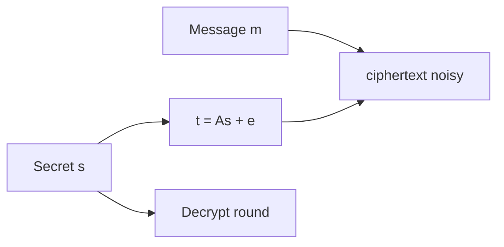
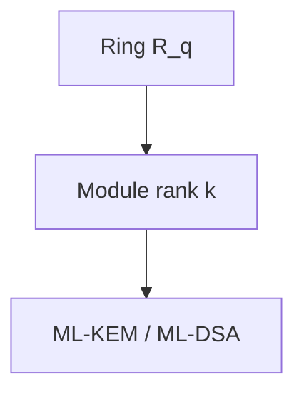

# Chapter 5: Lattice-Based Cryptography

Lattices won NIST for good reason; we explain **why Module-LWE is the workhorse** without drowning you in geometry.

**Figure 5.1 — LWE encryption intuition**



---

> **Author's note:** When in doubt, **pilot hybrid TLS** on internal services first; external customer impact is where rollback plans matter.

## 5.1 Introduction to Lattices

### Formal Definitions

A **lattice** is a discrete additive subgroup of real n-dimensional space R^n. Equivalently, a lattice L is the set of all integer linear combinations of a set of linearly independent vectors b_1, b_2, ..., b_d in R^n, called a **basis**:

```
L(B) = { sum_{i=1}^{d} x_i * b_i : x_i in Z }
```

where B = [b_1 | b_2 | ... | b_d] is the n-by-d **basis matrix** whose columns are the basis vectors. The integer d is the **rank** of the lattice, and when d = n, the lattice is called **full-rank**. Throughout this chapter, we focus primarily on full-rank lattices in Z^n (integer lattices), which are the foundation of all practical lattice-based cryptosystems.

The **fundamental domain** (or fundamental parallelepiped) of a lattice with basis B is the half-open set:

```
P(B) = { Bx : x in [0,1)^n }
```

This region tiles all of R^n when translated by lattice vectors, and its volume equals |det(B)|. This determinant, called the **lattice determinant** or **volume** of the lattice, is an invariant — it does not depend on the choice of basis.

Several geometric quantities characterize a lattice's structure. The **successive minima** lambda_1, lambda_2, ..., lambda_n are defined such that lambda_i is the smallest radius r for which the closed ball of radius r centered at the origin contains at least i linearly independent lattice vectors. The first successive minimum lambda_1(L) equals the length of the shortest non-zero lattice vector.

### Bases and the Basis Problem

A crucial property of lattices is that the same lattice admits infinitely many bases. Two basis matrices B and B' generate the same lattice if and only if B' = B * U for some unimodular matrix U (an integer matrix with determinant +/-1). These different bases can have dramatically different geometric properties.

A basis is considered "good" if its vectors are relatively short and nearly orthogonal to one another. The **Gram-Schmidt orthogonalization** of a basis B produces vectors b_1*, b_2*, ..., b_n* (not themselves lattice vectors in general), and the quality of a basis is often measured by how much the original vectors deviate from their Gram-Schmidt counterparts. The **Hadamard ratio** provides one quantitative measure:

```
H(B) = (product_{i=1}^{n} ||b_i*|| / product_{i=1}^{n} ||b_i||)^(1/n)
```

A basis with H(B) close to 1 is nearly orthogonal, while a basis with H(B) close to 0 consists of vectors that are highly correlated. The central computational challenge underlying lattice cryptography is this: given a "bad" basis (one with long, nearly parallel vectors), it is computationally infeasible to find a "good" basis for the same lattice when the dimension is sufficiently large.

### Geometric Intuition

In two dimensions, a lattice looks like a regular grid of dots — much like the atomic structure of a crystal viewed from above. Finding the shortest non-zero vector in 2D is trivial: one can visually inspect the lattice or apply the Euclidean algorithm. In three dimensions, the problem remains tractable but more subtle.

The fundamental insight is that difficulty grows exponentially with dimension. In dimension n = 500 or n = 1000, the number of lattice points within any fixed radius grows combinatorially, yet the actual shortest vector is hidden among an astronomically large set of candidate directions. The "curse of dimensionality" ensures that exhaustive search strategies become hopelessly impractical, and even sophisticated algorithms like lattice sieving require time exponential in n.

A useful analogy compares lattice problems to finding a needle in a haystack — except the haystack is n-dimensional, the needle's location is determined by global algebraic structure rather than local properties, and all known search strategies must contend with exponentially growing candidate sets.

**Minkowski's theorem** provides a fundamental geometric bound: every n-dimensional lattice of determinant det(L) contains a non-zero vector of length at most sqrt(n) * det(L)^(1/n). This bound (the "Gaussian heuristic" gives a sharper estimate of sqrt(n / (2*pi*e)) * det(L)^(1/n) for random lattices) tells us that short vectors must exist — the computational challenge is finding them. The gap between existence (guaranteed by Minkowski) and efficient computation (exponentially hard) is precisely what makes lattice cryptography possible.

The **covering radius** mu(L) of a lattice is the maximum distance from any point in R^n to the nearest lattice point. It satisfies mu(L) >= lambda_1(L)/2 and determines the worst-case difficulty of CVP. The relationship between lambda_1, mu, and det(L) constrains the geometric structure that lattice algorithms must navigate.

### q-ary Lattices

Cryptographic applications typically employ a special class called **q-ary lattices**, defined for a matrix A in Z_q^(n x m) and a positive integer q:

```
Lambda_q(A) = { x in Z^m : x = A^T * s mod q for some s in Z^n }
Lambda_q^perp(A) = { x in Z^m : A * x = 0 mod q }
```

These lattices have the convenient property that their determinant depends only on the dimensions and modulus (det = q^n for Lambda_q^perp), making their geometric properties predictable and amenable to theoretical analysis.

The LWE problem can be reformulated as a problem on q-ary lattices: given an LWE instance (A, b = A^T*s + e mod q), the vector (b, 1) lies close to the lattice Lambda_q(A) (at distance ||e|| from the nearest lattice point). Thus solving LWE is equivalent to solving BDD on a q-ary lattice, and the hardness of LWE inherits from the difficulty of lattice problems on these specific structured lattices.

Ajtai's seminal 1996 work showed that random q-ary lattices enjoy remarkable average-case hardness properties: solving SIS (and thus SVP) on a randomly chosen q-ary lattice is at least as hard as solving worst-case lattice problems on any lattice of the same dimension. This worst-case to average-case connection is unique among cryptographic assumptions — most other assumptions (factoring, discrete logarithm) are average-case statements without worst-case backing.


**Figure 5.2 — Module-LWE module view**



## 5.2 Hard Lattice Problems

### Shortest Vector Problem (SVP)

The **Shortest Vector Problem** asks: given a basis B for a lattice L, find a non-zero vector v in L that minimizes the Euclidean norm ||v||. In its exact form, SVP requires finding a vector achieving lambda_1(L). Exact SVP is known to be NP-hard under randomized reductions (Ajtai, 1998), and no polynomial-time algorithm is known even for quantum computers.

The **approximate SVP** (gamma-SVP) relaxes the requirement: find a non-zero vector v in L with ||v|| <= gamma * lambda_1(L), where gamma >= 1 is the **approximation factor**. The problem becomes easier as gamma increases. Key complexity-theoretic results include:

- For gamma = 2^(n/2), the LLL algorithm solves gamma-SVP in polynomial time.
- For gamma = poly(n), no polynomial-time algorithm is known (classical or quantum).
- For gamma = sqrt(n), GapSVP lies in NP ∩ coNP (Aharonov-Regev, 2005). For polynomial approximation factors, the problem is believed hard, but for super-polynomial gamma the problem becomes easier.
- For gamma = n^(O(1)), the problem is believed to be hard even for quantum computers — this is the regime relevant to cryptography.

The **GapSVP** (decisional version) asks to distinguish between lattices with lambda_1 <= 1 and those with lambda_1 > gamma. This gap problem features prominently in worst-case to average-case reductions.

### Closest Vector Problem (CVP)

The **Closest Vector Problem** asks: given a basis B for a lattice L and a target vector t in R^n, find the lattice vector v in L closest to t in Euclidean distance. CVP is at least as hard as SVP (there are reductions from SVP to CVP), and in many settings the two problems have essentially equivalent computational difficulty.

The **Bounded Distance Decoding** (BDD) problem is a promise version of CVP where the target is guaranteed to be within some fraction alpha < 1/2 of the minimum distance from the lattice. When alpha is sufficiently small (say, alpha < 1/(2 * sqrt(n))), BDD becomes tractable via Babai's nearest plane algorithm. The LWE problem can be formulated as a specific instance of BDD, connecting lattice geometry directly to cryptographic hardness.

### Learning With Errors (LWE)

The **Learning With Errors** problem, introduced by Oded Regev in 2005, is arguably the single most important computational problem in post-quantum cryptography. It captures the essential difficulty of lattice problems in a form amenable to cryptographic construction.

**Definition (Search-LWE):** Let n be a dimension parameter, q >= 2 a modulus, and chi an error distribution over Z (typically a discrete Gaussian with standard deviation sigma = alpha * q for some alpha > 0). Given access to arbitrarily many samples of the form:

```
(a_i, b_i) where a_i <- Z_q^n uniformly, b_i = <a_i, s> + e_i mod q, e_i <- chi
```

the search-LWE problem asks to recover the secret vector s in Z_q^n.

**Definition (Decision-LWE):** Distinguish the distribution of LWE samples (a_i, b_i) from the uniform distribution over Z_q^n x Z_q.

These two formulations are polynomially equivalent under mild conditions on the parameters (specifically, when q is a prime bounded by poly(n)).

**Regev's Reduction (2005):** The landmark result establishing LWE's hardness is a quantum reduction showing that solving decision-LWE with parameters (n, q, chi) is at least as hard as solving worst-case GapSVP and SIVP with approximation factor gamma = O(n * sqrt(n) / alpha) on arbitrary n-dimensional lattices. Concretely, this means: if there exists an efficient algorithm that solves LWE, then there exists an efficient quantum algorithm that solves GapSVP on any lattice in the worst case.

The reduction works in two stages. First, it shows that an LWE oracle can solve BDD instances on arbitrary lattices. Second, it uses a quantum procedure (based on the quantum Fourier transform over lattices) to reduce worst-case GapSVP to BDD. Peikert (2009) later provided a classical (non-quantum) reduction, though with slightly weaker parameters. Brakerski et al. (2013) further improved the classical reductions.

**The role of the error distribution** is critical. Without errors (sigma = 0), the problem reduces to solving a linear system — trivially easy. The Gaussian error creates a "fog" that obscures the linear structure just enough to make the problem hard, while still allowing correct decryption with overwhelming probability. The ratio alpha = sigma / q (relative error rate) governs the hardness-efficiency tradeoff: larger alpha means harder problems but requires larger moduli for correct decryption.

### Short Integer Solution (SIS)

The **Short Integer Solution** problem is the "dual" analogue of LWE, serving as the foundation for lattice-based hash functions and signature schemes.

**Definition (SIS_{n,m,q,beta}):** Given a uniformly random matrix A in Z_q^(n x m), find a non-zero vector x in Z^m such that:

```
A * x = 0 mod q   and   ||x|| <= beta
```

The connection to lattice problems is immediate: a solution to SIS is a short vector in the lattice Lambda_q^perp(A). Ajtai (1996) proved that solving SIS on average (over random A) is at least as hard as solving worst-case SIVP with approximation factor gamma = beta * sqrt(m). This was the first worst-case to average-case reduction for lattice problems and launched the field of lattice-based cryptography.

SIS gives rise to collision-resistant hash functions: define h_A(x) = Ax mod q for short x. Finding a collision h_A(x) = h_A(x') with x != x' yields a short vector x - x' in the kernel of A, which is precisely a SIS solution. The collision resistance of this hash function is therefore guaranteed by the worst-case hardness of lattice problems.

**The relationship between LWE and SIS** is deep and complementary. LWE is a "search in noise" problem (find the secret hidden by errors), while SIS is a "short vector" problem (find a short kernel element). In cryptographic constructions, LWE typically provides the hardness for encryption (distinguishing ciphertexts from random), while SIS provides the hardness for signatures and hash functions (finding short preimages). The duality between these problems mirrors the duality between the lattices Lambda_q and Lambda_q^perp.

**Parametric relationships:** For SIS to be hard, we need beta < q (otherwise the trivial solution with a single non-zero coordinate of value q works) and m > n * log_2(q) (otherwise the SIS instance is underdetermined and may have no short solution). The standard parameter regime is m = O(n * log q) and beta = poly(n), under which SIS is provably as hard as worst-case SIVP with approximation factor gamma = beta * O(sqrt(n * log q)).

## 5.3 Structured Lattice Problems

### The Efficiency Challenge

Plain LWE with dimension n requires public keys containing an n x n matrix over Z_q, resulting in key sizes of O(n^2 * log q) bits. For cryptographically relevant dimensions (n >= 512), this yields keys of several megabytes — impractical for most applications. Structured variants achieve dramatic size reductions by embedding algebraic structure into the matrices.

### Ring-LWE

**Ring-LWE**, introduced by Lyubashevsky, Peikert, and Regev (2010), transplants the LWE problem into the polynomial ring:

```
R_q = Z_q[x] / (x^n + 1)
```

where n is a power of 2. Elements of R_q are polynomials of degree at most n-1 with coefficients in Z_q. Multiplication in R_q is polynomial multiplication modulo x^n + 1 — equivalently, "negacyclic convolution."

**Definition (Ring-LWE):** Given samples (a_i, b_i = a_i * s + e_i) in R_q x R_q, where a_i are uniform, s is fixed, and e_i have small coefficients drawn from a discrete Gaussian, recover s (search) or distinguish from uniform (decision).

The cryptographic advantage is enormous: a single ring element encodes n coefficients, so the "matrix" in Ring-LWE is implicitly a structured n x n matrix (specifically, a negacyclic matrix) determined by a single ring element. This reduces key sizes from O(n^2 log q) to O(n log q) — a factor-n improvement.

Computationally, multiplication in R_q can be performed in O(n log n) time using the **Number Theoretic Transform** (NTT), the finite-field analogue of the FFT. When q is chosen so that x^n + 1 splits completely modulo q (which occurs when q = 1 mod 2n), the NTT maps ring multiplication to coefficient-wise multiplication, enabling extremely fast implementations.

The security of Ring-LWE rests on the hardness of the Shortest Vector Problem in ideal lattices — lattices that correspond to ideals in the ring of integers of the number field Q[x]/(x^n + 1). There exists a worst-case to average-case reduction analogous to Regev's, though restricted to ideal lattices rather than arbitrary lattices.

### Module-LWE

**Module-LWE** provides a middle ground between the strong security guarantees of plain LWE and the efficiency of Ring-LWE. It operates over vectors of ring elements — the free module R_q^k for a rank parameter k >= 1.

**Definition (Module-LWE):** Given a uniformly random matrix A in R_q^(k x k), a secret vector s in R_q^k with small entries, and error vector e in R_q^k with small entries, the Module-LWE problem asks to distinguish (A, b = A*s + e) from uniform.

The key insight is the **flexibility of k**: setting k = 1 recovers Ring-LWE, while setting n = 1 (trivial ring) and k = n recovers plain LWE. By choosing intermediate values (e.g., n = 256, k = 2, 3, or 4), one obtains schemes where:

- The algebraic structure is present but less constraining than pure Ring-LWE.
- Attacks must contend with both the ring structure and the module structure.
- Security can be scaled by adjusting k without changing the underlying ring.

NIST's selected algorithms (ML-KEM and ML-DSA) use Module-LWE and Module-SIS with n = 256 and varying k, representing the community's consensus on the optimal structure-security tradeoff.

### Security Comparison of Structured Variants

The security relationship between these problems forms a hierarchy:

| Problem | Underlying Lattice | Key Size (bits) | Reduction Quality | Attack Surface |
|---------|-------------------|-----------------|-------------------|----------------|
| Plain LWE | Arbitrary | O(n^2 log q) | Quantum worst-case | Generic lattice algorithms only |
| Module-LWE (rank k) | Module lattices | O(k * n * log q) | Worst-case over modules | Module structure may help attacks |
| Ring-LWE | Ideal lattices | O(n * log q) | Worst-case over ideals | Richest algebraic structure |

There has been significant research into whether the algebraic structure of ideal and module lattices enables faster attacks. As of 2024, no practical attack exploits the ideal or module structure to gain more than small constant-factor improvements over generic lattice algorithms. However, some theoretical results suggest that ideal lattices may have slightly shorter vectors than random lattices of the same dimension, and certain algebraic attacks (like the Gentry-Szydlo algorithm for specific ideal lattice problems) exploit ring structure in limited settings.

The consensus view is that Module-LWE with k >= 2 offers security substantially similar to plain LWE for practical parameter sizes, while the pure Ring-LWE setting (k = 1) carries slightly more risk from potential future algebraic attacks.

### Module-SIS

Analogous to Module-LWE, the **Module-SIS** problem asks: given a random matrix A in R_q^(k x l), find a short non-zero vector x in R_q^l such that A*x = 0 mod q and all coefficients of x are bounded. Module-SIS underlies the security of lattice-based signature schemes like ML-DSA, where the signer must produce short preimages under modular linear maps over polynomial rings. The relationship between Module-SIS and Module-LWE mirrors that between SIS and LWE in the unstructured setting — they are "dual" problems that together support the full range of basic cryptographic primitives.

## 5.4 Lattice-Based Encryption: The Regev/LPR Framework

### Regev's Original Encryption Scheme

Regev's 2005 paper introduced not only the LWE problem but also a complete public-key encryption scheme whose security reduces to LWE hardness.

**Key Generation:**
1. Choose parameters n (dimension), m (number of samples), q (modulus), and error distribution chi.
2. Sample a uniformly random matrix A in Z_q^(n x m).
3. Sample a secret vector s uniformly from Z_q^n.
4. Sample an error vector e from chi^m (each coordinate independently from chi).
5. Compute b = A^T * s + e in Z_q^m.
6. Public key: pk = (A, b). Secret key: sk = s.

**Encryption of a single bit mu in {0, 1}:**
1. Choose a random binary vector r in {0,1}^m.
2. Compute: c_1 = A * r in Z_q^n, c_2 = b^T * r + mu * floor(q/2) in Z_q.
3. Output ciphertext (c_1, c_2).

**Decryption:**
1. Compute v = c_2 - s^T * c_1 mod q.
2. If v is closer to 0 than to floor(q/2), output 0; otherwise output 1.

**Correctness Analysis:** Expanding the decryption computation:

```
v = c_2 - s^T * c_1
  = (b^T * r + mu * floor(q/2)) - s^T * (A * r)
  = ((A^T * s + e)^T * r + mu * floor(q/2)) - s^T * A * r
  = e^T * r + mu * floor(q/2)
```

The term e^T * r is a sum of at most m error terms (since r is binary), which is small compared to q with overwhelming probability when the parameters are chosen appropriately. Thus v is approximately mu * floor(q/2), and rounding recovers mu.

### The LPR Framework (Lyubashevsky-Peikert-Regev)

The LPR scheme (2010) adapts Regev's approach to the Ring-LWE setting, achieving dramatically smaller keys while preserving the security reduction.

**Key Generation:**
1. Fix public parameters: ring R_q = Z_q[x]/(x^n + 1), a uniformly random element a in R_q.
2. Sample secret s and error e from the discrete Gaussian distribution over R_q.
3. Compute b = a * s + e in R_q.
4. Public key: (a, b). Secret key: s.

**Encryption of a message polynomial m in R_2 (coefficients in {0,1}):**
1. Sample random r, error terms e_1, e_2 from the discrete Gaussian.
2. Compute c_1 = a * r + e_1 in R_q.
3. Compute c_2 = b * r + e_2 + floor(q/2) * m in R_q.
4. Output ciphertext (c_1, c_2).

**Decryption:**
1. Compute v = c_2 - s * c_1 in R_q.
2. For each coefficient of v: if closer to 0, decode as 0; if closer to floor(q/2), decode as 1.

**Correctness:** The decryption computes:

```
v = c_2 - s * c_1
  = (b * r + e_2 + floor(q/2) * m) - s * (a * r + e_1)
  = (a*s + e) * r + e_2 + floor(q/2) * m - s * a * r - s * e_1
  = e * r - s * e_1 + e_2 + floor(q/2) * m
```

The "noise" term (e * r - s * e_1 + e_2) is a polynomial whose coefficients are small relative to q, allowing correct decoding of each message bit. The noise grows with each multiplication, placing constraints on parameter selection.

**Multi-bit encryption:** The LPR scheme naturally encrypts n bits simultaneously (one per coefficient of the message polynomial m), achieving a message-to-ciphertext expansion ratio of approximately 2 * log_2(q) / 1 (since each message bit maps to approximately 2*log_2(q) bits of ciphertext). With compression techniques (rounding ciphertext coefficients), this ratio can be further improved.

### Decryption Failure Analysis

A critical aspect of lattice-based encryption is the non-zero probability of **decryption failure**: if the accumulated noise exceeds q/4 in any coefficient, the corresponding message bit is decoded incorrectly. The decryption failure rate (DFR) must be made negligibly small — typically below 2^(-128) or 2^(-164).

Computing the DFR precisely requires analyzing the distribution of the noise polynomial e*r - s*e_1 + e_2. For independent discrete Gaussian entries, the variance of each output coefficient can be computed as a sum of variances, and tail bounds (sub-Gaussian or Chernoff-type) give the failure probability. Parameters must be chosen so that even the worst-case coefficient stays below the decoding threshold with overwhelming probability.

The DFR interacts with security in a subtle way: a non-negligible failure probability can be exploited in chosen-ciphertext attacks. An adversary can craft ciphertexts that are likely to trigger decryption failures, and the pattern of successes and failures reveals information about the secret key. This "failure boosting" attack (D'Anvers et al., 2019) requires the DFR to be made exponentially small — hence the extremely conservative bounds (2^(-139) or lower) used in ML-KEM. The FO transform's re-encryption check provides additional protection, but the underlying DFR must still be negligible to maintain security margins.

## 5.5 From Encryption to Key Encapsulation (KEM)

### Why KEM Instead of Public-Key Encryption?

Modern cryptographic protocols overwhelmingly use **Key Encapsulation Mechanisms** (KEMs) rather than direct public-key encryption for several compelling reasons:

**Semantic clarity.** A KEM's purpose is precisely to establish a shared symmetric key between two parties. This matches the actual use case in protocols like TLS, SSH, and Signal, where the asymmetric operation exists solely to bootstrap a symmetric session key.

**Elimination of padding attacks.** Direct public-key encryption requires careful padding to prevent chosen-ciphertext attacks. Decades of experience (Bleichenbacher's attack on PKCS#1 v1.5, padding oracle attacks on OAEP implementations) demonstrate that correct implementation of padded encryption is error-prone.

**Cleaner CCA security.** Achieving chosen-ciphertext (CCA) security for KEMs is more natural than for encryption schemes. The KEM abstraction allows clean, modular security proofs.

**Composability.** The KEM/DEM (Data Encapsulation Mechanism) paradigm cleanly separates asymmetric and symmetric components. The shared key from the KEM feeds into a symmetric cipher (the DEM), and the overall security follows from a straightforward hybrid argument.

### The Fujisaki-Okamoto Transform

The **Fujisaki-Okamoto (FO) transform** is the standard technique for converting a passively secure (IND-CPA) public-key encryption scheme into an actively secure (IND-CCA2) KEM. It is employed by ML-KEM and nearly all other lattice-based KEMs submitted to NIST.

Given a deterministic PKE scheme (KeyGen, Enc, Dec) with message space M, the FO-transformed KEM operates as follows:

**KEM.Encaps(pk):**
1. Sample a random message m uniformly from M.
2. Compute the shared key: K = H(m, pk) (or a variant using the ciphertext).
3. Derive deterministic randomness: r = G(m, pk).
4. Encrypt: c = Enc(pk, m; r) (using randomness r).
5. Recompute the key as K = H(m, c) to bind the key to the ciphertext.
6. Output (c, K).

**KEM.Decaps(sk, c):**
1. Decrypt: m' = Dec(sk, c).
2. Re-derive randomness: r' = G(m', pk).
3. Re-encrypt: c' = Enc(pk, m'; r').
4. If c' = c, output K = H(m', c). Otherwise, output K = H(z, c) where z is a secret random value stored in sk (implicit rejection).

The critical security mechanism is the **re-encryption check** in step 3 of decapsulation. An adversary who submits a malformed ciphertext will, upon decryption, yield a message m' that re-encrypts to a different ciphertext c' != c, triggering the implicit rejection path. This prevents an adversary from learning anything useful about the secret key from decapsulation queries.

**Implicit rejection** (outputting a pseudorandom key rather than an error symbol for invalid ciphertexts) is essential for preventing timing side-channel attacks. An implementation that reveals whether decapsulation succeeded leaks information exploitable in chosen-ciphertext attacks.

The FO transform's security proof shows that the IND-CCA2 security of the resulting KEM reduces to the IND-CPA security of the underlying PKE scheme in the Random Oracle Model (ROM) or Quantum Random Oracle Model (QROM), with a security loss that depends on the number of hash queries and the decryption failure probability.

**Tightness considerations:** In the classical ROM, the FO transform achieves a relatively tight reduction. In the QROM (where the adversary can make superposition queries to the hash function), the security loss is larger — typically quadratic in the number of quantum queries. Recent work by Don et al. (2022) and others has improved QROM security proofs for FO variants, narrowing the gap between ROM and QROM security levels. The ML-KEM specification uses a variant of FO (specifically, the "FO-not-perp" transform with implicit rejection) whose QROM security has been carefully analyzed.

**Ciphertext compression and the FO transform:** An important implementation detail is that ciphertext compression (dropping low-order bits to reduce size) must be applied carefully within the FO framework. The re-encryption check in decapsulation must compare the re-encrypted ciphertext after compression, ensuring that the legitimate decapsulator always passes the check despite rounding. This requires that the compression function is deterministic and that compression noise is accounted for in the DFR analysis.

## 5.6 The NTRU Family

### Historical Context and the NTRU Problem

NTRU, proposed by Hoffstein, Pipher, and Silverman in 1996, predates the LWE-based framework by nearly a decade. It operates in the polynomial ring Z[x]/(x^n - 1) (or variants using x^n + 1) and derives its security from a different lattice problem that is related to, but distinct from, LWE.

**The NTRU Problem:** Given a public key h = p * g * f^(-1) mod q in the truncated polynomial ring, where f and g are "short" polynomials (small coefficients) and p is a small prime, recover f or g.

Geometrically, the NTRU problem corresponds to finding a short vector in a specific 2n-dimensional lattice — the **NTRU lattice**:

```
L_NTRU = { (u, v) in Z^(2n) : u - h*v = 0 mod q }
```

The pair (f, g) constitutes a short vector in this lattice, and recovering it breaks the scheme. The hardness of NTRU thus reduces to a specific instance of approximate SVP on structured lattices.

### NTRU Encryption in Detail

**Key Generation:**
1. Choose parameters n (degree), q (large modulus), p (small modulus, typically 3).
2. Sample small polynomials f, g in Z[x]/(x^n + 1) with coefficients in {-1, 0, 1}.
3. Verify that f is invertible modulo both q and p. If not, resample.
4. Compute f_q = f^(-1) mod q and f_p = f^(-1) mod p.
5. Public key: h = p * g * f_q mod q. Secret key: (f, f_p).

**Encryption of message m (polynomial with coefficients in {-(p-1)/2, ..., (p-1)/2}):**
1. Sample a random short polynomial r (the "blinding polynomial").
2. Compute ciphertext: c = r * h + m mod q.

**Decryption:**
1. Compute a = f * c mod q, choosing representatives in {-q/2, ..., q/2}.
2. Compute m = f_p * a mod p.

**Correctness:** Expanding:

```
a = f * c mod q = f * (r * h + m) mod q
  = f * (r * p * g * f^(-1) + m) mod q
  = p * r * g + f * m mod q
```

If the coefficients of p*r*g + f*m all lie within (-q/2, q/2), then reducing mod q does not wrap around, and subsequent reduction mod p yields m (since p*r*g vanishes mod p, and f*m mod p = m because f = 1 mod p by construction).

### NTRU vs. LWE-Based Systems: Detailed Comparison

| Property | NTRU | Module-LWE (ML-KEM) |
|----------|------|---------------------|
| Year introduced | 1996 | 2005 (LWE), 2012 (Module) |
| Hard problem | NTRU/approximate-SVP in NTRU lattice | Module-LWE |
| Worst-case reduction | Partial (ideal lattice connection) | Full quantum reduction |
| Ring structure | Z[x]/(x^n + 1) or Z[x]/(x^n - 1) | Z_q[x]/(x^n + 1) |
| Ciphertext structure | Single ring element | Pair of ring element vectors |
| Key generation | Requires invertibility check | Always succeeds |
| Decryption failures | Non-zero probability | Non-zero probability |
| Patent status | Expired (2017+) | No patents |
| NIST status | Round 4 finalist (NTRUEncrypt not selected) | Primary selection (ML-KEM) |
| Ciphertext size | Slightly smaller | Slightly larger |
| Security margin | Well-studied, specific algebraic attacks known | Broader reduction guarantees |

NIST ultimately selected ML-KEM over NTRU for standardization, citing the stronger theoretical foundations of Module-LWE and the modularity of the design allowing easy parameter scaling. However, NTRU remains a credible alternative with specific advantages in ciphertext compactness.

### NTRU Lattice Attacks and Security Analysis

The security of NTRU depends on the hardness of finding short vectors in the NTRU lattice. Specific attack strategies include:

**Lattice reduction attacks:** The most direct approach applies BKZ to the 2n-dimensional NTRU lattice to recover the short vector (f, g). The required block size for a successful attack depends on the ratio q/n and the coefficient sizes of f and g. For properly chosen parameters, this requires block sizes in the range beta = 300-400, corresponding to security levels of 2^(100) to 2^(130) operations.

**Hybrid attacks:** The "meet-in-the-middle" or hybrid lattice-combinatorial approach (Howgrave-Graham, 2007) reduces the lattice dimension by guessing a portion of the secret key combinatorially. This combines lattice reduction in reduced dimension with exhaustive search over the guessed portion. For NTRU parameters, this can reduce the effective security by 10-20 bits compared to pure lattice reduction.

**Subfield attacks:** For NTRU defined over certain rings (particularly those with non-trivial subfields), the Albrecht-Bai-Ducas (2016) subfield attack projects the problem into a lower-dimensional lattice over a subfield, potentially reducing security. This attack was instrumental in eliminating certain NTRU parameter sets from consideration and motivated the shift toward rings with fewer exploitable algebraic features.

## 5.7 Lattice-Based Signatures

### The Hash-and-Sign Paradigm: GPV Framework

The Gentry-Peikert-Vaikuntanathan (GPV, 2008) framework constructs signatures using the "hash-and-sign" paradigm, where signing requires knowledge of a short basis for a lattice.

**Key Generation:**
1. Generate a matrix A in Z_q^(n x m) together with a short basis T for Lambda_q^perp(A). (This uses trapdoor generation algorithms due to Alwen-Peikert or Micciancio-Peikert.)
2. Public key: A. Secret key: T.

**Signing a message mu:**
1. Compute the hash u = H(mu) in Z_q^n.
2. Using the short basis T, sample a short vector v in Z^m from the Gaussian distribution conditioned on A*v = u mod q. This uses the SamplePre algorithm (Gaussian sampling with a trapdoor).
3. Signature: sigma = v.

**Verification:**
1. Check that A * sigma = H(mu) mod q.
2. Check that ||sigma|| <= B for a prescribed bound B.

The security argument proceeds as follows: without the short basis T, finding a short preimage v with A*v = u mod q is precisely the Inhomogeneous SIS (ISIS) problem, which is as hard as worst-case lattice problems. The Gaussian sampling ensures that signatures do not leak information about T — all signatures are distributed according to the same discrete Gaussian regardless of which short basis was used.

**FALCON** (Fast Fourier Lattice-based Compact Signatures over NTRU) implements the GPV framework using NTRU lattices, achieving the smallest signatures among lattice-based schemes (approximately 666 bytes at NIST Level 1). The NTRU structure enables efficient Gaussian sampling via a "fast Fourier" technique over the lattice's Gram-Schmidt basis.

### Fiat-Shamir with Aborts: Lyubashevsky's Paradigm

The alternative approach, used by ML-DSA (formerly Dilithium), is based on the Fiat-Shamir transform applied to a Sigma protocol, with a critical modification called **rejection sampling** or "aborts."

**Key Generation:**
1. Sample a uniform matrix A in R_q^(k x l) (for Module-LWE/SIS).
2. Sample secret vectors s_1 in R_q^l and s_2 in R_q^k with small coefficients.
3. Compute t = A * s_1 + s_2.
4. Public key: (A, t). Secret key: (s_1, s_2).

**Signing a message mu:**
1. Sample a masking vector y uniformly from a set of polynomials with bounded coefficients ([-gamma_1 + 1, gamma_1]).
2. Compute the commitment w = A * y.
3. Extract the high-order bits: w_1 = HighBits(w).
4. Compute challenge: c = H(mu, w_1) — a polynomial with small coefficients and bounded weight.
5. Compute response: z = y + c * s_1.
6. **Rejection step:** If ||z||_inf >= gamma_1 - beta, or if the low-order bits of A*z - c*t are too large, REJECT and restart from step 1.
7. If accepted, output signature sigma = (z, c) (plus hints for verification).

**Verification:**
1. Recompute w_1' = HighBits(A*z - c*t) using the provided hints.
2. Check that c = H(mu, w_1').
3. Check that ||z||_inf < gamma_1 - beta.

**Why rejection sampling is essential:** Without the abort step, the distribution of z = y + c*s_1 depends on the secret s_1 (through c*s_1). An adversary collecting multiple signatures could observe correlations between z and c that leak information about s_1. Rejection sampling ensures that the output distribution of z, conditioned on not aborting, is statistically independent of s_1. Specifically, the scheme samples from the distribution:

```
Pr[output z] proportional to min(1, D_y(z) / (M * D_{y-cs}(z)))
```

where M is chosen so that the acceptance probability is approximately 1/M. This guarantees that accepted signatures reveal no information about the secret, achieving a form of zero-knowledge.

The rejection probability is 1 - 1/M (typically M is between 3 and 7), meaning signing requires on average M iterations. This is a modest computational overhead compensated by the scheme's simplicity and avoidance of Gaussian sampling.

**Security proof structure:** The security of the Fiat-Shamir with aborts paradigm reduces to the hardness of Module-LWE and Module-SIS simultaneously. The Module-LWE assumption ensures that the public key (A, t = A*s_1 + s_2) is computationally indistinguishable from uniform (hiding s_1 and s_2). The Module-SIS assumption ensures that no adversary can forge a signature — i.e., produce a short z with the correct algebraic relationship to a challenge c — without knowledge of the secret. The rejection sampling lemma (Lyubashevsky, 2012) formally establishes that the distribution of output signatures is statistically close to a distribution independent of s_1, preventing secret key extraction from signature transcripts.

### Comparison of Lattice Signature Approaches

| Property | GPV / FALCON | Fiat-Shamir with Aborts / ML-DSA |
|----------|-------------|----------------------------------|
| Signature size | ~666 bytes (Level 1) | ~2,420 bytes (Level 2) |
| Public key size | ~897 bytes | ~1,312 bytes |
| Signing complexity | Gaussian sampling (complex) | Rejection loop (simple) |
| Verification speed | Fast | Fast |
| Side-channel risk | Gaussian sampling is delicate | Uniform sampling is simpler |
| Security reduction | SIS/ISIS | Module-LWE + Module-SIS |
| Implementation difficulty | High (floating-point or advanced integer sampling) | Moderate |
| Constant-time implementation | Challenging | More straightforward |

## 5.8 Lattice Reduction Algorithms

Understanding lattice reduction algorithms is essential because they determine the concrete security of lattice-based schemes. These algorithms attempt to find short vectors in lattices and define the "attack boundary" that parameters must exceed.

### The LLL Algorithm (Lenstra-Lenstra-Lovasz, 1982)

LLL is the foundational polynomial-time lattice reduction algorithm. Given a basis B for a lattice in Z^n, LLL produces a **reduced basis** satisfying two conditions:

1. **Size reduction:** |mu_{i,j}| <= 1/2 for all i > j, where mu_{i,j} are the Gram-Schmidt coefficients.
2. **Lovász condition:** ||b_i*||^2 >= (3/4 - mu_{i,i-1}^2) * ||b_{i-1}*||^2 for all i.

The output basis has the property that its shortest vector satisfies:

```
||b_1|| <= 2^((n-1)/2) * lambda_1(L)
```

LLL runs in polynomial time — O(n^5 * (log B)^3) for integer entries bounded by B — making it highly practical for moderate dimensions. However, the exponential approximation factor 2^((n-1)/2) renders it insufficient for attacking cryptographic lattice parameters (where n >= 256). Its primary role in cryptanalysis is as a subroutine within more powerful algorithms.

### BKZ (Block Korkine-Zolotarev) Algorithm

BKZ, introduced by Schnorr and Euchner (1994), generalizes LLL by performing exact SVP computations on projected sublattices of block size beta. The algorithm iterates over consecutive blocks of beta vectors, solving SVP within each block and using the solution to improve the overall basis.

**BKZ-beta algorithm outline:**
1. LLL-reduce the input basis.
2. For i = 1 to n - beta + 1:
   a. Project the basis vectors b_i, ..., b_{i+beta-1} onto the orthogonal complement of b_1, ..., b_{i-1}.
   b. Solve SVP in the projected beta-dimensional sublattice.
   c. Insert the found vector into the basis and LLL-reduce.
3. Repeat until no further progress is made.

The quality of BKZ-beta output is characterized by the **root Hermite factor** delta:

```
||b_1|| approx delta^n * det(L)^(1/n)
```

where delta decreases with increasing beta according to the approximation:

```
delta approx (beta / (2 * pi * e) * (pi * beta)^(1/beta))^(1/(2*(beta-1)))
```

For beta = n, BKZ finds the exact shortest vector (it reduces to HKZ reduction), but the running time is dominated by the SVP oracle calls in dimension beta:

```
T(BKZ-beta) approx poly(n) * T(SVP in dimension beta) * (number of rounds)
```

**BKZ 2.0** (Chen-Nguyen, 2011) incorporates several practical improvements: extreme pruning of the enumeration tree, early termination heuristics, and progressive strategies that gradually increase the block size. The **progressive BKZ** variant starts with small block sizes and increases, saving considerable time in practice.

### Lattice Sieving

Lattice sieving algorithms represent the asymptotically fastest known approach to SVP. The core idea is to maintain a list of lattice vectors and iteratively combine pairs to produce shorter vectors.

**Basic sieving (AKS/NV sieve):**
1. Generate a large list of lattice vectors (via random sampling or BKZ preprocessing).
2. For each pair (v, w) in the list: if ||v - w|| < max(||v||, ||w||), replace the longer with v - w (or v + w).
3. Repeat until the shortest vector in the list reaches lambda_1 or no further progress is made.

The **GaussSieve** (Micciancio-Voulgaris, 2010) maintains a list and stack, iteratively reducing vectors against each other. The **HashSieve** and **ListSieve** variants use locality-sensitive hashing to accelerate nearest-neighbor lookups.

Asymptotic complexity of the best classical sieving algorithms:

```
Time:  2^(0.292n + o(n))
Space: 2^(0.208n + o(n))
```

These bounds derive from the kissing number in high dimensions and the analysis of random lattice vectors on the unit sphere. Practically, current implementations can solve SVP in dimension approximately 150 within reasonable time, establishing the baseline for concrete security estimates.

**The memory barrier:** A significant practical constraint on sieving algorithms is their enormous memory requirement (2^(0.208n) vectors must be stored simultaneously). For dimension n = 400, this corresponds to approximately 2^83 vectors — far exceeding available memory on any existing or foreseeable machine. This memory constraint is one reason that BKZ with enumeration-based SVP oracles (which use polynomial space) remains competitive in practice for intermediate dimensions, despite its worse asymptotic time complexity.

**Practical sieving records:** As of 2024, the Darmstadt SVP Challenge records show exact SVP solutions up to dimension 155 using optimized sieving implementations. The General Sieve Kernel (G6K) framework (Albrecht et al., 2019) combines sieving with lattice reduction in a flexible pipeline that represents the current state of the art for practical lattice attacks.

### Quantum Attacks on Lattices

The interaction between quantum computing and lattice problems represents one of the most important open questions in post-quantum cryptography. Known quantum speedups include:

**Grover-accelerated sieving:** Quantum search (Grover's algorithm) can speed up the nearest-neighbor search within sieving algorithms. The quantum sieving algorithm of Laarhoven (2015) achieves:

```
Time:  2^(0.265n + o(n))   (quantum)
Space: 2^(0.208n + o(n))   (classical memory, QRAM needed)
```

However, this improvement assumes access to quantum random access memory (QRAM), a technology whose feasibility at cryptographic scale is debated. Without QRAM, the quantum advantage is significantly reduced.

**Quantum BKZ:** Replacing the classical SVP oracle in BKZ with a quantum algorithm yields moderate speedups. The block size required to achieve a given approximation factor remains the same, but each SVP call in dimension beta takes time 2^(0.265*beta) rather than 2^(0.292*beta).

**No exponential quantum advantage:** Unlike factoring (where Shor's algorithm provides an exponential speedup), no polynomial-time quantum algorithm for lattice problems is known. The best quantum algorithms still require exponential time, with the exponent reduced by at most a modest constant factor. This structural robustness against quantum attacks is the primary reason lattice problems serve as the foundation for post-quantum cryptography.

**Quantum polynomial-time attacks?** While no such attacks are known, it remains an open theoretical question whether quantum computers might eventually solve lattice problems in polynomial time. The evidence against this includes: the NP-hardness of exact SVP (implying polynomial-time quantum algorithms would require NP contained in BQP), the structural dissimilarity between lattice problems and the hidden subgroup problems that Shor's algorithm exploits, and decades of failed attempts by the quantum algorithms community.

## 5.9 Parameter Selection

### The Core-SVP Methodology

The standard approach to estimating the concrete security of lattice-based schemes is the **Core-SVP model** (Alkim et al., 2016). The methodology proceeds as follows:

1. **Determine the optimal attack dimension beta.** For an LWE instance with dimension n, modulus q, and Gaussian error with standard deviation sigma, compute the BKZ block size beta needed to solve the unique-SVP instance encoded by the LWE samples. This uses the formula: the BKZ-beta algorithm succeeds when delta^(2*beta) * q^(n/m) <= q / sigma (or variants thereof), where delta is the root Hermite factor achievable by BKZ-beta.

2. **Estimate the cost of SVP in dimension beta.** Using the best known (quantum or classical) algorithm, the cost is 2^(c * beta) for c = 0.292 (classical sieving) or c = 0.265 (quantum sieving).

3. **Account for polynomial factors.** The number of BKZ rounds and other polynomial overhead factors contribute additional terms, though these are often absorbed into the o(n) terms.

4. **Add security margins.** To account for algorithmic improvements, implementations typically target a security level 10-20 bits above the minimum.

### Parameters in Detail: Dimensions, Moduli, and Errors

**Dimension (n and k):** The ring dimension n and module rank k together determine the lattice dimension (n * k for the Module-LWE problem). Larger dimensions increase security exponentially (each additional bit of dimension adds approximately c bits of security for some constant c that depends on other parameters).

**Modulus q:** The modulus must be large enough to accommodate the noise growth during encryption while remaining small enough to maintain security. Specifically:
- Larger q means the LWE problem is defined in a larger space, potentially making it easier.
- Smaller q means less room for errors, increasing decryption failure probability.
- ML-KEM uses q = 3329, a prime satisfying q = 1 mod 256, enabling efficient NTT computation.

**Error distribution:** ML-KEM uses a centered binomial distribution with parameter eta (CBD_eta): sample 2*eta uniform bits a_1,...,a_eta, b_1,...,b_eta and output sum(a_i) - sum(b_i). This distribution has variance eta/2 and is efficiently sampleable with constant-time implementations. Different security levels use different eta values:
- ML-KEM-512: eta_1 = 3, eta_2 = 2
- ML-KEM-768: eta_1 = 2, eta_2 = 2
- ML-KEM-1024: eta_1 = 2, eta_2 = 2

**Compression parameters:** To reduce ciphertext size, ML-KEM compresses ciphertext components by dropping low-order bits. The parameters d_u and d_v control the compression levels, trading ciphertext size for increased noise (and higher DFR).

### NIST Security Levels for ML-KEM

| Parameter | ML-KEM-512 | ML-KEM-768 | ML-KEM-1024 |
|-----------|-----------|-----------|-------------|
| Module rank k | 2 | 3 | 4 |
| Ring dimension n | 256 | 256 | 256 |
| Modulus q | 3329 | 3329 | 3329 |
| Error distribution eta_1, eta_2 | 3, 2 | 2, 2 | 2, 2 |
| Ciphertext compression (d_u, d_v) | 10, 4 | 10, 4 | 11, 5 |
| Public key size (bytes) | 800 | 1,184 | 1,568 |
| Ciphertext size (bytes) | 768 | 1,088 | 1,568 |
| Shared secret size (bytes) | 32 | 32 | 32 |
| NIST Security Level | 1 (AES-128) | 3 (AES-192) | 5 (AES-256) |
| Core-SVP security (classical) | ~118 bits | ~182 bits | ~254 bits |
| Core-SVP security (quantum) | ~107 bits | ~166 bits | ~232 bits |
| Decryption failure probability | 2^(-139) | 2^(-164) | 2^(-174) |

The choice of q = 3329 deserves special mention. This prime satisfies 3329 = 1 mod 256, meaning the polynomial x^256 + 1 splits into 256 linear factors modulo 3329. This enables a full 256-point NTT, allowing polynomial multiplication in R_q to be performed as 256 independent multiplications in Z_q — maximally efficient.

### Security Estimation Tools

The lattice cryptography community has developed several tools for concrete security estimation:

- **The Lattice Estimator** (formerly "LWE Estimator"): A SageMath library that estimates the cost of the best known attacks against LWE/LWR instances, including primal and dual attacks, coded-BKZ attacks, and algebraic attacks.
- **leaky-LWE-Estimator:** Extends security estimates to account for side-channel leakage.
- **The MATZOV report (2022):** Provided refined estimates using sophisticated combinations of lattice reduction and combinatorial techniques, suggesting some parameters had slightly less security margin than previously believed.

## 5.10 Advanced Lattice Constructions

### Fully Homomorphic Encryption (FHE)

Fully Homomorphic Encryption — the ability to compute arbitrary functions on encrypted data without decryption — is perhaps the most remarkable application of lattice-based cryptography. Gentry's breakthrough construction (2009) and all subsequent practical FHE schemes rely fundamentally on the hardness of lattice problems.

**Core mechanism:** FHE schemes encrypt messages within the "noise" of an LWE-type ciphertext. Homomorphic addition corresponds to adding ciphertexts (which adds the noise terms). Homomorphic multiplication corresponds to multiplying ciphertexts, which multiplies the noise terms — causing noise to grow. The key challenge is managing noise growth to prevent decryption failure.

**Bootstrapping:** Gentry's key insight was that a "somewhat homomorphic" scheme (supporting a limited number of operations) can be converted to a "fully" homomorphic scheme via **bootstrapping**: homomorphically evaluating the decryption circuit to "refresh" a noisy ciphertext, producing a fresh ciphertext with reduced noise. This requires the decryption circuit to have low enough depth to be evaluated within the scheme's noise budget — the **circular security** assumption or its variants.

**Modern FHE schemes** based on lattices include:
- **BGV (Brakerski-Gentry-Vaikuntanathan):** Uses modulus switching to manage noise.
- **BFV (Brakerski/Fan-Vercauteren):** Scale-invariant variant of BGV.
- **CKKS (Cheon-Kim-Kim-Song):** Supports approximate arithmetic on real/complex numbers, enabling machine learning on encrypted data.
- **TFHE (Torus FHE):** Optimized for Boolean circuit evaluation with fast bootstrapping.

All these schemes rest on the (Ring-)LWE assumption with various parameter regimes, and their security inherits the worst-case hardness guarantees of lattice problems.

### Attribute-Based Encryption (ABE)

Attribute-Based Encryption generalizes public-key encryption by allowing access policies to be embedded in keys or ciphertexts. In **ciphertext-policy ABE**, a ciphertext is associated with an access policy (e.g., "Department = Engineering AND Clearance >= Secret"), and only users whose attribute keys satisfy the policy can decrypt.

Lattice-based ABE constructions, beginning with the work of Boneh et al. (2014) and Gorbunov-Vaikuntanathan-Wee (2013), achieve:
- Full security proofs under standard (Module-)LWE assumptions.
- Support for arbitrary Boolean formulas as access policies.
- Post-quantum security, unlike pairing-based ABE which succumbs to quantum attacks.

The constructions use the **"two-to-one" recombination** technique: the decryption key for a compound policy is built by combining keys for sub-policies using lattice trapdoor operations. The technical core involves algorithms for sampling short lattice vectors that satisfy simultaneous constraints, building on the GPV framework.

### Lattice-Based Zero-Knowledge Proofs

Zero-knowledge proofs allow a prover to convince a verifier of a statement's truth without revealing any additional information. Lattice-based ZK proofs are crucial for privacy-preserving applications in the post-quantum era.

**Key constructions include:**
- **Stern-type protocols** adapted to lattices: The prover demonstrates knowledge of a short vector x with Ax = u mod q by permuting and masking the entries of x, achieving soundness through repetition.
- **Relaxed proofs of knowledge:** Lyubashevsky's rejection sampling technique enables efficient proofs of knowledge of short vectors, where the extracted witness may be slightly larger than the actual witness (a "relaxation" that suffices for most applications).
- **Lattice-based Bulletproofs:** Recent constructions achieve logarithmic proof sizes for range proofs and arithmetic circuit satisfiability.

Applications include anonymous credentials (proving possession of a valid credential without revealing which one), privacy-preserving blockchain transactions, and verifiable computation.

### Multi-Party Computation (MPC) from Lattices

Lattice assumptions enable efficient protocols for secure multi-party computation:

**Threshold decryption:** Multiple parties hold shares of a lattice-based secret key and can jointly decrypt without any single party learning the full key. This is particularly natural for LWE-based encryption, where secret sharing of the vector s allows distributed decryption by summing partial decryptions.

**Oblivious Transfer (OT) from LWE:** Efficient OT protocols (the foundation of general MPC) can be constructed directly from the LWE assumption, avoiding the need for number-theoretic assumptions vulnerable to quantum attacks.

**Threshold signatures:** Distributing the signing capability of ML-DSA across multiple parties is an active research area. The rejection sampling in Lyubashevsky's scheme creates challenges for threshold computation (all parties must agree on whether to abort), but recent protocols achieve practical efficiency.

**Homomorphic secret sharing:** Lattice-based schemes where shares support local homomorphic operations enable communication-efficient MPC for restricted function classes.
---

## 5.99 Author's Closing Perspective

We have used this chapter in live architecture reviews: the question is never "is the math beautiful?" but **"what do we deploy Monday, with what fallback?"** Keep a written record of assumptions (hybrid on/off, parameter sets, library versions) so auditors—and future you—know why choices were made.

If you only act on one idea from Chapter 5, make it the figure at the top: turn it into a checklist for your environment.

---
