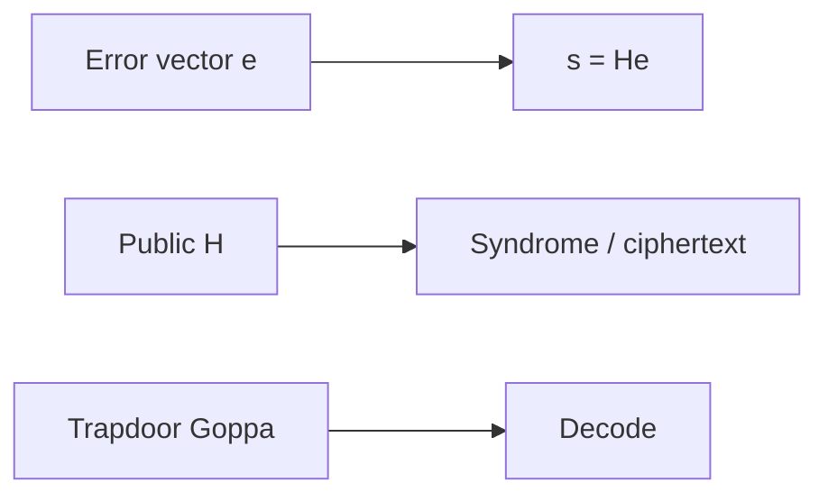

# Chapter 6: Code-Based Cryptography

McEliece is the **conservative safe** in the room—huge keys, old confidence. We use it when policy demands assumption diversity.

**Figure 6.1 — McEliece encode/decode roles**

---

## 6.1 Error-Correcting Codes: Background

Error-correcting codes were originally developed by Claude Shannon, Richard Hamming, and others in the late 1940s and 1950s to enable reliable communication over noisy channels. The fundamental idea is to introduce structured redundancy into transmitted messages so that errors introduced during transmission can be detected and corrected by the receiver. This mathematical framework, developed for communications engineering, turns out to provide precisely the right abstraction for building cryptographic systems resistant to quantum attacks.

### Linear Codes

A **linear code** C(n, k, d) over a finite field F_q is defined as a k-dimensional linear subspace of the vector space F_q^n. The parameters carry the following meaning:

- **n** (block length): The total number of symbols in each codeword. This represents the length of the transmitted sequence.
- **k** (dimension): The number of information symbols encoded in each codeword. This represents the meaningful payload.
- **d** (minimum distance): The minimum Hamming distance between any two distinct codewords, equivalently the minimum Hamming weight of any non-zero codeword (by linearity).
- **Rate** R = k/n: The ratio of information symbols to total symbols, measuring the efficiency of the encoding.

The error-correction capability of a linear code is determined by its minimum distance: a code with minimum distance d can detect up to d-1 errors and correct up to t = ⌊(d-1)/2⌋ errors. This value of t defines the error correction capability. The Hamming bound is a separate sphere-packing bound on code size: |C| ≤ q^n / V(n,t), where V(n,t) is the volume of a Hamming ball of radius t. Codes that achieve the Hamming bound with equality are called perfect codes.

The **Hamming weight** wt(v) of a vector v is the number of its non-zero coordinates. The **Hamming distance** d(u, v) between two vectors is the number of positions where they differ, which equals wt(u - v) for vectors over any field.

### Generator and Parity-Check Matrices

Linear codes admit two equivalent matrix representations that are fundamental to both their coding-theoretic and cryptographic applications:

**Generator Matrix:** A matrix G ∈ F_q^(k×n) whose rows form a basis for the code C. Any codeword c can be written as c = mG for some message vector m ∈ F_q^k. When G is in systematic form [I_k | P], the first k symbols of each codeword are the original message symbols, making encoding particularly transparent.

**Parity-Check Matrix:** A matrix H ∈ F_q^((n-k)×n) that defines the code through the condition Hc^T = 0 for all codewords c ∈ C. The rows of H form a basis for the dual code C^⊥. The matrices G and H satisfy the relation GH^T = 0.

**Syndrome:** For any received vector r = c + e (where c is the transmitted codeword and e is the error vector), the syndrome is defined as s = Hr^T = H(c + e)^T = Hc^T + He^T = He^T. The syndrome depends only on the error pattern, not on the transmitted codeword. This property is what makes syndrome-based decoding — and syndrome-based cryptography — possible.

The syndrome decoding problem asks: given H and a syndrome s, find a vector e of minimum weight such that He^T = s. For codes with efficient decoding algorithms (such as Goppa codes), this problem can be solved in polynomial time. For general random codes, it is NP-hard.

### The Dual Code and MacWilliams Identity

The dual code C^⊥ of a linear code C(n, k, d) is an (n, n-k) code consisting of all vectors orthogonal to every codeword in C. The generator matrix of C^⊥ is the parity-check matrix of C, and vice versa. The weight distributions of a code and its dual are related by the MacWilliams identity, which has implications for the security analysis of code-based schemes.

### Important Code Families

The following table summarizes the code families most relevant to code-based cryptography:

| Code Family | Parameters | Decoding Algorithm | Cryptographic Relevance |
|-------------|-----------|-------------------|------------------------|
| Binary Goppa codes | (n, n-mt, ≥2t+1) | Patterson's algorithm, O(n²) | Core of Classic McEliece |
| BCH codes | (2^m-1, k, d) | Berlekamp-Massey | Subfield subcodes used in variants |
| Reed-Solomon | (q, k, q-k+1) | Berlekamp-Welch, Guruswami-Sudan | Foundation for Goppa codes |
| LDPC codes | Various | Iterative belief propagation | Used in BIKE (as QC-MDPC) |
| Reed-Muller | (2^m, k, 2^(m-r)) | Majority logic decoding | Inner code in HQC |
| Polar codes | (2^m, k, various) | Successive cancellation | Potential future applications |
| Convolutional codes | Various | Viterbi algorithm | Streaming/lightweight applications |

**Binary Goppa codes** deserve special attention as they form the foundation of the McEliece cryptosystem. A binary Goppa code is defined by a polynomial g(x) of degree t over GF(2^m) that has no repeated roots, together with a support set L = {α_1, ..., α_n} of n distinct elements from GF(2^m) that are not roots of g(x). The code consists of all binary vectors (c_1, ..., c_n) satisfying the condition that the rational function Σ c_i / (x - α_i) equals zero modulo g(x). Such a code has minimum distance at least 2t + 1 and dimension at least n - mt, and it can be decoded in O(n²) time using Patterson's algorithm.

The crucial property of Goppa codes for cryptography is that they are indistinguishable from random linear codes (to the best of current knowledge) when the defining polynomial and support set are hidden. This indistinguishability assumption, combined with the hardness of decoding random codes, provides the security foundation for the McEliece system.

> **Author's note:** Classic McEliece keys are a **packet size** problem—validate MTU and CDN limits before edge TLS promises.

## 6.2 The McEliece Cryptosystem

Robert McEliece proposed his public-key encryption system at the 1978 IEEE International Symposium on Information Theory. The system was revolutionary in its approach: rather than relying on number-theoretic problems like factoring or discrete logarithms, it drew its security from the computational difficulty of decoding general linear codes. Despite receiving less attention than RSA in the following decades due to its large key sizes, the McEliece system has proven remarkably resistant to cryptanalysis.

### Construction

**Key Generation:**

1. Select parameters (n, k, t) defining the code capability. The parameter t determines the number of errors the code can correct.
2. Choose a random irreducible polynomial g(x) of degree t over GF(2^m) where n ≤ 2^m. This polynomial defines a binary Goppa code Γ.
3. Choose a random support set L = {α_1, ..., α_n} of n distinct elements from GF(2^m) that are not roots of g(x).
4. Compute the generator matrix G' ∈ F_2^(k×n) for the Goppa code Γ.
5. Choose a random invertible k × k binary matrix S (the scrambling matrix).
6. Choose a random n × n permutation matrix P.
7. Compute the public key: G_pub = S · G' · P.
8. The secret key consists of: (S, g(x), L, P) — the scrambling matrix, Goppa polynomial, support set, and permutation.

The public key G_pub appears to be the generator matrix of a random linear (n, k) code, since the scrambling and permutation operations destroy the visible algebraic structure of the Goppa code.

**Encryption:**

To encrypt a k-bit message m:
1. Choose a random error vector e ∈ F_2^n of Hamming weight exactly t.
2. Compute the ciphertext: c = m · G_pub + e.

The ciphertext c is an n-bit vector. The error vector e acts as a randomizing element, ensuring that the same plaintext produces different ciphertexts each time (providing semantic security when combined with appropriate padding).

**Decryption:**

To decrypt a ciphertext c:
1. Compute c' = c · P^(-1) = m · S · G' · P · P^(-1) + e · P^(-1) = m · S · G' + e', where e' = e · P^(-1) has the same Hamming weight t as e (permutation preserves weight).
2. Apply the efficient Goppa decoder (Patterson's algorithm) to c'. Since e' has weight t and the Goppa code corrects t errors, this recovers the vector m · S (the encoded message before scrambling).
3. Recover the original message: m = (m · S) · S^(-1).

The decryption works because only the holder of the secret key knows the permutation P (to remove before decoding), the Goppa code structure (to perform efficient decoding), and the scrambling matrix S (to recover the original message).

### Security Basis

The security of the McEliece cryptosystem rests on two complementary computational assumptions:

**1. Indistinguishability Assumption:** The public key G_pub = S · G' · P is computationally indistinguishable from a uniformly random k × n binary matrix. If an adversary could distinguish the public key from random, they could potentially recover the hidden Goppa code structure and decode efficiently. Decades of research have produced no efficient distinguisher for Goppa codes at cryptographic parameters, though distinguishers exist for certain other code families (which is why the choice of code is critical).

**2. Hardness of Syndrome Decoding:** Even given the public generator matrix G_pub, recovering the message m from the ciphertext c = m · G_pub + e requires finding the low-weight error vector e. This is equivalent to the syndrome decoding problem for a random-appearing linear code, which is NP-hard in the worst case and believed to be hard on average for appropriate parameter choices.

These two assumptions are independent: even if the code could be partially distinguished, the decoding problem remains hard; conversely, even a perfect random code requires exponential time to decode.

### Parameters and Key Sizes

The primary practical limitation of Classic McEliece is its large public key size. The public key is a k × (n-k) matrix (when stored in systematic form), requiring k(n-k) bits:

| Security Level | n | k | t | Public Key | Ciphertext | Decapsulation |
|---------------|------|------|-----|-----------|------------|---------------|
| NIST Level 1 | 3488 | 2720 | 64 | 261,120 B | 128 B | Fast |
| NIST Level 3 | 4608 | 3360 | 96 | 524,160 B | 188 B | Fast |
| NIST Level 5 | 6688 | 5024 | 128 | 1,044,992 B | 240 B | Fast |
| NIST Level 5 (f) | 6960 | 5413 | 119 | 1,047,319 B | 226 B | Fast |
| NIST Level 5 (alt) | 8192 | 6528 | 128 | 1,357,824 B | 240 B | Fast |

Despite the large keys, Classic McEliece offers extremely fast encryption and decryption operations (on the order of microseconds for encapsulation and decapsulation), very small ciphertexts (128-240 bytes depending on security level), and well-understood security based on nearly 50 years of cryptanalysis. The NIST post-quantum standardization process selected Classic McEliece as one of the candidates advancing to standardization, recognizing its exceptional security confidence despite the key size disadvantage.

### CCA Security and KEM Construction

The basic McEliece scheme as described above provides only OW-CPA (one-way security against chosen-plaintext attacks). For modern applications requiring IND-CCA2 security (indistinguishability under adaptive chosen-ciphertext attacks), the scheme must be transformed into a Key Encapsulation Mechanism (KEM) using techniques such as the Fujisaki-Okamoto transform. Classic McEliece applies a variant of this transform: the encapsulator generates a random error vector e of weight t, encapsulates it as the ciphertext (syndrome), and derives the shared secret by hashing e together with the ciphertext.

## 6.3 The Syndrome Decoding Problem

The syndrome decoding problem is the fundamental computational hardness assumption underlying virtually all code-based cryptographic constructions. Its formal definition, complexity-theoretic status, and the best known algorithms for solving it determine the concrete security of deployed systems.

### Formal Definition

**Computational Syndrome Decoding (SD):** Given a random binary parity-check matrix H ∈ F_2^((n-k)×n), a target syndrome s ∈ F_2^(n-k), and a weight bound t, find a vector e ∈ F_2^n such that He^T = s and wt(e) ≤ t.

**Decisional Syndrome Decoding:** Given (H, s, t), determine whether there exists a vector e with He^T = s and wt(e) ≤ t.

### NP-Completeness

Berlekamp, McEliece, and van Tilborg proved in 1978 that the syndrome decoding problem is NP-complete by reduction from the 3-dimensional matching problem. More precisely, the decision version of SD is NP-complete, and the search version (finding the error vector) is at least as hard. This NP-completeness result applies to the worst case; however, cryptographic security requires average-case hardness.

For cryptographic applications, we rely on the stronger conjecture that syndrome decoding is hard on average for random instances with appropriate parameters. Specifically, when H is a uniformly random matrix, the error weight t is below the Gilbert-Varshamov bound (roughly n · H_2^(-1)(1 - k/n) where H_2 is the binary entropy function), and n is sufficiently large, no polynomial-time algorithm is believed to solve SD with non-negligible probability.

The connection between worst-case and average-case hardness for SD is not as clean as for lattice problems (where worst-case to average-case reductions exist). However, decades of cryptanalytic effort have produced no algorithm that exploits the average-case structure, providing strong empirical evidence for hardness.

### Quantum Complexity

Critically, no polynomial-time quantum algorithm is known for the syndrome decoding problem. This stands in stark contrast to factoring and discrete logarithm, which fall to Shor's algorithm. The best quantum approaches apply Grover's search to speed up the classical exponential-time algorithms by a quadratic factor, but the resulting complexity remains exponential. The problem structure — searching for a low-weight vector in a high-dimensional space — does not appear amenable to the Fourier sampling techniques that Shor's algorithm exploits.

## 6.4 Information Set Decoding Attacks

Information Set Decoding (ISD) constitutes the most powerful family of algorithms for attacking generic code-based cryptosystems. Understanding ISD in detail is essential for parameter selection and security analysis.

### Prange's Algorithm (1962)

The foundational ISD algorithm proceeds as follows:

1. Select a random set I of k column indices from {1, ..., n} (an "information set").
2. Restrict H to the complementary columns J = {1, ..., n} \ I, forming the submatrix H_J.
3. If H_J is invertible, solve for the error restricted to J: e_J = H_J^(-1) · s.
4. Check if wt(e_J) = t (meaning all t errors fall in the n-k positions of J, and no errors are in the k positions of I).
5. If the check passes, output the error vector. Otherwise, return to step 1.

The probability that a random information set is error-free is p = C(n-t, k) / C(n, k), and the expected number of iterations is 1/p. Each iteration requires O((n-k)^3) operations for the matrix inversion (or O((n-k)^2 · k) using systematic reduction). The total work factor is approximately:

W_Prange ≈ (n-k)^3 · C(n, t) / C(n-k, t)

For typical McEliece parameters (n=3488, k=2720, t=64), this gives a work factor around 2^150, which already exceeds the 128-bit security target.

### Lee-Brickell Algorithm (1988)

Lee and Brickell improved on Prange by allowing a small number p of errors in the information set:

1. Select a random information set I of k columns.
2. Gaussian-eliminate H to systematic form with respect to I.
3. Search for all weight-p vectors in the k information-set positions whose contribution to the syndrome matches a weight-(t-p) pattern in the remaining positions.
4. The optimal choice of p reduces the number of iterations needed at the cost of more work per iteration.

### Stern's Algorithm (1989)

Stern introduced a birthday-paradox technique that significantly improved ISD efficiency:

1. Split the information set I into two halves I_1 and I_2 of size k/2 each.
2. Choose a subset of ℓ syndrome coordinates as a "window."
3. Build two lists: L_1 contains weight-p/2 vectors on I_1 matching the window syndrome, and L_2 contains weight-p/2 vectors on I_2 matching the complementary window syndrome.
4. Collisions between L_1 and L_2 (vectors whose syndrome contributions sum to the target on the window) yield candidate solutions.

The birthday technique reduces the per-iteration cost by replacing exhaustive search over weight-p vectors with a collision search, at the expense of additional memory. The optimal choice of parameters p and ℓ gives a significant improvement over Lee-Brickell.

### BJMM Algorithm (2012)

Becker, Joux, May, and Meurer introduced the representation technique combined with nearest-neighbor search:

1. Instead of searching for a weight-p error split as (p/2, p/2), represent each weight-p/2 part as a sum of two weight-p/4 parts (with additional allowed weight from "representations").
2. Use multiple levels of merging with increasing window sizes.
3. The representation technique exploits the fact that there are many ways to write a given weight-p vector as a sum of two vectors, increasing the number of useful collisions without increasing the search space proportionally.

BJMM achieves the best known asymptotic exponents for binary ISD in several parameter regimes. For the McEliece parameters at NIST Level 1, BJMM achieves approximately 2^143 operations.

### May-Meurer-Thomae (MMT) Algorithm

The MMT algorithm introduced the representation technique slightly before BJMM (in a different form) and achieves similar complexity. It uses a two-level nearest-neighbor approach where weight-p vectors are represented as sums of vectors that are "close to" weight-p/2 (allowing some deviation). The key insight is that increasing the number of representations per solution allows the algorithm to find solutions faster, provided the merging step can be done efficiently.

### Both-May Algorithm and Further Improvements

Subsequent work by Both and May (2018) achieved further improvements by combining the representation technique with more sophisticated nearest-neighbor algorithms. Their approach uses a multi-level tree structure with carefully optimized parameters at each level. For practical cryptographic parameters, the improvements over BJMM are relatively modest (saving 1-3 bits of security), but they demonstrate that the ISD landscape continues to evolve.

### Quantum Information Set Decoding

Quantum computers can accelerate ISD algorithms through several mechanisms:

**Grover-based quantum ISD:** The most straightforward approach applies Grover's algorithm to the outer loop of Prange's algorithm (or its variants), providing a quadratic speedup in the number of iterations. For Prange, this reduces the work factor from roughly 2^(0.12n) to 2^(0.06n) for typical McEliece parameter ratios.

**Quantum walk-based approaches:** Kachigar and Tillich (2017) applied quantum random walks to the Stern/BJMM framework, achieving better speedups than naive Grover application. Their approach achieves approximately 2^117 quantum operations against McEliece Level 1 parameters.

**Limitations of quantum speedup:** The quantum speedup for ISD is fundamentally limited for several reasons. First, the collision-finding portion of modern ISD algorithms already uses birthday-type techniques that gain less from Grover than simple search. Second, the memory requirements of quantum ISD algorithms grow substantially, and quantum memory (qubits) is far more expensive than classical memory. Third, the depth-width tradeoffs in quantum circuits limit the effective parallelism available.

The consensus estimate for quantum ISD against Classic McEliece Level 1 (n=3488, k=2720, t=64) is approximately 2^129 quantum operations, providing comfortable margin above the 128-bit quantum security target.

## 6.5 Niederreiter Variant

Harald Niederreiter proposed an alternative formulation of code-based public-key encryption in 1986 that uses the parity-check matrix rather than the generator matrix. The Niederreiter system is provably equivalent to McEliece in security but offers practical advantages.

### Construction

**Key Generation:**
1. Generate a binary Goppa code with parity-check matrix H ∈ F_2^((n-k)×n).
2. Choose a random invertible (n-k) × (n-k) binary matrix S.
3. Choose a random n × n permutation matrix P.
4. Public key: H_pub = S · H · P.
5. Secret key: (S, H, P, decoder for the Goppa code).

**Encryption:**
In the Niederreiter system, the plaintext is encoded as an error vector. Specifically:
1. The message is mapped to a binary vector e of length n and Hamming weight exactly t (using a combinatorial number system or similar encoding).
2. The ciphertext is the syndrome: c = H_pub · e^T.

The ciphertext is only (n-k) bits long, compared to n bits in the McEliece system.

**Decryption:**
1. Compute S^(-1) · c = H · P · e^T = H · (Pe)^T.
2. Since Pe is a permutation of e, it has the same weight t.
3. Apply the efficient Goppa decoder to find Pe from its syndrome H · (Pe)^T.
4. Recover e = P^(-1) · (Pe).
5. Decode the error vector back to the original message.

### Advantages over McEliece

The Niederreiter formulation offers several practical advantages:

- **Smaller ciphertexts:** The ciphertext is (n-k) bits rather than n bits, providing significant bandwidth savings.
- **Natural KEM construction:** When used as a KEM, the "message" is simply a random weight-t error vector, and the shared secret is derived by hashing this vector. No separate message encoding is needed.
- **Equivalent security:** Li, Deng, and Wang proved that McEliece and Niederreiter are equivalent under appropriate reductions.
- **Cleaner implementation:** The encapsulation operation is a matrix-vector multiplication (computing a syndrome), which is simpler to implement in constant time than the McEliece encryption (matrix-vector multiply plus error addition).

Classic McEliece, the NIST standardization candidate, uses the Niederreiter formulation for exactly these reasons.

### Security Equivalence

The security equivalence between McEliece and Niederreiter can be understood informally: both systems hide the same secret (the structured code), and both systems produce outputs (ciphertext/syndrome) that are computationally indistinguishable from random to anyone who cannot decode the hidden code. The formal proof establishes a polynomial-time reduction between breaking one system and breaking the other.

## 6.6 Quasi-Cyclic Codes: BIKE and HQC

The principal drawback of Classic McEliece — its multi-hundred-kilobyte public keys — motivated extensive research into code-based systems with more compact keys. The most successful approach uses quasi-cyclic (QC) codes, where the structure of circulant matrices enables compact representation while (conjecturally) preserving computational hardness.

### Quasi-Cyclic Structure

A circulant matrix is completely determined by its first row: each subsequent row is a cyclic shift of the previous one. A quasi-cyclic code of index ℓ has a generator or parity-check matrix composed of ℓ × ℓ blocks of circulant matrices. The key insight is that each n × n circulant block can be stored as a single n-bit vector (its first row), reducing storage from n² bits to n bits per block.

Algebraically, circulant matrices correspond to elements of the ring R = F_2[x]/(x^n - 1). Multiplication of two circulant matrices corresponds to polynomial multiplication modulo x^n - 1 in this ring. When n is prime and x^n - 1 factors into irreducible polynomials of large degree over F_2, the ring has favorable algebraic properties for cryptography.

### BIKE (Bit Flipping Key Encapsulation)

BIKE is a code-based KEM built on Quasi-Cyclic Moderate Density Parity-Check (QC-MDPC) codes. It was a Round 4 candidate in the NIST standardization process.

**Code Structure:**
The parity-check matrix has the form H = [h_0 | h_1] where h_0 and h_1 are n × n circulant matrices with row weight approximately w/2 each (where w is the total row weight of H). The code is a (2n, n) quasi-cyclic code. The public key is the systematic form of the generator matrix, which can be represented as a single circulant: the first row of h_1^(-1) · h_0 (multiplication in the ring R).

**Key Generation:**
1. Choose random polynomials h_0(x) and h_1(x) in R of weight approximately w/2 each.
2. Compute the public key: h(x) = h_1(x)^(-1) · h_0(x) mod (x^n - 1).
3. The secret key is (h_0, h_1) — the sparse parity-check polynomials.

**Encapsulation:**
1. Generate a random error vector e = (e_0, e_1) of total weight t.
2. Compute the syndrome (ciphertext): c = e_0 + e_1 · h mod (x^n - 1).
3. The shared secret is derived by hashing e.

**Decapsulation:**
1. Use the secret sparse parity-check matrix to decode the error from the syndrome.
2. The decoder is an iterative bit-flipping algorithm adapted for MDPC codes.
3. Verify the decoded error has the correct weight, then derive the shared secret.

**Parameters (BIKE Level 1):**
- Block length: n = 12,323 (prime)
- Error weight: t = 134
- Parity-check weight: w = 142
- Public key: ~1,541 bytes
- Ciphertext: ~1,573 bytes
- Shared secret: 256 bits

**Decoding Challenges:**
Unlike Goppa codes, MDPC codes do not have deterministic polynomial-time decoders with guaranteed success. The iterative bit-flipping decoder may occasionally fail to decode correctly, leading to decryption failures. The decryption failure rate (DFR) must be extremely low — below 2^(-128) for IND-CCA2 security via the Fujisaki-Okamoto transform — because even a small probability of failure can be exploited through reaction attacks (where an adversary submits many ciphertexts and observes which ones cause decryption failures, gradually recovering the secret key).

Achieving such low DFR while maintaining efficiency is one of the main technical challenges for BIKE. The Black-Gray-Flip (BGF) decoder used in BIKE's specification has been extensively analyzed, but proving DFR bounds rigorously remains difficult, and most estimates rely on extrapolation from simulations.

**Timing Side-Channels:**
The bit-flipping decoder's execution time depends on the error pattern and the secret key structure, creating potential timing side-channels. Constant-time implementations must carefully control the number of iterations and avoid data-dependent branching.

### HQC (Hamming Quasi-Cyclic)

HQC takes a fundamentally different approach from both Classic McEliece and BIKE. Rather than hiding a structured code within a random-looking matrix, HQC is based on the hardness of the decisional quasi-cyclic syndrome decoding problem: distinguishing random QC codes from structured ones.

**Design Philosophy:**
HQC uses a two-layer code structure:
- An outer random quasi-cyclic code provides the hard problem (indistinguishability from random).
- An inner deterministic code (Reed-Muller or tensor product code) provides efficient error correction with guaranteed success.

**Key Generation:**
1. Choose a random quasi-cyclic vector h (the public code description).
2. Choose a secret sparse vector x and a secret sparse error vector y.
3. Compute the public key: (h, s = h · x + y) where the multiplication is in the ring R = F_2[x]/(x^n - 1).
4. The secret key is x.

**Encapsulation:**
1. Choose random sparse vectors r_1, r_2, and a random error e.
2. Compute u = h · r_1 + r_2 and v = s · r_1 + e + Encode(m), where Encode uses the inner code and m is a random message.
3. The ciphertext is (u, v), and the shared secret is derived from m.

**Decapsulation:**
1. Compute v - u · x = s · r_1 + e + Encode(m) - (h · r_1 + r_2) · x = (h · x + y) · r_1 + e + Encode(m) - h · r_1 · x - r_2 · x = y · r_1 - r_2 · x + e + Encode(m).
2. The terms y · r_1 - r_2 · x + e form a noise vector. Because y, r_1, r_2, x, and e are all sparse, this noise has bounded weight.
3. Apply the inner code decoder to recover m.
4. Re-encapsulate with m to verify correctness, then derive the shared secret.

**Parameters (HQC-128, NIST Level 1):**
- Quasi-cyclic block length: n = 17,669
- Secret/error weight: w = 66
- Public key: ~2,249 bytes
- Ciphertext: ~4,497 bytes
- Shared secret: 256 bits

**Advantages of HQC:**
- **No decryption failures:** The inner code is chosen to guarantee correction of the maximum possible noise weight, eliminating the DFR problem that plagues BIKE.
- **Cleaner security reduction:** The security reduces directly to the decisional QC syndrome decoding problem without additional assumptions about decoder behavior.
- **Moderate key sizes:** While larger than lattice-based schemes, keys are orders of magnitude smaller than Classic McEliece.

**NIST Standardization Status:** In 2024, NIST selected HQC for standardization as an additional KEM alongside the lattice-based ML-KEM, specifically to provide algorithmic diversity. If a breakthrough were to compromise lattice-based schemes, HQC would serve as a fallback based on entirely different mathematical foundations.

## 6.7 Learning Parity with Noise (LPN)

The Learning Parity with Noise (LPN) problem provides an alternative lens through which to view code-based cryptographic hardness. It connects the coding-theoretic perspective to the learning-theoretic perspective and bridges code-based and lattice-based cryptography.

### Definition

The LPN problem with parameters (n, τ) is defined as follows: given access to an oracle that outputs samples (a_i, b_i) where a_i is drawn uniformly from F_2^n and b_i = ⟨a_i, s⟩ ⊕ e_i for a fixed secret s ∈ F_2^n and independent Bernoulli noise e_i with parameter τ (Pr[e_i = 1] = τ), recover the secret s.

The decisional variant asks to distinguish these noisy inner-product samples from uniformly random pairs (a_i, b_i).

### Relationship to Syndrome Decoding

LPN and syndrome decoding are intimately connected. Collecting m samples from the LPN oracle produces a matrix A ∈ F_2^(m×n) (with rows a_i) and a vector b = A · s + e where e has approximately τm ones. Recovering s from (A, b) is precisely the problem of decoding the random linear code generated by A with error vector e — i.e., syndrome decoding with the role of the parity-check matrix played by A.

This equivalence means that the hardness of LPN is exactly the hardness of decoding random linear codes under Bernoulli noise. The syndrome decoding NP-hardness result applies, and ISD algorithms are the best known attacks.

### Structured LPN Variants

Several structured variants of LPN have been proposed for efficiency:

- **Ring-LPN:** The matrix A is replaced by a structured matrix derived from a ring (similar to Ring-LWE versus LWE). This enables quasi-linear-time encryption but introduces algebraic structure that could potentially be exploited.
- **Exact-LPN:** The noise weight is fixed rather than drawn from a Bernoulli distribution. This is more directly equivalent to syndrome decoding with a fixed error weight.
- **Sparse-LPN:** The secret s is also sparse, enabling further efficiency improvements.

### Cryptographic Applications

LPN-based constructions are particularly attractive for resource-constrained environments:

- **HB Protocol Family:** The HB, HB+, and HB# protocols provide lightweight authentication based on LPN, requiring only inner products and XOR operations — no modular arithmetic needed.
- **Symmetric-key primitives:** LPN has been used to construct stream ciphers (Lapin) and other symmetric primitives with provable security.
- **Oblivious transfer and MPC:** LPN enables efficient oblivious transfer protocols and secure multi-party computation with low computational overhead.

The practical significance of LPN is that it provides code-based security with minimal computational requirements — only bitwise AND and XOR operations over F_2 — making it suitable for IoT devices, RFID tags, and other constrained platforms where even modular arithmetic may be too expensive.

## 6.8 Code-Based Signatures: An Open Challenge

While code-based encryption and key encapsulation have achieved practical efficiency and strong security confidence, constructing efficient code-based digital signature schemes remains one of the most significant open problems in post-quantum cryptography. The difficulty is fundamental to the mathematical structure of coding problems.

### Why Signatures Are Hard

The standard paradigm for constructing signatures from identification schemes (the Fiat-Shamir transform) requires a problem where:
1. The prover can efficiently generate valid proof transcripts (using the secret key).
2. The verifier can check proofs efficiently (using the public key).
3. Generating valid transcripts without the secret is computationally infeasible.
4. Proofs do not leak information about the secret (zero-knowledge property).

For code-based systems, efficient "proving" means efficient decoding, which requires knowledge of the code structure. However, the signature (which is made public) must not reveal this structure. The fundamental tension is that decoding is an "all-or-nothing" operation: you either know the code structure and can decode completely, or you don't and decoding is intractable. There is no natural way to perform "partial" decoding that proves knowledge of the secret without revealing it.

Contrast this with number-theoretic signatures: in Schnorr signatures, one can produce a valid discrete-log proof by combining the secret scalar with randomness in a way that reveals nothing about either. The algebraic homomorphism of the group structure enables this blinding. Codes lack an analogous homomorphic property.

### Historical Attempts

**CFS (Courtois-Finiasz-Sendrier, 2001):**
The CFS scheme is based on the Niederreiter framework. Signing involves finding a low-weight vector with a specific syndrome (the hash of the message). Since the signer knows the hidden Goppa code, they can attempt decoding. However, a random syndrome is decodable only with probability approximately 1/t!, so the signer must try many hash variations before finding a decodable one. For security parameters where t ≈ 10, this means approximately 10! ≈ 3.6 million signing attempts, making the scheme slow. Worse, making CFS practical requires choosing parameters where t is small, which necessitates very large codes and keys (tens of megabytes).

**KKS (Kabatianskii-Krouk-Smeets, 1997):**
This approach used a different paradigm where the signature reveals some information about the secret code, but not enough to recover it efficiently. However, the scheme was subsequently shown to be insecure through algebraic attacks that could extract the secret from accumulated signatures.

**Wave (Debris-Alazard, Sendrier, Tillich, 2019):**
Wave introduced a new approach using ternary codes (over F_3) and the framework of generalized (U, U+V) codes. The signing process uses a specialized rejection-sampling technique to produce signatures that are statistically independent of the secret key. Wave achieves EUF-CMA security with a tight reduction to the hardness of decoding generalized (U, U+V) codes over F_3. While the signatures are compact (around 8,000 bits at 128-bit security), the public keys remain large (approximately 3 MB), limiting practical deployment.

### Current Research Directions

**LESS (Linear Equivalence Signature Scheme):**
LESS is based on the Code Equivalence problem: given two generator matrices G_1 and G_2, determine if they generate the same code (up to coordinate permutation). The zero-knowledge proof demonstrates knowledge of the permutation relating two code representations without revealing it. LESS achieves reasonable signature sizes but verification is relatively slow.

**MEDS (Matrix Equivalence Digital Signature):**
MEDS generalizes the code equivalence approach to matrix codes, where the equivalence involves both row and column transformations. This provides a richer structure for building efficient zero-knowledge proofs and achieves smaller signatures than LESS.

**Durandal:**
Based on rank-metric codes, Durandal uses the ideal structure of rank-metric codes over extension fields to enable efficient signing. However, it relies on relatively new hardness assumptions in the rank metric that require more cryptanalytic scrutiny.

**FuLeeca:**
A recent proposal based on Lee-metric codes (codes over integer rings with the Lee distance), FuLeeca attempts to leverage the algebraic structure of certain Lee-metric codes for efficient signing while maintaining security. It is still under active analysis.

The code-based signature landscape is rapidly evolving, and achieving the combination of small signatures, small keys, fast signing/verification, and well-understood security remains an active challenge for the research community.

## 6.9 Rank-Metric Codes

The rank metric provides an alternative distance measure for codes that leads to potentially more compact cryptographic schemes, though with less mature security understanding.

### Definition and Properties

Consider vectors in F_{q^m}^n, which can be represented as n × m matrices over F_q by expanding each coordinate in a basis of F_{q^m} over F_q. The **rank weight** of a vector x ∈ F_{q^m}^n is the rank of the corresponding n × m matrix — equivalently, the dimension of the F_q-subspace spanned by the coordinates of x.

The **rank distance** between two vectors is the rank weight of their difference. A rank-metric code with minimum rank distance d can correct up to ⌊(d-1)/2⌋ rank errors.

Key differences from Hamming metric:
- A rank-1 error can affect all n coordinates simultaneously (if they all lie in a 1-dimensional subspace), whereas a weight-1 Hamming error affects only one coordinate.
- The number of vectors of a given rank weight is much smaller than the number of vectors of the corresponding Hamming weight (the "rank weight spectrum" is much sparser).
- As a consequence, generic decoding in rank metric is harder: the best known algorithms have complexity exponential in both n and m, whereas Hamming-metric ISD depends mainly on n.

### Gabidulin Codes

Gabidulin codes are the rank-metric analogue of Reed-Solomon codes. A Gabidulin code is defined by evaluation points g_1, ..., g_n ∈ F_{q^m} that are linearly independent over F_q, and consists of evaluations of linearized polynomials (q-polynomials) of q-degree less than k. Gabidulin codes achieve the Singleton-like bound for rank metric (d = n - k + 1) and can be decoded efficiently using algorithms analogous to Berlekamp-Massey.

### Cryptographic Schemes

**GPT Cryptosystem (Gabidulin-Paramonov-Tretjakov, 1991):**
The direct rank-metric analogue of McEliece, using Gabidulin codes in place of Goppa codes. Unfortunately, the original GPT system and many variants have been broken through structural attacks that exploit the specific algebraic properties of Gabidulin codes (Overbeck's attack, 2008).

**LRPC Codes (Low-Rank Parity-Check):**
Analogous to LDPC/MDPC codes in Hamming metric, LRPC codes have parity-check matrices with entries drawn from a low-dimensional subspace of F_{q^m}. They can be decoded efficiently when the error has low rank weight, and their structure supports compact representations.

**RQC (Rank Quasi-Cyclic):**
Combines quasi-cyclic structure with rank metric to achieve compact keys. RQC was submitted to the NIST process but did not advance to later rounds due to concerns about the maturity of rank-metric cryptanalysis.

**ROLLO:**
A family of rank-metric KEMs that was submitted to NIST. Some variants were broken during the standardization process, highlighting the relative immaturity of rank-metric assumptions compared to Hamming-metric ones.

### Security Considerations

The rank metric offers tantalizing possibilities for compact cryptographic parameters because generic decoding is harder in rank metric than in Hamming metric. However, several caveats apply:

- **Structural attacks:** Many rank-metric proposals have been broken through attacks exploiting algebraic structure (particularly attacks on Gabidulin-code-based systems).
- **Less cryptanalytic attention:** Rank-metric cryptography has received far less scrutiny than Hamming-metric systems, making security estimates less reliable.
- **Algebraic attacks:** The strong algebraic structure of F_{q^m} over F_q provides attack vectors that have no analogue in binary Hamming-metric codes.
- **Parameter uncertainty:** The concrete complexity of the best rank-metric decoding algorithms is less precisely characterized than for Hamming-metric ISD.

The consensus in the cryptographic community is that rank-metric schemes show promise for future development but require significantly more cryptanalytic effort before they can be deployed with the same confidence as Hamming-metric systems like Classic McEliece or HQC.

## 6.10 Security Analysis and Attacks

A comprehensive understanding of the attack landscape is essential for proper parameter selection and for maintaining confidence in deployed code-based systems.

### Structural Attacks on McEliece

**Distinguishing Attacks:**
The first line of attack against McEliece-type systems attempts to determine whether a public matrix has hidden algebraic structure (and thus admits efficient decoding) or is truly random. For binary Goppa codes, the best known distinguishing attacks exploit the fact that the square of a Goppa code (the code generated by all products of pairs of codewords) has lower dimension than the square of a random code. However, this distinguisher only works for high-rate Goppa codes (where k/n is close to 1) and does not apply to the parameters used in Classic McEliece.

**Support-Splitting Algorithm:**
Sendrier's support-splitting algorithm (2000) can efficiently determine whether two codes are permutation-equivalent. While this does not directly break McEliece (where the public code is disguised rather than just permuted), it places constraints on how keys can be generated and whether multiple public keys can be safely derived from a single secret code.

**Filtration Attacks:**
For specific code families (particularly Reed-Solomon codes and some generalized Reed-Solomon variants), filtration attacks can recover the algebraic structure from the public key. These attacks exploit the special properties of the evaluation points and do not apply to binary Goppa codes, which is why Goppa codes remain the preferred choice for McEliece.

### Structural Attacks on QC Codes

Quasi-cyclic codes introduce additional algebraic structure (the ring R = F_2[x]/(x^n-1)) that could potentially be exploited:

**Algebraic attacks on QC-MDPC:**
The circulant structure means that secret key elements can be viewed as elements of the polynomial ring R. Attacks could potentially exploit the factorization of x^n - 1 over F_2. When n is chosen to be prime with 2 having large multiplicative order modulo n, the factorization yields large irreducible factors that resist known algebraic attacks.

**Reaction attacks (GJS attack):**
Guo, Johansson, and Stankovski (2016) showed that observing decryption failures in BIKE-like schemes leaks information about the secret key structure. Specifically, a decryption failure is more likely when the error vector has large overlap with certain shifts of the secret key. By collecting many failures, an adversary can recover the secret key. This attack is devastating against IND-CPA BIKE variants but is prevented by the CCA transform (which rejects invalid ciphertexts rather than returning decryption results), provided the DFR is sufficiently low.

### Generic Decoding Attacks

**Statistical Decoding (Al Jabri, 2001):**
Uses statistical correlations between syndrome bits and error positions. For each syndrome bit, it identifies which error positions have higher probability of being one given that syndrome bit's value. While asymptotically worse than ISD, statistical decoding has lower memory requirements and can be parallelized differently.

**Generalized Birthday Attack (Wagner, 2002):**
Applies to certain code-based constructions where the problem can be modeled as a k-sum problem. For typical McEliece/Niederreiter parameters, this does not improve over ISD, but it can be relevant for some LPN-based constructions.

**Algebraic Approaches (Algebraic ISD):**
Modeling the syndrome decoding problem as a system of multivariate polynomial equations and applying Gröbner basis techniques (F4/F5 algorithms) or linearization. For typical cryptographic parameters, these approaches are worse than combinatorial ISD, but they provide useful lower bounds and may improve in specific cases.

### Side-Channel Attacks and Countermeasures

Code-based implementations face several side-channel vulnerabilities:

**Timing attacks on decoding:** Patterson's algorithm for Goppa codes involves polynomial GCD computations, root-finding, and Berlekamp-Massey iterations that can vary in timing based on the error pattern and code structure. Constant-time implementations must use fixed iteration counts, constant-time polynomial arithmetic, and branchless conditional operations.

**Power analysis:** The weight-t error sampling during encryption, the syndrome computation, and the decoding steps all involve operations whose power consumption may depend on secret values. Masking techniques and algorithmic countermeasures (such as blinding the syndrome before decoding) help mitigate these attacks.

**Cache-timing attacks:** Table lookups indexed by secret-dependent values can leak information through cache access patterns. Implementations should avoid lookup tables or use constant-time table access (accessing all entries and selecting the desired one through masking).

**Fault injection:** Faults during decoding can cause the system to reveal partial information about the secret code structure. Verification steps (re-encryption and comparison) in the CCA transform provide some protection, but careful implementation is still needed to resist sophisticated fault models.

## 6.11 Implementation Considerations

Implementing code-based cryptographic schemes securely and efficiently requires careful attention to algorithmic details, constant-time programming, and platform-specific optimization.

### Constant-Time Decoding

The most critical implementation requirement for code-based schemes is constant-time decoding. The decoding algorithm processes secret information (the structured code) applied to secret-dependent data (the error pattern), and any timing variation can leak sensitive information.

**Patterson's Algorithm (Classic McEliece):**
- Syndrome computation must process all n positions regardless of error locations.
- The extended Euclidean algorithm (for computing the error-locator polynomial) must run for a fixed number of iterations.
- Root-finding (finding error positions as roots of the locator polynomial) must evaluate the polynomial at all possible positions, not just until enough roots are found.
- All conditional operations on secret-dependent data must use constant-time selection (bitwise masking rather than branching).

**Bit-Flipping Decoders (BIKE):**
- The decoder must run for a fixed number of iterations regardless of whether convergence occurs earlier.
- Threshold computations and bit-flip decisions must not depend on the current iteration's success.
- The unsatisfied parity-check count for each position must be computed over all parity checks, not short-circuited.

### Key Generation

**Classic McEliece key generation:**
- Requires sampling a random irreducible polynomial of degree t over GF(2^m). This can be done by sampling random polynomials and testing irreducibility, with a fixed-time fallback to avoid timing leaks about the number of attempts.
- The support set (field element ordering) defines the code and must be generated securely.
- Gaussian elimination to produce systematic form may fail (if the chosen columns are not linearly independent), requiring a retry that must not leak timing information.

**QC-code key generation (BIKE/HQC):**
- Generating sparse vectors of prescribed weight requires constant-time sampling without replacement.
- Computing circulant inverses (needed for BIKE's public key) uses polynomial inversion in R, which should be done in constant time using batch inversion techniques or fixed-iteration extended GCD in the polynomial ring.

### Optimized Arithmetic

**Polynomial multiplication in R = F_2[x]/(x^n-1):**
For quasi-cyclic schemes (BIKE, HQC), the dominant operation is polynomial multiplication modulo x^n - 1. Efficient implementations use:
- **NTT-based multiplication** when n admits appropriate roots of unity in an extension field.
- **Karatsuba multiplication** for moderate-length polynomials, recursively splitting until base cases are handled with schoolbook multiplication.
- **Hardware carry-less multiply instructions** (PCLMULQDQ on x86, PMULL on ARM) to accelerate binary polynomial multiplication at the base level.

**Matrix operations for Classic McEliece:**
- Systematic form computation requires Gaussian elimination on large binary matrices. SIMD instructions (AVX2, AVX-512) enable processing 256-512 columns simultaneously.
- Syndrome computation is a matrix-vector product that benefits from bitsliced implementation.

### Memory Management

Classic McEliece's large keys create memory pressure in constrained environments:
- **Key streaming:** Rather than storing the entire public key in RAM, it can be generated on-the-fly from a seed using a deterministic PRNG. This trades computation for memory but is viable for encapsulation (where the public key is only needed once).
- **Row-by-row processing:** Matrix operations can be structured to process one row at a time, reducing peak memory usage.
- **Compressed keys:** The secret key can be stored as a seed from which all secret components are re-derived, saving storage at the cost of key derivation time.

### Platform-Specific Considerations

**Embedded systems:** BIKE and HQC are more suitable for embedded deployment due to smaller keys and simpler operations. However, even these schemes require careful optimization on platforms with limited RAM (< 64 KB) and slow processors.

**Hardware acceleration:** All code-based schemes benefit from hardware support for binary polynomial arithmetic. FPGAs can implement custom polynomial multipliers, and ASICs can provide dedicated syndrome computation circuits for high-throughput applications.

**Hybrid deployment:** In practice, code-based KEMs are often deployed alongside classical ECDH in a hybrid configuration, where both key exchanges must be broken for the combined key to be compromised. This hedging strategy is recommended during the transition period to post-quantum cryptography.

## 6.12 Comparison of Code-Based Schemes

The following table summarizes the practical characteristics of the major code-based schemes:

| Property | Classic McEliece | BIKE | HQC |
|----------|-----------------|------|-----|
| Security basis | Goppa code indistinguishability + SD | QC-MDPC syndrome decoding | QC syndrome decoding |
| Public key size | ~261 KB (L1) | ~1.5 KB (L1) | ~2.2 KB (L1) |
| Ciphertext size | ~128 B (L1) | ~1.6 KB (L1) | ~4.5 KB (L1) |
| Security confidence | Very high (47+ years) | High (10+ years) | High (10+ years) |
| Decryption failures | None | Possible (must be negligible) | None |
| NIST status | Selected for standardization | Round 4 candidate | Selected for standardization |
| Key generation | Slow (irreducible poly) | Fast | Fast |
| Encapsulation | Very fast | Fast | Moderate |
| Decapsulation | Fast | Moderate (iterative) | Moderate |

The choice between schemes depends on deployment constraints: Classic McEliece is preferred when security confidence is paramount and key distribution is not bandwidth-limited (e.g., pre-installed keys); HQC is preferred when moderate key sizes and well-understood security are both required; BIKE offers the most compact combined public-key-plus-ciphertext size but with the added complexity of managing decryption failure probability.---

## Chapter Summary

**Technical takeaway:** Code-based KEMs offer long confidence horizons; Classic McEliece and HQC differ sharply in key size.

**Deployment takeaway:** Validate network MTU and storage before promising McEliece at the TLS edge.

*Figures in this chapter are planning aids—verify all algorithm names and byte sizes against the current NIST FIPS PDF before implementation.*

---
