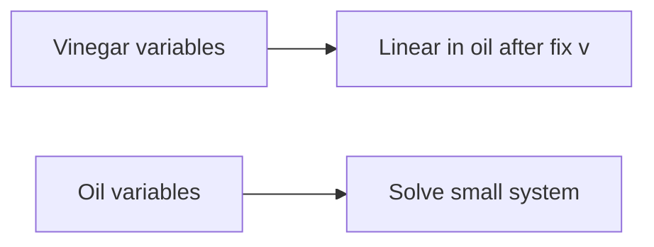
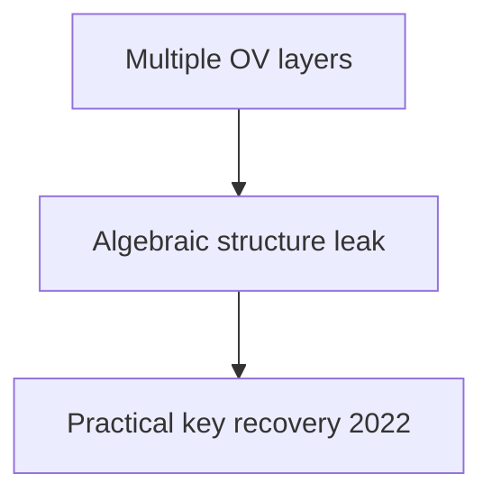

# Chapter 8: Multivariate Polynomial Cryptography

Rainbow's break is a lesson in **structure leaks**; UOV survives because boring can be good.

**Figure 8.1 — Oil and vinegar partition**



---

> **Author's note:** When in doubt, **pilot hybrid TLS** on internal services first; external customer impact is where rollback plans matter.

## 8.1 The Multivariate Quadratic Problem

Multivariate cryptography stands apart from other post-quantum families by drawing its hardness not from geometric lattice problems or error-correcting codes, but from the algebraic difficulty of solving systems of polynomial equations over finite fields. The fundamental problem underpinning this entire family—the Multivariate Quadratic (MQ) problem—has been studied in computational algebra for decades and possesses strong theoretical complexity guarantees that persist even in the presence of quantum computers.

**The MQ Problem (Formal Definition):** Given a system of m quadratic polynomials p₁, p₂, ..., pₘ in n variables x₁, x₂, ..., xₙ over a finite field F_q:

```
p₁(x₁, ..., xₙ) = 0
p₂(x₁, ..., xₙ) = 0
...
pₘ(x₁, ..., xₙ) = 0
```

where each polynomial pᵢ has the general quadratic form:

```
pᵢ(x) = Σⱼ≤ₖ aᵢⱼₖ · xⱼ · xₖ + Σⱼ bᵢⱼ · xⱼ + cᵢ
```

the computational task is to find a vector (x₁, ..., xₙ) ∈ F_q^n satisfying all m equations simultaneously, or to determine that no such solution exists.

Each polynomial contains at most n(n+1)/2 quadratic terms, n linear terms, and one constant term, giving a total of n(n+1)/2 + n + 1 coefficients per polynomial. A complete system of m polynomials in n variables is therefore described by m · (n(n+1)/2 + n + 1) field elements—this is what constitutes a public key in multivariate cryptography, and it explains the large key sizes characteristic of this family.

**Complexity-Theoretic Foundations:**

The MQ problem has a particularly strong complexity pedigree:

- **NP-hardness:** The decisional version of MQ (does a solution exist?) is NP-complete, even when restricted to F_2 (the binary field). This was established through reduction from Boolean satisfiability.
- **Average-case hardness:** Unlike many NP-hard problems where random instances are easy, random quadratic systems over finite fields appear hard on average for appropriate parameter choices. This average-case hardness is essential for cryptographic applications.
- **Quantum resistance:** No known polynomial-time quantum algorithm solves MQ. Grover's algorithm provides only a quadratic speedup to brute-force search. The algebraic structure of polynomial systems does not appear amenable to the hidden subgroup or period-finding techniques that underpin Shor's algorithm.

**Relationship to Other Hard Problems:**

The MQ problem connects to several other well-studied computational problems. The MinRank problem asks to find a low-rank matrix in an affine subspace of matrices—this problem reduces to MQ and appears in the analysis of many multivariate schemes. The Polynomial System Solving (PoSSo) problem generalizes MQ to higher degrees and is equally important in security analyses. The Extended Linearization (XL) approach relates MQ to systems of higher-degree equations that can be linearized at the cost of exponential expansion.

**Parameter Regimes:**

The difficulty of MQ depends critically on the ratio m/n (equations to variables) and the field size q:

- **Underdetermined (m < n):** The system typically has many solutions; finding one is easier but still potentially hard.
- **Determined (m = n):** The typical case for many cryptographic schemes; generically has q^0 = 1 solution over algebraically closed fields.
- **Overdetermined (m > n):** More constraints than unknowns; often harder for algebraic solvers because the degree of regularity increases, though the solution is more constrained.

For cryptographic applications, the parameters are chosen so that the best known solving algorithms (both classical and quantum) require at least 2^λ operations for a target security level λ.

**Historical Context:**

The study of multivariate polynomial systems has roots in classical algebraic geometry dating to the 19th century, but their cryptographic application began with Matsumoto and Imai's C* scheme in 1988. The subsequent decades saw a productive cycle of constructions and attacks: C* was broken by Patarin (1995) using linearization equations, leading to HFE (1996), Oil and Vinegar (1997, broken), Unbalanced Oil and Vinegar (1999, still secure), and numerous variants. This evolutionary process has produced schemes with well-understood security boundaries.

The multivariate approach to post-quantum cryptography is particularly attractive because it offers a fundamentally different mathematical foundation from lattice-based or code-based schemes. If an unexpected quantum algorithm were discovered that breaks structured lattice problems (such as module-LWE), multivariate schemes would be unaffected, and vice versa. This algorithmic diversity is a key motivation for maintaining multivariate candidates in the NIST standardization process.

**Concrete Instances and Field Choices:**

In practice, most multivariate schemes work over small finite fields:
- **F_2 (binary):** Used in some HFE variants. Compact representation (1 bit per coefficient) but large number of variables needed.
- **F_{16} (4-bit):** Used in Rainbow (before its break). Good balance between field operations and number of variables.
- **F_{31} (prime):** Used in some MAYO parameter sets. Enables efficient modular arithmetic.
- **F_{256} (byte-sized):** Used in UOV. Aligns with byte-oriented computing architectures, enabling efficient SIMD implementations.

The choice of field affects the number of variables and equations needed: larger fields allow fewer variables for the same security level (since each variable carries more entropy), but individual field operations become more expensive.


**Figure 8.2 — Rainbow break lesson**



## 8.2 The Trapdoor Construction Paradigm

A random system of multivariate quadratic polynomials is computationally intractable to solve—but it is equally intractable to invert for the legitimate key holder. The fundamental challenge in multivariate cryptography is constructing polynomial systems that appear random to an external observer yet possess a hidden mathematical structure (a trapdoor) that enables efficient inversion by the secret key holder.

### The Central Map Approach

Virtually all multivariate cryptographic schemes share a common architectural pattern known as the "bipolar" or "central map" construction. The design proceeds in three layers:

1. **Central map F: F_q^n → F_q^m:** This is an easily invertible multivariate map that constitutes the trapdoor. Its algebraic structure makes it efficiently invertible given knowledge of its form, but this structure must be carefully hidden.

2. **Secret affine transformations S: F_q^n → F_q^n and T: F_q^m → F_q^m:** These are random invertible affine maps (linear transformation plus translation) that serve as "camouflage." They disguise the special structure of F by applying secret coordinate changes before and after the central map.

3. **Public key P = T ∘ F ∘ S:** The composition of these three maps yields the public polynomial system. Because affine transformations compose with quadratic maps to produce quadratic maps, P is itself a system of m quadratic polynomials in n variables.

The security argument proceeds as follows: the public key P appears (computationally) indistinguishable from a random quadratic system, so an attacker must either solve a random-looking MQ instance (believed intractable) or recover the hidden decomposition P = T ∘ F ∘ S (which various structural attacks attempt).

**Signing with the Trapdoor:**

For a signature scheme, the signer must invert the public map. Given a target value y (derived from the message hash), computing a preimage x such that P(x) = y proceeds as:

1. Compute y' = T⁻¹(y)
2. Find x' such that F(x') = y' (efficient due to the central map's structure)
3. Compute x = S⁻¹(x')
4. Output signature x

Verification simply checks that P(x) = y, which requires only polynomial evaluation.

### Types of Central Maps

The distinguishing feature among multivariate schemes is the choice of central map, which determines both the efficiency and security of the resulting scheme:

| Central Map | Name | Key Idea | Status |
|-------------|------|----------|--------|
| Oil and Vinegar | UOV | Specialized variable partition makes system linear after fixing vinegar | Active NIST candidate |
| Matsumoto-Imai | C* | Monomial x^(q^θ+1) over extension field F_{q^n} | Broken (linearization attack) |
| HFE | Hidden Field Equations | Low-degree polynomial over F_{q^n} | Weakened; variants survive |
| Rainbow | Layered OV | Multi-layer oil-and-vinegar structure | Broken 2022 |
| MAYO | Whipped UOV | UOV with compressed representation | Active NIST candidate |

**Why Quadratic?** The restriction to quadratic polynomials is not arbitrary. Higher-degree systems would provide more structural freedom for trapdoor design but would increase public key sizes (cubic systems have O(n³) coefficients per polynomial) and slow down verification. Quadratic systems represent a practical sweet spot: rich enough for trapdoor construction, compact enough for implementation, and well-studied enough for security analysis.

### The Equivalence Problem

An important theoretical question is the IP (Isomorphism of Polynomials) problem: given two polynomial systems P and P', determine whether there exist affine maps S, T such that P' = T ∘ P ∘ S. This problem is related to graph isomorphism and is believed to be hard in general, which supports the security of the central map paradigm. However, specific central map structures can introduce additional algebraic relationships that make the decomposition easier to find.

## 8.3 Unbalanced Oil and Vinegar (UOV)

UOV is the elder statesman of multivariate signature schemes. Originally proposed by Kipnis, Patarin, and Goubin in 1999 as a repair of the broken "balanced" Oil and Vinegar scheme, UOV has withstood over 25 years of cryptanalytic scrutiny and remains the most trusted multivariate construction. It is currently under evaluation by NIST for additional digital signature standardization.

### The Oil and Vinegar Principle

The core insight of Oil and Vinegar is a partition of variables into two groups with asymmetric roles in the quadratic terms:

- **Vinegar variables** v₁, v₂, ..., vᵥ (count: v): These appear freely in all quadratic terms—they multiply with each other and with oil variables.
- **Oil variables** o₁, o₂, ..., oₒ (count: o): These are restricted—they never multiply with each other in the central map.

The central map F consists of o quadratic polynomials (one for each oil variable's "slot"), each having the form:

```
fₖ(o, v) = Σᵢ₌₁ᵒ Σⱼ₌₁ᵛ αᵢⱼ⁽ᵏ⁾ · oᵢ · vⱼ + Σᵢ₌₁ᵛ Σⱼ₌ᵢᵛ βᵢⱼ⁽ᵏ⁾ · vᵢ · vⱼ + Σᵢ₌₁ⁿ γᵢ⁽ᵏ⁾ · xᵢ + δ⁽ᵏ⁾
```

The critical structural property is the absence of oᵢ · oⱼ terms. This means that once the vinegar variables are assigned concrete values, every equation becomes linear in the oil variables. A system of o linear equations in o unknowns can be solved in O(o³) time by Gaussian elimination.

The name "Unbalanced" refers to choosing v > o (more vinegar than oil variables), which is necessary for security. The original "balanced" scheme (v = o) was broken by Kipnis and Shamir through an attack that exploited the equal-sized partition to recover equivalent secret keys. With v ≈ 2o, this attack becomes exponentially hard.

### UOV Signature Scheme

**Key Generation:**

1. Choose parameters: field F_q, number of oil variables o, number of vinegar variables v, total n = o + v.
2. Generate the central map F: choose random coefficients αᵢⱼ⁽ᵏ⁾, βᵢⱼ⁽ᵏ⁾, γᵢ⁽ᵏ⁾, δ⁽ᵏ⁾ for k = 1, ..., o respecting the oil/vinegar structure.
3. Generate a random invertible affine map T: F_q^n → F_q^n. (In the standard UOV formulation, the outer transformation S is omitted—equivalently set to the identity—without loss of security.)
4. Compute the public key P = F ∘ T: compose F with T to obtain o quadratic polynomials in n variables. The composition destroys the visible oil/vinegar partition.
5. Secret key: (F, T) or equivalently (T, the oil/vinegar partition in the transformed coordinates).
6. Public key: The o polynomials of P, represented as coefficient vectors.

**Signature Generation (Signing message M):**

1. Compute the hash target: h = H(M) ∈ F_q^o where H is a cryptographic hash function.
2. Choose random vinegar assignment: select v₁, ..., vᵥ ← F_q uniformly at random.
3. Substitute vinegar values into the central map to obtain a linear system: fₖ(o₁, ..., oₒ, v₁, ..., vᵥ) = hₖ for k = 1, ..., o. With vinegar values fixed, this is a system of o linear equations in o unknowns.
4. Solve the linear system by Gaussian elimination to obtain o₁, ..., oₒ. If the system is singular (probability ≈ 1/q), return to step 2 with fresh vinegar values.
5. Form the preimage x' = (o₁, ..., oₒ, v₁, ..., vᵥ) in the central map's coordinate system.
6. Apply the inverse transformation: σ = T⁻¹(x') to obtain the signature in public coordinates.
7. Output signature σ ∈ F_q^n.

**Verification:**

Given message M and signature σ:
1. Compute h = H(M) ∈ F_q^o.
2. Evaluate the public polynomials: compute P(σ) ∈ F_q^o.
3. Accept if P(σ) = h; reject otherwise.

Verification requires evaluating o quadratic polynomials at a point in F_q^n, which costs O(o · n²) field multiplications.

### Parameters and Performance

NIST security levels require different parameter sizes. Representative parameters for UOV over F_{256}:

| Security Level | Oil (o) | Vinegar (v) | Total (n) | Public Key | Signature |
|---------------|---------|-------------|-----------|------------|-----------|
| Level I (128-bit) | 44 | 68 | 112 | ~66 KB | 112 bytes |
| Level III (192-bit) | 64 | 96 | 160 | ~213 KB | 160 bytes |
| Level V (256-bit) | 80 | 120 | 200 | ~412 KB | 200 bytes |

The signature size is remarkably small—just n bytes over F_{256}—making UOV competitive with or smaller than any other PQC signature. However, the public key size is the largest among PQC candidates at comparable security levels, representing the primary practical limitation.

Signing is extremely fast (microseconds), as it involves only fixing random values and solving a small linear system. Verification is also fast (tens of microseconds), requiring only polynomial evaluation. These speed characteristics make UOV attractive for applications with pre-distributed keys where key size is amortized over many signatures.

### Security Analysis

UOV has been subjected to extensive cryptanalysis over its 25+ year history. The primary attack categories include:

**Direct Attacks (Solving the Public System):**
The attacker treats the public key as a generic system of quadratic equations and applies Gröbner basis or XL-family algorithms. The cost is determined by the degree of regularity of the system, which for properly parameterized UOV is sufficiently high to ensure exponential complexity.

**Kipnis-Shamir Attack (Key Recovery):**
The original 1999 attack on balanced OV extends partially to the unbalanced case. The attacker attempts to find an equivalent oil subspace by solving a MinRank problem: find a low-rank linear combination of the quadratic forms associated with the public polynomials. For v ≥ 2o, this attack requires solving MinRank instances of complexity approximately q^(v-o), which is exponential.

**Reconciliation Attack:**
This attack reformulates key recovery as finding a simultaneous low-rank decomposition of the public key's quadratic forms. Its complexity is similar to the Kipnis-Shamir attack for standard parameters.

**Intersection Attack:**
Attempts to find the oil subspace by intersecting the solution spaces of specially constructed equations. Effective against multi-layer variants (like Rainbow) but not against single-layer UOV with sufficient imbalance.

**ROLLO/MinRank Approaches:**
Recent advances in solving the MinRank problem through algebraic techniques (support minors modeling, Bardet et al. 2020) have tightened the security estimates for UOV, requiring parameter increases compared to original proposals. Current parameter recommendations account for these improved attacks.

All known attacks on properly parameterized UOV remain exponential, giving high confidence in the scheme's security foundation.

### Provable Security

UOV's security can be formally related to the hardness of the MQ problem and MinRank through security reductions, though these reductions are not tight. The EUF-CMA (Existential Unforgeability under Chosen Message Attack) security of UOV in the random oracle model can be reduced to:
1. The hardness of solving the public system directly (MQ assumption).
2. The hardness of recovering an equivalent secret key (MinRank/Kipnis-Shamir assumption).
3. The difficulty of finding collisions in the hash function used to derive targets.

The non-tightness of the reduction means that parameter selection relies partially on concrete cryptanalysis (testing specific parameters against the best known algorithms) rather than purely on asymptotic reductions. This is common in multivariate cryptography and is one reason why the "security confidence" for multivariate schemes is rated lower than for hash-based schemes with information-theoretic arguments.

### Historical Resilience

UOV has survived multiple waves of improved attacks over its 25+ year history:
- **1999:** Original proposal with v = 2o (Kipnis-Patarin-Goubin).
- **2005-2008:** Improved Kipnis-Shamir attacks necessitated slightly larger v/o ratios.
- **2020-2022:** Support minors modeling for MinRank (Bardet et al.) required parameter increases of approximately 10-15%.
- **2023-2025:** Rectangular MinRank improvements and refined algebraic attacks led to current NIST-submission parameters.

Each attack improvement has been addressable through modest parameter increases, and no attack has fundamentally threatened the UOV paradigm itself. This progressive hardening through scrutiny is a mark of a mature cryptographic design.

## 8.4 Rainbow (Historical — Broken in 2022)

Rainbow, designed by Jintai Ding and Dieter Schmidt in 2005, was for many years considered the most efficient multivariate signature scheme. It advanced to the third round of the NIST PQC competition before being catastrophically broken by Ward Beullens in early 2022. Its story provides critical lessons for post-quantum cryptographic design and evaluation.

### Construction

Rainbow generalized UOV by introducing a multi-layer structure. Instead of a single oil/vinegar partition, Rainbow used two (or more) layers, each with its own oil and vinegar sets:

**Layer structure (two-layer Rainbow):**
- Layer 1: v₁ vinegar variables and o₁ oil variables. The first o₁ polynomials of the central map have the UOV structure with respect to this partition.
- Layer 2: The variables from layer 1 (all v₁ + o₁ of them) become vinegar variables for layer 2, which introduces o₂ new oil variables. The next o₂ polynomials are UOV-structured with respect to this expanded partition.

Total variables: n = v₁ + o₁ + o₂. Total equations: m = o₁ + o₂.

**The efficiency advantage:** By using layers, Rainbow achieved smaller keys than plain UOV at equivalent security levels. The layered structure meant fewer vinegar variables were needed per layer (since previous layers' oil became the next layer's vinegar), reducing the overall public key size by roughly a factor of 2-3 compared to UOV at the same security level.

**Rainbow's NIST Parameters (Level I):**
- v₁ = 36, o₁ = 32, o₂ = 32
- Total: n = 100, m = 64
- Field: F_{16}
- Public key: ~161 KB
- Signature: 64 bytes

### The Attack (Beullens, 2022)

In February 2022, Ward Beullens posted a paper titled "Breaking Rainbow Takes a Weekend on a Laptop" that described a devastating key-recovery attack exploiting Rainbow's layered structure. The attack combined several novel ideas:

**Step 1 — The Rectangular MinRank Attack:**
Beullens observed that the layered structure of Rainbow creates a specific algebraic property: certain linear combinations of the public key's quadratic forms have rectangular (non-square) low-rank structure corresponding to the inter-layer relationships. This is fundamentally different from the MinRank instances arising in attacks on plain UOV.

**Step 2 — Intersection Attack on the First Layer:**
By solving the rectangular MinRank problem, the attacker can recover information about the first layer's oil subspace. Specifically, the attack finds the "intersection" of the oil spaces of different layers, which is empty in UOV but non-trivial in Rainbow due to the layered promotion of variables.

**Step 3 — Efficient Algebraic Solving:**
The MinRank instances arising from Rainbow's specific structure turn out to be significantly easier than generic MinRank problems of the same dimensions. Beullens showed that the "support minors" modeling approach, combined with dedicated algebraic solving techniques, could break these instances in practical time.

**Concrete Results:**
- Rainbow Level I (SL-I, 128-bit security target): Broken in approximately 53 hours on a single laptop
- Rainbow Level III: Broken with moderate computational resources
- Rainbow Level V: Feasible attack, though requiring more computation

The attack was a complete key-recovery attack—it recovered an equivalent secret key, not merely forged signatures. This meant the break was fundamental and not addressable through parameter increases within Rainbow's design framework.

### Why UOV Survived

A natural question is why UOV was not similarly broken. The answer lies in the structural difference: UOV uses a single partition (one layer), so there are no inter-layer relationships to exploit. The MinRank instances arising from UOV lack the rectangular low-rank structure that made Rainbow's instances tractable. Beullens' attack is specifically enabled by the efficiency-improving multi-layer structure, demonstrating a direct security-efficiency trade-off.

### Lessons Learned

The Rainbow break carries several lessons for the broader PQC community:

1. **Structured efficiency comes with risk:** Rainbow's key size advantage over UOV derived from algebraic structure (layering) that ultimately proved exploitable. The simpler, less efficient UOV survived precisely because it had less attackable structure.

2. **Decades of study do not guarantee security:** Rainbow was proposed in 2005 and studied extensively for 17 years before the break. The relevant mathematical tools (support minors modeling) only matured around 2020.

3. **Algorithmic diversity matters:** Having multiple candidate schemes from different mathematical families ensures that a break of one scheme does not compromise the entire standardization effort.

4. **Beware of combining ideas without full analysis:** Rainbow's combination of the oil-and-vinegar principle with layering created new attack surfaces that neither ingredient had alone.

## 8.5 Other Multivariate Schemes

### HFE (Hidden Field Equations)

HFE, proposed by Jacques Patarin in 1996, takes a fundamentally different approach to constructing the central map by working over an extension field.

**Construction:** Let F_{q^n} be an extension of F_q of degree n. The central map is a univariate polynomial over F_{q^n}:

```
F(X) = Σ_{0 ≤ i ≤ j, qⁱ+qʲ ≤ D} aᵢⱼ · X^(qⁱ+qʲ) + Σ_{0 ≤ i, qⁱ ≤ D} bᵢ · X^(qⁱ) + c
```

The exponents qⁱ + qʲ are precisely those for which the map, when projected from F_{q^n} to F_q^n via a basis, yields quadratic polynomials. The parameter D (degree bound) controls both efficiency and security.

**Inversion:** Given Y ∈ F_{q^n}, finding X such that F(X) = Y requires solving a univariate polynomial equation of degree at most D over F_{q^n}. For small D, this is tractable using Berlekamp's or Cantor-Zassenhaus factoring algorithms.

**Security Issues:** The direct algebraic structure of HFE enables an attack by Faugère and Joux (2003) that computes Gröbner bases of HFE systems in polynomial time when D is polynomial in n. For HFE to be secure, D must be large enough to resist this attack, but large D makes inversion slow. This tension makes plain HFE impractical.

**HFE Variants:** Several modifications repair HFE's security:
- **HFE⁻ (minus):** Remove some public equations. The attacker has fewer constraints, making Gröbner basis attacks harder.
- **HFEv (vinegar):** Add vinegar variables that do not participate in the extension field structure.
- **HFEv⁻:** Combine both modifications. This is the basis of GeMSS.

### GeMSS (Great Multivariate Short Signature)

GeMSS is an HFEv⁻ variant that was a second-round candidate in the NIST PQC competition:

**Parameters (Level I):**
- Extension field: F_{2^174}
- HFE degree bound: D = 513
- Vinegar variables: 12
- Removed equations: 12
- Public key: ~352 KB (very large)
- Signature: ~33 bytes (extremely small)

**Trade-offs:** GeMSS exemplified an extreme point in the design space: signatures barely larger than a hash output, but at the cost of enormous public keys and slow verification (the Gröbner basis computation during signing is also slow, taking hundreds of milliseconds). The scheme was not selected for standardization, primarily due to public key size, slow verification, and emerging concerns about tightened security margins.

### MAYO

MAYO, proposed by Ward Beullens in 2021 (the same researcher who broke Rainbow), represents a modern approach to the multivariate key size problem through an algebraic technique called "whipping."

**Key Idea:** Instead of using the full UOV public key directly, MAYO uses a "whipped" version where the public key is derived from a smaller seed using an expandable function. The core observation is that the UOV public key matrix has a specific algebraic structure (it can be expressed as a sum of rank-1 matrices) that enables compact representation.

**Construction:** MAYO works with a UOV-like structure but uses a parameter k (the "whipping" parameter) that allows the scheme to use a much smaller oil space while maintaining security:

- The public map P is defined as a multilinear combination of k copies of a base UOV map.
- The signer must find k vectors that collectively satisfy the system.
- The resulting signatures are k times larger than single UOV signatures, but the public key can be much smaller.

**Parameters (MAYO-1, Level I):**
- Public key: ~1.2 KB (dramatically smaller than UOV)
- Secret key: ~24 bytes (seed)
- Signature: ~321 bytes
- Signing: ~0.3 ms
- Verification: ~0.1 ms

MAYO represents a significant advance in making multivariate signatures practical, achieving key sizes competitive with lattice-based schemes while maintaining small signatures. It is under active consideration for NIST additional signature standardization as of 2025-2026.

### VOX

VOX is another recent multivariate signature proposal that modifies UOV by working over quotient rings rather than direct finite fields. This algebraic modification allows for structured key matrices that can be stored more compactly (using seeds) while maintaining the essential security properties of the UOV framework. VOX is also under NIST evaluation.

### QR-UOV

QR-UOV (Quotient Ring UOV) embeds the UOV structure within polynomial quotient rings F_q[x]/(f(x)), where f(x) is an irreducible polynomial. The ring structure introduces algebraic relationships between matrix entries that enable compact representation:
- Public keys can be reduced by a factor proportional to the ring degree.
- The security analysis must account for potential exploitation of the ring structure by attackers.
- Current proposals suggest ring degrees of 3-8, providing 3-8x key compression.

### SNOVA

SNOVA (Simple Non-commutative Oil and Vinegar Algebra) replaces the base field with a non-commutative ring (a matrix ring over a small field). This non-commutativity provides additional degrees of freedom for the central map construction while maintaining the fundamental oil/vinegar inversion property. SNOVA achieves public keys of approximately 25 KB at Level I—smaller than UOV but larger than MAYO.

### Comparative Analysis of Modern Multivariate Proposals

| Scheme | Public Key (Level I) | Signature | Security Basis |
|--------|---------------------|-----------|----------------|
| UOV | ~66 KB | 112 B | Plain MQ + MinRank |
| MAYO | ~1.2 KB | 321 B | Whipped UOV variant |
| VOX | ~4 KB | ~200 B | Ring-structured UOV |
| QR-UOV | ~10 KB | ~160 B | Quotient ring UOV |
| SNOVA | ~25 KB | ~120 B | Non-commutative OV |

The trend is clear: modern constructions trade slightly larger signatures for dramatically smaller public keys, making multivariate cryptography increasingly practical.

## 8.6 Gröbner Basis Attacks

Gröbner basis computation is the most powerful general-purpose technique for solving systems of polynomial equations and represents the primary threat to multivariate cryptographic schemes. Understanding these attacks is essential for parameter selection and security analysis.

### What Are Gröbner Bases?

A Gröbner basis is a particular generating set for a polynomial ideal with special computational properties. To understand this, consider the analogy with linear algebra: Gaussian elimination transforms a system of linear equations into row echelon form, from which solutions can be read off directly. Gröbner bases generalize this to nonlinear polynomial systems.

**Formal Definition:** Fix a monomial ordering (e.g., graded reverse lexicographic). A set G = {g₁, ..., gₛ} is a Gröbner basis for the ideal I = ⟨f₁, ..., fₘ⟩ if the leading monomials of G generate the leading monomial ideal of I: ⟨LM(g₁), ..., LM(gₛ)⟩ = ⟨LM(I)⟩.

**Key Properties:**
- **Unique reduced form:** Every ideal has a unique reduced Gröbner basis (for a fixed monomial ordering).
- **Ideal membership:** Testing whether a polynomial belongs to I reduces to polynomial division by G.
- **System solving:** With a lexicographic ordering, the Gröbner basis has a triangular structure from which solutions can be extracted by back-substitution (analogous to row echelon form).
- **Elimination:** Gröbner bases can systematically eliminate variables, reducing multivariate systems to univariate ones.

### Algorithms for Computing Gröbner Bases

**Buchberger's Algorithm (1965):**

The foundational algorithm for Gröbner basis computation. It works by:
1. Starting with the input polynomials.
2. Computing S-polynomials (critical pairs) from pairs of current basis elements.
3. Reducing S-polynomials modulo the current basis.
4. Adding non-zero remainders to the basis.
5. Repeating until no new elements are generated.

Buchberger's algorithm is conceptually simple but computationally expensive for cryptographic-sized systems due to intermediate coefficient explosion and redundant computations.

**F4 Algorithm (Faugère, 1999):**

F4 reformulates Gröbner basis computation as a sequence of linear algebra operations:
1. Construct a matrix whose rows correspond to polynomial multiples.
2. Row-reduce the matrix (Gaussian elimination).
3. Extract new basis elements from the reduced rows.
4. Repeat at increasing degree.

The key advantage is replacing individual polynomial reductions with batch matrix operations, which are highly optimized on modern hardware. F4 is typically 10-100x faster than Buchberger for systems relevant to cryptography.

**F5 Algorithm (Faugère, 2002):**

F5 improves upon F4 by introducing a criterion that detects and avoids redundant computations (reductions to zero) before they occur:
- The "F5 criterion" uses signatures (module-theoretic labels) to predict which S-polynomials will reduce to zero.
- This eliminates a large fraction of the unnecessary work in F4.
- For regular sequences (generic systems), F5 performs no reductions to zero at all.

F5 is currently the most efficient known algorithm for computing Gröbner bases of polynomial systems arising in cryptanalysis.

**Mutant Strategy and Hybrid Approaches:**

For some structured systems (like those arising from cryptographic schemes), a "mutant" strategy can be effective: equations that fall to a lower degree during computation ("mutants") are identified and exploited to accelerate the process. This can reduce the effective degree of regularity for specific system structures.

### Complexity Analysis

The computational complexity of Gröbner basis algorithms is governed by the **degree of regularity** (d_reg), which is the maximum degree reached during the computation:

**For generic/random systems:**
- A system of m equations in n variables over F_q has degree of regularity approximately:
  - When m = n: d_reg ≈ n (linear growth)
  - When m ≈ n with m > n: d_reg is determined by the Macaulay bound

**Complexity formula:**
```
Time ≈ O(C(n, d_reg)^ω)
```
where C(n, d_reg) = C(n + d_reg, d_reg) is the number of monomials of degree ≤ d_reg in n variables, and ω ≈ 2.37 is the linear algebra constant (matrix multiplication exponent).

For cryptographic parameters (n ≈ 100, d_reg ≈ 5-8), this gives complexity well beyond 2^128 operations, which is why multivariate schemes can achieve practical security.

**Semi-regular sequences:**

The degree of regularity for semi-regular sequences (the generic case) can be computed from the generating function:

```
Σ_d dim(I_d) · z^d = Π_{i=1}^m (1 - z^(d_i)) / (1 - z)^n
```

where d_i is the degree of the i-th polynomial. The degree of regularity is the index of the first non-positive coefficient.

### The XL Algorithm and Variants

The XL (eXtended Linearization) algorithm, proposed by Courtois et al. in 2000, offers a simpler (though less efficient) alternative to F5:

**Algorithm:**
1. Choose a degree parameter D.
2. Multiply each original equation by all monomials of degree ≤ D - 2 (for quadratic equations).
3. Treat each monomial of degree ≤ D as an independent variable (linearization).
4. Solve the resulting (enormous) linear system.

**Complexity:** XL succeeds when the number of linearized equations exceeds the number of monomials of degree ≤ D. For m equations in n variables, the minimum D satisfying this condition determines the complexity: approximately O(C(n, D)^ω).

**Variants:** XL/FXL (with Frobenius), WXL (with Wiedemann for sparse linear algebra), and MutantXL (incorporating the mutant strategy) offer practical improvements. In practice, XL is less efficient than F5 but easier to analyze theoretically, making it useful for establishing security lower bounds.

### Hybrid Approaches

In practice, the most effective attacks on multivariate cryptographic systems often combine multiple techniques:

**Guess-and-determine:** Fix some variables to random values, reducing the system size, then apply algebraic solving to the reduced system. The optimal number of variables to fix depends on the specific system structure and the efficiency of the solver at smaller sizes.

**FXL (Fix and Linearize):** Combines variable fixing with XL. Fix k variables (q^k choices), then apply XL to the reduced system. The optimal k minimizes q^k · T_XL(m, n-k) where T_XL is the XL complexity at the reduced parameters.

**Crossbred Algorithm (Joux-Vitse):** Combines exhaustive search over some variables with Gröbner basis techniques for the remainder. Particularly effective for dense systems over F_2.

**Practical benchmarks:** For random quadratic systems of the size used in UOV (44 equations, 112 variables over F_{256}), the best known algorithms require well over 2^128 operations. These benchmarks, verified through extensive computational experiments on smaller instances and extrapolation using verified complexity formulas, form the basis of parameter selection.

## 8.7 Quantum Attacks on Multivariate Systems

The resilience of multivariate cryptography against quantum computers is one of its primary selling points, but the quantum security picture deserves careful examination.

### Grover's Algorithm Applied to MQ

The most straightforward quantum attack applies Grover's search to the solution space:

- **Classical brute force:** Enumerate all q^n possible inputs, evaluating the system at each. Cost: O(q^n).
- **Quantum search:** Grover's algorithm finds a solution in O(q^(n/2)) evaluations, a quadratic speedup.
- **Mitigation:** Double the parameter n (or equivalently, ensure that q^(n/2) > 2^λ for security level λ).

For typical multivariate parameters, the MQ problem is not solved primarily by brute force even classically—algebraic algorithms are more efficient. Therefore, Grover's speedup of brute force is rarely the binding constraint.

### Quantum Speedups for Algebraic Attacks

The more relevant question is whether quantum computers can accelerate the algebraic algorithms (F4, F5, XL) that are the actual best attacks:

**Quantum Linear Algebra:**
- The core computational bottleneck in F4/F5/XL is Gaussian elimination on large matrices.
- Quantum algorithms for linear systems (HHL algorithm and successors) can provide polynomial speedups for certain matrix structures.
- However, the matrices arising in Gröbner basis computation are dense and the speedup is modest: roughly reducing the exponent ω from 2.37 to approximately 2 (using quantum matrix multiplication).
- Net effect: Reduces security by a polynomial factor, not an exponential one.

**Quantum Search within Algebraic Algorithms:**
- Some steps of algebraic solving involve combinatorial search (e.g., finding "lucky" variable specializations).
- Grover's algorithm can provide quadratic speedups for these sub-problems.
- The overall impact is modest because the dominant cost is the algebraic computation, not the search.

**Quantum Walks on Solution Spaces:**
- Quantum walk algorithms can potentially speed up certain graph-search-based polynomial system solvers.
- Concrete improvements over classical algorithms are currently marginal for MQ instances of cryptographic relevance.

### Quantitative Security Impact

The consensus among researchers is that quantum computers provide at most a small polynomial speedup for solving MQ:

- **Effective security reduction:** Approximately 2-5 bits of security lost to quantum attacks beyond the Grover baseline.
- **Parameter adjustment:** Increasing parameters by 10-20% compensates for all known quantum speedups.
- **Fundamental barrier:** The MQ problem's algebraic nature does not align with the mathematical structures (periodicity, hidden subgroups) that enable exponential quantum speedups.

This contrasts favorably with lattice problems, where the quantum speedup for BKZ-type algorithms is still debated, and with code-based problems, where information set decoding sees a more significant quantum speedup via amplitude amplification.

### The Quantum Random Oracle Model

For signature schemes, security proofs in the quantum random oracle model (QROM) are also relevant. UOV and MAYO have been analyzed in the QROM, and their security reductions hold with appropriate parameter adjustments (typically a factor of 2 loss in the security bound due to the quantum query model for the hash function).

## 8.8 Implementation Aspects

### Key Representation and Compression

The dominant practical challenge for multivariate cryptography is key size. A naive representation of m quadratic polynomials in n variables over F_q requires:

```
Key size = m × (n(n+1)/2 + n + 1) × ⌈log₂(q)⌉ bits
```

For UOV Level I (m=44, n=112, q=256): this gives approximately 66 KB—acceptable for many applications but significantly larger than lattice-based alternatives.

**Compression Techniques:**

1. **Seed-based derivation (MAYO approach):** Generate most of the public key deterministically from a public seed using an XOF (extendable output function). Only store the seed plus a small "correction" component. This reduces the stored public key to a few kilobytes at the cost of regenerating the full key for each verification.

2. **Cyclic/quasi-cyclic structures:** Impose algebraic structure on the affine transformations S, T so that they can be represented by their first row (the remaining rows are cyclic shifts). This divides key size by n but introduces structure that could potentially be exploited.

3. **Triangular decomposition:** Store the secret key components (which have implicit structure) rather than the expanded public key, regenerating the public key on demand.

4. **Parity-check representation:** For some schemes, the public key can be expressed more compactly using a parity-check-like matrix representation.

### Signature Generation Implementation

Signing in multivariate schemes is computationally inexpensive:

1. **Hash computation:** Standard hash function evaluation (SHA-3, SHAKE) to derive the target vector. This is typically the most expensive step when the message is large.

2. **Vinegar variable sampling:** Generate v random field elements. This requires a good random number generator but minimal computation.

3. **Linear system construction:** Substitute vinegar values into the central map equations. This requires O(o·v²) field multiplications (evaluating the quadratic vinegar-vinegar terms) and O(o²·v) multiplications (for the oil-vinegar cross terms, forming the coefficient matrix).

4. **Gaussian elimination:** Solve the o×o linear system. Cost: O(o³) field operations. For typical parameters (o ≈ 44-80), this takes microseconds.

5. **Affine transformation:** Apply T⁻¹ to the solution. Cost: O(n²) field operations.

Total signing time is typically 10-100 microseconds on modern CPUs, making multivariate signatures among the fastest PQC operations.

### Verification Implementation

Verification requires evaluating m quadratic polynomials at the signature point:

1. **Polynomial evaluation:** For each of the m polynomials, compute the quadratic form value. Using the "evaluate by rows" method with the upper triangular matrix representation of each quadratic form, this costs O(m·n²/2) multiplications total.

2. **Optimization techniques:**
   - **SIMD/AVX vectorization:** Multiple polynomial evaluations can be performed in parallel using vector instructions, since the same signature point is evaluated under different coefficient sets.
   - **Lookup tables:** Over small fields (F_{16}), multiplication can be replaced by table lookups, eliminating the need for field arithmetic units.
   - **Batch verification:** When verifying multiple signatures from the same key, the public key expansion can be amortized.

3. **Performance:** Verification typically takes 10-50 microseconds, comparable to lattice-based signature verification.

### Constant-Time Implementation

Side-channel resistance is critical for any deployed cryptographic implementation:

**Timing Channels:**
- Gaussian elimination during signing must be implemented in constant time. The standard approach uses constant-time conditional swaps for pivot selection rather than branching on pivot values.
- Vinegar variable sampling must not leak information about which values were tried (if retry logic is used for singular systems).

**Power Analysis and Electromagnetic Emanation:**
- Polynomial evaluation must process all terms uniformly regardless of coefficient values (avoid skipping zero coefficients).
- Field multiplications must execute in constant time regardless of operand values.
- The affine transformation application must not leak the secret matrix T through power or EM measurements.

**Fault Attacks:**
- Faulted signatures can reveal information about the secret key structure. If a fault occurs during signing (e.g., corrupting a vinegar variable), the resulting invalid signature, when combined with the public key, can expose algebraic relationships revealing the oil/vinegar partition.
- Countermeasures include signature verification before output (sign-then-verify) and redundant computation with comparison.

**Randomization Countermeasures:**
- Adding random multiples of the public equations to the signing computation (blinding).
- Randomizing the order of operations during polynomial evaluation.
- Using random coordinate transformations that are undone before output.

### Hardware Acceleration

Multivariate cryptography is well-suited to hardware implementation:

- **FPGA:** Polynomial evaluation is naturally parallelizable across equations. FPGA implementations can evaluate all m polynomials simultaneously using dedicated multiplier arrays.
- **ASIC:** For high-throughput applications (network devices), custom circuits for field arithmetic and matrix operations can achieve verification rates exceeding 10 million signatures per second.
- **Embedded systems:** The small signature size and fast verification make multivariate schemes attractive for IoT and constrained devices, provided the public key can be stored (or streamed from external memory).

### Memory-Constrained Implementation Strategies

For devices with limited RAM that cannot hold the full public key simultaneously:

**Streaming verification:** The public key can be streamed from external storage (flash memory, SD card) during verification. Each polynomial is loaded, evaluated at the signature point, and discarded. This requires only O(n) working memory rather than O(m·n²).

**On-the-fly key generation:** For schemes using seed-based key derivation (MAYO, seeded UOV), the public key can be regenerated polynomial-by-polynomial from the seed during verification, avoiding the need to store the expanded key at all. The cost is increased verification time due to the XOF evaluations.

**Precomputation tables:** For fixed public keys (e.g., CA certificates), precomputed intermediate values can accelerate verification. These tables trade storage for speed, which can be beneficial when the same key is verified many times.

## 8.9 Comparison with Other PQC Families

Understanding multivariate cryptography's position in the PQC landscape requires comparing across multiple dimensions:

### Size Comparison

| Property | UOV (Level I) | MAYO (Level I) | ML-DSA-44 | SLH-DSA-128s | FALCON-512 |
|----------|--------------|----------------|-----------|--------------|------------|
| Public key | ~66 KB | ~1.2 KB | 1,312 B | 32 B | 897 B |
| Secret key | ~66 KB | ~24 B (seed) | 2,560 B | 64 B | 1,281 B |
| Signature | 112 B | 321 B | 2,420 B | 7,856 B | 666 B |

### Performance Comparison

| Operation | UOV | MAYO | ML-DSA | SLH-DSA | FALCON |
|-----------|-----|------|--------|---------|--------|
| Key generation | ~1 ms | ~0.5 ms | ~0.1 ms | ~5 ms | ~50 ms |
| Signing | ~0.05 ms | ~0.3 ms | ~1 ms | ~100 ms | ~5 ms |
| Verification | ~0.05 ms | ~0.1 ms | ~0.5 ms | ~5 ms | ~0.5 ms |

### Security Confidence

| Criterion | Multivariate | Lattice-based | Hash-based | Code-based |
|-----------|-------------|---------------|------------|------------|
| Years studied | 25+ | 20+ | 40+ | 45+ |
| Major breaks | Rainbow (2022) | None (for NIST selections) | None | None (for NIST selections) |
| Quantum security confidence | High | High | Very High | High |
| Security reduction quality | Moderate | Strong | Very Strong | Strong |
| Parameter selection confidence | Moderate-High | High | Very High | High |

### Application Suitability

Multivariate signatures are best suited for scenarios where:

- **Signature size is critical:** Applications transmitting many signatures benefit from UOV's 112-byte signatures versus ML-DSA's 2,420 bytes.
- **Verification speed matters:** High-throughput verification scenarios (certificate transparency logs, blockchain) benefit from multivariate schemes' fast verification.
- **Key distribution is infrequent:** If keys are pre-distributed or rarely transmitted, the large public key size is amortized.
- **Signing speed is paramount:** Applications requiring very high signing throughput (timestamping services) benefit from microsecond signing times.

Multivariate signatures are less suitable for:

- **Constrained memory environments:** The large public keys (for UOV) may exceed available RAM on small embedded devices, though MAYO addresses this limitation.
- **Frequent key exchange/distribution:** Transmitting 66 KB public keys frequently is impractical for many protocols. Certificate chains with multiple UOV keys would be particularly expensive.
- **Applications requiring maximum security confidence:** Organizations prioritizing conservative security choices may prefer hash-based signatures with their information-theoretic security arguments.
- **Encryption/KEM applications:** No practical multivariate encryption scheme exists, so multivariate cryptography cannot provide a complete cryptographic suite on its own.

### Protocol Integration Considerations

When deploying multivariate signatures in real protocols, several factors require attention:

**TLS/HTTPS:** UOV's large public key would increase the TLS handshake size significantly. However, MAYO's compact keys make TLS integration practical. The small signature size benefits protocols like Certificate Transparency that store large numbers of signatures.

**Code signing:** Multivariate signatures are well-suited for code signing where the public key is distributed once (in an OS update or trust store) and used to verify many signatures. The 112-byte UOV signatures add negligible overhead to signed binaries.

**Firmware updates for IoT:** The combination of small signatures (for bandwidth-constrained transmission) with fast verification (for CPU-constrained devices) makes multivariate signatures attractive for firmware update authentication, provided the public key can be pre-installed on the device.

**Certificate hierarchies:** In PKI systems, intermediate CA certificates carry both a public key and a signature from the parent CA. With UOV, the large public key dominates; with MAYO, the entire certificate remains compact.

## 8.10 Current Status and Future Directions

### Standardization Landscape (2025-2026)

As of 2025-2026, the multivariate signature landscape is evolving rapidly:

- **UOV:** Under NIST evaluation for additional signature standardization. Its long cryptanalytic history provides strong confidence, but the large public key (~66 KB at Level I) limits certain applications. The NIST submission includes optimized implementations with AVX2 and NEON acceleration.
- **MAYO:** Also under NIST evaluation with strong interest due to its dramatic key size reduction (~1.2 KB). MAYO's relatively young cryptanalytic history (proposed 2021) is balanced against its structural relationship to the well-studied UOV framework.
- **VOX, QR-UOV, SNOVA:** Newer proposals in NIST's additional signatures track representing different points in the key-size/signature-size trade-off space.
- **Rainbow:** Withdrawn following the 2022 break. Serves as a permanent cautionary example in the PQC literature.

The NIST additional signatures process is expected to select one or more multivariate schemes for standardization, providing algorithmic diversity alongside the already-standardized ML-DSA (lattice-based) and SLH-DSA (hash-based).

### Research Frontiers

Active research directions include:

1. **Further key compression:** New algebraic techniques for representing multivariate maps more compactly without introducing exploitable structure. Ring-based, non-commutative, and seed-based approaches each offer different trade-offs.
2. **Tighter security analysis:** Better understanding of the degree of regularity for specific multivariate constructions, leading to tighter parameter selection. Recent work has produced sharper bounds for semi-regular systems that enable smaller parameters.
3. **Post-quantum MinRank:** Understanding the quantum complexity of MinRank, which underlies the security of many multivariate schemes. Current evidence suggests MinRank has at most modest quantum speedups, but definitive lower bounds are lacking.
4. **Multivariate encryption:** While multivariate signature schemes are well-developed, practical multivariate encryption schemes have proven elusive. The fundamental challenge is that inverting a multivariate system to decrypt requires the system to be underdetermined (more variables than equations), but this makes the system easier to solve. Research continues on constructions like ZHFE, DME, and HFERP.
5. **Formal verification:** Machine-checked proofs of correctness and security for multivariate implementations. The algebraic complexity of these schemes makes this particularly challenging.
6. **Threshold and multi-party signatures:** Developing efficient threshold variants of UOV/MAYO where multiple parties must cooperate to produce a signature without any single party holding the full secret key.
7. **Post-quantum zero-knowledge proofs:** Using MQ instances as a foundation for efficient post-quantum zero-knowledge proof systems (MQ-based ZKPs).

### Open Questions

Several fundamental questions remain open in multivariate cryptography:

- **Is there a provably secure multivariate scheme?** Current security arguments rely on concrete hardness assumptions rather than worst-case-to-average-case reductions. Can we prove that breaking a specific multivariate scheme is as hard as solving worst-case MQ?
- **What is the true quantum complexity of MinRank?** MinRank underlies the security of UOV, MAYO, and most other multivariate schemes. Its quantum complexity is not well-understood beyond the generic Grover speedup.
- **Can multivariate encryption be made practical?** Decades of attempts have failed to produce a practical multivariate encryption scheme. Is this a fundamental limitation or merely a gap in current techniques?
- **How far can key compression go?** Is there a fundamental limit to how small multivariate public keys can be made without compromising security, or will continued innovation eventually match lattice-based key sizes?
---

## 8.99 Author's Closing Perspective

We have used this chapter in live architecture reviews: the question is never "is the math beautiful?" but **"what do we deploy Monday, with what fallback?"** Keep a written record of assumptions (hybrid on/off, parameter sets, library versions) so auditors—and future you—know why choices were made.

If you only act on one idea from Chapter 8, make it the figure at the top: turn it into a checklist for your environment.

---
