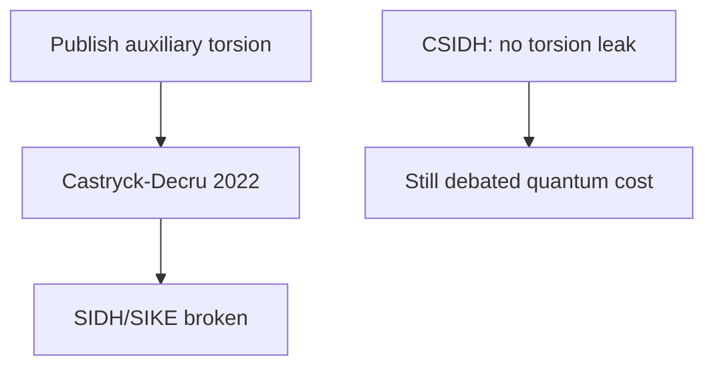

# Chapter 9: Isogeny-Based Cryptography

SIDH taught us that **published torsion can be lethal**; we document survivors and label them experimental.

**Figure 9.1 — SIDH break lesson (conceptual)**



---

> **Author's note:** When in doubt, **pilot hybrid TLS** on internal services first; external customer impact is where rollback plans matter.

## 9.1 Elliptic Curves and Isogenies

Isogeny-based cryptography occupies a unique position in the post-quantum landscape. While lattice and code-based schemes dominate standardization efforts, isogeny-based constructions offer unmatched compactness—public keys and signatures measured in tens of bytes rather than kilobytes. This chapter traces the mathematical foundations, the dramatic rise and fall of SIDH/SIKE, the surviving constructions, and the current state of this rapidly evolving field.

### Elliptic Curve Recap

An elliptic curve E over a field K is a smooth projective algebraic curve of genus 1 equipped with a distinguished rational point O (the "point at infinity"). In short Weierstrass form over a field of characteristic ≠ 2, 3:

```
E: y² = x³ + ax + b    where Δ = -16(4a³ + 27b²) ≠ 0
```

The non-vanishing discriminant condition Δ ≠ 0 ensures the curve is smooth (has no singular points). The points on E, together with the point at infinity O, form an abelian group under a geometric chord-and-tangent addition law.

**Key arithmetic properties over finite fields F_p:**

- **Group structure:** E(F_p) is either cyclic or a product of two cyclic groups. By Hasse's theorem: |E(F_p)| = p + 1 - t where |t| ≤ 2√p. The value t is called the trace of Frobenius.
- **The j-invariant:** j(E) = 1728 · (4a³)/(4a³ + 27b²) classifies elliptic curves up to isomorphism over the algebraic closure. Two curves are isomorphic over F̄_p if and only if they share the same j-invariant.
- **Torsion subgroups:** For a positive integer N, the N-torsion subgroup E[N] = {P ∈ E(F̄_p) : [N]P = O} is isomorphic to (Z/NZ)² when gcd(N, p) = 1. This structure is fundamental to SIDH.
- **Endomorphisms:** An endomorphism of E is a morphism φ: E → E that is also a group homomorphism. The set End(E) forms a ring under addition and composition.

### What Is an Isogeny?

An **isogeny** φ: E₁ → E₂ is a surjective morphism of algebraic varieties that is simultaneously a group homomorphism. In concrete terms, it is a rational map φ(x, y) = (R₁(x, y), R₂(x, y)) between two elliptic curves that sends the identity point of E₁ to the identity point of E₂ and preserves the group operation: φ(P + Q) = φ(P) + φ(Q).

**Fundamental properties of isogenies:**

1. **Kernel determines the isogeny:** By a theorem of algebraic geometry, a separable isogeny φ: E₁ → E₂ is uniquely determined (up to isomorphism of E₂) by its kernel ker(φ) = {P ∈ E₁ : φ(P) = O₂}. Conversely, every finite subgroup G ⊆ E₁ determines a unique (up to isomorphism) isogeny φ: E₁ → E₁/G.

2. **Degree:** The degree of φ equals the size of its kernel for separable isogenies: deg(φ) = |ker(φ)|. The degree is multiplicative under composition: deg(φ ∘ ψ) = deg(φ) · deg(ψ).

3. **Dual isogeny:** For every isogeny φ: E₁ → E₂ of degree d, there exists a unique dual isogeny φ̂: E₂ → E₁ satisfying φ̂ ∘ φ = [d]_{E₁} and φ ∘ φ̂ = [d]_{E₂}, where [d] denotes multiplication by d.

4. **Vélu's formulas:** Given a finite subgroup G ⊆ E, Vélu's formulas (1971) provide explicit rational expressions for computing the isogeny φ_G: E → E/G and the equation of the codomain curve E/G. For a subgroup G of order ℓ, Vélu's formulas require O(ℓ) field operations.

5. **√élu algorithm:** For large-degree isogenies, Bernstein, De Feo, Leroux, and Smith (2020) developed √élu, which computes isogenies in O(√ℓ) field operations using a product-tree approach—a crucial optimization for practical implementations.

6. **Isogeny factorization:** Any isogeny of degree N = ℓ₁^{e₁} · ℓ₂^{e₂} · ... can be decomposed into a chain of prime-degree isogenies. This factorization principle underlies most isogeny-based protocols, which work with chains of small-degree (typically 2 or 3) isogenies.

### The Isogeny Graph

Fix a prime p and a small prime ℓ ≠ p. The **ℓ-isogeny graph** over F_{p²} is defined as:
- **Vertices:** Isomorphism classes of elliptic curves over F_{p²} (represented by j-invariants).
- **Edges:** ℓ-isogenies between curves. Each curve E has exactly ℓ + 1 outgoing ℓ-isogenies (corresponding to the ℓ + 1 subgroups of order ℓ in E[ℓ] ≅ (Z/ℓZ)²).

The structure of the isogeny graph depends dramatically on whether we restrict to supersingular or ordinary curves:

**Supersingular ℓ-isogeny graph:**
- Contains approximately p/12 vertices (supersingular j-invariants over F_{p²}).
- Is (ℓ + 1)-regular (every vertex has exactly ℓ + 1 neighbors).
- Is a **Ramanujan graph:** the spectral gap is optimal, meaning the graph has excellent expansion properties. Random walks on this graph mix rapidly—reaching a nearly uniform distribution over vertices in O(log p) steps.
- Is connected (for ℓ ≠ p and considering curves over F_{p²}).
- The Ramanujan property means that short paths between any two vertices are hard to find—this is the computational hardness assumption underlying isogeny-based cryptography.

**Cryptographic significance of graph properties:** The rapid mixing property ensures that a random walk of length O(log p) starting from any fixed curve E₀ produces a curve that is computationally indistinguishable from a uniformly random supersingular curve. This is the basis for key generation: the public key is a curve reached by a secret random walk from a known starting point, and recovering the walk (the secret key) requires finding a short path in the expander graph.

**Graph diameter:** The supersingular ℓ-isogeny graph has diameter O(log p), meaning any two curves can be connected by a path of length O(log p). However, finding this path is the computationally hard problem—the best known algorithms require exponential time despite the logarithmic diameter.

**Ordinary ℓ-isogeny graph:**
- Has a "volcanic" structure: vertices are organized into levels (the crater, and descending layers), with horizontal isogenies at each level and vertical isogenies between levels.
- The structure is determined by the factorization of the ideal (ℓ) in the endomorphism ring.
- This regular structure is used in CSIDH, where the class group action follows horizontal paths on the volcano.


**Figure 9.2 — Post-SIDH landscape**


## 9.2 Supersingular vs. Ordinary Curves

The distinction between supersingular and ordinary elliptic curves is the most important structural dichotomy in isogeny-based cryptography. These two classes have fundamentally different algebraic properties that lead to different cryptographic constructions and different security characteristics.

### Ordinary Curves

An elliptic curve E over F_p is **ordinary** if its trace of Frobenius t satisfies gcd(t, p) = 1 (equivalently, E[p] ≅ Z/pZ over F̄_p). The vast majority (≈ p - p/12) of isomorphism classes over F_p are ordinary.

**Endomorphism ring structure:** For an ordinary curve E, End(E) is isomorphic to an order O in an imaginary quadratic number field K = Q(√(-D)) for some discriminant -D. This order is a commutative ring—the commutativity is crucial for CSIDH.

**Class group action:** The ideal class group Cl(O) of the endomorphism ring acts on the set of ordinary curves with endomorphism ring isomorphic to O. This action is:
- **Free and transitive:** Each class group element maps each curve to a unique different curve.
- **Commutative:** The class group is abelian, so [a]([b]·E) = [b]([a]·E) for all class group elements [a], [b].

This commutative group action structure is what makes CSIDH possible—it directly generalizes the Diffie-Hellman paradigm.

**Isogeny graph structure (volcanic):** The ordinary ℓ-isogeny graph decomposes into connected components called "volcanoes." Each volcano has:
- A crater (top cycle) consisting of curves whose endomorphism ring is maximal at ℓ.
- Descending levels corresponding to orders of increasing ℓ-conductor.
- Edges within a level (horizontal) and between adjacent levels (vertical/ascending/descending).

### Supersingular Curves

An elliptic curve E over F_p is **supersingular** if t ≡ 0 (mod p), which for p > 3 means t = 0 (the curve has exactly p + 1 points over F_p). There are approximately p/12 supersingular j-invariants, all defined over F_{p²}.

**Endomorphism ring structure:** For a supersingular curve E, End(E) is isomorphic to a maximal order in the quaternion algebra B_{p,∞} ramified at p and infinity. This is a non-commutative ring of rank 4 over Z—the non-commutativity means the Diffie-Hellman paradigm cannot be directly applied but also provides richer mathematical structure for signature schemes.

**The Deuring correspondence:** There is a deep correspondence (due to Deuring) between:
- Supersingular elliptic curves over F_{p²} ↔ Maximal orders in B_{p,∞}
- Isogenies between supersingular curves ↔ Left ideals connecting the corresponding orders

This correspondence is the mathematical foundation of SQISign: computing isogenies is equivalent to finding connecting ideals in the quaternion algebra, and vice versa.

**Why supersingular curves for cryptography?**
- The Ramanujan graph structure means finding paths (isogenies) between random curves is computationally hard.
- The quaternion algebra structure provides rich algebraic tools for constructing schemes (especially signatures).
- The approximately p/12 curves provide a large enough space for security (choosing p ≈ 2^256 gives ≈ 2^252 curves).

### The Choice Affects Everything

| Property | Ordinary (CSIDH) | Supersingular (SIDH, SQISign) |
|----------|-------------------|-------------------------------|
| End(E) | Commutative (quadratic order) | Non-commutative (quaternion order) |
| Group action | Yes (Cl(O) acts) | No natural commutative action |
| Graph structure | Volcanic | Ramanujan (expander) |
| Key exchange | Natural DH analogue | Requires torsion point images (SIDH) or quaternion algebra (SQISign) |
| Quantum threat | Kuperberg (subexponential) | No known subexponential quantum attack (for SQISign) |

### Computing with Isogenies in Practice

Computing an ℓ-isogeny from a curve E given a kernel point P of order ℓ uses Vélu's formulas:
- Input: Curve E and kernel generator P with [ℓ]P = O.
- Output: The codomain curve E' = E/⟨P⟩ and the isogeny map φ: E → E'.
- Cost: O(ℓ) field operations for the standard Vélu algorithm; O(√ℓ · log ℓ) using the √élu algorithm of Bernstein, De Feo, Leroux, and Smith (2020).

For large-degree isogenies (degree N = ℓ^e), the isogeny is computed as a chain of ℓ-isogenies:

```
E₀ →^{φ₁} E₁ →^{φ₂} E₂ → ... →^{φₑ} Eₑ
```

Each φᵢ is an ℓ-isogeny with kernel generated by the appropriate push-forward of the original kernel point. The "optimal strategy" algorithm (De Feo, Jao, and Plût, 2014) minimizes the total computation cost by scheduling multiplication and isogeny operations in an optimal tree-like pattern, reducing the total cost from O(e²) to O(e · log e) ℓ-isogeny evaluations.

### Supersingular Curves over F_p vs F_{p²}

An important subtlety in the design of isogeny-based schemes is the field of definition. All supersingular j-invariants lie in F_{p²}, but only a subset (approximately √p of them) have F_p-rational j-invariants. CSIDH works exclusively with this smaller F_p-rational set, while SIDH and SQISign use the full set over F_{p²}.

Working over F_p (CSIDH) enables simpler arithmetic, commutativity of the group action, and smaller field representations, but provides a smaller keyspace and vulnerability to Kuperberg's algorithm through the commutative structure. Working over F_{p²} (SIDH, SQISign) enables a larger keyspace with stronger security assumptions and richer algebraic structure through quaternion algebras, but requires more expensive field arithmetic and confronts the challenges of non-commutativity.

## 9.3 Hard Problems in Isogeny-Based Cryptography

### The Supersingular Isogeny Problem

**Definition:** Given two supersingular elliptic curves E₁ and E₂ over F_{p²}, find an isogeny φ: E₁ → E₂ (of smooth degree, or any degree).

**Classical complexity:**
- **Meet-in-the-middle (MITM):** Enumerate isogenies of degree up to √p from both E₁ and E₂, looking for a collision (a common intermediate curve). Cost: O(p^(1/4)) time and O(p^(1/4)) storage using birthday-paradox arguments over the ≈ p/12 supersingular curves.
- **Van Oorschot-Wiener:** Parallelized MITM using distinguished points, trading time for reduced memory.
- **Delfs-Galbraith:** First find a path from each curve to a special curve defined over F_p (cost: O(p^(1/4))), then connect the two F_p-paths.

**Quantum complexity:**
- **Quantum walk (Biasse-Jao-Sankar):** Using quantum walks on the isogeny graph, the problem can be solved in O(p^(1/6)) quantum queries. This is better than Grover's O(p^(1/4)) but still exponential.
- **No polynomial-time quantum algorithm** is known for the general supersingular isogeny problem without auxiliary information.

**Critical caveat:** The hardness of the supersingular isogeny problem depends critically on what auxiliary information is provided alongside the two curves. The raw problem (given only E₁ and E₂, find an isogeny) remains exponentially hard. However, as the SIDH attack demonstrated, providing images of torsion basis points under the secret isogeny reduces the problem to polynomial time. This sensitivity to auxiliary information is a distinctive feature of isogeny-based problems that has no direct analogue in lattice or code-based cryptography, where revealing partial structural information about the secret typically does not lead to catastrophic breaks.

### The Endomorphism Ring Problem

**Definition:** Given a supersingular elliptic curve E over F_{p²}, compute its endomorphism ring End(E) (as a maximal order in the quaternion algebra B_{p,∞}).

**Significance:** A series of results by Eisenträger, Hallgren, Lauter, Morrison, and Petit established that:
- Computing End(E) is equivalent (under polynomial-time reductions) to computing isogenies between supersingular curves.
- Given End(E₁) and End(E₂), one can efficiently find an isogeny E₁ → E₂.
- Given an isogeny E₁ → E₂ and End(E₁), one can efficiently compute End(E₂).

This establishes the **endomorphism ring problem** as the foundational hard problem for supersingular isogeny cryptography. It is to supersingular curves what the discrete logarithm problem is to classical elliptic curve cryptography.

**Best known algorithms:**
- Classical: O(p^(1/4)) via the MITM approach on isogeny graphs
- Quantum: O(p^(1/6)) via quantum walks
- Both are exponential in log(p)

### The CSIDH Problem (Class Group Action Inversion)

**Definition:** Given two elliptic curves E₁ and E₂ that are related by the class group action (E₂ = [a]·E₁ for some [a] ∈ Cl(O)), find the class group element [a].

This is essentially the "discrete logarithm" analogue for group actions: given the base (E₁), the result (E₂), and the group (Cl(O)), find the exponent ([a]).

**Classical complexity:**
- **Baby-step giant-step:** Decompose [a] with respect to generators of Cl(O). Cost: O(√|Cl(O)|) ≈ O(p^(1/4)).
- **Pohlig-Hellman-type decomposition:** If the class group order has small factors, the problem decomposes correspondingly.

**Quantum complexity:**
- **Kuperberg's algorithm for the hidden shift problem:** The CSIDH problem reduces to an instance of the (abelian) hidden shift problem, for which Kuperberg's algorithm provides a subexponential quantum attack.
- **Complexity of Kuperberg's algorithm:** The original version requires 2^O(√(log p)) quantum time and quantum memory. The "collimation" variant by Kuperberg (2004) uses only polynomial quantum memory but 2^O(∛(log p · log log p)) time.
- **Peikert's analysis (2020):** Demonstrated that with CSIDH-512 parameters, Kuperberg's algorithm might achieve practical attacks with moderate quantum resources, calling into question the concrete security claims.

The subexponential quantum attack is the primary security concern for CSIDH and distinguishes it from the fully exponential quantum resistance of lattice-based schemes.

### The One-More Isogeny Problem

**Definition:** Given access to an oracle that computes isogenies from a fixed (unknown) starting curve E₀, after querying the oracle on n inputs and receiving n isogenies, compute an isogeny from E₀ that was not directly provided by the oracle.

**Significance:** This problem appears in the security analysis of SQISign and related signature schemes. The security proof for SQISign shows that forging a signature requires solving either the endomorphism ring problem or the one-more isogeny problem.

### The Decisional CSIDH Problem

**Definition:** Distinguish between (E₁, [a]·E₁) for a random class group element [a], and (E₁, E₂) for independently random curves E₁, E₂.

This decisional variant is needed for CPA-secure encryption from CSIDH. Its hardness follows from the computational problem under standard assumptions, but the tightness of the reduction matters for concrete parameter selection.

### Relationship Between Problems

The hard problems are interconnected:
- Endomorphism ring computation ≡ Supersingular isogeny problem (polynomial reductions exist)
- CSIDH problem reduces to the hidden shift problem (which has subexponential quantum algorithms)
- SIDH problem (with auxiliary points) reduces to polynomial time (Castryck-Decru 2022)

## 9.4 SIDH/SIKE: Rise and Fall

### The SIDH Protocol (Jao and De Feo, 2011)

Supersingular Isogeny Diffie-Hellman (SIDH) was the first practical isogeny-based key exchange protocol and represented a breakthrough in compact post-quantum cryptography. Its design was elegant, exploiting the non-commutative structure of supersingular isogeny graphs through a clever use of torsion point information.

**System Parameters:**
- A prime of the form p = 2^a · 3^b · f - 1 (chosen so both 2^a and 3^b divide p² - 1, ensuring E₀[2^a] and E₀[3^b] are F_{p²}-rational).
- A starting supersingular curve E₀ over F_{p²} (typically y² = x³ + x with j = 1728).
- Basis points: (P_A, Q_A) generating E₀[2^a] and (P_B, Q_B) generating E₀[3^b].
- Parameters chosen so 2^a ≈ 3^b ≈ √p (balancing Alice's and Bob's computations).

**Protocol:**

Alice's computation:
1. Choose a secret scalar m_A ∈ {0, 1, ..., 2^a - 1}.
2. Define the secret kernel subgroup: K_A = ⟨P_A + [m_A]Q_A⟩ ⊆ E₀[2^a], a cyclic subgroup of order 2^a.
3. Compute the secret isogeny φ_A: E₀ → E_A = E₀/K_A using iterated 2-isogenies (a steps).
4. Publish: the curve E_A and the images φ_A(P_B) and φ_A(Q_B).

Bob's computation:
1. Choose a secret scalar m_B ∈ {0, 1, ..., 3^b - 1}.
2. Define K_B = ⟨P_B + [m_B]Q_B⟩ ⊆ E₀[3^b], a cyclic subgroup of order 3^b.
3. Compute φ_B: E₀ → E_B = E₀/K_B using iterated 3-isogenies (b steps).
4. Publish: the curve E_B and the images φ_B(P_A) and φ_B(Q_A).

Shared secret computation:
- Alice computes: φ'_A: E_B → E_B/⟨φ_B(P_A) + [m_A]φ_B(Q_A)⟩. The shared secret is j(E_{AB}).
- Bob computes: φ'_B: E_A → E_A/⟨φ_A(P_B) + [m_B]φ_A(Q_B)⟩. The shared secret is j(E_{BA}).

**Why this works:** The key insight is that E_{AB} ≅ E_{BA} because both are isomorphic to E₀/⟨K_A, K_B⟩. The auxiliary torsion point images allow each party to "transport" their secret kernel generator to the other party's codomain curve.

**Why auxiliary points are necessary:** Without the images φ_A(P_B), φ_A(Q_B), Bob cannot determine how to embed his secret isogeny into Alice's codomain E_A—the non-commutativity of the quaternion endomorphism ring means there is no natural way to "commute" the two isogenies without this auxiliary information.

### SIKE (Supersingular Isogeny Key Encapsulation)

SIKE was the IND-CCA2-secure KEM constructed from SIDH via the Fujisaki-Okamoto transform:

**Parameters (SIKEp434, targeting Level I):**
- Prime: p = 2^216 · 3^137 - 1 (434 bits)
- Public key: 330 bytes (E_A represented by coefficients, plus two torsion point images)
- Ciphertext: 346 bytes
- Shared secret: 16 bytes
- Key generation: ~10 ms
- Encapsulation: ~15 ms
- Decapsulation: ~16 ms

SIKE held the record for the smallest public keys and ciphertexts of any PQC KEM candidate—an order of magnitude smaller than lattice-based alternatives. This compactness made SIKE attractive for bandwidth-constrained applications (IoT, embedded systems, TLS handshakes).

**Performance limitations:** Despite compact sizes, SIKE was 100-1000x slower than lattice-based KEMs. Each isogeny computation required hundreds of large-integer multiplications over F_{p²}. Various optimizations (optimal strategies for isogeny chain evaluation, efficient F_{p²} arithmetic, VELU/√élu improvements) reduced but never eliminated this gap.

**NIST competition history:** SIKE progressed through all rounds of the NIST competition as an "alternate" candidate—recognized as having uniquely attractive size properties but with concerns about:
- Relatively young cryptanalytic history (proposed 2011, standardization began 2017).
- Slow performance compared to lattice-based alternatives.
- Complex mathematical foundation with potential for unexpected structural attacks.

The final concern proved prescient. SIKE was broken just weeks after NIST announced it as a fourth-round candidate for potential standardization.

### The Devastating Attack (Castryck-Decru, July 2022)

On July 30, 2022, Wouter Castryck and Thomas Decru posted a preprint describing a polynomial-time key-recovery attack against SIDH. Within days, Luciano Maino and Chloe Martindale produced an independent attack using similar ideas, and Damien Robert gave a simplified version. The attack was quickly verified to break SIKE at all security levels.

**Mathematical Foundation — The Kani Lemma:**

The attack exploits a deep result from the theory of abelian varieties. The Kani lemma (1997) provides a criterion for when a product of two isogenies between elliptic curves can be "glued" into an isogeny between abelian surfaces (products of two elliptic curves):

Given isogenies φ: E₁ → E₂ and ψ: E₁ → E₃ with deg(φ) + deg(ψ) = N, under certain conditions there exists an isogeny of abelian surfaces:
```
(φ, ψ): E₁ × E₁ → E₂ × E₃
```
that factors through the (1, N)-polarized surface E₁ × E₁/⟨graph of [N]⟩.

**How the Attack Works:**

1. **From auxiliary points to a higher-dimensional problem:** Alice publishes (E_A, φ_A(P_B), φ_A(Q_B)). The images φ_A(P_B) and φ_A(Q_B) on E_A, combined with the known basis points P_B, Q_B on E₀, define enough data to construct an isogeny between products of elliptic curves (abelian surfaces).

2. **Dimension upgrade:** Using the Kani lemma, the degree-2^a isogeny φ_A: E₀ → E_A is "lifted" to an isogeny between abelian surfaces that can be factored differently.

3. **Richelot isogenies and gluing:** The attack proceeds by computing isogenies between abelian surfaces (Richelot isogenies, which are the genus-2 analogue of 2-isogenies) using the extra structure provided by the auxiliary points.

4. **Recovery:** The chain of surface isogenies reveals the kernel of the original elliptic curve isogeny φ_A, completely recovering Alice's secret.

**Complexity:** The attack runs in polynomial time in the security parameter—O(a³) or O(a⁴) depending on implementation details. For SIKE-p434, this translates to seconds on a standard laptop.

**Why the attack works fundamentally:**

The root cause is that SIDH publishes the action of the secret isogeny on the full torsion structure of the "other" party's subgroup. This is an enormous amount of algebraic information—it constrains the secret isogeny so severely that it can be uniquely (and efficiently) determined. In retrospect, publishing φ_A(P_B) and φ_A(Q_B) reveals the entire action of φ_A on E₀[3^b], which essentially determines φ_A given that deg(φ_A) = 2^a and gcd(2^a, 3^b) = 1.

### Lessons from the SIDH Break

The SIDH/SIKE break carries profound lessons for post-quantum cryptography:

1. **Auxiliary information is dangerous:** Publishing the action of a secret map on known points can catastrophically reduce the hardness of the underlying problem. The raw isogeny problem (find φ given only E₁ and E₂) remains exponentially hard; it is the auxiliary torsion point information that enables the polynomial-time attack.

2. **Higher-dimensional algebraic geometry provides unexpected attacks:** The attack crucially used the theory of abelian surfaces—a domain not traditionally considered in isogeny cryptanalysis. This suggests that cryptographic assumptions must be evaluated against the full power of algebraic geometry, not just elliptic curve techniques.

3. **Young schemes carry elevated risk:** SIDH was proposed in 2011 and had only 11 years of cryptanalytic study before being broken. The relevant mathematical tools (Kani's lemma, Richelot isogeny computation) existed in the literature but their cryptanalytic applicability was not recognized until 2022.

4. **Performance advantages can mask structural weaknesses:** SIKE's uniquely compact key sizes attracted attention and investment, but the same structural features that enabled compactness (the auxiliary point publication) were precisely what enabled the attack.

5. **The importance of diverse approaches:** The SIDH break did not affect CSIDH (which publishes no auxiliary points) or SQISign (which uses a fundamentally different paradigm), illustrating the value of maintaining multiple approaches within a cryptographic family.

## 9.5 CSIDH: Commutative Group Actions

### Construction

CSIDH (Commutative Supersingular Isogeny Diffie-Hellman), proposed by Castryck, Lange, Martindale, Panny, and Renes in 2018, takes a fundamentally different approach from SIDH. Instead of working with arbitrary supersingular curves over F_{p²} and publishing torsion point images, CSIDH restricts to a special subset of supersingular curves that admit a commutative group action.

**The Key Insight:** Consider supersingular elliptic curves over F_p (not F_{p²}) of the form E: y² = x³ + Ax² + x (Montgomery form). These curves have the special property that their F_p-rational endomorphism ring is isomorphic to an order O in an imaginary quadratic field—specifically, O = Z[π] where π is the Frobenius endomorphism.

Although these curves are supersingular (having p + 1 points over F_p, with trace t = 0), their F_p-rational endomorphism ring is commutative. The ideal class group Cl(O) acts on the set of F_p-isomorphism classes of such curves via isogenies.

**The Group Action:**

For each prime ℓ (with ℓ ≠ p), the ideal (ℓ) factors in O as:
- **Split:** (ℓ) = l · l̄ if the Legendre symbol (−p/ℓ) = 1. In this case, l acts by the unique F_p-rational ℓ-isogeny, and l̄ acts by its dual.
- **Inert:** (ℓ) remains prime. No F_p-rational ℓ-isogeny exists.
- **Ramified:** (ℓ) = l². The curve has a unique ℓ-isogeny that maps it to itself (up to isomorphism).

For split primes, the class group action by l corresponds to walking one step in the ℓ-isogeny graph. The commutativity of the class group means these walks commute with each other, enabling a Diffie-Hellman-like protocol.

**CSIDH Key Exchange:**

Setup: A starting curve E₀ over F_p and a set of small split primes ℓ₁, ..., ℓₛ.

- Alice: Chooses a secret vector (e₁, ..., eₛ) of small integers. Computes E_A = [l₁^{e₁} · ... · lₛ^{eₛ}] · E₀ by repeatedly applying ℓᵢ-isogenies (eᵢ times for prime ℓᵢ, in the forward or reverse direction depending on sign).
- Bob: Chooses (f₁, ..., fₛ) and computes E_B similarly.
- Shared secret: Alice computes [l₁^{e₁} · ... · lₛ^{eₛ}] · E_B. Bob computes [l₁^{f₁} · ... · lₛ^{fₛ}] · E_A. By commutativity, both obtain the same curve E_{AB}.

**Key sizes:** The public key is simply the Montgomery coefficient A of the resulting curve, requiring only ⌈log₂ p⌉ bits ≈ 64 bytes. This is the smallest key size of any post-quantum key exchange proposal.

### Security of CSIDH

CSIDH is NOT broken by the Castryck-Decru attack because it publishes no auxiliary torsion point information—only the resulting curve. The security rests on the raw computational problem of inverting the class group action.

**Classical security:**
- Best attack: A combination of baby-step giant-step on the class group and meet-in-the-middle techniques. For CSIDH-512, this gives approximately 62 bits of classical security (debated; some analyses give higher estimates depending on the cost model).

**Quantum security — Kuperberg's algorithm:**

The CSIDH problem reduces to an instance of the **hidden shift problem**: given two functions f₀ and f₁ that satisfy f₁(x) = f₀(x + s) for an unknown shift s, find s. Kuperberg's quantum algorithm solves this problem in subexponential time.

**Variants of Kuperberg's algorithm and their costs:**

| Variant | Quantum Time | Quantum Memory | Classical Memory |
|---------|-------------|----------------|-----------------|
| Original (2003) | 2^O(√(log N)) | 2^O(√(log N)) | Polynomial |
| Collimation (2004) | 2^O(√(log N · log log N)) | Polynomial | Polynomial |
| Regev-style (adapted) | 2^O(∛(log N)) | 2^O(∛(log N)) | Polynomial |

For CSIDH-512 (N ≈ 2^256, log N ≈ 256):
- Original Kuperberg: 2^O(√256) ≈ 2^O(16) — potentially practical
- With careful analysis: Estimates range from 2^32 to 2^65 quantum operations (highly dependent on constant factors and quantum memory model)

**The security debate:** The concrete quantum security of CSIDH remains one of the most contentious topics in post-quantum cryptography. Optimistic analyses suggest CSIDH-512 offers adequate security; pessimistic analyses (notably Peikert 2020, Bonnetain-Schrottenloher 2020) argue it may be breakable with a moderate quantum computer. This uncertainty has hindered CSIDH's path to standardization.

### CSIDH Variants and Improvements

**CSIDH-512:** The original parameter set with p ≈ 2^511. Offers the most compact keys but debated quantum security.

**CSIDH-1024 and CSIDH-1792:** Larger parameter sets providing higher security margins, at the cost of proportionally slower computation.

**CTIDH (Constant-Time CSIDH):** A major implementation challenge for CSIDH is achieving constant-time execution. The number of ℓᵢ-isogeny steps varies based on the secret vector, creating a timing side channel. CTIDH (Banegas et al., 2021) provides a constant-time implementation by fixing the total number of operations through dummy isogeny computations, using a "SIMBA" batching strategy.

**CSURF (CSIDH on the Surface):** Replaces the floor of the isogeny volcano with the surface (maximal order), potentially offering better performance.

**Séta and threshold constructions:** CSIDH's commutative group action enables natural constructions of threshold protocols, oblivious transfer, and other advanced cryptographic primitives that are difficult to build from non-commutative assumptions.

## 9.6 SQISign: Isogeny-Based Signatures

### Overview

SQISign (Short Quaternion and Isogeny Signature), introduced by De Feo, Kohel, Leroux, Petit, and Wesolowski in 2020, is the most promising isogeny-based digital signature scheme. It achieves remarkably compact signatures (177 bytes at the 128-bit security level) by exploiting the deep connection between supersingular isogenies and quaternion algebra—the Deuring correspondence.

SQISign is fundamentally different from both SIDH and CSIDH:
- It works with the full supersingular isogeny graph over F_{p²} (not restricted to F_p-rational curves).
- It does not publish torsion point images (avoiding the SIDH vulnerability).
- It uses the non-commutative quaternion algebra constructively for signing, rather than treating non-commutativity as an obstacle.

### The Deuring Correspondence in Detail

The Deuring correspondence provides a dictionary between geometric objects (curves and isogenies) and algebraic objects (orders and ideals):

| Geometric Side | Algebraic Side |
|---------------|---------------|
| Supersingular curve E | Maximal order O ⊂ B_{p,∞} |
| Isogeny φ: E₁ → E₂ | Left O₁-ideal I with right order O₂ |
| Degree of φ | Norm of I |
| Composition of isogenies | Product of ideals |
| Endomorphism of E | Two-sided ideal of O |

This correspondence is effective in both directions: given an ideal I of norm N in a maximal order, one can efficiently compute the corresponding isogeny of degree N (using the "ideal-to-isogeny" translation), and conversely, given an isogeny and knowledge of the endomorphism ring, one can compute the corresponding ideal.

### SQISign Construction

**Key Generation:**
1. Start with a special curve E₀ whose endomorphism ring O₀ is known (typically the curve with j = 1728, where End(E₀) ≅ Z[i, (1+j)/2, (i+k)/2] in the quaternion algebra).
2. Choose a random secret isogeny τ: E₀ → E_A of smooth degree (a product of small primes). The secret key is τ (or equivalently, the corresponding quaternion ideal).
3. The public key is E_A (just the j-invariant or curve coefficients).

**Signing (Sigma protocol / Fiat-Shamir):**

SQISign uses a sigma protocol (commit-challenge-response) made non-interactive via Fiat-Shamir:

1. **Commitment:** The signer chooses a random isogeny ψ: E₀ → E₁ of smooth degree. The commitment is E₁.

2. **Challenge:** Hash the message and commitment to obtain a challenge, which specifies a degree-D cyclic subgroup of E₁ (determining a challenge isogeny φ_c: E₁ → E₂).

3. **Response:** The signer must produce an isogeny σ: E_A → E₂ of specific (smooth) degree. This requires "connecting" E_A to E₂ through the quaternion algebra:
   - Translate everything to ideals: the secret key τ ↔ ideal I_τ, the commitment ψ ↔ ideal I_ψ, the challenge φ_c ↔ ideal I_c.
   - Compute the ideal corresponding to the path E_A → E₀ → E₁ → E₂ (using I_τ̄ · I_ψ · I_c).
   - Find an equivalent ideal of smooth norm using the "SigningKLPT" algorithm (a variant of the Kohel-Lauter-Petit-Tignol algorithm for finding equivalent smooth-norm ideals).
   - Translate the smooth ideal back to an isogeny.

4. **Output:** The signature is the isogeny σ: E_A → E₂ (represented by its kernel or evaluation at specific points), requiring only ~177 bytes.

**Verification:**
1. Recompute E₁ from E_A and σ: since σ: E_A → E₂ and the dual σ̂: E₂ → E_A are related by σ̂ ∘ σ = [deg σ], the verifier can reconstruct the path.
2. Recompute the challenge from the message and E₁.
3. Check that the response isogeny has the correct degree and endpoints.

### Performance Characteristics

SQISign's performance reflects the computational complexity of quaternion algebra operations:

| Operation | Time (approx.) | Notes |
|-----------|---------------|-------|
| Key generation | ~100 ms | Random walk + endomorphism ring setup |
| Signing | ~1,000-5,000 ms | Dominated by KLPT algorithm and ideal-to-isogeny translation |
| Verification | ~50-100 ms | Isogeny evaluation and degree checking |

The slow signing speed is the primary practical limitation. It stems from the KLPT algorithm's need to find short vectors in quaternion lattices and the multi-step ideal-to-isogeny translation.

### Security Analysis

SQISign's security rests on the hardness of the endomorphism ring problem for supersingular curves:

**Positive security arguments:**
- No torsion point images are published (avoiding the SIDH attack vector entirely).
- The response isogeny σ does not reveal the full path E₀ → E₁ → E₂, only the composed connection E_A → E₂.
- The quaternion algebra structure provides information-theoretic arguments about the difficulty of recovering the secret from responses.
- The best known attack requires solving the general supersingular isogeny problem: O(p^(1/4)) classically, O(p^(1/6)) quantumly.

**Potential concerns:**
- The KLPT algorithm introduces specific algebraic structure into the response isogeny that might be exploitable.
- The scheme is relatively young (2020) and the full power of algebraic attacks has not yet been explored.
- Side-channel resistance of the complex signing algorithm is difficult to ensure.
- The security proof relies on non-standard assumptions (one-more isogeny problem) whose relationship to the raw endomorphism ring problem needs further study.

### SQISign Variants and Improvements

**SQISignHD (Higher-Dimensional):** Uses higher-dimensional isogenies (abelian surfaces) to improve signing efficiency. By working with 2-dimensional isogenies, the KLPT step can be simplified.

**AprèsSQI:** A variant with faster verification using precomputed auxiliary data.

**SQISign with NIST Parameters:** Ongoing work to optimize SQISign for the specific security levels required by NIST (Levels I, III, V), with current proposals achieving:
- Level I: Public key 64 bytes, signature 177 bytes
- Level V: Public key 128 bytes, signature ~370 bytes

### Current Status (2025-2026)

SQISign is under evaluation by NIST for additional digital signature standardization. Key developments:
- Significant performance improvements since the original 2020 proposal (signing time reduced from ~minutes to ~1-5 seconds).
- Growing implementation ecosystem with side-channel-aware implementations.
- Active cryptanalysis with no successful attacks found.
- Concerns remain about implementation complexity and the difficulty of formal verification.

## 9.7 Other Isogeny-Based Constructions

### FESTA (Fast Encryption from Supersingular Torsion Attacks)

FESTA, proposed by Basso, Maino, and Pope in 2023, represents a creative turning-point in isogeny cryptography: it uses the mathematical structure exploited in the SIDH attack as a constructive tool for building encryption schemes.

**Key idea:** The Castryck-Decru attack shows that publishing torsion point images enables efficient isogeny recovery. FESTA uses this property constructively: the legitimate decryptor can efficiently recover the encryption isogeny using the attack algorithm, while the lack of auxiliary information makes it hard for an adversary to break the scheme.

**Construction outline:**
1. Encryption involves computing an isogeny and publishing specific torsion point images (like SIDH).
2. Decryption uses a Castryck-Decru-style algorithm with knowledge of the secret key.
3. Security relies on the hardness of the isogeny problem WITHOUT the auxiliary point information.

**Status:** FESTA is in an early stage of development. Its security assumptions need further scrutiny, and the performance characteristics (inherited from the expensive surface isogeny computations) limit practical applicability. However, it demonstrates that the SIDH attack, far from being purely destructive, opened new constructive possibilities.

**Parameters (preliminary):**
- Public key: ~4,000 bytes
- Ciphertext: ~4,000 bytes
- Encryption/Decryption: ~100-500 ms
- Security: Based on hardness of the supersingular isogeny problem (without auxiliary points)

While FESTA's sizes are larger than SIKE's were, its security rests on a fundamentally different (and apparently harder) problem. The scheme demonstrates that isogeny-based encryption need not require the dangerous auxiliary point publication that doomed SIDH.

### SCALLOP (Scalable Group Action from Isogenies of Oriented Supersingular Curves)

SCALLOP, proposed by De Feo, Fouotsa, Kutas, Leroux, Merz, Panny, and Wesolowski in 2023, provides an efficient group action from oriented supersingular curves that avoids the vulnerabilities of both SIDH (auxiliary points) and CSIDH (Kuperberg's algorithm).

**Key innovation:** SCALLOP works with supersingular curves equipped with an "orientation"—additional endomorphism structure that enables a group action by the class group of a carefully chosen imaginary quadratic order. The orientation provides the commutativity needed for Diffie-Hellman without requiring restriction to F_p (which makes CSIDH vulnerable to Kuperberg via the structure of the class group).

**Security argument:** The orientation is chosen so that the class group is large and structurally resistant to Kuperberg-type attacks. The smooth class number prevents efficient evaluation of the hidden shift oracle required by Kuperberg's algorithm. Specifically, evaluating the group action for a single ideal class element requires computing a large-degree isogeny, and Kuperberg's algorithm needs many such evaluations—if each evaluation is expensive enough, the total quantum attack cost exceeds the security target.

**Performance:** SCALLOP is significantly slower than CSIDH but potentially offers better quantum security guarantees. Current implementations achieve key exchange in ~1-10 seconds. The performance cost is the price paid for resistance to Kuperberg's algorithm—the same structural properties that prevent efficient quantum oracle queries also make legitimate computation slower.

### OSIDH (Oriented Supersingular Isogeny Diffie-Hellman)

An earlier group-action construction using oriented curves, proposed by Colò and Kohel in 2019. OSIDH suffered from structural issues related to the choice of orientation that made certain information leakage possible. Specifically, the original OSIDH revealed enough information about the orientation to enable partial key recovery in certain parameter regimes. SCALLOP addresses these issues through careful choice of the orientation and class group structure, demonstrating how the field learns from each construction's weaknesses.

### Threshold and Advanced Protocols

The mathematical richness of isogeny-based group actions enables advanced cryptographic protocols:

**Non-interactive Key Exchange (NIKE):** CSIDH's commutative group action naturally provides NIKE—two parties can derive a shared key from each other's public keys without any interaction. This is impossible from lattice-based assumptions without additional rounds.

**Threshold Signatures:** The group action structure enables threshold variants of isogeny-based signatures, where k-of-n parties must cooperate to produce a signature.

**Verifiable Random Functions (VRFs):** Group-action-based VRFs have been proposed using CSIDH-like assumptions, providing quantum-resistant verifiable randomness.

**Oblivious Transfer and MPC:** Smooth group actions (where the group order is smooth) enable efficient oblivious transfer protocols, which are building blocks for general multi-party computation.

**Delay Encryption:** The sequential nature of isogeny computation (each step depends on the previous one) has been proposed for use in delay encryption and verifiable delay functions.

### The Post-SIDH Constructive Landscape

The SIDH break paradoxically opened new constructive directions by providing new tools:

**Constructive use of the Kani lemma:** The same mathematical structure that broke SIDH provides new ways to build cryptographic schemes. FESTA directly uses the attack algorithm as a decryption mechanism.

**Higher-dimensional techniques:** The dimension-lifting techniques (from elliptic curves to abelian surfaces) used in the SIDH attack have inspired new efficient algorithms for computing endomorphism rings, evaluating isogenies, and building signature schemes (SQISignHD).

**Torsion-point-free protocols:** The community has developed a clear understanding of which auxiliary information is safe to publish: the j-invariant of the codomain curve alone (CSIDH, SQISign) appears safe, while full torsion point images (SIDH) are catastrophically unsafe. This understanding guides the design of all new isogeny-based protocols.

## 9.8 Performance Characteristics

Isogeny-based cryptography exhibits a distinctive performance profile: exceptionally compact but computationally expensive. The following table provides a comprehensive comparison:

| Metric | CSIDH-512 | SQISign (Level I) | SIKE p434 (broken) | ML-KEM-768 | ML-DSA-65 |
|--------|-----------|-------------------|---------------------|------------|-----------|
| Public key | 64 B | 64 B | 330 B | 1,184 B | 1,952 B |
| Secret key | 32 B | ~782 B | 374 B | 2,400 B | 4,032 B |
| Ciphertext/Signature | 64 B | 177 B | 346 B | 1,088 B | 3,309 B |
| Key gen | ~40 ms | ~100 ms | ~10 ms | ~0.05 ms | ~0.1 ms |
| Encaps/Sign | ~40 ms | ~2,000 ms | ~15 ms | ~0.07 ms | ~1 ms |
| Decaps/Verify | ~40 ms | ~80 ms | ~16 ms | ~0.06 ms | ~0.5 ms |
| Bandwidth (total exchange) | 128 B | 241 B | 676 B | 2,272 B | 5,261 B |

**Key observations:**

1. **Size advantage:** Isogeny-based schemes achieve 5-50x smaller sizes than lattice-based alternatives. For bandwidth-constrained applications (satellite links, low-power radio, IoT), this advantage can be decisive.

2. **Speed disadvantage:** Isogeny-based schemes are 100-10,000x slower than lattice-based alternatives. This makes them unsuitable for high-throughput applications or latency-sensitive protocols.

3. **Asymmetric performance:** SQISign verification (~80 ms) is dramatically faster than signing (~2,000 ms), making it potentially suitable for scenarios with a powerful signer and many lightweight verifiers.

4. **Hardware acceleration potential:** Isogeny computation is dominated by large-integer arithmetic in F_{p²}. Custom hardware (FPGA, ASIC) can provide 10-100x speedups, potentially making isogeny-based schemes practical for specific deployed systems.

### Implementation Challenges

Beyond raw performance, isogeny-based implementations face unique challenges:

**Constant-time execution:** The variable-length isogeny chains in CSIDH and the complex algebraic operations in SQISign make constant-time implementation difficult. CTIDH addresses this for CSIDH but adds significant overhead.

**Code complexity:** SQISign requires implementing quaternion algebra arithmetic, lattice reduction (KLPT), ideal-to-isogeny translation, and multi-step isogeny evaluation. The implementation surface is large, increasing the risk of bugs and side-channel vulnerabilities.

**Formal verification:** The mathematical complexity of isogeny-based schemes makes formal verification of implementations extremely challenging compared to simpler schemes (hash-based signatures, even lattice-based schemes).

### Comparison with Lattice-Based Performance

To put isogeny-based performance in perspective, consider a typical use case—establishing a secure channel:

**Bandwidth-limited scenario (satellite communication, 1 kbps link):**
- ML-KEM-768 key exchange: 2,272 bytes → 18 seconds of link time
- CSIDH-512 key exchange: 128 bytes → 1 second of link time
- Computation difference (40 ms vs 0.1 ms) is negligible compared to transmission savings

**Compute-limited scenario (high-throughput server, 10,000 connections/second):**
- ML-KEM-768: 0.1 ms per operation → 10,000 connections achievable
- CSIDH-512: 40 ms per operation → only 25 connections/second
- Bandwidth savings irrelevant when compute is the bottleneck

This analysis shows that isogeny-based schemes are only appropriate when bandwidth is the dominant constraint and computation time is acceptable. This niche is small but includes important applications like satellite communication, deep-space networks, and extremely constrained IoT devices.

## 9.9 The State of Isogeny-Based Cryptography (2025-2026)

### What Has Been Broken

**SIDH/SIKE (completely broken, 2022):**
- Polynomial-time key-recovery attack by Castryck-Decru, Maino-Martindale, and Robert.
- Fundamental structural flaw: publishing torsion point images under the secret isogeny.
- No parameter-level fix possible—the attack exploits an inherent design choice.
- SIKE was withdrawn from NIST consideration immediately.

**Weak CSIDH parameters (security questioned):**
- CSIDH-512's quantum security is disputed; multiple analyses suggest it may offer as few as 32-65 bits of quantum security against Kuperberg's algorithm.
- The debate hinges on concrete cost estimates for quantum operations and quantum memory.
- Conservative parameter choices (CSIDH-1024 or larger) appear to restore adequate security but at significant performance cost.

**OSIDH (partially broken):**
- The original OSIDH construction was shown to have vulnerabilities related to the orientation structure.
- Repaired in subsequent work (leading to SCALLOP).

### What Survives

**SQISign (no known efficient attack):**
- Based on the endomorphism ring problem, which has exponential classical and quantum complexity.
- Not affected by the SIDH attack (no torsion point publication).
- Not affected by Kuperberg-type attacks (operates over F_{p²}, not using a commutative group action vulnerable to hidden shift).
- Under active NIST evaluation for additional digital signatures.

**CSIDH with conservative parameters:**
- Larger parameter choices (CSIDH-1024, CSIDH-1792) provide higher security margins.
- The fundamental construction remains sound; the debate is about concrete parameter selection.
- Useful for advanced protocols (NIKE, threshold schemes) where lattice-based alternatives don't exist.

**Group-action-based constructions (SCALLOP, etc.):**
- Newer designs that attempt to achieve group action properties without CSIDH's Kuperberg vulnerability.
- Still in early stages of cryptanalytic evaluation.

**FESTA and constructive uses of the SIDH attack:**
- Preliminary but promising direction for building encryption from isogenies.

### Active Research Directions (2025-2026)

**Improving SQISign performance:**
- SQISignHD and related variants aim to reduce signing time from seconds to hundreds of milliseconds.
- Parallelization of the KLPT algorithm and ideal-to-isogeny translation.
- Hardware-accelerated implementations targeting specific deployment scenarios.
- AprèsSQI and other optimized verification procedures.

**Understanding the hardness boundary:**
- What exactly makes some isogeny problems easy (SIDH with auxiliary points) and others hard (raw isogeny problem)?
- Can we characterize precisely which auxiliary information is "safe" to publish?
- Formal security models for group-action cryptography.

**New constructions:**
- Isogeny-based encryption schemes (post-SIDH) using carefully controlled auxiliary information.
- Group-action-based schemes with provable resistance to Kuperberg-type attacks.
- Hybrid constructions combining isogenies with other PQC primitives.

**Quantum cryptanalysis:**
- Better understanding of quantum walk algorithms on isogeny graphs.
- Potential improvements to Kuperberg's algorithm or discovery of new quantum attack paradigms.
- Establishing tighter lower bounds on quantum attack costs.

### Practical Outlook and Recommendations

**For production deployment (2025-2026):**
- Isogeny-based cryptography is NOT recommended for general production use.
- The field has experienced major surprises (SIDH break) that demonstrate insufficient cryptanalytic maturity.
- Performance limitations make isogeny-based schemes impractical for most standard applications.
- No isogeny-based algorithm has been standardized by NIST.

**Potential niche applications:**
- Bandwidth-critical systems where 64-177 byte keys/signatures provide decisive advantages.
- Long-term archival where compact ciphertext size matters more than encryption speed.
- Advanced protocol constructions (NIKE, threshold schemes) where isogeny-based group actions provide unique capabilities not available from other PQC families.

**For research and development:**
- Monitor SQISign's progress through NIST evaluation.
- Track improvements in concrete security estimates for both CSIDH and SQISign.
- Investigate hardware acceleration paths that might make isogeny-based schemes competitive for specific use cases.
- Maintain awareness of isogeny-based constructions as a "hedge" against unforeseen breaks in lattice or code-based schemes.

**The long-term perspective:**
Isogeny-based cryptography is the youngest of the major PQC families, and its theoretical richness suggests significant undiscovered territory—both for constructive applications and for attacks. The SIDH break, while devastating for that specific protocol, paradoxically enriched the field by revealing new mathematical connections (Kani lemma, constructive use of attacks in FESTA) and by sharpening the community's understanding of what auxiliary information is safe to publish. Whether SQISign or its successors will achieve the maturity and trust required for standardization remains one of the most interesting open questions in post-quantum cryptography.

### Comparison with Other PQC Families' Maturity

| Criterion | Isogeny-Based | Lattice-Based | Code-Based | Hash-Based |
|-----------|--------------|---------------|------------|------------|
| Major surprise attacks | SIDH (2022) | None (for standards) | None (for standards) | None |
| Years since foundation | ~15 | ~25 | ~45 | ~40+ |
| NIST standards | 0 | 3 (ML-KEM, ML-DSA, FALCON) | 0 (HQC pending) | 1 (SLH-DSA) |
| Active NIST candidates | SQISign | — | HQC | — |
| Unique capabilities | NIKE, compact sizes | General purpose | Large ciphertext encryption | Minimal assumptions |
| Main limitation | Speed, maturity | Key/signature size | Ciphertext size | Signature size, speed |

This table underscores the fundamental trade-off: isogeny-based cryptography offers unique properties (extreme compactness, NIKE capability) that no other family matches, but at the cost of computational expense and less mature security understanding. The field's value lies precisely in this complementarity—it provides capabilities that other families cannot, while the other families provide the robustness and performance that isogenies currently lack.
---

## 9.99 Author's Closing Perspective

We have used this chapter in live architecture reviews: the question is never "is the math beautiful?" but **"what do we deploy Monday, with what fallback?"** Keep a written record of assumptions (hybrid on/off, parameter sets, library versions) so auditors—and future you—know why choices were made.

If you only act on one idea from Chapter 9, make it the figure at the top: turn it into a checklist for your environment.

---
