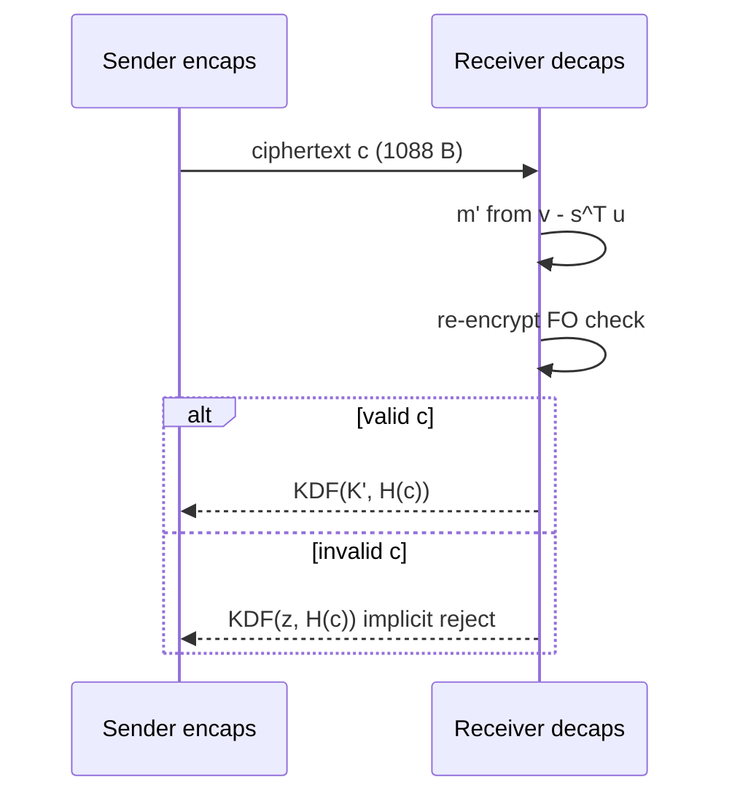
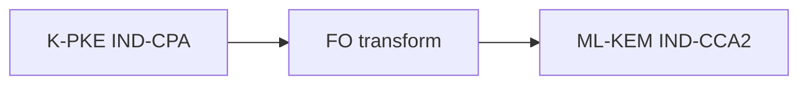

# Chapter 11: FIPS 203 — ML-KEM

We walk ML-KEM the way implementers need: **K-PKE, FO transform, implicit rejection**—with constant-time warnings baked in.

**Figure 11.1 — ML-KEM-768 object sizes (typical deployment)**

| Object | Bytes (ML-KEM-768) | Role |
|--------|-------------------:|------|
| Public key `ek` | 1,184 | Long-lived; in cert extensions / config |
| Secret key `dk` | 2,400 | HSM-protected; never logged |
| Ciphertext `c` | 1,088 | Per-handshake on the wire |
| Shared secret | 32 | Feeds HKDF → AES-GCM |



---

> **Author's note:** Implement ML-KEM from **FIPS 203 PDF + ACVP test vectors**, not from memory of the Kyber submission. Parameter sets (512/768/1024) are not interchangeable—your TLS profile must name the exact set.

## 11.1 Overview

ML-KEM (Module-Lattice-Based Key Encapsulation Mechanism), standardized as FIPS 203 in August 2024, is the primary post-quantum key encapsulation mechanism selected by NIST. It enables two parties to establish a shared 256-bit secret key over an insecure channel, providing security against both classical and quantum adversaries. This shared secret is then used with a symmetric cipher (such as AES-256) to encrypt subsequent communications.

A Key Encapsulation Mechanism differs from public-key encryption in a subtle but important way. Public-key encryption encrypts an arbitrary message chosen by the sender. A KEM instead generates a random shared secret internally and encapsulates it—the sender cannot choose the shared secret, only receive it. This restriction enables stronger and simpler security proofs, and is the natural primitive for key exchange protocols (TLS, SSH, IPsec) where the goal is establishing a random session key rather than transmitting a specific message.

ML-KEM is derived from the CRYSTALS-Kyber submission to the NIST PQC competition, with minor modifications for the final standard. Its security rests on the presumed computational hardness of the Module Learning With Errors (MLWE) problem—a structured variant of the Learning With Errors problem that is believed to resist both classical and quantum attacks. The scheme achieves IND-CCA2 security (indistinguishability under adaptive chosen-ciphertext attack), the strongest standard notion of security for key encapsulation, through application of a variant of the Fujisaki-Okamoto transform.

### Design Philosophy

ML-KEM embodies a design philosophy that prioritizes implementation simplicity and efficiency alongside strong security:

**Algebraic efficiency.** By working in the polynomial ring Z_q[X]/(X^256 + 1) with a carefully chosen modulus q = 3329, ML-KEM enables Number Theoretic Transform (NTT)-based polynomial multiplication that maps naturally to modern processor architectures.

**Simple noise distributions.** The Centered Binomial Distribution replaces Gaussian sampling, eliminating a major source of implementation complexity and side-channel vulnerability.

**Module structure.** Working with vectors of ring elements (module lattices) provides a tunable security-efficiency trade-off: increasing the module rank k provides more security without changing the underlying ring arithmetic.

**Implicit rejection.** Rather than signaling decapsulation failure explicitly, ML-KEM returns a pseudorandom value for invalid ciphertexts, preventing entire classes of oracle attacks.


**Figure 11.2 — FO transform wrapper**



## 11.2 Mathematical Foundation

### The Learning With Errors Problem

The Learning With Errors (LWE) problem, introduced by Oded Regev in 2005, is the foundational hardness assumption underlying ML-KEM. In its basic form, LWE asks: given a matrix **A** ∈ Z_q^(m×n), a secret vector **s** ∈ Z_q^n, and noisy products **b** = **A**·**s** + **e** (where **e** is a vector of small "error" terms), recover **s** or even distinguish **b** from a uniformly random vector.

Regev proved that solving LWE is at least as hard as solving several worst-case lattice problems (including the Shortest Vector Problem and the Closest Vector Problem) using quantum reductions. This means that any efficient algorithm for LWE would imply efficient quantum algorithms for problems that have resisted decades of cryptanalytic effort.

The difficulty of LWE—and thus the security of ML-KEM—depends on three parameters: the dimension n (size of the secret), the modulus q (the ring in which arithmetic is performed), and the error distribution (how much noise is added). Larger dimensions and smaller error-to-modulus ratios make the problem harder but increase computational and communication costs.

### Ring-LWE and Module-LWE

Plain LWE with an unstructured random matrix **A** ∈ Z_q^(m×n) produces excellent security but impractical key sizes (the matrix itself must be communicated or derived from a shared seed, and operations are O(n²)). Two structured variants address this:

**Ring-LWE** replaces the unstructured matrix with multiplication by a single element in a polynomial ring R_q = Z_q[X]/(f(X)). This reduces the public key from O(n²) elements to O(n) and speeds computation from O(n²) to O(n log n) via the NTT. However, the algebraic structure raises concerns about potential attacks exploiting ring properties.

**Module-LWE** provides a middle ground. Instead of a single ring element (Ring-LWE) or an unstructured matrix (plain LWE), Module-LWE works with a k×k matrix of ring elements—a "module" over the polynomial ring. The MLWE problem states: given random **A** ∈ R_q^(k×k) and **b** = **A**·**s** + **e** where **s**, **e** ∈ R_q^k have small coefficients, distinguish **b** from uniform.

Module-LWE inherits efficiency from the ring structure (NTT-based arithmetic within each ring element) while providing security margins from the module structure (each additional module rank adds security without fully committing to pure ring structure). For ML-KEM, the module rank k ∈ {2, 3, 4} provides three security levels.

The security relationship is: plain LWE ≥ Module-LWE ≥ Ring-LWE (where ≥ means "at least as hard"). Module-LWE with k ≥ 2 is believed to be essentially as hard as plain LWE of the same total dimension nk, because no attack is known that exploits the module structure beyond what already applies to the ring structure of individual components.

### The Polynomial Ring R_q

ML-KEM performs arithmetic in the polynomial ring:

```
R_q = Z_q[X]/(X^256 + 1)    where q = 3329
```

Elements of R_q are polynomials of degree at most 255 with coefficients in {0, 1, ..., 3328}. Addition is coefficient-wise modulo q. Multiplication is polynomial multiplication reduced modulo both q (for coefficients) and X^256 + 1 (for degree).

The polynomial X^256 + 1 is the 512th cyclotomic polynomial, chosen for several critical properties:

**Irreducibility over Q.** X^256 + 1 is irreducible over the rationals, making R_q a field when q is prime and X^256 + 1 is irreducible modulo q, or factoring into ideals of consistent degree otherwise.

**Negacyclic convolution.** Multiplication modulo X^256 + 1 corresponds to negacyclic convolution, which can be computed efficiently via a "negacyclic NTT"—a variant of the standard NTT adapted for the sign alternation.

**Power-of-two degree.** The degree 256 = 2^8 enables recursive FFT-style decomposition with log₂(256) = 8 levels of butterfly operations. Combined with the NTT-friendly modulus, this allows O(n log n) multiplication with small constants.

### Why q = 3329?

The choice of modulus q = 3329 is one of ML-KEM's most consequential design decisions, driven by multiple interlocking requirements:

**NTT compatibility: 3329 ≡ 1 (mod 256).** For the NTT to fully decompose the ring R_q into 256 independent components (enabling pointwise multiplication), we need a primitive 256th root of unity to exist modulo q. This requires q ≡ 1 (mod 256). Actually, since we need a negacyclic NTT (for the X^256 + 1 modulus), we need a primitive 512th root of unity, requiring q ≡ 1 (mod 512). The value 3329 satisfies 3329 = 13 × 256 + 1 = 6 × 512 + 513... let us verify: 3329 mod 512 = 3329 - 6×512 = 3329 - 3072 = 257. Actually, for ML-KEM's specific NTT approach, the requirement is q ≡ 1 (mod 2n) where n = 256, so q ≡ 1 (mod 512). We have 3329 mod 512 = 257, which means 3329 ≡ 1 (mod 256) but not mod 512. ML-KEM uses a 128-point NTT that decomposes each degree-255 polynomial into 128 degree-1 polynomials (linear factors), exploiting that X^256 + 1 = ∏(X² - ζ^(2i+1)) for appropriate roots ζ. The requirement 3329 ≡ 1 (mod 256) ensures the existence of a primitive 256th root of unity, which suffices for this decomposition.

**Primality.** Being prime simplifies modular arithmetic—every non-zero element has a multiplicative inverse, and the multiplicative group Z_q* is cyclic. This enables clean NTT formulations and avoids complications that composite moduli introduce.

**Bit efficiency.** 3329 fits in 12 bits (2^11 = 2048 < 3329 < 4096 = 2^12). This means each coefficient can be represented in 12 bits for storage and transmission. Products of two coefficients fit in 24 bits (3328² = 11,075,584 < 2^24 = 16,777,216), which means multiplication can use 32-bit integers without overflow—critical for efficient implementation on commodity processors.

**Noise tolerance.** For a given modulus q and error distribution, the gap between "signal" (the useful information) and "noise" (the errors) determines decryption correctness. The value 3329 is large enough relative to the chosen error parameters (CBD with η ≤ 3) that decryption failures are negligibly rare, while being small enough to keep ciphertext sizes compact.

**Compression compatibility.** ML-KEM compresses ciphertext components by rounding coefficients from Z_q to Z_{2^d} for various d values. The value 3329 interacts favorably with the compression parameters (d_u = 10 or 11, d_v = 4 or 5), keeping rounding errors small relative to the noise tolerance.

### The Number Theoretic Transform (NTT)

The NTT is the workhorse of ML-KEM's arithmetic, enabling polynomial multiplication in O(n log n) time rather than the naive O(n²). It is the finite-field analog of the Discrete Fourier Transform, replacing complex roots of unity with roots of unity in Z_q.

**Basic operation.** The NTT transforms a polynomial a(X) = a_0 + a_1·X + ... + a_{255}·X^255 from "coefficient representation" to "evaluation representation" at 256 specific points (powers of a root of unity ζ). In evaluation representation, multiplication of two polynomials becomes pointwise multiplication of their evaluations—O(n) operations instead of O(n²).

**ML-KEM's specific NTT.** ML-KEM uses a variant that exploits the factorization of X^256 + 1 modulo 3329. Since 3329 ≡ 1 (mod 256), there exists a primitive 256th root of unity ζ such that X^256 + 1 = ∏_{i=0}^{127} (X² - ζ^(2i+1)) modulo 3329. The NTT maps each polynomial to 128 degree-1 residues (pairs of values), after which multiplication becomes 128 pointwise multiplications of linear polynomials—each requiring 3 multiplications and 2 additions in Z_q.

**Butterfly operations.** The NTT computation proceeds through 7 layers (log₂(128) + adjustments) of "butterfly" operations, each combining pairs of coefficients using multiplication by powers of ζ ("twiddle factors"):

```
(a, b) → (a + ζ^k · b,  a - ζ^k · b)
```

These operations are highly parallelizable and map naturally to SIMD instructions (AVX2 processes 16 16-bit butterflies simultaneously).

**In-place computation.** Like the FFT, the NTT can be computed in-place, requiring no additional memory beyond the input array and a table of precomputed twiddle factors.

**Domain strategy.** ML-KEM stores the public matrix **Â** and secret vector **ŝ** permanently in NTT domain. This avoids redundant transformations: key generation computes **t̂** = **Â**·**ŝ** + **ê** directly in NTT domain; encapsulation multiplies by **Â** without ever computing inverse NTTs for the matrix. Only the final ciphertext construction and decryption steps require inverse NTTs.

## 11.3 Parameter Sets

ML-KEM defines three parameter sets targeting NIST security levels 1, 3, and 5:

| Parameter | ML-KEM-512 | ML-KEM-768 | ML-KEM-1024 |
|-----------|-----------|-----------|------------|
| NIST Security Level | 1 (≥ AES-128) | 3 (≥ AES-192) | 5 (≥ AES-256) |
| Module rank k | 2 | 3 | 4 |
| Polynomial degree n | 256 | 256 | 256 |
| Modulus q | 3329 | 3329 | 3329 |
| η₁ (secret/error noise) | 3 | 2 | 2 |
| η₂ (encryption noise) | 2 | 2 | 2 |
| d_u (u compression bits) | 10 | 10 | 11 |
| d_v (v compression bits) | 4 | 4 | 5 |
| Public key bytes | 800 | 1,184 | 1,568 |
| Secret key bytes | 1,632 | 2,400 | 3,168 |
| Ciphertext bytes | 768 | 1,088 | 1,568 |
| Shared secret bytes | 32 | 32 | 32 |
| Decryption failure prob. | 2^(-139) | 2^(-164) | 2^(-174) |

### Parameter Rationale

**Module rank k.** Increasing k from 2 to 3 to 4 increases the lattice dimension (from 512 to 768 to 1024), making lattice reduction attacks exponentially harder. Each increment roughly corresponds to one NIST security level jump. The ring dimension n = 256 remains fixed across all parameter sets—only the module rank varies.

**Noise parameters η₁, η₂.** These control the Centered Binomial Distribution width. ML-KEM-512 uses η₁ = 3 (coefficients in [-3, 3]) for secret and error vectors, while ML-KEM-768 and ML-KEM-1024 use η₁ = 2 (coefficients in [-2, 2]). Larger η provides slightly more security margin but requires a larger gap between signal and noise for correct decryption. The encryption noise η₂ = 2 is consistent across all parameter sets.

**Compression parameters d_u, d_v.** These control how aggressively ciphertext components are compressed. The first ciphertext component u (a vector of k polynomials) is compressed to d_u bits per coefficient, while the second component v (a single polynomial) is compressed to d_v bits. Higher compression (fewer bits) reduces ciphertext size but introduces more rounding noise, potentially causing decryption failures. ML-KEM-1024 uses d_u = 11 and d_v = 5 (versus 10 and 4 for smaller parameter sets) because its narrower noise tolerance at higher security levels requires preserving more precision.

**Key and ciphertext sizes.** Public key size is 32 + 12·k·256/8 = 32 + 384k bytes (32 bytes for the seed ρ, plus k polynomials encoded at 12 bits per coefficient). Ciphertext size is d_u·k·256/8 + d_v·256/8 bytes. The shared secret is always 256 bits (32 bytes), matching the output of standard KDFs.

### Security Level Guidance

**ML-KEM-512** targets NIST Level 1 (equivalent security to AES-128). Suitable for applications where data sensitivity is moderate and performance/bandwidth are highly constrained. Provides the smallest parameter sizes but with less margin against future cryptanalytic improvements.

**ML-KEM-768** targets NIST Level 3 (equivalent security to AES-192). This is the recommended default for most applications. It provides substantial security margin while maintaining practical parameter sizes. Most deployed hybrid schemes (TLS, Signal) use ML-KEM-768.

**ML-KEM-1024** targets NIST Level 5 (equivalent security to AES-256). Intended for the highest-security applications: classified government communications, long-term protection of state secrets, and scenarios where adversaries may have decades to attack stored ciphertexts with future technology.

> **Author's note:** Test **implicit rejection**—invalid ciphertexts must not leak via errors or timing.

## 11.4 Algorithm Description

### Key Generation (ML-KEM.KeyGen)

Key generation produces a public key (used by anyone to encapsulate shared secrets) and a secret key (used by the key owner to decapsulate). The process is straightforward matrix-vector arithmetic with small noise:

```
ML-KEM.KeyGen():
  1. d ←$ B^32                            // 32 random bytes (seed)
  2. (ρ, σ) ← G(d ‖ k)                   // Hash seed with domain separator
  3. N ← 0                                // Counter for noise sampling
  4. for i from 0 to k-1:                 // Generate public matrix row by row
  5.   for j from 0 to k-1:
  6.     Â[i][j] ← SampleNTT(XOF(ρ, j, i))  // Deterministic matrix from ρ
  7. for i from 0 to k-1:
  8.     s[i] ← SampleCBD_η₁(PRF(σ, N)); N++  // Secret vector (small coefficients)
  9. for i from 0 to k-1:
  10.    e[i] ← SampleCBD_η₁(PRF(σ, N)); N++  // Error vector (small coefficients)
  11. ŝ ← NTT(s)                           // Transform secret to NTT domain
  12. ê ← NTT(e)                           // Transform error to NTT domain
  13. t̂ ← Â ∘ ŝ + ê                       // Compute public vector (NTT domain)
  14. ek ← Encode₁₂(t̂) ‖ ρ                // Encapsulation key (public key)
  15. h ← H(ek)                            // Hash of public key
  16. z ←$ B^32                             // Implicit rejection secret
  17. dk ← Encode₁₂(ŝ) ‖ ek ‖ h ‖ z       // Decapsulation key (secret key)
  18. return (ek, dk)
```

**Step-by-step explanation:**

Steps 1-2 generate the randomness needed for key generation. A single 32-byte seed d is expanded using the hash function G (SHA3-512) into a public seed ρ (used to derive the public matrix) and a private seed σ (used to sample secret and error vectors). The domain separation by k ensures different parameter sets produce different keys from the same seed.

Steps 3-6 generate the public matrix **Â** deterministically from ρ using an extendable output function (XOF, specifically SHAKE-128). Each matrix entry is a polynomial sampled uniformly from R_q by rejecting values ≥ q from the XOF output stream. Since ρ is public and included in the public key, anyone can reconstruct **Â** without transmitting it—a critical efficiency optimization that keeps public keys compact.

Steps 7-10 sample the secret vector **s** and error vector **e** from the Centered Binomial Distribution CBD_η₁. Each polynomial coefficient is independently sampled with magnitude at most η₁. The PRF (SHAKE-256) is keyed by σ with a counter N, ensuring each polynomial gets independent randomness.

Steps 11-13 perform the core computation: transform **s** and **e** to NTT domain, then compute **t̂** = **Â** · **ŝ** + **ê**. This is the public LWE instance—**t̂** appears random to anyone who doesn't know **s**, but the key owner can use **s** to recover the error term from any linear combination involving **t̂**.

Steps 14-17 assemble the key pair. The encapsulation (public) key contains the NTT-domain public vector **t̂** and the matrix seed ρ. The decapsulation (secret) key contains the NTT-domain secret **ŝ**, a copy of the public key (needed for re-encryption during decapsulation), a hash of the public key h (used in encapsulation), and an implicit rejection secret z (used to produce pseudorandom output for invalid ciphertexts).

### Encapsulation (ML-KEM.Encaps)

Encapsulation takes a public key and produces a ciphertext plus shared secret. The shared secret is deterministically derived from internal randomness, enabling the re-encryption verification that provides CCA2 security:

```
ML-KEM.Encaps(ek):
  1. m ←$ B^32                              // Random message
  2. (K, r) ← G(m ‖ H(ek))                 // Derive shared secret and randomness
  3. Â ← RegenerateMatrix(ρ from ek)        // Reconstruct public matrix
  4. t̂ ← Decode₁₂(ek)                      // Extract public vector
  5. N ← 0
  6. for i from 0 to k-1:
  7.     y[i] ← SampleCBD_η₁(PRF(r, N)); N++  // Encryption randomness
  8. for i from 0 to k-1:
  9.     e₁[i] ← SampleCBD_η₂(PRF(r, N)); N++ // First error term
  10. e₂ ← SampleCBD_η₂(PRF(r, N))          // Second error term
  11. ŷ ← NTT(y)                             // Transform to NTT domain
  12. u ← NTT⁻¹(Âᵀ ∘ ŷ) + e₁              // First ciphertext component
  13. μ ← Decompress₁(Decode₁(m))           // Encode message as polynomial
  14. v ← NTT⁻¹(t̂ᵀ ∘ ŷ) + e₂ + μ          // Second ciphertext component
  15. c₁ ← Encode_{d_u}(Compress_{d_u}(u))   // Compress and serialize u
  16. c₂ ← Encode_{d_v}(Compress_{d_v}(v))   // Compress and serialize v
  17. c ← c₁ ‖ c₂                            // Complete ciphertext
  18. K̄ ← KDF(K ‖ H(c))                     // Final shared secret
  19. return (K̄, c)
```

**Core mechanics:**

The encapsulation performs an encryption of the random message m under the public key, producing a ciphertext (u, v) that can only be decrypted by the holder of the secret key **s**. The shared secret K̄ is derived from both the message m and the ciphertext c, binding the secret to the specific ciphertext.

The ciphertext components have the structure:
- u = **Aᵀ** · **y** + **e₁** (an LWE encryption of nothing, using randomness **y**)
- v = **t**ᵀ · **y** + e₂ + μ (the message μ masked by the LWE "inner product" of public key and randomness)

The holder of **s** can compute **s**ᵀ · **u** = **s**ᵀ · (**A**ᵀ · **y** + **e₁**) = (**A** · **s**)ᵀ · **y** + **s**ᵀ · **e₁** = **t**ᵀ · **y** - **e**ᵀ · **y** + **s**ᵀ · **e₁**. Subtracting this from v yields: μ + e₂ + **e**ᵀ · **y** - **s**ᵀ · **e₁**. Since all error terms are small, the accumulated noise is much smaller than q/2, and μ can be recovered by rounding.

**Why include H(ek) in step 2?** Binding the randomness derivation to the public key prevents multi-target attacks where an adversary uses a single ciphertext against multiple public keys. It also provides domain separation between different recipients.

### Decapsulation (ML-KEM.Decaps)

Decapsulation recovers the shared secret from a ciphertext using the secret key. The critical feature is the re-encryption check that provides CCA2 security:

```
ML-KEM.Decaps(dk, c):
  1. (ŝ, ek, h, z) ← ParseDecapsKey(dk)    // Extract secret key components
  2. (c₁, c₂) ← SplitCiphertext(c)         // Split ciphertext
  3. u ← Decompress_{d_u}(Decode_{d_u}(c₁)) // Decompress first component
  4. v ← Decompress_{d_v}(Decode_{d_v}(c₂)) // Decompress second component
  5. w ← v - NTT⁻¹(ŝᵀ ∘ NTT(u))          // Subtract secret contribution
  6. m' ← Encode₁(Compress₁(w))            // Recover message candidate
  7. (K', r') ← G(m' ‖ h)                  // Re-derive randomness
  8. Re-encrypt: compute c' using ek and r' // Full re-encryption
  9. if c = c':                              // Constant-time comparison
  10.    K̄ ← KDF(K' ‖ H(c))               // Valid: return real shared secret
  11. else:
  12.    K̄ ← KDF(z ‖ H(c))                // Invalid: return pseudorandom value
  13. return K̄
```

**The re-encryption paradigm:**

Steps 5-6 perform the "raw" LWE decryption: compute **s**ᵀ · **u** (recovering the LWE noise correlation), subtract it from v to isolate the message plus residual noise, then round to recover the message m'. If the ciphertext was honestly generated, m' = m with overwhelming probability.

Steps 7-8 verify the ciphertext's legitimacy by re-deriving the randomness r' from the recovered message m' and performing a complete re-encryption. If the re-encrypted ciphertext c' matches the received ciphertext c, then the ciphertext is valid and the derived shared secret K' is genuine.

Steps 9-12 implement the implicit rejection mechanism: invalid ciphertexts produce a pseudorandom value KDF(z ‖ H(c)) that is computationally indistinguishable from a genuine shared secret but is actually derived from the secret z (unknown to the adversary) and the ciphertext. This prevents any observable difference between valid and invalid decapsulations.

**Why re-encryption is necessary:** Without the re-encryption check, an adversary could submit malformed ciphertexts to a decapsulation oracle and learn information about the secret key from the responses. The re-encryption check makes ML-KEM a "check-then-use" construction: the shared secret is only released if the ciphertext is provably well-formed under the derived randomness.

## 11.5 Security Mechanisms

### IND-CCA2 Security via the Fujisaki-Okamoto Transform

ML-KEM's core public-key encryption scheme (called K-PKE in the specification) is only IND-CPA secure—secure against passive eavesdroppers but not against active adversaries who can query a decryption oracle. The Fujisaki-Okamoto (FO) transform elevates this to IND-CCA2 security through three mechanisms:

**Derandomization.** All encryption randomness is derived deterministically from the message m and public key hash H(ek). This means that for any given message, the ciphertext is unique—there is only one valid ciphertext that encapsulates a given message under a given public key. An adversary cannot produce alternative ciphertexts for the same message.

**Re-encryption verification.** During decapsulation, the scheme re-encrypts the recovered message and compares the result to the received ciphertext. Since encryption is deterministic (randomness derived from message), any valid ciphertext must match the re-encryption. Malformed ciphertexts—those not producible by honest encryption—will fail this check.

**Implicit rejection.** Failed verification does not produce an error signal but rather a pseudorandom value. This eliminates any information leakage about why a ciphertext was rejected, preventing adaptive adversaries from refining their attack based on rejection reasons.

The FO transform's security proof (in the Quantum Random Oracle Model, QROM) shows that any IND-CCA2 adversary against the KEM can be converted into an IND-CPA adversary against the underlying encryption scheme, with a polynomial security loss. The tightness of this reduction has been extensively studied, and for ML-KEM's parameters, the security loss is modest.

### Implicit Rejection in Detail

Classical public-key encryption schemes (RSA-OAEP, ECIES) typically return an explicit error (⊥) when decryption fails. This creates a "validity oracle" that adversaries can exploit:

**Bleichenbacher-style attacks.** By observing whether decryption succeeds or fails for carefully crafted ciphertexts, an adversary can progressively recover the plaintext. Such attacks have been devastating in practice against RSA-PKCS#1v1.5 and variants.

**Timing differences.** Even if the error is not explicitly returned, different code paths for valid versus invalid decryption often execute in different times, creating a timing side-channel that functions as a validity oracle.

ML-KEM eliminates both attack vectors:

```
K̄ = c == c' ? KDF(K' ‖ H(c)) : KDF(z ‖ H(c))
```

The value z is a 32-byte secret stored in the decapsulation key, known only to the key owner. For any invalid ciphertext c, the output KDF(z ‖ H(c)) is a deterministic function of z and c—the same invalid ciphertext always produces the same "rejection" key. But without knowledge of z, this output is indistinguishable from the genuine shared secret KDF(K' ‖ H(c)).

The comparison `c == c'` must be implemented in constant time (fixed-time byte comparison regardless of where mismatches occur), and the selection between the two K̄ values must use constant-time conditional selection (cmov-style operations).

### Ciphertext Compression

ML-KEM reduces ciphertext size by lossy compression—rounding coefficients to fewer bits:

**Compress_d(x):** Maps x ∈ {0, ..., q-1} to ⌈(2^d / q) · x⌋ mod 2^d. This represents x using d bits instead of ⌈log₂(q)⌉ = 12 bits, discarding fine-grained information.

**Decompress_d(y):** Maps y ∈ {0, ..., 2^d - 1} back to ⌈(q / 2^d) · y⌋. This recovers an approximation of the original value, with a rounding error bounded by q/(2^(d+1)).

For ML-KEM-768: the u vector (3 polynomials × 256 coefficients × 10 bits) contributes 3 × 256 × 10 / 8 = 960 bytes, and the v polynomial (256 coefficients × 4 bits) contributes 256 × 4 / 8 = 128 bytes, totaling 1,088 bytes of ciphertext.

The compression introduces rounding errors that add to the noise budget. ML-KEM's parameters are chosen so that the total noise (sampling noise from secret/error + rounding noise from compression) remains well below the decoding threshold, keeping the decryption failure probability negligible (< 2^(-139) for all parameter sets).

### Decryption Failure Analysis

A decryption failure occurs when the accumulated noise during decryption exceeds the tolerance threshold, causing a message bit to be incorrectly decoded. For ML-KEM, the noise sources are:

1. **Secret and error sampling noise:** The small coefficients of **s**, **e**, and the encryption vectors **y**, **e₁**, **e₂**
2. **Cross-term noise:** The inner products **e**ᵀ · **y** and **s**ᵀ · **e₁** that don't perfectly cancel during decryption
3. **Compression rounding noise:** The errors introduced by compressing and decompressing ciphertext coefficients

The parameter selection ensures that the probability of any coefficient's total noise exceeding q/4 (the decoding boundary for 1-bit messages) is negligible. For ML-KEM-768, this probability is bounded by 2^(-164), meaning that even with 2^100 decapsulations (far beyond any practical scenario), the expected number of failures is essentially zero.

This negligible failure probability is important not just for correctness but for security: if failures were common enough to observe, an adversary could use failure-boosting techniques (submitting carefully chosen ciphertexts that maximize failure probability) to extract information about the secret key.

## 11.6 Noise Distributions

### The Centered Binomial Distribution (CBD)

ML-KEM samples all secret and error coefficients from the Centered Binomial Distribution CBD_η, defined as:

```
SampleCBD_η():
  Sample 2η uniform random bits: (a₁, a₂, ..., aη, b₁, b₂, ..., bη)
  Return (a₁ + a₂ + ... + aη) - (b₁ + b₂ + ... + bη)
```

The output is an integer in the range [-η, η] with the following probability distribution:

For CBD_2 (η = 2), the probabilities are:
- P(x = 0) = 6/16 = 3/8
- P(x = ±1) = 4/16 = 1/4
- P(x = ±2) = 1/16

For CBD_3 (η = 3), the probabilities are:
- P(x = 0) = 20/64 = 5/16
- P(x = ±1) = 15/64
- P(x = ±2) = 6/64 = 3/32
- P(x = ±3) = 1/64

The variance of CBD_η is η/2, making it a reasonable approximation to a discrete Gaussian with the same variance. For ML-KEM-768 with η₁ = 2, each secret coefficient has variance 1.

### Properties Critical for Implementation

**Trivial constant-time sampling.** The CBD requires only: (1) generating random bits, (2) counting set bits in fixed-width groups (population count), and (3) subtraction. All operations are naturally constant-time on any processor. No rejection sampling, no division, no comparison with secret-dependent bounds. This eliminates timing side-channels from the noise sampling process entirely.

**Uniform byte consumption.** Each coefficient consumes exactly 2η bits of randomness, regardless of the output value. There is no rejection (every random input produces a valid output), so the random number generator's consumption pattern reveals nothing about the sampled values.

**Simple verification.** An auditor can verify CBD sampling correctness by inspection—the algorithm is only a few lines of bit manipulation. Compare this to discrete Gaussian sampling, which requires careful implementation of cumulative distribution tables or rejection sampling with subtle precision requirements.

### Why Not Discrete Gaussian?

The theoretically optimal noise distribution for LWE-based cryptography is the discrete Gaussian: its smoothing properties provide the tightest security reductions, and its "subgaussian" tail behavior enables the most aggressive parameter choices. However, practical considerations overwhelmingly favor the CBD:

**Timing side-channels.** Discrete Gaussian sampling via rejection sampling (sample a candidate, accept with probability proportional to the Gaussian weight) inherently varies in time—some candidates are accepted immediately, others require many rejections. Constant-time implementations either waste time (always computing the maximum possible rejections) or use complex table-based approaches that are vulnerable to cache-timing attacks.

**Precision requirements.** Discrete Gaussian sampling requires evaluating exp(-x²/(2σ²)) to high precision. Insufficient precision creates a bias that can be exploited to distinguish the actual distribution from a true Gaussian, potentially breaking security proofs. The required precision depends on parameters and security level, adding another axis of potential implementation error.

**Implementation complexity.** Correct constant-time Gaussian sampling requires either large precomputed tables (consuming valuable memory on constrained devices) or complex arithmetic procedures (introducing many potential bug locations). FALCON's experience demonstrates the difficulty: its Gaussian sampler is the single most complex and side-channel-sensitive component.

**Sufficient security.** For ML-KEM's specific parameters, the security difference between CBD and discrete Gaussian is negligible. The parameter selection accounts for the CBD's slightly heavier tails (compared to a Gaussian of the same variance), and the resulting security levels comfortably exceed their targets regardless of which distribution is used.

**Provable security.** While early LWE security proofs required Gaussian errors, modern analyses (particularly those by Peikert and others) establish hardness for any error distribution with sufficient min-entropy and appropriate parameters. The CBD satisfies these requirements.

## 11.7 Implementation Guidance

### Constant-Time Requirements

ML-KEM implementations MUST execute in constant time to prevent timing side-channel attacks. Specifically:

**No secret-dependent branches.** The program's control flow must not depend on secret data. The most critical instance is the ciphertext comparison in decapsulation (`c == c'`): the comparison must examine all bytes regardless of where differences occur (unlike `memcmp` which may short-circuit on first difference).

**No secret-dependent memory access patterns.** Array indices must not depend on secret data, preventing cache-timing attacks where an adversary observes which cache lines are accessed. ML-KEM's NTT uses fixed access patterns (the butterfly indices depend only on the transform layer, not on coefficient values), naturally satisfying this requirement.

**Constant-time conditional selection.** The choice between KDF(K' ‖ H(c)) and KDF(z ‖ H(c)) in decapsulation must use arithmetic selection (cmov) rather than branching:

```
// Constant-time select: mask is all-ones if equal, all-zeros if not
mask = constant_time_eq(c, c_prime);
for i in 0..31:
    K_bar[i] = (K_real[i] & mask) | (K_fake[i] & ~mask);
```

**NTT butterfly operations.** Each butterfly involves a multiplication by a twiddle factor, modular reduction, addition, and subtraction. All operations must use constant-time modular arithmetic—rejecting implementations that use variable-time division or branch on coefficient signs.

**Modular reduction.** Barrett reduction or Montgomery reduction should be used for modular arithmetic, both of which execute in constant time. Naive modular reduction using the division instruction may have data-dependent timing on some processors.

### Random Number Generation

ML-KEM's security depends critically on the quality of randomness used in key generation and encapsulation:

**Entropy requirements.** Key generation requires 32 bytes (256 bits) of entropy for the seed d, plus 32 bytes for the implicit rejection value z. Encapsulation requires 32 bytes for the message m. All randomness must be sampled from a cryptographically secure pseudorandom number generator (CSPRNG) seeded from a hardware entropy source.

**Approved DRBGs.** FIPS 203 mandates the use of NIST-approved Deterministic Random Bit Generators: CTR_DRBG (AES-256 in counter mode), HMAC_DRBG (HMAC-based), or Hash_DRBG (hash-based). These must be seeded with at least 256 bits of entropy from a hardware noise source (TRNG).

**Seed handling.** The seed d in key generation is security-critical: if an adversary can predict or influence d, they can recover the secret key. Seeds must be generated fresh (not reused), transmitted securely to the DRBG, and erased after use. Implementations should use memory barriers or volatile writes to prevent compiler optimization from eliminating seed erasure.

**Platform considerations.** On Linux, /dev/urandom or getrandom() provide suitable entropy. On Windows, BCryptGenRandom(). On embedded systems without hardware TRNGs, careful entropy accumulation from multiple independent noise sources (ring oscillator jitter, ADC noise, timing jitter) is necessary, with health testing to detect entropy source failures.

### Key Validation

Public key validation prevents attacks using malformed keys:

**Encoding validation.** Verify that the encoded public key has the correct length (800, 1184, or 1568 bytes depending on parameter set). Reject keys that are too short, too long, or not a multiple of the expected encoding unit.

**Coefficient range checking.** After decoding, verify that all polynomial coefficients are in the valid range [0, q-1] = [0, 3328]. The 12-bit encoding can represent values up to 4095, so values in [3329, 4095] indicate a malformed key. This check must be performed (and can be done in constant time by checking if any coefficient exceeds 3328 using subtraction and sign detection).

**Semantic validation.** While not strictly required for security (the FO transform handles malformed ciphertexts gracefully), validating that the public key is well-formed prevents undefined behavior in implementations and provides defense-in-depth.

### Serialization and Byte Encoding

ML-KEM uses specific encoding formats defined in FIPS 203:

**Polynomial encoding (Encode_d).** Each polynomial coefficient is represented in d bits, and coefficients are packed sequentially into bytes in little-endian bit order. For the NTT-domain encoding (d = 12), each pair of coefficients occupies 3 bytes:

```
byte[0] = coeff[0] & 0xFF
byte[1] = (coeff[0] >> 8) | ((coeff[1] & 0x0F) << 4)
byte[2] = coeff[1] >> 4
```

**Public key format.** The encapsulation key ek is the concatenation of Encode₁₂(t̂) (the encoded public vector in NTT domain) and ρ (32 bytes of matrix seed). Total size: 12·k·256/8 + 32 bytes.

**Ciphertext format.** The ciphertext c is the concatenation of Encode_{d_u}(Compress_{d_u}(u)) and Encode_{d_v}(Compress_{d_v}(v)). Total size: d_u·k·256/8 + d_v·256/8 bytes.

**Secret key format.** The decapsulation key dk concatenates: Encode₁₂(ŝ) (secret vector), ek (full public key), H(ek) (32-byte hash), and z (32-byte implicit rejection secret). This "wide" secret key format supports efficient decapsulation without recomputing the public key or its hash.

### Side-Channel Protections Beyond Timing

**Power analysis countermeasures.** For hardware implementations (smart cards, HSMs), additional protections against differential power analysis (DPA) and correlation power analysis (CPA) may be necessary. Masking techniques—splitting secret values into random shares that are processed independently and recombined only at the final step—are the standard countermeasure. ML-KEM's linear operations (NTT, polynomial addition) are straightforward to mask; the compression and comparison operations require more careful treatment.

**Electromagnetic emanation.** Similar to power analysis but using EM probes to capture signals from specific circuit regions. Countermeasures include masking, shuffling operation order, and physical shielding.

**Fault injection.** An adversary who can induce computational faults (glitching the power supply, laser injection) might bypass the re-encryption check in decapsulation or corrupt intermediate values to leak secret information. Countermeasures include redundant computation (compute critical operations twice and compare), integrity checks on intermediate values, and hardware fault detection mechanisms.

## 11.8 Performance Characteristics

### Computational Performance

ML-KEM achieves excellent performance on modern processors, competitive with classical key exchange mechanisms:

| Operation | ML-KEM-512 | ML-KEM-768 | ML-KEM-1024 |
|-----------|-----------|-----------|------------|
| KeyGen (x86-64 AVX2) | ~30 μs | ~50 μs | ~75 μs |
| Encaps (x86-64 AVX2) | ~40 μs | ~65 μs | ~95 μs |
| Decaps (x86-64 AVX2) | ~40 μs | ~70 μs | ~100 μs |
| KeyGen (ARM Cortex-A72) | ~80 μs | ~120 μs | ~180 μs |
| Encaps (ARM Cortex-A72) | ~95 μs | ~145 μs | ~215 μs |
| Decaps (ARM Cortex-A72) | ~100 μs | ~155 μs | ~230 μs |
| KeyGen (ARM Cortex-M4) | ~600 μs | ~1,000 μs | ~1,500 μs |
| Encaps (ARM Cortex-M4) | ~750 μs | ~1,200 μs | ~1,800 μs |
| Decaps (ARM Cortex-M4) | ~800 μs | ~1,300 μs | ~1,950 μs |

*Times are approximate and vary with specific implementations, compiler optimizations, and processor generations.*

**Performance breakdown.** The computational cost is dominated by NTT operations (approximately 60-70% of total time), with the remainder split between hashing (SHAKE-128/256 for matrix generation and PRF evaluation), CBD sampling, and encoding/decoding. The NTT's dominance means that implementations optimized for NTT performance (using AVX2 vectorization, NEON instructions, or dedicated hardware) achieve the best overall results.

**Stack usage.** On constrained platforms, stack memory is often the binding constraint. ML-KEM-768 requires approximately 2.5 KB of stack space for key generation and encapsulation, and approximately 3.5 KB for decapsulation (which must hold both the secret key and the re-encryption workspace). These requirements are feasible for most microcontrollers but may require careful stack management on the most constrained devices.

### Comparison with Classical Key Exchange

| Metric | ML-KEM-768 | X25519 (ECDH) | RSA-2048 | RSA-4096 |
|--------|-----------|--------------|----------|----------|
| Public key size | 1,184 B | 32 B | 256 B | 512 B |
| Ciphertext/response | 1,088 B | 32 B | 256 B | 512 B |
| Total wire bytes | 2,272 B | 64 B | 512 B | 1,024 B |
| KeyGen time | ~50 μs | ~40 μs | ~60 ms | ~500 ms |
| Encaps/DH time | ~65 μs | ~50 μs | ~40 μs | ~40 μs |
| Decaps/DH time | ~70 μs | ~50 μs | ~1 ms | ~8 ms |
| Security (classical) | ~2^200 | ~2^128 | ~2^112 | ~2^140 |
| Security (quantum) | ~2^175 | ~2^64 | ~2^56 | ~2^70 |

**Key observations:**

ML-KEM is computationally competitive with classical key exchange—encapsulation and decapsulation are only slightly slower than X25519's scalar multiplication. The performance penalty of post-quantum protection is minimal in computation.

The significant overhead is bandwidth: ML-KEM-768 requires 2,272 bytes of wire traffic versus X25519's 64 bytes—a 35× increase. For high-bandwidth connections (modern broadband, data center interconnects), this is negligible. For constrained links (satellite, IoT, congested mobile networks), it may be significant.

Compared to RSA, ML-KEM is dramatically faster while using moderately more bandwidth. This makes ML-KEM a clear upgrade path for systems still using RSA key exchange.

### Hardware Acceleration

ML-KEM's computational primitives are well-suited to hardware acceleration:

**SIMD/vector instructions.** The NTT's butterfly operations are independent across coefficient pairs, mapping naturally to SIMD parallelism. Intel AVX2 (256-bit vectors of 16-bit elements) processes 16 butterfly operations simultaneously. AVX-512 doubles this. ARM NEON provides similar benefits on mobile/embedded ARM processors.

**SHA-3/SHAKE hardware.** Platforms with SHA-3 hardware acceleration (increasingly common in server and mobile processors) benefit significantly, as ML-KEM uses SHAKE-128 and SHAKE-256 extensively for matrix generation, PRF evaluation, and hashing. Hardware SHA-3 can be 10-50× faster than software implementations.

**Dedicated PQC accelerators.** FPGA and ASIC implementations of ML-KEM's NTT achieve throughput of millions of operations per second, relevant for high-volume servers and hardware security modules. The regular structure of the NTT maps efficiently to hardware datapaths.

## 11.9 Known Attacks and Security Margin

### The Lattice Reduction Framework

All known attacks against ML-KEM follow a common framework: reduce the problem to finding short vectors in a lattice, then apply lattice reduction algorithms (BKZ with sieving subroutines) to find those vectors. The cost depends on the required block size β for the BKZ algorithm, which in turn depends on the lattice dimension and the target vector length.

**BKZ (Block Korkin-Zolotarev) algorithm.** BKZ processes a lattice basis in blocks of size β, calling an SVP (Shortest Vector Problem) oracle on each block. The SVP oracle is the computational bottleneck, with the best known algorithms (lattice sieving) requiring time approximately 2^(0.292β) classically or 2^(0.265β) quantum (using Grover's algorithm to speed the sieving search).

**The Core-SVP methodology.** ML-KEM's security estimates use the "Core-SVP" methodology: estimate the BKZ block size β needed to solve the MLWE instance, then estimate the cost of the SVP oracle at that block size. The total attack cost is approximately 2^(0.292β) classical operations or 2^(0.265β) quantum operations (with significant memory requirements in both cases).

### Primal Attack

The primal attack constructs a lattice from the MLWE instance and searches for the secret as a short vector:

**Construction.** Given the public matrix **A** ∈ R_q^(k×k) and public vector **t** = **A**·**s** + **e**, construct a lattice whose short vectors correspond to (**s**, **e**). This is done by embedding the MLWE instance into a BDD (Bounded Distance Decoding) or uSVP (unique Shortest Vector Problem) lattice instance.

**For ML-KEM-768:** The resulting lattice has dimension approximately 768 + 768 = 1536 (over Z, accounting for the polynomial ring structure). The target vector (**s**, **e**) has norm approximately √(k·n·η₁²/2) ≈ √(3·256·1) ≈ 27.7. The BKZ block size required to find such a vector in a lattice of this dimension is estimated at β ≈ 650-700, giving a classical attack cost of approximately 2^(0.292·670) ≈ 2^196 and a quantum cost of approximately 2^(0.265·670) ≈ 2^178.

**Current estimates for all parameter sets:**

| Parameter Set | Lattice Dimension | Required β | Classical Cost | Quantum Cost |
|--------------|------------------|-----------|---------------|-------------|
| ML-KEM-512 | ~1024 | ~430 | ~2^126 | ~2^114 |
| ML-KEM-768 | ~1536 | ~670 | ~2^196 | ~2^178 |
| ML-KEM-1024 | ~2048 | ~910 | ~2^266 | ~2^241 |

### Dual Attack

The dual attack takes a different approach: rather than finding the secret directly, find a short vector in the dual lattice that serves as a "distinguisher" between MLWE samples and uniform random vectors.

**Mechanism.** A short vector **w** in the dual lattice satisfies **w**ᵀ · **A** ≈ **0** (mod q). For a genuine MLWE sample (**A**, **b** = **A**·**s** + **e**), the inner product **w**ᵀ · **b** = **w**ᵀ · **e** will be small (since both **w** and **e** are short). For a uniform random **b**, the inner product **w**ᵀ · **b** will be uniformly distributed. This creates a statistical distinguisher.

**Effectiveness.** For ML-KEM's parameters, the dual attack is generally slightly less effective than the primal attack—requiring a marginally larger block size for the same distinguishing advantage. However, the dual attack has different time-memory trade-offs that could be relevant for specific adversarial scenarios.

**Recent refinements.** In 2022-2023, several papers proposed potential improvements to the dual attack by combining it with lattice sieving techniques ("dual hybrid" attacks) or by exploiting multiple MLWE samples simultaneously. After community analysis, the consensus is that these improvements do not meaningfully reduce security below claimed levels for ML-KEM's chosen parameters, though they narrowed security margins slightly for ML-KEM-512.

### Algebraic and Structural Attacks

These attacks attempt to exploit the specific algebraic structure of the polynomial ring R_q and/or the module structure:

**Ring structure exploitation.** The polynomial ring Z_q[X]/(X^256 + 1) has algebraic structure that plain LWE over Z_q does not. Potential attacks could exploit the factorization of X^256 + 1 modulo q, automorphisms of the ring, or ideal structure. Despite extensive study, no practical attack exploiting these structures is known for ML-KEM's parameters. The use of module rank k ≥ 2 provides additional protection—even if the ring structure could be exploited, the attacker must solve a k-dimensional problem over the ring.

**Algebraic attacks on the noise.** Since ML-KEM's noise (CBD_η with small η) takes values in a very restricted range, algebraic attacks that exploit the "sparse" structure of the secret might be possible. The "Arora-Ge" framework shows that for very small noise (η = 1 with polynomial modulus), the MLWE problem can be solved in subexponential time by linearization. However, for ML-KEM's parameters (η ≥ 2 with q = 3329), the linearization produces systems too large to solve with known techniques.

**Hybrid attacks.** These combine lattice reduction with exhaustive/meet-in-the-middle search over portions of the secret. For ML-KEM's parameters, hybrid techniques provide modest constant-factor improvements over pure lattice reduction but do not change the exponential scaling.

### Security Margin Assessment

The cryptographic community's current consensus on ML-KEM security:

**ML-KEM-512:** Meets NIST Level 1 (equivalent to breaking AES-128) with moderate margin. Some researchers argue the margin is thinner than ideal, particularly given ongoing improvements to sieving algorithms and the dual attack. For long-term security or high-value targets, ML-KEM-768 is preferred.

**ML-KEM-768:** Comfortably exceeds NIST Level 3 requirements with substantial margin. Even aggressive estimates of near-future cryptanalytic improvements leave significant security buffer. This is the recommended parameter set for most applications and is considered safe against foreseeable advances in both classical and quantum computation.

**ML-KEM-1024:** Far exceeds NIST Level 5 requirements. Provides extreme security margin suitable for the most sensitive applications with multi-decade confidentiality requirements. The performance cost over ML-KEM-768 is modest (roughly 50% slower, 45% larger keys/ciphertexts).

### The Quantum Speedup Question

A common concern is whether quantum computers might speed lattice reduction beyond the Grover quadratic speedup applied to sieving subroutines. Several observations are relevant:

**Grover on sieving.** The best known quantum speedup for lattice sieving replaces the classical 2^(0.292β) cost with approximately 2^(0.265β)—a meaningful but not dramatic improvement. This assumes a quantum computer with sufficient qubits to run Grover's algorithm on the sieving search space.

**Memory-intensive algorithms.** Lattice sieving requires exponential memory (storing exponentially many lattice vectors). Quantum speedups that replace memory with quantum superposition face challenges: the sieved vectors must be accessed classically for the overall algorithm to proceed, limiting the advantage of quantum parallelism.

**No quantum BKZ.** No fully quantum version of the BKZ algorithm is known. Current quantum advantages are limited to speedups within classical algorithmic frameworks, not fundamentally different algorithmic approaches.

**Conservative conclusion.** ML-KEM's security margins account for a quantum speedup factor in the sieving exponent. Unless a fundamentally new quantum algorithm for lattice problems is discovered (analogous to Shor's algorithm for factoring), ML-KEM's parameters provide adequate quantum resistance.

## 11.10 Deployment Considerations

### Protocol Integration

ML-KEM is designed as a drop-in replacement for classical key exchange in existing protocols, though the larger message sizes require some protocol adaptation:

**TLS 1.3.** The primary deployment target. ML-KEM key shares are transmitted in the ClientHello and ServerHello messages. The larger key share size (1,184 bytes for ML-KEM-768 versus 32 bytes for X25519) means the ClientHello may exceed a single TLS record or TCP packet, potentially triggering an additional round-trip on some network paths. Hybrid key exchange (ML-KEM-768 + X25519) is specified in IETF drafts, with the combined key share occupying approximately 1,216 bytes.

**IKEv2/IPsec.** Post-quantum key exchange in IKE requires transmitting ML-KEM public keys in the Key Exchange payload. The larger sizes fit within IKE's UDP fragmentation framework but may require adjusting fragment sizes. IKEv2 supports multiple key exchange rounds, enabling hybrid approaches where classical DH and ML-KEM are combined across separate exchanges.

**SSH.** Post-quantum key exchange for SSH follows a similar pattern to TLS: the larger key exchange messages fit within SSH's packet framing, with modest increases in connection establishment time. Implementations are available in OpenSSH 9.x and later.

**Signal Protocol (PQXDH).** Signal's post-quantum extended Diffie-Hellman protocol uses ML-KEM-1024 (the highest security level) for its "last resort" prekeys. Since Signal prekeys are uploaded to servers and stored, the larger size impacts storage but not real-time communication latency.

**Certificate transparency and PKI.** ML-KEM public keys in X.509 certificates increase certificate size, affecting certificate transparency logs, OCSP responses, and certificate chain transmission in TLS. Strategies to mitigate this include certificate compression, intermediate CA caching, and deferred certificate verification.

### Hybrid Mode Operation

During the transition to post-quantum cryptography, the recommended deployment model is hybrid key exchange—combining ML-KEM with a classical algorithm so that security is maintained if either algorithm remains unbroken:

```
Combined_Secret = KDF(ML-KEM_Secret ‖ X25519_Secret ‖ context)
```

**Security guarantee.** A hybrid scheme is secure as long as at least one component algorithm is secure. If ML-KEM has an undiscovered vulnerability, X25519 still provides classical security. If quantum computers break X25519, ML-KEM provides quantum resistance. Only if both fail simultaneously is security compromised.

**Concatenation vs. other combiners.** The simplest combiner is concatenation followed by a KDF (key derivation function). More complex combiners (XOR, dual-PRF) have been proposed but offer minimal practical advantage while adding complexity. NIST, IETF, and most implementations use concatenation with KDF.

**Performance impact.** Hybrid adds the computational cost of both algorithms (ML-KEM encapsulation + X25519 scalar multiplication) and the communication cost of both key shares (1,184 + 32 = 1,216 bytes for public keys, 1,088 + 32 = 1,120 bytes for ciphertexts). The computational overhead is modest (approximately 150 μs total versus 100 μs for ML-KEM alone or 50 μs for X25519 alone). The bandwidth overhead is dominated by ML-KEM regardless.

**Transition timeline.** Organizations should deploy hybrid mode immediately and maintain it until the cryptographic community reaches consensus that ML-KEM alone provides sufficient confidence—likely 5-10 years after standardization, depending on the pace of cryptanalytic progress and quantum computing development.

### Key Reuse and Ephemeral vs. Static Keys

ML-KEM's IND-CCA2 security guarantee explicitly supports multiple encapsulations to the same public key. This is critical for several deployment patterns:

**Ephemeral keys in TLS.** In TLS 1.3, each connection uses a fresh key pair. The server generates a new ML-KEM key pair for each handshake, and the client encapsulates to that ephemeral key. Key reuse is minimal (the key exists only for the duration of the handshake).

**Semi-static keys in Signal.** Signal's PQXDH protocol uses "prekeys" that persist on the server until used. Multiple contacts may encapsulate to the same prekey before it is rotated. IND-CCA2 security ensures this is safe—each encapsulation produces an independent shared secret even with the same public key.

**Static keys for server certificates.** Some deployment models use longer-lived ML-KEM keys (analogous to RSA key transport). While technically safe under IND-CCA2, best practice recommends periodic key rotation to limit the impact of potential key compromise.

**Forward secrecy.** Ephemeral key usage provides forward secrecy: compromise of a long-term key does not compromise past session keys. ML-KEM is well-suited to ephemeral use due to its fast key generation (approximately 50 μs for ML-KEM-768), making per-session key generation practical even for high-throughput servers.

### Migration Strategy

Organizations deploying ML-KEM should consider:

**Inventory and prioritize.** Identify systems processing data with long confidentiality requirements (health records, financial data, government secrets, personal communications) for early migration. "Harvest now, decrypt later" attacks make these systems urgent even though quantum computers cannot yet break current encryption.

**Test bandwidth impact.** The 35× increase in key exchange bytes (compared to X25519) may trigger issues in systems with tight MTU constraints, packet size limits, or bandwidth budgets. Test with realistic network conditions including congestion, packet loss, and high-latency links.

**Update cryptographic libraries.** Ensure that deployed cryptographic libraries support ML-KEM with constant-time implementations. Major libraries (OpenSSL 3.x, BoringSSL, liboqs, PQClean, wolfSSL) provide validated ML-KEM implementations.

**Plan for algorithm agility.** Design systems so that the KEM algorithm can be changed without major refactoring. This protects against both advances in cryptanalysis (requiring parameter or algorithm changes) and future standardization of additional algorithms (HQC, potential improvements).

**Compliance considerations.** For organizations subject to FIPS requirements, ML-KEM implementations must be validated through the CMVP (Cryptographic Module Validation Program). This process adds time beyond initial deployment; plan accordingly.---

## Chapter Summary

**Technical takeaway:** ML-KEM is IND-CCA2 via FO transform with implicit rejection—test invalid ciphertext paths.

**Deployment takeaway:** Use ACVP/KAT vectors; document whether you expose decapsulation oracles in your API.

*Figures in this chapter are planning aids—verify all algorithm names and byte sizes against the current NIST FIPS PDF before implementation.*

---
