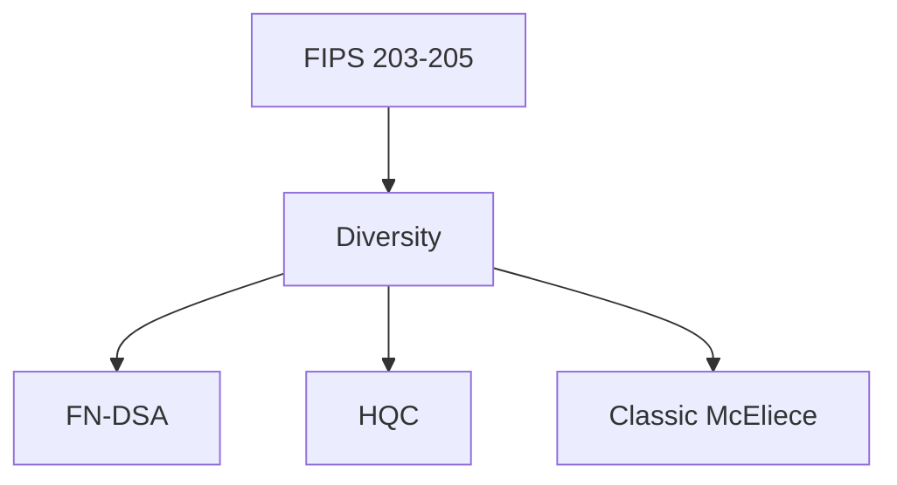
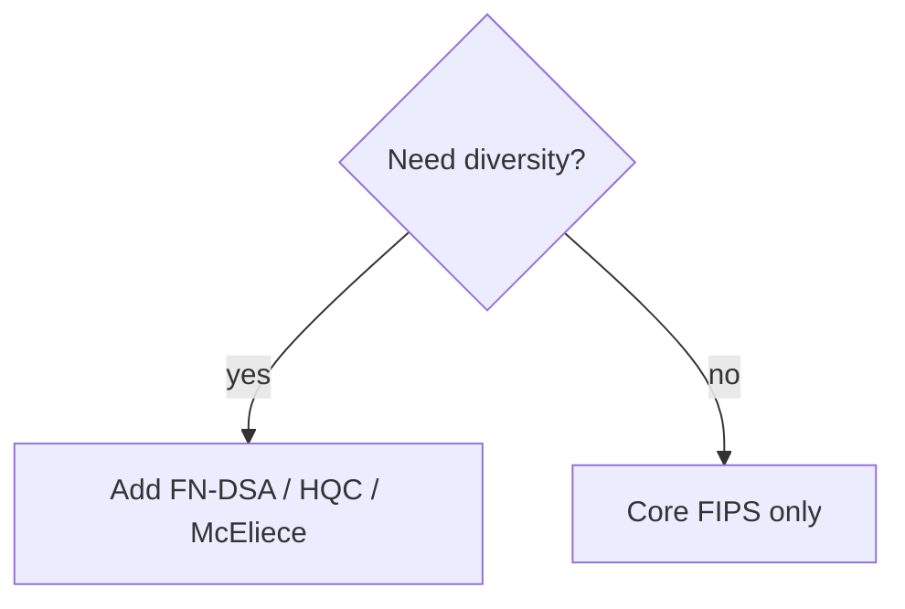

# Chapter 14: Additional Candidates and Round 4 Algorithms

Standards are not finished—**diversity algorithms** matter for insurance, not for day-one TLS.

## 14.1 Beyond the Primary Standards

While FIPS 203, 204, and 205 provide the foundation for post-quantum cryptography—covering key encapsulation (ML-KEM), general-purpose digital signatures (ML-DSA), and hash-based signatures (SLH-DSA)—they do not represent the full scope of NIST's post-quantum standardization effort. The three primary standards were selected to provide immediate, deployable protection against quantum threats using algorithms that balance security, performance, and implementation simplicity. However, the NIST PQC process has always recognized that no single algorithm family provides optimal solutions for every use case, and that algorithmic diversity is essential for long-term cryptographic resilience.

Several factors motivate the continued evaluation and standardization of additional algorithms beyond the primary three. First, the lattice-based assumptions underlying both ML-KEM and ML-DSA, while well-studied, represent a single mathematical family. A breakthrough in lattice cryptanalysis—however unlikely—would simultaneously compromise two of the three primary standards. Diversifying the mathematical foundations of standardized algorithms provides insurance against such a catastrophic scenario. Second, specific deployment contexts have requirements that the primary standards do not optimally serve: signature-size-constrained environments benefit from FN-DSA's compact signatures, ultra-high-security archival scenarios benefit from Classic McEliece's conservative design, and bandwidth-constrained code-based alternatives provide options if lattice assumptions weaken. Third, the signature landscape in particular remains actively evolving, with promising candidates from multivariate, isogeny-based, and code-based paradigms offering dramatically different trade-off profiles.

We survey the algorithms beyond the primary standards: those selected for standardization but not yet finalized (FN-DSA), those providing diversity for key encapsulation (Classic McEliece, HQC, BIKE), the additional signature candidates under evaluation in NIST's separate call, the already-standardized stateful hash-based signatures (XMSS/LMS), and guidance for algorithm selection across diverse deployment scenarios.

## 14.2 FN-DSA (FALCON)

**Figure 14.1 — Portfolio beyond core FIPS**

*Figure 14.1 is the insurance layer—deploy after ML-KEM/ML-DSA baseline.*

### Overview and History

FN-DSA (Fast-Fourier Lattice-based Compact Signatures over NTRU), formerly known as FALCON during the NIST competition, is a lattice-based digital signature scheme that was selected by NIST alongside ML-DSA but placed on a separate standardization track due to its significantly greater implementation complexity. Where ML-DSA prioritizes ease of implementation, FN-DSA prioritizes compact signatures—achieving the smallest signature sizes of any lattice-based scheme by a substantial margin.

The scheme was designed by a team led by Thomas Prest, Pierre-Alain Fouque, Jeffrey Hoffstein, and others, building on a rich theoretical lineage. Its mathematical foundations trace back to the GPV framework (Gentry, Peikert, and Vaikuntanathan, 2008), which established the paradigm of "hash-and-sign" signatures over lattices, and the NTRU lattice structure introduced by Hoffstein, Pipher, and Silverman in 1996. FN-DSA represents the culmination of over a decade of work on making GPV-style signatures practical.

### Mathematical Construction

FN-DSA operates as a hash-and-sign scheme over NTRU lattices. The construction proceeds as follows:

**Key Generation.** Generate a short basis **B** for an NTRU lattice Λ in dimension 2n (where n is 512 or 1024). The NTRU lattice is defined by polynomials f, g, F, G ∈ Z[X]/(X^n + 1) satisfying the NTRU equation fG - gF = q (mod X^n + 1). The private key consists of the short polynomials (f, g, F, G) which form a short basis of the lattice. The public key is h = g/f (mod q), which defines the lattice but does not reveal the short basis.

**Signing.** To sign a message m:
1. Hash the message to a target point **t** = (t₁, t₂) in the lattice's ambient space using a hash function (SHAKE-256).
2. Use the short basis **B** to sample a lattice vector **v** = (v₁, v₂) that is close to **t**—specifically, sample from a discrete Gaussian distribution centered at **t** with standard deviation σ over the lattice.
3. The signature is **s** = **t** - **v**, which is a short vector (its shortness is guaranteed by the Gaussian sampling).

**Verification.** Given the public key h, message m, and signature **s** = (s₁, s₂):
1. Recompute the hash target **t** from m.
2. Check that **t** - **s** lies on the NTRU lattice (using the public key h).
3. Check that **s** is sufficiently short: ‖s‖² ≤ bound.

The security relies on two problems: the hardness of finding a short basis for an NTRU lattice (key recovery) and the hardness of finding a short lattice vector close to an arbitrary target without the short basis (signature forgery). Both reduce to well-studied lattice problems.

### The Gaussian Sampling Challenge

The defining technical challenge of FN-DSA—and the primary reason for its separate standardization timeline—is the requirement to sample from a discrete Gaussian distribution over a lattice coset. This operation, called "lattice Gaussian sampling" or "trapdoor sampling," is essential for producing signatures that are both short (for correctness) and independent of the secret key (for zero-knowledge/security).

**Why Gaussian sampling is necessary.** If the signing algorithm used a simpler approach (such as rounding to the nearest lattice vector), the resulting signatures would leak information about the secret basis through their distribution. The Gaussian distribution provides the mathematical property needed: regardless of which short basis generated the sample, the output distribution is statistically close to the same ideal Gaussian, revealing nothing about the private key.

**The FALCON tree.** FN-DSA implements Gaussian sampling using a recursive structure called the "FALCON tree" (or "ffSampling"). The algorithm performs a tree-based decomposition of the sampling problem:
1. Represent the NTRU basis in a tree structure via the LDL* decomposition (a Hermitian variant of LDL factorization over the FFT domain).
2. At each leaf of the tree, sample a one-dimensional Gaussian (base case).
3. Combine leaf samples through the tree structure to produce the final lattice Gaussian sample.

This tree-based approach operates entirely in the FFT domain (using complex floating-point arithmetic), which gives it the "Fast-Fourier" name and provides excellent asymptotic efficiency.

**Floating-point precision requirements.** The FALCON tree computation requires floating-point arithmetic with 53 bits of precision (standard IEEE 754 double precision) for FN-DSA-512, and careful analysis shows this suffices to maintain the statistical quality of the Gaussian samples. For FN-DSA-1024, double precision also suffices but with tighter margins. The requirement for floating-point arithmetic is unusual in cryptography, where integer-only implementations are preferred for portability and constant-time guarantees.

**Side-channel vulnerability.** Gaussian sampling is inherently difficult to implement in constant time:
- The sampling involves comparisons and branching based on random values and secret data.
- Floating-point operations on many platforms have data-dependent timing (subnormal numbers, special values).
- The tree traversal pattern could leak information about the secret basis.
- Cache access patterns during the FFT may depend on secret values.

Constant-time implementations exist but impose significant complexity. The reference implementation provides a constant-time variant that uses 64-bit integer emulation of floating-point arithmetic, avoiding hardware floating-point entirely at a 5-10x performance cost. Alternative approaches include using masking techniques or operating in constant-time using fixed-point arithmetic.

**Correctness sensitivity.** Small errors in the Gaussian sampling (from insufficient floating-point precision, implementation bugs, or fault attacks) can catastrophically compromise security. Unlike ML-DSA, where implementation errors typically cause operational failures, FN-DSA implementation errors can silently leak the private key through biased signature distributions.

### Parameters and Performance

| Parameter | FN-DSA-512 | FN-DSA-1024 |
|-----------|-----------|------------|
| Security Level | NIST Level 1 (128-bit) | NIST Level 5 (256-bit) |
| Lattice dimension n | 512 | 1024 |
| Modulus q | 12289 | 12289 |
| Standard deviation σ | 165.7 | 168.4 |
| Public key size | 897 bytes | 1,793 bytes |
| Signature size (avg) | ~666 bytes | ~1,280 bytes |
| Signature size (max) | ~710 bytes | ~1,371 bytes |
| Private key size | 1,281 bytes | 2,305 bytes |
| Key generation | ~8 ms | ~20 ms |
| Signing time | ~5 ms | ~10 ms |
| Verification time | ~0.5 ms | ~1 ms |
| FALCON tree memory | ~40 KB | ~80 KB |

Note that FN-DSA signatures have variable length due to the compression of Gaussian samples. The average size is reported above; maximum sizes are slightly larger. Implementations must handle this variability.

### Advantages Over ML-DSA

FN-DSA's primary advantage is its dramatically smaller signatures:

| Metric | FN-DSA-512 (Level 1) | ML-DSA-44 (Level 2) | FN-DSA-1024 (Level 5) | ML-DSA-87 (Level 5) |
|--------|----------------------|---------------------|----------------------|---------------------|
| Public key | 897 B | 1,312 B | 1,793 B | 2,592 B |
| Signature | ~666 B | 2,420 B | ~1,280 B | 4,627 B |
| PK + Sig combined | ~1,563 B | 3,732 B | ~3,073 B | 7,219 B |
| Bandwidth saving | 58% smaller | — | 57% smaller | — |

This makes FN-DSA attractive for:
- **Certificate chains** where multiple signatures accumulate (HTTPS, code signing).
- **Blockchain and distributed ledger** systems where signature size directly impacts throughput and storage.
- **Constrained network links** where every byte matters (satellite communications, IoT backhaul).
- **Embedded protocols** with fixed-size packet constraints.

Additionally, FN-DSA verification is extremely fast, comparable to or faster than ML-DSA verification, making it attractive for systems that verify many signatures (certificate transparency logs, blockchain validators).

### Disadvantages and Risks

- **Implementation complexity.** The Gaussian sampling, FFT-domain operations, and FALCON tree represent substantially more implementation effort than ML-DSA's straightforward matrix operations. The attack surface for implementation errors is larger.
- **Side-channel exposure.** Protecting the Gaussian sampler against timing, power analysis, and electromagnetic side channels is an active research challenge. Hardware implementations require careful design.
- **Floating-point dependence.** Reliance on floating-point arithmetic (or its emulation) complicates portability and formal verification.
- **Variable-size signatures.** Unlike ML-DSA's fixed-size signatures, FN-DSA signatures vary in length, complicating protocol designs that assume fixed-size fields.
- **Key generation cost.** Generating NTRU lattice bases is more expensive than ML-DSA key generation, though this is typically a one-time cost.
- **Memory requirements.** The FALCON tree precomputation requires significant RAM (40-80 KB), problematic for deeply constrained microcontrollers.

### Standardization Status

NIST has announced that FN-DSA will be standardized as a separate FIPS standard (expected as FIPS 206). The separate timeline reflects the additional review needed for implementation guidance, particularly around constant-time Gaussian sampling and side-channel resistance. NIST recommends FN-DSA for applications where signature size is the primary constraint and where implementers have demonstrated expertise in handling its complexity. For general-purpose use, ML-DSA remains the recommended default.

## 14.3 Classic McEliece

### Overview and Historical Significance

Classic McEliece is the most conservative KEM candidate in the NIST post-quantum process—and arguably in the entire field of post-quantum cryptography. It is a direct descendant of the cryptosystem proposed by Robert McEliece in 1978, making it one of the oldest public-key cryptosystems still considered secure. In its nearly five decades of existence, no practical attack has significantly reduced its security beyond incremental improvements to Information Set Decoding (ISD) algorithms.

The scheme works by disguising a structured error-correcting code (a binary Goppa code) as a random linear code through a secret permutation and scrambling transformation. Encryption adds errors to a codeword; decryption uses knowledge of the hidden structure to efficiently decode and remove the errors. Without knowledge of the hidden structure, an attacker faces the general decoding problem for random linear codes—a problem believed to be hard even for quantum computers (the best quantum speedup known is Grover's square-root improvement to ISD, which is accounted for in parameter selection).

### Why It Wasn't Selected as the Primary KEM

Despite its unparalleled cryptanalytic track record, Classic McEliece was not selected as the primary KEM standard for a single overwhelming reason: its public keys are enormous.

| Parameter Set | Public Key Size | Equivalent RSA Key Size for Context |
|---|---|---|
| mceliece348864 (Level 1) | 261,120 bytes (255 KB) | RSA-2048: 256 bytes |
| mceliece460896 (Level 3) | 524,160 bytes (512 KB) | RSA-3072: 384 bytes |
| mceliece6688128 (Level 5) | 1,044,992 bytes (~1 MB) | RSA-4096: 512 bytes |
| mceliece8192128 (Level 5) | 1,357,824 bytes (~1.3 MB) | RSA-8192: 1,024 bytes |

These key sizes make Classic McEliece impractical for most interactive protocols:
- A TLS ClientHello carrying a 255 KB public key would require hundreds of TCP segments.
- Embedded devices cannot store such keys in typical flash/RAM allocations.
- Certificate chains containing McEliece keys would be measured in megabytes.
- QR codes, NFC, and other constrained transport media cannot accommodate these sizes.

However, the scheme has a remarkable compensating property: its **ciphertexts are tiny** (128-240 bytes, smaller than ML-KEM) and its **decapsulation is extremely fast** (50-140 μs, faster than any other PQC KEM). This asymmetry—large keys but small ciphertexts and fast decapsulation—makes it ideal for scenarios where the public key can be pre-distributed and stored, with subsequent operations being highly efficient.

### Parameters in Detail

| Parameter Set | Level | n | t | PK Size | SK Size | CT Size | Decaps Time |
|---|---|---|---|---|---|---|---|
| mceliece348864 | 1 | 3488 | 64 | 261,120 B | 6,492 B | 128 B | ~50 μs |
| mceliece348864f | 1 | 3488 | 64 | 261,120 B | 6,492 B | 128 B | ~50 μs |
| mceliece460896 | 3 | 4608 | 96 | 524,160 B | 13,608 B | 188 B | ~80 μs |
| mceliece460896f | 3 | 4608 | 96 | 524,160 B | 13,608 B | 188 B | ~80 μs |
| mceliece6688128 | 5 | 6688 | 128 | 1,044,992 B | 13,932 B | 240 B | ~120 μs |
| mceliece6960119 | 5 | 6960 | 119 | 1,047,319 B | 13,948 B | 226 B | ~120 μs |
| mceliece8192128 | 5 | 8192 | 128 | 1,357,824 B | 14,120 B | 240 B | ~140 μs |

The "f" variants use a different key generation algorithm (faster but with identical security properties). The parameter n is the code length and t is the error-correcting capability (number of errors added during encryption).

### Ideal Use Cases

Classic McEliece excels in scenarios where the public key can be pre-distributed or stored persistently:

**Long-term key pairs for pre-positioned infrastructure.** Government and military systems that pre-distribute keying material through secure (possibly physical) channels can load McEliece public keys once and use them for years. The tiny ciphertexts and fast decapsulation then provide extremely efficient ongoing operation.

**High-assurance archival protection.** For data that must remain confidential for 50+ years (state secrets, medical records, financial instruments), Classic McEliece provides the highest confidence in long-term security among all PQC KEMs. Organizations can encrypt archival material under McEliece keys with confidence that cryptanalytic advances are unlikely to compromise it.

**Satellite and space communication.** Ground stations can upload McEliece public keys to spacecraft during initialization. Subsequent uplink/downlink encryption uses the tiny ciphertexts, which is ideal for bandwidth-constrained space links where the key upload is a one-time cost.

**Root key agreement in hierarchical systems.** In systems with a root authority that rarely changes keys, a McEliece key can serve as the root KEM, with derived session keys used for ongoing communication. The root key is distributed once (through certificates or configuration) and the ongoing overhead is minimal.

**Hardware Security Module (HSM) pre-provisioning.** HSMs can store McEliece keys in their large secure memories, using them for key wrapping and transport operations where the counterparty's public key is loaded during device provisioning.

### Standardization Status

Classic McEliece's standardization has proceeded more slowly than ML-KEM due to the specialized nature of its use cases and the ongoing discussion about which parameter sets to include in the standard. The scheme is expected to be standardized for applications where its unique properties—maximum cryptanalytic confidence and tiny ciphertexts—justify the key size burden. NIST has indicated it will be available as an alternative KEM for high-assurance applications.

## 14.4 HQC (Hamming Quasi-Cyclic)

### Overview and Selection Rationale

HQC (Hamming Quasi-Cyclic) was selected by NIST in 2024 for standardization as an additional KEM, specifically to provide **code-based diversity** alongside the lattice-based ML-KEM. This selection reflects NIST's strategy of ensuring that standardized algorithms rest on different mathematical foundations, so that a breakthrough against one family does not compromise the entire post-quantum infrastructure.

HQC is based on the syndrome decoding problem for quasi-cyclic codes—a problem with decades of study in coding theory and no known quantum speedup beyond Grover's square-root improvement. Its selection over BIKE (discussed in Section 14.5) was influenced by HQC's cleaner security properties, particularly its absence of decryption failures.

### Mathematical Construction

HQC's construction combines two layers of coding theory:

**Outer layer (public-key mechanism).** The public-key component uses the hardness of distinguishing a noisy quasi-cyclic codeword from random. The public key consists of a random vector **h** and a vector **s** = **x** · **h** + **y**, where **x** and **y** are secret sparse vectors (with fixed Hamming weight). The quasi-cyclic structure means all operations are polynomial multiplications modulo X^n - 1, providing efficiency.

**Inner layer (error correction).** To ensure reliable decryption despite the noise inherent in the public-key mechanism, HQC encodes the plaintext using a concatenation of Reed-Muller and repetition codes (or, in the latest specification, a tensor product code). This inner code can correct the expected level of noise, guaranteeing zero decryption failures.

**Encapsulation.** To encapsulate a shared secret:
1. Generate a random message m.
2. Encode m with the inner error-correcting code to produce a codeword **c_inner**.
3. Encrypt **c_inner** using the outer quasi-cyclic mechanism: compute **u** = **r₁** + **r₂** · **h** and **v** = **r₂** · **s** + **c_inner** (where **r₁**, **r₂** are fresh sparse random vectors).
4. The ciphertext is (u, v).

**Decapsulation.** The recipient:
1. Computes **v** - **u** · **x** = **c_inner** + noise (the noise is bounded by the sum of weight of secret and random vectors).
2. Decodes using the inner error-correcting code to recover m.
3. Re-encrypts to verify correctness (Fujisaki-Okamoto transform).
4. Derives the shared secret from m.

### Parameters

| Parameter Set | Security Level | n | w (weight) | PK Size | CT Size | SS Size |
|---|---|---|---|---|---|---|
| HQC-128 | 1 (128-bit) | 17,669 | 66 | 2,249 B | 4,497 B | 64 B |
| HQC-192 | 3 (192-bit) | 35,851 | 100 | 4,522 B | 9,042 B | 64 B |
| HQC-256 | 5 (256-bit) | 57,637 | 131 | 7,245 B | 14,485 B | 64 B |

The relatively large sizes (compared to ML-KEM) are inherent to the code-based approach: the quasi-cyclic code operates over longer block lengths to achieve equivalent security.

### Performance Characteristics

| Operation | HQC-128 | ML-KEM-512 | Ratio |
|---|---|---|---|
| Key generation | ~0.3 ms | ~0.1 ms | 3x slower |
| Encapsulation | ~0.5 ms | ~0.1 ms | 5x slower |
| Decapsulation | ~0.8 ms | ~0.1 ms | 8x slower |
| Public key | 2,249 B | 800 B | 2.8x larger |
| Ciphertext | 4,497 B | 768 B | 5.9x larger |

While HQC is measurably slower and larger than ML-KEM, its performance is still well within acceptable bounds for most applications. Encapsulation and decapsulation complete in under a millisecond, which is negligible compared to network round-trip times.

### Advantages

**Clean security reduction.** HQC's security reduces directly to the decisional quasi-cyclic syndrome decoding problem (QCSD). This reduction is tight and well-understood, providing clear confidence in the relationship between the scheme's parameters and its concrete security.

**Zero decryption failures.** Unlike BIKE and some parameter choices of other code-based schemes, HQC guarantees correct decryption through its inner error-correcting code. This eliminates an entire class of attacks (decryption failure attacks) and simplifies the security analysis of the IND-CCA2 transformation.

**Mathematical diversity from ML-KEM.** The syndrome decoding problem is fundamentally different from the Module-LWE problem underlying ML-KEM. No known reduction connects the two, meaning a breakthrough against lattice-based schemes would not compromise HQC.

**Implementation simplicity.** HQC's operations (sparse polynomial multiplication, Reed-Muller encoding/decoding) are straightforward to implement and amenable to constant-time execution without the complexities of Gaussian sampling or NTT arithmetic.

**Conservative design.** The syndrome decoding problem for random linear codes has been studied since the 1960s. While the quasi-cyclic structure adds some algebraic properties, no attack has been found that significantly exploits this structure beyond the generic ISD framework.

### Disadvantages

**Larger sizes than ML-KEM.** At every security level, HQC requires approximately 3-6x more bandwidth than ML-KEM. This is the fundamental cost of code-based diversity—the syndrome decoding problem requires longer codes for equivalent security compared to Module-LWE's compact lattice representation.

**Slower operations.** Encapsulation and decapsulation are measurably slower than ML-KEM, though still fast in absolute terms. The bottleneck is the sparse polynomial multiplication and the error-correction decoding step.

**Less implementation ecosystem.** ML-KEM has benefited from massive implementation effort (hardware accelerators, optimized libraries, formal verification projects). HQC's ecosystem is smaller, though growing as standardization proceeds.

**Quasi-cyclic structure concerns.** While no attack exploits the quasi-cyclic structure, some cryptographers note that it provides more mathematical structure than a random linear code, and future advances might exploit this. The current consensus is that this concern is theoretical and well-mitigated by parameter margins.

### Role in the PQC Ecosystem

HQC's primary role is as **insurance**: organizations that want maximum resilience can deploy both ML-KEM and HQC (in a hybrid configuration or as alternatives), ensuring that a failure of lattice-based assumptions does not leave them vulnerable. For systems where only a single KEM is practical, ML-KEM remains the default recommendation due to its superior efficiency. HQC is the fallback—the "break glass in case of lattice emergency" algorithm.

## 14.5 BIKE (Bit Flipping Key Encapsulation)

**Figure 14.2 — Selection decision tree**

*Use Figure 14.2 when a program demands non-lattice assumptions.*

### Overview and Design Philosophy

BIKE (Bit Flipping Key Encapsulation) is a code-based KEM using quasi-cyclic moderate-density parity-check (QC-MDPC) codes. It was designed by Nicolas Aragon, Paulo Barreto, Slim Bettaieb, Loïc Bidoux, Olivier Blazy, Jean-Christophe Deneuville, and others, with the goal of providing a code-based KEM with small keys and ciphertexts while avoiding the conservative (but large) approach of Classic McEliece.

The key insight behind BIKE is that MDPC codes—codes with parity-check matrices of moderate (rather than low) density—can be decoded efficiently using iterative bit-flipping algorithms borrowed from LDPC code theory. This allows compact representations: unlike Goppa codes (used in McEliece) where the parity-check matrix is dense and must be hidden, MDPC codes use sparse parity-check matrices that serve as both the structural code and the secret key.

### Construction

**Key generation:**
1. Generate two random sparse polynomials h₀, h₁ ∈ F₂[X]/(X^n - 1) of fixed Hamming weight w/2 each.
2. The private key is (h₀, h₁).
3. The public key is h = h₁ · h₀⁻¹ (mod X^n - 1), a single dense polynomial.

**Encapsulation:**
1. Generate a random error vector (e₀, e₁) of total weight t.
2. Compute the ciphertext c = e₀ + e₁ · h (a syndrome with respect to the quasi-cyclic parity-check matrix).
3. Derive the shared secret from (e₀, e₁) using a hash function.

**Decapsulation:**
1. Compute the syndrome s = c · h₀ = e₀ · h₀ + e₁ · h₁ (using the private key relationship).
2. Apply the bit-flipping decoder to recover (e₀, e₁) from the syndrome s and the sparse private key.
3. Verify correctness and derive the shared secret.

### Parameters

| Parameter Set | Security Level | n | w (key weight) | t (error weight) | PK Size | CT Size | SS Size |
|---|---|---|---|---|---|---|---|
| BIKE-1 (Level 1) | 128-bit | 12,323 | 142 | 134 | 1,541 B | 1,573 B | 32 B |
| BIKE-3 (Level 3) | 192-bit | 24,659 | 206 | 199 | 3,083 B | 3,115 B | 32 B |
| BIKE-5 (Level 5) | 256-bit | 40,973 | 274 | 264 | 5,122 B | 5,154 B | 32 B |

BIKE's key sizes are notably compact for a code-based scheme—only about 2x larger than ML-KEM at Level 1, and significantly smaller than HQC.

### The Decryption Failure Rate Challenge

The defining technical challenge for BIKE is establishing rigorous bounds on the **Decryption Failure Rate (DFR)**. For IND-CCA2 security (via the Fujisaki-Okamoto transform), the DFR must be bounded below 2^(-λ) where λ is the security level—that is, below 2^(-128) for Level 1.

**Why DFR matters for security.** The Fujisaki-Okamoto transform converts an IND-CPA-secure scheme into an IND-CCA2-secure scheme, but this reduction requires that decryption failures are negligible. If an attacker can cause or detect decryption failures, they can mount a "failure boosting" attack—sending specially crafted ciphertexts that fail with higher probability for certain secret keys, gradually leaking information about the private key.

**The analytical difficulty.** BIKE's iterative bit-flipping decoder is a heuristic algorithm—it works extremely well in practice but does not have a clean mathematical guarantee of success. Proving that the DFR is below 2^(-128) requires one of:
- An analytical proof that the decoder succeeds with probability ≥ 1 - 2^(-128) over the randomness of key and error generation.
- An exhaustive or statistical testing approach—but reaching probability 2^(-128) would require an infeasible number of trials (more than 2^128 decapsulations).
- Conservative extrapolation from achievable testing ranges combined with theoretical arguments about the decoder's behavior in the tail of the error distribution.

BIKE's designers have provided several approaches to bounding the DFR:
1. **Empirical extrapolation:** Test at elevated error rates (higher than nominal), measure the failure curve, and extrapolate to the target parameters.
2. **Analytical bounds:** Derive worst-case bounds on the decoder's behavior using combinatorial arguments about the parity-check matrix structure.
3. **Weak-key analysis:** Identify and bound the probability of "weak keys" (specific private key patterns that lead to elevated failure rates).

Current analysis suggests the DFR is well below the required threshold, but the absence of a fully rigorous proof has been a factor in BIKE's standardization timeline.

### Timing Side Channels in Iterative Decoding

BIKE's bit-flipping decoder iterates until convergence (all syndrome bits are zero) or until a maximum iteration count is reached. In a naive implementation, this creates a timing side channel:
- The number of iterations depends on the relationship between the secret key and the ciphertext.
- An attacker who can measure decapsulation time can potentially learn information about the private key.

**Mitigation:** Constant-time implementations fix the iteration count at the maximum (typically 5-10 iterations), padding shorter runs with dummy operations. This imposes a performance penalty of 20-50% compared to the variable-time implementation but eliminates the timing channel. Additionally, the bit-flipping threshold decisions must be implemented without data-dependent branches.

### Comparison with HQC

| Property | BIKE-1 (Level 1) | HQC-128 (Level 1) |
|---|---|---|
| Public key | 1,541 B | 2,249 B |
| Ciphertext | 1,573 B | 4,497 B |
| Total (PK + CT) | 3,114 B | 6,746 B |
| Decryption failures | Negligible (bounded) | None (guaranteed) |
| DFR proof | Analytical + empirical | Not applicable |
| Decoder type | Iterative bit-flipping | Algebraic (Reed-Muller) |
| Side-channel complexity | Higher (iterative) | Lower (fixed structure) |

BIKE offers more compact sizes than HQC but at the cost of the DFR complexity. NIST's selection of HQC over BIKE for immediate standardization reflects the preference for clean security properties, though BIKE remains under active consideration.

### Current Status

BIKE remains under NIST evaluation as a potential additional standard. Its compact sizes make it attractive, but the DFR analysis complexity and the availability of HQC as a code-based alternative have placed it lower in priority. Research continues on both improved decoders with provable DFR bounds and on formal security analyses that account for the non-zero failure probability.

## 14.6 Additional Signature Candidates

In 2022, NIST issued a separate call for additional digital signature algorithms, motivated by the desire for:
- Shorter signatures than ML-DSA (which has signatures of 2.4-4.6 KB).
- Mathematical diversity beyond lattice-based and hash-based approaches.
- Schemes optimized for specific use cases (e.g., very fast verification, very small signatures).

This call attracted over 40 submissions, which NIST has been evaluating through multiple rounds. The following represent the most prominent candidates.

### UOV (Unbalanced Oil and Vinegar)

**Mathematical basis.** UOV is a multivariate quadratic signature scheme based on the difficulty of solving systems of multivariate quadratic equations over finite fields (the MQ problem). It uses a "trapdoor" structure called Oil and Vinegar, introduced by Patarin in 1997, where variables are divided into "oil" variables (hidden) and "vinegar" variables (public), with a secret linear transformation relating the structured system to the public random-looking system.

**Construction.** The public key is a system of m quadratic equations in n variables over GF(q) (typically GF(256) or GF(16)). Signing involves:
1. Choosing random vinegar variable values.
2. Solving the resulting linear system for oil variables.
3. Applying the inverse of the secret transformation.

Verification involves evaluating the public quadratic system on the signature and checking equality with the hash of the message.

**Parameters (UOV-I, Level 1):**
- Public key: ~44 KB (the system of quadratic equations)
- Signature: ~96 bytes
- Signing time: ~0.01 ms
- Verification time: ~0.02 ms

**Strengths:**
- Extremely small signatures (under 128 bytes).
- Very fast signing and verification.
- Long cryptanalytic history (27+ years for the Oil and Vinegar concept).
- Simple implementation with no floating-point or complex sampling.

**Weaknesses:**
- Very large public keys (44-96 KB depending on security level).
- The quadratic public key grows as O(n²m) in the parameters.
- Some multivariate schemes have been broken; confidence varies across the family.

**Status:** UOV is among the leading candidates in NIST's additional signature evaluation, valued for its maturity and tiny signatures.

### MAYO

**Mathematical basis.** MAYO is a multivariate scheme derived from UOV but using a revolutionary "whipping" technique to dramatically compress the public key. Where UOV's public key contains a full system of quadratic equations, MAYO expresses the public map as a small number of "seed" matrices from which the full system can be expanded.

**Key innovation.** MAYO uses a structured public key that is defined as the image of a small oil space under multiple quadratic maps, allowing the public key to be compressed from O(n²m) to O(nm) or even O(m²). This brings public keys from 44+ KB (UOV) down to approximately 1-5 KB.

**Parameters (MAYO-1, Level 1):**
- Public key: ~1,168 bytes
- Signature: ~321 bytes
- Signing time: ~0.1 ms
- Verification time: ~0.1 ms
- Secret key: ~24 bytes (seed form)

**Parameters (MAYO-2, Level 1):**
- Public key: ~5,488 bytes
- Signature: ~180 bytes

**Strengths:**
- Dramatically smaller public keys than UOV while maintaining small signatures.
- Excellent performance (sub-millisecond operations).
- Mathematical foundation related to the well-studied UOV problem.
- Multiple parameter trade-offs between key size and signature size.

**Weaknesses:**
- Newer construction (2021)—less cryptanalytic maturity than UOV.
- The "whipping" technique introduces additional algebraic structure that might be exploitable.
- Security analysis is ongoing; some parameter sets have been attacked and revised.

**Status:** MAYO is considered one of the most promising candidates, offering a compelling balance between key sizes, signature sizes, and performance. It is advancing through NIST's evaluation rounds.

### SQISign

**Mathematical basis.** SQISign (Short Quaternion and Isogeny Signature) is based on the mathematics of supersingular elliptic curve isogenies and quaternion algebras. It represents a fundamentally different approach from lattice, code, and multivariate schemes—its security relies on the difficulty of computing isogenies between supersingular curves, connected to hard problems in algebraic number theory.

**Construction overview.** SQISign uses the Deuring correspondence—a deep relationship between supersingular elliptic curves over finite fields and maximal orders in quaternion algebras. Signing involves:
1. Computing an isogeny (a structure-preserving map between curves) as the signature.
2. The isogeny must satisfy a "shortness" condition in the quaternion algebra.
3. Verification checks that the isogeny connects the public key curve to the challenge curve with the correct properties.

**Parameters (SQISign-I, Level 1):**
- Public key: 64 bytes
- Signature: ~177 bytes
- Combined (PK + Sig): ~241 bytes
- Signing time: ~5,000 ms (5 seconds)
- Verification time: ~100 ms

**The size advantage.** SQISign achieves the smallest combined public key + signature size of any known PQC signature scheme. At 241 bytes total, it is smaller than a single ML-DSA-44 signature (2,420 bytes) by an order of magnitude. For applications where total size is the only metric that matters, SQISign is unmatched.

**The performance problem.** Signing takes approximately 5 seconds on modern hardware—several orders of magnitude slower than any other candidate. This reflects the computational complexity of navigating the isogeny graph and solving norm equations in quaternion algebras. Recent optimizations (SQISign-2D, SQISignHD) have reduced this significantly, but it remains far slower than alternatives.

**Strengths:**
- Smallest combined size of any PQC signature.
- Novel mathematical foundation providing diversity.
- Public keys and signatures are extremely compact.

**Weaknesses:**
- Extremely slow signing (seconds, not milliseconds).
- Complex implementation requiring arithmetic in quaternion algebras and isogeny computation.
- Young field—the SIDH/SIKE attack in 2022 demonstrated that isogeny-based assumptions can be fragile.
- Verification is also relatively slow (100 ms).
- Limited implementation experience and few constant-time implementations.

**Status:** SQISign is advancing through NIST evaluation as a research-oriented candidate. Its unique size properties make it attractive for niche applications (e.g., blockchain, where a single signature per block amortizes the signing cost), but its performance disqualifies it from general-purpose use. Active research is rapidly improving its efficiency.

### CROSS (Code-based Ring Signature Scheme)

**Mathematical basis.** CROSS is based on zero-knowledge proofs of knowledge of the solution to a restricted syndrome decoding problem. Specifically, it proves knowledge of a sparse vector **e** satisfying **H** · **e** = **s** over a finite field, where the proof is made non-interactive via the Fiat-Shamir transform.

**Parameters (CROSS-I, Level 1):**
- Public key: ~77 bytes
- Signature: ~5,000-13,000 bytes (depending on variant)
- Signing time: ~1-5 ms
- Verification time: ~1-3 ms

**Strengths:**
- Very small public keys (under 100 bytes).
- Security based on well-studied syndrome decoding over finite fields.
- Multiple parameter variants trading signature size for computation.

**Weaknesses:**
- Large signatures (5-13 KB), comparable to or larger than SLH-DSA.
- Relatively new construction with limited cryptanalytic attention.

### LESS (Linear Equivalence Signature Scheme)

**Mathematical basis.** LESS is based on the code equivalence problem: given two linear codes, determine if they are equivalent (i.e., related by a coordinate permutation). The scheme uses a zero-knowledge proof of knowledge of an equivalence between a public code and a secret related code.

**Parameters (LESS-I, Level 1):**
- Public key: ~100 bytes
- Signature: ~5,000-10,000 bytes
- Based on: The Linear Code Equivalence Problem (which is at least as hard as Graph Isomorphism, and believed harder)

**Strengths:**
- Novel mathematical foundation distinct from all other candidates.
- Compact public keys.
- Clean security reduction to a well-defined computational problem.

**Weaknesses:**
- Large signatures.
- Limited optimization history.
- Less cryptanalytic attention than established schemes.

### MEDS (Matrix Equivalence Digital Signature)

**Mathematical basis.** MEDS is based on the matrix code equivalence problem: given two matrix codes (sets of matrices closed under linear combination), determine if they are equivalent under left and right multiplication by invertible matrices.

**Parameters (MEDS-I, Level 1):**
- Public key: ~9,900 bytes
- Signature: ~9,900 bytes
- The problem generalizes linear code equivalence to a richer algebraic setting.

**Strengths:**
- New mathematical problem providing diversity.
- Good parameter flexibility.
- The matrix equivalence problem appears harder than linear code equivalence.

**Weaknesses:**
- Larger public keys and signatures than some competitors.
- Very new (limited cryptanalytic history).
- Performance optimization is ongoing.

**Status:** MEDS is in early evaluation stages, valued primarily for its novel mathematical foundation.

## 14.7 Stateful Hash-Based Signatures (XMSS and LMS)

### Already Standardized

Unlike the post-quantum schemes discussed elsewhere in this chapter, stateful hash-based signatures are already fully standardized and approved for use:
- **XMSS:** RFC 8391 (2018), NIST SP 800-208 (2020)
- **LMS:** RFC 8554 (2019), NIST SP 800-208 (2020)

These schemes predate the NIST PQC competition entirely and have been available for deployment since 2020. Their security relies solely on the properties of the underlying hash function (collision resistance, second-preimage resistance, and PRF security)—the most conservative and well-understood cryptographic assumptions available.

### XMSS (eXtended Merkle Signature Scheme)

**Construction.** XMSS uses a Merkle tree of one-time signatures (WOTS+):
1. Generate 2^h WOTS+ key pairs (where h is the tree height, typically 10-20).
2. Build a Merkle tree over the WOTS+ public keys.
3. The root of the Merkle tree is the XMSS public key.
4. To sign, use the next unused WOTS+ key pair and include the Merkle authentication path.

**XMSS^MT (Multi-Tree).** For larger signature counts, XMSS^MT uses a tree of trees:
- Multiple layers of Merkle trees, each certifying the next layer.
- Enables up to 2^60 signatures without impractical tree sizes.
- Trades signature size for the ability to sign more messages.

**Parameters:**

| Variant | Tree Height | Signatures Available | PK Size | Sig Size |
|---|---|---|---|---|
| XMSS-SHA2_10_256 | h=10 | 1,024 | 64 B | 2,500 B |
| XMSS-SHA2_16_256 | h=16 | 65,536 | 64 B | 2,692 B |
| XMSS-SHA2_20_256 | h=20 | 1,048,576 | 64 B | 2,820 B |
| XMSS^MT-SHA2_20/4_256 | h=20, d=4 | 1,048,576 | 64 B | 4,963 B |
| XMSS^MT-SHA2_40/8_256 | h=40, d=8 | ~10^12 | 64 B | 9,893 B |
| XMSS^MT-SHA2_60/12_256 | h=60, d=12 | ~10^18 | 64 B | 14,824 B |

### LMS (Leighton-Micali Signature Scheme)

**Construction.** LMS follows a similar approach to XMSS with slightly different design choices:
- Uses LM-OTS (Leighton-Micali One-Time Signature) instead of WOTS+.
- Simpler parameter structure.
- HSS (Hierarchical Signature System) provides the multi-tree variant.

**Key differences from XMSS:**
- LMS uses SHA-256 in a straightforward manner (XMSS uses domain-separated hash calls).
- LMS parameter encoding is simpler (fixed OID-based).
- HSS allows more flexible multi-level hierarchies.
- Simpler to implement due to fewer design choices.

**Parameters:**

| Variant | Tree Height | Signatures | Sig Size |
|---|---|---|---|
| LMS-SHA256-M32-H5 | h=5 | 32 | ~1,600 B |
| LMS-SHA256-M32-H10 | h=10 | 1,024 | ~1,900 B |
| LMS-SHA256-M32-H15 | h=15 | 32,768 | ~2,200 B |
| LMS-SHA256-M32-H20 | h=20 | 1,048,576 | ~2,500 B |
| LMS-SHA256-M32-H25 | h=25 | 33,554,432 | ~2,800 B |
| HSS (2-level, H10+H10) | h=10+10 | 1,048,576 | ~2,800 B |

### Use Cases for Stateful Schemes

Stateful hash-based signatures are optimal when their unique constraint (state management) aligns with the operational environment:

**Firmware and software signing.** A firmware signing authority produces signatures infrequently (perhaps dozens per day), operates in a controlled environment, and can reliably maintain state. The security benefit—relying only on hash function strength—is substantial for protecting billions of devices.

**Certificate Authority root keys.** CA root keys sign intermediate certificates infrequently (typically hundreds over their lifetime). The signing infrastructure is well-controlled and can maintain state reliably. The maximum security confidence justifies the operational overhead.

**Hardware Security Module (HSM) operations.** HSMs provide an ideal environment for stateful signatures: they have persistent, tamper-resistant storage for state, controlled access that prevents concurrent signing races, and atomic state update operations.

**Secure boot and code signing.** Boot chains have well-defined signing relationships (platform vendor signs firmware, which signs bootloader, which signs OS). The number of signatures is bounded and predictable, and the signing environment is controlled.

**Timestamping authorities.** RFC 3161 timestamp servers produce signatures at predictable rates. Multi-tree variants with appropriate height can accommodate millions of timestamps while maintaining state reliably.

### State Management Best Practices

The critical operational requirement for stateful signatures is **never reusing a one-time signing key**. Reuse of a WOTS+ or LM-OTS key catastrophically compromises security (revealing enough information to forge signatures). Best practices include:

**1. Persist state before signing.** The state update (advancing the leaf index) must be written to persistent storage BEFORE the signature is produced. If a crash occurs between signing and state update, the same leaf might be used twice. Writing state first means a crash results in a skipped leaf (wasting one signature capacity) rather than a reuse (security failure).

**2. Reserve index ranges.** To handle crashes gracefully, reserve a batch of leaf indices (e.g., 100) in persistent storage, then use them from a volatile counter. On restart, skip to the next unreserved range. This avoids writing to persistent storage for every single signature while maintaining safety.

**3. Use hardware-backed state.** Whenever possible, manage state in an HSM, TPM, or other tamper-resistant hardware that provides atomic increment operations and survives power failures.

**4. Prevent concurrent access.** Multiple processes or threads must never sign simultaneously with the same key. Use exclusive locks or single-threaded signing services to prevent races.

**5. Monitor remaining capacity.** Track how many leaf indices remain and alert operators well before exhaustion. Running out of leaves requires key rotation—a disruptive operation that should be planned, not forced by an emergency.

**6. Audit state management.** Regular audits should verify that the persistent state monotonically increases and that no leaf indices have been reused. Logging every signature's leaf index enables post-hoc verification.

**7. Consider multi-tree for longevity.** If the expected signature count exceeds a single tree's capacity, use XMSS^MT or HSS from the start. Migrating from a single-tree to multi-tree later requires key rotation.

## 14.8 Comparison of All PQC Signature Schemes

The following table provides a comprehensive comparison across all discussed signature schemes at approximately NIST Level 1 (128-bit post-quantum security):

| Scheme | Type | PK Size | Sig Size | PK+Sig | Sign Time | Verify Time | Maturity |
|--------|------|---------|----------|--------|-----------|-------------|----------|
| ML-DSA-44 | Lattice (Module-LWE) | 1,312 B | 2,420 B | 3,732 B | ~0.7 ms | ~0.2 ms | FIPS standard |
| ML-DSA-65 | Lattice (Module-LWE) | 1,952 B | 3,309 B | 5,261 B | ~1.1 ms | ~0.3 ms | FIPS standard |
| ML-DSA-87 | Lattice (Module-LWE) | 2,592 B | 4,627 B | 7,219 B | ~1.5 ms | ~0.4 ms | FIPS standard |
| FN-DSA-512 | Lattice (NTRU) | 897 B | ~666 B | ~1,563 B | ~5 ms | ~0.5 ms | Pending FIPS |
| FN-DSA-1024 | Lattice (NTRU) | 1,793 B | ~1,280 B | ~3,073 B | ~10 ms | ~1 ms | Pending FIPS |
| SLH-DSA-128f | Hash (SPHINCS+) | 32 B | 17,088 B | 17,120 B | ~5 ms | ~1 ms | FIPS standard |
| SLH-DSA-128s | Hash (SPHINCS+) | 32 B | 7,856 B | 7,888 B | ~60 ms | ~3 ms | FIPS standard |
| XMSS (h=10) | Hash (stateful) | 64 B | ~2,500 B | ~2,564 B | ~2 ms | ~0.5 ms | SP 800-208 |
| LMS (h=10) | Hash (stateful) | 60 B | ~1,900 B | ~1,960 B | ~1.5 ms | ~0.4 ms | SP 800-208 |
| UOV-I | Multivariate | ~44 KB | ~96 B | ~44 KB | ~0.01 ms | ~0.02 ms | Under evaluation |
| MAYO-1 | Multivariate | ~1,168 B | ~321 B | ~1,489 B | ~0.1 ms | ~0.1 ms | Under evaluation |
| SQISign-I | Isogeny | 64 B | ~177 B | ~241 B | ~5,000 ms | ~100 ms | Under evaluation |
| CROSS-I | Code (ZK) | ~77 B | ~5,000 B | ~5,077 B | ~2 ms | ~1.5 ms | Under evaluation |
| LESS-I | Code (equiv.) | ~100 B | ~6,000 B | ~6,100 B | ~3 ms | ~2 ms | Under evaluation |
| MEDS-I | Matrix (equiv.) | ~9,900 B | ~9,900 B | ~19,800 B | ~5 ms | ~3 ms | Under evaluation |

### Key Observations from the Comparison

**No single scheme dominates all metrics.** Each scheme occupies a different region of the design space:
- ML-DSA: balanced, well-understood, standardized — the safe default.
- FN-DSA: compact signatures at the cost of implementation complexity.
- SLH-DSA: minimal assumptions (hash-only) at the cost of large signatures.
- XMSS/LMS: minimal assumptions and compact signatures, but stateful.
- UOV/MAYO: tiny signatures, fast operations, but large keys (UOV) or newer (MAYO).
- SQISign: smallest total size, but impractical signing speed.

**The PK+Sig metric matters most for bandwidth.** For protocols like TLS where both the public key (in a certificate) and signature are transmitted together, the combined size determines the bandwidth impact. By this metric, MAYO and FN-DSA are the leaders among practical schemes.

**Verification speed is rarely the bottleneck.** All schemes verify in under 1 ms (except SQISign at 100 ms), which is negligible compared to network latency. Signing speed matters more for server-side operations.

## 14.9 Algorithm Selection Guide

### For General-Purpose Digital Signatures

**Primary recommendation: ML-DSA-65**

ML-DSA-65 provides the best balance of security (NIST Level 3), performance, implementation simplicity, and ecosystem support. It is a FIPS standard with extensive implementation resources, hardware support on the roadmap, and broad interoperability. Unless a specific constraint rules it out, ML-DSA-65 should be the default choice.

**Fallback: ML-DSA-44** for Level 2 security when bandwidth is somewhat constrained, or **ML-DSA-87** when Level 5 security is mandated by policy.

### For Signature-Size-Constrained Applications

**Primary recommendation: FN-DSA-512** (when implementation expertise is available)

FN-DSA provides signatures under 700 bytes—roughly 3.6x smaller than ML-DSA-44. Applications that benefit include:
- Blockchain systems paying per-byte transaction costs.
- Certificate chains transmitted over low-bandwidth links.
- Protocols with fixed packet sizes that cannot accommodate ML-DSA signatures.

**Prerequisite:** Implementers must demonstrate proficiency with constant-time Gaussian sampling and floating-point handling. If this expertise is unavailable, use ML-DSA and accept the larger signatures.

**Future alternative: MAYO-1** (if standardized). MAYO offers 321-byte signatures with a ~1.2 KB public key—an excellent combined profile. However, it is not yet standardized and has less cryptanalytic history.

### For Maximum Security Confidence (Conservative Deployment)

**Primary recommendation: SLH-DSA-128s or SLH-DSA-192s**

When the deployment requires maximum confidence that the scheme will remain secure for decades—even against unforeseen cryptanalytic advances—SLH-DSA's hash-only security assumptions are unmatched among stateless schemes. The security of SLH-DSA rests solely on the collision resistance and PRF security of the hash function, properties that are extremely well-understood.

**For controlled environments: XMSS or LMS**

When the signing environment supports reliable state management (HSMs, firmware signing pipelines, certificate authorities), stateful schemes provide the same hash-only security with significantly smaller signatures (~2.5 KB vs 7-17 KB for SLH-DSA).

### For Constrained Devices (IoT, Embedded)

**Primary recommendation: ML-DSA-44** for signing, with platform-specific considerations:

- **Memory-constrained (<32 KB RAM):** Consider streaming implementations of SLH-DSA (which can operate with minimal RAM but slower speed) or hardware-accelerated ML-DSA.
- **Bandwidth-constrained:** FN-DSA-512 if the implementation complexity can be handled (perhaps via a validated library).
- **Verification-only devices:** All schemes verify efficiently; the choice should optimize for the signer's constraints.

### For Long-Term Document Archival and Legal Signatures

**Recommendation: Dual signatures (ML-DSA + SLH-DSA)**

For documents that must remain verifiable for 30+ years, using two independent signatures from different mathematical families provides defense in depth. If either lattice-based (ML-DSA) or hash-based (SLH-DSA) assumptions hold, the document's authenticity is preserved. The size overhead (~20 KB total for both signatures) is negligible for archival documents.

### For Post-Quantum PKI and Certificate Chains

**Recommendation: FN-DSA (if standardized) or ML-DSA-44**

Certificate chains multiply the signature overhead by the chain length (typically 2-3). FN-DSA's compact signatures minimize chain bloat:
- 3-certificate chain with FN-DSA: ~2 KB of signatures
- 3-certificate chain with ML-DSA-44: ~7.3 KB of signatures
- 3-certificate chain with ML-DSA-65: ~9.9 KB of signatures

For the Web PKI, where TLS certificates are transmitted with every new connection, this difference affects page load times at scale.

### For High-Frequency Automated Signing

**Recommendation: ML-DSA-44 or ML-DSA-65**

For systems that produce thousands of signatures per second (timestamping, logging, API authentication), ML-DSA's fast signing (~0.7-1.1 ms) and fixed-size output are ideal. FN-DSA's slower signing (~5 ms) and variable-size output add operational complexity at scale.

### Decision Matrix Summary

| Scenario | Recommended Scheme | Key Reason |
|---|---|---|
| General purpose | ML-DSA-65 | Balanced, standardized, well-supported |
| Size-sensitive | FN-DSA-512 | 3.6x smaller signatures than ML-DSA |
| Maximum confidence | SLH-DSA / XMSS / LMS | Hash-only assumptions |
| IoT/embedded | ML-DSA-44 | Best size/speed trade-off |
| Document archival | ML-DSA + SLH-DSA dual | Defense in depth |
| PKI certificates | FN-DSA or ML-DSA-44 | Chain size minimization |
| High throughput | ML-DSA-44/65 | Fast, fixed-size output |
| Extreme size constraints | SQISign (future) | Smallest total size |
| Diversity mandate | HQC (KEM) + MAYO (sig) | Non-lattice alternatives |

## 14.10 The Evolving Landscape

The post-quantum cryptography ecosystem continues to evolve rapidly. Several trends shape the future of additional candidates:

**Ongoing cryptanalysis.** Every scheme faces continuous scrutiny from the cryptographic community. The SIKE/SIDH collapse in 2022 demonstrated that even NIST finalist algorithms can fall to unexpected attacks. Continued cryptanalytic attention to lattice problems, syndrome decoding, multivariate systems, and isogeny structures will determine which current candidates survive long-term.

**Implementation maturity.** As schemes move from academic papers to production deployments, implementation quality becomes critical. Side-channel attacks, fault injection, and implementation errors represent practical threats that theoretical security analyses do not capture. Schemes that are difficult to implement correctly (FN-DSA, SQISign) face higher barriers to safe deployment.

**Hardware acceleration.** As PQC algorithms become standard, hardware support will emerge (dedicated NTT units, hash accelerators, polynomial multiplication coprocessors). Schemes that map well to hardware implementations will gain practical advantages over those requiring complex or unusual arithmetic.

**Standardization timeline.** NIST's additional signature evaluation is expected to complete selection by 2026-2027, with draft standards following. Organizations should monitor these developments while deploying the primary FIPS 203/204/205 standards for immediate protection.

**Quantum computing progress.** Advances in quantum computing hardware—larger qubit counts, better error correction, longer coherence times—will sharpen the urgency of PQC deployment while also informing parameter selection. If quantum computers advance faster than expected, current security margins may need reassessment.---

## Chapter Summary

**Technical takeaway:** FN-DSA, HQC, and Classic McEliece extend the portfolio—none replace day-one ML-KEM/ML-DSA deployment.

**Deployment takeaway:** Reserve diversity algorithms for second-wave migration after core FIPS rollout.

*Figures in this chapter are planning aids—verify all algorithm names and byte sizes against the current NIST FIPS PDF before implementation.*

---
