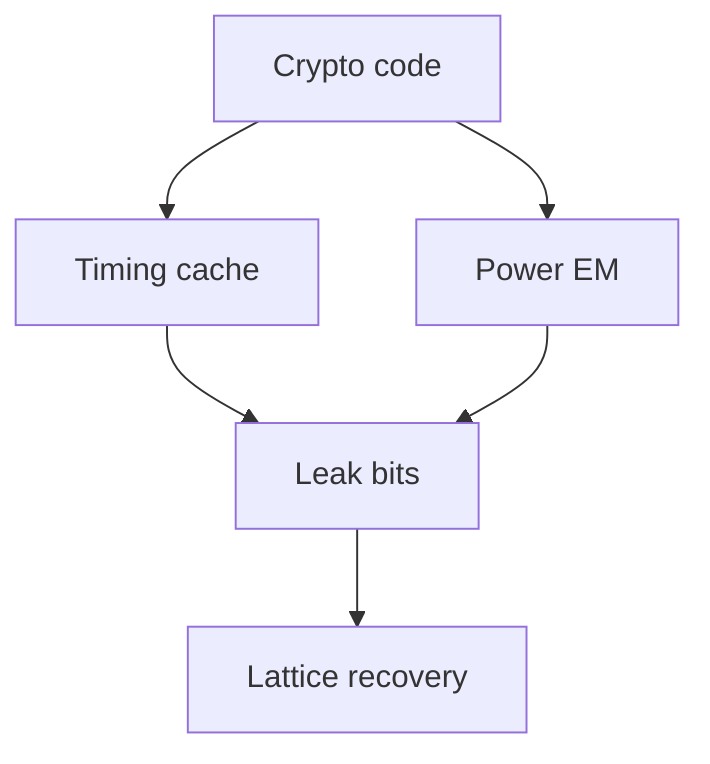

# Chapter 16: Implementation and Side-Channel Resistance

Theory is IND-CCA; production is **constant-time or bust**. We have seen lattice leaks from careless NTT loops.

**Figure 16.1 — Implementation threat model**



---

Every PQC proof we trust still fails when a single branch leaks key bits—implementation is the real battlefield.

## 16.1 The Implementation Gap

The history of cryptography teaches a humbling lesson: mathematically perfect algorithms routinely fail in practice due to implementation flaws. RSA's textbook security proofs meant nothing when PKCS#1 v1.5 padding oracles allowed Bleichenbacher's attack. AES survived decades of cryptanalysis only for cache-timing attacks to extract keys from software implementations. The gap between theoretical security and real-world security is the implementation gap, and post-quantum cryptography widens it considerably.

Classical cryptographic primitives — AES, SHA-256, ECDSA — have been deployed for decades. Their implementation pitfalls are well-documented, their constant-time coding patterns are established, and hardware acceleration has been purpose-built for their operations. Post-quantum algorithms introduce fundamentally different computational structures that create new categories of implementation vulnerabilities:

**Larger internal state.** ML-KEM-768 requires manipulating polynomials with 256 coefficients in Z_q where q = 3329, organized into matrices. The intermediate state during key generation and decapsulation involves multiple kilobytes of sensitive data that must be protected from leakage and properly cleared after use. Classical ECDH operates on 32-byte scalars — a factor of 50-100x less sensitive state.

**Novel arithmetic operations.** The Number Theoretic Transform (NTT), polynomial arithmetic over Z_q[X]/(X^n + 1), binomial sampling, and rejection sampling are operations with no classical cryptographic precedent at scale. Each introduces unique side-channel attack surfaces that have not been studied for decades in deployment.

**Rejection-based algorithms.** ML-DSA's signing procedure involves a rejection loop that may iterate multiple times before producing a valid signature. Each iteration processes secret key material, and the number of iterations is inherently variable. While the iteration count itself is considered public, intermediate state from failed iterations must be completely erased — a requirement that compilers may silently optimize away.

**Different attack surfaces.** The algebraic structure of lattice-based schemes means that partial information leakage can be fed into lattice reduction algorithms to recover keys. A timing side-channel that reveals a few bits of information per NTT butterfly operation may, over thousands of observations, provide enough information for an attacker to mount a lattice attack with reduced dimension.

**Extreme platform diversity.** PQC must be implemented securely on everything from high-performance servers with AVX-512 to 32-bit ARM Cortex-M4 microcontrollers with 64 KB RAM, to smart cards, to FPGA accelerators. Each platform has different instruction sets, different timing characteristics, different power profiles, and different memory hierarchies. A single reference implementation cannot serve all targets.

The consequence is clear: implementing post-quantum cryptography securely requires understanding both the mathematical structure of the algorithms and the physical characteristics of the target platform. We provide the technical foundation for secure PQC implementation across the full spectrum of deployment targets.

> **Author's note:** We refuse greenfield lattice code without side-channel review—use audited libraries (liboqs, vendor HSM paths).

> **Author's note:** We block lattice KEM releases without constant-time NTT—non-negotiable in our reviews.

## 16.2 Constant-Time Programming

### Why Constant-Time Matters

Modern processors are optimized for average-case performance, not for security. Nearly every performance optimization — branch prediction, speculative execution, cache hierarchies, variable-latency arithmetic units — creates observable differences in execution time that correlate with processed data. For cryptographic code, these timing variations become information channels that leak secret key material.

The fundamental sources of timing variation on modern processors include:

**Branch prediction and speculative execution.** When code contains a conditional branch that depends on secret data, the processor's branch predictor may mispredict, causing pipeline flushes that add measurable latency. Even without misprediction, the taken path may differ in instruction count or memory access pattern from the not-taken path. Speculative execution (as demonstrated by Spectre-class attacks) can transiently access secret-dependent data and leave observable microarchitectural traces even when the speculated path is architecturally discarded.

**Cache hierarchy effects.** Modern processors use multi-level caches (L1, L2, L3) with access time differences of 1-4 ns (L1 hit) versus 50-100 ns (DRAM access). When code performs memory accesses at addresses that depend on secret data, the resulting cache line activations are observable through timing measurements, Flush+Reload attacks, or Prime+Probe attacks.

**Variable-latency instructions.** Integer division on x86 processors takes different numbers of cycles depending on the magnitude of operands. Early multiplication hardware (particularly on ARM Cortex-M series) exhibited data-dependent timing. Floating-point operations exhibit different latencies for denormalized numbers, zeros, and NaN values.

**Memory access patterns.** Even without cache effects, memory bus contention and DRAM row buffer hits versus misses can create timing variations when access addresses depend on secrets.

For PQC specifically, the concern is amplified because lattice reduction algorithms can exploit partial information. An attacker who learns even a few bits per coefficient of an ML-KEM secret key may be able to reduce the effective lattice dimension enough to make the scheme breakable. This contrasts with classical ECC where learning a few bits of a scalar has less direct impact on the discrete logarithm problem difficulty.

### Principles of Constant-Time Code

The goal of constant-time programming is to ensure that the sequence of instructions executed and the sequence of memory addresses accessed are independent of secret values. The execution time may still vary due to factors like interrupt handling or DRAM refresh, but these are uncorrelated with secrets.

**Principle 1: No secret-dependent branches.**

Every conditional branch in code that depends on a secret value must be replaced with an arithmetic equivalent that computes both outcomes and selects the correct one:

```c
// VULNERABLE: Branch on secret bit reveals which path was taken
if (secret_bit) {
    result = value_a;
} else {
    result = value_b;
}

// SECURE: Constant-time conditional select using bitwise operations
static inline uint32_t ct_select(uint32_t a, uint32_t b, uint32_t condition) {
    // condition must be 0 or 1
    uint32_t mask = -(uint32_t)condition; // 0x00000000 or 0xFFFFFFFF
    return (a & mask) | (b & ~mask);
}
result = ct_select(value_a, value_b, secret_bit);
```

The `ct_select` function executes identical instructions regardless of whether `condition` is 0 or 1. The compiler must be prevented from optimizing this back into a branch — techniques include using volatile intermediate variables, compiler-specific barriers, or inline assembly.

**Principle 2: No secret-dependent memory access patterns.**

Table lookups indexed by secret values reveal the index through cache timing. The constant-time alternative scans the entire table:

```c
// VULNERABLE: Cache timing reveals which table entry was accessed
uint16_t result = ntt_twiddle_table[secret_index];

// SECURE: Access every table entry, select the correct one
static inline uint16_t ct_lookup(const uint16_t *table, size_t len, size_t index) {
    uint16_t result = 0;
    for (size_t i = 0; i < len; i++) {
        uint16_t mask = ct_eq(i, index); // 0xFFFF if equal, 0x0000 otherwise
        result |= table[i] & mask;
    }
    return result;
}
```

This approach has O(n) cost per lookup, which is acceptable when tables are small (as in NTT twiddle factors for ML-KEM where q = 3329 requires at most a few hundred entries).

**Principle 3: Only constant-time arithmetic operations.**

Safe operations that execute in data-independent time on virtually all modern processors:
- Addition, subtraction: `+`, `-`
- Bitwise operations: `&`, `|`, `^`, `~`
- Logical shifts by constant amounts: `<<`, `>>`
- Multiplication (on most modern architectures): `*`

Unsafe operations with potentially data-dependent timing:
- Division and modulo: `/`, `%` (nearly always variable-time)
- Shifts by variable amounts (on some older architectures)
- Floating-point operations (denormals, special values)
- Population count on some architectures (older implementations)

**Principle 4: Prevent compiler interference.**

Compilers may optimize constant-time code into non-constant-time equivalents. For example, a compiler may recognize the `ct_select` pattern and replace it with a conditional move (acceptable on x86) or a branch (unacceptable). Strategies to prevent this:

```c
// Use volatile to prevent optimization of intermediate values
static inline uint32_t ct_barrier(uint32_t x) {
    volatile uint32_t v = x;
    return v;
}

// Or use inline assembly barriers (GCC/Clang)
static inline uint32_t ct_barrier_asm(uint32_t x) {
    __asm__ __volatile__("" : "+r"(x));
    return x;
}
```

### ML-KEM Specific Requirements

ML-KEM's Fujisaki-Okamoto transform includes a critical re-encryption check during decapsulation. The comparison between the received ciphertext and the re-encrypted ciphertext must be constant-time, and the selection between the real shared secret and a pseudorandom "implicit rejection" value must not leak which case occurred:

```c
// ML-KEM decapsulation critical path
void ml_kem_decaps(uint8_t *shared_secret,
                   const uint8_t *ciphertext,
                   const struct ml_kem_sk *sk) {
    uint8_t m_prime[32];
    uint8_t ct_recomputed[ML_KEM_CT_BYTES];
    uint8_t K_real[32], K_reject[32];
    
    // Decrypt to recover m'
    indcpa_dec(m_prime, ciphertext, sk);
    
    // Re-encrypt m' to get ct'
    indcpa_enc(ct_recomputed, m_prime, sk->pk, sk->coins);
    
    // Constant-time comparison: does ct == ct'?
    uint8_t ct_match = ct_compare_constant_time(ciphertext,
                                                 ct_recomputed,
                                                 ML_KEM_CT_BYTES);
    
    // Derive both possible outputs
    derive_key(K_real, m_prime, sk->h);
    derive_key(K_reject, sk->z, ciphertext);  // implicit rejection
    
    // Constant-time select based on comparison result
    ct_cmov(shared_secret, K_reject, 32, 1);  // default to reject
    ct_cmov(shared_secret, K_real, 32, ct_match);  // overwrite if match
    
    // Clear sensitive intermediates
    secure_zeroize(m_prime, sizeof(m_prime));
    secure_zeroize(ct_recomputed, sizeof(ct_recomputed));
}
```

Additional ML-KEM constant-time requirements include:
- NTT butterfly operations must use constant-time modular reduction (Barrett or Montgomery)
- Centered Binomial Distribution (CBD) sampling must not branch on sampled values
- Compression and decompression (rounding) operations must be uniform
- The Compress function's rounding must avoid division (use shifts and multiply-high)

### ML-DSA Specific Requirements

ML-DSA's rejection sampling introduces a tension between efficiency and security. The signing loop may iterate 4-7 times on average before producing a valid signature. While the number of iterations is considered public information (it is observable through timing regardless), the intermediate values from rejected iterations must not persist:

```c
void ml_dsa_sign(uint8_t *sig, const uint8_t *msg, size_t msg_len,
                 const struct ml_dsa_sk *sk) {
    uint16_t kappa = 0;
    int reject;
    
    do {
        // Generate masking vector y from seed and counter
        expand_mask(y, sk->rhoprime, kappa);
        kappa++;
        
        // Compute w = A*y, decompose into w1
        matrix_vector_ntt(w, sk->A_hat, y_ntt);
        decompose(w1, w0, w);
        
        // Create challenge from w1 and message
        challenge_hash(c_tilde, w1, mu);
        sample_in_ball(c, c_tilde);
        
        // Compute z = y + c*s1
        poly_vector_pointwise(cs1, c_ntt, sk->s1_ntt);
        poly_vector_add(z, y, cs1);
        
        // Check norm bounds (constant-time comparison)
        reject = ct_norm_check(z, GAMMA1 - BETA);
        
        // Compute hints
        poly_vector_pointwise(cs2, c_ntt, sk->s2_ntt);
        poly_vector_sub(r0, w0, cs2);
        reject |= ct_norm_check(r0, GAMMA2 - BETA);
        
        // CRITICAL: Clear all intermediates before next iteration
        if (reject) {
            secure_zeroize(&y, sizeof(y));
            secure_zeroize(&w, sizeof(w));
            secure_zeroize(&cs1, sizeof(cs1));
            secure_zeroize(&cs2, sizeof(cs2));
            secure_zeroize(&z, sizeof(z));
            secure_zeroize(&r0, sizeof(r0));
        }
    } while (reject);
    
    // Encode valid signature
    encode_signature(sig, z, h, c_tilde);
}
```

The `SampleInBall` function, which generates the challenge polynomial with exactly τ non-zero coefficients (each ±1), must not reveal through timing which positions were selected or what signs were assigned. The Fisher-Yates shuffle within `SampleInBall` must use constant-time conditional swaps.

### SLH-DSA Specific Requirements

SLH-DSA (SPHINCS+) is hash-based and stateless, but its tree structure creates unique constant-time requirements:

- **WOTS+ chain computation:** Each WOTS+ digit requires computing a hash chain of variable length (determined by the message digest). The implementation must compute the maximum chain length for all digits, then select the appropriate intermediate value in constant time.
- **FORS tree construction:** Leaf selection in FORS trees must not reveal which leaves correspond to the message's index through memory access patterns.
- **Authentication path computation:** Generating Merkle tree authentication paths requires accessing sibling nodes. The access pattern must not reveal the leaf index being authenticated.

## 16.3 Side-Channel Attacks

### Timing Attacks

Timing attacks exploit measurable differences in execution time that correlate with secret data. In the PQC context, these attacks are particularly relevant because:

**ML-DSA rejection sampling.** The signing loop's iteration count reveals coarse-grained timing information. While this is accepted in the security model, subtler timing variations within each iteration can leak information about the secret key vectors s₁ and s₂. If the norm check (`‖z‖∞ < γ₁ - β`) is implemented with an early-exit comparison, an attacker observing many signatures can statistically correlate timing with coefficient values.

**FN-DSA (FALCON) Gaussian sampling.** FALCON requires sampling from a discrete Gaussian distribution over lattice cosets, typically implemented using floating-point arithmetic. Floating-point operations exhibit data-dependent timing due to denormalized numbers, and the comparison-based rejection sampling reveals information through its accept/reject timing pattern. This is one reason FALCON's implementation complexity significantly exceeds ML-DSA's.

**Polynomial reduction timing.** A naive implementation of modular reduction in Z_q that uses conditional subtraction (`if (x >= q) x -= q;`) has branch-dependent timing. Over millions of NTT butterfly operations processing secret coefficients, this timing difference becomes statistically exploitable.

**Network-level timing attacks.** Remote timing attacks against PQC in TLS are plausible when servers process attacker-chosen ciphertexts. ML-KEM's implicit rejection mechanism specifically defends against this: even if timing leaks whether the re-encryption check passed, the output is always a valid-looking shared secret (either real or pseudorandom), preventing a Bleichenbacher-style oracle.

### Power Analysis

**Simple Power Analysis (SPA)** examines a single power consumption trace during cryptographic execution to directly identify operations being performed.

In the PQC context, SPA can reveal:
- The number of ML-DSA rejection loop iterations (each iteration produces a distinct power signature pattern)
- Individual NTT butterfly operations and their sequence
- Whether polynomial coefficients are zero (skip pattern) versus non-zero (compute pattern) in naive implementations
- The Hamming weight of intermediate values during polynomial multiplication

**Differential Power Analysis (DPA)** collects many power traces for different inputs and statistically correlates power consumption with hypothesized intermediate values.

DPA attacks against ML-KEM target:
- Individual coefficients of the secret polynomial s during the NTT computation `NTT(s)`
- The multiplication `ŝ · ĉ` in NTT domain during decapsulation, where ŝ is the secret key in NTT form
- The CBD sampling process where secret noise polynomials are generated from seed material

DPA attacks against ML-DSA target:
- The secret key vectors s₁ and s₂ during the multiplication `c·s₁` and `c·s₂`
- The expansion of the masking vector y from the seed ρ'

A particularly powerful attack template correlates the power consumption of a single NTT butterfly operation with a hypothesis about the coefficient being processed:

```
Hypothesis: coefficient a[i] = v
Predicted intermediate: result = v * twiddle[j] mod q
Observed: power trace at the corresponding time point
Correlation: Hamming weight model of 'result' vs. power measurement
```

When the correct hypothesis yields statistically higher correlation than incorrect hypotheses across many traces, the coefficient value is recovered. Repeating for all coefficients reveals the full secret key.

**Countermeasures:**
- First-order Boolean/arithmetic masking (randomize shares so individual intermediate values are uncorrelated with secrets)
- Shuffling (randomize the order of independent operations like NTT butterflies)
- Hiding (add random dummy operations and delays to obscure signal patterns)
- Amplitude randomization (vary supply voltage slightly between operations)

### Electromagnetic Emanation

Electromagnetic (EM) side-channel attacks use near-field probes placed close to the chip surface to measure electromagnetic emissions during computation. EM attacks offer several advantages over power analysis:

- **Spatial resolution:** Small probes (< 1 mm) can isolate emissions from specific functional units on the chip (ALU, memory bus, cache)
- **Bypasses countermeasures:** On-chip power filtering and decoupling capacitors reduce power measurement quality but do not eliminate EM emissions
- **Multiple probe positions:** Different probe locations provide independent leakage channels that can be combined for improved attack efficiency

For PQC implementations, EM attacks have demonstrated:
- Recovery of ML-KEM secret keys from NTT computations in fewer than 10,000 traces using targeted probing of the multiplier unit
- Identification of rejection events in ML-DSA through emissions from the comparison unit
- Extraction of WOTS+ chain intermediate values in SLH-DSA implementations on microcontrollers

The countermeasures are the same as for power analysis (masking and hiding), with additional physical countermeasures including metal shielding layers, randomized placement and routing in ASIC designs, and active EM noise generation.

### Fault Injection

Fault injection attacks deliberately introduce computational errors to extract secret information from the corrupted outputs. Common fault injection mechanisms include:

- **Voltage glitching:** Briefly dropping or spiking the supply voltage causes logic gates to evaluate incorrectly
- **Clock glitching:** Inserting extra clock edges or shortening clock periods violates setup/hold times
- **Laser fault injection:** Focused laser pulses can flip individual bits in SRAM or registers
- **Electromagnetic fault injection (EMFI):** Localized EM pulses can cause targeted computation errors

**PQC-specific fault attacks are particularly devastating:**

*Skipping the rejection check in ML-DSA:* If an attacker can cause the norm check (`‖z‖∞ < γ₁ - β`) to always pass, signatures are produced with z values that directly reveal the secret key. A single fault-induced signature where z = y + c·s₁ with ‖z‖∞ ≥ γ₁ - β allows the attacker to recover s₁ through linear algebra (since y, c are known from the signature).

*Corrupting the re-encryption check in ML-KEM:* If the comparison between ct and ct' is forced to always succeed, the decapsulation becomes a standard CPA-secure decryption oracle. An attacker can then submit malformed ciphertexts and use the decrypted values to mount a key-recovery attack against the underlying IND-CPA scheme.

*Zeroing NTT twiddle factors:* If a fault causes twiddle factors to become zero during the NTT of the secret key, the NTT output becomes a trivially invertible function of the secret coefficients (essentially a partial identity transform), revealing key material directly.

*Faulting WOTS+ chain computation in SLH-DSA:* If a hash computation in a WOTS+ chain is skipped, the output reveals an intermediate chain value. Given an intermediate value at position i in a chain, an attacker can compute all values from position i to the end, effectively forging signatures for any message whose digit at that position is ≥ i.

**Comprehensive fault countermeasures:**

```c
// Double computation with comparison
void ml_dsa_sign_protected(uint8_t *sig, const uint8_t *msg,
                           const struct ml_dsa_sk *sk) {
    uint8_t sig1[SIG_BYTES], sig2[SIG_BYTES];
    
    // Compute signature twice
    ml_dsa_sign_internal(sig1, msg, msg_len, sk);
    ml_dsa_sign_internal(sig2, msg, msg_len, sk);
    
    // Verify both computations match
    if (!ct_compare_constant_time(sig1, sig2, SIG_BYTES)) {
        secure_zeroize(sig1, SIG_BYTES);
        secure_zeroize(sig2, SIG_BYTES);
        abort();  // Fault detected
    }
    
    // Verify signature before output (catches computation faults)
    if (!ml_dsa_verify(sig1, msg, msg_len, &sk->pk)) {
        secure_zeroize(sig1, SIG_BYTES);
        abort();  // Invalid signature indicates fault
    }
    
    memcpy(sig, sig1, SIG_BYTES);
    secure_zeroize(sig1, SIG_BYTES);
    secure_zeroize(sig2, SIG_BYTES);
}
```

Additional hardware-level countermeasures include voltage and clock monitors (detecting glitch attempts), light sensors (detecting decapping for laser injection), instruction flow monitoring (detecting skipped instructions), and error-correcting codes on internal buses and memory.

### Cache-Timing Attacks

Cache-timing attacks exploit the shared cache hierarchy in modern processors to observe memory access patterns of victim processes. The primary attack variants include:

**Flush+Reload:** The attacker flushes specific cache lines (using `clflush` on x86), waits for the victim to execute, then measures the reload time of each line. Lines the victim accessed will be fast (cache hit); others will be slow (cache miss). This requires shared memory (shared libraries or deduplication) between attacker and victim.

**Prime+Probe:** The attacker fills cache sets with their own data, waits for the victim to execute, then measures access time to their own data. Cache sets where the victim evicted the attacker's data will be slow. This works across process boundaries without shared memory.

**PQC-specific cache-timing vulnerabilities:**

NTT implementations that use lookup tables for twiddle factors indexed by loop variables that depend on the transform stage and butterfly position are generally safe (indices are public). However, implementations where the table index depends on secret polynomial coefficients — such as table-based modular reduction or table-based Gaussian sampling — are vulnerable.

The FORS component of SLH-DSA signs a message by revealing FORS tree leaves at positions determined by the message hash. If the leaf computation accesses a pre-computed tree stored in memory, the access pattern reveals which leaves (and hence which message) is being signed. This matters when the signing key is used with different messages.

**Comprehensive cache-timing mitigation:**

```c
// Scatter-gather technique for table access
// Store table values scattered across cache lines, gather in constant time
void scatter_table(uint16_t *scattered, const uint16_t *table, size_t n) {
    for (size_t i = 0; i < n; i++) {
        // Place each value in a separate cache line (64 bytes apart)
        scattered[i * 32] = table[i];  // 32 uint16_t per cache line
    }
}

uint16_t gather_constant_time(const uint16_t *scattered, size_t n,
                              size_t secret_idx) {
    uint16_t result = 0;
    for (size_t i = 0; i < n; i++) {
        uint16_t mask = ct_eq_16(i, secret_idx);
        result |= scattered[i * 32] & mask;
    }
    return result;
}
```

Alternatively, eliminate tables entirely by computing values inline using arithmetic operations. For ML-KEM's small modulus (q = 3329), twiddle factors can be computed on the fly using Barrett reduction rather than looked up from a table, trading computation time for cache-timing resistance.

## 16.4 Masking Countermeasures

### Boolean Masking

Boolean masking splits each secret value x into d+1 random shares such that x = x₀ ⊕ x₁ ⊕ ... ⊕ x_d. Any d shares are uniformly random and reveal no information about x. Operations are performed on individual shares without ever recombining them until the final output:

**XOR operations** are trivial under Boolean masking:
```
(a₀ ⊕ a₁) ⊕ (b₀ ⊕ b₁) = (a₀ ⊕ b₀) ⊕ (a₁ ⊕ b₁)
```
Each share is XORed independently, maintaining the masking invariant.

**AND operations** require interaction between shares. The ISW (Ishai-Sahai-Wagner) multiplication protocol for first-order masking computes c = a & b where a = a₀ ⊕ a₁ and b = b₀ ⊕ b₁:

```c
// ISW first-order secure AND gate
void secure_and(uint32_t *c0, uint32_t *c1,
                uint32_t a0, uint32_t a1,
                uint32_t b0, uint32_t b1) {
    uint32_t r = random_uint32();  // Fresh randomness
    
    *c0 = (a0 & b0) ^ r;
    uint32_t temp = (a0 & b1) ^ r;
    temp ^= (a1 & b0);
    *c1 = temp ^ (a1 & b1);
    // Invariant: c0 ^ c1 = (a0^a1) & (b0^b1) = a & b
}
```

The cost of ISW multiplication scales as O(d²) for d-th order masking (d+1 shares), requiring d(d+1)/2 random values per AND gate.

### Arithmetic Masking

For lattice-based PQC operating in Z_q, arithmetic masking is more natural. Each secret value x ∈ Z_q is split into shares such that x = x₀ + x₁ + ... + x_d (mod q):

**Addition in Z_q** is trivial:
```
(a₀ + a₁) + (b₀ + b₁) = (a₀ + b₀) + (a₁ + b₁) (mod q)
```

**Multiplication in Z_q** requires secure protocols. For first-order arithmetic masking:

```c
// First-order secure multiplication in Z_q
void secure_mul_Zq(uint16_t *c0, uint16_t *c1,
                   uint16_t a0, uint16_t a1,
                   uint16_t b0, uint16_t b1, uint16_t q) {
    uint16_t r = random_mod_q(q);
    
    *c0 = ((uint32_t)a0 * b0 + r) % q;
    uint32_t cross = ((uint32_t)a0 * b1 + (uint32_t)a1 * b0) % q;
    *c1 = ((uint32_t)a1 * b1 + cross + q - r) % q;
    // Invariant: (c0 + c1) mod q = (a0+a1)*(b0+b1) mod q
}
```

**Conversion between Boolean and arithmetic masking** is required when an algorithm mixes bitwise and arithmetic operations. The conversion is non-trivial and requires careful protocols to avoid unmasking intermediate values. Goubin's algorithm provides efficient first-order conversion from Boolean to arithmetic masking, while Debraize's algorithm handles the reverse direction.

### Masking the NTT

The NTT is a linear operation over Z_q, which is the key property that makes masking lattice-based PQC feasible:

```
NTT(x₀ + x₁) = NTT(x₀) + NTT(x₁) (mod q)
```

This linearity means that the NTT of a masked polynomial can be computed by independently transforming each share:

```c
// Masked NTT: transform each share independently
void masked_ntt(uint16_t shares[][256], int num_shares) {
    for (int s = 0; s < num_shares; s++) {
        ntt(shares[s]);  // Standard NTT on each share
    }
    // Invariant preserved: sum of shares in NTT domain
    // equals NTT of sum of shares in time domain
}
```

However, pointwise multiplication in the NTT domain (required for polynomial multiplication) is NOT linear and requires the secure multiplication protocol from arithmetic masking. This is where the primary masking overhead occurs:

```c
// Masked pointwise multiplication in NTT domain
void masked_pointwise_mul(uint16_t c_shares[][256],
                          const uint16_t a_shares[][256],
                          const uint16_t b_shares[][256],
                          int num_shares, uint16_t q) {
    for (int i = 0; i < 256; i++) {
        // Each coefficient multiplication requires secure protocol
        secure_mul_Zq(&c_shares[0][i], &c_shares[1][i],
                      a_shares[0][i], a_shares[1][i],
                      b_shares[0][i], b_shares[1][i], q);
    }
}
```

For ML-KEM decapsulation, the critical masked operation is the multiplication of the secret key (in NTT form) by the ciphertext vector (also in NTT form). Since the ciphertext is public, one optimization is to use "one-sided" masking where only the secret key is shared:

```c
// Optimized: multiply public value by masked secret
void masked_mul_public(uint16_t c_shares[][256],
                       const uint16_t *public_val,
                       const uint16_t s_shares[][256],
                       int num_shares, uint16_t q) {
    for (int s = 0; s < num_shares; s++) {
        for (int i = 0; i < 256; i++) {
            c_shares[s][i] = ((uint32_t)public_val[i] * s_shares[s][i]) % q;
        }
    }
    // No cross-terms needed since public value doesn't require shares
}
```

### Masking Cost Analysis

| Masking Order | Shares | Protection Level | Overhead Factor | Random Values per Mul |
|---------------|--------|-----------------|-----------------|----------------------|
| Unmasked | 1 | None (CT only) | 1x | 0 |
| 1st order | 2 | Defeats 1st-order DPA/SPA | 2-4x | 1 |
| 2nd order | 3 | Defeats up to 2nd-order DPA | 5-12x | 3 |
| 3rd order | 4 | Defeats up to 3rd-order DPA | 12-30x | 6 |
| d-th order | d+1 | Defeats up to d-th order DPA | O(d²) | d(d+1)/2 |

The practical sweet spot for most embedded applications is first-order masking, which provides protection against standard DPA attacks at 2-4x overhead. Second-order masking is required for high-security applications (smart cards, HSMs) where sophisticated attackers with expensive lab equipment are in the threat model. Higher-order masking is generally reserved for the most sensitive applications due to rapidly escalating costs.

For ML-KEM-768 on ARM Cortex-M4, representative cycle counts demonstrate the masking overhead:
- Unmasked decapsulation: ~1.5 million cycles
- First-order masked decapsulation: ~4.5 million cycles (3x overhead)
- Second-order masked decapsulation: ~15 million cycles (10x overhead)

### Masking Randomness Requirements

Masking requires significant quantities of random values. For first-order masked ML-KEM-768 decapsulation, approximately 768 random field elements (1,536 bytes) are needed for the pointwise multiplication alone. This randomness must be generated from a cryptographically secure source (typically a DRBG seeded from hardware entropy), adding to the overall cost. Implementations must carefully manage the random number generator to avoid becoming a bottleneck.

## 16.5 Platform-Specific Considerations

### x86-64 (Servers, Desktops)

Modern x86-64 processors provide extensive SIMD capabilities that dramatically accelerate PQC operations. The key acceleration technologies and their applications:

**AVX2 (256-bit SIMD):** Available on all recent Intel (Haswell+) and AMD (Zen+) processors. Sixteen 16-bit coefficient operations can be performed in parallel, ideal for ML-KEM (q = 3329 fits in 16 bits) and ML-DSA (q = 8380417 requires 32-bit lanes, so eight parallel operations):

```c
// AVX2 NTT butterfly for ML-KEM (16 coefficients in parallel)
// Process 16 butterfly operations simultaneously
__m256i ntt_butterfly_avx2(__m256i a, __m256i b, __m256i zeta) {
    __m256i t = _mm256_mullo_epi16(b, zeta);
    t = barrett_reduce_avx2(t);         // Parallel Barrett reduction
    __m256i r0 = _mm256_add_epi16(a, t);
    __m256i r1 = _mm256_sub_epi16(a, t);
    r0 = _mm256_add_epi16(r0, _mm256_and_si256(
        _mm256_cmpgt_epi16(_mm256_setzero_si256(), r0),
        _mm256_set1_epi16(3329)));
    return r0;  // Simplified; actual implementation interleaves r0, r1
}
```

**AVX-512 (512-bit SIMD):** Available on Intel Ice Lake+ and AMD Zen 4+. Doubles the parallelism of AVX2 (32 × 16-bit operations), but thermal throttling on some processors may reduce the net benefit. AVX-512 is particularly beneficial for ML-DSA where 32-bit coefficient processing benefits from the wider registers (16 × 32-bit operations).

**AES-NI and SHA-NI:** Hardware acceleration for symmetric primitives used within PQC. ML-KEM uses SHAKE-128 and SHAKE-256 (Keccak-based) for matrix expansion and key derivation. While there is no native Keccak instruction on x86, the SHA-NI extensions accelerate SHA-256 operations relevant to SLH-DSA's SHA-256 instantiation. Some implementations use AES-CTR as a faster (non-standard) drop-in for the XOF when FIPS compliance is not required.

**VPCLMULQDQ:** Carry-less multiplication acceleration can be repurposed for certain polynomial operations, though its primary PQC application is limited compared to NTT-based approaches.

**Best practices for x86-64:**
- Use AVX2 as the baseline SIMD target (universal on modern processors)
- Provide AVX-512 code paths with runtime detection for additional speedup
- Batch hash operations (4-way parallel SHAKE using AVX2)
- Use `RDTSC` for benchmarking but `RDRAND`/`RDSEED` for entropy
- Ensure constant-time properties are preserved under SIMD transformation (no conditional moves that depend on lane values)

### ARM (Mobile, Server, Embedded)

The ARM ecosystem spans from high-performance server chips (Neoverse, Apple M-series) to embedded processors (Cortex-A, Cortex-R):

**NEON (128-bit SIMD):** Available on all ARMv7+ and ARMv8 processors. Provides 8 × 16-bit parallel operations for ML-KEM:

```c
// NEON NTT butterfly for ML-KEM
int16x8_t ntt_butterfly_neon(int16x8_t a, int16x8_t b, int16_t zeta) {
    int16x8_t zeta_vec = vdupq_n_s16(zeta);
    int16x8_t t = vqdmulhq_s16(b, zeta_vec);  // Approximate; actual uses Montgomery
    int16x8_t r0 = vaddq_s16(a, t);
    int16x8_t r1 = vsubq_s16(a, t);
    return r0;  // Simplified
}
```

**ARMv8 Crypto Extensions:** Hardware SHA-256 and AES acceleration directly benefit SLH-DSA (SHA-256 instantiation) and can be used for DRBG operations within ML-KEM/ML-DSA.

**SVE/SVE2 (Scalable Vector Extension):** Available on ARMv9 (Neoverse V1+, some A-profile cores). SVE provides vector lengths from 128 to 2048 bits, determined by the hardware. SVE2 adds integer operations beneficial for NTT. The vector-length-agnostic programming model allows single binary support across different SVE implementations.

**Apple M-series and ARM server considerations:** These high-performance ARM processors often have performance characteristics comparable to x86-64 with AVX2, but with different cache hierarchies and memory models. The unified memory architecture on Apple Silicon simplifies memory management but doesn't eliminate cache-timing concerns.

### Microcontrollers (IoT, Embedded)

**ARM Cortex-M4** has become the standard benchmark platform for constrained PQC implementations due to its representative characteristics:
- 32-bit ARM Thumb-2 instruction set
- Single-cycle 32×32→32 multiply (constant-time on M4)
- No SIMD (no NEON), no floating point (on many variants)
- Typical configurations: 64-256 KB SRAM, 256 KB-2 MB Flash
- Clock speeds: 80-168 MHz (STM32F4 series)

**Memory management is the primary challenge.** ML-KEM-768 requires approximately 6-7 KB of stack during operation, while ML-DSA-65 signing requires approximately 32 KB. On a device with 128 KB total SRAM (of which the OS and application consume a portion), this is a significant allocation:

```c
// Stack-optimized ML-KEM-768 on Cortex-M4
// Total stack: ~6.5 KB during decapsulation
typedef struct {
    int16_t poly[256];        // 512 bytes - single polynomial buffer
    int16_t ntt_temp[256];    // 512 bytes - NTT working space
    uint8_t hash_state[200];  // 200 bytes - Keccak state
    uint8_t ct_compare[32];   // 32 bytes - running comparison hash
    // Reuse buffers across sequential operations
} ml_kem_workspace;

// Streaming decapsulation: process one polynomial at a time
// rather than materializing the full matrix
void ml_kem_decaps_streaming(uint8_t *ss, const uint8_t *ct,
                             const uint8_t *sk,
                             ml_kem_workspace *ws) {
    // Regenerate A matrix row-by-row from seed (don't store full matrix)
    // Process inner product incrementally
    // ...
}
```

**Key optimization strategies for Cortex-M4:**
- **In-place NTT:** Transform polynomial without allocating a second buffer
- **Streaming matrix generation:** Regenerate matrix A from seed row-by-row rather than storing the full k×k matrix of polynomials (saves k² × 512 bytes)
- **Lazy reduction:** Accumulate multiple additions before performing modular reduction, exploiting the fact that int32 can hold many unreduced additions before overflow
- **Interleaved computation:** Overlap hash computation with polynomial arithmetic when possible
- **Flash-stored constants:** Place twiddle factor tables in Flash (read-only, no SRAM cost) since access time from Flash is constant on Cortex-M4

**ARM Cortex-M33 and M55** (ARMv8-M) add security-relevant features:
- TrustZone-M for hardware isolation of cryptographic operations
- DSP extensions (M33) for faster multiply-accumulate
- Helium/MVE vector extensions (M55) providing limited SIMD for embedded

### Hardware Security Modules (HSMs)

HSMs provide the highest level of implementation security through physical containment and tamper resistance. PQC in HSMs introduces unique challenges:

**FIPS 140-3 validation complexity:** PQC algorithms are significantly more complex than RSA or ECC, increasing the validation effort. The NIST Algorithm Validation Program (CAVP/ACVP) must test all parameter sets, all operations (KeyGen, Sign/Verify or Encaps/Decaps), and various edge cases. The implementation must be fixed (no updates) during the validation period, which can take 12-24 months.

**Key storage requirements:** ML-DSA-65 expanded secret keys are approximately 4 KB (compared to 32 bytes for Ed25519). An HSM managing thousands of keys needs significantly more secure storage capacity. Some HSMs mitigate this by storing only the seed and re-expanding keys on demand, trading computation time for storage.

**Side-channel countermeasures are mandatory** for HSM certification under Common Criteria or FIPS 140-3 Level 3+. This means first-order masking at minimum, with second-order often required. The performance cost of masking (3-10x) is acceptable in HSM contexts where security outweighs throughput.

**NTT hardware acceleration** within the HSM's secure boundary is highly beneficial. A dedicated NTT coprocessor can provide both high performance and inherent constant-time execution (fixed datapath, no cache effects). Several HSM vendors have announced PQC-capable hardware with custom NTT engines targeting 2025-2026 availability.

### FPGA/ASIC Acceleration

Hardware implementation of PQC offers several fundamental advantages over software:

**Inherent constant-time execution:** A fixed-datapath hardware implementation processes every input in the same number of clock cycles, regardless of data values. There are no branches, no caches, no speculative execution — eliminating entire categories of side-channel vulnerabilities.

**Parallelism:** Hardware can instantiate multiple NTT butterfly units, hash engines, and polynomial multipliers operating simultaneously. A pipelined NTT engine processing one butterfly per clock cycle can complete a 256-point NTT in 256 × 8 = 2048 cycles (8 stages of 256 butterflies each) at GHz clock rates.

**Common acceleration architectures:**

| Component | FPGA Resources | Throughput Benefit |
|-----------|---------------|-------------------|
| Pipelined NTT engine | ~5K LUTs, 2 BRAMs | 10-50x vs. software |
| SHA-3/SHAKE core | ~8K LUTs | 5-20x vs. software |
| Polynomial MAC unit | ~2K LUTs, 1 DSP | 8-15x vs. software |
| Gaussian sampler (FN-DSA) | ~10K LUTs | 20-100x vs. software |

**Design trade-offs:**
- **Area vs. throughput:** More parallel NTT units increase throughput but consume more silicon area
- **Latency vs. throughput:** Pipelining improves throughput but increases latency per operation
- **Flexibility vs. efficiency:** Programmable parameters (supporting multiple security levels) versus fixed-parameter optimized designs
- **Power:** FPGA implementations typically consume 5-20x more power than equivalent ASIC implementations

## 16.6 Random Number Generation

### Requirements

Random number generation is arguably the most critical component of any cryptographic implementation. For PQC algorithms specifically:

**ML-KEM key generation** requires 64 bytes of entropy (d ‖ z where |d| = |z| = 32 bytes). From this seed, the entire key pair is deterministically derived. If an attacker can predict or bias these 64 bytes, the private key is completely compromised regardless of the algorithm's mathematical security.

**ML-KEM encapsulation** requires 32 bytes of fresh randomness (m) per operation. This randomness is hashed together with the public key hash to derive the encryption coins. If m is predictable, the ciphertext becomes deterministic and an attacker who observes multiple encapsulations to the same key can detect repeated messages.

**ML-DSA hedged signing** requires 32 bytes of fresh randomness (rnd) that is combined with the secret key and message to derive the signing nonce. This "hedging" protects against fault attacks that attempt to force nonce reuse (which would reveal the secret key), while deterministic signing (rnd = 0) is permitted for applications where randomness is unavailable but fault attacks are not in the threat model.

**SLH-DSA** can operate in purely deterministic mode (no randomness needed after key generation) or randomized mode (32 bytes per signature for improved multi-target security). The deterministic mode is particularly valuable for environments where the random number generator's quality is uncertain.

### Entropy Sources

**Hardware random number generators (HRNGs):**

Modern processors include dedicated entropy sources:
- **Intel RDRAND/RDSEED:** RDRAND provides conditioned output from an on-die entropy source suitable for seeding a DRBG. RDSEED provides direct access to the entropy source for reseeding. Both are accessed via dedicated x86 instructions.
- **ARM TRNG (True Random Number Generator):** ARMv8.5+ defines an optional TRNG feature accessed via system registers (RNDR, RNDRRS).
- **Ring oscillator entropy:** Common in FPGAs and ASICs, exploiting jitter between free-running oscillators.
- **Metastable circuit entropy:** Intentionally violating setup/hold times in flip-flops to generate random bits from metastable resolution.

**Operating system entropy pools:**

- **Linux `getrandom()`:** Preferred interface; blocks until the entropy pool is initialized, then provides cryptographic-quality random bytes. Equivalent to reading from `/dev/urandom` after initialization.
- **Windows `BCryptGenRandom()`:** Cryptographic-quality random bytes from the OS entropy pool.
- **OpenBSD `arc4random()`:** Automatically reseeds from system entropy; available on many platforms.

**Embedded entropy challenges:**

Microcontrollers without hardware RNG must derive entropy from:
- ADC noise (least significant bits of analog-to-digital conversions)
- Clock jitter between independent oscillators
- SRAM power-up patterns (not usable after boot)
- External entropy sources (dedicated TRNG chips)

The risk of insufficient entropy is particularly acute during early boot on embedded systems, where the device may need to perform key generation before sufficient entropy has accumulated.

### DRBG (Deterministic Random Bit Generator)

After seeding from an entropy source, a DRBG provides an efficient stream of pseudorandom bytes:

**NIST SP 800-90A approved mechanisms:**
- **CTR_DRBG:** Based on AES in counter mode. Fast with AES-NI hardware. 256-bit security with AES-256.
- **HMAC_DRBG:** Based on HMAC. More conservative design, slightly slower, widely trusted.
- **Hash_DRBG:** Based on hash functions. Simple design, adequate performance.

**Reseeding requirements:**
- NIST requires reseeding before generating 2^48 blocks (CTR_DRBG) or 2^48 requests (HMAC_DRBG)
- In practice, reseeding every few minutes or after generating 1 MB of output provides conservative margins
- Prediction resistance mode: fresh entropy mixed in with each request (expensive but maximum forward security)

### PQC-Specific Randomness Considerations

**Hedged randomness in ML-DSA:** The signing randomness rnd is combined with the secret key and message hash: ρ' = H(K ‖ rnd ‖ μ). Even if rnd is compromised or constant, the output ρ' still depends on the secret key K, providing a "belt and suspenders" defense. However, if both K is compromised and rnd is constant, the signature becomes deterministic — which is actually the intended deterministic mode.

**Implicit rejection in ML-KEM:** The pseudorandom shared secret for invalid ciphertexts is derived as K' = H(z ‖ ct) where z is part of the secret key. This requires z to be uniformly random (32 bytes of entropy from key generation), as a predictable z would allow an attacker to distinguish implicit rejection from valid decapsulation.

**Side-channel protection for RNG state:** The DRBG internal state (V, Key for CTR_DRBG) is as sensitive as any secret key. If the DRBG state is compromised through a side-channel attack, future outputs are predictable and past outputs may be recoverable. The DRBG state must be stored in protected memory and processed with the same constant-time discipline as cryptographic keys.

## 16.7 Testing and Validation

### Known Answer Tests (KATs)

NIST provides official KAT vectors for all standardized PQC algorithms. These vectors fix the internal randomness (by specifying the DRBG seed) to produce deterministic outputs that any correct implementation must match:

```
# Example ML-KEM-768 KAT structure
seed = 0x7c9935a0b07694aa0c6d10e4db6b1add2fd81a25ccb14803...
expected_pk = 0xa32c65e8b4438e6d9c3a4e8b...
expected_sk = 0x07638fb69868f3d320e5862b...
expected_ct = 0x14a0e5473c95b0f8f3d7e6a2...
expected_ss = 0x49c5780de3996940...
```

A correct implementation initializes its DRBG with the given seed, generates a key pair, performs encapsulation/decapsulation, and verifies that all intermediate and final values match the expected outputs byte-for-byte.

**KAT coverage limitations:** KATs verify correctness for specific inputs but cannot detect:
- Non-constant-time behavior (timing side channels)
- Memory safety issues (buffer overflows, use-after-free)
- Incorrect error handling for malformed inputs
- Platform-specific issues (endianness, alignment)
- Statistical biases that don't affect specific test vectors

### Algorithm Validation Program (CAVP/ACVP)

NIST's Automated Cryptographic Validation Protocol (ACVP) provides machine-readable test vectors and a validation protocol that implementations must pass for FIPS 140-3 certification:

**ACVP test types for ML-KEM:**
- AFT (Algorithm Functional Test): Standard KeyGen/Encaps/Decaps with provided randomness
- VAL (Validation Test): Verify that decapsulation produces correct shared secret or implicit rejection for invalid ciphertexts

**ACVP test types for ML-DSA:**
- KeyGen: Verify key pair generation from seed
- SigGen: Verify signature generation (deterministic and hedged modes)
- SigVer: Verify signature validation (valid and invalid signatures)

**ACVP test types for SLH-DSA:**
- KeyGen: Verify key pair from seed
- SigGen: Verify signature for given message (deterministic and randomized)
- SigVer: Verify correct accept/reject of signatures

The ACVP protocol operates over HTTPS with JSON-formatted requests and responses, enabling automated testing of implementations in their target environment (including HSMs via proxy servers).

### Interoperability Testing

Beyond correctness, implementations must interoperate across different codebases, languages, and platforms:

**Cross-library validation matrix:**
- Keys generated by liboqs (C) must verify in BouncyCastle (Java)
- Signatures from pqcrypto-rs (Rust) must verify in OpenSSL (C)
- Ciphertexts from CIRCL (Go) must decapsulate in wolfSSL (C)
- All combinations of parameter sets must be tested

**Protocol-level interoperability:**
- TLS implementations from different vendors must complete hybrid handshakes
- X.509 certificates with PQC signatures must validate across implementations
- CMS/S/MIME messages with PQC must be processable by all compliant software

**Endianness and encoding testing:** PQC standards specify little-endian byte encoding for most structures, but implementation bugs in serialization/deserialization are common when porting between architectures. Test vectors should be verified on both little-endian (x86, ARM) and big-endian (some MIPS, IBM Z) platforms.

### Side-Channel Testing

**Test Vector Leakage Assessment (TVLA):** The standard methodology for evaluating first-order side-channel leakage. TVLA uses Welch's t-test to compare power traces collected under two scenarios:
- Fixed input: Same secret key/plaintext for all traces
- Random input: Different random key/plaintext for each trace

If the t-statistic exceeds ±4.5 at any point in time, first-order leakage is detected with >99.999% confidence:

```python
# TVLA analysis pseudocode
def tvla_analysis(fixed_traces, random_traces):
    n_fixed = len(fixed_traces)
    n_random = len(random_traces)
    
    mean_fixed = np.mean(fixed_traces, axis=0)
    mean_random = np.mean(random_traces, axis=0)
    var_fixed = np.var(fixed_traces, axis=0)
    var_random = np.var(random_traces, axis=0)
    
    t_statistic = (mean_fixed - mean_random) / np.sqrt(
        var_fixed/n_fixed + var_random/n_random)
    
    # |t| > 4.5 indicates leakage
    leakage_points = np.where(np.abs(t_statistic) > 4.5)[0]
    return t_statistic, leakage_points
```

**Higher-order leakage testing:** First-order masked implementations should be tested for second-order leakage by applying preprocessing (centered product) to traces before t-test analysis. This detects leakage from pairs of points that individually appear random but whose product correlates with secrets.

**Tools and equipment:**
- **ChipWhisperer:** Open-source hardware/software platform for power analysis and fault injection testing. Supports automated TVLA and CPA (Correlation Power Analysis).
- **Riscure Inspector:** Commercial side-channel analysis platform with advanced statistical tests and automated leakage localization.
- **Langer EMV:** Near-field EM probe sets for spatially-resolved electromagnetic measurements.
- **NewAE:** Oscilloscope-based measurement systems for high-resolution power traces.

## 16.8 Common Implementation Pitfalls

### Mistake 1: Non-Constant-Time Comparison in Decapsulation

The most critical single operation in ML-KEM decapsulation is the comparison between the received ciphertext and the re-encrypted version. Standard `memcmp` returns immediately upon finding the first differing byte:

```c
// VULNERABLE: memcmp short-circuits on first difference
// Timing reveals the position of the first differing byte
int result = memcmp(ct_received, ct_recomputed, CIPHERTEXT_BYTES);
if (result == 0) {
    memcpy(shared_secret, K_real, 32);
} else {
    memcpy(shared_secret, K_implicit_reject, 32);
}

// SECURE: Constant-time comparison examines all bytes
static int ct_memcmp(const uint8_t *a, const uint8_t *b, size_t len) {
    uint8_t diff = 0;
    for (size_t i = 0; i < len; i++) {
        diff |= a[i] ^ b[i];
    }
    // Return 0 if equal, non-zero otherwise
    // This loop always executes len iterations regardless of content
    return (int)diff;
}

// Even the conditional output must be constant-time
uint8_t match = (uint8_t)(1 - ((ct_memcmp(ct_received, ct_recomputed,
                                           CIPHERTEXT_BYTES) + 255) >> 8));
ct_cmov(shared_secret, K_real, 32, match);
ct_cmov(shared_secret, K_implicit_reject, 32, 1 - match);
```

### Mistake 2: Compiler-Eliminated Secure Zeroization

When sensitive data (rejected signature attempts, decrypted plaintexts, intermediate NTT values) must be cleared from memory, compilers routinely eliminate the clearing code as a "dead store" optimization:

```c
// VULNERABLE: Compiler may optimize away the memset
void process_secret(const uint8_t *input) {
    uint8_t secret_buffer[4096];
    compute_with_secret(secret_buffer, input);
    use_result(secret_buffer);
    memset(secret_buffer, 0, sizeof(secret_buffer)); // May be removed!
}

// SECURE: Use platform-specific guaranteed-execution clearing
#if defined(_WIN32)
    #define secure_zeroize(ptr, len) SecureZeroMemory(ptr, len)
#elif defined(__STDC_LIB_EXT1__)
    #define secure_zeroize(ptr, len) memset_s(ptr, len, 0, len)
#else
    // Portable fallback: volatile function pointer prevents optimization
    typedef void *(*memset_func)(void *, int, size_t);
    static volatile memset_func secure_memset = memset;
    #define secure_zeroize(ptr, len) secure_memset(ptr, 0, len)
#endif

// Alternative: explicit_bzero (available on Linux/BSD)
// Or use volatile write loop:
static void secure_zeroize_portable(void *ptr, size_t len) {
    volatile uint8_t *p = (volatile uint8_t *)ptr;
    while (len--) { *p++ = 0; }
}
```

This is particularly critical in ML-DSA where rejected loop iterations process the secret key, and on embedded systems where stack memory may be reused by other functions.

### Mistake 3: Variable-Time Modular Reduction

The NTT butterfly operation for ML-KEM requires modular reduction mod q = 3329. A naive conditional implementation leaks timing information:

```c
// VULNERABLE: Branch reveals whether reduction was needed
int16_t reduce_mod_q(int16_t x) {
    if (x >= 3329) x -= 3329;      // Branch on value
    if (x < 0) x += 3329;          // Branch on value
    return x;
}

// SECURE: Barrett reduction (no branches, constant-time)
// For q = 3329: v = round(2^26 / q) = 20159
static inline int16_t barrett_reduce(int16_t a) {
    int16_t t;
    const int16_t v = 20159;
    t = ((int32_t)v * a + (1 << 25)) >> 26;
    t *= 3329;
    return a - t;
}

// SECURE: Montgomery reduction for NTT domain
// For q = 3329, R = 2^16: qinv = -3327 mod 2^16 = 62209
static inline int16_t montgomery_reduce(int32_t a) {
    int16_t t;
    t = (int16_t)a * (-3327);  // Low 16 bits of a * qinv
    t = (a - (int32_t)t * 3329) >> 16;
    return t;
}
```

Barrett and Montgomery reduction use only multiplication, addition, and shifts — all constant-time operations. The result may not be fully reduced (it might be in [0, 2q) rather than [0, q)), but this is acceptable within NTT computations as long as intermediate values don't overflow.

### Mistake 4: Leaking Rejection Information in ML-DSA

ML-DSA's rejection sampling must clear intermediate state and avoid leaking which specific check caused the rejection:

```c
// VULNERABLE: Different timing reveals which check failed
// An attacker can distinguish "z too large" from "hint too heavy"
int ml_dsa_sign_attempt(signature_t *sig, const message_t *msg,
                        const secret_key_t *sk) {
    compute_y_and_w(sig, msg, sk);
    
    // Early return 1: timing reveals this check failed
    if (infinity_norm(sig->z) >= GAMMA1 - BETA) {
        return REJECT;  // Attacker knows z was too large
    }
    
    // Early return 2: additional timing reveals this check
    compute_hints(sig, sk);
    if (hint_weight(sig->h) > OMEGA) {
        return REJECT;  // Attacker knows hints were too heavy
    }
    
    return ACCEPT;
}

// SECURE: Evaluate all checks, combine results, clear state uniformly
int ml_dsa_sign_attempt_ct(signature_t *sig, const message_t *msg,
                           const secret_key_t *sk) {
    compute_y_and_w(sig, msg, sk);
    compute_hints(sig, sk);
    
    // Evaluate ALL checks (constant-time comparisons)
    uint32_t reject = 0;
    reject |= ct_ge(infinity_norm(sig->z), GAMMA1 - BETA);
    reject |= ct_ge(infinity_norm(sig->r0), GAMMA2 - BETA);
    reject |= ct_gt(hint_weight(sig->h), OMEGA);
    
    // Always clear full state (same cost regardless of which check failed)
    volatile uint32_t r = reject;
    if (r) {
        secure_zeroize(sig, sizeof(*sig));
    }
    return (int)r;
}
```

### Mistake 5: Insufficient or Biased Randomness

Poor randomness is catastrophic for all PQC algorithms. Beyond the obvious `srand(time(NULL))` mistake, subtler issues arise:

```c
// VULNERABLE (subtle): Modular bias when reducing random bytes to range
uint16_t random_mod_q_biased(void) {
    uint16_t r;
    getrandom(&r, 2, 0);
    return r % 3329;  // Bias: values 0-1365 are slightly more likely
    // 65536 / 3329 = 19.68..., so values < 65536 mod 3329 = 2903
    // have probability 20/65536 vs 19/65536 for others
}

// SECURE: Rejection sampling for uniform distribution
uint16_t random_mod_q_uniform(void) {
    uint16_t r;
    do {
        getrandom(&r, 2, 0);
        r &= 0x0FFF;  // Mask to 12 bits (0-4095)
    } while (r >= 3329);  // Reject values >= q
    return r;
    // Expected iterations: 4096/3329 ≈ 1.23
}

// VULNERABLE: Using system RNG before initialization
void early_boot_keygen(void) {
    uint8_t seed[64];
    // On embedded Linux, /dev/urandom may return low-entropy data
    // before the entropy pool is fully initialized
    int fd = open("/dev/urandom", O_RDONLY);
    read(fd, seed, 64);  // May have insufficient entropy!
    ml_kem_keygen(seed);
    
    // SECURE: Use getrandom() with GRND_RANDOM flag, which blocks
    // until the entropy pool is initialized
    getrandom(seed, 64, GRND_RANDOM);
    ml_kem_keygen(seed);
}
```

### Mistake 6: Incorrect NTT Domain Management

A common source of subtle bugs (and potential security issues if they lead to incorrect decapsulation behavior):

```c
// VULNERABLE: Mixing NTT and normal domain polynomials
void broken_decaps(poly *result, const poly *ct_poly, const poly *sk_poly) {
    // sk_poly is stored in NTT domain for efficiency
    // ct_poly arrives in normal domain
    poly_mul(result, ct_poly, sk_poly);  // WRONG: domains don't match!
    // This produces garbage, not a valid decryption
    // If the garbage happens to pass the re-encryption check
    // (astronomically unlikely but not impossible with faults),
    // it could leak information
}

// SECURE: Explicit domain tracking
typedef struct {
    int16_t coeffs[256];
    int is_ntt;  // Track whether polynomial is in NTT domain
} poly_checked;

void safe_mul(poly_checked *r, const poly_checked *a, const poly_checked *b) {
    assert(a->is_ntt && b->is_ntt);  // Both must be in NTT domain
    poly_basemul(r->coeffs, a->coeffs, b->coeffs);
    r->is_ntt = 1;
}
```

## 16.9 Reference Implementations and Libraries

### Production-Quality Libraries

| Library | Language | Algorithms | Side-Channel Protection | FIPS Status | Platform Support |
|---------|----------|-----------|------------------------|-------------|-----------------|
| liboqs | C | ML-KEM, ML-DSA, SLH-DSA, FN-DSA, HQC | Varies by backend | Pre-validation | x86-64, ARM64, ARM32 |
| PQClean | C | All NIST standards | Clean constant-time, no masking | Reference | Portable (no SIMD) |
| OpenSSL 3.5+ | C | ML-KEM, ML-DSA, SLH-DSA | Production CT, platform-optimized | In process | x86-64, ARM64, s390x |
| BoringSSL | C | ML-KEM | Production CT, AVX2/NEON optimized | Google internal | x86-64, ARM64 |
| AWS-LC | C | ML-KEM, ML-DSA | Production CT, FIPS-focused | In process | x86-64, ARM64 |
| BouncyCastle | Java/C# | All NIST standards | Language-limited CT | N/A | JVM, .NET |
| CIRCL | Go | ML-KEM, ML-DSA | Go runtime limitations | N/A | x86-64, ARM64 |
| pqcrypto-rs | Rust | ML-KEM, ML-DSA, SLH-DSA | Memory safety + CT | N/A | x86-64, ARM64 |
| wolfSSL | C | ML-KEM, ML-DSA | Embedded-optimized CT | In process | x86, ARM, MIPS, RISC-V |
| Mbed TLS | C | ML-KEM | Embedded-focused CT | In process | ARM Cortex-M, A-profile |
| pqm4 | C | ML-KEM, ML-DSA, SLH-DSA | Cortex-M4 optimized | N/A | ARM Cortex-M4 |

### Language-Specific Considerations

**C/C++:** Maximum control over constant-time behavior and memory management. Risk of memory safety bugs (buffer overflow, use-after-free). Requires manual secure zeroization. Best option for embedded and high-performance deployments.

**Rust:** Memory safety eliminates buffer overflows and use-after-free. The `zeroize` crate provides Drop-based automatic clearing. However, the Rust compiler's optimizer is aggressive and may reorder operations in ways that affect constant-time properties. The `subtle` crate provides constant-time primitives that resist optimization.

**Go:** Garbage collection makes secure zeroization unreliable (the GC may copy objects before clearing). The runtime scheduler can introduce timing variability between goroutines. CIRCL uses assembly for critical paths to work around these limitations.

**Java:** The JIT compiler can introduce timing variations by optimizing hot paths differently. Garbage collection prevents reliable zeroization of sensitive data (objects may be copied during GC before being cleared). BouncyCastle uses `byte[]` arrays and attempts clearing but cannot guarantee it. Not recommended for high-security implementations where side-channel resistance is critical.

### Choosing an Implementation

The selection criteria should be evaluated in order of priority:

1. **Security requirements:** Does the threat model include physical side-channel attacks? If yes, masking is required (limits choices to specialized implementations). If only remote timing attacks, constant-time software implementations suffice.

2. **Platform constraints:** Embedded targets with <64 KB RAM eliminate most general-purpose libraries. FPGA/ASIC targets require HDL implementations (Verilatored C or VHDL/Verilog reference).

3. **Compliance requirements:** FIPS 140-3 validation restricts the choice to validated modules (currently limited; expanding through 2025-2027). CNSA 2.0 requirements may mandate specific implementations.

4. **Performance requirements:** High-throughput servers benefit from AVX2/AVX-512 optimized implementations. Battery-powered devices need energy-optimized code.

5. **Maintenance and ecosystem:** Choose libraries with active maintenance, security advisory processes, and timely updates for vulnerability patches.

6. **Integration complexity:** Consider API compatibility with existing cryptographic frameworks. OpenSSL's provider model allows PQC algorithm addition without application changes.

## 16.10 Secure Development Practices

### Code Review for PQC

PQC implementation review requires specialized expertise. Reviewers should verify:

- All operations on secret data use only constant-time primitives
- No compiler optimization can transform constant-time code into branching code (verify generated assembly)
- Memory containing secrets is cleared before deallocation (check for compiler elimination)
- Random number generation uses appropriate entropy sources with sufficient seed length
- All rejection loops clear intermediate state from failed iterations
- The FO transform (re-encryption check) is implemented correctly in both success and failure cases
- NTT implementations correctly handle domain transitions and produce correct results for all inputs

### Continuous Integration for Security

Automated CI/CD pipelines should include:

```yaml
# Example CI pipeline for PQC implementation
security_checks:
  - name: "Constant-time verification"
    tool: "ct-verif / timecop / ctgrind"
    description: "Verify no secret-dependent branches or memory accesses"
    
  - name: "KAT verification"
    tool: "NIST KAT vectors"
    description: "Verify correctness against all official test vectors"
    
  - name: "Memory safety"
    tool: "AddressSanitizer + MemorySanitizer"
    description: "Detect buffer overflows, use-after-free, uninitialized reads"
    
  - name: "Undefined behavior"
    tool: "UBSan"
    description: "Detect signed overflow, alignment issues, type punning"
    
  - name: "Fuzzing"
    tool: "libFuzzer / AFL++"
    description: "Fuzz all public API entry points with malformed inputs"
```

### Formal Verification

For the highest assurance levels, formal verification techniques can prove constant-time properties:

- **ct-verif:** Based on LLVM, verifies that no secret-dependent branch or memory access exists at the IR level
- **Vale/EverCrypt:** Verified cryptographic implementations in F* with machine-checked proofs of correctness and constant-time behavior
- **Jasmin:** Domain-specific language for cryptographic implementations with compiler-verified constant-time guarantees

While formal verification of complete PQC implementations remains an active research area, verified implementations of critical sub-components (NTT, comparison, conditional selection) provide high assurance for the most sensitive code paths.---

## Chapter Summary

**Technical takeaway:** PQC implementations fail on side channels before they fail on math—constant-time NTT and rejection handling are mandatory.

**Deployment takeaway:** Mandate audited libraries; block custom lattice code without independent review.

*Figures in this chapter are planning aids—verify all algorithm names and byte sizes against the current NIST FIPS PDF before implementation.*

---
