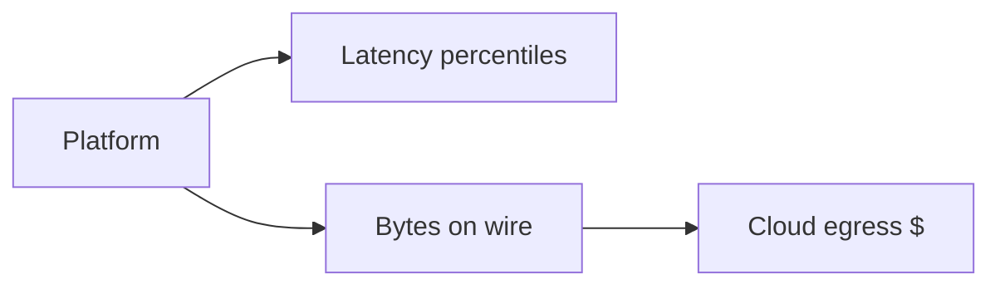

# Chapter 17: Performance Analysis and Benchmarking

Never trust a microsecond table without **CPU, library version, and percentile**—we publish our methodology before our winners.

**Figure 17.1 — Benchmark dimensions**



---

## 17.1 Performance Metrics for PQC

Evaluating post-quantum cryptographic algorithms requires a multidimensional analysis that goes far beyond simple "operations per second" measurements. The transition from classical to post-quantum cryptography changes the performance landscape in ways that affect system architecture, protocol design, and deployment decisions. Understanding these metrics — and their interactions — is essential for making informed choices about algorithm selection and deployment strategy.

### Computation Time

Computation time measures the CPU cycles or wall-clock time required for each cryptographic operation. For KEMs, this includes key generation, encapsulation, and decapsulation. For signatures, it includes key generation, signing, and verification. The relevance of each operation varies by use case:

- **Key generation** frequency depends on deployment model. TLS servers may generate ephemeral keys for every connection (high frequency) while certificate authorities generate keys rarely (low frequency). ML-KEM key generation is fast enough for per-connection use, while Classic McEliece's extremely slow key generation effectively mandates long-lived keys.
- **Encapsulation/signing** occurs at different rates depending on the application. A TLS server signs once per connection (certificate verify), while a code signing service may sign thousands of artifacts per minute.
- **Decapsulation/verification** is often the most performance-critical operation. Certificate chain validation requires multiple signature verifications per connection. Load balancers performing TLS termination must verify client certificates at scale.

Computation time must be measured at the appropriate level: raw cryptographic operations (best case, cache-warm), within protocol context (realistic), and under load (worst case, with cache contention and context switching).

### Communication Size

Post-quantum algorithms universally require larger keys, ciphertexts, and signatures than their classical counterparts. This size increase has cascading effects:

- **Network bandwidth consumption:** Directly impacts transmission time, especially on constrained links
- **Protocol fragmentation:** UDP-based protocols (DNS, QUIC initial packets, IKEv2) may exceed MTU limits, requiring fragmentation or protocol modifications
- **Storage requirements:** Certificate stores, key databases, and backup systems must accommodate larger objects
- **Memory bandwidth:** Copying larger structures through the memory hierarchy consumes more CPU cycles and cache capacity

The bandwidth metric is often more impactful than computation time for PQC deployment decisions, particularly for latency-sensitive applications.

### Memory Usage

Memory consumption during cryptographic operations includes:
- **Stack memory:** Temporary buffers for intermediate computations (NTT working space, polynomial buffers)
- **Heap memory:** Dynamically allocated structures for keys and context
- **Persistent storage:** Long-term key material that must remain in memory for the process lifetime
- **Code size:** The implementation binary itself (significant for Flash-constrained embedded devices)

For embedded systems with 64-256 KB of SRAM, memory usage often determines whether a PQC algorithm is feasible at all.

### Energy Consumption

Energy per operation is critical for battery-powered devices. It encompasses:
- **Dynamic energy:** Proportional to computation time × power consumption during active processing
- **Communication energy:** Proportional to bytes transmitted × energy per byte (often dominates for wireless devices)
- **Static/leakage energy:** Proportional to total elapsed time (significant for sleep-wake cycling)

An algorithm with fast computation but large communication may consume more total energy on a wireless device than a slower algorithm with smaller transmission sizes.

### Throughput and Latency

These metrics characterize system-level performance:
- **Throughput:** Maximum sustained operations per second, relevant for servers handling many concurrent connections
- **Latency:** End-to-end time experienced by a single operation, including queueing, computation, and network delay
- **Scalability:** How throughput changes with parallelism (cores, threads, hardware acceleration)

Throughput and latency often trade off: batching operations improves throughput but increases individual latency.

> **Author's note:** Report p50 **and** p99 for ML-DSA signing; means lie.


**Figure 17.2 — Measurement checklist**


## 17.2 KEM Performance Comparison

### Computational Performance (x86-64, AVX2)

The following measurements represent optimized implementations on modern x86-64 processors (Intel Core i7-11th gen or AMD Zen 3 class) with AVX2 acceleration enabled, compiled with Clang/GCC at -O3 optimization:

| Algorithm | Security Level | KeyGen (μs) | Encaps (μs) | Decaps (μs) | Total KE (μs) |
|-----------|---------------|------------|------------|------------|---------------|
| X25519 (ECDH) | ~128-bit | — | 48 | 48 | 96 |
| ECDH P-256 | 128-bit | — | 60 | 60 | 120 |
| RSA-2048 | 112-bit | 200,000 | 25 | 800 | 825 |
| RSA-4096 | 128-bit | 2,000,000 | 50 | 5,000 | 5,050 |
| ML-KEM-512 | 1 (128-bit) | 30 | 40 | 45 | 85 |
| ML-KEM-768 | 3 (192-bit) | 50 | 65 | 70 | 135 |
| ML-KEM-1024 | 5 (256-bit) | 75 | 95 | 100 | 195 |
| HQC-128 | 1 (128-bit) | 120 | 250 | 350 | 600 |
| HQC-192 | 3 (192-bit) | 250 | 550 | 750 | 1,300 |
| HQC-256 | 5 (256-bit) | 500 | 1,000 | 1,400 | 2,400 |
| Classic McEliece 348864 | 1 (128-bit) | 200,000 | 50 | 120 | 170 |
| Classic McEliece 6960119 | 5 (256-bit) | 1,500,000 | 200 | 400 | 600 |
| X25519 + ML-KEM-768 (hybrid) | 192-bit | 50 | 113 | 118 | 231 |
| P-256 + ML-KEM-768 (hybrid) | 192-bit | 60 | 125 | 130 | 255 |

**Key observations:**

ML-KEM is computationally competitive with — or faster than — most classical algorithms for key exchange. ML-KEM-768 achieves NIST security level 3 (192-bit equivalent) in roughly the same time as a single X25519 exchange (which provides only ~128-bit classical security). The NTT-based polynomial multiplication that underlies ML-KEM is extremely efficient on modern processors with SIMD support.

Classic McEliece has extremely fast encapsulation (50 μs) and decapsulation (120 μs) but catastrophically slow key generation (200,000 μs). This makes it suitable only for scenarios with long-lived keys, such as pre-distributed trust anchors or code signing root keys.

HQC, as the NIST fourth-round code-based KEM, is 5-10x slower than ML-KEM for equivalent security levels. Its main advantage is providing cryptographic diversity (code-based versus lattice-based) rather than performance superiority.

Hybrid schemes (classical + PQC) roughly double the computation time compared to either component alone, providing defense-in-depth at modest computational cost.

### Size Comparison

| Algorithm | Public Key | Secret Key | Ciphertext | Total Bandwidth (PK+CT) |
|-----------|-----------|-----------|------------|------------------------|
| X25519 | 32 B | 32 B | 32 B | 64 B |
| ECDH P-256 | 64 B | 32 B | 64 B | 128 B |
| RSA-2048 | 256 B | ~1,200 B | 256 B | 512 B |
| ML-KEM-512 | 800 B | 1,632 B | 768 B | 1,568 B |
| ML-KEM-768 | 1,184 B | 2,400 B | 1,088 B | 2,272 B |
| ML-KEM-1024 | 1,568 B | 3,168 B | 1,568 B | 3,136 B |
| HQC-128 | 2,249 B | 2,289 B | 4,497 B | 6,746 B |
| HQC-192 | 4,522 B | 4,562 B | 9,026 B | 13,548 B |
| HQC-256 | 7,245 B | 7,285 B | 14,469 B | 21,714 B |
| Classic McEliece 348864 | 261,120 B | 6,452 B | 128 B | 261,248 B |
| Classic McEliece 6960119 | 1,047,319 B | 13,908 B | 226 B | 1,047,545 B |

**Bandwidth analysis:**

ML-KEM's bandwidth overhead is 25-50x compared to X25519. While this sounds large in relative terms, the absolute numbers (2.2 KB for ML-KEM-768 versus 64 B for X25519) are negligible on modern networks where typical web pages are 2-5 MB. The bandwidth cost becomes relevant only in extremely constrained scenarios (satellite, LPWAN, BLE) or when multiplied by very high connection rates.

Classic McEliece's public key (261 KB at the lowest security level) is genuinely problematic. It exceeds typical TCP initial window sizes, requires multiple round trips for key distribution, and makes certificate-based authentication impractical. This relegates Classic McEliece to niche applications where keys can be pre-distributed.

HQC's communication sizes are 3-7x larger than ML-KEM at equivalent security levels, a significant disadvantage that combines with its slower computation to make it primarily a "backup" algorithm for cryptographic diversity rather than a primary choice.

### ARM Cortex-M4 Performance (STM32F4 @ 168 MHz)

Constrained device performance is critical for IoT deployment decisions:

| Algorithm | KeyGen (ms) | Encaps (ms) | Decaps (ms) | Stack (KB) |
|-----------|------------|------------|------------|-----------|
| ECDH P-256 (micro-ecc) | 92.0 | 92.0 | 92.0 | 2.0 |
| X25519 (ref) | — | 65.0 | 65.0 | 1.5 |
| ML-KEM-512 | 0.7 | 0.9 | 1.0 | 5.2 |
| ML-KEM-768 | 1.1 | 1.4 | 1.5 | 6.5 |
| ML-KEM-1024 | 1.6 | 2.0 | 2.2 | 8.0 |
| HQC-128 | 3.5 | 12.0 | 18.0 | 28.0 |
| Kyber-768 (pqm4) | 0.6 | 0.8 | 0.9 | 2.6 |

ML-KEM is dramatically faster than classical ECC on Cortex-M4. The primary ML-KEM operation (NTT over Z_3329) maps efficiently to 32-bit integer multiply-accumulate operations that the Cortex-M4 executes in a single cycle. Classical ECC requires multi-precision arithmetic over 256-bit integers, involving many sequential multiply-add operations.

The stack memory requirements (5-8 KB) are the binding constraint on the most memory-limited Cortex-M0/M0+ devices (which may have only 8-32 KB total SRAM), but are comfortable on the Cortex-M4 class devices (128-256 KB) that are the primary PQC IoT target.

### Performance Scaling with Security Level

Understanding how performance scales with increasing security requirements helps inform algorithm selection:

| ML-KEM Parameter | n | k | Relative KeyGen | Relative Encaps | Relative Decaps |
|-----------------|---|---|----------------|-----------------|-----------------|
| ML-KEM-512 | 256 | 2 | 1.0x | 1.0x | 1.0x |
| ML-KEM-768 | 256 | 3 | 1.7x | 1.6x | 1.6x |
| ML-KEM-1024 | 256 | 4 | 2.5x | 2.4x | 2.2x |

The scaling is sub-quadratic because the NTT cost (O(n log n)) is fixed — only the number of polynomial multiplications (proportional to k²) increases. Moving from Level 1 to Level 5 roughly doubles the cost, a much gentler scaling than RSA (where doubling the security level requires roughly 8x the computation due to the cube-law of modular exponentiation cost).

## 17.3 Signature Performance Comparison

### Computational Performance (x86-64, AVX2)

| Algorithm | Security Level | KeyGen (μs) | Sign (μs) | Verify (μs) | Sign Variance |
|-----------|---------------|------------|-----------|------------|--------------|
| Ed25519 | ~128-bit | 25 | 50 | 120 | None |
| ECDSA P-256 | 128-bit | 30 | 60 | 120 | Minimal |
| RSA-2048 | 112-bit | 200,000 | 1,000 | 30 | None |
| RSA-4096 | 128-bit | 2,000,000 | 5,000 | 100 | None |
| ML-DSA-44 | 2 (128-bit) | 150 | 700 | 200 | High (rejection) |
| ML-DSA-65 | 3 (192-bit) | 250 | 1,100 | 300 | High (rejection) |
| ML-DSA-87 | 5 (256-bit) | 400 | 1,500 | 450 | High (rejection) |
| SLH-DSA-128f | 1 (128-bit) | 1,000 | 5,000 | 800 | None |
| SLH-DSA-128s | 1 (128-bit) | 1,000 | 60,000 | 3,000 | None |
| SLH-DSA-192f | 3 (192-bit) | 2,500 | 12,000 | 1,500 | None |
| SLH-DSA-256f | 5 (256-bit) | 5,000 | 25,000 | 3,500 | None |
| SLH-DSA-256s | 5 (256-bit) | 5,000 | 300,000 | 10,000 | None |
| FN-DSA-512 | 1 (128-bit) | 10,000 | 5,000 | 500 | Moderate |
| FN-DSA-1024 | 5 (256-bit) | 30,000 | 12,000 | 1,200 | Moderate |

**ML-DSA signing variance:** Due to the rejection sampling loop, ML-DSA signing time varies between invocations. The expected number of loop iterations is approximately 4-7 (depending on the parameter set), but occasional signatures may require 15-20+ iterations. The timing distribution is geometric, with:
- Median signing time: ~700 μs (ML-DSA-44)
- 99th percentile: ~2,500 μs (ML-DSA-44)
- Worst observed (rare): ~5,000 μs (ML-DSA-44)

This variance must be considered for real-time systems with strict latency bounds.

**SLH-DSA's fast/small trade-off:** The "f" (fast) variants optimize for signing speed at the cost of larger signatures. The "s" (small) variants produce smaller signatures but are 10-12x slower to sign. Both variants have similar verification times (proportional to signature size). The choice depends on whether signing speed or bandwidth is the binding constraint.

**FN-DSA (FALCON) characteristics:** FN-DSA has slow key generation (Gaussian sampler for NTRU lattice) but produces the smallest PQC signatures (666 bytes at 128-bit security). Its signing speed is moderate, and verification is fast. The implementation complexity (floating-point Gaussian sampling that must be constant-time) is substantially higher than ML-DSA.

### Size Comparison

| Algorithm | Public Key | Secret Key | Signature | PK + Sig | Relative to Ed25519 |
|-----------|-----------|-----------|-----------|----------|-------------------|
| Ed25519 | 32 B | 64 B | 64 B | 96 B | 1.0x |
| ECDSA P-256 | 64 B | 32 B | 64 B | 128 B | 1.3x |
| RSA-2048 | 256 B | ~1,200 B | 256 B | 512 B | 5.3x |
| RSA-4096 | 512 B | ~2,400 B | 512 B | 1,024 B | 10.7x |
| ML-DSA-44 | 1,312 B | 2,560 B | 2,420 B | 3,732 B | 38.9x |
| ML-DSA-65 | 1,952 B | 4,032 B | 3,309 B | 5,261 B | 54.8x |
| ML-DSA-87 | 2,592 B | 4,896 B | 4,627 B | 7,219 B | 75.2x |
| SLH-DSA-128f | 32 B | 64 B | 17,088 B | 17,120 B | 178.3x |
| SLH-DSA-128s | 32 B | 64 B | 7,856 B | 7,888 B | 82.2x |
| SLH-DSA-192f | 48 B | 96 B | 35,664 B | 35,712 B | 372.0x |
| SLH-DSA-256f | 64 B | 128 B | 49,856 B | 49,920 B | 520.0x |
| SLH-DSA-256s | 64 B | 128 B | 29,792 B | 29,856 B | 311.0x |
| FN-DSA-512 | 897 B | 1,281 B | 666 B | 1,563 B | 16.3x |
| FN-DSA-1024 | 1,793 B | 2,305 B | 1,280 B | 3,073 B | 32.0x |

**Size trade-offs by algorithm family:**

- **ML-DSA:** Balanced sizes with moderate keys and moderate signatures. Best general-purpose choice.
- **SLH-DSA:** Tiny keys (32-64 bytes) but enormous signatures (8-50 KB). Ideal for applications where public keys are distributed widely but signatures are verified rarely (firmware signing, root CA certificates).
- **FN-DSA:** Smallest combined PK+Sig among PQC options (1,563 bytes). Best for bandwidth-constrained applications requiring frequent authentication, but implementation complexity is high.

### ARM Cortex-M4 Signature Performance

| Algorithm | KeyGen (ms) | Sign (ms) | Verify (ms) | Stack (KB) |
|-----------|------------|-----------|------------|-----------|
| Ed25519 | 22.0 | 22.0 | 53.0 | 1.5 |
| ML-DSA-44 | 5.0 | 22.0 | 6.5 | 32 |
| ML-DSA-65 | 8.5 | 40.0 | 10.0 | 48 |
| ML-DSA-87 | 14.0 | 55.0 | 16.0 | 60 |
| SLH-DSA-128f | 35.0 | 800.0 | 45.0 | 5 |
| SLH-DSA-128s | 35.0 | 8,000.0 | 200.0 | 5 |

ML-DSA-44 verification (6.5 ms) is actually faster than Ed25519 verification (53 ms) on Cortex-M4 due to the efficiency of NTT-based computation on 32-bit processors. However, ML-DSA signing is comparable in speed and requires substantially more stack memory (32 KB versus 1.5 KB), which is the true constraint on very small microcontrollers.

## 17.4 Protocol-Level Performance

### TLS 1.3 Handshake

The TLS handshake is the most important real-world performance benchmark for PQC because it affects every HTTPS connection. The analysis must consider both computation and communication:

**Classical TLS 1.3 (X25519 + Ed25519/ECDSA certificates):**
- ClientHello key share: 32 B (X25519 public value)
- ServerHello key share: 32 B (X25519 public value)
- Server certificate chain (3 certs, ECDSA): ~3,000 B
- CertificateVerify (ECDSA): 64 B
- Total handshake data: ~3,200 B additional beyond headers
- Computation (server): ~230 μs (1 ECDH + 1 ECDSA sign + cert verify)
- Computation (client): ~350 μs (1 ECDH + 3 ECDSA verify + 1 key derive)

**Hybrid TLS 1.3 (X25519 + ML-KEM-768, ECDSA + ML-DSA-65 certificates):**
- ClientHello key share: 32 + 1,184 = 1,216 B
- ServerHello key share: 32 + 1,088 = 1,120 B
- Server certificate chain (3 hybrid certs): ~18,000 B
  - Each cert: ~1,952 (ML-DSA PK) + ~64 (ECDSA PK) + ~3,309 (ML-DSA sig) + ~64 (ECDSA sig) + overhead ≈ 5,800 B
- CertificateVerify (ML-DSA-65 + ECDSA): 3,309 + 64 = 3,373 B
- Total handshake data: ~23,700 B
- Computation (server): ~1,600 μs (1 hybrid KE + 1 ML-DSA sign + 1 ECDSA sign + cert verify)
- Computation (client): ~1,800 μs (1 hybrid KE + 3 ML-DSA verify + 3 ECDSA verify)

**PQC-only TLS 1.3 (ML-KEM-768, ML-DSA-65 certificates):**
- ClientHello key share: 1,184 B
- ServerHello key share: 1,088 B
- Server certificate chain (3 ML-DSA-65 certs): ~15,800 B
- CertificateVerify (ML-DSA-65): 3,309 B
- Total handshake data: ~21,400 B
- Computation (server): ~1,400 μs
- Computation (client): ~1,500 μs

**Real-world latency impact:**

The critical metric is user-perceived latency. On a typical broadband connection (50 Mbps):
- Classical handshake: 3.2 KB / 50 Mbps = 0.5 ms transmission + ~0.3 ms computation ≈ 0.8 ms
- Hybrid handshake: 23.7 KB / 50 Mbps = 3.8 ms transmission + ~1.6 ms computation ≈ 5.4 ms
- Additional latency: ~4.6 ms (dominated by bandwidth)

On a mobile 4G connection (10 Mbps, 50 ms RTT):
- Classical: Fits in initial congestion window, 1 RTT = 50 ms
- Hybrid: May exceed initial congestion window (typically 14-15 KB), requiring 2 RTTs = 100 ms
- Additional latency: ~50 ms (additional RTT)

On a satellite connection (2 Mbps, 600 ms RTT):
- Classical: 1 RTT = 600 ms
- Hybrid: 23.7 KB / 2 Mbps = 95 ms transmission, still 1 RTT if within window
- If window exceeded: 2 RTTs = 1,200 ms additional latency

**Certificate chain compression mitigations:**

The largest contributor to PQC handshake size is the certificate chain. Mitigations include:
- **Certificate compression (RFC 8879):** Brotli/zlib compression of certificate messages reduces chain size by 30-50%
- **Cached certificates:** Subsequent connections to the same server can omit the chain entirely
- **Intermediate CA suppression:** Only send end-entity certificate; client fetches chain via AIA extension
- **Merkle tree certificates:** Proposed scheme where certificates reference a transparency log, reducing per-certificate size

### SSH Connection

**Classical SSH (Ed25519 host/user keys, X25519 KEX):**
- Key exchange: 32 + 32 = 64 B
- Host authentication: 32 (PK) + 64 (sig) = 96 B
- User authentication: 32 (PK) + 64 (sig) = 96 B
- Total overhead: ~256 B
- Connection time: Dominated by RTT (typically 1-2 RTTs)

**Post-Quantum SSH (ML-KEM-768 + X25519, ML-DSA-65 host/user keys):**
- Key exchange: 1,184 + 1,088 + 32 + 32 = 2,336 B
- Host authentication: 1,952 (PK) + 3,309 (sig) = 5,261 B
- User authentication: 1,952 (PK) + 3,309 (sig) = 5,261 B
- Total overhead: ~12,858 B
- Connection time: Still dominated by RTT on modern networks

**Impact assessment:** For interactive SSH sessions on typical networks (>1 Mbps), the 12 KB additional overhead adds <100 ms to the initial connection. After the handshake, the data channel performance is identical (symmetric encryption is unchanged). The main concern is serial/low-bandwidth connections (embedded device management over RS-232/UART) where 12 KB at 115,200 baud takes ~1 second.

### IPsec/IKEv2

IPsec presents a unique challenge due to UDP-based transport with strict fragmentation requirements:

**Classical IKE_SA_INIT (DH + ECDSA):**
- KE payload: ~256 B (DH group 14) or ~64 B (ECDH P-256)
- Total IKE_SA_INIT: ~500-800 B (fits in single UDP datagram)

**Hybrid IKE_SA_INIT (ML-KEM-768 + ECDH, ML-DSA-65):**
- KE payload: 1,184 (ML-KEM) + 64 (ECDH) = 1,248 B
- AUTH payload: 3,309 B (ML-DSA-65 signature)
- CERT payload: ~5,261 B (ML-DSA-65 certificate)
- Total: ~10,000+ B

This exceeds the typical Ethernet MTU (1,500 B) and even the IPv6 minimum MTU (1,280 B). Solutions include:
- **IKE fragmentation (RFC 7383):** Fragments IKE messages before UDP encapsulation
- **TCP transport for IKE (RFC 8229):** Eliminates UDP size constraints
- **Multiple exchanges:** Split key exchange across IKE_SA_INIT and CREATE_CHILD_SA

The fragmentation overhead adds 1-2 additional round trips to VPN establishment, increasing connection time from ~100 ms to ~300 ms on typical networks.

### DNS and DNSSEC

DNSSEC presents one of the most challenging deployment scenarios for PQC signatures:

**Classical DNSSEC (ECDSA P-256):**
- DNSKEY record: ~100 B
- RRSIG record: ~100 B
- Typical signed response: ~500 B (fits in standard UDP datagram)

**Post-Quantum DNSSEC (ML-DSA-44):**
- DNSKEY record: ~1,400 B (1,312 B public key + overhead)
- RRSIG record: ~2,500 B (2,420 B signature + overhead)
- Typical signed response: ~4,000 B (requires TCP fallback or EDNS0)

**Impact:** DNS traditionally uses 512 B UDP datagrams (or 4096 B with EDNS0). PQC DNSSEC responses routinely exceed even the EDNS0 buffer size, requiring TCP fallback for many queries. This significantly increases DNS resolution latency (from 1 RTT for UDP to 3+ RTTs for TCP) and increases server load. This remains an active research problem with proposals for signature compression, key caching, and zone-level optimizations.

## 17.5 Throughput Benchmarks

### Server-Side Signature Operations

For high-traffic web servers performing TLS termination, the signing throughput determines maximum new-connection rate:

| Algorithm | Signatures/sec (1 core) | Verifications/sec (1 core) | Sig+Verify/sec |
|-----------|------------------------|---------------------------|----------------|
| ECDSA P-256 | ~15,000 | ~8,000 | ~5,200 |
| Ed25519 | ~20,000 | ~8,000 | ~5,700 |
| RSA-2048 | ~1,000 | ~33,000 | ~970 |
| ML-DSA-44 | ~1,400 | ~5,000 | ~1,100 |
| ML-DSA-65 | ~900 | ~3,300 | ~700 |
| ML-DSA-87 | ~670 | ~2,200 | ~515 |
| SLH-DSA-128f | ~200 | ~1,250 | ~172 |
| SLH-DSA-128s | ~17 | ~333 | ~16 |
| FN-DSA-512 | ~200 | ~2,000 | ~182 |

**Server capacity analysis:**

A modern TLS-terminating server with 32 cores can handle (assuming ML-DSA-65):
- Signing capacity: 32 × 900 = 28,800 new connections/sec
- For comparison, ECDSA: 32 × 15,000 = 480,000 new connections/sec

For context, a major website serving 100,000 new connections per second would need:
- ECDSA: 7 cores dedicated to signing
- ML-DSA-65: 112 cores (or 4 servers) dedicated to signing
- SLH-DSA-128f: 500 cores dedicated to signing

ML-DSA's throughput reduction (roughly 16x versus ECDSA) is significant for the largest web properties but manageable for the vast majority of deployments where connection rates are far below these thresholds. A single modern server core handling 900 ML-DSA-65 signatures per second supports 900 new TLS connections per second — more than sufficient for most web applications.

### Key Exchange Throughput

| Algorithm | Full Operations/sec (1 core) | Notes |
|-----------|------------------------------|-------|
| X25519 | ~20,000 | Both sides |
| ECDH P-256 | ~8,000 | Both sides |
| ML-KEM-768 (Encaps) | ~15,000 | Client side |
| ML-KEM-768 (Decaps) | ~14,000 | Server side |
| Hybrid X25519+ML-KEM-768 | ~8,500 | Both operations |
| HQC-128 | ~4,000 | Encaps |
| HQC-128 | ~2,800 | Decaps |

ML-KEM key exchange throughput is excellent — a server performing ML-KEM-768 decapsulation can handle 14,000 new connections per second per core. Combined with X25519 in hybrid mode, this drops to ~8,500/sec, which is still comparable to classical ECDH P-256 alone.

### Batch Processing Performance

Some applications process cryptographic operations in batches (certificate chain validation, bulk signature verification in blockchain contexts, batch key generation for IoT provisioning):

| Operation | Individual (μs) | Batched ×100 (μs/op) | Batch Speedup |
|-----------|-----------------|---------------------|---------------|
| ML-DSA-65 Verify | 300 | 250 | 1.2x |
| SLH-DSA-128f Verify | 800 | 520 | 1.5x |
| ML-KEM-768 KeyGen | 50 | 35 | 1.4x |
| ML-KEM-768 Encaps | 65 | 48 | 1.4x |

Batch processing benefits come from:
- Amortized hash state initialization across multiple operations
- Better CPU cache utilization (data stays warm)
- Parallel hash computation using SIMD (4-way SHAKE with AVX2)
- Reduced function call overhead

For SLH-DSA, where the dominant cost is hashing, batching with 4-way parallel SHAKE (using AVX2) provides meaningful speedups by processing four hash evaluations simultaneously.

## 17.6 Memory Usage

### Stack and Heap Requirements

Detailed memory profiling for optimized implementations:

| Algorithm | Operation | Peak Stack | Heap Alloc | Code Size (text) |
|-----------|-----------|-----------|-----------|-----------------|
| ML-KEM-512 | KeyGen | 4.8 KB | 0 | 12 KB |
| ML-KEM-512 | Encaps | 5.0 KB | 0 | 12 KB |
| ML-KEM-512 | Decaps | 5.5 KB | 0 | 12 KB |
| ML-KEM-768 | KeyGen | 6.2 KB | 0 | 14 KB |
| ML-KEM-768 | Encaps | 6.5 KB | 0 | 14 KB |
| ML-KEM-768 | Decaps | 7.0 KB | 0 | 14 KB |
| ML-KEM-1024 | KeyGen | 8.0 KB | 0 | 16 KB |
| ML-KEM-1024 | Encaps | 8.2 KB | 0 | 16 KB |
| ML-KEM-1024 | Decaps | 8.8 KB | 0 | 16 KB |
| ML-DSA-44 | KeyGen | 10 KB | 0 | 28 KB |
| ML-DSA-44 | Sign | 28 KB | 0 | 28 KB |
| ML-DSA-44 | Verify | 12 KB | 0 | 28 KB |
| ML-DSA-65 | KeyGen | 12 KB | 0 | 32 KB |
| ML-DSA-65 | Sign | 32 KB | 0 | 32 KB |
| ML-DSA-65 | Verify | 15 KB | 0 | 32 KB |
| ML-DSA-87 | KeyGen | 15 KB | 0 | 36 KB |
| ML-DSA-87 | Sign | 42 KB | 0 | 36 KB |
| ML-DSA-87 | Verify | 18 KB | 0 | 36 KB |
| SLH-DSA-128f | KeyGen | 4 KB | 0 | 20 KB |
| SLH-DSA-128f | Sign | 8 KB | 0 | 20 KB |
| SLH-DSA-128f | Verify | 4 KB | 0 | 20 KB |
| SLH-DSA-256s | Sign | 12 KB | 0 | 24 KB |

**Memory optimization strategies for constrained devices:**

The peak memory for ML-DSA-65 signing (32 KB) is challenging for devices with limited SRAM. Optimization techniques include:

- **Incremental matrix expansion:** Instead of storing the full matrix A (k×l polynomials = 5×4×512 bytes = 10 KB for ML-DSA-65), regenerate each row from the seed as needed during matrix-vector multiplication
- **In-place NTT:** Perform the transform without allocating a separate output buffer
- **Polynomial reuse:** Free polynomial buffers as soon as they are no longer needed within the signing algorithm
- **Split computation:** Perform the signing algorithm in phases, clearing intermediate state between phases to reduce peak memory

With aggressive optimization, ML-DSA-65 signing can be achieved in approximately 20 KB stack on Cortex-M4, at the cost of some computation overhead from regenerating values.

### Key Storage at Scale

For systems managing large numbers of keys (PKI infrastructure, key management systems, certificate stores):

| Scenario | Classical (Ed25519) | PQC (ML-DSA-65) | Growth Factor |
|----------|-------------------|-----------------|---------------|
| Single key pair | 96 B | 5,984 B | 62x |
| 1,000 key pairs | 94 KB | 5.7 MB | 62x |
| 10,000 key pairs | 938 KB | 57 MB | 62x |
| 100,000 key pairs | 9.2 MB | 570 MB | 62x |
| Certificate store (1,000 CAs) | 64 KB (PK+cert) | 3.8 MB | 59x |
| Browser root store (150 CAs) | 10 KB | 570 KB | 57x |
| S/MIME address book (5,000) | 320 KB | 19 MB | 59x |

Storage is not a binding constraint on servers and desktops (where terabytes are available), but matters for:
- Smart cards with 128-512 KB EEPROM
- Embedded devices with limited Flash
- Mobile devices managing large certificate stores
- HSMs with fixed secure storage capacity

**Seed-based key storage:** ML-KEM and ML-DSA support deterministic key generation from a 32-64 byte seed. Storing only the seed reduces long-term storage to ~64 bytes per key pair, with keys re-expanded on demand. This trades computation for storage — re-expansion takes ~50-250 μs depending on algorithm and platform.

## 17.7 Energy Consumption

### Embedded Device Energy Analysis

Energy measurements on ARM Cortex-M4 (STM32F407, 3.3V, 168 MHz):

| Algorithm | Operation | Cycles | Energy (μJ) | Relative to ECC |
|-----------|-----------|--------|-------------|-----------------|
| ECDH P-256 | Full exchange | 15.4M | 850 | 1.0x |
| X25519 | Full exchange | 10.8M | 600 | 0.7x |
| ML-KEM-512 | Full exchange | 5.4M | 300 | 0.35x |
| ML-KEM-768 | Full exchange | 7.6M | 420 | 0.49x |
| ML-KEM-1024 | Full exchange | 10.5M | 580 | 0.68x |
| ECDSA P-256 | Sign | 7.6M | 420 | 1.0x |
| ECDSA P-256 | Verify | 15.2M | 840 | 2.0x |
| ML-DSA-44 | Sign (avg) | 50M | 2,800 | 6.7x |
| ML-DSA-44 | Verify | 10M | 560 | 1.3x |
| ML-DSA-65 | Sign (avg) | 80M | 4,500 | 10.7x |
| ML-DSA-65 | Verify | 16M | 900 | 2.1x |
| SLH-DSA-128f | Sign | 135M | 7,500 | 17.9x |
| SLH-DSA-128s | Sign | 1,350M | 75,000 | 178.6x |
| SLH-DSA-128f | Verify | 7.5M | 420 | 1.0x |

**Key insight:** ML-KEM is more energy-efficient than classical ECDH because the NTT-based operations require fewer CPU cycles. ML-DSA signing is more expensive, but ML-DSA verification is comparable to ECDSA. For devices that primarily verify (sensor nodes checking firmware signatures, IoT devices validating server certificates), the energy overhead of PQC is minimal.

### Communication Energy

For wireless devices, the energy cost of transmitting data often exceeds the computation cost:

| Radio Technology | Energy per byte (nJ/B) | ML-KEM-768 overhead (2.2 KB) | ML-DSA-65 sig (3.3 KB) |
|-----------------|----------------------|------------------------------|------------------------|
| WiFi (802.11n) | 10 | 22 μJ | 33 μJ |
| BLE 5.0 | 100 | 220 μJ | 330 μJ |
| LoRa (SF7) | 5,000 | 11,000 μJ | 16,500 μJ |
| LoRa (SF12) | 50,000 | 110,000 μJ | 165,000 μJ |
| LTE Cat-M1 | 50 | 110 μJ | 165 μJ |
| NB-IoT | 200 | 440 μJ | 660 μJ |

For LoRa devices at high spreading factors, the communication energy of a single ML-DSA signature (165 mJ) is comparable to the entire energy budget for a day of sensor readings on a coin-cell battery. In such environments, minimizing communication size is far more important than minimizing computation.

### Total Energy Budget Analysis

For a battery-powered IoT sensor (CR2032 coin cell, ~2,400 J total capacity) performing daily authentication:

| Scenario | Per-authentication energy | Battery life |
|----------|--------------------------|-------------|
| ECDH + ECDSA (WiFi) | 850 + 420 + 55 = 1,325 μJ | 4.9 years |
| ML-KEM-768 + ML-DSA-65 (WiFi) | 420 + 4,500 + 253 = 5,173 μJ | 1.3 years |
| ECDH + ECDSA (LoRa SF12) | 850 + 420 + 25,600 = 26,870 μJ | 245 days |
| ML-KEM-768 + ML-DSA-65 (LoRa SF12) | 420 + 4,500 + 275,000 = 279,920 μJ | 24 days |

The LoRa scenario illustrates why communication-dominant environments require different PQC strategies: pre-shared keys, asymmetric authentication frequency (authenticate rarely, use symmetric crypto for ongoing communication), or more compact signature schemes (FN-DSA at 666 bytes).

## 17.8 Bandwidth-Constrained Scenarios

### Satellite Communications

**LEO (Low Earth Orbit) satellite constellations (Starlink, OneWeb):**
- Typical user terminal bandwidth: 50-200 Mbps downlink, 10-50 Mbps uplink
- Latency: 20-40 ms
- PQC TLS handshake overhead (23 KB): Adds <1 ms at 200 Mbps, negligible
- Verdict: No meaningful PQC performance concern for LEO broadband

**GEO (Geostationary) satellite links:**
- Bandwidth: 50 kbps - 50 Mbps (highly variable)
- Latency: 550-600 ms RTT
- At 512 kbps: Hybrid TLS handshake (23 KB) requires 360 ms of link time
- Combined with 600 ms RTT: First request takes >1.5 seconds
- Verdict: Acceptable for bulk data transfer; problematic for interactive applications requiring frequent new connections

**Deep space communications:**
- Bandwidth: 1 kbps - 6 Mbps (Mars: ~500 kbps to 6 Mbps depending on distance)
- Latency: 4-24 minutes one-way (Mars)
- PQC handshake: 23 KB at 500 kbps = 370 ms (negligible versus 8+ minute RTT)
- Verdict: PQC bandwidth overhead is irrelevant compared to propagation delay; Delay-Tolerant Networking (DTN) protocols dominate design decisions

### LoRaWAN / LPWAN

LoRaWAN represents the extreme of bandwidth-constrained PQC deployment:

- **Data rates:** 0.3 kbps (SF12) to 50 kbps (SF7, 500 kHz bandwidth)
- **Maximum payload per frame:** 51 bytes (SF12, DR0) to 222 bytes (SF7, DR5)
- **Duty cycle limitations:** 0.1-1% in most regions (EU 868 MHz)
- **Daily uplink budget:** Often limited to ~10 frames per day under duty cycle

**ML-KEM-768 key exchange over LoRaWAN:**
- Public key: 1,184 B → requires 6-24 frames depending on data rate
- Ciphertext: 1,088 B → requires 5-22 frames
- Total: 11-46 frames just for key exchange
- Time at SF12 with 1% duty cycle: ~11 frames × 1.5 s airtime × 100 (duty cycle) = 27.5 minutes

**Practical approaches for LPWAN:**
1. **Pre-shared symmetric keys:** Avoid PQC key exchange entirely; provision keys at manufacturing
2. **Asymmetric frequency:** Perform PQC key exchange once per device provisioning (via higher-bandwidth channel), use derived symmetric keys for all LoRaWAN communication
3. **Lightweight PQC research:** FrodoKEM-640 (smaller parameters with larger matrices) actually has larger keys; no current PQC KEM fits comfortably in LoRaWAN constraints
4. **Compressed key transport:** Pre-distribute public keys out of band; only transport the 1,088 B ciphertext (5-22 frames), which is the minimum for PQ key exchange

### Bluetooth Low Energy (BLE)

BLE's characteristics present moderate challenges:

- **PHY data rate:** 1 Mbps (BLE 4.x), 2 Mbps (BLE 5.0), 125/500 kbps (coded PHY)
- **Maximum ATT MTU:** 517 bytes (negotiated; default 23 bytes in BLE 4.0)
- **L2CAP LE Credit-Based Flow Control:** Allows larger logical payloads via segmentation
- **Connection interval:** 7.5 ms - 4 s (determines throughput)

**ML-KEM-768 key exchange over BLE (2 Mbps PHY, 247 B ATT MTU):**
- Public key (1,184 B): 5 ATT packets × 7.5 ms = 37.5 ms
- Ciphertext (1,088 B): 5 ATT packets × 7.5 ms = 37.5 ms
- Total key exchange time: ~75 ms
- Classical ECDH equivalent: 1 packet each direction = 15 ms
- Additional latency: ~60 ms

**ML-DSA-65 authentication over BLE:**
- Signature (3,309 B): 14 ATT packets × 7.5 ms = 105 ms
- Public key (1,952 B): 8 ATT packets × 7.5 ms = 60 ms
- Total authentication: ~165 ms
- Classical Ed25519 equivalent: 1 packet = 7.5 ms
- Additional latency: ~160 ms

**Verdict:** The ~200 ms additional pairing/authentication time is noticeable but acceptable for most BLE applications (device pairing, secure connections). For BLE applications requiring frequent re-authentication (e.g., repeated challenge-response for proximity verification), the overhead may require protocol redesign or use of pre-established symmetric keys after initial PQC authentication.

### Constrained Application Protocol (CoAP) over UDP

IoT devices using CoAP with DTLS face similar fragmentation challenges as IKEv2:

- **CoAP over DTLS 1.3:** Handshake messages must fit in UDP datagrams
- **6LoWPAN MTU:** 127 bytes at the link layer (IEEE 802.15.4)
- **IPv6 minimum MTU:** 1280 bytes (after 6LoWPAN header compression)
- **Practical payload:** ~100-1,000 bytes depending on network layer

DTLS handshake fragmentation is handled at the DTLS layer (built-in support), but each fragment requires a separate UDP datagram and round trip for acknowledgment, multiplying the handshake latency by the number of fragments.

## 17.9 Benchmarking Methodology

### Correct Benchmarking Practices

Accurate PQC benchmarking requires careful methodology to produce meaningful, reproducible results:

**1. CPU frequency stabilization:**
```bash
# Disable frequency scaling for consistent measurements
echo performance | sudo tee /sys/devices/system/cpu/cpu*/cpufreq/scaling_governor
# Disable turbo boost (Intel)
echo 1 | sudo tee /sys/devices/system/cpu/intel_pstate/no_turbo
# Disable boost (AMD)
echo 0 | sudo tee /sys/devices/system/cpu/cpufreq/boost
```

**2. Process isolation:**
```bash
# Pin benchmark to specific CPU core, isolated from scheduler
taskset -c 0 ./benchmark
# Or better: use CPU isolation via kernel parameter
# GRUB: isolcpus=0,1 nohz_full=0,1
```

**3. Warm-up and statistical rigor:**
```c
// Warm up: run algorithm 1000 times before measuring
for (int i = 0; i < 1000; i++) {
    ml_kem_keygen(pk, sk);
}

// Measurement: collect 10,000 samples
uint64_t cycles[10000];
for (int i = 0; i < 10000; i++) {
    uint64_t start = rdtsc();
    ml_kem_keygen(pk, sk);
    uint64_t end = rdtsc();
    cycles[i] = end - start;
}

// Report percentiles, not just mean
qsort(cycles, 10000, sizeof(uint64_t), cmp_u64);
printf("Median: %lu cycles\n", cycles[5000]);
printf("P1:     %lu cycles\n", cycles[100]);
printf("P99:    %lu cycles\n", cycles[9900]);
printf("Min:    %lu cycles\n", cycles[0]);
printf("Max:    %lu cycles\n", cycles[9999]);
```

**4. Accounting for ML-DSA signing variance:**

ML-DSA's rejection sampling creates a non-trivial timing distribution. Report the full distribution rather than just the mean:

| Statistic | ML-DSA-44 | ML-DSA-65 | ML-DSA-87 |
|-----------|-----------|-----------|-----------|
| Minimum (1 iteration) | 350 μs | 550 μs | 750 μs |
| Median (~4 iterations) | 700 μs | 1,100 μs | 1,500 μs |
| Mean (~4.3 iterations) | 740 μs | 1,150 μs | 1,570 μs |
| 95th percentile | 1,500 μs | 2,400 μs | 3,300 μs |
| 99th percentile | 2,500 μs | 4,000 μs | 5,500 μs |
| 99.9th percentile | 4,000 μs | 6,500 μs | 9,000 μs |

For real-time systems, the tail latency (99th or 99.9th percentile) is more relevant than the median.

**5. Platform documentation requirements:**

Every benchmark result should be accompanied by:
- CPU model and microarchitecture (e.g., "Intel Core i7-1165G7, Tiger Lake")
- Clock frequency (base and actual during measurement)
- Compiler and version (e.g., "Clang 17.0.1")
- Optimization flags (e.g., "-O3 -mavx2 -mbmi2")
- OS and kernel version
- SIMD level used (AVX2, AVX-512, NEON, etc.)
- Library version and specific implementation variant
- Measurement methodology (cycles vs. wall-clock, number of iterations, percentile reporting)

### Common Benchmarking Pitfalls

**Pitfall 1: Measuring debug builds.** Debug builds (-O0) can be 10-50x slower than optimized builds (-O3) due to lack of inlining, register allocation, and instruction scheduling. PQC benchmarks must always use production optimization levels.

**Pitfall 2: Including allocation overhead.** Memory allocation (malloc/free) can add thousands of cycles of variance. Measure the cryptographic operation separately from memory management:

```c
// BAD: allocation included in measurement
uint64_t start = rdtsc();
uint8_t *pk = malloc(PK_BYTES);  // This adds variable overhead
ml_kem_keygen(pk, sk);
free(pk);
uint64_t end = rdtsc();

// GOOD: pre-allocate, measure only crypto
uint8_t pk[PK_BYTES], sk[SK_BYTES];
uint64_t start = rdtsc();
ml_kem_keygen(pk, sk);
uint64_t end = rdtsc();
```

**Pitfall 3: Comparing different security levels.** ML-KEM-768 (Level 3) should not be compared to X25519 (Level 1) without noting the security level difference. Fair comparisons match security levels: ML-KEM-512 vs. X25519, ML-KEM-768 vs. P-384.

**Pitfall 4: Ignoring system-level overhead.** Raw cryptographic operation benchmarks don't capture memory allocation, serialization/deserialization, context switching under load, or cache contention from other processes. Protocol-level benchmarks provide more realistic performance expectations.

**Pitfall 5: DVFS (Dynamic Voltage and Frequency Scaling).** Modern processors dynamically adjust frequency based on thermal state and power budget. A benchmark that starts at high frequency may throttle partway through, producing inconsistent results. Always disable frequency scaling or wait for thermal steady-state.

**Pitfall 6: Compiler-eliminated operations.** If the benchmark doesn't use the output of a cryptographic operation, the compiler may optimize it away entirely. Use `volatile` output or inline assembly barriers to ensure the operation actually executes:

```c
// Prevent dead-code elimination
static void escape(void *p) {
    __asm__ __volatile__("" : : "g"(p) : "memory");
}
```

### SUPERCOP Benchmarking Framework

SUPERCOP (System for Unified Performance Evaluation Related to Cryptographic Operations and Primitives) is the standard framework for cryptographic benchmarking maintained by the ECRYPT community:

**Features:**
- Standardized measurement methodology (median of many iterations, cycle-accurate)
- Automatic compiler flag exploration (tests many optimization flag combinations)
- Cross-platform support (x86-64, ARM, MIPS, RISC-V, and others)
- Historical database enabling performance comparison across implementations and platforms
- Automated testing of correctness (KATs) alongside performance measurement
- Community-maintained, open-source

**Integration with PQC:**
- All NIST PQC submissions include SUPERCOP-compatible implementations
- Results are publicly available at bench.cr.yp.to
- Enables fair comparison across algorithms using identical measurement infrastructure
- Tracks performance improvements across implementation versions

**Limitations:**
- Measures only raw cryptographic operations (no protocol-level context)
- Single-threaded measurements only (no parallelism benchmarking)
- Limited embedded platform support (primarily desktop/server targets)
- Results can be platform-specific and may not generalize

### PQC-Specific Benchmarking Considerations

**Amortized vs. individual cost:** Some operations (like NTT precomputation) have high one-time cost but amortize across many subsequent operations. Report both cold-start and warm-start times.

**Constant-time overhead:** Report the performance cost of constant-time implementation relative to a variable-time implementation. This helps implementers understand the security vs. performance trade-off:

| Algorithm | Variable-time (μs) | Constant-time (μs) | CT Overhead |
|-----------|--------------------|--------------------|-------------|
| ML-KEM-768 Decaps | 55 | 70 | 1.27x |
| ML-DSA-65 Sign | 900 | 1,100 | 1.22x |
| SLH-DSA-128f Sign | 4,200 | 5,000 | 1.19x |

The constant-time overhead for PQC is typically 15-30%, substantially less than for classical ECC (where constant-time scalar multiplication can be 2-3x slower than variable-time).

## 17.10 Performance Optimization Techniques

### NTT Optimization

The Number Theoretic Transform dominates ML-KEM and ML-DSA computation time (typically 60-80% of total). Optimizing the NTT is the single most impactful performance improvement:

**Merged NTT layers:** A standard radix-2 NTT for n = 256 has 8 stages. Each stage reads and writes all 256 coefficients, creating 16 full passes through memory. Merging adjacent stages reduces memory traffic:

```c
// Standard: 8 separate stages, 8 full memory passes
for (int stage = 0; stage < 8; stage++) {
    for (int i = 0; i < 128; i++) {
        butterfly(&poly[pair_a[stage][i]], &poly[pair_b[stage][i]],
                  twiddle[stage][i]);
    }
}

// Merged: Process 4 butterflies across 2 stages before writing back
// Reduces memory traffic by keeping intermediate values in registers
for (int block = 0; block < 64; block++) {
    int16_t a = poly[4*block + 0];
    int16_t b = poly[4*block + 1];
    int16_t c = poly[4*block + 2];
    int16_t d = poly[4*block + 3];
    
    // Stage 1 butterflies
    butterfly_pair(&a, &b, twiddle_1);
    butterfly_pair(&c, &d, twiddle_2);
    
    // Stage 2 butterflies (reusing register values)
    butterfly_pair(&a, &c, twiddle_3);
    butterfly_pair(&b, &d, twiddle_4);
    
    poly[4*block + 0] = a;
    poly[4*block + 1] = b;
    poly[4*block + 2] = c;
    poly[4*block + 3] = d;
}
```

**Montgomery multiplication for NTT:** Instead of Barrett reduction (which requires a multiply-high operation), Montgomery form allows modular multiplication using only standard multiply and shift:

For ML-KEM with q = 3329 and R = 2^16:
- Montgomery constant: q_inv = -q^(-1) mod R = 62209
- Conversion to Montgomery form: a_mont = a * R mod q
- Montgomery reduction of product a*b: reduces a*b*R^(-1) mod q using only multiply-low and multiply-high

The Montgomery approach eliminates the conditional subtraction entirely, providing both constant-time execution and higher throughput.

**Vectorized NTT with AVX2:** Processing 16 coefficients simultaneously using 256-bit SIMD:

```c
// AVX2 NTT butterfly: 16 parallel butterflies
static inline void butterfly_avx2(__m256i *a, __m256i *b, __m256i zeta) {
    __m256i t = montgomery_mul_avx2(*b, zeta);
    *b = _mm256_sub_epi16(*a, t);
    *a = _mm256_add_epi16(*a, t);
}

// Full NTT using AVX2: 256 coefficients in 16×16-coefficient vectors
void ntt_avx2(int16_t poly[256]) {
    __m256i f[16];  // 16 vectors of 16 coefficients each
    
    // Load polynomial into SIMD registers
    for (int i = 0; i < 16; i++) {
        f[i] = _mm256_load_si256((__m256i *)&poly[16*i]);
    }
    
    // First 4 stages: butterflies across vectors
    // Last 4 stages: butterflies within vectors
    // Total: 8 stages × 128 butterflies = 1024 butterfly operations
    // Throughput: ~1024 / 16 = 64 SIMD operations + overhead
    
    // ... (stage implementation) ...
    
    // Store results
    for (int i = 0; i < 16; i++) {
        _mm256_store_si256((__m256i *)&poly[16*i], f[i]);
    }
}
```

AVX2 NTT achieves ~3,500 cycles for a complete 256-point NTT of ML-KEM (versus ~12,000 cycles for scalar C implementation — a 3.4x speedup).

**Incomplete NTT:** ML-KEM uses a polynomial ring Z_q[X]/(X^256 + 1) which factors into 128 degree-1 factors modulo q = 3329. The NTT can stop after 7 stages (mapping to 128 degree-1 polynomials), and pointwise multiplication becomes 128 multiplications of pairs. This is the standard approach used in all optimized ML-KEM implementations.

### Hash Function Optimization

Hash functions (SHAKE-128, SHAKE-256, SHA-256) constitute a significant portion of PQC computation:
- ML-KEM: ~30% of total time (matrix expansion from seed, key derivation)
- ML-DSA: ~20% of total time (challenge computation, hint generation)
- SLH-DSA: ~95% of total time (WOTS+ chains, Merkle tree computation)

**4-way parallel SHAKE with AVX2:** The Keccak permutation can be executed four times in parallel using AVX2, processing four independent hash instances simultaneously:

```c
// 4-way parallel Keccak-f[1600] using AVX2
// Each lane of the Keccak state is duplicated 4 times
typedef struct {
    __m256i state[25];  // 25 lanes × 4 instances (64 bits each)
} keccak4x_state;

void keccak4x_permute(keccak4x_state *s) {
    // 24 rounds of Keccak on 4 independent states simultaneously
    for (int round = 0; round < 24; round++) {
        theta_4x(s);
        rho_pi_4x(s);
        chi_4x(s);
        iota_4x(s, round);
    }
}
```

This is particularly impactful for ML-KEM's matrix expansion (ExpandA), which requires k² = 9 independent SHAKE-128 absorb+squeeze operations for ML-KEM-768. With 4-way parallelism, this reduces to 3 batches instead of 9 sequential calls.

**SLH-DSA hash optimization:** Since SLH-DSA is dominated by hash computation (thousands of hash calls for WOTS+ chains and Merkle trees), hardware hash acceleration provides the largest speedup:
- SHA-NI on x86: ~3x speedup for SHA-256 based SLH-DSA
- ARMv8 Crypto Extensions: ~3-4x speedup for SHA-256
- Batched tree computation: Compute all leaves of a Merkle sub-tree in parallel, then hash upward

**Incremental hashing:** Many PQC hash operations share a common prefix. Saving and restoring the hash state after the common prefix avoids redundant computation:

```c
// SLH-DSA: Many hash calls share the same prefix (address, public seed)
shake256_state base_state;
shake256_init(&base_state);
shake256_absorb(&base_state, pub_seed, 32);
shake256_absorb(&base_state, address_prefix, 22);

// For each WOTS+ chain step, fork from the saved state
for (int i = 0; i < 67; i++) {
    shake256_state step_state = base_state;  // Copy saved state
    shake256_absorb(&step_state, &chain_index, 1);
    shake256_absorb(&step_state, input, 32);
    shake256_squeeze(&step_state, output, 32);
}
```

### Memory Optimization for Constrained Devices

**Streaming matrix-vector product:** For ML-KEM, the matrix A (k×k polynomials) can be regenerated on the fly rather than stored:

```c
// Memory-saving: generate and use A row-by-row
void matvec_product_streaming(poly result[K], const poly s[K],
                              const uint8_t *seed) {
    poly a_row_elem;  // Single polynomial buffer (512 bytes)
    
    for (int i = 0; i < K; i++) {
        poly_zero(&result[i]);
        for (int j = 0; j < K; j++) {
            // Generate A[i][j] from seed (no storage needed)
            expand_a_element(&a_row_elem, seed, i, j);
            ntt(&a_row_elem);
            // Accumulate: result[i] += A[i][j] * s[j]
            poly_mac(&result[i], &a_row_elem, &s[j]);
        }
    }
}
// Saves k*k*512 bytes = 4.5 KB for ML-KEM-768 (k=3)
// At cost of recomputing A elements (adds ~30% to computation time)
```

**Stack-only allocation:** Heap allocation on embedded devices introduces fragmentation risk and non-deterministic timing. All PQC operations should use only stack allocation with compile-time-known sizes:

```c
// All buffers declared on stack with known sizes
void ml_kem_decaps_stack_only(uint8_t ss[32], const uint8_t *ct,
                              const uint8_t *sk) {
    // Fixed-size stack allocation (total ~7 KB)
    int16_t poly_buffer[256];        // 512 B
    int16_t ntt_buffer[256];         // 512 B
    int16_t accum[3][256];           // 1536 B
    uint8_t hash_state[200];         // 200 B (Keccak)
    uint8_t msg[32];                 // 32 B
    uint8_t kr[64];                  // 64 B
    uint8_t ct_cmp[ML_KEM_CT_LEN];  // 1088 B
    // ... remaining buffers ...
    
    // All computation uses these stack buffers
    // No malloc/free, predictable memory usage
}
```

### Precomputation Trade-offs

Some operations can be accelerated by precomputing and storing intermediate values:

| Precomputation | Storage Cost | Speed Benefit | Best For |
|---------------|-------------|---------------|----------|
| NTT twiddle factors | 256 × 2 B = 512 B | Avoids runtime twiddle computation | All platforms |
| Matrix A in NTT form | k² × 512 B (4.5 KB for k=3) | Avoids regeneration per operation | Servers, long-lived keys |
| Secret key in NTT form | k × 512 B (1.5 KB for k=3) | Avoids per-decaps NTT | Servers, HSMs |
| WOTS+ public key cache | Variable (large) | Avoids recomputation on sign | Rarely beneficial |

For embedded devices, the precomputed NTT twiddle factors (stored in Flash) are always worthwhile. Precomputing and storing the matrix A is beneficial when the same key pair is used for many operations and RAM is available.

## 17.11 Future Performance Improvements

### Hardware Acceleration (2025-2030 Horizon)

**Dedicated NTT instructions:** Similar to how AES-NI added single-instruction AES rounds, future ISA extensions may include:
- NTT butterfly instruction (fused multiply-add-reduce)
- Parallel modular reduction for specific moduli (q = 3329, q = 8380417)
- Vector polynomial operations

Intel, ARM, and RISC-V are all researching PQC-specific ISA extensions. Draft proposals include:
- Intel: PQC acceleration as part of future Xeon extensions
- ARM: Custom instructions via ARM CCA (Confidential Compute Architecture)
- RISC-V: Custom extensions via the standard extension mechanism (Zpq proposed)

**Expected performance impact of hardware NTT:**
- Current AVX2 NTT: ~3,500 cycles per 256-point transform
- Projected hardware NTT: ~200-500 cycles per transform (7-17x improvement)
- Overall ML-KEM improvement: ~3-5x faster (NTT is 60-80% of total time)

**TPM (Trusted Platform Module) integration:**

TPM 2.0 firmware updates supporting ML-DSA and ML-KEM are expected by 2026-2027. This enables:
- Hardware-protected PQC key storage
- PQC-based measured boot and attestation
- PQC key agreement for disk encryption (BitLocker, LUKS)

Performance will be limited by the TPM's constrained processor (typically ARM Cortex-M class), but hardware isolation provides security value independent of speed.

**Smart card evolution:**

Next-generation smart cards (Java Card 3.2+) are expected to include:
- ML-DSA-44 signing in <500 ms (comparable to current RSA-2048 on smart cards)
- ML-KEM-512 key agreement in <200 ms
- Dedicated NTT coprocessor within the secure element
- Sufficient EEPROM for PQC key storage (8-16 KB minimum)

### Algorithmic Improvements

**Tighter security proofs:** As the cryptanalysis community better understands the concrete security of ML-KEM and ML-DSA, tighter reductions may allow smaller parameters that maintain the same security level. For example, if the BKZ cost estimates for lattice reduction are shown to be conservative by a factor of 2^10, parameters could potentially be reduced, improving both computation and communication.

**Improved NTT algorithms:** Research into higher-radix NTT (radix-4, radix-8) reduces the number of stages and potentially the total operation count. For n = 256, a radix-4 NTT has 4 stages instead of 8, with each stage performing more complex butterflies. On architectures with fast multiply-accumulate (DSP cores, Apple M-series), higher-radix NTT can provide 10-30% improvement.

**Batch/amortized operations:**

Multiple signature verifications can share common computation:
- Batch ML-DSA verification: Share the NTT of the public matrix A across multiple verifications with the same key
- Batch ML-KEM encapsulation: When encrypting to multiple recipients with different keys, share the random sampling computation
- Certificate chain optimization: Verify all signatures in a chain using a single pass through the NTT constants

Expected improvement: 20-40% per-operation cost reduction when processing batches of 4+ operations.

**Compressed keys and signatures:**

Research into representation compression may reduce PQC communication sizes:
- ML-DSA signature compression using entropy coding: 10-15% size reduction (at cost of variable-length output)
- Key compression for ML-KEM: Store keys in seed form, decompress on use (already standard practice)
- Hybrid signature aggregation: Combine classical and PQC signatures using cross-protocol aggregation techniques

### Software Implementation Evolution

**Compiler improvements:** As PQC code patterns become more common, compilers will better optimize:
- Auto-vectorization of NTT butterfly loops
- Instruction scheduling optimized for PQC arithmetic patterns
- Better constant-time preservation (not optimizing away security-critical patterns)

**Library maturation:** Current PQC libraries are in their first generation. Performance will improve as:
- Platform-specific assembly implementations are added (currently most implementations are portable C with optional AVX2)
- Profile-guided optimization becomes standard for PQC libraries
- Memory allocators are tuned for PQC access patterns
- Thread-safe implementations enable better parallel utilization

**Estimated 3-year performance improvement trajectory:**

| Component | Current (2024) | Expected (2027) | Improvement |
|-----------|---------------|-----------------|-------------|
| ML-KEM-768 Decaps (x86-64) | 70 μs | 20-30 μs | 2-3x |
| ML-DSA-65 Sign (x86-64) | 1,100 μs | 500-700 μs | 1.5-2x |
| SLH-DSA-128f Sign (x86-64) | 5,000 μs | 1,500-2,500 μs | 2-3x |
| ML-KEM-768 (Cortex-M4) | 1.5 ms | 0.8-1.0 ms | 1.5-2x |
| ML-DSA-65 Sign (Cortex-M4) | 40 ms | 20-25 ms | 1.5-2x |

These improvements come from better implementations (not algorithmic changes) and assume current parameter sets remain standard.
---

## 17.99 Author's Closing Perspective

We have used this chapter in live architecture reviews: the question is never "is the math beautiful?" but **"what do we deploy Monday, with what fallback?"** Keep a written record of assumptions (hybrid on/off, parameter sets, library versions) so auditors—and future you—know why choices were made.

If you only act on one idea from Chapter 17, make it the figure at the top: turn it into a checklist for your environment.

---
