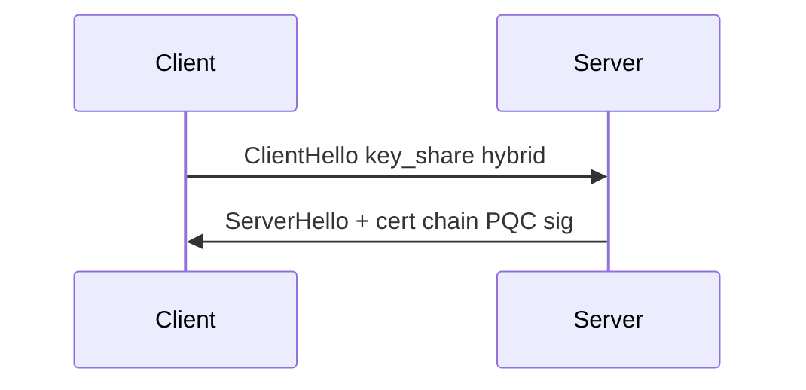
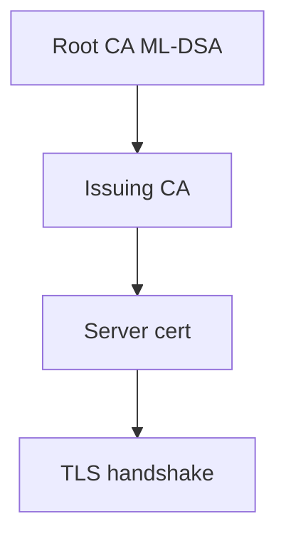

# Chapter 18: PQC in TLS, PKI, and Network Protocols

Protocols are where PQC wins or loses: **cert chains, UDP MTU, middleboxes**—especially on Indian mobile paths.

> **Author's note (India deployment):** Validate any regulatory reference (RBI, MeitY, CERT-In, DPDP retention) against the **current circular** before you bake it into contracts. We describe directionally what we see in the field, not legal advice.

**Figure 18.1 — TLS 1.3 hybrid placement**



---

## 18.1 Transport Layer Security (TLS)

TLS is the most widely deployed cryptographic protocol on the Internet, securing web traffic, API communications, email transmission, and countless other application-layer protocols. Its migration to PQC is both the highest priority and the most visible indicator of progress.

### TLS 1.3 and PQC Integration

TLS 1.3, standardized in RFC 8446, provides a significantly cleaner integration surface for PQC than its predecessors. The protocol's redesigned handshake eliminated many legacy mechanisms and introduced a modular approach to key exchange through the `supported_groups` and `key_share` extensions. This modularity means that adding new key exchange algorithms does not require changes to the core protocol state machine.

The key exchange mechanism is the primary integration target for PQC, and the reason is straightforward: key exchange protects against "harvest now, decrypt later" (HNDL) attacks. An adversary who records encrypted TLS sessions today can store those recordings indefinitely and decrypt them once a sufficiently powerful quantum computer becomes available. Because the confidentiality of data protected by today's key exchanges may need to last decades, deploying PQC key exchange is urgently needed even before a cryptographically relevant quantum computer (CRQC) exists.

Authentication, by contrast, is a real-time property — forging a signature only matters at the moment of the handshake. While PQC authentication is important for long-term security, its deployment can follow key exchange without the same urgency.

### Hybrid Key Exchange in TLS 1.3

The IETF has standardized hybrid key exchange mechanisms that combine a classical algorithm (such as X25519 or P-256 ECDH) with a post-quantum KEM (such as ML-KEM). The hybrid approach ensures that security is maintained even if one of the component algorithms is broken — whether by a quantum computer defeating the classical algorithm or by an unforeseen cryptanalytic breakthrough against the post-quantum algorithm.

**Standard approach (IETF RFC 9370 and related drafts):**

```
ClientHello:
  supported_groups: [x25519_ml_kem768, secp256r1_ml_kem768, x25519, ...]
  key_share: x25519_ml_kem768 (32B X25519 ephemeral pk + 1184B ML-KEM-768 ek)

ServerHello:
  key_share: x25519_ml_kem768 (32B X25519 ephemeral pk + 1088B ML-KEM-768 ct)

Shared Secret Derivation:
  ecdh_ss = X25519(client_sk, server_pk)
  mlkem_ss = ML-KEM.Decaps(ct, client_dk)
  combined_ss = HKDF-Extract(salt=0, IKM = ecdh_ss || mlkem_ss)
  
Handshake keys derived from combined_ss via HKDF-Expand
```

The combined shared secret is computed by concatenating the classical and post-quantum shared secrets, then using HKDF to derive the handshake keys. This concatenation-then-KDF approach provides a simple security argument: the combined secret is at least as strong as either component, assuming the KDF is secure.

**Negotiated hybrid groups with assigned code points:**

| Group Identifier | Components | Security Level | Client Key Share Size |
|-----------------|-----------|----------------|----------------------|
| `x25519_ml_kem768` | X25519 + ML-KEM-768 | ~128-bit PQ | 1,216 bytes |
| `secp256r1_ml_kem768` | P-256 + ML-KEM-768 | ~128-bit PQ | 1,249 bytes |
| `x25519_ml_kem1024` | X25519 + ML-KEM-1024 | ~192-bit PQ | 1,600 bytes |
| `secp384r1_ml_kem1024` | P-384 + ML-KEM-1024 | ~192-bit PQ | 1,649 bytes |

The negotiation process follows standard TLS 1.3 mechanics: the client advertises supported groups in order of preference, includes key shares for one or more groups, and the server selects a mutually supported group. If the server does not support any of the client's offered groups, it responds with a `HelloRetryRequest` specifying an acceptable group, adding one round trip.

**HelloRetryRequest considerations:**

In current deployments, clients typically speculatively include a key share for their most-preferred group. If a server does not support the PQC hybrid group, it issues a HelloRetryRequest asking for a classical group. This adds latency for connections to servers that have not yet deployed PQC, creating a tension between early adoption and performance. To mitigate this, clients may include multiple key shares (one hybrid, one classical) at the cost of a larger ClientHello message.

### PQC Authentication in TLS

While key exchange provides confidentiality against future quantum attackers, authentication ensures that the communicating parties are who they claim to be. In TLS 1.3, server authentication primarily relies on the server presenting a certificate chain and proving possession of the corresponding private key via a CertificateVerify message.

**Certificate chain considerations with PQC:**

A typical certificate chain consists of an end-entity certificate, one or more intermediate CA certificates, and a root CA certificate (which is not transmitted but is pre-installed in the client's trust store). Each certificate in the chain contains a public key and a signature from its issuer. When PQC algorithms are used, both the public keys and signatures grow substantially.

Recommended algorithm assignment across the chain:

- **Root CA:** ML-DSA-87 (2,592-byte public key, 4,627-byte signature) — maximum security for keys that may remain in trust stores for decades, not transmitted over the wire
- **Intermediate CA:** ML-DSA-65 (1,952-byte public key, 3,309-byte signature) — strong security with reasonable overhead for certificates that change infrequently
- **End-entity:** ML-DSA-44 or ML-DSA-65 — depends on the specific use case and lifetime requirements

**Size impact on TLS handshake:**

| Component | Classical (ECDSA P-256) | PQC (ML-DSA-65) | Hybrid (ECDSA + ML-DSA-65) |
|-----------|------------------------|-----------------|---------------------------|
| Client key share | 32 B | 1,216 B (hybrid KE) | 1,216 B |
| Server key share | 32 B | 1,120 B (hybrid KE) | 1,120 B |
| End-entity cert public key | 64 B | 1,952 B | 2,016 B |
| Each intermediate cert | ~800 B | ~6,000 B | ~7,000 B |
| CertificateVerify signature | 64 B | 3,309 B | 3,373 B |
| Full server-to-client flight (2 intermediates) | ~3.1 KB | ~22.4 KB | ~26 KB |
| Total handshake bytes (both directions) | ~4 KB | ~25 KB | ~29 KB |

This six-fold increase in handshake size has real-world implications. On high-bandwidth connections, the additional bytes add negligible latency. But on connections with small initial congestion windows (typically 10 TCP segments or approximately 14 KB), the larger handshake may require additional round trips due to TCP slow start. Mobile connections and high-latency satellite links are particularly affected.

### Optimizations for TLS with PQC

Given the significant size increases, multiple optimization techniques have been developed to reduce the practical impact of PQC in TLS:

**Certificate compression (RFC 8879):**

RFC 8879 defines a mechanism for compressing certificate messages in TLS 1.3. The client advertises supported compression algorithms (zlib, Brotli, or zstd) in a `compress_certificate` extension, and the server compresses its Certificate message accordingly.

For PQC certificates, compression is particularly effective because the lattice-based public keys and signatures contain structured data with exploitable redundancy. Measured compression ratios:

| Algorithm | Brotli Compression | zstd Compression |
|-----------|-------------------|-----------------|
| ML-DSA-65 certificate chain (3 certs) | 38-45% reduction | 35-42% reduction |
| ML-DSA-87 certificate chain (3 certs) | 40-48% reduction | 37-44% reduction |
| Hybrid ECDSA + ML-DSA-65 chain | 35-42% reduction | 32-38% reduction |

With Brotli compression, a 22 KB PQC certificate chain can typically be reduced to 12-14 KB, potentially fitting within the initial TCP congestion window.

**Cached certificates and trust expressions:**

The concept of cached certificates allows a server to omit intermediate certificates that the client has already seen and cached from prior connections. Since intermediate CA certificates change infrequently (typically valid for 5-10 years), caching eliminates the repeated transmission of these large certificates.

Implementations use certificate fingerprints (SHA-256 hashes) to identify cached certificates. The client sends a list of cached certificate fingerprints, and the server sends only certificates not already cached by the client. For a typical three-certificate chain where the two intermediate CA certificates are cached, this reduces per-handshake overhead from ~18 KB to ~6 KB for PQC certificates.

**Suppressed extensions and certificate fingerprints:**

Building on the caching concept, clients can signal known certificates via compact fingerprints, allowing servers to completely omit known certificates from the chain. This approach works particularly well for CDN and cloud deployments where a small number of intermediate CAs serve many endpoints.

**Merkle Tree Certificates (experimental):**

Merkle Tree Certificates represent an experimental approach to amortizing signature overhead across many certificates. Instead of each certificate carrying its own CA signature, certificates are issued in batches and organized into a Merkle tree. Each certificate carries a compact Merkle inclusion proof (logarithmic in the batch size) rather than a full signature.

For a batch of 2^20 (approximately 1 million) certificates:
- Merkle proof size: ~640 bytes (20 hash values × 32 bytes)
- Compared to ML-DSA-65 signature: 3,309 bytes
- Savings per certificate: ~2,669 bytes

This approach requires infrastructure support for batch issuance and proof distribution, and is still under development, but it represents a promising path toward making PQC authentication overhead negligible.

**Early data and session resumption:**

TLS 1.3 session resumption and 0-RTT (early data) mechanisms avoid repeating the full handshake for subsequent connections to the same server. Once a session is established with PQC key exchange, resumed sessions use symmetric pre-shared keys derived from the original handshake, completely avoiding the PQC key exchange overhead. In practice, many connections are resumptions, significantly reducing the average overhead.

### Deployment Status and Real-World Performance

Major deployments of PQC in TLS have already occurred. Google Chrome enabled X25519+ML-KEM-768 hybrid key exchange by default starting in 2024, and Cloudflare deployed PQC key exchange across its global network. These deployments provided critical real-world data:

- Handshake latency increase: 0.3-0.5 ms on typical broadband connections
- Handshake latency increase on mobile (4G): 2-5 ms
- Percentage of connections requiring HelloRetryRequest: decreasing as adoption grows
- No measurable impact on page load times for most web applications
- Some middleboxes initially failed on larger ClientHello messages (now largely resolved)


**Figure 18.2 — PKI chain with PQC signatures**



## 18.2 Public Key Infrastructure (PKI)

Public Key Infrastructure provides the trust framework that underpins TLS, email security, code signing, and document verification. Migrating PKI to PQC is both essential and complex because of the deep interdependencies across the certificate ecosystem.

### X.509 Certificate Adaptations

X.509 certificates, defined in RFC 5280, provide a flexible structure that can accommodate new algorithms through Algorithm Identifiers (OIDs). The ASN.1 encoding used in X.509 does not impose fixed-size fields for keys or signatures, which provides some inherent agility. However, the practical implications of larger PQC keys and signatures extend throughout the ecosystem.

**Algorithm identifiers and OIDs:**

NIST and the IETF have assigned Object Identifiers (OIDs) for the standardized PQC algorithms:

| Algorithm | OID | Use Case |
|-----------|-----|----------|
| ML-DSA-44 | 2.16.840.1.101.3.4.3.17 | Signatures (NIST Level 2) |
| ML-DSA-65 | 2.16.840.1.101.3.4.3.18 | Signatures (NIST Level 3) |
| ML-DSA-87 | 2.16.840.1.101.3.4.3.19 | Signatures (NIST Level 5) |
| ML-KEM-512 | 2.16.840.1.101.3.4.4.1 | Key encapsulation (NIST Level 1) |
| ML-KEM-768 | 2.16.840.1.101.3.4.4.2 | Key encapsulation (NIST Level 3) |
| ML-KEM-1024 | 2.16.840.1.101.3.4.4.3 | Key encapsulation (NIST Level 5) |
| SLH-DSA-SHA2-128s | (assigned) | Hash-based signatures (small) |

For hybrid certificates, composite algorithm OIDs combine a classical and post-quantum algorithm into a single identifier, allowing a certificate to contain keys for both algorithms and a combined signature.

**Subject Public Key Info encoding:**

The SubjectPublicKeyInfo field in X.509 encodes the PQC public key using the standard ASN.1 structure: an AlgorithmIdentifier followed by a BIT STRING containing the raw public key bytes. For ML-DSA-65, this results in approximately 1,970 bytes for the SPKI field alone.

**Certificate size comparison:**

| Certificate Type | Public Key | Signature | Total Cert Size |
|-----------------|-----------|-----------|----------------|
| RSA-2048 end-entity | 256 B | 256 B | ~1,200 B |
| RSA-4096 end-entity | 512 B | 512 B | ~2,000 B |
| ECDSA P-256 end-entity | 64 B | 64 B | ~800 B |
| ML-DSA-44 end-entity | 1,312 B | 2,420 B | ~4,500 B |
| ML-DSA-65 end-entity | 1,952 B | 3,309 B | ~6,000 B |
| ML-DSA-87 end-entity | 2,592 B | 4,627 B | ~8,000 B |
| Hybrid (ECDSA + ML-DSA-65) | ~2,016 B | ~3,373 B | ~7,000 B |
| SLH-DSA-SHA2-128s end-entity | 32 B | 7,856 B | ~8,500 B |

### Certificate Lifecycle with PQC

The entire certificate lifecycle is affected by the transition to PQC, from issuance through revocation and transparency logging.

**Issuance:**

Certificate Authorities must generate and manage PQC signing keys, which requires updated HSM firmware or new HSMs that support PQC algorithms. The issuance process itself changes minimally — the CA signs the certificate with its PQC key rather than its RSA or ECDSA key — but the infrastructure requirements are significant.

Validity periods deserve reconsideration. Currently, publicly trusted end-entity certificates have a maximum lifetime of 398 days (with further reductions planned). For PQC certificates, shorter validity periods are actually beneficial: they reduce the window during which a compromised key can be exploited and limit the storage burden of larger certificates in revocation databases. Some proposals suggest 90-day or even shorter certificate lifetimes for PQC, aligned with the automated issuance capabilities of ACME (Let's Encrypt and similar CAs).

**Revocation:**

Certificate revocation mechanisms must also support PQC. Certificate Revocation Lists (CRLs) contain the CA's signature over the list of revoked certificates. With PQC signatures, CRL sizes increase due to the larger signature, though the per-revoked-certificate data remains the same.

OCSP (Online Certificate Status Protocol) responses include a signature from the OCSP responder. With PQC, OCSP responses grow from approximately 500 bytes to 4-5 KB, primarily due to the larger signature. OCSP stapling, where the server includes a pre-fetched OCSP response in the TLS handshake, helps reduce the verification overhead for clients but adds to the handshake size.

**Certificate Transparency:**

Certificate Transparency (CT) logs store all publicly issued certificates and provide cryptographic proof of inclusion. Signed Certificate Timestamps (SCTs) are signatures from CT log servers attesting that a certificate has been logged. With PQC:
- SCTs grow from ~100 bytes to ~3,500 bytes (ML-DSA-65 signature)
- Log storage requirements increase proportionally to certificate sizes
- Merkle tree proofs within CT logs are unaffected (they use hash functions)
- Log server signing infrastructure must support PQC

### Migration Strategies for PKI

PKI migration is perhaps the most complex aspect of the PQC transition because of the hierarchical trust model and the need for backward compatibility during the transition period.

**Phase 1: Dual-signed intermediate CAs (Years 1-3)**

The first phase establishes PQC capability without disrupting existing trust chains:
- Existing classical root CAs (already in trust stores) issue new intermediate CA certificates that contain PQC keys
- These intermediate CAs can issue end-entity certificates with PQC signatures
- Hybrid certificates containing both classical and PQC signatures provide backward compatibility
- Clients that understand PQC verify the PQC signature; legacy clients verify the classical signature
- Trust is anchored in existing roots, requiring no changes to trust stores

**Phase 2: PQC root CAs (Years 3-5)**

The second phase establishes dedicated PQC trust anchors:
- New root CA certificates are generated with PQC keys (e.g., ML-DSA-87)
- Cross-signing: existing classical roots sign the new PQC roots, creating trust bridges
- New PQC roots are gradually added to operating system and browser trust stores
- Certificate paths may temporarily be longer (classical root → cross-sign → PQC intermediate → end-entity)
- Parallel verification paths exist for both PQC-aware and legacy clients

**Phase 3: PQC-only operation (Years 5+)**

The final phase completes the transition:
- Classical signature paths are deprecated and eventually removed
- All certificates in the chain use PQC algorithms exclusively
- Trust stores contain only PQC root certificates
- Legacy clients that cannot verify PQC are no longer supported
- The timeline for this phase depends on the deprecation of classical algorithms by standards bodies and regulators

## 18.3 Secure Shell (SSH)

SSH protects remote administration, file transfers, and automated infrastructure operations for millions of servers worldwide. Its migration to PQC follows patterns similar to TLS but with some protocol-specific considerations.

### SSH Key Exchange

The SSH key exchange protocol (defined in RFC 4253 and extensions) establishes a shared secret between client and server that is used to derive session encryption and authentication keys. The key exchange is the highest-priority target for PQC migration, as it protects session confidentiality.

**Classical key exchange (curve25519-sha256):**
```
Client → Server: SSH_MSG_KEX_ECDH_INIT
  e_C: 32 bytes (X25519 ephemeral public key)

Server → Client: SSH_MSG_KEX_ECDH_REPLY
  K_S: server host key
  e_S: 32 bytes (X25519 ephemeral public key)
  sig: signature over exchange hash H

Shared secret: K = X25519(client_sk, server_pk)
Exchange hash: H = hash(V_C || V_S || I_C || I_S || K_S || e_C || e_S || K)
```

**PQC hybrid key exchange (mlkem768x25519-sha256):**
```
Client → Server: SSH_MSG_KEX_HYBRID_INIT
  e_C_ecdh: 32 bytes (X25519 ephemeral public key)
  ek_mlkem: 1,184 bytes (ML-KEM-768 encapsulation key)

Server → Client: SSH_MSG_KEX_HYBRID_REPLY
  K_S: server host key
  e_S_ecdh: 32 bytes (X25519 ephemeral public key)
  ct_mlkem: 1,088 bytes (ML-KEM-768 ciphertext)
  sig: signature over exchange hash H

Shared secrets:
  ss_ecdh = X25519(client_sk, server_pk)
  ss_mlkem = ML-KEM-768.Decaps(ct_mlkem, client_dk)
  K = KDF(ss_ecdh || ss_mlkem)
```

The message flow remains the same (one round trip for key exchange), so the protocol latency is unchanged. Only the message sizes increase: the client's initial message grows from 32 bytes to 1,216 bytes, and the server's reply grows by 1,088 bytes.

### SSH Host and User Authentication

**Host key authentication:**

When a client connects to a server, the server presents its host key and signs the exchange hash to prove possession of the corresponding private key. With PQC:
- Server host keys can be ML-DSA key pairs (ML-DSA-65 recommended for servers)
- The `known_hosts` file stores the server's public key — entries grow from ~68 bytes (Ed25519) to ~2,600 bytes (ML-DSA-65, base64-encoded)
- The host key signature in the key exchange reply grows from 64 bytes (Ed25519) to 3,309 bytes (ML-DSA-65)
- First-connection trust-on-first-use (TOFU) prompts display larger key fingerprints

**User authentication with public keys:**

SSH user authentication can use PQC key pairs:
- Private keys stored in `~/.ssh/id_mldsa65` (or similar naming)
- Public keys in `~/.ssh/id_mldsa65.pub` are larger (~2.6 KB vs ~68 bytes for Ed25519)
- `authorized_keys` entries on servers grow correspondingly
- Agent forwarding (ssh-agent) works with PQC keys without protocol changes, as the agent protocol abstracts key types
- SSH key passphrases protect PQC private keys the same as classical keys

**SSH certificate format:**

OpenSSH certificates (distinct from X.509) can be extended for PQC:
- The CA signs user/host certificates with a PQC key
- Certificate sizes grow primarily due to the CA signature (~3.3 KB for ML-DSA-65)
- The certificate-based trust model (avoiding TOFU) becomes even more valuable with PQC, as it reduces the need to distribute and store many individual PQC host keys

### Current SSH PQC Support

The SSH ecosystem has been actively preparing for PQC:

- **OpenSSH 9.0+:** Introduced `sntrup761x25519-sha512@openssh.com` (NTRU-based hybrid key exchange) as default in 2022
- **OpenSSH 9.5+:** Experimental support for ML-KEM-based hybrid key exchange via liboqs integration
- **libssh:** PQC integration through the liboqs provider, supporting multiple PQC KEMs
- **PuTTY:** Experimental PQC key exchange support in recent versions
- **Paramiko (Python):** Community patches for PQC support via oqs-python
- **Dropbear:** Ongoing work for embedded/constrained SSH implementations with PQC

The SSH protocol's simplicity relative to TLS makes PQC migration more straightforward: fewer negotiation options, simpler state machines, and typically fewer intermediary devices that might interfere with larger messages.

### SSH Migration Recommendations

For organizations managing SSH infrastructure, the recommended migration approach:

1. **Immediate:** Enable hybrid key exchange (sntrup761x25519 or mlkem768x25519) on all SSH servers. This is a configuration change that requires no key regeneration and protects session confidentiality against HNDL.

2. **Short-term:** Generate PQC host keys alongside existing Ed25519 keys. Clients that support PQC authentication will use the PQC host key; legacy clients continue using classical keys.

3. **Medium-term:** Issue PQC user keys for privileged access (administrators, CI/CD systems, automated tooling). Require PQC keys for access to systems handling sensitive data.

4. **Long-term:** Deprecate classical-only SSH connections. Require PQC key exchange and authentication for all SSH access.

The transition is simplified by SSH's point-to-point nature — unlike TLS where middleboxes (proxies, CDNs, WAFs) must also support the algorithms, SSH connections are typically direct between client and server, meaning only the endpoints need updating.

## 18.4 Virtual Private Networks (VPN)

VPN protocols establish encrypted tunnels for network-layer traffic. Their migration to PQC involves unique challenges related to the interaction between cryptographic overhead and network-layer constraints.

### IPsec/IKEv2

IPsec uses the Internet Key Exchange version 2 (IKEv2) protocol to establish Security Associations. IKEv2 has a well-defined extension mechanism that accommodates PQC.

**IKE_SA_INIT and PQC key exchange:**

RFC 9370 defines a framework for integrating post-quantum key exchange into IKEv2 through Additional Key Exchange (AKE) payloads. The approach uses intermediate exchanges after the initial IKE_SA_INIT to perform additional key exchange operations:

```
Initiator                          Responder
---------                          ---------
IKE_SA_INIT (HDR, SAi1, KEi, Ni) →
                                 ← IKE_SA_INIT (HDR, SAr1, KEr, Nr)
[IKE SA partially established with classical DH]

IKE_INTERMEDIATE (SK{KEi_pq}) →
                                 ← IKE_INTERMEDIATE (SK{KEr_pq})
[PQ shared secret mixed into IKE SA keying material]

IKE_AUTH (SK{IDi, AUTH, SAi2, TSi, TSr}) →
                                 ← IKE_AUTH (SK{IDr, AUTH, SAr2, TSi, TSr})
[Child SA established]
```

This multi-exchange approach has a significant advantage: the PQ key exchange happens within the already-encrypted IKE SA, so the PQ payloads are protected by the classical encryption established in IKE_SA_INIT. This means fragmentation of PQ payloads can use IKE-level fragmentation (RFC 7383) rather than IP fragmentation.

**Fragmentation challenges:**

IKE messages have historically been compact, fitting within a single UDP datagram. With PQC:
- ML-KEM-768 adds 1,184 bytes to initiator and 1,088 bytes to responder messages
- ML-KEM-1024 adds 1,568 bytes and 1,568 bytes respectively
- Combined with Diffie-Hellman groups, total key exchange payloads can exceed typical MTUs

The critical issue is the IKE_SA_INIT exchange: this first exchange occurs before any SA is established, so IKE fragmentation (which requires an SA for encryption) is not available. Solutions include:

- **IP fragmentation:** Allow the IKE_SA_INIT packet to be IP-fragmented; this works but is unreliable on many networks due to middleboxes dropping fragments
- **TCP transport (RFC 8229):** Encapsulate IKE in TCP, which handles segmentation transparently; adds overhead but eliminates fragmentation concerns
- **Compact PQ parameters:** Use ML-KEM-512 for the initial exchange if the security level is acceptable
- **Cookie-based exchange:** Use IKEv2 cookies to complete the initial exchange over multiple messages before committing to the full PQ exchange

**Performance impact:**

IKEv2 handshake with PQC typically adds 3-8 ms to connection establishment on modern hardware. For VPN scenarios where connections persist for hours or days, this one-time overhead is negligible. For mobile VPN scenarios with frequent reconnections, session resumption mechanisms (IKEv2 session resumption, RFC 5723) avoid repeating the full PQ handshake.

### WireGuard

WireGuard's minimalist design presents both opportunities and challenges for PQC integration. Its use of the Noise protocol framework (specifically Noise_IKpattern) with X25519 and ChaCha20-Poly1305 is elegant but tightly coupled.

**Classical WireGuard handshake:**
```
Initiator → Responder (148 bytes):
  Type (1B) || Sender (4B) || Ephemeral (32B) || 
  Static_encrypted (48B) || Timestamp_encrypted (28B) || MAC1 (16B) || MAC2 (16B)

Responder → Initiator (92 bytes):
  Type (1B) || Sender (4B) || Receiver (4B) || Ephemeral (32B) ||
  Empty_encrypted (16B) || MAC1 (16B) || MAC2 (16B)
```

This extreme compactness (240 bytes total for a full handshake) is part of WireGuard's design philosophy. Integrating PQC necessarily increases these sizes substantially.

**Post-Quantum WireGuard approaches:**

**Rosenpass (layered approach):**
Rosenpass is an independent project that adds post-quantum key exchange as a separate protocol layer on top of standard WireGuard. It performs a Classic McEliece or ML-KEM key exchange out-of-band and feeds the resulting shared secret into WireGuard as a pre-shared key (PSK). This approach preserves WireGuard unchanged while adding quantum resistance.

- Advantages: No modification to WireGuard itself; uses WireGuard's existing PSK mechanism; can use conservative algorithms like Classic McEliece
- Disadvantages: Additional complexity; separate key management; additional process running alongside WireGuard

**Native ML-KEM integration:**
Proposals for native WireGuard PQC integration replace or augment the X25519 key exchange within the Noise framework:
- The ephemeral key becomes a hybrid X25519 + ML-KEM-768 encapsulation key
- Handshake initiator message grows to approximately 1,350 bytes
- Handshake responder message grows to approximately 1,200 bytes
- The Noise framework's chaining key mechanism naturally accommodates the additional key material

**Pre-shared key with Classic McEliece:**
For maximum conservatism, a Classic McEliece public key can be configured as a long-term pre-shared element:
- Classic McEliece public key (~261 KB at 128-bit security) is exchanged out-of-band during peer configuration
- Provides quantum resistance without modifying the real-time handshake protocol
- Drawback: extremely large public keys make dynamic peer addition impractical

### OpenVPN

OpenVPN's architecture provides a natural PQC integration path because its control channel uses TLS. When the underlying TLS library (typically OpenSSL) supports PQC algorithms, OpenVPN gains PQC capability for its control channel with minimal changes:

- The TLS handshake for the control channel uses PQC hybrid key exchange
- Certificate-based authentication can use PQC certificates
- The data channel symmetric encryption (AES-256-GCM) is already quantum-resistant
- OpenVPN's `--tls-crypt` option (which encrypts the TLS handshake itself) provides defense-in-depth

Practical deployment requires OpenSSL 3.x with the oqs-provider for PQC algorithms, updated certificate chains, and potentially increased `--tun-mtu` settings to accommodate the larger handshake messages.

### VPN Performance Comparison

The performance impact of PQC varies significantly across VPN protocols due to their different architectural choices:

| VPN Protocol | Handshake Overhead (PQC vs Classical) | Steady-State Impact | Key Consideration |
|-------------|--------------------------------------|--------------------|--------------------|
| IPsec/IKEv2 | +2-3 KB per direction; +1 RTT if intermediate exchange used | None (symmetric data plane) | Fragmentation of IKE_SA_INIT |
| WireGuard (native) | +1,100 B initiator, +1,100 B responder | None | Compact protocol philosophy disrupted |
| WireGuard (Rosenpass) | Out-of-band PQC; WireGuard handshake unchanged | None | Separate daemon complexity |
| OpenVPN | Same as TLS (inherited from control channel) | None (symmetric data channel) | Relies on OpenSSL PQC support |

For all VPN protocols, the critical observation is that PQC overhead affects only the key establishment phase. Once symmetric session keys are derived, the data plane operates identically to classical deployments. Given that VPN tunnels are typically long-lived (hours to days), the one-time handshake overhead is negligible in the overall performance budget.

**Rekeying considerations:**

VPN protocols periodically rekey to limit the amount of data encrypted under any single key. With PQC:
- IPsec CREATE_CHILD_SA exchanges can use PQC within the existing IKE SA (already encrypted, so fragmentation is handled by IKE)
- WireGuard rekeys every 2 minutes (by design); if using native PQC, each rekey incurs PQC overhead
- The frequency of rekeying may need adjustment to balance forward secrecy against PQC computational cost on constrained VPN gateways

## 18.5 Email Security

Email communication represents one of the most challenging protocol environments for PQC deployment due to its store-and-forward nature, multiple relay hops, and diverse client ecosystem.

### S/MIME with PQC

S/MIME (Secure/Multipurpose Internet Mail Extensions) provides end-to-end email encryption and digital signatures. Its migration to PQC affects both confidentiality and authentication.

**Encryption workflow with PQC:**

S/MIME uses a hybrid encryption model where a symmetric content-encryption key (CEK) is encrypted to each recipient using their public key:

1. Sender generates a random CEK (e.g., AES-256 key)
2. Sender encrypts the message content with the CEK
3. For each recipient, sender encapsulates the CEK using the recipient's KEM key
4. With ML-KEM-768: each encrypted key block is 1,088 bytes (ciphertext)
5. Hybrid approach: encapsulate with both ECDH and ML-KEM, combine for CEK derivation

For messages with multiple recipients, the overhead scales linearly — each additional recipient adds an ML-KEM ciphertext to the message. A message to 10 recipients adds approximately 10.9 KB of PQC overhead.

**Digital signatures with PQC:**

S/MIME signatures authenticate the sender and provide non-repudiation:
- Sender signs the message with their ML-DSA private key
- Signature size: 2,420 bytes (ML-DSA-44) to 4,627 bytes (ML-DSA-87)
- The signer's certificate chain is typically included with the message
- Total signature + certificate overhead: 10-20 KB for a single-signer ML-DSA-65 message

**Certificate discovery and distribution:**

S/MIME requires knowing the recipient's public key certificate before sending encrypted mail. With PQC:
- LDAP directory entries for PQC certificates are significantly larger
- Users may have separate certificates for encryption (ML-KEM) and signing (ML-DSA)
- Automated certificate discovery (RFC 7929, DNS-based) must handle larger records
- Enterprise GAL (Global Address List) entries grow substantially
- Multiple certificates per user increases directory query response sizes

**Practical implications:**

Email messages with PQC S/MIME protection are 10-25 KB larger than their classical equivalents. While this is modest compared to typical email message sizes (especially those with attachments), it affects:
- Email size quotas (cumulative effect over millions of messages)
- Mobile email synchronization bandwidth
- Email server storage requirements
- Message rendering time on constrained clients

### PGP/OpenPGP

OpenPGP (RFC 9580 and related specifications) has also developed PQC support:

**Key management changes:**
- ML-KEM-768 encryption subkeys replace X25519/RSA subkeys
- ML-DSA-65 primary keys replace EdDSA/RSA signing keys
- Key packets grow substantially (from ~100 bytes to ~2-3 KB for public keys)
- Key server (SKS, keys.openpgp.org) storage and bandwidth requirements increase
- Web of Trust signature accumulation on PQC keys results in very large key blocks

**Hybrid approach in OpenPGP:**
- IETF drafts define composite key structures combining classical and PQC algorithms
- A single key ID maps to both X25519+ML-KEM-768 for encryption and Ed25519+ML-DSA-65 for signing
- Backward compatibility: classical components can be used by legacy clients

**Key distribution challenges:**
- Public keyservers must handle and serve larger keys efficiently
- Key refresh operations download larger key blocks
- Web Key Directory (WKD) protocol needs larger DNS/HTTPS responses
- Key fingerprints change format to accommodate composite keys

## 18.6 DNS and DNSSEC

The Domain Name System and its security extension DNSSEC face uniquely severe challenges from PQC due to the DNS protocol's tight size constraints and its fundamental role in Internet infrastructure.

### DNSSEC Challenges

DNSSEC authenticates DNS responses using digital signatures. Zone signing keys (ZSKs) sign individual resource record sets, and key signing keys (KSKs) sign the ZSK. The signatures (RRSIG records) and public keys (DNSKEY records) are transmitted alongside DNS data in responses.

**Why DNSSEC is particularly affected:**

1. **UDP size constraints:** Classic DNS uses UDP with a 512-byte message limit. EDNS(0) extends this to approximately 4,096 bytes in practice, though many networks reliably deliver only up to 1,232 bytes. Larger responses trigger TCP fallback, which adds latency and server load.

2. **Every response is signed:** Unlike TLS where a certificate is presented once per connection, DNSSEC signatures accompany every DNS response. The per-query overhead is constant and unavoidable.

3. **Multiple signatures per response:** A typical signed DNS response contains the requested records, their RRSIG, the DNSKEY records for the zone, and possibly DS records from the parent zone. Multiple RRSIG records may be present if both ZSK and KSK are included.

4. **Resolution chain:** A full DNS resolution from root to leaf traverses multiple signed zones (root → TLD → authoritative), each contributing DNSKEY and RRSIG records.

**Size impact with ML-DSA-44 (smallest ML-DSA parameter set):**

| Component | Classical (ECDSA P-256) | PQC (ML-DSA-44) | Difference |
|-----------|------------------------|-----------------|------------|
| DNSKEY record (public key) | 64 B | 1,312 B | +1,248 B |
| RRSIG record (signature) | 64 B | 2,420 B | +2,356 B |
| Typical signed response | ~500 B | ~4,200 B | +3,700 B |
| Response with DNSKEY + RRSIG | ~650 B | ~5,500 B | +4,850 B |

A single signed DNS response with ML-DSA-44 already exceeds the practical EDNS UDP limit of 1,232 bytes, forcing TCP fallback for most responses. This is operationally unacceptable for the DNS infrastructure, which handles trillions of queries per day.

**Alternative PQC algorithms for DNSSEC:**

Given ML-DSA's size challenges, alternative algorithms are being explored:

| Algorithm | Public Key | Signature | Combined | Trade-off |
|-----------|-----------|-----------|----------|-----------|
| ML-DSA-44 | 1,312 B | 2,420 B | 3,732 B | Large both |
| FN-DSA-512 | 897 B | 666 B | 1,563 B | Compact, but complex implementation |
| SLH-DSA-SHA2-128s | 32 B | 7,856 B | 7,888 B | Tiny key, huge signature |
| SLH-DSA-SHA2-128f | 32 B | 17,088 B | 17,120 B | Fast but enormous |

FN-DSA (formerly FALCON) is the most promising candidate for DNSSEC due to its relatively compact combined key+signature size, though its complex implementation (using floating-point arithmetic for signing) raises concerns for zone signing infrastructure.

**Proposed mitigations and protocol redesigns:**

- **Key and signature caching:** Resolvers cache DNSKEY records aggressively, reducing per-query overhead for repeated queries to the same zone
- **Delta signing:** Sign only changes to zone data rather than individual records
- **Signature amortization:** Group multiple records under a single signature using Merkle-tree-based approaches
- **New DNSSEC wire format:** Protocol extensions that separate keys from signatures and allow more efficient encoding
- **Reduced signature frequency:** Longer RRSIG validity periods (at the cost of slower revocation)
- **Online signing:** Sign responses on-demand rather than pre-signing entire zones, allowing per-query optimization

### DNS over HTTPS/TLS

DNS-over-HTTPS (DoH) and DNS-over-TLS (DoT) fundamentally change the PQC calculus for DNS:

- The TLS connection carries all DNS queries and responses as application data
- PQC overhead is in the TLS handshake (one-time cost), not in individual DNS responses
- DNSSEC signatures within DNS responses are still present but are not the bottleneck
- Connection reuse amortizes the TLS handshake cost over many queries
- This makes DoH/DoT significantly more PQC-friendly than traditional UDP-based DNS

For recursive resolvers that communicate with authoritative servers, the situation remains challenging — these connections typically use traditional UDP-based DNS with DNSSEC, and the signature size problem persists.

### DNSSEC Transition Timeline

The DNSSEC ecosystem's transition to PQC will likely follow a distinct path from other protocols:

1. **Research phase (current):** Algorithm selection, protocol redesign proposals, proof-of-concept implementations
2. **Root zone preparation:** IANA/ICANN evaluate PQC algorithms for root zone signing (extremely conservative timeline due to global impact)
3. **TLD adoption:** Major TLDs (.com, .org, country codes) begin supporting PQC zone signing
4. **Resolver support:** Major recursive resolvers (Google Public DNS, Cloudflare 1.1.1.1, ISP resolvers) add PQC verification support
5. **Broad deployment:** Authoritative servers across the Internet deploy PQC-signed zones

This transition will likely take significantly longer than TLS migration because of the decentralized nature of DNS authority and the extreme conservatism required for the root zone. DNS operators should plan for a 10-15 year transition period and ensure that classical DNSSEC remains operational throughout.

## 18.7 Code Signing and Software Updates

Software supply chain security depends on cryptographic signatures to ensure that code has not been tampered with. These signatures must remain valid for the operational lifetime of the software they protect, making PQC migration important for long-lived systems.

### Package Manager Signatures

Modern software distribution relies heavily on cryptographic signatures at multiple levels:

**Repository-level signing:**
- APT (Debian/Ubuntu): Repository Release files signed with GPG keys; package managers verify before installing any package
- RPM (Red Hat/Fedora): Individual packages carry GPG signatures; repository metadata is also signed
- Alpine APK: Package indexes signed with RSA keys

**Language ecosystem packages:**
- npm: Package integrity via SHA-512 hashes; registry signing planned
- PyPI: PEP 480 and TUF-based signing for package distributions
- Maven Central: PGP signatures required for all published artifacts
- Go modules: Checksum database (sum.golang.org) provides transparency

**Container signing:**
- Sigstore/cosign: Keyless signing with ephemeral certificates for container images
- Docker Content Trust: Notary-based signing with TUF
- In-toto: Supply chain attestation framework

**Considerations for PQC migration in package signing:**

1. **Verification frequency:** Popular packages are verified millions of times daily. ML-DSA verification speed (~50,000 verifications/second on modern CPUs) is adequate, but aggregate computational cost matters for build systems that verify thousands of packages.

2. **Repository metadata size:** A typical Linux distribution repository contains metadata with thousands of package signatures. With ML-DSA-65 signatures (3,309 bytes each), repository metadata grows substantially.

3. **Backward compatibility:** During transition, packages may carry dual signatures (classical + PQC) for clients that do not yet support PQC verification.

4. **Trust anchors:** Root signing keys for repositories are the highest-value targets and should migrate first, using conservative algorithms like SLH-DSA for root keys.

5. **Timestamp validity:** Signatures on software must remain verifiable for the software's operational lifetime. Firmware signed today might be verified during secure boot ten years from now.

### Secure Boot and Firmware Signing

Firmware and boot chain security operates under severe constraints:

**UEFI Secure Boot:**
- Platform Key (PK): Signs the Key Exchange Key; stored in NVRAM; root of boot trust
- Key Exchange Key (KEK): Authorizes updates to signature databases
- Signature Database (db): Contains hashes or public keys of authorized bootloaders
- NVRAM constraints: Typically 32-64 KB total for all Secure Boot variables

With PQC, the NVRAM space constraint is the primary challenge:
- ML-DSA-65 public key: 1,952 bytes per entry in db
- Multiple entries needed (OS vendor, hardware vendor, user keys)
- db might contain 5-20 entries × 1,952 bytes = 10-39 KB (potentially exceeding NVRAM budget)

**Recommended approaches for firmware signing:**

| Use Case | Recommended Algorithm | Rationale |
|----------|---------------------|-----------|
| Root Platform Key | SLH-DSA-SHA2-192s | Maximum conservatism for 15+ year lifetime; small public key (48 B) |
| Firmware signing (BIOS/UEFI) | XMSS or LMS | Stateful hash-based; controlled signing environment; compact signatures |
| OS bootloader signing | ML-DSA-65 | Frequent updates; fast verification needed |
| Driver signing | ML-DSA-44 | Large volume; verification speed important |
| Code integrity policy | LMS | Infrequent updates; maximum confidence in security |

XMSS and LMS (stateful hash-based signatures, NIST SP 800-208) are particularly well-suited to firmware signing because:
- The signing environment is controlled (a build server that can maintain state)
- The number of signatures is predictable and bounded
- The signatures are compact (~2.5 KB for LMS at 128-bit security)
- Security relies only on hash function properties (maximum conservatism)

## 18.8 Blockchain and Cryptocurrency

Blockchain systems face unique PQC challenges because of their decentralized nature, immutability, and the direct financial value tied to cryptographic keys.

### Quantum Threats to Blockchain

**Address derivation and public key exposure:**

Most blockchain systems derive addresses from public keys using hash functions (e.g., Bitcoin: address = RIPEMD160(SHA256(compressed_pubkey))). The public key is not revealed until a transaction is broadcast from that address. This provides some protection: an attacker with a quantum computer must extract the public key and forge a signature within the block confirmation time (approximately 10 minutes for Bitcoin).

However, several scenarios expose public keys:
- Reused addresses reveal the public key after the first transaction
- Unconfirmed transactions in the mempool expose public keys
- Multi-signature scripts may embed public keys
- Some protocols (Ethereum) reveal public keys in every transaction

**Transaction signature forgery:**

ECDSA (Bitcoin, Ethereum) and EdDSA signatures can be forged by a quantum computer running Shor's algorithm. This allows:
- Spending any funds from addresses with exposed public keys
- Impersonating any identity in the blockchain system
- Forging smart contract authorizations

**Mining and Proof-of-Work:**

Grover's algorithm provides a quadratic speedup for hash preimage search, theoretically halving the effective security of PoW mining. However:
- Grover's algorithm provides only a √N speedup (requiring an attacker to run for extended periods)
- Quantum computers are far slower at hash computation than classical ASICs
- The difficulty adjustment mechanism would compensate for any quantum mining advantage
- Proof-of-Stake consensus eliminates this concern entirely

### PQC Integration Challenges

The unique constraints of blockchain systems make PQC integration particularly challenging:

**Transaction size:**
- Classical ECDSA signature: 64-72 bytes
- ML-DSA-44 signature: 2,420 bytes (34× larger)
- ML-DSA-65 signature: 3,309 bytes (46× larger)
- Impact: Fewer transactions per block, higher fees, reduced throughput

**State bloat:**
- Classical public key (compressed): 33 bytes
- ML-DSA-44 public key: 1,312 bytes (40× larger)
- UTXO set or account state grows proportionally
- Full node storage and synchronization requirements increase dramatically

**Address format:**
- PQC public keys are too large to display as simple addresses
- New address formats needed that hash PQC public keys
- Address length changes break existing tooling, QR code generation, and UI assumptions

### Approaches to Blockchain PQC Migration

**Account abstraction:**
Separate the signing scheme from the address derivation. Accounts are identified by a hash regardless of the underlying signature scheme. Smart contract wallets (ERC-4337 on Ethereum) already enable this pattern.

**Signature aggregation (research area):**
For lattice-based signatures, aggregation schemes could combine multiple signatures into a single compact proof. This is an active research area without deployed solutions, but could dramatically reduce per-block PQC overhead.

**Commit-reveal schemes:**
Hide the public key until the moment of spending:
1. Address is a hash commitment to a PQC public key
2. When spending, reveal the public key and provide the signature
3. The quantum attacker cannot target the key before the reveal
4. Combined with tight confirmation times, this provides quantum resistance even with classical signatures

**Gradual migration strategies:**
- New transactions use PQC-signed outputs
- Old addresses with exposed public keys are frozen or moved to PQC addresses within a migration window
- Hard fork or soft fork introduces PQC signature verification rules
- Transition period allows both classical and PQC transactions

**Specific blockchain platform approaches:**

| Platform | Current Crypto | PQC Challenge | Proposed Approach |
|----------|---------------|---------------|-------------------|
| Bitcoin | ECDSA secp256k1 | Hard fork required; conservative community | Taproot-based PQC integration; long community debate expected |
| Ethereum | ECDSA secp256k1 | Account abstraction available (ERC-4337) | Smart contract wallets with PQC verification |
| Solana | Ed25519 | High throughput demands; signature size impacts TPS | Runtime-level PQC signature verification |
| Cardano | Ed25519 | Formal verification culture | Peer-reviewed PQC integration proposals |
| Post-quantum native chains | Various PQC | Designed from scratch with PQC | QRL (XMSS), IOTA (Winternitz OTS) |

The decentralized governance of blockchain networks means that PQC migration requires community consensus — a social and political challenge as much as a technical one. Projects should begin research and community education now, even if deployment is years away.

## 18.9 IoT and Constrained Protocols

The Internet of Things encompasses billions of devices with extreme resource constraints: limited memory, processing power, bandwidth, and energy. These constraints make PQC integration particularly demanding.

### MQTT and CoAP

**MQTT (Message Queuing Telemetry Transport):**

MQTT is designed for constrained devices communicating with brokers over unreliable networks. Its security model relies on the underlying transport (typically TLS) for encryption and authentication.

PQC considerations for MQTT:
- TLS handshake overhead is amortized over long-lived MQTT connections
- Persistent connections reduce handshake frequency (many IoT devices maintain connections for days/weeks)
- QoS levels and keep-alive mechanisms work identically with PQC
- The primary concern is the initial connection establishment time and memory usage for the TLS handshake

**CoAP (Constrained Application Protocol):**

CoAP uses DTLS (or OSCORE for application-layer security) and is designed for very constrained environments:
- Preferred message size: < 1 KB (to fit in a single 6LoWPAN frame)
- DTLS handshake with PQC may require multiple fragments over 6LoWPAN
- Block-wise transfer can handle larger handshake messages but adds round trips
- OSCORE (Object Security for Constrained RESTful Environments) provides application-layer security that can amortize key exchange costs

**Solutions for constrained protocols:**

1. **Pre-provisioned PQC keys:** During device manufacturing or commissioning, install ML-KEM keys that enable efficient session establishment without full key exchange
2. **Lightweight protocols:** Use EDHOC (Ephemeral Diffie-Hellman Over COSE) with PQC extensions for compact authenticated key exchange
3. **Session resumption:** Aggressive session caching and resumption to minimize handshake frequency
4. **Asymmetric constraints:** Use PQC only for initial provisioning; use symmetric keys (derived from PQC exchange) for ongoing communication
5. **Proxy-assisted:** Edge gateways terminate PQC-capable connections and relay to constrained devices using pre-shared symmetric keys

### Matter (Smart Home)

Matter is the unified smart home protocol backed by major industry players. Its security model involves several PQC-relevant operations:

**Device attestation:**
- Every Matter device carries a Device Attestation Certificate (DAC) signed by the manufacturer
- With PQC, DAC sizes grow from ~500 bytes to ~6 KB (ML-DSA-65)
- Attestation is performed during commissioning (one-time), so size is less critical than for ongoing operations
- The attestation chain (DAC → PAI → PAA) involves three certificates, totaling ~18 KB with PQC

**Commissioning protocol:**
- PASE (Passcode-Authenticated Session Establishment): uses SPAKE2+ for passcode-based setup
- CASE (Certificate-Authenticated Session Establishment): mutual authentication with certificates
- CASE with PQC requires larger key exchange and certificate messages
- Thread and BLE transport MTU constraints (127 bytes for BLE, variable for Thread) require extensive fragmentation

**Operational security:**
- Device-to-device communication uses symmetric session keys derived from CASE
- Once commissioned, PQC overhead is minimal (symmetric encryption is quantum-safe)
- Periodic session re-establishment uses PQC but is infrequent

**Constraints specific to Matter devices:**
- Flash storage: PQC certificates and keys require 10-50 KB additional storage
- RAM during handshake: ML-KEM-768 operations require ~10 KB working memory
- Processing time: Commissioning may take 2-5 seconds longer with PQC on microcontrollers
- Battery impact: Additional computation during commissioning, but negligible during operation

### Automotive (V2X Communication)

Vehicle-to-Everything (V2X) communication has stringent real-time requirements combined with high-security needs:

**Broadcast safety messages:**
- Vehicles broadcast Basic Safety Messages (BSMs) at 10 Hz (10 messages per second)
- Each BSM must be digitally signed for authentication
- Receivers must verify signatures in real-time (potentially from dozens of nearby vehicles simultaneously)
- Latency budget: signature generation and verification must complete within ~100 ms

**PQC feasibility for V2X:**

| Operation | ML-DSA-44 Time | ECDSA P-256 Time | Feasibility |
|-----------|---------------|-----------------|-------------|
| Signature generation | ~0.1 ms | ~0.05 ms | Feasible (10 Hz) |
| Signature verification | ~0.1 ms | ~0.1 ms | Feasible with HW acceleration |
| 100 verifications (nearby vehicles) | ~10 ms | ~10 ms | Feasible within budget |
| Signature size per BSM | 2,420 B | 64 B | Significant bandwidth impact |
| BSMs/second × signature size | 24.2 KB/s | 0.64 KB/s | 38× bandwidth increase |

The signature size is the primary concern for V2X. DSRC (802.11p) channels have limited bandwidth (~6 Mbps shared among all vehicles), and the 38× increase in signature overhead significantly reduces available bandwidth for safety data.

**Mitigation strategies for V2X:**

1. **FN-DSA (compact signatures):** 666-byte signatures reduce overhead to ~10× classical (vs 38× for ML-DSA)
2. **Implicit certificates:** ECQV-style implicit certificates reduce certificate overhead
3. **Signature amortization:** Sign groups of consecutive BSMs with a single signature
4. **Hardware acceleration:** Dedicated PQC accelerators in vehicle ECUs maintain timing requirements
5. **Hybrid deployment:** Use ML-KEM for V2I (Vehicle-to-Infrastructure) long-lived connections; use compact PQC for V2V broadcast---

## Chapter Summary

**Technical takeaway:** TLS integrates PQC at key exchange first; PKI signature migration follows with cert chain size constraints.

**Deployment takeaway:** Test middleboxes and CDN paths—especially mobile networks in India—before enabling PQC ciphers broadly.

*Figures in this chapter are planning aids—verify all algorithm names and byte sizes against the current NIST FIPS PDF before implementation.*

---
