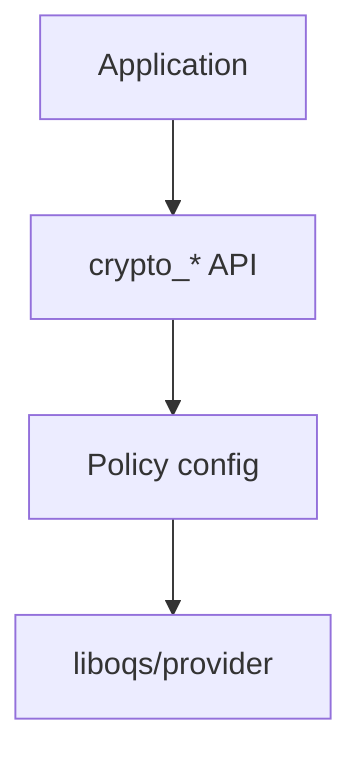

# Chapter 19: Cryptographic Agility and Migration Strategies

Migration is a **program**, not a library upgrade. We sequence discover → pilot → mandate → retire.

## 19.1 The Scale of the Challenge

To appreciate the magnitude of this transition, consider what must change:

- **Billions** of TLS endpoints must negotiate new algorithms across web servers, load balancers, CDNs, API gateways, and mobile applications
- **Millions** of applications rely on cryptographic libraries that must be updated, tested, and redeployed
- **Thousands** of distinct protocol implementations (SSH, IPsec, S/MIME, DNSSEC, and proprietary protocols) must be individually adapted
- **Hundreds** of hardware platforms — HSMs, smart cards, TPMs, secure enclaves, embedded controllers — contain cryptographic implementations in silicon or firmware that cannot be trivially updated
- **Decades** of legacy systems remain in production, some running on hardware that cannot support PQC algorithms due to memory, processing, or storage constraints

The challenge extends beyond technology. Organizational processes, regulatory compliance frameworks, vendor contracts, and staff expertise must all adapt. The interdependencies between systems mean that migration cannot happen in isolation — a single unupdated component in a chain of trust can block the entire migration for dependent systems.

Historical precedent offers limited comfort. The transition from DES to AES took over a decade. The deprecation of SHA-1 required years of coordinated effort across the web ecosystem. The PQC migration is larger in scope than either, affecting every layer of the protocol stack simultaneously.

Yet the transition is achievable. It has already begun, with major deployments of PQC key exchange in TLS by Google, Cloudflare, and others. The frameworks and tools described in this chapter provide a systematic path from assessment through completion.

> **Author's note:** Agility means **ops can change algorithms** without a monolith redeploy.


## 19.2 Cryptographic Agility

**Figure 19.1 — Enterprise migration phases**


*Figure 19.1 is the program plan we map to steering committees.*


### Definition and Importance

**Cryptographic agility** is the capability of a system to transition between cryptographic algorithms without requiring fundamental redesign of protocols, applications, or infrastructure. It is simultaneously the property that enables the current PQC migration and the long-term architectural goal that will prevent future transitions from being equally painful.

A cryptographically agile system treats algorithms as pluggable components — selected by configuration, negotiated between parties, and replaceable without breaking backward compatibility or requiring coordinated global deployment. This stands in contrast to the current reality where many systems have hard-coded algorithm choices baked into source code, database schemas, wire formats, and hardware.

### Principles of Cryptographic Agility

Building and maintaining cryptographic agility requires adherence to several architectural principles:

**1. Algorithm abstraction:**
Applications should reference cryptographic operations by their function (sign, verify, encrypt, decrypt, exchange keys) rather than by specific algorithm. A signing operation should be invoked through an interface that accepts an algorithm identifier, rather than calling `ECDSA_sign()` directly.

```
// Poor agility: algorithm hard-coded
signature = ecdsa_p256_sign(private_key, message)

// Good agility: algorithm parameterized
signature = crypto_sign(algorithm_id, private_key, message)
```

**2. Protocol-level negotiation:**
Communication protocols must include mechanisms for parties to discover and agree upon mutually supported algorithms. TLS's cipher suite negotiation and SSH's algorithm lists are examples of this principle, though their fixed-size assumptions still limit agility.

**3. Configuration-driven selection:**
Algorithm choices should be externalized to configuration files, policy engines, or management planes — not embedded in source code. This allows algorithm changes through configuration updates rather than code deployments.

**4. Key format flexibility:**
Key storage systems (databases, key management systems, file formats) must accommodate varying key sizes and types without structural modifications. A key store designed for 32-byte symmetric keys and 64-byte ECDSA public keys will fail when confronted with 1,952-byte ML-DSA-65 public keys.

**5. Size tolerance:**
Systems must handle varying sizes for keys, signatures, ciphertexts, and certificates. Fixed-size buffers, database columns with length constraints, protocol fields with size limits, and UI elements designed for specific data lengths all represent agility failures.

**6. Performance adaptability:**
Different algorithms have vastly different computational costs. Systems must accommodate varying CPU time for cryptographic operations without triggering timeouts, overloading capacity, or degrading user experience beyond acceptable thresholds.

### Current State of Agility

Despite decades of experience with algorithm transitions, many production systems lack meaningful cryptographic agility:

**Hard-coded algorithm choices:**
- Application code that directly calls algorithm-specific APIs
- Protocol implementations that assume specific key/signature sizes
- Certificate parsing code with hard-coded field expectations
- Authentication systems that embed algorithm names in stored credentials

**Fixed-size assumptions:**
- Database columns sized for RSA-2048 keys (256 bytes) that cannot store ML-DSA-65 keys (1,952 bytes)
- Wire protocol fields with length limits that reject larger PQC values
- QR codes and visual identifiers designed for short key fingerprints
- NVRAM and flash storage partitions sized for classical crypto

**Ecosystem lock-in:**
- Hardware Security Modules that support only specific algorithms
- Smart cards with fixed cryptographic capabilities
- Embedded devices with no firmware update mechanism
- Third-party APIs that accept only specific key types or signature formats

**Process rigidity:**
- Certificate management workflows that assume specific certificate sizes
- Key rotation procedures designed for specific algorithm properties
- Compliance frameworks that reference specific algorithm names rather than security levels
- Incident response playbooks that assume specific cryptographic failure modes

### Building Agility Into Systems

**Architecture pattern — the crypto abstraction layer:**

```
┌─────────────────────────────────────────────┐
│            Application Layer                  │
│  (references operations and algorithm IDs)   │
└────────────────────┬────────────────────────┘
                     │ algorithm_id + operation
┌────────────────────▼────────────────────────┐
│         Crypto Abstraction Layer             │
│  - Algorithm registry (ID → implementation)  │
│  - Policy engine (which algorithms allowed)  │
│  - Key type mapping                          │
│  - Size/format translation                   │
└────────────────────┬────────────────────────┘
                     │ dispatch
┌────────────────────▼────────────────────────┐
│         Algorithm Provider                    │
│  (OpenSSL, BoringSSL, AWS-LC, liboqs, etc.) │
│  - Pluggable provider architecture           │
│  - Runtime algorithm loading                 │
│  - Hardware acceleration dispatch            │
└────────────────────┬────────────────────────┘
                     │
┌────────────────────▼────────────────────────┐
│       Specific Implementation                │
│  (ML-KEM-768, ML-DSA-65, SLH-DSA, etc.)    │
└─────────────────────────────────────────────┘
```

**Key practices for achieving agility:**

1. Use algorithm identifiers (OIDs, named algorithms, algorithm URIs) throughout your stack — never reference raw implementations
2. Design protocols with algorithm negotiation from day one; if your protocol doesn't negotiate, add negotiation now
3. Make key and signature storage dynamic (variable-length fields in databases, elastic buffers in memory)
4. Implement algorithm deprecation as a standard operational procedure, not an emergency response
5. Test algorithm transitions regularly — rotate algorithms in non-production environments to verify agility actually works
6. Monitor algorithm usage through observability (metrics on which algorithms are negotiated, logging of algorithm failures)
7. Maintain algorithm policy documents that specify minimum security levels rather than specific algorithm names

## 19.3 Migration Framework

### The Three-Phase Approach

Based on guidelines from NIST (SP 1800-38), BSI, ANSSI, and industry best practices, a successful PQC migration follows three major phases:

**Phase 1: Discovery and Assessment (Foundation)**

This phase establishes the complete picture of cryptographic usage across the organization:

- **Comprehensive inventory:** Identify every cryptographic algorithm, key, certificate, and protocol in use across all systems, networks, and applications
- **Vulnerability assessment:** Determine which uses are vulnerable to quantum attack and under what conditions (confidentiality, authentication, integrity)
- **Risk prioritization:** Evaluate each system using Mosca's inequality and organizational risk factors to determine urgency
- **Dependency mapping:** Identify how systems, libraries, and vendors depend on each other cryptographically
- **Constraint identification:** Document hardware limitations, contractual obligations, regulatory requirements, and other factors that constrain migration options

Phase 1 deliverables: Cryptographic inventory database, risk assessment report, prioritized migration backlog, dependency graph, constraint matrix.

**Phase 2: Planning and Preparation (Architecture)**

This phase designs the target state and transition path:

- **Algorithm selection:** Choose target PQC algorithms for each use case based on security requirements, performance constraints, and standardization status
- **Architecture design:** Determine the migration pattern for each system (hybrid, direct replacement, parallel infrastructure, phased protocol)
- **Implementation development:** Build or procure PQC-capable implementations; develop integration code
- **Testing infrastructure:** Establish test environments that can validate interoperability, performance, and security
- **Rollout sequencing:** Plan the deployment order, considering dependencies, risk, and organizational capacity
- **Rollback planning:** Design mechanisms to revert to classical algorithms if PQC deployment reveals issues
- **Communication planning:** Prepare internal teams, partners, and customers for the changes

Phase 2 deliverables: Target architecture documents, implementation prototypes, test plans, deployment sequence, rollback procedures, communication materials.

**Phase 3: Execution and Validation (Deployment)**

This phase implements the migration in production:

- **Hybrid deployment:** Enable PQC alongside classical algorithms (defense-in-depth) as the first production step
- **Interoperability validation:** Confirm that PQC-enabled systems communicate correctly with all peers
- **Performance monitoring:** Track latency, throughput, bandwidth, and error rates under production load
- **Progressive enforcement:** Gradually increase PQC requirements — from optional to preferred to required
- **Classical deprecation:** Disable classical algorithms according to the planned timeline
- **Continuous validation:** Ongoing monitoring, testing, and vulnerability assessment
- **Documentation and knowledge transfer:** Ensure operational teams can maintain the PQC deployment

Phase 3 deliverables: Production deployments, monitoring dashboards, updated operational procedures, compliance documentation, lessons learned.

### Prioritization Framework

Not all systems need to migrate simultaneously. Prioritization should consider both the risk of quantum attack and the feasibility of migration:

| Priority | Risk Profile | Migration Difficulty | Examples | Action |
|----------|-------------|---------------------|----------|--------|
| Critical (P0) | Long-lived data (>25yr), high value, exposed to HNDL | Any difficulty | Government classified, healthcare records, legal archives, strategic IP | Start immediately — even high-difficulty items |
| High (P1) | Moderate data lifetime (10-25yr), significant impact | Low to medium | Financial transactions, corporate communications, customer PII | Plan now, begin execution within 6 months |
| Medium (P2) | Shorter data lifetime (5-10yr), moderate impact | Any | Session authentication, internal APIs, operational data | Begin planning, execute within 12-18 months |
| Lower (P3) | Ephemeral data (<5yr), limited exposure | Any | Development/test environments, internal logging, caching layers | Monitor, plan for future migration cycles |
| Deferred | Minimal quantum risk | Very high (hardware replacement) | Air-gapped systems with physical security, systems approaching end-of-life | Evaluate at next hardware refresh cycle |

The prioritization must also account for dependencies: a lower-priority system that blocks migration of a higher-priority system inherits the higher priority.

## 19.4 Cryptographic Inventory

The cryptographic inventory is the foundation of any migration effort. Without a comprehensive understanding of what cryptography is in use, where, and why, migration planning is guesswork.

**Figure 19.2 — Cryptographic agility architecture**



*Figure 19.2: agility is an API/config layer, not a one-off library swap.*

### What to Inventory

A complete cryptographic inventory captures eight categories of information:

**1. Algorithms in use:**
Every cryptographic algorithm across the organization: RSA-2048, RSA-4096, ECDSA P-256, ECDSA P-384, Ed25519, X25519, AES-128-GCM, AES-256-GCM, SHA-256, SHA-384, HMAC-SHA256, ChaCha20-Poly1305, and any others. Include both quantum-vulnerable (asymmetric) and quantum-resistant (symmetric, hash) algorithms.

**2. Usage context:**
How each algorithm is used: key exchange, digital signatures, authentication, data encryption at rest, data encryption in transit, key wrapping, message authentication codes, random number generation.

**3. Key locations:**
Where cryptographic keys are stored: HSMs, cloud KMS (AWS KMS, Azure Key Vault, GCP Cloud KMS), local keystores (Java KeyStore, PKCS#12), certificate files, embedded in source code or configuration, smart cards, TPMs, secure enclaves.

**4. Protocol dependencies:**
Which protocols carry the cryptographic operations: TLS versions and cipher suites, SSH algorithm lists, IPsec/IKE proposals, S/MIME certificate types, DNSSEC zone signing algorithms, custom application protocols.

**5. Library and framework versions:**
The specific cryptographic implementations in use: OpenSSL 1.1.1, OpenSSL 3.x, BoringSSL, libsodium, Bouncy Castle, Windows CNG, Apple CryptoKit, AWS-LC, wolfSSL. Version numbers are critical — they determine PQC readiness.

**6. Hardware dependencies:**
Cryptographic hardware with fixed capabilities: HSM models and firmware versions, smart card types, TPM specifications, hardware security keys (FIDO2), custom ASICs, network accelerator cards.

**7. Data protection duration:**
For each piece of encrypted data, how long must confidentiality be maintained? This ranges from seconds (session keys) to decades (medical records, legal documents, state secrets). This directly drives HNDL risk assessment.

**8. External dependencies:**
Third-party systems that participate in cryptographic operations: partner API endpoints, certificate authorities, cloud services, payment processors, identity providers, vendor-managed systems.

### Automated Discovery Tools

Manual inventory of large environments is impractical. Automated tools accelerate discovery:

**Network-layer scanning:**
- TLS/SSH protocol scanners (sslyze, testssl.sh, ssh-audit) identify configured algorithms on reachable services
- Passive network monitoring captures algorithm negotiations from traffic without active probing
- Certificate transparency log monitoring identifies all publicly issued certificates for owned domains
- Cloud provider APIs enumerate TLS configurations on load balancers, CDNs, and managed services

**Code-level analysis:**
- Static Application Security Testing (SAST) tools with cryptographic detection capabilities identify algorithm usage in source code
- Custom rules for tools like Semgrep, CodeQL, or SonarQube can flag specific crypto API calls
- Dependency analysis identifies which libraries provide cryptographic functionality
- Binary analysis tools (for compiled applications without source access) detect cryptographic constants and API calls

**Infrastructure scanning:**
- Configuration management databases (CMDBs) often record security configurations
- HSM inventory systems track key types and usage
- Certificate lifecycle management platforms provide certificate inventory
- Cloud security posture management (CSPM) tools identify cryptographic configurations in cloud environments

**CBOM (Cryptographic Bill of Materials) tools:**
- Automated CBOM generation tools produce machine-readable inventories following emerging standards (OWASP CBOM, IBM Quantum Safe)
- These tools combine static analysis, network scanning, and configuration inspection into unified inventories
- CBOM formats enable automated risk assessment and migration tracking

### The Inventory Process

A structured process ensures comprehensive coverage:

```
1. SCOPE DEFINITION
   ├─ Define organizational boundaries (which business units, systems, networks)
   ├─ Identify system owners and responsible parties
   ├─ Define inventory granularity (per-service, per-application, per-key)
   └─ Establish update cadence (initial inventory + ongoing discovery)

2. AUTOMATED DISCOVERY
   ├─ Deploy network scanners across all network segments
   ├─ Run code analysis on all application repositories
   ├─ Collect configuration from infrastructure-as-code repositories
   ├─ Query certificate management platforms and CT logs
   └─ Extract HSM key inventories and cloud KMS metadata

3. MANUAL ASSESSMENT
   ├─ Review embedded systems and OT (Operational Technology) environments
   ├─ Document custom protocols and proprietary implementations
   ├─ Interview system owners about undocumented cryptographic usage
   ├─ Assess vendor-managed systems (request information from vendors)
   └─ Review legacy systems without automated tooling access

4. CLASSIFICATION
   ├─ Categorize each finding: quantum-vulnerable vs. quantum-resistant
   ├─ Assess data lifetime and sensitivity
   ├─ Identify HNDL exposure (is data traversing networks?)
   ├─ Tag with migration priority based on risk framework
   └─ Note dependencies between systems

5. GAP ANALYSIS
   ├─ Compare current state to target state (PQC-ready)
   ├─ Identify systems that cannot support PQC (hardware limitations)
   ├─ Map library upgrade paths (current version → PQC-capable version)
   ├─ Identify missing agility capabilities
   └─ Document vendor dependencies blocking migration

6. PRIORITIZED MIGRATION PLAN
   ├─ Sequence migrations based on risk, feasibility, and dependencies
   ├─ Identify quick wins (systems already on modern libraries)
   ├─ Flag blocking issues requiring long lead times (hardware refresh, vendor engagement)
   ├─ Estimate resource requirements per migration item
   └─ Establish milestones and checkpoints
```

The inventory is not a one-time activity. New systems are deployed continuously, configurations change, and the threat landscape evolves. Establish ongoing cryptographic monitoring that updates the inventory continuously and flags new instances of quantum-vulnerable cryptography.

## 19.5 Risk Assessment

### Mosca's Inequality Revisited

Michele Mosca's inequality provides the fundamental framework for quantum risk assessment. For any system protecting data or operations:

- **x** = Security shelf life: how long must the data remain protected (confidential, authentic, or both)?
- **y** = Migration time: how long will it take to deploy PQC protection for this system (including planning, implementation, testing, and deployment)?
- **z** = Threat timeline: when will a cryptographically relevant quantum computer (CRQC) be available to adversaries?

**If x + y > z, action must begin now.**

This inequality reveals a critical insight: even if a CRQC is 15 years away (z = 15), a system protecting 25-year secrets (x = 25) that requires 3 years to migrate (y = 3) has x + y = 28 > 15, meaning migration should have started years ago.

For HNDL attacks specifically, the inequality simplifies: if y > z - today (i.e., migration takes longer than the remaining time until CRQC), then data being transmitted today will be compromised. Since we do not know z precisely, the conservative approach is to begin migration immediately for any long-lived data.

**Estimating z (CRQC timeline):**

Expert estimates for CRQC arrival vary widely, but recent surveys suggest:
- Optimistic: 2030-2035 (some national intelligence agencies may have access earlier)
- Moderate consensus: 2035-2040
- Conservative: 2040-2050

The wide range reflects genuine uncertainty. For risk planning, organizations should assume the optimistic end of the range for their most sensitive data and the moderate range for general planning.

### Risk Scoring Matrix

A practical risk scoring approach combines data lifetime, migration difficulty, and data sensitivity:

| Data Lifetime | Migration Difficulty | Data Sensitivity | Risk Score | Required Action |
|--------------|---------------------|-----------------|-----------|-----------------|
| >25 years | High (embedded/hardware) | Critical (classified, PII) | 10 (Critical) | Executive priority; start immediately regardless of cost |
| >25 years | Low (software update) | Critical | 9 (Critical) | Begin execution within 3 months |
| >25 years | High | High (financial, IP) | 8 (High) | Initiate project; secure funding |
| 10-25 years | High | Critical | 8 (High) | Initiate project; secure funding |
| 10-25 years | Low | Critical | 7 (High) | Plan and begin within 6 months |
| 10-25 years | High | High | 7 (High) | Plan and begin within 6 months |
| 10-25 years | Low | High | 6 (Medium-High) | Plan within 12 months |
| 5-10 years | High | Critical | 6 (Medium-High) | Plan within 12 months |
| 5-10 years | Low | Any | 5 (Medium) | Include in next refresh cycle |
| <5 years | High | Any | 4 (Medium) | Plan for hardware refresh |
| <5 years | Low | Any | 3 (Low) | Schedule migration; no urgency |

### Quantum Risk Categories

Different types of quantum threats require different urgency levels and mitigation strategies:

**Category 1: Store-and-break (HNDL — Harvest Now, Decrypt Later)**

This risk exists today for any data transmitted over networks using quantum-vulnerable key exchange. An adversary records encrypted traffic and waits for quantum capability to decrypt.

- **Affected operations:** Key exchange (Diffie-Hellman, ECDH, RSA key transport)
- **Risk timeline:** Active now for data with long confidentiality requirements
- **Mitigation:** PQC key exchange (highest urgency)
- **Detection:** Cannot detect harvesting after it occurs
- **Assessment question:** "If this data were decrypted in 15 years, what would the impact be?"

**Category 2: Real-time cryptographic break**

This risk materializes only when a CRQC exists and an adversary uses it to break cryptographic operations in real-time.

- **Affected operations:** Authentication (digital signatures, certificate verification), real-time key exchange
- **Risk timeline:** Begins when CRQC exists; does not retroactively affect past authenticated communications
- **Mitigation:** PQC signatures and authentication (important but less urgent than key exchange)
- **Assessment question:** "If an adversary could forge signatures or authenticate as anyone, what could they do to this system?"

**Category 3: Retroactive forgery and integrity loss**

Digital signatures created with quantum-vulnerable algorithms become untrustworthy once a CRQC exists, even for signatures created years ago.

- **Affected operations:** Code signing, document signing, audit logs, legal records, certificate chains
- **Risk timeline:** Future CRQC invalidates all historical signatures
- **Mitigation:** Timestamp services with PQC, re-signing of critical records, hash-based commitment schemes
- **Assessment question:** "If all historical digital signatures were considered unreliable, what records or systems would be affected?"

## 19.6 Migration Patterns

Four primary patterns have emerged for migrating systems to PQC. Each has distinct advantages, challenges, and appropriate use cases.

### Pattern 1: Hybrid Overlay

Add PQC alongside existing classical cryptography without removing the classical component. The system's security is maintained as long as either component remains unbroken.

```
Before:  Client ←──(ECDH shared secret)──→ Server
After:   Client ←──(ECDH_ss || ML-KEM_ss)──→ Server
         Final key = KDF(ECDH_ss || ML-KEM_ss)
```

**Advantages:**
- No reduction in classical security (the system is at least as secure as before)
- Gradual rollout possible (hybrid with willing peers, classical with others)
- Provides quantum resistance immediately upon deployment
- Allows PQC algorithms to be field-tested while maintaining a classical safety net
- Recommended by ANSSI, BSI, and most national cybersecurity agencies

**Challenges:**
- Increased bandwidth (both classical and PQC key material transmitted)
- Increased complexity (two key exchanges, combined secret derivation)
- Potential for implementation errors in the combination logic
- Some legacy implementations may fail when receiving larger messages
- Performance overhead (two computations instead of one)

**Best suited for:**
- TLS key exchange (the dominant deployment pattern today)
- SSH key exchange
- VPN key establishment
- Any protocol where backward compatibility is essential during transition

**Implementation guidance:**
- Combine shared secrets via concatenation + KDF (not XOR)
- Negotiate hybrid support via protocol extension; fall back to classical-only for peers that do not support PQC
- Treat the classical component as necessary for interoperability, the PQC component as necessary for quantum security
- Plan for eventual removal of the classical component (Pattern 1 transitions to Pattern 2 over time)

### Pattern 2: Algorithm Replacement

Direct substitution of the classical algorithm with a PQC algorithm. No hybrid combination; the system relies entirely on PQC.

```
Before:  signature = Sign(ECDSA_key, document)
After:   signature = Sign(ML-DSA_key, document)
```

**Advantages:**
- Simpler implementation (one algorithm, not two)
- Smaller overhead than hybrid (only PQC sizes, not PQC + classical)
- No ongoing dependency on classical cryptography
- Clean architecture without transition-period complexity

**Challenges:**
- Requires high confidence in PQC algorithm security (no classical fallback)
- No interoperability with systems that only support classical algorithms
- Algorithm-specific quirks (ML-DSA's non-deterministic signing, key sizes) must be fully understood
- Rolling back requires re-keying, re-signing, or re-encrypting

**Best suited for:**
- New systems with no backward compatibility requirements
- Internal systems where all peers can be updated simultaneously
- Scenarios where the classical algorithm provides no meaningful security anyway (e.g., quantum computers already exist)
- Code signing for new platforms (future firmware will only run on PQC-aware systems)

### Pattern 3: Parallel Infrastructure

Operate separate classical and PQC systems simultaneously during the transition period, with cross-certification or bridging between them.

```
Classical Infrastructure:        PQC Infrastructure:
┌─────────────────────┐         ┌─────────────────────┐
│ Classical Root CA    │←cross─→│ PQC Root CA          │
│   ↓                 │  sign  │   ↓                  │
│ Classical Intermediate│        │ PQC Intermediate     │
│   ↓                 │         │   ↓                  │
│ Classical End-Entity │         │ PQC End-Entity       │
└─────────────────────┘         └─────────────────────┘
```

**Advantages:**
- Clean separation of concerns; each infrastructure is internally consistent
- Easy rollback (simply revert to classical infrastructure)
- No risk of interference between classical and PQC components
- Clear migration milestone (cut over from classical to PQC)
- Useful for testing PQC at scale without affecting production classical systems

**Challenges:**
- Double the infrastructure cost during transition (servers, HSMs, certificates, management)
- Synchronization between parallel systems (users/entities exist in both)
- Cross-certification complexity
- Longer transition period (both systems must be maintained until classical is fully retired)

**Best suited for:**
- Large PKI deployments where hybrid certificates are not feasible
- Organizations with strict change management that prefer clean cut-overs
- Government and military systems with formal accreditation requirements
- Financial systems where any risk of disruption is unacceptable

### Pattern 4: Phased Protocol Migration

Migrate different protocol layers independently, starting with the highest-priority protection and progressing through the stack:

```
Phase 4A: Key exchange → PQC (protects against HNDL immediately)
          ┌─────────────────────────────────────────┐
          │ Data confidentiality: quantum-safe       │
          │ Authentication: still classical          │
          └─────────────────────────────────────────┘

Phase 4B: Session authentication → PQC
          ┌─────────────────────────────────────────┐
          │ Data confidentiality: quantum-safe       │
          │ Session authentication: quantum-safe     │
          │ Long-term identity: still classical      │
          └─────────────────────────────────────────┘

Phase 4C: Long-term keys and certificates → PQC
          ┌─────────────────────────────────────────┐
          │ Data confidentiality: quantum-safe       │
          │ Authentication: quantum-safe             │
          │ Identity infrastructure: quantum-safe    │
          └─────────────────────────────────────────┘

Phase 4D: Stored data re-encryption → PQC
          ┌─────────────────────────────────────────┐
          │ All layers: fully quantum-safe           │
          └─────────────────────────────────────────┘
```

**Advantages:**
- Highest-risk operations (key exchange) protected first
- Each phase provides incremental security improvement
- Complexity is distributed over time
- Allows learning from each phase before proceeding to the next

**Challenges:**
- Extended transition period with partial protection
- Some systems may be difficult to upgrade partially (tightly coupled layers)
- Tracking which phase each system is in adds operational complexity

**Best suited for:**
- Large organizations with diverse system portfolios
- Environments where complete simultaneous migration is infeasible
- Risk-driven approaches where HNDL is the primary concern

## 19.7 Dependency Management

### Critical Dependencies

PQC migration frequently reveals deep dependency chains that constrain the migration schedule. A single unupdated component can block migration of many dependent systems.

**Typical dependency chain:**
```
Application A uses Framework F (e.g., Spring Boot 2.x)
  → Framework F depends on Library L (e.g., Bouncy Castle 1.70)
    → Library L depends on JDK 11+ for certain APIs
      → JDK 11 needs OS version ≥ X for performance features
        → OS version X requires hardware driver updates
          → Hardware vendor hasn't released updated drivers
```

**Common blocking dependencies:**
- Cryptographic libraries without PQC support (older OpenSSL, proprietary libraries)
- HSMs with firmware that doesn't support PQC algorithms
- Certificate authorities that don't issue PQC certificates
- Operating system trust stores that don't include PQC root CAs
- Network middleware (load balancers, WAFs, proxies) that don't support PQC TLS
- Compliance frameworks that haven't approved PQC algorithms
- Partner/customer systems that cannot consume PQC-protected communications

### Dependency Resolution Strategies

**1. Bottom-up (infrastructure-first):**
Update foundational infrastructure components first, then let applications benefit as they upgrade:
- Update cryptographic libraries (OpenSSL → 3.x with oqs-provider)
- Update HSM firmware to support PQC algorithms
- Deploy PQC-capable TLS termination at network edge
- Applications gain PQC automatically when they use the updated infrastructure

Advantage: Enables many applications simultaneously. Disadvantage: Long lead time before any application benefits.

**2. Top-down (application-first):**
Start with the highest-priority application, identify everything it needs, and drive requirements down the stack:
- "Application A must have PQC by date X"
- Identify all dependencies blocking that goal
- Fund and prioritize those specific dependency upgrades
- Other applications benefit as a side effect

Advantage: Fastest time-to-value for the most critical system. Disadvantage: May leave most systems unprotected while focusing on one.

**3. Middleware abstraction:**
Insert a cryptographic abstraction layer between applications and their cryptographic dependencies:
- Applications call the abstraction layer (which supports PQC)
- The abstraction layer dispatches to available implementations
- Legacy libraries continue to handle classical operations
- PQC operations route to new providers
- Applications need not wait for their direct dependencies to upgrade

Advantage: Decouples applications from library upgrade timelines. Disadvantage: Additional complexity and potential performance overhead.

**4. Parallel deployment:**
Run new PQC-capable infrastructure alongside existing classical infrastructure and migrate applications one by one:
- New load balancers with PQC TLS handle migrated applications
- Classical load balancers continue serving non-migrated applications
- DNS or routing directs each application to the appropriate infrastructure
- Gradual migration without disrupting either environment

Advantage: Minimal risk to existing systems. Disadvantage: Infrastructure cost during transition.

### Vendor Dependencies

External vendor dependencies are often the longest pole in the migration tent:

**Cloud provider PQC timelines:**
- AWS, Azure, and GCP have all announced PQC roadmaps
- Managed services (managed databases, managed Kubernetes, serverless) may lag self-managed equivalents
- Service-level encryption (KMS, managed TLS) follows the provider's timeline, not yours
- Review provider roadmaps and communicate urgency for your timeline

**Certificate Authority readiness:**
- Public CAs must update their infrastructure to issue PQC certificates
- Root programs (Mozilla, Apple, Microsoft, Google) must accept PQC root CAs
- Timeline for PQC certificates in public WebPKI: depends on root program acceptance
- Private CAs (enterprise) can move independently of public root programs

**HSM vendor firmware:**
- HSM lifecycle: 7-10 years; many deployed HSMs cannot support PQC
- Firmware updates (when available) require HSM vendor engagement and testing
- New HSM procurement may have lead times of months
- Budget for HSM replacement must be allocated early

**Partner ecosystem:**
- B2B integrations require both parties to support PQC
- Coordinate with critical partners on PQC migration timelines
- Contractual updates may be needed for changed security requirements
- Industry working groups facilitate coordinated partner migration

### Creating a Dependency Resolution Plan

A practical approach to dependency management:

```
1. MAP: Create a directed graph of all cryptographic dependencies
   - Nodes: systems, libraries, services, hardware, vendors
   - Edges: "depends on for PQC" relationships
   - Identify cycles and strongly connected components

2. CLASSIFY: For each dependency, determine:
   - Is PQC support available today? (Ready)
   - Is PQC support planned with a published timeline? (Planned)
   - Is PQC support unknown or not planned? (Blocked)
   - Is the dependency end-of-life with no successor? (Dead end)

3. SEQUENCE: Determine migration order:
   - Start with leaf nodes (no downstream dependencies)
   - Progress inward through the graph
   - Blocked and dead-end nodes require workarounds or replacements

4. EXECUTE: For each dependency in sequence:
   - Update, replace, or work around
   - Validate that dependent systems can now proceed
   - Move to next dependency in sequence

5. MONITOR: Track dependency resolution progress:
   - Dashboard showing blocked vs. resolved dependencies
   - Alert on new dependencies introduced by system changes
   - Regular review of vendor roadmap commitments
```

## 19.8 Testing Strategy

PQC migration introduces changes that can affect functionality, performance, and security in subtle ways. Comprehensive testing is essential before production deployment.

### Compatibility Testing

**Interoperability testing:**
Verify that PQC-enabled systems communicate correctly with all expected peers:
- Test PQC client with PQC server (should use PQC algorithms)
- Test PQC client with classical-only server (should negotiate classical fallback)
- Test classical client with PQC-capable server (should negotiate classical)
- Test across different implementations (OpenSSL ↔ BoringSSL ↔ Java ↔ Go)
- Verify correct algorithm negotiation precedence
- Test with middleboxes (proxies, WAFs, load balancers) in the path

**Backward compatibility testing:**
- Ensure that enabling PQC does not break communication with legacy systems
- Test oldest supported client versions against PQC-enabled servers
- Verify graceful degradation when PQC is not mutually supported
- Test protocol version fallback behavior

**Failure mode testing:**
- What happens when a PQC key exchange fails? (Implementation bug, corrupted message)
- Does the system correctly fall back to classical algorithms?
- Are error messages meaningful and actionable?
- Do monitoring systems correctly report PQC-related failures?
- Does the system remain available when PQC operations timeout?

**Rollback testing:**
- Can PQC be disabled quickly if issues are discovered in production?
- Does disabling PQC restore full classical operation without side effects?
- Are rollback procedures documented and practiced?
- What is the rollback time (minutes, hours, days)?

### Performance Testing

| Test Type | Purpose | Key Metrics | PQC-Specific Concerns |
|-----------|---------|-------------|----------------------|
| Latency benchmark | Handshake time increase | P50, P95, P99 latency | Initial connection cost; session resumption amortization |
| Throughput test | Operations/second under load | Max TPS, saturation point | CPU utilization from PQC operations |
| Bandwidth test | Network utilization | Bytes/connection, peak bandwidth | Larger handshakes; certificate chain overhead |
| Memory test | RAM consumption under load | Peak memory, per-connection cost | Larger key material in memory; operation buffers |
| Endurance (soak) test | Long-term stability | Memory leaks, GC pressure, degradation | Long-running PQC operations; key rotation under load |
| Scalability test | Behavior at scale | Connection limits, clustering behavior | HSM throughput limits for PQC operations |
| Cold-start test | First-connection latency | Time to first byte | Certificate chain fetch + PQC handshake combined |

**Performance acceptance criteria should be established before deployment:**
- Maximum acceptable P99 latency increase (e.g., <10 ms for web applications)
- Minimum throughput that must be maintained (e.g., 95% of classical throughput)
- Maximum bandwidth increase budget (e.g., <30% additional bytes)
- CPU headroom requirement (e.g., PQC must not push CPU utilization above 80%)

### Security Testing

**Constant-time implementation verification:**
- Side-channel attacks remain relevant for PQC implementations
- Use tools (ctgrind, dudect, timecop) to verify constant-time execution of sensitive operations
- ML-KEM decapsulation and ML-DSA signing are particularly sensitive to timing leaks
- Test across different CPU architectures (x86, ARM) and optimization levels

**Fuzzing:**
- Fuzz PQC implementations with malformed inputs: invalid public keys, corrupted ciphertexts, truncated signatures
- Test parsing code for certificate and key format handling with PQC-sized inputs
- Memory-safety fuzzing (AddressSanitizer, MemorySanitizer) for C/C++ implementations
- Protocol-level fuzzing: send malformed PQC key shares in TLS ClientHello

**Known Answer Test (KAT) verification:**
- Verify implementations against NIST-published KAT vectors
- Confirm correct behavior for all parameter sets (ML-KEM-512/768/1024, ML-DSA-44/65/87)
- Test both reference and optimized (AVX2, NEON) code paths
- Re-verify after any compiler, library, or platform update

**Formal verification (for critical deployments):**
- Mathematical proofs of implementation correctness for core algorithms
- Verified implementations exist (e.g., libjade for ML-KEM)
- Protocol-level formal verification (ProVerif, Tamarin) for custom PQC protocol integrations
- Particularly important for key encapsulation where decapsulation failure modes are complex

## 19.9 Organizational Readiness

Technical migration succeeds only with appropriate organizational support. People, processes, and budgets must align with the migration goals.

### Roles and Responsibilities

| Role | Responsibility | Key Activities |
|------|---------------|----------------|
| Executive Sponsor (CISO/CTO) | Strategy, risk acceptance, resource allocation | Approve migration strategy; allocate budget; accept residual risk; report to board |
| PQC Program Manager | Overall coordination and tracking | Maintain migration plan; track progress; manage dependencies; escalate blockers |
| Security Architect | Algorithm selection, protocol design, architecture | Define target architecture; select algorithms per use case; review implementations |
| Cryptographic Engineer | Implementation and integration | Implement PQC in libraries and applications; optimize performance; resolve bugs |
| Application Teams | Integration, testing, deployment | Update applications; run integration tests; deploy changes; monitor production |
| Infrastructure/Platform | Library updates, certificate deployment, network config | Update shared libraries; deploy PQC-capable infrastructure; manage certificates |
| QA/Testing | Validation and verification | Execute test plans; performance testing; interoperability testing; regression testing |
| Compliance/Legal | Regulatory alignment, audit preparation | Map requirements to PQC standards; prepare audit evidence; update policies |
| Vendor Management | Third-party PQC readiness tracking | Engage vendors on PQC roadmaps; negotiate timelines; evaluate alternatives |
| Training/Enablement | Knowledge building across organization | Develop training materials; run workshops; maintain internal documentation |

### Timeline Planning

A realistic PQC migration timeline for a large enterprise:

```
YEAR 1: FOUNDATION
├─ Months 1-3:   Executive awareness and strategic commitment
│                 ├─ Board/C-suite briefing on quantum risk
│                 ├─ Migration program chartered and funded
│                 └─ Program manager and core team assigned
├─ Months 3-6:   Cryptographic inventory
│                 ├─ Automated discovery tools deployed
│                 ├─ Network scanning completed
│                 ├─ Code analysis of critical applications
│                 └─ Initial CBOM generated
└─ Months 6-12:  Risk assessment and prioritization
                  ├─ Mosca's inequality evaluated per system
                  ├─ Risk scoring completed
                  ├─ Dependency graph mapped
                  └─ Prioritized migration backlog created

YEAR 2: ARCHITECTURE AND PILOTS
├─ Months 12-15: Standards and architecture
│                 ├─ Algorithm selection per use case documented
│                 ├─ Target architecture defined
│                 ├─ Internal cryptographic standards updated
│                 └─ Procurement requirements include PQC
├─ Months 15-18: Pilot implementations
│                 ├─ PQC enabled on non-critical systems
│                 ├─ Performance baseline established
│                 ├─ Interoperability validated
│                 └─ Operational procedures tested
└─ Months 18-24: Broad hybrid deployment (high-priority systems)
                  ├─ PQC key exchange enabled for critical data flows
                  ├─ Hybrid certificates deployed for high-priority services
                  ├─ Partner coordination initiated
                  └─ Monitoring and incident response updated

YEAR 3-4: BROAD DEPLOYMENT
├─ Months 24-36: Full hybrid coverage
│                 ├─ PQC key exchange across all external-facing systems
│                 ├─ Internal systems migrated per priority
│                 ├─ Hardware refresh includes PQC requirements
│                 └─ Vendor dependencies resolved or worked around
└─ Months 36-48: PQC authentication deployment
                  ├─ PQC certificates in production
                  ├─ Code signing with PQC
                  ├─ SSH authentication with PQC
                  └─ Classical-only configurations flagged

YEAR 5+: COMPLETION AND CLASSICAL DEPRECATION
├─ Months 48-60: PQC-primary operation
│                 ├─ Classical algorithms moved to fallback/legacy role
│                 ├─ New systems deployed PQC-only
│                 └─ Compliance with CNSA 2.0 and regulatory requirements
└─ Months 60+:   Classical deprecation
                  ├─ Classical-only connections refused
                  ├─ Legacy systems decommissioned or isolated
                  └─ Ongoing agility maintenance for future transitions
```

### Budget Considerations

PQC migration costs span multiple categories. Organizations should budget for:

**Technology costs:**
- Cryptographic library upgrades and licensing (if commercial libraries used)
- HSM replacement or firmware upgrades (often the largest hardware cost: $50K-500K per HSM depending on FIPS level)
- Increased bandwidth costs (10-30% more bytes for PQC handshakes, temporary during hybrid period)
- Additional compute capacity (PQC operations use more CPU; may require capacity additions)
- Testing infrastructure (dedicated test environments, performance testing tools)
- Certificate re-issuance costs (new PQC certificates from CAs)

**Personnel costs:**
- Dedicated PQC program staff (program manager, cryptographic engineers)
- Training existing staff in PQC concepts and implementation
- Application team time for integration work (often the largest cost in total)
- Security team time for risk assessment, testing, and validation
- External consultants for specialized expertise or accelerated timelines

**Process costs:**
- Compliance re-certification (FIPS 140-3, Common Criteria, PCI DSS updates)
- Audit preparation and evidence collection
- Documentation updates (architecture documents, operational procedures, disaster recovery plans)
- Vendor engagement and contract negotiation

**Risk mitigation costs:**
- Extended parallel running of classical and PQC infrastructure
- Enhanced monitoring during transition
- Incident response preparation for PQC-related issues
- Insurance or contractual provisions for transition-related failures

## 19.10 Government and Regulatory Drivers

Government mandates and regulatory requirements provide both motivation and timelines for PQC migration. Organizations subject to these requirements must align their migration plans accordingly.

### United States

**National Security Memorandum 10 (NSM-10, 2022):**
The White House memorandum "Promoting United States Leadership in Quantum Computing While Mitigating Risks to Vulnerable Cryptographic Systems" directed federal agencies to begin preparing for PQC migration. Key requirements:
- Agencies must inventory their cryptographic systems
- Agencies must identify systems vulnerable to quantum attack
- Migration plans must be developed and submitted

**OMB Memorandum M-23-02:**
"Migrating to Post-Quantum Cryptography" provides specific implementation guidance:
- Cryptographic inventory due dates for federal agencies
- Prioritization criteria for federal systems
- Reporting requirements for migration progress
- Budget justification guidance for PQC activities

**CNSA 2.0 (NSA Commercial National Security Algorithm Suite 2.0):**

The NSA's timeline for National Security Systems provides the most concrete migration schedule:

| Requirement | Algorithm | Timeline |
|------------|-----------|----------|
| Software/firmware signing | ML-DSA-87, SLH-DSA | Prefer by 2025 |
| Web browsers/servers (TLS) | ML-KEM-1024, ML-DSA-87 | Required by 2027 |
| Networking equipment (VPN/IPsec) | ML-KEM-1024, ML-DSA-87 | Required by 2030 |
| Operating systems | ML-KEM-1024, ML-DSA-87 | Required by 2030 |
| Custom/niche equipment | ML-KEM-1024, ML-DSA-87 | Required by 2033 |
| Complete migration (all systems) | All CNSA 2.0 algorithms | Required by 2033 |

CNSA 2.0 mandates NIST Level 5 security (ML-KEM-1024, ML-DSA-87) for national security systems, which is more conservative than commercial recommendations (which often accept Level 3).

**FIPS 140-3 and PQC:**
- NIST is developing FIPS 203, 204, 205 for ML-KEM, ML-DSA, and SLH-DSA respectively
- Validated PQC modules will be required for federal use
- CMVP (Cryptographic Module Validation Program) is processing PQC module submissions
- Transition period allows hybrid modules with both classical (validated) and PQC algorithms

### European Union

**ENISA (European Union Agency for Cybersecurity):**
- Published "Post-Quantum Cryptography: Current State and Quantum Mitigation" guidance
- Recommends hybrid approaches during transition
- Provides risk assessment frameworks for EU member states
- Coordinates with national agencies on harmonized PQC requirements

**BSI (Germany — Federal Office for Information Security):**
- Technical Guideline TR-02102: Recommends specific PQC algorithms and parameters
- Mandates hybrid approaches (classical + PQC) for transition period
- Does not accept PQC-only until algorithms have sufficient maturity
- Provides specific guidance for German critical infrastructure operators

**ANSSI (France — National Agency for the Security of Information Systems):**
- Strictly requires hybrid deployment (no PQC-only without ANSSI approval)
- Publishes qualified product lists that include PQC-capable products
- Provides sector-specific guidance for operators of essential services
- Coordinates with NATO on alliance-wide PQC requirements

**EU Cybersecurity Act and NIS2 Directive:**
- Quantum readiness expected to become part of cybersecurity certification schemes
- Critical infrastructure operators (covered by NIS2) will face PQC requirements
- Coordinated EU approach through European Cybersecurity Certification Framework (ECCF)

### Financial Sector

Financial services face particularly stringent requirements due to the sensitivity and longevity of financial data:

**PCI DSS (Payment Card Industry Data Security Standard):**
- PCI SSC monitoring PQC developments and evaluating timeline for requirements
- Future PCI DSS versions expected to mandate PQC for payment data protection
- Organizations should begin preparation before formal requirements appear
- Cardholder data protection (long-lived data) makes HNDL a relevant threat

**SWIFT (Society for Worldwide Interbank Financial Telecommunication):**
- Post-quantum readiness program for the SWIFT network
- Customer Security Programme (CSP) will incorporate PQC requirements
- Financial messaging integrity requires PQC signatures for long-term non-repudiation
- Coordination across 11,000+ member institutions required

**Central banks and payment systems:**
- ECB, Federal Reserve, Bank of England evaluating PQC for payment systems
- Real-time gross settlement (RTGS) systems process critical transactions requiring long-term integrity
- Digital currency systems (CBDCs) being designed with PQC from inception
- Cross-border payment systems (e.g., Project mBridge) incorporating PQC considerations

## 19.11 Common Pitfalls and Lessons Learned

Organizations that have begun PQC migration efforts report consistent patterns of challenges. Learning from these experiences accelerates future migrations.

**1. Underestimating inventory scope:**
Cryptographic usage is pervasive and often invisible. Organizations consistently find 3-5× more cryptographic dependencies than initially estimated. Hidden usage includes: embedded certificates in Docker images, hard-coded keys in legacy code, cryptographic operations in third-party libraries used transitively, and operational scripts that reference specific algorithms.

*Lesson:* Budget 2× the time you think inventory will require. Use automated tools as the foundation and accept that manual discovery will be an ongoing effort.

**2. Ignoring embedded systems and OT:**
Operational Technology (OT) and embedded systems are often the hardest to migrate and the last to receive attention. Industrial control systems, medical devices, building automation, and IoT sensors may have 15-20 year lifecycles with no firmware update mechanism.

*Lesson:* Identify embedded and OT systems early. For systems that cannot be updated, plan compensating controls (network isolation, gateway-based PQC termination). Include PQC requirements in all new OT procurement.

**3. Vendor lock-in and dependency deadlocks:**
Proprietary systems with no upgrade path create hard blockers. A vendor may have no PQC roadmap, may have gone out of business, or may require expensive custom development to support PQC.

*Lesson:* Engage vendors early about PQC roadmaps. Include PQC migration clauses in new contracts. Identify alternative vendors or abstraction layers for critical proprietary dependencies. Accept that some systems will require replacement rather than upgrade.

**4. Insufficient testing:**
PQC changes subtle system behaviors: timing characteristics change (affecting load balancers and health checks), message sizes change (affecting WAF rules and buffer allocations), error messages change (affecting monitoring and alerting), and certificate validation paths change (affecting trust chain verification code).

*Lesson:* Test extensively in environments that mirror production. Include performance testing, failure mode testing, and extended soak testing. Monitor for subtle behavioral changes, not just outright failures.

**5. Big-bang migration approach:**
Attempting to migrate everything simultaneously creates overwhelming complexity, resource contention, and a risk of organization-wide disruption.

*Lesson:* Adopt phased migration. Start with the highest-priority, lowest-complexity items to build experience and confidence. Use early wins to justify continued investment. Accept that full migration will take years.

**6. Forgetting data at rest:**
Organizations often focus exclusively on protocols (data in transit) while neglecting encrypted stored data. Databases, backups, encrypted files, and archived records containing quantum-vulnerable encryption require attention.

*Lesson:* Include data at rest in the inventory and risk assessment. For long-lived archived data, re-encryption with PQC-protected keys may be necessary. For data approaching end-of-life, the cost of re-encryption may not be justified.

**7. Compliance tunnel vision:**
Treating PQC migration purely as a compliance exercise (meeting minimum regulatory requirements) rather than a genuine security improvement.

*Lesson:* Regulatory requirements represent minimums, not targets. Use the migration as an opportunity to improve cryptographic agility, key management practices, and security architecture broadly.

**8. Underestimating bandwidth and resource impact:**
PQC's larger keys, signatures, and ciphertexts have cascading effects: increased network bandwidth, larger logs, more storage for certificates, higher memory usage, and increased CPU consumption. These costs compound across large deployments.

*Lesson:* Model the resource impact before deployment. Budget for infrastructure capacity increases. Use compression, caching, and session resumption to mitigate overhead. Accept some overhead as the cost of quantum resistance.

**9. Inadequate organizational awareness:**
Technical teams may understand PQC but business stakeholders, project managers, and procurement teams may not appreciate the urgency or scope.

*Lesson:* Invest in awareness and education at all levels. Frame quantum risk in business terms (financial exposure, regulatory compliance, competitive positioning). Use Mosca's inequality with concrete organizational data to make urgency tangible.

**10. Neglecting agility for the future:**
Organizations migrate to PQC algorithms and then lock themselves into those specific algorithms, recreating the same agility failure that made the current migration difficult.

*Lesson:* The goal is not just to deploy ML-KEM and ML-DSA. The goal is to build systems that can transition to any future algorithm with minimal effort. If your PQC deployment is hard-coded to specific PQC algorithms, you have not solved the underlying problem.

**11. Ignoring supply chain and third-party risk:**
Organizations focus exclusively on their own systems while neglecting the cryptographic posture of their supply chain — software vendors, cloud providers, SaaS platforms, and integration partners.

*Lesson:* Include supply chain in your risk assessment. Request PQC roadmaps from critical vendors. Include PQC migration requirements in procurement criteria and vendor contracts. Monitor third-party dependencies for PQC readiness.

**12. Failing to communicate urgency appropriately:**
Either panic-inducing messaging that causes hasty, poorly planned decisions, or dismissive messaging that delays action until it becomes an emergency.

*Lesson:* Frame PQC migration as a multi-year engineering project with clear milestones, not as an imminent crisis or a distant future concern. Use risk-based language that motivates action without creating panic. Mosca's inequality provides the rational framework for urgency assessment.

## 19.12 Measuring Migration Progress

Organizations need concrete metrics to track migration progress and demonstrate value to stakeholders:

**Coverage metrics:**
- Percentage of external-facing TLS endpoints with PQC key exchange enabled
- Percentage of internal services using PQC-capable libraries
- Percentage of certificate chains that include PQC signatures
- Percentage of HSMs with PQC-capable firmware

**Risk reduction metrics:**
- Volume of HNDL-exposed data (bytes/day) without PQC protection — should trend toward zero
- Number of critical systems pending migration — tracked against plan
- Mean time from vulnerability disclosure to algorithm replacement (measures agility)

**Operational metrics:**
- Handshake latency percentiles (P50, P95, P99) before and after PQC deployment
- Connection error rates attributable to PQC changes
- Certificate issuance success rate with PQC algorithms
- Interoperability test pass rate across implementation combinations

**Compliance metrics:**
- Number of systems meeting CNSA 2.0 requirements (by target year)
- Cryptographic inventory completeness (percentage of systems inventoried)
- Audit finding closure rate for quantum-related findings

Reporting these metrics regularly (monthly or quarterly) to executive stakeholders maintains organizational focus and enables early identification of stalled migration efforts.---

## Chapter Summary

**Technical takeaway:** Migration is a program: CBOM → prioritize HNDL → pilot → scale → retire classical PK.

**Deployment takeaway:** Cryptographic agility is configuration and ownership—not a one-time library upgrade.

*Figures in this chapter are planning aids—verify all algorithm names and byte sizes against the current NIST FIPS PDF before implementation.*

---
