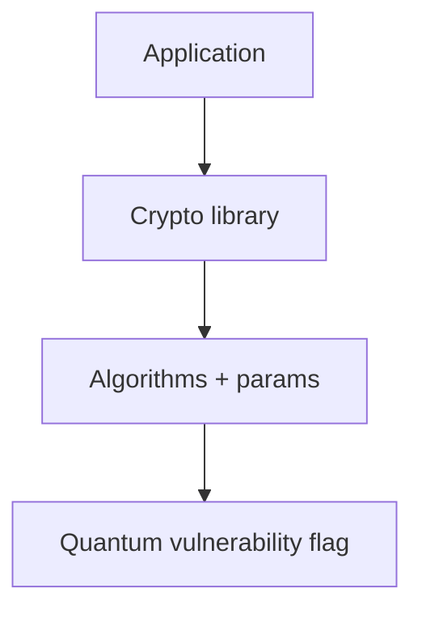
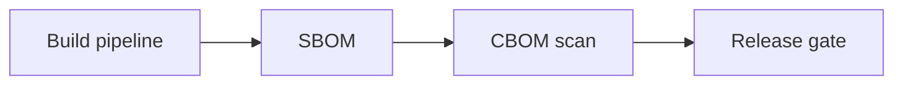

# Chapter 20: Cryptographic Bill of Materials (CBOM)

If you cannot list your algorithms, you cannot claim PQC readiness—CBOM is the **bill of health** for crypto debt.

**Figure 20.1 — CBOM data model**



---

## 20.1 What Is a CBOM?

A **Cryptographic Bill of Materials (CBOM)** is a structured, machine-readable inventory of all cryptographic assets, dependencies, configurations, and implementations within a system, application, or organization. It answers the fundamental question that most organizations cannot today: "What cryptography are we using, where is it deployed, how is it configured, and what is its quantum vulnerability status?"

The concept extends the well-established Software Bill of Materials (SBOM) into the cryptographic domain. An SBOM catalogs software components and their dependencies — it tells you that your application uses OpenSSL 3.0.12, that it depends on libcrypto, and that it was compiled with certain flags. A CBOM goes deeper into the cryptographic layer: it tells you that your application uses RSA-2048 for TLS certificate authentication, AES-256-GCM for session encryption, SHA-384 for integrity verification, and ECDHE with P-384 for key exchange. It captures not just what libraries are present, but what algorithms they implement, with what parameters, for what purposes, and with what quantum vulnerability implications.

### The SBOM-to-CBOM Evolution

The software industry spent the decade from 2014-2024 building SBOM maturity. Executive Order 14028 (2021) mandated SBOMs for software sold to the US government. The Log4Shell vulnerability in December 2021 demonstrated why: organizations that maintained SBOMs could quickly determine whether they were exposed. Those without SBOMs spent days or weeks in uncertainty.

CBOM applies this same principle to the cryptographic dimension. When a quantum computer eventually breaks RSA, organizations with CBOMs will know within minutes which systems are affected, what data is at risk, and what remediation steps are needed. Organizations without CBOMs will face the same uncertainty that those without SBOMs faced during Log4Shell — but with potentially catastrophic consequences for long-lived secrets.

### Anatomy of a CBOM

A full CBOM captures multiple dimensions of cryptographic usage:

**Algorithm inventory:** Every cryptographic algorithm in use, including key sizes, modes of operation, and parameter choices. This includes not just the primary algorithms (RSA, AES, SHA) but also their specific configurations (RSA-2048-OAEP-SHA256, AES-256-GCM with 96-bit nonces).

**Key inventory:** All cryptographic keys, including their types, sizes, generation methods, storage locations, rotation schedules, and access controls. This encompasses everything from TLS private keys to database encryption keys to API signing keys.

**Certificate inventory:** All X.509 certificates and other credential types, including their algorithms, validity periods, issuers, subjects, and chain relationships.

**Protocol inventory:** All cryptographic protocols in use (TLS 1.3, SSH, IPsec, WireGuard, etc.) with their specific configurations, cipher suite preferences, and negotiation behaviors.

**Implementation inventory:** Which libraries and implementations provide cryptographic functionality, their versions, their FIPS validation status, and their PQC readiness.

**Relationship mapping:** How cryptographic components relate to each other, to applications, to data stores, and to business processes.

### CBOM vs. Traditional Approaches

Before CBOM emerged as a discipline, organizations attempted to track cryptographic usage through several less effective methods:

**Spreadsheet inventories** relied on manual data collection, typically through surveys sent to development teams. These were perpetually outdated, incomplete, and unverifiable. A 2023 study by the Ponemon Institute found that organizations using spreadsheet-based tracking identified fewer than 40% of their actual cryptographic dependencies.

**Point-in-time assessments** provided snapshots through penetration testing or compliance audits. While more accurate than spreadsheets at the moment of assessment, they became stale within weeks as systems changed.

**Compliance-driven audits** focused only on the subset of systems in regulatory scope, leaving vast portions of infrastructure unexamined.

CBOM addresses all of these limitations through automation, standardization, and continuous maintenance — principles borrowed from the SBOM world but adapted for the unique characteristics of cryptographic assets.


**Figure 20.2 — CBOM in CI/CD**



## 20.2 Why CBOM Matters for PQC Migration

The post-quantum cryptography transition represents the largest coordinated change to cryptographic infrastructure in the history of computing. Every RSA key, every ECDSA signature, every ECDH key exchange across the global technology stack must eventually be replaced or supplemented. Without comprehensive visibility into what currently exists, this transition cannot succeed.

### Visibility: Seeing the Full Picture

Most organizations dramatically underestimate their cryptographic footprint. A mid-size enterprise typically has thousands of TLS certificates, hundreds of SSH keys, dozens of VPN configurations, and countless application-level cryptographic operations. Many of these are invisible to traditional IT asset management.

Consider a typical web application: the load balancer terminates TLS with one cipher suite configuration; the application server re-encrypts traffic with a different configuration; the database connection uses yet another set of algorithms; session tokens are signed with HMAC; user passwords are hashed with bcrypt; API calls to third parties use OAuth tokens signed with RSA. Each of these represents a distinct cryptographic dependency that must be understood for PQC migration.

CBOM provides this visibility — the complete, accurate, and current picture of what cryptography exists across the organization.

### Risk Assessment: Quantifying Quantum Exposure

Not all cryptographic usage carries equal quantum risk. CBOM enables risk-stratified analysis:

**Immediate risk (harvest-now, decrypt-later):** Data encrypted with RSA or ECDH today may be stored by adversaries for future quantum decryption. Systems protecting data with long confidentiality requirements (25+ years) face this risk today. CBOM identifies these systems and their associated data classification levels.

**Medium-term risk:** Systems that will still be operational when large-scale quantum computers arrive (estimated 2030-2040) need migration plans now. CBOM identifies these systems and their migration complexity.

**Authentication risk:** Digital signatures and authentication mechanisms will be directly threatened once quantum computers exist. Unlike encryption (where the threat is retrospective), authentication threats are prospective — they only matter when quantum computers actually become available. CBOM tracks these separately.

### Planning: Understanding Dependencies and Sequencing

PQC migration cannot happen in arbitrary order. Dependencies constrain the sequence:

- You cannot use PQC certificates until your Certificate Authority issues them
- You cannot negotiate PQC key exchange until both parties support it  
- You cannot sign firmware with PQC until the verification infrastructure is updated
- You cannot update client libraries until servers support the new algorithms

CBOM reveals these dependency chains, enabling intelligent migration sequencing. A well-structured CBOM shows not just individual cryptographic instances but their relationships — which systems depend on which certificates, which protocols negotiate with which peers, which libraries serve which applications.

### Progress Tracking: Measuring Migration Quantitatively

Leadership and regulators need quantitative answers. CBOM transforms vague status updates ("we're making progress") into precise metrics:

- "We have migrated 67% of our key exchange operations to hybrid PQC"
- "23 systems remain on RSA-2048 for authentication; all are scheduled for Q3"
- "100% of our high-sensitivity data stores now use quantum-resistant encryption"
- "Our third-party vendor portfolio is 45% PQC-ready based on vendor attestations"

Without CBOM, these numbers are estimates at best and fabrications at worst.

### Compliance: Demonstrating Readiness

Regulatory requirements for PQC readiness are already arriving. OMB M-23-02 requires federal agencies to submit cryptographic inventories. CNSA 2.0 mandates progressive PQC adoption through 2033. Financial regulators are beginning to ask about quantum risk exposure. DORA (Digital Operational Resilience Act) in the EU will increasingly require cryptographic risk assessment.

CBOM provides the evidentiary basis for compliance. It demonstrates not just that an organization is aware of quantum risk, but that it has comprehensive visibility into its exposure and a measurable plan for remediation.

### Without CBOM: The Blind Migration

Organizations attempting PQC migration without CBOM face predictable failures:

- **Unknown scope:** How many systems use RSA? ECDSA? Which key sizes? Without CBOM, the answer is "we think it's approximately..." — unacceptable precision for a migration affecting security.
- **Surprise dependencies:** A vendor system deep in the supply chain uses hardcoded ECDSA verification. No one knew until migration broke it.
- **Incomplete migration:** Eighteen months into the migration, a forgotten system in a subsidiary still uses RSA-1024. It becomes the weakest link.
- **Inability to demonstrate progress:** The CISO asks for a status update. The answer is a shrug or an unreliable estimate.
- **Emergency response failure:** A new attack is published against a specific parameter set. Without CBOM, determining exposure requires days of manual investigation.

### With CBOM: The Informed Migration

With a full CBOM, the same scenarios play out differently:

- **Scope query:** "Show all uses of RSA or ECDH in production systems classified as High-Value Assets" → immediate, precise migration target list with priority ordering.
- **Dependency discovery:** CBOM relationship mapping shows all systems dependent on a vendor's ECDSA verification, flagging the risk before migration begins.
- **Migration tracking:** "In January we had 10,847 RSA instances across production; now we have 4,219. Migration is 61% complete, tracking ahead of schedule."
- **Compliance evidence:** "Zero quantum-vulnerable algorithms remain in payment processing systems. Here is the machine-readable evidence with timestamps."
- **Rapid response:** "The new attack affects ML-KEM with parameter set X. CBOM query shows we have zero deployments matching those parameters."

## 20.3 CBOM Standards and Formats

### CycloneDX Cryptographic BOM

CycloneDX, developed under the OWASP Foundation, has emerged as the leading standard for CBOM representation. Version 1.6 (released 2024) introduced comprehensive native support for cryptographic assets as first-class components. This built upon earlier versions that supported basic algorithm identification and extended the standard with rich cryptographic metadata.

**Supported component types:**

- `crypto:algorithm` — Specific algorithm instances with full parameterization (key size, mode, padding, hash function)
- `crypto:certificate` — X.509 and other certificate types with chain relationships, validity windows, and usage constraints
- `crypto:key` — Cryptographic keys with metadata including size, type, generation method, storage location, and rotation status
- `crypto:protocol` — Protocol configurations including version, cipher suite preferences, extension support, and negotiation behavior
- `crypto:related-crypto-material` — Supporting cryptographic material including tokens, seeds, initialization vectors, nonces, and shared secrets

**Example CycloneDX CBOM entry (expanded):**

```json
{
  "bomFormat": "CycloneDX",
  "specVersion": "1.6",
  "serialNumber": "urn:uuid:3e671687-395b-41f5-a30f-a58921a69b79",
  "version": 1,
  "components": [
    {
      "type": "crypto-asset",
      "bom-ref": "crypto-001",
      "name": "RSA-2048-PKCS1v15-Sign",
      "cryptoProperties": {
        "assetType": "algorithm",
        "algorithmProperties": {
          "primitive": "pke",
          "parameterSetIdentifier": "2048",
          "executionEnvironment": "software",
          "implementationPlatform": "x86_64",
          "certificationLevel": ["fips-140-3-l1"],
          "mode": "PKCS1v15",
          "cryptoFunctions": ["sign", "verify"],
          "classicalSecurityLevel": 112,
          "nistQuantumSecurityLevel": 0
        },
        "oid": "1.2.840.113549.1.1.1"
      },
      "evidence": {
        "occurrences": [
          {
            "location": "/opt/app/lib/auth-service.jar",
            "line": 247
          }
        ]
      }
    },
    {
      "type": "crypto-asset",
      "bom-ref": "crypto-002",
      "name": "TLS-1.3-Config",
      "cryptoProperties": {
        "assetType": "protocol",
        "protocolProperties": {
          "type": "tls",
          "version": "1.3",
          "cipherSuites": [
            {
              "name": "TLS_AES_256_GCM_SHA384",
              "identifiers": ["0x13,0x02"]
            }
          ]
        }
      }
    }
  ]
}
```

**CycloneDX advantages for CBOM:**

- Machine-readable (JSON and XML formats)
- Extensible through property taxonomy
- Supports relationships between components (dependencies, implementations-of)
- Integrates with broader SBOM ecosystem tooling
- Version-controlled specification with clear evolution path
- Supported by major security tools and platforms

### SPDX (Software Package Data Exchange)

While CycloneDX leads in CBOM-specific features, SPDX (an ISO/IEC standard — ISO/IEC 5962:2021) also supports cryptographic asset documentation through its security extension mechanisms. SPDX 3.0 introduced snippet-level granularity that can identify specific cryptographic code usage within larger packages. Organizations already standardized on SPDX for SBOM can extend their existing workflows to include cryptographic metadata.

### NIST CBOM Guidance

NIST Special Publication 1800-38 (Migration to Post-Quantum Cryptography) provides authoritative guidance on CBOM creation and use. Key principles include:

**Automated discovery over manual inventory:** NIST emphasizes that manual cryptographic inventories cannot achieve the accuracy or currency needed for PQC migration. The guidance recommends automated discovery as the primary mechanism, with manual enrichment for context that automation cannot capture (business classification, data lifetime requirements, ownership).

**Machine-readable format for interoperability:** CBOM data must be machine-readable to enable automated analysis, dashboarding, and integration with risk management tools. NIST references CycloneDX as a suitable format and encourages use of standardized identifiers (OIDs, NIST algorithm names) for consistency.

**Integration with risk management frameworks:** CBOM should not exist in isolation but should feed into enterprise risk management processes. Quantum vulnerability assessments derived from CBOM data should appear alongside other risk factors in GRC (Governance, Risk, Compliance) platforms.

**Continuous monitoring and updating:** A CBOM reflects a point in time. As systems change — new deployments, library updates, configuration changes — the CBOM must be updated. NIST recommends integration with CI/CD pipelines and deployment monitoring to maintain currency.

**Prioritized migration planning:** CBOM data combined with data classification enables risk-prioritized migration. Systems protecting data with long confidentiality requirements and high sensitivity should migrate first.

### Key CBOM Fields

A full CBOM record captures the following information for each cryptographic instance:

| Field | Description | Example Values |
|-------|-------------|----------------|
| Algorithm | Specific algorithm with parameterization | RSA-2048, AES-256-GCM, ML-KEM-768 |
| Function | Cryptographic purpose | Encryption, signing, key exchange, hashing, MAC |
| Key size | Bit length of key material | 2048, 256, 384, 1024 |
| Mode | Algorithm mode of operation | GCM, CBC, CTR, OAEP, PSS |
| Location | Deployment location | Application X, server Y, container Z |
| Library | Implementation library and version | OpenSSL 3.0.12, BoringSSL, libsodium 1.0.19 |
| Protocol | Protocol context | TLS 1.3, SSH, IPsec, WireGuard, S/MIME |
| Quantum status | Vulnerability classification | Vulnerable, Safe, Hybrid, Unknown |
| Classical security | Equivalent symmetric security bits | 112 (RSA-2048), 128 (ECDSA-256), 256 (AES-256) |
| Quantum security | Post-quantum security level | 0 (RSA), 128 (AES-256), 192 (ML-KEM-768) |
| Data sensitivity | Classification level | Top Secret, Confidential, Internal, Public |
| Data lifetime | Required protection period | 5 years, 25 years, indefinite |
| Owner | Responsible team or individual | Infrastructure Team, AppDev Team 3, vendor X |
| FIPS status | Validation status | FIPS 140-3 Level 1, Not validated, Pending |
| Expiration | Key or certificate expiry | 2025-12-31, No expiration (symmetric) |
| Dependencies | What depends on this crypto | Services A, B, C; certificate chain X |
| PQC readiness | Migration status | Not started, In progress, Hybrid deployed, Complete |
| Discovery method | How this entry was found | Static analysis, network scan, manual entry |
| Last verified | When this entry was last confirmed accurate | 2025-06-15T14:30:00Z |

## 20.4 Discovery Methods

Discovering all cryptographic usage across an enterprise requires multiple complementary approaches. No single method provides complete coverage. Organizations should employ all four major discovery methods in combination.

### Static Analysis

Static analysis examines source code, configuration files, and infrastructure-as-code definitions without executing them. It provides the highest fidelity view of intended cryptographic usage.

**What to detect:**

- Direct crypto library function calls (OpenSSL EVP_* functions, Java JCE Cipher instances, .NET System.Security.Cryptography usage, Go crypto/* package calls)
- Algorithm name strings and constants ("AES", "RSA", "SHA256", "secp256r1")
- Key size specifications and parameter choices
- Certificate loading, parsing, and validation code
- TLS/SSL configuration (cipher suite lists, minimum version settings)
- Key derivation function usage (PBKDF2, scrypt, Argon2)
- Random number generation (CSPRNG usage and seeding)
- Cryptographic protocol implementations (custom handshakes, key negotiations)
- Hard-coded keys or secrets (a security issue beyond CBOM but relevant)

**Tools and approaches:**

- **Semgrep:** Write custom rules matching crypto API patterns across languages. Semgrep's pattern matching handles code structure variations well and supports taint analysis for tracking data flow through cryptographic functions.
- **CodeQL:** GitHub's query language enables deep semantic analysis of code. CodeQL can track which variables flow into cryptographic functions, identify parameter sources, and detect configuration patterns across method boundaries.
- **Custom AST analyzers:** For languages with mature parsing ecosystems (Python's ast module, JavaScript's Babel parser, Java's Eclipse JDT), custom analyzers can extract precise cryptographic usage patterns.
- **SAST tools with crypto plugins:** Commercial SAST tools (Checkmarx, Fortify, SonarQube) increasingly offer crypto-awareness modules that identify weak or deprecated algorithm usage.
- **IaC scanning:** Tools like Checkov, tfsec, and KICS scan Terraform, CloudFormation, and Kubernetes manifests for cryptographic configurations (TLS versions, cipher suites, certificate references).

**Limitations of static analysis:**

- Cannot detect runtime algorithm selection (e.g., algorithms chosen by configuration file at startup)
- May produce false positives from string matching (variable named "RSA" vs. actual RSA usage)
- Limited visibility into third-party binary libraries
- Cannot observe actual protocol negotiations (configured vs. negotiated may differ)

### Network Analysis

Network analysis observes actual cryptographic protocol usage in transit. It reveals what algorithms are being negotiated and used in practice, regardless of what's configured.

**What to detect:**

- TLS versions and cipher suites actually negotiated (not just configured)
- TLS certificate chains exchanged during handshakes
- SSH key exchange algorithms and host key types
- IPsec/IKE Security Association proposals and selections
- DNSSEC algorithm usage
- Protocol downgrade patterns (where newer algorithms fail and systems fall back)
- Certificate transparency log entries for organizational domains
- Weak or deprecated algorithm usage in production traffic

**Tools and approaches:**

- **Network TAP/SPAN with TLS inspection:** Hardware or software network taps capture handshakes. Tools like Zeek (formerly Bro) can parse TLS Client Hello and Server Hello messages to extract cipher suite information without decrypting traffic.
- **SSL/TLS scanners (sslyze, testssl.sh):** Active scanners probe endpoints to enumerate supported cipher suites, protocol versions, and certificate details. Can be run on schedules against all known endpoints.
- **SSH scanners (ssh-audit):** Enumerate SSH server configurations including key exchange algorithms, host key algorithms, encryption ciphers, and MAC algorithms.
- **Passive network monitoring:** Flow metadata can identify cryptographic protocol usage patterns without deep packet inspection. JA3/JA3S fingerprinting identifies TLS client and server configurations.
- **Certificate Transparency log monitoring:** CT logs provide a comprehensive view of certificates issued for organizational domains, including algorithm choices.

**Limitations of network analysis:**

- Only observes protocols in use during monitoring period (seasonal or infrequent connections may be missed)
- Cannot see inside encrypted tunnels without termination/inspection
- Active scanning may trigger security alerts
- Does not reveal application-layer cryptography (only transport-layer)

### Configuration Analysis

Configuration analysis examines system and application settings to determine intended cryptographic behavior. It bridges the gap between code (static analysis) and practice (network analysis).

**What to detect:**

- TLS cipher suite configurations (web servers, load balancers, API gateways)
- SSH server and client configurations (sshd_config, ssh_config)
- VPN concentrator algorithm settings (IPsec proposals, WireGuard keys)
- Certificate store contents and configurations
- Key Management System (KMS) configurations
- HSM slot contents and algorithm capabilities
- Database encryption settings (TDE algorithms, key sizes)
- Application configuration files with cryptographic parameters
- Cloud service encryption configurations (AWS KMS, Azure Key Vault, GCP Cloud KMS)
- Container orchestration secrets and TLS configurations

**Tools and approaches:**

- **Configuration Management Databases (CMDB):** Enterprise CMDBs may already track some cryptographic configuration as part of broader system documentation.
- **Certificate management platforms:** Tools like Venafi, DigiCert, and Sectigo provide comprehensive views of certificate inventories with algorithm details.
- **HSM inventory systems:** HSM management consoles (Thales CipherTrust, Entrust nShield) report on stored key types and algorithms.
- **Cloud configuration scanners:** AWS Config, Azure Policy, GCP Security Command Center can evaluate cryptographic configurations against baselines.
- **Configuration management tools:** Ansible, Puppet, Chef, and SaltStack can query system configurations across fleets and report cryptographic settings.
- **Container image scanning:** Tools like Trivy and Grype can identify cryptographic libraries and their configurations within container images.

**Limitations of configuration analysis:**

- Configuration may not reflect actual behavior (misconfiguration, overrides)
- Distributed configurations may be inconsistent
- Dynamic configurations (loaded from databases, environment variables) may be missed
- Vendor-managed systems may not expose configuration details

### Binary Analysis

For compiled software without source code access — vendor applications, firmware, embedded systems — binary analysis reveals cryptographic usage through inspection of compiled artifacts.

**What to detect:**

- Linked cryptographic libraries (dynamic library dependencies, static linking)
- Algorithm constants embedded in binaries (AES S-boxes, SHA round constants, elliptic curve parameters)
- Crypto API symbol imports (function names in symbol tables)
- Key material patterns (high-entropy byte sequences of characteristic lengths)
- Certificate bundles embedded in firmware
- Protocol implementation fingerprints

**Tools and approaches:**

- **Binary composition analysis (BCA):** Tools that decompose binaries to identify component libraries, including cryptographic libraries and their versions.
- **Symbol table inspection:** Using tools like nm, objdump, or IDA Pro to identify imported cryptographic function names.
- **Entropy analysis:** High-entropy regions in binaries may indicate embedded keys, certificates, or cryptographic constants. Tools like binwalk provide entropy visualization.
- **Signature-based detection:** Pattern matching for known cryptographic constants (e.g., the AES S-box values, SHA initial hash values, specific curve parameters).
- **Runtime monitoring:** Instrumenting binaries during execution to observe cryptographic API calls (using LD_PRELOAD, DTrace, or similar mechanisms).
- **Firmware extraction and analysis:** For embedded systems, extracting firmware images and analyzing their contents for cryptographic components.

**Limitations of binary analysis:**

- Obfuscated or packed binaries resist analysis
- Static analysis of optimized code may miss crypto usage
- Cannot determine configuration parameters without runtime observation
- Legal restrictions may limit reverse engineering of proprietary software

### Combining Discovery Methods

The most effective CBOM programs combine all four methods to maximize coverage and validate findings:

```
                    ┌──────────────┐
                    │   Complete   │
                    │     CBOM     │
                    └──────────────┘
                          ↑
            ┌─────────────┼─────────────┐
            │             │             │
     ┌──────┴──────┐ ┌───┴───┐ ┌──────┴──────┐
     │   Validate  │ │ Merge │ │  Reconcile  │
     └──────┬──────┘ └───┬───┘ └──────┬──────┘
            │             │             │
  ┌─────────┼─────────────┼─────────────┼─────────┐
  │         │             │             │         │
┌─┴──┐  ┌──┴──┐  ┌──────┴──────┐  ┌──┴──┐  ┌──┴──┐
│Src │  │ Net │  │   Config    │  │ Bin │  │ Man │
│Code│  │Scan │  │  Analysis   │  │ Anl │  │ ual │
└────┘  └─────┘  └─────────────┘  └─────┘  └─────┘
```

Cross-referencing findings across methods provides confidence: if static analysis shows RSA-2048 in the source code, and network analysis confirms RSA-2048 in TLS handshakes, and configuration shows RSA-2048 in the certificate, the finding is validated from multiple angles.

## 20.5 Building and Maintaining a CBOM

### Phase 1: Scope Definition

Before beginning discovery, define clear boundaries:

```
Scope Definition Dimensions:
├── System boundary
│   ├── All production systems? Development/staging too?
│   ├── Internal systems only? Or include customer-facing?
│   ├── Cloud services? On-premises? Hybrid?
│   └── Subsidiaries? Acquired companies? Joint ventures?
├── Depth of analysis
│   ├── Application layer (code, configurations)
│   ├── Infrastructure layer (TLS, SSH, VPN)
│   ├── Platform layer (HSMs, KMS, certificate stores)
│   ├── Hardware layer (TPM, secure elements, smart cards)
│   └── Third-party services (SaaS, APIs, cloud provider)
├── Accuracy requirements
│   ├── Automated discovery only (fast, scalable, some gaps)
│   ├── Automated + sampling validation (balanced)
│   └── Comprehensive (automated + full manual validation)
├── Classification
│   ├── Data sensitivity levels to track
│   ├── Regulatory scope indicators
│   └── Business criticality tiers
└── Stakeholders
    ├── Who receives CBOM data?
    ├── Who maintains the CBOM?
    ├── Who approves changes to scope?
    └── Who funds the program?
```

**Prioritization guidance:** Start with the highest-risk scope — production systems handling sensitive data with long confidentiality requirements. Expand scope iteratively as the program matures.

### Phase 2: Automated Discovery

Execute discovery methods across the defined scope:

```
Automated Discovery Process:
├── Source code scanning
│   ├── Identify all code repositories in scope
│   ├── Configure and run static analysis tools
│   ├── Parse results into CBOM format
│   └── Flag findings requiring manual review
├── Network scanning
│   ├── Enumerate all network endpoints
│   ├── Run TLS/SSH/IPsec scanners
│   ├── Capture passive traffic metadata
│   └── Parse results into CBOM format
├── Configuration collection
│   ├── Query configuration management systems
│   ├── Scan certificate management platforms
│   ├── Inventory HSM and KMS contents
│   ├── Collect cloud service configurations
│   └── Parse results into CBOM format
├── Binary analysis (where applicable)
│   ├── Identify vendor/binary-only applications
│   ├── Run binary composition analysis
│   ├── Catalog firmware cryptographic dependencies
│   └── Parse results into CBOM format
└── Certificate Transparency
    ├── Monitor CT logs for organizational domains
    ├── Catalog all discovered certificates
    └── Cross-reference with internal certificate inventory
```

**Toolchain integration:** Automated discovery should produce output in CycloneDX format for consistency. Each tool may need a translation layer (adapter) to convert native output into standardized CBOM entries.

### Phase 3: Manual Enrichment

Automation discovers cryptographic assets; humans provide business context:

**Data sensitivity classification:** Automated tools cannot determine whether a particular encrypted database contains public marketing content or classified patient records. Human classification assigns sensitivity levels that drive migration priority.

**Data lifetime determination:** How long must the protected data remain confidential? A session token needs protection for minutes; medical records need protection for a human lifetime; classified intelligence may need protection indefinitely. This directly determines quantum risk urgency.

**Dependency and relationship mapping:** While some dependencies are discoverable (library dependencies, certificate chains), business-level relationships require human knowledge. "Service A authenticates to Service B using this certificate" is a relationship that tooling may infer but humans must validate.

**Ownership assignment:** Every cryptographic component needs a responsible owner — a team or individual accountable for its maintenance, migration, and security. Automated tools cannot assign organizational responsibility.

**Exception documentation:** Some systems cannot be migrated immediately (vendor dependencies, hardware limitations, contractual constraints). These exceptions need documentation including justification, compensating controls, and planned resolution timeline.

### Phase 4: Validation

Validate the CBOM for accuracy and completeness:

**Cross-reference validation:** Compare CBOM findings against known architecture documentation. If the architecture diagram shows a TLS connection between services A and B, the CBOM should contain corresponding entries. Missing entries indicate gaps in discovery.

**Completeness checking:** Compare the list of systems in the CBOM against the IT asset inventory. Any system in the asset inventory but absent from the CBOM either uses no cryptography (unlikely for any networked system) or represents a discovery gap.

**Accuracy spot-checking:** Select a random sample of CBOM entries and verify them manually. Connect to systems, inspect configurations, review code, and confirm that the CBOM entries match reality. This provides a statistical confidence measure for overall accuracy.

**Duplicate resolution:** Multiple discovery methods may find the same cryptographic instance. Merge duplicate entries, preserving the most detailed metadata from each source.

**Conflict resolution:** When different discovery methods report conflicting information (static analysis says AES-256, network scan shows AES-128), investigate and resolve. The conflict often reveals configuration drift or environment-specific overrides.

### Phase 5: Publication and Integration

Make the CBOM available and actionable:

**Storage:** Store the CBOM in a structured, queryable format. Options range from version-controlled JSON/XML files in Git repositories (suitable for smaller organizations) to dedicated databases or CBOM management platforms (necessary at enterprise scale).

**Access control:** CBOM data is security-sensitive — it reveals the organization's cryptographic posture including weaknesses. Apply appropriate access controls and need-to-know restrictions.

**Reporting:** Generate tailored reports for different audiences:
- Executive dashboards: High-level quantum risk metrics, migration progress
- Technical teams: Detailed findings for their systems, migration guidance
- Compliance: Evidence packages for auditors and regulators
- Vendors: Sanitized summaries for supply chain coordination

**Integration:** Connect CBOM data to other enterprise systems:
- Risk management platforms (aggregate quantum risk)
- ITSM (create migration work items)
- CI/CD pipelines (enforce policy at deployment)
- Security orchestration (automate response to findings)

### Continuous Maintenance

A CBOM created once and left static rapidly loses accuracy. Cryptographic environments change constantly — new applications are deployed, libraries are updated, certificates are renewed, configurations are modified. Effective CBOM programs build maintenance into operational processes.

**CI/CD integration:** The most effective CBOM maintenance mechanism is integration with deployment pipelines. When code is committed, static analysis identifies cryptographic changes. When containers are built, binary analysis catalogs cryptographic contents. When infrastructure is deployed, configuration analysis verifies cryptographic settings. Each deployment event updates the CBOM automatically.

```python
# Example: CI/CD pipeline CBOM update hook
def on_deployment(deployment_event):
    # Extract cryptographic findings from deployment artifacts
    findings = []
    findings.extend(scan_source_code(deployment_event.code_changes))
    findings.extend(scan_container_image(deployment_event.container))
    findings.extend(scan_configuration(deployment_event.config_changes))
    
    # Update CBOM with new findings
    cbom = load_current_cbom(deployment_event.service_name)
    cbom.update(findings, timestamp=deployment_event.timestamp)
    
    # Check for policy violations
    violations = check_crypto_policy(findings)
    if violations:
        alert_security_team(violations)
        if any(v.severity == 'critical' for v in violations):
            block_deployment(deployment_event, violations)
    
    # Publish updated CBOM
    publish_cbom(cbom)
```

**Certificate monitoring:** Certificates have defined lifetimes and are regularly renewed or replaced. Certificate management platforms should feed renewal events into the CBOM, updating algorithm and validity information.

**Library update tracking:** When cryptographic libraries are updated (OpenSSL, BoringSSL, etc.), the available algorithms and their implementations may change. Dependency management tools should trigger CBOM re-evaluation when crypto libraries change.

**Drift detection:** Continuous monitoring should detect unauthorized cryptographic changes — a system that was migrated to PQC but regresses to classical algorithms due to a misconfiguration rollback, a new service deployed without going through PQC evaluation, or a library downgrade that removes PQC support.

**Scheduled re-discovery:** Even with event-driven updates, periodic full re-discovery catches anything that slipped through the event-driven process. Quarterly comprehensive scans supplemented by monthly targeted scans of high-risk systems provide defense in depth.

### CBOM Lifecycle Model

The CBOM lifecycle is a continuous cycle, not a linear process:

```
    ┌─────────┐     ┌──────────┐     ┌─────────┐
    │ Discover│────▶│ Validate │────▶│ Analyze │
    └────┬────┘     └──────────┘     └────┬────┘
         │                                  │
         │                                  ▼
    ┌────┴────┐                       ┌─────────┐
    │ Monitor │◀───────────────────── │   Act   │
    └────┬────┘                       └────┬────┘
         │                                  │
         ▼                                  ▼
    ┌─────────┐                       ┌─────────┐
    │ Update  │◀──────────────────────│ Report  │
    └─────────┘                       └─────────┘
```

Each phase feeds the next: Discovery produces data, Validation ensures accuracy, Analysis identifies risks and priorities, Action implements changes (migration, remediation), Reporting communicates status, Monitoring detects new changes, Updates refresh the inventory, and the cycle repeats.

## 20.6 Using CBOM for PQC Migration

A CBOM's value is realized through its use in driving and tracking the PQC migration. This section describes practical applications of CBOM data for migration planning, execution, and monitoring.

### Query-Driven Migration Planning

CBOM stored in a queryable format enables powerful migration intelligence. The following examples use SQL-like pseudocode for clarity, though actual implementations may use GraphQL, REST APIs, or purpose-built query languages.

**Identifying quantum-vulnerable assets by priority:**
```sql
SELECT 
    asset_id, algorithm, location, data_sensitivity, data_lifetime,
    CASE 
        WHEN data_sensitivity = 'Top Secret' AND data_lifetime > 25 THEN 'Critical'
        WHEN data_sensitivity = 'Confidential' AND data_lifetime > 10 THEN 'High'
        WHEN quantum_status = 'vulnerable' THEN 'Medium'
        ELSE 'Low'
    END as migration_priority
FROM cbom 
WHERE quantum_status = 'vulnerable' 
ORDER BY migration_priority ASC, data_lifetime DESC
```

**Measuring migration progress across the organization:**
```sql
SELECT 
    business_unit,
    algorithm_family,
    COUNT(*) as total_instances,
    SUM(CASE WHEN quantum_status = 'safe' THEN 1 ELSE 0 END) as migrated,
    SUM(CASE WHEN quantum_status = 'hybrid' THEN 1 ELSE 0 END) as hybrid,
    SUM(CASE WHEN quantum_status = 'vulnerable' THEN 1 ELSE 0 END) as vulnerable,
    ROUND(100.0 * SUM(CASE WHEN quantum_status IN ('safe','hybrid') THEN 1 ELSE 0 END) 
        / COUNT(*), 1) as progress_pct
FROM cbom
GROUP BY business_unit, algorithm_family
ORDER BY business_unit, progress_pct ASC
```

**Identifying migration blockers:**
```sql
SELECT 
    c.asset_id, c.algorithm, c.location, c.owner,
    l.library_name, l.pqc_support_version, l.current_version,
    h.hardware_model, h.pqc_firmware_available
FROM cbom c
LEFT JOIN library_catalog l ON c.library_id = l.id
LEFT JOIN hardware_catalog h ON c.hardware_id = h.id
WHERE c.quantum_status = 'vulnerable'
AND (l.pqc_support_version IS NULL 
     OR l.pqc_support_version > l.current_version
     OR h.pqc_firmware_available = false)
ORDER BY c.data_sensitivity DESC, c.data_lifetime DESC
```

**Dependency chain analysis:**
```sql
-- Find all systems that will be affected if we migrate Certificate Authority X
WITH RECURSIVE cert_chain AS (
    SELECT asset_id, issuer_id, subject
    FROM cbom WHERE asset_type = 'certificate' AND issuer_id = 'CA-X'
    UNION ALL
    SELECT c.asset_id, c.issuer_id, c.subject
    FROM cbom c INNER JOIN cert_chain cc ON c.issuer_id = cc.asset_id
)
SELECT DISTINCT 
    cc.asset_id, s.service_name, s.environment, s.owner
FROM cert_chain cc
JOIN service_registry s ON cc.location = s.service_id
```

**Vendor dependency assessment:**
```sql
SELECT 
    vendor_name,
    COUNT(DISTINCT asset_id) as crypto_instances,
    COUNT(DISTINCT location) as affected_systems,
    MIN(vendor_pqc_roadmap_date) as earliest_pqc_support,
    CASE 
        WHEN MIN(vendor_pqc_roadmap_date) IS NULL THEN 'No PQC Roadmap'
        WHEN MIN(vendor_pqc_roadmap_date) > '2027-01-01' THEN 'Late PQC Support'
        ELSE 'On Track'
    END as vendor_risk
FROM cbom
WHERE quantum_status = 'vulnerable'
GROUP BY vendor_name
ORDER BY crypto_instances DESC
```

### Dashboard Metrics

CBOM data powers executive and operational dashboards that communicate migration status clearly:

| Metric | Definition | Target | Frequency |
|--------|-----------|--------|-----------|
| Quantum-vulnerable % | Vulnerable instances / total instances | 0% by 2033 | Daily |
| Hybrid coverage % | Hybrid instances / total key exchanges | 100% during transition | Daily |
| Library currency | % of crypto libraries at PQC-ready versions | 100% | Weekly |
| Certificate readiness | % of CAs capable of PQC certificate issuance | 100% | Monthly |
| Hardware readiness | % of HSMs/TPMs with PQC firmware | 100% | Monthly |
| Discovery coverage | % of IT assets with CBOM entries | >95% | Monthly |
| CBOM freshness | % of entries verified within last 30 days | >90% | Daily |
| Policy compliance | % of new deployments meeting PQC policy | 100% | Daily |
| Vendor readiness | % of critical vendors with PQC roadmaps | 100% | Quarterly |
| Mean time to detect | Average time from crypto change to CBOM update | <24 hours | Weekly |
| Risk score trend | Weighted quantum risk score over time | Decreasing | Weekly |

### Migration Wave Planning

CBOM data enables structured migration planning in waves:

**Wave 1 — Quick wins:** Systems where the library already supports PQC, hardware is capable, and the change is configuration-only. CBOM query: vulnerable assets where library_pqc_support = true AND hardware_pqc_capable = true AND change_type = 'configuration'.

**Wave 2 — Library upgrades:** Systems requiring library updates but no hardware changes. These need testing but are generally straightforward.

**Wave 3 — Infrastructure upgrades:** Systems requiring new hardware (HSM replacements, TPM updates) or major platform changes.

**Wave 4 — Vendor-dependent:** Systems blocked by third-party vendor PQC support timelines. These require vendor engagement and potentially vendor changes.

**Wave 5 — Complex migrations:** Systems with deep architectural dependencies on classical algorithms (custom protocol implementations, embedded systems with long hardware lifecycles).

## 20.7 Integration with Security Frameworks

### NIST Cybersecurity Framework (CSF) 2.0

CBOM maps naturally to the CSF functions, providing concrete implementation evidence for each:

**Govern (GV):** CBOM supports organizational governance of cryptographic risk. It provides the data needed for risk-informed decisions about PQC migration priority, resource allocation, and acceptable risk levels. CBOM policies (what must be tracked, how often, with what accuracy) are governance artifacts.

**Identify (ID):** CBOM is fundamentally an asset identification activity. It maps to:
- ID.AM (Asset Management): Cryptographic assets are inventoried, classified, and managed
- ID.RA (Risk Assessment): Quantum vulnerability is assessed based on CBOM data
- ID.IM (Improvement): CBOM maturity improvements tracked over time

**Protect (PR):** CBOM informs protective controls:
- PR.DS (Data Security): CBOM confirms appropriate encryption for data at rest and in transit
- PR.AA (Identity Management, Authentication, and Access Control): CBOM tracks authentication mechanism quantum safety
- PR.PS (Platform Security): CBOM monitors cryptographic platform configurations

**Detect (DE):** CBOM enables detection of cryptographic anomalies:
- DE.CM (Continuous Monitoring): Drift detection identifies unauthorized algorithm changes
- DE.AE (Adverse Event Analysis): Correlation of CBOM data with threat intelligence

**Respond (RS):** When a cryptographic vulnerability is announced, CBOM enables rapid response:
- RS.MA (Incident Management): CBOM queries immediately identify affected systems
- RS.MI (Incident Mitigation): Prioritized remediation based on CBOM risk data

**Recover (RC):** CBOM supports recovery planning:
- RC.RP (Recovery Planning): Pre-planned migration paths based on CBOM analysis
- RC.CO (Recovery Communication): Accurate status reporting from CBOM data

### Zero Trust Architecture

Zero Trust Architecture assumes no implicit trust — every access request must be verified, least privilege must be enforced, and breach must be assumed. CBOM supports all three principles in the quantum context:

**Verify explicitly:** Zero Trust requires strong authentication at every boundary. CBOM enables verification that every authentication mechanism is quantum-safe. If a microsegmentation boundary uses TLS with RSA for mutual authentication, CBOM flags this as a zero-trust gap in the quantum era.

**Least privilege:** Cryptographic key access should follow least privilege principles. CBOM tracks which systems and identities have access to which keys, enabling audit of overly broad key access. In the PQC context, this extends to ensuring that PQC keys are generated and stored with appropriate access controls.

**Assume breach:** If an adversary compromises a specific algorithm or key, what is the blast radius? CBOM dependency mapping answers this question. "If RSA-2048 is broken tomorrow, these 347 systems are immediately affected, protecting this data of this classification level." This enables pre-planned response procedures.

### Supply Chain Security (NIST SP 800-161)

CBOM extends supply chain risk management into the cryptographic domain:

**Third-party library cryptography:** What algorithms do the open-source and commercial libraries in your supply chain use? If a dependency uses a quantum-vulnerable algorithm internally, your system inherits that vulnerability even if your own code uses PQC.

**Vendor system cryptography:** SaaS providers, managed services, and outsourced systems all use cryptography. CBOM captures the cryptographic posture of the supply chain, enabling informed vendor risk decisions.

**Cloud service provider cryptography:** AWS, Azure, and GCP provide cryptographic services (KMS, certificate management, TLS termination). CBOM tracks which cloud cryptographic services are in use and their PQC readiness status.

**Hardware supply chain:** TPMs, HSMs, secure elements, and smart cards contain cryptographic implementations. CBOM tracks hardware cryptographic capabilities and identifies hardware that cannot support PQC and must be replaced.

### Regulatory Compliance Mapping

CBOM data supports compliance demonstration across multiple regulatory frameworks:

| Regulation | CBOM Contribution |
|-----------|-------------------|
| NIST SP 800-53 (SC-12, SC-13) | Evidence of cryptographic key management and algorithm selection |
| PCI DSS v4.0 (Req. 4) | Demonstration of strong cryptography for cardholder data |
| HIPAA (§164.312) | Verification of encryption for ePHI |
| GDPR (Art. 32) | Evidence of appropriate technical measures |
| DORA (EU) | ICT risk management including cryptographic resilience |
| OMB M-23-02 | Cryptographic inventory submission for federal agencies |
| CMMC | Cryptographic protection evidence for defense contractors |

## 20.8 Automation and Tooling

### Open Source Tools

The open-source ecosystem for CBOM discovery and management continues to grow:

| Tool | Function | Language | Strengths |
|------|----------|----------|-----------|
| IBM Quantum Safe Explorer | Code scanning for crypto usage | Multiple | Enterprise-grade, multiple language support |
| CycloneDX CLI Tools | CBOM generation and validation | Multiple | Standard format generation, broad ecosystem |
| OWASP Dependency-Track | SBOM/CBOM management platform | Java | Continuous monitoring, policy enforcement |
| ssh-audit | SSH configuration analysis | Python | Comprehensive SSH algorithm enumeration |
| sslyze | TLS configuration analysis | Python | Fast, detailed TLS cipher suite analysis |
| testssl.sh | TLS testing | Bash | Portable, no dependencies, comprehensive |
| Trivy | Container/IaC security scanning | Go | Broad vulnerability and misconfiguration detection |
| Grype | Container vulnerability scanning | Go | Fast, accurate library identification |
| Certigo | Certificate inspection | Go | Quick certificate analysis |
| step-cli | Certificate management | Go | Certificate lifecycle operations |
| OpenCRE | Requirements mapping | Python | Links controls to standards |
| liboqs | PQC reference implementations | C | Algorithm availability testing |

### Building Custom Discovery Tools

Organizations with unique environments often need custom discovery tools. The following example demonstrates building a comprehensive Python-based crypto scanner:

```python
import ast
import json
import os
import re
from dataclasses import dataclass, field
from datetime import datetime
from pathlib import Path
from typing import List, Optional

@dataclass
class CryptoFinding:
    file_path: str
    line_number: int
    algorithm: str
    function: str
    key_size: Optional[int] = None
    library: Optional[str] = None
    quantum_status: str = "unknown"
    confidence: str = "medium"
    context: str = ""
    
    def to_cyclonedx(self) -> dict:
        return {
            "type": "crypto-asset",
            "name": f"{self.algorithm}-{self.key_size or 'unknown'}",
            "cryptoProperties": {
                "assetType": "algorithm",
                "algorithmProperties": {
                    "primitive": self._classify_primitive(),
                    "parameterSetIdentifier": str(self.key_size) if self.key_size else None,
                    "cryptoFunctions": [self.function],
                    "nistQuantumSecurityLevel": self._quantum_level()
                }
            },
            "evidence": {
                "occurrences": [{
                    "location": self.file_path,
                    "line": self.line_number
                }]
            }
        }
    
    def _classify_primitive(self) -> str:
        if self.algorithm in ("RSA", "ECDSA", "Ed25519", "ML-DSA"):
            return "signature"
        elif self.algorithm in ("AES", "ChaCha20"):
            return "blockcipher"
        elif self.algorithm in ("ECDH", "X25519", "ML-KEM"):
            return "kem"
        return "other"
    
    def _quantum_level(self) -> int:
        vulnerable = {"RSA", "ECDSA", "ECDH", "Ed25519", "X25519", "DSA", "DH"}
        if self.algorithm in vulnerable:
            return 0
        return -1  # Unknown


CRYPTO_PATTERNS = {
    "python": {
        "libraries": {
            "cryptography": {
                "rsa.generate_private_key": ("RSA", "sign", "key_size"),
                "ec.generate_private_key": ("ECDSA", "sign", None),
                "x25519.X25519PrivateKey": ("X25519", "key_exchange", 256),
            },
            "Crypto.Cipher.AES": ("AES", "encrypt", None),
            "hashlib.sha256": ("SHA-256", "hash", 256),
        },
        "patterns": [
            (r"RSA.*?(\d{4})", "RSA", "key_size_group_1"),
            (r"AES.*?(\d{3})", "AES", "key_size_group_1"),
            (r"ECDSA|secp256r1|secp384r1|P-256|P-384", "ECDSA", None),
        ]
    },
    "java": {
        "patterns": [
            (r'Cipher\.getInstance\("([^"]+)"\)', "cipher_spec", None),
            (r'KeyPairGenerator\.getInstance\("([^"]+)"\)', "keygen", None),
            (r'Signature\.getInstance\("([^"]+)"\)', "signature", None),
            (r'KeyGenerator\.getInstance\("([^"]+)".*?init\((\d+)\)', "symmetric", "key_size"),
        ]
    }
}


class CryptoScanner:
    def __init__(self, root_path: str):
        self.root_path = Path(root_path)
        self.findings: List[CryptoFinding] = []
    
    def scan(self) -> List[CryptoFinding]:
        for py_file in self.root_path.rglob("*.py"):
            self._scan_python_file(py_file)
        for java_file in self.root_path.rglob("*.java"):
            self._scan_java_file(java_file)
        for config_file in self._find_config_files():
            self._scan_config_file(config_file)
        return self.findings
    
    def _scan_python_file(self, filepath: Path):
        try:
            source = filepath.read_text(encoding='utf-8')
            tree = ast.parse(source)
            for node in ast.walk(tree):
                if isinstance(node, ast.Call):
                    self._analyze_python_call(node, str(filepath))
                elif isinstance(node, ast.ImportFrom):
                    self._analyze_python_import(node, str(filepath))
        except (SyntaxError, UnicodeDecodeError):
            pass
    
    def _scan_java_file(self, filepath: Path):
        try:
            source = filepath.read_text(encoding='utf-8')
            for pattern, category, key_size_type in CRYPTO_PATTERNS["java"]["patterns"]:
                for match in re.finditer(pattern, source):
                    line_num = source[:match.start()].count('\n') + 1
                    self.findings.append(CryptoFinding(
                        file_path=str(filepath),
                        line_number=line_num,
                        algorithm=match.group(1),
                        function=category,
                        confidence="high"
                    ))
        except UnicodeDecodeError:
            pass
    
    def _find_config_files(self):
        patterns = ["**/nginx.conf", "**/haproxy.cfg", "**/sshd_config",
                    "**/*.yml", "**/*.yaml", "**/tls.*"]
        for pattern in patterns:
            yield from self.root_path.rglob(pattern.replace("**/", ""))
    
    def _scan_config_file(self, filepath: Path):
        tls_cipher_pattern = r'(ssl_ciphers|ciphersuites|CipherString)\s*[=:]\s*(.+)'
        try:
            content = filepath.read_text(encoding='utf-8')
            for match in re.finditer(tls_cipher_pattern, content, re.IGNORECASE):
                line_num = content[:match.start()].count('\n') + 1
                self.findings.append(CryptoFinding(
                    file_path=str(filepath),
                    line_number=line_num,
                    algorithm="TLS-CipherSuite",
                    function="protocol_config",
                    context=match.group(2).strip(),
                    confidence="high"
                ))
        except UnicodeDecodeError:
            pass
    
    def export_cyclonedx(self, output_path: str):
        bom = {
            "bomFormat": "CycloneDX",
            "specVersion": "1.6",
            "version": 1,
            "metadata": {
                "timestamp": datetime.utcnow().isoformat() + "Z",
                "tools": [{"name": "custom-crypto-scanner", "version": "1.0"}]
            },
            "components": [f.to_cyclonedx() for f in self.findings]
        }
        Path(output_path).write_text(json.dumps(bom, indent=2))


if __name__ == "__main__":
    import sys
    scanner = CryptoScanner(sys.argv[1] if len(sys.argv) > 1 else ".")
    findings = scanner.scan()
    print(f"Found {len(findings)} cryptographic instances")
    scanner.export_cyclonedx("cbom-output.json")
```

### Enterprise CBOM Platforms

For large organizations, commercial CBOM platforms provide capabilities beyond what custom tools deliver:

**Continuous scanning and monitoring:** Enterprise platforms deploy agents or integrate with infrastructure to provide real-time CBOM updates without manual scanning cycles.

**Multi-source correlation:** Platforms correlate findings from multiple discovery methods, resolving conflicts and deduplicating entries automatically.

**Policy engine:** Define organizational cryptographic policies (e.g., "No RSA below 3072 bits," "All new deployments must use hybrid PQC") and automatically evaluate compliance.

**Integration ecosystem:** Pre-built integrations with ITSM platforms (ServiceNow, Jira), risk management tools (RSA Archer, LogicGate), and CI/CD systems (Jenkins, GitHub Actions, GitLab CI).

**Executive dashboards and reporting:** Purpose-built visualizations for different stakeholder audiences, with drill-down capability from executive summary to individual finding detail.

**Remediation workflow management:** Track migration tasks from identification through assignment, implementation, testing, and verification. Integrate with change management processes.

**Vendor risk management:** Track third-party vendor PQC readiness, manage vendor questionnaires, and aggregate supply chain cryptographic risk.

Leading platforms in this space include InfoSec Global (AgileSec), Cryptosense, SandboxAQ, and Keyfactor, each with different strengths in discovery depth, integration breadth, and reporting capability.

## 20.9 CBOM for Multi-Cloud and Hybrid Environments

Modern enterprises operate across multiple cloud providers and on-premises infrastructure, creating unique CBOM challenges.

### Cloud Provider Cryptographic Services

Each cloud provider offers cryptographic services with different implementations:

**AWS:** KMS (symmetric and asymmetric keys), ACM (certificate management), CloudHSM (dedicated HSMs), Secrets Manager, Parameter Store encryption, S3 encryption, EBS encryption, RDS encryption (TDE). Each has distinct algorithm support and PQC readiness timelines.

**Azure:** Key Vault (keys and secrets), Azure HSM (dedicated and managed), App Service certificates, Azure Disk Encryption, SQL TDE, Azure Storage encryption. Microsoft's PQC support timeline differs from AWS.

**GCP:** Cloud KMS, Certificate Authority Service, Secret Manager, Customer-Managed Encryption Keys (CMEK), disk encryption, Cloud SQL encryption. Google's PQC deployment timeline (already active in Chrome and internal infrastructure) provides leading-edge options.

CBOM must track not only which cloud cryptographic services are in use, but their specific algorithm configurations, key sizes, and PQC readiness status.

### Container and Kubernetes Environments

Containerized environments present specific CBOM challenges:

- Container images may embed cryptographic libraries at build time that differ from the host
- Service mesh sidecars (Istio, Linkerd) handle TLS independently from application code
- Secrets management (Vault, Kubernetes Secrets) involves additional cryptographic layers
- Certificate rotation (cert-manager) automates certificate lifecycle but needs monitoring
- Pod-to-pod encryption may use different algorithms than ingress/egress

CBOM in Kubernetes environments should integrate with:
- Container image scanning (build-time CBOM)
- Service mesh configuration monitoring (runtime CBOM)
- Secrets management audit logs (key lifecycle CBOM)
- cert-manager event monitoring (certificate CBOM)

### Hybrid and Multi-Cloud CBOM Aggregation

Organizations operating across multiple environments need a unified CBOM view:

```
┌────────────────────────────────────────────────┐
│              Unified CBOM Dashboard              │
├────────────────────────────────────────────────┤
│                                                  │
│  ┌──────────┐  ┌──────────┐  ┌──────────────┐ │
│  │   AWS    │  │  Azure   │  │  On-Premises  │ │
│  │  CBOM    │  │  CBOM    │  │    CBOM       │ │
│  └────┬─────┘  └────┬─────┘  └──────┬───────┘ │
│       │              │               │          │
│       └──────────────┼───────────────┘          │
│                      │                           │
│              ┌───────┴────────┐                  │
│              │  Aggregation   │                  │
│              │    Engine      │                  │
│              └───────┬────────┘                  │
│                      │                           │
│              ┌───────┴────────┐                  │
│              │ Deduplication  │                  │
│              │ & Correlation  │                  │
│              └────────────────┘                  │
└────────────────────────────────────────────────┘
```

## 20.10 Challenges and Best Practices

### Challenges

**1. Scale:** Large organizations have thousands of applications, each potentially using multiple cryptographic implementations. A Fortune 500 company may have 50,000+ distinct cryptographic instances across its portfolio. Discovery, tracking, and updating at this scale requires significant automation investment.

**2. Accuracy:** False positives arise from string matching (a variable named `rsaKey` that is actually unused), from test code (cryptographic test fixtures that don't represent production usage), and from dead code (deprecated modules still present in repositories). False negatives arise from obfuscation, from dynamically loaded algorithms, and from third-party systems that resist inspection.

**3. Completeness:** Shadow IT systems bypass standard deployment processes. Acquired companies bring unknown cryptographic estates. Vendor black-box systems resist inspection. IoT devices in facilities may run cryptographic protocols without IT knowledge. Legacy systems may predate the organization's current management structures.

**4. Currency:** In organizations practicing continuous deployment, the cryptographic landscape changes with every deployment cycle. A CBOM that updates monthly may be hundreds of deployments out of date.

**5. Ownership:** Legacy systems often lack clear ownership. The original development team may have left the organization. Outsourced systems may have unclear responsibility boundaries. Shared infrastructure (PKI, TLS termination) may have split ownership between teams.

**6. Resources:** Initial inventory creation requires significant effort — tool deployment, scanning time, manual enrichment, validation cycles. Ongoing maintenance requires dedicated staff or platform investment. Budget justification can be challenging for what appears to be an inventory exercise.

**7. Organizational resistance:** Development teams may view CBOM scanning as surveillance or overhead. Vendors may refuse to disclose cryptographic implementation details. Business units may resist classification exercises. All of these slow CBOM programs.

**8. Dynamic environments:** Serverless functions, ephemeral containers, auto-scaling groups, and spot instances may use cryptography ephemerally, making point-in-time scanning insufficient.

### Best Practices

**1. Start imperfect, iterate continuously:** A 60% accurate CBOM available today provides enormously more value than a 95% accurate CBOM delivered next year. Begin with automated scanning of the highest-risk assets. Accept known gaps and improve over time. Document confidence levels so consumers understand CBOM accuracy.

**2. Automate first, enrich manually:** Human time is the scarcest resource. Invest in automation for repeatable discovery; reserve human effort for context that machines cannot determine (data classification, lifetime requirements, business criticality). A human should not manually record that a server uses TLS 1.3 — a scanner should detect that automatically.

**3. Integrate into CI/CD pipelines:** The most effective CBOM maintenance happens at deployment time. If every deployment automatically updates the CBOM, currency is maintained without ongoing manual effort. Treat CBOM scanning like unit tests — it runs on every build.

**4. Prioritize by risk:** Not all cryptographic instances have equal urgency. Focus discovery and migration efforts on systems protecting the most sensitive data with the longest confidentiality requirements. A development server using RSA for test TLS certificates is lower priority than a production database using RSA for data-at-rest encryption of medical records.

**5. Use standards consistently:** Adopt CycloneDX (or SPDX) as the standard format from day one. Custom formats create integration debt. Standard formats enable tooling ecosystem leverage, platform interoperability, and regulatory compliance evidence.

**6. Assign ownership explicitly:** Every cryptographic component in the CBOM needs a designated owner — a team or individual responsible for its migration. Unowned components become permanent risks. Ownership assignment may be automated (based on code repository ownership, deployment responsibility, or service ownership metadata).

**7. Establish regular review cadences:** Quarterly comprehensive review of CBOM accuracy and completeness. Monthly review of high-risk findings. Weekly automated validation of critical systems. Daily drift detection for the highest-sensitivity assets.

**8. Provide executive visibility:** Create dashboards that communicate quantum risk and migration progress in business terms. Executives need to understand the risk exposure, the progress trajectory, and the resource requirements — not algorithm details.

**9. Engage the supply chain early:** Vendor PQC readiness is often the longest-lead-time dependency. Begin vendor assessments early, include PQC requirements in procurement, and track vendor roadmaps in the CBOM.

**10. Plan for the long term:** CBOM is not a project with an end date — it is an ongoing operational capability. Design the program, tooling, and team structures for sustainability, not just initial creation.---

## Chapter Summary

**Technical takeaway:** CBOM extends SBOM with algorithms, parameters, and quantum-vulnerability flags.

**Deployment takeaway:** Automate CBOM in CI/CD; tie findings to owners and migration waves.

*Figures in this chapter are planning aids—verify all algorithm names and byte sizes against the current NIST FIPS PDF before implementation.*

---
