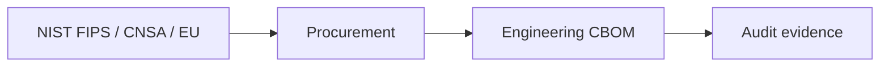

# Chapter 21: Industry and Government PQC Initiatives

Policy sets deadlines; **your stack sets feasibility**. We map global mandates and India's parallel track.

> **Author's note (India deployment):** Validate any regulatory reference (RBI, MeitY, CERT-In, DPDP retention) against the **current circular** before you bake it into contracts. We describe directionally what we see in the field, not legal advice.

**Figure 21.1 — Policy → engineering feedback loop**

---

## 21.1 Government Programs and Mandates

Governments worldwide have recognized that the quantum threat to cryptographic infrastructure requires coordinated, mandated action. Unlike many cybersecurity improvements that can be left to market forces, PQC migration involves a tight timeline, massive coordination requirements, and national security implications that demand government leadership. This section surveys the major government programs driving PQC adoption.

### United States

The United States has taken the most coordinated federal approach to PQC readiness, with multiple agencies issuing directives, standards, and guidance that collectively create binding timelines for the federal government and strong signals for the private sector.

**National Security Memorandum 10 (NSM-10, May 2022):**

NSM-10, titled "Promoting United States Leadership in Quantum Computing While Mitigating Risks to Vulnerable Cryptographic Systems," established the policy foundation for federal PQC migration. Its key provisions include:

- Direction to all federal agencies to inventory their cryptographic systems, with emphasis on systems protecting sensitive data and those most vulnerable to quantum attack
- Requirement for agency-specific migration plans within defined timelines, including identification of systems that cannot be migrated quickly and associated risk mitigation strategies
- Establishment of the Quantum Computing Cybersecurity Preparedness Act, providing legislative backing for executive directives
- Creation of an interagency coordination mechanism through the National Security Council to ensure consistency across government
- Recognition that "harvest now, decrypt later" attacks make the timeline urgent even before quantum computers achieve cryptographic relevance
- Direction to NIST to continue PQC standardization and to develop migration guidance
- Requirement for regular progress reporting to the President through the National Security Advisor

NSM-10's significance extends beyond the federal government — it created urgency in the private sector by signaling that the US government considers quantum threats both real and imminent.

**OMB Memorandum M-23-02 (November 2022):**

The Office of Management and Budget translated NSM-10's policy direction into concrete administrative requirements:

- All federal agencies must submit cryptographic system inventories identifying quantum-vulnerable systems, with initial inventories due within defined timelines
- Inventories must categorize systems by data sensitivity, data lifetime, and exposure to harvest-now-decrypt-later threats
- Agencies must develop migration roadmaps with specific milestones and resource requirements
- Annual progress reporting to OMB with quantitative metrics on migration completion
- Priority systems (those protecting classified data, critical infrastructure controls, and long-lived sensitive data) must be identified for earliest migration
- Agencies must identify budget implications and submit funding requests through the normal budget process
- CIO and CISO accountability for migration progress

**CNSA 2.0 (NSA Commercial National Security Algorithm Suite 2.0, September 2022):**

NSA's CNSA 2.0 guidance provides the most specific timeline for PQC adoption in national security systems. While technically applicable only to National Security Systems (NSS), it strongly influences the broader defense industrial base and critical infrastructure sectors:

| Timeline | Requirement | Algorithms |
|----------|-------------|------------|
| 2025 | PQC preferred for all firmware and software signing | ML-DSA-87, SLH-DSA |
| 2025 | Begin transition planning for all other use cases | All CNSA 2.0 algorithms |
| 2027 | PQC required for web browsers/servers, cloud services | ML-KEM-1024, ML-DSA-87 |
| 2027 | PQC required for network protocols (TLS, SSH, IKE) | ML-KEM-1024, ML-DSA-87 |
| 2028 | PQC required for operating systems and network infrastructure | All applicable algorithms |
| 2029 | PQC required for custom/specialty applications | All applicable algorithms |
| 2030 | PQC required for all new equipment acquisitions | Full CNSA 2.0 suite |
| 2033 | Complete migration — all legacy equipment using PQC or decommissioned | Full CNSA 2.0 suite |
| 2035 | No quantum-vulnerable algorithms in any national security system | Zero exceptions |

CNSA 2.0 algorithm selections:
- **Key Establishment:** ML-KEM-1024 (FIPS 203)
- **Digital Signatures:** ML-DSA-87 (FIPS 204) for general use; SLH-DSA (FIPS 205) for cases where hash-based signatures are preferred
- **Symmetric Encryption:** AES-256 (unchanged — already quantum-resistant)
- **Hashing:** SHA-384 or SHA-512 (unchanged — Grover's attack mitigated by 384+ bit output)

Notable aspects of CNSA 2.0: NSA exclusively recommends the highest security level (Level 5 for ML-KEM and ML-DSA), does not endorse hybrid modes for national security systems (preferring direct PQC adoption), and does not include FN-DSA due to implementation complexity concerns.

**NIST Post-Quantum Cryptography Program:**

NIST's PQC standardization program, initiated in 2016, represents the most significant cryptographic standardization effort since AES selection:

- **FIPS 203 (ML-KEM):** Finalized August 2024. Module-Lattice-based Key-Encapsulation Mechanism. Three parameter sets: ML-KEM-512 (Level 1), ML-KEM-768 (Level 3), ML-KEM-1024 (Level 5).
- **FIPS 204 (ML-DSA):** Finalized August 2024. Module-Lattice-based Digital Signature Algorithm. Three parameter sets: ML-DSA-44 (Level 2), ML-DSA-65 (Level 3), ML-DSA-87 (Level 5).
- **FIPS 205 (SLH-DSA):** Finalized August 2024. Stateless Hash-based Digital Signature Algorithm. Twelve parameter sets spanning security levels 1-5 with fast/small variants.
- **SP 800-208 (LMS/XMSS):** Stateful hash-based signatures for firmware signing. Already available since 2020.
- **FIPS 206 (FN-DSA):** Expected 2025. Fast-Fourier lattice-based signatures (derived from FALCON). Compact signatures but complex implementation.
- **Additional signatures:** Round 2 evaluation ongoing for additional signature schemes to provide diversity.
- **SP 1800-38:** Migration to Post-Quantum Cryptography practice guide — ongoing development with multiple volumes covering inventory, prioritization, and implementation.
- **ACVP (Automated Cryptographic Validation Protocol):** Testing infrastructure for PQC algorithm implementations, enabling FIPS 140-3 validation.

**DHS/CISA (Cybersecurity and Infrastructure Security Agency):**

CISA has taken the lead on PQC readiness for critical infrastructure:

- Post-Quantum Cryptography Initiative providing sector-specific guidance for the 16 critical infrastructure sectors
- "Preparing Critical Infrastructure for Post-Quantum Cryptography" guidance document with actionable steps for asset owners
- Awareness campaigns educating private sector organizations on quantum risk
- Technical assistance programs providing hands-on support for critical infrastructure operators
- Coordination with Sector Risk Management Agencies (SRMAs) to embed PQC requirements in sector-specific frameworks
- Joint advisories with NSA and NIST on PQC implementation best practices
- Binding Operational Directives (BODs) establishing requirements for federal civilian agencies

### European Union

The EU takes a characteristically standards-driven approach, emphasizing coordination across member states and institutional readiness.

**ENISA (European Union Agency for Cybersecurity):**

ENISA serves as the EU's coordinating body for cybersecurity, including PQC:

- Published "Post-Quantum Cryptography: Current State and Quantum Mitigation" report (2022, updated 2024) providing comprehensive risk assessment and migration guidance
- Algorithm recommendations align with NIST selections while acknowledging European research contributions (FrodoKEM, CRYSTALS originated from EU-funded research)
- Migration guidelines for EU institutions emphasize hybrid approaches and conservative timelines
- Coordination across 27 member states to prevent fragmented national approaches
- Integration of PQC requirements into the NIS2 Directive implementation guidance
- Research coordination through the Horizon Europe framework program, funding PQC implementation and migration research
- Published "Quantum-Safe Cryptography" infographic series for awareness across non-technical stakeholders

**BSI (Bundesamt für Sicherheit in der Informationstechnik — German Federal Office for Information Security):**

Germany's BSI takes the most technically detailed position among EU national agencies:

- Technical Guideline TR-02102 updated with PQC recommendations, specifying acceptable algorithms, parameters, and implementation requirements for German federal systems
- Uniquely recommends FrodoKEM alongside NIST standards as a conservative alternative — FrodoKEM uses unstructured lattices (plain LWE) which avoid the algebraic structure of Module-LWE, providing insurance if structured lattice assumptions prove weaker than expected
- Mandates hybrid mode for transition: classical algorithm combined with PQC algorithm such that security holds if either is secure. BSI specifies precise hybrid construction methods (concatenation for key exchange, dual signatures for authentication)
- Earlier timeline pressure than NIST — BSI recommends beginning active migration now rather than waiting for full standard ecosystem maturity
- Published detailed analysis of parameter selection rationale, providing transparency on security margin assumptions
- Active collaboration with European Common Criteria community on PQC evaluation methodology
- Maintains reference implementations and testing tools for German government use

**ANSSI (Agence Nationale de la Sécurité des Systèmes d'Information — French National Cybersecurity Agency):**

France's ANSSI has adopted the most conservative PQC position among major agencies:

- Strongest hybrid mandate in the world: classical algorithm MUST remain present in all cryptographic operations during transition, and ANSSI recommends this period extend significantly (potentially to 2030+)
- Rationale: PQC algorithms have insufficient cryptanalysis history compared to RSA/ECC (decades of study). Hybrid ensures that a PQC algorithm failure does not leave systems unprotected.
- Recommends only hybrid deployments for high-security applications — pure PQC-only is explicitly discouraged
- Conservative approach extends to parameter selection: ANSSI recommends Level 3 or Level 5 parameters exclusively for sensitive applications
- Publishes algorithm whitelists ("référentiel général de sécurité") specifying exactly which algorithms and configurations are acceptable for French government systems
- Strong position on implementation quality: approved implementations must undergo extensive evaluation including side-channel testing
- Coordinates with BSI on common European positions where possible, while maintaining independent national security assessment

**European Cybersecurity Certification Scheme (EUCS and EU Common Criteria):**

The EU is building PQC requirements into its emerging cybersecurity certification framework:

- European Union Cybersecurity Certification Scheme for Cloud Services (EUCS) will progressively require quantum-safe cryptography at higher assurance levels
- Common Criteria evaluation methodology being updated to include PQC algorithm assessment (protection profiles, security targets)
- Timeline for mandatory PQC in certified products being developed in consultation with industry
- Impact on EU digital sovereignty initiatives (European digital identity, eIDAS regulation) requiring PQC-ready implementations

### United Kingdom

**NCSC (National Cyber Security Centre):**

The UK's NCSC provides measured, pragmatic guidance reflecting its position as a Five Eyes intelligence partner with strong academic cryptographic research:

- Published "Preparing for Quantum-Safe Cryptography" white paper establishing a phased approach: awareness (understand the threat) → preparation (inventory and plan) → migration (implement changes)
- Strong emphasis on cryptographic agility as a foundational requirement — systems should be designed to change algorithms without architectural redesign
- Recommends against premature migration of systems with short data lifetimes, focusing urgency on long-lived secrets
- Industry engagement through NCSC's Industry 100 program and dedicated PQC working groups
- Alignment with NIST algorithm selections — NCSC has not endorsed alternative algorithms
- Specific guidance for UK critical national infrastructure sectors
- Published technical analysis of hybrid key exchange constructions and their security properties
- Active participation in IETF standardization of PQC protocol integration

### Asia-Pacific

**Japan (CRYPTREC — Cryptography Research and Evaluation Committees):**

Japan maintains an independent cryptographic evaluation program that has historically paralleled but occasionally diverged from Western standards:

- CRYPTREC "e-Government Recommended Ciphers List" being updated to include PQC algorithms
- Evaluating NIST selections for compatibility with Japanese government systems and regulatory requirements
- Parallel research programs on lattice-based cryptography through NICT (National Institute of Information and Communications Technology)
- Government procurement guidelines requiring PQC readiness assessment for new system acquisitions
- Active contribution to ISO/IEC PQC standardization through national mirror committees
- Strong academic research presence (Tsukuba, Tokyo Tech, NTT labs) contributing to PQC security analysis

**South Korea (KISA — Korea Internet & Security Agency):**

South Korea has pursued a distinctive dual-track approach:

- National PQC migration program with specific sector timelines aligned with but not identical to US schedules
- KpqC competition: Korea's own PQC algorithm evaluation competition evaluating algorithms beyond NIST selections, including submissions optimized for Korean infrastructure requirements
- Strong industry engagement through KISA's partnership with Samsung, SK Telecom, and Korean financial institutions
- Integration of PQC readiness into Korea's K-ISMS (Information Security Management System) certification
- Investment in quantum computing research (IonQ partnership, Korean Quantum Computing initiative) informing threat timeline estimates
- Government-funded PQC implementation support for critical infrastructure operators

**China:**

China's approach to PQC combines elements of independent development with selective alignment:

- China's Office of State Commercial Cryptography Administration (OSCCA) developing national PQC standards partially aligned with NIST but with additional algorithm considerations
- Significant investment in quantum computing ($15B+ estimated) creates both threat awareness and technical expertise applicable to PQC
- SM series algorithms (SM2, SM3, SM4) being evaluated for quantum resistance; SM2 (elliptic curve-based) identified as quantum-vulnerable
- Research institutions (Chinese Academy of Sciences, Tsinghua, Peking University) producing significant PQC research output
- Strategic priority for quantum readiness — quantum communication (QKD) network deployment more advanced than any other country
- National standards process less transparent than NIST, creating interoperability uncertainty for international commerce

**Australia (ASD — Australian Signals Directorate):**

- ISM (Information Security Manual) updates incorporating PQC requirements aligned with Five Eyes partner recommendations
- Essential Eight maturity model being extended to include PQC readiness indicators
- Critical infrastructure protection guidance through the Security of Critical Infrastructure Act framework
- Coordination with NIST selections — no independent algorithm development program
- Defence industry requirements flowing through AUKUS and Five Eyes frameworks
- Active participation in international PQC working groups through ASD's Australian Cyber Security Centre

**Singapore (CSA — Cyber Security Agency):**

- Published National Quantum-Safe Roadmap establishing phased migration plan for government and critical infrastructure
- Strong financial sector focus through MAS (Monetary Authority of Singapore) guidance, leveraging Singapore's position as a global financial hub
- Quantum Engineering Programme funding PQC research and implementation at NUS and NTU
- Early mover in quantum-safe network infrastructure pilot programs, including nation-wide QKD network combined with PQC
- Infocomm Media Development Authority (IMDA) publishing industry guidance for telecommunications PQC adoption
- National Digital Identity (Singpass) evaluating PQC for long-term credential security

> **Author's note (India deployment):** Validate any regulatory reference (RBI, MeitY, CERT-In, DPDP retention) against the **current circular** before you bake it into contracts. We describe directionally what we see in the field, not legal advice.

> **Author's note:** Align engineering to **both** NIST timelines and India's NQM/RBI/NCIIPC tracks—not either-or.

**India (NCIIPC and MeitY):**

- National Quantum Mission (2023, ₹6,003 crore / ~$730M) includes cryptographic security as a key deliverable
- NCIIPC (National Critical Information Infrastructure Protection Centre) developing PQC guidelines for India's critical sectors
- Strong academic cryptographic research community (IITs, ISI Kolkata, IISc Bangalore) contributing to international PQC development and evaluation
- Defense sector PQC requirements emerging through DRDO (Defence Research and Development Organisation) programs
- STQC (Standardisation Testing and Quality Certification) developing testing frameworks for PQC implementations
- RBI (Reserve Bank of India) monitoring quantum risk for financial infrastructure including UPI digital payments

**Israel:**

- National Cyber Directorate (INCD) published quantum computing preparedness guidance
- Strong cybersecurity industry with multiple companies developing PQC solutions (QuantLR)
- Defense establishment actively migrating classified systems to PQC
- Academic cryptography community (Weizmann, Technion, Tel Aviv University) contributing foundational PQC research
- Military intelligence operations driving early adoption timelines

## 21.2 Industry Initiatives

### Technology Companies

**Google/Alphabet:**

Google has been the most aggressive major technology company in PQC deployment:

- Chrome browser deployed hybrid PQC key exchange (X25519Kyber768 / X25519MLKEM768) beginning 2023, reaching full deployment across all Chrome users by 2024
- Internal infrastructure: Progressive migration of inter-datacenter communications to PQC, building on the existing ALTS (Application Layer Transport Security) protocol
- Research contributions: NTRU-HRSS variant optimization, PQC performance benchmarking at scale, real-world key size impact measurement across billions of connections
- Google Cloud Platform: PQC key exchange available in Cloud VPN, Cloud Interconnect, and TLS to Google services; Cloud KMS PQC algorithm support roadmap
- Android: PQC in TLS stack for Android applications connecting to Google services
- Published performance data showing negligible latency impact (< 1ms) for hybrid PQC key exchange at global scale, countering industry concerns about overhead
- Google Security Blog regularly publishes PQC migration status and best practices, contributing to industry knowledge

**Microsoft:**

Microsoft's approach emphasizes enterprise ecosystem readiness:

- Windows: PQC algorithm support in Schannel (Windows TLS library) and CNG (Cryptography Next Generation), enabling Windows applications to use PQC without code changes when configured
- Azure: PQC key exchange support across Azure services including VPN Gateway, Application Gateway, and Azure Front Door; Azure Key Vault PQC key types roadmap
- SymCrypt: Microsoft's core cryptographic library now includes ML-KEM and ML-DSA implementations, validated through rigorous testing and available to all Microsoft products
- Microsoft 365: Exchange Online and Teams exploring PQC for email and messaging protection
- Research: Active PQC research program including provable security analysis, implementation optimization, and protocol integration design
- Enterprise guidance: Published detailed migration guidance for enterprises using Microsoft technology stacks, including assessment tools and migration planning templates
- Xbox/Gaming: PQC considerations for game anti-cheat and DRM systems with long-lived secrets
- Supply chain: Microsoft requires PQC readiness from key technology suppliers

**Apple:**

Apple's PQC deployment focuses on consumer-facing security:

- iMessage: PQ3 protocol deployed across the Apple ecosystem (iOS 17.4+, macOS 14.4+), implementing ML-KEM for key encapsulation with periodic re-keying, providing forward secrecy against future quantum computers
- PQ3 design is notably sophisticated: implements a "ratcheting" system where PQC key exchange occurs periodically throughout a conversation, limiting the window of vulnerability even against harvest-now-decrypt-later attacks
- iOS/macOS: Core Crypto library (corecrypto) updated with PQC algorithm implementations, available to third-party developers through CryptoKit framework
- iCloud: PQC protection for iCloud data in transit, building on the Advanced Data Protection framework
- Research: Apple Security Engineering and Architecture team publishing on efficient PQC implementation for mobile platforms with constrained power budgets
- Hardware: Apple Silicon processors may include PQC acceleration in future generations (no public confirmation)
- Privacy focus: Apple positions PQC as essential to user privacy protection against nation-state adversaries

**Amazon/AWS:**

AWS leads in cloud-service PQC enablement:

- AWS KMS: Post-quantum TLS key agreement for KMS API connections, protecting master key operations against harvest-now-decrypt-later attacks
- s2n-tls: Amazon's open-source TLS implementation includes hybrid PQC key exchange (X25519+ML-KEM-768), used by all AWS services
- AWS-LC (LibCrypto): Fork of BoringSSL with ML-KEM and ML-DSA support, FIPS-validated, serving as the cryptographic foundation for all AWS services
- AWS CloudHSM: PQC algorithm support roadmap for hardware security modules
- AWS Nitro Enclaves: PQC attestation and key management for confidential computing
- AWS Transfer Family, ACM, and Route 53: Progressive PQC integration across managed services
- Research: Amazon Science publications on PQC at scale, including cost analysis and performance characterization
- Customer guidance: Well-Architected Framework updated with PQC readiness pillar

**Meta:**

- Internal infrastructure evaluation across Facebook, Instagram, and WhatsApp backends
- WhatsApp: Signal Protocol-based encryption being upgraded with PQC extensions (following Signal's PQXDH lead)
- Meta AI: Evaluating PQC requirements for model protection and inference security
- Open-source contributions to PQC ecosystem through research publications
- Massive scale (3+ billion users) creates unique challenges for PQC deployment regarding bandwidth and compute costs

**Cloudflare:**

Cloudflare's position handling significant portions of global web traffic makes it a critical PQC deployment vector:

- Full hybrid PQC deployment across entire global network — every HTTPS connection to a Cloudflare-protected site can negotiate PQC key exchange
- Published comprehensive performance measurements demonstrating PQC viability at scale (200+ data centers worldwide)
- Open-source CIRCL library (Cloudflare Interoperable Reusable Cryptographic Library) in Go, providing production-quality PQC implementations
- Research on PQC certificate optimization — exploring how to minimize the TLS handshake size impact of PQC certificates
- Active IETF participation in PQC protocol standardization
- Blog posts providing transparency on deployment experience, challenges, and solutions

### Messaging and Communication

**Signal:**

Signal's deployment of PQC in its messaging protocol represents a landmark in consumer cryptography:

- PQXDH (Post-Quantum Extended Diffie-Hellman) protocol deployed in 2023, combining ML-KEM-1024 with X25519 for key establishment
- Design rationale: hybrid approach ensures security even if ML-KEM is unexpectedly broken, while providing protection against quantum harvest-now-decrypt-later attacks
- Open specification published for community adoption, enabling other messaging platforms to implement compatible PQC protection
- Implementation available in libsignal, the open-source library used by Signal and adopted by other messaging platforms
- Ongoing research into PQC for the Double Ratchet algorithm and group messaging protocols
- Demonstrated that PQC can be deployed at scale in messaging without user-perceptible performance degradation

**WhatsApp / Meta Messenger:**

- Following Signal's PQXDH approach for end-to-end encryption upgrade
- Scale challenges: 2+ billion WhatsApp users, many on low-end devices with limited bandwidth in developing markets
- Progressive rollout strategy to manage performance impact across device diversity
- Consideration of backward compatibility with older clients that cannot support PQC

**Matrix/Element:**

- Open federation protocol evaluating PQC integration for decentralized messaging
- Community-driven development of PQC extensions to the Matrix specification
- Unique challenge: federated architecture requires all participating servers to support PQC

### Financial Services

The financial sector faces acute PQC urgency due to strict data protection requirements, regulatory pressure, and the catastrophic impact of cryptographic failure on financial system integrity.

**SWIFT (Society for Worldwide Interbank Financial Telecommunication):**

- Quantum-safe readiness program initiated 2022, engaging with the global banking community
- Testing PQC algorithm integration into SWIFT messaging infrastructure (connecting 11,000+ financial institutions)
- Timeline aligned with regulatory requirements but extending beyond CNSA 2.0 due to global coordination complexity
- Member awareness and education programs including quantum risk assessments
- Collaboration with central banks on PQC requirements for RTGS (Real-Time Gross Settlement) systems
- Challenge: SWIFT messages carry financial instructions with long audit retention requirements, creating harvest-now-decrypt-later exposure

**Major Banks:**

- **JPMorgan Chase:** Dedicated quantum computing research team; PQC pilot programs for internal communications; quantum key distribution experiments with Toshiba
- **Goldman Sachs:** Quantum risk assessment across trading infrastructure; PQC-ready VPN connections between trading centers globally
- **Deutsche Bank:** Participating in ECB quantum-readiness working groups; HSM upgrade programs for PQC key management
- **HSBC:** Quantum-safe networking pilots; assessment of PQC impact on cross-border payment systems
- **Bank of America:** Enterprise-wide cryptographic inventory initiative feeding PQC migration planning

Common financial sector activities:
- HSM upgrades to PQC-capable hardware (Luna, nShield firmware updates)
- Certificate infrastructure preparation for PQC certificate issuance
- Quantum-safe VPN connections between critical facilities
- Assessment of PQC impact on regulatory reporting and audit trails
- Coordination through FSSCC (Financial Services Sector Coordinating Council)

**Payment Networks:**

- **Visa:** PQC research team evaluating impact on payment transaction processing; pilot programs for quantum-safe card authentication
- **Mastercard:** PQC readiness assessment for network infrastructure; participating in EMVCo PQC evaluation
- **PCI SSC (Payment Card Industry Security Standards Council):** Monitoring PQC standards development for incorporation into PCI DSS; published information supplement on quantum computing impact
- **EMVCo:** Evaluating PQC for chip card specifications — constrained environment requiring compact algorithms

### Telecommunications

**GSMA (Global System for Mobile Communications Association):**

- Post-Quantum Telco Network Taskforce established 2022, bringing together major carriers and equipment vendors
- Published "Post Quantum Telco Network Impact Assessment" white paper
- SIM card PQC capability roadmap — current SIM applets use ECDSA/ECDH; future eUICC specifications must include PQC
- Network equipment vendor coordination to ensure consistent PQC adoption across equipment from different manufacturers
- Guidelines for mobile network PQC migration covering RAN, core network, and service layer
- 5G-Advanced and 6G security architecture incorporating PQC from the design phase

**Major Carriers:**

- **Vodafone:** PQC pilot programs across European operations; testing ML-KEM for VPN between mobile switching centers
- **AT&T:** Quantum-safe network architecture research; PQC in software-defined networking infrastructure
- **Deutsche Telekom:** Leading European carrier PQC initiative; T-Labs research on efficient PQC for network equipment
- **SK Telecom:** Partnership with Samsung on PQC-enabled 5G infrastructure; quantum-safe VPN deployment
- **NTT (Japan):** Research on PQC for optical network encryption; integration with QKD network

Telecom-specific challenges:
- Network equipment has long operational lifetimes (15-20 years) — equipment deployed today must support PQC
- SIM cards cannot be remotely upgraded in many cases — hardware refresh required
- Roaming agreements require cross-operator algorithm support negotiation
- Regulatory compliance across multiple jurisdictions with different timelines
- Real-time protocol requirements (signaling, authentication) constrain acceptable PQC overhead

### Hardware and Semiconductor

**Intel:**

- PQC acceleration through future instruction set extensions — similar to how AES-NI accelerated AES operations, dedicated instructions for NTT (Number Theoretic Transform) and polynomial operations
- Firmware signing with PQC: Transitioning Intel boot guard and firmware verification to PQC signatures
- Platform security updates: TPM specification participation for PQC, SGX attestation PQC roadmap
- Research publications on efficient lattice arithmetic in hardware
- Collaboration with OS vendors on PQC boot chain integrity

**Thales (incorporating Gemalto):**

- Luna Network HSM 7.x firmware updates adding ML-KEM and ML-DSA support
- CipherTrust Manager platform with PQC key lifecycle management
- Smart card platform (SIM, banking, identity) PQC roadmap with constrained algorithm implementations
- PayShield (payment HSM) PQC algorithm integration for financial transaction processing
- Transparent encryption products with PQC algorithm support for data-at-rest protection

**Entrust:**

- nShield HSM firmware updates with FIPS 203/204/205 algorithm support
- PKI platform (Certificate Authority) supporting PQC certificate issuance including hybrid certificates
- Code signing platform integration with PQC signature algorithms
- Identity and access management products incorporating PQC authentication
- Cloud-hosted HSM service (nShield as a Service) with PQC capabilities

**NXP Semiconductors:**

- Smart card chips (JCOP platform) with PQC capability for government ID, banking, and transit applications
- Automotive security processors with PQC support for vehicle-to-everything (V2X) communication
- IoT edge processors with hardware PQC acceleration
- SE (Secure Element) platform roadmap including ML-KEM for constrained environments

**Infineon:**

- OPTIGA TPM with PQC algorithm support roadmap
- Security controller chips for smart cards and embedded systems
- Automotive security modules with PQC capability
- SLx crypto accelerators with PQC algorithm support

**Microchip Technology:**

- ATECC/ATECC PQC-capable secure element chips for IoT
- FPGA platforms with PQC acceleration IP cores
- Trust Platform for IoT with PQC provisioning capability

## 21.3 Standards Organizations

### IETF (Internet Engineering Task Force)

The IETF is the critical venue for standardizing how PQC algorithms are integrated into Internet protocols. Multiple working groups are developing PQC extensions, and the pace of standardization work has accelerated significantly since NIST finalized FIPS 203/204/205.

**Published RFCs:**
- **RFC 9370:** Multiple Key Exchanges in IKEv2 — enables combining multiple key exchange methods (including PQC) in a single IKE SA establishment, providing hybrid security for IPsec VPNs
- **RFC 9629:** Using ML-KEM in TLS 1.3 — defines the concrete mechanism for ML-KEM key encapsulation within TLS 1.3 key_share extensions, including encoding, negotiation, and error handling

**Active drafts and working groups:**
- **Hybrid TLS key exchange:** Combining classical (X25519/P-384) with PQC (ML-KEM) key shares in TLS 1.3, ensuring security holds if either the classical or PQC algorithm remains secure. Multiple draft approaches under discussion regarding concatenation vs. key combiner methods.
- **PQC certificates in X.509:** Defining how ML-DSA and SLH-DSA signatures work within X.509 certificate structures, including certificate chain validation, CRL/OCSP response signatures, and trust anchor management. Challenges include certificate size (ML-DSA certificates are 5-8 KB vs. ~1 KB for ECDSA) and their impact on TLS handshake latency.
- **Composite signatures:** Structures for multiple signatures (e.g., ECDSA + ML-DSA) in a single certificate or signed object, enabling graceful transition where verifiers that understand PQC verify both signatures while legacy verifiers check only the classical signature.
- **PQC in S/MIME:** Email security updates for end-to-end encrypted email with PQC key management, addressing both message encryption (ML-KEM for key wrapping) and digital signatures (ML-DSA for message authentication).
- **PQC in DNSSEC:** Adapting DNS security for PQC — particularly challenging due to UDP packet size constraints (512 bytes traditional, 4096 bytes with EDNS0) and signature size implications. SLH-DSA signatures (17 KB+) far exceed DNS response limits; FN-DSA (~666 bytes) is the most viable candidate but still significantly larger than current ECDSA usage.
- **PQC in JOSE/COSE:** JSON and CBOR object signing with PQC algorithms for web tokens (JWT) and IoT object security. Critical for OAuth, OpenID Connect, and FIDO2 ecosystem migration.
- **PQC in SSH:** Updates to SSH key exchange and host key algorithms for PQC. OpenSSH already ships experimental PQC key exchange; formal standardization of algorithm identifiers and negotiation behavior ongoing.
- **PQC in CMS:** Cryptographic Message Syntax updates for PQC in document signing, timestamping, and encryption. Important for code signing, email (S/MIME), and document workflows.
- **HPKE with PQC:** Hybrid Public Key Encryption integration with PQC KEMs for applications like encrypted DNS (ECH), MLS (Messaging Layer Security), and general-purpose public key encryption.

**IETF PQUIP (Post-Quantum Use in Protocols) Working Group:** Coordinating cross-protocol PQC integration to ensure consistent approaches and avoid conflicting design decisions across different protocol specifications. PQUIP provides a forum for cross-area review and common terminology/approach development.

### ISO/IEC

ISO/IEC standards provide the formal international standard framework that many governments reference in regulations:

- **ISO/IEC 14888 (Digital Signatures):** Being updated to include ML-DSA and SLH-DSA alongside existing algorithms
- **ISO/IEC 18033 (Encryption Algorithms):** PQC encryption/KEM standards being developed
- **ISO/IEC 11770 (Key Management):** PQC key agreement protocols being standardized
- **ISO/IEC 19772 (Authenticated Encryption):** Evaluating PQC impact on authenticated encryption constructions
- **ISO/IEC JTC 1/SC 27:** Primary committee coordinating with NIST on algorithm specification alignment and ensuring NIST FIPS standards can be referenced from ISO standards
- **ISO/IEC 20085:** Evaluating PQC test vector requirements for conformance testing

Timeline: ISO standards typically lag NIST FIPS by 2-3 years due to longer consensus processes, but referencing mechanisms allow earlier adoption.

### ETSI (European Telecommunications Standards Institute)

ETSI provides telecommunications-specific standardization:

- **QSC (Quantum-Safe Cryptography) Working Group:** Active since 2015, producing guidance documents for telecom industry PQC migration
- **TR 103 619:** Migration strategies for quantum-safe cryptography — practical guidance for telco operators
- **TS 103 744:** Quantum-safe hybrid key exchanges for telco protocols
- Interoperability testing framework: ETSI Plugtests events for PQC interoperability verification between implementations from different vendors
- **TC CYBER:** Broader cybersecurity committee incorporating PQC into security controls standards
- Coordination with 3GPP on PQC requirements for 5G-Advanced and 6G security specifications

### TCG (Trusted Computing Group)

TCG standards define trusted hardware platforms that must evolve for PQC:

- **TPM 2.0 specification updates:** Algorithm registry additions for ML-KEM, ML-DSA, and SLH-DSA; new key types and command parameters
- Platform integrity with PQC: Boot measurements and integrity quotes using PQC signatures
- Remote attestation with PQC: Attestation key certificates using PQC algorithms
- DICE (Device Identifier Composition Engine) with PQC: Hardware identity and attestation for IoT devices
- Key hierarchy updates: TPM key hierarchies incorporating PQC algorithms while maintaining backward compatibility during transition

### W3C (World Wide Web Consortium)

- Web Cryptography API: Evaluating PQC algorithm additions to the browser crypto API
- WebAuthn: PQC implications for FIDO2 authentication (large signature sizes affect UX)
- Verifiable Credentials: PQC signature requirements for decentralized identity

## 21.4 Research and Academic Initiatives

### Major Research Programs

**EU Quantum Flagship:**

The EU's €1 billion Quantum Flagship program (2018-2028) includes substantial PQC research:

- Communication pillar includes PQC research alongside QKD
- Projects: PROMETHEUS (lattice-based privacy-preserving cryptography), PQC4MED (PQC for medical systems), QU-PILOT (quantum communication infrastructure including PQC)
- Industry-academic collaboration through consortium-based research projects
- Training programs developing next-generation PQC expertise across EU member states
- Technology transfer mechanisms moving research results into industrial deployment

**US National Quantum Initiative (NQI):**

- Multi-agency coordination (NSF, DARPA, DOE, NIST) with over $1.2 billion investment in quantum information science
- NSF quantum computing and cryptography research grants including dedicated PQC tracks
- DARPA programs: SIEVE (secure computation), SafeDocs (secure document processing with PQC)
- DOE quantum network testbeds incorporating PQC for authentication
- Quantum Economic Development Consortium (QED-C) connecting industry and research

**UK National Quantum Technologies Programme:**

- Quantum Communications Hub with PQC integration research
- EPSRC-funded PQC research projects at Bristol, Cambridge, Oxford, and Royal Holloway
- Quantum computing threat timeline assessment research
- Industrial partnership programs with BT, Toshiba, and ID Quantique

**Open Quantum Safe (OQS):**

OQS is the most important open-source PQC research infrastructure:

- **liboqs:** Comprehensive open-source C library implementing all NIST PQC algorithms (finalized and candidate), providing uniform API for comparison and experimentation
- **OQS-OpenSSL/OQS-Provider:** OpenSSL integration enabling PQC in existing applications with minimal code changes through the OpenSSL 3.x provider mechanism
- **OQS-BoringSSL:** Integration with Google's BoringSSL for applications using that library
- **oqs-demos:** Demonstration applications (web servers, VPNs, email) showing PQC in realistic deployments
- Community-maintained with primary development at University of Waterloo (Canada) and TU Darmstadt (Germany)
- ISARA Corporation, a Canadian company (Waterloo, Ontario), has contributed significantly to PQC migration tooling and hybrid certificate development
- Essential for interoperability testing: OQS implementations serve as reference for verifying correctness of other implementations
- Integration with Docker containers, CI/CD pipelines, and cloud environments for easy experimentation

### Academic Conferences

Key venues where PQC research is published and debated:

- **CRYPTO / EUROCRYPT / ASIACRYPT (IACR Flagship Conferences):** Top-tier venues for fundamental cryptographic research including PQC security proofs, new constructions, and cryptanalysis. Papers here shape the direction of PQC development.
- **PQCrypto (International Conference on Post-Quantum Cryptography):** Dedicated biennial conference focused entirely on PQC. Mix of theory and practice.
- **CHES (Cryptographic Hardware and Embedded Systems):** Implementation-focused venue critical for PQC side-channel analysis, efficient implementation, and hardware design.
- **CCS (ACM Conference on Computer and Communications Security) / IEEE S&P (Oakland):** Applied security venues where PQC deployment challenges, protocol integration, and system-level security are addressed.
- **RWC (Real World Crypto):** Bridge between theory and practice — many PQC deployment experience reports presented here.
- **NIST PQC Conferences:** NIST's dedicated PQC workshops and conferences providing standardization-focused discussion.
- **SAC (Selected Areas in Cryptography):** Canadian conference with strong PQC track.
- **CT-RSA / PKC:** Annual conferences with regular PQC content.

### Cryptanalysis Community

The ongoing security of PQC standards depends on continuous cryptanalysis:

**Lattice Estimation tools:** The Lattice Estimator (developed at Royal Holloway) provides the primary tool for estimating concrete security of lattice-based schemes. Parameter selections for ML-KEM and ML-DSA are validated against this estimator. Ongoing refinements to attack cost estimates may affect future parameter recommendations.

**Reduction improvements:** Tighter security reductions between the problems underlying PQC schemes and the hardness assumptions (LWE, Module-LWE, Ring-LWE) enable either more confident security claims or smaller parameters. Active research area with direct practical implications.

**Implementation attacks:** Side-channel analysis (power analysis, electromagnetic emanation, timing attacks) and fault injection targeting PQC implementations. The CHES community regularly publishes new attacks and countermeasures. These practical attacks often represent the most immediate threat to deployed systems.

**Quantum algorithm research:** Monitoring for new quantum algorithms that could threaten PQC assumptions. Recent work includes quantum approaches to lattice problems (though none currently threaten parameters), quantum walk algorithms, and quantum machine learning approaches to cryptanalysis.

**Algebraic cryptanalysis:** Investigating whether the algebraic structure of Module-LWE (used in ML-KEM and ML-DSA) provides attack advantages over unstructured LWE. Twenty years of research has found no such advantage, but the question remains open.

## 21.5 Industry Consortia and Alliances

### PQC Coalition

The PQC Coalition (launched 2023) brings together technology companies, financial institutions, and infrastructure operators:

- Member companies share migration best practices, implementation experiences, and testing results
- Interoperability testing events verifying that PQC implementations from different vendors can communicate correctly
- Vendor coordination ensuring ecosystem readiness (e.g., a PQC TLS client must have PQC TLS servers to connect to)
- Public guidance documents on migration planning, testing approaches, and risk management
- Working groups on specific topics: certificate transition, key management, performance optimization, and embedded systems

### NCCoE (National Cybersecurity Center of Excellence)

NIST's NCCoE operates as a collaborative hub between government, industry, and academia:

- **Migration to Post-Quantum Cryptography project:** Multi-year effort producing practical migration guidance
- Reference architectures demonstrating PQC integration in representative enterprise environments
- Practice guides (NIST SP 1800-38 volumes): Step-by-step guidance for cryptographic discovery, prioritization, and migration planning
- Industry partner engagement: Technology vendors contribute implementations and expertise; financial and healthcare organizations provide realistic use cases
- Published "Getting Ready for Post-Quantum Cryptography" preliminary draft with community feedback
- Demonstration environments where organizations can test PQC implementations against reference architectures

### Cloud Security Alliance (CSA)

- Quantum-Safe Security Working Group providing cloud-specific PQC guidance
- Published "Practical Preparations for the Post-Quantum World" report
- Guidance for cloud service providers on PQC integration in shared responsibility models
- Guidance for cloud consumers on evaluating provider PQC readiness
- Certificate of Cloud Security Knowledge (CCSK) curriculum update including PQC concepts
- Research into PQC impact on cloud-native architectures (containers, serverless, microservices)

### Linux Foundation / Post-Quantum Cryptography Alliance (PQCA)

Launched 2024, PQCA coordinates open-source PQC ecosystem development:

- Founding members include Amazon, Cisco, Google, IBM, NVIDIA, Samsung, and others
- Hosts open-source PQC projects including Open Quantum Safe and PQ Code Package
- Provides neutral governance for collaborative PQC software development
- Testing and validation infrastructure for PQC implementations
- Industry collaboration on common technical challenges (interoperability, performance, deployment)
- Education and training resources for developers implementing PQC

### OASIS (Organization for the Advancement of Structured Information Standards)

- PKCS#11 specification updates for PQC algorithm support in cryptographic tokens
- Key Management Interoperability Protocol (KMIP) PQC extensions
- Integration with enterprise key management infrastructure

### Quantum Economic Development Consortium (QED-C)

- Industry-led consortium managed by SRI International
- Use case development for quantum technologies including PQC
- Workforce development and training recommendations
- Standards coordination across quantum technology domains

## 21.6 Supply Chain Considerations

### Vendor Readiness Assessment

Organizations depend on their technology vendors for PQC capability. A systematic vendor assessment process is essential:

**Essential questions for critical vendors:**

1. Do you have a published PQC migration roadmap with specific dates?
2. When will your products support FIPS 203 (ML-KEM), FIPS 204 (ML-DSA), and FIPS 205 (SLH-DSA)?
3. Will PQC support be available through software/firmware update, or is hardware replacement required?
4. What is your FIPS 140-3 validation timeline for PQC algorithm implementations?
5. Do you support hybrid mode (classical + PQC) during the transition period?
6. What are the performance implications of PQC in your products (latency, throughput, storage)?
7. What is the cost of PQC upgrades (licensing, hardware, professional services)?
8. Do you participate in PQC interoperability testing with other vendors?
9. How do you monitor and respond to PQC cryptanalysis developments?
10. What is your contingency plan if an algorithm you've implemented is found to be insecure?

**Vendor assessment scoring framework:**

| Maturity Level | Description | Indicators |
|---------------|-------------|------------|
| Level 0: Unaware | Vendor has no PQC awareness | No roadmap, no plans, no understanding |
| Level 1: Aware | Vendor acknowledges PQC need | General statements but no concrete plans |
| Level 2: Planning | Vendor has PQC roadmap | Published timelines, resource allocation |
| Level 3: Developing | PQC implementation underway | Beta/preview availability, testing programs |
| Level 4: Available | PQC support released | Production-ready, documented, supported |
| Level 5: Validated | PQC independently verified | FIPS validation, interoperability certified |

### Critical Supply Chain Dependencies

The PQC migration is gated by supply chain readiness across multiple component categories:

| Component | Current Status (2025) | Key Challenge | Risk Mitigation |
|-----------|----------------------|---------------|-----------------|
| TLS libraries (OpenSSL, BoringSSL, NSS) | PQC support available in latest versions | Application must recompile/update; regression testing needed | Maintain currency; plan testing cycles |
| HSMs (Thales Luna, Entrust nShield) | Firmware updates rolling out for PQC | Older HSMs may require hardware replacement | Inventory HSM models; plan replacement budget |
| Smart cards/tokens (PIV, banking) | Limited PQC support; constrained resources | Signature size exceeds card capabilities; hardware refresh cycle | Pilot new card platforms; plan replacement waves |
| Network equipment (routers, firewalls) | Major vendor roadmaps published | Firmware capacity limits; hardware lifecycle | Include PQC in procurement requirements |
| Certificate Authorities | PQC issuance beginning (hybrid certs) | Trust store propagation; subscriber readiness | Engage CAs; plan hybrid certificate deployment |
| Cloud services (AWS, Azure, GCP) | Major providers supporting PQC | Customer application updates needed | Track provider roadmaps; plan application testing |
| Identity providers (Okta, Azure AD) | Early stage PQC evaluation | Federation protocol updates needed | Monitor provider roadmaps; plan testing |
| Email security (S/MIME, PGP) | Standards in development | Client update required globally | Track IETF progress; plan client updates |
| IoT platforms | Limited PQC support | Hardware constraints; firmware update capability | Assess upgrade paths; plan hardware refresh |
| Code signing | PQC signing available (dual-sign approach) | Verifier update required before signer | Coordinate with ecosystem; dual-sign early |

### Supply Chain Risk Scenarios

**Scenario 1: Critical vendor has no PQC roadmap**
A key infrastructure vendor (e.g., industrial control system manufacturer) has no PQC plans. Risk: this component becomes the weakest link regardless of other migration progress. Mitigation: engage vendor through procurement leverage; identify alternative vendors with PQC roadmaps; implement compensating controls (network isolation, VPN wrapping).

**Scenario 2: Vendor PQC timeline exceeds organizational requirements**
A vendor's PQC support is planned for 2029, but the organization's regulatory requirement mandates PQC by 2027. Risk: compliance failure. Mitigation: negotiate accelerated support; request early-access programs; evaluate alternative vendors; document compensating controls for interim period.

**Scenario 3: Hardware cannot support PQC**
Legacy HSMs or smart cards physically cannot implement PQC algorithms due to memory, storage, or processing constraints. Risk: expensive hardware replacement program needed. Mitigation: early identification through CBOM; budget planning for hardware refresh; negotiate trade-in/upgrade programs with vendors.

## 21.7 Workforce and Skills Considerations

### The PQC Skills Gap

The PQC migration requires expertise that is scarce in the current workforce:

- **Cryptographic engineering:** Understanding of lattice mathematics, NTT implementations, constant-time programming, and security parameter selection. Estimated global workforce: fewer than 5,000 qualified cryptographic engineers.
- **Migration planning:** Ability to inventory cryptographic systems, assess dependencies, sequence changes, and manage enterprise-scale technical programs. Requires combination of security expertise and program management skills.
- **Testing and validation:** FIPS 140-3 validation expertise, side-channel testing capabilities, protocol conformance testing, and interoperability verification. Specialized equipment and knowledge required.
- **Protocol integration:** Deep understanding of TLS, SSH, IPsec, and other protocols combined with PQC algorithm knowledge. Required for correct and secure protocol integration.

### Building Organizational Capability

Organizations should invest in PQC capability building through multiple channels:

- **Training programs:** SANS, (ISC)², and university programs beginning to offer PQC curriculum. Internal training programs adapting vendor-provided materials.
- **Hiring:** Recruiting from academic cryptography programs, quantum computing companies, and cybersecurity firms with PQC practices.
- **Partnerships:** Engaging consulting firms and managed security services with PQC expertise for initial migration phases while building internal capability.
- **Community participation:** Contributing to open-source PQC projects (OQS, PQCA) builds organizational expertise while advancing the ecosystem.
- **Certification development:** Industry certifications for PQC competency are emerging (ISC² and ISACA developing quantum security credentials).

## 21.8 Economic Considerations

### Cost of Inaction

**Data breach from quantum attack:** For organizations protecting high-value, long-lived data, the eventual cost of quantum-enabled decryption could be existential. Healthcare organizations facing exposure of decades of patient records; financial institutions facing compromise of transaction histories; defense organizations facing exposure of classified intelligence. The potential impact scale is unprecedented in information security. The Ponemon Institute estimates the average cost of a data breach at $4.45M (2023); a quantum-enabled breach of long-archived data could affect millions of records simultaneously, with costs potentially exceeding $1B for major financial institutions.

**Regulatory non-compliance:** As PQC mandates crystallize (CNSA 2.0 for defense, DORA for EU finance, potential PCI DSS updates), non-compliant organizations face fines, sanctions, loss of government contracts, and potential exclusion from critical markets. For defense contractors, loss of CMMC certification means loss of all government business. GDPR fines can reach 4% of global annual revenue. DORA penalties for financial institutions can be similarly severe.

**Competitive disadvantage:** Enterprise customers increasingly ask vendors about quantum readiness. Financial institutions are beginning to require quantum-safe connections for high-value transactions. Government procurement already favors PQC-ready vendors. Organizations that cannot demonstrate PQC readiness will lose business to those that can. RFP requirements increasingly include quantum readiness questions — by 2027, this will likely be standard for any security-sensitive procurement.

**Retroactive liability:** If a data breach occurs that could have been prevented through timely PQC migration — particularly after public awareness of the threat and availability of mitigation — organizations may face shareholder lawsuits, regulatory enforcement actions, and reputational damage amplified by the finding that the breach was foreseeable and preventable. Legal precedent in cybersecurity increasingly holds organizations accountable for failing to implement known mitigations within reasonable timeframes.

**Emergency migration costs:** Organizations that delay until quantum computers are imminent will face emergency migration conditions: compressed timelines, premium pricing for scarce expertise, higher error rates from rushed implementation, and potential service disruption from inadequate testing. Historical precedent (Y2K, SHA-1 deprecation, TLS 1.0 retirement) shows that late movers consistently pay 5-10x the cost of early adopters for equivalent outcomes.

**Harvest-now-decrypt-later accumulation:** Every day of delay extends the window during which adversaries may be collecting encrypted data for future quantum decryption. For organizations where this data has multi-decade value (government intelligence, pharmaceutical research, legal privilege, trade secrets), delay has compounding cost — the exposure grows linearly with time.

### Cost of Action

**Technology investment:** Library updates, HSM firmware upgrades or replacements, testing infrastructure, certificate infrastructure changes, and potentially hardware acceleration. Estimates range from $2-20M for mid-size enterprises depending on complexity, with larger enterprises spending $50-200M+ over the migration period.

**Personnel:** Cryptographic engineering expertise is scarce and expensive. Organizations need staff capable of evaluating PQC implementations, configuring hybrid deployments, testing for regressions, and managing the migration program. Training existing staff in PQC specifics or hiring dedicated expertise.

**Performance overhead:** PQC algorithms generally require more computation, bandwidth, and storage than classical equivalents. During hybrid deployment (running both classical and PQC simultaneously), these costs compound. Network bandwidth costs, compute capacity additions, and storage expansion may be needed.

**Testing and validation:** PQC migration touches security-critical systems that require extensive testing before production deployment. Regression testing, performance testing, interoperability testing, and security testing all require investment. Formal validation (FIPS 140-3) for regulated environments adds cost and time.

**Opportunity cost:** Engineering effort devoted to PQC migration is effort not spent on other business priorities. For technology companies, this represents a significant allocation of scarce engineering capacity.

### ROI Framework

The business case for PQC migration strengthens along several dimensions:

**Data value multiplier:** Organizations protecting data worth $1B+ in aggregate (financial assets, intellectual property, national security information) face asymmetric risk — the cost of PQC migration ($10-100M) is a small fraction of the potential loss. A pharmaceutical company with $50B in R&D pipeline data faces potential loss of competitive advantage worth 100-1000x the cost of PQC migration.

**Time horizon multiplier:** Organizations protecting data that must remain confidential for 25+ years face current risk from harvest-now-decrypt-later. The ROI is immediate for these organizations — they are already losing value to interception. Government agencies, healthcare providers, and legal firms fall squarely into this category.

**Regulatory compliance multiplier:** Where PQC is mandated (federal government, defense, increasingly financial services), the cost of non-compliance (contract loss, fines, sanctions) typically exceeds migration cost significantly. A defense contractor losing $500M in government contracts due to CMMC non-compliance faces far greater loss than the $10-20M cost of timely PQC migration.

**Gradual migration advantage:** Organizations beginning migration now can spread costs over 5-8 years, upgrading systems as part of natural refresh cycles (hardware replacement, software updates, cloud migrations). Those who delay compress the same work into 1-2 years at premium cost. The cost differential is typically 3-5x based on historical technology migration precedents.

**Competitive advantage:** Early PQC adopters can win business from quantum-sensitive customers, differentiate in marketing, and build organizational capability that competitors will struggle to replicate on shorter timelines. First-mover advantage in PQC readiness is particularly valuable in financial services, cloud computing, and defense sectors.

**Insurance analogy:** PQC migration is analogous to insurance — the cost is certain but bounded, while the protected loss is uncertain but potentially catastrophic. Standard risk management frameworks support this investment when the expected loss exceeds the premium.

**Talent acquisition advantage:** Organizations investing in PQC early attract and retain cryptographic engineering talent that will become increasingly scarce and expensive as mandatory timelines approach. Building a team now at market rates is far less costly than competing for the same talent against deadline-driven demand.

### Funding Models

Organizations are funding PQC migration through several approaches:

- **Security budget allocation:** Treating PQC as a cybersecurity initiative funded from existing security budgets. Appropriate for organizations with mature security programs and adequate budgets.
- **Technology refresh bundling:** Including PQC migration activities in already-planned technology refresh projects (server upgrades, cloud migration, application modernization). Reduces incremental cost perception.
- **Regulatory compliance funding:** For regulated sectors, PQC migration costs can be positioned as compliance investments with predictable regulatory return.
- **Risk reduction investment:** Presenting PQC migration as a risk reduction investment to CFO/Board audiences, using quantified risk reduction metrics.
- **Phased investment:** Multi-year budgeting that spreads investment across fiscal years, beginning with inventory/assessment (Year 1), pilot migrations (Year 2-3), and broad deployment (Year 4-6).---

## Chapter Summary

**Technical takeaway:** Policy sets deadlines; engineering determines feasibility—map both for your jurisdiction.

**Deployment takeaway:** Indian teams should track NIST FIPS and domestic initiatives (NQM, NCIIPC, RBI) in parallel.

*Figures in this chapter are planning aids—verify all algorithm names and byte sizes against the current NIST FIPS PDF before implementation.*

---
