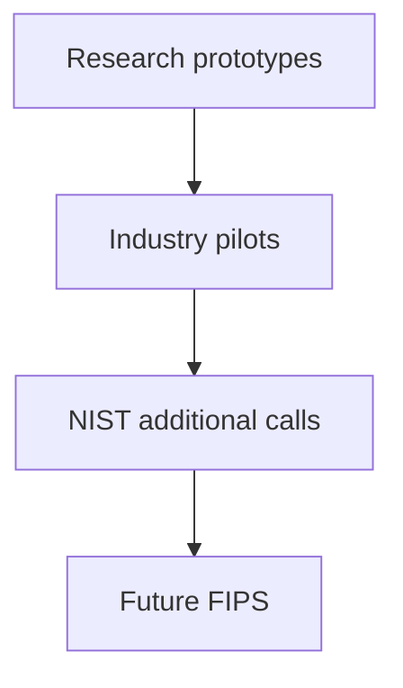

# Chapter 22: Future Directions and Open Problems

Standards froze **first-generation** PQC; research on FHE, ZK, and leaner signatures continues—read this chapter to avoid surprise.

**Figure 22.1 — Research → future standards funnel**

---

## 22.1 The Evolving Landscape

Post-quantum cryptography is not a static field that concluded with the publication of FIPS 203, 204, and 205 in August 2024. Those standards represent a critical milestone — the transition from research to deployment — but they are emphatically a beginning rather than an end. Significant research challenges remain across nearly every dimension of cryptographic science, and the solutions to these challenges will shape the security landscape for decades to come.

The standardized algorithms (ML-KEM, ML-DSA, SLH-DSA) were selected for their combination of security confidence, implementation feasibility, and acceptable performance. But they represent conservative choices along multiple axes — larger key and signature sizes than classical algorithms, performance overhead in constrained environments, and limited support for advanced cryptographic functionalities that the classical world has come to rely upon. The next decade of PQC research will progressively address these limitations, yielding second-generation standards with improved efficiency, new cryptographic capabilities from post-quantum assumptions, and deeper understanding of the security foundations.

We survey the frontiers of PQC research: advanced primitives being built from PQC-hard problems, open problems whose solutions would transform entire application domains, emerging application areas requiring specialized PQC solutions, and the long-term trajectory of the field. For practitioners, We provide a roadmap of what to expect and when. For researchers, it maps the highest-impact open problems where contributions would have disproportionate real-world impact.

**Figure 22.2 — Research to production path**

## 22.2 Advanced Cryptographic Primitives from PQC Assumptions

The hard problems underlying PQC — primarily lattice problems like LWE and Module-LWE — support far richer cryptographic constructions than basic encryption and signatures. The lattice world offers a uniquely powerful algebraic structure that enables advanced primitives that have no practical constructions from classical assumptions like RSA or discrete logarithms.

### Fully Homomorphic Encryption (FHE)

**The vision:** Compute arbitrary functions on encrypted data without ever decrypting it. A hospital could send encrypted patient records to a cloud service that performs medical AI inference without ever accessing the plaintext data. A financial institution could query encrypted databases without exposing query patterns or results to the database operator.

**Current state:**

All practical FHE schemes are lattice-based, making them inherently quantum-resistant. This is not coincidence — the algebraic structure of lattice problems (particularly the "noise growth" properties of LWE) enables the homomorphic operations. Major schemes include:

- **BGV/BFV (Brakerski-Gentry-Vaikuntanathan / Brakerski-Fan-Vercauteren):** Integer arithmetic over finite fields. Suitable for exact computation (database queries, statistics, machine learning on integer data).
- **CKKS (Cheon-Kim-Kim-Song):** Approximate arithmetic over real/complex numbers. Suitable for machine learning inference, signal processing, and scientific computation where small errors are acceptable.
- **TFHE (Torus FHE):** Boolean/small-integer operations with fast bootstrapping. Enables efficient evaluation of arbitrary circuits, though currently limited to small operations per bootstrapping cycle.

Performance has improved by a factor of approximately 1,000,000x over the past decade, from taking hours to evaluate a single AES circuit (2011) to evaluating complex machine learning models in minutes (2024). Real applications are emerging:

- Private database queries (encrypted SQL evaluation)
- Private machine learning inference (encrypted model evaluation)
- Private set intersection (matching encrypted records across organizations)
- Encrypted genomic analysis (querying genetic databases without exposing query or results)
- Financial compliance (anti-money-laundering on encrypted transactions)

Standardization efforts through HomomorphicEncryption.org (an industry-academic consortium) are defining API standards, security parameters, and interoperability requirements.

**Open problems:**

- **Practical performance for general computation:** Current FHE is 10,000-1,000,000x slower than plaintext computation for general programs. Can the gap be reduced to 100x or less? This requires breakthroughs in bootstrapping efficiency, noise management, and compiler optimization.
- **Reducing ciphertext expansion:** FHE ciphertexts are orders of magnitude larger than plaintext (expansion factors of 100-10,000x). Compression techniques exist but add computation; fundamental improvements in expansion ratio would enable new applications.
- **Efficient bootstrapping for deep circuits:** Bootstrapping (refreshing ciphertexts to reduce noise) remains the primary bottleneck. Current approaches require 50-500ms per bootstrap on modern hardware. Can this reach 1ms?
- **Hardware acceleration:** Custom ASIC/FPGA designs for FHE operations (polynomial arithmetic, NTT, modular reduction) could provide 100-1000x speedup over general-purpose CPUs. Several startups and research groups are pursuing this.
- **Multi-key and threshold FHE:** Enabling multiple parties to jointly compute on data encrypted under different keys, without key sharing. Essential for multi-party applications.
- **FHE-friendly machine learning:** Redesigning ML architectures (activation functions, normalization layers) for efficient homomorphic evaluation. Current workarounds (polynomial approximation of ReLU, etc.) lose accuracy; native FHE-friendly designs could eliminate this gap.

### Zero-Knowledge Proofs from PQC Assumptions

Zero-knowledge proofs allow a prover to convince a verifier of a statement's truth without revealing anything beyond the statement's validity. They are foundational to privacy-preserving systems, blockchain scalability, and authenticated credential systems.

**Current state:**

The landscape of post-quantum zero-knowledge proofs has multiple tracks with different trade-offs:

- **Lattice-based ZK proofs:** Direct constructions from LWE/SIS assumptions. Proof sizes remain large (~100 KB to 1 MB for simple statements) due to the geometry of lattice-based commitments and the rejection sampling needed for zero-knowledge. Notable constructions include those based on Lyubashevsky's techniques and more recent approaches using module lattices.

- **Hash-based ZK (STARKs):** Scalable Transparent ARguments of Knowledge use only hash functions (specifically, Merkle trees and polynomial IOPs). Since hash functions are quantum-secure (with doubled output size), STARKs are naturally quantum-safe. Proof sizes are larger than SNARKs (~50-200 KB) but require no trusted setup and no number-theoretic assumptions. StarkWare, Polygon Miden, and others deploy STARKs in production.

- **Lattice-based SNARKs:** Attempts to build succinct proofs from lattice assumptions exist in theory but remain far from practical. The succinctness property (tiny proofs regardless of computation size) is extremely difficult to achieve from lattice assumptions without introducing additional (potentially non-standard) assumptions.

- **Symmetric-key ZK (MPC-in-the-head):** Protocols like Limbo, Banquet, and BBQ construct ZK proofs from symmetric primitives (AES, SHA). Moderate proof sizes (10-100 KB) with fast verification. Quantum-safe under standard assumptions.

**Open problems:**

- **Compact lattice-based ZK proofs (sub-10 KB):** Current lattice-based proofs for meaningful statements require tens to hundreds of kilobytes. Reducing this to sizes comparable with classical Groth16 proofs (~192 bytes) appears impossible from lattice assumptions alone, but achieving sub-10 KB would unlock many applications.
- **Efficient PQC-based anonymous credentials:** Anonymous credential systems (showing you're over 18 without revealing your age, proving group membership without revealing identity) require efficient ZK proofs of credential possession. Current PQC constructions are too large for practical credential use.
- **PQC verifiable computation:** Efficiently proving that a computation was performed correctly on private inputs. Current PQC approaches incur significant overhead compared to the computation itself.
- **Post-quantum privacy-preserving identity systems:** Decentralized identity (DIDs, Verifiable Credentials) built on PQC foundations, enabling selective disclosure and unlinkability without quantum-vulnerable cryptography.
- **Recursive PQC proof composition:** Composing proofs of proofs (essential for blockchain scalability) from quantum-safe assumptions without the pairing-based SNARKs that current recursive systems depend on.

### Multi-Party Computation (MPC)

MPC enables multiple parties to jointly compute a function on their combined private inputs without revealing individual inputs to each other. Applications include private auctions, joint data analysis, and threshold cryptography.

**Current state:**

- **Oblivious Transfer (OT) from lattice assumptions:** OT is the fundamental building block of MPC. Lattice-based OT constructions (from LWE) are efficient and well-studied, providing quantum-safe foundations for general MPC protocols.
- **PQC-based secret sharing:** Verifiable secret sharing schemes from lattice assumptions, enabling threshold operations where a secret is split among parties and can only be reconstructed by qualified subsets.
- **Threshold PQC signatures:** Early constructions of threshold ML-DSA (where signing requires cooperation of t-of-n parties) exist but are not yet standardized or production-ready.
- **Quantum-safe MPC frameworks:** Libraries like MP-SPDZ and SCALE-MAMBA are adding PQC-safe communication channels and authentication, though the core MPC protocols (garbled circuits, secret sharing) don't directly depend on number-theoretic assumptions.

**Open problems:**

- **Round-efficient PQC MPC protocols:** Classical MPC has highly optimized protocols with minimal communication rounds. PQC MPC protocols often require additional rounds due to the structure of lattice-based constructions. Reducing round complexity for PQC MPC would directly improve practical latency.
- **Practical threshold ML-DSA:** Efficient and secure threshold versions of the standardized ML-DSA algorithm, enabling distributed key generation and signing. This is critical for high-security deployments (HSM-backed signing, multi-party authorization) and is actively being researched for standardization.
- **Threshold ML-KEM decapsulation:** Distributing decapsulation across multiple parties so that no single party ever holds the complete private key. Required for secure multi-party key management.
- **PQC-based private set intersection at scale:** Efficiently computing set intersection on millions of elements where communication is encrypted with PQC. Current protocols work at moderate scale but face challenges at the billion-element scale needed for advertising and fraud detection.
- **Quantum-safe covert computation:** Computing on data without even revealing that computation is occurring, using PQC channels for all communication.

### Attribute-Based and Functional Encryption

These advanced encryption paradigms enable fine-grained access control cryptographically, without relying on a trusted central authority for enforcement.

**Attribute-Based Encryption (ABE):** Encrypt data with a policy ("decrypt only if (role=doctor AND department=cardiology) OR role=hospital_admin") and issue keys with attributes. Anyone whose attributes satisfy the policy can decrypt; others learn nothing.

**Functional Encryption (FE):** Issue keys that decrypt to a function of the plaintext rather than the plaintext itself. A "statistics key" might reveal the mean and variance of an encrypted dataset without revealing individual values.

**Current state:**

- Lattice-based ABE constructions exist but are largely theoretical — proof-of-concept implementations demonstrate feasibility but performance is 3-5 orders of magnitude from practical use for real-world policies.
- Inner product functional encryption from LWE is relatively efficient and can support useful computations (weighted sums, simple statistics, linear functions).
- Multi-input functional encryption from lattice assumptions enables computation across ciphertexts encrypted under different keys.
- Predicate encryption from lattice assumptions provides a middle ground between identity-based and attribute-based encryption.

**Open problems:**

- **Efficient ABE for practical policy sizes:** Current lattice-based ABE constructions have ciphertext/key sizes that grow with the complexity of the access policy. For policies involving 50+ attributes (realistic for enterprise access control), sizes become prohibitive. Can we achieve ABE with sizes independent of policy complexity?
- **Unbounded-attribute ABE from lattices:** Constructions that support policies over an unbounded number of attributes (rather than fixing the maximum attribute count at setup time).
- **Functional encryption for general circuits:** FE supporting arbitrary functions (not just linear) from standard lattice assumptions. Current constructions require indistinguishability obfuscation (itself an open problem) or non-standard assumptions.
- **Practical deployment:** Engineering challenges in making lattice ABE/FE practical: key size management, revocation, accountability, and integration with existing access control systems.
- **Decentralized ABE:** Removing the need for a single trusted authority to issue all attribute keys, instead distributing this across multiple authorities.

## 22.3 Signature Aggregation and Compression

### The Problem

PQC signatures are dramatically larger than their classical counterparts:

| Algorithm | Signature Size | Public Key Size | Total (sig + pk) |
|-----------|---------------|-----------------|-------------------|
| ECDSA (P-256) | 64 bytes | 33 bytes | 97 bytes |
| Ed25519 | 64 bytes | 32 bytes | 96 bytes |
| ML-DSA-44 | 2,420 bytes | 1,312 bytes | 3,732 bytes |
| ML-DSA-65 | 3,309 bytes | 1,952 bytes | 5,261 bytes |
| ML-DSA-87 | 4,627 bytes | 2,592 bytes | 7,219 bytes |
| SLH-DSA-128f | 17,088 bytes | 32 bytes | 17,120 bytes |
| FN-DSA-512 | ~666 bytes | ~897 bytes | ~1,563 bytes |

For applications that process or store many signatures, this size increase is a major scalability concern:

- **Blockchain:** Every transaction requires a signature. Bitcoin processes ~500,000 transactions/day; Ethereum processes millions. At ML-DSA-65 sizes, signature data alone would consume 10-50x more storage and bandwidth than current ECDSA signatures.
- **Certificate Transparency:** CT logs store billions of certificates, each containing signatures. Signature size increase directly multiplies storage costs.
- **Code signing:** Software repositories (npm, PyPI, Maven) contain millions of signed packages. Each package may have multiple signatures (publisher, repository, timestamping).
- **IoT sensor data:** Signed sensor readings from millions of devices, transmitted over constrained networks.

### Research Directions

**Aggregate signatures:** Combine n individual signatures into a single compact aggregate signature, verifiable against all n original messages and public keys.

- In the classical world, BLS signatures (based on pairings over elliptic curves) provide elegant aggregation — n signatures compress to a single group element regardless of n. This requires pairing-friendly curves that are quantum-vulnerable.
- In the PQC world, no efficient general aggregation is known for lattice signatures. The fundamental challenge: lattice signatures use rejection sampling (discarding signatures that would leak secret key information), and aggregation must work despite this sampling structure.
- Partial solutions exist: **sequential aggregation** (each signer aggregates with previous aggregate, producing linearly-growing output), **history-free aggregation** for specific structured messages, and **aggregation with logarithmic overhead** from lattice assumptions.
- **Falcon/FN-DSA** signatures have algebraic structure amenable to aggregation research, though no practical construction has been demonstrated.

**Batch verification:** Verify many signatures faster than verifying each individually, without reducing overall signature size.

- ML-DSA supports batch verification through random linear combinations: given signatures σ₁,...,σₙ on messages m₁,...,mₙ, verify a random linear combination in roughly the time of 2-3 individual verifications.
- Speedup: 2-4x for batches of 10+, approaching n/3 amortized cost per signature for large batches.
- Important distinction: batch verification reduces computation but not bandwidth or storage. For bandwidth-constrained applications (blockchain propagation, IoT transmission), signature size remains the binding constraint.

**Structured compact signatures:**

Several signature schemes achieve substantially smaller signatures than ML-DSA, though with different security assumptions or construction complexity:

- **MAYO (multivariate):** ~321 bytes (Level 1 signature), 1,168 bytes (public key). Based on multivariate quadratic equations — different (potentially less studied) hardness assumption than lattice-based schemes.
- **SQISign (isogeny-based):** ~177 bytes (Level 1 signature), 64 bytes (public key). Extremely compact but very slow signing (seconds per signature) and based on supersingular isogeny problems where recent cryptanalysis (SIDH attack of 2022) has reduced confidence in related problems.
- **FN-DSA (lattice, NTRU-based):** ~666 bytes (Level 1 signature), ~897 bytes (public key). Most compact practical lattice-based signature, but implementation complexity (floating-point Gaussian sampling) raises side-channel concerns.
- **HAWK (lattice-based):** Alternative lattice signature design targeting compact sizes while avoiding Gaussian sampling. Under evaluation in NIST Additional Signatures round.
- **UOV (Unbalanced Oil and Vinegar):** Multivariate signature with relatively compact signatures (~96-128 bytes at Level 1) but very large public keys (66-412 KB).

### Open Problems

- **Efficient aggregate signatures from standard lattice assumptions (LWE/SIS):** The most impactful open problem in PQC signatures. A solution providing even n/log(n) compression would transform blockchain scalability, certificate management, and signed-log applications.
- **Compact multi-signatures for blockchain consensus:** Blockchain consensus requires many validators to sign the same block. Can we construct a PQC multi-signature where n validators produce a single compact signature proving majority agreement?
- **Accountable-subgroup multi-signatures:** Multi-signatures where a verifier can determine exactly which subset of signers participated — essential for blockchain slashing (penalizing misbehaving validators).
- **Signature size reduction without weakening assumptions:** Can we achieve sub-1KB signatures from well-studied lattice assumptions at security Level 3? The theoretical minimum signature size from LWE-type assumptions is not known — there may be constructions approaching classical sizes.
- **Cross-scheme aggregation:** Can signatures from different schemes (e.g., ML-DSA and FN-DSA) be aggregated? This would enable migration flexibility in multi-signer applications.
- **Incremental signatures:** Efficiently updating a signature when the message changes slightly, without re-signing from scratch. Useful for signed data structures that evolve over time.

## 22.4 Post-Quantum Blockchain and Distributed Systems

### Challenges

The blockchain and distributed systems community faces unique PQC challenges due to the transparent, immutable, and decentralized nature of these systems:

- **Transaction signature bloat:** Every blockchain transaction includes a signature and often a public key. At ML-DSA-65 sizes (5.2 KB combined), a Bitcoin block with 2,000 transactions would contain 10.4 MB of signature data alone (vs. ~192 KB with ECDSA). This threatens the decentralization properties maintained by block size limits.
- **State growth:** Public keys stored in the UTXO set or account state. Larger keys mean faster state growth, increasing requirements for full node operation and threatening decentralization.
- **Smart contract verification:** On-chain signature verification in smart contracts (Ethereum, Solana) must account for larger input data and higher gas costs for PQC operations.
- **Consensus protocol adaptation:** BFT consensus protocols where validators sign proposals and votes — current protocols assume compact signatures.
- **Address derivation:** Cryptocurrency addresses typically derived from public key hashes. PQC public keys may require different address formats and derivation schemes.
- **Migration complexity:** Existing coins/tokens are controlled by classical keys. Migration requires user action (transferring to PQC-controlled addresses), creating urgency as quantum computers approach.

### Research Directions

- **Hash-based accumulators and commitments:** Merkle trees are already quantum-safe, but more efficient quantum-safe accumulator structures (based on lattice assumptions) could reduce proof sizes for blockchain light clients.
- **PQC-friendly consensus protocols:** Redesigning BFT consensus to minimize the number of signatures per block (leader-based protocols, signature-free sub-protocols) reduces PQC overhead.
- **State compression techniques:** Techniques for managing PQC key/signature bloat: address reuse policies that amortize public key storage, compressed public key representations, and hierarchical key structures.
- **Layer-2 solutions with PQC:** Moving PQC signature verification off-chain (state channels, rollups) where verification cost is less constrained, with only quantum-safe commitments on-chain.
- **Quantum-safe randomness beacons:** Public randomness from PQC assumptions (hash-based VRFs, lattice-based VDFs) enabling fair leader election and verifiable random functions.
- **PQC-based verifiable delay functions (VDFs):** Time-lock puzzles from lattice assumptions enabling sequencing without a trusted authority — critical for some consensus mechanisms.
- **Quantum-safe threshold ECDSA migration:** Bridge protocols allowing gradual migration from ECDSA to PQC by distributing key control across classical and post-quantum systems during transition.
- **Stateless validation with PQC:** Techniques enabling nodes to validate transactions without storing the complete state, reducing the impact of larger PQC state.

### Practical Migration Strategies

Several blockchain networks are actively developing PQC migration approaches:

- **Ethereum:** EIP proposals for PQC account types, research into PQC-friendly hash functions for account abstraction, lattice-based BLS replacement for consensus
- **Bitcoin:** Proposals for PQC signature opcodes, address format extensions, and soft-fork activation paths
- **Algorand:** Falcon-based signature support planned for state proofs
- **QRL (Quantum Resistant Ledger):** Purpose-built quantum-safe blockchain using XMSS (hash-based signatures), serving as a testbed for PQC blockchain design

## 22.5 Lightweight PQC for IoT and Embedded Systems

### Current Constraints

The Internet of Things encompasses billions of devices with severe resource constraints that challenge PQC deployment:

**Memory constraints:**
- Many IoT microcontrollers have 16-64 KB RAM total (ML-KEM-768 key generation alone requires ~12 KB working memory)
- Flash storage often limited to 128-512 KB (must hold firmware, application logic, AND cryptographic code)
- Stack depth limits in RTOS environments restrict algorithm implementations that use deep recursion

**Compute constraints:**
- Clock speeds of 8-100 MHz (ARM Cortex-M0/M3/M4 class)
- No floating-point unit (eliminates naive Gaussian sampling for FN-DSA)
- No hardware multiplication in smallest controllers (impacts polynomial arithmetic)
- Energy budgets of 1-100 µJ per cryptographic operation (battery-powered or energy-harvesting devices)

**Communication constraints:**
- LPWAN (LoRa, Sigfox, NB-IoT): 50-250 bytes per message typical, maximum 256-512 bytes
- BLE: ~244 bytes per packet
- RFID/NFC: 1-4 KB transfer typical
- Duty-cycled radios: Communication time directly costs energy

**Real-time constraints:**
- Industrial control: Cryptographic operations must complete within deterministic time bounds (microseconds to low milliseconds)
- Automotive: Vehicle-to-vehicle communication requires authentication within brake-reaction time
- Medical devices: Pacemaker communication must be responsive within patient-safety bounds

### Research Directions

**Lightweight lattice schemes:**

- **Smaller parameters for lower security requirements:** IoT devices may not need Level 3 or Level 5 security. Level 1 parameters (ML-KEM-512) are significantly smaller and faster, and may be appropriate for devices with short data lifetimes and limited attack exposure.
- **Optimized NTT for small word sizes:** The Number Theoretic Transform (core operation for lattice-based crypto) can be optimized for 16-bit or even 8-bit arithmetic, fitting naturally into small microcontroller ALUs. Research on NTT implementations for ARM Cortex-M0 (no multiplier) and M3/M4 (32-bit multiplier) shows practical performance.
- **Memory-efficient key generation:** Streaming algorithms that generate keys without holding the entire key in RAM simultaneously. Matrix-vector products computed row-by-row to minimize peak memory.
- **Split implementations:** Offloading heavy computation (key generation, decapsulation) to a gateway while keeping lightweight operations (encapsulation) on the constrained device.

**LPN/LWE-based lightweight protocols:**

- **Learning Parity with Noise (LPN):** A simpler assumption than LWE that enables extremely lightweight authentication protocols. HB-family protocols (HB+, HB#, Lapin) provide authentication using only XOR and AND operations.
- **Lightweight key exchange from ring-LPN:** Compressed key exchange suitable for highly constrained devices, trading some security confidence for significant resource savings.
- **Challenge-response with minimal computation:** Authentication protocols where the device's role requires only hash evaluation or simple linear operations, with the server performing heavy lifting.

**Hash-based approaches for constraints:**

- **SPHINCS+ (SLH-DSA) with small parameters:** Hash-based signatures require only hash function evaluation — no polynomial arithmetic, no matrix operations. The trade-off is large signature size (8-17 KB) but the computation uses only SHA-256/SHAKE which is available in hardware on many IoT chips.
- **XMSS/LMS for firmware signing:** Stateful hash-based signatures are ideal for firmware update verification — the signer (manufacturer) manages state, while the verifier (device) only needs to verify, requiring minimal resources.

**Hardware-software co-design:**

- **Minimal crypto accelerators:** Custom hardware blocks for NTT butterfly operations, polynomial multiplication, and Keccak/SHA-3 that fit within the area and power budget of IoT SoCs (< 10,000 gate equivalents).
- **Application-specific instruction set extensions:** Custom instructions for modular reduction, Barrett multiplication, and rejection sampling that accelerate PQC without full dedicated accelerators.
- **Energy-harvesting-compatible operations:** Intermittent computing approaches where cryptographic operations can be suspended and resumed across power cycles (relevant for batteryless RFID tags and energy-harvesting sensors).

### Open Problems

- **ML-KEM on < 16 KB RAM devices:** Can ML-KEM-512 be implemented with a total RAM footprint (stack, heap, buffers) under 16 KB? Current best implementations require approximately 12-15 KB for key generation; further reduction may require algorithmic innovations.
- **PQC authentication for sub-$0.10 chips:** The cheapest IoT chips (RFID tags, simple sensors) cost cents. PQC implementations must fit within the silicon area budget at this price point while providing meaningful security.
- **Battery-less PQC:** Energy-harvesting devices (powered by ambient RF, light, or vibration) have energy budgets of 1-10 µJ per operation. Can any PQC primitive complete within this budget? Hash-based verification may be feasible; key establishment is extremely challenging.
- **PQC in RFID and NFC form factors:** ISO 14443 / 15693 RFID tags have severe constraints on both computation (limited clock cycles available during field exposure) and communication (bitrate and frame sizes). Current PQC parameters exceed what can be transmitted in standard RFID protocol frames.
- **Secure PQC in the presence of side-channels on IoT:** Constrained devices often lack countermeasures (constant-time execution, random delays, masking) due to performance constraints. Implementations that are inherently side-channel resistant (without explicit countermeasures) would be transformative.
- **PQC group key management for sensor networks:** Efficiently managing group keys for thousands of constrained sensors, supporting dynamic join/leave, using PQC for key establishment.

## 22.6 Cryptanalysis: What Could Go Wrong?

The security of post-quantum cryptography ultimately rests on computational hardness assumptions — beliefs that certain mathematical problems cannot be efficiently solved by any algorithm, classical or quantum. These beliefs are supported by decades of study but are not proven (no computational hardness assumption has ever been formally proven, for any cryptographic scheme in use). Vigilant cryptanalysis is essential.

### Potential Threats to Current Standards

**New classical attacks on structured lattices:**

The primary PQC standards (ML-KEM, ML-DSA, FN-DSA) all rely on the hardness of problems over **structured** (module or ideal) lattices — specifically, Module-LWE and Module-SIS. These structured problems offer efficiency advantages over "plain" LWE/SIS but introduce algebraic structure that might be exploitable.

Key concerns:
- Could the ring/module structure of polynomial rings (Zq[x]/(x^n+1)) enable attacks that don't apply to unstructured lattices? The cyclotomic structure provides symmetries (automorphisms, Galois action) that an attacker might exploit.
- What if a sub-exponential classical attack exists for Module-LWE over cyclotomic rings? Such an attack need not be practical today — even a theoretical result would trigger parameter increases or algorithm replacement.
- Could algebraic attacks on NTT-friendly moduli (specifically, moduli chosen for efficient polynomial arithmetic) provide advantages? The choice of modulus q is constrained by NTT requirements, potentially limiting the problem to a structured subset.

**Assessment:** After 20+ years of intensive study by the worldwide cryptographic community (including the multi-year NIST competition where cryptanalysis was explicitly encouraged), no evidence of structural weakness has been found. The gap between structured and unstructured lattice hardness appears negligible in practice. However, impossibility results are rare in cryptanalysis — we cannot prove that such attacks don't exist. SLH-DSA (hash-based) provides insurance, relying only on hash function security.

**Quantum algorithm breakthroughs:**

- Could a quantum algorithm for solving LWE be discovered? Current quantum algorithms provide at most a polynomial speedup over classical lattice algorithms (e.g., quantum sieving reduces the exponent slightly). A super-polynomial quantum speedup would be transformative.
- New quantum algorithmic paradigms beyond Shor's (period-finding) and Grover's (search speedup)? Quantum walk algorithms, variational quantum algorithms, and quantum machine learning approaches to hard problems are all active research areas.
- Quantum lattice reduction improvements? Could quantum computers perform BKZ-style lattice reduction exponentially faster? Current evidence suggests not, but the question is not settled.

**Assessment:** Discovering a quantum algorithm for LWE would require a fundamental breakthrough comparable to Shor's discovery of quantum factoring. Most researchers consider this unlikely within the next two decades but cannot rule it out on principled grounds. The cryptographic community maintains vigilance through active quantum algorithm research and engagement with quantum computing experts.

**Side-channel and implementation attacks:**

- Practical exploitation of timing leaks in ML-KEM decapsulation (despite constant-time requirements, implementation errors persist)
- Power analysis attacks on ML-DSA signing (NTT operations have data-dependent power consumption unless carefully masked)
- Fault injection during ML-KEM key generation (inducing faults to extract secret key information through the failure-boosting technique)
- Electromagnetic emanation analysis of PQC operations on embedded devices
- Combined attacks leveraging both mathematical structure and side-channel information (e.g., using a partial key recovery from side-channels to reduce the lattice problem dimension)
- Cache-timing attacks exploiting memory access patterns in polynomial arithmetic

**Assessment:** Side-channel and implementation attacks are the most likely near-term threats to deployed PQC. Unlike mathematical attacks (which may never materialize), implementation attacks exploit engineering imperfections that are present in real-world code. The CHES community regularly publishes new attacks against PQC implementations, driving continuous improvement in countermeasures. FIPS 140-3 validation increasingly requires side-channel testing.

### Monitoring and Response

The cryptographic community must maintain readiness for algorithm compromise:

**Active cryptanalysis programs:**
- Funding for lattice cryptanalysis research (through NSF, EPSRC, ERC, and agency research programs)
- Regular workshops focused on PQC security assessment (LAC workshops, PQCrypto cryptanalysis sessions)
- Public Lattice Estimator tool maintained and updated with latest attack improvements
- Bug bounty / analysis incentive programs for finding weaknesses in standardized algorithms

**Parameter adjustment capability:**
- NIST standards include multiple parameter sets (Levels 1-5) providing margin for adjustment
- If security margin erosion is detected (e.g., a 20-bit improvement in attack cost), organizations can move to higher parameter sets without algorithm replacement
- Reference implementations and validation systems can quickly update to new parameters

**Algorithm diversity and alternatives:**
- SLH-DSA provides hash-based insurance against lattice compromise (for signatures)
- Code-based encryption (Classic McEliece) standardized as alternative to lattice-based KEM
- Multivariate signatures (under NIST evaluation) provide algebraic diversity
- Multiple independent hard problem families ensure resilience against single-assumption failure

**Rapid response capability:**
- CBOM (Chapter 20) enables immediate impact assessment if an algorithm is compromised
- Cryptographic agility in deployments enables algorithm switching without architectural change
- Hybrid deployments provide inherent protection — both algorithms must be broken simultaneously
- Industry coordination mechanisms (PQC Coalition, NIST alerts) enable coordinated response

## 22.7 Quantum Key Distribution (QKD) vs. PQC

### The Debate

The relationship between QKD and PQC is often framed as competition, but a more nuanced analysis reveals distinct roles for each technology.

**QKD proponents argue:**

- **Information-theoretic security:** QKD security follows from the laws of quantum physics, not computational hardness assumptions. No future mathematical or computational breakthrough (quantum or classical) can break properly implemented QKD.
- **No computational assumptions:** QKD does not depend on any mathematical problem being hard. Even with unlimited computational power (quantum or classical), an eavesdropper cannot obtain the key without detection.
- **Future-proof by physics:** Unlike PQC (which might be broken by future algorithms), QKD security is permanent — the laws of physics do not change.
- **Detection of eavesdropping:** QKD uniquely provides detection of interception attempts, something no computational cryptographic scheme can guarantee.

**PQC proponents argue:**

- **Infrastructure requirements:** QKD requires dedicated quantum hardware (photon sources, single-photon detectors) and optical fiber or free-space quantum channels. This infrastructure costs millions per link and cannot use existing networks.
- **Distance limitations:** Without quantum repeaters (still experimental), QKD links are limited to approximately 100 km over fiber, or ~300 km with satellite-based QKD. This limits practical deployment to point-to-point links.
- **Incomplete security:** QKD provides only key agreement — it cannot authenticate the parties. Authentication requires classical or post-quantum cryptography. QKD also cannot provide signatures, commitments, or other non-key-establishment primitives.
- **Implementation security:** Real QKD implementations have numerous side-channel vulnerabilities (detector blinding, photon-number-splitting, Trojan horse attacks) that compromise the theoretical information-theoretic security.
- **Scalability:** QKD does not scale to the Internet's requirements — billions of endpoints cannot each have dedicated quantum links to every other endpoint.
- **Cost-effectiveness:** PQC runs on existing infrastructure with minimal marginal cost. QKD requires per-link quantum hardware investment.

### Complementary Roles

The mature position recognizes that QKD and PQC serve different niches:

**PQC role — general-purpose quantum-resistant cryptography:**
- All Internet communications (TLS, SSH, IPsec)
- All digital signatures and authentication
- Cloud computing and distributed systems
- Mobile and IoT devices
- Email and messaging encryption
- Any application requiring scalability across billions of endpoints

**QKD role — ultra-high-security point-to-point key establishment:**
- Government/military links between specific high-security facilities
- Financial institution backbone connections (trading centers, data centers)
- Critical infrastructure control channels (power grid, nuclear facilities)
- Scenarios where information-theoretic security justifies infrastructure investment
- Environments where the complete absence of computational assumptions is required by policy

**Hybrid PQC+QKD — maximum security:**
- For the most critical links, combining QKD key material with PQC-established keys provides defense-in-depth: security holds if either QKD physics or PQC hardness assumptions hold.
- Practical in scenarios where QKD infrastructure exists and additional PQC layer adds minimal cost.

### Quantum Internet

The long-term vision for quantum networking extends beyond point-to-point QKD:

**Quantum repeaters:** Devices that extend entanglement over long distances using quantum error correction and entanglement swapping. Current status: laboratory demonstrations of elementary quantum repeater nodes; practical deployment remains 10-20+ years away.

**Quantum network protocols:** Research into network-layer protocols for entanglement distribution, quantum routing, and resource allocation. The quantum Internet will require its own protocol stack, likely building on classical network infrastructure.

**Quantum applications beyond QKD:**
- Distributed quantum computing (linking quantum processors)
- Quantum sensing networks (distributed precision measurement)
- Quantum money and quantum tokens (unforgeable quantum states)
- Blind quantum computation (computing on remote quantum computers without revealing input/output)

**Integration with PQC:** Even in a mature quantum Internet, PQC remains essential:
- Authentication for quantum network participants (QKD cannot authenticate)
- Digital signatures for quantum network management
- Encryption for classical control channels managing quantum infrastructure
- Backward compatibility with classical Internet

**Timeline reality:** Widespread quantum Internet deployment is likely decades away (2050+). QKD networks exist today but serve niche applications. PQC is the practical solution for the 2025-2050+ timeframe and will coexist with quantum networking even after quantum Internet matures.

## 22.8 Post-Quantum Random Oracles and Hash Functions

### Current Understanding

Many PQC security proofs rely on the **Random Oracle Model (ROM)** — an idealization where hash functions are modeled as truly random functions. This simplification enables proofs that would be impossible in the standard model but raises concerns about whether proofs in the ROM translate to security with concrete hash functions.

The **Quantum Random Oracle Model (QROM)** extends this to adversaries that can make quantum superposition queries to the hash function. This is the appropriate model for PQC, since quantum adversaries have quantum access to any function they can compute, including hash functions.

Key issues:

- **QROM vs ROM gap:** Some classical ROM security proofs do not automatically hold in the QROM. The Fujisaki-Okamoto (FO) transform (used to convert CPA-secure KEMs to CCA-secure, as in ML-KEM) has been proven secure in the QROM, but with a security loss compared to the ROM proof. This "tightness gap" means parameters must be slightly larger to achieve the same security level in the QROM.
- **Measure-and-reprogram technique:** A key proof technique for QROM security, enabling simulation of random oracles in quantum settings. Not all classical proof techniques have QROM analogues.
- **Compressed Oracle technique:** Zhandry's compressed oracle provides a different approach to QROM simulation, enabling some proofs that measure-and-reprogram cannot.

### Open Problems

- **Tighter QROM reductions for FO transform:** The current QROM security proof for ML-KEM's FO variant loses a quadratic factor in the number of hash queries. Can this be improved to match the (tight) classical ROM proof? A positive answer would allow smaller ML-KEM parameters at the same security level.
- **Understanding the ROM-to-QROM gap:** Is the gap fundamental (inherent to quantum oracle access) or an artifact of proof techniques? If fundamental, what is the optimal QROM security we can hope for?
- **Standard model PQC constructions:** Can we build efficient PQC KEMs and signatures with proofs that don't rely on random oracle idealization at all? Standard model lattice-based constructions exist but are significantly less efficient than ROM-based ones.
- **Multi-user QROM security:** Security when many users share the same hash function (the real-world setting). Tight multi-user QROM reductions for PQC schemes would validate parameter choices for large-scale deployment.
- **Quantum indifferentiability:** The classical notion of hash function "indifferentiability" (from a random oracle) needs quantum analogues. What properties must a hash function have to securely instantiate a quantum random oracle?

### Hash Function Security Against Quantum Attacks

The security of hash functions in the quantum era goes beyond Grover's search speedup:

- **Are SHA-256 and SHA-3 secure against all quantum attacks?** Grover's algorithm finds preimages in O(2^{n/2}) for n-bit outputs, and birthday-bound collisions cost O(2^{n/3}) quantum queries. But are there structural quantum attacks exploiting the internal construction (Merkle-Damgård for SHA-256, sponge for SHA-3)?
- **Quantum attacks on the sponge construction:** SHA-3 uses the sponge construction over the Keccak permutation. Is the sponge construction optimally secure against quantum adversaries? Research suggests yes (matching known generic bounds) but formal proofs in certain settings remain open.
- **Simon's algorithm and hash function modes:** Simon's algorithm provides exponential speedup for finding periods in functions. Some hash function modes of operation (particularly certain MACs and key derivation functions) may be vulnerable to Simon-type attacks. Identifying and avoiding such constructions is an ongoing concern.
- **Long-term hash function design:** Should we design new hash functions specifically optimized for quantum security? Or are existing designs (with doubled output length) sufficient for all foreseeable quantum threats?
- **Quantum collision resistance lower bounds:** Proving that any quantum algorithm requires at least O(2^{n/3}) queries to find hash collisions. The current best lower bound matches the best upper bound (BHT algorithm), suggesting our understanding is tight for generic attacks.

## 22.9 Formal Verification of PQC Implementations

### The Need

PQC implementations are significantly more complex than classical cryptographic implementations. ML-KEM requires polynomial arithmetic, NTT transforms, compression/decompression, CPA-to-CCA transformation, and constant-time implementation of all operations. ML-DSA adds rejection sampling, hint computation, and matrix operations. This complexity creates a large attack surface for implementation bugs.

Formal verification — mathematically proving that an implementation satisfies its specification — provides the highest assurance that an implementation is correct, constant-time, and memory-safe.

**What formal verification can prove:**

- **Functional correctness:** The implementation produces exactly the outputs specified by the algorithm description for all valid inputs. No edge cases, no off-by-one errors, no arithmetic overflow issues.
- **Constant-time execution:** The control flow and memory access patterns of the implementation do not depend on secret data. This is essential for side-channel resistance but extremely difficult to achieve and verify manually in complex algorithms.
- **Memory safety:** No buffer overflows, use-after-free, or other memory errors that could be exploited for key extraction or code execution.
- **Type safety and API correctness:** The implementation's interface enforces correct usage, preventing API misuse that could compromise security.
- **Protocol-level properties:** For protocols using PQC (like TLS with ML-KEM), formal verification can prove properties like forward secrecy, authentication, and key indistinguishability.

### Current State

**Jasmin:**

Jasmin is a framework for writing formally verified, high-speed assembly implementations of cryptographic algorithms:
- Implementations are written in a domain-specific language that compiles directly to assembly
- The Jasmin compiler is itself formally verified (proven correct in Coq)
- Constant-time property is verified automatically during compilation
- ML-KEM (Kyber) has been implemented and verified in Jasmin for x86-64 and ARM
- ML-DSA implementation work in progress
- Performance matches or exceeds hand-optimized assembly implementations

**EasyCrypt:**

EasyCrypt provides computer-aided cryptographic proofs at the protocol level:
- Proves that a protocol satisfies security definitions (IND-CCA, EUF-CMA, etc.)
- Used to formally verify the security of the ML-KEM FO transform
- Bridges the gap between paper proofs and verified implementations
- Can establish that an implementation correctly instantiates a proven-secure scheme

**F* and HACL*:**

- F* (F-star) is a functional programming language designed for verification
- HACL* is a verified cryptographic library written in F* (targeting C via Kremlin compiler)
- Includes verified implementations of many classical algorithms and is being extended to PQC
- Project Everest: Microsoft-led effort to build a verified TLS implementation including PQC extensions

**Coq/Lean proofs:**

- Mathematical proofs of core PQC algorithm properties (correctness of NTT, security reductions)
- Coq proofs of lattice-based encryption security from standard assumptions
- Lean4 formalization of PQC security theories under development at multiple universities
- Connection to implementation: proving that a mathematical specification matches its code realization

**CryptoLine:**

- Automated tool for verifying arithmetic correctness of cryptographic implementations
- Handles the modular arithmetic, carries, and bounds checking specific to crypto code
- Applied to ML-KEM and ML-DSA arithmetic core verification
- Particularly effective for verifying optimized implementations with non-obvious correctness

### Open Problems

- **Scaling formal verification to full library implementations:** Current verified PQC implementations cover core algorithms but not complete libraries (with key management, serialization, error handling, randomness collection). Verifying a complete, deployable library (comparable to OpenSSL) remains beyond current capabilities.
- **Verified compilation from high-level to constant-time assembly:** Can we verify that a high-level implementation (in C, Rust, or a DSL) compiles to constant-time machine code? Compiler optimizations can violate constant-time properties that exist in source code. The CompCert verified C compiler provides a partial solution but does not guarantee constant-time preservation.
- **Automated side-channel absence proofs:** Current approaches to proving constant-time properties require significant manual effort (annotations, proof guidance). Fully automated tools that can verify arbitrary implementations would dramatically increase deployment of formal verification in practice.
- **Verification of PQC hardware implementations:** Formally verifying that FPGA/ASIC implementations of PQC algorithms are functionally correct and side-channel resistant. Hardware verification is less mature than software verification for cryptographic implementations.
- **Verification of randomness quality:** PQC security critically depends on high-quality randomness for key generation. Formally verifying that a platform's random number generator provides sufficient entropy and is correctly seeded remains challenging, especially on embedded platforms.
- **Compositional verification:** Proving that individually verified components maintain their security properties when composed into a larger system. A verified ML-KEM implementation and a verified TLS state machine should compose into a verified TLS implementation — but compositional proofs are technically challenging.

## 22.10 The Long-Term Cryptographic Landscape

### 2025-2030: The Deployment Era

This phase focuses on deploying standardized PQC across existing infrastructure:

**Protocol integration:** TLS 1.3 with hybrid ML-KEM key exchange becomes standard across web servers and browsers. SSH adopts ML-KEM for key exchange and ML-DSA for host keys. IPsec/IKEv2 adds PQC key exchange through RFC 9370. Email (S/MIME, PGP) begins PQC certificate adoption.

**Hardware acceleration:** Intel, AMD, and ARM ship processors with PQC-relevant instruction extensions (wider NTT units, dedicated polynomial multipliers). HSMs achieve FIPS 140-3 validation for PQC algorithms. Smart card platforms ship with ML-KEM/ML-DSA support.

**Certificate infrastructure migration:** Major Certificate Authorities issue hybrid (classical + PQC) certificates. Root certificate programs (Mozilla, Apple, Microsoft, Google) add PQC CA roots to trust stores. Certificate Transparency logs accommodate larger PQC certificates.

**Regulatory crystallization:** CNSA 2.0 timelines drive defense and intelligence sector compliance. Financial regulators (Basel Committee, SEC, PRA) issue formal PQC requirements. Healthcare (HIPAA) and critical infrastructure regulations updated for quantum risk.

**IoT and embedded solutions:** First-generation IoT devices with PQC support ship. Lightweight PQC protocols standardized for constrained environments. Firmware update signing transitions to PQC (hash-based signatures).

### 2030-2040: The Maturation Era

**PQC-only deployments:** Hybrid modes (classical + PQC) phase out as confidence in PQC algorithms grows. ML-KEM-only and ML-DSA-only deployments become common. Some organizations drop hybrid earlier (Google's approach); regulated sectors maintain hybrid longer (ANSSI's guidance).

**Second-generation PQC standards:** Based on a decade of deployment experience and ongoing research, NIST initiates next-generation standardization. Improved efficiency (smaller keys/signatures), additional capabilities (aggregation, threshold operations), and potentially new mathematical foundations.

**Advanced PQC primitives become practical:**
- FHE reaches 100x slowdown (from current 10,000x), enabling practical private computing
- Zero-knowledge proofs from PQC assumptions become compact enough for credential systems
- Threshold PQC (distributed key management) is standardized and deployed
- Attribute-based encryption from lattices becomes practical for access control

**Quantum computers approach cryptographic relevance:** Systems with thousands of logical qubits (requiring millions of physical qubits with error correction) begin appearing. Estimated capability to break RSA-2048 approaches feasibility. The transition from "threat is theoretical" to "threat is imminent" validates the early migration decisions.

**Cryptanalysis may erode some margins:** A decade of post-standardization analysis may improve attacks by small constant factors, potentially triggering parameter increases for some applications. The algorithm diversity strategy (lattice-based + hash-based + code-based) provides resilience.

### 2040+: The Quantum Era

**Cryptographically-relevant quantum computers exist:** Systems capable of executing Shor's algorithm at scale break RSA, ECDSA, and all classical public-key cryptography. Any data or system not protected by PQC (or other quantum-resistant measures) is immediately vulnerable.

**PQC is standard; pre-PQC is legacy:** Post-quantum cryptography is simply "cryptography" — the qualifier drops away. Legacy classical algorithms (RSA, ECDSA, ECDH) are prohibited in all security-sensitive contexts, similar to how MD5 and DES are viewed today.

**Quantum networking enables new paradigms:** Quantum repeaters enable long-distance entanglement distribution. Quantum Internet protocols provide key establishment with information-theoretic security at scale. Integration of quantum network keys with PQC authentication creates layered security architectures.

**New hard problems may emerge:** Quantum complexity theory may reveal new computational problems that are hard even for quantum computers, enabling new cryptographic constructions with different properties or efficiency profiles.

**Post-quantum computing challenges:** If dramatically more powerful computing paradigms emerge beyond quantum (hypothetical — perhaps thermodynamic computing or other exotic models), the cryptographic community will need to evaluate which current "post-quantum" algorithms remain secure. This is speculative but illustrates that cryptographic evolution is perpetual.

## 22.11 Advice for Researchers

### High-Impact Open Problems

The following problems, if solved, would have immediate and significant real-world impact:

1. **Efficient PQC signature aggregation from standard assumptions:** Combining n ML-DSA or FN-DSA signatures into an aggregate with size sub-linear in n. Impact: enables PQC blockchain scalability, efficient CT logs, IoT data authentication at scale. Difficulty: fundamental — 15+ years of research without breakthrough suggests this may require new techniques.

2. **Compact lattice-based zero-knowledge proofs (sub-10 KB for practical statements):** Impact: enables privacy-preserving PQC identity systems, anonymous credentials, and confidential transactions. Difficulty: significant — current best results are 50-100 KB for simple statements.

3. **Lightweight PQC for extreme constraints (< 8 KB RAM, < 10 µJ/operation):** Impact: enables quantum safety for billions of IoT/RFID/NFC devices. Difficulty: may require fundamentally new protocol designs rather than optimizing existing algorithms.

4. **Tighter security reductions for ML-KEM/ML-DSA in the QROM:** Impact: could allow 20-30% smaller parameters at the same security level, improving performance across all deployments. Difficulty: moderate — incremental improvements are regular; factor-of-2 improvement would be significant.

5. **Better understanding of structured lattice security:** Impact: either increases confidence in current parameters (allowing smaller parameters) or reveals weaknesses (enabling timely response). Difficulty: fundamental — requires deep algebraic geometry and number theory.

6. **Post-quantum anonymous credentials from standard assumptions:** Impact: essential for privacy in a PQC world — digital identity without mass surveillance. Difficulty: builds on compact ZK proofs (problem #2) plus credential-specific constructions.

7. **Hardware-software co-design for PQC acceleration:** Impact: 10-100x speedup for PQC operations, enabling real-time applications and energy-efficient deployment. Difficulty: moderate — requires cross-disciplinary expertise (VLSI design, cryptographic engineering, system architecture).

8. **Formally verified PQC implementations at library scale:** Impact: mathematical guarantees of correctness and side-channel resistance for production deployments. Difficulty: significant — requires advances in verification tool scalability and domain-specific proof automation.

9. **PQC-based threshold signatures with practical efficiency:** Impact: enables distributed signing (HSM clusters, multi-party authorization) essential for high-security deployments. Difficulty: moderate — constructions exist but efficiency is insufficient for production use.

10. **Quantum-safe verifiable random functions (VRFs) with compact proofs:** Impact: enables fair randomness generation for blockchain consensus, lotteries, and leader election without relying on quantum-vulnerable pairings. Difficulty: moderate — hash-based constructions exist but have large proof sizes.

### Underexplored Areas

Several domains offer research opportunities with limited current attention:

- **PQC for emerging computing paradigms:** Edge computing, serverless architectures, confidential computing (SGX/TDX/SEV), and WebAssembly environments each have unique constraints and opportunities for PQC that are underexplored.
- **Post-quantum biometric authentication protocols:** Biometric template protection schemes often rely on discrete-log-based commitments. Quantum-safe biometric authentication combining PQC with template protection is largely unstudied.
- **Quantum-safe secure enclaves and TEEs:** Trusted Execution Environments (Intel SGX, ARM TrustZone, AMD SEV) use cryptographic attestation that must transition to PQC. The interaction between enclave security properties and PQC algorithm requirements is underexplored.
- **PQC in operational technology (OT/ICS/SCADA):** Industrial control systems have 30-year operational lifetimes, real-time constraints, and minimal update capability. PQC solutions for SCADA/ICS environments are critically needed but little-studied.
- **Post-quantum federated learning and AI security:** ML model integrity, federated learning aggregation, and AI watermarking increasingly rely on cryptographic primitives. Quantum-safe versions are needed as AI systems become critical infrastructure.
- **PQC for satellite and space communication:** Satellite systems have unique constraints (radiation hardening, extreme latency, decades-long missions) that affect PQC deployment.
- **Cultural and economic barriers to PQC adoption:** Technical solutions exist, but why is adoption slow? Research into incentive design, organizational behavior, and policy mechanisms could accelerate real-world migration.
- **Post-quantum secure time-stamping:** Long-lived time stamps (for legal documents, intellectual property) must use quantum-safe signatures. Existing time-stamping authorities need transition strategies.

------

## Chapter Summary

**Technical takeaway:** FIPS 203–205 are generation one; FHE, ZK, and leaner signatures remain research-to-product pipelines.

**Deployment takeaway:** Build agility so future algorithm drops do not repeat today's migration pain.

*Figures in this chapter are planning aids—verify all algorithm names and byte sizes against the current NIST FIPS PDF before implementation.*

---
